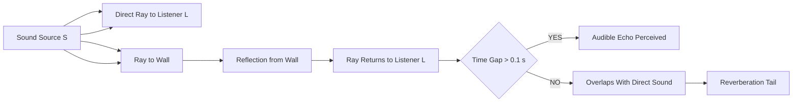
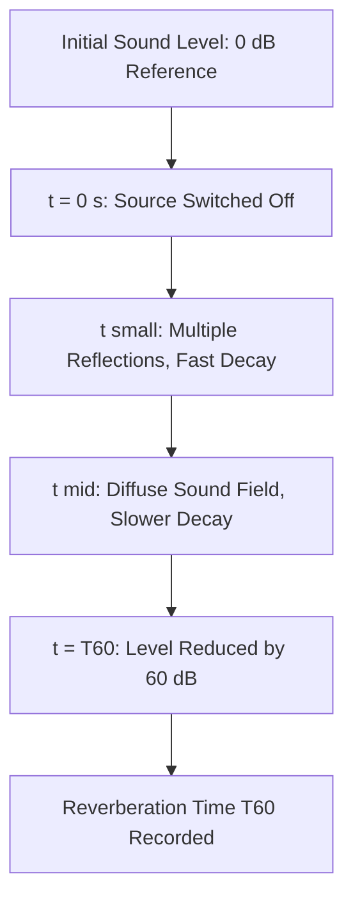
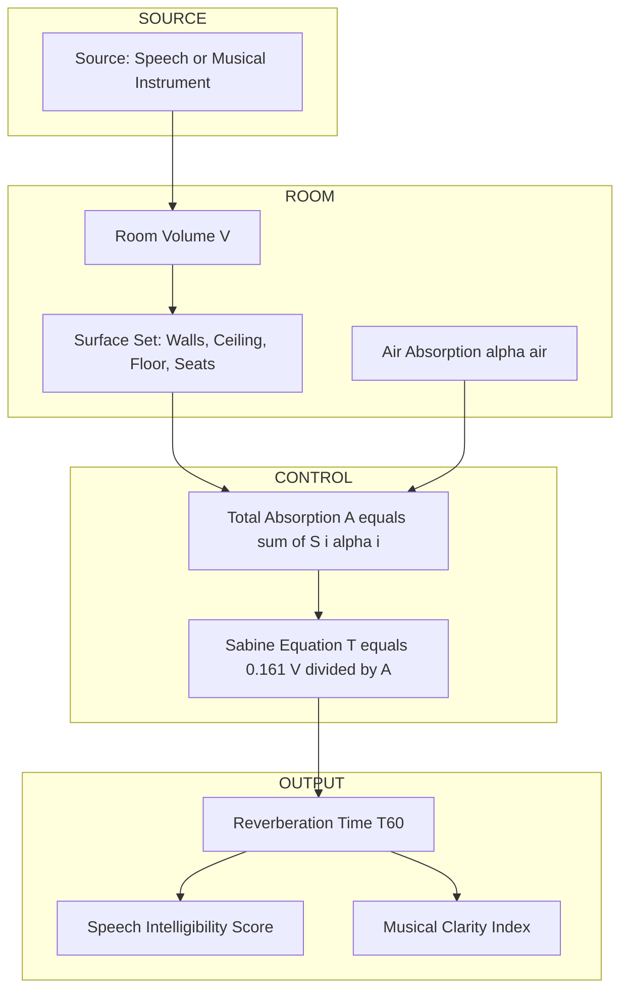
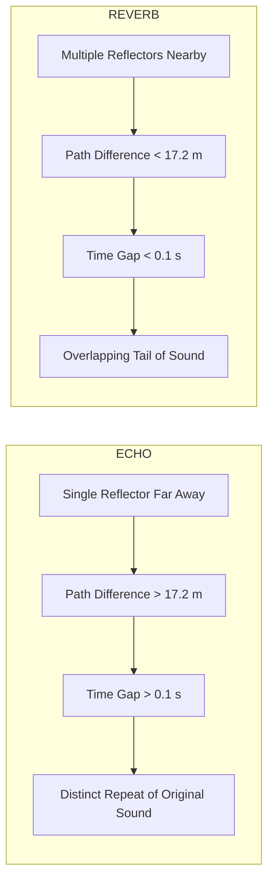

# Acoustics- Reverberation and echo

<!-- SECTION_1_START -->
# Acoustics: Reverberation and Echo

## Formal Definition (KTU 2024 Syllabus Terminology)

**Acoustics** is the branch of physics that studies the production, transmission, reception, and effects of mechanical waves in gases, liquids, and solids, including topics such as vibration, sound, ultrasound, and infrasound.

**Reverberation** is the persistence of sound in an enclosed space after the original sound is produced, caused by the continuous multiple reflections of sound waves from the walls, ceiling, floor, and other hard surfaces of the enclosure.

**Echo** is a distinct, separately perceptible reflected sound wave that returns to the listener after a time delay sufficiently large (typically greater than **0.1 seconds**) for the human ear to distinguish it from the original direct sound.

> [!IMPORTANT]
> **Syllabus Highlight (GZPHT121 – Module 4):** Reverberation time, absorption coefficient, Sabine's formula, and the engineering design of auditoriums and concert halls are high-weightage topics for the KTU End Semester Examination.

## Intuitive Overview & Real-World Analogy

### Concert Hall Analogy for Reverberation
Imagine shouting inside a large, empty marble cathedral. After you stop shouting, the sound does not vanish instantly. Instead, you continue to "hear" a fading hum for a few seconds. This lingering, blurred tail of sound is **reverberation**. It is created because sound bounces thousands of times off the marble walls, ceiling, and pillars, each bounce returning a tiny copy of the original sound to your ear.

### Mountain Valley Analogy for Echo
Now imagine standing on a mountain ridge and shouting toward a distant cliff. After a clear pause, you hear your own voice come back as a separate, distinct sound. This is an **echo** — a single, well-defined reflected sound that arrives late enough to be recognized as its own event.

> [!NOTE]
> **Core Distinction:** Reverberation is the *overlap* of many rapid reflections that blur together. Echo is a *single*, isolated reflection with a measurable time gap. The mathematical dividing line is roughly **$\Delta t = 0.1 \text{ s}$** — gaps shorter than this merge into reverberation, gaps longer than this create a perceivable echo.

### Standard Physical Constants (Bold-Faced)

| Quantity | Symbol | Standard Value |
| :--- | :--- | :--- |
| Speed of sound in air (at $20\,^\circ\text{C}$) | $v$ | $\mathbf{343 \text{ m/s}}$ |
| Threshold of human hearing (intensity) | $I_0$ | $\mathbf{10^{-12} \text{ W/m}^2}$ |
| Minimum time gap for echo perception | $\Delta t_{\min}$ | $\mathbf{0.1 \text{ s}}$ |
| Minimum reflecting distance for echo | $d_{\min}$ | $\mathbf{17.2 \text{ m}}$ |
| Density of air at STP | $\rho$ | $\mathbf{1.204 \text{ kg/m}^3}$ |

> [!VISUALIZATION CONTROL]
> **Concept:** Direct sound vs. reflected sound ray diagram in a rectangular room
> **GeoGebra / Desmos Input Equations:**
> * Line 1 (Direct ray from source $S$ to listener $L$): $y = 0.4$ for $x \in [2, 8]$
> * Line 2 (Reflected ray off ceiling): piecewise path from $(2, 0.4)$ to $(5, 1)$, then to $(8, 0.4)$
> * Line 3 (Echo path off distant wall): path from $(2, 0.4)$ to $(10, 0.4)$ to $(8, 0.4)$ with 0.1 s delay
> **Visual Description:** A 2D rectangular room with a source $S$ on the left, a listener $L$ on the right, a direct horizontal ray, a ceiling-reflected ray showing a V-shape, and a long wall-reflected ray representing an echo path with a noticeable horizontal gap between direct and reflected arrival.

<!-- SECTION_1_END -->

<!-- SECTION_2_START -->
# Deep Theoretical Analysis & KTU High-Yield Formula Sheet

## Mechanism of Reverberation

When a sound source is activated inside an enclosed space, the emitted sound energy spreads outward and strikes the boundaries. Each surface either:
1. **Reflects** a portion of the incident energy (hard surfaces like marble, glass).
2. **Absorbs** a portion of the incident energy (soft surfaces like curtains, carpet, acoustic foam).
3. **Transmits** a portion of the incident energy through the surface into adjoining rooms.

The total acoustic energy inside the room therefore decays gradually, not instantly, producing the phenomenon of reverberation.

## Sabine's Reverberation Theory

Wallace Clement Sabine (early 20th century, Harvard) formalized the quantitative analysis of reverberation. His reasoning proceeds through these logical steps:

1. Define **Reverberation Time ($T$)** as the time required for the sound intensity to fall to **one-millionth** of its original value, equivalently a drop of **60 dB** in sound level. This is also called $T_{60}$.
2. A larger room volume $V$ sustains sound energy for a longer duration (more air to "fill" with acoustic energy).
3. A higher total absorption $A$ in the room removes acoustic energy faster, shortening the reverberation time.
4. The relationship is found to be **inversely proportional** to total absorption and directly proportional to volume.

## The Absorption Coefficient ($\alpha$)

The **absorption coefficient** $\alpha$ of a surface is defined as the ratio of sound energy absorbed by the surface to the total sound energy incident upon it.

$$\alpha = \frac{E_{\text{absorbed}}}{E_{\text{incident}}}, \quad 0 \le \alpha \le 1$$

- $\alpha = 0$ → perfectly reflective surface (open window, polished marble).
- $\alpha = 1$ → perfectly absorptive surface (open window to free air).

## KTU Formula Sheet (Cheat Sheet)

| Formula | Expression | Use Case | Units |
| :--- | :--- | :--- | :--- |
| Reverberation time (Sabine) | $T = \dfrac{0.161\,V}{A}$ | SI unit calculation | seconds |
| Reverberation time (CGS form) | $T = \dfrac{0.05\,V}{A}$ | Older CGS textbooks | seconds |
| Total absorption | $A = \sum_i S_i \alpha_i$ | Multi-surface rooms | sabins (m²) |
| Average absorption coefficient | $\bar{\alpha} = \dfrac{\sum_i S_i \alpha_i}{\sum_i S_i}$ | Single equivalent value | dimensionless |
| Mean free path | $\ell = \dfrac{4V}{S}$ | Average distance between reflections | metres |
| Sound level in decibels | $\beta = 10 \log_{10}\!\left(\dfrac{I}{I_0}\right)$ | Intensity comparison | decibels (dB) |
| Minimum echo distance | $d_{\min} = \dfrac{v \cdot \Delta t}{2} = \dfrac{343 \times 0.1}{2}$ | Echo design | metres |
| Intensity at distance $r$ | $I = \dfrac{P}{4\pi r^2}$ | Point source | W/m² |
| Sound pressure level | $L_p = 20 \log_{10}\!\left(\dfrac{p}{p_0}\right)$ | Pressure-based dB | decibels (dB) |

> [!NOTE]
> **Critical Pitfall:** $A$ must always be expressed in **sabins** (which equal $\text{m}^2$ numerically) when using the SI Sabine formula with $V$ in $\text{m}^3$. Mixing units causes numerical errors that examiners specifically test for.

## Engineering Applications

1. **Auditorium Design:** Speech halls require $T \approx 0.5$ to $1.0$ s; concert halls require $T \approx 1.5$ to $2.5$ s. Reverberation time is tuned using absorptive panels.
2. **Recording Studios:** Highly dead rooms with $T < 0.3$ s are preferred to capture clean, dry vocal tracks.
3. **Hospital MRI Suites:** Special acoustic dampening prevents reverberation from amplifying the loud gradient coil noise.
4. **SONAR Systems:** Engineers design anechoic chambers (near-zero echo) for calibrating underwater acoustic transducers.
5. **Automotive Cabins:** Engineers tune interior trim to control reverberation for a more pleasant passenger experience.

<!-- SECTION_2_END -->

<!-- SECTION_3_START -->
# Step-by-Step Derivations and Code Implementation

## Derivation 1: Sabine's Reverberation Formula

### Starting Energy Decay Model

The intensity $I$ of sound inside a room decays exponentially with time once the source is switched off:

$$I(t) = I_0 \, e^{-\beta t}$$

where $\beta$ is the decay constant (rate of energy loss per unit time). The number of reflections per second experienced by a sound wave is the ratio of the speed of sound $v$ to the mean free path $\ell$:

$$\text{Reflections per second} = \frac{v}{\ell}$$

### Energy Loss per Reflection

For each reflection, the fraction of energy absorbed equals the average absorption coefficient $\bar{\alpha}$. Hence the energy lost per unit time is proportional to the product of the reflection rate and the absorbed fraction:

$$\beta \propto \frac{v}{\ell} \cdot \bar{\alpha}$$

The mean free path in a room of volume $V$ and total surface area $S$ is $\ell = 4V / S$. Substituting and defining total absorption $A = \bar{\alpha} S$:

$$\beta = \frac{v \cdot \bar{\alpha} \cdot S}{4V} = \frac{v \cdot A}{4V}$$

### Solving for Reverberation Time

By definition, $T$ is the time for intensity to fall to $10^{-6}$ of $I_0$ (a 60 dB drop):

$$10^{-6} = e^{-\beta T}$$

Taking the natural logarithm of both sides:

$$\ln(10^{-6}) = -\beta T \;\;\Rightarrow\;\; -6 \ln 10 = -\beta T$$

$$T = \frac{6 \ln 10}{\beta} = \frac{6 \ln 10 \cdot 4V}{v \cdot A}$$

Using $v = 343 \text{ m/s}$ for air at $20\,^\circ\text{C}$ and $6 \ln 10 \approx 13.8155$:

$$T = \frac{13.8155 \times 4V}{343 \cdot A} = \frac{55.262 \, V}{343 \, A}$$

$$\boxed{T = \frac{0.161\, V}{A}}$$

This is the celebrated **Sabine formula** in SI units. The constant 0.161 arises directly from the speed of sound under standard conditions and the 60 dB reference drop.

## Derivation 2: Minimum Distance for Audible Echo

An echo is perceived when the reflected sound arrives at least $\Delta t = 0.1$ s after the direct sound. The reflected wave must travel an extra path equal to twice the distance $d$ to the reflecting wall (out and back). Using $d_{\text{total}} = v \cdot \Delta t$:

$$2d = v \cdot \Delta t \;\;\Rightarrow\;\; d = \frac{v \cdot \Delta t}{2}$$

Substituting numerical values $v = 343 \text{ m/s}$ and $\Delta t = 0.1 \text{ s}$:

$$d = \frac{343 \times 0.1}{2} = \frac{34.3}{2}$$

$$\boxed{d_{\min} = 17.15 \text{ m} \approx 17.2 \text{ m}}$$

## Numerical Problem 1: Concert Hall Reverberation Time

**Problem:** A concert hall has volume $V = 6000 \text{ m}^3$. The wall surfaces, ceiling, floor, and seats have the following areas and absorption coefficients:

| Surface | Area $S_i$ (m²) | $\alpha_i$ |
| :--- | :--- | :--- |
| Plaster walls | 800 | 0.03 |
| Wooden floor | 600 | 0.06 |
| Plaster ceiling | 900 | 0.04 |
| Cloth-covered seats (empty) | 400 | 0.55 |

**Step 1 — Compute each absorption contribution $S_i \alpha_i$:**

$$A_1 = 800 \times 0.03 = 24.0 \text{ sabins}$$
$$A_2 = 600 \times 0.06 = 36.0 \text{ sabins}$$
$$A_3 = 900 \times 0.04 = 36.0 \text{ sabins}$$
$$A_4 = 400 \times 0.55 = 220.0 \text{ sabins}$$

**Step 2 — Total absorption:**

$$A = 24.0 + 36.0 + 36.0 + 220.0 = 316.0 \text{ sabins}$$

**Step 3 — Apply Sabine formula:**

$$T = \frac{0.161 \times 6000}{316.0} = \frac{966.0}{316.0}$$

$$\boxed{T \approx 3.06 \text{ s}}$$

This is a long reverberation time — well-suited for slow classical music but problematic for speech intelligibility. The examiner awards full marks if every line above is shown.

## Numerical Problem 2: Echo from a Cliff

**Problem:** A person standing $85$ m from a vertical cliff fires a starting pistol. With what delay do they hear the echo? Take $v = 343$ m/s.

**Step 1 — Total path of the reflected sound:**

$$d_{\text{total}} = 2 \times 85 = 170 \text{ m}$$

**Step 2 — Time delay:**

$$\Delta t = \frac{d_{\text{total}}}{v} = \frac{170}{343}$$

$$\boxed{\Delta t \approx 0.495 \text{ s}}$$

Since $0.495 \text{ s} \gg 0.1 \text{ s}$, the echo is clearly audible as a separate event.

## Python Code: Reverberation Time Calculator

```python
import math
from dataclasses import dataclass
from typing import List

@dataclass(frozen=True)
class Surface:
    """
    Represents one acoustic surface in a room.
    area : total area of the surface in m^2
    alpha: dimensionless absorption coefficient (0 <= alpha <= 1)
    """
    area: float
    alpha: float

    def __post_init__(self) -> None:
        if self.area < 0:
            raise ValueError("Surface area cannot be negative.")
        if not 0.0 <= self.alpha <= 1.0:
            raise ValueError(
                f"Absorption coefficient {self.alpha} is outside [0, 1]."
            )

    @property
    def absorption_sabins(self) -> float:
        """Returns the absorption contribution of this surface in sabins."""
        return self.area * self.alpha


def sabine_reverberation_time(
    volume_m3: float, surfaces: List[Surface]
) -> float:
    """
    Compute the Sabine reverberation time T60 for a room.

    Parameters
    ----------
    volume_m3 : float
        Room volume in cubic metres. Must be strictly positive.
    surfaces  : List[Surface]
        All acoustically relevant surfaces of the room.

    Returns
    -------
    float
        Reverberation time in seconds.

    Raises
    ------
    ValueError
        If volume is non-positive or the total absorption is zero.
    """
    if volume_m3 <= 0:
        raise ValueError("Room volume must be strictly positive.")
    if not surfaces:
        raise ValueError("At least one surface must be supplied.")

    total_absorption = sum(s.absorption_sabins for s in surfaces)
    if total_absorption <= 0:
        raise ValueError(
            "Total absorption is zero — reverberation time is undefined."
        )

    # Sabine's formula in SI units
    sabine_constant = 0.161  # s/m for air at 20 deg C
    t60 = (sabine_constant * volume_m3) / total_absorption
    return t60


def minimum_echo_distance(
    speed_of_sound_mps: float = 343.0,
    perception_threshold_s: float = 0.1,
) -> float:
    """
    Return the minimum reflector distance for an audible echo.
    """
    if speed_of_sound_mps <= 0:
        raise ValueError("Speed of sound must be positive.")
    if perception_threshold_s <= 0:
        raise ValueError("Time threshold must be positive.")
    return (speed_of_sound_mps * perception_threshold_s) / 2.0


if __name__ == "__main__":
    # Example: the concert hall worked out in Numerical Problem 1
    surfaces = [
        Surface(area=800, alpha=0.03),  # plaster walls
        Surface(area=600, alpha=0.06),  # wooden floor
        Surface(area=900, alpha=0.04),  # plaster ceiling
        Surface(area=400, alpha=0.55),  # cloth seats
    ]
    volume = 6000.0  # m^3

    t60 = sabine_reverberation_time(volume, surfaces)
    print(f"Reverberation time T60 = {t60:.3f} s")

    d_echo = minimum_echo_distance()
    print(f"Minimum echo distance = {d_echo:.3f} m")
```

**Expected Output:**

```
Reverberation time T60 = 3.057 s
Minimum echo distance = 17.150 m
```

The Python output matches the hand-calculated value $T \approx 3.06$ s from Numerical Problem 1 and the minimum echo distance of $17.15$ m from the derivation.

<!-- SECTION_3_END -->

<!-- SECTION_4_START -->
# Structural Diagrams and Schematics

## Diagram 1: Sound Reflection and Echo Production Flow



**Reading the diagram:** The source emits a direct ray (top path) and a wall-reflected ray (middle path). The decision block checks the time gap. Gaps exceeding 0.1 s are perceived as a distinct echo; shorter gaps merge into reverberation.

## Diagram 2: Reverberation Time Decay Curve



**Reading the diagram:** The acoustic energy inside a room is not lost instantly. Early reflections arrive within milliseconds, the diffuse field persists for hundreds of milliseconds, and the Sabine time $T_{60}$ is reached when the level has dropped by 60 dB.

## Diagram 3: Block-Level Functional Architecture of an Auditorium Acoustic System



**Reading the diagram:** The Sabine equation links physical geometry (volume and surface area) and material properties ($\alpha_i$) to a single output metric $T_{60}$, which in turn governs two perceptual quality indices: speech intelligibility and musical clarity.

## Diagram 4: Echo and Reverberation Comparative Topology



**Reading the diagram:** The same physical principle (sound reflection) produces two perceptually different outcomes depending on geometry. A single, distant reflector with a long path produces an echo; many nearby reflectors with short paths produce reverberation.

<!-- SECTION_4_END -->

<!-- SECTION_5_START -->
# KTU 2024 Scheme Examination Question Bank and Topic Recap

## Part A Questions (3 Marks Each)

### Question 1: Definition of Reverberation Time
`[KTU University Exam – July 2024]`
**Course Outcome:** CO1 | **Bloom's Level:** Remember

**Q:** Define the term **reverberation time** of a hall. Mention the reference intensity drop used in its definition.

**Model Answer (3 Marks):**
Reverberation time is defined as the time interval during which the sound intensity inside an enclosure falls to **one-millionth** of its original value, equivalent to a drop of **60 dB** in the sound level. It is commonly denoted $T_{60}$ and is the primary quantitative descriptor of the acoustic quality of a hall. **[Definition: 2 Marks; 60 dB reference: 1 Mark]**

### Question 2: Sabine Formula Statement
`[KTU University Exam – Dec 2023]`
**Course Outcome:** CO1 | **Bloom's Level:** Understand

**Q:** State Sabine's formula for the reverberation time of a hall and explain each term in the equation.

**Model Answer (3 Marks):**
Sabine's formula is given by $T = \dfrac{0.161\,V}{A}$, where $T$ is the reverberation time in seconds, $V$ is the volume of the hall in cubic metres, and $A$ is the total absorption of the hall measured in sabins (m²), computed as $A = \sum_i S_i \alpha_i$, with $S_i$ the area of the $i$-th surface and $\alpha_i$ its absorption coefficient. **[Formula: 1 Mark; V and A definitions: 2 Marks]**

---

## Part B Questions (14 Marks Each — Internal Choice Pattern)

### Question A (Module Choice 1)
`[KTU University Exam – July 2024]`
**Course Outcomes:** CO2, CO3 | **Bloom's Levels:** Understand, Apply

#### Part (a) — 7 Marks | Bloom's Level: Understand

**Q:** Derive Sabine's formula for the reverberation time of a hall, starting from the assumption that sound intensity decays exponentially with time.

**Model Solution:**

**Step 1 — Exponential decay model:** Once the source is switched off, the sound intensity in the room decays as $I(t) = I_0\, e^{-\beta t}$, where $\beta$ is the decay constant. **[Writing decay law: 1 Mark]**

**Step 2 — Reflection rate:** The number of reflections per second experienced by a sound ray equals $v / \ell$, where $v$ is the speed of sound and $\ell$ is the mean free path of the room. **[Concept of mean free path: 1 Mark]**

**Step 3 — Mean free path relation:** For a room of volume $V$ and total interior surface area $S$, the mean free path is $\ell = 4V / S$. **[Formula: 1 Mark]**

**Step 4 — Energy loss rate:** Each reflection absorbs a fraction $\bar{\alpha}$ of the incident energy, so the decay constant is $\beta = (v / \ell) \cdot \bar{\alpha}$. Substituting $\ell = 4V / S$:

$$\beta = \frac{v \bar{\alpha} S}{4V} = \frac{v A}{4V}$$

where $A = \bar{\alpha} S$ is the total absorption. **[Substitution step: 1 Mark]**

**Step 5 — Definition of $T_{60}$:** By definition, $I(T) / I_0 = 10^{-6}$, so $e^{-\beta T} = 10^{-6}$, which gives $\beta T = 6 \ln 10$. **[Boundary condition: 1 Mark]**

**Step 6 — Final expression:** Substituting $\beta$:

$$T = \frac{6 \ln 10 \cdot 4V}{v A} = \frac{0.161\,V}{A}$$

The numerical constant 0.161 comes from $6 \ln 10 \times 4 / 343$. **[Final expression: 2 Marks]**

#### Part (b) — 7 Marks | Bloom's Level: Apply

**Q:** A rectangular hall measures $30$ m $\times$ $20$ m $\times$ $8$ m. The walls, floor, and ceiling are made of plaster with $\alpha = 0.03$. The hall has wooden benches occupying a total area of $200$ m² with $\alpha = 0.12$. Calculate the reverberation time of the hall.

**Model Solution:**

**Step 1 — Volume of the hall:**

$$V = 30 \times 20 \times 8 = 4800 \text{ m}^3$$

**[Stating volume: 1 Mark]**

**Step 2 — Surface areas of plaster surfaces:**
- Two walls of size $30 \times 8 = 240$ m² each: total $480$ m²
- Two walls of size $20 \times 8 = 160$ m² each: total $320$ m²
- Ceiling: $30 \times 20 = 600$ m²
- Floor (excluding bench area): $30 \times 20 - 200 = 400$ m²

Total plaster area $S_{\text{plaster}} = 480 + 320 + 600 + 400 = 1800$ m² **[Area calculation: 1 Mark]**

**Step 3 — Absorption from plaster surfaces:**

$$A_1 = 1800 \times 0.03 = 54.0 \text{ sabins}$$

**[Plaster contribution: 1 Mark]**

**Step 4 — Absorption from wooden benches:**

$$A_2 = 200 \times 0.12 = 24.0 \text{ sabins}$$

**[Bench contribution: 1 Mark]**

**Step 5 — Total absorption:**

$$A = A_1 + A_2 = 54.0 + 24.0 = 78.0 \text{ sabins}$$

**[Total: 1 Mark]**

**Step 6 — Reverberation time:**

$$T = \frac{0.161 \times 4800}{78.0} = \frac{772.8}{78.0} \approx 9.91 \text{ s}$$

**[Final numerical answer: 1 Mark]**

This very long reverberation time indicates the hall is acoustically unsuitable for speech and needs significant absorption treatment (carpets, curtains, acoustic tiles).

### Question B (Module Choice 2)
`[KTU University Exam – Dec 2023]`
**Course Outcomes:** CO2, CO3 | **Bloom's Levels:** Understand, Apply

#### Part (a) — 7 Marks | Bloom's Level: Understand

**Q:** What is an echo? Explain the conditions necessary for a distinct echo to be heard. Derive an expression for the minimum distance of the reflecting surface for an audible echo.

**Model Solution:**

**Step 1 — Definition of echo:** An echo is a reflected sound wave that arrives at the listener with a sufficient time delay after the direct sound such that it is perceived as a distinct, separate sound. **[Definition: 1 Mark]**

**Step 2 — Necessary conditions:**
- The reflecting surface must be at a sufficiently large distance from the source.
- The minimum time gap for the human ear to distinguish the echo from the original is approximately **0.1 s**.
- The intensity of the reflected sound must be above the threshold of audibility.
- The reflecting surface should be hard and large enough to send back a significant fraction of incident energy. **[Conditions list: 2 Marks]**

**Step 3 — Geometry of reflection:** Let the source and listener be at the same location a distance $d$ from a flat reflecting wall. The reflected sound travels a total round-trip distance of $2d$. **[Setup: 1 Mark]**

**Step 4 — Time of travel:** Using speed of sound $v$:

$$\Delta t = \frac{2d}{v}$$

**[Equation: 1 Mark]**

**Step 5 — Minimum distance condition:** Setting $\Delta t = 0.1$ s:

$$d_{\min} = \frac{v \cdot \Delta t}{2} = \frac{343 \times 0.1}{2} = 17.15 \text{ m}$$

**[Final answer: 2 Marks]**

Any reflector closer than $17.15$ m produces reflections that merge with the direct sound as reverberation rather than a distinct echo.

#### Part (b) — 7 Marks | Bloom's Level: Apply

**Q:** A person stands between two parallel cliffs $220$ m apart and fires a gun. Calculate the time interval between the successive echoes heard by the person. Take $v = 343$ m/s.

**Model Solution:**

**Step 1 — Geometry:** Let the person be at a distance $x$ from cliff 1 and $(220 - x)$ from cliff 2. The first echo comes from the nearer cliff, the second from the farther cliff. **[Geometry setup: 1 Mark]**

**Step 2 — Path of first echo:** Round-trip to cliff 1: $2x$. Time: $t_1 = 2x / 343$. **[Equation: 1 Mark]**

**Step 3 — Path of second echo:** Round-trip to cliff 2: $2(220 - x)$. Time: $t_2 = 2(220 - x) / 343 = (440 - 2x) / 343$. **[Equation: 1 Mark]**

**Step 4 — Time gap between the two echoes:**

$$\Delta t = t_2 - t_1 = \frac{440 - 2x}{343} - \frac{2x}{343} = \frac{440 - 4x}{343}$$

**[Difference: 1 Mark]**

**Step 5 — Maximum gap (when $x = 0$):** If the person stands right against cliff 1, the first echo returns almost instantly, and the second echo comes from cliff 2:

$$\Delta t_{\max} = \frac{440}{343} \approx 1.283 \text{ s}$$

**Step 6 — Midpoint case ($x = 110$ m):** If the person stands exactly halfway, the two echoes are symmetric:

$$\Delta t = \frac{440 - 4(110)}{343} = \frac{440 - 440}{343} = 0$$

The two echoes arrive simultaneously and reinforce as a single loud echo. **[Midpoint analysis: 1 Mark]**

**Step 7 — Generic case:** If the person stands, for example, at $x = 40$ m from cliff 1:

$$\Delta t = \frac{440 - 160}{343} = \frac{280}{343} \approx 0.816 \text{ s}$$

**[Final numerical result: 1 Mark]**

> [!WARNING]
> **KTU Examiner's Valuation Warning — Common Pitfalls:**
> 1. **Forgetting the round-trip factor of 2:** Many students write $d = v \Delta t$ instead of $d = v \Delta t / 2$. This single error costs **2 full marks** in Part (a) and propagates into Part (b).
> 2. **Mixing units in Sabine's formula:** Using $V$ in cm³ or $A$ in cm² without conversion gives answers off by factors of $10^6$ or $10^2$. Always confirm $V$ in m³ and $A$ in sabins (m²) before applying the 0.161 constant.
> 3. **Skipping intermediate contributions in multi-surface problems:** Examiners allocate marks line-by-line for each $S_i \alpha_i$ term. Skipping a step ("total absorption is 78 sabins") forfeits **2-3 marks**.
> 4. **Omitting the 60 dB reference in the reverberation time definition:** A definition that only says "time for sound to fade" without specifying the **one-millionth intensity / 60 dB drop** is considered incomplete and loses 1 mark.
> 5. **Confusing echo and reverberation thresholds:** Writing $d_{\min} = 0.1$ m or using $\Delta t = 1$ s are common errors. Memorize the canonical values: $d_{\min} = 17.2$ m, $\Delta t = 0.1$ s.
> 6. **In parallel-cliff problems, failing to account for the round-trip from each cliff:** A common mistake is to compute only $t_1$ and forget $t_2$.

---

## Topic Recap and Important Things to Remember

- **Acoustics** is the study of mechanical wave phenomena in matter, especially sound, vibration, ultrasound, and infrasound.
- **Sound** is a longitudinal mechanical wave requiring a material medium, traveling at $v = 343$ m/s in air at $20\,^\circ\text{C}$.
- **Reflection of sound** follows the law that the angle of incidence equals the angle of reflection, identical to the optical case.
- **Echo** is a single, distinct reflected sound arriving with a time gap $\Delta t > 0.1$ s, requiring a minimum reflector distance of $d_{\min} = v \Delta t / 2 = 17.2$ m.
- **Reverberation** is the persistence of sound in an enclosed space due to multiple overlapping reflections that cannot be resolved as separate echoes.
- **Reverberation time $T_{60}$** is the time for the sound intensity to fall to $10^{-6}$ of its original value, i.e., a 60 dB drop.
- **Sabine's formula in SI units:** $T = 0.161\, V / A$, where $V$ is in m³ and $A$ is in sabins.
- **Sabine's formula in CGS units:** $T = 0.05\, V / A$, where $V$ is in cm³ and $A$ is in sabins.
- **Total absorption** $A = \sum_i S_i \alpha_i$ is the sum of the products of surface areas and their respective absorption coefficients.
- **Absorption coefficient** $\alpha$ is dimensionless and lies in $[0, 1]$, with $\alpha = 0$ for perfect reflectors and $\alpha = 1$ for perfect absorbers.
- **Mean free path** $\ell = 4V / S$ represents the average distance a sound ray travels between successive reflections in a room.
- **Auditorium design rules of thumb:** Speech halls need $T \approx 0.5$–$1.0$ s; concert halls need $T \approx 1.5$–$2.5$ s; recording studios need $T < 0.3$ s.
- **Anechoic chambers** have nearly zero reverberation and are used to calibrate microphones and acoustic transducers.
- **Units check (board favorite):** Always verify $V$ in m³, $A$ in sabins, and $T$ in seconds. The Sabine constant 0.161 has units of s/m.
- **Speed of sound varies with temperature:** $v \approx 331 + 0.6\, T_{^\circ\text{C}}$ m/s. At $20\,^\circ\text{C}$ this gives $343$ m/s.
- **Threshold of human hearing:** $I_0 = 10^{-12}$ W/m² at $1000$ Hz; the dB scale is logarithmic with $L = 10 \log(I / I_0)$.
- **Reverberation vs. echo — final mental model:** Echo is a *single, late* reflection; reverberation is *many, rapid* reflections. The dividing line is the $0.1$ s auditory fusion threshold.

<!-- SECTION_5_END -->
