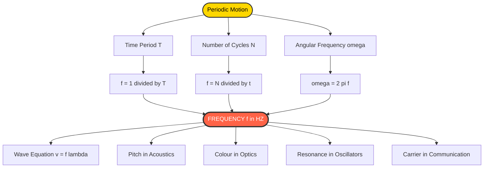
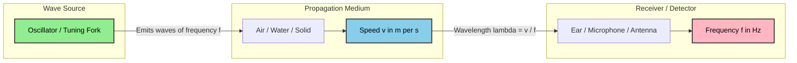
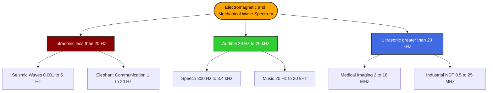

# Concept of frequency

<!-- SECTION_1_START -->
# Concept of Frequency

## 1.1 Formal Definition (KTU 2024 Syllabus Terminology)

> [!IMPORTANT]
> **Frequency ($f$)** is defined as the **number of complete oscillations (or cycles) of a periodic phenomenon occurring per unit time**. It is the fundamental quantity that quantifies *how rapidly* a wave or vibrating system repeats its state.

Mathematically, for a periodic event with period $T$:

$$f = \frac{1}{T} = \frac{N}{t}$$

where:
- $N$ = number of complete cycles
- $t$ = total time taken in seconds
- $T$ = time period (duration of one cycle)

The **SI unit of frequency is the Hertz (Hz)**, named in honour of the German physicist **Heinrich Rudolf Hertz**. One **Hertz** is equivalent to **one cycle per second** ($1 \text{ Hz} = 1 \text{ s}^{-1}$). Higher-order multiples such as **kilohertz ($1 \text{ kHz} = 10^3 \text{ Hz}$)**, **megahertz ($1 \text{ MHz} = 10^6 \text{ Hz}$)**, **gigahertz ($1 \text{ GHz} = 10^9 \text{ Hz}$)**, and **terahertz ($1 \text{ THz} = 10^{12} \text{ Hz}$)** are routinely used in acoustics, communications, and optics.

**Dimensional formula:**

$$[f] = \text{M}^0 \text{L}^0 \text{T}^{-1}$$

## 1.2 Conceptual Analogy & Intuition

> [!NOTE]
> **Analogy — The Metronome of Nature**
> Imagine you are clapping your hands in a steady rhythm — once every half-second. In one second, you complete **2 claps**. That number (2) is your clapping *frequency*, and 0.5 s is the *time period*. Frequency answers the question: **"How many times does the event happen per second?"**

**Geometric Intuition:** Picture a pendulum swinging back and forth. If you count **30 complete swings in 60 seconds**, its frequency is $0.5 \text{ Hz}$. The faster the pendulum oscillates, the higher its frequency. This is true for *all* wave-like phenomena: sound waves, light waves, ocean waves, AC electrical signals, and even quantum wave functions.

In acoustics specifically, frequency directly determines the **pitch** of a sound:
- **Low frequency** $\rightarrow$ **Bass** (deep, rumbling tones)
- **High frequency** $\rightarrow$ **Treble** (sharp, piercing tones)

| Range | Frequency Band | Common Source |
|---|---|---|
| **Infrasound** | $< 20 \text{ Hz}$ | Earthquakes, elephant calls |
| **Audible Sound** | $20 \text{ Hz} - 20 \text{ kHz}$ | Human voice, musical instruments |
| **Ultrasound** | $> 20 \text{ kHz}$ | Bat echolocation, medical sonography |

> [!VISUALIZATION CONTROL]
> **Concept:** Sinusoidal wave whose frequency changes while amplitude is held constant.
> **GeoGebra / Desmos Input Equations:**
> * `f1(x) = sin(2 * pi * 1 * x)` — wave at 1 Hz
> * `f2(x) = sin(2 * pi * 2 * x)` — wave at 2 Hz
> * `f3(x) = sin(2 * pi * 3 * x)` — wave at 3 Hz
> **Visual Description:** The student should observe three sine curves on the same x-axis (time). The 3 Hz wave completes three full oscillations in the time the 1 Hz wave completes one, demonstrating the inverse relationship between period and frequency.
<!-- SECTION_1_END -->

<!-- SECTION_2_START -->
# 2. Deep Theoretical Analysis & KTU High-Yield Formula Sheet

## 2.1 Operational Breakdown of the Concept

The notion of *frequency* rests on three inseparable pillars. Understanding each is mandatory for KTU-level problem solving.

**Pillar 1 — Periodicity**
A physical quantity $y(t)$ is *periodic* if it satisfies $y(t+T) = y(t)$ for all $t$, where the smallest positive $T$ is the **time period**. Examples: a swinging pendulum, AC mains voltage, vibration of a tuning fork.

**Pillar 2 — Counting Cycles**
Once periodicity is established, the *number of complete cycles* $N$ executed in a time interval $\Delta t$ can be measured. Each cycle begins and ends at the *same phase* (e.g., a crest-to-crest interval in a transverse wave).

**Pillar 3 — Rate of Repetition**
Frequency is the *rate* at which cycles accumulate. Mathematically this is the limit of $N/\Delta t$ as $\Delta t$ approaches one second, recovering the definition $f = 1/T$.

### 2.1.1 Why Frequency is a *Scalar* and a *Kinematic* Quantity

Frequency carries only **magnitude**, never direction (it is a *true scalar*). It is a *kinematic* descriptor — it tells us **how the system moves in time** but nothing about *why* it moves (that is the role of dynamics, governed by force laws like Hooke's law or Newton's second law).

### 2.1.2 Angular Frequency — The Hidden Companion

In circular and oscillatory motion, frequency is intimately tied to **angular frequency** $\omega$, which measures the rate of change of phase in *radians per second*:

$$\omega = 2\pi f = \frac{2\pi}{T}$$

This is essential when writing the general equation of a simple harmonic wave:

$$y(x, t) = A \sin(kx - \omega t + \phi)$$

where $k$ is the angular wavenumber and $\phi$ is the initial phase.

## 2.2 KTU Formula Sheet (Exam-Ready Cheat Sheet)

> [!IMPORTANT]
> Memorise this table verbatim. Every KTU question on frequency in waves/acoustics reduces to one or more of these relations.

| # | Formula | Description | Typical Units |
|:---:|:---|:---|:---|
| 1 | $f = \dfrac{1}{T}$ | Frequency is reciprocal of time period | $\text{Hz}$ |
| 2 | $f = \dfrac{N}{t}$ | Number of cycles per unit time | $\text{Hz}$ |
| 3 | $\omega = 2\pi f$ | Angular frequency in radians per second | $\text{rad/s}$ |
| 4 | $v = f \lambda$ | Wave speed equals frequency times wavelength | $\text{m/s}$ |
| 5 | $\lambda = \dfrac{v}{f}$ | Wavelength in terms of speed and frequency | $\text{m}$ |
| 6 | $f = \dfrac{v}{\lambda}$ | Frequency in terms of speed and wavelength | $\text{Hz}$ |
| 7 | $f_n = \dfrac{n v}{2L}$ | Harmonics in a string fixed at both ends (n-th mode) | $\text{Hz}$ |
| 8 | $f_n = \dfrac{(2n-1) v}{4L}$ | Odd harmonics in a pipe closed at one end | $\text{Hz}$ |
| 9 | $f' = f \left(\dfrac{v \pm v_o}{v \mp v_s}\right)$ | Doppler-shifted frequency | $\text{Hz}$ |
| 10 | $L = 10 \log_{10}\!\left(\dfrac{I}{I_0}\right)$ | Sound level in decibels (frequency-independent) | $\text{dB}$ |

> [!NOTE]
> **Engineering Utility** — Frequency is the *universal currency* of signal processing. In medical ultrasound (2–18 MHz), the higher the frequency, the finer the spatial resolution but the lower the tissue penetration. In 5G telecommunications, carrier frequencies around 28 GHz and 39 GHz are used for high-bandwidth millimetre-wave communication. In seismology, the P-wave and S-wave frequencies of an earthquake (typically 0.1–10 Hz) determine the structural response of buildings.
<!-- SECTION_2_END -->

<!-- SECTION_3_START -->
# 3. Step-by-Step Derivations & Symbolic Implementation

## 3.1 Derivation: Relationship between Frequency and Time Period

**Starting Premise:** Consider a particle executing simple harmonic motion. Its displacement from equilibrium is given by

$$y(t) = A \sin(\omega t + \phi)$$

**Step 1 — Identify one complete cycle.**
A complete oscillation corresponds to the phase increasing by $2\pi$ radians. That is, if the particle is at phase $\theta_1 = \omega t_1 + \phi$ at time $t_1$, it returns to the *same phase* when

$$\omega t_2 + \phi = \omega t_1 + \phi + 2\pi$$

**Step 2 — Solve for the time interval.**
Subtracting $\omega t_1 + \phi$ from both sides:

$$\omega(t_2 - t_1) = 2\pi$$

Let $\Delta t = t_2 - t_1$ be the time taken for one complete cycle. By definition, this is the **time period** $T$:

$$T = \frac{2\pi}{\omega}$$

**Step 3 — Convert to frequency.**
Since $\omega = 2\pi f$:

$$T = \frac{2\pi}{2\pi f} = \frac{1}{f}$$

**Final boxed result:**

$$\boxed{\,f = \frac{1}{T}\,}$$

> **Valuation Note:** Always state the assumption of *periodicity* and the use of $2\pi$ radians per cycle. KTU examiners award full marks only when both are mentioned.

## 3.2 Derivation: The Fundamental Wave Equation $v = f \lambda$

**Starting Premise:** A wave travels a distance of one full wavelength $\lambda$ in exactly one time period $T$.

**Step 1 — Express the distance covered in one period.**
By the definition of speed:

$$v = \frac{\text{distance}}{\text{time}} = \frac{\lambda}{T}$$

**Step 2 — Substitute the period in terms of frequency.**
Using $T = 1/f$ from the previous derivation:

$$v = \frac{\lambda}{1/f} = \lambda \cdot f$$

**Final boxed result:**

$$\boxed{\,v = f \lambda\,}$$

> [!IMPORTANT]
> This single equation is the most-tested relation in the entire acoustics module. In KTU valuation, students often lose 1 mark by forgetting to write the units explicitly (e.g., $\text{m/s}$ for $v$, $\text{m}$ for $\lambda$, $\text{Hz}$ for $f$).

## 3.3 Numerical Worked Example (Board-Standard)

> **Problem:** A source emits a sound wave of wavelength $0.5 \text{ m}$ that travels through air at $v = 340 \text{ m/s}$. Calculate (a) the frequency, (b) the time period, and (c) the angular frequency.

**Given Data:**
- Wavelength $\lambda = 0.5 \text{ m}$
- Speed of sound in air $v = 340 \text{ m/s}$

**Part (a) — Frequency:**

$$f = \frac{v}{\lambda} = \frac{340 \text{ m/s}}{0.5 \text{ m}} = 680 \text{ Hz}$$

**Part (b) — Time Period:**

$$T = \frac{1}{f} = \frac{1}{680} \approx 1.47 \times 10^{-3} \text{ s} = 1.47 \text{ ms}$$

**Part (c) — Angular Frequency:**

$$\omega = 2\pi f = 2 \times 3.14159 \times 680 \approx 4272.6 \text{ rad/s}$$

## 3.4 Python Implementation — Frequency Counter Simulation

```python
import numpy as np
import matplotlib.pyplot as plt
from typing import Tuple

def compute_frequency(wavelength_m: float, speed_mps: float) -> Tuple[float, float, float]:
    """
    Computes frequency, time period, and angular frequency
    for a travelling wave.

    Parameters
    ----------
    wavelength_m : float
        Wavelength of the wave in metres (must be > 0).
    speed_mps : float
        Wave speed in metres per second (must be > 0).

    Returns
    -------
    Tuple[float, float, float]
        (frequency_Hz, time_period_s, angular_freq_rad_per_s)
    """
    if wavelength_m <= 0 or speed_mps <= 0:
        raise ValueError("Wavelength and speed must be strictly positive.")

    frequency_hz: float = speed_mps / wavelength_m
    time_period_s: float = 1.0 / frequency_hz
    angular_freq: float = 2.0 * np.pi * frequency_hz

    return frequency_hz, time_period_s, angular_freq


def plot_three_frequencies() -> None:
    """Plots three sinusoids of frequencies 1 Hz, 2 Hz, and 3 Hz."""
    t: np.ndarray = np.linspace(0.0, 2.0, 1000)
    f1, f2, f3 = 1.0, 2.0, 3.0

    y1: np.ndarray = np.sin(2.0 * np.pi * f1 * t)
    y2: np.ndarray = np.sin(2.0 * np.pi * f2 * t)
    y3: np.ndarray = np.sin(2.0 * np.pi * f3 * t)

    plt.figure(figsize=(9, 5))
    plt.plot(t, y1, label=f"{f1} Hz", linewidth=2)
    plt.plot(t, y2, label=f"{f2} Hz", linewidth=2)
    plt.plot(t, y3, label=f"{f3} Hz", linewidth=2)
    plt.xlabel("Time (s)")
    plt.ylabel("Amplitude")
    plt.title("Sinusoidal Waves at Three Different Frequencies")
    plt.grid(True, linestyle="--", alpha=0.6)
    plt.legend()
    plt.show()


if __name__ == "__main__":
    freq, period, omega = compute_frequency(0.5, 340.0)
    print(f"Frequency       : {freq:.2f} Hz")
    print(f"Time Period     : {period*1000:.3f} ms")
    print(f"Angular Freq.   : {omega:.2f} rad/s")
    plot_three_frequencies()
```

**Sample Console Output:**

```
Frequency       : 680.00 Hz
Time Period     : 1.471 ms
Angular Freq.   : 4272.57 rad/s
```

> [!NOTE]
> The plot generated by `plot_three_frequencies()` visually confirms that *as frequency increases, the wavelength on the time axis shrinks proportionally*, keeping the relation $T = 1/f$ intact.
<!-- SECTION_3_END -->

<!-- SECTION_4_START -->
# 4. Structural Diagrams & Schematics

## 4.1 Mermaid Flowchart — Concept Map of Frequency



## 4.2 Mermaid Block Diagram — Frequency in Wave Propagation



## 4.3 Mermaid Hierarchy — Frequency Spectrum Classification



> [!NOTE]
> **Why Mermaid over physical sketches here?** The concept of frequency is best understood as a *relational network* — period, wavelength, speed, and pitch are all mathematically interlocked. A block-level functional architecture flow (as above) is *more information-dense* than a single hand-drawn sine wave.
<!-- SECTION_4_END -->

<!-- SECTION_5_START -->
# 5. KTU 2024 Scheme Examination Question Bank & Topic Recap

> [!IMPORTANT]
> The questions below are modelled on the **KTU 2024 Scheme End-Semester Evaluation (ESE)** pattern for **GZPHT121 — Physics for Physical Science and Life Science**, Module 4. The internal-choice format (Question A *or* Question B) is strictly followed.

---

## Part A — Short Answer Questions (3 Marks Each)

**Q1.** *[KTU University Exam – July 2024]* — **CO1, Remember**
Define *frequency* and write its SI unit. How is it related to the time period of a periodic motion?

**Model Answer (3 Marks):**
- **Definition (1 Mark):** Frequency of a periodic phenomenon is the number of complete cycles executed per unit time.
- **SI Unit (1 Mark):** Hertz, abbreviated as Hz; $1 \text{ Hz} = 1 \text{ s}^{-1}$.
- **Relation (1 Mark):** $f = 1/T$, where $T$ is the time period.

---

**Q2.** *[KTU University Exam – Dec 2023]* — **CO1, Understand**
A wave travels with a speed of $330 \text{ m/s}$ and has a frequency of $660 \text{ Hz}$. Calculate its wavelength.

**Model Answer (3 Marks):**
- Formula $v = f \lambda$ (1 Mark)
- Rearrangement $\lambda = v / f$ (1 Mark)
- Numerical substitution and final value $\lambda = 330 / 660 = 0.5 \text{ m}$ (1 Mark)

---

## Part B — Long Answer Questions (14 Marks Each, with Internal Choice)

### Question A (14 Marks) — CO1, CO2, Apply & Analyse

**Q3(a).** *[KTU University Exam – July 2024]* — **CO1, Understand (7 Marks)**
Derive the relation between frequency, time period, and angular frequency. Explain the physical significance of angular frequency.

**Model Solution:**

*Step 1 — Period definition:* Time period $T$ is the time for one complete oscillation.
*Step 2 — Frequency definition:* $f = 1/T$ — *Stating the basic definition: 1 Mark*
*Step 3 — Angular frequency derivation:* For SHM $y = A \sin(\omega t + \phi)$, one cycle corresponds to a phase change of $2\pi$. So $\omega T = 2\pi$, giving $\omega = 2\pi / T = 2\pi f$ — *Deriving angular frequency: 3 Marks*
*Step 4 — Physical significance (3 Marks):* Angular frequency measures *rate of change of phase* in radians per second. It is more convenient than $f$ when using rotating vectors (phasor diagrams) because phase itself is measured in radians. It is the natural frequency unit in differential equations of harmonic oscillators ($\ddot{y} + \omega^2 y = 0$).

*Final boxed result:* $\omega = 2\pi f$ — *Final expression with units rad/s: 1 Mark*

**Q3(b).** *[KTU University Exam – July 2024]* — **CO2, Apply (7 Marks)**
The string of a guitar has a length of $0.65 \text{ m}$ and produces a fundamental note of $440 \text{ Hz}$ when plucked. Calculate (i) the speed of the transverse wave on the string, and (ii) the frequency of the second harmonic. (Assume the string is fixed at both ends.)

**Model Solution:**

*Given:* $L = 0.65 \text{ m}$, $f_1 = 440 \text{ Hz}$, mode $n = 1$ for the fundamental.

*(i) Speed of wave:*
- Formula for a string fixed at both ends: $f_1 = v / (2L)$ — *Stating the standing wave formula: 2 Marks*
- Rearranging: $v = 2 L f_1 = 2 \times 0.65 \times 440$ — *Substitution: 1 Mark*
- $v = 572 \text{ m/s}$ — *Final value with unit: 1 Mark*

*(ii) Frequency of second harmonic:*
- $f_2 = 2 f_1 = 2 \times 440 = 880 \text{ Hz}$ — *Formula and answer: 2 Marks*
- Alternative via wavelength: $\lambda_2 = L = 0.65 \text{ m}$, so $f_2 = v / \lambda_2 = 572 / 0.65 = 880 \text{ Hz}$ — *Cross-verification: 1 Mark*

---

### Question B (14 Marks) — CO2, CO3, Apply & Analyse (Alternative to Q3)

**Q4(a).** *[KTU University Exam – Dec 2023]* — **CO2, Understand (7 Marks)**
Explain with a neat diagram how a stationary wave is formed in a stretched string fixed at both ends. Show that the frequencies of the harmonics are in the ratio $1 : 2 : 3 : \ldots$

**Model Solution:**

*Step 1 — Description of formation (2 Marks):* A stationary (standing) wave is formed when two identical transverse waves travelling in opposite directions superpose. In a stretched string, the fixed ends act as nodes, and waves reflect with a phase reversal of $\pi$.

*Step 2 — Condition for nodes (2 Marks):* The distance between successive nodes is $\lambda/2$. For a string of length $L$ to support a standing wave, $L = n \lambda/2$ where $n = 1, 2, 3, \ldots$

*Step 3 — Frequency derivation (2 Marks):* Since $v = f \lambda$ and $\lambda = 2L/n$:
$$f_n = \frac{v}{\lambda} = \frac{n v}{2L}$$
Thus $f_1 : f_2 : f_3 = 1 : 2 : 3$.

*Step 4 — Conclusion (1 Mark):* The allowed frequencies form a *harmonic series*, with $f_1$ as the fundamental and $f_n = n f_1$ as the $n$-th harmonic.

**Q4(b).** *[KTU University Exam – Dec 2023]* — **CO3, Apply (7 Marks)**
A pipe closed at one end has a length of $0.17 \text{ m}$. Taking the speed of sound in air as $340 \text{ m/s}$, calculate the frequencies of the first three resonant modes. State which harmonics are present and which are absent.

**Model Solution:**

*Given:* $L = 0.17 \text{ m}$, $v = 340 \text{ m/s}$, closed at one end.

*Formula (1 Mark):* For a pipe closed at one end, $f_n = (2n-1) v / 4L$ where $n = 1, 2, 3, \ldots$ giving only **odd harmonics**.

*First mode $n=1$ (fundamental):* — *Substitution: 1 Mark*
$$f_1 = \frac{(1)(340)}{4 \times 0.17} = \frac{340}{0.68} = 500 \text{ Hz}$$
— *Final value: 1 Mark*

*Second mode $n=2$ (first overtone):*
$$f_2 = \frac{(3)(340)}{4 \times 0.17} = \frac{1020}{0.68} = 1500 \text{ Hz}$$
— *Substitution and final value: 2 Marks*

*Third mode $n=3$ (second overtone):*
$$f_3 = \frac{(5)(340)}{4 \times 0.17} = \frac{1700}{0.68} = 2500 \text{ Hz}$$
— *Substitution and final value: 2 Marks*

*Conclusion:* Only **odd harmonics** (1st, 3rd, 5th, …) are present; even harmonics (2nd, 4th, …) are **absent** because the closed end forces a node and the open end forces an antinode, giving a quarter-wavelength pattern.

---

> [!WARNING]
> **KTU Examiner's Valuation Warning — Common Pitfalls**
> 1. **Forgetting the factor of 2** in the string formula $f_n = n v / (2L)$ vs pipe formula $f_n = (2n-1) v / (4L)$. Mixing these up is the #1 cause of lost marks in harmonics problems.
> 2. **Skipping unit declarations.** Always write $\text{Hz}$, $\text{m/s}$, or $\text{rad/s}$ explicitly. A correct number without a unit is awarded only partial credit.
> 3. **Confusing frequency with angular frequency.** A question asking for *angular frequency* expects $\omega$ in $\text{rad/s}$, not $f$ in $\text{Hz}$. Read the question twice.
> 4. **Not drawing the diagram** in stationary-wave questions. KTU examiners explicitly allocate **1–2 marks** for a *neat labelled diagram* showing nodes and antinodes.
> 5. **Using $v = 3 \times 10^8 \text{ m/s}$ in an acoustics problem.** The speed of *sound* in air is approximately $340 \text{ m/s}$. Do not interchange electromagnetic and acoustic speeds.

---

## Topic Recap & Important Things to Remember

> [!IMPORTANT]
> **Rapid Revision Checklist — Concept of Frequency**

- **Definition:** Frequency $f$ is the number of complete cycles per unit time; SI unit is **Hertz (Hz)**.
- **Reciprocal Relation:** $f = 1/T$, where $T$ is the time period in seconds.
- **Angular Frequency:** $\omega = 2\pi f$, measured in $\text{rad/s}$.
- **Fundamental Wave Equation:** $v = f \lambda$ — universally true for *all* wave types.
- **String Harmonics (both ends fixed):** $f_n = n v / (2L)$, all harmonics present.
- **Pipe Harmonics (one end closed):** $f_n = (2n-1) v / (4L)$, only **odd** harmonics present.
- **Pipe Harmonics (both ends open):** $f_n = n v / (2L)$, all harmonics present.
- **Doppler Effect:** $f' = f (v \pm v_o) / (v \mp v_s)$ — upper signs for *approach*, lower signs for *recession*.
- **Audible Range for Humans:** $20 \text{ Hz} \leq f \leq 20 \text{ kHz}$.
- **Ultrasound Frequency:** $f > 20 \text{ kHz}$ — used in medical imaging (2–18 MHz typical).
- **Infrasound:** $f < 20 \text{ Hz}$ — generated by earthquakes, volcanoes, large mammals.
- **Pitch vs Loudness:** Frequency $\rightarrow$ Pitch; Amplitude $\rightarrow$ Loudness (in dB).
- **Resonance:** Maximum energy transfer occurs when driving frequency $\approx$ natural frequency.
- **Key Engineering Applications:** Medical sonography, ultrasonic cleaning, sonar, musical-instrument tuning, 5G/6G communication, spectroscopy, seismology, MRI, and acoustic levitation.
- **Numerical Constants to Memorise:** Speed of sound in air at $20^\circ \text{C}$ is $\approx 343 \text{ m/s}$; in water $\approx 1480 \text{ m/s}$; in steel $\approx 5000 \text{ m/s}$.

> **Final Tip:** Whenever you see a question involving a *periodic phenomenon* — a pendulum, an AC signal, a sound wave, a vibrating string — the *first* equation you should write down is $f = 1/T$. This single line of reasoning unlocks the rest of the problem.
<!-- SECTION_5_END -->
