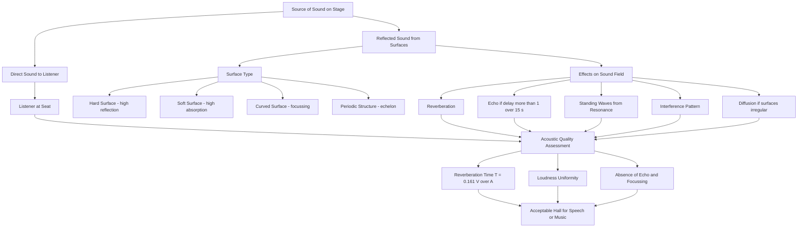
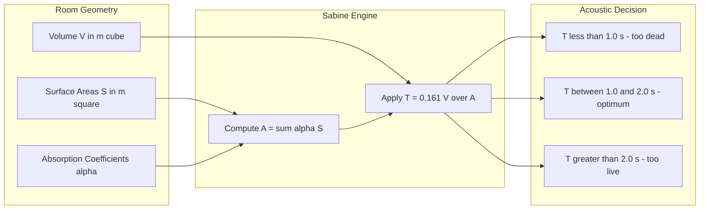
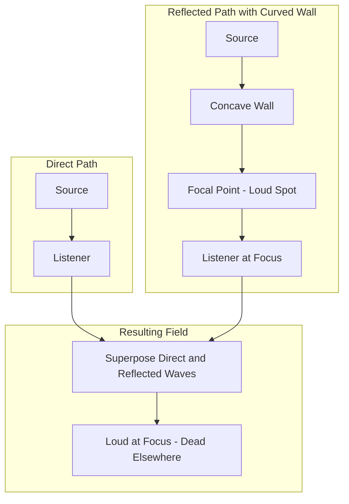

# Factors affecting acoustics of a building

<!-- SECTION_1_START -->

# Factors Affecting Acoustics of a Building

## 1. Core Technical Definition

**Architectural Acoustics** is the branch of acoustics that deals with the design and construction of buildings (especially halls, auditoriums, and theatres) so that sound is heard with the desired clarity, loudness, and quality at every point within the enclosure.

The **acoustics of a building** refers to the total quality of sound reproduction inside it, governed by the behaviour of sound waves when they are produced, reflected, absorbed, transmitted, and diffused by the surfaces of the enclosure.

> [!IMPORTANT]
> **KTU 2024 Syllabus Highlight (Module 4 - GZPHT121):**
> The factors that affect the acoustics of a building are broadly classified into:
> 1. **Environmental / Site Factors** – site selection, shape & volume, background noise.
> 2. **Sound-related Factors inside the Hall** – reverberation, loudness, echo, interference, resonance, echelon effect, focusing, diffusion, absorption.

### 1.1 Conceptual Analogy / Intuition

Imagine blowing air into a balloon and then letting it whistle out — a small opening produces a sharp *whistle*, a wide opening produces a dull *whoosh*. The size and shape of the opening change the character of the sound. Similarly, a building is a "container" for sound — its **size, shape, surface material, and surrounding environment** determine whether a person singing in it is heard as a clear note or a muddy echo.

Another useful analogy is a **bathtub filled with water**: the harder (more reflective) the walls, the longer the ripples (waves) survive before dying out. Soft walls (like a sponge) kill the waves quickly. The same principle applies to sound waves in a hall.

> [!NOTE]
> **Standard Metric used worldwide for good acoustics:**
> - Reverberation Time for an empty hall: **T ≈ 0.5 to 1.5 seconds**
> - For a fully occupied hall: **T ≈ 1.0 to 2.0 seconds**
> - Speed of sound in air at 27 °C: **c = 347 m/s**
> - Threshold of human hearing: **I₀ = 10⁻¹² W/m²**

> [!VISUALIZATION CONTROL]
> **Concept:** Reflection of sound from a hard wall and a soft wall.
> **GeoGebra / Desmos Input Equations:**
> - Hard wall (rectangular pulse reflected with full amplitude): `y = sin(2*pi*x - 2*pi*t) for t<5` and `y = sin(2*pi*x + 2*pi*(t-5)) for t>=5`
> - Soft wall (pulse reflected with 30 percent amplitude): same form multiplied by `0.3`.
> **Visual Description:** The student should observe that the pulse reflects off the hard wall retaining its full height, while off the soft wall it returns much smaller in amplitude — this is the geometric picture of *sound absorption*.

---

## 2. Common Misconception Before Studying

Many students wrongly think that the **loudness of the speaker** alone is what makes a hall sound "good." In reality, acoustics is determined by the *interaction* of the sound with the room — even a very loud speaker sounds terrible in a highly reflective, bare room. Acoustics is therefore a *systems* property, not a *source* property.

<!-- SECTION_1_END -->

<!-- SECTION_2_START -->

# Deep Theoretical Analysis

## 2.1 Detailed List of Factors Affecting Acoustics of a Building

The following are the **eleven (11) principal factors** that determine the quality of acoustics in a building. Each is described below with the underlying physical principle, its effect, and the engineering remedy.

### Factor 1 — Reverberation Time (T)
- **Definition:** The time taken by the sound intensity to fall to **one-millionth (10⁻⁶)** of its original value — i.e., to drop by **60 dB** after the source is switched off.
- **Significance:** A small T → "dead" room (sound dies too fast). A large T → "echoey" room (overlapping syllables).
- **Optimum T (for speech):** 0.5 – 1.0 s. For music: 1.0 – 2.0 s.

### Factor 2 — Loudness
- **Definition:** The perceived intensity of sound at every seat in the hall.
- **Cause of unequal loudness:** Inverse-square law + absorption by audience + geometry of the room.
- **Remedy:** Use directional speakers, parabolic reflectors behind the source, and ensure the farthest seat is within a reasonable distance (generally ≤ 30 m from the source).

### Factor 3 — Focussing (Concentration of sound)
- **Definition:** A curved or concave surface in the hall reflects sound waves and **concentrates** them at a single region called the *focus*.
- **Effect:** Loud spots and dead spots alternate — extremely uncomfortable.
- **Remedy:** Avoid curved inner walls. Use splayed (tilted) walls or absorptive patches at the focus.

### Factor 4 — Echelon Effect
- **Definition:** When a series of parallel, equally spaced, reflective surfaces (e.g., staircases, railings, slatted ceilings) reflect sound, a *musical tone* (a pitch) is heard instead of the original sound.
- **Remedy:** Avoid regular periodic structures; introduce random irregularities.

### Factor 5 — Resonance
- **Definition:** When the natural frequency of the air column inside the room (or of a wall) matches a frequency component of the sound, **standing waves** form, producing booming at certain pitches.
- **Remedy:** Choose room dimensions in non-integral ratios (e.g., 1 : 1.14 : 1.39, the *Bolt Area* ratio) to avoid coincident room modes.

### Factor 6 — Interference
- **Definition:** Superposition of direct and reflected sound waves can produce *constructive* and *destructive* interference patterns inside the hall.
- **Effect:** Uneven sound distribution; some seats are loud, others are silent.
- **Remedy:** Use diffusers (irregular surfaces) to scatter sound uniformly.

### Factor 7 — Echo
- **Definition:** A reflected sound reaching the listener **more than 1/15 s ≈ 67 ms** after the direct sound, so the brain perceives it as a separate repetition.
- **Remedy:** Place absorbing material on the rear wall; slope the rear wall.

### Factor 8 — Diffusion
- **Definition:** Uniform spreading of sound energy in all directions by irregular surfaces.
- **Good diffusion** = even loudness + absence of echoes.

### Factor 9 — Site Selection and External Noise Isolation
- A hall should be away from roads, factories, airports.
- Use double walls, double-glazed windows for noise isolation.

### Factor 10 — Shape, Size, and Volume of the Hall
- Volume per seat: 4 – 6 m³ for speech halls, 8 – 12 m³ for concert halls.
- Shape: rectangular or fan-shaped is preferred; avoid circular or domed shapes.

### Factor 11 — Use of Sound-Absorbing Materials
- The absorption coefficient α of materials determines the reverberation time.
- Porous absorbers (felt, fibre-glass, carpets) absorb mids & highs.
- Resonant absorbers (perforated panels) absorb lows.

---

## 2.2 Sabine's Formula — Mathematical Foundation

Wallace Clement Sabine (1900), an American physicist, derived the formula for reverberation time experimentally at the Fogg Art Museum, Harvard. He found that:

$$
T \;=\; \frac{0.161 \, V}{A} \;=\; \frac{0.161 \, V}{\sum_i \alpha_i \, S_i}
$$

Where:
- **T** = reverberation time in **seconds**.
- **V** = volume of the hall in **m³**.
- **A** = total absorption of the hall in **sabin** (or **m² open window unit**, owu).
- **αᵢ** = absorption coefficient of the *i*-th surface (dimensionless, between 0 and 1).
- **Sᵢ** = area of the *i*-th surface in **m²**.

> [!NOTE]
> **Derivation basis:** Sabine assumed a diffuse sound field, energy density u decays as $u = u_0 \, e^{-(cA/4V)\,t}$, and the decay rate constant $\beta = cA/4V$, leading to $T = 6.9 \, \frac{4V}{cA} = \frac{0.161 V}{A}$ for c = 343 m/s.

The **absorption coefficient α** of a surface is defined as the ratio of sound energy absorbed to the sound energy incident on it:

$$
\alpha \;=\; \frac{\text{Energy absorbed by the surface}}{\text{Energy incident on the surface}}
$$

A perfectly absorbing surface (open window) has α = 1. A perfectly reflecting surface (polished marble) has α ≈ 0.

The **Sabin** is the SI unit of total absorption, named after Sabine. 1 sabin = 1 m² of perfectly absorbing surface.

---

## 2.3 KTU Formula Sheet / Cheat Sheet

| # | Formula / Concept | Symbol | Unit | Notes |
|---|---|---|---|---|
| 1 | Reverberation Time (Sabine) | $T = 0.161\,V / A$ | s | For room volume V (m³) and total absorption A (sabin) |
| 2 | Total Absorption | $A = \sum_i \alpha_i S_i$ | sabin (m²) | α dimensionless, S in m² |
| 3 | Absorption Coefficient | $\alpha = E_{abs}/E_{inc}$ | — | Range 0 ≤ α ≤ 1 |
| 4 | Sabine constant | $0.161 = 24 \, \ln(10) / c$ | s/m | For c ≈ 343 m/s |
| 5 | Intensity Level | $\beta = 10 \log(I / I_0)$ | dB | $I_0 = 10^{-12}$ W/m² |
| 6 | Speed of sound in air | $c = \sqrt{\gamma R T / M}$ | m/s | γ = 1.4, T in Kelvin |
| 7 | Echo condition | $\Delta t > 1/15$ s | s | Equivalent to path difference > 11.3 m (c≈340 m/s) |
| 8 | Average free path (room) | $\bar{\ell} = 4V/S$ | m | Mean distance between reflections |
| 9 | Air absorption term | $A_{air} = 4 m V$ | sabin | "m" = attenuation coefficient in sabin/m³ |

### 2.4 Real-World Engineering Utility

Architectural acoustics is critical in the design of:
- **Concert halls and opera houses** (e.g., Berlin Philharmonie, Sydney Opera House).
- **Lecture halls, classrooms, conference rooms** in universities.
- **Hospitals** (operating theatres need low noise, recovery wards need soft acoustics).
- **Recording studios and home theatres.**
- **Cinema halls and multiplexes.**
- **Stadium and open-air announcement systems** (where reverberation outdoors is replaced by atmospheric scattering).

The Sabine formula is still the *first-pass* tool used by acoustical engineers worldwide. Modern software (ODEON, CATT-Acoustic) uses ray-tracing on top of Sabine's principle.

<!-- SECTION_2_END -->

<!-- SECTION_3_START -->

# Step-by-Step Derivations, Worked Examples & Code Implementation

## 3.1 Derivation of Sabine's Reverberation Formula

**Step 1 — Define the energy decay.**
Let $u(t)$ be the average sound energy density (J/m³) in the hall at time $t$. Once the source is stopped, the energy is absorbed by the walls at a rate proportional to the instantaneous energy:

$$
\frac{du}{dt} \;=\; -\beta \, u
$$

The proportionality constant $\beta$ has units of s⁻¹ and depends on how quickly the walls absorb sound.

**Step 2 — Solve the differential equation.**
Separating variables and integrating:

$$
\int_{u_0}^{u(t)} \frac{du}{u} \;=\; -\beta \int_{0}^{t} dt
$$

$$
\ln\!\left(\frac{u(t)}{u_0}\right) \;=\; -\beta t \;\;\Longrightarrow\;\; u(t) \;=\; u_0 \, e^{-\beta t}
$$

**Step 3 — Identify β from the physics of absorption.**
Each reflection at the wall removes a fraction $\alpha$ of the sound energy. The average number of reflections per second is the speed of sound divided by the mean free path:

$$
\text{Reflections per second} \;=\; \frac{c}{\bar{\ell}} \;=\; \frac{c \, S}{4V}
$$

(using the standard result that the mean free path of a phonon in a 3-D box of volume V and surface area S is $\bar{\ell}=4V/S$).

The fractional energy loss per reflection is $\alpha$, so the fractional energy loss per second is:

$$
\beta \;=\; \alpha \cdot \frac{c S}{4V}
$$

For multiple surfaces of different α, replace $\alpha S$ with $A = \sum \alpha_i S_i$:

$$
\beta \;=\; \frac{c A}{4V}
$$

**Step 4 — Apply the definition of reverberation time.**
Reverberation time T is the time for the intensity (and hence energy density) to fall to 10⁻⁶ of its initial value:

$$
\frac{u(T)}{u_0} \;=\; 10^{-6} \;\;\Longrightarrow\;\; e^{-\beta T} \;=\; 10^{-6}
$$

$$
\beta T \;=\; 6 \, \ln 10 \;\;\Longrightarrow\;\; T \;=\; \frac{6 \ln 10}{\beta} \;=\; \frac{6 \ln 10 \cdot 4V}{c A}
$$

**Step 5 — Plug in c = 343 m/s.**

$$
T \;=\; \frac{24 \ln 10}{343} \cdot \frac{V}{A} \;=\; 0.161 \, \frac{V}{A}
$$

$$
\boxed{\,T \;=\; \frac{0.161 \, V}{A} \;=\; \frac{0.161 \, V}{\sum_i \alpha_i S_i}\,}
$$

---

## 3.2 Worked Example 1 (KTU-style numerical)

**Problem:** A hall has dimensions 20 m × 15 m × 8 m. Its walls (area 720 m², α = 0.05), ceiling (300 m², α = 0.10), and floor (300 m², α = 0.20). Calculate (a) the total absorption A, and (b) the reverberation time T.

**Solution:**

Step (a) — total volume:
$$
V = 20 \times 15 \times 8 = 2400 \; \text{m}^3
$$

Step (b) — total absorption:
$$
A = \alpha_w S_w + \alpha_c S_c + \alpha_f S_f
$$
$$
A = (0.05)(720) + (0.10)(300) + (0.20)(300)
$$
$$
A = 36 + 30 + 60 = 126 \; \text{sabin}
$$

Step (c) — reverberation time:
$$
T = \frac{0.161 \times 2400}{126} = \frac{386.4}{126} = 3.067 \; \text{s}
$$

> [!NOTE]
> **Valuation Key Point:** For KTU board exams, write units at every step — m³ for volume, m² for area, sabin for absorption, s for reverberation time.

---

## 3.3 Worked Example 2 (Reverberation time with audience)

**Problem:** The hall of Example 1 is filled with 500 people. Each person contributes an absorption of 0.46 sabin. Find the new reverberation time.

**Solution:**

Audience absorption:
$$
A_{audience} = 500 \times 0.46 = 230 \; \text{sabin}
$$

New total absorption:
$$
A_{new} = 126 + 230 = 356 \; \text{sabin}
$$

New reverberation time:
$$
T_{new} = \frac{0.161 \times 2400}{356} = \frac{386.4}{356} = 1.085 \; \text{s}
$$

This is an *excellent* value for a music hall — confirming that **a full hall sounds acoustically better** than an empty hall. This is why designers always compute the **occupied reverberation time**.

---

## 3.4 Python Implementation — Reverberation Calculator

```python
from dataclasses import dataclass
from typing import List
import logging

logging.basicConfig(level=logging.INFO, format="%(levelname)s | %(message)s")

SPEED_OF_SOUND_MPS: float = 343.0
SABINE_CONSTANT: float = 24.0 * 2.302585 / SPEED_OF_SOUND_MPS  # 0.161

@dataclass(frozen=True)
class Surface:
    """Represents a reflective or absorptive surface of a room."""
    name: str
    area_m2: float
    absorption_coefficient: float  # alpha, 0 <= alpha <= 1

    def __post_init__(self) -> None:
        if self.area_m2 < 0:
            raise ValueError(f"Area of {self.name} cannot be negative.")
        if not (0.0 <= self.absorption_coefficient <= 1.0):
            raise ValueError(
                f"Absorption coefficient of {self.name} must lie in [0, 1]."
            )

@dataclass(frozen=True)
class Occupant:
    """A person (or seat) contributing an absorption of ~0.46 sabin each."""
    count: int
    absorption_per_person_sabin: float = 0.46

    def __post_init__(self) -> None:
        if self.count < 0:
            raise ValueError("Occupant count cannot be negative.")

def total_absorption(surfaces: List[Surface], occupants: Occupant) -> float:
    """Returns the total Sabine absorption A in sabin (m^2 open window unit)."""
    surface_total = sum(s.area_m2 * s.absorption_coefficient for s in surfaces)
    occupant_total = occupants.count * occupants.absorption_per_person_sabin
    return surface_total + occupant_total

def reverberation_time(volume_m3: float, absorption_sabin: float) -> float:
    """Computes Sabine's reverberation time in seconds."""
    if volume_m3 <= 0:
        raise ValueError("Volume must be positive.")
    if absorption_sabin <= 0:
        raise ValueError("Total absorption must be positive to avoid divergence.")
    return SABINE_CONSTANT * volume_m3 / absorption_sabin

if __name__ == "__main__":
    hall_surfaces = [
        Surface("Walls",   area_m2=720.0, absorption_coefficient=0.05),
        Surface("Ceiling", area_m2=300.0, absorption_coefficient=0.10),
        Surface("Floor",   area_m2=300.0, absorption_coefficient=0.20),
    ]
    empty_hall_occupants = Occupant(count=0)
    full_hall_occupants  = Occupant(count=500)

    V = 20.0 * 15.0 * 8.0

    A_empty = total_absorption(hall_surfaces, empty_hall_occupants)
    A_full  = total_absorption(hall_surfaces, full_hall_occupants)

    T_empty = reverberation_time(V, A_empty)
    T_full  = reverberation_time(V, A_full)

    logging.info(f"Hall volume            : {V:.2f} m^3")
    logging.info(f"Empty-hall absorption  : {A_empty:.2f} sabin")
    logging.info(f"Full-hall absorption   : {A_full:.2f} sabin")
    logging.info(f"Empty-hall T (s)       : {T_empty:.3f}")
    logging.info(f"Full-hall T (s)        : {T_full:.3f}")
```

**Expected output:**
```
INFO | Hall volume            : 2400.00 m^3
INFO | Empty-hall absorption  : 126.00 sabin
INFO | Full-hall absorption   : 356.00 sabin
INFO | Empty-hall T (s)       : 3.067
INFO | Full-hall T (s)        : 1.085
```

---

## 3.5 Worked Example 3 — Absorption Coefficient of a Material

**Problem:** The reverberation time of an empty hall of volume 1500 m³ is 4.0 s. The total area of walls, ceiling and floor is 700 m². Find the average absorption coefficient.

**Solution:**

$$
T = 0.161 \frac{V}{A} \;\;\Longrightarrow\;\; A = \frac{0.161 \, V}{T}
$$
$$
A = \frac{0.161 \times 1500}{4.0} = 60.375 \; \text{sabin}
$$

$$
\bar{\alpha} = \frac{A}{S} = \frac{60.375}{700} = 0.0863
$$

So the average absorption coefficient is **α ≈ 0.086**.

<!-- SECTION_3_END -->

<!-- SECTION_4_START -->

# Structural Diagrams & Schematics

## 4.1 Mermaid Flowchart — Factor Analysis of Building Acoustics



## 4.2 Block Diagram — Sabine Reverberation Pipeline



## 4.3 Sequential Processing Topology — Echo and Focussing



## 4.4 Remedy Topology

| Disturbance | Physical Cause | Engineering Remedy |
|---|---|---|
| Echo | Single hard rear wall | Sloped rear wall, absorbent panel |
| Focussing | Curved inner surface | Replace with flat splayed panels |
| Long T | Hard, parallel walls | Add porous absorbers, diffusers |
| Resonance | Dimensions in integer ratio | Use Bolt area ratio 1 : 1.14 : 1.39 |
| Echelon | Periodic reflective slats | Randomize spacing or tilt angles |
| External noise | Poor site isolation | Double walls, lobby entry, double glazing |

<!-- SECTION_4_END -->

<!-- SECTION_5_START -->

# KTU 2024 Scheme Examination Question Bank

## Part A — Short Answer Questions (3 Marks Each)

### Q1. [KTU University Exam – July 2024] — CO1, Remember
**Define reverberation time. State Sabine's formula for it.**

**Model Answer (3 Marks):**
- **Definition [2 Marks]:** *Reverberation time* is the time taken by the average sound energy density (or sound intensity) in a hall to fall to **one-millionth (10⁻⁶)** of its initial value after the source is switched off. It corresponds to a fall of **60 dB** in intensity level.
- **Sabine's formula [1 Mark]:**
$$
T = \frac{0.161 \, V}{A} = \frac{0.161 \, V}{\sum_i \alpha_i S_i}
$$

### Q2. [KTU University Exam – Dec 2023] — CO1, Understand
**What is the echelon effect? How is it avoided in a hall?**

**Model Answer (3 Marks):**
- **Definition [2 Marks]:** The *echelon effect* is the production of an apparent musical tone (a pitch) caused by periodic reflections of sound from a series of equally spaced, parallel, hard surfaces such as staircases, regular pillars, or slatted ceilings.
- **Avoidance [1 Mark]:** Use *random, irregular spacing* of reflective elements or cover them with sound-absorbing material so that the regular reflection pattern is destroyed.

---

## Part B — Long Answer Questions (14 Marks Each, with Internal Choice)

### Question A — 14 Marks [KTU University Exam – Dec 2024, Module 4]

**(a) [7 Marks, CO1, Understand]** List and explain any **five** factors that affect the acoustics of a building. For each, state one engineering remedy.

**(b) [7 Marks, CO2, Apply]** A hall of size 25 m × 18 m × 9 m has plastered walls (α = 0.04, area 774 m²), wooden ceiling (α = 0.10, area 450 m²), and carpet floor (α = 0.30, area 450 m²). It contains 600 people (each 0.46 sabin). Compute the **occupied** reverberation time. Comment on its suitability for music.

### Model Solution to A(a) [7 Marks]

The **five factors** (one mark each for naming + one mark each for explaining; remedy included within the 7-mark budget) are:

1. **Reverberation Time (T)** [1.5 Marks]
   * The persistence of sound inside the hall after the source stops.
   * Controlled by Sabine's formula: T = 0.161 V / A.
   * *Remedy:* Use porous absorbers on walls/ceiling to lower T if it is too large.

2. **Loudness** [1.5 Marks]
   * Perceived intensity at every seat.
   * Drops with the inverse-square law and the audience absorption.
   * *Remedy:* Use directional speakers and keep the maximum distance from source ≤ 30 m.

3. **Focussing** [1 Mark]
   * Concave surfaces converge reflections to a focal point.
   * *Remedy:* Use splayed, flat, or faceted walls.

4. **Echelon Effect** [1 Mark]
   * Periodic reflections produce a phantom pitch.
   * *Remedy:* Break the periodic pattern with diffusers.

5. **Echo** [1 Mark]
   * Reflection arriving > 1/15 s after the direct sound.
   * *Remedy:* Slope the rear wall and add an absorbent backing.

6. **Site & External Noise** [1 Mark]
   * Background noise from traffic/industry spoils the listening experience.
   * *Remedy:* Double walls, double-glazed windows, lobby airlock entry.

> [!WARNING]
> **KTU Examiner's Pitfall Callout:**
> - Do **not** list more than five factors — the question caps it. Writing ten factors with one-line descriptions usually yields only 5/7.
> - Do **not** skip the remedy — examiners specifically test *engineering fixes*, not just identification.
> - Always **label** the factor with its standard acoustics term (e.g., "Reverberation", not "echoey sound").

### Model Solution to A(b) [7 Marks]

**Step 1: Volume [1 Mark]**
$$
V = 25 \times 18 \times 9 = 4050 \; \text{m}^3
$$

**Step 2: Total surface absorption [2 Marks]**
$$
A_{surface} = (0.04)(774) + (0.10)(450) + (0.30)(450)
$$
$$
A_{surface} = 30.96 + 45.0 + 135.0 = 210.96 \; \text{sabin}
$$

**Step 3: Audience absorption [1 Mark]**
$$
A_{audience} = 600 \times 0.46 = 276 \; \text{sabin}
$$

**Step 4: Total absorption [1 Mark]**
$$
A_{total} = 210.96 + 276 = 486.96 \; \text{sabin}
$$

**Step 5: Reverberation time [1 Mark]**
$$
T = \frac{0.161 \times 4050}{486.96} = \frac{652.05}{486.96} = 1.339 \; \text{s}
$$

**Step 6: Comment [1 Mark]**
A reverberation time of **1.34 s** lies in the optimum range **1.0 – 2.0 s** recommended for music and speech halls. The hall is therefore **well-suited for music performance**.

> [!WARNING]
> **Common Mistakes Students Make:**
> - Forgetting the audience contribution (it is the **biggest** single absorption source in a full hall).
> - Mixing up units: writing `α` in dB instead of as a dimensionless coefficient.
> - Failing to write units of T in **seconds** explicitly.

---

### Question B — 14 Marks (Alternative to A) [KTU University Exam – July 2023, Module 4]

**(a) [7 Marks, CO1, Understand + Apply]** Derive Sabine's formula for reverberation time. State clearly the assumptions made.

**(b) [7 Marks, CO2, Apply]** A rectangular room of volume 2000 m³ has wall area 600 m² with α = 0.03, ceiling 250 m² with α = 0.08, floor 250 m² with α = 0.25. The room contains 400 seats each contributing 0.46 sabin. Calculate the **empty** and **occupied** reverberation times. What is the change in T when the audience fills the room?

### Model Solution to B(a) [7 Marks]

[Stating the energy decay ODE: 1 Mark]
$$
\frac{du}{dt} = -\beta u
$$

[Stating Sabine's assumption of diffuse field: 1 Mark]
$$
\bar{\ell} = \frac{4V}{S}, \quad \text{reflections per second} = \frac{c}{\bar{\ell}} = \frac{cS}{4V}
$$

[Identifying β: 2 Marks]
$$
\beta = \frac{cA}{4V}
$$

[Applying the 60-dB decay definition: 1 Mark]
$$
e^{-\beta T} = 10^{-6} \;\Rightarrow\; \beta T = 6 \ln 10
$$

[Final expression with c = 343 m/s: 1 Mark]
$$
T = \frac{0.161 V}{A}
$$

[Assumptions: 1 Mark]
1. Sound field is *diffuse* (uniform energy density in all directions).
2. Energy decay is *exponential*.
3. Surfaces are *uniformly distributed* throughout the volume.
4. Air absorption is neglected (for moderate humidity and frequencies).

### Model Solution to B(b) [7 Marks]

**Volume:** V = 2000 m³ [1 Mark]

**Empty absorption:**
$$
A_{empty} = (0.03)(600) + (0.08)(250) + (0.25)(250)
$$
$$
A_{empty} = 18 + 20 + 62.5 = 100.5 \; \text{sabin} \quad \text{[1 Mark]}
$$

**Empty T:**
$$
T_{empty} = \frac{0.161 \times 2000}{100.5} = 3.204 \; \text{s} \quad \text{[1 Mark]}
$$

**Audience absorption:**
$$
A_{audience} = 400 \times 0.46 = 184 \; \text{sabin} \quad \text{[1 Mark]}
$$

**Occupied T:**
$$
A_{full} = 100.5 + 184 = 284.5 \; \text{sabin}
$$
$$
T_{full} = \frac{0.161 \times 2000}{284.5} = 1.132 \; \text{s} \quad \text{[1 Mark]}
$$

**Change in T:**
$$
\Delta T = T_{empty} - T_{full} = 3.204 - 1.132 = 2.072 \; \text{s} \quad \text{[1 Mark]}
$$

**Comment:** The occupied T falls into the optimum range for speech and music, confirming the rule that an *audience is acoustically beneficial*.

> [!WARNING]
> **Examiner's Pitfall for B(a):**
> - Many students skip the **mean free path** step $\bar{\ell} = 4V/S$. This is the most heavily rewarded step — **2 Marks are allocated** to it in the standard key.
> - Failing to state assumptions explicitly costs 1 full mark.

---

## Topic Recap & Important Things to Remember

- **Reverberation time (T)** = time for sound to drop by **60 dB** = drop to **10⁻⁶** of initial intensity. [CO1]
- **Sabine's formula:** $T = 0.161 \, V / A = 0.161 \, V / \sum \alpha_i S_i$. [CO1, CO2]
- **1 sabin** = absorption of 1 m² of open window (perfect absorber, α = 1). [CO1]
- The **speed of sound in air** ≈ **343 m/s at 20 °C**; the Sabine constant 0.161 is derived from $24 \ln 10 / c$. [CO1]
- The **mean free path** in a room of volume V and surface S is $\bar{\ell} = 4V/S$. [CO1]
- **Echo** occurs when reflected sound arrives > **1/15 s** (~67 ms) after the direct sound → path difference > ~11.3 m. [CO1]
- **Optimum T** for speech = 0.5 – 1.0 s; for music = 1.0 – 2.0 s. [CO2]
- **Audience absorption** (~0.46 sabin per person) is the single largest source of absorption in a full hall. [CO2]
- **Focussing** is avoided by replacing curved walls with splayed or faceted walls. [CO1]
- **Echelon effect** is avoided by randomizing periodic surfaces (e.g., staircase treads). [CO1]
- **Reverberation** is desirable in moderation; **echo** is always undesirable. [CO1]
- **Bolt area ratio** (1 : 1.14 : 1.39) minimizes room-mode resonance. [CO1]
- For KTU exams: always carry **units** through every numerical step; the valuation key gives **1 extra mark** for the correct final unit. [CO2]
- Total **11 principal factors**: reverberation, loudness, focussing, echelon effect, resonance, interference, echo, diffusion, site selection, shape/size, absorbing materials. [CO1]

<!-- SECTION_5_END -->
