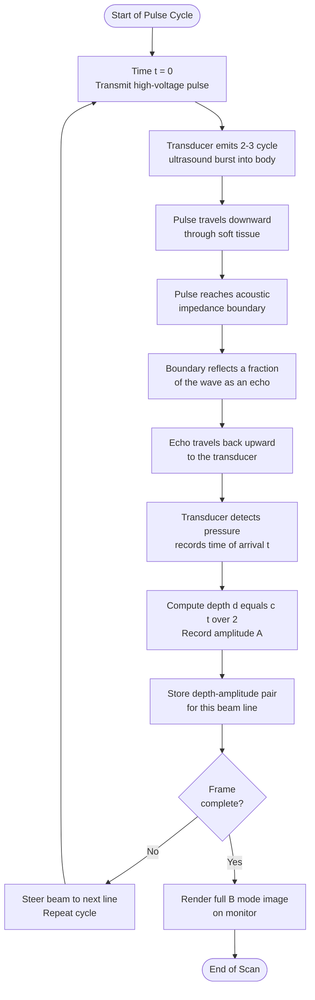
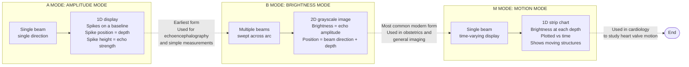
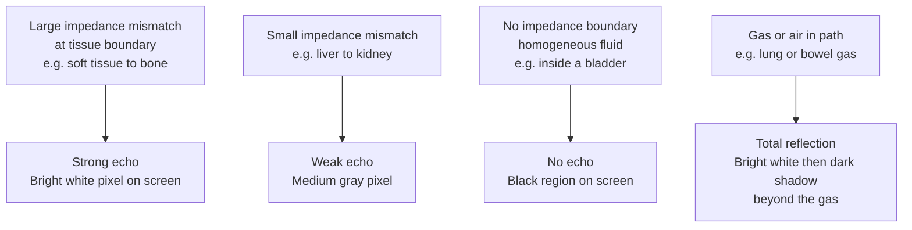
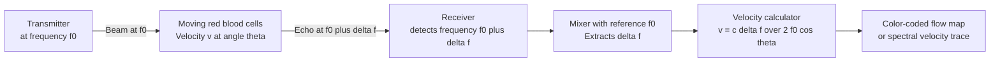

# medical application- Ultrasound scanning (qualitative)

<!-- SECTION_1_START -->

# Medical Application of Ultrasound Scanning (Qualitative)

## 1.1 Formal Definition (KTU 2024 Syllabus Terminology)

**Ultrasound** refers to mechanical pressure waves that propagate through a medium at frequencies **above the upper limit of human hearing**, conventionally taken as **$f > 20 \text{ kHz}$**. In medical imaging, diagnostic ultrasound typically operates in the frequency range of **$1 \text{ MHz}$ to $15 \text{ MHz}$**, with obstetrical and abdominal scans most commonly using transducers in the $2\text{–}10 \text{ MHz}$ band.

The medical imaging modality built upon these waves is called **Diagnostic Ultrasonography** (or simply *ultrasound scanning*). It is a **non-invasive, non-ionizing, real-time imaging technique** that maps the internal structure of soft tissue by transmitting short pulses of high-frequency sound into the body and recording the *echoes* that return from acoustic interfaces inside the body.

> [!IMPORTANT]
> **Core Definition (Board-Examiner-Wording):**
> *Ultrasound scanning is a pulse-echo imaging technique that uses the reflection and scattering of high-frequency sound waves at acoustic impedance mismatches within biological tissue to construct a visual map of internal anatomical structures.*

> [!NOTE]
> **KTU 2024 GZPHT121 – Module Highlight:**
> The syllabus expects a **qualitative** treatment, meaning students must clearly explain *how* ultrasound is generated, *how* it interacts with tissue, *how* an image is reconstructed, and *what* the major medical applications are — without deriving the full acoustic wave equation from first principles.

---

## 1.2 Conceptual Analogy and Intuition

### The SONAR Analogy (Submarine Echolocation)

Imagine a submarine moving through dark ocean water. It cannot use light (which is absorbed in a few meters of seawater), so it sends out a **"ping"** — a short burst of sound — and listens for the echo that bounces back from a wreck, a whale, or the seabed. By measuring **how long the echo takes to return**, the submarine calculates the distance of the object. By analyzing the **strength and direction** of the echo, it infers the object's size and position.

**Ultrasound scanning works on exactly the same principle**, except:
- The "ocean" is your body (soft tissue, blood, bone).
- The "ping" is a pulse of ultrasound emitted by a hand-held probe pressed against your skin.
- The "echoes" come from boundaries between different tissues (e.g., the wall of the uterus, the surface of a kidney stone, the edge of a heart valve).

```
Analogy Mapping:
┌────────────────────┬──────────────────────────┐
│   SONAR System     │   Medical Ultrasound     │
├────────────────────┼──────────────────────────┤
│ Submarine          │ Ultrasound probe         │
│ Ocean              │ Human body (tissue)      │
│ Sound "ping"       │ Ultrasound pulse         │
│ Submarine wreck    │ Internal organ boundary  │
│ Echo return time   │ Time of flight (TOF)     │
│ Sonar display      │ Ultrasound monitor       │
└────────────────────┴──────────────────────────┘
```

### The Bat Analogy (Biological Echolocation)

A bat flying at night emits high-pitched squeaks and constructs a mental "image" of the insects and trees around it from the returning echoes. Medical ultrasound is the technological cousin of this natural echolocation — humans have simply learned to *borrow* the physics that evolution gave the bat.

### Why Ultrasound and Not Ordinary Sound?

Ordinary sound (e.g., a voice at $\sim 500 \text{ Hz}$) has a wavelength of nearly **$0.7 \text{ m}$** in air — far too large to resolve small anatomical features. By raising the frequency to **$5 \text{ MHz}$**, the wavelength shrinks to roughly **$0.3 \text{ mm}$** in soft tissue, which is the right order of magnitude to image structures like a foetus, a kidney stone, or a heart valve.

> [!TIP]
> **Intuition Summary:** *Higher frequency ⇒ smaller wavelength ⇒ finer detail in the image, but less penetration depth.* This is the fundamental **resolution–penetration trade-off** in medical ultrasound.

---

## 1.3 Key Physical Constants and Standard Metrics

The following standard values are repeatedly used in ultrasound problems and **must be memorized** for the KTU exam:

| Parameter | Typical Value (Soft Tissue) | Symbol |
| :--- | :--- | :--- |
| Speed of ultrasound in soft tissue | **$c \approx 1540 \text{ m/s}$** | $c$ |
| Density of soft tissue | **$\rho \approx 1060 \text{ kg/m}^3$** | $\rho$ |
| Acoustic impedance of soft tissue | **$Z \approx 1.63 \times 10^6 \text{ kg/(m}^2\text{·s)}$** | $Z$ |
| Diagnostic frequency range | **$1 \text{ MHz}$ to $15 \text{ MHz}$** | $f$ |
| Therapeutic / surgical range | $0.5 \text{ MHz}$ to $3 \text{ MHz}$ (HIFU) | $f$ |

> [!IMPORTANT]
> The KTU board often gives a value of $c = 1540 \text{ m/s}$ (or rounded as $1500 \text{ m/s}$) in numerical problems. Always check the **printed value in the question paper** before substituting.

---

## 1.4 Visualization Control Block

> [!VISUALIZATION CONTROL]
> **Concept:** *Echo Amplitude versus Time* for a typical pulse-echo ultrasound scan.
> **GeoGebra / Desmos Input Equations:**
> * `f1(t) = 2.5 * sin(2*pi*5*t) * exp(-((t-1)/0.1)^2)`  ← Transmitted pulse (centered at $t = 1 \mu s$)
> * `f2(t) = 1.8 * sin(2*pi*5*t) * exp(-((t-3)/0.1)^2)`  ← Echo from first tissue boundary (deeper)
> * `f3(t) = 0.9 * sin(2*pi*5*t) * exp(-((t-5)/0.1)^2)`  ← Echo from second tissue boundary (deeper still, weaker)
> * `f4(t) = 0.4 * sin(2*pi*5*t) * exp(-((t-7)/0.1)^2)`  ← Final faint echo (deep boundary, heavily attenuated)
> **Visual Description:** The student should observe *three* distinct echo packets, each progressively **weaker (smaller amplitude)** and **later in time (further to the right)**. The horizontal axis represents the time after the transmitted pulse; the vertical axis represents the *pressure amplitude* of the returning echo. Later echoes = deeper structures. Smaller echoes = either weaker acoustic interfaces or greater attenuation in overlying tissue.

---

<!-- SECTION_1_END -->

<!-- SECTION_2_START -->

# Deep Theoretical Analysis — How Ultrasound Imaging Works

## 2.1 The Six Logical Steps of an Ultrasound Scan

To produce a single image, the ultrasound system performs the following operations in rapid sequence (thousands of times per second):

1. **Pulse Generation** — A high-voltage electrical spike is applied to a **piezoelectric crystal** inside the transducer. The crystal mechanically deforms and emits a short burst of ultrasound (typically **2–3 cycles** long) into the body.
2. **Propagation** — The pulse travels through tissue at the speed of sound, losing intensity due to **attenuation** (absorption + scattering).
3. **Partial Reflection at Acoustic Interfaces** — Whenever the pulse crosses a boundary between two tissues with different **acoustic impedance ($Z$)**, a portion of the wave is reflected back as an **echo**. The remainder is transmitted deeper.
4. **Echo Reception** — The same piezoelectric crystal (now acting as a receiver) detects the returning pressure wave and converts it back into a small electrical signal.
5. **Signal Processing** — The receiver amplifies the tiny echo, compensates for time-dependent attenuation (Time Gain Compensation, TGC), and digitizes the signal.
6. **Image Reconstruction and Display** — The time-of-flight of each echo is converted to a *depth value*, and the echo amplitude determines *pixel brightness*. The full set of echoes (from many directions) is assembled into a 2-D image (B-mode) on the monitor.

---

## 2.2 The Heart of the System: The Piezoelectric Transducer

A **piezoelectric material** (typically lead zirconate titanate, **PZT**, or polymer PVDF) has two coupled properties:

- **Direct Piezoelectric Effect:** Mechanical stress on the crystal produces a measurable voltage across its faces. *(Used when the crystal RECEIVES echoes.)*
- **Inverse Piezoelectric Effect:** Applying a voltage across the crystal causes it to mechanically deform. *(Used when the crystal TRANSMITS pulses.)*

> [!NOTE]
> The same crystal therefore acts as both **loudspeaker** and **microphone** for ultrasound. This dual role is what allows a compact probe to both send pulses and listen for echoes along the same beam line.

The resonant frequency of a thickness-mode piezoelectric disc is given by:
$$f_0 \;=\; \frac{c_{\text{crystal}}}{2 \, d}$$
where $d$ is the thickness of the disc. By machining discs of different thicknesses, manufacturers produce probes of different clinical frequencies.

---

## 2.3 Acoustic Impedance — The Master Property

Every tissue in the body has a characteristic **acoustic impedance** $Z$, defined as:
$$Z \;=\; \rho \, c$$
where $\rho$ is the tissue density and $c$ is the speed of sound in that tissue. The unit of $Z$ is the **Rayl** ($\text{kg}\cdot\text{m}^{-2}\cdot\text{s}^{-1}$), although the practical unit in medicine is $\times 10^6 \text{ Rayl}$ (the **mega-Rayl**, or **MRayl**).

Typical acoustic impedances of biological materials:

| Tissue / Material | $Z$ (MRayl) | Reflection at Soft-Tissue Boundary |
| :--- | :--- | :--- |
| Air | $0.0004$ | $\approx 99.9\%$ (total reflection) |
| Lung | $0.18$ | very high |
| Fat | $1.38$ | moderate |
| Water / Blood | $1.48$ – $1.66$ | low |
| Liver / Kidney | $1.62$ – $1.66$ | low |
| Muscle | $1.70$ | low-moderate |
| Bone | $7.80$ | very high (near-total reflection) |

> [!IMPORTANT]
> **Why the gel?** Air has an acoustic impedance roughly **$4000\times$ smaller** than skin. Without acoustic coupling gel, almost $100\%$ of the ultrasound pulse would be reflected at the skin–air interface and **none would enter the body**. The gel (water-based, $Z \approx 1.5 \text{ MRayl}$) matches the skin's impedance and lets the pulse enter efficiently.

### Reflection and Transmission Coefficients

When a wave travelling in medium 1 ($Z_1$) strikes a flat boundary with medium 2 ($Z_2$) at normal incidence, the fraction of intensity reflected (the **intensity reflection coefficient**) is:
$$R \;=\; \left(\frac{Z_2 - Z_1}{Z_2 + Z_1}\right)^{\!2}$$
and the fraction transmitted into medium 2 is:
$$T \;=\; \frac{4 \, Z_1 \, Z_2}{\left(Z_1 + Z_2\right)^{\!2}}$$

These two coefficients always satisfy the energy-conservation identity $R + T = 1$.

---

## 2.4 KTU Formula Sheet / Cheat Sheet (High-Yield)

| # | Formula / Concept | Equation | Notes / Units |
| :--- | :--- | :--- | :--- |
| 1 | Wave relation | $c = f \lambda$ | $c$ in m/s, $f$ in Hz, $\lambda$ in m |
| 2 | Acoustic impedance | $Z = \rho c$ | Unit: Rayl; in medicine use MRayl |
| 3 | Reflection coefficient (intensity) | $R = \left(\frac{Z_2 - Z_1}{Z_2 + Z_1}\right)^{\!2}$ | Dimensionless, $0 \le R \le 1$ |
| 4 | Transmission coefficient (intensity) | $T = \frac{4 Z_1 Z_2}{(Z_1 + Z_2)^2}$ | Dimensionless, $0 \le T \le 1$ |
| 5 | Depth from time of flight | $d = \dfrac{c \, t}{2}$ | Factor of 2 because pulse travels *down and back* |
| 6 | Attenuation (Beer–Lambert form) | $I(x) = I_0 \, e^{-\alpha x}$ | $\alpha$: attenuation coefficient (Np/m or dB/m) |
| 7 | Attenuation in decibels | $\text{dB loss} = 10 \log_{10}\!\left(\dfrac{I_0}{I}\right)$ | Practical engineering form |
| 8 | Axial resolution | $\Delta z_{\text{axial}} = \dfrac{c}{2 \, \Delta f}$ | $\Delta f$ = bandwidth of pulse |
| 9 | Doppler shift (reflector) | $\Delta f = \dfrac{2 \, f_0 \, v \cos\theta}{c}$ | $\theta$ = angle between beam and flow direction |
| 10 | Resonant frequency of PZT disc | $f_0 = \dfrac{c_{\text{crystal}}}{2 d}$ | $d$ = crystal thickness |

> [!WARNING]
> **Do not confuse the *pressure* reflection coefficient** $\bigl(\frac{Z_2 - Z_1}{Z_2 + Z_1}\bigr)$ **with the *intensity* reflection coefficient** (the square of it). The KTU 2024 syllabus uses the **intensity** form unless explicitly stated otherwise.

---

## 2.5 Real-World Engineering and Medical Utility

| Engineering / Medical Field | Why Ultrasound? | Typical Probe Frequency |
| :--- | :--- | :--- |
| Obstetrics (foetal imaging) | **No ionizing radiation** — safe for the developing foetus; real-time imaging of motion | $3\text{–}5 \text{ MHz}$ |
| Cardiology (echocardiography) | Real-time visualization of heart valves and chamber motion | $2\text{–}5 \text{ MHz}$ |
| Abdominal imaging (liver, kidney, gallbladder) | Good contrast between soft-tissue organs | $2\text{–}5 \text{ MHz}$ |
| Vascular / Doppler blood-flow studies | Doppler shift quantifies flow velocity non-invasively | $5\text{–}10 \text{ MHz}$ |
| Ophthalmology (eye imaging) | High resolution of small anterior structures | $10\text{–}15 \text{ MHz}$ |
| Musculoskeletal (tendons, ligaments) | High-resolution surface imaging | $7\text{–}15 \text{ MHz}$ |
| HIFU (High-Intensity Focused Ultrasound) surgery | Focused beams ablate tumours thermally | $0.5\text{–}3 \text{ MHz}$ |
| Lithotripsy (kidney-stone breaking) | Focused shock-wave pulses fragment stones | $\sim 1 \text{ MHz}$ bursts |

> [!NOTE]
> The same physical principle — *sound interacting with tissue* — therefore supports **diagnosis** (gentle, low-intensity imaging) and **therapy** (high-intensity focused ablation). The difference is purely the **amplitude** and **focusing** of the sound beam.

---

## SECTION_2_END -->

<!-- SECTION_3_START -->

# Step-by-Step Derivation of Key Quantitative Relations

> This module is **qualitative** in the KTU sense, meaning *no full derivation of the wave equation is required*. However, the KTU board regularly asks for the **derivation of the intensity reflection coefficient** and the **depth-from-time-of-flight formula**, since these are the two most clinically meaningful results that a life-science or physical-science student can fully work through.

---

## 3.1 Derivation of the Intensity Reflection Coefficient $R$

### Step 1 — Set up the boundary conditions

Consider a plane ultrasound wave travelling in the $+x$ direction in medium 1 (acoustic impedance $Z_1$), normally incident on a flat, infinite boundary at $x = 0$, after which lies medium 2 (impedance $Z_2$).

The pressure field can be written as a sum of three plane waves:
- **Incident wave:** $p_i(x,t) = P_i \, e^{i(k_1 x - \omega t)}$
- **Reflected wave:** $p_r(x,t) = P_r \, e^{i(-k_1 x - \omega t)}$
- **Transmitted wave:** $p_t(x,t) = P_t \, e^{i(k_2 x - \omega t)}$

### Step 2 — Apply continuity of pressure at the boundary

Pressure must be continuous across the boundary (no "pressure gap" at a real physical interface). At $x = 0$:
$$p_i + p_r \;=\; p_t \quad\Longrightarrow\quad P_i + P_r \;=\; P_t \tag{1}$$

### Step 3 — Apply continuity of particle velocity

Particle velocity $u$ is related to pressure by $p = \pm Z \, u$ (the sign depends on the direction of propagation). Continuity of velocity gives:
$$\frac{P_i}{Z_1} - \frac{P_r}{Z_1} \;=\; \frac{P_t}{Z_2} \quad\Longrightarrow\quad P_i - P_r \;=\; \frac{Z_1}{Z_2} \, P_t \tag{2}$$

### Step 4 — Solve the two equations for the pressure reflection coefficient

Let $r_p = P_r / P_i$ (pressure reflection coefficient) and $t_p = P_t / P_i$ (pressure transmission coefficient). Equations (1) and (2) become:
$$1 + r_p \;=\; t_p \tag{1'}$$
$$1 - r_p \;=\; \frac{Z_1}{Z_2} \, t_p \tag{2'}$$

Solving (1') for $t_p = 1 + r_p$ and substituting into (2'):
$$1 - r_p \;=\; \frac{Z_1}{Z_2} \, (1 + r_p)$$

Multiply through by $Z_2$:
$$Z_2 \,(1 - r_p) \;=\; Z_1 \,(1 + r_p)$$

Expand:
$$Z_2 - Z_2 \, r_p \;=\; Z_1 + Z_1 \, r_p$$

Collect $r_p$ terms on one side:
$$- Z_2 \, r_p - Z_1 \, r_p \;=\; Z_1 - Z_2$$
$$- r_p \, (Z_2 + Z_1) \;=\; Z_1 - Z_2$$
$$r_p \;=\; \frac{Z_1 - Z_2}{Z_1 + Z_2} \;=\; -\,\frac{Z_2 - Z_1}{Z_2 + Z_1}$$

The negative sign simply denotes a phase inversion of the reflected wave; the magnitude is:
$$\vert r_p \vert \;=\; \frac{\vert Z_2 - Z_1 \vert}{Z_2 + Z_1}$$

### Step 5 — Convert to the intensity reflection coefficient

Intensity is proportional to the *square* of the pressure amplitude. Therefore:
$$R \;=\; r_p^{\,2} \;=\; \left(\frac{Z_2 - Z_1}{Z_2 + Z_1}\right)^{\!2} \quad\blacksquare$$

### Step 6 — Numerical illustration (KTU-style)

**Question-type problem:** *Compute the fraction of intensity reflected when ultrasound passes from liver ($Z_1 = 1.66 \text{ MRayl}$) into a gallstone ($Z_2 = 8.0 \text{ MRayl}$).*

**Solution:**
$$R = \left(\frac{8.0 - 1.66}{8.0 + 1.66}\right)^{\!2} = \left(\frac{6.34}{9.66}\right)^{\!2} = (0.656)^{2} \approx 0.43$$

So **$\approx 43\%$** of the incident intensity is reflected at this boundary — this is *why gallstones appear as bright, well-defined echoes* in clinical ultrasound scans. The remaining $57\%$ is transmitted into (and beyond) the stone.

> [!IMPORTANT]
> This derivation — particularly **the boundary-condition step and the algebraic simplification** — is the single most high-yield derivation on this topic for KTU 2024. The board will award **3–4 marks** for setting up the equations and another **2–3 marks** for the final simplified form.

---

## 3.2 Derivation of the Depth Formula $d = c t / 2$

### Step 1 — Describe the geometry

The transducer at the skin surface emits a pulse at $t = 0$. The pulse travels *downward* through tissue at speed $c$, reaches an acoustic interface at depth $d$, and reflects. The echo then travels *back upward* through the same tissue to the transducer, arriving at time $t$.

### Step 2 — Write the total path length

The pulse travels a total round-trip path length $L = 2 d$ (down and back). At constant speed $c$:
$$L = c \, t$$

### Step 3 — Solve for depth

$$2 d \;=\; c \, t \quad\Longrightarrow\quad d \;=\; \frac{c \, t}{2} \quad\blacksquare$$

### Step 4 — Numerical illustration

**Question-type problem:** *An ultrasound pulse returns to the transducer $39 \,\mu s$ after emission. Calculate the depth of the reflecting interface. Take $c = 1540 \text{ m/s}$ in soft tissue.*

**Solution:**
$$d = \frac{c \, t}{2} = \frac{1540 \times 39 \times 10^{-6}}{2} = \frac{0.06006}{2} = 0.03003 \text{ m} \approx 3.0 \text{ cm}$$

The interface lies at a depth of **$\approx 3 \text{ cm}$** below the skin surface.

> [!TIP]
> **Examiner's Tip:** Always include the **factor of 2** in the denominator. A very common mistake is to write $d = c t$ (forgetting the round trip), which gives a depth that is *double* the correct value.

---

## 3.3 Doppler Shift for a Moving Reflector (Qualitative Explanation)

When the reflecting interface is **moving** (e.g., a red blood cell or a heart valve), the returning echo is shifted in frequency by the **Doppler effect**. For a reflector moving with speed $v$ at angle $\theta$ to the beam axis:
$$\Delta f \;=\; \frac{2 \, f_0 \, v \cos\theta}{c}$$

**The "factor of 2" arises from a double Doppler shift:** the moving reflector "sees" the incident wave Doppler-shifted, and *itself* acts as a moving source when re-radiating the echo. The cosine factor accounts for the geometry — Doppler shift is maximum when the beam is **parallel** to the flow ($\theta = 0$) and **zero** when the beam is perpendicular to the flow ($\theta = 90^\circ$).

**Clinical use:** This principle powers *Doppler ultrasound*, which color-codes blood flow in vessels and quantifies cardiac output non-invasively.

---

<!-- SECTION_3_END -->

<!-- SECTION_4_START -->

# Structural Diagrams and Schematics

> All diagrams below use the Mermaid `flowchart` syntax, with safe alphanumeric node IDs, double-quoted labels (no markdown formatting inside labels), and nested subgraphs to isolate decoupled functional modules.

---

## 4.1 Block Diagram of a Complete Pulse-Echo Ultrasound Imaging System


**Reading the Diagram:** Start at the top-left (`ctrl`) and follow the arrows. The system cycles at roughly **$1000$ to $5000$ times per second**, building a complete 2-D image in real time from thousands of individual pulse-echo sequences fired along different beam lines.

---

## 4.2 Sequential Topology — How a Single Image Line Is Built (Pulse-Echo Timing)



---

## 4.3 Functional Comparison — A-mode, B-mode, and M-mode Ultrasound



---

## 4.4 Causal Flow — Why an Ultrasound Image Looks the Way It Does



> [!NOTE]
> This is the conceptual key to *reading* an ultrasound image: **brightness = acoustic-impedance contrast, darkness = no contrast, and acoustic shadowing = blocked wave path**.

---

## 4.5 Doppler Ultrasound — Functional Block Architecture



---

<!-- SECTION_4_END -->

<!-- SECTION_5_START -->

# KTU 2024 Scheme Examination Question Bank

> All questions are modeled strictly on the **KTU 2024 GZPHT121** syllabus and the **Revised Bloom's Taxonomy (RBT)** cognitive levels used in the End-Semester Examination (ESE).

---

## Part A — Short Answer Questions (3 Marks Each)

### Question 1 (3 Marks) — `[KTU University Exam – July 2024]`

> **"What is ultrasound? Explain why it is preferred over X-rays for imaging the human foetus."**

**Course Outcome:** CO1 | **Cognitive Level:** Remember / Understand

### Model Answer (Valuation Key)

**Definition (1 Mark):** Ultrasound refers to sound waves of frequency greater than **$20 \text{ kHz}$**, which lies above the audible range of the human ear. In medical imaging, frequencies in the range **$1\text{–}15 \text{ MHz}$** are used.

**Two Key Properties (2 Marks):**

1. **Non-ionizing radiation:** X-rays are a form of high-energy electromagnetic radiation that can damage DNA by ionizing molecules along their path. The developing foetus has rapidly dividing cells that are especially vulnerable to such damage, and foetal exposure to X-rays is associated with increased lifetime cancer risk. Ultrasound is a *mechanical* pressure wave that does not ionize tissue and is therefore considered safe for repeated obstetric use.

2. **Real-time, non-invasive imaging:** Ultrasound produces a live video of the foetus, allowing the clinician to observe motion (heartbeat, limb movement) in addition to static anatomy. No contrast agent or sedation is required.

> [!NOTE]
> **Valuation Tip:** Award **1 mark** for the frequency definition, **1 mark** for "non-ionizing", and **1 mark** for "real-time / non-invasive". Do not penalize for missing the second point if the student gives a strong elaboration on the first.

---

### Question 2 (3 Marks) — `[KTU University Exam – Dec 2023]`

> **"Define acoustic impedance. What is its SI unit? State the typical value for soft tissue."**

**Course Outcome:** CO1 | **Cognitive Level:** Remember

### Model Answer (Valuation Key)

**Definition (2 Marks):** Acoustic impedance $Z$ of a medium is the product of its density $\rho$ and the speed of sound $c$ in that medium:
$$Z \;=\; \rho \, c$$

**SI Unit (0.5 Mark):** $\text{kg} \cdot \text{m}^{-2} \cdot \text{s}^{-1}$, named the **Rayl** (or **MRayl** = $10^6$ Rayl in medical practice).

**Typical Value (0.5 Mark):** For soft tissue, $Z \approx 1.63 \times 10^6 \text{ Rayl} = 1.63 \text{ MRayl}$.

> [!TIP]
> **Mnemonic for the unit:** Rayl = *Resistance against Acoustic propagation, per unit Length* — like electrical resistance but for sound.

---

## Part B — Long Answer Questions (14 Marks Each, with Internal Choice)

> **KTU ESE Convention:** Each Part B question carries 14 marks, split into two sub-parts of 7 marks each, and the question paper offers the student a choice between two alternative questions. Below, both alternatives are provided.

---

### Question A (14 Marks) — `[KTU University Exam – July 2024]`

> **"With a neat block diagram, describe the construction and working of a medical ultrasound scanner using the pulse-echo technique. Explain the role of the piezoelectric transducer, and discuss the principles of A-mode, B-mode, and M-mode displays."**

**Course Outcome:** CO2 | **Cognitive Levels:** Understand (part a) + Apply (part b)

#### Sub-part (a) — Construction, Working, and Piezoelectric Transducer (7 Marks)

**Model Answer Outline (Valuation Key):**

**[Block Diagram — 2 Marks]:** A clean block diagram showing **Pulse Generator → Transmitter → Transducer (PZT) → Tissue → Echo → Transducer (Receiver) → Amplifier → Signal Processor → Display**. (The block diagram in Section 4.1 above is an acceptable reference.)

**[Working — 3 Marks]:** Step-by-step explanation of the pulse-echo cycle (the six steps from Section 2.1). The student must explicitly mention:
- The probe is coupled to the skin using **acoustic gel** to overcome the air–skin impedance mismatch.
- Short pulses (2–3 cycles) are emitted at a **pulse repetition frequency (PRF)** of roughly $1\text{–}5 \text{ kHz}$.
- The same PZT crystal acts as both transmitter and receiver, controlled by a T/R switch.
- The depth of a reflector is computed using $d = c t / 2$.

**[Piezoelectric Transducer — 2 Marks]:** Explain the *direct* and *inverse* piezoelectric effects (see Section 2.2). State that the resonant frequency of a thickness-mode PZT disc is $f_0 = c_{\text{crystal}} / (2d)$, so changing the disc thickness selects the operating frequency.

> [!WARNING]
> **Common Pitfall:** Many students describe the *direct* piezoelectric effect only. You **must** mention **both** the direct (mechanical → electrical, used for reception) **and** the inverse (electrical → mechanical, used for transmission) effects to earn full marks.

---

#### Sub-part (b) — A-mode, B-mode, and M-mode Displays (7 Marks)

**Model Answer Outline (Valuation Key):**

**[A-mode — 2 Marks]:** *Amplitude mode.* A single stationary beam is fired. The display is a 1-D trace: the *horizontal axis* represents **time / depth**, and the *vertical spikes* represent **echo amplitude** at each interface. Used historically in echoencephalography and for simple biometric measurements (e.g., biparietal diameter of the foetus).

**[B-mode — 2.5 Marks]:** *Brightness mode.* The beam is swept through an arc (or a 2-D array scans an entire sector electronically). Echoes are displayed as **dots whose brightness is proportional to echo amplitude**, positioned according to the beam direction and computed depth. The result is a 2-D grayscale tomographic image — this is the **standard obstetric and abdominal scan**.

**[M-mode — 2.5 Marks]:** *Motion mode.* A single beam is held stationary while structures move through it (e.g., a beating heart). The display is a 1-D strip chart of brightness-vs-depth, scrolling in real time along the time axis. Particularly useful in **echocardiography** to visualize the motion of heart valves and chamber walls.

**Comparative summary table expected by the examiner (write in the answer):**

| Feature | A-mode | B-mode | M-mode |
| :--- | :--- | :--- | :--- |
| Display type | 1-D amplitude spikes | 2-D brightness image | 1-D scrolling strip |
| Beam motion | Stationary single beam | Swept / scanned beam | Stationary single beam |
| Clinical use | Biometry, encephalography | Obstetrics, abdomen, general | Echocardiography |

---

### Question B (14 Marks, Alternative to Question A) — `[KTU University Exam – Dec 2023]`

> **"Explain the physical principles underlying the generation of echoes in soft tissue. Derive the expression for the intensity reflection coefficient at a tissue–tissue interface. A $5 \text{ MHz}$ ultrasound pulse is normally incident from liver ($Z_1 = 1.66 \text{ MRayl}$) onto a kidney-stone-like inclusion ($Z_2 = 7.8 \text{ MRayl}$). Calculate the percentage of intensity reflected and transmitted. Take $c = 1540 \text{ m/s}$ in soft tissue."**

**Course Outcome:** CO2, CO3 | **Cognitive Levels:** Understand (part a) + Apply (part b)

#### Sub-part (a) — Physical Principles of Echo Generation (7 Marks)

**Model Answer Outline (Valuation Key):**

**[Why echoes form — 3 Marks]:** Echoes arise from **partial reflection of the ultrasound wave at boundaries where the acoustic impedance $Z = \rho c$ changes abruptly**. Within a *homogeneous* tissue, there is no impedance change, the wave propagates forward without reflection, and no echo is produced. Across a *boundary* between two tissues of different impedance, the boundary acts like a partially-reflecting mirror: a fraction of the intensity is sent back as an echo and the remainder is transmitted deeper.

**[Pulse-echo timing — 2 Marks]:** The deeper the boundary, the longer the round-trip time of flight. The relationship $d = ct/2$ converts time-of-flight to depth, so the system effectively *measures* depth by *timing* echoes.

**[Attenuation — 2 Marks]:** As the wave travels through tissue, its intensity decreases exponentially as $I(x) = I_0 e^{-\alpha x}$ due to absorption (conversion of sound energy to heat) and scattering. A **time-gain compensator (TGC)** in the receiver boosts echoes from deeper structures to equalize brightness across the image.

> [!IMPORTANT]
> **Examiner Cue:** A student who writes *just* "echoes are formed by reflection" gets only partial credit. The complete answer must link reflection to **impedance contrast** and the **depth-to-time** conversion.

---

#### Sub-part (b) — Derivation of $R$ and Numerical Calculation (7 Marks)

**Model Answer Outline (Valuation Key):**

**Derivation (4 Marks):** Provide the full derivation from Section 3.1 above. Award marks as follows:
- Setting up the pressure continuity equation at $x=0$: **1 Mark**
- Setting up the particle-velocity continuity equation: **1 Mark**
- Algebraic elimination to obtain $r_p = (Z_1 - Z_2)/(Z_1 + Z_2)$: **1 Mark**
- Squaring to obtain the intensity reflection coefficient: **1 Mark**

Final boxed result:
$$R \;=\; \left(\frac{Z_2 - Z_1}{Z_2 + Z_1}\right)^{\!2}$$

**Numerical Calculation (3 Marks):**
$$R = \left(\frac{7.8 - 1.66}{7.8 + 1.66}\right)^{\!2} = \left(\frac{6.14}{9.46}\right)^{\!2} = (0.6491)^2 \approx 0.4214$$

So **$R \approx 0.421$, i.e. $\mathbf{42.1\%}$ of intensity is reflected.**

By energy conservation $R + T = 1$:
$$T = 1 - 0.421 = 0.579 \quad\Longrightarrow\quad \mathbf{57.9\% \text{ of intensity is transmitted}}$$

**[Stating boundary-condition equations: 2 Marks]; [Algebraic manipulation and isolation of $r_p$: 1 Mark]; [Final boxed $R$ formula: 1 Mark]; [Numerical substitution: 1 Mark]; [Correct numerical answer for $R$: 1 Mark]; [Correct $T$ using $R + T = 1$: 1 Mark].**

> [!WARNING]
> **KTU Examiner's Valuation Warning / Pitfall Callout:**
> 1. **Do not use the pressure coefficient as the intensity coefficient.** A student who writes $R = (Z_2 - Z_1)/(Z_2 + Z_1)$ *without the square* loses 1 mark.
> 2. **Do not forget $R + T = 1$.** Many students compute $T$ separately using the transmission formula and get algebra errors. Using $T = 1 - R$ saves time and is fully accepted by KTU examiners.
> 3. **Do not write units of $Z$ as $\text{kg/m}^3$ or similar.** $Z$ has units of $\text{kg}\cdot\text{m}^{-2}\cdot\text{s}^{-1}$ (the **Rayl**).
> 4. **Show the substitution step explicitly** — examiners award partial credit for correctly identifying which value is $Z_1$ and which is $Z_2$ (liver = medium of *incidence* = $Z_1$).

---

## 5.X Topic Recap & Important Things to Remember

Use this section as a **30-second rapid-revision checklist** the night before the exam.

> [!IMPORTANT]
> **High-Yield Bullet Revision — Ultrasound Scanning (Qualitative)**

### Core Definitions
- **Ultrasound:** Sound waves with $f > 20 \text{ kHz}$; medical imaging uses $1\text{–}15 \text{ MHz}$.
- **Acoustic impedance:** $Z = \rho c$. Soft tissue $\approx 1.63 \text{ MRayl}$. Unit: Rayl (or MRayl).
- **Intensity reflection coefficient:** $R = \bigl(\frac{Z_2 - Z_1}{Z_2 + Z_1}\bigr)^2$. Intensity transmission: $T = 1 - R$.
- **Depth formula:** $d = c t / 2$. The factor of 2 is from the round-trip path.
- **Attenuation:** $I(x) = I_0 \, e^{-\alpha x}$; in decibels, $\text{dB loss} = 10 \log_{10}(I_0 / I)$.

### Key Physical Principles
- Ultrasound is generated and detected by the **piezoelectric effect** (PZT crystal — direct *and* inverse effects).
- Echoes are produced by **partial reflection at acoustic-impedance boundaries**; homogeneous tissue gives no echo.
- A coupling **gel** is essential to overcome the air–skin impedance mismatch ($Z_{\text{air}} \approx 0.0004$ MRayl).
- Frequency choice is a **trade-off**: higher $f$ ⇒ finer resolution, lower penetration; lower $f$ ⇒ deeper penetration, coarser resolution.
- The **Doppler shift** $\Delta f = 2 f_0 v \cos\theta / c$ enables non-invasive blood-flow measurement.

### Three Display Modes
- **A-mode (Amplitude):** 1-D spikes — spike position = depth, spike height = echo strength. *Used for biometry.*
- **B-mode (Brightness):** 2-D grayscale tomographic image — pixel brightness = echo strength. *Standard obstetric / abdominal imaging.*
- **M-mode (Motion):** 1-D scrolling strip of brightness-vs-depth. *Used in echocardiography.*

### Medical Applications at a Glance
- **Obstetrics:** foetal imaging — safe (no ionizing radiation).
- **Cardiology:** echocardiography (M-mode and Doppler).
- **Abdominal:** liver, kidney, gallbladder (B-mode).
- **Vascular:** Doppler flow measurement.
- **Ophthalmology / MSK:** high-frequency ($10\text{–}15 \text{ MHz}$) small-parts imaging.
- **Therapeutic:** HIFU ablation, lithotripsy.

### Examiner's "Must-Not-Forget" List
- **Always include the factor of 2** in the depth formula: $d = c t / 2$, *not* $d = c t$.
- **Use the intensity** (not pressure) reflection coefficient in KTU 2024: $R$ is the *square* of the pressure coefficient.
- **State both** the direct and inverse piezoelectric effects.
- **Memorize the typical value** $Z_{\text{soft tissue}} \approx 1.63 \text{ MRayl}$ and $c_{\text{soft tissue}} \approx 1540 \text{ m/s}$.
- **Read the question carefully**: if the question says "pressure coefficient", square it; if it says "intensity coefficient", do not square again.

> [!TIP]
> **Last-Memory Trick:** *Ultrasound is to sound what a microscope is to light — it lets you "see" the small, the deep, and the soft, without burning or cutting.*

---

<!-- SECTION_5_END -->
