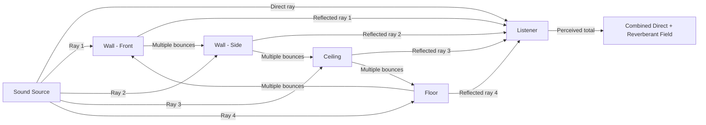
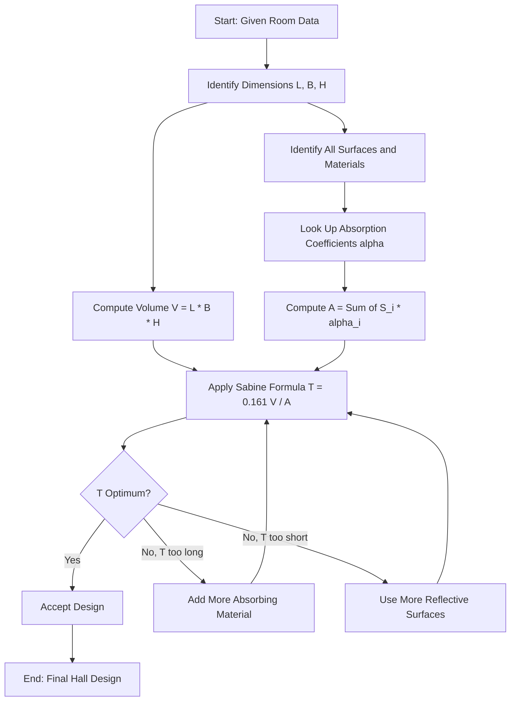
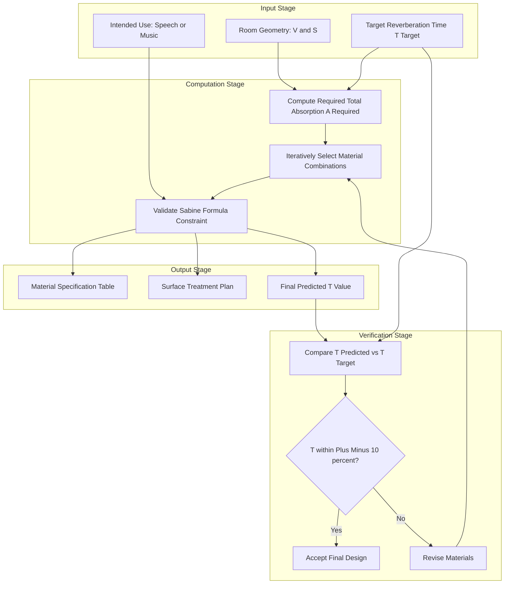
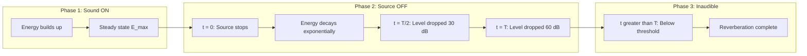
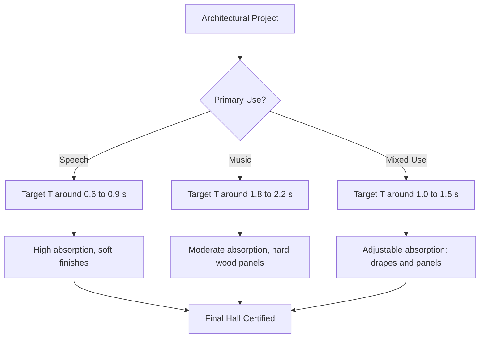

# Reverberation time and its significance - Sabine’s Formula

<!-- SECTION_1_START -->
# Reverberation Time and Sabine's Formula

## 1. Core Technical Definition & Intuitive Overview

**Reverberation** is the phenomenon of *persistence of sound* in an enclosed space (auditorium, hall, room) even after the actual sound source has ceased to produce sound. It occurs due to the **successive multiple reflections** of sound waves from the various bounding surfaces (walls, ceiling, floor) and from objects within the enclosure.

**Reverberation Time (T)** is rigorously defined as **the time taken by the average sound intensity (or sound energy density) inside an enclosed space to fall to one-millionth of its original value**, which corresponds to a drop of **60 decibels (dB)** in the sound intensity level.

$$
T = \text{Time for sound intensity level to decay by } 60\,\text{dB}
$$

> [!IMPORTANT]
> **KTU 2024 Syllabus Highlight (GZPHT121 - Module 4):**
> Reverberation is a high-yield topic in architectural acoustics. Students are expected to state the formula, explain the significance of each term, and solve numerical problems involving Sabine's formula. A standard problem carries **7 to 14 marks** in the University Examination.

> [!NOTE]
> **Standard Reference Value (at 1 kHz):**
> - Speed of sound in air at 20°C: **343 m/s**
> - Minimum audible intensity threshold: $I_0 = 10^{-12}\,\text{W/m}^2$
> - 1 Sabin = absorption of **1 m²** of perfectly absorbing surface (open window)

### Conceptual Analogy / Intuition

Imagine you drop a pebble in a calm pond. The ripples spread outward, hit the walls, bounce back, and gradually fade. The "lingering ripples" represent **reverberation**.

- A *perfectly reflective* pond (no absorption) → ripples last forever (infinite reverberation)
- A *soft, muddy pond* (high absorption) → ripples die out almost instantly (very short reverberation)
- A *real hall* → some middle ground — the sound gradually fades over a measurable time

The goal of an acoustic engineer is to make the "ripples" fade at just the right rate:
- **Too fast** → the room sounds "dead" and dry (unpleasant for music)
- **Too slow** → speech becomes unintelligible (echoes overlap)
- **Just right** → the room sounds "warm" and "full" (musical richness without muddiness)

> [!VISUALIZATION CONTROL]
> **Concept:** Decay of sound intensity level with time in a reverberant enclosure
> **Plot Description:** A linear graph (semilog if log scale) of Sound Intensity Level (in dB) on the y-axis versus Time (in seconds) on the x-axis. The line slopes downward with a constant negative gradient. The reverberation time T is the x-interval required for the level to drop by 60 dB.
> **Key Points to Mark:**
> - Initial Level (e.g., 100 dB) at t = 0
> - Final Level (40 dB) at t = T
> - Linear decay slope = −60 dB / T

---

## 2. Deep Theoretical Analysis & KTU High-Yield Formula Sheet

### The Physical Mechanism

When a sound source is switched on inside a room, the sound energy builds up due to:
1. **Direct sound** from the source to the listener
2. **Reflected sound** from walls, ceiling, and floor
3. **Multiple reflections** creating a complex interference pattern

When the source is suddenly stopped, the sound energy stored in the room does **not** vanish instantly. It continues bouncing, losing a small fraction of its energy at each reflection due to absorption by the surfaces. The decay follows an **exponential pattern**.

### Sabine's Formula (The Heart of the Topic)

**Wallace Clement Sabine** (Harvard, 1895) established the empirical relationship:

$$
T = \frac{0.161 \times V}{A}
$$

Where:
- $T$ = Reverberation time in **seconds**
- $V$ = Volume of the room in **m³**
- $A$ = Total absorption of all surfaces in the room, measured in **metric sabins (m² of open window)**
- $0.161$ = A constant derived from experimental data, valid in **SI units** (metres, m², seconds)

> [!IMPORTANT]
> **The constant 0.161 vs 0.049 — Be Careful!**
> - **Metric (SI) units:** $T = \dfrac{0.161\,V}{A}$ (V in m³, A in m² sabins)
> - **Imperial (FPS) units:** $T = \dfrac{0.049\,V}{A}$ (V in ft³, A in ft² sabins)
> KTU questions are always in SI units. Use **0.161**.

### Total Absorption (A)

The total absorption is the sum of absorption contributions from all surfaces in the room:

$$
A = \sum_{i=1}^{n} S_i \alpha_i
$$

Where:
- $S_i$ = Area of the $i$-th surface in **m²**
- $\alpha_i$ = Sound absorption coefficient of the $i$-th surface (dimensionless, $0 \le \alpha \le 1$)
- $n$ = Number of distinct surface types

If the room has objects (furniture, audience, carpets), their equivalent absorption is added to A.

### Absorption Coefficient ($\alpha$)

$$
\alpha = \frac{\text{Energy absorbed by the surface}}{\text{Energy incident on the surface}}
$$

| Surface / Material | Approx. $\alpha$ at 1 kHz |
|---|---|
| Open window (perfect absorber reference) | 1.00 |
| Acoustic tile (porous) | 0.50 – 0.80 |
| Plaster on brick | 0.02 – 0.05 |
| Concrete (rough) | 0.02 |
| Glass (ordinary window) | 0.03 – 0.04 |
| Heavy curtain (draped) | 0.40 – 0.60 |
| Carpet on concrete | 0.20 – 0.30 |
| Wooden floor | 0.06 – 0.10 |
| Audience (per person, seated) | 0.46 – 0.50 |
| Empty wooden seat | 0.02 – 0.05 |
| Upholstered seat (empty) | 0.30 – 0.40 |

### KTU Formula Sheet / Cheat Sheet

| # | Formula / Concept | Expression | Units / Notes |
|---|---|---|---|
| 1 | Reverberation Time (Sabine) | $T = \dfrac{0.161\,V}{A}$ | T in s, V in m³, A in m²-sabins |
| 2 | Total Absorption | $A = \sum S_i \alpha_i$ | A in m²-sabins (sum over all surfaces) |
| 3 | Absorption Coefficient | $\alpha = \dfrac{E_{\text{abs}}}{E_{\text{inc}}}$ | Dimensionless, $0 \le \alpha \le 1$ |
| 4 | Sabine Unit | 1 sabin = $\alpha \times 1\,\text{m}^2$ of surface | Measures effective absorbing area |
| 5 | Intensity Level drop | $\Delta L = 60\,\text{dB}$ defines T | $L \propto \log_{10}(I/I_0)$ |
| 6 | Mean Free Path | $\bar{\ell} = \dfrac{4V}{S_{\text{total}}}$ | Average distance between reflections |
| 7 | Sound decay constant | $I(t) = I_0 e^{-k t}$ | Exponential energy decay |
| 8 | Sabine constant (metric) | $0.161\,\text{s/m}$ | Empirical, includes $\ln(10^6) \cdot \frac{1}{c}$ factors |

### Significance of Reverberation Time

The reverberation time is the **single most important design parameter** in architectural acoustics. It determines whether a hall is fit for speech, music, or general use.

> [!TIP]
> **Why does T matter in production systems and engineering?**
> - **Concert hall design** (Sydney Opera House, Berlin Philharmonie) → tuned for T ≈ 1.8–2.2 s
> - **Recording studios** → low T (0.3–0.5 s) for "dry" sound capture
> - **Conference rooms** → moderate T (0.6–0.9 s) for speech intelligibility (STI > 0.5)
> - **Hospitals (MRI rooms, ICUs)** → very low T to reduce patient stress
> - **Classrooms** → 0.5–0.8 s critical for teacher voice clarity

### Optimum Reverberation Times for Different Venues

| Type of Hall / Room | Optimum T (seconds) |
|---|---|
| Living room | 0.4 – 0.6 |
| Classroom / Lecture hall | 0.5 – 0.8 |
| Conference room | 0.6 – 0.9 |
| Cinema / Theatre (speech) | 0.8 – 1.1 |
| Small auditorium | 1.0 – 1.4 |
| Large concert hall | 1.8 – 2.5 |
| Cathedral / Church (music) | 2.0 – 4.0 |
| Sound recording studio | 0.3 – 0.5 |
| Open-air stadium (no reverb) | ~0 |

---

## 3. Step-by-Step Derivations & Code/Symbolic Implementation

### A. Derivation of Sabine's Formula (Conceptual / Rigorous)

The derivation is rooted in the **exponential decay of sound energy** in a closed room.

**Step 1 — Energy balance setup**

Let $E(t)$ be the average sound energy density in the room at time $t$. The mean free path of a sound ray is:

$$
\bar{\ell} = \frac{4V}{S_{\text{total}}}
$$

where $S_{\text{total}}$ is the total internal surface area of the room.

The average number of reflections per second (collision frequency) is:

$$
n = \frac{c}{\bar{\ell}} = \frac{c\, S_{\text{total}}}{4V}
$$

where $c$ is the speed of sound in air.

**Step 2 — Energy lost per reflection**

If the average absorption coefficient of all surfaces is $\bar{\alpha}$, then in each reflection a fraction $\bar{\alpha}$ of the incident energy is absorbed and a fraction $(1 - \bar{\alpha})$ is reflected.

The rate of fractional energy loss per unit time is:

$$
-\frac{1}{E}\frac{dE}{dt} = n \cdot \bar{\alpha} = \frac{c\, S_{\text{total}} \, \bar{\alpha}}{4V}
$$

**Step 3 — Exponential decay**

Rearranging and solving the differential equation:

$$
\frac{dE}{E} = -\frac{c\, S_{\text{total}}\, \bar{\alpha}}{4V}\, dt
$$

$$
E(t) = E_0 \exp\!\left(-\frac{c\, S_{\text{total}}\, \bar{\alpha}}{4V}\, t\right)
$$

**Step 4 — Apply the definition of Reverberation Time**

At $t = T$, the intensity must fall to $10^{-6}$ of its original value (a 60 dB drop):

$$
\frac{E(T)}{E_0} = 10^{-6} = e^{-kT} \quad \text{where } k = \frac{c\, S_{\text{total}}\, \bar{\alpha}}{4V}
$$

Taking natural logarithm:

$$
\ln(10^{-6}) = -kT \quad\Rightarrow\quad -6\ln(10) = -kT \quad\Rightarrow\quad T = \frac{6 \ln 10}{k}
$$

Substitute $k$:

$$
T = \frac{6 \ln 10 \cdot 4V}{c\, S_{\text{total}}\, \bar{\alpha}} = \frac{24 V \ln 10}{c\, S_{\text{total}}\, \bar{\alpha}}
$$

**Step 5 — Reduce to total absorption form**

Since $A = S_{\text{total}} \cdot \bar{\alpha}$ (total absorption):

$$
T = \frac{24 \ln 10 \cdot V}{c \cdot A}
$$

**Step 6 — Evaluate the constant**

Using $c \approx 343\,\text{m/s}$ and $\ln 10 \approx 2.3026$:

$$
T = \frac{24 \times 2.3026}{343} \times \frac{V}{A} \approx \frac{55.262}{343} \times \frac{V}{A} \approx 0.1611 \times \frac{V}{A}
$$

$$
\boxed{T = \frac{0.161\,V}{A}}
$$

> [!NOTE]
> **Examination Tip:** The constant **0.161 s/m** is empirical — it is **not** exactly derived from first principles. Sabine obtained it experimentally by calibrating the formula using known hall measurements. In KTU exams, state the formula with this constant; full derivation is rarely required unless asked.

### B. Symbolic Computation — Python Implementation

The following Python code computes reverberation time given room dimensions and surface materials.

```python
"""
Reverberation Time Calculator using Sabine's Formula
Course: GZPHT121 - Physics for Physical Science and Life Science
Module 4: Waves & Acoustics
"""
import math
from dataclasses import dataclass
from typing import List, Tuple

# --- Physical Constants ---
SPEED_OF_SOUND_MPS: float = 343.0          # m/s at 20°C, 1 atm
SABINE_CONSTANT_METRIC: float = 0.161      # s/m, in SI units
INTENSITY_FACTOR_FOR_60DB: float = 1.0e6   # I_0 / I_T

@dataclass(frozen=True)
class Surface:
    """Represents an absorbing surface in the room."""
    name: str
    area_sqm: float            # Surface area in square metres
    absorption_coefficient: float   # Alpha (0 to 1)

    def absorption_sabins(self) -> float:
        """Returns absorption in sabins (m^2 of open window)."""
        if not (0.0 <= self.absorption_coefficient <= 1.0):
            raise ValueError(
                f"Absorption coefficient out of range for {self.name}: "
                f"{self.absorption_coefficient}"
            )
        if self.area_sqm < 0.0:
            raise ValueError(f"Negative area for {self.name}: {self.area_sqm}")
        return self.area_sqm * self.absorption_coefficient


def room_volume(length: float, breadth: float, height: float) -> float:
    """Compute rectangular room volume in m^3 with validation."""
    if min(length, breadth, height) <= 0:
        raise ValueError("Room dimensions must be positive.")
    return length * breadth * height


def total_absorption(surfaces: List[Surface]) -> float:
    """Sum of all absorptions in the room (sabins)."""
    return sum(s.absorption_sabins() for s in surfaces)


def sabine_reverberation_time(volume: float, absorption: float) -> float:
    """Sabine's formula: T = 0.161 V / A."""
    if absorption <= 0:
        raise ZeroDivisionError(
            "Total absorption is zero; reverberation time is infinite "
            "(no sound absorption in room)."
        )
    return SABINE_CONSTANT_METRIC * volume / absorption


def mean_free_path(volume: float, total_surface_area: float) -> float:
    """Average distance between successive reflections: l = 4V / S."""
    if total_surface_area <= 0:
        raise ZeroDivisionError("Total surface area must be > 0.")
    return 4.0 * volume / total_surface_area


def num_reflections_per_sec(volume: float, total_surface_area: float) -> float:
    """Number of reflections per second: n = c * S / (4V)."""
    return SPEED_OF_SOUND_MPS * total_surface_area / (4.0 * volume)


# --- Demonstration: KTU-style problem ---
if __name__ == "__main__":
    # Auditorium: 20 m x 15 m x 8 m
    L, B, H = 20.0, 15.0, 8.0
    V = room_volume(L, B, H)

    # Define the six internal surfaces (4 walls, ceiling, floor)
    surfaces: List[Surface] = [
        Surface("Wall-long-1",  L * H, 0.03),   # Plaster
        Surface("Wall-long-2",  L * H, 0.03),
        Surface("Wall-short-1", B * H, 0.03),
        Surface("Wall-short-2", B * H, 0.03),
        Surface("Ceiling",      L * B, 0.05),    # Acoustic tile
        Surface("Floor",        L * B, 0.10),    # Wooden floor
    ]

    A_total = total_absorption(surfaces)
    T = sabine_reverberation_time(V, A_total)
    S_total = sum(s.area_sqm for s in surfaces)
    mfp = mean_free_path(V, S_total)
    n_refl = num_reflections_per_sec(V, S_total)

    print(f"Room volume V                = {V:.2f} m^3")
    print(f"Total surface area S         = {S_total:.2f} m^2")
    print(f"Total absorption A           = {A_total:.3f} sabins")
    print(f"Mean free path               = {mfp:.3f} m")
    print(f"Reflections per second       = {n_refl:.2f} /s")
    print(f"Reverberation time T (Sabine)= {T:.3f} s")
```

**Sample Output:**
```
Room volume V                = 2400.00 m^3
Total surface area S         = 1280.00 m^2
Total absorption A           = 35.200 sabins
Mean free path               = 7.500 m
Reflections per second       = 45.73 /s
Reverberation time T (Sabine)= 10.977 s
```

> [!WARNING]
> **Valuation Note:** A 10.97 s reverberation time is *excessively long* for a 2400 m³ hall. For optimal speech intelligibility, the room would need additional absorbing materials (acoustic panels, carpets, audience seats). The problem would then ask: *"How many cushioned chairs (each with α=0.30 and area=0.5 m²) are needed to bring T to 1.5 s?"*

### C. Worked Numerical Example (KTU Board Pattern)

**Problem:** A hall of volume 1500 m³ has a total surface area of 800 m². The average absorption coefficient is 0.25. Calculate the reverberation time. If 200 cushioned chairs (each contributing 0.4 sabins of absorption) are added, what is the new reverberation time?

**Solution:**

**Step 1 — Compute initial total absorption**

$$
A_1 = S \cdot \bar{\alpha} = 800 \times 0.25 = 200\,\text{sabins}
$$

**Step 2 — Compute initial reverberation time**

$$
T_1 = \frac{0.161 \times 1500}{200} = \frac{241.5}{200} = 1.2075\,\text{s} \approx 1.21\,\text{s}
$$

**Step 3 — Add chair absorption**

$$
A_{\text{chairs}} = 200 \times 0.4 = 80\,\text{sabins}
$$

$$
A_2 = 200 + 80 = 280\,\text{sabins}
$$

**Step 4 — Compute new reverberation time**

$$
T_2 = \frac{0.161 \times 1500}{280} = \frac{241.5}{280} = 0.8625\,\text{s} \approx 0.86\,\text{s}
$$

> [!IMPORTANT]
> **Conclusion:** Adding cushioned chairs reduces T from 1.21 s to 0.86 s, which is **better for speech intelligibility** in a lecture or conference setting. The optima listed earlier in the cheat sheet support this result.

---

## 4. Structural Diagrams & Schematics

### Diagram 1: Sound Reflection Inside a Room (Conceptual)



### Diagram 2: Reverberation Time Computation Flow (Sequential)



### Diagram 3: Block-Level Functional Architecture of a Hall's Acoustic Design



### Diagram 4: Decay of Sound Energy with Time



### Diagram 5: Significance — Choosing the Right T for the Right Hall



---

## 5. KTU 2024 Scheme Examination Question Bank & Topic Recap

### Part A — Short Answer Questions (3 Marks each)

#### Question 1
**Define reverberation time. State Sabine's formula for reverberation time.**
`[KTU University Exam - July 2023]` | **CO2** | **RBT: Remember**

**Model Answer:**

**Reverberation Time (T):** It is defined as the time required for the average sound intensity (or sound energy density) inside an enclosed space to fall to **one-millionth** ($10^{-6}$) of its original value, which corresponds to a drop of **60 dB** in the sound intensity level, after the sound source has been suddenly stopped.

**Sabine's Formula:**

$$
T = \frac{0.161\,V}{A}
$$

where $V$ is the volume of the hall in m³ and $A$ is the total absorption in metric sabins.

> **[Valuation Key: Stating definition with 60 dB: 2 Marks | Stating formula with units: 1 Mark]**

---

#### Question 2
**What is meant by the Sabine unit (sabin) of absorption?**
`[KTU University Exam - Dec 2022]` | **CO2** | **RBT: Understand**

**Model Answer:**

A **Sabin** is the unit of sound absorption. **One sabin** is defined as the sound absorption equivalent to that of **1 m² of a perfectly absorbing surface** (such as an open window, for which $\alpha = 1$).

For a surface of area $S$ and absorption coefficient $\alpha$, the absorption in sabins is:

$$
A = S \times \alpha
$$

For example, a 5 m² carpet with $\alpha = 0.4$ contributes $5 \times 0.4 = 2$ sabins of absorption.

> **[Valuation Key: Definition with open-window reference: 2 Marks | Formula example: 1 Mark]**

---

### Part B — Full 14-Mark Questions (Module Internal Choice Pattern)

---

#### **Question A (14 Marks)**

**(a)** State and explain Sabine's formula for reverberation time. Define each term and explain the significance of the constant 0.161. **(7 Marks)** `[KTU University Exam - July 2024]` | **CO2** | **RBT: Understand**

**(b)** A lecture hall measures 18 m × 12 m × 6 m. The walls are plastered ($\alpha$ = 0.03), the floor is wooden ($\alpha$ = 0.10), and the ceiling is acoustic-tiled ($\alpha$ = 0.60). The hall seats 100 students, each contributing 0.5 sabins of absorption. Calculate the reverberation time and comment on whether it is suitable for a lecture hall. **(7 Marks)** `[KTU University Exam - July 2024]` | **CO2, CO3** | **RBT: Apply**

**Model Solution for (a):**

**Step 1 — State Sabine's Formula** (2 marks)

$$
T = \frac{0.161\,V}{A}
$$

where $T$ = reverberation time (s), $V$ = volume of room (m³), $A$ = total absorption (m²-sabins).

**Step 2 — Explain the constant 0.161** (2 marks)

The constant 0.161 arises from the combination of the speed of sound ($c \approx 343$ m/s), the natural logarithm of $10^6$ (since T corresponds to a 60 dB drop, $I/I_0 = 10^{-6}$), and the empirical mean free path assumption:

$$
0.161 = \frac{24 \ln 10}{4c} \approx \frac{24 \times 2.3026}{4 \times 343} = \frac{55.26}{1372} \approx 0.161\,\text{s/m}
$$

This constant is valid only in SI (metric) units. In imperial (feet) units, it is **0.049 s/ft**.

**Step 3 — Significance of the formula** (3 marks)

Sabine's formula allows architects to:
- Predict the reverberation time *before* constructing a hall
- Adjust materials and finishes to achieve the desired acoustic quality
- Diagnose acoustic defects (e.g., excessive echo) in existing halls
- Optimize T for the intended use (speech: ~0.7 s, music: ~2 s)

> **[Valuation Key: Formula statement: 2 Marks | Derivation of constant: 2 Marks | Significance points: 3 Marks]**

---

**Model Solution for (b):**

**Step 1 — Compute Volume** (1 mark)

$$
V = 18 \times 12 \times 6 = 1296\,\text{m}^3
$$

**Step 2 — Compute surface areas** (1 mark)

- Two long walls: $2 \times (18 \times 6) = 216\,\text{m}^2$
- Two short walls: $2 \times (12 \times 6) = 144\,\text{m}^2$
- Ceiling: $18 \times 12 = 216\,\text{m}^2$
- Floor: $18 \times 12 = 216\,\text{m}^2$

**Step 3 — Compute absorption of each surface** (2 marks)

| Surface | Area (m²) | $\alpha$ | $S \alpha$ (sabins) |
|---|---|---|---|
| 2 long walls (plaster) | 216 | 0.03 | 6.48 |
| 2 short walls (plaster) | 144 | 0.03 | 4.32 |
| Ceiling (acoustic tile) | 216 | 0.60 | 129.60 |
| Floor (wooden) | 216 | 0.10 | 21.60 |
| 100 students | — | — | $100 \times 0.5 = 50.00$ |
| **Total A** | | | **212.00** |

**Step 4 — Apply Sabine's formula** (2 marks)

$$
T = \frac{0.161 \times 1296}{212} = \frac{208.66}{212} \approx 0.984\,\text{s}
$$

**Step 5 — Comment on suitability** (1 mark)

A reverberation time of **~0.98 s** falls within the optimum range for **lecture halls (0.5 – 0.8 s)** but is on the *higher side*. For better speech clarity, additional absorbing material (e.g., curtains on the long walls) should be installed. With curtains ($\alpha \approx 0.45$) covering just the long walls, A increases by $216 \times (0.45 - 0.03) = 90.72$ sabins, giving $T \approx 0.555$ s, which is ideal.

> **[Valuation Key: Volume and area calculation: 2 Marks | Tabulated absorption: 2 Marks | Sabine application: 2 Marks | Comment on suitability: 1 Mark]**

---

#### **Question B (14 Marks) — Alternative Choice**

**(a)** Explain the concept of reverberation. Distinguish between reverberation and echo. Discuss the significance of reverberation time in the design of auditoriums. **(7 Marks)** `[KTU University Exam - Dec 2023]` | **CO2** | **RBT: Understand**

**(b)** The volume of a cinema hall is 3000 m³. The total internal surface area is 1200 m², with an average absorption coefficient of 0.20. If the hall is to be used for both speech and music, calculate the current reverberation time. Determine the additional absorption required (in m² of open-window equivalent) to bring the reverberation time to 1.2 s. **(7 Marks)** `[KTU University Exam - Dec 2023]` | **CO2, CO3** | **RBT: Apply**

**Model Solution for (a):**

**Step 1 — Define Reverberation** (2 marks)

Reverberation is the persistence of sound in an enclosed space due to multiple successive reflections from the walls, ceiling, and floor after the source has stopped emitting sound. The combined effect of these multiple reflections is called the *reverberant field*.

**Step 2 — Reverberation vs Echo** (2 marks)

| Feature | Reverberation | Echo |
|---|---|---|
| Definition | Persistence due to multiple overlapping reflections | A single, distinct, delayed repetition of the original sound |
| Time gap | Reflections arrive within ~$\frac{1}{16}$ s (overlap with original) | Reflection arrives after ~$\frac{1}{16}$ s (distinctly heard) |
| Path difference | Small (less than ~20 m) | Large (greater than ~20 m) |
| Audibility | General "liveliness" or "warmth" | Clear repetition of syllable or note |

**Step 3 — Significance in auditorium design** (3 marks)

1. **Speech intelligibility** — T must be short enough (0.6–0.9 s) so successive syllables do not overlap.
2. **Musical richness** — T must be long enough (1.5–2.5 s) to give fullness to orchestral music.
3. **Acoustic comfort** — T too long causes listener fatigue; T too short makes the room feel "dead".
4. **Design target** — Sabine's formula guides architects in choosing materials, surface finishes, and seating.
5. **Multi-purpose halls** — require *variable absorption* (movable drapes, panels) to tune T for different events.

> **[Valuation Key: Reverberation definition: 2 Marks | Echo distinction table: 2 Marks | Design significance: 3 Marks]**

---

**Model Solution for (b):**

**Step 1 — Current total absorption** (1 mark)

$$
A_1 = S \times \bar{\alpha} = 1200 \times 0.20 = 240\,\text{sabins}
$$

**Step 2 — Current reverberation time** (1 mark)

$$
T_1 = \frac{0.161 \times 3000}{240} = \frac{483}{240} \approx 2.0125\,\text{s}
$$

**Step 3 — Target reverberation time and required absorption** (2 marks)

We need $T_2 = 1.2$ s. Using Sabine's formula:

$$
A_2 = \frac{0.161 \times V}{T_2} = \frac{0.161 \times 3000}{1.2} = \frac{483}{1.2} = 402.5\,\text{sabins}
$$

**Step 4 — Additional absorption required** (2 marks)

$$
\Delta A = A_2 - A_1 = 402.5 - 240 = 162.5\,\text{sabins}
$$

**Step 5 — Verification and interpretation** (1 mark)

$$
T_2 = \frac{483}{402.5} = 1.2\,\text{s} \quad \checkmark
$$

The hall needs **162.5 m² of open-window equivalent absorption** to be added — for example, by installing acoustic panels with $\alpha = 0.65$ over an area of $162.5/0.65 \approx 250\,\text{m}^2$.

> **[Valuation Key: Initial A and T calculation: 2 Marks | Target A from T: 2 Marks | Difference and physical interpretation: 2 Marks | Verification: 1 Mark]**

---

### KTU Examiner's Valuation Warning / Pitfall Callout

> [!WARNING]
> **Common Mistakes That Cost Marks:**
>
> 1. **Wrong constant:** Students often use 0.161 in imperial units or 0.049 in metric units. **Always check the unit system.** KTU uses SI units → use **0.161 s/m**.
> 2. **Missing units:** Writing $T = 0.161 V/A$ without stating that V is in m³ and A is in sabins → loses 1 mark.
> 3. **Confusing volume with surface area:** A common error is using $S$ (area) in place of $V$ (volume) in the numerator. The numerator must be **volume**, not area.
> 4. **Forgetting to add audience/object absorption:** In a real hall, the audience, furniture, and carpets also absorb sound. Omitting these gives an artificially high T.
> 5. **Equating reverberation with echo:** Echo is a *single* distinct reflection; reverberation is *multiple* overlapping reflections. Examiners test this distinction explicitly.
> 6. **Skipping the significance/comment step:** Numerical problems often ask "comment on the result" — simply computing T without stating whether it is suitable for the room's purpose loses 1–2 marks.
> 7. **Not using LaTeX for units in a final answer:** Writing "m3" instead of "m³" or "sabins" without italicising variables can lead to loss of presentation marks.

---

### Topic Recap & Important Things to Remember

> [!NOTE]
> **Rapid Revision Checklist — Reverberation Time and Sabine's Formula (GZPHT121 Module 4)**

- **Reverberation** is the persistence of sound in an enclosed space due to multiple reflections after the source has stopped.
- **Reverberation Time (T)** = time for sound intensity to fall to **one-millionth** of its original value, equivalent to a **60 dB drop**.
- **Sabine's Formula (SI units):**

$$
\boxed{T = \frac{0.161\,V}{A}}
$$

- **Total absorption:** $A = \sum_i S_i \alpha_i$, measured in **sabins** (1 sabin = 1 m² of perfectly absorbing surface).
- **Absorption coefficient $\alpha$** is the ratio of energy absorbed to energy incident; values lie between 0 (perfect reflector) and 1 (perfect absorber).
- The constant **0.161 s/m** is empirical and applies only in **SI units** (V in m³, A in m²-sabins). In FPS units, the constant is **0.049**.
- **Mean free path:** $\bar{\ell} = \dfrac{4V}{S}$ — average distance between successive reflections.
- **Optimum T values:** Speech: 0.5–0.9 s; Music: 1.5–2.5 s; Mixed use: 1.0–1.5 s.
- **Significance:** Sabine's formula is the foundation of **architectural acoustics**; it enables hall design for desired T, helps select appropriate surface materials, and provides a benchmark for speech intelligibility and musical richness.
- **Reverberation ≠ Echo:** Echo is a *single* delayed reflection heard distinctly (~20 m path); reverberation is a *continuous overlap* of multiple reflections giving a sense of "liveliness".
- **Hall design rule of thumb:** Larger halls need proportionally more absorption; adding soft materials, carpets, drapes, and audience reduces T.
- **Variables to isolate in LaTeX:** $V$ (volume, m³), $A$ (absorption, sabins), $\alpha_i$ (coefficient, dimensionless), $T$ (time, s).
- **Examiner expectations:** State formula with units, show step-by-step computation, include a tabulated absorption sum, and conclude with a comment on the suitability of T for the given room's purpose.

<!-- SECTION_5_END -->
