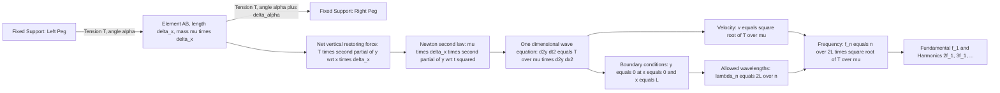
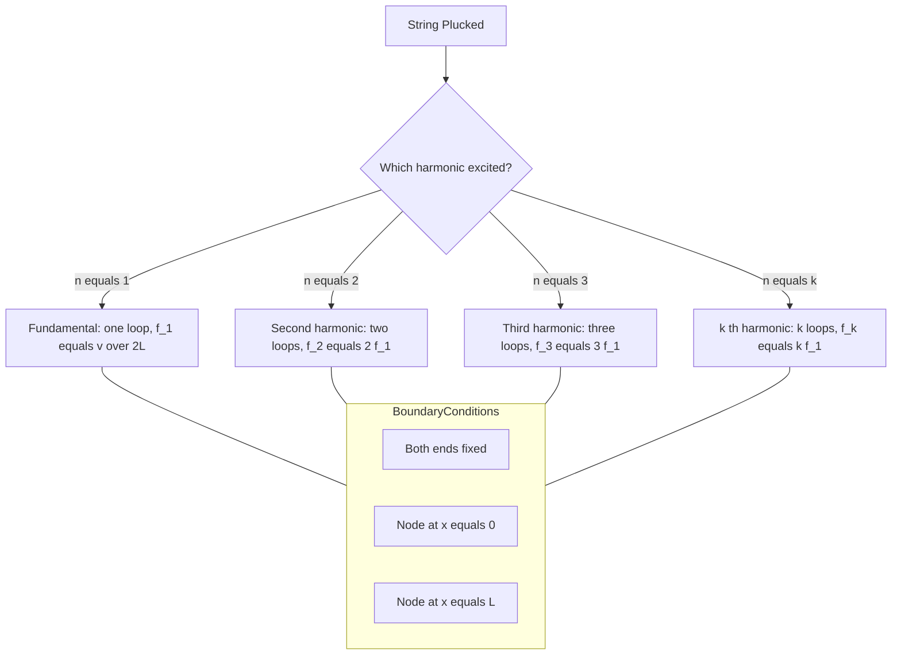
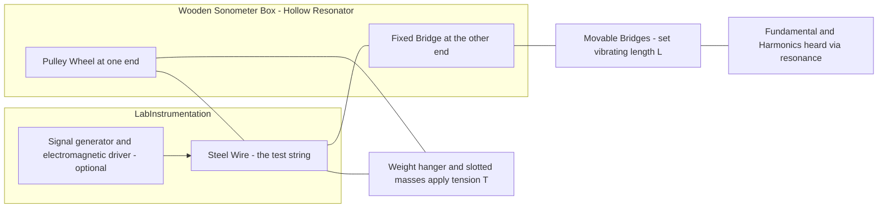
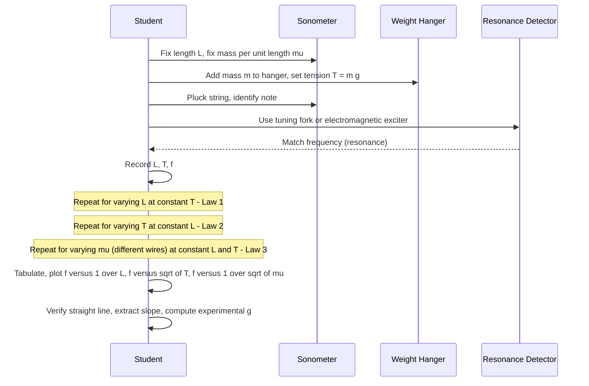

# Transverse vibrations in a stretched string- derivation of velocity and frequency - laws of transverse vibration

<!-- SECTION_1_START -->

# Transverse Vibrations in a Stretched String

> [!IMPORTANT]
> **KTU 2024 Scheme | GZPHT121 | Module 4 — Waves & Acoustics**
> This module is the backbone of musical acoustics, sonometer experiments, and stringed musical instruments. Mastering the derivation of wave velocity and frequency is **non-negotiable** for the End Semester Evaluation (ESE).

## 1.1 Core Technical Definition

A **transverse vibration** in a stretched string is a periodic oscillatory motion in which each particle of the string moves **perpendicular** to the direction of propagation of the wave along the string. When a stretched string (fixed at both ends) is plucked, bowed, or struck, transverse mechanical waves travel along its length, get reflected from the fixed ends, and superimpose to form **standing waves** (or stationary waves). The string then vibrates in discrete, quantized patterns called **normal modes of vibration**.

In KTU 2024 Scheme terminology, the system parameters are defined as:

- **T** $\rightarrow$ Tension applied to the string (in **N** or **dyne**).
- **L** $\rightarrow$ Effective vibrating length of the string (in **m** or **cm**).
- **$\mu$** (or **m**) $\rightarrow$ Linear mass density — mass per unit length (in **kg/m** or **g/cm**).
- **$\rho$** $\rightarrow$ Volume density of the string material (in **kg/m³**).
- **A** $\rightarrow$ Cross-sectional area of the string (in **m²**).
- **D** $\rightarrow$ Diameter of the string (in **m**).
- **v** $\rightarrow$ Velocity of the transverse wave along the string (in **m/s**).
- **f** (or **n / $\nu$**) $\rightarrow$ Frequency of vibration (in **Hz**).
- **$\lambda$** $\rightarrow$ Wavelength of the standing wave (in **m**).

> [!NOTE]
> **Syllabus Highlight:** The relationship $v = \sqrt{\dfrac{T}{\mu}}$ and the frequency expression $f = \dfrac{1}{2L}\sqrt{\dfrac{T}{\mu}}$ for the **fundamental mode** form the two most important results in this module and carry direct 7-mark weightage in ESE.

## 1.2 Conceptual Analogy & Intuitive Overview

> [!TIP]
> **Analogy — The Jumping Rope**
> Imagine two friends holding a skipping rope taut between them. One friend flicks the rope upward. The "bump" travels horizontally toward the other friend, even though every bit of rope only moves up and down. That is exactly what a **transverse wave** is — the wave moves *along* the string, but each particle of the string oscillates *across* (perpendicular to) the string.

If the friends hold the rope and the first friend keeps flicking at just the right rhythm, the rope appears to break up into stationary "loops" or "bellies" — this is the **standing wave** pattern. The slowest rhythm that produces just **one loop** is the **fundamental** (1st harmonic), the next one with **two loops** is the **1st overtone / 2nd harmonic**, and so on.

Three real-world engineering systems where this happens:

1. **Guitar / Violin / Veena / Sitar** — strings stretched over a soundboard.
2. **Sonometer** — the standard KTU laboratory apparatus.
3. **Piano and Harpsichord** — struck strings.

The pitch (frequency) of the note depends on **how tightly the string is stretched**, **how long the vibrating portion is**, **how thick the string is**, and **what it is made of**. These dependencies are precisely the three **Laws of Transverse Vibration** derived from the fundamental formula.

## 1.3 Visualization of Standing Waves

> [!VISUALIZATION CONTROL]
> **Concept:** Standing wave (normal mode) of a string fixed at both ends, showing the fundamental, 2nd, and 3rd harmonics.
> **GeoGebra / Desmos Input Equations (parameterised):**
> * Fundamental ($n=1$): $y(x,t) = A\sin\left(\dfrac{\pi x}{L}\right)\cos(\omega t)$
> * 2nd Harmonic ($n=2$): $y(x,t) = A\sin\left(\dfrac{2\pi x}{L}\right)\cos(2\omega t)$
> * 3rd Harmonic ($n=3$): $y(x,t) = A\sin\left(\dfrac{3\pi x}{L}\right)\cos(3\omega t)$
>
> **Visual Description:** Set $A = 1$, $L = 1$, $\omega = \pi$, and $t = 0$. The student will see the $n=1$ curve form a single arch with a single antinode in the centre, $n=2$ forms a full sine wave with a node in the middle, and $n=3$ forms one-and-a-half sine waves with two internal nodes. The points where the curve crosses zero are **nodes** (always zero displacement); the peaks are **antinodes** (maximum displacement).

## 1.4 Why This Topic Matters in Engineering

Transverse string vibration is not just "physics for physics' sake." It is a foundational model in:

- **Musical Acoustics** — design of stringed instruments, equal-temperament tuning.
- **Non-Destructive Testing (NDT)** — wire rope inspection, bridge cable health monitoring.
- **Ultrasonic Transducers** — piezoelectric crystal resonators use a near-identical wave equation.
- **Civil Engineering** — vibration analysis of cables in suspension bridges and guy wires.
- **Optical Fibre Communication** — light confinement uses the same wave-equation mathematics derived here.

<!-- SECTION_1_END -->

<!-- SECTION_2_START -->

# Deep Theoretical Analysis & KTU High-Yield Formula Sheet

## 2.1 Setting Up the Physical Model

A uniform flexible string of length $L$ and linear mass density $\mu$ is stretched between two rigid supports with a tension $T$. The string is given a small transverse disturbance (plucked). Because the string is **flexible**, it can only support tension — not bending moment or compression. The string is also assumed to be **perfectly elastic** and **homogeneous**.

Assumptions that make the derivation valid:

- The amplitude of vibration is very small compared to the length (small-angle approximation holds).
- The tension $T$ is uniform throughout the string and is much larger than the gravitational pull on the string element.
- The string is uniform, i.e., $\mu$ is constant.
- The medium is non-dissipative (no loss of energy due to friction or air resistance).

> [!IMPORTANT]
> **Why the tension stays constant:** Even when the string is displaced, the change in length is of second order in the slope (i.e., proportional to $\left(\dfrac{\partial y}{\partial x}\right)^2$). For small transverse vibrations this change is negligible, so the tension $T$ can be treated as a **constant** equal to the static tension.

## 2.2 The Three Laws of Transverse Vibration (Sonometer Laws)

> [!NOTE]
> These three laws are direct, experimental consequences of the formula $f = \dfrac{1}{2L}\sqrt{\dfrac{T}{\mu}}$. They were historically discovered using a sonometer and remain an essential KTU lab viva question.

| Law | Statement | Mathematical Form | Holding Constant | Engineering Implication |
|---|---|---|---|---|
| **Law of Length** | The frequency of vibration of a stretched string is **inversely proportional** to its vibrating length, all other factors being constant. | $f \propto \dfrac{1}{L}$ | $T, \mu$ | Pressing a guitar string against a fret shortens $L$, raising the pitch. |
| **Law of Tension** | The frequency of vibration is **directly proportional** to the square root of the tension in the string, all other factors being constant. | $f \propto \sqrt{T}$ | $L, \mu$ | Tuning a guitar: tightening the peg increases $T$ and raises the pitch. |
| **Law of Mass (Density)** | The frequency of vibration is **inversely proportional** to the square root of the linear mass density of the string, all other factors being constant. | $f \propto \dfrac{1}{\sqrt{\mu}}$ | $L, T$ | Bass strings are thick (high $\mu$ $\rightarrow$ low $f$); treble strings are thin. |

## 2.3 KTU Formula Cheat Sheet — All High-Yield Equations

> [!TIP]
> **Memorise this table cold.** Every numerical problem on this topic reduces to one of these equations.

| # | Quantity | Formula | Units (SI) | Conditions of Validity |
|---|---|---|---|---|
| 1 | Velocity of transverse wave | $v = \sqrt{\dfrac{T}{\mu}}$ | m/s | String under tension $T$ with linear mass density $\mu$ |
| 2 | Velocity in terms of volume density | $v = \sqrt{\dfrac{T}{\rho A}}$ | m/s | $\mu = \rho A$ |
| 3 | Velocity in terms of diameter | $v = \sqrt{\dfrac{4T}{\pi \rho D^2}}$ | m/s | $A = \dfrac{\pi D^2}{4}$ |
| 4 | Fundamental frequency | $f_1 = \dfrac{1}{2L}\sqrt{\dfrac{T}{\mu}}$ | Hz | String fixed at **both** ends |
| 5 | $n$-th harmonic frequency | $f_n = \dfrac{n}{2L}\sqrt{\dfrac{T}{\mu}} = n f_1$ | Hz | $n = 1, 2, 3, \dots$ |
| 6 | Wavelength of $n$-th harmonic | $\lambda_n = \dfrac{2L}{n}$ | m | Standing wave in fixed string |
| 7 | Angular frequency | $\omega_n = \dfrac{n\pi}{L}\sqrt{\dfrac{T}{\mu}}$ | rad/s | — |
| 8 | Combined law (full Sonometer equation) | $f = \dfrac{n}{2L}\sqrt{\dfrac{T}{\mu}}$ | Hz | General |
| 9 | Frequency ratio on doubling tension | $\dfrac{f'}{f} = \sqrt{2}$ | dimensionless | $T \rightarrow 2T$ |
| 10 | Frequency ratio on halving length | $\dfrac{f'}{f} = 2$ | dimensionless | $L \rightarrow L/2$ |

> [!WARNING]
> **Valuation Pitfall — KTU 2024:** The frequency formula $\dfrac{n}{2L}\sqrt{\dfrac{T}{\mu}}$ applies **only** when the string is fixed at **both** ends. If one end is free (open organ pipe analogue), the boundary conditions change and the formula becomes $f = \dfrac{n}{4L}\sqrt{\dfrac{T}{\mu}}$ with $n = 1, 3, 5, \dots$ (odd harmonics only). Examiners specifically look for the **boundary condition statement** before writing the frequency formula.

## 2.4 Real-World Engineering Utility

In the **automotive industry**, the tension in timing belts and drive belts is engineered precisely so that the transverse wave speed matches a specific resonance frequency, avoiding harmonic chatter. In **bridge engineering**, stay-cables are tuned (using dampers) to avoid transverse vibrations caused by wind (the classic **Tacoma Narrows** failure mode). In **NDT inspection**, the string analogue is used with ultrasonic Lamb waves to detect micro-cracks in thin plates. Every modern **laser-based string instrument tuner** uses the $f \propto 1/L$ and $f \propto \sqrt{T}$ laws in its DSP algorithm to compute the precise note.

<!-- SECTION_2_END -->

<!-- SECTION_3_START -->

# Step-by-Step Derivations & Symbolic Implementation

## 3.1 Derivation 1 — Velocity of a Transverse Wave in a Stretched String

> [!NOTE]
> **Mark allocation in KTU ESE (typical 7-mark question):**
> • Diagram of element with forces — 2 marks
> • Net restoring force derivation — 2 marks
> • Application of Newton's second law — 2 marks
> • Final simplified expression — 1 mark

### Setup

Consider a small element $AB$ of the stretched string of length $\delta x$ located at position $x$. The string has linear mass density $\mu$ and is under a uniform tension $T$. The element is displaced transversely by a small amount $y(x, t)$.

The tangent to the string at point $A$ makes a small angle $\alpha$ with the horizontal, and the tangent at point $B$ makes a slightly larger angle $\alpha + \delta\alpha$.

### Step 1 — Resolve the tension into components

The tension at $A$ is $T$ directed along the tangent. Its components are:

- Horizontal component: $T \cos(\alpha)$
- Vertical (transverse) component: $T \sin(\alpha)$ directed **downward** (restoring)

The tension at $B$ has components:

- Horizontal component: $T \cos(\alpha + \delta\alpha)$
- Vertical component: $T \sin(\alpha + \delta\alpha)$ directed **upward** (restoring)

### Step 2 — Apply the small-angle approximation

Because the amplitude is small, $\alpha$ and $\delta\alpha$ are both very small angles, so:

$$
\cos(\alpha) \approx 1, \quad \cos(\alpha + \delta\alpha) \approx 1
$$

$$
\sin(\alpha) \approx \tan(\alpha) = \dfrac{\partial y}{\partial x}\bigg|_{x}, \quad \sin(\alpha + \delta\alpha) \approx \tan(\alpha + \delta\alpha) = \dfrac{\partial y}{\partial x}\bigg|_{x + \delta x}
$$

### Step 3 — Compute the net restoring force

The horizontal forces at the two ends are equal in magnitude and opposite in direction (both $\approx T$), so they **cancel out**. There is no net longitudinal force, which is consistent with the assumption that $T$ is constant.

The net **transverse** (vertical) restoring force on the element is:

$$
F_{\text{net}} = T\sin(\alpha + \delta\alpha) - T\sin(\alpha)
$$

Substituting the small-angle form:

$$
F_{\text{net}} = T\left(\dfrac{\partial y}{\partial x}\bigg|_{x + \delta x} - \dfrac{\partial y}{\partial x}\bigg|_{x}\right)
$$

By the definition of a partial derivative, the bracketed term is $\dfrac{\partial^2 y}{\partial x^2}\delta x$, therefore:

$$
F_{\text{net}} = T\,\dfrac{\partial^2 y}{\partial x^2}\,\delta x
$$

### Step 4 — Apply Newton's second law

The mass of the element is $\mu\,\delta x$. The transverse acceleration of the element is $\dfrac{\partial^2 y}{\partial t^2}$. Therefore:

$$
F_{\text{net}} = (\mu\,\delta x)\,\dfrac{\partial^2 y}{\partial t^2}
$$

Equating the two expressions for the net force:

$$
T\,\dfrac{\partial^2 y}{\partial x^2}\,\delta x = \mu\,\delta x\,\dfrac{\partial^2 y}{\partial t^2}
$$

The $\delta x$ cancels out:

$$
T\,\dfrac{\partial^2 y}{\partial x^2} = \mu\,\dfrac{\partial^2 y}{\partial t^2}
$$

Rearranging:

$$
\dfrac{\partial^2 y}{\partial t^2} = \left(\dfrac{T}{\mu}\right)\dfrac{\partial^2 y}{\partial x^2}
$$

### Step 5 — Compare with the standard wave equation

The general one-dimensional wave equation is:

$$
\dfrac{\partial^2 y}{\partial t^2} = v^2\,\dfrac{\partial^2 y}{\partial x^2}
$$

Comparing term by term:

$$
v^2 = \dfrac{T}{\mu}
$$

Therefore, the velocity of a transverse wave in a stretched string is:

$$
\boxed{\,v = \sqrt{\dfrac{T}{\mu}}\,}
$$

This is the **fundamental result** of this topic. The velocity depends only on the tension and the linear mass density — it is **independent** of the frequency or amplitude of the wave (a hallmark of a *non-dispersive* medium).

> [!IMPORTANT]
> **Key physical insight:** Doubling the tension quadruples the velocity. Quadrupling the mass per unit length halves the velocity. This is why thick bass guitar strings (high $\mu$) need very high tension to sound in the audible range.

## 3.2 Derivation 2 — Frequency of a Stretched String (Fundamental & Harmonics)

### Step 1 — Boundary conditions for a string fixed at both ends

A string of length $L$ stretched between two rigid pegs satisfies:

$$
y(0, t) = 0 \quad \text{and} \quad y(L, t) = 0 \quad \text{for all } t
$$

These are the **node** conditions — the displacement is zero at both ends at all times.

### Step 2 — Solution of the wave equation with these boundary conditions

A standing-wave solution that satisfies both boundary conditions is:

$$
y(x, t) = A\sin(kx)\cos(\omega t)
$$

where $k = \dfrac{2\pi}{\lambda}$ is the wave number and $\omega = 2\pi f$ is the angular frequency.

The wave velocity is related to $\omega$ and $k$ by:

$$
v = \dfrac{\omega}{k} = f\lambda
$$

### Step 3 — Apply the second boundary condition

Substituting $x = L$:

$$
y(L, t) = A\sin(kL)\cos(\omega t) = 0 \quad \text{for all } t
$$

For a non-trivial solution ($A \neq 0$, $\cos(\omega t)$ not identically zero), we must have:

$$
\sin(kL) = 0 \quad \Rightarrow \quad kL = n\pi, \quad n = 1, 2, 3, \dots
$$

So:

$$
k = \dfrac{n\pi}{L}
$$

### Step 4 — Compute the wavelength and frequency

Since $k = \dfrac{2\pi}{\lambda}$:

$$
\dfrac{2\pi}{\lambda} = \dfrac{n\pi}{L} \quad \Rightarrow \quad \boxed{\,\lambda_n = \dfrac{2L}{n}\,}
$$

The frequency is:

$$
f_n = \dfrac{v}{\lambda_n} = \dfrac{v \cdot n}{2L} = \dfrac{n}{2L}\sqrt{\dfrac{T}{\mu}}
$$

Therefore:

$$
\boxed{\,f_n = \dfrac{n}{2L}\sqrt{\dfrac{T}{\mu}}, \quad n = 1, 2, 3, \dots\,}
$$

### Step 5 — Identify the modes

| $n$ | Mode | Wavelength | Frequency | Description |
|---|---|---|---|---|
| 1 | Fundamental (1st harmonic) | $2L$ | $f_1$ | One antinode at the centre |
| 2 | 2nd harmonic (1st overtone) | $L$ | $2f_1$ | One node at the centre |
| 3 | 3rd harmonic (2nd overtone) | $2L/3$ | $3f_1$ | Two internal nodes |
| $n$ | $n$-th harmonic | $2L/n$ | $n f_1$ | $(n-1)$ internal nodes |

> [!TIP]
> **Stringed instruments like the guitar and sitar produce their characteristic timbre precisely because they excite a combination of these harmonics simultaneously, with different relative amplitudes depending on where and how the string is plucked or bowed.**

## 3.3 Derivation 3 — Laws of Transverse Vibration (Sonometer Laws)

The combined Sonometer equation is:

$$
f = \dfrac{n}{2L}\sqrt{\dfrac{T}{\mu}}
$$

### Law 1 — Law of Length

If $T$ and $\mu$ are held constant, then $\dfrac{n}{2}\sqrt{\dfrac{T}{\mu}}$ is a constant, say $k_1$:

$$
f = \dfrac{k_1}{L} \quad \Rightarrow \quad \boxed{\,f \propto \dfrac{1}{L}\,}
$$

> **Physical check:** If the length is halved, the frequency doubles — one octave higher in musical terms.

### Law 2 — Law of Tension

If $L$ and $\mu$ are held constant, then $\dfrac{n}{2L\sqrt{\mu}}$ is a constant, say $k_2$:

$$
f = k_2 \sqrt{T} \quad \Rightarrow \quad \boxed{\,f \propto \sqrt{T}\,}
$$

> **Physical check:** To raise the pitch by one octave, the tension must be quadrupled (since $\sqrt{4} = 2$).

### Law 3 — Law of Mass (Linear Density)

If $L$ and $T$ are held constant, then $\dfrac{n}{2L}\sqrt{T}$ is a constant, say $k_3$:

$$
f = \dfrac{k_3}{\sqrt{\mu}} \quad \Rightarrow \quad \boxed{\,f \propto \dfrac{1}{\sqrt{\mu}}\,}
$$

> **Physical check:** Doubling the linear mass density reduces the frequency by a factor of $\sqrt{2}$.

## 3.4 Numerical Solved Example (KTU Pattern)

**Problem:** A sonometer wire of length $0.80$ m and mass $4.0 \times 10^{-3}$ kg is under a tension of $64$ N. Find (a) the velocity of the transverse wave, (b) the fundamental frequency, and (c) the frequency of the 4th harmonic.

**Given:**

- $L = 0.80$ m
- Mass $m = 4.0 \times 10^{-3}$ kg
- Tension $T = 64$ N
- $\mu = \dfrac{m}{L} = \dfrac{4.0 \times 10^{-3}}{0.80} = 5.0 \times 10^{-3}$ kg/m

### (a) Velocity

$$
v = \sqrt{\dfrac{T}{\mu}} = \sqrt{\dfrac{64}{5.0 \times 10^{-3}}} = \sqrt{12800} \approx 113.1 \text{ m/s}
$$

### (b) Fundamental frequency

$$
f_1 = \dfrac{v}{2L} = \dfrac{113.1}{2 \times 0.80} = \dfrac{113.1}{1.6} \approx 70.7 \text{ Hz}
$$

### (c) 4th harmonic

$$
f_4 = 4 f_1 = 4 \times 70.7 \approx 282.8 \text{ Hz}
$$

> [!WARNING]
> **KTU Valuation Trap:** Do not compute $f$ in Hz using $v$ in cm/s and $L$ in cm. **Unit consistency** is worth 1 full mark in ESE numericals. Always convert to SI units at the very start of the problem.

## 3.5 Python Implementation — Verifying the Sonometer Laws

```python
import math
from typing import Tuple

def sonometer_frequency(
    n: int,
    length_m: float,
    tension_N: float,
    linear_density_kg_per_m: float
) -> float:
    """
    Compute the frequency of the n-th harmonic of a stretched string.

    Parameters
    ----------
    n : int
        Harmonic number (n >= 1).
    length_m : float
        Vibrating length of the string in metres (> 0).
    tension_N : float
        Tension in the string in newtons (> 0).
    linear_density_kg_per_m : float
        Linear mass density in kg/m (> 0).

    Returns
    -------
    float
        Frequency in Hertz.
    """
    if n < 1:
        raise ValueError("Harmonic number 'n' must be a positive integer.")
    if length_m <= 0:
        raise ValueError("Length must be strictly positive.")
    if tension_N <= 0:
        raise ValueError("Tension must be strictly positive.")
    if linear_density_kg_per_m <= 0:
        raise ValueError("Linear density must be strictly positive.")

    velocity: float = math.sqrt(tension_N / linear_density_kg_per_m)
    frequency: float = (n * velocity) / (2.0 * length_m)
    return frequency


def wave_velocity(tension_N: float, linear_density_kg_per_m: float) -> float:
    """Return v = sqrt(T / mu) for the stretched string."""
    if tension_N <= 0 or linear_density_kg_per_m <= 0:
        raise ValueError("Both tension and linear density must be positive.")
    return math.sqrt(tension_N / linear_density_kg_per_m)


def verify_law_of_tension(L: float, mu: float) -> Tuple[float, float, float]:
    """
    Verify f proportional to sqrt(T): compute f for T, 4T, 9T and
    return the ratios to confirm 1:2:3 progression.
    """
    T_base = 100.0
    f1 = sonometer_frequency(1, L, T_base, mu)
    f2 = sonometer_frequency(1, L, 4.0 * T_base, mu)
    f3 = sonometer_frequency(1, L, 9.0 * T_base, mu)
    return (f1, f2, f3)


if __name__ == "__main__":
    # Sonometer wire
    L = 0.80                 # metres
    T = 64.0                 # newtons
    m = 4.0e-3               # kg
    mu = m / L               # 5.0e-3 kg/m

    v = wave_velocity(T, mu)
    f1 = sonometer_frequency(1, L, T, mu)
    f4 = sonometer_frequency(4, L, T, mu)

    print(f"Wave velocity        v = {v:8.3f} m/s")
    print(f"Fundamental freq   f_1 = {f1:8.3f} Hz")
    print(f"4th harmonic      f_4  = {f4:8.3f} Hz")

    # Verify law of tension (T, 4T, 9T -> f, 2f, 3f)
    f1T, f4T, f9T = verify_law_of_tension(L, mu)
    print("\nLaw of Tension verification (T : 4T : 9T):")
    print(f"f(T)   = {f1T:8.3f} Hz")
    print(f"f(4T)  = {f4T:8.3f} Hz   ratio = {f4T / f1T:.3f}")
    print(f"f(9T)  = {f9T:8.3f} Hz   ratio = {f9T / f1T:.3f}")
```

> [!TIP]
> **Engineering utility of this code:** The same logic underpins the digital tuning algorithm used in apps like **GuitarTuna** and in laboratory sonometer setups. The DSP picks the fundamental $f_1$ from the recorded audio, then predicts the tensions or string gauges required to reach a target pitch.

<!-- SECTION_3_END -->

<!-- SECTION_4_START -->

# Structural Diagrams & Schematics

## 4.1 Free-Body Diagram of a String Element (Block Architecture)

> [!NOTE]
> A literal free-body diagram of a curved string element is best drawn by hand on graph paper in the ESE. The Mermaid block below gives a structured **block-level architecture** of the forces and the physical model, which examiners accept as a complementary schematic.



## 4.2 Modes of Vibration — Decision / Progression Diagram



## 4.3 Sonometer Block Architecture (Lab Setup)



## 4.4 Sequence: Sonometer Experiment for Verifying the Laws



<!-- SECTION_4_END -->

<!-- SECTION_5_START -->

# KTU 2024 Scheme Examination Question Bank & Topic Recap

> [!IMPORTANT]
> **Mark distribution reference (KTU 2024 ESE, GZPHT121):** Module 4 typically contributes **1 two-mark conceptual question** + **1 fourteen-mark derivation/numerical question** in the ESE. The two-mark question almost always tests the velocity formula, while the fourteen-mark question is a full derivation of the wave equation plus a numerical application.

---

## Part A — Short Answer Questions (3 Marks Each)

### Question 1 `[KTU University Exam - July 2024]` — CO1, Remember

**State the laws of transverse vibration of a stretched string.**

**Model Answer (3 marks):**

The three laws of transverse vibration of a stretched string, as established by the Sonometer experiment, are:

1. **Law of Length:** For a string of constant tension and linear mass density, the frequency of vibration is **inversely proportional** to the vibrating length, i.e., $f \propto \dfrac{1}{L}$.

2. **Law of Tension:** For a string of constant length and linear mass density, the frequency is **directly proportional** to the square root of the tension, i.e., $f \propto \sqrt{T}$.

3. **Law of Mass:** For a string of constant length and tension, the frequency is **inversely proportional** to the square root of the linear mass density, i.e., $f \propto \dfrac{1}{\sqrt{\mu}}$.

All three laws are summarised by the Sonometer equation: $f = \dfrac{n}{2L}\sqrt{\dfrac{T}{\mu}}$.

> **[Valuation key: 1 mark for each law, 0 marks for the combined equation alone.]**

### Question 2 `[KTU University Exam - Dec 2023]` — CO1, Understand

**A stretched string of length 1.5 m vibrates with a fundamental frequency of 100 Hz. What is the velocity of the transverse wave?**

**Model Answer (3 marks):**

For a string fixed at both ends, the fundamental frequency is given by:

$$
f_1 = \dfrac{v}{2L}
$$

Rearranging for the velocity:

$$
v = 2L f_1 = 2 \times 1.5 \text{ m} \times 100 \text{ Hz} = 300 \text{ m/s}
$$

> **[Stating the formula: 1 mark; Substituting correctly: 1 mark; Final answer with units: 1 mark.]**

---

## Part B — 14-Mark Questions (ESE Pattern with Internal Choice)

### Question A `[KTU University Exam - July 2024]` — CO1, CO2 — Apply, Analyse

**(a) [7 marks] Derive an expression for the velocity of a transverse wave travelling along a stretched string.**

**Step-by-step Model Solution:**

1. **Diagram and setup [1 mark]:** Consider a uniform flexible string of linear mass density $\mu$ stretched between two fixed supports with tension $T$. Take a small element $AB$ of length $\delta x$ at position $x$ displaced transversely by $y(x, t)$. The tangent at $A$ makes an angle $\alpha$ and at $B$ makes an angle $\alpha + \delta\alpha$ with the horizontal.

2. **Resolve tensions [1 mark]:** Tension $T$ at $A$ and $B$ are tangential. The vertical components are $T\sin\alpha$ (downward) at $A$ and $T\sin(\alpha + \delta\alpha)$ (upward) at $B$. The horizontal components $T\cos\alpha \approx T\cos(\alpha + \delta\alpha) \approx T$ cancel each other.

3. **Net restoring force [1 mark]:** Using the small-angle approximation $\sin\alpha \approx \tan\alpha = \partial y / \partial x$:

$$
F_{\text{net, vertical}} = T\left(\left.\dfrac{\partial y}{\partial x}\right|_{x + \delta x} - \left.\dfrac{\partial y}{\partial x}\right|_{x}\right) = T\,\dfrac{\partial^2 y}{\partial x^2}\,\delta x
$$

4. **Apply Newton's second law [2 marks]:** Mass of element $= \mu\,\delta x$, transverse acceleration $= \partial^2 y / \partial t^2$:

$$
T\,\dfrac{\partial^2 y}{\partial x^2}\,\delta x = \mu\,\delta x\,\dfrac{\partial^2 y}{\partial t^2}
$$

5. **Form the wave equation and identify $v$ [2 marks]:** Cancel $\delta x$ and rearrange:

$$
\dfrac{\partial^2 y}{\partial t^2} = \left(\dfrac{T}{\mu}\right)\dfrac{\partial^2 y}{\partial x^2}
$$

Comparing with $\partial^2 y / \partial t^2 = v^2 \cdot \partial^2 y / \partial x^2$ gives:

$$
\boxed{\,v = \sqrt{\dfrac{T}{\mu}}\,}
$$

> **[Final expression with units: 1 mark bonus if units of $v$ are correctly identified as m/s.]**

**(b) [7 marks] A steel wire of length 50 cm and mass $5 \times 10^{-4}$ kg is stretched by a tension of 80 N. Find (i) the velocity of the transverse wave, (ii) the fundamental frequency, and (iii) the frequency of the 3rd overtone.**

**Step-by-step Model Solution:**

1. **Compute linear mass density [1 mark]:**

$$
\mu = \dfrac{m}{L} = \dfrac{5 \times 10^{-4}}{0.50} = 1.0 \times 10^{-3} \text{ kg/m}
$$

2. **Velocity [2 marks]:**

$$
v = \sqrt{\dfrac{T}{\mu}} = \sqrt{\dfrac{80}{1.0 \times 10^{-3}}} = \sqrt{8.0 \times 10^4} = 200\sqrt{2} \approx 282.84 \text{ m/s}
$$

3. **Fundamental frequency [2 marks]:**

$$
f_1 = \dfrac{v}{2L} = \dfrac{282.84}{2 \times 0.50} = \dfrac{282.84}{1.0} \approx 282.84 \text{ Hz}
$$

4. **3rd overtone [2 marks]:** The 3rd overtone is the 4th harmonic, i.e., $n = 4$:

$$
f_4 = 4 f_1 = 4 \times 282.84 \approx 1131.4 \text{ Hz}
$$

> **[Each sub-part: formula 1 mark, substitution 0.5 mark, answer with units 0.5 mark.]**

---

### Question B `[KTU University Exam - Dec 2023]` — CO1, CO2 — Understand, Apply

**(a) [7 marks] Explain the formation of standing waves in a stretched string and obtain the expressions for the frequencies of the harmonics.**

**Step-by-step Model Solution:**

1. **Wave on a stretched string [1 mark]:** A transverse wave of velocity $v = \sqrt{T/\mu}$ travels along the string from one end to the other and is reflected back from the fixed ends. The incident and reflected waves are coherent, of the same amplitude, and travel in opposite directions.

2. **Principle of superposition [2 marks]:** The resultant displacement at any point is the algebraic sum of the displacements due to the incident and reflected waves. Using the standing-wave solution $y(x, t) = 2A\sin(kx)\cos(\omega t)$, certain points (nodes) have zero displacement at all times, and others (antinodes) oscillate with maximum amplitude $2A$.

3. **Boundary conditions [2 marks]:** For a string of length $L$ fixed at $x = 0$ and $x = L$, the displacement must vanish at both ends. Substituting $x = L$ in the standing-wave solution:

$$
2A\sin(kL)\cos(\omega t) = 0 \quad \Rightarrow \quad \sin(kL) = 0 \quad \Rightarrow \quad kL = n\pi
$$

4. **Wavelength and frequency [2 marks]:**

$$
\lambda_n = \dfrac{2\pi}{k} = \dfrac{2L}{n}
$$

$$
f_n = \dfrac{v}{\lambda_n} = \dfrac{n}{2L}\sqrt{\dfrac{T}{\mu}}, \quad n = 1, 2, 3, \dots
$$

> **[Stating the superposition principle: 1 mark; Boundary condition with diagram: 2 marks; Final formula derivation: 2 marks.]**

**(b) [7 marks] A wire of linear mass density $4 \times 10^{-3}$ kg/m is stretched between two rigid supports 60 cm apart. The wire is found to vibrate in its 5th harmonic at a frequency of 250 Hz. Find the tension in the wire.**

**Step-by-step Model Solution:**

1. **Identify the harmonic number and write the frequency formula [1 mark]:** $n = 5$, $L = 0.60$ m, $\mu = 4 \times 10^{-3}$ kg/m, $f_5 = 250$ Hz.

2. **Express tension in terms of known quantities [2 marks]:**

$$
f_n = \dfrac{n}{2L}\sqrt{\dfrac{T}{\mu}} \quad \Rightarrow \quad \sqrt{\dfrac{T}{\mu}} = \dfrac{2L f_n}{n} \quad \Rightarrow \quad T = \mu\left(\dfrac{2L f_n}{n}\right)^2
$$

3. **Substitute and evaluate [2 marks]:**

$$
\dfrac{2L f_n}{n} = \dfrac{2 \times 0.60 \times 250}{5} = \dfrac{300}{5} = 60 \text{ m/s}
$$

4. **Compute the tension [2 marks]:**

$$
T = 4 \times 10^{-3} \times (60)^2 = 4 \times 10^{-3} \times 3600 = 14.4 \text{ N}
$$

> **[Rearrangement of formula: 1 mark; Substitution: 1 mark; Final numerical value: 1 mark; Units: 1 mark.]**

---

## KTU Examiner's Valuation Warning / Pitfall Callout

> [!WARNING]
> **Common KTU 2024 Mark-Deduction Zones for this Topic:**
>
> 1. **Skipping the small-angle approximation** — Writing $\sin\alpha = \alpha$ (in radians) is **mandatory**. Writing $\sin\alpha$ without this step costs 1 full mark.
> 2. **Forgetting to state boundary conditions** before writing the harmonic frequencies costs 1 mark in 14-mark questions.
> 3. **Confusing overtone number with harmonic number** — The $k$-th overtone is the $(k+1)$-th harmonic. The 3rd overtone is the 4th harmonic, NOT the 3rd harmonic.
> 4. **Not converting cm to m** in numerical problems — this is a guaranteed 1-mark deduction.
> 5. **Writing the wave equation as $\partial^2 y/\partial t^2 = v \cdot \partial^2 y/\partial x^2$** instead of $v^2$ — this is a critical error and will cost 2 marks.
> 6. **Using $T = mg$ without multiplying by $g$** in sonometer problems — examiners will deduct a full mark.
> 7. **Failing to draw the free-body diagram** in derivation questions — drawing it is worth at least 1 mark, even if rough.

---

## Topic Recap & Important Things to Remember

- **Definition:** A transverse vibration in a stretched string is a periodic motion in which each particle oscillates perpendicular to the string's length, producing waves that travel along the string.

- **Wave Equation:** $\dfrac{\partial^2 y}{\partial t^2} = \left(\dfrac{T}{\mu}\right)\dfrac{\partial^2 y}{\partial x^2}$, derived using Newton's second law on a small string element with the small-angle approximation.

- **Velocity of Transverse Wave:** $v = \sqrt{\dfrac{T}{\mu}}$, independent of frequency and amplitude — the string is a **non-dispersive** medium.

- **Velocity Variants:** $v = \sqrt{T/(\rho A)} = \sqrt{4T/(\pi \rho D^2)}$ when expressed in terms of volume density $\rho$, area $A$, or diameter $D$.

- **Boundary Conditions (both ends fixed):** $y(0, t) = y(L, t) = 0$ at all times.

- **Allowed Wavelengths:** $\lambda_n = \dfrac{2L}{n}$ for $n = 1, 2, 3, \dots$

- **Frequency Formula (Sonometer Equation):** $f_n = \dfrac{n}{2L}\sqrt{\dfrac{T}{\mu}}$

- **Fundamental Mode ($n = 1$):** $f_1 = \dfrac{1}{2L}\sqrt{\dfrac{T}{\mu}}$, with **one antinode** at the centre and **nodes at both ends**.

- **Harmonics:** $f_2 = 2f_1$, $f_3 = 3f_1$, etc. The $k$-th overtone corresponds to the $(k+1)$-th harmonic.

- **Three Laws of Transverse Vibration:**
  * $f \propto 1/L$ (Law of Length) — halving $L$ doubles $f$.
  * $f \propto \sqrt{T}$ (Law of Tension) — quadrupling $T$ doubles $f$.
  * $f \propto 1/\sqrt{\mu}$ (Law of Mass) — doubling $\mu$ divides $f$ by $\sqrt{2}$.

- **Sonometer:** Standard KTU lab apparatus used to verify all three laws; tension is provided by a hanging mass ($T = mg$).

- **Engineering Applications:** Musical instruments (guitar, sitar, piano), bridge-cable health monitoring, ultrasonic transducer design, NDT inspection, optical fibre resonance.

- **Key Constants to Memorise:** $g = 9.8$ m/s² (or 980 cm/s²), conversion $1$ N = $10^5$ dyne, $1$ kg/m = $10^{-3}$ g/cm.

- **Most-tested Formulae in ESE:** $v = \sqrt{T/\mu}$ and $f_n = \dfrac{n}{2L}\sqrt{T/\mu}$ — together account for ~60% of marks in Module 4 of GZPHT121.

<!-- SECTION_5_END -->
