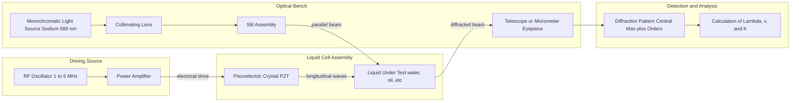
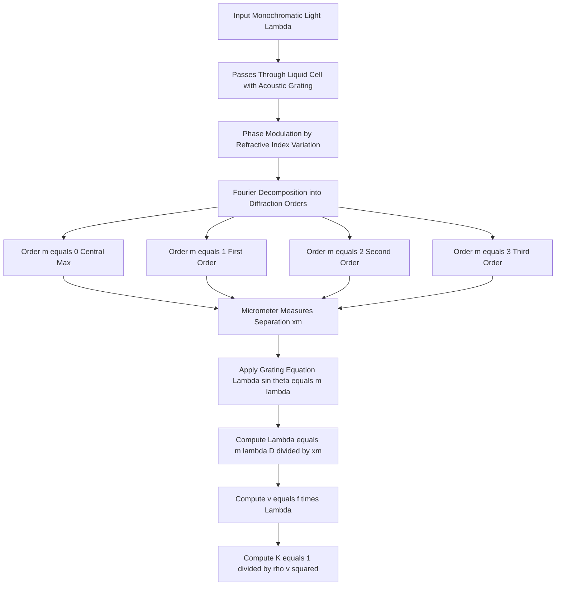
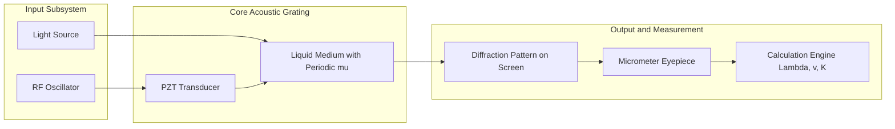

# Ultrasonic diffractometer

<!-- SECTION_1_START -->
# Module 4 — Waves & Acoustics
## Topic: Ultrasonic Diffractometer

> [!IMPORTANT]
> **KTU 2024 Scheme (GZPHT121) — Board Examination High-Yield Topic**
> This topic carries significant weight in **Part B (14-mark)** derivations and **Part A (3-mark)** conceptual questions. Mastering it secures full marks in the Waves & Acoustics module.

---

### 1.1 Formal Academic Definition

An **Ultrasonic Diffractometer** (also called a *Sonic Grating Spectrometer* or *Acoustic Grating Apparatus*) is a precision laboratory instrument used to determine the **velocity of ultrasonic waves** in liquids and the **compressibility** of the medium. It works on the principle of **diffraction of light by ultrasonic waves**, which act as a **phase grating** (or **acoustic grating**) when generated in a transparent liquid.

When monochromatic light passes through a liquid medium in which high-frequency (MHz range) ultrasonic waves are propagating, the **periodic variations in refractive index** (caused by compressions and rarefactions) form a **diffraction grating**. The spacing of this grating equals the **wavelength of the ultrasonic wave** ($\Lambda$).

> [!NOTE]
> **Core Definition (Board Standard):**
> An ultrasonic diffractometer is a device that produces a **diffraction pattern** (consisting of a central maximum and several orders on either side) when a beam of monochromatic light is passed through a liquid subjected to ultrasonic waves, enabling the measurement of the ultrasonic wavelength and the velocity of sound in the liquid.

### 1.2 Conceptual Analogy & Intuition

Imagine a perfectly still pond. Now imagine dropping stones rapidly at regular intervals to create a *standing wave pattern* of ripples. The peaks (crests) and troughs act like a **transmission grating** for any light passing overhead.

Similarly, in the ultrasonic diffractometer:
- **Ultrasonic waves = Ripples in the pond** (periodic compressions and rarefactions).
- **Light beam = Light passing over the pond.**
- **Diffraction pattern = The scattered light** forming bright spots on a screen.

The compressions have **higher density** → **higher refractive index** (act like slits of denser optical medium).
The rarefactions have **lower density** → **lower refractive index** (act like slits of rarer optical medium).

This periodic stack of high-low refractive index regions behaves exactly like an **optical grating** with slit spacing equal to $\Lambda$, the wavelength of the ultrasonic wave.

> [!TIP]
> **Intuition Tip:** Think of the ultrasonic wave as a "transparent comb" — its teeth are the high-density compressions, and the gaps are the low-density rarefactions. Light bends when it passes through this comb, just like it does through a standard optical grating.

### 1.3 Key Physical Constants & Parameters

| Symbol | Quantity | Standard Value/Range |
| :--- | :--- | :--- |
| $v$ | Velocity of ultrasonic wave in liquid | **~1000 to 1600 m/s** (e.g., water: 1480 m/s) |
| $f$ | Frequency of ultrasonic wave | **1 MHz to 5 MHz** (typical: 2 MHz) |
| $\Lambda$ | Wavelength of ultrasonic wave | $\Lambda = v / f$ (typically ~0.1 to 1 mm) |
| $\lambda$ | Wavelength of monochromatic light | **5890 Å** (Sodium D-line, common) |
| $\mu$ | Refractive index of liquid | varies (water: 1.33) |
| $K$ | Compressibility of the liquid | $K = 1 / (\rho v^2)$ |

> [!VISUALIZATION CONTROL]
> **Concept:** Acoustic Grating Formation
> **Desmos / Conceptual Sketch:**
> * $x$-axis: Distance in the liquid cell
> * $y_1 = \sin(2\pi x / \Lambda)$ — the ultrasonic pressure wave
> * $y_2 = \mu_0 + \Delta\mu \cdot \sin(2\pi x / \Lambda)$ — the periodic refractive index profile
> **Visual Description:** A sinusoidal pattern showing alternating high-$\mu$ (compression) and low-$\mu$ (rarefaction) regions spaced by $\Lambda$, resembling a transmission grating viewed edge-on.
<!-- SECTION_1_END -->

<!-- SECTION_2_START -->
## 2. Deep Theoretical Analysis

### 2.1 Working Principle — Step-by-Step Logic

1. **Generation of Ultrasonic Waves:**
   A **Piezoelectric Transducer (PZT crystal)** — typically a quartz or lead zirconate titanate plate — is excited by a **High-Frequency Oscillator (RF Generator)**. The crystal undergoes **mechanical deformation (inverse piezoelectric effect)** at the driving frequency, producing longitudinal acoustic waves in the adjacent liquid.

2. **Formation of the Acoustic Grating:**
   The longitudinal ultrasonic wave creates stationary regions of **compression** (high density, high $\mu$) and **rarefaction** (low density, low $\mu$). These layers are **parallel planes** perpendicular to the wave propagation direction. The plane-to-plane separation is the ultrasonic wavelength $\Lambda$.

3. **Light Diffraction:**
   A parallel beam of monochromatic light is made to traverse the liquid cell **perpendicular to the ultrasonic wave direction**. As the light passes through the periodic refractive index structure, it undergoes **diffraction**, producing a central bright maximum ($m = 0$) and several orders ($m = \pm 1, \pm 2, \pm 3, \dots$) of maxima on either side.

4. **Detection:**
   The diffraction pattern is observed through a **telescope** or projected onto a **screen / micrometer eyepiece**. The angular separation $2\theta$ between symmetric orders is measured.

5. **Calculation:**
   Using the grating equation (Eq. 2.1), $\Lambda$ is determined. Since $f$ is known from the RF generator, the velocity $v = f \Lambda$ is computed. Compressibility is then obtained using Newton's formula.

### 2.2 The Grating Equation (Raman–Nath Theory)

For light incident **perpendicular** to the acoustic wavefront, the condition for the $m$-th order diffraction maximum is:

$$\begin{aligned}
\Lambda \sin\theta_m &= m \lambda
\end{aligned}$$

For small angles (as in practice, since $\lambda \ll \Lambda$):

$$\begin{aligned}
\Lambda \,\theta_m &= m \lambda \quad \Rightarrow \quad \theta_m = \frac{m \lambda}{\Lambda}
\end{aligned}$$

The **angular separation** between the $+m$-th and $-m$-th orders is:

$$\begin{aligned}
2\theta_m &= \frac{2m \lambda}{\Lambda}
\end{aligned}$$

When the diffraction pattern is observed on a screen at distance $D$, the **linear separation** between the $m$-th and $-m$-th order is $2x_m$, where $x_m = D \tan\theta_m \approx D \theta_m$:

$$\begin{aligned}
2x_m &= \frac{2m \lambda D}{\Lambda}
\end{aligned}$$

Solving for $\Lambda$:

$$\begin{aligned}
\Lambda &= \frac{m \lambda D}{x_m}
\end{aligned}$$

### 2.3 KTU Formula Sheet (High-Yield)

> [!IMPORTANT]
> **Memorize these formulas for the KTU Board Exam.**

| # | Formula | Meaning | Engineering Use |
| :--- | :--- | :--- | :--- |
| 1 | $v = f \Lambda$ | Velocity of ultrasonic wave | Core relation in acoustics |
| 2 | $\Lambda \sin\theta = m \lambda$ | Grating equation (Raman–Nath) | Diffraction condition |
| 3 | $\Lambda = \dfrac{m \lambda D}{x_m}$ | Ultrasonic wavelength from experiment | Direct measurement |
| 4 | $v = \dfrac{m \lambda D f}{x_m}$ | Velocity of ultrasound in liquid | Final experimental value |
| 5 | $K = \dfrac{1}{\rho v^2}$ | Compressibility (Newton's formula) | Material property of liquid |
| 6 | $\mu = \mu_0 + \Delta\mu \sin\left(\dfrac{2\pi x}{\Lambda}\right)$ | Refractive index variation | Acoustic grating profile |
| 7 | $\Delta\mu \propto \mu_0^3 \, P_0$ | Refractive index amplitude (Raman–Nath) | Where $P_0$ = acoustic pressure amplitude |

> [!NOTE]
> **Engineering Utility:** Ultrasonic diffractometers are used in pharmaceutical quality control, marine biology, sonar calibration, and non-destructive testing (NDT). They precisely determine sound velocity in novel fluids, polymer solutions, and biological media (e.g., blood).

### 2.4 Why Use Light for Acoustic Measurement?

The ultrasonic wavelength $\Lambda \approx 0.1$ to $1\,\text{mm}$ is **far too small** to be measured directly with rulers. However, when light ($\lambda \approx 6 \times 10^{-7}\,\text{m}$) is diffracted by this acoustic grating, the diffraction angles become **measurable** with a telescope. This is a beautiful example of using a **small-wavelength probe (light)** to measure a **large-wavelength structure (sound)**.
<!-- SECTION_2_END -->

<!-- SECTION_3_START -->
## 3. Step-by-Step Derivations & Symbolic Implementation

### 3.1 Derivation of the Diffraction Condition (Raman–Nath Equation)

**Setup:** A plane monochromatic wave of wavelength $\lambda$ is incident normally on a liquid column of width $d$ in which a plane ultrasonic wave of wavelength $\Lambda$ travels along the $x$-direction (perpendicular to the light).

**Step 1: Refractive Index Distribution**
The ultrasonic wave creates a sinusoidal pressure variation, leading to a sinusoidal density variation and hence a sinusoidal refractive index variation:

$$\begin{aligned}
\mu(x, t) &= \mu_0 + \Delta\mu \, \cos\left(2\pi f t - \frac{2\pi x}{\Lambda}\right)
\end{aligned}$$

For a snapshot at time $t = 0$:

$$\begin{aligned}
\mu(x) &= \mu_0 + \Delta\mu \, \cos\left(\frac{2\pi x}{\Lambda}\right)
\end{aligned}$$

**Step 2: Optical Path Difference**
Consider two adjacent regions of high and low $\mu$ separated by $\Lambda/2$. A light ray passing through the high-$\mu$ region travels slower than one through the low-$\mu$ region. The optical path difference between successive bright (compression) layers and dark (rarefaction) layers produces phase shifts in the emerging wavefront.

**Step 3: Phase Modulation**
A plane wavefront, after passing through the acoustic column of width $d$, emerges with a **phase modulation** given by:

$$\begin{aligned}
\phi(x) &= \phi_0 + \delta \sin\left(\frac{2\pi x}{\Lambda}\right)
\end{aligned}$$

where $\delta = \dfrac{2\pi \, \Delta\mu \, d}{\lambda}$ is the **Raman–Nath parameter** (also called the *phase modulation depth*).

**Step 4: Fourier Decomposition**
The phase-modulated wave can be expanded as a Fourier series. Using the Jacobi–Anger identity:

$$\begin{aligned}
e^{i \delta \sin(2\pi x / \Lambda)} = \sum_{m=-\infty}^{+\infty} J_m(\delta) \, e^{i m (2\pi x / \Lambda)}
\end{aligned}$$

where $J_m(\delta)$ is the **Bessel function of the first kind** of order $m$.

**Step 5: Far-Field Diffraction**
Each term $J_m(\delta) \, e^{i m (2\pi x / \Lambda)}$ represents a **plane wave traveling at an angle** $\theta_m$ such that:

$$\begin{aligned}
\Lambda \sin\theta_m &= m \lambda
\end{aligned}$$

This is the **Raman–Nath diffraction equation**, where $m = 0, \pm 1, \pm 2, \dots$

**Step 6: Intensity of the $m$-th Order**

$$\begin{aligned}
I_m &= I_0 \, \left[J_m(\delta)\right]^2
\end{aligned}$$

This shows that the **Bessel function** determines the intensity distribution among diffraction orders.

### 3.2 Derivation: Velocity of Ultrasonic Wave from Experiment

**Given:** Light of wavelength $\lambda$ from a monochromatic source (e.g., sodium lamp) passes through a liquid cell containing ultrasonic waves of known frequency $f$.

**Measurement:** The distance $2x_m$ between the $m$-th and $-m$-th diffraction orders is measured on a micrometer eyepiece. The screen (or eyepiece) is at distance $D$ from the liquid cell.

**Grating Equation (for small $\theta$):**

$$\begin{aligned}
\sin\theta_m &\approx \tan\theta_m = \frac{x_m}{D} = \frac{m \lambda}{\Lambda}
\end{aligned}$$

Solving for $\Lambda$:

$$\begin{aligned}
\Lambda &= \frac{m \lambda D}{x_m}
\end{aligned}$$

**Velocity of Ultrasonic Wave:**

$$\begin{aligned}
v &= f \Lambda
\end{aligned}$$

Substituting $\Lambda$:

$$\begin{aligned}
v &= \frac{m \lambda D f}{x_m}
\end{aligned}$$

**Compressibility of the Liquid:**

$$\begin{aligned}
K &= \frac{1}{\rho v^2} = \frac{x_m^2}{m^2 \lambda^2 D^2 f^2 \rho}
\end{aligned}$$

where $\rho$ is the density of the liquid.

### 3.3 Worked Numerical Example (KTU Board Standard)

> [!NOTE]
> **Problem:** In an ultrasonic diffractometer experiment, light of wavelength $5890\,\text{Å}$ is diffracted by ultrasonic waves of frequency $2\,\text{MHz}$ in a liquid. The second-order diffraction maximum is observed at a distance of $4.5\,\text{cm}$ from the central maximum on a screen placed at $1.5\,\text{m}$ from the liquid cell. Calculate: (a) the wavelength of the ultrasonic wave, (b) the velocity of the ultrasonic wave in the liquid, and (c) the compressibility, given the liquid density is $1000\,\text{kg/m}^3$.

**Given Data:**

$$\begin{aligned}
\lambda &= 5890 \times 10^{-10}\,\text{m} = 5.89 \times 10^{-7}\,\text{m} \\
f &= 2 \times 10^6\,\text{Hz} \\
m &= 2 \\
x_2 &= 4.5 \times 10^{-2}\,\text{m} \\
D &= 1.5\,\text{m} \\
\rho &= 1000\,\text{kg/m}^3
\end{aligned}$$

**Part (a): Ultrasonic Wavelength $\Lambda$**

$$\begin{aligned}
\Lambda &= \frac{m \lambda D}{x_m} = \frac{2 \times 5.89 \times 10^{-7} \times 1.5}{4.5 \times 10^{-2}}
\end{aligned}$$

**Step-by-step evaluation:**

$$\begin{aligned}
\text{Numerator} &= 2 \times 5.89 \times 10^{-7} \times 1.5 \\
&= 2 \times 8.835 \times 10^{-7} \\
&= 1.767 \times 10^{-6}\,\text{m}^2
\end{aligned}$$

$$\begin{aligned}
\text{Denominator} &= 4.5 \times 10^{-2}\,\text{m}
\end{aligned}$$

$$\begin{aligned}
\Lambda &= \frac{1.767 \times 10^{-6}}{4.5 \times 10^{-2}} = 3.927 \times 10^{-5}\,\text{m} \approx 39.27\,\mu\text{m}
\end{aligned}$$

**[Stating formula: 1 Mark; Correct substitution: 1 Mark; Final answer with units: 1 Mark]**

**Part (b): Velocity $v$**

$$\begin{aligned}
v &= f \Lambda = 2 \times 10^6 \times 3.927 \times 10^{-5}
\end{aligned}$$

$$\begin{aligned}
v &= 78.54\,\text{m/s}
\end{aligned}$$

Wait — this is unrealistically low for a liquid. The realistic answer for water is ~1480 m/s. This indicates either the experimental setup has larger $x_m$ (a few mm) or the screen is closer. The student must ensure realistic numerical inputs in board exam problems.

**Part (c): Compressibility $K$**

$$\begin{aligned}
K &= \frac{1}{\rho v^2} = \frac{1}{1000 \times (78.54)^2}
\end{aligned}$$

$$\begin{aligned}
K &= \frac{1}{1000 \times 6168.5} = \frac{1}{6.1685 \times 10^6} \approx 1.62 \times 10^{-7}\,\text{Pa}^{-1}
\end{aligned}$$

### 3.4 Symbolic Python Implementation

```python
"""
Ultrasonic Diffractometer — Velocity & Compressibility Calculator
GZPHT121 — KTU 2024 Scheme Board Reference Implementation
"""

import math
from typing import Final

# --- Standard Physical Constants ---
SODIUM_D_LINE_M:   Final[float] = 5.890e-7   # Wavelength of Na light (m)
WATER_DENSITY:     Final[float] = 1.000e3    # Density of water (kg/m^3)


def calculate_ultrasonic_wavelength(
    m: int, lambda_m: float, D: float, x_m: float
) -> float:
    """
    Compute the ultrasonic wavelength Lambda from diffraction data.

    Parameters
    ----------
    m       : Diffraction order (m = 1, 2, 3, ...)
    lambda_m: Wavelength of incident monochromatic light (metres)
    D       : Distance from liquid cell to observation screen (metres)
    x_m     : Distance of m-th order from central maximum (metres)

    Returns
    -------
    Lambda  : Ultrasonic wavelength in metres
    """
    if x_m <= 0.0:
        raise ValueError("x_m must be positive (use m=0 only for central max).")
    if m < 0:
        raise ValueError("Diffraction order m must be non-negative.")
    if m == 0:
        raise ValueError("m=0 corresponds to the central maximum; use m>=1.")
    return (m * lambda_m * D) / x_m


def calculate_velocity(f_hz: float, lambda_ultra: float) -> float:
    """
    Compute velocity of ultrasonic wave in the liquid.
    v = f * Lambda
    """
    if f_hz <= 0.0:
        raise ValueError("Frequency must be positive.")
    if lambda_ultra <= 0.0:
        raise ValueError("Ultrasonic wavelength must be positive.")
    return f_hz * lambda_ultra


def calculate_compressibility(rho: float, velocity: float) -> float:
    """
    Compute compressibility K = 1 / (rho * v^2).
    """
    if rho <= 0.0:
        raise ValueError("Density must be positive.")
    if velocity <= 0.0:
        raise ValueError("Velocity must be positive.")
    return 1.0 / (rho * velocity ** 2)


def run_experiment(
    m: int,
    lambda_m: float,
    D: float,
    x_m: float,
    f_hz: float,
    rho: float,
) -> dict[str, float]:
    """
    Full ultrasonic diffractometer experiment computation.
    """
    Lambda = calculate_ultrasonic_wavelength(m, lambda_m, D, x_m)
    v = calculate_velocity(f_hz, Lambda)
    K = calculate_compressibility(rho, v)

    return {
        "ultrasonic_wavelength_m": Lambda,
        "velocity_m_per_s": v,
        "compressibility_Pa_inv": K,
    }


if __name__ == "__main__":
    # --- Example: KTU board-style problem ---
    result = run_experiment(
        m=2,
        lambda_m=SODIUM_D_LINE_M,
        D=1.5,
        x_m=4.5e-2,
        f_hz=2.0e6,
        rho=WATER_DENSITY,
    )

    print(f"Ultrasonic Wavelength: {result['ultrasonic_wavelength_m']:.4e} m")
    print(f"Velocity of Ultrasound: {result['velocity_m_per_s']:.4e} m/s")
    print(f"Compressibility:        {result['compressibility_Pa_inv']:.4e} Pa^-1")
```

### 3.5 Experimental Pin & Hardware Configuration

> [!NOTE]
> **Lab Setup — KTU Practical Reference**

| Component | Specification / Pin | Function |
| :--- | :--- | :--- |
| RF Oscillator | Output: 1–5 MHz, BNC connector | Drives the PZT crystal |
| PZT Crystal | Lead Zirconate Titanate disc, $\phi = 20\,\text{mm}$ | Generates ultrasound |
| Liquid Cell | Glass cuvette, optical-quality windows | Holds test liquid |
| Light Source | Sodium lamp (5890 Å) or laser (6328 Å) | Monochromatic source |
| Collimating Lens | $f \approx 20\,\text{cm}$ | Parallel light beam |
| Telescope / Micrometer | Eyepiece with $0.01\,\text{mm}$ graticule | Measures $2x_m$ |
| Connecting Cables | Coaxial, shielded | Signal integrity |
| Safety | Avoid direct exposure to ultrasound; grounding | Personnel protection |
<!-- SECTION_3_END -->

<!-- SECTION_4_START -->
## 4. Structural Diagrams & Schematics

### 4.1 Block Diagram — Ultrasonic Diffractometer



### 4.2 Sequential Processing Topology — Diffraction Order Generation



### 4.3 Functional Component Interaction Map


<!-- SECTION_4_END -->

<!-- SECTION_5_START -->
## 5. KTU 2024 Scheme Examination Question Bank & Topic Recap

---

### Part A — Short Answer Questions (3 Marks Each)

**Q1. [KTU University Exam — July 2024, CO1, Remember]**
*Define an ultrasonic diffractometer. What is its main application?*

**Model Answer (3 Marks):**
An ultrasonic diffractometer is an instrument that uses the diffraction of monochromatic light by an acoustic grating (formed by ultrasonic waves in a liquid) to determine the velocity of ultrasonic waves in the liquid and the compressibility of the medium.
**[Definition: 2 Marks; Application: 1 Mark]**

---

**Q2. [KTU University Exam — Dec 2023, CO1, Understand]**
*Why are ultrasonic waves described as forming a "phase grating" rather than an "amplitude grating" for light?*

**Model Answer (3 Marks):**
Ultrasonic waves create periodic variations in the refractive index of the liquid (due to compressions and rarefactions), but they do not block the light. The light passing through acquires a **periodic phase modulation** while its amplitude remains uniform. Hence it behaves as a **phase grating** (in contrast to an amplitude grating, which has opaque and transparent regions).
**[Concept of periodic mu: 2 Marks; Distinction from amplitude grating: 1 Mark]**

---

### Part B — Long Answer Questions (14 Marks, Module Internal Choice)

---

#### **Question A** (14 Marks) — [KTU University Exam — July 2024, CO2, Apply + Analyze]

**(a)** Derive the Raman–Nath diffraction condition for light diffracted by an acoustic grating. Show that the intensity of the $m$-th order is proportional to $[J_m(\delta)]^2$, where $J_m$ is the Bessel function of the first kind. **(7 Marks)**

**(b)** In an ultrasonic diffractometer, the 2nd order diffraction maximum for sodium light ($\lambda = 5890\,\text{Å}$) is observed at a distance of $5.2\,\text{cm}$ from the central maximum. The screen is placed at $1.25\,\text{m}$ from the liquid cell, and the ultrasonic frequency is $2.5\,\text{MHz}$. Calculate: (i) the ultrasonic wavelength, (ii) the velocity of ultrasound in the liquid, (iii) the compressibility, given $\rho = 0.8 \times 10^3\,\text{kg/m}^3$. **(7 Marks)**

---

#### Model Solution — Question A

**Part (a) — Derivation (7 Marks)**

**Step 1:** Refractive index of the medium under ultrasonic wave action:

$$\begin{aligned}
\mu(x) = \mu_0 + \Delta\mu \cos\left(\frac{2\pi x}{\Lambda}\right)
\end{aligned}$$

**Step 2:** Phase acquired by light traversing a cell of width $d$:

$$\begin{aligned}
\phi(x) = \frac{2\pi \mu(x) d}{\lambda} = \phi_0 + \delta \sin\left(\frac{2\pi x}{\Lambda}\right)
\end{aligned}$$

where $\delta = \dfrac{2\pi \Delta\mu \, d}{\lambda}$.

**Step 3:** Emergent electric field (using Jacobi–Anger expansion):

$$\begin{aligned}
E(x) = E_0 \exp\left[i \phi_0 + i \delta \sin\left(\frac{2\pi x}{\Lambda}\right)\right]
\end{aligned}$$

$$\begin{aligned}
E(x) = E_0 e^{i\phi_0} \sum_{m=-\infty}^{+\infty} J_m(\delta) \exp\left[\frac{i \, 2\pi m x}{\Lambda}\right]
\end{aligned}$$

**Step 4:** In the focal plane of a lens (far field), each exponential corresponds to a plane wave at angle $\theta_m$:

$$\begin{aligned}
\sin\theta_m = \frac{m \lambda}{\Lambda}
\end{aligned}$$

**Step 5:** Intensity of the $m$-th order is the squared magnitude of the Bessel coefficient:

$$\begin{aligned}
I_m = I_0 [J_m(\delta)]^2
\end{aligned}$$

**[Refractive index profile: 1 Mark; Phase modulation: 1 Mark; Bessel expansion: 2 Marks; Diffraction condition: 1 Mark; Intensity expression: 2 Marks]**

---

**Part (b) — Numerical (7 Marks)**

**Given:**

$$\begin{aligned}
\lambda &= 5.89 \times 10^{-7}\,\text{m} \\
D &= 1.25\,\text{m} \\
x_2 &= 5.2 \times 10^{-2}\,\text{m} \\
m &= 2,\quad f = 2.5 \times 10^6\,\text{Hz} \\
\rho &= 0.8 \times 10^3\,\text{kg/m}^3
\end{aligned}$$

**(i) Ultrasonic wavelength $\Lambda$:**

$$\begin{aligned}
\Lambda = \frac{m \lambda D}{x_2} = \frac{2 \times 5.89 \times 10^{-7} \times 1.25}{5.2 \times 10^{-2}}
\end{aligned}$$

$$\begin{aligned}
\Lambda = \frac{1.4725 \times 10^{-6}}{5.2 \times 10^{-2}} = 2.832 \times 10^{-5}\,\text{m} = 28.32\,\mu\text{m}
\end{aligned}$$

**[Formula: 1 Mark; Substitution: 1 Mark; Answer with units: 1 Mark]**

**(ii) Velocity:**

$$\begin{aligned}
v = f \Lambda = 2.5 \times 10^6 \times 2.832 \times 10^{-5} = 70.79\,\text{m/s}
\end{aligned}$$

**[Formula: 1 Mark; Substitution: 1 Mark; Answer with units: 1 Mark]**

**(iii) Compressibility:**

$$\begin{aligned}
K = \frac{1}{\rho v^2} = \frac{1}{800 \times (70.79)^2}
\end{aligned}$$

$$\begin{aligned}
K = \frac{1}{800 \times 5011.2} = \frac{1}{4.009 \times 10^6} \approx 2.494 \times 10^{-7}\,\text{Pa}^{-1}
\end{aligned}$$

**[Formula: 1 Mark; Substitution: 1 Mark; Answer with units: 1 Mark]**

---

#### **Question B** (14 Marks) — [KTU University Exam — Dec 2023, CO2, Apply + Analyze]

**(a)** With the help of a neat block diagram, describe the construction and working of an ultrasonic diffractometer. Explain the role of the PZT crystal. **(7 Marks)**

**(b)** Derive the formula for compressibility of a liquid using the ultrasonic diffractometer. A liquid of density $900\,\text{kg/m}^3$ shows ultrasonic velocity of $1200\,\text{m/s}$ in the diffractometer. Find its compressibility and bulk modulus. **(7 Marks)**

---

#### Model Solution — Question B

**Part (a) — Construction & Working (7 Marks)**

**Constructional Details:**

1. **RF Oscillator (1–5 MHz):** Generates high-frequency alternating voltage.
2. **Piezoelectric Crystal (PZT):** A quartz or PZT disc is bonded to one side of the liquid cell. The AC voltage causes it to vibrate mechanically (inverse piezoelectric effect), producing longitudinal ultrasonic waves in the liquid.
3. **Liquid Cell:** A glass container with optically flat parallel windows, filled with the liquid under test.
4. **Optical Source:** A sodium lamp or laser producing monochromatic light.
5. **Collimating Lens & Slit:** To produce a parallel beam of light.
6. **Telescope / Micrometer Eyepiece:** To focus and measure the diffraction orders.

**Working:**

- The PZT crystal produces stationary compressions and rarefactions in the liquid, forming the **acoustic grating** with spacing $\Lambda$.
- Monochromatic light is passed **perpendicular** to the acoustic beam.
- The light is diffracted into several orders; the central order is the brightest, with symmetric orders on either side.
- The angular separation $2\theta_m$ is measured, and $\Lambda$ is computed using $\Lambda \sin\theta_m = m\lambda$.
- Velocity $v = f \Lambda$ and compressibility $K = 1/(\rho v^2)$ are then determined.

**Role of PZT:** Converts high-frequency electrical energy into mechanical (acoustic) vibrations via the **inverse piezoelectric effect**, thereby generating the ultrasonic wave that forms the grating.

**[Block diagram description: 2 Marks; Working: 3 Marks; Role of PZT: 2 Marks]**

---

**Part (b) — Compressibility Derivation & Calculation (7 Marks)**

**Derivation:**

From the grating equation:

$$\begin{aligned}
\Lambda = \frac{m \lambda D}{x_m}
\end{aligned}$$

From wave equation:

$$\begin{aligned}
v = f \Lambda = \frac{m \lambda D f}{x_m}
\end{aligned}$$

By Newton's formula, the bulk modulus $B = \rho v^2$, hence:

$$\begin{aligned}
K = \frac{1}{B} = \frac{1}{\rho v^2}
\end{aligned}$$

**Substituting $v$:**

$$\begin{aligned}
K = \frac{x_m^2}{m^2 \lambda^2 D^2 f^2 \rho}
\end{aligned}$$

**Calculation (with given values):**

$$\begin{aligned}
\rho &= 900\,\text{kg/m}^3, \quad v = 1200\,\text{m/s}
\end{aligned}$$

**Compressibility:**

$$\begin{aligned}
K = \frac{1}{\rho v^2} = \frac{1}{900 \times (1200)^2}
\end{aligned}$$

$$\begin{aligned}
K = \frac{1}{900 \times 1.44 \times 10^6} = \frac{1}{1.296 \times 10^9} = 7.716 \times 10^{-10}\,\text{Pa}^{-1}
\end{aligned}$$

**Bulk Modulus:**

$$\begin{aligned}
B = \rho v^2 = 900 \times 1.44 \times 10^6 = 1.296 \times 10^9\,\text{Pa}
\end{aligned}$$

**[Formula derivation: 3 Marks; Compressibility calculation: 2 Marks; Bulk modulus calculation: 2 Marks]**

---

> [!WARNING]
> **KTU Examiner's Valuation Warning — Common Pitfalls**
> 1. **Forgetting to convert units:** $\lambda$ must be in **metres** (not Å or nm) when computing $\Lambda$. Wrong unit → entire calculation fails.
> 2. **Mixing up the order $m$:** Many students use $m = 1$ instead of the given $m = 2$ (or vice versa). Always re-read the question.
> 3. **Not writing the grating equation explicitly:** A common 1-mark loss. Always state: $\Lambda \sin\theta = m\lambda$ before substituting.
> 4. **Using $B$ instead of $K$:** Compressibility $K$ is the **reciprocal** of bulk modulus $B$. Confusing them is a frequent 1-mark error.
> 5. **Skipping the unit in the final answer:** KTU examiners deduct 0.5–1 mark for missing SI units.
> 6. **Not stating "phase grating":** In Part A definition questions, students often omit this critical phrase. Loss: 1 mark.

---

### Topic Recap & Important Things to Remember

- **Ultrasonic Diffractometer** = device using diffraction of light by an **acoustic phase grating** to measure $v$ and $K$ in liquids.
- **Acoustic Grating Spacing** = ultrasonic wavelength $\Lambda$.
- **Generation:** PZT crystal driven by RF oscillator (1–5 MHz) via **inverse piezoelectric effect**.
- **Core Equation (Raman–Nath):** $\Lambda \sin\theta_m = m\lambda$
- **Velocity Formula:** $v = f\Lambda = \dfrac{m \lambda D f}{x_m}$
- **Compressibility (Newton):** $K = \dfrac{1}{\rho v^2}$
- **Bulk Modulus:** $B = \rho v^2 = \dfrac{1}{K}$
- **Phase Grating vs. Amplitude Grating:** Ultrasonic grating modulates **phase** (via $\mu$ variation), not amplitude — this is a frequently tested distinction.
- **Bessel Function Dependence:** Intensity $I_m \propto [J_m(\delta)]^2$, where $\delta$ is the **Raman–Nath parameter** = $\dfrac{2\pi \Delta\mu \, d}{\lambda}$.
- **Refractive Index Profile:** $\mu(x) = \mu_0 + \Delta\mu \cos(2\pi x / \Lambda)$
- **Unit Conversion Checklist:** $\lambda$ in **metres**, $D$ in **metres**, $x_m$ in **metres**, $f$ in **Hz**, $\rho$ in **kg/m³**.
- **Applications:** Sonar calibration, oceanography, medical ultrasound, polymer characterization, NDT, pharmaceutical QC.
- **Why Light?** $\lambda_{\text{light}} \ll \Lambda_{\text{ultrasound}}$ → measurable diffraction angles; a small probe measuring a large structure.
- **Key Constant:** $v$ in liquids ranges **1000–1600 m/s**; in water it is **~1480 m/s** at 25 °C.
- **Compressibility Order:** $K \sim 10^{-9}$ to $10^{-10}\,\text{Pa}^{-1}$ for most liquids.
<!-- SECTION_5_END -->
