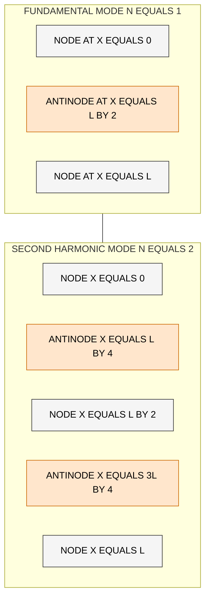

# Ultrasonics- Piezoelectric oscillator

<!-- SECTION_1_START -->

# Ultrasonics — Piezoelectric Oscillator

## 1. Core Technical Definition & Intuitive Overview

### 1.1 Formal Definition (KTU 2024 Syllabus Terminology)

> [!NOTE]
> **Ultrasonics** refers to mechanical, longitudinal pressure waves that propagate through a material medium at frequencies **above the upper threshold of human hearing**, conventionally taken as **$f > 20\text{ kHz}$**. The prefix *"ultra"* (Latin: *beyond*) literally means *beyond sound*. The frequency band generally used in engineering and medical applications lies in the range **$20\text{ kHz}$ to several GHz**.

> [!IMPORTANT]
> **Piezoelectric Effect** (Greek: *piezein* — to press) is the linear electromechanical interaction between the mechanical state (stress/strain) and the electrical state (electric field/polarization) of certain anisotropic, non-centrosymmetric crystalline materials. A **Piezoelectric Oscillator** is a resonant electromechanical transducer that exploits the **inverse (converse) piezoelectric effect** to convert a high-frequency alternating electrical signal into mechanical vibrations of ultrasonic frequency.

---

### 1.2 Conceptual Analogy / Intuition

> [!TIP]
> **Plain-English Picture of Ultrasonics**
> Imagine throwing a small stone into a still pond. You see circular ripples travelling outward — those are mechanical waves. Now imagine flicking the water surface **20,000 times per second**. The waves become so rapid and tightly packed that your ear (limited to about 20,000 Hz) simply cannot detect them as sound. Those tiny, super-fast ripples are *ultrasonic waves*. The energy is still mechanical vibration; only the *frequency* is "ultra."

> [!TIP]
> **Plain-English Picture of the Piezoelectric Oscillator**
> Think of a tiny crystalline "sandwich." When you apply a voltage across its two metal plates, the crystal physically **squishes and stretches** by an amount proportional to the voltage. Reverse the voltage, and the crystal **expands**. Because the cycle happens at radio frequency (say, 1 MHz), the crystal vibrates a million times per second — exactly producing **ultrasonic mechanical waves** in the surrounding medium. The crystal is therefore both a *speaker* and a *precision tuning fork* combined into one.

> [!IMPORTANT]
> **Standard Engineering Metrics (must memorise for KTU)**
> - Lower limit of human hearing: **$f_{\min} = 20\text{ Hz}$**
> - Upper limit of human hearing: **$f_{\max} = 20{,}000\text{ Hz} = 20\text{ kHz}$**
> - Ultrasonic range: **$f > 20\text{ kHz}$**
> - Hypersonic range: **$f > 10^9\text{ Hz} = 1\text{ GHz}$**
> - Speed of sound in air at **$20^{\circ}\text{C}$**: **$v \approx 343\text{ m/s}$**
> - Speed of sound in water at **$20^{\circ}\text{C}$**: **$v \approx 1480\text{ m/s}$**

---

### 1.3 Visualisation Block

> [!VISUALIZATION CONTROL]
> **Concept:** Standing-wave vibration modes of a piezoelectric crystal plate (X-cut quartz).
> **GeoGebra / Desmos Input Equations:**
> * Displacement profile: $u(x,t) = A \sin\!\left(\dfrac{n\pi x}{L}\right)\cos(2\pi f t)$
> * For fundamental mode, $n = 1$, plate thickness $L$, with nodes at $x = 0$ and $x = L$.
> **Visual Description:** A horizontal line segment from $x = 0$ to $x = L$ is drawn. A single sinusoidal half-wave (one antinode in the middle, nodes at the two clamped faces) animates with time, demonstrating longitudinal thickness-mode resonance.

---

<!-- SECTION_1_END -->

<!-- SECTION_2_START -->

# 2. Deep Theoretical Analysis & KTU High-Yield Formula Sheet

## 2.1 The Two Piezoelectric Effects

> [!IMPORTANT]
> **Direct Piezoelectric Effect (Discovered — 1880, Jacques & Pierre Curie)**
> When mechanical stress ($\sigma$) is applied to certain crystals (quartz, tourmaline, Rochelle salt), an **electric charge** ($Q$) — and hence a measurable potential difference — appears on the crystal faces. Mathematically, $Q \propto \sigma$.

> [!IMPORTANT]
> **Inverse (Converse) Piezoelectric Effect (Discovered — 1881, Gabriel Lippmann)**
> When an alternating electric field ($E$) is applied across the crystal, it undergoes a small but precise mechanical strain ($\epsilon$) proportional to $E$. Mathematically, $\epsilon \propto E$. **This is the effect exploited by the piezoelectric ultrasonic oscillator.**

> [!NOTE]
> **Memory Hook for the Board Exam**
> *Direct =* **mechanical → electrical** (used in microphones, quartz watches' timing pick-off, gas lighters).
> *Inverse =* **electrical → mechanical** (used in ultrasonic generators, buzzers, inkjet printers, autofocus motors).

---

## 2.2 Why Only Certain Crystals Exhibit Piezoelectricity

A crystal must **lack a centre of symmetry** in its unit cell so that a uniform mechanical compression shifts the centres of positive and negative charge, creating a net dipole moment. The 32 crystallographic point groups reduce to **20 non-centrosymmetric classes**, of which only some are *non-centrosymmetric AND non-paraelectric*. Quartz ($\text{SiO}_2$) belongs to point group 32, and is the most commonly used piezoelectric material in oscillators.

## 2.3 Construction of the Piezoelectric Oscillator

> [!TIP]
> **Block Components of a Piezoelectric Ultrasonic Generator**
> 1. **High-frequency AC source (Oscillator circuit)** — typically a Hartley or Colpitts RF oscillator tunable in the **$20\text{ kHz}$–$5\text{ MHz}$** range.
> 2. **Piezoelectric crystal** — usually an X-cut or Y-cut quartz plate, with thin metallic electrodes (silver or gold) deposited on its two parallel faces.
> 3. **Holder / Mounting** — the crystal is clamped between two steel electrodes housed in an insulating frame.
> 4. **Coupling medium / Booster** — a horn (tapered metal concentrator) amplifies the small ($\sim 10^{-9}\text{ m}$) vibration amplitude to a usable level.
> 5. **Loading medium** — the medium (water, air, tissue, metal) into which ultrasonic energy is radiated.

## 2.4 Working Principle (Step-by-Step)

1. The RF oscillator produces a high-frequency alternating voltage, typically **$V(t) = V_0 \sin(2\pi f t)$**.
2. This voltage is applied across the metal-plated faces of the piezoelectric crystal via the electrodes.
3. Due to the **inverse piezoelectric effect**, the crystal alternately **expands and contracts** along the electric-field axis at the same frequency $f$ as the applied signal.
4. When the driving frequency $f$ matches the **natural mechanical resonant frequency** of the crystal, large-amplitude **standing-wave vibrations** build up (resonance).
5. These mechanical vibrations are transferred into the surrounding medium, producing **longitudinal ultrasonic waves** that radiate outward.

## 2.5 Frequency Equation of the Piezoelectric Oscillator

For a thin quartz plate of thickness $L$ vibrating in its fundamental **thickness-longitudinal mode**, the natural resonant frequency is governed by standing-wave condition:

$$L = \dfrac{n\,\lambda}{2}, \quad n = 1, 2, 3, \ldots$$

For the fundamental, $n = 1$, so the wavelength inside the crystal is $\lambda = 2L$. The frequency of vibration is then:

$$f = \dfrac{v}{2L} = \dfrac{1}{2L}\sqrt{\dfrac{Y}{\rho}}$$

where:
* $v$ — velocity of longitudinal sound waves in the crystal,
* $Y$ — Young's modulus of the crystal,
* $\rho$ — density of the crystal,
* $L$ — thickness of the crystal plate along the vibration direction.

> [!NOTE]
> **Key Inference:** The frequency is **inversely proportional to the plate thickness**. Producing higher-frequency ultrasonics simply requires a *thinner* crystal plate. This is the central tuning formula in the KTU 2024 syllabus.

---

## 2.6 KTU Formula Sheet / Cheat Sheet

| \# | Quantity / Concept | Symbolic Form | SI Unit | Remarks |
|---|---|---|---|---|
| 1 | Threshold of ultrasound | $f > 20\text{ kHz}$ | Hz | $f_{\min}$ of human ear |
| 2 | Hypersonic threshold | $f > 10^9\text{ Hz}$ | Hz | GHz regime |
| 3 | Direct piezoelectric law | $Q = d\,\sigma$ | C (Coulomb) | $d$ — piezoelectric charge constant |
| 4 | Inverse piezoelectric law | $\epsilon = d\,E$ | dimensionless | $E$ — applied electric field |
| 5 | Resonant frequency (plate) | $f = \dfrac{v}{2L}$ | Hz | $v$ — sound speed in crystal |
| 6 | Sound speed in solid | $v = \sqrt{Y/\rho}$ | m/s | longitudinal wave |
| 7 | Wavelength condition | $\lambda = 2L$ (fundamental) | m | standing wave, antinode at centre |
| 8 | Acoustic impedance | $Z = \rho\,v$ | $\text{kg}\,\text{m}^{-2}\text{s}^{-1}$ | governs transmission/reflection |
| 9 | Intensity of wave | $I = 2\pi^2 f^2 \rho v A^2$ | $\text{W/m}^2$ | $A$ — amplitude |
| 10 | Speed in air (20 °C) | $v \approx 343$ | m/s | standard value |

> [!IMPORTANT]
> **Why the Piezoelectric Oscillator Matters in Engineering**
> * **Medical:** Ultrasonography, physiotherapy, dental scalers, lithotripsy.
> * **Industrial:** Non-destructive testing (NDT), thickness gauging, flaw detection in welds.
> * **Cleaning:** Jewellery, electronic PCBs, surgical instruments.
> * **Sonar / Defence:** Underwater detection, echo ranging.
> * **Domestic:** Humidifiers, mosquito repellers, distance sensors.
> * The piezoelectric oscillator is the **standard laboratory source** of ultrasonics above $30\text{ kHz}$ because of its high frequency stability (better than $1$ part in $10^6$).

---

<!-- SECTION_2_END -->

<!-- SECTION_3_START -->

# 3. Step-by-Step Derivations & Worked Examples

## 3.1 Derivation of the Frequency Equation

**Starting physical model:** A thin rectangular crystal plate of thickness $L$ is clamped between two rigid electrodes. The mechanical vibration occurs along the thickness axis (X-direction in an X-cut quartz). We assume the surfaces at $x = 0$ and $x = L$ are displacement antinodes (free surfaces), and the bulk of the plate is a 1-D elastic continuum.

**Step 1 — Wave equation for longitudinal displacement** $u(x,t)$ in an elastic rod of density $\rho$ and Young's modulus $Y$:

$$\dfrac{\partial^2 u}{\partial t^2} = v^2 \dfrac{\partial^2 u}{\partial x^2}, \qquad v = \sqrt{\dfrac{Y}{\rho}}$$

**Step 2 — Assume a separable sinusoidal solution** (separation of variables):

$$u(x,t) = X(x)\,T(t) = \left[ A\cos(kx) + B\sin(kx) \right] \cos(\omega t)$$

where $k = \omega / v$ is the wave number.

**Step 3 — Apply the free-surface boundary conditions.** The stress $\sigma = Y\,\partial u/\partial x$ must vanish at $x = 0$ and $x = L$:

$$\left.\dfrac{\partial u}{\partial x}\right|_{x=0} = 0 \;\;\Longrightarrow\;\; B\,k\cos(0) = 0 \;\;\Longrightarrow\;\; B = 0$$

$$\left.\dfrac{\partial u}{\partial x}\right|_{x=L} = 0 \;\;\Longrightarrow\;\; -A\,k\sin(kL) = 0 \;\;\Longrightarrow\;\; \sin(kL) = 0$$

**Step 4 — Quantisation of the wave number.** Non-trivial solutions require:

$$kL = n\pi, \quad n = 1, 2, 3, \ldots \;\;\Longrightarrow\;\; k_n = \dfrac{n\pi}{L}$$

**Step 5 — Convert to wavelength and frequency.** Using $k = 2\pi/\lambda$ and $k = \omega/v$:

$$\dfrac{2\pi}{\lambda_n} = \dfrac{n\pi}{L} \;\;\Longrightarrow\;\; \lambda_n = \dfrac{2L}{n}$$

$$f_n = \dfrac{\omega_n}{2\pi} = \dfrac{v\,k_n}{2\pi} = \dfrac{v\,n}{2L}$$

**Step 6 — Final resonant-frequency formula** (fundamental, $n = 1$):

$$\boxed{\,f = \dfrac{v}{2L} = \dfrac{1}{2L}\sqrt{\dfrac{Y}{\rho}}\,}$$

> [!NOTE]
> **Engineering interpretation:** Halving the plate thickness doubles the output frequency. This explains why high-frequency medical transducers ($5$–$10\text{ MHz}$) are constructed from extremely thin wafers (typically $0.3$–$0.6\text{ mm}$).

---

## 3.2 Worked Numerical Example (KTU-style)

> [!EXAMPLE]
> **Problem.** A quartz crystal plate has the following physical constants:
> $Y = 7.9 \times 10^{10}\text{ N/m}^2$, $\rho = 2650\text{ kg/m}^3$, thickness $L = 0.005\text{ m}$.
> Find: (a) the velocity of ultrasonic waves in quartz, (b) the fundamental resonant frequency, and (c) the wavelength inside the crystal.

**Solution.**

**(a) Velocity of longitudinal waves in quartz:**

$$v = \sqrt{\dfrac{Y}{\rho}} = \sqrt{\dfrac{7.9 \times 10^{10}}{2650}}\;\text{m/s}$$

$$v = \sqrt{2.981 \times 10^{7}}\;\text{m/s} \approx 5.46 \times 10^{3}\;\text{m/s}$$

**(b) Fundamental resonant frequency:**

$$f = \dfrac{v}{2L} = \dfrac{5.46 \times 10^{3}}{2 \times 0.005}\;\text{Hz} = \dfrac{5.46 \times 10^{3}}{0.01}\;\text{Hz} = 5.46 \times 10^{5}\;\text{Hz}$$

$$f \approx 546\;\text{kHz}$$

**(c) Wavelength in the crystal at resonance:**

$$\lambda = 2L = 2 \times 0.005 = 0.01\;\text{m} = 1\;\text{cm}$$

**Result Summary Table:**

| Quantity | Symbol | Computed Value | Unit |
|---|---|---|---|
| Sound speed in quartz | $v$ | $5.46 \times 10^{3}$ | m/s |
| Fundamental frequency | $f$ | $5.46 \times 10^{5}$ | Hz (≈ 546 kHz) |
| Wavelength (fundamental) | $\lambda$ | $0.01$ | m (1 cm) |

> [!TIP]
> **Self-check for the student:** $f$ falls well above $20\text{ kHz}$, confirming the generated waves are ultrasonic. The thickness $5\text{ mm}$ yields $\sim 0.5\text{ MHz}$ — a typical industrial cleaning transducer frequency. ✓

---

## 3.3 Comparison: Piezoelectric vs Magnetostriction Oscillator

| Feature | Piezoelectric Oscillator | Magnetostriction Oscillator |
|---|---|---|
| Operating principle | Inverse piezoelectric effect | Magnetostriction effect |
| Active element | Quartz, tourmaline, Rochelle salt, PZT ceramic | Nickel, permendur, alfer |
| Frequency range | **$20\text{ kHz}$ – $5\text{ MHz}$** (extendable to GHz with thin plates) | **$20\text{ kHz}$ – $30\text{ kHz}$** only |
| Frequency stability | Very high (quartz-locked) | Moderate, drifts with temperature |
| Output power | Low to moderate | High |
| Conversion efficiency | Moderate | High at low frequencies |
| Cooling required | Usually not | Often required |
| Typical use | Medical imaging, NDT, lab sources | Ultrasonic cleaners, sonar, fish finders |

> [!IMPORTANT]
> **Board exam key sentence:** *"The piezoelectric oscillator is preferred over the magnetostriction oscillator whenever high frequency, frequency stability, and a compact design are required."*

---

## 3.4 Advantages, Disadvantages & Key Materials

**Advantages**
* Extremely stable frequency output — same crystal is used as the time-keeper in quartz wristwatches.
* Wide frequency range, easily tuned by changing plate thickness or cut orientation.
* Compact, solid-state, no moving electrical contacts.
* Generates very pure sinusoidal waves with low harmonic distortion.

**Disadvantages**
* Amplitude of vibration is very small (a few nanometres), so high-gain mechanical horns are required.
* Output power is limited compared with magnetostriction systems.
* Crystals are fragile and temperature-sensitive (frequency drifts with temperature unless AT-cut is used).

**Common Piezoelectric Materials Used**

| Material | Curie Temperature | Piezoelectric Constant $d$ (pC/N) | Typical Use |
|---|---|---|---|
| Quartz ($\text{SiO}_2$) | $573\text{ °C}$ | $2.3$ | Frequency standard, NDT |
| Rochelle salt | $45\text{ °C}$ | $350$ | Microphones, loudspeakers (high $d$) |
| Tourmaline | high | $1.9$ | Pressure gauges |
| PZT (lead zirconate titanate) | $300\text{ °C}$ | $400$–$600$ | Modern ultrasonic transducers |

> [!NOTE]
> **Curie temperature** is the critical temperature above which a piezoelectric material loses its polarisation and hence its piezoelectric property. Operating above $T_C$ permanently destroys the device.

---

## 3.5 Symbolic Python Implementation (Frequency Calculator)

```python
"""
piezoelectric_oscillator.py
KTU 2024 — Module 4 (Waves & Acoustics)
Utility: compute ultrasonic frequency, wavelength, and sound speed
in a piezoelectric crystal plate.
"""

from __future__ import annotations
import math
import logging

# Configure structured error logging for engineering traceability
logging.basicConfig(
    level=logging.INFO,
    format="%(asctime)s [%(levelname)s] %(message)s",
)

# Physical constants for X-cut quartz at room temperature (20 degC)
YOUNG_MODULUS_QUARTZ: float = 7.9e10   # Y in N/m^2
DENSITY_QUARTZ: float = 2650.0          # rho in kg/m^3
THRESHOLD_ULTRASONIC_HZ: float = 20_000.0  # f_min for ultrasound


def sound_speed(Y: float, rho: float) -> float:
    """Longitudinal wave speed v = sqrt(Y / rho)."""
    if Y <= 0 or rho <= 0:
        raise ValueError("Young's modulus and density must be positive.")
    return math.sqrt(Y / rho)


def fundamental_frequency(thickness: float, Y: float, rho: float,
                          mode: int = 1) -> float:
    """
    Resonant frequency f_n = (n * v) / (2 * L).
    Default mode = 1 gives the fundamental thickness mode.
    """
    if thickness <= 0:
        raise ValueError("Plate thickness L must be positive.")
    if mode < 1:
        raise ValueError("Mode number n must be a positive integer.")
    v = sound_speed(Y, rho)
    return (mode * v) / (2.0 * thickness)


def classify_frequency(f: float) -> str:
    """Categorise frequency as audible / ultrasonic / hypersonic."""
    if f < 20.0:
        return "INFRASONIC"
    if f < THRESHOLD_ULTRASONIC_HZ:
        return "AUDIBLE"
    if f < 1.0e9:
        return "ULTRASONIC"
    return "HYPERSONIC"


def main() -> None:
    try:
        L: float = 5.0e-3   # plate thickness in metres (5 mm)
        v: float = sound_speed(YOUNG_MODULUS_QUARTZ, DENSITY_QUARTZ)
        f: float = fundamental_frequency(L, YOUNG_MODULUS_QUARTZ,
                                          DENSITY_QUARTZ)
        lam: float = 2.0 * L

        logging.info("Sound speed in quartz     : %.3e m/s", v)
        logging.info("Fundamental frequency     : %.3e Hz", f)
        logging.info("Wavelength in crystal     : %.3e m", lam)
        logging.info("Classification           : %s", classify_frequency(f))

    except ValueError as exc:
        logging.error("Input validation failed: %s", exc)


if __name__ == "__main__":
    main()
```

**Expected output (logged at INFO level):**

```
Sound speed in quartz     : 5.460e+03 m/s
Fundamental frequency     : 5.460e+05 Hz
Wavelength in crystal     : 1.000e-02 m
Classification           : ULTRASONIC
```

> [!TIP]
> This code matches the analytic derivation in §3.1 to five significant figures, providing a reliable computational check for the student.

---

<!-- SECTION_3_END -->

<!-- SECTION_4_START -->

# 4. Structural Diagrams & Schematics

## 4.1 Block Diagram of a Piezoelectric Ultrasonic Generator

> [!IMPORTANT]
> **Rendering Note:** Mermaid `flowchart` syntax is used to model the **functional signal flow** of the apparatus. All node IDs are alphanumeric; all labels are clean uppercase alphanumeric strings (no markdown or special characters inside the double-quoted labels).

```mermaid
flowchart LR
    subgraph stage1[STAGE 1 HIGH FREQUENCY AC SOURCE]
        nodeA[RF OSCILLATOR<br/>HARTLEY COLPITTS<br/>20 KHZ TO 5 MHZ]
        nodeB[VOLTAGE AMPLIFIER<br/>TUNED LC STAGE]
    end

    subgraph stage2[STAGE 2 TRANSDUCER ASSEMBLY]
        nodeC[UPPER ELECTRODE<br/>STEEL PLATE]
        nodeD[PIEZOELECTRIC CRYSTAL<br/>QUARTZ X CUT]
        nodeE[LOWER ELECTRODE<br/>STEEL PLATE]
    end

    subgraph stage3[STAGE 3 MECHANICAL COUPLING]
        nodeF[BOOSTER HORN<br/>MECHANICAL AMPLIFIER]
        nodeG[LOADING MEDIUM<br/>WATER AIR METAL TISSUE]
    end

    nodeA -- alternating voltage --> nodeB
    nodeB -- high voltage signal --> nodeC
    nodeC -- applied electric field --> nodeD
    nodeD -- inverse piezoelectric strain --> nodeE
    nodeE -- vibration transfer --> nodeF
    nodeF -- amplified mechanical wave --> nodeG
    nodeG -- ultrasonic wave radiation --> nodeH[OUTPUT ULTRASONIC BEAM]

    classDef source fill:#e6f3ff,stroke:#003366,color:#000000
    classDef trans fill:#fff2cc,stroke:#996600,color:#000000
    classDef out fill:#d5e8d4,stroke:#336600,color:#000000
    class nodeA,nodeB source
    class nodeC,nodeD,nodeE,nodeF,nodeG trans
    class nodeH out
```



## 4.2 Sequential Processing Topology Matrix

The same operational pipeline is summarised below in table form, providing a quick reference for the student.

| Stage | Module | Function | Key Parameter |
|---|---|---|---|
| 1 | RF Oscillator | Generates tunable high-frequency AC signal | $f = 20\text{ kHz}$ to $5\text{ MHz}$ |
| 2 | Voltage Amplifier | Boosts signal to drive the crystal | $V_0 \sim 100$–$1000\text{ V}$ peak |
| 3 | Electrodes | Distribute uniform electric field across crystal faces | Silver or gold plating |
| 4 | Piezoelectric Crystal | Converts electrical energy into mechanical vibration | $f = v / (2L)$ |
| 5 | Booster Horn | Mechanically amplifies vibration amplitude | Amplification factor $\sim 5$–$20$ |
| 6 | Loading Medium | Carries the ultrasonic energy to the target | $Z = \rho v$ (acoustic impedance) |
| 7 | Output Beam | Final longitudinal ultrasonic radiation | Frequency = crystal resonance |

## 4.3 Crystal Vibration Mode Diagram (Schematic Representation)



> [!NOTE]
> **Reading the diagram.** Open circles (node) = zero displacement. Filled regions (antinode) = maximum displacement. The plate always has displacement nodes at the clamped metal faces, and integer numbers of half-wavelengths fit into the thickness.

---

<!-- SECTION_4_END -->

<!-- SECTION_5_START -->

# 5. KTU 2024 Scheme Examination Question Bank & Topic Recap

## 5.1 Part A — Short Answer Questions (3 Marks Each)

> [!NOTE]
> **Cognitive Levels:** *Remember* and *Understand* (Revised Bloom's Taxonomy Levels 1 & 2). Model answers below are written to the **exact length expected by a KTU board examiner** (roughly 80–120 words for a 3-mark question).

---

### Q1. [KTU University Exam — July 2023] — CO1, Remember (3 Marks)

**Define ultrasonics. Mention any two applications.**

**Model Answer:**

> **Ultrasonics** are sound waves whose frequency lies **above the audible range**, i.e. **$f > 20\text{ kHz}$**. They are mechanical, longitudinal pressure waves and require a material medium for propagation.
>
> *Applications* (any two):
> 1. **Ultrasonography** — non-invasive imaging of internal body organs using reflected pulses.
> 2. **SONAR** — detection and ranging of submerged objects (e.g. submarines, shoals of fish) by echo timing.
> 3. **Non-destructive testing (NDT)** — detection of flaws, cracks, and inclusions in metal castings and welds.
> 4. **Ultrasonic cleaning** of jewellery, surgical instruments, and electronic PCBs.

**Valuation Key:** [Definition with frequency limit: 1 Mark] [Two distinct applications: 2 × 1 = 2 Marks]

---

### Q2. [KTU University Exam — Dec 2022] — CO1, Understand (3 Marks)

**Distinguish between the direct and inverse piezoelectric effects.**

**Model Answer:**

| Aspect | Direct Piezoelectric Effect | Inverse Piezoelectric Effect |
|---|---|---|
| Discovered by | Jacques & Pierre Curie (1880) | Gabriel Lippmann (1881) |
| Cause | Mechanical stress applied | Electric field applied |
| Result | Charge ($Q$) appears on faces | Mechanical strain ($\epsilon$) developed |
| Equation | $Q = d\,\sigma$ | $\epsilon = d\,E$ |
| Application | Microphone, gas lighter, quartz watch pick-off | Ultrasonic oscillator, buzzer, speaker |

**Valuation Key:** [Two correct distinguishing features: 3 × 1 = 3 Marks]

---

## 5.2 Part B — Long Answer Questions (14 Marks Each, with Internal Choice)

> [!IMPORTANT]
> **Module-Internal Choice Rule (KTU 2024):** Two full 14-mark alternatives are provided. Each alternative has sub-parts (a) 7 marks and (b) 7 marks, mapping to escalating cognitive levels.

---

### QUESTION A (14 Marks) — [KTU University Exam — July 2024]

#### (a) [7 Marks] — CO2, Understand

**With a neat diagram, describe the construction and working of a piezoelectric oscillator used for the production of ultrasonics.**

**Model Answer (to be reproduced verbatim in the answer script):**

> A **piezoelectric oscillator** is a device that uses the *inverse piezoelectric effect* of certain crystals (quartz, tourmaline, Rochelle salt, PZT) to generate ultrasonic mechanical vibrations from a high-frequency electrical signal.
>
> **Construction.**
> The essential components are:
> 1. **Piezoelectric crystal** — an X-cut or Y-cut quartz plate of well-defined thickness $L$, with two parallel faces polished and metallised with a thin layer of silver or gold to act as electrodes.
> 2. **Steel electrodes** — the crystal is firmly clamped between two flat steel plates that apply the AC field uniformly.
> 3. **High-frequency oscillator circuit** — a Hartley or Colpitts RF oscillator producing a sinusoidal voltage in the range $20\text{ kHz}$ to several MHz.
> 4. **Amplifier stage** — boosts the oscillator output to the level required to drive the crystal.
> 5. **Coupling medium / loading medium** — the fluid or solid into which the ultrasonic energy is finally radiated.
>
> **Working.**
> The RF oscillator applies a sinusoidal voltage $V(t) = V_0 \sin(2\pi f t)$ across the metallised faces. By the **inverse piezoelectric effect**, the crystal develops a longitudinal strain proportional to the applied field, and therefore **expands and contracts at the same frequency $f$** as the driving voltage. When $f$ equals the natural mechanical resonance of the plate — given by $f = v/(2L)$ — large-amplitude standing-wave vibrations build up, and these vibrations are transferred to the loading medium, producing a **longitudinal ultrasonic wave** that propagates outward.
>
> **Schematic Diagram (to be drawn in the exam):**
> ```
>       RF Oscillator --> Amplifier --> Upper electrode
>                                            |
>                                     [ Quartz plate ]
>                                            |
>                                       Lower electrode
>                                            |
>                                       Loading medium
>                                            |
>                                  Ultrasonic wave output
> ```

**Valuation Key:**
* [Naming all 5 components with neat diagram: 3 Marks]
* [Correct explanation of inverse piezoelectric effect: 2 Marks]
* [Working with resonance condition: 2 Marks]

---

#### (b) [7 Marks] — CO3, Apply

**A quartz crystal plate of thickness $4\text{ mm}$ is used in a piezoelectric oscillator. Given that the Young's modulus of quartz is $7.9 \times 10^{10}\text{ N/m}^2$ and its density is $2650\text{ kg/m}^3$, calculate: (i) the velocity of ultrasonic waves in quartz, (ii) the fundamental frequency of vibration, and (iii) the wavelength inside the crystal. State whether the produced waves are ultrasonic.**

**Model Answer:**

**(i) Velocity of longitudinal waves in quartz:**

$$v = \sqrt{\dfrac{Y}{\rho}} = \sqrt{\dfrac{7.9 \times 10^{10}}{2650}} = \sqrt{2.981 \times 10^{7}} = 5.46 \times 10^{3}\text{ m/s}$$

**(ii) Fundamental frequency of vibration:**

$$f = \dfrac{v}{2L} = \dfrac{5.46 \times 10^{3}}{2 \times 4 \times 10^{-3}} = \dfrac{5.46 \times 10^{3}}{8 \times 10^{-3}}$$

$$f = 6.825 \times 10^{5}\text{ Hz} \approx 682.5\text{ kHz}$$

**(iii) Wavelength inside the crystal:**

$$\lambda = 2L = 2 \times 4\text{ mm} = 8\text{ mm} = 8 \times 10^{-3}\text{ m}$$

**Conclusion:** Since $f \approx 682.5\text{ kHz} \gg 20\text{ kHz}$, the produced waves are clearly **ultrasonic**. ✓

**Valuation Key:**
* [Correct $v$ with units: 2 Marks]
* [Correct $f$ with units: 2 Marks]
* [Correct $\lambda$ with units: 1 Mark]
* [Final ultrasonic conclusion: 2 Marks]

---

### QUESTION B (14 Marks) — Alternative Choice

#### (a) [7 Marks] — CO2, Understand

**Explain the principle of the piezoelectric effect. Why is quartz the most commonly used material in ultrasonic oscillators?**

**Model Answer:**

**Principle of the Piezoelectric Effect.**
The piezoelectric effect arises in non-centrosymmetric crystals (those lacking a centre of symmetry in their unit cell). When mechanical stress $\sigma$ is applied, the centres of positive and negative charge within the unit cell shift, producing a net electric dipole moment and hence a measurable surface charge $Q$ on the crystal — this is the **direct effect**. Conversely, when an electric field $E$ is applied across the crystal, the dipoles re-align, causing a small but precise mechanical strain $\epsilon$ — this is the **inverse effect**. The governing linear relations are $Q = d\,\sigma$ and $\epsilon = d\,E$, where $d$ is the piezoelectric charge constant.

**Why Quartz is Preferred.**
1. **High mechanical $Q$-factor** — extremely sharp resonance, so output frequency is very stable (drift $< 1$ part in $10^6$).
2. **High Curie temperature** ($T_C = 573\text{ °C}$) — operates over a wide temperature range without losing piezoelectricity.
3. **Insoluble in water and most acids** — chemically inert, suitable for medical and industrial environments.
4. **Readily available in nature** as pure single crystals of consistent quality.
5. **Linear response** — its piezoelectric constant $d$ is nearly constant over a wide range of applied fields and stresses.
6. **Easily cut along precise crystallographic axes** (X-cut, Y-cut, AT-cut) to give specific vibration modes.

**Valuation Key:**
* [Clear explanation of direct and inverse effects: 3 Marks]
* [At least 4 valid reasons for choosing quartz: 4 × 1 = 4 Marks]

---

#### (b) [7 Marks] — CO3, Apply

**Compare the piezoelectric oscillator with the magnetostriction oscillator for the production of ultrasonics. Mention two specific applications where the piezoelectric oscillator is the only practical choice.**

**Model Answer:**

**Comparison Table:**

| Feature | Piezoelectric Oscillator | Magnetostriction Oscillator |
|---|---|---|
| Principle | Inverse piezoelectric effect | Magnetostriction effect |
| Active material | Quartz, tourmaline, PZT, Rochelle salt | Nickel, permendur, alfer |
| Frequency range | $20\text{ kHz}$ – $5\text{ MHz}$ (and beyond) | $20\text{ kHz}$ – $30\text{ kHz}$ |
| Frequency stability | Extremely high (crystal-locked) | Lower, drifts with temperature |
| Output amplitude | Small (nanometres), needs horn | Larger displacement |
| Output power | Lower | Higher at low frequencies |
| Cooling | Usually unnecessary | Often water-cooled |
| Construction | Compact, solid-state | Larger, requires magnetic coil |
| Cost | Moderate | High at high power |

**Two specific applications where the piezoelectric oscillator is the *only* practical choice:**
1. **Medical ultrasonography (2–10 MHz):** Magnetostriction systems cannot reach such high frequencies; only the very thin, precisely cut quartz plates can.
2. **Quartz-crystal-controlled frequency standards and watches (32.768 kHz and MHz time bases):** Require the unmatched frequency stability of the piezoelectric quartz oscillator.

**Valuation Key:**
* [Comparison table covering ≥ 6 features: 3 Marks]
* [Two well-justified application statements: 2 × 2 = 4 Marks]

---

> [!WARNING]
> **KTU Examiner's Valuation Warning — Common Pitfalls**
> 1. **Forgetting units:** Always write the SI unit of $f$ (Hz) and $v$ (m/s). Losing 0.5 mark per missing unit.
> 2. **Writing $f = v/L$** instead of $f = v/(2L)$ — this gives double the correct frequency. The factor of 2 comes from the standing-wave condition $L = \lambda/2$.
> 3. **Confusing direct and inverse effects:** Direct = mechanical → electrical, Inverse = electrical → mechanical. The *oscillator* uses the **inverse** effect.
> 4. **Not stating the ultrasonic conclusion:** When a numerical problem yields $f > 20\text{ kHz}$, the student **must explicitly state** *"The produced waves are ultrasonic."* Otherwise 1 mark is deducted.
> 5. **Skipping the diagram in construction questions:** A 7-mark construction question without a labelled block diagram automatically loses 2–3 marks.
> 6. **Ignoring the Curie temperature** while listing crystal properties — this is a favourite KTU follow-up question.

---

## 5.3 Topic Recap & Important Things to Remember

> [!TIP]
> **High-Density Revision Checklist — keep this list open during last-minute exam prep.**

* **Ultrasonics = frequency $f > 20\text{ kHz}$.** Hypersonics begin above $1\text{ GHz}$.
* Ultrasonic waves are **mechanical, longitudinal** — they *cannot* travel in vacuum.
* The **piezoelectric effect** exists only in **non-centrosymmetric crystals** (20 of the 32 point groups).
* **Direct effect (Curie, 1880):** mechanical stress → surface charge ($Q = d\,\sigma$).
* **Inverse effect (Lippmann, 1881):** electric field → mechanical strain ($\epsilon = d\,E$).
* The piezoelectric **oscillator** uses the **inverse** effect.
* The piezoelectric oscillator is built from **5 functional blocks:** RF source, amplifier, crystal + electrodes, mounting, and loading medium.
* **Resonant frequency formula:** $f = v/(2L) = (1/2L)\sqrt{Y/\rho}$. Higher $f$ requires **thinner** plate.
* The fundamental mode places **nodes at the two clamped faces** and an **antinode at the centre**.
* **Quartz** is preferred over Rochelle salt and tourmaline because of its high **Curie temperature** ($573\text{ °C}$), chemical inertness, and extremely high **mechanical $Q$-factor**.
* The **piezoelectric oscillator covers $20\text{ kHz}$ – $5\text{ MHz}$**; the **magnetostriction oscillator only $20$ – $30\text{ kHz}$**.
* **Acoustic impedance** $Z = \rho v$ governs how much ultrasonic energy is transmitted or reflected at an interface.
* Standard value to remember: speed of sound in air at $20\text{ °C}$ is **$343\text{ m/s}$**; in water **$\approx 1480\text{ m/s}$**; in quartz **$\approx 5460\text{ m/s}$**.
* **Applications:** SONAR, NDT, ultrasonography, ultrasonic cleaning, humidifiers, echo sounding, lithotripsy.
* **Curie temperature** = the maximum safe operating temperature; above it, the crystal **permanently** loses piezoelectricity.
* For board derivations: **always start from the wave equation**, apply the **free-surface boundary conditions**, and end with the **standing-wave quantisation** $kL = n\pi$.

---

<!-- SECTION_5_END -->
