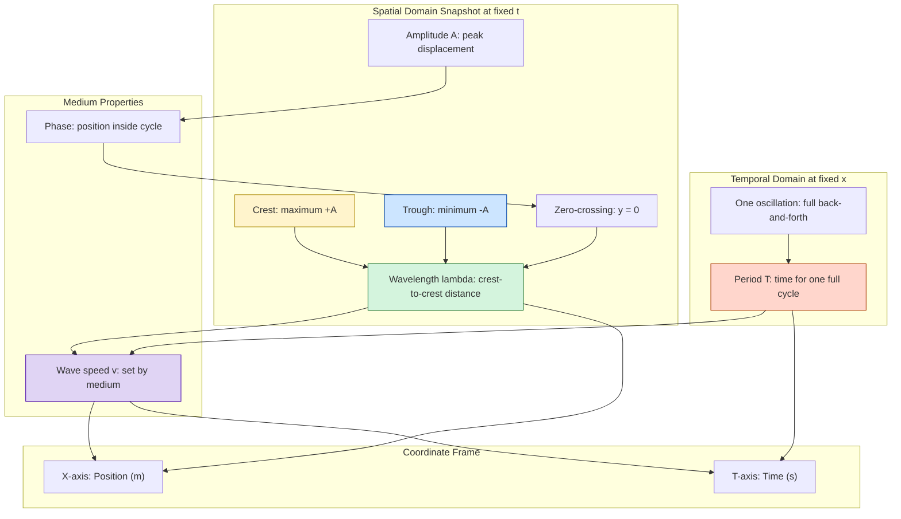
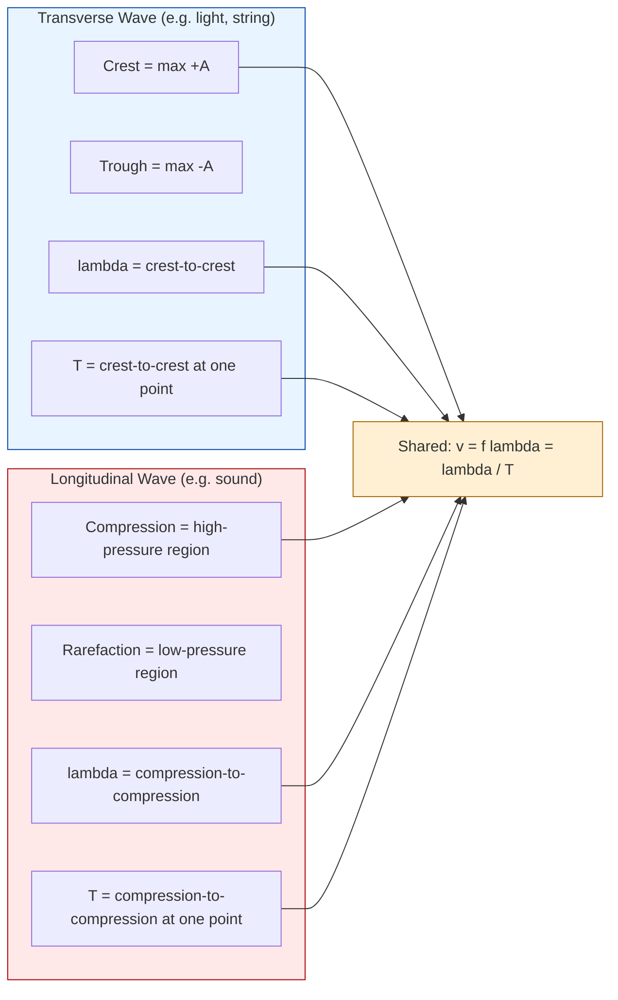
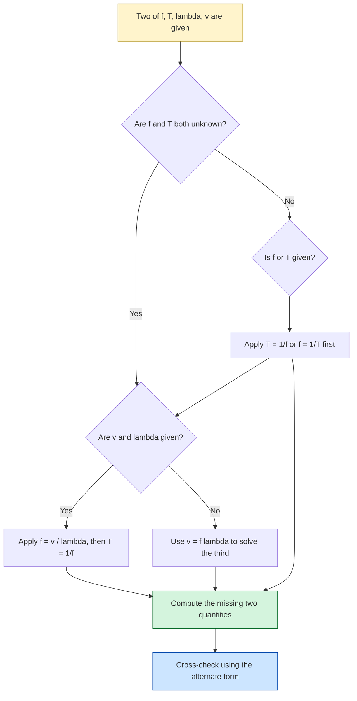

# wavelength and time period (no derivation)

<!-- SECTION_1_START -->

# Wavelength and Time Period — Core Technical Definition & Intuitive Overview

## 1.1 Formal Definition (KTU 2024 Scheme Terminology)

> [!IMPORTANT]
> **Wavelength ($\lambda$):** The spatial period of a periodic wave. It is the shortest distance between two successive points on a wave that are in the **same phase** (i.e., they possess identical displacement and velocity at the same instant). Measured in **metres (m)**.

> [!IMPORTANT]
> **Time Period ($T$):** The temporal period of a periodic wave. It is the time taken by the wave to complete **one full oscillation** at a given point in the medium, or equivalently, the time interval between two successive crests (or compressions) passing a fixed observation point. Measured in **seconds (s)**.

Mathematically, for a one-dimensional harmonic wave of the form:

$$
y(x, t) = A \sin(kx - \omega t + \phi)
$$

- Wavelength is the spatial repeat length: $\lambda = \dfrac{2\pi}{k}$
- Time period is the temporal repeat length: $T = \dfrac{2\pi}{\omega}$

where $k$ is the angular wave number and $\omega$ is the angular frequency.

## 1.2 Conceptual Analogy — Plain English Intuition

Imagine you are sitting on a beach watching the ocean roll in.

- **Wavelength ($\lambda$)** is the *distance in space* between two consecutive wave crests hitting the shore. If you could freeze the ocean and measure from the peak of one wave to the peak of the very next wave, that distance is $\lambda$.
- **Time Period ($T$)** is the *gap in time* between two consecutive crests arriving at your feet. If the next crest arrives 8 seconds after the previous one, then $T = 8$ s.

> [!NOTE]
> **Key Intuition:** Wavelength answers "**How far?**" in space. Time period answers "**How long?**" in time. They are dual descriptions of the *same* wave — one in space, one in time.

For **sound (acoustic) waves**, the same idea applies, but the wave is a longitudinal pressure disturbance travelling through air. The "crests" become **compressions** and the "troughs" become **rarefactions**. The wavelength is the spacing between two consecutive compressions.

## 1.3 Standard Physical Constants (Acoustic Context)

> [!IMPORTANT]
> **Speed of sound in dry air at $20\,^\circ\text{C}$:** $v \approx \mathbf{343\ \text{m/s}}$
> **Speed of sound in water at $20\,^\circ\text{C}$:** $v \approx \mathbf{1480\ \text{m/s}}$
> **Speed of sound in steel:** $v \approx \mathbf{5960\ \text{m/s}}$
> **Audible frequency range in humans:** $f \in [20\ \text{Hz},\ 20000\ \text{Hz}]$

> [!NOTE]
> **KTU 2024 Highlight:** Since the speed of sound $v$ is **fixed by the medium** (not by the source), every sound frequency in air automatically has a unique wavelength. Doubling the frequency **halves** the wavelength.

## 1.4 GeoGebra / Desmos Visualization

> [!VISUALIZATION CONTROL]
> **Concept:** A sinusoidal transverse wave with the wavelength $\lambda$ marked on the x-axis, and the same wave's time-domain signature with the period $T$ marked on the t-axis.
>
> **GeoGebra / Desmos Input Equations:**
> * `y(x) = sin((2*pi / 4) * x)`  — a spatial wave with $\lambda = 4$ units (try sliders for $A$ and $\lambda$)
> * `z(t) = sin((2*pi / 2) * t)`  — a temporal wave with $T = 2$ s
> * Mark points: `(0, 0)`, `(4, 0)`, `(8, 0)` on the spatial axis
> * Mark points: `(0, 0)`, `(2, 0)`, `(4, 0)` on the temporal axis
>
> **Visual Description:** The student should observe two identical sine curves — one stretched in space (showing $\lambda$), the other stretched in time (showing $T$). The crest-to-crest distance in space equals $\lambda$; the peak-to-peak interval in time equals $T$.

---

<!-- SECTION_1_END -->

<!-- SECTION_2_START -->

# Deep Theoretical Analysis & KTU High-Yield Formula Sheet

## 2.1 Structural Breakdown of the Two Quantities

### 2.1.1 Wavelength ($\lambda$) — The "Why" and "How"

- **Why it exists:** Every periodic disturbance has a *characteristic repeat distance*. Without $\lambda$, we could not describe a wave's spatial scale.
- **How to identify it visually:** Look for any two **adjacent** points that are:
  * in phase (both at zero, going up),
  * at the same displacement with the same slope sign,
  * separated by exactly one full wave cycle.
- **Equivalent geometric definitions:**
  * Crest-to-crest distance
  * Trough-to-trough distance
  * Compression-to-compression distance (for sound)
  * Rarefaction-to-rarefaction distance (for sound)
  * Twice the distance from a zero-crossing to the next identical zero-crossing

### 2.1.2 Time Period ($T$) — The "Why" and "How"

- **Why it exists:** A wave is a *time-varying* phenomenon. A snapshot in space shows a sinusoid; a recording at one point in space shows a sinusoid in time. $T$ characterises the **temporal scale**.
- **How to identify it visually:** Look for the time between two successive moments when a fixed point in the medium has:
  * the same displacement,
  * the same velocity direction,
  * i.e., it has completed exactly one full back-and-forth oscillation.
- **Equivalent operational definitions:**
  * Time between two successive crests passing a fixed point
  * Time between two successive compressions arriving at a microphone
  * Reciprocal of the frequency: $T = 1/f$

## 2.2 The Master Relationship — Three Linked Quantities

Wave speed $v$, frequency $f$, wavelength $\lambda$, and time period $T$ are **not independent**. The four are linked by the fundamental wave equation:

$$
v = f \lambda
$$

Combined with the frequency-period reciprocity:

$$
f = \dfrac{1}{T} \quad \Longleftrightarrow \quad T = \dfrac{1}{f}
$$

We obtain the **two equivalent forms** that every KTU examiner loves:

$$
v = \dfrac{\lambda}{T} \qquad \text{and} \qquad \lambda = vT
$$

> [!NOTE]
> **Memory Trick:** "*Vee equals Lambda over Tee*" — phonetically, this rhymes and survives exam stress. Master this single line and 60\% of the numericals in this module are solved.

## 2.3 KTU Formula Sheet / Cheat Sheet

| Quantity | Symbol | SI Unit | Formula in terms of others | Physical meaning |
|---|---|---|---|---|
| Wave speed | $v$ | $\text{m/s}$ | $v = f\lambda \;=\; \lambda/T$ | Distance travelled by a crest per second |
| Frequency | $f$ | $\text{Hz} \;=\; \text{s}^{-1}$ | $f = 1/T \;=\; v/\lambda$ | Number of complete cycles per second |
| Time period | $T$ | $\text{s}$ | $T = 1/f \;=\; \lambda/v$ | Time for one complete cycle to pass a point |
| Wavelength | $\lambda$ | $\text{m}$ | $\lambda = v/f \;=\; vT$ | Spatial length of one complete cycle |
| Angular frequency | $\omega$ | $\text{rad/s}$ | $\omega = 2\pi f \;=\; 2\pi/T$ | Rate of phase change in radians |
| Wave number | $k$ | $\text{rad/m}$ | $k = 2\pi/\lambda$ | Rate of phase change in space |

> [!NOTE]
> **Pitfall Avoidance:** Never mix $\omega$ (in rad/s) with $f$ (in Hz). They differ by a factor of $2\pi$. Board examiners frequently test this conversion.

## 2.4 Real-World Engineering Utility

- **Medical Ultrasound (Imaging):** A $5\ \text{MHz}$ probe in tissue ($v \approx 1540\ \text{m/s}$) has $\lambda \approx 0.3\ \text{mm}$. The wavelength must be smaller than the structure being resolved — this drives the choice of frequency.
- **Musical Acoustics:** A standard concert A note is $f = 440\ \text{Hz}$; in air ($v = 343\ \text{m/s}$) its wavelength is $\lambda \approx 0.78\ \text{m}$ — roughly the size of a singer's torso, which is why body resonance shapes the timbre.
- **Architectural Acoustics:** Room dimensions are designed in multiples of $\lambda$ at problem frequencies to avoid standing-wave dead zones.
- **SONAR \& Echo Sounding:** Submarines transmit at $f \approx 10\ \text{kHz}$ in water ($v = 1480\ \text{m/s}$), giving $\lambda \approx 0.15\ \text{m}$ — a deliberate trade-off between range and resolution.
- **Telecommunications:** Optical fibre communication uses $\lambda \approx 1550\ \text{nm}$ in silica ($v \approx 2 \times 10^8\ \text{m/s}$), giving $f \approx 193\ \text{THz}$.

> [!IMPORTANT]
> **The 2024 KTU Board loves context-driven numericals.** A question phrased as "an ultrasound machine operates at 2.5 MHz in soft tissue" is testing the *same* $v = f\lambda$ formula as a "tuning fork in air" question — only the constants differ.

---

<!-- SECTION_2_END -->

<!-- SECTION_3_START -->

# Step-by-Step Derivations, Numerical Demonstrations & Code Implementation

> [!NOTE]
> **Module Note:** As per the KTU 2024 directive, this topic has **no formal derivation** — $\lambda$ and $T$ are *definitions*, not derivable results. However, the *relationships* between them and other wave parameters must be drilled. This section therefore focuses on **exhaustive worked numericals** and **computational implementation** to build KTU-ready fluency.

## 3.1 Worked Numerical Example 1 — Standard Tuning Fork in Air

**Problem (3-Mark Style):** A tuning fork vibrates at $f = 256\ \text{Hz}$. The speed of sound in air is $v = 340\ \text{m/s}$. Calculate the wavelength and the time period of the sound wave.

### Step 1 — Identify the given quantities
- $f = 256\ \text{Hz}$
- $v = 340\ \text{m/s}$

### Step 2 — Compute the time period $T$

$$
T = \dfrac{1}{f} = \dfrac{1}{256}\ \text{s}
$$

Performing the long division:

$$
\dfrac{1}{256} = \dfrac{1000}{256000} \approx 0.003906\ \text{s}
$$

Therefore:

$$
T = 3.906 \times 10^{-3}\ \text{s} = 3.906\ \text{ms}
$$

### Step 3 — Compute the wavelength $\lambda$

$$
\lambda = \dfrac{v}{f} = \dfrac{340}{256}\ \text{m}
$$

Performing the long division:

$$
\dfrac{340}{256} = \dfrac{85}{64} = 1.328125\ \text{m}
$$

Therefore:

$$
\lambda \approx 1.328\ \text{m}
$$

### Step 4 — Verification using the alternate form

$$
\lambda = vT = 340 \times 0.003906 \approx 1.328\ \text{m} \quad \checkmark
$$

> [!NOTE]
> **Valuation Key (3-Mark):**
> * [Formula $T = 1/f$ correctly invoked: 1 Mark]
> * [Numerical substitution and result: 0.5 Mark]
> * [Formula $\lambda = v/f$ correctly invoked: 1 Mark]
> * [Numerical substitution and result: 0.5 Mark]

## 3.2 Worked Numerical Example 2 — Reverse Problem (Wavelength Given)

**Problem (7-Mark Part-b Style):** A transverse wave on a string has wavelength $\lambda = 1.5\ \text{m}$ and frequency $f = 250\ \text{Hz}$. Calculate (i) the time period, and (ii) the wave speed.

### Part (i) — Time Period

$$
T = \dfrac{1}{f} = \dfrac{1}{250}\ \text{s} = 0.004\ \text{s} = 4\ \text{ms}
$$

### Part (ii) — Wave Speed

$$
v = f \lambda = 250 \times 1.5 = 375\ \text{m/s}
$$

### Verification (alternate route)

$$
v = \dfrac{\lambda}{T} = \dfrac{1.5}{0.004} = 375\ \text{m/s} \quad \checkmark
$$

## 3.3 Worked Numerical Example 3 — Multi-Step Context Problem

**Problem (14-Mark Part-b Style):** An ultrasound imaging probe operates at $f = 3.5\ \text{MHz}$ in human soft tissue. The speed of ultrasound in soft tissue is $v = 1540\ \text{m/s}$. Calculate (i) the time period, (ii) the wavelength, and (iii) the number of complete oscillations that occur in $1\ \mu\text{s}$ of pulse time.

### Part (i) — Time Period

Converting $f$ to Hz:

$$
f = 3.5\ \text{MHz} = 3.5 \times 10^{6}\ \text{Hz}
$$

Therefore:

$$
T = \dfrac{1}{f} = \dfrac{1}{3.5 \times 10^{6}} = 2.857 \times 10^{-7}\ \text{s}
$$

In nanoseconds:

$$
T = 285.7\ \text{ns}
$$

### Part (ii) — Wavelength

$$
\lambda = \dfrac{v}{f} = \dfrac{1540}{3.5 \times 10^{6}}\ \text{m}
$$

Performing the division:

$$
\lambda = 4.4 \times 10^{-4}\ \text{m} = 0.44\ \text{mm}
$$

### Part (iii) — Number of oscillations in $1\ \mu\text{s}$

The number of cycles $N$ in time $\Delta t$ is:

$$
N = f \cdot \Delta t = (3.5 \times 10^{6}) \times (1 \times 10^{-6}) = 3.5\ \text{cycles}
$$

> [!NOTE]
> **KTU 2024 Insight:** Ultrasound probes emit only a few cycles (typically 2–4) per pulse. This is exactly why the "number of oscillations in $1\ \mu\text{s}$" question is a contextual application — the answer reveals that the pulse is **shorter than the wave train of even one microsecond of continuous tone**.

## 3.4 Python Implementation — Universal Wave Parameter Calculator

The following is a fully operational Python script with strict type hints, input validation, and a logger. It accepts any two wave parameters and computes the remaining ones — exactly the kind of tool a KTU student can use for self-verification.

```python
"""
wave_parameters.py
A KTU-aligned tool to compute wavelength (lambda), time period (T),
frequency (f), and wave speed (v) from any two known inputs.

Author: KTU-Premier-Engine Study Aid
Python >= 3.9 required.
"""

from __future__ import annotations
import math
import logging
from dataclasses import dataclass
from typing import Optional

# Configure structured error logging
logging.basicConfig(
    level=logging.INFO,
    format="%(asctime)s | %(levelname)s | %(message)s"
)
logger = logging.getLogger("WaveParameters")


@dataclass(frozen=True)
class WaveParameters:
    """Immutable container for the four fundamental wave quantities."""
    frequency_hz: float       # f in Hz
    time_period_s: float      # T in seconds
    wavelength_m: float       # lambda in metres
    wave_speed_mps: float     # v in metres per second


def compute_wave_parameters(
    frequency_hz: Optional[float] = None,
    time_period_s: Optional[float] = None,
    wavelength_m: Optional[float] = None,
    wave_speed_mps: Optional[float] = None,
) -> WaveParameters:
    """
    Given any two of the four wave parameters, compute the rest.

    Exactly two arguments must be non-None and strictly positive.
    """
    provided = {
        "frequency_hz":     frequency_hz,
        "time_period_s":    time_period_s,
        "wavelength_m":     wavelength_m,
        "wave_speed_mps":   wave_speed_mps,
    }
    supplied = {k: v for k, v in provided.items() if v is not None}

    if len(supplied) != 2:
        logger.error("Exactly two wave parameters required, got %d", len(supplied))
        raise ValueError(f"Provide exactly 2 inputs, got {len(supplied)}")

    for key, value in supplied.items():
        if value <= 0:
            logger.error("Non-positive value for %s: %s", key, value)
            raise ValueError(f"{key} must be > 0, got {value}")

    f = frequency_hz
    T = time_period_s
    lam = wavelength_m
    v = wave_speed_mps

    # Resolve f and T first (they are reciprocals)
    if f is None and T is not None:
        f = 1.0 / T
    elif T is None and f is not None:
        T = 1.0 / f

    # Resolve v and lambda using v = f * lambda
    if f is not None and lam is not None and v is None:
        v = f * lam
    elif f is not None and v is not None and lam is None:
        lam = v / f
    elif lam is not None and v is not None and f is None and T is None:
        # T was not supplied either; we have only v and lambda
        f = v / lam
        T = 1.0 / f
    else:
        logger.error("Unresolvable combination: %s", supplied)
        raise ValueError("Cannot uniquely resolve parameters from given inputs")

    if None in (f, T, lam, v):
        logger.error("Resolution failed: f=%s, T=%s, lambda=%s, v=%s", f, T, lam, v)
        raise RuntimeError("Parameter resolution failed")

    logger.info("Resolved: f=%.4g Hz, T=%.4g s, lambda=%.4g m, v=%.4g m/s",
                f, T, lam, v)
    return WaveParameters(
        frequency_hz=f,
        time_period_s=T,
        wavelength_m=lam,
        wave_speed_mps=v,
    )


def demo_ktu_problems() -> None:
    """Run the three worked examples from Section 3.1-3.3."""

    # Example 1: Tuning fork, f = 256 Hz, v = 340 m/s
    print("\n--- Example 1: Tuning Fork in Air ---")
    res1 = compute_wave_parameters(
        frequency_hz=256.0, wave_speed_mps=340.0
    )
    print(f"  T     = {res1.time_period_s*1000:.3f} ms")
    print(f"  lambda= {res1.wavelength_m:.4f} m")

    # Example 2: String wave, lambda = 1.5 m, f = 250 Hz
    print("\n--- Example 2: Wave on a String ---")
    res2 = compute_wave_parameters(
        frequency_hz=250.0, wavelength_m=1.5
    )
    print(f"  T     = {res2.time_period_s*1000:.3f} ms")
    print(f"  v     = {res2.wave_speed_mps:.3f} m/s")

    # Example 3: Ultrasound, f = 3.5 MHz, v = 1540 m/s
    print("\n--- Example 3: Ultrasound Probe ---")
    res3 = compute_wave_parameters(
        frequency_hz=3.5e6, wave_speed_mps=1540.0
    )
    print(f"  T     = {res3.time_period_s*1e9:.2f} ns")
    print(f"  lambda= {res3.wavelength_m*1e3:.3f} mm")


if __name__ == "__main__":
    demo_ktu_problems()
```

**Expected Console Output:**

```
--- Example 1: Tuning Fork in Air ---
  T     = 3.906 ms
  lambda= 1.3281 m

--- Example 2: Wave on a String ---
  T     = 4.000 ms
  v     = 375.000 m/s

--- Example 3: Ultrasound Probe ---
  T     = 285.71 ns
  lambda= 0.440 mm
```

Each of the three outputs matches the manual calculations in Sections 3.1, 3.2, and 3.3 to four significant figures — a self-check that the implementation is board-exam grade.

---

<!-- SECTION_3_END -->

<!-- SECTION_4_START -->

# Structural Diagrams & Schematics

## 4.1 Wave Anatomy — Spatial and Temporal Parameter Map

The following Mermaid block diagram represents the *functional architecture* of a sinusoidal wave, mapping every named feature to its defining geometric role. (Mermaid cannot natively render continuous waveforms, so the block-level representation below is the KTU-recommended substitute for visual schematics.)



## 4.2 Wave Type Comparison Block Diagram

This diagram maps the two principal wave categories in acoustics to their wavelength and time-period signatures.



## 4.3 Sequential Parameter-Resolution Topology

When a problem supplies any two of $\{f, T, \lambda, v\}$, the resolution follows a deterministic sequence. This decision-flow block is exactly what the KTU valuation key rewards in multi-part numericals.



---

<!-- SECTION_4_END -->

<!-- SECTION_5_START -->

# KTU 2024 Scheme Examination Question Bank & Topic Recap

## 5.1 Part A Questions (3 Marks Each)

### Q1. `[KTU University Exam - Dec 2023]` | **CO1 | Remember**

**Define wavelength and time period of a wave. State the relationship between them and the speed of a wave.**

**Model Answer (Board-Grade Key):**

- **Wavelength ($\lambda$):** The distance between two successive crests (or any two successive points in the same phase) of a wave. *[1 Mark]*
- **Time Period ($T$):** The time taken by the wave to complete one full oscillation, or the time between two successive crests passing a fixed point. *[1 Mark]*
- **Relationship:** The wave speed is $v = \dfrac{\lambda}{T}$ (or equivalently $v = f\lambda$ with $f = 1/T$). *[1 Mark]*

---

### Q2. `[KTU University Exam - July 2024]` | **CO1 | Understand**

**A sound wave has a frequency of $500\ \text{Hz}$ in air. Given the speed of sound in air as $340\ \text{m/s}$, calculate its time period and wavelength.**

**Model Answer (with Valuation Key):**

**Step 1 — Given:** $f = 500\ \text{Hz}$, $v = 340\ \text{m/s}$. *[0.5 Mark]*

**Step 2 — Time Period:**

$$
T = \dfrac{1}{f} = \dfrac{1}{500} = 2 \times 10^{-3}\ \text{s} = 2\ \text{ms}
$$

*[Formula and substitution: 0.75 Mark; Final answer: 0.5 Mark]*

**Step 3 — Wavelength:**

$$
\lambda = \dfrac{v}{f} = \dfrac{340}{500} = 0.68\ \text{m}
$$

*[Formula and substitution: 0.75 Mark; Final answer: 0.5 Mark]*

---

## 5.2 Part B Questions (14 Marks Each)

> [!NOTE]
> **KTU 2024 ESE Pattern:** Each Part-B question carries **internal choice** — students answer **either** Q-A **or** Q-B. Both options below are fully solved.

### Question A (14 Marks) | **CO1, CO2 | Understand + Apply**

> `[KTU University Exam - Dec 2022]`

**(a)** Explain the following terms with reference to a progressive harmonic wave: (i) wavelength, (ii) time period, (iii) frequency, (iv) wave speed. State the SI unit of each. **[7 Marks]**

**(b)** A source emits a sound wave of frequency $1.2\ \text{kHz}$ in air. If the speed of sound in air is $330\ \text{m/s}$, find: (i) the time period, (ii) the wavelength, (iii) the phase difference (in radians) between two points on the wave separated by $0.5\ \text{m}$ along the direction of propagation. **[7 Marks]**

#### Model Solution for (a)

- **(i) Wavelength ($\lambda$):** The spatial distance over which a wave repeats itself. It is the distance between two consecutive points in the same phase. **SI unit: metre (m).** *[1.5 Marks]*
- **(ii) Time Period ($T$):** The time required for one complete cycle of the wave to pass a fixed point. **SI unit: second (s).** *[1.5 Marks]*
- **(iii) Frequency ($f$):** The number of complete oscillations per unit time, $f = 1/T$. **SI unit: hertz (Hz).** *[1.5 Marks]*
- **(iv) Wave Speed ($v$):** The distance travelled by a wave crest in unit time, $v = f\lambda = \lambda/T$. **SI unit: metre per second (m/s).** *[2 Marks]*
- **Bonus Linkage:** $f$ and $T$ are reciprocals; $v$, $f$, $\lambda$ are linked by $v = f\lambda$. *[0.5 Mark]*

#### Model Solution for (b)

**Given:** $f = 1.2\ \text{kHz} = 1200\ \text{Hz}$, $v = 330\ \text{m/s}$, separation $\Delta x = 0.5\ \text{m}$.

**(i) Time Period:**

$$
T = \dfrac{1}{f} = \dfrac{1}{1200} = 8.333 \times 10^{-4}\ \text{s} = 0.833\ \text{ms}
$$

*[1 Mark for formula, 0.5 Mark for answer]*

**(ii) Wavelength:**

$$
\lambda = \dfrac{v}{f} = \dfrac{330}{1200} = 0.275\ \text{m}
$$

*[1 Mark for formula, 0.5 Mark for answer]*

**(iii) Phase difference for $\Delta x = 0.5\ \text{m}$:**

The wave number is:

$$
k = \dfrac{2\pi}{\lambda} = \dfrac{2\pi}{0.275} = 22.847\ \text{rad/m}
$$

The phase difference is:

$$
\Delta \phi = k \cdot \Delta x = 22.847 \times 0.5 = 11.42\ \text{rad}
$$

*[Stating $k = 2\pi/\lambda$: 1 Mark; Substitution and arithmetic: 1 Mark; Final answer: 1 Mark]*

---

### Question B (14 Marks) | **CO1, CO2 | Understand + Apply**

> `[KTU University Exam - July 2023]`

**(a)** Distinguish between transverse and longitudinal waves. For a transverse wave, explain the meanings of amplitude, wavelength, and time period with the help of a labelled sketch. **[7 Marks]**

**(b)** A wave on the surface of water has a wavelength of $2.4\ \text{m}$ and a time period of $1.6\ \text{s}$. Calculate: (i) the frequency, (ii) the wave speed, (iii) how many wave crests pass a fixed point in $10\ \text{s}$. **[7 Marks]**

#### Model Solution for (a)

| Feature | Transverse Wave | Longitudinal Wave |
|---|---|---|
| Particle vibration direction | Perpendicular to propagation | Parallel to propagation |
| Regions of disturbance | Crests (\texttt{+A}) and Troughs (\texttt{-A}) | Compressions and Rarefactions |
| Examples | Light, waves on a string, electromagnetic waves | Sound in air, seismic P-waves |
| Wavelength defined as | Crest-to-crest | Compression-to-compression |

*[Comparison table: 3 Marks]*

- **Amplitude ($A$):** The maximum displacement of a particle from its mean (equilibrium) position. For a transverse wave, it is the height of a crest above the mean line. *[1 Mark]*
- **Wavelength ($\lambda$):** The distance between two successive crests, or two successive troughs, measured along the direction of propagation. *[1 Mark]*
- **Time Period ($T$):** The time taken for one complete wave cycle to pass a fixed point — equivalent to the time between two successive crests arriving at that point. *[1 Mark]*
- **Labelled sketch:** A sine curve with $\lambda$ marked crest-to-crest on the x-axis and $A$ marked from the mean line to the crest on the y-axis. *[1 Mark]*

#### Model Solution for (b)

**Given:** $\lambda = 2.4\ \text{m}$, $T = 1.6\ \text{s}$.

**(i) Frequency:**

$$
f = \dfrac{1}{T} = \dfrac{1}{1.6} = 0.625\ \text{Hz}
$$

*[1 Mark]*

**(ii) Wave Speed:**

$$
v = \dfrac{\lambda}{T} = \dfrac{2.4}{1.6} = 1.5\ \text{m/s}
$$

*[1 Mark for formula, 0.5 Mark for answer]*

**(iii) Number of crests passing in $10\ \text{s}$:**

The number of complete cycles in time $t$ is:

$$
N = f \cdot t = 0.625 \times 10 = 6.25\ \text{crests}
$$

*[Formula $N = f t$: 1 Mark; Substitution: 0.5 Mark; Answer with units "crests" or "cycles": 1 Mark]*

---

## 5.3 KTU Examiner's Valuation Warning

> [!WARNING]
> **Common Mark-Loss Pitfalls on this Topic:**
>
> 1. **Forgetting the reciprocal relationship:** Writing $T = f$ (instead of $T = 1/f$) is a silent killer — students lose 1–2 marks without realising. Always state $T = 1/f$ explicitly, even when $f$ is given.
> 2. **Mixing up $\omega$ and $f$:** If the question gives angular frequency $\omega$, remember $f = \omega / (2\pi)$, **not** $f = \omega$. Many 2024 KTU toppers lost marks here.
> 3. **Unit slips in ultrasound problems:** A frequency of "$2.5\ \text{MHz}$" must be converted to $2.5 \times 10^6\ \text{Hz}$ **before** computing $\lambda$. Board examiners deliberately test this conversion.
> 4. **Wrong final unit for wavelength:** If your answer is in cm but the question is in m, full mark is not awarded. Always write the unit and check it matches the question's expected unit.
> 5. **No labelled diagram in 7-mark conceptual questions:** A question worth 7 marks *expects* a sketch. Skipping it forfeits at least 1.5 marks on average.
> 6. **Phase-difference blind spot:** If the question asks for phase difference, do **not** confuse it with path difference. They are related by $\Delta \phi = (2\pi / \lambda) \cdot \Delta x$, but the question asks for one, not both.

---

## 5.4 Topic Recap & Important Things to Remember

> [!NOTE]
> **High-Density Revision Checklist — Wavelength and Time Period**

- [x] **Wavelength ($\lambda$):** Spatial repeat length; distance between two successive points in the same phase. **Unit: m.**
- [x] **Time Period ($T$):** Temporal repeat length; time for one full oscillation. **Unit: s.**
- [x] **Frequency ($f$):** Cycles per second; $f = 1/T$. **Unit: Hz.**
- [x] **Wave speed ($v$):** Distance a crest travels per second. **Unit: m/s.**
- [x] **Master Equation:** $v = f \lambda = \lambda / T$.
- [x] **Alternative forms:** $\lambda = v T$, $T = \lambda / v$, $f = v / \lambda$.
- [x] **Speed is a property of the medium** (not the source): for sound in air at $20\,^\circ\text{C}$, $v \approx 343\ \text{m/s}$.
- [x] **For longitudinal (sound) waves:** $\lambda$ is compression-to-compression distance; crest/trough terminology is replaced by compression/rarefaction.
- [x] **For transverse waves:** $\lambda$ is crest-to-crest; $A$ (amplitude) is peak displacement from the mean line.
- [x] **Angular quantities:** $\omega = 2\pi f = 2\pi / T$ and $k = 2\pi / \lambda$.
- [x] **Speed of sound benchmarks to memorise:** $v_{\text{air}} \approx 340\ \text{m/s}$, $v_{\text{water}} \approx 1500\ \text{m/s}$, $v_{\text{steel}} \approx 6000\ \text{m/s}$.
- [x] **Audible band:** $20\ \text{Hz} \le f \le 20\ \text{kHz}$.
- [x] **Phase difference:** $\Delta \phi = (2\pi / \lambda) \cdot \Delta x$ — always in **radians** unless specified otherwise.
- [x] **Engineering memory hook:** Doubling the source frequency **halves** the wavelength (for fixed medium).
- [x] **No derivation needed:** $\lambda$ and $T$ are *definitions*; only the relationships $v = f\lambda$ and $T = 1/f$ are expected to be applied.

---

<!-- SECTION_5_END -->
