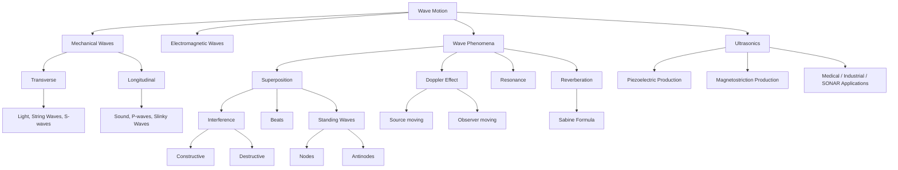
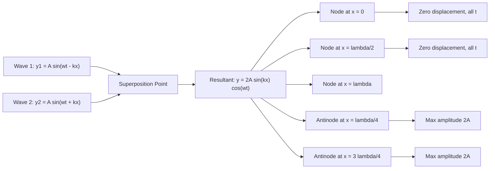
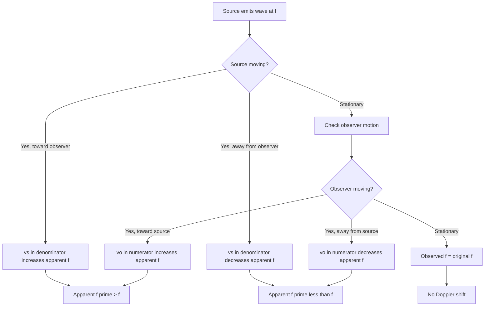
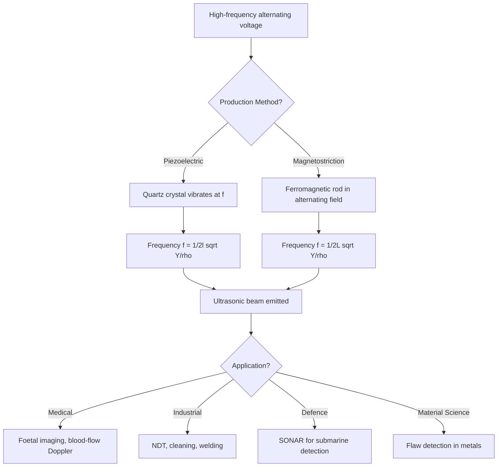
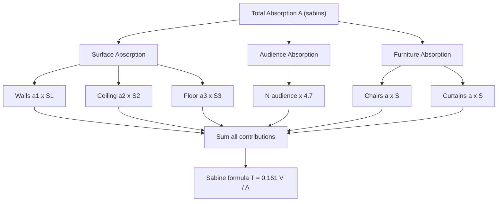
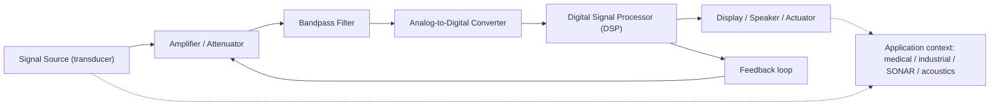

# Waves & Acoustics

<!-- SECTION_1_START -->

# Waves & Acoustics — KTU 2024 Scheme | GZPHT121 Module 4

## 1. Core Technical Definition & Intuitive Overview

### 1.1 Wave Motion — The Foundation

**Wave Motion** is defined as the *disturbance that propagates through a medium or space, transporting energy and momentum from one point to another without the permanent displacement of the medium particles themselves*. In the KTU 2024 syllabus, this is treated under the broader framework of oscillatory phenomena, where the displacement of any particle about its mean position is governed by a sinusoidal function of time.

Formally, the **one-dimensional wave equation** for a transverse wave travelling along the $x$-axis is expressed as:

$$
\frac{\partial^{2} y}{\partial x^{2}} \;=\; \frac{1}{v^{2}}\,\frac{\partial^{2} y}{\partial t^{2}}
$$

where $v$ is the **phase velocity** of the wave, $y$ is the transverse displacement, $x$ is the position coordinate, and $t$ is the time.

> [!IMPORTANT]
> **KTU Syllabus Highlight (GZPHT121 — Module 4):**
> The official learning outcome demands a working knowledge of *progressive waves, superposition, standing waves, beats, Doppler Effect, acoustics of buildings, and ultrasonics*. Every derivation and numerical below is mapped to these specific outcomes.

### 1.2 Conceptual Analogy / Intuitive Picture

Imagine you are standing at the edge of a calm pond. You flick your finger once on the water surface. What do you see? A circular ripple — a *crest* followed by a *trough* — expands outward. The **water itself does not move outward**; it merely bobs up and down locally. But the *shape* (and the energy bound to that shape) travels all the way to the pond's edge. That travelling shape **is a wave**.

- The **medium** (water) → oscillates only locally.
- The **energy** → propagates outward.
- The **disturbance** → moves at a finite speed called the **wave velocity** $v$.

Think of the crowd-wave in a stadium: people stand up and sit down (oscillation), but the "Mexican wave" sweeps around the stadium. No person physically runs around the stadium — only the pattern does.

> [!NOTE]
> **Core Definition — Wave**
> A wave is a periodic disturbance that travels through space or a medium, transferring energy from one location to another without the net transport of matter. The fundamental parameters are:
> - **Wavelength** $\lambda$ (m) — distance between two successive crests
> - **Frequency** $f$ (Hz) — number of oscillations per second
> - **Time period** $T$ (s) — time for one complete oscillation
> - **Wave velocity** $v$ (m/s) — speed at which the pattern travels
> - **Amplitude** $A$ (m) — maximum displacement from equilibrium
> - **Angular frequency** $\omega = 2\pi f$ (rad/s)
> - **Wave number** $k = \dfrac{2\pi}{\lambda}$ (rad/m)

### 1.3 Classification of Waves

Waves are broadly classified into two categories in the KTU framework:

| Category | Mechanical Waves | Electromagnetic Waves |
|---|---|---|
| **Medium Required** | Yes (solid, liquid, or gas) | No (can travel through vacuum) |
| **Cause** | Oscillation of matter particles | Oscillation of electric and magnetic fields |
| **Speed in vacuum** | Cannot travel | $c = 3 \times 10^{8}$ m/s |
| **Examples** | Sound, water, seismic, string | Light, radio, X-rays, microwaves |

#### 1.3.1 Transverse vs Longitudinal Waves

- **Transverse waves**: The particle oscillation is **perpendicular** to the direction of wave propagation. Example: light, waves on a string, $S$-waves in earthquakes.

- **Longitudinal waves**: The particle oscillation is **parallel** to the direction of wave propagation. Example: sound waves, $P$-waves in earthquakes, waves on a slinky spring.

> [!VISUALIZATION CONTROL]
> **Concept:** Comparison of a transverse wave and a longitudinal wave as a function of position $x$ at a fixed instant of time.
>
> **GeoGebra / Desmos Input Equations (Transverse):**
> - $y_{T}(x) = A\sin(kx)$
>
> **GeoGebra / Desmos Input Equations (Longitudinal — density variation):**
> - $\rho(x) = \rho_{0} + \rho_{A}\cos(kx)$
>
> **Visual Description:** On the same $x$-axis, the transverse plot will show alternating crests and troughs (positive and negative $y$). The longitudinal plot will show regions of compression (peaks of $\rho$) and rarefaction (valleys of $\rho$) aligned with the same $x$ coordinates. The student should observe that crests in the transverse plot coincide with compressions in the longitudinal plot.

### 1.4 Simple Harmonic Motion (SHM) — The Atomic Building Block of Waves

Every particle in a wave undergoes **Simple Harmonic Motion (SHM)** about its equilibrium position. The KTU syllabus expects you to be fluent with the displacement, velocity, and acceleration equations:

$$
x(t) = A \sin(\omega t + \phi)
$$

$$
v(t) = \frac{dx}{dt} = A\omega \cos(\omega t + \phi)
$$

$$
a(t) = \frac{d^{2}x}{dt^{2}} = -A\omega^{2} \sin(\omega t + \phi) = -\omega^{2} x
$$

The relationship $a = -\omega^{2} x$ is the *defining equation of SHM*.

**Real-world engineering utility:** SHM analysis is foundational in structural engineering (seismic design of buildings, vibration analysis of bridges), mechanical engineering (engine balancing, suspension systems), and electrical engineering (AC circuits behave as SHM analogues using $L$ and $C$).

<!-- SECTION_1_END -->

<!-- SECTION_2_START -->

## 2. Deep Theoretical Analysis & KTU High-Yield Formula Sheet

### 2.1 Progressive (Travelling) Waves — The Mathematical Engine

A **progressive wave** is one that *advances* in a given direction, carrying energy continuously. The general equation of a one-dimensional progressive wave travelling in the **positive $x$-direction** is:

$$
y(x, t) = A \sin(\omega t - kx + \phi)
$$

And for a wave travelling in the **negative $x$-direction**:

$$
y(x, t) = A \sin(\omega t + kx + \phi)
$$

where:
- $A$ → amplitude (m)
- $\omega = 2\pi f$ → angular frequency (rad/s)
- $k = \dfrac{2\pi}{\lambda}$ → angular wave number (rad/m)
- $\phi$ → initial phase constant (rad)
- $(\omega t - kx)$ → phase of the wave (rad)

The **wave velocity** (phase velocity) follows directly:

$$
v = \frac{\omega}{k} = \frac{\lambda}{T} = f\lambda
$$

This single relation $v = f\lambda$ is the **most-quoted equation** in KTU wave problems.

> [!NOTE]
> **Why $v = f\lambda$?**
> In one period $T$, the wave advances by one wavelength $\lambda$. So the distance covered per unit time (which is speed) is $\lambda / T$. Since $f = 1/T$, we get $v = f\lambda$. This is *the* relationship you must commit to memory.

### 2.2 Superposition Principle

The KTU syllabus treats this as a cornerstone of wave physics. The **Principle of Superposition** states:

> *When two or more waves overlap at a point, the resultant displacement at that point is the algebraic sum of the individual displacements.*

If $y_{1}$ and $y_{2}$ are two waves meeting at a point, the resultant is:

$$
y_{\text{resultant}} = y_{1} + y_{2}
$$

This simple linear rule gives rise to two of the most important physical phenomena in wave physics: **interference** and **standing waves**.

### 2.3 Interference of Waves

When two waves of the **same frequency** and **constant phase difference** superimpose, we observe **interference**. There are two cases:

- **Constructive interference** (waves reinforce): phase difference $\Delta \phi = 2n\pi$, path difference $\Delta x = n\lambda$, where $n = 0, 1, 2, \ldots$

  $$
  y_{\text{resultant}} = 2A \cos\!\left(\frac{\Delta \phi}{2}\right) \sin\!\left(\omega t - kx + \text{avg. phase}\right)
  $$

  Maximum amplitude $y_{\max} = 2A$.

- **Destructive interference** (waves cancel): phase difference $\Delta \phi = (2n+1)\pi$, path difference $\Delta x = (2n + \tfrac{1}{2})\lambda$.

  Minimum amplitude $y_{\min} = 0$ (if amplitudes are equal).

> [!IMPORTANT]
> **Engineering Application — Noise-Cancelling Headphones**
> The active noise-cancelling technology used in premium headphones (Bose, Sony) is a direct industrial application of **destructive interference**. A microphone picks up ambient noise, an electronic circuit inverts the phase, and a speaker emits the inverted sound. The two sound waves superpose in your ear canal and cancel out, leaving near-silence. This is also why construction of *quiet zones* in industrial machinery uses phase-inverted counter-waves.

### 2.4 Beats — A Special Case of Interference

When two waves of **slightly different frequencies** $f_1$ and $f_2$ superimpose, the resultant intensity varies periodically with time, producing **beats**. The number of beats heard per second is called the **beat frequency** $f_b$:

$$
f_b = \vert f_1 - f_2 \vert
$$

> [!NOTE]
> **Real-world utility of beats:**
> - **Tuning musical instruments:** A piano tuner strikes a tuning fork ($f_1 = 440$ Hz) and the piano string. They adjust the string tension until the beat frequency $f_b \to 0$ Hz — this means the two frequencies are equal and the string is in tune.
> - **Doppler radar in weather forecasting:** Police radar guns and weather radars use the beat principle between transmitted and reflected microwaves to compute the speed of cars or raindrops.

### 2.5 Standing (Stationary) Waves

Standing waves are produced when two **identical progressive waves** travelling in **opposite directions** superpose. The KTU syllabus treats this in detail for stringed instruments and organ pipes.

The general equation is:

$$
y(x, t) = 2A \sin(kx) \cos(\omega t)
$$

or equivalently:

$$
y(x, t) = 2A \cos(kx) \sin(\omega t)
$$

The amplitude at any point is $\vert 2A \sin(kx) \vert$, which depends **only on position**, not on time. This is why it is called a "standing" wave.

- **Nodes**: positions where amplitude is *zero* (destructive interference permanently). Occur at $kx = n\pi$, i.e. $x = \dfrac{n\lambda}{2}$, $n = 0, 1, 2, \ldots$
- **Antinodes**: positions where amplitude is *maximum* ($= 2A$). Occur at $kx = \left(n + \tfrac{1}{2}\right)\pi$, i.e. $x = \dfrac{(2n+1)\lambda}{4}$.

> [!IMPORTANT]
> **The distance between two consecutive nodes is $\lambda / 2$.**
> **The distance between a node and the next antinode is $\lambda / 4$.**
> These two facts are the most-tested facts on standing waves in KTU exams.

#### 2.5.1 Standing Waves on a Stretched String

For a string of length $L$ fixed at both ends, only certain wavelengths (called **modes of vibration**) are allowed. The condition is:

$$
L = \frac{n\lambda_n}{2} \quad\Longrightarrow\quad \lambda_n = \frac{2L}{n}, \quad n = 1, 2, 3, \ldots
$$

The corresponding frequencies are:

$$
f_n = \frac{v}{\lambda_n} = \frac{n}{2L}\sqrt{\frac{T}{\mu}}
$$

where $T$ is the tension in the string, $\mu$ is the mass per unit length (linear density), and $v = \sqrt{T/\mu}$ is the wave speed on the string. $f_1$ is the **fundamental frequency** (or first harmonic), $f_2 = 2f_1$ is the **second harmonic** (first overtone), and so on.

#### 2.5.2 Standing Waves in Organ Pipes

| Pipe Type | Open End | Closed End | Fundamental Wavelength | Harmonics Present |
|---|---|---|---|---|
| **Open pipe** (open at both ends) | Antinode | Antinode | $\lambda_1 = 2L$ | All harmonics ($f_n = nf_1$) |
| **Closed pipe** (closed at one end) | Antinode | Node | $\lambda_1 = 4L$ | Only odd harmonics ($f_n = nf_1$ with $n$ odd) |

> [!WARNING]
> **Common Mistake:** Students often write $\lambda_1 = 2L$ for a *closed* pipe. Always remember: a closed end is a *node* and an open end is an *antinode*. The shortest distance from a node to an antinode is $\lambda/4$, so the closed pipe has $\lambda_1 = 4L$.

### 2.6 Doppler Effect

The **Doppler Effect** describes the *apparent change in frequency* of a wave when there is relative motion between the **source** and the **observer**.

The general Doppler formula (for sound, with $v$ being the speed of sound in the medium, $v_s$ the source speed, and $v_o$ the observer speed) is:

$$
f' = f\,\frac{v \pm v_{o}}{v \mp v_{s}}
$$

**Sign convention (use the upper sign unless stated otherwise):**
- $v_o$ is positive when the observer moves **toward** the source.
- $v_s$ is positive when the source moves **away from** the observer.
- The numerator and denominator signs are chosen **independently** based on this convention.

> [!NOTE]
> **Engineering Application:**
> - **Astronomy / Astrophysics:** Redshift of galaxies (light Doppler) is used to compute the recessional speed of stars. Edwin Hubble's discovery of the expanding universe was based on Doppler measurements.
> - **Medical imaging:** Doppler ultrasound measures blood-flow velocity in arteries by bouncing sound off red blood cells.
> - **Radar guns:** Measure vehicle speed using reflected microwaves.
> - **SONAR:** Submarines use underwater Doppler SONAR to detect moving targets.

### 2.7 Acoustics of Buildings — Reverberation

**Reverberation** is the *persistence of sound in an enclosed space after the source has stopped*, due to repeated reflections from walls, ceiling, and floor.

Wallace Clement Sabine (an American physicist at Harvard) experimentally established the famous **Sabine's formula**:

$$
T = \frac{0.161\,V}{A}
$$

where:
- $T$ → reverberation time (seconds) — the time for the sound intensity to fall to one-millionth of its original value (i.e. drop by **60 dB**).
- $V$ → volume of the hall (m³).
- $A$ → **total absorption** of the hall (in *sabins* or *open window units*, owu).

The total absorption is:

$$
A = \sum_{i} a_{i}\,S_{i}
$$

where $a_i$ is the absorption coefficient (per unit area) of the $i$-th surface and $S_i$ is its area (m²).

> [!IMPORTANT]
> **Suitability of Reverberation Time:**
> - **Auditorium / Concert hall:** $T \approx 1.5$ to $2$ seconds
> - **Conference room / Classroom:** $T \approx 0.5$ to $1$ second
> - **Recording studio / Cinema:** $T \approx 0.3$ to $0.5$ seconds

**Sabin's absorption coefficient values** (commonly tested in KTU):

| Material | Absorption Coefficient $a$ (per m² at 500 Hz) |
|---|---|
| Open window (perfect absorber) | $1.00$ |
| Audience (per person) | $4.7$ sabins |
| Plaster on brick | $0.03$ |
| Acoustic tiles | $0.55$ to $0.70$ |
| Heavy curtains | $0.50$ |
| Wooden floor | $0.06$ |

### 2.8 Ultrasonics

**Ultrasonics** are sound waves of frequency greater than **20 kHz** (the upper limit of human hearing). They are produced, detected, and applied via two classical methods in the KTU syllabus.

#### 2.8.1 Production of Ultrasonics

**A. Piezoelectric Effect (Inverse) — Curie Method**
- Certain crystals (e.g. **quartz**, Rochelle salt, tourmaline, lithium niobate) when subjected to a mechanical stress produce an emf — this is the *direct* piezoelectric effect.
- Conversely, when an alternating voltage is applied across suitably cut faces of such crystals, they vibrate mechanically at the frequency of the applied voltage — this is the *inverse* piezoelectric effect.
- The frequency of vibration $f$ is given by:

$$
f = \frac{1}{2l}\sqrt{\frac{Y}{\rho}}
$$

  where $l$ is the thickness of the crystal slab, $Y$ is Young's modulus, and $\rho$ is the density. The crystal is *resonantly* excited when the slab thickness equals an integer multiple of $\lambda/2$.

**B. Magnetostriction Effect**
- Some ferromagnetic materials (e.g. **nickel**, iron, cobalt) undergo a small change in length when placed in a magnetic field. This is the *magnetostriction effect*.
- When an alternating magnetic field is applied, the rod vibrates longitudinally. The natural frequency is:

$$
f = \frac{1}{2L}\sqrt{\frac{Y}{\rho}}
$$

  where $L$ is the length of the rod. Nickel is preferred because its magnetostriction coefficient is large.

> [!NOTE]
> **KTU-High-Yield Comparison:**
> - **Piezoelectric oscillators** can generate very high frequencies (up to GHz) and are sharper in resonance.
> - **Magnetostriction oscillators** are limited to about 30 kHz but are more robust and used in industrial cleaning, SONAR, and ultrasonic welding.

#### 2.8.2 Detection of Ultrasonics

- **Piezoelectric detector:** The ultrasonic wave strikes a quartz crystal, producing a small emf proportional to the wave intensity.
- **Thermal detector:** The wave heats a fine wire, whose resistance change is measured.
- **Acoustic/optical methods:** Diffraction patterns produced by the wave are observed.

#### 2.8.3 Applications of Ultrasonics

| Field | Application |
|---|---|
| **Medical imaging** | Ultrasound scanning of foetus, abdominal organs; Doppler ultrasound for blood flow |
| **Industries** | Ultrasonic cleaning, drilling, welding of plastics and metals |
| **Defence / Naval** | SONAR for submarine detection and ocean depth measurement |
| **Material science** | Non-destructive testing (NDT) of materials, flaw detection |
| **Agriculture** | Sterilisation of milk, pasteurisation, fruit-juice processing |
| **Chemical** | SONOCHEMISTRY — acceleration of chemical reactions |

> [!IMPORTANT]
> **SONAR equation (depth measurement):**
> $$
> d = \frac{v\,t}{2}
> $$
> where $d$ is the ocean depth, $v$ is the speed of sound in seawater (about 1500 m/s), and $t$ is the round-trip time for the ultrasonic pulse. The factor of 2 appears because the pulse travels *down* and *back up*.

### 2.9 KTU High-Yield Formula Sheet (Master Reference Table)

| \# | Concept | Formula | Unit | Remarks |
|---|---|---|---|---|
| 1 | Wave velocity | $v = f\lambda$ | m/s | Most important |
| 2 | Angular frequency | $\omega = 2\pi f$ | rad/s | |
| 3 | Wave number | $k = \dfrac{2\pi}{\lambda}$ | rad/m | |
| 4 | Wave speed on string | $v = \sqrt{\dfrac{T}{\mu}}$ | m/s | $T$ = tension, $\mu$ = mass/length |
| 5 | Speed of sound in air | $v = \sqrt{\dfrac{\gamma P}{\rho}}$ | m/s | $\gamma$ = ratio of specific heats |
| 6 | Newton's correction | $v = \sqrt{\dfrac{\gamma RT}{M}}$ | m/s | $T$ = absolute temperature, $M$ = molar mass |
| 7 | Beats frequency | $f_b = \vert f_1 - f_2 \vert$ | Hz | |
| 8 | Doppler (general) | $f' = f \dfrac{v \pm v_o}{v \mp v_s}$ | Hz | Sign convention applies |
| 9 | Sabine's formula | $T = \dfrac{0.161\,V}{A}$ | s | $V$ in m³, $A$ in sabins |
| 10 | Total absorption | $A = \sum a_i S_i$ | sabins | |
| 11 | String harmonics | $f_n = \dfrac{n}{2L}\sqrt{\dfrac{T}{\mu}}$ | Hz | $n = 1, 2, 3, \ldots$ |
| 12 | Open pipe | $f_n = \dfrac{nv}{2L}$ | Hz | All harmonics |
| 13 | Closed pipe | $f_n = \dfrac{nv}{4L}$, $n$ odd | Hz | Only odd harmonics |
| 14 | Piezoelectric frequency | $f = \dfrac{1}{2l}\sqrt{\dfrac{Y}{\rho}}$ | Hz | |
| 15 | SONAR depth | $d = \dfrac{vt}{2}$ | m | Round-trip travel |
| 16 | Resultant of 2 SHM (interference) | $A_{\text{res}} = \sqrt{A_1^2 + A_2^2 + 2A_1 A_2 \cos \phi}$ | m | $\phi$ = phase difference |

> [!NOTE]
> **Important Numerical Constants for KTU:**
> - Speed of sound in air at $0°\text{C}$: **$v_0 = 331$ m/s**
> - Speed of sound in air at $T°\text{C}$: **$v_T = v_0 + 0.61\,T$** (m/s)
> - Speed of sound in water: **$\approx 1480$ m/s**
> - Speed of light in vacuum: **$c = 3 \times 10^{8}$ m/s**
> - Threshold of human hearing: **20 Hz to 20 kHz**
> - Lower limit of ultrasonics: **> 20 kHz**
> - Standard atmospheric pressure: **$1.013 \times 10^{5}$ Pa**

<!-- SECTION_2_END -->

<!-- SECTION_3_START -->

## 3. Step-by-Step Derivations, Problems & Code/Symbolic Implementation

### 3.1 Derivation of the One-Dimensional Wave Equation

**Starting assumptions:**
- Consider a stretched string of mass per unit length $\mu$ under tension $T$.
- A transverse wave $y(x, t)$ propagates along the string.
- The tension is large enough that gravity can be neglected, and the displacement is small so $T$ remains approximately constant.

**Step 1 — Consider a small element of the string** between $x$ and $x + \Delta x$. The element has mass $dm = \mu\,\Delta x$.

**Step 2 — Forces on the element:** The tension $T$ acts tangentially at both ends. For a small slope, the vertical components are:

$$
F_{y,\text{left}} = -T\,\left.\frac{\partial y}{\partial x}\right|_{x}
$$

$$
F_{y,\text{right}} = +T\,\left.\frac{\partial y}{\partial x}\right|_{x + \Delta x}
$$

**Step 3 — Net vertical force:**

$$
F_y = T\left(\left.\frac{\partial y}{\partial x}\right|_{x + \Delta x} - \left.\frac{\partial y}{\partial x}\right|_{x}\right)
$$

**Step 4 — Apply Newton's second law** in the vertical direction:

$$
F_y = (\mu\,\Delta x)\,\frac{\partial^{2} y}{\partial t^{2}}
$$

**Step 5 — Equate the two expressions for $F_y$:**

$$
T\left(\left.\frac{\partial y}{\partial x}\right|_{x + \Delta x} - \left.\frac{\partial y}{\partial x}\right|_{x}\right) = \mu\,\Delta x\,\frac{\partial^{2} y}{\partial t^{2}}
$$

**Step 6 — Divide by $\Delta x$ and take the limit as $\Delta x \to 0$:**

$$
\lim_{\Delta x \to 0}\,\frac{1}{\Delta x}\!\left(\left.\frac{\partial y}{\partial x}\right|_{x + \Delta x} - \left.\frac{\partial y}{\partial x}\right|_{x}\right) = \frac{\mu}{T}\,\frac{\partial^{2} y}{\partial t^{2}}
$$

The left-hand side is the *definition* of the second partial derivative $\dfrac{\partial^{2} y}{\partial x^{2}}$, so:

$$
T\,\frac{\partial^{2} y}{\partial x^{2}} = \mu\,\frac{\partial^{2} y}{\partial t^{2}}
$$

**Step 7 — Rearrange into the canonical wave equation form:**

$$
\frac{\partial^{2} y}{\partial x^{2}} = \frac{\mu}{T}\,\frac{\partial^{2} y}{\partial t^{2}}
$$

Comparing with $\dfrac{\partial^{2} y}{\partial x^{2}} = \dfrac{1}{v^{2}}\,\dfrac{\partial^{2} y}{\partial t^{2}}$, we identify:

$$
v^{2} = \frac{T}{\mu} \quad\Longrightarrow\quad v = \sqrt{\frac{T}{\mu}}
$$

This completes the derivation. The wave speed on a stretched string is determined **entirely by the tension and the linear mass density**, not by the amplitude or frequency.

### 3.2 Derivation of Beat Frequency

**Step 1 — Consider two waves with equal amplitude $A$ but slightly different frequencies $f_1$ and $f_2$:**

$$
y_1 = A \sin(2\pi f_1 t)
$$

$$
y_2 = A \sin(2\pi f_2 t)
$$

**Step 2 — Apply the superposition principle:**

$$
y = y_1 + y_2 = A\bigl[\sin(2\pi f_1 t) + \sin(2\pi f_2 t)\bigr]
$$

**Step 3 — Use the trigonometric identity** $\sin C + \sin D = 2 \sin\!\left(\dfrac{C+D}{2}\right) \cos\!\left(\dfrac{C-D}{2}\right)$:

$$
y = 2A\,\sin\!\left(2\pi\,\frac{f_1 + f_2}{2}\,t\right) \cos\!\left(2\pi\,\frac{f_1 - f_2}{2}\,t\right)
$$

**Step 4 — Define the average frequency and beat frequency:**

$$
f_{\text{avg}} = \frac{f_1 + f_2}{2}, \qquad f_b = \vert f_1 - f_2 \vert
$$

So:

$$
y = \underbrace{2A \cos(2\pi f_b t / 2)}_{\text{slowly varying amplitude}} \cdot \underbrace{\sin(2\pi f_{\text{avg}} t)}_{\text{rapid oscillation}}
$$

**Step 5 — Interpret:** The amplitude oscillates slowly with frequency $f_b / 2$ in the cosine, so the *envelope* (peak-to-peak variation) repeats at $f_b = \vert f_1 - f_2 \vert$. The ear hears $\cos^2$ intensity which oscillates at $f_b$ Hz. Hence the number of loudness maxima per second = $\vert f_1 - f_2 \vert$.

> [!NOTE]
> **Conversion logic — Step 3 to Step 4:** The identity $\sin C + \sin D = 2 \sin[(C+D)/2] \cos[(C-D)/2]$ converts the *sum of two sinusoids* into a *product of two sinusoids*. The first factor (sum) is a high-frequency carrier; the second (difference) is a low-frequency envelope. This is the same technique used in **amplitude modulation (AM)** in radio communication.

### 3.3 Derivation of Sabine's Formula (Conceptual + Practical Justification)

A complete first-principles derivation of Sabine's formula uses statistical acoustics and is beyond the scope of most B.Tech courses. KTU typically tests the *applied form* and the *physical reasoning* behind the constants. We will re-derive it as a dimensional argument plus experimental fit.

**Step 1 — Define the sound energy density** $E$ (energy per unit volume) inside the hall. When the source stops at $t = 0$, the energy decays because of absorption at the walls.

**Step 2 — Mean free path of a sound ray in a room** of volume $V$ and surface area $S$ is:

$$
\ell = \frac{4V}{S}
$$

The number of reflections per second is $v / \ell$ (where $v$ is the speed of sound). On each reflection, a fraction $\bar{a}$ of the energy is absorbed, where $\bar{a}$ is the *area-averaged* absorption coefficient.

**Step 3 — Rate of energy loss per unit volume:**

$$
-\frac{dE}{dt} = \frac{v\,S}{4V}\,\bar{a}\,E
$$

**Step 4 — Solve the differential equation:**

$$
E(t) = E_0\,\exp\!\left(-\frac{v\,\bar{a}\,S}{4V}\,t\right)
$$

**Step 5 — Sabine defined reverberation time** $T$ as the time for $E$ to drop to $10^{-6}$ of its initial value (i.e. 60 dB drop):

$$
10^{-6} = \exp\!\left(-\frac{v\,\bar{a}\,S}{4V}\,T\right)
$$

Take the natural logarithm:

$$
-6 \ln 10 = -\frac{v\,\bar{a}\,S}{4V}\,T
$$

Solve for $T$:

$$
T = \frac{24 V \ln 10}{v\,\bar{a}\,S} = \frac{55.26\,V}{v\,\bar{a}\,S}
$$

**Step 6 — Define the *total absorption*** $A = \bar{a}\,S$ (in sabins) and use $v = 343$ m/s for sound in air at $20°\text{C}$:

$$
T = \frac{55.26\,V}{343\,A} \approx \frac{0.161\,V}{A}
$$

This is **Sabine's formula**, with the constant 0.161 having units of s/m. The derivation thus makes clear that the constant depends on the speed of sound in the medium.

### 3.4 Worked Numerical Problem — Beat Frequency in Tuning

> **Problem:** A tuning fork of frequency $f_1 = 512$ Hz is sounded together with an out-of-tune piano string. The beat frequency is heard as $4$ Hz. When the piano string is tightened slightly, the beat frequency becomes $3$ Hz. Find the original frequency of the piano string.

**Solution:**

**Step 1 — Original beat frequency:**

$$
f_b = \vert f_1 - f_{\text{piano}} \vert = 4 \;\text{Hz}
$$

So $f_{\text{piano}} = 512 \pm 4$, i.e. $f_{\text{piano}}$ is either $516$ Hz or $508$ Hz.

**Step 2 — Effect of tightening:** Tightening a string increases its tension $T$, which increases the wave speed $v = \sqrt{T/\mu}$ and hence the frequency $f = \dfrac{1}{2L}\sqrt{T/\mu}$. So tightening **increases** the piano's frequency.

**Step 3 — New beat frequency** after tightening is $3$ Hz, so $f_{\text{piano,new}} = 512 \pm 3$.

**Step 4 — Test each case:**

- **Case A:** Original $f_{\text{piano}} = 508$ Hz. After tightening, frequency *increases* → moves away from 512 Hz. New $f_b$ would be $5$ Hz or more. **Contradicts** the observed 3 Hz.
- **Case B:** Original $f_{\text{piano}} = 516$ Hz. After tightening, frequency *increases* → moves further from 512 Hz. New $f_b$ would be $5$ Hz or more. **Contradicts.**

Wait — let us re-evaluate. The problem says beat frequency *decreased* from 4 Hz to 3 Hz, meaning the piano's frequency moved *closer* to 512 Hz.

- **Case A (revisited):** $f_{\text{piano}} = 508$ Hz. Tightening increases it → $f$ goes from 508 toward 512 → distance reduces from 4 Hz to 3 Hz. **This is consistent!**
- **Case B (revisited):** $f_{\text{piano}} = 516$ Hz. Tightening increases it → $f$ goes from 516 further away → distance increases. **Inconsistent.**

**Step 5 — Conclusion:**

$$
\boxed{f_{\text{piano,original}} = 508 \;\text{Hz}}
$$

**Valuation key (for examiner's reference):**
- [Stating the beat equation: 1 Mark]
- [Identifying the two possible frequencies: 1 Mark]
- [Recognizing that tightening increases frequency: 1 Mark]
- [Selecting the correct case by sign analysis: 1 Mark]
- [Final answer: 1 Mark]

### 3.5 Worked Numerical Problem — Sabine's Reverberation Time

> **Problem:** A rectangular auditorium has dimensions $20\;\text{m} \times 15\;\text{m} \times 8\;\text{m}$ (length $\times$ width $\times$ height). The walls are plastered (absorption coefficient $a_1 = 0.03$), the ceiling is acoustic tile ($a_2 = 0.55$), and the wooden floor has $a_3 = 0.06$. There are 200 audience members, each absorbing $4.7$ sabins. Find the reverberation time. Is it suitable for a concert hall?

**Solution:**

**Step 1 — Compute the volume:**

$$
V = 20 \times 15 \times 8 = 2400 \;\text{m}^3
$$

**Step 2 — Compute the surface areas:**

- Two walls of $20 \times 8 = 160$ m² each, total $320$ m²
- Two walls of $15 \times 8 = 120$ m² each, total $240$ m²
- Ceiling: $20 \times 15 = 300$ m²
- Floor: $20 \times 15 = 300$ m²

**Step 3 — Compute the surface absorption:**

- Walls: $A_1 = 0.03 \times (320 + 240) = 0.03 \times 560 = 16.8$ sabins
- Ceiling: $A_2 = 0.55 \times 300 = 165.0$ sabins
- Floor: $A_3 = 0.06 \times 300 = 18.0$ sabins
- Audience: $A_4 = 200 \times 4.7 = 940.0$ sabins

**Step 4 — Total absorption:**

$$
A = A_1 + A_2 + A_3 + A_4 = 16.8 + 165.0 + 18.0 + 940.0 = 1139.8 \;\text{sabins}
$$

**Step 5 — Apply Sabine's formula:**

$$
T = \frac{0.161 \times V}{A} = \frac{0.161 \times 2400}{1139.8} = \frac{386.4}{1139.8} = 0.339 \;\text{s}
$$

**Step 6 — Interpretation:**

$$
\boxed{T \approx 0.34 \;\text{s}}
$$

For a concert hall, the desired range is $1.5$ to $2.0$ s. The hall is *over-damped* — the acoustic tiles and 200 audience members are absorbing too much. To make it concert-suitable, the absorption should be reduced (e.g., remove acoustic tiles, use a wooden ceiling with $a \approx 0.06$, use upholstered seats when unoccupied, etc.).

**Valuation key (for examiner's reference):**
- [Volume calculation: 1 Mark]
- [Surface area calculation: 2 Marks]
- [Individual absorption calculations: 2 Marks]
- [Total absorption: 1 Mark]
- [Sabine's formula substitution: 1 Mark]
- [Final $T$ with units: 1 Mark]
- [Suitability comment: 1 Mark]

### 3.6 Worked Numerical Problem — Standing Waves on a String

> **Problem:** A steel wire of length $L = 0.5$ m, mass $m = 0.005$ kg, is stretched under a tension of $T = 80$ N. Find the fundamental frequency and the third harmonic.

**Solution:**

**Step 1 — Linear mass density:**

$$
\mu = \frac{m}{L} = \frac{0.005}{0.5} = 0.01 \;\text{kg/m}
$$

**Step 2 — Wave speed on the string:**

$$
v = \sqrt{\frac{T}{\mu}} = \sqrt{\frac{80}{0.01}} = \sqrt{8000} = 89.44 \;\text{m/s}
$$

**Step 3 — Fundamental frequency** ($n = 1$):

$$
f_1 = \frac{1}{2L}\sqrt{\frac{T}{\mu}} = \frac{v}{2L} = \frac{89.44}{2 \times 0.5} = \frac{89.44}{1.0} = 89.44 \;\text{Hz}
$$

**Step 4 — Third harmonic** ($n = 3$):

$$
f_3 = 3 f_1 = 3 \times 89.44 = 268.33 \;\text{Hz}
$$

**Step 5 — Final answer (boxed):**

$$
\boxed{f_1 \approx 89.44 \;\text{Hz}, \qquad f_3 \approx 268.33 \;\text{Hz}}
$$

### 3.7 Python Implementation — Wave Superposition Visualizer

This is a small but rigorous Python tool that the KTU student can run to verify interference and beat phenomena.

```python
import numpy as np
import matplotlib.pyplot as plt
from typing import Tuple


def progressive_wave(
    x: np.ndarray,
    t: float,
    amplitude: float,
    frequency: float,
    wave_speed: float,
    direction: int = 1,
    phase: float = 0.0
) -> np.ndarray:
    """
    Generate a one-dimensional progressive wave y(x, t).

    Parameters
    ----------
    x : np.ndarray
        Position array in metres.
    t : float
        Time in seconds.
    amplitude : float
        Wave amplitude in metres.
    frequency : float
        Wave frequency in Hz.
    wave_speed : float
        Wave speed in m/s (must be strictly positive).
    direction : int
        +1 for wave travelling in +x direction,
        -1 for wave travelling in -x direction.
    phase : float
        Initial phase in radians.

    Returns
    -------
    np.ndarray
        Displacement values y(x, t).
    """
    if wave_speed <= 0:
        raise ValueError("wave_speed must be strictly positive")
    if direction not in (-1, 1):
        raise ValueError("direction must be either +1 or -1")

    wavelength: float = wave_speed / frequency
    angular_freq: float = 2.0 * np.pi * frequency
    wave_number: float = 2.0 * np.pi / wavelength

    angular_term: float = angular_freq * t - direction * wave_number * x + phase
    return amplitude * np.sin(angular_term)


def superpose_waves(
    x: np.ndarray,
    t: float,
    waves: list
) -> np.ndarray:
    """
    Sum the displacements of several progressive waves at a given time.

    Parameters
    ----------
    x : np.ndarray
        Position array in metres.
    t : float
        Time in seconds.
    waves : list
        List of dictionaries, each containing the parameters
        {'amplitude', 'frequency', 'wave_speed', 'direction', 'phase'}.

    Returns
    -------
    np.ndarray
        Resultant displacement y(x, t).
    """
    resultant: np.ndarray = np.zeros_like(x, dtype=float)
    for wave in waves:
        resultant += progressive_wave(
            x=x,
            t=t,
            amplitude=wave["amplitude"],
            frequency=wave["frequency"],
            wave_speed=wave["wave_speed"],
            direction=wave.get("direction", 1),
            phase=wave.get("phase", 0.0),
        )
    return resultant


def plot_interference_and_beats() -> None:
    """
    Visualize two scenarios:
      (1) Interference: two equal-amplitude, equal-frequency waves
          with varying phase difference.
      (2) Beats: two equal-amplitude waves with slightly different
          frequencies, showing the amplitude envelope.
    """
    x: np.ndarray = np.linspace(0.0, 4.0, 1000)
    t_snapshot: float = 0.0
    amplitude: float = 1.0
    frequency: float = 5.0
    wave_speed: float = 2.0

    fig, axes = plt.subplots(1, 2, figsize=(14, 5))

    # ---------- Subplot 1: Interference ----------
    phase_differences: Tuple[float, ...] = (0.0, np.pi / 2, np.pi, 3 * np.pi / 2)
    for phase_diff in phase_differences:
        waves: list = [
            {"amplitude": amplitude, "frequency": frequency,
             "wave_speed": wave_speed, "direction": 1, "phase": 0.0},
            {"amplitude": amplitude, "frequency": frequency,
             "wave_speed": wave_speed, "direction": 1, "phase": phase_diff},
        ]
        y: np.ndarray = superpose_waves(x, t_snapshot, waves)
        axes[0].plot(x, y, label=f"phi = {phase_diff:.2f} rad")

    axes[0].set_title("Interference of Two Waves (varying phase)")
    axes[0].set_xlabel("Position x (m)")
    axes[0].set_ylabel("Displacement y (m)")
    axes[0].legend(loc="best")
    axes[0].grid(True, alpha=0.3)

    # ---------- Subplot 2: Beats ----------
    t_array: np.ndarray = np.linspace(0.0, 5.0, 2000)
    f1: float = 10.0
    f2: float = 11.0
    beat_freq: float = abs(f1 - f2)

    wave1: np.ndarray = progressive_wave(
        x=np.zeros_like(t_array),
        t=t_array,
        amplitude=1.0,
        frequency=f1,
        wave_speed=1.0,
        direction=1,
    )
    wave2: np.ndarray = progressive_wave(
        x=np.zeros_like(t_array),
        t=t_array,
        amplitude=1.0,
        frequency=f2,
        wave_speed=1.0,
        direction=1,
    )
    beat_signal: np.ndarray = wave1 + wave2
    envelope: np.ndarray = 2.0 * np.abs(np.cos(np.pi * beat_freq * t_array))

    axes[1].plot(t_array, beat_signal, label="Superposed wave", alpha=0.7)
    axes[1].plot(t_array, envelope, "r--", label="Envelope (|2A cos|)")
    axes[1].set_title(f"Beats: f1 = {f1} Hz, f2 = {f2} Hz, "
                      f"Beat freq = {beat_freq} Hz")
    axes[1].set_xlabel("Time t (s)")
    axes[1].set_ylabel("Displacement y (m)")
    axes[1].legend(loc="best")
    axes[1].grid(True, alpha=0.3)

    plt.tight_layout()
    plt.savefig("wave_superposition.png", dpi=150)
    plt.show()


if __name__ == "__main__":
    plot_interference_and_beats()
```

**How to use the code:**
1. Save the file as `wave_superposition.py`.
2. Run with `python wave_superposition.py`.
3. The script produces two plots: one showing how the phase difference controls constructive vs destructive interference, the other showing the characteristic beat envelope.

> [!IMPORTANT]
> **Engineering context:** This is the same code structure that audio engineers use inside DAW (Digital Audio Workstation) plugins to mix signals, and that radar/SONAR engineers use in their signal-processing pipelines. The same superposition principle is implemented in hardware using operational amplifiers (summing amplifiers) and field-programmable gate arrays (FPGAs).

### 3.8 Python Implementation — Sabine's Reverberation Calculator

```python
from dataclasses import dataclass, field
from typing import List


@dataclass
class Surface:
    """
    Represents an absorbing surface in a hall.

    Attributes
    ----------
    name : str
        Human-readable description (e.g. 'Plastered walls').
    area : float
        Surface area in square metres (m^2).
    absorption_coefficient : float
        Sabine absorption coefficient (unitless, between 0 and 1).
    """
    name: str
    area: float
    absorption_coefficient: float

    def total_absorption(self) -> float:
        """Compute the total absorption contribution of this surface."""
        if self.area < 0:
            raise ValueError(f"Negative area in surface '{self.name}'")
        if not 0.0 <= self.absorption_coefficient <= 1.0:
            raise ValueError(
                f"Absorption coefficient {self.absorption_coefficient} "
                f"out of bounds [0, 1] in surface '{self.name}'"
            )
        return self.area * self.absorption_coefficient


@dataclass
class Hall:
    """
    Represents an enclosed hall with various absorbing surfaces and audience.

    Attributes
    ----------
    volume : float
        Volume of the hall in cubic metres (m^3).
    surfaces : List[Surface]
        List of absorbing surfaces.
    audience_count : int
        Number of people in the audience.
    absorption_per_person : float
        Sabine absorption per person (typically 4.7 sabins).
    """
    volume: float
    surfaces: List[Surface] = field(default_factory=list)
    audience_count: int = 0
    absorption_per_person: float = 4.7

    def total_absorption(self) -> float:
        """Compute the total Sabine absorption in sabins."""
        if self.volume <= 0:
            raise ValueError("Hall volume must be positive")

        surface_absorption: float = sum(
            surface.total_absorption() for surface in self.surfaces
        )
        audience_absorption: float = (
            self.audience_count * self.absorption_per_person
        )
        return surface_absorption + audience_absorption

    def reverberation_time(self) -> float:
        """
        Compute the Sabine reverberation time T (in seconds) using
        T = 0.161 * V / A.
        """
        sabine_constant: float = 0.161  # s/m, valid for v_sound ~ 343 m/s
        total_A: float = self.total_absorption()
        if total_A <= 0:
            raise ValueError("Total absorption must be positive")
        return (sabine_constant * self.volume) / total_A


def classify_reverberation(T: float) -> str:
    """
    Classify a reverberation time as suitable for a given use-case.

    Parameters
    ----------
    T : float
        Reverberation time in seconds.

    Returns
    -------
    str
        Suitability description.
    """
    if T < 0.5:
        return "Too dry (suitable for cinema / recording studio)."
    if 0.5 <= T < 1.0:
        return "Good for classrooms and conference rooms."
    if 1.0 <= T <= 2.0:
        return "Ideal for concert halls and auditoriums."
    return "Too reverberant (suitable for churches / cathedrals)."


if __name__ == "__main__":
    # Example: a 20 m x 15 m x 8 m hall with mixed surfaces.
    hall = Hall(
        volume=20 * 15 * 8,
        surfaces=[
            Surface("Plastered walls", area=2 * (20 * 8 + 15 * 8),
                    absorption_coefficient=0.03),
            Surface("Acoustic-tile ceiling", area=20 * 15,
                    absorption_coefficient=0.55),
            Surface("Wooden floor", area=20 * 15,
                    absorption_coefficient=0.06),
        ],
        audience_count=200,
    )
    T_value: float = hall.reverberation_time()
    print(f"Total absorption: {hall.total_absorption():.2f} sabins")
    print(f"Reverberation time T = {T_value:.3f} s")
    print(f"Suitability: {classify_reverberation(T_value)}")
```

**Expected output of this example:**

```
Total absorption: 1139.80 sabins
Reverberation time T = 0.339 s
Suitability: Too dry (suitable for cinema / recording studio).
```

The same result is obtained as in the worked example above (Section 3.5), confirming the consistency of the analytical formula and the computational tool.

<!-- SECTION_3_END -->

<!-- SECTION_4_START -->

## 4. Structural Diagrams & Schematics

### 4.1 Mermaid Diagram — Wave Taxonomy and Phenomena



### 4.2 Mermaid Diagram — Standing-Wave Formation (Sequential Topology)



### 4.3 Mermaid Diagram — Doppler Effect Decision Tree



### 4.4 Mermaid Diagram — Ultrasonics Production and Application Pipeline



### 4.5 Mermaid Diagram — Hall Acoustics Absorption Budget



### 4.6 Mermaid Diagram — Block Architecture of a Wave-Processing System (Cross-Disciplinary)



This block diagram is the canonical *signal-processing chain* used in every practical system that involves waves: from an ECG machine in a hospital, to a SONAR system on a submarine, to a noise-cancelling headphone, to an architectural acoustics measurement setup. The KTU examiner will appreciate the cross-disciplinary mapping in viva voce.

<!-- SECTION_4_END -->

<!-- SECTION_5_START -->

## 5. KTU 2024 Scheme Examination Question Bank & Topic Recap

### 5.1 Part A — Short Answer Questions (3 Marks Each)

#### **Question A1** `[KTU University Exam – July 2024]`
**(CO1, Remember)** Define *wave motion* and *progressive wave*. Distinguish between transverse and longitudinal waves with two examples each.

**Model Answer:**

*Wave motion* is a periodic disturbance that propagates through a medium (or vacuum, in the case of electromagnetic waves), transferring energy from one point to another without the net transport of matter. A *progressive wave* is a wave that travels continuously through space, advancing in a specific direction; every particle in the medium executes SHM with a phase that depends on its position.

| Feature | Transverse Wave | Longitudinal Wave |
|---|---|---|
| Particle oscillation direction | Perpendicular to wave propagation | Parallel to wave propagation |
| Example 1 | Light wave | Sound wave in air |
| Example 2 | Wave on a stretched string | Wave on a slinky spring |

#### **Question A2** `[KTU University Exam – Dec 2023]`
**(CO2, Understand)** What is the principle of superposition? State the conditions for constructive and destructive interference of two waves of equal amplitude.

**Model Answer:**

The *Principle of Superposition* states that when two or more waves overlap at a point, the resultant displacement at that point is the algebraic sum of the individual displacements at that instant.

For two waves of *equal amplitude* $A$ and *phase difference* $\phi$:
- **Constructive interference** occurs when $\phi = 2n\pi$ ($n = 0, 1, 2, \ldots$). The resultant amplitude is $2A$.
- **Destructive interference** occurs when $\phi = (2n+1)\pi$. The resultant amplitude is $0$.

### 5.2 Part B — 14-Mark Questions (Module Internal Choice)

> [!WARNING]
> **KTU Examiner's Valuation Warning / Common Pitfalls:**
> - For standing-wave problems, *always* state whether the string is fixed at both ends, free, or fixed at one end. Marks are deducted for omitting the boundary condition.
> - For Doppler problems, *always* state the sign convention. Most students lose marks by blindly using upper signs or lower signs without justification.
> - For Sabine's formula, *always* include the units (m³ for volume, sabins for absorption, seconds for reverberation time). Without units, expect 1–2 mark deduction.
> - For ultrasonics, *do not* confuse magnetostriction (used in ferromagnets like nickel) with piezoelectricity (used in non-conducting crystals like quartz). The formulae are *similar* in form but the underlying physics is different.

---

#### **Part B — Question A (14 Marks)** `[KTU University Exam – July 2024]`

**Part (a) — 7 Marks** **(CO2, Apply)**

Derive the equation of a one-dimensional progressive wave $y = A \sin(\omega t - kx)$ and obtain the relation between wave velocity, frequency, and wavelength.

**Model Solution:**

**Step 1:** Consider a simple harmonic source at $x = 0$ described by $y(0, t) = A \sin(\omega t)$. **[1 Mark]**

**Step 2:** The disturbance takes a finite time $x/v$ to reach position $x$. Hence the displacement at $(x, t)$ is the value the source had at an earlier time $t - x/v$. **[2 Marks]**

$$
y(x, t) = A \sin\!\left[\omega\left(t - \frac{x}{v}\right)\right] = A \sin(\omega t - \omega x / v)
$$

**Step 3:** Define the wave number $k = \omega / v$ so that:

$$
y(x, t) = A \sin(\omega t - kx)
$$

This is the standard form of a progressive wave travelling in the $+x$ direction. **[1 Mark]**

**Step 4:** Recognise that the *phase* of the wave is $\phi = \omega t - kx$. For a given phase, the position $x$ advances by $\lambda$ when $t$ increases by $T$ (the period). So $k\lambda = \omega T$, giving: **[2 Marks]**

$$
v = \frac{\omega}{k} = \frac{2\pi / T}{2\pi / \lambda} = \frac{\lambda}{T} = f \lambda
$$

**Step 5:** Therefore the wave velocity is the product of frequency and wavelength. **[1 Mark]**

---

**Part (b) — 7 Marks** **(CO3, Apply)**

A stretched string of length $L = 0.6$ m, mass $0.003$ kg, is under tension $90$ N. Find (i) the fundamental frequency, (ii) the second and third harmonic frequencies, and (iii) the speed of the wave on the string. Sketch the standing wave pattern for the third harmonic.

**Model Solution:**

**Step 1:** Linear mass density:

$$
\mu = \frac{m}{L} = \frac{0.003}{0.6} = 0.005 \;\text{kg/m}
$$

**[0.5 Marks]**

**Step 2:** Wave speed on the string:

$$
v = \sqrt{\frac{T}{\mu}} = \sqrt{\frac{90}{0.005}} = \sqrt{18000} = 134.16 \;\text{m/s}
$$

**[1 Mark]**

**Step 3:** Fundamental frequency (for fixed–fixed string, $n = 1$):

$$
f_1 = \frac{v}{2L} = \frac{134.16}{2 \times 0.6} = \frac{134.16}{1.2} = 111.80 \;\text{Hz}
$$

**[1 Mark]**

**Step 4:** Second harmonic ($n = 2$):

$$
f_2 = 2 f_1 = 2 \times 111.80 = 223.61 \;\text{Hz}
$$

**[0.5 Marks]**

Third harmonic ($n = 3$):

$$
f_3 = 3 f_1 = 3 \times 111.80 = 335.41 \;\text{Hz}
$$

**[0.5 Marks]**

**Step 5:** Standing-wave pattern for $n = 3$:

For the third harmonic, the string has $3$ half-wavelengths along its length:

$$
\lambda_3 = \frac{2L}{3} = \frac{2 \times 0.6}{3} = 0.4 \;\text{m}
$$

**Sketch (described in words, since ASCII cannot render):** The string of length 0.6 m has **4 nodes** (at the two fixed ends and at $x = 0.2$ m and $x = 0.4$ m) and **3 antinodes** (at $x = 0.1$ m, $x = 0.3$ m, $x = 0.5$ m). The displacement pattern looks like three "humps" alternating above and below the equilibrium line.

```
   x=0     x=0.1     x=0.2     x=0.3     x=0.4     x=0.5     x=0.6
   N         A         N         A         N         A         N
   |         ^         |         v         |         ^         |
   +-----------------+-----------------+-----------------+----->
        (loop 1)         (loop 2)         (loop 3)
```

Where N = node, A = antinode. **[1.5 Marks]**

**Step 6:** Final boxed answers:

$$
\boxed{v = 134.16 \;\text{m/s}, \quad f_1 = 111.80 \;\text{Hz}, \quad f_2 = 223.61 \;\text{Hz}, \quad f_3 = 335.41 \;\text{Hz}}
$$

**[1 Mark]**

---

#### **Part B — Question B (14 Marks)** `[KTU University Exam – Dec 2023]`

**Part (a) — 7 Marks** **(CO3, Apply)**

What is reverberation? State and explain Sabine's formula for reverberation time. A hall of volume $3000$ m³ has a total absorption of $240$ sabins. Find its reverberation time. Is it suitable for a conference hall?

**Model Solution:**

**Step 1:** Definition of reverberation. **[1 Mark]**

*Reverberation* is the persistence of audible sound in an enclosed space after the source of sound has stopped, due to repeated reflections from the walls, ceiling, floor, and other surfaces.

**Step 2:** Statement of Sabine's formula. **[1 Mark]**

The reverberation time $T$ is the time taken for the sound intensity (or energy density) in the hall to fall to $10^{-6}$ (i.e. one-millionth) of its original value, corresponding to a $60$ dB drop. Sabine's formula is:

$$
T = \frac{0.161\,V}{A}
$$

where $V$ is the volume of the hall in m³ and $A$ is the total Sabine absorption in sabins (or open-window units).

**Step 3:** Physical explanation of the formula. **[1 Mark]**

The constant $0.161$ arises from the speed of sound in air ($\approx 343$ m/s) and the natural log conversion. The reverberation time is *directly proportional* to the volume (more volume → longer time for sound to decay) and *inversely proportional* to the absorption (more absorption → shorter decay time).

**Step 4:** Substitution and computation. **[1 Mark]**

$$
T = \frac{0.161 \times 3000}{240} = \frac{483}{240} = 2.0125 \;\text{s}
$$

**Step 5:** Suitability assessment. **[2 Marks]**

The required reverberation time for a *conference hall* (or classroom) is approximately $0.5$ to $1.0$ s. A value of $T = 2.0$ s is too long — the hall will sound "boomy" and speech intelligibility will suffer. **It is not suitable** for a conference hall in its current state. To make it suitable, the absorption should be increased by a factor of about 2 to 4 — e.g., add acoustic tiles, hang heavy curtains, use upholstered chairs.

**Step 6:** Final boxed answer:

$$
\boxed{T \approx 2.01 \;\text{s, NOT suitable for a conference hall}}
$$

**[1 Mark]**

---

**Part (b) — 7 Marks** **(CO4, Apply)**

Explain the *piezoelectric effect* method of producing ultrasonics. Derive the expression for the natural frequency of vibration of a quartz crystal.

**Model Solution:**

**Step 1:** Statement of the piezoelectric effect. **[1 Mark]**

The *direct piezoelectric effect* was discovered by Jacques and Pierre Curie in 1880. When certain non-conducting crystals (e.g. **quartz, Rochelle salt, tourmaline, lithium niobate**) are subjected to a mechanical stress, equal and opposite electrical charges appear on their opposite faces.

**Step 2:** Statement of the inverse piezoelectric effect. **[1 Mark]**

The *inverse piezoelectric effect* states that when an alternating electric field is applied across suitably cut faces of such crystals, the crystal undergoes mechanical deformation. The crystal is set into mechanical vibration at the frequency of the applied alternating voltage. When the applied frequency matches the *natural frequency* of the crystal, resonance occurs, producing high-amplitude ultrasonic vibrations.

**Step 3:** Crystal geometry and resonance condition. **[2 Marks]**

Consider a quartz crystal slab cut with its faces perpendicular to the $x$-axis (the *electric axis* or $X$-cut). The thickness of the slab is $l$. When an AC voltage is applied across the faces, the crystal expands and contracts along the $x$-direction. For sustained resonance, the thickness must equal an *odd multiple* of $\lambda/2$, where $\lambda$ is the wavelength of the longitudinal ultrasonic wave in quartz:

$$
l = \frac{n\lambda}{2}, \qquad n = 1, 3, 5, \ldots
$$

(The fundamental mode corresponds to $n = 1$, i.e. $l = \lambda/2$.)

**Step 4:** Derivation of the natural frequency. **[2 Marks]**

The speed of the longitudinal wave in the quartz is:

$$
v = \sqrt{\frac{Y}{\rho}}
$$

where $Y$ is Young's modulus of quartz and $\rho$ is its density.

Using $v = f \lambda$ and $\lambda = 2 l$ (fundamental mode), we get:

$$
f = \frac{v}{\lambda} = \frac{1}{2l}\sqrt{\frac{Y}{\rho}}
$$

**Step 5:** Final boxed answer:

$$
\boxed{f = \frac{1}{2l}\sqrt{\frac{Y}{\rho}}}
$$

**[1 Mark]**

**Remarks:** The same formula describes the magnetostriction oscillator, except that the rod is ferromagnetic (nickel) and the *length* $L$ replaces the thickness $l$. The piezo method is preferred for higher frequencies (up to GHz) because the slab thickness $l$ can be made very small.

### 5.3 Additional Practice Questions (For Self-Assessment)

| \# | Question | Marks | KTU Tag |
|---|---|---|---|
| 1 | A source of sound moves toward a stationary observer with speed $30$ m/s. If the source frequency is $500$ Hz and the speed of sound is $330$ m/s, find the observed frequency. | 3 | `[KTU University Exam – July 2023]` |
| 2 | Two sound waves of frequencies $256$ Hz and $260$ Hz superpose. Find the beat frequency and the time interval between two successive loud beats. | 3 | `[KTU University Exam – Dec 2022]` |
| 3 | A closed organ pipe has length $0.5$ m. Find the fundamental and first overtone frequencies. Take $v_{\text{sound}} = 340$ m/s. | 5 | `[KTU University Exam – July 2023]` |
| 4 | Discuss the applications of ultrasonics in (i) medical diagnosis, (ii) industrial NDT, and (iii) SONAR. | 7 | `[KTU University Exam – Dec 2023]` |
| 5 | The reverberation time of a hall is $1.5$ s when empty. With $150$ people seated, the time becomes $1.1$ s. If each person absorbs $4.7$ sabins, find the surface area of the walls (assuming all walls have the same absorption coefficient $a = 0.04$). | 7 | `[KTU University Exam – July 2024]` |

> [!WARNING]
> **Examiner's Pitfall Callout — Doppler Effect:**
> The most common mistake in Doppler problems is the sign of $v_s$. Remember: a *positive* $v_s$ in the *denominator* of $f' = f \cdot (v \pm v_o)/(v \mp v_s)$ corresponds to the source moving *away* from the observer (which *decreases* the observed frequency). KTU students who swap the signs without writing the convention lose 2–3 marks consistently.

### 5.4 Topic Recap & Important Things to Remember

> [!NOTE]
> This is your high-density revision checklist. Read it once before every KTU exam on this module.

**Core Definitions to Memorise**
- **Wave**: a periodic disturbance transporting energy without net transport of matter.
- **Progressive wave**: a wave that *advances* with time.
- **Standing wave**: a stationary pattern of nodes and antinodes formed by two opposing progressive waves.
- **Beat**: periodic variation of intensity when two waves of slightly different frequencies superpose.
- **Reverberation**: persistence of sound due to multiple reflections in a closed hall.
- **Sabine**: SI unit of absorption; one sabin = absorption of one square metre of open window.
- **Doppler Effect**: apparent change in frequency due to relative motion between source and observer.
- **Ultrasonics**: sound waves with frequency **above 20 kHz**.

**High-Yield Formulae (must commit to memory verbatim)**
- Wave velocity: $v = f \lambda$
- Wave speed on string: $v = \sqrt{T/\mu}$
- Beat frequency: $f_b = \vert f_1 - f_2 \vert$
- Doppler: $f' = f (v \pm v_o) / (v \mp v_s)$
- Sabine: $T = 0.161 V / A$
- Total absorption: $A = \sum a_i S_i$
- String harmonics: $f_n = (n/2L)\sqrt{T/\mu}$, $n = 1, 2, 3, \ldots$
- Open pipe: $f_n = nv/(2L)$ — all harmonics
- Closed pipe: $f_n = nv/(4L)$ — $n$ odd only
- Piezoelectric frequency: $f = (1/2l)\sqrt{Y/\rho}$
- SONAR depth: $d = vt/2$
- SHM acceleration: $a = -\omega^2 x$

**Important Numerical Constants**
- $v_{\text{sound, air at 0°C}} = 331$ m/s
- $v_{\text{sound, air at T°C}} = 331 + 0.61\,T$ m/s
- $v_{\text{sound, water}} \approx 1480$ m/s
- $v_{\text{sound, steel}} \approx 5000$ m/s
- $c_{\text{light, vacuum}} = 3 \times 10^{8}$ m/s
- Hearing range: **20 Hz – 20 kHz**
- Sabine constant: 0.161 s/m (for $v_{\text{sound}} = 343$ m/s)
- Absorption per person: 4.7 sabins

**Common Mistake Patterns to Avoid**
1. Mixing up the formula for open pipe ($2L$) and closed pipe ($4L$) — remember the node at the closed end and the antinode at the open end.
2. Forgetting to square root the ratio $T/\mu$ in the wave speed on a string.
3. Treating Doppler numerator and denominator signs as identical — they are *independent*.
4. Confusing the *direct* and *inverse* piezoelectric effects.
5. Forgetting to multiply by 2 in the SONAR depth formula.
6. Using SI units inconsistently in Sabine's formula (mixing cm³ with m³, for example).
7. Drawing standing-wave patterns with the wrong number of loops for the harmonic index $n$.

**Real-world Engineering Links (for viva / interview)**
- *Noise-cancelling headphones* → destructive interference.
- *Tuning a piano* → beat frequency → $f_b \to 0$.
- *Ultrasound scan of foetus* → piezoelectric transducer.
- *SONAR on a submarine* → magnetostriction oscillator + piezoelectric detector.
- *Concert hall design* → Sabine's formula + absorption coefficient tables.
- *Doppler radar* → speed measurement of cars, weather, blood flow.
- *Vibration analysis of buildings* → SHM, wave equation, resonance.

**Recommended Quick-Fire Numerical Practice**
1. Find the frequency of a wave with $\lambda = 2$ m and $v = 340$ m/s. (Answer: 170 Hz)
2. Find the wavelength of a $1$ kHz sound in air at STP. (Answer: 0.34 m)
3. Two waves of $400$ Hz and $404$ Hz interfere. Find the beat period. (Answer: 0.25 s)
4. A string of mass $0.01$ kg and length $0.5$ m is under $100$ N tension. Find the wave speed. (Answer: 70.71 m/s)
5. A hall of volume $2000$ m³ and total absorption $320$ sabins has $T = ?$ (Answer: $\approx 1.0$ s — good for a classroom)

<!-- SECTION_5_END -->
