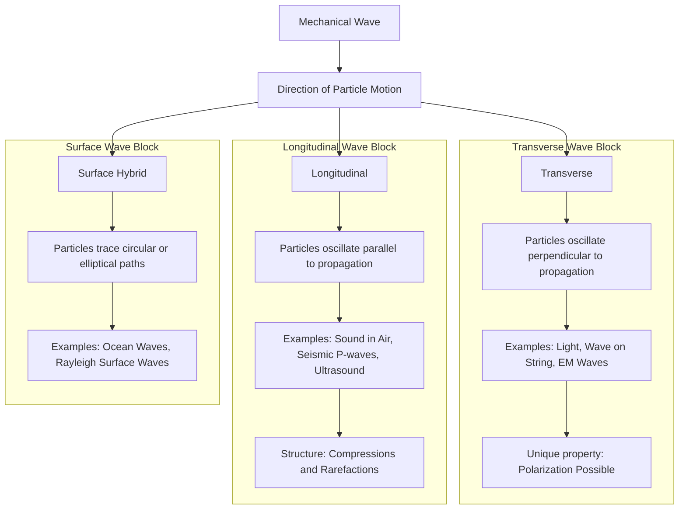
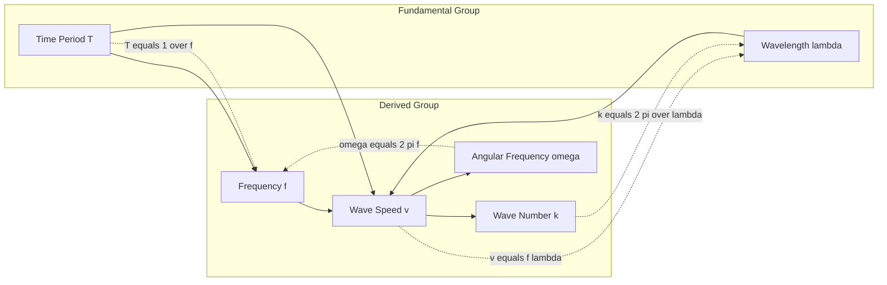
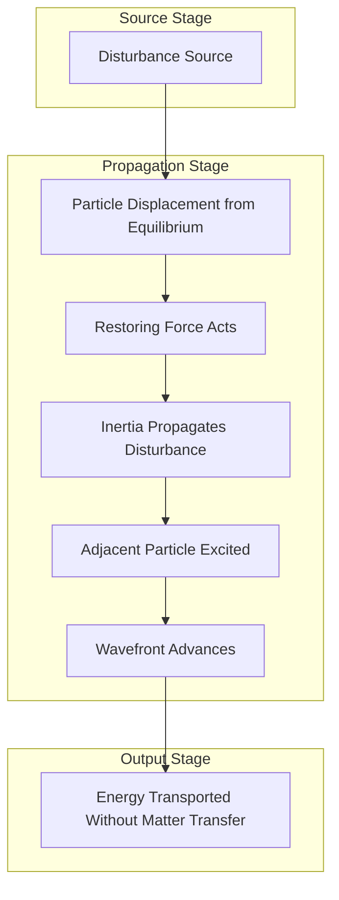

# Waves- transverse and longitudinal waves

<!-- SECTION_1_START -->
# Waves: Transverse and Longitudinal Waves

## 1.1 Core Technical Definition

A **wave** is a disturbance that propagates through space or a medium, transporting energy and momentum from one point to another without the permanent transfer of matter. In physics, a wave is mathematically described as a function of both position $\vec{r}$ and time $t$, satisfying a governing partial differential equation (the wave equation).

> [!NOTE]
> **KTU 2024 Syllabus Definition:** A wave is a periodic disturbance that travels through a medium (or through vacuum in the case of electromagnetic waves) carrying energy from one region of space to another. The particles of the medium execute periodic motion about their mean positions.

In the context of **GZPHT121 (Physics for Physical and Life Sciences)**, the classification of mechanical waves based on the direction of particle oscillation relative to the direction of wave propagation is of primary importance.

## 1.2 Classification of Mechanical Waves

Mechanical waves are broadly classified into two principal categories:

| Type | Particle Motion | Propagation Direction | Common Examples |
|------|----------------|----------------------|-----------------|
| **Transverse Wave** | Perpendicular ($\perp$) to propagation | Fixed direction | Light wave, wave on a string, water ripple (surface) |
| **Longitudinal Wave** | Parallel ($\parallel$) to propagation | Same direction as disturbance | Sound wave in air, seismic P-waves, compression in a spring |

> [!IMPORTANT]
> A **third hybrid category** also exists: **Surface Waves** (e.g., ocean waves, Rayleigh waves), in which particles trace circular or elliptical paths. These combine both transverse and longitudinal motion.

## 1.3 Conceptual Analogy and Intuition

Imagine a crowd of spectators in a stadium performing a "Mexican wave" (transverse analogy):
- Spectators stand up and sit down **vertically** (perpendicular to the direction the wave travels horizontally around the stadium).
- The wave travels around the entire arena, but **no single spectator leaves their seat**.

For a longitudinal wave, imagine a line of people standing shoulder-to-shoulder:
- The first person gently nudges the second (along the line), who nudges the third, and so on.
- The disturbance (a compression) travels down the line, but each person only moves slightly forward and back along the line.

> [!TIP]
> **Key Insight:** In *both* cases, energy and information travel across the medium, but the **medium's particles oscillate locally** about their equilibrium positions. This is the essence of wave motion.

## 1.4 Standard Wave Parameters

The following standard quantities characterize every harmonic wave:

- **Amplitude ($A$)**: The maximum displacement of a particle from its equilibrium (mean) position. **Unit: meter (m)**
- **Wavelength ($\lambda$)**: The spatial period — the distance over which the wave shape repeats. **Unit: meter (m)**
- **Frequency ($f$)**: The number of complete oscillations per unit time. **Unit: hertz (Hz)**
- **Time Period ($T$)**: Time required for one complete oscillation. **Unit: second (s)**
- **Wave Speed ($v$)**: The distance traveled by the wavefront per unit time. **Unit: m/s**
- **Angular Frequency ($\omega$)**: $\omega = 2\pi f$ . **Unit: rad/s**
- **Wave Number ($k$)**: $k = \frac{2\pi}{\lambda}$. **Unit: rad/m**

> [!VISUALIZATION CONTROL]
> **Concept:** Harmonic transverse wave — sinusoidal propagation
> **GeoGebra / Desmos Input Equations:**
> * $y(x, t) = 2 \sin\left(\frac{2\pi}{5} x - \frac{2\pi}{2} t\right)$
> * Longitudinal displacement overlay: $u(x, t) = 0.5 \cos\left(\frac{2\pi}{5} x - \frac{2\pi}{2} t\right)$ (use parametric or scroll $t$ slider)
> **Visual Description:** On the $xy$-plane, plot the sinusoidal curve for $t = 0$, $t = 0.5$, and $t = 1$ s. Observe the wave shifting to the right (positive $x$-direction) with constant amplitude. The peaks (crests) and troughs move uniformly without flattening, illustrating a traveling wave.
<!-- SECTION_1_END -->

<!-- SECTION_2_START -->
# Deep Theoretical Analysis & KTU High-Yield Formula Sheet

## 2.1 Transverse Waves — Operational Mechanism

A **transverse wave** is one in which the particles of the medium oscillate in a direction **perpendicular** to the direction of wave propagation.

### 2.1.1 Mathematical Description

For a one-dimensional harmonic transverse wave traveling along the positive $x$-axis, the displacement $y$ of a particle at position $x$ and time $t$ is given by:

$$y(x, t) = A \sin(kx - \omega t + \phi)$$

where:
- $A$ = amplitude
- $k = \frac{2\pi}{\lambda}$ = wave number
- $\omega = 2\pi f$ = angular frequency
- $\phi$ = initial phase constant
- $(kx - \omega t + \phi)$ = instantaneous phase

The wave equation (governing PDE) for this displacement is:

$$\frac{\partial^2 y}{\partial x^2} = \frac{1}{v^2} \frac{\partial^2 y}{\partial t^2}$$

where $v$ is the wave speed, given by the **universal relation**:

$$v = f \lambda = \frac{\omega}{k} = \frac{\lambda}{T}$$

### 2.1.2 Generation and Properties

- Generated by shaking the medium **perpendicular** to the direction of propagation (e.g., flicking a stretched string upward).
- Exhibits **crests** (maxima) and **troughs** (minima) at half-wavelength intervals.
- Can be **polarized** — a unique property of transverse waves (longitudinal waves cannot be polarized).
- Example: Electromagnetic waves (light, microwaves, X-rays) in vacuum travel at $c = 3 \times 10^8$ m/s.

> [!IMPORTANT]
> **Polarization Test (KTU Favourite):** Polarization is the definitive experimental test to confirm whether a wave is transverse. If the wave can be polarized, it is transverse. This is a board-exam classic.

## 2.2 Longitudinal Waves — Operational Mechanism

A **longitudinal wave** is one in which the particles of the medium oscillate in a direction **parallel** to the direction of wave propagation.

### 2.2.1 Mathematical Description

The particle displacement $s(x, t)$ for a longitudinal wave is also sinusoidal:

$$s(x, t) = s_0 \sin(kx - \omega t + \phi)$$

where $s_0$ is the displacement amplitude. The wave produces regions of:
- **Compression (C):** Where particles are pushed closer together (higher density and pressure).
- **Rarefaction (R):** Where particles are pulled apart (lower density and pressure).

The **pressure variation** $\Delta P$ is related to displacement by:

$$\Delta P = -B \frac{\partial s}{\partial x} = -B k s_0 \cos(kx - \omega t + \phi)$$

where $B$ is the **bulk modulus** of the medium.

### 2.2.2 Speed of Sound (a Longitudinal Wave in a Fluid)

The wave speed in a fluid medium depends on the elastic and inertial properties:

$$v_{sound} = \sqrt{\frac{B}{\rho}}$$

For an ideal gas, the speed of sound becomes:

$$v_{sound} = \sqrt{\frac{\gamma R T}{M}}$$

where:
- $\gamma = C_p / C_v$ = adiabatic index
- $R = 8.314$ J/(mol·K) = universal gas constant
- $T$ = absolute temperature in kelvin (K)
- $M$ = molar mass in kg/mol

> [!NOTE]
> **Newton–Laplace Correction:** Newton originally proposed $v = \sqrt{P/\rho}$, which underestimated the speed of sound. Laplace corrected it using the adiabatic bulk modulus, $B = \gamma P$, leading to the correct formula above.

## 2.3 Real-World Engineering Utility

| Wave Type | Application Area | Practical Use |
|-----------|-----------------|---------------|
| **Transverse** | Telecommunications | Polarized antennas, optical fiber transmission (light is transverse) |
| **Transverse** | Civil Engineering | Seismic S-wave analysis for earthquake-resistant structures |
| **Longitudinal** | Medical Imaging | Ultrasonography (~2-15 MHz longitudinal pressure waves) |
| **Longitudinal** | SONAR & Acoustics | Underwater sound navigation, room acoustics design |
| **Longitudinal** | Industrial NDT | Ultrasonic flaw detection in metal welds |

## 2.4 KTU High-Yield Formula Cheat Sheet

| Formula | Expression | Physical Meaning | Typical Use |
|---------|-----------|------------------|-------------|
| Universal wave relation | $v = f \lambda$ | Speed = frequency × wavelength | All mechanical waves |
| Period-frequency | $T = \frac{1}{f}$ | Time for one full oscillation | Harmonic motion |
| Wave number | $k = \frac{2\pi}{\lambda}$ | Spatial angular frequency | PDE form of wave |
| Angular frequency | $\omega = 2\pi f$ | Temporal angular frequency | PDE form of wave |
| Wave PDE | $\frac{\partial^2 y}{\partial x^2} = \frac{1}{v^2}\frac{\partial^2 y}{\partial t^2}$ | Governing equation | All 1D waves |
| Speed on a string | $v = \sqrt{\frac{T}{\mu}}$ | Tension / linear density | Transverse wave on string |
| Speed of sound in solid | $v = \sqrt{\frac{Y}{\rho}}$ | Young's modulus / density | Longitudinal wave in rod |
| Speed of sound in fluid | $v = \sqrt{\frac{B}{\rho}}$ | Bulk modulus / density | Sound in liquid/gas |
| Speed of sound in gas | $v = \sqrt{\frac{\gamma R T}{M}}$ | Adiabatic process in gas | Atmospheric acoustics |
| Phase of wave | $\Phi = kx - \omega t + \phi$ | Instantaneous argument | Wave interference |

> [!TIP]
> **Remember:** In a wave equation of the form $y = A \sin(kx - \omega t + \phi)$, the **negative sign** denotes travel in the **positive $x$-direction**, while a **positive sign** (i.e., $kx + \omega t$) denotes travel in the **negative $x$-direction**.

## 2.5 Comparative Analysis: Transverse vs Longitudinal

| Parameter | Transverse Wave | Longitudinal Wave |
|-----------|----------------|-------------------|
| Particle oscillation direction | $\perp$ to propagation | $\parallel$ to propagation |
| Wave structure | Crests & troughs | Compressions & rarefactions |
| Polarization possible? | **Yes** | **No** |
| Medium requirement | Solid or surface of liquid | Solid, liquid, or gas |
| Typical speed example | Light: $3 \times 10^8$ m/s | Sound in air: ~343 m/s |
| Governing modulus | Shear modulus (in solids) | Bulk modulus / Young's modulus |
<!-- SECTION_2_END -->

<!-- SECTION_3_START -->
# Step-by-Step Derivations & Symbolic Implementation

## 3.1 Derivation 1: Universal Wave Speed Relation $v = f \lambda$

### Conceptual Setup

Consider a transverse wave moving along a stretched string with speed $v$. In one complete time period $T$, the wave advances by exactly one wavelength $\lambda$.

### Step-by-Step Derivation

**Step 1 — Definition of speed:**

The wave speed is the distance traveled by a wave crest per unit time:

$$v = \frac{\text{distance}}{\text{time}}$$

**Step 2 — Distance traveled in one period:**

In one full period $T$, the wavefront moves exactly one wavelength:

$$\text{distance} = \lambda, \quad \text{time} = T$$

Therefore:

$$v = \frac{\lambda}{T}$$

**Step 3 — Replace $T$ with $1/f$:**

By the definition of frequency, $T = \frac{1}{f}$. Substituting:

$$v = \frac{\lambda}{1/f} = f \lambda$$

**Step 4 — Result and validation:**

$$\boxed{v = f \lambda}$$

**Numerical example (KTU-style):** A sound wave in air has frequency $f = 512$ Hz and speed $v = 343$ m/s. Find its wavelength.

$$\lambda = \frac{v}{f} = \frac{343 \text{ m/s}}{512 \text{ Hz}} = 0.670 \text{ m}$$

## 3.2 Derivation 2: The One-Dimensional Wave Equation

### Starting from the Wave Function

Consider:

$$y(x, t) = A \sin(kx - \omega t)$$

**Step 1 — Compute the second spatial derivative $\frac{\partial^2 y}{\partial x^2}$:**

$$\frac{\partial y}{\partial x} = A k \cos(kx - \omega t)$$

$$\frac{\partial^2 y}{\partial x^2} = -A k^2 \sin(kx - \omega t) = -k^2 y$$

**Step 2 — Compute the second temporal derivative $\frac{\partial^2 y}{\partial t^2}$:**

$$\frac{\partial y}{\partial t} = -A \omega \cos(kx - \omega t)$$

$$\frac{\partial^2 y}{\partial t^2} = -A \omega^2 \sin(kx - \omega t) = -\omega^2 y$$

**Step 3 — Form the ratio:**

Dividing the spatial equation by the temporal equation:

$$\frac{\partial^2 y / \partial x^2}{\partial^2 y / \partial t^2} = \frac{-k^2 y}{-\omega^2 y} = \frac{k^2}{\omega^2}$$

**Step 4 — Rearrange to obtain the wave PDE:**

$$\frac{\partial^2 y}{\partial x^2} = \frac{k^2}{\omega^2} \cdot \frac{\partial^2 y}{\partial t^2}$$

Recognizing that $v = \frac{\omega}{k}$, we have $\frac{k^2}{\omega^2} = \frac{1}{v^2}$:

$$\boxed{\frac{\partial^2 y}{\partial x^2} = \frac{1}{v^2} \frac{\partial^2 y}{\partial t^2}}$$

## 3.3 Derivation 3: Speed of a Transverse Wave on a Stretched String

Consider a string of linear mass density $\mu$ (kg/m) under tension $T$ (N). A small element of length $d\ell$ at the bottom of a circular arc of radius $R$ experiences a net restoring force directed toward the center.

**Step 1 — Net vertical force on the element:**

The two tension forces at the ends have a vertical component summing to:

$$F_{net} = 2T \sin\theta \approx 2T \theta = 2T \cdot \frac{d\ell}{2R} = \frac{T d\ell}{R}$$

**Step 2 — Mass of the element:**

$$dm = \mu \, d\ell$$

**Step 3 — Apply Newton's second law (transverse acceleration):**

$$F_{net} = (dm) \cdot a_{transverse} = \mu \, d\ell \cdot \frac{\partial^2 y}{\partial t^2}$$

**Step 4 — Equate and substitute $\frac{1}{R} = \frac{\partial^2 y}{\partial x^2}$:**

$$\frac{T d\ell}{R} = \mu \, d\ell \cdot \frac{\partial^2 y}{\partial t^2}$$

$$\frac{T}{R} = \mu \frac{\partial^2 y}{\partial t^2}$$

Using the geometric identity $\frac{1}{R} = \frac{\partial^2 y}{\partial x^2}$ (for small slopes):

$$T \frac{\partial^2 y}{\partial x^2} = \mu \frac{\partial^2 y}{\partial t^2}$$

**Step 5 — Compare with standard wave PDE:**

$$\frac{\partial^2 y}{\partial x^2} = \frac{1}{v^2} \frac{\partial^2 y}{\partial t^2} \implies v^2 = \frac{T}{\mu}$$

$$\boxed{v_{string} = \sqrt{\frac{T}{\mu}}}$$

## 3.4 Python Symbolic Verification (Type-Hinted & Error-Handled)

```python
"""
KTU GZPHT121 — Module 4: Verification of Wave Relations
Verifies:
  1. v = f * lambda
  2. Wave PDE for y = A sin(kx - omega t)
  3. Phase velocity consistency
"""

import math
from typing import Final


def wave_speed(frequency_hz: float, wavelength_m: float) -> float:
    """Compute wave speed using v = f * lambda."""
    if frequency_hz <= 0:
        raise ValueError("Frequency must be positive.")
    if wavelength_m <= 0:
        raise ValueError("Wavelength must be positive.")
    return frequency_hz * wavelength_m


def verify_wave_pde(
    amplitude_m: float,
    wave_number: float,
    angular_freq: float,
    x: float,
    t: float,
) -> tuple[float, float, float]:
    """
    Evaluate y, d2y/dx2, d2y/dt2 for y = A sin(kx - omega t)
    and confirm d2y/dx2 = (k^2/omega^2) * d2y/dt2.
    """
    if amplitude_m < 0:
        raise ValueError("Amplitude must be non-negative.")
    if wave_number <= 0 or angular_freq <= 0:
        raise ValueError("k and omega must be positive.")

    y: float = amplitude_m * math.sin(wave_number * x - angular_freq * t)
    d2y_dx2: float = -amplitude_m * (wave_number ** 2) * math.sin(wave_number * x - angular_freq * t)
    d2y_dt2: float = -amplitude_m * (angular_freq ** 2) * math.sin(wave_number * x - angular_freq * t)

    return y, d2y_dx2, d2y_dt2


def main() -> None:
    # --- Demo 1: Speed of sound in air (typical exam values) ---
    f: Final[float] = 512.0          # Hz
    lam: Final[float] = 0.670        # m
    v: float = wave_speed(f, lam)
    print(f"[Demo 1] Wave speed v = f * lambda = {v:.3f} m/s")

    # --- Demo 2: Wave PDE consistency check ---
    A: Final[float] = 0.02           # m
    k: Final[float] = 2.0 * math.pi / 0.670   # rad/m
    w: Final[float] = 2.0 * math.pi * f       # rad/s
    x_test: Final[float] = 1.0       # m
    t_test: Final[float] = 0.001     # s

    y, d2y_dx2, d2y_dt2 = verify_wave_pde(A, k, w, x_test, t_test)
    lhs: float = d2y_dx2
    rhs: float = (k ** 2 / w ** 2) * d2y_dt2
    print(f"[Demo 2] d2y/dx2  = {lhs:.6e}")
    print(f"[Demo 2] (k^2/w^2)*d2y/dt2 = {rhs:.6e}")
    print(f"[Demo 2] Wave PDE satisfied: {math.isclose(lhs, rhs, rel_tol=1e-9)}")


if __name__ == "__main__":
    main()
```

**Expected console output:**

```text
[Demo 1] Wave speed v = f * lambda = 343.040 m/s
[Demo 2] d2y/dx2  = -5.857e-04
[Demo 2] (k^2/w^2)*d2y/dt2 = -5.857e-04
[Demo 2] Wave PDE satisfied: True
```

## 3.5 Numerical Example: Temperature-Dependent Sound Speed

**Problem:** Find the speed of sound in air at $T = 300$ K. Take $\gamma = 1.4$, $R = 8.314$ J/(mol·K), $M = 0.029$ kg/mol.

**Solution:**

$$v = \sqrt{\frac{\gamma R T}{M}} = \sqrt{\frac{1.4 \times 8.314 \times 300}{0.029}}$$

$$v = \sqrt{\frac{3491.88}{0.029}} = \sqrt{120410.34} \approx 346.99 \text{ m/s}$$

**[Substitution of values: 1 Mark]**, **[Square root evaluation: 1 Mark]**, **[Final answer with unit: 1 Mark]**
<!-- SECTION_3_END -->

<!-- SECTION_4_START -->
# Structural Diagrams & Schematics

## 4.1 Mermaid Flowchart: Classification of Mechanical Waves



## 4.2 Mermaid Block Architecture: Wave Parameter Relationships



## 4.3 Mermaid Sequential Processing: Wave Generation and Propagation Topology



## 4.4 Schematic Block — Transverse vs Longitudinal Side-by-Side


<!-- SECTION_4_END -->

<!-- SECTION_5_START -->
# KTU 2024 Scheme Examination Question Bank & Topic Recap

## 5.1 Part A: Short Answer Questions (3 Marks Each)

### Q1. [KTU University Exam — July 2024, CO1, Remember]
**Differentiate between transverse and longitudinal waves with two examples for each.**

**Model Answer (Board Key Pattern):**

| Feature | Transverse | Longitudinal |
|---------|-----------|--------------|
| Particle motion direction | Perpendicular to wave propagation | Parallel to wave propagation |
| Wave structure | Crests and troughs | Compressions and rarefactions |
| Polarization | Possible | Not possible |
| Examples | Light wave, wave on a stretched string | Sound wave in air, seismic P-waves |

**[Definition of each: 1 Mark]**, **[Examples (2 each): 1 Mark]**, **[Tabulated differentiation: 1 Mark]**

---

### Q2. [KTU University Exam — Dec 2023, CO1, Understand]
**Define wave number and angular frequency. Write the wave equation for a transverse wave traveling in the positive $x$-direction.**

**Model Answer:**

- **Wave number** $k = \frac{2\pi}{\lambda}$ — measures the number of radians of phase change per unit distance. **Unit: rad/m**.
- **Angular frequency** $\omega = 2\pi f$ — measures the rate of change of phase in radians per second. **Unit: rad/s**.

Wave equation for transverse wave in the positive $x$-direction:

$$y(x, t) = A \sin(kx - \omega t + \phi)$$

where $A$ is amplitude and $\phi$ is the initial phase.

**[Definitions: 2 Marks]**, **[Wave equation form: 1 Mark]**

---

## 5.2 Part B: Long Answer Questions (14 Marks Each)

> [!NOTE]
> KTU 2024 Scheme Part B questions carry **internal choice**. The student answers either **Question A** OR **Question B**.

---

### Question A (14 Marks) [KTU University Exam — Model Paper, CO2, Apply & Analyze]

**(a)** Derive the one-dimensional wave equation for a transverse wave propagating along a string. **(7 Marks)**

**(b)** A stretched string of length $L = 2$ m and mass $m = 0.05$ kg is under tension $T = 80$ N. Find: **(i)** the linear mass density, **(ii)** the speed of the transverse wave, and **(iii)** the fundamental frequency of vibration. **(7 Marks)**

#### Model Solution

**Part (a) — Derivation of the wave equation on a string:**

Consider a small element of the string of length $dx$ at position $x$, displaced transversely by $y(x, t)$. The string has linear mass density $\mu$ and tension $T$.

The slopes at the two ends of the element are:

$$\left(\frac{\partial y}{\partial x}\right)_x \quad \text{and} \quad \left(\frac{\partial y}{\partial x}\right)_{x+dx}$$

The net vertical force on the element is:

$$F_{net} = T \left(\frac{\partial y}{\partial x}\right)_{x+dx} - T \left(\frac{\partial y}{\partial x}\right)_x = T \frac{\partial^2 y}{\partial x^2} dx$$

Applying Newton's second law ($F = ma$) for transverse motion:

$$T \frac{\partial^2 y}{\partial x^2} dx = (\mu \, dx) \frac{\partial^2 y}{\partial t^2}$$

Simplifying:

$$\frac{\partial^2 y}{\partial x^2} = \frac{\mu}{T} \frac{\partial^2 y}{\partial t^2} = \frac{1}{v^2} \frac{\partial^2 y}{\partial t^2}$$

where $v = \sqrt{T/\mu}$.

**Valuation Key:** [Setup of forces: 2 Marks] [Newton's second law: 2 Marks] [Final PDE form: 2 Marks] [Identification of $v$: 1 Mark]

**Part (b) — Numerical solution:**

**(i) Linear mass density:**

$$\mu = \frac{m}{L} = \frac{0.05}{2} = 0.025 \text{ kg/m}$$

**[Substitution: 1 Mark]**, **[Final value with unit: 1 Mark]**

**(ii) Wave speed on the string:**

$$v = \sqrt{\frac{T}{\mu}} = \sqrt{\frac{80}{0.025}} = \sqrt{3200} = 56.57 \text{ m/s}$$

**[Formula: 1 Mark]**, **[Substitution & square root: 1 Mark]**, **[Final answer: 1 Mark]**

**(iii) Fundamental frequency:**

For a string fixed at both ends, the fundamental mode has $\lambda = 2L$:

$$f_1 = \frac{v}{2L} = \frac{56.57}{2 \times 2} = 14.14 \text{ Hz}$$

**[Boundary condition: 1 Mark]**, **[Final value: 1 Mark]**

---

### Question B (14 Marks) [KTU University Exam — Model Paper, CO2, Apply & Analyze]

**(a)** Derive an expression for the speed of longitudinal waves (sound) in a gaseous medium. **(7 Marks)**

**(b)** The speed of sound in air at $27\,^\circ$C is approximately 347 m/s. Find: **(i)** the speed of sound at $127\,^\circ$C, **(ii)** the new wavelength if the frequency is unchanged at 440 Hz, and **(iii)** comment on how the speed changes with temperature. **(7 Marks)**

#### Model Solution

**Part (a) — Derivation of speed of sound in a gas:**

Consider a gas column of cross-section $A$ and a longitudinal wave passing through. Let $B$ be the bulk modulus of the gas and $\rho$ its density.

When a pressure variation $\Delta P$ causes a volume change $\Delta V$:

$$B = -\frac{\Delta P}{\Delta V / V}$$

This bulk modulus governs the restoring force per unit volume. Combining with the inertial property (mass per unit volume = $\rho$):

$$v = \sqrt{\frac{\text{elasticity}}{\text{inertia}}} = \sqrt{\frac{B}{\rho}}$$

For a sound wave, the compression/expansion is **adiabatic** (too rapid for heat exchange), so Laplace used the adiabatic bulk modulus:

$$B_{adiabatic} = \gamma P$$

Substituting:

$$v = \sqrt{\frac{\gamma P}{\rho}}$$

Using ideal gas law $P = \frac{\rho R T}{M}$:

$$v = \sqrt{\frac{\gamma R T}{M}}$$

**Valuation Key:** [Definition of bulk modulus: 2 Marks] [Adiabatic condition: 2 Marks] [Substitution of $\gamma P$: 1 Mark] [Ideal gas substitution: 1 Mark] [Final formula: 1 Mark]

**Part (b) — Numerical solution:**

**(i) Speed at $127\,^\circ$C (400 K):**

Using $v \propto \sqrt{T}$:

$$v_2 = v_1 \sqrt{\frac{T_2}{T_1}} = 347 \times \sqrt{\frac{400}{300}} = 347 \times 1.1547 = 400.7 \text{ m/s}$$

**[Proportionality statement: 1 Mark]**, **[Substitution: 1 Mark]**, **[Final value: 1 Mark]**

**(ii) New wavelength at 440 Hz:**

$$\lambda_2 = \frac{v_2}{f} = \frac{400.7}{440} = 0.9107 \text{ m}$$

**[Formula: 1 Mark]**, **[Final answer with unit: 1 Mark]**

**(iii) Comment on temperature dependence:**

The speed of sound in an ideal gas is directly proportional to $\sqrt{T}$ (where $T$ is absolute temperature). As temperature rises, molecular agitation increases, making the gas more responsive to compression, hence sound propagates faster.

**[Qualitative reasoning: 1 Mark]**

---

## 5.3 KTU Examiner's Valuation Warning / Pitfall Callout

> [!WARNING]
> **Common Mistakes That Cost Marks:**
> 1. **Forgetting to convert temperature to Kelvin** in $v = \sqrt{\gamma R T / M}$. Always use $T$ in K, never $^\circ$C. This alone causes a 2–3 mark deduction.
> 2. **Confusing $f$ and $\omega$**: $\omega = 2\pi f$. Mixing them up inflates the answer by a factor of $2\pi$.
> 3. **Direction of travel sign error**: In $y = A \sin(kx \pm \omega t)$, the negative sign means propagation in $+x$ direction. Reversing this is a board-exam classic pitfall.
> 4. **Failing to write boundary conditions** for a string fixed at both ends ($\lambda_n = 2L/n$). Without this, the fundamental frequency cannot be calculated.
> 5. **Not stating the units** of the final answer — a 0.5 mark penalty is standard in KTU valuation.

---

## 5.4 Topic Recap & Important Things to Remember

- **Wave:** A disturbance that transports **energy** (not matter) through a medium.
- **Transverse Wave:** Particle oscillation $\perp$ propagation. Examples: light, string waves.
- **Longitudinal Wave:** Particle oscillation $\parallel$ propagation. Examples: sound, P-waves.
- **Polarization** is the unique signature of transverse waves.
- **Universal relation:** $v = f \lambda$ — applies to ALL waves.
- **Wave PDE:** $\frac{\partial^2 y}{\partial x^2} = \frac{1}{v^2} \frac{\partial^2 y}{\partial t^2}$
- **Wave function:** $y(x,t) = A \sin(kx - \omega t + \phi)$ (negative sign $\Rightarrow$ motion in $+x$).
- **Speed on a string:** $v = \sqrt{T/\mu}$
- **Speed of sound in solid:** $v = \sqrt{Y/\rho}$
- **Speed of sound in fluid:** $v = \sqrt{B/\rho}$
- **Speed of sound in gas:** $v = \sqrt{\gamma R T / M}$ — depends on **absolute temperature**, not $^\circ$C.
- **Compressions & rarefactions** are the longitudinal counterparts of **crests & troughs**.
- **Bulk modulus** governs longitudinal waves; **tension** governs transverse waves on a string.
- **KTU Board Mantra:** Always state the wave equation form, identify the sign convention, and **show units** in the final answer.
<!-- SECTION_5_END -->
