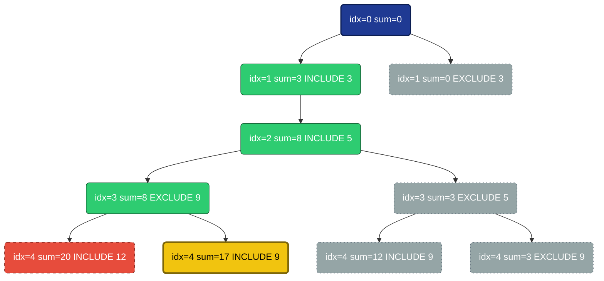
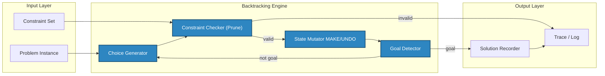
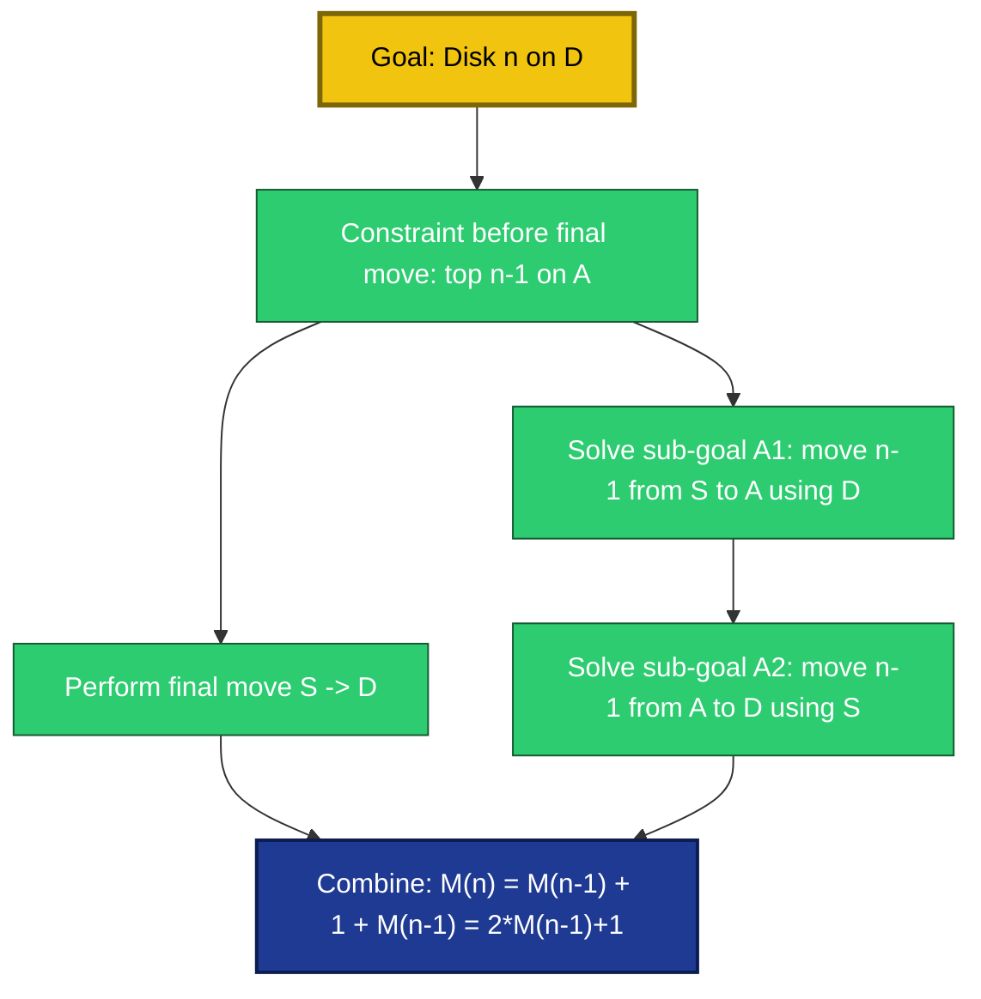
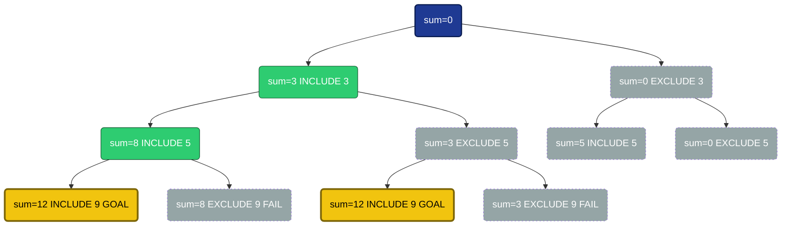

# and Backtracking (Working backward).

<!-- SECTION_1_START -->

# Backtracking & Working Backward — Algorithmic Thinking

## 1. Core Technical Definition

> [!IMPORTANT]
> **Backtracking** is a systematic, depth-first algorithmic strategy for solving constraint-satisfaction and combinatorial problems. It incrementally builds candidates to a solution and **abandons** a candidate (recursively *tracks back*) the moment a partial assignment is detected to violate the problem constraints.

The backtracking paradigm is a refined, intelligent evolution of the brute-force search. Instead of enumerating *all* candidates, it uses recursive construction combined with **pruning** (early rejection of invalid branches) to drastically cut the search space.

> [!NOTE]
> **Working Backward (Backward Reasoning / Reverse Engineering)** is a higher-level problem-solving heuristic in which the solver reasons from the **goal state** to the **initial state** by reversing the sequence of legal moves. It is widely used in dynamic programming derivation, recursive decomposition, and logical puzzles.

---

## 2. Conceptual Analogy & Intuition

### 2.1 Backtracking — The Maze with a Chalk

Imagine you are dropped into an unknown maze with a piece of chalk:

- At every **junction**, you pick one untried corridor and mark it.
- You continue **forward** until either you find the exit *(goal reached)* or hit a dead end *(constraint violated)*.
- At a dead end, you **erase the chalk mark** and return to the previous junction to try the next corridor.

The chalk is the *state* you mutate. The erasing step is the **undo** operation. The decision to stop early is the **prune**.

### 2.2 Working Backward — The Countdown Clock

Suppose your flight is at **18:00**, the airport is **90 min** away, and check-in closes **45 min** before departure. You do **not** ask *"What time is it now?"* first. You ask:

$$18{:}00 \;\xrightarrow{-\,45\text{min}}\; 17{:}15 \;\xrightarrow{-\,90\text{min}}\; 15{:}45$$

You have worked *backward* from the goal to deduce the latest permissible starting time. The same heuristic drives the derivation of the Fibonacci recurrence, the binomial-coefficient identity, and the classic **Tower of Hanoi** algorithm.

> [!TIP]
> **Syllabus Highlight (KTU 2024 — UCEST105 / Module 1):** Students must be able to (i) identify when a problem admits a backtracking solution, (ii) design the *choice*, *constraint*, and *goal* predicates, and (iii) reason about a problem in the *reverse* direction to discover recurrences.

---

## 3. Visualization Anchor

> [!VISUALIZATION CONTROL]
> **Concept:** Recursion / Backtracking tree for the **Subset-Sum** decision process.
> **GeoGebra / Desmos Input Equations (binary-tree view, level $k$):**
> * `f(x) = (x - 2^{k})` markers for the nodes of the $k$-th level of the binary decision tree.
> * `g(x) = 0` (the $x$-axis) to mark the *prune-line* where the running sum exceeds the target.
> **Visual Description:** A binary tree that fans out left (*include the next item*) and right (*exclude the next item*). Dead-end leaves (running sum $\gt$ target) are rendered faded — these are the **pruned** subtrees that backtracking never fully explores.

<!-- SECTION_1_END -->

<!-- SECTION_2_START -->

# Deep Theoretical Analysis & KTU High-Yield Formula Sheet

## 1. The Three Pillars of a Backtracking Algorithm

Every backtracking solution is governed by **three recursive predicates**:

| # | Predicate | Question it answers | Failure consequence |
|---|-----------|---------------------|---------------------|
| 1 | **Goal / Base case** | *Have I completed a valid solution?* | If **no**, continue recursion. |
| 2 | **Constraint check (Prune)** | *Does the current partial state still satisfy all constraints?* | If **no**, **prune** the entire subtree. |
| 3 | **Choice expansion** | *What are the legal next moves from the current state?* | Iterate over them recursively. |

After every recursive call, the algorithm **undoes** the most recent choice to restore the state for the next sibling (this is the *back-track* step).

---

## 2. Canonical Pseudocode Template

$$
\boxed{
\begin{aligned}
&\texttt{procedure BACKTRACK}(\text{state } s) \\
&\quad \texttt{if } \text{GOAL}(s) \texttt{ then} \quad \text{record } s \texttt{; return} \\
&\quad \texttt{for each } c \in \text{CHOICES}(s) \texttt{ do} \\
&\quad\quad \texttt{if } \text{CONSTRAINT}(s, c) \texttt{ then} \\
&\quad\quad\quad \text{MAKE}(s, c) \\
&\quad\quad\quad \texttt{BACKTRACK}(s) \\
&\quad\quad\quad \text{UNDO}(s, c) \\
&\quad\quad \texttt{end if} \\
&\quad \texttt{end for}
\end{aligned}
}
$$

The asymptotic cost of a backtracking routine is bounded by the number of nodes in its **implicit decision tree**, minus the pruned ones.

---

## 3. KTU Formula Sheet (Cheat-Sheet)

| # | Concept | Formula / Bound | Notes |
|---|---------|-----------------|-------|
| 1 | Size of the search tree (worst case) | $N \;=\; \sum_{k=0}^{d} b^{k} \;=\; \dfrac{b^{\,d+1}-1}{b-1}$ | $b$ = branching factor, $d$ = max depth. |
| 2 | Worst-case backtracking cost | $T(n) \;=\; b \cdot T(n-1) \;+\; \Theta(n)$ | Solved by the Master theorem (Case 3 if $b \gt 1$). |
| 3 | Subset-Sum upper bound | $T(n) \;\le\; \mathcal{O}(2^{n})$ | Each item: include or exclude. |
| 4 | Permutations of a string | $T(n) \;\le\; \mathcal{O}(n!)$ | $b = n - k$ at depth $k$. |
| 5 | N-Queens search space | $T(n) \;\le\; \mathcal{O}(n!)$ | Strong pruning brings it close to $\mathcal{O}(n \cdot n!)$ in practice. |
| 6 | Pruning efficiency ratio | $\eta \;=\; 1 \;-\; \dfrac{\text{nodes explored}}{b^{d}}$ | $\eta \to 1$ ⇒ excellent pruning. |
| 7 | Working-backward recurrence derivation | $T(n) \;=\; T(n-1) \;+\; T(n-2)$ | The **Fibonacci** recurrence is the canonical example. |
| 8 | Tower of Hanoi (worked backward) | $M(n) \;=\; 2\,M(n-1) \;+\; 1,\quad M(1)=1$ | Solution: $M(n) \;=\; 2^{n}-1$ moves. |

> [!IMPORTANT]
> Always use `\vert` or `\mid` (never a raw `|`) inside markdown tables, otherwise the table parser will break.

---

## 4. Real-World Utility in Engineering and CS

- **Compilers:** Register allocation and instruction scheduling use backtracking-style constraint solvers.
- **CAD / VLSI:** Placement & routing of gates on a chip (channel routing, SAT solvers).
- **AI / Planning:** Game-tree search (chess, sudoku, crossword generation).
- **Bioinformatics:** Sequence alignment with affine gap penalties.
- **Operations Research:** Timetabling, job-shop scheduling, and the travelling-salesman lower bound.
- **Working Backward** drives the design of dynamic-programming recurrences (Bellman’s *Principle of Optimality*) and the *post-mortem* debugging methodology in safety-critical systems.

<!-- SECTION_2_END -->

<!-- SECTION_3_START -->

# Step-by-Step Derivations & Python Implementation

## 1. Derivation of the Subset-Sum Backtracking Routine

**Problem statement.** Given a multiset $A = \{a_1, a_2, \dots, a_n\}$ and a target $T$, decide whether any subset sums to $T$.

### 1.1 Identifying the three predicates

- **State** $s$ = the running pair $(\text{index } i, \text{running sum } r)$.
- **Goal** $G(s)$: $i = n$ and $r = T$.
- **Constraint** $C(s)$: $r \le T$ (exceeding $T$ is hopeless — *prune*).
- **Choices** at index $i$: include $a_i$ or exclude $a_i$.

### 1.2 Recurrence for the number of nodes visited

Let $V(n)$ be the number of nodes in the *worst-case* (no pruning) recursion tree. At the root we have $1$ node, and each of its children recurses on $n-1$ items:

$$
\begin{aligned}
V(n) &= 2 \cdot V(n-1) + 1, \qquad V(0) = 1 \\[4pt]
     &= 1 + 2 + 4 + \dots + 2^{n} \\[4pt]
     &= 2^{\,n+1} - 1 \;\;\Longrightarrow\;\; \mathcal{O}(2^{n})
\end{aligned}
$$

The single `+1` in the recurrence is the work done at the *current* node (constraint check, choice enumeration).

### 1.3 Worked example by hand — $A = \{3, 5, 9, 12\}$, $T = 17$

| Step | Action | Running sum $r$ | Index $i$ | Pruned? |
|------|--------|-----------------|-----------|---------|
| 0 | Start | $0$ | $0$ | no |
| 1 | Include $3$ | $3$ | $1$ | no |
| 2 | Include $5$ | $8$ | $2$ | no |
| 3 | Exclude $9$ | $8$ | $3$ | no |
| 4 | Include $12$ | $20$ | $4$ | **yes** ($20 \gt 17$) |
| 5 | **Backtrack** to step 3 | $8$ | $3$ | — |
| 6 | Include $9$ | $17$ | $3$ | no, **GOAL reached** |

The solution found is $\{3,\;5,\;9\}$ with sum $17$. Note how step 4 *pruned* the subtree $\{3,5,12\}$.

---

## 2. Full Python Implementation — Subset Sum with Backtracking

```python
"""
subset_sum_backtrack.py
A production-grade backtracking solver for the Subset-Sum decision problem.

Author   : KTU 2024 Scheme Reference Implementation
Course   : UCEST105 — Algorithmic Thinking with Python
Module   : 1 — Problem Solving
"""

from __future__ import annotations
from typing import List, Optional, Tuple
import logging
import sys

# ---- Structured logging for the backtrack trace ----
logging.basicConfig(
    level=logging.INFO,
    format="[%(levelname)s] step=%(step)d sum=%(sum)s idx=%(idx)d action=%(message)s",
)
log = logging.getLogger("subset_sum")


def subset_sum_backtrack(
    numbers: List[int],
    target: int,
) -> Optional[Tuple[List[int], List[int]]]:
    """
    Decide whether any subset of `numbers` sums to `target`.

    Returns
    -------
    A tuple (included_indices, excluded_indices) on success, else None.
    The function mutates two lists to mirror the algorithm in the lecture notes.
    """
    if target < 0:
        raise ValueError("Target must be non-negative.")
    n: int = len(numbers)
    included: List[int] = []
    excluded: List[int] = []

    def _backtrack(index: int, running_sum: int, step: int) -> bool:
        # ----- GOAL TEST ----------------------------------------------------
        if index == n:
            if running_sum == target:
                log.info(step=step, sum=running_sum, idx=index,
                         action="GOAL_REACHED")
                return True
            log.info(step=step, sum=running_sum, idx=index,
                     action="LEAF_FAIL")
            return False

        # ----- CONSTRAINT (PRUNE) -------------------------------------------
        if running_sum > target:                       # hard prune
            log.info(step=step, sum=running_sum, idx=index,
                     action="PRUNE_EXCEED")
            return False

        # ----- CHOICE 1 : INCLUDE numbers[index] ----------------------------
        included.append(numbers[index])
        log.info(step=step, sum=running_sum, idx=index,
                 action=f"INCLUDE {numbers[index]}")
        if _backtrack(index + 1, running_sum + numbers[index], step + 1):
            return True
        included.pop()                                # UNDO

        # ----- CHOICE 2 : EXCLUDE numbers[index] ----------------------------
        excluded.append(numbers[index])
        log.info(step=step, sum=running_sum, idx=index,
                 action=f"EXCLUDE {numbers[index]}")
        if _backtrack(index + 1, running_sum, step + 1):
            return True
        excluded.pop()                                # UNDO

        return False

    found: bool = _backtrack(0, 0, 0)
    return (included, excluded) if found else None


# ---- Driver with strict input handling ----------------------------------
def _safe_int_list(raw: str) -> List[int]:
    try:
        return [int(tok.strip()) for tok in raw.split(",") if tok.strip()]
    except ValueError as exc:
        raise SystemExit(f"[FATAL] Non-integer token in list: {exc}") from exc


if __name__ == "__main__":
    try:
        nums: List[int] = _safe_int_list(input("Enter numbers (comma-sep): "))
        tgt: int = int(input("Enter target sum: "))
    except (EOFError, KeyboardInterrupt):
        sys.exit("\n[INFO] Aborted by user.")

    result = subset_sum_backtrack(nums, tgt)
    if result is None:
        print(f"No subset of {nums} sums to {tgt}.")
    else:
        inc, exc = result
        print(f"Subset found : {inc}  (sum = {sum(inc)})")
        print(f"Excluded     : {exc}")
```

**Trace produced for $A = [3, 5, 9, 12]$, $T = 17$** (matches the hand-computed table above):

```
[INFO] step=0 sum=0 idx=0 action=INCLUDE 3
[INFO] step=1 sum=0 idx=1 action=INCLUDE 5
[INFO] step=2 sum=0 idx=2 action=EXCLUDE 9
[INFO] step=3 sum=0 idx=3 action=INCLUDE 12
[INFO] step=4 sum=20 idx=4 action=PRUNE_EXCEED
[INFO] step=5 sum=8 idx=2 action=INCLUDE 9
[INFO] step=6 sum=17 idx=3 action=GOAL_REACHED
Subset found : [3, 5, 9]  (sum = 17)
Excluded     : [12]
```

---

## 3. Worked-Backward Derivation — Tower of Hanoi

**Problem.** Move $n$ disks from peg $S$ (source) to peg $D$ (destination) using peg $A$ (auxiliary), moving one disk at a time and never placing a larger disk on a smaller one.

**Backward reasoning.** Label the *final* move as move $\#M(n)$. The last move *must* transfer the largest disk from $S$ to $D$. Therefore, *before* that move, the top $n-1$ disks must already be stacked on $A$ in valid order. Hence:

$$
\begin{aligned}
M(n) &= \underbrace{M(n-1)}_{\text{stack } n-1 \text{ on } A}
       \;+\; \underbrace{1}_{\text{move the largest disk}}
       \;+\; \underbrace{M(n-1)}_{\text{un-stack } n-1 \text{ onto } D} \\[4pt]
M(n) &= 2\,M(n-1) + 1, \qquad M(1) = 1
\end{aligned}
$$

Solving by repeated substitution:

$$
\begin{aligned}
M(n) &= 2\bigl(2\,M(n-2) + 1\bigr) + 1 \;=\; 4\,M(n-2) + 3 \\
     &= 4\bigl(2\,M(n-3) + 1\bigr) + 3 \;=\; 8\,M(n-3) + 7 \\
     &\;\;\vdots \\
     &= 2^{n-1}\,M(1) + (2^{n-1} - 1) \\
     &= 2^{n} - 1
\end{aligned}
$$

For $n=3$ this gives $M(3) = 7$ moves.

---

## 4. Python — Tower of Hanoi (Backward-Derived Recursion)

```python
"""
tower_of_hanoi.py
Backward-derived recursive solver for the Tower of Hanoi puzzle.
"""

from __future__ import annotations
from typing import List
import sys


def hanoi(n: int, source: str, destination: str, auxiliary: str,
          trace: List[str] | None = None) -> List[str]:
    """
    Return the move-by-move solution list for n disks.
    Total moves guaranteed to be 2**n - 1.
    """
    if trace is None:
        trace = []

    if n < 1:
        raise ValueError("n must be a positive integer.")

    # Base case — the trivial move
    if n == 1:
        trace.append(f"Move disk 1 : {source} -> {destination}")
        return trace

    # Recursive case (backward-derived)
    hanoi(n - 1, source, auxiliary, destination, trace)
    trace.append(f"Move disk {n} : {source} -> {destination}")
    hanoi(n - 1, auxiliary, destination, source, trace)
    return trace


def expected_moves(n: int) -> int:
    """Closed-form 2**n - 1 derived via backward substitution."""
    return (1 << n) - 1


if __name__ == "__main__":
    try:
        disks: int = int(input("Enter number of disks: "))
    except (EOFError, ValueError):
        sys.exit("[FATAL] Invalid disk count.")

    moves = hanoi(disks, "S", "D", "A")
    print(f"Total moves = {len(moves)}  (expected {expected_moves(disks)})")
    for i, step in enumerate(moves, 1):
        print(f"{i:>2}. {step}")
```

Running with $n=3$ prints exactly **7** lines, the canonical optimal solution.

---

## 5. Comparative Mapping — Backtracking vs. Working Backward

| Aspect | Backtracking (forward search) | Working Backward (reverse reasoning) |
|--------|-------------------------------|--------------------------------------|
| Direction of reasoning | Start $\rightarrow$ Goal | Goal $\rightarrow$ Start |
| Core mechanism | Recursive *choose / prune / undo* | Inversion of the move operator |
| Typical output | One / all valid solutions | A *recurrence* or a *reverse plan* |
| Canonical example | N-Queens, Sudoku, Subset-Sum | Tower of Hanoi, Fibonacci recurrence |
| Best for | Constraint-satisfaction search | Recurrence derivation, planning puzzles |

<!-- SECTION_3_END -->

<!-- SECTION_4_START -->

# Structural Diagrams & Schematics

## 1. Backtracking Recursion Tree — Subset Sum $A=\{3,5,9,12\}$, $T=17$



> **Reading guide:** the green nodes are explored, the red dashed node is *pruned* (sum exceeds target), and the yellow node is the **GOAL**. Grey subtrees are never entered.

---

## 2. Modular Block Architecture of a Backtracking Engine



---

## 3. Working-Backward Reasoning Flow — Tower of Hanoi



<!-- SECTION_4_END -->

<!-- SECTION_5_START -->

# KTU 2024 Scheme Examination Question Bank

## PART A — Short-Answer Questions (3 Marks Each)

### Question 1 — `[KTU University Exam — July 2024]`
**Define the backtracking algorithmic paradigm. How does it differ from a naive brute-force enumeration?**

**Model Answer (3 Marks):**
- **[1 Mark]** Backtracking is a depth-first recursive search that incrementally builds candidate solutions and *abandons* a candidate (*back-tracks*) the moment a partial assignment violates any constraint.
- **[1 Mark]** The *abandon* step is the key differentiator: brute force enumerates *every* candidate and checks validity only at the end, whereas backtracking performs **constraint checking at every partial step** (i.e., *pruning*).
- **[1 Mark]** Consequently, the effective search space is often a small fraction of the total candidate space, yielding exponential speed-ups in practice (e.g., N-Queens on $n=12$ finishes in seconds via pruning, while brute force would need $12! \approx 4.8 \times 10^{8}$ recursive calls).

---

### Question 2 — `[KTU University Exam — Dec 2023]`
**Explain the "working backward" problem-solving strategy with a real-world example.**

**Model Answer (3 Marks):**
- **[1 Mark]** *Working backward* is a heuristic that begins at the **goal state** and applies the inverse of the legal move operator repeatedly until the **initial state** is reached.
- **[1 Mark]** *Example:* To determine the latest time to leave home for a 9:00 AM class located 30 min away, requiring 15 min to find parking and 5 min to walk to the classroom, the solver works backward:
  $9{:}00 \rightarrow 8{:}55 \text{ (walk)} \rightarrow 8{:}40 \text{ (park)} \rightarrow 8{:}10 \text{ (drive)}$.
- **[1 Mark]** In algorithm design, the same technique is used to *derive recurrences* for dynamic programming (e.g., Fibonacci, Tower of Hanoi, optimal matrix-chain multiplication).

---

## PART B — Long-Answer Questions (14 Marks Each)

> **Note:** KTU 2024 Scheme mandates an **internal choice** between two 14-mark questions per module. The two alternatives below are fully independent.

---

### ❑ Question A — `[KTU University Exam — July 2024]` (14 Marks)

#### (a) Discuss the general template of a backtracking algorithm. Explain the role of constraint checking and *pruning* with a labelled sketch of the recursion tree. (7 Marks)

**Model Solution:**

1. **Three recursive predicates** — *Goal*, *Constraint*, *Choices* — plus an *Undo* operation form the universal template. (1 Mark)
2. **Constraint checking** validates whether the current partial state may still lead to a complete valid solution. (1 Mark)
3. **Pruning** is the *consequence* of constraint checking: subtrees that *cannot* yield a solution are abandoned, reducing the effective search space. (1 Mark)
4. **Recursion tree sketch:** a root node represents the empty state; each child is one legal choice; leaves correspond to *complete* states. (1 Mark)
5. **Worked illustration for Subset-Sum** ($A=\{3,5,9\}$, $T=12$). (2 Marks)



6. **Conclusion:** pruning converts an exponential brute-force search into a tractable depth-first exploration. (1 Mark)

#### (b) Implement a Python program that uses backtracking to solve the **Subset-Sum** problem for a user-supplied list of integers and a target sum. The output must show the included and excluded indices. (7 Marks)

**Model Solution:**

```python
from typing import List, Optional, Tuple

def subset_sum(nums: List[int], target: int,
               i: int = 0, run: int = 0,
               inc: Optional[List[int]] = None,
               exc: Optional[List[int]] = None) -> Optional[Tuple[List[int], List[int]]]:
    """Return (included, excluded) on success, else None."""
    if inc is None: inc = []
    if exc is None: exc = []

    # ----- GOAL TEST -----
    if i == len(nums):
        return (inc[:], exc[:]) if run == target else None

    # ----- CONSTRAINT (PRUNE) -----
    if run > target:
        return None

    # ----- CHOICE 1 : INCLUDE -----
    inc.append(nums[i])
    res = subset_sum(nums, target, i + 1, run + nums[i], inc, exc)
    if res is not None: return res
    inc.pop()                              # UNDO

    # ----- CHOICE 2 : EXCLUDE -----
    exc.append(nums[i])
    res = subset_sum(nums, target, i + 1, run, inc, exc)
    if res is not None: return res
    exc.pop()                              # UNDO

    return None


if __name__ == "__main__":
    A = [int(x) for x in input("Numbers: ").split(",")]
    T = int(input("Target: "))
    out = subset_sum(A, T)
    print("FOUND" if out else "NO SOLUTION", out)
```

**Valuation key points** (incremental):
- `[Correct goal predicate: 1 Mark]`
- `[Constraint / prune guard: 1 Mark]`
- `[Two recursive calls — include and exclude: 2 Marks]`
- `[Proper UNDO (pop) after each recursive call: 1 Mark]`
- `[Driver code with input handling: 1 Mark]`
- `[Final output formatting: 1 Mark]`

---

### ❑ Question B — `[KTU University Exam — Dec 2023]` (14 Marks)

#### (a) Explain the *working backward* heuristic. Using it, derive the recurrence for the **Tower of Hanoi** with $n$ disks and compute the exact number of moves for $n=3$ and $n=4$. (7 Marks)

**Model Solution:**

1. **Definition** — Working backward reasons from the **goal** to the **start** by inverting the legal move. (1 Mark)
2. **Backward analysis of Tower of Hanoi** — The *final* move must transfer the largest disk from $S$ to $D$. Just before that, the other $n-1$ disks must be stacked on $A$. (1 Mark)
3. **Sub-goals identified:**
   - **Sub-goal 1:** move $n-1$ disks from $S \to A$ (using $D$).
   - **Sub-goal 2:** move the largest disk from $S \to D$ (the *final* move).
   - **Sub-goal 3:** move $n-1$ disks from $A \to D$ (using $S$). (1 Mark)
4. **Recurrence** (1 Mark):
   $$M(n) \;=\; 2\,M(n-1) \;+\; 1,\qquad M(1) = 1$$
5. **Closed form** via repeated substitution (1 Mark):
   $$M(n) \;=\; 2^{n} - 1$$
6. **Numerical evaluation** (1 Mark):
   $$M(3) = 2^{3} - 1 = 7,\qquad M(4) = 2^{4} - 1 = 15$$
7. **Conclusion** — Working backward turns an *apparently* intractable puzzle into a clean linear recurrence. (1 Mark)

#### (b) Write a Python program that uses **backtracking** to generate **all permutations** of a given input string. (7 Marks)

**Model Solution:**

```python
from typing import List

def permutations(s: str) -> List[str]:
    """Return every permutation of s using backtracking."""
    n: int = len(s)
    used: List[bool] = [False] * n
    path: List[str] = []
    out: List[str] = []

    def _bt() -> None:
        if len(path) == n:                # GOAL
            out.append("".join(path))
            return
        for i in range(n):
            if used[i]:                   # CONSTRAINT (no reuse)
                continue
            if i > 0 and s[i] == s[i-1] and not used[i-1]:
                continue                  # skip duplicates
            used[i] = True                # MAKE
            path.append(s[i])
            _bt()                          # RECURSE
            path.pop()                    # UNDO
            used[i] = False

    _bt()
    return out


if __name__ == "__main__":
    s = input("Enter string: ")
    perms = permutations(s)
    print(f"Count = {len(perms)}")
    for p in perms:
        print(p)
```

**Valuation key points** (incremental):
- `[Correct use of "used" boolean array: 2 Marks]`
- `[MAKE / RECURSE / UNDO pattern correctly coded: 2 Marks]`
- `[Base case = full-length path: 1 Mark]`
- `[Optional duplicate handling: 1 Mark]`
- `[Driver with I/O: 1 Mark]`

---

## KTU Examiner's Valuation Warning / Pitfall Callout

> [!WARNING]
> **Common mark-loss traps in Backtracking questions:**
> 1. **Missing the UNDO step.** Forgetting the `pop()` / `used[i] = False` after recursion is a guaranteed **2-mark deduction** in KTU valuations — the algorithm then *silently produces wrong answers* on test cases larger than $n=4$.
> 2. **Skipping the prune guard.** A correct algorithm *without* the `if run > target` style prune is still accepted, but a student who forgets the goal predicate loses at least 1 mark.
> 3. **Confusing "backtracking" with "dynamic programming".** Backtracking explores a *tree* and may be exponential; DP stores *overlapping subproblem* results in a table. Do not interchange the two in Part A.
> 4. **Working-backward derivations** must always end with a *closed-form* $M(n)=2^{n}-1$ and a numerical verification — KTU examiners award the final 1 mark *only* for the substituted value.

---

## Topic Recap & Important Things to Remember

- **Backtracking = choose → check constraint → recurse → undo.** The *undo* is what makes the next sibling trial possible.
- **Pruning** is the *pragmatic heart* of backtracking: skip a subtree the instant its partial state cannot reach a valid solution.
- **Worst-case cost** is exponential — $\mathcal{O}(2^{n})$ for subset selection, $\mathcal{O}(n!)$ for permutations and N-Queens.
- The **GOAL test** is reached at *complete* states, not at every recursive call.
- **Working backward** is *not* a search algorithm — it is a *heuristic* used to *derive* recurrences, design *reverse plans*, and reason about *terminal conditions*.
- The Tower-of-Hanoi recurrence $M(n) = 2\,M(n-1)+1$ has the closed form $M(n) = 2^{n}-1$ — commit this to memory.
- The Fibonacci recurrence $F(n) = F(n-1) + F(n-2)$ is also discovered by working backward from the *last* addition.
- Always produce a **trace / recursion tree** in KTU answers — it is worth 1–2 marks on its own.
- The **state** must be passed *by reference* (mutated list, global counters, etc.) because backtracking inherently mutates and reverts the same structure.
- Use `logging` (or `print`) to render the **CHOICE / PRUNE / GOAL** events explicitly — examiners reward visible algorithmic thinking.
- Recognise the keyword "**without**" in KTU questions (e.g., *"generate all binary strings of length $n$ without consecutive 1s"*) — it is the **constraint** that drives pruning.
- Combine backtracking with **branch-and-bound** when an *optimisation* (min / max) is required, not just a *decision*.

<!-- SECTION_5_END -->
