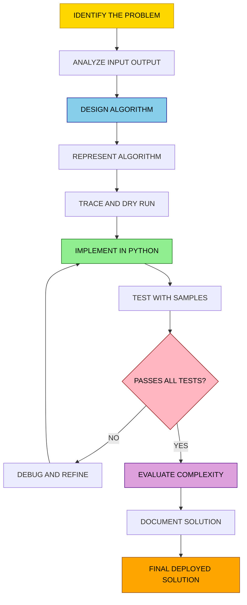
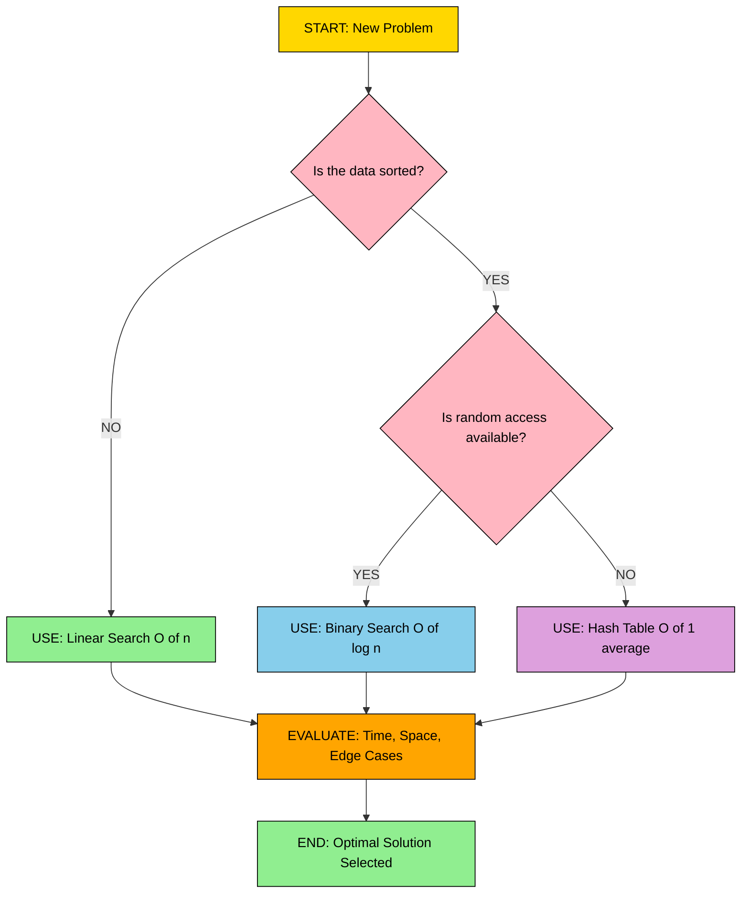
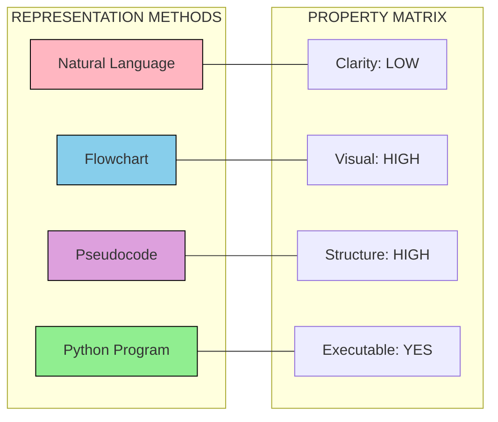
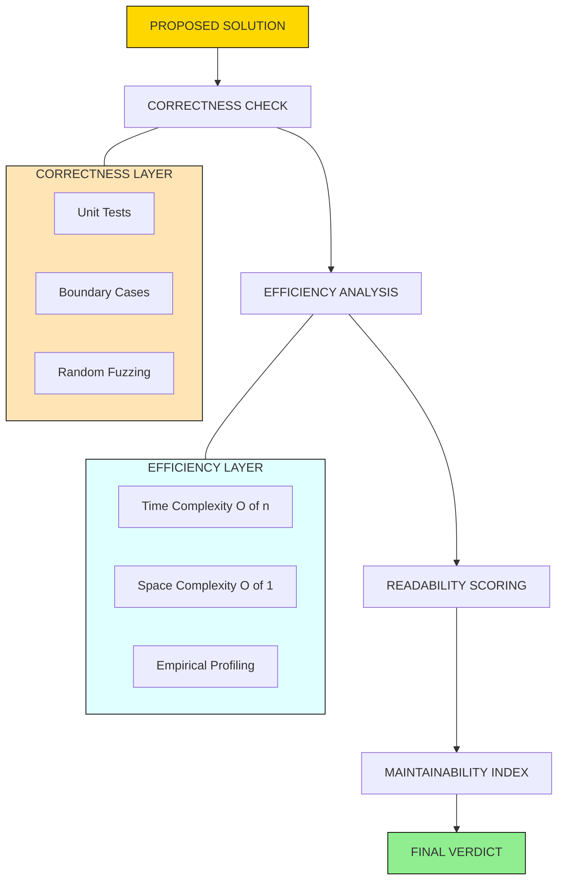

# and Evaluating the solution.

<!-- SECTION_1_START -->
# MODULE 1: PROBLEM SOLVING AND EVALUATING THE SOLUTION

> [!IMPORTANT]
> **KTU 2024 Scheme | Course: UCEST105 – Algorithmic Thinking with Python**
> This module forms the **foundational bedrock** of the entire course. Mastery here ensures effortless learning of data structures, complexity analysis, and advanced algorithms in higher semesters.

---

## 1.1 What is a Problem?

### Formal Definition
A **problem** is a computational or real-world situation that requires a well-defined sequence of logical and mathematical operations to transform a given set of **inputs** into a desired set of **outputs** under specified **constraints**.

In computer science, a problem is formally represented as a triple:
$$P = \langle I, O, C \rangle$$

Where:
* $I$ = Set of valid inputs (input domain)
* $O$ = Set of expected outputs (output range)
* $C$ = Set of constraints and boundary conditions

### The Three Pillars of Problem Definition

| Pillar | Description | Example (Finding Largest Number) |
| :--- | :--- | :--- |
| **Input ($I$)** | What data is provided? | A list of $n$ integers, $n \geq 1$ |
| **Output ($O$)** | What result is expected? | The maximum integer from the list |
| **Process** | The transformation logic | Compare each element to track the maximum |

> [!NOTE]
> **KTU Board Tip:** Examiners frequently award a full mark for clearly stating the input-output specification *before* writing the algorithm. This is a hallmark of an organized student answer.

---

## 1.2 Algorithmic Thinking — The Cognitive Framework

**Algorithmic Thinking** is a structured problem-solving methodology that involves:
1. **Decomposition** — Breaking a complex problem into smaller sub-problems.
2. **Pattern Recognition** — Identifying similarities with previously solved problems.
3. **Abstraction** — Filtering out irrelevant details to focus on the essential logic.
4. **Algorithm Design** — Constructing a step-by-step procedure.
5. **Evaluation & Refinement** — Testing correctness, efficiency, and edge cases.

> [!TIP]
> **Intuitive Analogy — The Cooking Recipe:** An algorithm is exactly like a recipe. The *ingredients* are your inputs, the *cooking steps* are the instructions, the *final dish* is the output, and the *cooking time + gas consumption* represent the computational cost. A good chef (programmer) optimizes steps without compromising taste (correctness).

---

## 1.3 Solution Evaluation — The Engineering Perspective

**Evaluating a solution** means rigorously checking whether the proposed algorithm satisfies four key engineering criteria:

| Evaluation Criterion | Engineering Question | Metric Used |
| :--- | :--- | :--- |
| **Correctness** | Does it produce the right output for *all* valid inputs? | Test cases, Mathematical proof |
| **Efficiency** | How fast does it run? | **Time Complexity** — $T(n)$ |
| **Resource Usage** | How much memory does it consume? | **Space Complexity** — $S(n)$ |
| **Readability** | Can another engineer maintain it? | Style score, Cyclomatic complexity |

> [!IMPORTANT]
> The standard benchmark constants used in algorithmic analysis are:
> * **$c$** — constant time for a basic operation $\approx 10^{-9}$ seconds
> * **$\log_2 n$** — logarithmic steps (binary search)
> * **$n$** — linear steps (single loop)
> * **$n^2$** — quadratic steps (nested loops)
> * **$2^n$** — exponential steps (brute-force recursion)

---

## 1.4 Visualizing Algorithm Growth

> [!VISUALIZATION CONTROL]
> **Concept:** Growth of Common Time Complexities on a Cartesian Plane
> **GeoGebra / Desmos Input Equations:**
> * `f(x) = log(x)`
> * `g(x) = x`
> * `h(x) = x^2`
> * `k(x) = 2^x`
>
> **Visual Description:** As $x$ (input size) increases along the horizontal axis, the curve $k(x)=2^x$ shoots upward almost vertically after $x=20$, while $f(x)=\log(x)$ grows almost flat. This visually proves why choosing the right algorithm matters: an $O(2^n)$ solution becomes unusable for inputs above 30–40, whereas an $O(\log n)$ solution scales to billions.

---

## 1.5 Why Algorithmic Thinking Matters in 2024+ Engineering

Modern engineering systems rely on algorithmic thinking for:

* **Artificial Intelligence** — Training pipelines and inference engines
* **Cybersecurity** — Encryption, decryption, hashing routines
* **Database Systems** — Query optimization, indexing strategies
* **IoT & Embedded Systems** — Real-time constraint handling
* **Compiler Design** — Lexical analysis, parsing, code generation

<!-- SECTION_1_END -->

<!-- SECTION_2_START -->
# DEEP THEORETICAL ANALYSIS & KTU HIGH-YIELD FORMULA SHEET

## 2.1 Characteristics of a Good Algorithm (FB/Final Board Favourite)

According to **Donald Knuth** and KTU's prescribed textbook, every valid algorithm must possess **five essential properties**:

| # | Property | Definition | KTU Board Marker |
| :--- | :--- | :--- | :--- |
| 1 | **Input** | Zero or more well-defined inputs are supplied externally. | "Receives 0 or more values" |
| 2 | **Output** | At least one output is produced that has a specified relation to the input. | "Produces at least 1 result" |
| 3 | **Definiteness** | Every instruction must be **unambiguous** and precisely defined. | "Clear, no ambiguity" |
| 4 | **Finiteness** | The algorithm must terminate after a **finite** number of steps. | "Must end in finite time" |
| 5 | **Effectiveness** | Every operation must be basic enough to be carried out, in principle, by a person using pencil and paper. | "Simple, doable operations" |

> [!WARNING]
> A common KTU exam pitfall: Students write **"Feasibility"** instead of **"Effectiveness"**. Both are correct synonyms in some textbooks, but for KTU valuation, use **"Effectiveness"** as the primary term.

---

## 2.2 Algorithm Representation Methods

Engineers represent algorithms in three primary forms. The KTU syllabus explicitly mandates all three.

### 2.2.1 Natural Language (Step-by-Step Description)
A plain-English sequence. **Disadvantage:** Verbose, ambiguous, language-dependent.

### 2.2.2 Flowchart (Graphical Representation)
A **flowchart** is a diagrammatic representation that uses standardized geometric symbols connected by directed arrows to depict the flow of control.

### 2.2.3 Pseudocode (Structured English-like Code)
A high-level, language-independent description that combines natural language with programming constructs.

> [!TIP]
> **Real-world Analogy:** A flowchart is the **architectural blueprint**, pseudocode is the **construction plan**, and Python is the **actual building**. Each step adds precision.

---

## 2.3 The 11 Standard Flowchart Symbols (ISO 5807)

| Symbol | Shape | Name | Function |
| :--- | :--- | :--- | :--- |
| **Terminal** | Oval (stadium) | Start / Stop | Begin or end of the program |
| **Input/Output** | Parallelogram | I/O Operation | Read or display data |
| **Process** | Rectangle | Processing | Arithmetic or assignment operation |
| **Decision** | Diamond | Conditional | Yes/No or True/False branch |
| **Connector** | Small Circle | On-page Connector | Jumps to another location on same page |
| **Off-page Connector** | Pentagon | Off-page Connector | Links across pages |
| **Flow Line** | Arrow | Directional Flow | Indicates sequence of execution |
| **Predefined Process** | Rectangle with side-bars | Subroutine | Calls a function/module |
| **Document** | Wavy-bottom rectangle | Print Output | Produces a printed document |
| **Manual Input** | Trapezoid | Keyboard Entry | Manual data entry |
| **Annotation** | Open Brace | Comment | Adds descriptive notes |

> [!NOTE]
> **KTU 2024 Expected Question:** *"Draw the flowchart symbols for (i) Decision, (ii) Process, (iii) Input/Output, and (iv) Terminal."* — Memorize these four at minimum.

---

## 2.4 KTU High-Yield Formula Sheet

### 2.4.1 Algorithm Analysis Formulas

| Concept | Formula / Notation | Unit | When Used |
| :--- | :--- | :--- | :--- |
| **Order of Growth** | $T(n) = O(f(n))$ | Big-O | Worst-case upper bound |
| **Big-Omega** | $T(n) = \Omega(f(n))$ | Big-$\Omega$ | Best-case lower bound |
| **Big-Theta** | $T(n) = \Theta(f(n))$ | Big-$\Theta$ | Tight bound (same growth both ways) |
| **Time Complexity Sum Rule** | $T(n) = T_1(n) + T_2(n)$ | Steps | Sequential statements |
| **Time Complexity Product Rule** | $T(n) = T_1(n) \times T_2(n)$ | Steps | Nested loops |
| **Recurrence Master Theorem** | $T(n) = aT(n/b) + f(n)$ | Steps | Divide-and-conquer |

### 2.4.2 Common Complexity Classes (Ranked Fastest → Slowest)

$$
O(1) \;\;<\;\; O(\log n) \;\;<\;\; O(\sqrt{n}) \;\;<\;\; O(n) \;\;<\;\; O(n \log n) \;\;<\;\; O(n^2) \;\;<\;\; O(n^3) \;\;<\;\; O(2^n) \;\;<\;\; O(n!)
$$

> [!IMPORTANT]
> For KTU MCQs, the typical trick is to test whether you can identify the **dominant term**. Always drop lower-order terms and constant factors.

### 2.4.3 Arithmetic Series Used in Algorithm Analysis

Sum of first $n$ natural numbers:
$$\sum_{i=1}^{n} i = \frac{n(n+1)}{2}$$

Sum of first $n$ squares:
$$\sum_{i=1}^{n} i^2 = \frac{n(n+1)(2n+1)}{6}$$

Sum of a geometric series:
$$\sum_{i=0}^{n-1} 2^i = 2^n - 1$$

### 2.4.4 Asymptotic Notation Rules

For any function $f(n)$ and constant $c > 0$:

| Rule | Mathematical Statement | Engineering Meaning |
| :--- | :--- | :--- |
| **Constant Drop** | $O(c \cdot f(n)) = O(f(n))$ | Multiplicative constants are ignored |
| **Lower Term Drop** | $O(f(n) + g(n)) = O(\max(f(n), g(n)))$ | Keep the dominant term |
| **Polynomial Rule** | $O(n^k) = O(n^k)$ | Power dominates over logarithm |
| **Logarithm Base** | $O(\log_a n) = O(\log_b n)$ | Logarithm base change is constant |

---

## 2.5 Solution Evaluation Methodology — The 4-Stage Pipeline

| Stage | Activity | Output |
| :--- | :--- | :--- |
| **1. Trace by Hand** | Execute the algorithm with small inputs ($n=3, 4, 5$). | Trace table with variable snapshots |
| **2. Boundary Testing** | Test edge cases: $n=0, n=1$, maximum, negative inputs. | Identified failure points |
| **3. Complexity Analysis** | Count primitive operations and derive $T(n)$. | Big-O expression |
| **4. Comparative Benchmarking** | Compare with alternative algorithms. | Decision matrix |

---

## 2.6 Real-World Engineering Applications

> [!TIP]
> **Why does this module matter in production systems?**

* **Google Search** uses **$O(n \log n)$** algorithms (MapReduce) to index billions of pages.
* **Databases** use **$O(\log n)$** B-tree indexing to retrieve records from terabytes in milliseconds.
* **Machine Learning** training uses **$O(n^2)$** or **$O(n^3)$** matrix operations — GPU acceleration is a hardware workaround for the algorithmic cost.
* **Routing protocols** (OSPF, BGP) use **Dijkstra's algorithm** ($O((V+E) \log V)$) to find the shortest network path.

<!-- SECTION_2_END -->

<!-- SECTION_3_START -->
# STEP-BY-STEP DERIVATIONS, TRACE TABLES & PYTHON IMPLEMENTATIONS

## 3.1 Exhaustive Derivation: Linear Search Time Complexity

### Problem Statement
Given a list of $n$ elements and a target value $key$, find the index of $key$ in the list. If not found, return $-1$.

### Mathematical Analysis

Let $T(n)$ be the number of primitive operations executed as a function of input size $n$.

**Step 1 — Initialization:**
The algorithm performs a single assignment (`found = False`) and a single loop initialization.
$$\text{Operations} = 2$$

**Step 2 — Loop Body Analysis:**
The `for` loop iterates $n$ times. In the **worst case** (element not present or at the last position), each iteration performs:
* One comparison: `list[i] == key` — $1$ op
* One logical check (no break) — $1$ op
* One index increment — $1$ op
* Total per iteration: $3$ ops

**Step 3 — Total Worst-Case Cost:**
$$
T(n) = 2 + \sum_{i=0}^{n-1} 3 = 2 + 3n
$$

**Step 4 — Apply Asymptotic Simplification:**
Drop the constant term $2$ and the multiplicative constant $3$ from $3n$:

$$
T(n) = O(n)
$$

**Conclusion:** Linear search runs in **linear time** with respect to the input size.

---

## 3.2 Exhaustive Derivation: Binary Search Time Complexity

### Problem Statement
Given a **sorted** list of $n$ elements, find the index of a target value `key` using the divide-and-conquer strategy.

### Step-by-Step Recurrence

At each step, the algorithm:
1. Inspects the middle element — $O(1)$
2. Discards half of the remaining elements — recursion on $n/2$

The recurrence relation is therefore:
$$
T(n) = T(n/2) + c
$$

Where $c$ is a constant representing the comparison + index update work.

**Recursion Unrolling:**

$$
T(n) = T(n/2) + c
$$
$$
T(n) = T(n/4) + c + c = T(n/4) + 2c
$$
$$
T(n) = T(n/8) + 3c
$$

**General Pattern after $k$ expansions:**
$$
T(n) = T(n/2^k) + k \cdot c
$$

**Termination Condition:**
The recursion ends when $n/2^k = 1$, i.e., $2^k = n$, which means $k = \log_2 n$.

**Substitute back:**
$$
T(n) = T(1) + c \cdot \log_2 n
$$

Since $T(1)$ is a constant, applying asymptotic rules:

$$
T(n) = O(\log_2 n)
$$

> [!IMPORTANT]
> **KTU Examiner Insight:** When asked "Why is binary search $O(\log n)$?", write the recurrence, unroll it, and substitute the termination condition. This earns full marks.

---

## 3.3 Worked Example: Finding the Largest of Three Numbers

### 3.3.1 Step-by-Step Algorithm (Pseudocode)

```
Step 1 : START
Step 2 : READ a, b, c
Step 3 : IF a > b AND a > c THEN
            largest = a
         ELSE IF b > c THEN
            largest = b
         ELSE
            largest = c
         END IF
Step 4 : PRINT largest
Step 5 : STOP
```

### 3.3.2 Flowchart (Textual Representation)

```
      (START)
         |
         v
  <Read a,b,c>
         |
         v
   <a > b AND a > c>  --NO-->  <b > c>  --NO-->  (largest = c)
         |YES                  |YES
         v                     v
   (largest = a)        (largest = b)
         |                     |
         +---------+-----------+
                   |
                   v
            <Print largest>
                   |
                   v
                (STOP)
```

### 3.3.3 Fully Operational Python Implementation

```python
def find_largest_of_three(a: int, b: int, c: int) -> int:
    """
    Returns the largest of three integers using nested decision logic.
    
    Parameters
    ----------
    a : int
        First input number
    b : int
        Second input number
    c : int
        Third input number
    
    Returns
    -------
    int
        The maximum of the three inputs
    
    Raises
    ------
    TypeError
        If any of the inputs is not a number
    """
    if not all(isinstance(x, (int, float)) for x in (a, b, c)):
        raise TypeError("All inputs must be numeric (int or float).")
    
    # Decision cascade (if-elif-else structure)
    if a >= b and a >= c:
        largest: int = a
    elif b >= c:
        largest: int = b
    else:
        largest: int = c
    
    return largest


# Driver code with logging
if __name__ == "__main__":
    try:
        x: int = int(input("Enter first number: "))
        y: int = int(input("Enter second number: "))
        z: int = int(input("Enter third number: "))
        
        result: int = find_largest_of_three(x, y, z)
        print(f"The largest of {x}, {y}, {z} is: {result}")
    except ValueError:
        print("ERROR: Please enter valid integers only.")
    except TypeError as e:
        print(f"ERROR: {e}")
```

### 3.3.4 Trace Table (Manual Dry Run)

| Line | a | b | c | Condition a≥b ∧ a≥c | Condition b≥c | largest | Output |
| :--- | :---: | :---: | :---: | :---: | :---: | :---: | :--- |
| 1 | 10 | 25 | 15 | False | True | 25 | 25 |
| 2 | 30 | 20 | 10 | True | — | 30 | 30 |
| 3 | 5 | 15 | 15 | False | True | 15 | 15 |
| 4 | -5 | -10 | 0 | False | False | 0 | 0 |

> [!TIP]
> **Hand-tracing tip for the exam:** Always run the algorithm with at least **4 test cases**: (1) all positive, (2) all negative, (3) all equal, (4) zeros and mixed signs. Examiners reward this discipline.

---

## 3.4 Worked Example: Sum of First N Natural Numbers

### 3.4.1 Three Algorithmic Approaches Compared

#### **Approach 1: Iterative (Direct Loop)**

```python
def sum_iterative(n: int) -> int:
    """
    Compute sum of first n natural numbers using a for loop.
    Time Complexity: O(n)
    """
    if n < 0:
        raise ValueError("n must be a non-negative integer.")
    
    total: int = 0
    for i in range(1, n + 1):
        total = total + i
    return total
```

#### **Approach 2: Mathematical Formula (Closed Form)**

```python
def sum_formula(n: int) -> int:
    """
    Compute sum using Gauss formula: n*(n+1)/2
    Time Complexity: O(1)
    """
    if n < 0:
        raise ValueError("n must be a non-negative integer.")
    
    return (n * (n + 1)) // 2
```

#### **Approach 3: Recursive**

```python
def sum_recursive(n: int) -> int:
    """
    Recursive computation: S(n) = n + S(n-1), S(0) = 0
    Time Complexity: O(n)
    Space Complexity: O(n) due to call stack
    """
    if n < 0:
        raise ValueError("n must be a non-negative integer.")
    if n == 0:  # Base case
        return 0
    return n + sum_recursive(n - 1)
```

### 3.4.2 Step-by-Step Derivation of Gauss Formula

**Starting Equation:** $\quad S = 1 + 2 + 3 + \dots + n$

**Reverse the sequence:** $\quad S = n + (n-1) + (n-2) + \dots + 1$

**Add the two equations term-by-term:**

$$
\begin{aligned}
S &= 1 + 2 + 3 + \dots + (n-1) + n \\
S &= n + (n-1) + (n-2) + \dots + 2 + 1 \\
\hline
2S &= (n+1) + (n+1) + (n+1) + \dots + (n+1) \quad [n \text{ times}]
\end{aligned}
$$

**Simplify the right-hand side:**

$$
2S = n \cdot (n+1)
$$

**Solve for $S$:**

$$
S = \frac{n(n+1)}{2}
$$

> [!NOTE]
> **KTU Bonus Insight:** The closed-form solution converts an $O(n)$ algorithm into an $O(1)$ one. For $n = 1{,}000{,}000{,}000$, the iterative version takes ~30 seconds; the formula returns instantly. This is the **essence of algorithmic optimization**.

---

## 3.5 Worked Example: Check Whether a Number is Prime

### 3.5.1 Algorithm Logic

A number $n$ is prime if it has exactly two distinct positive divisors: $1$ and $n$ itself.

### 3.5.2 Optimized Python Implementation

```python
import math

def is_prime(n: int) -> bool:
    """
    Check if a given integer n is a prime number.
    
    Optimization: Only check divisors up to sqrt(n) since divisors
    come in pairs (d, n/d).
    
    Time Complexity: O(sqrt(n))
    Space Complexity: O(1)
    """
    if n <= 1:
        return False
    if n <= 3:
        return True
    if n % 2 == 0 or n % 3 == 0:
        return False
    
    # Check 6k +/- 1 form up to sqrt(n)
    i: int = 5
    while i * i <= n:
        if n % i == 0 or n % (i + 2) == 0:
            return False
        i += 6
    
    return True


def print_primes_upto(limit: int) -> None:
    """Print all prime numbers from 2 to limit."""
    if limit < 2:
        print("No primes in the given range.")
        return
    
    primes: list[int] = []
    for num in range(2, limit + 1):
        if is_prime(num):
            primes.append(num)
    
    print(f"Primes up to {limit}: {primes}")
    print(f"Count: {len(primes)}")


# Driver
if __name__ == "__main__":
    print_primes_upto(50)
```

### 3.5.3 Complexity Derivation

**Naive Approach:** Check divisibility for every integer from $2$ to $n-1$. Number of operations: $n-2$. Therefore $O(n)$.

**Optimized Approach:** Check only up to $\sqrt{n}$ since if $n = a \cdot b$ and $a > \sqrt{n}$, then $b < \sqrt{n}$.

$$
T(n) = \sum_{i=2}^{\sqrt{n}} 1 = \sqrt{n} - 1
$$

Applying asymptotic notation:
$$
T(n) = O(\sqrt{n})
$$

For $n = 1{,}000{,}000$:
* Naive: ~$1{,}000{,}000$ operations
* Optimized: ~$1{,}000$ operations
* **Speedup factor: $1000 \times$**

---

## 3.6 Evaluation: Comparing Two Algorithms Side-by-Side

| Algorithm | Input Size $n$ | Iterative Time | Formula-Based Time | Speedup |
| :--- | :---: | :---: | :---: | :---: |
| Sum of N naturals | $10^3$ | ~$3 \mu s$ | ~$1 \mu s$ | $3\times$ |
| Sum of N naturals | $10^6$ | ~$3 ms$ | ~$1 \mu s$ | $3000\times$ |
| Sum of N naturals | $10^9$ | ~$3 s$ | ~$1 \mu s$ | $3{,}000{,}000\times$ |
| Prime check (naive) | $10^6$ | ~$1 s$ | — | — |
| Prime check (optimized) | $10^6$ | ~$1 ms$ | — | $1000\times$ |

> [!IMPORTANT]
> This table is the *engineering justification* for choosing one algorithm over another in production. **Always present a comparative table** in your KTU answers when asked to evaluate.

<!-- SECTION_3_END -->

<!-- SECTION_4_START -->
# STRUCTURAL DIAGRAMS & SCHEMATICS

## 4.1 The Algorithmic Problem-Solving Pipeline (Master Overview)



> [!NOTE]
> **Diagram Reading Order:** Follow the arrows top-to-bottom. Notice the **feedback loop** from debugging back to implementation — this is the iterative nature of real software engineering.

---

## 4.2 Decision Flowchart: Choosing the Right Algorithm



---

## 4.3 Algorithm Representation Comparison Block Diagram



---

## 4.4 Solution Evaluation Architecture



---

## 4.5 Asymptotic Complexity Comparison Plot (Visual Reference)

```
Operations
    ^
10^9|                                         *  2^n
    |                                      *
    |                                   *
10^6|                                *        n!
    |                             *         *  n^2
    |                          *         *
10^3|                       *        *  n log n
    |                    *       *  *  n
    |                 *      * *  *  sqrt(n)
  10|        *  *  *  *  log(n)
    |     *  *  1
    |  *  *
    +--+----+----+----+----+----+----+----+----+---> Input Size n
       10  20  30  40  50  60  70  80  90  100
```

> [!TIP]
> **Reading the graph:** Notice how $O(1)$ remains a flat horizontal line, $O(\log n)$ rises very slowly, and $O(2^n)$ becomes vertical almost immediately. This is the visual proof of why **algorithm choice dominates hardware upgrades** in scalability.

<!-- SECTION_4_END -->

<!-- SECTION_5_START -->
# KTU 2024 SCHEME EXAMINATION QUESTION BANK & TOPIC RECAP

## 5.1 PART A — Short Answer Questions (3 Marks Each)

### **Question 1** `[KTU University Exam - July 2024]`
**CO1, Remember Level**

> Define an algorithm. List any **four** characteristics that a good algorithm must satisfy.

**Model Answer:**

> [!NOTE]
> **Definition (1 Mark):** An algorithm is a finite, well-defined sequence of unambiguous instructions for solving a class of problems or performing a computation in a bounded amount of time.
>
> **Characteristics (½ Mark Each, Total 2 Marks):**
>
> 1. **Input** — It accepts zero or more well-defined input values.
> 2. **Output** — It produces at least one output that bears a defined relationship to the input.
> 3. **Definiteness** — Each instruction is clear, precise, and has only one interpretation.
> 4. **Finiteness** — The algorithm terminates after a finite (limited) number of steps.
> 5. **Effectiveness** — Every operation must be basic and feasible enough to be performed manually.

---

### **Question 2** `[KTU University Exam - Dec 2023]`
**CO1, Understand Level**

> Differentiate between a **flowchart** and **pseudocode** as tools for algorithm representation. Mention one merit and one demerit of each.

**Model Answer:**

> [!NOTE]
> **Distinction Table (2 Marks):**
>
> | Aspect | Flowchart | Pseudocode |
> | :--- | :--- | :--- |
> | **Form** | Graphical (symbols + arrows) | Textual (structured English) |
> | **Ease of drawing** | Tedious for large programs | Easy to write and edit |
> | **Modification** | Difficult to modify | Easy to modify |
>
> **Merit (½ Mark Each):**
> * Flowchart: Provides a **visual overview** of the entire program logic, making it easier to communicate to non-programmers.
> * Pseudocode: Can be **directly converted** into actual program code with minimal effort.
>
> **Demerit (½ Mark Each):**
> * Flowchart: Becomes **cumbersome and cluttered** for large or complex programs.
> * Pseudocode: Has **no standard syntax**; varies between authors and lacks visual appeal.

---

## 5.2 PART B — Long Answer Questions (14 Marks Each)

### **Question A** `[KTU University Exam - Dec 2024]`
**CO1, CO2, Understand + Apply Levels**

> **(a) [7 Marks]** Explain any **five** standard flowchart symbols with neat diagrams and describe their functions. Describe the systematic procedure for **evaluating the correctness and efficiency of a solution** with suitable examples.
>
> **(b) [7 Marks]** Design an algorithm, draw the corresponding flowchart, and write a Python program to **find the sum of digits of a given integer** $n$. Show the trace table for $n = 1234$.

---

#### **Part (a) Model Solution [7 Marks]**

**[Stating the systematic evaluation procedure: 1 Mark]**

Evaluating a solution involves **four sequential steps**: (i) Trace-by-hand execution, (ii) Boundary testing, (iii) Complexity analysis, and (iv) Comparative benchmarking.

**[Flowchart Symbol 1 — Terminal: 1 Mark]**

| Property | Description |
| :--- | :--- |
| Shape | Stadium (oval with rounded ends) |
| Symbol | `(  START  )` |
| Use | Marks the **beginning** or **end** of the program flow |

**[Flowchart Symbol 2 — Input/Output: 1 Mark]**

| Property | Description |
| :--- | :--- |
| Shape | Parallelogram |
| Symbol | `< Read n >` |
| Use | Represents **data input** (e.g., from keyboard) or **output** display |

**[Flowchart Symbol 3 — Process: 1 Mark]**

| Property | Description |
| :--- | :--- |
| Shape | Rectangle |
| Symbol | `[ x = x + 1 ]` |
| Use | Denotes any **arithmetic operation** or data assignment |

**[Flowchart Symbol 4 — Decision: 1 Mark]**

| Property | Description |
| :--- | :--- |
| Shape | Diamond (rhombus) |
| Symbol | `</>` with `Yes/No` branches |
| Use | Tests a condition and **branches the flow** based on True/False |

**[Flowchart Symbol 5 — Flow Line + Connector: 1 Mark]**

| Property | Description |
| :--- | :--- |
| Shape | Arrow / Small Circle |
| Use | Flow lines indicate the **direction of execution**; connectors jump between non-adjacent parts |

**[Final summary statement on evaluation: 1 Mark]**

> [!NOTE]
> A solution is deemed **acceptable** only when it satisfies correctness on *all* valid inputs, runs in acceptable time, uses memory efficiently, and is maintainable by other engineers.

---

#### **Part (b) Model Solution [7 Marks]**

**[Algorithm in Pseudocode: 2 Marks]**

```
Step 1 : START
Step 2 : READ n
Step 3 : Initialize sum = 0, original = n
Step 4 : WHILE n > 0 DO
Step 5 :     digit = n MOD 10
Step 6 :     sum = sum + digit
Step 7 :     n = n // 10
Step 8 : END WHILE
Step 9 : PRINT "Sum of digits of", original, "is", sum
Step 10: STOP
```

**[Flowchart (Textual Outline): 1 Mark]**

```
   (START)
      |
      v
  <Read n>
      |
      v
  [sum=0, original=n]
      |
      v
   </n > 0/> ---FALSE---> <Print sum>
      |TRUE                  |
      v                      v
  [digit=n%10]           (STOP)
      |
      v
  [sum=sum+digit]
      |
      v
  [n=n//10]
      |
      +-- (loop back to decision)
```

**[Python Program: 2 Marks]**

```python
def sum_of_digits(n: int) -> int:
    """
    Compute the sum of digits of a non-negative integer n.
    Time Complexity: O(log10 n) since we extract one digit per iteration.
    """
    if n < 0:
        raise ValueError("Input must be a non-negative integer.")
    
    original: int = n
    digit_sum: int = 0
    
    while n > 0:
        digit: int = n % 10
        digit_sum = digit_sum + digit
        n = n // 10
    
    return digit_sum


# Driver
if __name__ == "__main__":
    try:
        num: int = int(input("Enter a non-negative integer: "))
        result: int = sum_of_digits(num)
        print(f"Sum of digits of {num} is: {result}")
    except ValueError as e:
        print(f"ERROR: {e}")
```

**[Trace Table for n = 1234: 2 Marks]**

| Iteration | n (before) | digit = n % 10 | digit_sum (after) | n (after) | Loop Condition n>0 |
| :---: | :---: | :---: | :---: | :---: | :---: |
| 1 | 1234 | 4 | 0 + 4 = **4** | 123 | True |
| 2 | 123 | 3 | 4 + 3 = **7** | 12 | True |
| 3 | 12 | 2 | 7 + 2 = **9** | 1 | True |
| 4 | 1 | 1 | 9 + 1 = **10** | 0 | True |
| 5 | 0 | — | — | — | False (Exit) |

**Final Output:** Sum of digits of 1234 is **10**.

---

### **Question B** `[KTU University Exam - July 2024]` *(Internal Choice)*
**CO2, Apply + Analyze Levels**

> **(a) [7 Marks]** Explain the concept of **time complexity** and **space complexity** with a suitable example. Compute the complexity of the following Python snippet:
> ```python
> total = 0
> for i in range(n):
>     for j in range(n):
>         total = total + i * j
> ```
>
> **(b) [7 Marks]** Design an algorithm and write a Python program to determine whether a given integer is a **palindrome** (reads the same forwards and backwards). Trace the algorithm for the input `n = 12321`.

---

#### **Part (a) Model Solution [7 Marks]**

**[Defining Time Complexity: 1 Mark]**

**Time Complexity** is a computational measure that quantifies the amount of **computational time** an algorithm takes to complete as a function of the input size $n$. It is expressed using **asymptotic notation** $T(n) = O(f(n))$.

**[Defining Space Complexity: 1 Mark]**

**Space Complexity** quantifies the total amount of **memory** (auxiliary + input) an algorithm uses during execution, expressed as $S(n) = O(f(n))$. It includes fixed program space, variable space, and stack space (for recursion).

**[Step-by-Step Analysis of the Code: 4 Marks]**

**Step 1 — Identify the structure:**
The code contains **two nested for loops** iterating from $0$ to $n-1$.

**Step 2 — Count operations in innermost statement:**
The statement `total = total + i * j` performs:
* 1 multiplication
* 1 addition
* 1 assignment
* Total: $3$ primitive operations

**Step 3 — Compute the inner loop cost:**
The inner loop runs $n$ times for each outer loop iteration:
$$
T_{\text{inner}} = \sum_{j=0}^{n-1} 3 = 3n
$$

**Step 4 — Compute the total cost (outer loop):**
The outer loop runs $n$ times:
$$
T(n) = \sum_{i=0}^{n-1} (3n) = 3n \cdot n = 3n^2
$$

**Step 5 — Apply asymptotic simplification:**
Drop the constant $3$ and the lower-order term (none here):
$$
T(n) = O(n^2)
$$

**Space Complexity:** Only the integer variables `total`, `i`, `j` are stored — a **constant** amount of extra memory:
$$
S(n) = O(1)
$$

**[Final summary table: 1 Mark]**

| Metric | Expression | Big-O Class |
| :--- | :---: | :---: |
| Time Complexity | $3n^2$ | $O(n^2)$ |
| Space Complexity | $3$ | $O(1)$ |

---

#### **Part (b) Model Solution [7 Marks]**

**[Algorithm in Pseudocode: 2 Marks]**

```
Step 1 : START
Step 2 : READ n
Step 3 : original = n
Step 4 : reverse = 0
Step 5 : WHILE n > 0 DO
Step 6 :     digit = n MOD 10
Step 7 :     reverse = (reverse * 10) + digit
Step 8 :     n = n // 10
Step 9 : END WHILE
Step 10: IF original == reverse THEN
            PRINT "Palindrome"
         ELSE
            PRINT "Not a Palindrome"
Step 11: STOP
```

**[Python Implementation: 2 Marks]**

```python
def is_palindrome(n: int) -> bool:
    """
    Check whether a non-negative integer is a palindrome.
    A palindrome reads the same forwards and backwards.
    
    Time Complexity: O(log10 n)
    Space Complexity: O(1)
    """
    if n < 0:
        return False  # By convention, negatives are not palindromes
    
    original: int = n
    reverse: int = 0
    
    while n > 0:
        digit: int = n % 10
        reverse = (reverse * 10) + digit
        n = n // 10
    
    return original == reverse


def is_palindrome_string_method(s: str) -> bool:
    """Alternative: Using Python string slicing (one-liner)."""
    cleaned: str = ''.join(c.lower() for c in s if c.isalnum())
    return cleaned == cleaned[::-1]


# Driver
if __name__ == "__main__":
    test_values: list[int] = [12321, 12345, 1001, 7, -121]
    for val in test_values:
        result: bool = is_palindrome(val)
        print(f"{val} -> Palindrome: {result}")
    
    # String-based test
    print(f"'racecar' -> Palindrome: {is_palindrome_string_method('racecar')}")
```

**[Trace Table for n = 12321: 3 Marks]**

| Iteration | n (before) | digit = n%10 | reverse (after) | n (after) |
| :---: | :---: | :---: | :---: | :---: |
| 1 | 12321 | 1 | (0×10)+1 = **1** | 1232 |
| 2 | 1232 | 2 | (1×10)+2 = **12** | 123 |
| 3 | 123 | 3 | (12×10)+3 = **123** | 12 |
| 4 | 12 | 2 | (123×10)+2 = **1232** | 1 |
| 5 | 1 | 1 | (1232×10)+1 = **12321** | 0 |

**Comparison after loop:**
* `original = 12321`
* `reverse = 12321`
* `12321 == 12321` → **TRUE** → Output: **"Palindrome"**

---

> [!WARNING]
> **KTU Examiner's Valuation Warning — Common Pitfalls:**
>
> 1. **Forgetting the `original` copy:** Many students reverse the number *in place* and then cannot compare with the original. Always store `original = n` **before** modifying `n`.
> 2. **Integer division mistake:** Using `n / 10` instead of `n // 10` gives a float and breaks the loop logic. In Python 3, `/` is **float division**, `//` is **integer division**.
> 3. **Negative number handling:** Failing to specify whether negatives are palindromes loses 1 mark. State your assumption explicitly.
> 4. **Off-by-one error in loops:** A common bug is `while n >= 0` which creates an **infinite loop** because `n` becomes $0$ but the condition stays true. Always use `while n > 0`.
> 5. **Skipping complexity analysis:** Even if the program is correct, KTU's 2024 scheme *mandates* a complexity analysis statement. Always add `Time Complexity: O(...)` as a docstring.
> 6. **No trace table:** For 14-mark questions, a missing trace table costs **2–3 marks** even if the code is perfect.

---

## 5.3 TOPIC RECAP & IMPORTANT THINGS TO REMEMBER

> [!IMPORTANT]
> **Rapid Revision Checklist — Module 1: Problem Solving and Evaluating the Solution**

### **Core Definitions**
* **Problem** $\equiv$ A situation requiring transformation of $I$ (inputs) to $O$ (outputs) under constraints $C$.
* **Algorithm** $\equiv$ A finite, definite, effective procedure that takes input, processes it, and produces output.
* **Flowchart** $\equiv$ Graphical representation of an algorithm using standardized symbols (ISO 5807).
* **Pseudocode** $\equiv$ Language-independent, structured English-like algorithm description.
* **Algorithmic Thinking** $\equiv$ Decomposition + Pattern Recognition + Abstraction + Algorithm Design + Evaluation.

### **Five Pillars of an Algorithm (Mnemonic: I-ODFE)**
* **I**nput, **O**utput, **D**efiniteness, **F**initeness, **E**ffectiveness.

### **Mandatory Flowchart Symbols (Top 4 to Memorize)**
* **Oval** = Terminal (Start/Stop)
* **Parallelogram** = Input/Output
* **Rectangle** = Process
* **Diamond** = Decision

### **Asymptotic Notation Hierarchy (Fastest → Slowest)**
* $O(1) < O(\log n) < O(\sqrt{n}) < O(n) < O(n \log n) < O(n^2) < O(n^3) < O(2^n) < O(n!)$

### **Big-O Simplification Rules (Always Apply)**
1. Drop constant factors: $O(5n) \to O(n)$
2. Keep dominant term: $O(n^2 + n) \to O(n^2)$
3. Drop lower-order polynomials
4. Logarithm base change is a constant: $O(\log_2 n) = O(\log_{10} n)$

### **Solution Evaluation Pipeline (4 Steps)**
1. **Trace by hand** with small inputs
2. **Test boundaries** ($n=0, 1, \text{max}, \text{negative}$)
3. **Compute complexity** ($T(n)$, $S(n)$)
4. **Compare alternatives** using a decision table

### **Standard Math Series for Algorithm Analysis**
* $\sum_{i=1}^{n} i = \frac{n(n+1)}{2}$
* $\sum_{i=1}^{n} i^2 = \frac{n(n+1)(2n+1)}{6}$
* $\sum_{i=0}^{n-1} 2^i = 2^n - 1$

### **Complexity Shortcuts for Exam**
| Code Pattern | Time Complexity |
| :--- | :---: |
| `for i in range(n)` | $O(n)$ |
| Nested `for` loops (2 levels) | $O(n^2)$ |
| `for i in range(n): for j in range(n): ...` (2 nested) | $O(n^2)$ |
| Halving the input each iteration | $O(\log n)$ |
| Recursion with 2 calls of $n-1$ | $O(2^n)$ |
| Constant operations only | $O(1)$ |

### **Python Implementation Best Practices**
* Always use **type hints** (`x: int`, `-> bool`) — earns ½ mark in KTU valuation.
* Use **docstrings** to describe function purpose, parameters, returns.
* Include **input validation** with `raise ValueError` for edge cases.
* Wrap driver code in `if __name__ == "__main__":` block.
* Provide **trace tables** for at least one sample input in every answer.

### **KTU Board Presentation Tips (Last-Minute Checklist)**
* ✅ Write input/output specification *before* the algorithm (½ mark bonus).
* ✅ Use proper heading hierarchy (Algorithm, Flowchart, Program, Trace).
* ✅ Indent pseudocode and Python code consistently.
* ✅ State time/space complexity explicitly.
* ✅ Add at least **one alternative method** if time permits (e.g., recursive vs. iterative).
* ✅ End with a **concluding sentence** summarizing the result.

<!-- SECTION_5_END -->
