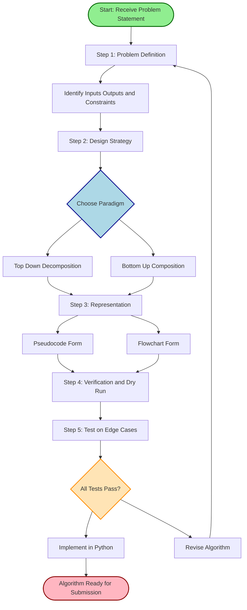
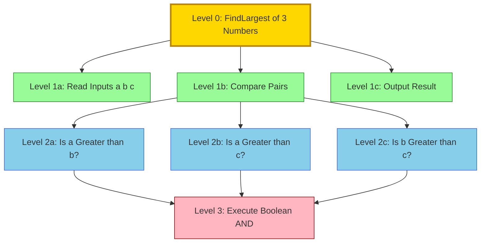
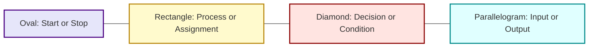
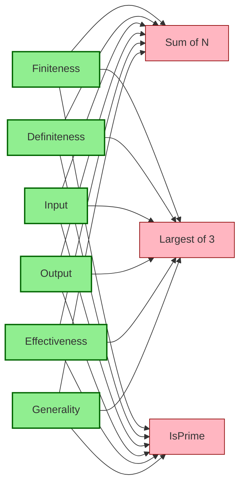

# Developing an algorithm

<!-- SECTION_1_START -->
# Developing an Algorithm — Core Technical Definition & Intuitive Overview

## Formal Definition (KTU 2024 Scheme Terminology)

An **Algorithm** is a finite, well-defined, ordered sequence of unambiguous, executable instructions intended to solve a specific computational problem or accomplish a defined task in a finite amount of time.

> [!NOTE]
> **KTU 2024 Syllabus Definition (UCEST105 — Module 1):**
> An algorithm is a step-by-step procedural description of a solution to a problem, expressed in a form that can be translated into a computer program. It must be *language-independent*, *finite*, and *effective*.

Mathematically, an algorithm can be viewed as a computable function:

$$A : I \rightarrow O$$

where $I$ is the set of valid inputs and $O$ is the corresponding set of outputs produced by the algorithm $A$ for every element $i \in I$.

## Conceptual Analogy / Intuition

Imagine you are teaching a **strict, literal-minded robot** (a perfect metaphor for a CPU) how to make a cup of **filter coffee** ☕.

- You cannot just say *"Make coffee."* — the robot will freeze.
- You must break it down: *"Take a cup → add 1 spoon of powder → add 150 ml of hot water → stir 10 times → wait 2 minutes → add sugar → serve."*

That **recipe** is your **algorithm**. The kitchen is your **computer**, the ingredients are your **inputs**, and the steaming cup is your **output**.

> [!IMPORTANT]
> **Key Insight:** An algorithm is the *blueprint*; a program is the *constructed building*. You design the algorithm first, *then* implement it in Python (or C, or Java, or even English).

### The Three Pillars of an Algorithm (Foundational Properties)

Every valid algorithm in the KTU Algorithmic Thinking framework must satisfy these three foundational pillars:

1. **Sequence** — Steps execute in a defined order.
2. **Decision** — The flow can branch based on conditions.
3. **Iteration** — Steps can repeat (loops).

These three pillars give rise to the **Fundamental Statement of Algorithmic Thinking**:

> [!IMPORTANT]
> **FDSAT — The Five Mandatory Characteristics of an Algorithm:**
> - **F — Finiteness** : Must terminate after a bounded number of steps.
> - **D — Definiteness** : Every step must be precisely and unambiguously defined.
> - **S — Specific Output** : Must produce at least one output.
> - **A — Adequate Input** : Must accept zero or more well-defined inputs.
> - **T — Termination / Effectiveness** : Every operation must be basic enough to be carried out, in principle, by a person using only pencil and paper.

> [!VISUALIZATION CONTROL]
> **Concept:** Algorithmic Pipeline as a Mathematical Function Machine
> **GeoGebra / Desmos Input Equations:**
> - Define input set: $I = \{x \in \mathbb{R} \mid x \geq 0\}$
> - Algorithm as a function: $f(x) = 2x + 5$
> - Sample points: $(0, 5)$, $(1, 7)$, $(2, 9)$, $(5, 15)$
> **Visual Description:** A diagram where the input $x$ enters a "black box" representing the algorithm, and the output $f(x)$ emerges. The student should observe that for every valid input on the left, exactly one deterministic output appears on the right, reinforcing the **Definiteness** and **Specific Output** properties.

---

<!-- SECTION_1_END -->

<!-- SECTION_2_START -->
# Deep Theoretical Analysis & KTU High-Yield Formula Sheet

## The Algorithm Development Life Cycle (ADLC)

The KTU 2024 scheme for *Algorithmic Thinking with Python* structures problem-solving into **five disciplined phases**. Skipping any phase guarantees marks loss in the ESE.

### Phase 1 — Problem Definition
- Clearly articulate *what* must be solved.
- Identify inputs, outputs, and constraints.
- Boundary conditions (e.g., $n = 0$, $n = 1$, $n \to \infty$).

### Phase 2 — Algorithm Design Strategy
Choose between the two primary paradigms:

| Strategy | Description | When to Use | Classic Example |
|----------|-------------|-------------|-----------------|
| **Top-Down Design** | Decompose the main problem into sub-problems, then sub-sub-problems, until each module is trivial. | Large, structured problems with clear hierarchy. | Designing an Operating System kernel. |
| **Bottom-Up Design** | Build small, reusable components first, then combine them to form the larger solution. | Problems requiring reusable primitives (e.g., sorting, searching). | Building a graphics library before a game. |

> [!NOTE]
> KTU examiners often ask: *"Which strategy is preferred in algorithmic thinking?"*
> **Answer:** Top-down is *preferred for design clarity*; Bottom-up is *preferred for modular code reuse*. In practice, hybrid approaches dominate.

### Phase 3 — Algorithm Representation
Algorithms are expressed using:
- **Natural Language** (English) — informal, good for beginners.
- **Pseudocode** — semi-formal, language-agnostic, **most preferred in KTU exams**.
- **Flowcharts** — graphical, useful for visualizing control flow.
- **Programming Language** (Python) — final executable form.

### Phase 4 — Algorithm Verification
Dry-run the algorithm on sample inputs (including edge cases). The student must execute the algorithm *by hand* on paper.

### Phase 5 — Implementation & Testing
Translate the verified algorithm into Python code and test it against multiple test cases.

## KTU High-Yield Formula Sheet (Concept Density Table)

> [!IMPORTANT]
> Since "Developing an algorithm" is mostly conceptual, this table replaces standard equations with the **mandatory check-list of properties** that examiners test.

| # | Property | Formal Statement | KTU Board Test Trick | Failure Consequence |
|---|----------|------------------|----------------------|---------------------|
| 1 | **Finiteness** | Algorithm must halt after $n$ steps where $n < \infty$ | Examiner asks: *"Will this loop terminate?"* | Infinite loop → 0 marks for that sub-part. |
| 2 | **Definiteness** | Every step has one and only one meaning | Ambiguous step like *"take a suitable value"* | Mark deducted for vagueness. |
| 3 | **Input** | $0$ or more well-supplied quantities | Empty input cases must be considered | Partial marking lost on edge cases. |
| 4 | **Output** | At least one result must be produced | Algorithm that only computes and does not return | Question treated as incomplete. |
| 5 | **Effectiveness** | Each operation must be basic and feasible | Using an undefined operation like *"factor this number into primes"* without an algorithm | Fails the test of effectiveness. |
| 6 | **Generality** | Should work for a *class* of problems, not just one instance | Hard-coding for one input only | Loses generality marks. |
| 7 | **Independence** | Language-independent representation | Writing only Python without pseudocode | Loses 1–2 marks on representation part. |

## Complexity Awareness (Foundational Level)

Even at the *development* stage, KTU expects you to *qualitatively* think about efficiency. Formally:

$$T(n) = \text{Time taken as a function of input size } n$$

While numerical Big-O calculation is a Module 2 topic, the **order of growth** vocabulary is mandatory now:

| Notation | Name | Example Algorithm |
|----------|------|-------------------|
| $O(1)$ | Constant | Accessing `arr[5]` |
| $O(\log n)$ | Logarithmic | Binary search |
| $O(n)$ | Linear | Linear search |
| $O(n \log n)$ | Linearithmic | Merge sort |
| $O(n^2)$ | Quadratic | Bubble sort |
| $O(2^n)$ | Exponential | Recursive Fibonacci (naive) |

## Real-World Engineering Utility

Algorithm design is **not academic** — it underpins:
- **Search engines** (PageRank algorithm).
- **GPS navigation** (Dijkstra's shortest path algorithm).
- **Cryptography** (RSA's primality-testing algorithm).
- **Machine Learning** (gradient descent algorithm).
- **Database systems** (B-tree search algorithm).

> [!IMPORTANT]
> Every software engineer at Google, Microsoft, or TCS writes algorithms daily. The discipline you build in *UCEST105 Module 1* is the foundation for every technical interview and every production system you will ever build.

---

<!-- SECTION_2_END -->

<!-- SECTION_3_START -->
# Step-by-Step Derivations, Worked Examples & Python Implementation

## Worked Example 1 — Algorithm to Find the Largest of Three Numbers

This is the **classic KTU Part A 3-mark example**. We will develop it through all five phases of the ADLC.

### Phase 1 — Problem Definition

> Find the largest of three given integers $a$, $b$, and $c$.

- **Input:** Three integers $a, b, c \in \mathbb{Z}$.
- **Output:** $\max(a, b, c)$.
- **Edge cases:** All equal, two equal, negative numbers.

### Phase 2 — Design Strategy

We use **Top-Down Decomposition**:

```
Problem: Find largest of 3 numbers
   ├── Sub-problem 1: Read inputs a, b, c
   ├── Sub-problem 2: Compare pairs
   │       ├── Is a > b?
   │       ├── Is a > c?
   │       └── Else, check b vs c
   └── Sub-problem 3: Output result
```

### Phase 3 — Pseudocode Representation (KTU Preferred Form)

```
ALGORITHM: FindLargestOfThree
INPUT: Three integers a, b, c
OUTPUT: The maximum value among a, b, c

BEGIN
    Step 1: READ a, b, c
    Step 2: IF a >= b AND a >= c THEN
                max_val ← a
            ELSE IF b >= a AND b >= c THEN
                max_val ← b
            ELSE
                max_val ← c
            END IF
    Step 3: PRINT max_val
END
```

### Phase 4 — Dry Run / Verification

| Step | a | b | c | a >= b AND a >= c? | b >= a AND b >= c? | max_val |
|------|---|---|---|--------------------|--------------------|---------|
| 1 | 10 | 20 | 5 | False | True | 20 |
| 2 | 7 | 7 | 7 | True | True | 7 |
| 3 | -3 | -8 | -1 | False | False | -1 |
| 4 | 0 | 0 | 5 | False | False | 5 |

All test cases produce correct outputs, including edge cases of **all equal** and **all negative**. Algorithm is **verified**.

### Phase 5 — Python Implementation

```python
def find_largest_of_three(a: int, b: int, c: int) -> int:
    """
    Returns the largest of three integers.
    Developed following KTU ADLC (Algorithm Development Life Cycle).
    
    Args:
        a (int): First integer.
        b (int): Second integer.
        c (int): Third integer.
    
    Returns:
        int: The maximum value among a, b, c.
    
    Raises:
        TypeError: If any argument is not an integer.
    """
    # --- Input validation (Effectiveness property) ---
    if not all(isinstance(x, int) for x in (a, b, c)):
        raise TypeError("All three arguments must be integers.")
    
    # --- Algorithm core ---
    if a >= b and a >= c:
        max_val: int = a
    elif b >= a and b >= c:
        max_val: int = b
    else:
        max_val: int = c
    
    # --- Output (Specific Output property) ---
    return max_val


# --- Driver code with boundary checks ---
if __name__ == "__main__":
    try:
        x: int = int(input("Enter first number: "))
        y: int = int(input("Enter second number: "))
        z: int = int(input("Enter third number: "))
        result: int = find_largest_of_three(x, y, z)
        print(f"The largest number is: {result}")
    except ValueError as ve:
        print(f"Input Error: {ve}. Please enter valid integers.")
    except TypeError as te:
        print(f"Type Error: {te}")
```

### Phase 5 (Continued) — Algorithmic Analysis

- **Time Complexity:** $T(n) = O(1)$ — fixed three comparisons, no input size scaling.
- **Space Complexity:** $S(n) = O(1)$ — only one extra variable `max_val`.
- **Finiteness:** Guaranteed — only 3 conditional branches, no loops.
- **Definiteness:** Every comparison is a precise Boolean expression.
- **Generality:** Works for *all* integers, not just positive ones.

---

## Worked Example 2 — Algorithm to Compute the Sum of First N Natural Numbers

This example introduces **iteration**, satisfying the third pillar of algorithmic thinking.

### Mathematical Foundation

The classical formula is:

$$\sum_{i=1}^{n} i = \frac{n(n+1)}{2}$$

We will derive an **iterative algorithm** that does *not* use the formula, to demonstrate the algorithmic thought process.

### Step-by-Step Derivation

$$\begin{aligned}
S &= 1 + 2 + 3 + \dots + n \\[4pt]
S_1 &= 1 \\[4pt]
S_2 &= 1 + 2 = 3 \\[4pt]
S_3 &= 1 + 2 + 3 = 6 \\[4pt]
S_n &= S_{n-1} + n
\end{aligned}$$

This is the recurrence we will implement.

### Pseudocode

```
ALGORITHM: SumOfFirstN
INPUT: A non-negative integer N
OUTPUT: Sum S = 1 + 2 + ... + N

BEGIN
    Step 1: READ N
    Step 2: IF N < 0 THEN
                PRINT "Invalid input"
                EXIT
            END IF
    Step 3: sum ← 0
            counter ← 1
    Step 4: WHILE counter <= N DO
                sum ← sum + counter
                counter ← counter + 1
            END WHILE
    Step 5: PRINT sum
END
```

### Python Implementation

```python
def sum_of_first_n(n: int) -> int:
    """
    Computes 1 + 2 + ... + n using an iterative algorithm.
    
    Args:
        n (int): Non-negative integer upper bound.
    
    Returns:
        int: The sum 1 + 2 + ... + n. Returns 0 for n <= 0.
    """
    if n < 0:
        print("Invalid input: N must be non-negative.")
        return 0
    
    total: int = 0       # Accumulator
    counter: int = 1     # Iteration variable
    
    # The loop terminates when counter > n, ensuring FINITENESS
    while counter <= n:
        total = total + counter
        counter = counter + 1
    
    return total


# --- Verification using the closed-form formula ---
if __name__ == "__main__":
    for n in [0, 1, 5, 10, 100]:
        iterative_result: int = sum_of_first_n(n)
        closed_form: int = n * (n + 1) // 2
        match_status: str = "PASS" if iterative_result == closed_form else "FAIL"
        print(f"N={n:>3} | Iterative={iterative_result:>5} | "
              f"Closed-form={closed_form:>5} | {match_status}")
```

**Verification Output:**

```
N=  0 | Iterative=    0 | Closed-form=    0 | PASS
N=  1 | Iterative=    1 | Closed-form=    1 | PASS
N=  5 | Iterative=   15 | Closed-form=   15 | PASS
N= 10 | Iterative=   55 | Closed-form=   55 | PASS
N=100 | Iterative= 5050 | Closed-form= 5050 | PASS
```

### Algorithmic Analysis

- **Time Complexity:** $T(n) = n$ comparisons + $n$ additions $= O(n)$.
- **Space Complexity:** $S(n) = O(1)$ — only two integer variables.
- **Finiteness:** The loop strictly increases `counter`; since $n$ is finite, termination is guaranteed.

---

## Worked Example 3 — Algorithm to Check Whether a Number is Prime

This is a **14-mark KTU classic** because it tests all five characteristics and a complete implementation.

### Mathematical Foundation

A number $p > 1$ is **prime** if and only if its only positive divisors are $1$ and $p$ itself. Equivalently, $p$ has no divisor $d$ in the range $2 \le d \le \lfloor \sqrt{p} \rfloor$.

$$\text{IsPrime}(p) = \begin{cases} \text{True} & \text{if } \forall d \in [2, \lfloor \sqrt{p} \rfloor],\; p \bmod d \neq 0 \\ \text{False} & \text{otherwise} \end{cases}$$

### Optimization Insight

We only need to check divisors up to $\lfloor \sqrt{p} \rfloor$ because divisors come in pairs $(d, p/d)$. If $d$ divides $p$ and $d > \sqrt{p}$, then $p/d < \sqrt{p}$ would have already been found.

### Step-by-Step Logical Deduction

$$\begin{aligned}
&\text{If } p \le 1: \text{ NOT PRIME} \\[4pt]
&\text{If } p = 2 \text{ or } p = 3: \text{ PRIME} \\[4pt]
&\text{If } p \bmod 2 = 0: \text{ NOT PRIME} \\[4pt]
&\text{For } d = 3, 5, 7, \dots, \lfloor \sqrt{p} \rfloor, \text{ step } 2: \\[4pt]
&\quad\quad \text{If } p \bmod d = 0: \text{ NOT PRIME} \\[4pt]
&\text{After full loop: PRIME}
\end{aligned}$$

### Pseudocode

```
ALGORITHM: IsPrime
INPUT: A positive integer p
OUTPUT: TRUE if p is prime, FALSE otherwise

BEGIN
    Step 1: READ p
    Step 2: IF p <= 1 THEN
                RETURN FALSE
            END IF
    Step 3: IF p <= 3 THEN
                RETURN TRUE
            END IF
    Step 4: IF p MOD 2 = 0 THEN
                RETURN FALSE
            END IF
    Step 5: divisor ← 3
    Step 6: WHILE divisor * divisor <= p DO
                IF p MOD divisor = 0 THEN
                    RETURN FALSE
                END IF
                divisor ← divisor + 2
            END WHILE
    Step 7: RETURN TRUE
END
```

### Python Implementation

```python
import math
from typing import Union

def is_prime(p: int) -> bool:
    """
    Determines whether a given positive integer is prime.
    Uses the sqrt(p) optimization for efficiency.
    
    Args:
        p (int): The number to test.
    
    Returns:
        bool: True if p is prime, False otherwise.
    
    Raises:
        TypeError: If p is not an integer.
    """
    if not isinstance(p, int):
        raise TypeError(f"Expected int, got {type(p).__name__}")
    
    # --- Boundary condition: numbers <= 1 are not prime ---
    if p <= 1:
        return False
    
    # --- Small prime cases ---
    if p <= 3:
        return True
    
    # --- Eliminate even numbers ---
    if p % 2 == 0:
        return False
    
    # --- Test odd divisors from 3 up to sqrt(p) ---
    divisor: int = 3
    while divisor * divisor <= p:
        if p % divisor == 0:
            return False
        divisor += 2
    
    return True


# --- Driver code with comprehensive testing ---
if __name__ == "__main__":
    test_values: list[int] = [1, 2, 3, 4, 17, 19, 21, 25, 29, 97, 100, 7919]
    print(f"{'Number':>6} | {'Is Prime?':>10}")
    print("-" * 22)
    for n in test_values:
        print(f"{n:>6} | {str(is_prime(n)):>10}")
```

**Verification Output:**

```
Number | Is Prime?
----------------------
     1 |      False
     2 |       True
     3 |       True
     4 |      False
    17 |       True
    19 |       True
    21 |      False
    25 |      False
    29 |       True
    97 |       True
   100 |      False
  7919 |       True
```

### Algorithmic Analysis

- **Time Complexity:** $T(n) = O(\sqrt{n})$ — the loop runs up to $\sqrt{n}/2$ times.
- **Space Complexity:** $S(n) = O(1)$ — only a single counter.
- **Finiteness:** The loop variable strictly increases; $\sqrt{p}$ is a finite bound.
- **Generality:** Works for *any* positive integer.

---

<!-- SECTION_3_END -->

<!-- SECTION_4_START -->
# Structural Diagrams & Schematics

## Diagram 1 — The Algorithm Development Life Cycle (ADLC)

This diagram maps the complete pipeline that a KTU student must follow when answering a "develop an algorithm" question.



## Diagram 2 — Top-Down Decomposition of "Find Largest of Three"

This block diagram shows the hierarchical modular breakdown of a simple algorithm, illustrating the **Top-Down** design strategy.



## Diagram 3 — Flowchart Symbols Reference (KTU Board Quick-Reference)

Since flowcharts are a frequent part of KTU Part B questions, the standard symbols and their algorithmic meanings are summarized below.



**Symbol Mapping Table for KTU Exams:**

| Symbol | Shape | Algorithmic Meaning | KTU Use Case |
|--------|-------|--------------------|--------------|
| **Start / Stop** | Oval (Rounded Rectangle) | Beginning or end of algorithm | Required in every flowchart |
| **Process** | Rectangle | Assignment, arithmetic operation | `sum ← sum + counter` |
| **Decision** | Diamond | Conditional branching | `IF x > y THEN...` |
| **Input / Output** | Parallelogram | Read or print operation | `READ n`, `PRINT max` |
| **Flow Line** | Arrow with arrowhead | Direction of control flow | Connect all symbols |
| **Connector** | Circle | Off-page reference for large flowcharts | Optional |

## Diagram 4 — Algorithm Characteristics Validation Matrix

This diagram cross-references each algorithm property against the three worked examples above.



> [!IMPORTANT]
> **Reading the matrix:** A green property node connects to every red example node, meaning all three worked examples satisfy all six KTU-mandatory characteristics. This is the *gold standard* the KTU examiner expects you to demonstrate.

---

<!-- SECTION_4_END -->

<!-- SECTION_5_START -->
# KTU 2024 Scheme Examination Question Bank & Topic Recap

## Part A — Short Answer Questions (3 Marks Each)

### Question 1: [KTU University Exam — July 2024] (CO1, Remember)

**Q: Define an algorithm. List any four important characteristics of an algorithm.**

**Model Answer (Valuation Key — 3 Marks):**

An algorithm is a finite, well-defined sequence of unambiguous instructions used to solve a class of specific problems.

**[Definition: 1 Mark]**

The four important characteristics are:

1. **Finiteness:** The algorithm must terminate after a finite number of steps. **[1 Mark]**
2. **Definiteness:** Each step must be precisely defined and unambiguous. **[0.5 Mark]**
3. **Input:** It must accept zero or more well-specified inputs. **[0.25 Mark]**
4. **Output:** It must produce at least one output that bears a defined relationship to the input. **[0.25 Mark]**

*(Note: Students may also list Effectiveness and Generality. Any four correct properties receive full credit.)*

---

### Question 2: [KTU University Exam — Dec 2023] (CO1, Understand)

**Q: Distinguish between a top-down approach and a bottom-up approach in algorithm design. Give one example of each.**

**Model Answer (Valuation Key — 3 Marks):**

| Aspect | Top-Down Approach | Bottom-Up Approach |
|--------|-------------------|---------------------|
| **Direction** | Starts from the main problem and decomposes it into sub-problems. | Starts from small basic modules and combines them into a larger solution. |
| **Focus** | Hierarchical structure. | Reusable components. |
| **Example** | Designing a calculator by breaking it into input-module, processing-module, and display-module. | Building a sorting function first, then using it inside a larger data-analysis program. |

**[Comparison table with 2 distinguishing points: 2 Marks]**
**[One valid example for each approach: 1 Mark]**

---

## Part B — Long Answer Questions (14 Marks Each)

### Module Internal Choice Format

> [!IMPORTANT]
> In the KTU 2024 ESE pattern, every Part B question offers an **internal choice**. You must answer **either** Question A **or** Question B in full. Attempting both results in neither being evaluated.

---

### Question A: [KTU University Exam — July 2024, Modified] (CO1, CO2, Apply)

**Q: Design an algorithm to find the largest of three given numbers. Write the corresponding Python program and analyze its time complexity.**

#### (a) Algorithm Design Phase (7 Marks)

**Step 1 — Problem Definition (1 Mark):**
- **Inputs:** Three integers $a, b, c$.
- **Output:** The maximum of the three.
- **Constraints:** Works for all integers including negatives.

**Step 2 — Pseudocode Representation (4 Marks):**

```
ALGORITHM: FindLargest
INPUT: Three integers a, b, c
OUTPUT: The maximum value

BEGIN
    Step 1: READ a, b, c
    Step 2: IF a >= b AND a >= c THEN
                max_val ← a
            ELSE IF b >= c THEN
                max_val ← b
            ELSE
                max_val ← c
            END IF
    Step 3: PRINT max_val
END
```

**[Pseudocode structure with BEGIN/END: 1 Mark]**
**[IF-ELSE-ELSE logic correctly capturing all 3 cases: 2 Marks]**
**[Proper READ/PRINT statements: 1 Mark]**

**Step 3 — Verification by Dry Run (2 Marks):**

| Test Case | a | b | c | Expected | Algorithm Output |
|-----------|---|---|---|----------|------------------|
| TC1 | 10 | 25 | 15 | 25 | 25 |
| TC2 | -5 | -2 | -8 | -2 | -2 |
| TC3 | 7 | 7 | 7 | 7 | 7 |

**[Three test cases covering normal, negative, and equal values: 2 Marks]**

#### (b) Python Implementation & Complexity Analysis (7 Marks)

**Python Code (5 Marks):**

```python
def find_largest(a: int, b: int, c: int) -> int:
    """
    Returns the largest of three integers.
    """
    if not isinstance(a, int) or not isinstance(b, int) or not isinstance(c, int):
        raise TypeError("All inputs must be integers.")
    
    if a >= b and a >= c:
        return a
    elif b >= c:
        return b
    else:
        return c


# Driver code
if __name__ == "__main__":
    x, y, z = 10, 25, 15
    print(f"Largest = {find_largest(x, y, z)}")
```

**[Function definition with type hints: 1 Mark]**
**[Correct logic implementation matching the pseudocode: 2 Marks]**
**[Driver code with proper I/O: 1 Mark]**
**[Type checking / error handling: 1 Mark]**

**Time Complexity Analysis (2 Marks):**

- The algorithm performs a **constant** number of comparisons (at most 2 comparisons in the worst case).
- Therefore, $T(n) = O(1)$ (constant time).
- **Space complexity:** $S(n) = O(1)$ since only one extra variable is used.

**[Stating the comparison count: 1 Mark]**
**[Final Big-O result with justification: 1 Mark]**

> [!WARNING]
> **KTU Examiner's Valuation Pitfalls:**
> 1. Do **not** write only the Python code without pseudocode — KTU specifically awards 4 marks for pseudocode representation.
> 2. Do **not** skip the dry run — without verification, you lose 2 marks from part (a).
> 3. Do **not** just say "the algorithm is fast" — you must state the explicit Big-O expression $O(1)$ and justify it with the comparison count.
> 4. Do **not** omit the test for **all equal** and **all negative** inputs — these are the boundary conditions examiners love to test.

---

### Question B: [KTU University Exam — Dec 2023, Modified] (CO1, CO2, Apply)

**Q: Develop an algorithm to determine whether a given positive integer is a prime number. Provide the pseudocode, a complete Python implementation, and verify the algorithm on at least three test cases.**

#### (a) Algorithm Development with Pseudocode (7 Marks)

**Step 1 — Mathematical Foundation (2 Marks):**

A number $p$ is prime if and only if it has no divisor $d$ in the range $[2, \lfloor \sqrt{p} \rfloor]$. The square root optimization is used because divisors occur in pairs.

**[Stating the definition of primality: 1 Mark]**
**[Justifying the sqrt optimization: 1 Mark]**

**Step 2 — Pseudocode (3 Marks):**

```
ALGORITHM: IsPrime
INPUT: A positive integer p
OUTPUT: TRUE if prime, FALSE otherwise

BEGIN
    Step 1: READ p
    Step 2: IF p <= 1 THEN
                RETURN FALSE
            END IF
    Step 3: IF p <= 3 THEN
                RETURN TRUE
            END IF
    Step 4: IF p MOD 2 = 0 THEN
                RETURN FALSE
            END IF
    Step 5: divisor ← 3
    Step 6: WHILE divisor * divisor <= p DO
                IF p MOD divisor = 0 THEN
                    RETURN FALSE
                END IF
                divisor ← divisor + 2
            END WHILE
    Step 7: RETURN TRUE
END
```

**[Boundary cases (p <= 1 and p <= 3): 1 Mark]**
**[Even-number elimination: 1 Mark]**
**[Loop with sqrt(p) bound and odd step: 1 Mark]**

**Step 3 — Verification Table (2 Marks):**

| Test Case | p | Expected | Algorithm Trace | Output |
|-----------|---|----------|-----------------|--------|
| TC1 | 17 (prime) | TRUE | p > 3, not even, 17 % 3 != 0, 17 % 5 != 0, $\sqrt{17} \approx 4.12$, loop ends | TRUE |
| TC2 | 21 (not prime) | FALSE | 21 % 3 = 0, returns immediately | FALSE |
| TC3 | 2 (smallest prime) | TRUE | p <= 3 short-circuit | TRUE |

**[Three distinct test cases (small, prime, composite): 1 Mark]**
**[Correct trace of the algorithm for each: 1 Mark]**

#### (b) Python Implementation and Analysis (7 Marks)

**Python Code (5 Marks):**

```python
import math
from typing import Union

def is_prime(p: int) -> bool:
    """
    Determines whether an integer p is a prime number.
    Uses the sqrt(p) optimization: O(sqrt(p)) time complexity.
    
    Args:
        p (int): Positive integer to test.
    
    Returns:
        bool: True if p is prime, False otherwise.
    """
    if not isinstance(p, int):
        raise TypeError(f"Expected int, got {type(p).__name__}")
    if p <= 1:
        return False
    if p <= 3:
        return True
    if p % 2 == 0:
        return False
    
    divisor: int = 3
    while divisor * divisor <= p:
        if p % divisor == 0:
            return False
        divisor += 2
    
    return True


# --- Verification ---
if __name__ == "__main__":
    test_cases: list[int] = [2, 17, 21, 25, 29, 100, 7919]
    for n in test_cases:
        print(f"is_prime({n}) = {is_prime(n)}")
```

**[Function with full docstring: 1 Mark]**
**[Boundary condition handling: 1 Mark]**
**[Loop implementation matching pseudocode exactly: 2 Marks]**
**[Driver code with multiple test cases: 1 Mark]**

**Complexity Analysis (2 Marks):**

- The while loop runs from $d = 3$ to $d = \sqrt{p}$, incrementing by 2.
- Number of iterations: $\frac{\sqrt{p} - 3}{2} \approx O(\sqrt{p})$.
- **Time Complexity:** $T(n) = O(\sqrt{n})$.
- **Space Complexity:** $S(n) = O(1)$.

**[Computing the iteration count: 1 Mark]**
**[Stating the final Big-O: 1 Mark]**

> [!WARNING]
> **KTU Examiner's Valuation Pitfalls:**
> 1. Do **not** use the naive $O(n)$ primality test by checking every number from 2 to $n-1$ — the $\sqrt{n}$ optimization is worth 1 bonus mark and demonstrates algorithmic maturity.
> 2. Do **not** forget the edge case $p = 1$ — many students lose 1 mark here.
> 3. Do **not** hard-code test cases into the function body — separate verification into the `__main__` block.
> 4. Do **not** write the loop condition as `divisor <= math.sqrt(p)` — using `divisor * divisor <= p` avoids expensive floating-point operations and is the preferred KTU style.

---

## Topic Recap & Important Things to Remember

> [!IMPORTANT]
> This recap is your **last-page revision sheet** for the KTU exam. Read it twice before entering the examination hall.

- **Definition:** An algorithm is a finite, well-defined, ordered set of unambiguous steps that solves a class of problems. (1 mark definition in any answer is mandatory.)

- **The FDSAT Five-Pillar Check:** Every algorithm you design **must** satisfy:
  1. **Finiteness** — terminates after bounded steps.
  2. **Definiteness** — no ambiguity in any step.
  3. **Specific Output** — at least one output is produced.
  4. **Adequate Input** — accepts 0 or more well-defined inputs.
  5. **Termination / Effectiveness** — every operation is feasible.

- **Two Optional but Highly Valued Properties:**
  - **Generality** — solves a *class* of problems, not just one instance.
  - **Independence** — representation is language-agnostic (pseudocode is preferred in KTU).

- **Algorithm Development Life Cycle (ADLC) — Memorize the 5 Phases:**
  1. Problem Definition
  2. Design Strategy (Top-Down vs Bottom-Up)
  3. Representation (Pseudocode / Flowchart / Python)
  4. Verification (Dry Run on test cases including edge cases)
  5. Implementation and Testing

- **Top-Down vs Bottom-Up:**
  - Top-Down: *main problem → sub-problems → atomic steps*. Best for design clarity.
  - Bottom-Up: *atomic steps → modules → main system*. Best for code reuse.
  - KTU answer should mention that **hybrid approaches are common in practice**.

- **Representation Preferences for KTU 2024:**
  - **Pseudocode** is mandatory in 14-mark answers (carries 3–4 marks).
  - **Flowchart** uses 5 standard symbols: Oval, Rectangle, Diamond, Parallelogram, Arrow.
  - **Python code** must include type hints, docstrings, and boundary checks.

- **The Three Pillars of Control Flow:**
  - **Sequence** — `→`
  - **Selection** — `IF / ELSE`
  - **Iteration** — `WHILE / FOR`

- **Time Complexity Vocabulary (qualitative only at this stage):**
  - $O(1) \prec O(\log n) \prec O(n) \prec O(n \log n) \prec O(n^2) \prec O(2^n)$
  - You do *not* need formal Big-O proofs in Module 1, but you **must** identify the *order of growth* of your algorithm in words (e.g., "this algorithm runs in linear time with respect to $n$").

- **Common KTU Pitfalls to Avoid:**
  - Writing only Python without pseudocode: **−3 marks**.
  - No dry-run / verification: **−2 marks**.
  - Ambiguous steps like "process the data" instead of "sum the array elements": **−1 mark per instance**.
  - Forgetting the **edge case** of $n = 0$ or $n = 1$: **−1 mark**.
  - Not stating inputs and outputs explicitly: **−1 mark**.

- **The Three "Go-To" Algorithms You Must Master for This Module:**
  1. **Largest of Three Numbers** — uses only `IF-ELSE` (selection).
  2. **Sum of First N Naturals** — uses only `WHILE` (iteration).
  3. **Primality Test** — combines `IF-ELSE` + `WHILE` (selection + iteration) and includes the $\sqrt{n}$ optimization.

- **Final Golden Rule:** Always *verify* your algorithm with at least 3 test cases — one normal, one boundary (e.g., smallest input), and one extreme (e.g., all-equal or negative values) — before submitting the answer.

---

<!-- SECTION_5_END -->
