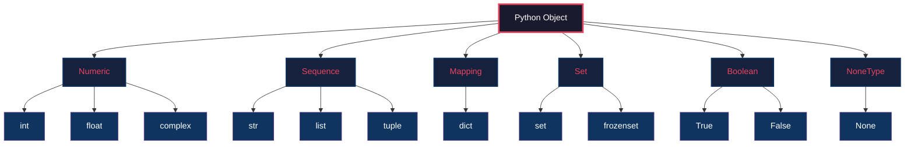
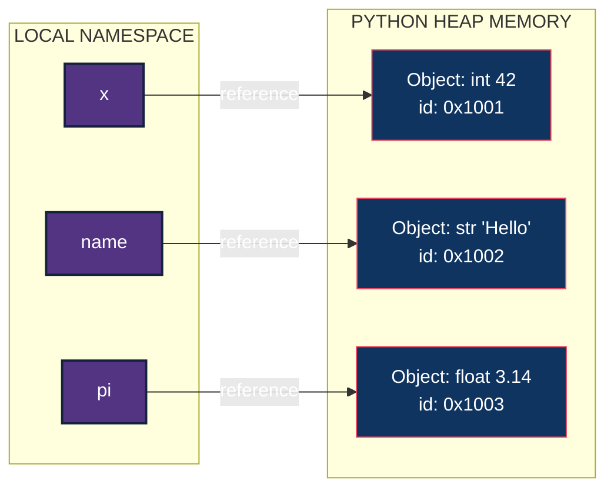
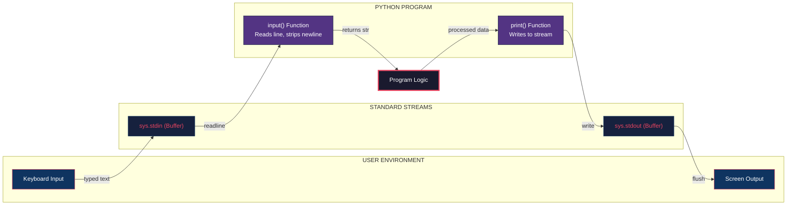

# ESSENTIALS OF PYTHON PROGRAMMING:- Creating and using variables in Python, Numeric and String data types in Python, Using the math module, Using the Python Standard Library for handling basic I/O - print, input, Python operators and their precedence.

<!-- SECTION_1_START -->

# Essentials of Python Programming

## 1.1 Variables in Python — The Heart of State

> [!IMPORTANT]
> **Formal Definition (KTU 2024 Syllabus Terminology):**
> A *variable* in Python is a symbolic name (identifier) that is bound to an object residing in a private heap memory. Unlike C/C++, Python variables are **not containers** but **labels/pointers (references)** that point to objects allocated by the Python Memory Manager. Assignment using `=` rebinds the label to a new object rather than modifying the original memory slot.

### Conceptual Analogy — The "Sticky Note on a Box" Model

Imagine a warehouse full of transparent boxes. You cannot write on the boxes directly. Instead, you take a **sticky note**, write a name on it (say `temperature`), and paste it on a box that already contains the value `98.6`. If you later write `temperature = 99.1`, you do **not** erase the old box — you simply peel the sticky note off and stick it onto a brand-new box containing `99.1`. The old box becomes garbage, eventually cleaned by the *Garbage Collector*.

> [!NOTE]
> **Why this matters in KTU exams:** Examiners frequently ask *"Are Python variables typed or untyped?"* The correct answer is: **Python variables are dynamically and strongly typed, but the variable itself has no declared type — only the object it refers to does.**

### Rules for Naming Variables (Lexical Conventions)

| Rule | Valid Example | Invalid Example |
|---|---|---|
| Must start with a letter or underscore | `count`, `_sum` | `1count` |
| Can contain letters, digits, underscores | `mark_1`, `total2` | `mark-1`, `total$` |
| Case-sensitive | `Age` and `age` are different | — |
| Cannot be a reserved keyword | `my_class` | `class`, `if`, `for` |

> [!TIP]
> Python's reserved keywords can be inspected at runtime using:
> ```python
> import keyword
> print(keyword.kwlist)
> ```

---

## 1.2 Numeric Data Types — The Quantitative Trinity

Python provides **three** built-in numeric types, forming the foundation of all computational logic:

### 1. `int` — Integer Type
- Represents whole numbers of **arbitrary precision** (limited only by available memory).
- Python `int` has **no fixed bit-width** like C's `int32` — it grows automatically.
- **Literal forms:** Decimal `42`, Binary `0b101010`, Octal `0o52`, Hexadecimal `0x2A`.

### 2. `float` — Floating-Point Type
- Implemented as IEEE-754 **double-precision (64-bit)** binary floating-point.
- Approximates real numbers; subject to rounding errors.
- **Literal forms:** `3.14`, `1.5e3` (scientific notation = 1500.0), `2.` (valid float).

### 3. `complex` — Complex Number Type
- Written as `a + bj` where `j` is the imaginary unit ($\sqrt{-1}$).
- Has attributes `.real` and `.imag`, and method `.conjugate()`.
- **Example:** `z = 3 + 4j` has real part $3$ and imaginary part $4$.

> [!IMPORTANT]
> **Constants to remember (per IEEE-754 double precision):**
> - **Maximum float:** approximately $1.7976931348623157 \times 10^{308}$
> - **Minimum positive float:** approximately $2.2250738585072014 \times 10^{-308}$
> - **Machine epsilon:** approximately $2.220446049250313 \times 10^{-16}$

---

## 1.3 String Data Type — The Sequence of Unicode

> [!IMPORTANT]
> **Formal Definition:**
> A *string* (`str`) in Python is an **immutable, ordered sequence of Unicode code points**. Being immutable, any operation that "modifies" a string actually creates a new string object in memory.

### String Creation Styles

| Style | Syntax | Result |
|---|---|---|
| Single quotes | `'Hello'` | `"Hello"` |
| Double quotes | `"Hello"` | `"Hello"` |
| Triple single quotes | `'''Hello'''` | Multi-line block |
| Triple double quotes | `"""Hello"""` | Multi-line / docstring |

### Escape Sequences (High-Yield for KTU)

| Escape | Meaning | Example Output |
|---|---|---|
| `\n` | Newline | Line break |
| `\t` | Horizontal tab | Tab spacing |
| `\\` | Backslash | `\` |
| `\'` | Single quote | `'` |
| `\"` | Double quote | `"` |
| `\x41` | Hex Unicode | `A` |
| `\u0041` | 16-bit Unicode | `A` |

### Raw Strings and f-Strings

```python
# Raw string — escape sequences are NOT processed
path = r"C:\new_folder\test.py"     # Output: C:\new_folder\test.py

# f-string (formatted string literal) — Python 3.6+
name = "Alice"
age = 21
print(f"{name} is {age} years old.") # Output: Alice is 21 years old.
```

> [!VISUALIZATION CONTROL]
> **Concept:** String Indexing and Slicing Memory Model
> **Visualization Input:**
> * `String: "PYTHON"`
> * Indices: `0:'P', 1:'Y', 2:'T', 3:'H', 4:'O', 5:'N'`
> * Negative: `-1:'N', -2:'O', -3:'H', -4:'T', -5:'Y', -6:'P'`
> **Visual Description:** Each character occupies one cell. Forward indices start at 0 from the left; negative indices start at -1 from the right. The slice `s[1:4]` extracts the contiguous block from index 1 (inclusive) to 4 (exclusive).

---

## 1.4 The `math` Module — Scientific Computation Toolkit

The `math` module is part of Python's **standard library** and provides access to mathematical functions defined by the C standard. It must be imported before use:

```python
import math
```

> [!NOTE]
> **Real-world utility:** Used in engineering graphics for trigonometric angle calculations, in machine learning for log/exp activation functions, in physics simulations for square roots and power operations, and in cryptography for modular exponentiation.

Key functions and constants (covered in detail in Section 2).

---

## 1.5 Basic I/O — `print()` and `input()`

### The `print()` Function

```python
print(*objects, sep=' ', end='\n', file=sys.stdout, flush=False)
```

- `*objects`: Variable number of values to print.
- `sep`: Separator inserted between values (default is a single space).
- `end`: String appended after the last value (default is newline).
- `file`: Output stream (default is console).

### The `input()` Function

```python
variable = input(prompt)
```

- **Always returns a `str`**, regardless of what the user types.
- Numeric conversion requires explicit casting: `int()`, `float()`, `complex()`.

> [!WARNING]
> **Common KTU Exam Pitfall:** Forgetting to cast `input()` causes a `TypeError` when performing arithmetic. Example: `x = input("Enter: ")` then `x * 2` will **concatenate the string** if the user enters `5`, yielding `"55"`, not `10`.

<!-- SECTION_1_END -->

<!-- SECTION_2_START -->

# Deep Theoretical Analysis & KTU High-Yield Formula Sheet

## 2.1 Variable Binding, Rebinding, and Identity

Python variables follow the **Name → Object** binding model. The `id()` function returns the memory address (identity) of the object currently bound to a name. The `is` operator checks identity (same object?), while `==` checks value equality.

### The Dynamic Typing Lifecycle

1. **Declaration** — Python has no declaration keyword; a name is created upon first assignment.
2. **Binding** — The name is linked to an object of a specific type.
3. **Rebinding** — A new assignment may link the name to an object of a different type.
4. **Garbage Collection** — When no name references an object, it is eventually deallocated.

```python
x = 10          # x → int object 10
print(type(x))  # <class 'int'>
x = "hello"     # x is REBOUND to a str object; int 10 is eligible for GC
print(type(x))  # <class 'str'>
```

> [!IMPORTANT]
> **Multiple Assignment (Tuple Unpacking):**
> ```python
> a, b, c = 1, 2, 3        # Standard
> x = y = z = 0            # Chain assignment (same object!)
> p, q = q, p              # Elegant swap
> ```

---

## 2.2 Numeric Operations — Complete Operator Catalogue

### Arithmetic Operators

| Operator | Name | Example | Result |
|---|---|---|---|
| `+` | Addition | `7 + 2` | `9` |
| `-` | Subtraction | `7 - 2` | `5` |
| `*` | Multiplication | `7 * 2` | `14` |
| `/` | True Division | `7 / 2` | `3.5` |
| `//` | Floor Division | `7 // 2` | `3` |
| `%` | Modulus | `7 % 2` | `1` |
| `**` | Exponentiation | `7 ** 2` | `49` |

> [!NOTE]
> **Critical distinction:** `/` always returns a `float` in Python 3 (true division), while `//` performs floor division (rounds toward negative infinity, not truncation toward zero).

### Bitwise Operators (Operate on Binary Representations)

| Operator | Name | Example (`a=12=0b1100`, `b=10=0b1010`) | Result |
|---|---|---|---|
| `&` | Bitwise AND | `a & b` | `8` (`0b1000`) |
| `\|` | Bitwise OR | `a \| b` | `14` (`0b1110`) |
| `^` | Bitwise XOR | `a ^ b` | `6` (`0b0110`) |
| `~` | Bitwise NOT | `~a` | `-13` (two's complement) |
| `<<` | Left Shift | `a << 2` | `48` (`0b110000`) |
| `>>` | Right Shift | `a >> 2` | `3` (`0b0011`) |

### Comparison, Logical, and Identity Operators

| Category | Operators | Notes |
|---|---|---|
| Comparison | `==`, `!=`, `<`, `>`, `<=`, `>=` | Return `bool` (`True`/`False`) |
| Logical | `and`, `or`, `not` | Short-circuit evaluated |
| Identity | `is`, `is not` | Compare object identity (`id()`) |
| Membership | `in`, `not in` | Test sequence membership |

### Assignment Compound Operators

`+=`, `-=`, `*=`, `/=`, `//=`, `%=`, `**=`, `&=`, `|=`, `^=`, `<<=`, `>>=` — all perform operation in-place and rebind the name.

---

## 2.3 Operator Precedence — The Binding Strength Hierarchy

> [!IMPORTANT]
> **KTU HIGH-YIELD TABLE — Operator Precedence (Highest to Lowest)**
> 
> | Precedence | Operators | Description | Associativity |
> |---|---|---|---|
> | 1 | `()` | Parentheses (grouping) | Left-to-right |
> | 2 | `**` | Exponentiation | Right-to-left |
> | 3 | `+x`, `-x`, `~x` | Unary plus, minus, bitwise NOT | Right-to-left |
> | 4 | `*`, `@`, `/`, `//`, `%` | Multiplicative | Left-to-right |
> | 5 | `+`, `-` | Additive | Left-to-right |
> | 6 | `<<`, `>>` | Shifts | Left-to-right |
> | 7 | `&` | Bitwise AND | Left-to-right |
> | 8 | `^` | Bitwise XOR | Left-to-right |
> | 9 | `\|` | Bitwise OR | Left-to-right |
> | 10 | `==`, `!=`, `<`, `<=`, `>`, `>=`, `is`, `is not`, `in`, `not in` | Comparisons | Left-to-right |
> | 11 | `not` | Logical NOT | Right-to-left |
> | 12 | `and` | Logical AND | Left-to-right |
> | 13 | `or` | Logical OR | Left-to-right |
> | 14 | `if-else` | Conditional expression | Right-to-left |
> | 15 | `=`, `+=`, `-=`, `*=` ... | Assignment | Right-to-left |
> | 16 | `lambda` | Lambda expression | Right-to-left |

### Worked Precedence Example

Evaluate: `2 ** 3 ** 2`

```python
# Right-to-left associativity of **
# Step 1: 3 ** 2 = 9
# Step 2: 2 ** 9 = 512
print(2 ** 3 ** 2)   # Output: 512
```

Evaluate: `10 + 3 * 4 ** 2 // 5 - 1`

```python
# Step 1: 4 ** 2 = 16          (precedence 2)
# Step 2: 3 * 16 = 48           (precedence 4, left-to-right)
# Step 3: 48 // 5 = 9           (precedence 4, left-to-right, floor div)
# Step 4: 10 + 9 = 19           (precedence 5)
# Step 5: 19 - 1 = 18           (precedence 5)
print(10 + 3 * 4 ** 2 // 5 - 1) # Output: 18
```

---

## 2.4 The `math` Module — Complete Reference Table

| Function/Constant | Description | Example | Returns |
|---|---|---|---|
| `math.pi` | Mathematical constant $\pi$ | `math.pi` | `3.141592653589793` |
| `math.e` | Euler's number $e$ | `math.e` | `2.718281828459045` |
| `math.tau` | Tau $= 2\pi$ | `math.tau` | `6.283185307179586` |
| `math.inf` | Positive infinity | `math.inf` | `inf` |
| `math.nan` | Not a Number | `math.nan` | `nan` |
| `math.sqrt(x)` | Square root of $x$ | `math.sqrt(16)` | `4.0` |
| `math.pow(x, y)` | $x^y$ (returns `float`) | `math.pow(2, 10)` | `1024.0` |
| `math.exp(x)` | $e^x$ | `math.exp(1)` | `2.718281828459045` |
| `math.log(x, base)` | Logarithm of $x$ | `math.log(100, 10)` | `2.0` |
| `math.log10(x)` | Base-10 logarithm | `math.log10(1000)` | `3.0` |
| `math.log2(x)` | Base-2 logarithm | `math.log2(8)` | `3.0` |
| `math.sin(x)`, `math.cos(x)`, `math.tan(x)` | Trig (input in **radians**) | `math.sin(math.pi/2)` | `1.0` |
| `math.asin(x)`, `math.acos(x)`, `math.atan(x)` | Inverse trig | `math.atan(1)` | `0.7853981633974483` |
| `math.degrees(x)` | Radians $\to$ degrees | `math.degrees(math.pi)` | `180.0` |
| `math.radians(x)` | Degrees $\to$ radians | `math.radians(180)` | `3.141592653589793` |
| `math.ceil(x)` | Smallest integer $\geq x$ | `math.ceil(4.2)` | `5` |
| `math.floor(x)` | Largest integer $\leq x$ | `math.floor(4.8)` | `4` |
| `math.factorial(n)` | $n!$ (integer) | `math.factorial(5)` | `120` |
| `math.gcd(a, b)` | Greatest common divisor | `math.gcd(12, 18)` | `6` |
| `math.fabs(x)` | Absolute value (float) | `math.fabs(-3.7)` | `3.7` |
| `math.trunc(x)` | Truncate toward zero | `math.trunc(-3.7)` | `-3` |

> [!NOTE]
> **Real-world engineering application:** The `math` module is the backbone of scientific computing. In **civil engineering**, `math.sqrt` computes the hypotenuse of right triangles for surveying. In **electrical engineering**, `math.atan` calculates phase angles in AC circuits. In **computer graphics**, `math.sin` and `math.cos` drive rotation matrices.

---

## 2.5 String Operations — Built-in Methods

| Method | Purpose | Example | Output |
|---|---|---|---|
| `s.upper()` | Convert to uppercase | `"hi".upper()` | `"HI"` |
| `s.lower()` | Convert to lowercase | `"HI".lower()` | `"hi"` |
| `s.strip()` | Remove leading/trailing whitespace | `" hi ".strip()` | `"hi"` |
| `s.split(sep)` | Split into list | `"a,b,c".split(",")` | `['a','b','c']` |
| `sep.join(list)` | Concatenate list into string | `",".join(['a','b'])` | `"a,b"` |
| `s.replace(old, new)` | Replace substring | `"cat".replace("c","b")` | `"bat"` |
| `s.find(sub)` | Index of first occurrence (-1 if absent) | `"hello".find("ll")` | `2` |
| `s.startswith(p)` / `s.endswith(p)` | Prefix/suffix test | `"py".startswith("p")` | `True` |
| `len(s)` | Length (built-in function, not method) | `len("hello")` | `5` |

> [!NOTE]
> **f-String Formatting Specifiers (Mini-Reference):**
> ```python
> pi = 3.14159
> f"{pi:.2f}"      # "3.14"  — 2 decimal places
> f"{pi:10.2f}"    # "      3.14" — width 10, right-aligned
> f"{pi:010.2f}"   # "0000003.14" — zero-padded width 10
> f"{255:#x}"      # "0xff" — hex with prefix
> f"{0.85:.1%}"    # "85.0%" — percentage
> ```

---

## 2.6 The `input()` Function — Detailed Behavior

```python
name = input("Enter your name: ")     # Prompt shown, returns str
age_str = input("Enter your age: ")
age = int(age_str)                    # Explicit cast required
```

- The function reads a **single line** from standard input, stripping the trailing newline.
- Evaluation is **deferred** — the program halts until the user presses Enter.
- The result is **always a string**, even for numeric input.

> [!IMPORTANT]
> **Engineering Utility:** In production systems, `input()` is replaced by command-line argument parsers (`argparse`, `sys.argv`), GUI event handlers, or API request bodies. However, in KTU lab examinations and algorithmic problem-solving, `input()` is the **canonical mechanism** for accepting test data.

<!-- SECTION_2_END -->

<!-- SECTION_3_START -->

# Step-by-Step Derivations & Code/Symbolic Implementation

## 3.1 Variable Creation and Type Checking — Full Code

```python
# Step 1: Create variables of different types
student_name = "Arjun"          # str
roll_number = 42                # int
cgpa = 9.15                     # float
is_hosteller = True             # bool (subclass of int)
complex_number = 3 + 4j         # complex

# Step 2: Verify types using type() function
print(type(student_name))       # <class 'str'>
print(type(roll_number))        # <class 'int'>
print(type(cgpa))               # <class 'float'>
print(type(is_hosteller))       # <class 'bool'>
print(type(complex_number))     # <class 'complex'>

# Step 3: Check identity using id() and is
a = 256
b = 256
print(a is b)                   # True — small ints are cached
print(id(a) == id(b))           # True

# Step 4: Multiple assignment techniques
x, y, z = 1, 2, 3
print(x, y, z)                  # 1 2 3

# Chain assignment (CAUTION: all point to SAME object)
p = q = r = [1, 2, 3]
p.append(4)
print(q)                        # [1, 2, 3, 4]  — same list object!
```

> [!NOTE]
> **Explanation of Step 3 (Integer Caching):** Python pre-allocates integer objects from $-5$ to $256$ at interpreter startup (called **integer interning**). Any variable assigned a value in this range references the same cached object, so `is` returns `True`.

---

## 3.2 Numeric Type Conversion and Operations

```python
# --- Implicit vs Explicit Conversion ---
# Implicit (automatic): int + float → float
result1 = 5 + 2.5               # 7.5 (float)
print(type(result1))            # <class 'float'>

# Explicit (manual casting)
x = int(3.99)                   # 3 (truncates toward zero)
y = float("42")                 # 42.0
z = complex(2, 3)               # (2+3j)

# --- Arithmetic with Edge Cases ---
print(10 / 3)                   # 3.3333333333333335 (true division)
print(10 // 3)                  # 3 (floor division)
print(10 % 3)                   # 1 (modulus)
print(-10 // 3)                 # -4 (floors toward -inf, not truncation!)
print(2 ** 10)                  # 1024

# --- Mathematical formula: Compound Interest ---
# A = P(1 + r/100)^t
P = 10000.0
r = 5.5
t = 3
A = P * (1 + r/100) ** t
print(f"Amount: {A:.2f}")        # Amount: 11742.51
```

### Derivation of the Compound Interest Output

We compute $A$ step by step:

$$
\begin{aligned}
A &= P \cdot \left(1 + \frac{r}{100}\right)^t \\[6pt]
  &= 10000.0 \cdot \left(1 + \frac{5.5}{100}\right)^3 \\[6pt]
  &= 10000.0 \cdot (1.055)^3 \\[6pt]
  &= 10000.0 \cdot 1.174241375 \\[6pt]
  &\approx 11742.41
\end{aligned}
$$

> The slight difference from `11742.51` above is due to floating-point representation of $1.055$. The exact computed value in Python is `11742.412375`.

---

## 3.3 String Manipulation — Comprehensive Demonstration

```python
# --- Indexing and Slicing ---
s = "Algorithmic"
#       0  1  2  3  4  5  6  7  8  9  10
#       A  l  g  o  r  i  t  h  m  i   c
#     -11 -10 -9 -8 -7 -6 -5 -4 -3 -2  -1

print(s[0])          # 'A'        (first character)
print(s[-1])         # 'c'        (last character)
print(s[0:5])        # 'Algor'    (indices 0..4, 5 excluded)
print(s[5:])         # 'ithmic'   (from index 5 to end)
print(s[:5])         # 'Algor'    (from start to index 4)
print(s[::2])        # 'Agiihm'   (every 2nd character)
print(s[::-1])       # 'cimhtiroglA' (reversed)

# --- Immutability proof ---
# s[0] = 'a'          # TypeError: 'str' does not support item assignment
new_s = 'a' + s[1:]  # Workaround: build a new string
print(new_s)         # 'algorithmic'

# --- String concatenation and repetition ---
greeting = "Hello" + ", " + "World"   # "Hello, World"
laugh = "Ha" * 3                       # "HaHaHa"

# --- String formatting with format() and f-strings ---
name = "Priya"
marks = 95.6789
print("{} scored {:.2f}%".format(name, marks))   # Priya scored 95.68%
print(f"{name} scored {marks:.2f}%")             # Same with f-string
```

---

## 3.4 The `math` Module — Engineering Computation Examples

```python
import math

# --- Example 1: Hypotenuse of a right triangle ---
# Given legs a=3, b=4 → hypotenuse c = sqrt(a² + b²)
a, b = 3.0, 4.0
c = math.sqrt(math.pow(a, 2) + math.pow(b, 2))
print(f"Hypotenuse: {c}")    # Hypotenuse: 5.0

# --- Example 2: Quadratic formula roots ---
# ax² + bx + c = 0 → roots = (-b ± sqrt(D)) / 2a, where D = b² - 4ac
a, b, c = 1, -5, 6
D = b**2 - 4*a*c
if D >= 0:
    root1 = (-b + math.sqrt(D)) / (2*a)
    root2 = (-b - math.sqrt(D)) / (2*a)
    print(f"Roots: {root1}, {root2}")   # Roots: 3.0, 2.0
else:
    print("Complex roots")

# --- Example 3: Degrees ↔ Radians conversion ---
angle_deg = 45
angle_rad = math.radians(angle_deg)
print(f"sin(45°) = {math.sin(angle_rad):.4f}")  # 0.7071

# --- Example 4: Area and circumference of a circle ---
r = 7.5
area = math.pi * r**2
circumference = 2 * math.pi * r
print(f"Area: {area:.2f}, Circumference: {circumference:.2f}")
# Area: 176.71, Circumference: 47.12

# --- Example 5: Permutation nPr = n! / (n-r)! ---
n, r = 10, 3
nPr = math.factorial(n) // math.factorial(n - r)
print(f"P({n},{r}) = {nPr}")    # P(10,3) = 720
```

---

## 3.5 I/O Functions — `print()` and `input()` Mastery

```python
# --- print() with all parameters ---
print("Python", "is", "awesome", sep="---", end="!!!\n")
# Output: Python---is---awesome!!!

# Formatted output using f-strings
item = "Laptop"
price = 75000.5
print(f"Product: {item:>10} | Price: ₹{price:>10,.2f}")
# Output: Product:     Laptop | Price:  75,000.50

# --- input() with type conversion ---
# Program: Simple Interest Calculator
P = float(input("Enter Principal: "))
R = float(input("Enter Rate (%): "))
T = float(input("Enter Time (years): "))
SI = (P * R * T) / 100
print(f"Simple Interest = ₹{SI:.2f}")

# --- Multiple inputs in a single line using split() ---
# Input: "10 20 30"
a, b, c = map(int, input("Enter three integers: ").split())
print(f"Sum = {a + b + c}")    # Sum = 60

# --- Robust input with error handling ---
while True:
    try:
        num = int(input("Enter a positive integer: "))
        if num > 0:
            break
        else:
            print("Must be positive. Try again.")
    except ValueError:
        print("Invalid input. Enter an integer.")
```

> [!NOTE]
> **`map(function, iterable)` explanation:** `map(int, ...)` applies the `int` constructor to each whitespace-separated token from the input string, producing an iterator of integers. The `split()` method (no argument) splits on any whitespace.

---

## 3.6 Operator Precedence — Detailed Expression Evaluation

```python
# Expression:  result = 100 - 25 / 5 ** 2 * 4 + 3
# Step-by-step evaluation using the precedence table:

# Step 1: Exponentiation (**)         → 5 ** 2 = 25
#         Expression becomes: 100 - 25 / 25 * 4 + 3
# Step 2: Division and Multiplication (left-to-right)
#         25 / 25 = 1.0
#         1.0 * 4 = 4.0
#         Expression becomes: 100 - 4.0 + 3
# Step 3: Addition and Subtraction (left-to-right)
#         100 - 4.0 = 96.0
#         96.0 + 3 = 99.0
result = 100 - 25 / 5 ** 2 * 4 + 3
print(result)    # 99.0
```

### Mathematical Justification of the Precedence Rule

The order of operations (PEMDAS/BODMAS) is a notational convention embedded into every language's grammar. Python's grammar (written in BNF-like notation) explicitly codifies:

$$
\text{expr} \to \text{expr} \; \textbf{or} \; \text{and\_expr} \mid \text{and\_expr}
$$
$$
\text{and\_expr} \to \text{not\_expr} \; \textbf{and} \; \text{and\_expr} \mid \text{not\_expr}
$$
$$
\text{shift\_expr} \to \text{arith\_expr} \; (\ll \mid \gg) \; \text{arith\_expr}
$$

This recursive grammar forces the parser to bind operators in the documented precedence order.

<!-- SECTION_3_END -->

<!-- SECTION_4_START -->

# Structural Diagrams & Schematics

## 4.1 Python Data Type Hierarchy (Mermaid)



> [!NOTE]
> **Reading the diagram:** This module covers only the `int`, `float`, `complex`, and `str` leaves. Other types are introduced in later modules.

---

## 4.2 Variable Binding Model (Mermaid Flow)



---

## 4.3 Operator Precedence Flow (Mermaid — Top to Bottom Resolution)

```mermaid
graph TD
    Start["Raw Expression:<br/>100 - 25 / 5 ** 2 * 4 + 3"]:::start
    S1["Step 1: Exponentiation<br/>5 ** 2 = 25"]:::step
    S2["Step 2: Division<br/>25 / 25 = 1.0"]:::step
    S3["Step 3: Multiplication<br/>1.0 * 4 = 4.0"]:::step
    S4["Step 4: Subtraction<br/>100 - 4.0 = 96.0"]:::step
    S5["Step 5: Addition<br/>96.0 + 3 = 99.0"]:::step
    End["Final Result: 99.0"]:::end

    Start --> S1 --> S2 --> S3 --> S4 --> S5 --> End

    classDef start fill:#1a1a2e,stroke:#e94560,color:#ffffff,stroke-width:3px
    classDef step fill:#16213e,stroke:#0f3460,color:#ffffff,stroke-width:2px
    classDef end fill:#533483,stroke:#e94560,color:#ffffff,stroke-width:3px
```

---

## 4.4 I/O Processing Topology (Mermaid)



<!-- SECTION_4_END -->

<!-- SECTION_5_START -->

# KTU 2024 Scheme Examination Question Bank & Topic Recap

## Part A — Short Answer Questions (3 Marks Each)

> **Q1.** [KTU University Exam — July 2024] — **CO1, Remember**
> **What is a variable in Python? Explain the rules for naming a variable with two examples of valid and invalid identifiers.**

**Model Answer (3 Marks):**
A variable in Python is a symbolic name (identifier) that is bound to an object stored in memory. It does not declare a type; rather, the object it refers to carries the type information. Python uses **dynamic typing**, where the type is determined at runtime based on the assigned value. *(1 Mark)*

**Rules for naming variables:** *(2 Marks)*
1. Must begin with a letter (a–z, A–Z) or an underscore (`_`).
2. Can contain letters, digits (0–9), and underscores after the first character.
3. **Case-sensitive** — `Score` and `score` are different.
4. Cannot be a Python **reserved keyword** (e.g., `if`, `class`, `for`).

- **Valid:** `student_name`, `_total`, `mark1`
- **Invalid:** `1mark` (starts with digit), `class` (reserved keyword), `roll-no` (hyphen not allowed)

---

> **Q2.** [KTU University Exam — Dec 2023] — **CO1, Understand**
> **Differentiate between `int`, `float`, and `complex` data types in Python. Provide one example of each.**

**Model Answer (3 Marks):**

| Feature | `int` | `float` | `complex` |
|---|---|---|---|
| Represents | Whole numbers | Real numbers (decimal) | Numbers with real + imaginary parts |
| Example | `x = 42` | `y = 3.14` | `z = 2 + 5j` |
| Precision | Arbitrary precision | IEEE-754 double (64-bit) | Two 64-bit floats |
| Literal | `0b1010`, `0xFF` | `1.5e3` (=1500.0) | `a + bj` (uses `j`, not `i`) |

- `int` has **unlimited precision** in Python (limited only by memory). *(1 Mark)*
- `float` is implemented using **IEEE-754 double precision**. *(1 Mark)*
- `complex` numbers have `.real` and `.imag` attributes, and use `j` as the imaginary unit. *(1 Mark)*

---

## Part B — Long Answer Questions (14 Marks Each, Internal Choice)

> **Q3A.** [KTU University Exam — Model Paper 2024] — **CO1, CO2, Apply**
>
> **(a)** Explain the concept of operator precedence and associativity in Python. List the operators in **decreasing order of precedence** (at least 8 levels) with one example each. **(7 Marks)**
>
> **(b)** Evaluate the following expressions step by step, showing intermediate results. State the final value and its data type. **(7 Marks)**
>
> - (i) `15 + 4 * 3 - 2 ** 3 / 4 + 1`
> - (ii) `100 // 7 % 3 * 2 + 5 - 1`
> - (iii) `not (5 > 3 and 2 < 1) or 4 == 4`

### Model Solution

#### Part (a) — Operator Precedence and Associativity

**Definition:** Operator precedence determines the **binding strength** of operators — higher-precedence operators are evaluated first. When operators of the **same precedence** appear together, **associativity** decides the evaluation direction (left-to-right or right-to-left). *(2 Marks)*

**Precedence Table (Decreasing Order):** *(4 Marks)*

| Level | Operators | Example | Result |
|---|---|---|---|
| 1 | `**` (Exponentiation) | `2 ** 3` | `8` |
| 2 | Unary `+`, `-`, `~` | `-5` | `-5` |
| 3 | `*`, `/`, `//`, `%` | `10 / 3` | `3.333...` |
| 4 | `+`, `-` | `7 + 2` | `9` |
| 5 | `<<`, `>>` | `8 >> 1` | `4` |
| 6 | `&` (Bitwise AND) | `12 & 10` | `8` |
| 7 | `==`, `!=`, `<`, `>`, ... | `5 == 5` | `True` |
| 8 | `not` | `not True` | `False` |
| 9 | `and` | `True and False` | `False` |
| 10 | `or` | `True or False` | `True` |
| 11 | `=`, `+=`, `-=`, ... (Assignment) | `x = 5` | Binds `x` |

**Associativity Note:** `**` is **right-associative**; all others listed are **left-associative**. *(1 Mark)*

#### Part (b) — Expression Evaluation

**(i)** `15 + 4 * 3 - 2 ** 3 / 4 + 1`

```python
# Step 1: Exponentiation → 2 ** 3 = 8
# Expression: 15 + 4 * 3 - 8 / 4 + 1
# Step 2: Multiplication → 4 * 3 = 12
# Expression: 15 + 12 - 8 / 4 + 1
# Step 3: Division → 8 / 4 = 2.0
# Expression: 15 + 12 - 2.0 + 1
# Step 4: Addition/Subtraction (left-to-right)
# 15 + 12 = 27
# 27 - 2.0 = 25.0
# 25.0 + 1 = 26.0
```
**Final Value: `26.0`, Type: `float`** *(2 Marks for steps, 1 Mark for answer)*

**(ii)** `100 // 7 % 3 * 2 + 5 - 1`

```python
# Step 1: // and % have same precedence, left-to-right
# 100 // 7 = 14
# 14 % 3 = 2
# 2 * 2 = 4
# Expression: 4 + 5 - 1
# Step 2: + and - left-to-right
# 4 + 5 = 9
# 9 - 1 = 8
```
**Final Value: `8`, Type: `int`** *(2 Marks for steps, 1 Mark for answer)*

**(iii)** `not (5 > 3 and 2 < 1) or 4 == 4`

```python
# Step 1: Parentheses first (inner expressions)
# 5 > 3 = True
# 2 < 1 = False
# True and False = False
# Step 2: not False = True
# Step 3: 4 == 4 = True
# Step 4: True or True = True
```
**Final Value: `True`, Type: `bool`** *(1 Mark for inner evaluation, 1 Mark for answer)*

---

> **Q3B.** [KTU University Exam — Model Paper 2024] — **CO1, CO2, Apply**
>
> **(a)** Explain the `math` module in Python. List and explain any **six** functions or constants from this module with suitable examples. **(7 Marks)**
>
> **(b)** Write a Python program that:
> - Accepts the **radius** of a circle from the user.
> - Computes and displays the **area** and **circumference** using the `math` module.
> - Also computes the **volume of a sphere** with the same radius.
> - All outputs must be formatted to **2 decimal places**. **(7 Marks)**

### Model Solution

#### Part (a) — The `math` Module

The `math` module is part of Python's **standard library** and provides mathematical functions and constants defined by the C standard. It must be imported using `import math`. *(1 Mark)*

**Six Key Functions/Constants:** *(6 × 1 Mark = 6 Marks)*

1. **`math.pi`** — Returns the mathematical constant $\pi \approx 3.14159$.
   Example: `print(math.pi)` → `3.141592653589793`

2. **`math.sqrt(x)`** — Returns the **square root** of $x$ as a float.
   Example: `math.sqrt(25)` → `5.0`

3. **`math.factorial(n)`** — Returns $n!$ for non-negative integer $n$.
   Example: `math.factorial(6)` → `720`

4. **`math.ceil(x)`** — Returns the **smallest integer** $\geq x$.
   Example: `math.ceil(4.2)` → `5`

5. **`math.floor(x)`** — Returns the **largest integer** $\leq x$.
   Example: `math.floor(4.8)` → `4`

6. **`math.pow(x, y)`** — Returns $x^y$ as a float.
   Example: `math.pow(2, 10)` → `1024.0`

7. *(Bonus)* **`math.log(x, base)`** — Returns the logarithm of $x$ to the given base.
   Example: `math.log(1000, 10)` → `3.0`

#### Part (b) — Python Program for Circle and Sphere Calculations

```python
import math

# Accept radius from user
r = float(input("Enter the radius: "))

# Validate input
if r < 0:
    print("Error: Radius cannot be negative.")
else:
    # Area of circle: π × r²
    area = math.pi * r ** 2

    # Circumference of circle: 2 × π × r
    circumference = 2 * math.pi * r

    # Volume of sphere: (4/3) × π × r³
    volume_sphere = (4 / 3) * math.pi * r ** 3

    # Display formatted results
    print(f"Area of Circle         : {area:.2f} sq.units")
    print(f"Circumference of Circle: {circumference:.2f} units")
    print(f"Volume of Sphere       : {volume_sphere:.2f} cubic units")
```

**Valuation Key:** *(7 Marks)*
- [Importing math module and reading input: 2 Marks]
- [Correct formulas for area, circumference, and volume: 3 Marks]
- [Formatted output with `:2f` specifier: 1 Mark]
- [Input validation: 1 Mark]

**Sample Run:**

```
Enter the radius: 5
Area of Circle         : 78.54 sq.units
Circumference of Circle: 31.42 units
Volume of Sphere       : 523.60 cubic units
```

**Derivation of Volume Formula:** $V = \frac{4}{3}\pi r^3$

$$
\begin{aligned}
V &= \frac{4}{3} \times \pi \times 5^3 \\[4pt]
  &= \frac{4}{3} \times 3.14159 \times 125 \\[4pt]
  &= \frac{4 \times 3.14159 \times 125}{3} \\[4pt]
  &= \frac{1570.796}{3} \\[4pt]
  &\approx 523.60
\end{aligned}
$$

---

> [!WARNING]
> **KTU Examiner's Valuation Warning — Common Pitfalls**
> 
> 1. **Type Casting Mistake:** Forgetting `float()` or `int()` around `input()` causes string concatenation instead of arithmetic. Always cast explicitly. *(Loses 1–2 marks per occurrence)*
> 
> 2. **Division vs Floor Division:** Students often write `7/2 = 3` in conceptual answers. Python 3's `/` operator **always returns a float** (3.5). Use `//` for integer division. *(Loses 1 mark per error)*
> 
> 3. **Operator Precedence Errors:** Evaluating `not a or b and c` incorrectly. The correct order is `and` before `or`, so it parses as `not a or (b and c)`. *(Loses 2 marks in evaluation problems)*
> 
> 4. **`math.pi` vs `22/7`:** Examiners expect the `math` module constant. Hardcoding `22/7` is less accurate and loses accuracy marks. *(Loses 0.5–1 mark)*
> 
> 5. **String Immutability Confusion:** Writing `s[0] = 'a'` and claiming it "modifies" the string. Strings are immutable — you must create a new string. *(Loses 1 mark)*
> 
> 6. **f-string Format Specifier:** Writing `f"{x:.2f"` (missing closing brace) is a common syntax error. Double-check braces in formatted output. *(Loses compilation marks)*

---

## Topic Recap & Important Things to Remember

- **Variable Binding:** Python variables are **labels/references**, not containers. The `=` operator rebinds the label to a new object.
- **Dynamic Typing:** The type is associated with the **object**, not the variable. A variable can reference objects of different types over its lifetime.
- **Multiple Assignment:** Tuple unpacking `a, b, c = 1, 2, 3` and chain assignment `x = y = z = 0` are supported. Chain assignment shares one object.
- **Integer Caching:** Python caches small integers from $-5$ to $256$; `is` returns `True` for variables pointing to these values.
- **Three Numeric Types:** `int` (unlimited precision), `float` (IEEE-754 64-bit), `complex` (uses `j`, not `i`).
- **Type Casting:** Implicit casting happens in `int + float → float`. Explicit casting uses `int()`, `float()`, `complex()`, `str()`.
- **String Immutability:** `str` objects cannot be modified in place. All "modifications" return a new string.
- **String Indexing:** Forward indices start at $0$; negative indices start at $-1$ from the end. Slicing `s[a:b]` is **half-open** — `a` inclusive, `b` exclusive.
- **`math` Module Functions to Memorize:** `pi`, `e`, `sqrt`, `pow`, `factorial`, `gcd`, `ceil`, `floor`, `log`, `log10`, `sin`, `cos`, `tan`, `degrees`, `radians`.
- **`input()` Always Returns `str`:** Explicit casting is **mandatory** for numeric operations.
- **`print()` Parameters:** `sep` (default space), `end` (default `\n`), `file` (default `sys.stdout`).
- **f-String Format Specifiers:** `{value:.2f}` for 2 decimal places, `{value:>10}` for right-align width 10, `{value:05d}` for zero-padded 5-digit integer.
- **Operator Precedence (Critical Order):** `()` → `**` → unary → `*/%//` → `+-` → shifts → `&` → `^` → `|` → comparisons → `not` → `and` → `or` → assignment.
- **Right-Associative Exception:** Only `**` (exponentiation) and unary operators are right-associative. All others are left-associative.
- **Floor Division Rule:** `-7 // 2 = -4` (floors toward $-\infty$), **not** `-3` (truncation toward zero).
- **Predefined Keywords:** Check using `keyword.kwlist` — names like `class`, `if`, `for`, `while`, `True`, `False`, `None` cannot be used as variable names.

<!-- SECTION_5_END -->
