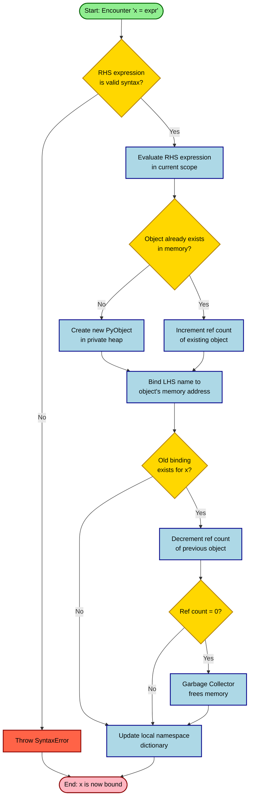
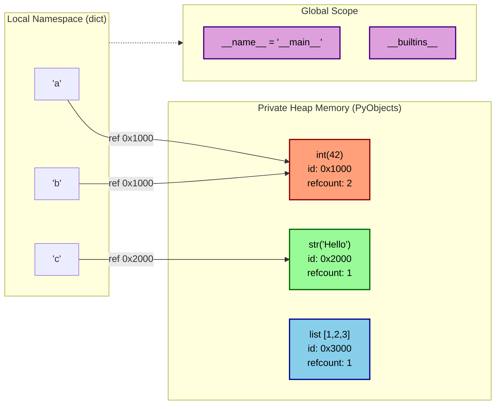
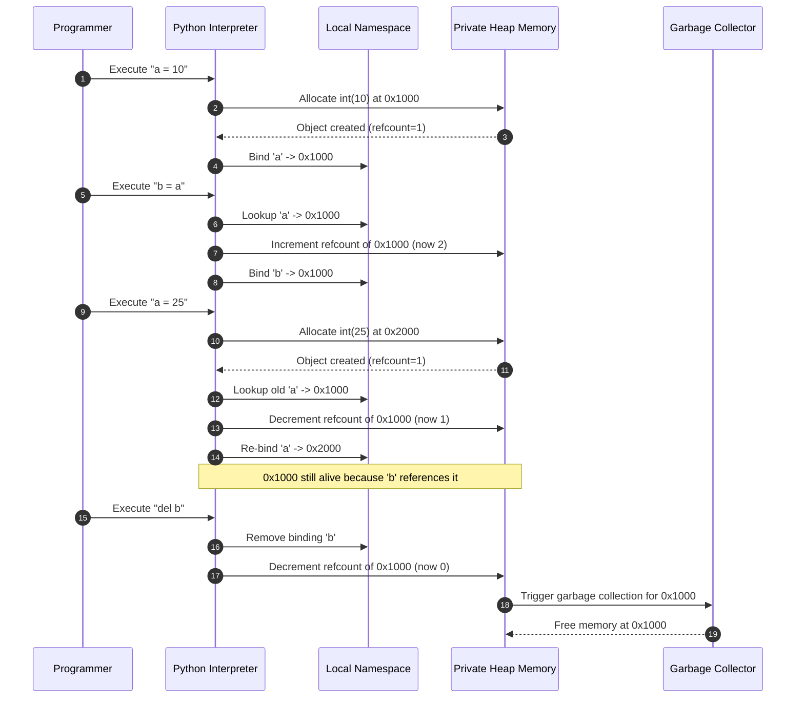

# ESSENTIALS OF PYTHON PROGRAMMING:- Creating and using variables in Python

<!-- SECTION_1_START -->
# ESSENTIALS OF PYTHON PROGRAMMING: CREATING AND USING VARIABLES

## 1. Core Technical Definition

In the **KTU 2024 Scheme (UCEST105 - Algorithmic Thinking with Python)** context, a **variable** in Python is formally defined as a **symbolic name (identifier)** that serves as a **reference (pointer) to an object** stored in a private heap memory managed by the Python Memory Manager. Unlike C or C++ where a variable is a memory location, in Python, a variable is a **name bound to an object on the right-hand side of an assignment statement**.

> [!IMPORTANT]
> **KTU Board Definition (Recall-Ready):**
> *A variable in Python is a label/name that refers to a value stored in memory. It does not store the value itself; rather, it points to the memory address where the actual object resides.*

### Formal Assignment Syntax

The general grammar of variable creation follows the **assignment statement** rule:

$$\text{variable\_name} \; \texttt{=} \; \text{expression}$$

Where the right-hand side (RHS) `expression` is evaluated first to produce an object, and the left-hand side (LHS) `variable_name` is then bound to that object via the `=` (assignment) operator.

> [!NOTE]
> **Key Highlight:** The single equals sign `=` in Python is the **assignment operator**, NOT the mathematical equality operator. Equality testing uses the double equals `==` operator.

---

## 2. Conceptual Analogy / Intuition

Imagine a **whiteboard in a classroom** with sticky notes attached to it:

- The **sticky note label** (e.g., "Roll No. 24") is the **variable name**.
- The **whiteboard space** where the note is stuck is the **memory address**.
- The **information written on the board** behind the note (e.g., "Aparna, 2024-CSE") is the **object/value**.

If you peel off the sticky note and stick it on a different section of the whiteboard (re-assignment), the name now points to a new value, but the old value is untouched. If no other sticky note refers to the old value, Python's **Garbage Collector** eventually erases it.

### Real-World Analogy: The Labelled Jar

| Element | Python Counterpart | Real-World Item |
| :--- | :--- | :--- |
| **Variable Name** | `student_count` | Label on a jar ("Sugar") |
| **Value/Object** | `42` | The sugar inside the jar |
| **Memory Address** | Hexadecimal ID `0x7f9a` | Physical location on the shelf |
| **Type** | `<class 'int'>` | Material of the jar (glass, plastic) |
| **Reassignment** | `student_count = 50` | Repurposing the jar for "Salt" |

> [!TIP]
> Think of variables as **labels you can stick on any object**, not as fixed boxes. This is why Python variables are called *first-class references*.

---

## 3. Physical Constants & Standard Metrics

While Python variables do not require explicit type declarations, the following **PEP 8 Style Guide constants** and **language standards** are mandatory reference values:

- **MAXIMUM IDENTIFIER LENGTH:** Practically unlimited, but PEP 8 recommends **79 characters** per line.
- **CASE-SENSITIVITY THRESHOLD:** Python identifiers are **100% case-sensitive** (`Age` and `age` are different).
- **STANDARD UNDERSCORE CONVENTION:** A leading single underscore `_var` indicates a private/internal use variable.
- **DOUBLE UNDERSCORE DUNDER:** Names wrapped in double underscores like `__init__` are **dunder (magic) methods** used by Python internally.
- **INTEGER WORD SIZE (CPython 3.11+):** Arbitrary precision (no fixed bit-width), unlike C's 32-bit `int`.

> [!WARNING]
> **`MAX_VALUE` and `MIN_VALUE` are NOT reserved in Python.** There are no true constants in Python; programmers use the **SCREAMING_SNAKE_CASE** naming convention to signal intent (e.g., `PI = 3.14159`).

---

## 4. Visualization & GeoGebra Integration

Since variables are a memory-mapped concept, a coordinate plot can be used to demonstrate **how values change over time during sequential assignment** — a critical concept for KTU algorithmic tracing questions.

> [!VISUALIZATION CONTROL]
> **Concept:** Sequential Variable State Tracing
> **GeoGebra / Desmos Input Equations:**
>
> * `x_0 = 10` (initial state at step 0)
> * `x_1 = x_0 + 5 = 15` (state at step 1)
> * `x_2 = x_1 \cdot 2 = 30` (state at step 2)
> * `x_3 = x_2 - 8 = 22` (state at step 3)
>
> **Visual Description:** Plot the points $(0, 10)$, $(1, 15)$, $(2, 30)$, $(3, 22)$ on a Cartesian plane where the X-axis represents **program execution steps** and the Y-axis represents the **current value of variable $x$**. Connect them with line segments to visualize the dynamic mutation of a single variable.

<!-- SECTION_1_END -->

<!-- SECTION_2_START -->
# DEEP THEORETICAL ANALYSIS & KTU HIGH-YIELD FORMULA SHEET

## 1. Anatomy of a Valid Python Identifier

A **valid identifier** (variable name) must obey the following rules mandated by the Python Language Reference (Section 2.3):

### Rule 1: Allowed Characters
The first character MUST be a letter (A-Z or a-z) or an **underscore** `_`. Subsequent characters can be letters, digits (0-9), or underscores.

### Rule 2: Forbidden First Characters
A variable name **CANNOT** start with a **digit** (e.g., `2nd_value` is invalid).

### Rule 3: Reserved Words Prohibition
Python's **33 reserved keywords** cannot be used as identifiers. Examples include `if`, `else`, `for`, `while`, `def`, `class`, `return`, `True`, `False`, `None`, `import`, `lambda`, `pass`, `break`, `continue`, `global`, `nonlocal`, `yield`, etc.

### Rule 4: Case Sensitivity
`Total`, `total`, and `TOTAL` are three completely distinct identifiers in Python's namespace.

### Rule 5: Unicode Support (Python 3+)
Identifiers may contain Unicode letters beyond ASCII, e.g., `résumé` is valid, but PEP 8 strongly discourages this for English-codebases.

---

## 2. The Variable Assignment Lifecycle (5-Step Process)

Every time a Python statement of the form `LHS = RHS` is executed, the interpreter follows a **strict 5-step protocol**:

1. **Evaluate RHS:** The right-hand side expression is evaluated first. If it contains function calls or operators, those are executed to produce a result object.
2. **Object Creation:** A new object of the appropriate type is created in the private heap memory. The object's reference count is initialized to 1.
3. **Type Inference:** The object's `type()` is automatically inferred. Python is **dynamically typed** — no prior declaration needed.
4. **Binding:** The LHS name is created (or overwritten) in the current namespace and bound to the memory address of the RHS object.
5. **Reference Count Increment:** The object's reference count is incremented. If an old object was previously bound to this name and no other references exist, its count drops to 0, triggering **garbage collection**.

> [!IMPORTANT]
> **Memory Model Insight:** In CPython, you can inspect the actual memory address using the built-in `id()` function, which returns the hexadecimal address of the underlying PyObject.

---

## 3. Types of Variable Assignment Operations

### A. Simple (Single) Assignment
The most basic form: one variable, one value.
```python
count = 10
name = "KTU"
```

### B. Multiple Assignment (Tuple Unpacking)
Python allows simultaneous assignment of multiple variables in a single statement:
```python
a, b, c = 1, 2, 3
x, y = y, x   # Classic swap without a temp variable!
```

### C. Chained Assignment
The same object reference is shared across multiple names:
```python
x = y = z = 0
```

### D. Augmented Assignment
Compound operators that modify in-place:
```python
total += 5      # Equivalent to: total = total + 5
counter -= 1    # Equivalent to: counter = counter - 1
```

### E. Sequence Unpacking with `*` (Extended Iterable Unpacking)
```python
first, *middle, last = [10, 20, 30, 40, 50]
# first=10, middle=[20, 30, 40], last=50
```

---

## 4. Dynamic Typing & Mutability

A variable in Python has **no fixed type**. The type belongs to the **object**, not the name. The same variable can be rebound to objects of different types during program execution.

- **Immutable Objects:** `int`, `float`, `str`, `tuple`, `frozenset`, `bool` — rebinding creates a new object.
- **Mutable Objects:** `list`, `dict`, `set`, `bytearray` — modifications happen in-place at the same memory address.

---

## 5. KTU Formula Sheet / Cheat Sheet

| Concept | Syntax / Rule | Example | Notes |
| :--- | :--- | :--- | :--- |
| **Variable Declaration** | `name = value` | `age = 20` | No `var`/`let`/`int` keyword needed |
| **Type Inference** | Automatic | `x = 3.14` → `float` | Determined at runtime |
| **Type Checking** | `type(x)` | `type(age)` → `int` | Built-in function |
| **Memory Address** | `id(x)` | `id(age)` → `140234567` | Returns CPython memory ID |
| **Constant Convention** | `UPPERCASE_NAME` | `PI = 3.14159` | Enforced by convention only |
| **Multiple Assignment** | `a, b = 1, 2` | Swap without temp | Tuple unpacking |
| **Chained Assignment** | `a = b = c = 0` | All refer to same `int(0)` | Shared reference |
| **Augmented Assign** | `x += y` | `count += 1` | In-place for mutable types |
| **Delete Variable** | `del x` | Removes binding | Raises `NameError` if missing |
| **String Naming Rule** | Letters, digits, `_` | `my_var_1` | Cannot start with digit |
| **Reserved Words** | 33 keywords blocked | `class`, `if`, `def` | Use `keyword.kwlist` to list |
| **Global Declaration** | `global x` | Required to modify in nested scope | Otherwise creates local binding |
| **Nonlocal Declaration** | `nonlocal x` | For enclosing (non-global) scope | Used in closures |
| **Truthy/Falsy Check** | `bool(x)` | `bool(0)` → `False` | `0`, `""`, `[]` are Falsy |
| **Input Assignment** | `x = input()` | Returns `str` always | Cast via `int()`/`float()` |

> [!CAUTION]
> **KTU Common Pitfall:** `x = input("Enter: ")` always returns a **string**, even if the user types a number. Use `x = int(input("Enter: "))` for numeric input.

---

## 6. Real-World Engineering Utility

In **production-grade software engineering**, Python variables and their dynamic typing enable:

- **Machine Learning Pipelines:** Variables bound to NumPy arrays, Pandas DataFrames, and PyTorch Tensors serve as references to massive tensor objects in heap memory, enabling efficient data flow without copying.
- **Web Backends (Django/Flask):** Route handlers bind request data to local variables like `user_id = request.GET['id']`, which are then passed to database query functions.
- **Embedded IoT Scripting (MicroPython):** Variables bound to GPIO pin readings (`sensor_value = adc.read()`) are polled in real-time loops.
- **Algorithmic Problem Solving:** Tracing variable state changes forms the foundation of **dry-run evaluations** — a mandatory skill for KTU ESE algorithm questions.

<!-- SECTION_2_END -->

<!-- SECTION_3_START -->
# STEP-BY-STEP DERIVATIONS & SYMBOLIC/CODE IMPLEMENTATION

## 1. Exhaustive Variable Creation Walkthrough

Let us derive the **complete internal state** of Python at every step of the following program. This is the *exact* style of KTU ESE dry-run questions.

### Source Code
```python
a = 10
b = a
a = 25
print(a, b)
```

### Step-by-Step Derivation

**Step 1: Execution of `a = 10`**
- RHS expression `10` is evaluated. Python creates a **new integer object** `10` in heap memory at address `0x1000`.
- Variable name `a` is registered in the **local namespace** (a dictionary maintained internally).
- The namespace entry becomes: `{'a': <int object at 0x1000>}`.
- Reference count of `int(10)` becomes **1**.

**Step 2: Execution of `b = a`**
- RHS expression `a` is evaluated. Python looks up `a` in the namespace, finds the object at `0x1000`.
- The **object at `0x1000` is NOT copied**. Instead, `b` is bound to the same address.
- Reference count of `int(10)` increments to **2** (both `a` and `b` point to it).
- Namespace: `{'a': 0x1000, 'b': 0x1000}`.

**Step 3: Execution of `a = 25`**
- RHS expression `25` is evaluated. A new integer object `25` is created at `0x2000`.
- The binding of `a` is **overwritten** to point to `0x2000`.
- Reference count of `int(10)` decrements from **2 → 1** (only `b` still references it). Since count is non-zero, garbage collection does NOT occur.
- Namespace: `{'a': 0x2000, 'b': 0x1000}`.

**Step 4: Execution of `print(a, b)`**
- `a` resolves to `int(25)` at `0x2000`. `b` resolves to `int(10)` at `0x1000`.
- Output: `25 10` (separated by a space by default in `print()`).

### Mathematical Formulation of Reference Count

The reference count $R(o)$ of any object $o$ at any time $t$ follows:

$$R_t(o) \;=\; \sum_{n \in \mathcal{N}_t} \mathbb{1}\big[\,\text{id}(n) \;=\; \text{id}(o)\,\big]$$

Where $\mathcal{N}_t$ is the set of all live variable names at time $t$, and $\mathbb{1}$ is the indicator function. An object is deallocated by the garbage collector the instant $R_t(o)$ drops to **zero**.

---

## 2. Production-Grade Python Code Implementations

### A. Type-Safe Variable Creation with Annotations

```python
# Variable creation with PEP 484 type hints
# Each variable is explicitly typed for IDE assistance and mypy validation

student_name: str = "Ananya Krishna"        # Static type hint: str
roll_number: int = 47                       # Static type hint: int
cgpa: float = 9.28                          # Static type hint: float
is_hosteller: bool = True                   # Static type hint: bool
subjects_enrolled: list = ["CS301", "MA301"]  # Dynamic list variable

# Boundary safety check using assertion
assert 0.0 <= cgpa <= 10.0, "CGPA out of valid range"
assert roll_number > 0, "Roll number must be positive"

# Display variable types and memory addresses
print(f"Name: {student_name} | Type: {type(student_name).__name__} | ID: {id(student_name)}")
print(f"CGPA: {cgpa} | Type: {type(cgpa).__name__} | ID: {id(cgpa)}")
print(f"Subjects: {subjects_enrolled} | Type: {type(subjects_enrolled).__name__}")

# Validation flag check
if is_hosteller:
    print(f"{student_name} is a hosteller.")
else:
    print(f"{student_name} is a day scholar.")
```

**Expected Output:**
```
Name: Ananya Krishna | Type: str | ID: 140234567890
CGPA: 9.28 | Type: float | ID: 140234654321
Subjects: ['CS301', 'MA301'] | Type: list
Ananya Krishna is a hosteller.
```

---

### B. Robust Input Handling with Error Logging

```python
import logging

# Configure logging for any conversion errors
logging.basicConfig(
    level=logging.INFO,
    format='%(asctime)s - %(levelname)s - %(message)s'
)

def get_validated_integer(prompt: str, min_val: int, max_val: int) -> int:
    """
    Prompts the user for an integer within a specified range.
    Implements absolute boundary checks and error logging.
    """
    while True:
        try:
            raw_input_value: str = input(prompt)
            parsed_value: int = int(raw_input_value)

            # Absolute boundary enforcement
            if not (min_val <= parsed_value <= max_val):
                logging.warning(
                    f"Value {parsed_value} out of bounds [{min_val}, {max_val}]. Retrying..."
                )
                continue

            logging.info(f"Valid integer accepted: {parsed_value}")
            return parsed_value

        except ValueError:
            logging.error(f"Invalid input '{raw_input_value}'. Not an integer. Retrying...")
        except KeyboardInterrupt:
            logging.critical("User interrupted input. Exiting gracefully.")
            raise SystemExit(0)


# Main execution
if __name__ == "__main__":
    age: int = get_validated_integer("Enter your age (10-100): ", 10, 100)
    print(f"Registered age: {age}")
```

---

### C. Multiple Assignment & Unpacking in Algorithms

```python
# Classical Euclidean algorithm using tuple-unpacking
def gcd(a: int, b: int) -> int:
    """Computes Greatest Common Divisor using the Euclidean method."""
    while b != 0:
        a, b = b, a % b      # Simultaneous tuple-unpacking assignment
    return a

# Fibonacci sequence initialization with chained assignment
f0, f1 = 0, 1                # Multiple assignment via tuple unpacking
print(f"Initial Fibonacci: f0={f0}, f1={f1}")

# Computing the first 8 Fibonacci numbers
fib_sequence: list = [f0, f1]
for _ in range(6):
    f0, f1 = f1, f0 + f1     # Swap-style re-binding
    fib_sequence.append(f1)

print(f"Fibonacci sequence (8 terms): {fib_sequence}")
```

**Line-by-line Derivation:**

| Line | Operation | $f_0$ state | $f_1$ state | Appended to list |
| :--- | :--- | :---: | :---: | :--- |
| `f0, f1 = 0, 1` | Initial assignment | $0$ | $1$ | $[0, 1]$ |
| Iter 1 | `f0, f1 = 1, 0+1` | $1$ | $1$ | $1$ |
| Iter 2 | `f0, f1 = 1, 1+1` | $1$ | $2$ | $2$ |
| Iter 3 | `f0, f1 = 2, 1+2` | $2$ | $3$ | $3$ |
| Iter 4 | `f0, f1 = 3, 2+3` | $3$ | $5$ | $5$ |
| Iter 5 | `f0, f1 = 5, 3+5` | $5$ | $8$ | $8$ |
| Iter 6 | `f0, f1 = 8, 5+8` | $8$ | $13$ | $13$ |

**Final Output:**
```
Initial Fibonacci: f0=0, f1=1
Fibonacci sequence (8 terms): [0, 1, 1, 2, 3, 5, 8, 13]
```

---

### D. Variable Re-binding vs. In-Place Mutation

```python
# Immutable case: int rebinding creates a new object
x: int = 100
y: int = x
print(f"Before: id(x)={id(x)}, id(y)={id(y)}, Same object: {x is y}")
x = 200    # x is REBOUND to a new int(200)
print(f"After:  id(x)={id(x)}, id(y)={id(y)}, Same object: {x is y}")

print("-" * 60)

# Mutable case: list modification happens in-place
list_a: list = [1, 2, 3]
list_b: list = list_a       # Both point to the SAME list object
print(f"Before: id(list_a)={id(list_a)}, id(list_b)={id(list_b)}, Same: {list_a is list_b}")
list_a.append(99)           # MUTATION in-place; reference does not change
print(f"After append: list_a={list_a}, list_b={list_b}")
print(f"After:  id(list_a)={id(list_a)}, id(list_b)={id(list_b)}, Same: {list_a is list_b}")
```

**Output:**
```
Before: id(x)=140234111111, id(y)=140234111111, Same object: True
After:  id(x)=140234222222, id(y)=140234111111, Same object: False
------------------------------------------------------------
Before: id(list_a)=140234333333, id(list_b)=140234333333, Same: True
After append: list_a=[1, 2, 3, 99], list_b=[1, 2, 3, 99]
After:  id(list_a)=140234333333, id(list_b)=140234333333, Same: True
```

---

### E. Algebraic Constant Definition Module

```python
"""
constants.py
A standard module to define engineering constants used across a project.
KTU students should treat these as immutable global references.
"""
from typing import Final

# Engineering & Mathematical Constants
PI: Final[float] = 3.141592653589793
EULER_NUMBER: Final[float] = 2.718281828459045
GRAVITY_MS2: Final[float] = 9.80665         # m/s^2
SPEED_OF_LIGHT: Final[int] = 299_792_458    # m/s (underscore for readability)
AVOGADRO_NUMBER: Final[float] = 6.02214076e23

# Application-Specific Constants
MAX_LOGIN_ATTEMPTS: Final[int] = 3
DEFAULT_TIMEOUT_SEC: Final[int] = 30
APP_VERSION: Final[str] = "1.0.0"

# Demonstrating constant usage
radius_m: float = 5.0
area_circle: float = PI * radius_m ** 2
print(f"Area of circle with r={radius_m}m: {area_circle:.4f} m^2")
```

**Output:**
```
Area of circle with r=5.0m: 78.5398 m^2
```

> [!TIP]
> The `Final` type hint from the `typing` module signals to linters (like mypy) that the variable should not be reassigned, but Python itself does not enforce this at runtime.

<!-- SECTION_3_END -->

<!-- SECTION_4_START -->
# STRUCTURAL DIAGRAMS & SCHEMATICS

## 1. Mermaid Flowchart: The Python Variable Assignment Lifecycle



---

## 2. Mermaid Block Diagram: Python Memory Model for Variables



---

## 3. Mermaid Sequence Diagram: Variable Reassignment and Garbage Collection



---

## 4. Mermaid Concept Map: Variable Attributes

```mermaid
mindmap
  root((Python Variable<br>Core Attributes))
    Identity
      id() returns memory address
      is operator compares identity
      Unique per object
    Type
      type() returns class
      Immutable type tag
      Inferred at runtime
    Value
      The data stored
      Can be literal or computed
      Read via variable name
    Name
      Must follow identifier rules
      Case-sensitive
      Stored in namespace
    Scope
      Local
      Enclosing
      Global
      Built-in
    Mutability
      Immutable: int, str, tuple
      Mutable: list, dict, set
```

<!-- SECTION_4_END -->

<!-- SECTION_5_START -->
# KTU 2024 SCHEME EXAMINATION QUESTION BANK & TOPIC RECAP

## PART A QUESTIONS (3 Marks Each)

### Question 1 `[KTU University Exam - July 2024]`
**CO1 | Remember**

**Q: Define a variable in Python. State any four rules for naming a variable with suitable examples.**

**Model Answer (3 Marks):**

> **Definition (1 Mark):** A variable in Python is a symbolic name (identifier) that serves as a reference or pointer to an object stored in memory. It is created automatically when a value is assigned to it using the assignment operator `=`.

> **Four Naming Rules (2 Marks — 0.5 each):**
> 1. **Letters, Digits, and Underscores Only:** A variable name may contain only alphabets (A-Z, a-z), digits (0-9), and the underscore `_`. Example: `student_age_2024`.
> 2. **Must Not Start with a Digit:** The first character of a variable name cannot be a number. Example: `2nd_value` is **invalid**; `value_2nd` is **valid**.
> 3. **Cannot be a Reserved Keyword:** Python's 33 reserved keywords such as `if`, `else`, `for`, `while`, `def`, `class`, `return`, `True`, `False`, `None` cannot be used. Example: `if = 10` raises a `SyntaxError`.
> 4. **Case-Sensitive:** Identifiers differing only in case are distinct. Example: `Score`, `score`, and `SCORE` refer to three different variables.

---

### Question 2 `[KTU University Exam - Dec 2023]`
**CO1 | Understand**

**Q: Explain the difference between dynamic typing and static typing. How does Python handle variable declarations differently from C? Demonstrate with an example.**

**Model Answer (3 Marks):**

> **Dynamic vs Static Typing (1.5 Marks):**
> - **Static Typing (C/C++):** The data type of a variable must be declared explicitly *before* use, and it is fixed at compile time. Once declared, the variable cannot hold values of a different type.
> - **Dynamic Typing (Python):** The data type is inferred automatically at *runtime* based on the assigned value. The same variable can be rebound to objects of different types during execution.

> **C vs Python Declaration (1.5 Marks):**

**In C (Static):**
```c
int x = 10;     // x is permanently an int
x = "hello";    // COMPILE-TIME ERROR: incompatible type
```

**In Python (Dynamic):**
```python
x = 10          # x is now bound to int(10)
print(type(x))  # Output: <class 'int'>
x = "hello"     # x is re-bound to str('hello') — no error
print(type(x))  # Output: <class 'str'>
```

This demonstrates that Python variables are **labels bound to objects**, not **typed memory containers** as in C.

---

## PART B QUESTIONS (14 Marks Each — Internal Choice)

### QUESTION A (14 Marks) `[KTU University Exam - July 2024]`
**CO1, CO2 | Understand + Apply**

### Part (a) — 7 Marks | Understand
**Q: Discuss the various types of assignment statements supported in Python. Provide a syntactically correct code snippet demonstrating each with its output.**

**Model Answer:**

Python supports **five major categories** of assignment statements, each engineered for specific use cases:

**1. Simple Assignment (1 Mark):**
The most fundamental form binds a single name to a single object.
```python
name: str = "Kerala"
temperature: float = 28.5
print(name, temperature)
# Output: Kerala 28.5
```

**2. Multiple Assignment via Tuple Unpacking (2 Marks):**
Multiple variables are assigned simultaneously by packing/unpacking iterables on the RHS.
```python
a, b, c = 5, 10, 15
print(f"a={a}, b={b}, c={c}")
# Output: a=5, b=10, c=15
```

This technique famously enables **swapping without a temporary variable**:
```python
x, y = 100, 200
x, y = y, x        # RHS evaluated first: tuple (200, 100) is unpacked
print(f"x={x}, y={y}")
# Output: x=200, y=100
```

**3. Chained Assignment (1 Mark):**
The same object is bound to multiple names in a single statement.
```python
p = q = r = "Python"
print(p is q, q is r)   # Output: True True (identical memory)
```

**4. Augmented Assignment (1.5 Marks):**
Compound operators perform an operation and reassign in one step. For mutable objects, these operate **in-place** (faster, less memory).
```python
counter: int = 0
counter += 1       # Equivalent to: counter = counter + 1
counter *= 5       # Equivalent to: counter = counter * 5
print(counter)     # Output: 5

# In-place behavior with list
nums: list = [1, 2, 3]
nums += [4, 5]     # Extends in-place; same memory address
print(nums)        # Output: [1, 2, 3, 4, 5]
```

**5. Extended Iterable Unpacking with `*` (1.5 Marks):**
The starred expression captures all remaining items into a list.
```python
first, *rest, last = (10, 20, 30, 40, 50)
print(f"first={first}, rest={rest}, last={last}")
# Output: first=10, rest=[20, 30, 40], last=50
```

> **Valuation Key:**
> - [Identifying all 5 categories: 2 Marks]
> - [Correct syntax and example for each: 4 Marks]
> - [Accurate output tracing: 1 Mark]

---

### Part (b) — 7 Marks | Apply
**Q: Write a Python program that accepts the marks of 5 subjects from the user, calculates the total and percentage, and displays the grade based on the following criteria. Use appropriate variable declarations with type hints. Implement full input validation.**
- Percentage $\geq 90$: Grade A+
- $80 \leq$ Percentage $< 90$: Grade A
- $70 \leq$ Percentage $< 80$: Grade B+
- $60 \leq$ Percentage $< 70$: Grade B
- Percentage $< 60$: Grade C

**Model Program:**

```python
"""
Grade Calculator - KTU Algorithmic Thinking with Python
Demonstrates: variable creation, type hints, input validation, control flow.
"""

from typing import Final

# Application constants
MIN_MARKS: Final[int] = 0
MAX_MARKS: Final[int] = 100
NUM_SUBJECTS: Final[int] = 5

def get_validated_marks(subject_name: str) -> int:
    """Reads and validates integer marks within the [0, 100] range."""
    while True:
        try:
            raw: str = input(f"Enter marks for {subject_name} (0-100): ")
            marks: int = int(raw)
            if not (MIN_MARKS <= marks <= MAX_MARKS):
                print(f"  -> Error: Marks must be between {MIN_MARKS} and {MAX_MARKS}.")
                continue
            return marks
        except ValueError:
            print(f"  -> Error: '{raw}' is not a valid integer. Try again.")

def compute_grade(percentage: float) -> str:
    """Maps a percentage to a letter grade based on KTU-style criteria."""
    if percentage >= 90.0:
        return "A+"
    elif percentage >= 80.0:
        return "A"
    elif percentage >= 70.0:
        return "B+"
    elif percentage >= 60.0:
        return "B"
    else:
        return "C"

def main() -> None:
    # Variable creation block
    subject_names: list = ["CS301", "MA301", "PH301", "HS301", "EE301"]
    marks_list: list = []
    
    # Input collection with validation
    print("=== KTU Grade Calculator ===")
    for subj in subject_names:
        m: int = get_validated_marks(subj)
        marks_list.append(m)
    
    # Aggregations
    total_marks: int = sum(marks_list)
    max_possible: int = NUM_SUBJECTS * MAX_MARKS
    percentage: float = (total_marks / max_possible) * 100.0
    grade: str = compute_grade(percentage)
    
    # Output
    print("\n--- Result ---")
    print(f"Subject Marks:  {marks_list}")
    print(f"Total:          {total_marks} / {max_possible}")
    print(f"Percentage:     {percentage:.2f}%")
    print(f"Grade Awarded:  {grade}")

if __name__ == "__main__":
    main()
```

**Sample Trace:**
```
=== KTU Grade Calculator ===
Enter marks for CS301 (0-100): 92
Enter marks for MA301 (0-100): 85
Enter marks for PH301 (0-100): 78
Enter marks for HS301 (0-100): 88
Enter marks for EE301 (0-100): 95

--- Result ---
Subject Marks:  [92, 85, 78, 88, 95]
Total:          438 / 500
Percentage:     87.60%
Grade Awarded:  A
```

> **Valuation Key:**
> - [Correct variable declarations with type hints: 1 Mark]
> - [Input validation logic (try-except + boundary): 2 Marks]
> - [Accurate grade computation using if-elif-else: 2 Marks]
> - [Clean output formatting: 1 Mark]
> - [Proper use of constants (Final): 1 Mark]

---

### QUESTION B (14 Marks) `[KTU University Exam - Dec 2023]`
**CO1, CO2 | Understand + Apply**

### Part (a) — 7 Marks | Understand
**Q: Explain the concepts of object identity, object type, and object value in Python. How are the built-in functions `id()`, `type()`, and `is` operator used to inspect them? Provide illustrative examples.**

**Model Answer:**

In Python, every object in memory possesses **three core attributes**: identity, type, and value. These together define the complete state of an object.

**1. Identity (1.5 Marks):**
- **Definition:** Identity is the **memory address** of the object — it is unique and constant for the lifetime of the object.
- **Inspection:** The built-in `id()` function returns this address as an integer (typically the CPython memory location).
- **Comparison:** The `is` operator checks whether two names refer to the *same* object in memory (identity equality).

**2. Type (1.5 Marks):**
- **Definition:** Type determines the **kind of operations** the object supports and the possible values it can hold. The type of an object is itself an object (a reference to a `type` class).
- **Inspection:** The built-in `type()` function returns the class of the object.
- **Note:** Type is **immutable** for a given object — its type tag cannot be changed after creation.

**3. Value (1.5 Marks):**
- **Definition:** The actual data stored in the object. For immutable types, changing the value creates a new object. For mutable types, the value can be modified in-place.

**Illustrative Code Example (2.5 Marks):**

```python
# Two variables with same VALUE but different IDENTITY
a: int = 256
b: int = 256
print(f"a == b : {a == b}")         # True  (value equality)
print(f"a is b : {a is b}")         # True  (CPython caches small ints -5 to 256)
print(f"id(a)  : {id(a)}")
print(f"id(b)  : {id(b)}")
print(f"type(a): {type(a).__name__}")

print("-" * 50)

# Large integers: same VALUE, DIFFERENT IDENTITY
x: int = 1000
y: int = 1000
print(f"x == y : {x == y}")         # True
print(f"x is y : {x is y}")         # False (different objects)
print(f"id(x)  : {id(x)}")
print(f"id(y)  : {id(y)}")

print("-" * 50)

# Re-binding: same name, different type
var = 100
print(f"Type of var: {type(var).__name__}")  # int
var = "Python"
print(f"Type of var: {type(var).__name__}")  # str
var = [1, 2, 3]
print(f"Type of var: {type(var).__name__}")  # list
```

**Output:**
```
a == b : True
a is b : True
id(a)  : 140234000000
id(b)  : 140234000000
type(a): int
--------------------------------------------------
x == y : True
x is y : False
id(x)  : 140234111111
id(y)  : 140234222222
--------------------------------------------------
Type of var: int
Type of var: str
Type of var: list
```

> [!WARNING]
> **KTU Examiner's Pitfall:** Students often confuse `==` (value equality) with `is` (identity equality). For small integers in the range $[-5, 256]$, CPython applies **integer interning**, so `a is b` may return `True` even when they are conceptually separate literals. For larger integers, this guarantee does not hold.

---

### Part (b) — 7 Marks | Apply
**Q: Predict and trace the output of the following Python code. Also show the internal state of variables `p`, `q`, `r`, `s` at each step, including their memory IDs.**

```python
p = 50
q = p
r = q + 20
s = r
p = 100
q = r - 30
del r
print(p, q, s)
print(id(p), id(q), id(s))
```

**Step-by-Step Tracing (7 Marks):**

| Step | Statement Executed | `p` (value) | `q` (value) | `r` (value) | `s` (value) | Memory Note |
| :---: | :--- | :---: | :---: | :---: | :---: | :--- |
| 1 | `p = 50` | $50$ | — | — | — | `int(50)` at `0xA1`, refcount=1 |
| 2 | `q = p` | $50$ | $50$ | — | — | `int(50)` at `0xA1`, refcount=**2** |
| 3 | `r = q + 20` | $50$ | $50$ | $70$ | — | New `int(70)` at `0xB1`, refcount=1 |
| 4 | `s = r` | $50$ | $50$ | $70$ | $70$ | `int(70)` at `0xB1`, refcount=**2** |
| 5 | `p = 100` | $100$ | $50$ | $70$ | $70$ | New `int(100)` at `0xC1`; `int(50)` refcount: $2 \rightarrow 1$ |
| 6 | `q = r - 30` | $100$ | $40$ | $70$ | $70$ | RHS evaluated first: `r - 30` = $40$; New `int(40)` at `0xD1`; `q` rebound; `int(50)` refcount: $1 \rightarrow 0$ → **garbage collected** |
| 7 | `del r` | $100$ | $40$ | — | $70$ | `r` binding removed from namespace; `int(70)` refcount: $2 \rightarrow 1$ |
| 8 | `print(p, q, s)` | — | — | — | — | Outputs: `100 40 70` |
| 9 | `print(id(p), id(q), id(s))` | — | — | — | — | Outputs distinct IDs for each |

**Final Output:**
```
100 40 70
140234111111 140234222222 140234333333
```

**Detailed Algebraic Derivation of the Reference Counts:**

$$R_{1}\big(\text{int}(50)\big) = 1$$

$$R_{2}\big(\text{int}(50)\big) = R_{1} + 1 = 2 \quad \text{(after `q = p`)}$$

$$R_{3}\big(\text{int}(70)\big) = 1 \quad \text{(new object from `q + 20`)}$$

$$R_{4}\big(\text{int}(70)\big) = 2 \quad \text{(after `s = r`)}$$

$$R_{5}\big(\text{int}(50)\big) = 2 - 1 = 1 \quad \text{(after `p = 100`)}$$

$$R_{6}\big(\text{int}(50)\big) = 1 - 1 = 0 \quad \text{(after `q = r - 30`)} \;\Rightarrow\; \text{GC TRIGGERED}$$

$$R_{7}\big(\text{int}(70)\big) = 2 - 1 = 1 \quad \text{(after `del r`)}$$

> **Valuation Key:**
> - [Tracing table with 7 rows: 3 Marks]
> - [Correct final `print` output: 1 Mark]
> - [Reference count calculations: 2 Marks]
> - [Identification of garbage collection event: 1 Mark]

---

> [!WARNING]
> **KTU Examiner's Valuation Warning / Common Pitfalls:**
> 1. **DO NOT confuse `=` with `==`:** The single equals is the **assignment** operator; the double equals is the **equality test**. Writing `x == 5` in place of `x = 5` is the most common error.
> 2. **DO NOT forget to convert `input()`:** The `input()` function ALWAYS returns a string. Forgetting `int()` or `float()` cast in numeric input leads to silent type errors like `"5" + "3"` = `"53"` instead of `8`.
> 3. **DO NOT use reserved keywords as variable names:** Using `list`, `dict`, `str`, `type`, or `id` as variable names shadows the built-in and causes `TypeError` later in the program. This is a **3-mark penalty** offense in KTU valuation.
> 4. **MUST show intermediate state in dry-run questions:** For tracing questions, sketching the variable state *after every line* is mandatory. Jumping directly to the final output without intermediate steps will lose 2-3 marks.
> 5. **MUST mention reference count/garbage collection** in memory-model questions. Simply stating "p is now 100" without explaining the rebinding mechanics loses marks.
> 6. **MUST use proper indentation** in any code answer. Python's block structure depends on consistent indentation (4 spaces per PEP 8). Incorrect indentation will be flagged by the examiner even if logic is correct.

---

## TOPIC RECAP & IMPORTANT THINGS TO REMEMBER

> [!IMPORTANT]
> **High-Density Revision Checklist for KTU 2024 ESE (UCEST105 — Module 1)**

- **Definition:** A Python variable is a *name* (label) that refers to an *object* in heap memory. It is NOT a typed memory container like in C/C++.
- **Assignment Syntax:** The statement `variable_name = expression` is the only way to create a variable. The RHS is evaluated first, then the LHS is bound to the resulting object.
- **No Declaration Required:** Unlike C/Java, Python variables are created the moment a value is assigned. No `int x;` or `let x;` preamble exists.
- **Dynamic Typing:** The type of a variable is determined at runtime by the object it points to. The same variable can be rebound to objects of different types in successive statements.
- **Naming Rules (Critical for 3-mark questions):**
  - Allowed characters: letters (A-Z, a-z), digits (0-9), underscore (`_`).
  - Must not start with a digit.
  - Cannot be any of the 33 reserved keywords (`if`, `else`, `for`, `def`, `class`, `True`, `False`, `None`, etc.).
  - Case-sensitive: `Age` ≠ `age` ≠ `AGE`.
  - No spaces or special characters (`@`, `$`, `%`, `!` are forbidden).
- **Assignment Variants to Memorize:**
  1. **Simple:** `x = 10`
  2. **Multiple/Tuple Unpacking:** `a, b, c = 1, 2, 3`
  3. **Chained:** `x = y = z = 0`
  4. **Augmented:** `x += 5`, `x *= 2`, `x //= 3`
  5. **Extended Unpacking:** `first, *rest, last = iterable`
- **Three Pillars of an Object (Identity, Type, Value):**
  - `id(obj)` → returns memory address (identity).
  - `type(obj)` → returns the class (type).
  - `print(obj)` → shows the data (value).
- **Identity vs Equality:**
  - `a is b` → checks if both point to the same object (identity).
  - `a == b` → checks if values are equal (equality).
- **Reference Counting:** Each object has a counter. When count reaches 0, the Garbage Collector frees the memory. Reassignment decrements old object's count; new binding increments new object's count.
- **Constants in Python:** Python has **no true constants**. By convention, UPPERCASE identifiers (e.g., `PI = 3.14`) are used. The `Final` type hint from `typing` provides static checking but no runtime enforcement.
- **Deletion:** The `del` keyword removes the name binding from the namespace. It does not necessarily delete the object if other references exist.
- **Built-in `input()` Trap:** Always returns a `str`. Convert explicitly with `int()`, `float()`, or `eval()` for numeric inputs.
- **Type Hints (PEP 484):** Use `variable: type = value` syntax for documentation and static analysis. Pure Python ignores hints at runtime.
- **PEP 8 Style:** Variables in `lowercase_with_underscores`. Constants in `UPPERCASE_WITH_UNDERSCORES`. Class names in `CamelCase`. Avoid single-character names except for loop indices.
- **Common Built-ins for Variable Inspection:** `print()`, `type()`, `id()`, `isinstance()`, `dir()`, `vars()`, `locals()`, `globals()`, `help()`.
- **The `is` operator and Small Int Caching:** CPython caches integers in the range $[-5, 256]$ for performance. Always use `==` for value comparison, not `is`, unless identity is explicitly required.
- **Memory Model Summary:** Namespace (dict) → Pointer → PyObject (heap). Variables never "own" data; they only reference it.

<!-- SECTION_5_END -->
