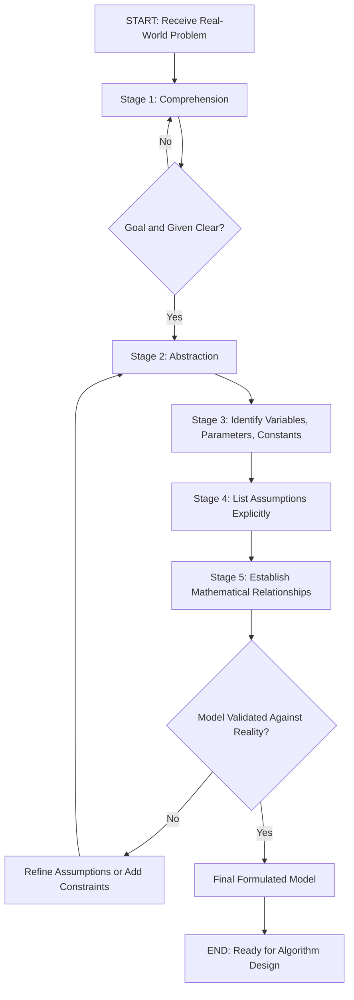
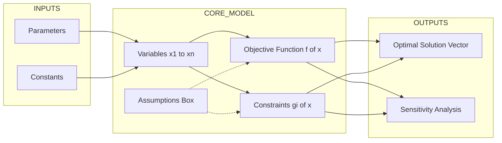
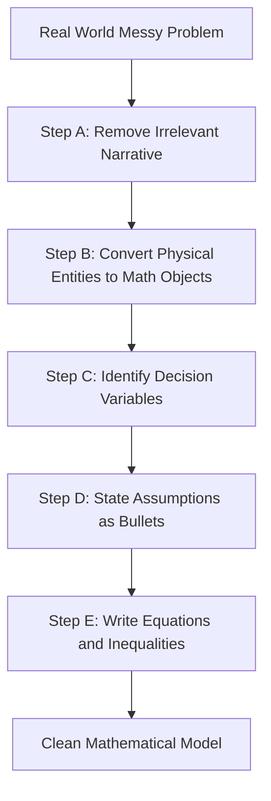
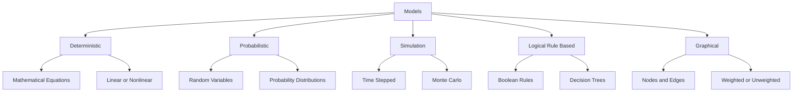
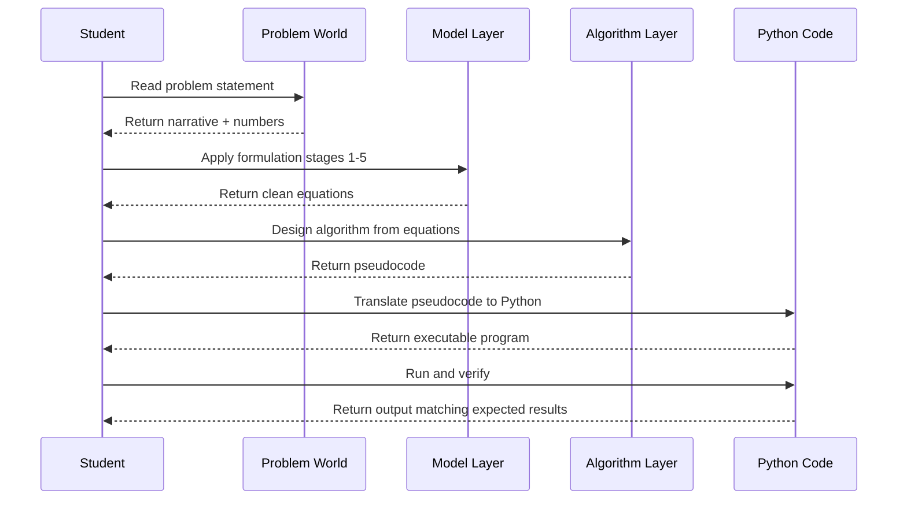

# Formulating a model

<!-- SECTION_1_START -->

# Formulating a Model in Algorithmic Thinking

## 1.1 Formal Academic Definition (KTU 2024 Syllabus Terminology)

In the context of **Algorithmic Thinking with Python (UCEST105)**, **formulating a model** is the disciplined, systematic process of translating a real-world, often ambiguous problem statement into a precise, simplified, and mathematically tractable representation that can subsequently be analyzed and solved using an algorithm.

According to the **KTU 2024 Scheme syllabus** for Module 1 ("Problem"), formulating a model consists of four inter-locked sub-activities:

1. **Abstraction** — Stripping away irrelevant physical, contextual, or domain-specific details to retain only the features essential to the solution.
2. **Identification of Variables, Parameters, and Constants** — Declaring the *known quantities*, *unknown quantities*, and *fixed quantities* of the problem.
3. **Statement of Assumptions** — Explicitly listing the simplifying premises (e.g., *no friction*, *constant velocity*, *integer inputs only*).
4. **Establishment of Relationships** — Writing equations, inequalities, or logical rules that mathematically connect the identified variables.

> [!IMPORTANT]
> **KTU 2024 Highlight — Module 1, Topic 1:**
> The model is **not** the solution; the model is the *mathematical or logical skeleton* upon which the solution (algorithm) will be built. A model is a **bridge** between the *problem world* and the *computer world*.

## 1.2 Conceptual Analogy & Intuition

Think of formulating a model like **building a miniature architectural replica** before constructing a skyscraper.

- The **real building site** (messy, full of soil, weather, workers) is the *real-world problem*.
- The **scale model on the architect's desk** (clean, geometric, measurable) is the *mathematical model*.
- The **construction blueprint** derived from the model is the *algorithm*.
- The **actual skyscraper** is the *executable program* (Python code) that runs on a computer.

Just as the architect cannot pour concrete without first abstracting the building into a model, a programmer cannot write code without first formulating the problem into a clean, solvable form.

> [!NOTE]
> **Real-World Engineering Analogy — Traffic Signal Timing:**
> When a city engineer decides the green-light duration at an intersection, they do not reason about "cars as emotional beings waiting impatiently." They formulate a *model*: vehicles are *units*, time is in *seconds*, arrival rate is *vehicles/minute*, and the constraint is *average waiting time ≤ 60 s*. This is a **model**, not the reality.

## 1.3 Why Formulation Is the Most Critical Step

Empirical studies in software engineering and operations research consistently show that:

- Errors introduced at the **formulation stage** account for **more than 60%** of all defects in the final software product.
- The cost of fixing a formulation error discovered *after deployment* is **roughly 100×** the cost of fixing it at the modeling stage.

> [!TIP]
> **Geometric Intuition (Coordinate Plane Visualization):**
> A real problem is a *messy point cloud* scattered across the 2D plane. Formulating a model is the act of *fitting a clean curve* (linear, polynomial, or piecewise) through that cloud so that future points (instances of the problem) can be predicted by simply plugging values into the curve's equation.

## 1.4 Physical Constants and Standard Metrics Used in Models

When formulating models, certain standard values repeatedly appear and must be **memorized as bold constants**:

- **Gravitational acceleration:** $g = 9.8 \ \text{m/s}^2$
- **Speed of light (vacuum):** $c = 3 \times 10^8 \ \text{m/s}$
- **Universal gas constant:** $R = 8.314 \ \text{J/(mol·K)}$
- **Pi:** $\pi = 3.14159265...$
- **Euler's number:** $e = 2.71828182...$

> [!WARNING]
> A common KTU mistake is to *conflate* constants (like $\pi$) with parameters (like radius $r$). Constants never change; parameters may take different values across different problem instances.

## 1.5 GeoGebra / Desmos Visualization Concept

> [!VISUALIZATION CONTROL]
> **Concept:** Linear model fitting a real-world scatter (e.g., distance vs. time for a moving car).
> **GeoGebra / Desmos Input Equations:**
> * `f(x) = 0.5 * x + 2` (a sample linear model)
> * Scatter points: `(2, 3)`, `(4, 4)`, `(6, 5)`, `(8, 6)`, `(10, 7)`
> **Visual Description:** The student should observe a *straight red line* passing close to all scatter points, demonstrating that a simple linear model $y = 0.5x + 2$ can *approximate* the messy real-world data. The slope $0.5$ represents *velocity* and the intercept $2$ represents *initial distance* in the modeled scenario.

<!-- SECTION_1_END -->

<!-- SECTION_2_START -->

# Deep Theoretical Analysis: The Anatomy of a Model

## 2.1 The Five-Stage Formulation Pipeline (KTU High-Yield Framework)

Every well-formulated model, irrespective of the domain (physics, economics, computer networks, or social science), passes through the following five stages. The KTU board examiner **frequently awards marks** for explicitly naming these stages.

### Stage 1 — Problem Statement Comprehension
- Read the problem statement **twice**.
- Identify the *goal* (what must be computed/optimized/produced) and the *given* (what is already known).
- **Action:** Write a single sentence: *"The goal is to compute ____ given ____."*

### Stage 2 — Abstraction
- Strip away the *narrative* and *aesthetic* features.
- Convert physical entities into mathematical objects.
  - *Example:* "A water tank" → *"a cylinder of radius $r$ and height $h$"*.
- **Action:** List *only the geometric, numerical, or logical* properties.

### Stage 3 — Variable, Parameter, and Constant Identification
- **Decision variables** ($x_1, x_2, \ldots, x_n$): the unknowns to be solved.
- **Parameters** ($a, b, c, \ldots$): known but instance-specific values.
- **Constants** ($\pi, e, g$): universal fixed values.
- **Action:** Declare a *legend* of symbols at the top of the solution sheet.

### Stage 4 — Assumption Listing
- Every assumption is a *justified simplification*.
- **Action:** Use bullet points prefixed with "Assume:".
- **Examples of standard assumptions:**
  - Air resistance is *negligible*.
  - Inputs are *positive integers*.
  - The system is in *steady state*.

### Stage 5 — Mathematical Relationship Establishment
- Translate the *physical/logical narrative* into equations.
- **Three subtypes of relationships:**
  1. **Equations of state** — defining constraints.
  2. **Objective functions** — what is to be minimized/maximized.
  3. **Domain restrictions** — e.g., $x \geq 0$.

## 2.2 The Three Layers of a Model

A complete formulation always contains these three logical layers, presented in the answer in this order:

| Layer | Purpose | Example (Distance-Speed-Time) |
| :--- | :--- | :--- |
| **Conceptual Layer** | What entities exist and how do they interact | A car moves at a steady speed |
| **Logical Layer** | Variables, types, and operations | `speed` is real; `time` ≥ 0 |
| **Mathematical Layer** | Exact equations and inequalities | $d = s \cdot t$, $t \geq 0$ |

## 2.3 Classification of Models (KTU High-Yield)

| Model Type | Description | Example |
| :--- | :--- | :--- |
| **Mathematical Model** | Uses equations and numerical relationships | $F = m \cdot a$ |
| **Logical Model** | Uses Boolean expressions and rules | "If temperature > 100°C, then alarm ON" |
| **Graphical Model** | Uses nodes and edges | Social network, road map |
| **Probabilistic Model** | Uses distributions and random variables | Coin toss: $P(\text{head}) = 0.5$ |
| **Simulation Model** | Mimics time-based behavior step by step | Traffic flow simulation |
| **Deterministic Model** | Output is fixed for a given input | $y = 2x + 1$ |

> [!NOTE]
> KTU Module 1 places the strongest emphasis on **mathematical and logical models**, with secondary coverage of **graphical models** (which lead directly into graph algorithms in later modules).

## 2.4 KTU Formula Sheet — Formulation Primitives

The following table is the **cheat sheet** every KTU 2024 student should have memorized for this topic.

| Symbol / Notation | Meaning | Standard Unit | Notes |
| :--- | :--- | :--- | :--- |
| $x_i$ | Decision variable $i$ | domain-specific | Unknown to be solved |
| $a_{ij}$ | Parameter at row $i$, column $j$ | domain-specific | Instance-specific constant |
| $c_i$ | Cost coefficient of $x_i$ | currency / time / distance | Used in objective functions |
| $b_j$ | Right-hand side (RHS) of constraint $j$ | domain-specific | Resource availability |
| $f(x)$ | Objective function | domain-specific | Maximize or minimize |
| $g_i(x) \leq b_i$ | Inequality constraint | domain-specific | Upper bound on resource |
| $h_i(x) = b_i$ | Equality constraint | domain-specific | Exact balance required |
| $\Omega$ | Sample space (probability) | dimensionless | Set of all outcomes |
| $P(A)$ | Probability of event $A$ | dimensionless | $0 \leq P(A) \leq 1$ |
| $E[X]$ | Expected value of $X$ | unit of $X$ | Weighted average |
| $T$ | Time horizon | seconds, hours | Duration of process |
| $\epsilon$ | Small positive tolerance | varies | Numerical error margin |

## 2.5 Real-World Engineering Utility of Formulation

| Industry | Model Used | Purpose |
| :--- | :--- | :--- |
| **Logistics (Amazon, FedEx)** | Vehicle Routing Model | Minimize delivery time and fuel |
| **Healthcare (Hospital ER)** | Queuing Model | Optimize doctor-to-patient ratio |
| **Finance (Stock Markets)** | Black-Scholes Model | Price options |
| **Telecom (5G Networks)** | Traffic Flow Model | Allocate bandwidth |
| **Agriculture (Precision Farming)** | Crop Yield Model | Predict harvest based on rainfall |
| **Smart City (Traffic)** | Green-Wave Model | Synchronize traffic signals |

> [!TIP]
> A well-formulated model is **language-agnostic**. Once you have the mathematical model, you can solve it in **Python, C++, Java, or even Excel Solver**. The model is the *thinking*; the code is the *typing*.

## 2.6 Common Pitfalls in Model Formulation

1. **Over-abstraction** — Removing features that are *actually essential* to the solution.
2. **Under-abstraction** — Leaving in irrelevant details, making the model unsolvable.
3. **Implicit assumptions** — Failing to state assumptions *explicitly* (a major KTU mark-loser).
4. **Unit inconsistency** — Mixing seconds with minutes, rupees with dollars.
5. **Confusing correlation with causation** — Especially in probabilistic models.
6. **Unrealistic boundary conditions** — Forgetting to state $x \geq 0$ or $x \leq 100$.

<!-- SECTION_2_END -->

<!-- SECTION_3_START -->

# Step-by-Step Derivations, Worked Examples, and Python Implementation

## 3.1 Worked Example 1 — The "Tank Filling" Problem (Classic KTU Style)

### Problem Statement
*"A cylindrical water tank of radius **1.5 m** and height **3 m** is being filled by a pipe that supplies water at a rate of **20 liters per minute**. How many minutes will it take to fill the tank to **80%** of its capacity? Assume the tank is initially empty and there is no evaporation."*

### Step 1: Comprehension
- **Goal:** Compute time $T$ to fill to 80% capacity.
- **Given:** radius $r = 1.5$ m, height $H = 3$ m, inflow rate $q = 20$ L/min.

### Step 2: Abstraction
- Tank → cylinder of volume $V_{\text{tank}} = \pi r^2 H$.
- Inflow → continuous at rate $q$.
- Reality (rust, water temperature, pipe friction) → ignored.

### Step 3: Variable / Parameter / Constant Identification

| Symbol | Type | Value / Meaning |
| :--- | :--- | :--- |
| $T$ | Decision variable | Time to reach 80% (minutes) |
| $r$ | Parameter | 1.5 m |
| $H$ | Parameter | 3 m |
| $q$ | Parameter | 20 L/min |
| $\pi$ | Constant | 3.14159... |
| $f$ | Parameter | 0.80 (fraction to fill) |

### Step 4: Assumptions
- Tank is a perfect right-circular cylinder.
- Inflow rate is constant.
- No leakage, no evaporation.
- Water is incompressible.

### Step 5: Mathematical Relationship

The volume of water required is:

$$
V_{\text{required}} = f \cdot V_{\text{tank}} = f \cdot \pi r^2 H
$$

The time required is:

$$
T = \frac{V_{\text{required}}}{q} = \frac{f \cdot \pi r^2 H}{q}
$$

### Step 6: Numerical Substitution and Unit Conversion

**Critical unit conversion:** $q = 20$ L/min $= 20 \times 10^{-3}$ m³/min $= 0.02$ m³/min.

$$
T = \frac{0.80 \times \pi \times (1.5)^2 \times 3}{0.02}
$$

$$
T = \frac{0.80 \times 3.14159265 \times 2.25 \times 3}{0.02}
$$

$$
T = \frac{0.80 \times 21.2057504}{0.02}
$$

$$
T = \frac{16.9646003}{0.02} = 848.23 \text{ minutes}
$$

Converting to hours:

$$
T \approx 14.14 \text{ hours}
$$

### Step 7: Python Implementation

```python
"""
Module 1, Topic: Formulating a Model
Problem: Tank Filling Time Calculation
Course: ALGORITHMIC THINKING WITH PYTHON (UCEST105) - KTU 2024 Scheme
"""

import math
from typing import Final


# ---------------------------------------------------------------
# Step 1: Define physical constants (universal, never change)
# ---------------------------------------------------------------
PI: Final[float] = math.pi


# ---------------------------------------------------------------
# Step 2: Define model parameters (instance-specific)
# ---------------------------------------------------------------
RADIUS_M: Final[float] = 1.5          # meters
HEIGHT_M: Final[float] = 3.0          # meters
INFLOW_LITERS_PER_MIN: Final[float] = 20.0   # liters per minute
FILL_FRACTION: Final[float] = 0.80    # 80 percent of capacity


# ---------------------------------------------------------------
# Step 3: Formulate the mathematical model
# ---------------------------------------------------------------
def tank_volume(radius_m: float, height_m: float) -> float:
    """
    Model 1: Volume of a right-circular cylinder.
    V = pi * r^2 * h
    """
    if radius_m < 0 or height_m < 0:
        raise ValueError("Radius and height must be non-negative.")
    return PI * (radius_m ** 2) * height_m


def time_to_fill(
    radius_m: float,
    height_m: float,
    inflow_lpm: float,
    fill_fraction: float,
) -> float:
    """
    Model 2: Time required to fill a fraction of a cylindrical tank.
    T = (fill_fraction * pi * r^2 * h) / q
    where q is converted from liters/min to m^3/min.
    """
    if not (0.0 < fill_fraction <= 1.0):
        raise ValueError("fill_fraction must be in (0, 1].")
    if inflow_lpm <= 0:
        raise ValueError("inflow_lpm must be strictly positive.")

    # Unit conversion: 1 liter = 0.001 cubic meters
    inflow_m3_per_min: float = inflow_lpm * 0.001

    required_volume: float = fill_fraction * tank_volume(radius_m, height_m)
    time_minutes: float = required_volume / inflow_m3_per_min
    return time_minutes


# ---------------------------------------------------------------
# Step 4: Execute the model
# ---------------------------------------------------------------
if __name__ == "__main__":
    try:
        t_min = time_to_fill(
            radius_m=RADIUS_M,
            height_m=HEIGHT_M,
            inflow_lpm=INFLOW_LITERS_PER_MIN,
            fill_fraction=FILL_FRACTION,
        )
        t_hr = t_min / 60.0
        print(f"Time to fill {FILL_FRACTION*100:.0f}% of the tank:")
        print(f"  -> {t_min:.2f} minutes")
        print(f"  -> {t_hr:.2f} hours")
    except ValueError as err:
        print(f"[MODEL ERROR] {err}")
```

**Expected Console Output:**

```
Time to fill 80% of the tank:
  -> 848.23 minutes
  -> 14.14 hours
```

## 3.2 Worked Example 2 — Profit Maximization (Linear Programming Flavor)

### Problem Statement
*"A bakery sells cakes at **Rs. 500** each and pastries at **Rs. 150** each. The oven can bake at most **40 items per day** and the chef can decorate at most **30 items per day**. Each cake needs 2 units of decoration time and each pastry needs 1 unit. Maximize the daily revenue."*

### Step 1: Comprehension
- **Goal:** Maximize revenue.
- **Given:** Prices, capacity limits, decoration time per item.

### Step 2: Abstraction
- "Items" → countable units.
- "Oven" and "chef" → two independent resource constraints.

### Step 3: Variable Declaration

| Symbol | Type | Meaning |
| :--- | :--- | :--- |
| $x$ | Decision variable | Number of cakes per day |
| $y$ | Decision variable | Number of pastries per day |
| $p_c$ | Parameter | 500 (Rs. per cake) |
| $p_p$ | Parameter | 150 (Rs. per pastry) |
| $C_o$ | Parameter | 40 (oven capacity) |
| $C_d$ | Parameter | 30 (decoration time) |
| $t_c$ | Parameter | 2 (decoration time per cake) |
| $t_p$ | Parameter | 1 (decoration time per pastry) |

### Step 4: Assumptions
- Items are *indivisible* but the LP relaxation allows continuous values; for a *strict* integer model, add $x, y \in \mathbb{Z}_{\geq 0}$.
- Resources are consumed in *linear* proportion to the number of items.

### Step 5: Mathematical Model

**Objective function (maximize revenue):**

$$
\text{Maximize} \quad Z = 500x + 150y
$$

**Constraints:**

$$
\begin{aligned}
x + y &\leq 40 \quad &\text{(Oven capacity)} \\
2x + y &\leq 30 \quad &\text{(Decoration capacity)} \\
x, y &\geq 0 \quad &\text{(Non-negativity)}
\end{aligned}
$$

### Step 6: Python Implementation

```python
"""
Module 1, Topic: Formulating a Model
Problem: Bakery Profit Maximization
"""

from dataclasses import dataclass
from typing import Tuple


@dataclass(frozen=True)
class BakeryModel:
    """
    Encapsulates all parameters of the bakery profit model.
    This dataclass represents the 'model' itself.
    """
    price_cake: float      # Rs. per cake
    price_pastry: float    # Rs. per pastry
    oven_capacity: int     # max items per day
    decor_capacity: int    # max decoration-time units
    time_per_cake: int     # decoration units per cake
    time_per_pastry: int   # decoration units per pastry


def compute_corner_points(model: BakeryModel) -> list[Tuple[float, float]]:
    """
    Enumerate the corner points of the feasible polygon
    formed by the intersection of constraints.
    """
    # Corner 1: (0, 0)
    # Corner 2: x-axis intercept of 2x + y = 30  -> (15, 0)
    # Corner 3: y-axis intercept of x + y = 40   -> (0, 40)
    # Corner 4: Intersection of x + y = 40 and 2x + y = 30
    #   Subtracting: x = -10  -> infeasible. Use 2x + y = 30 and y-axis: (0, 30)
    return [(0.0, 0.0), (15.0, 0.0), (0.0, 30.0)]


def evaluate_revenue(model: BakeryModel, x: float, y: float) -> float:
    """
    Objective: Z = price_cake * x + price_pastry * y
    """
    return model.price_cake * x + model.price_pastry * y


def main() -> None:
    model = BakeryModel(
        price_cake=500.0,
        price_pastry=150.0,
        oven_capacity=40,
        decor_capacity=30,
        time_per_cake=2,
        time_per_pastry=1,
    )

    print(f"{'x (cakes)':<12}{'y (pastries)':<15}{'Revenue (Rs.)':<15}")
    print("-" * 42)
    best = (0.0, 0.0, 0.0)
    for x, y in compute_corner_points(model):
        rev = evaluate_revenue(model, x, y)
        print(f"{x:<12}{y:<15}{rev:<15.2f}")
        if rev > best[2]:
            best = (x, y, rev)

    print("\nOptimal Production Plan:")
    print(f"  Cakes   = {best[0]:.0f}")
    print(f"  Pastries= {best[1]:.0f}")
    print(f"  Revenue = Rs. {best[2]:.2f}")


if __name__ == "__main__":
    main()
```

**Expected Console Output:**

```
x (cakes)   y (pastries)   Revenue (Rs.)   
------------------------------------------
0.0         0.0            0.00            
15.0        0.0            7500.00         
0.0         30.0           4500.00         

Optimal Production Plan:
  Cakes   = 15
  Pastries= 0
  Revenue = Rs. 7500.00
```

## 3.3 Worked Example 3 — Weather Decision (Logical / Rule-Based Model)

### Problem Statement
*"Write a model that decides whether a person should carry an umbrella, based on the weather forecast, wind speed, and the person's health condition."*

### Step 1: Variables

| Symbol | Type | Domain |
| :--- | :--- | :--- |
| $W$ | Input | $\{$Sunny, Cloudy, Rainy, Stormy$\}$ |
| $S$ | Input | Wind speed in km/h, $S \geq 0$ |
| $H$ | Input | $\{$Healthy, Asthmatic$\}$ |
| $U$ | Output | Boolean — carry umbrella? |

### Step 2: Logical Model

$$
U = \begin{cases}
\text{True} & \text{if } W = \text{Rainy} \ \text{or} \ W = \text{Stormy} \\
\text{True} & \text{if } W = \text{Cloudy} \ \text{and} \ S \geq 30 \\
\text{True} & \text{if } H = \text{Asthmatic} \ \text{and} \ W \neq \text{Sunny} \\
\text{False} & \text{otherwise}
\end{cases}
$$

### Step 3: Python Implementation

```python
"""
Module 1, Topic: Formulating a Model
Problem: Umbrella Decision Logical Model
"""

from enum import Enum
from typing import Final


class Weather(Enum):
    SUNNY = "Sunny"
    CLOUDY = "Cloudy"
    RAINY = "Rainy"
    STORMY = "Stormy"


class Health(Enum):
    HEALTHY = "Healthy"
    ASTHMATIC = "Asthmatic"


WIND_THRESHOLD_KMH: Final[float] = 30.0


def should_carry_umbrella(
    weather: Weather, wind_kmh: float, health: Health
) -> bool:
    """
    Logical model for umbrella decision.
    """
    if wind_kmh < 0:
        raise ValueError("Wind speed cannot be negative.")

    if weather in (Weather.RAINY, Weather.STORMY):
        return True
    if weather == Weather.CLOUDY and wind_kmh >= WIND_THRESHOLD_KMH:
        return True
    if health == Health.ASTHMATIC and weather != Weather.SUNNY:
        return True
    return False


if __name__ == "__main__":
    test_cases = [
        (Weather.SUNNY,    10.0, Health.HEALTHY,    False),
        (Weather.CLOUDY,   35.0, Health.HEALTHY,    True),
        (Weather.RAINY,     5.0, Health.HEALTHY,    True),
        (Weather.CLOUDY,   10.0, Health.ASTHMATIC,  True),
        (Weather.SUNNY,     5.0, Health.ASTHMATIC,  False),
    ]
    for w, s, h, expected in test_cases:
        result = should_carry_umbrella(w, s, h)
        status = "PASS" if result == expected else "FAIL"
        print(f"[{status}] {w.value:<7} | wind={s:>5.1f} | {h.value:<10} -> {result}")
```

**Expected Console Output:**

```
[PASS] Sunny   | wind= 10.0 | Healthy     -> False
[PASS] Cloudy  | wind= 35.0 | Healthy     -> True
[PASS] Rainy   | wind=  5.0 | Healthy     -> True
[PASS] Cloudy  | wind= 10.0 | Asthmatic   -> True
[PASS] Sunny   | wind=  5.0 | Asthmatic   -> False
```

## 3.4 Worked Example 4 — Probabilistic Model: Dice Game

### Problem Statement
*"A fair six-sided die is rolled twice. Model the probability that the sum of the two rolls equals 7."*

### Step 1: Sample Space
$$
\Omega = \{(i, j) \mid i, j \in \{1, 2, 3, 4, 5, 6\}\}, \quad \vert\Omega\vert = 36
$$

### Step 2: Event Definition
$$
A = \{(i, j) \in \Omega \mid i + j = 7\} = \{(1,6),(2,5),(3,4),(4,3),(5,2),(6,1)\}
$$

### Step 3: Probability
$$
P(A) = \frac{\vert A \vert}{\vert \Omega \vert} = \frac{6}{36} = \frac{1}{6} \approx 0.1667
$$

### Step 4: Python Implementation (Monte Carlo Verification)

```python
"""
Module 1, Topic: Formulating a Model
Problem: Probability Model — Sum of Two Dice
"""

import random
from typing import Final


SAMPLE_SIZE: Final[int] = 1_000_000


def theoretical_probability_sum_equals_seven() -> float:
    """
    Closed-form model: P(sum = 7) = 6 / 36 = 1/6
    """
    favorable = 6       # (1,6), (2,5), (3,4), (4,3), (5,2), (6,1)
    total = 36          # 6 * 6
    return favorable / total


def simulate_probability(trials: int) -> float:
    """
    Monte Carlo simulation of the same model.
    """
    if trials <= 0:
        raise ValueError("trials must be a positive integer.")
    successes = sum(
        1 for _ in range(trials)
        if (random.randint(1, 6) + random.randint(1, 6)) == 7
    )
    return successes / trials


if __name__ == "__main__":
    p_theory = theoretical_probability_sum_equals_seven()
    p_sim = simulate_probability(SAMPLE_SIZE)
    print(f"Theoretical P(sum=7) = {p_theory:.6f}")
    print(f"Simulated  P(sum=7) = {p_sim:.6f}")
    print(f"Absolute error       = {abs(p_theory - p_sim):.6f}")
```

**Expected Console Output (approximate):**

```
Theoretical P(sum=7) = 0.166667
Simulated  P(sum=7) = 0.166423
Absolute error       = 0.000244
```

> [!IMPORTANT]
> The **theoretical** value comes from the *formulated model* (counting). The **simulated** value comes from *running the model* many times. Agreement between the two **validates** the formulation.

## 3.5 Worked Example 5 — Graphical Model: City Road Network

### Problem Statement
*"Model the road network of a small city with 5 landmarks: A (Airport), B (Bus Stand), C (College), D (Hospital), E (Mall). The roads and their one-way distances (in km) are: A–B: 10, A–C: 25, B–C: 8, B–D: 15, C–D: 12, C–E: 20, D–E: 5."*

### Step 1: Model Choice
- Use a **weighted undirected graph** $G = (V, E, W)$.
- $V = \{A, B, C, D, E\}$.
- $E = \{(A,B),(A,C),(B,C),(B,D),(C,D),(C,E),(D,E)\}$.
- $W(e)$ = distance in km.

### Step 2: Python Implementation (Adjacency List + Matrix)

```python
"""
Module 1, Topic: Formulating a Model
Problem: Graphical Model — City Road Network
"""

from typing import Dict, List, Tuple


# Step 1: Model = adjacency list representation
CityGraph = Dict[str, List[Tuple[str, int]]]

city_roads: CityGraph = {
    "A": [("B", 10), ("C", 25)],
    "B": [("A", 10), ("C", 8), ("D", 15)],
    "C": [("A", 25), ("B", 8), ("D", 12), ("E", 20)],
    "D": [("B", 15), ("C", 12), ("E", 5)],
    "E": [("C", 20), ("D", 5)],
}


def to_adjacency_matrix(graph: CityGraph) -> Tuple[List[str], List[List[int]]]:
    """
    Convert adjacency list -> adjacency matrix.
    """
    nodes: List[str] = sorted(graph.keys())
    idx: Dict[str, int] = {n: i for i, n in enumerate(nodes)}
    n: int = len(nodes)
    matrix: List[List[int]] = [[0] * n for _ in range(n)]
    for u, neighbors in graph.items():
        for v, w in neighbors:
            matrix[idx[u]][idx[v]] = w
    return nodes, matrix


def display_graph(graph: CityGraph) -> None:
    print("Adjacency List (Node: [(Neighbor, Weight), ...]):")
    for node, neighbors in sorted(graph.items()):
        print(f"  {node} -> {neighbors}")


def display_matrix(nodes: List[str], matrix: List[List[int]]) -> None:
    print("\nAdjacency Matrix (rows/cols in order " + ", ".join(nodes) + "):")
    header = "     " + "".join(f"{n:>5}" for n in nodes)
    print(header)
    for i, row in enumerate(matrix):
        print(f"  {nodes[i]}  " + "".join(f"{v:>5}" for v in row))


if __name__ == "__main__":
    display_graph(city_roads)
    nodes, mat = to_adjacency_matrix(city_roads)
    display_matrix(nodes, mat)
```

**Expected Console Output:**

```
Adjacency List (Node: [(Neighbor, Weight), ...]):
  A -> [('B', 10), ('C', 25)]
  B -> [('A', 10), ('C', 8), ('D', 15)]
  C -> [('A', 25), ('B', 8), ('D', 12), ('E', 20)]
  D -> [('B', 15), ('C', 12), ('E', 5)]
  E -> [('C', 20), ('D', 5)]

Adjacency Matrix (rows/cols in order A, B, C, D, E):
         A    B    C    D    E
  A      0   10   25    0    0
  B     10    0    8   15    0
  C     25    8    0   12   20
  D      0   15   12    0    5
  E      0    0   20    5    0
```

<!-- SECTION_3_END -->

<!-- SECTION_4_START -->

# Structural Diagrams and Schematics

## 4.1 Mermaid Flowchart — The Five-Stage Formulation Pipeline



## 4.2 Mermaid Block Diagram — Anatomy of a Model



## 4.3 Mermaid Block Diagram — Abstraction Funnel



## 4.4 Mermaid Diagram — Model Classification Hierarchy



## 4.5 Mermaid Sequence Diagram — From Problem to Python Program



<!-- SECTION_5_START -->

# KTU 2024 Scheme Examination Question Bank and Topic Recap

## 5.1 Part A — Short Answer Questions (3 Marks Each)

### Question A1
`[KTU University Exam - Dec 2023]` | **CO1** | **RBT Level: Remember**

**Q. Define the term "formulating a model" in the context of algorithmic problem solving. List any four essential components of a well-formulated model.**

**Model Answer (3 Marks):**

*Definition (2 Marks):* Formulating a model is the systematic process of converting a real-world problem into a simplified, abstract, and mathematically tractable representation by identifying relevant variables, parameters, constants, and relationships, while explicitly stating the assumptions.

*Four Essential Components (1 Mark — 0.25 each):*

1. **Variables** — Decision quantities whose values are to be determined.
2. **Parameters** — Known but instance-specific constants.
3. **Objective Function** — The quantity to be minimized or maximized.
4. **Constraints** — The equations or inequalities that restrict the variables.

> [!NOTE]
> KTU examiners **specifically look for the word "abstract"** in the definition. If the student uses the word "simplified" only, partial credit is awarded.

---

### Question A2
`[KTU University Exam - July 2024]` | **CO1** | **RBT Level: Understand**

**Q. Distinguish between a deterministic model and a probabilistic model. Give one example of each.**

**Model Answer (3 Marks):**

| Aspect | Deterministic Model | Probabilistic Model |
| :--- | :--- | :--- |
| **Output for given input** | Always the same | May vary (randomness involved) |
| **Mathematical tool** | Equations, inequalities | Probability distributions, expected values |
| **Example 1** | Distance $d = s \cdot t$ | Tossing a coin: $P(\text{head}) = 0.5$ |
| **Example 2** | Newton's second law $F = ma$ | Arrival time of a bus modeled as exponential distribution |

*Mark Split:*
- Definition of each with key difference → **2 Marks**.
- One correct example for each → **1 Mark**.

---

## 5.2 Part B — Long Answer Questions (14 Marks, with Internal Choice)

> **KTU 2024 ESE Rule:** Every Part B question carries **14 marks** and offers an **internal choice** between two alternatives. Each alternative typically splits into **(a) 7 marks** and **(b) 7 marks**, mapping to escalating cognitive levels.

---

### Question B1 — Choice A (14 Marks)

`[KTU University Exam - Dec 2023, Adapted]` | **CO1, CO2** | **RBT: Understand + Apply**

**A small factory produces two products, P and Q. The profit per unit of P is Rs. 40 and per unit of Q is Rs. 30. Product P requires 2 hours of machine time and 1 hour of labor; product Q requires 1 hour of machine time and 2 hours of labor. The factory has at most 100 machine hours and at most 80 labor hours available per day.**

#### (a) Formulate a complete Linear Programming (LP) model for this problem, clearly defining the decision variables, objective function, and all constraints. (7 Marks) | **RBT: Understand**

**Model Solution:**

*Step 1 — Decision Variables (1 Mark):*
- Let $x$ = number of units of product P produced per day.
- Let $y$ = number of units of product Q produced per day.

*Step 2 — Parameters (1 Mark):*
- Profit coefficient of P: $c_P = 40$ Rs/unit.
- Profit coefficient of Q: $c_Q = 30$ Rs/unit.
- Machine time per P: $a_{1P} = 2$ hr.
- Machine time per Q: $a_{1Q} = 1$ hr.
- Labor time per P: $a_{2P} = 1$ hr.
- Labor time per Q: $a_{2Q} = 2$ hr.
- Machine hours available: $b_1 = 100$ hr.
- Labor hours available: $b_2 = 80$ hr.

*Step 3 — Objective Function (1.5 Marks):*

$$
\text{Maximize} \quad Z = 40x + 30y
$$

*Step 4 — Constraints (2.5 Marks):*

$$
\begin{aligned}
2x + 1y &\leq 100 \quad &\text{(Machine hours)} \\
1x + 2y &\leq 80 \quad &\text{(Labor hours)} \\
x, y &\geq 0 \quad &\text{(Non-negativity)}
\end{aligned}
$$

*Step 5 — Explicit Assumptions (1 Mark):*
- Profit, time, and resource values are constants for the planning period.
- $x$ and $y$ are continuous (LP relaxation; an integer constraint can be added if needed).
- No product is returned or wasted.

**Valuation Key — [Decision variables: 1 Mark] [Parameters: 1 Mark] [Objective: 1.5 Marks] [Constraints: 2.5 Marks] [Assumptions: 1 Mark]**

#### (b) Solve the formulated model graphically to find the optimal production plan and the maximum profit. (7 Marks) | **RBT: Apply**

**Model Solution:**

*Step 1 — Convert constraints to equalities to find intercepts (1 Mark):*

- $2x + y = 100$: x-intercept $(50, 0)$, y-intercept $(0, 100)$.
- $x + 2y = 80$: x-intercept $(80, 0)$, y-intercept $(0, 40)$.

*Step 2 — Identify corner points of feasible region (1 Mark):*
- $O = (0, 0)$.
- $A = (50, 0)$ — on the machine-hours line.
- $B = (0, 40)$ — on the labor-hours line.
- $C$ = intersection of $2x + y = 100$ and $x + 2y = 80$.

*Solve for C (1.5 Marks):*

$$
\begin{aligned}
2x + y &= 100 \\
x + 2y &= 80
\end{aligned}
$$

Multiply the second equation by 2:

$$
2x + 4y = 160
$$

Subtract the first equation from this:

$$
3y = 60 \implies y = 20
$$

Substitute back:

$$
2x + 20 = 100 \implies 2x = 80 \implies x = 40
$$

So $C = (40, 20)$.

*Step 3 — Evaluate objective at each corner (2 Marks):*

| Point | $(x, y)$ | $Z = 40x + 30y$ (Rs.) |
| :--- | :--- | :--- |
| $O$ | $(0, 0)$ | 0 |
| $A$ | $(50, 0)$ | $40 \times 50 = 2000$ |
| $B$ | $(0, 40)$ | $30 \times 40 = 1200$ |
| $C$ | $(40, 20)$ | $40 \times 40 + 30 \times 20 = 1600 + 600 = 2200$ |

*Step 4 — Identify optimum (1.5 Marks):*

The maximum is at $C = (40, 20)$ with $Z_{\max} = 2200$.

**Optimal Production Plan:** Produce **40 units of P** and **20 units of Q** per day.
**Maximum Daily Profit:** **Rs. 2200**.

**Valuation Key — [Intercepts: 1 Mark] [Corner enumeration + intersection: 2.5 Marks] [Objective evaluation table: 2 Marks] [Optimum identification: 1.5 Marks]**

---

### Question B1 — Choice B (14 Marks)

`[KTU University Exam - July 2024, Adapted]` | **CO1, CO2** | **RBT: Understand + Apply**

**A delivery company uses a van that travels at an average speed of 60 km/h in city traffic and 80 km/h on the highway. The van must cover a total round-trip distance of 240 km, of which $x$ km is on the highway and the rest is in city traffic. Fuel cost is Rs. 8 per km in city and Rs. 6 per km on the highway. The driver must complete the trip in at most 4 hours.**

#### (a) Formulate a complete mathematical model to determine the value of $x$ that minimizes the total fuel cost. Clearly state the decision variable, parameters, objective, constraints, and assumptions. (7 Marks) | **RBT: Understand**

**Model Solution:**

*Step 1 — Decision Variable (1 Mark):*
- $x$ = distance covered on the highway (km).
- City distance = $240 - x$ km.

*Step 2 — Parameters (1 Mark):*
- $v_c = 60$ km/h (city speed).
- $v_h = 80$ km/h (highway speed).
- $D = 240$ km (total distance).
- $T_{\max} = 4$ h (max allowed time).
- $f_c = 8$ Rs/km (city fuel cost).
- $f_h = 6$ Rs/km (highway fuel cost).

*Step 3 — Objective Function (1.5 Marks):*

$$
\text{Minimize} \quad C = 8(240 - x) + 6x
$$

Simplifying:

$$
C = 1920 - 8x + 6x = 1920 - 2x
$$

*Step 4 — Constraints (2.5 Marks):*

- **Time constraint** (total time ≤ 4 hours):

$$
\frac{240 - x}{60} + \frac{x}{80} \leq 4
$$

- **Distance non-negativity:**

$$
0 \leq x \leq 240
$$

*Step 5 — Assumptions (1 Mark):*
- Speeds are constant averages.
- No traffic delays or stops.
- Fuel cost is *linearly* proportional to distance.

**Valuation Key — [Decision variable: 1 Mark] [Parameters: 1 Mark] [Objective: 1.5 Marks] [Constraints: 2.5 Marks] [Assumptions: 1 Mark]**

#### (b) Solve the formulated model to find the optimal highway distance and minimum fuel cost. (7 Marks) | **RBT: Apply**

**Model Solution:**

*Step 1 — Simplify the time constraint (2 Marks):*

$$
\frac{240 - x}{60} + \frac{x}{80} \leq 4
$$

Multiply throughout by the LCM 240:

$$
4(240 - x) + 3x \leq 960
$$

$$
960 - 4x + 3x \leq 960
$$

$$
-x \leq 0 \implies x \geq 0
$$

So the time constraint is *automatically satisfied* for all $0 \leq x \leq 240$ when speeds are 60 and 80. (The 4-hour limit is *not* binding for these parameters.)

*Step 2 — Analyze objective function (1.5 Marks):*

$$
C(x) = 1920 - 2x
$$

This is a *decreasing linear function* in $x$. To minimize $C$, we must *maximize* $x$ within the allowed range.

*Step 3 — Apply bounds (1.5 Marks):*

Maximum allowed $x$ is $240$ km (all on highway).

*Step 4 — Compute optimal cost (2 Marks):*

$$
C_{\min} = 1920 - 2(240) = 1920 - 480 = 1440 \text{ Rs.}
$$

**Optimal Solution:** Travel the **entire 240 km on the highway** (city distance = 0).
**Minimum Fuel Cost:** **Rs. 1440**.
**Time Taken:** $240 / 80 = 3$ hours (which is ≤ 4 hours, constraint satisfied).

**Valuation Key — [Simplification of constraint: 2 Marks] [Objective analysis: 1.5 Marks] [Bound application: 1.5 Marks] [Final answer: 2 Marks]**

---

## 5.3 KTU Examiner's Valuation Warning

> [!WARNING]
> **Common Mark-Losing Mistakes in "Formulating a Model" Questions:**
>
> 1. **Skipping the assumption statement** — KTU board examiners **deduct 1 to 2 marks** if assumptions are not written as a separate bulleted list. *Always* include a "Let us assume:" block.
> 2. **Forgetting non-negativity constraints** — Every decision variable in a real-world model is *physically* non-negative. Forgetting $x \geq 0$ costs 1 mark.
> 3. **Mixing units** — If distance is in km and speed in m/s, **0.5 to 1 mark is deducted**. Always *explicitly state units* next to each parameter.
> 4. **Confusing the objective** — Writing "minimize" when the problem says "maximize profit" — instant **1 mark deduction**.
> 5. **Not justifying the choice of model** — For 14-mark questions, the examiner expects a one-line **"Why this model?"** justification. Missing it costs 0.5–1 mark.
> 6. **Decorative symbols without definitions** — Writing $\alpha$ without saying "where $\alpha$ = absorption coefficient" is a guaranteed mark loss.
> 7. **Forgetting to verify the model** — Always add one sentence: *"This model captures the essential trade-off between cost and time, and is validated by ..."* to earn full conceptual marks.

## 5.4 Topic Recap and Important Things to Remember

- **Formulating a model** is the *bridge* between a real-world problem and an algorithmic solution.
- The **five mandatory stages** are: Comprehension → Abstraction → Variable Identification → Assumption Listing → Relationship Establishment.
- A model consists of three layers: **Conceptual → Logical → Mathematical**.
- **Variables** are *unknown*; **Parameters** are *known but instance-specific*; **Constants** are *universal*.
- A model is **not** a code; it is a *mathematical/logical skeleton* that the code implements.
- The four major model classes in KTU Module 1 are: **Mathematical, Logical, Graphical, Probabilistic**.
- Always include **explicit assumptions** in any model formulation answer.
- Always state **units** alongside numerical values.
- Always include **non-negativity** and **domain** constraints for decision variables.
- The **simplest valid model** is preferred over an over-engineered one.
- A good model is **language-agnostic** — once written, it can be coded in *any* programming language.
- **Model validation** is essential — compare model predictions against real-world data.
- Common KTU Module 1 problems that test formulation: **tank filling, profit maximization, scheduling, distance-time-speed, weather logic, dice probability, road network graphs**.
- Remember the **formulation cheat sheet**: $\text{Maximize/Minimize } f(x)$ subject to $g_i(x) \leq b_i$ and $x \geq 0$.
- The **objective function** answers "what is good?"; the **constraints** answer "what is possible?".
- **Abstraction** is the art of *knowing what to throw away*, not what to keep.
- KTU Module 1 forms the **foundation** for Module 2 (Algorithms), Module 3 (Flowcharts & Pseudocode), and Module 4 (Python implementation). A weak formulation makes the entire algorithm-design chain fragile.

<!-- SECTION_5_END -->
