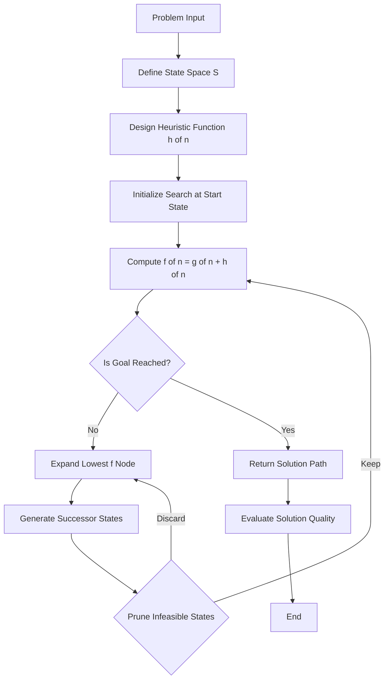
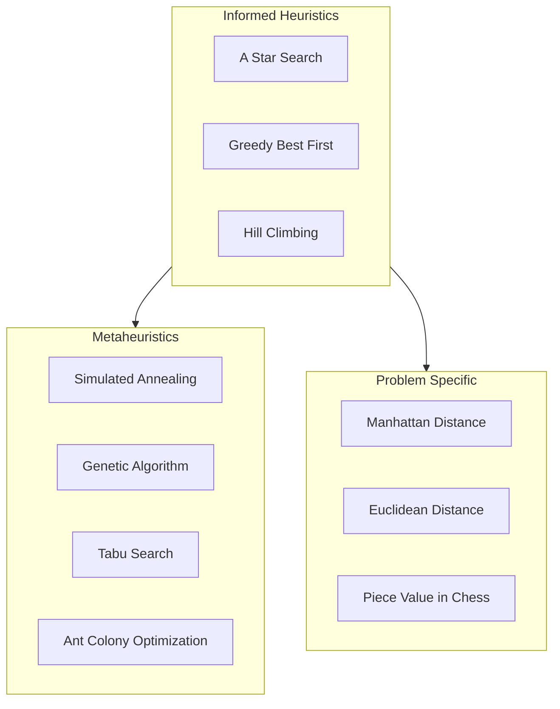
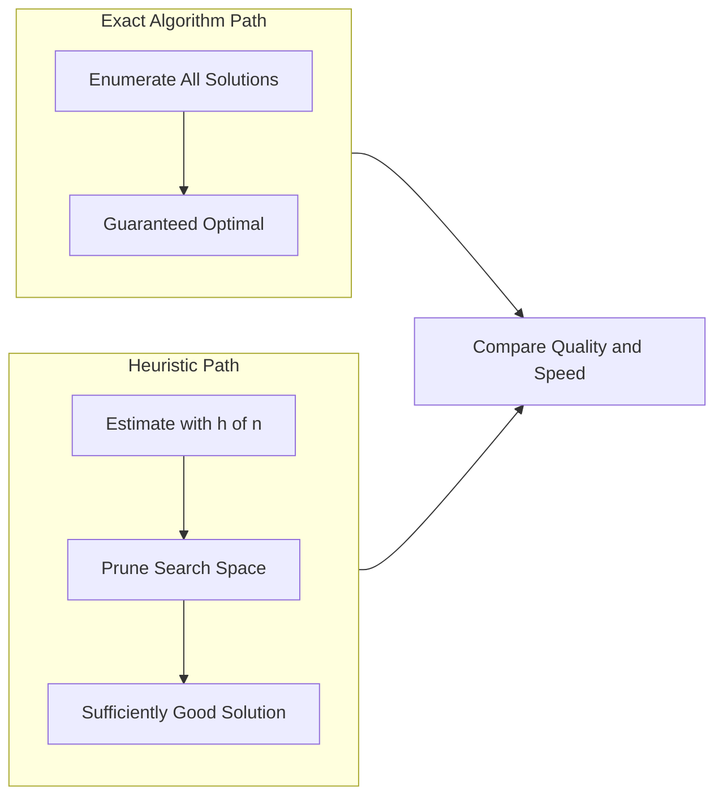
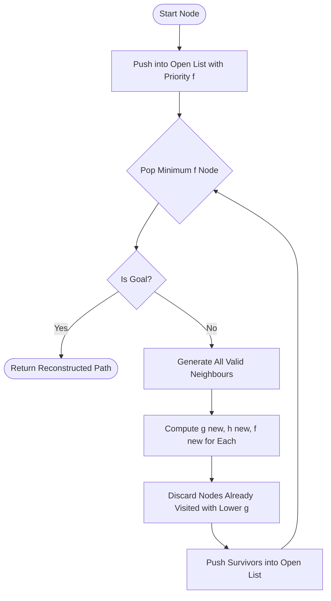

# Heuristics

<!-- SECTION_1_START -->

# Heuristics in Algorithmic Thinking

## 1.1 Formal Academic Definition

In the context of **Algorithmic Thinking with Python (UCEST105)**, a **Heuristic** is a problem-solving strategy, rule-of-thumb, or simplified decision-making procedure that provides a *sufficiently good* solution to a complex problem in a *reasonable amount of time*, without guaranteeing optimality, completeness, or formal correctness.

> [!IMPORTANT]
> **KTU 2024 Syllabus Definition:** A heuristic is an *informed guess* or *approximate method* used to reduce the search space of possible solutions. It trades **optimality for speed** and is widely adopted when the problem is NP-hard, the input size is large, or an exact solution is computationally infeasible.

Mathematically, a heuristic can be represented as a function:

$$H : S \rightarrow A$$

Where:
* $S$ is the **state space** (all possible configurations of the problem)
* $A$ is the **action space** (the available moves/decisions)
* $H(s)$ returns a *recommended next action* given the current state $s$

The **evaluation function** of a heuristic is generally written as:

$$f(n) = g(n) + h(n)$$

Where:
* $g(n)$ is the **cost incurred so far** to reach node $n$ from the start
* $h(n)$ is the **heuristic estimate** of the cost from $n$ to the goal
* $f(n)$ is the **total estimated cost** through $n$

## 1.2 Conceptual Analogy / Intuition

Imagine you are a **GPS navigation system** trying to find the *shortest* path from your house in **Kochi** to the **KTU Main Campus in CET Hill, Thiruvananthapuram**. An **exact algorithm** (like Dijkstra) would compute every single road, junction, and traffic light between the two points — extremely accurate but slow.

A **heuristic**, on the other hand, would simply use the **straight-line aerial distance** ("as the crow flies") to estimate how far the destination is. It does not check every road; it just guesses intelligently and chooses the road that *appears* to point toward the goal. The result: a *good enough* route in *milliseconds*, even if it is not the mathematically shortest one.

> [!NOTE]
> **Real-world parallel:** A chess grandmaster does not compute all $10^{120}$ possible board states. Instead, they rely on **pattern-matching heuristics** built from experience — a classic example of heuristic reasoning in human cognition.

## 1.3 Key Properties of a Heuristic (KTU High-Yield)

| Property | Meaning |
|---|---|
| **Admissible** | Never *overestimates* the true cost to the goal |
| **Consistent (Monotone)** | $h(n) \le \text{cost}(n, n') + h(n')$ for any successor $n'$ |
| **Informed** | Uses domain knowledge to guide the search |
| **Time-efficient** | Runs in polynomial time |
| **Space-efficient** | Uses bounded memory |

> [!TIP]
> **KTU 2024 Board Tip:** Examiners frequently ask: *"Is the heuristic admissible?"* Always verify using the formal definition — *h(n) must be less than or equal to the true cost*.

<!-- SECTION_1_END -->

<!-- SECTION_2_START -->

# Deep Theoretical Analysis & Formula Sheet

## 2.1 Anatomy of a Heuristic: The Operational Logic

A heuristic works by **pruning the search tree** — eliminating branches that are unlikely to lead to an optimal solution. The general operational flow is:

* **Step 1 — Initialization:** Begin at the start state. Maintain a priority queue ordered by $f(n)$.
* **Step 2 — State Evaluation:** For each candidate state $n$, compute $f(n) = g(n) + h(n)$.
* **Step 3 — Greedy Selection:** Expand the state with the **lowest** $f(n)$ first (Best-First Search) or the **lowest $h(n)$** (Greedy Search).
* **Step 4 — Termination:** Stop when the goal is reached or the queue is empty.
* **Step 5 — Backtracking (if needed):** Recover partial progress and retry with a different heuristic weight.

### The Core "Why" Behind Heuristics

Why do we use heuristics at all? Because the **state-space explosion** makes brute-force search impossible for many real problems:

* Chess board positions: $\approx 10^{120}$
* Travelling Salesman tour for 60 cities: more than the **atoms in the observable universe**
* Protein folding search space: $\approx 10^{300}$

A heuristic **leverages domain knowledge** to make intelligent approximations, transforming an intractable problem into a tractable one.

## 2.2 KTU High-Yield Formula Sheet

| Symbol / Formula | Meaning | Used In |
|---|---|---|
| $f(n) = g(n) + h(n)$ | Total estimated cost via node $n$ | A* Search |
| $f(n) = h(n)$ | Heuristic-only cost (greedy) | Greedy Best-First Search |
| $h(n) \le h^*(n)$ | Admissibility condition | A* proof |
| $h(n) \le c(n, a, n') + h(n')$ | Consistency (triangle inequality) | A* optimality |
| $b$ | Effective branching factor | Search complexity |
| $N$ | Total nodes expanded | Search complexity |
| $d$ | Depth of optimal solution | Search depth |
| $b^*$ | Effective branching factor after heuristic | Search quality metric |
| **Heuristic Ratio** $= \dfrac{h(n)}{h^*(n)}$ | Quality measure (closer to 1 = better) | Heuristic evaluation |
| **Time Complexity** $= O(b^d)$ | Worst-case without heuristic | Brute force |
| **Time Complexity** $= O(b^{*d})$ | With a good heuristic | Heuristic search |

> [!IMPORTANT]
> **Mark-earning tip:** In KTU exams, when asked to *prove admissibility*, write the inequality $h(n) \le h^*(n)$ explicitly, then justify it using the problem's geometric constraints (e.g., straight-line distance never exceeds road distance).

## 2.3 Real-World Engineering Applications

| Domain | Heuristic Used | Why It Matters |
|---|---|---|
| **Google Maps / Uber** | A* with traffic-weighted heuristics | Routes millions of users in real time |
| **Chess Engines (Stockfish)** | Alpha-Beta pruning + piece-value heuristics | Beats world champions |
| **AI in Healthcare** | Heuristic symptom-to-diagnosis mapping | Fast triage in emergency rooms |
| **Network Routing (OSPF)** | Dijkstra + delay heuristics | Internet packet forwarding |
| **Game Development** | Pathfinding in NPCs | Smooth AI behaviour |
| **Machine Learning** | Hyperparameter tuning heuristics | Faster model training |
| **Compiler Design** | Register allocation heuristics | Optimised machine code |

## 2.4 Heuristic vs. Algorithm — The Critical Distinction

| Aspect | Algorithm | Heuristic |
|---|---|---|
| **Guarantees optimality?** | Yes (for exact algorithms) | No |
| **Always terminates?** | Yes | Usually yes |
| **Time complexity** | May be exponential | Usually polynomial |
| **Uses domain info?** | Not necessarily | Yes, heavily |
| **Determinism** | Deterministic | Can be stochastic |
| **Example** | Merge Sort, Dijkstra | Greedy TSP, A*, Simulated Annealing |

<!-- SECTION_2_END -->

<!-- SECTION_3_START -->

# Step-by-Step Derivations & Code Implementation

## 3.1 Worked Example 1: Heuristic for the 8-Puzzle Problem

**Problem:** A 3x3 sliding tile puzzle. The goal state is:

$$
\begin{bmatrix}
1 & 2 & 3 \\
4 & 5 & 6 \\
7 & 8 & 0
\end{bmatrix}
$$

We are given a start state and must reach the goal using the **fewest moves**.

**Heuristic 1: Misplaced Tiles Count ($h_1$)**

Count the number of tiles that are *not* in their goal position.

**Heuristic 2: Manhattan Distance ($h_2$)**

For each tile, compute the **sum of absolute horizontal and vertical displacements** from its goal position:

$$
h_2(n) = \sum_{i=1}^{8} \vert x_i - x_i^{*} \vert + \vert y_i - y_i^{*} \vert
$$

**Step-by-Step Derivation of Manhattan Distance:**

Take a tile currently at position $(x_i, y_i)$ and suppose its goal is $(x_i^{*}, y_i^{*})$.

* Horizontal displacement: $\vert x_i - x_i^{*} \vert$ cells
* Vertical displacement: $\vert y_i - y_i^{*} \vert$ cells
* Total moves needed for that tile: $\vert x_i - x_i^{*} \vert + \vert y_i - y_i^{*} \vert$
* Sum across all 8 tiles: $h_2(n) = \sum \text{(displacements)}$

For the start state:

$$
\begin{bmatrix}
1 & 3 & 6 \\
5 & 2 & 7 \\
0 & 8 & 4
\end{bmatrix}
$$

Compute $h_1$ (misplaced tiles): Tiles 3, 6, 5, 2, 7, 8, 4, 0 are all misplaced $\rightarrow h_1 = 8$.

Compute $h_2$ (Manhattan distance):

| Tile | Current $(x,y)$ | Goal $(x^*,y^*)$ | Manhattan |
|---|---|---|---|
| 1 | (0,0) | (0,0) | 0 |
| 2 | (1,1) | (0,1) | 1 |
| 3 | (0,1) | (0,2) | 1 |
| 4 | (2,1) | (1,0) | 2 |
| 5 | (1,0) | (1,1) | 1 |
| 6 | (0,2) | (2,2) | 2 |
| 7 | (1,2) | (2,0) | 3 |
| 8 | (2,1) | (2,1) | 0 |
| **Sum** | | | **$h_2 = 10$** |

So $h_2(n) = 10$, and $h_1(n) = 8$.

**Admissibility check:** Manhattan distance is *admissible* because each tile must move at least its Manhattan distance — no shortcut exists. Also $h_1 \le h_2 \le h_2^{*}$ (where $h_2^{*}$ is the true cost).

## 3.2 Worked Example 2: A* Search Using the Heuristic

Using the A* algorithm with $f(n) = g(n) + h(n)$:

Suppose the start state is the one above and the goal is the canonical ordered state.

* $g(\text{start}) = 0$, $h(\text{start}) = 10$ $\rightarrow$ $f(\text{start}) = 10$
* After expanding, successors with their $f$ values are computed
* The node with the **lowest $f$** is expanded next
* The algorithm terminates when a node is reached with $f = g$ (i.e., $h = 0$ for the goal)

## 3.3 Full Python Implementation: 8-Puzzle Solver with A*

```python
import heapq
from typing import List, Tuple, Optional

# ------------------------------------------------------------
# Type alias for board state: Tuple of 9 integers
# ------------------------------------------------------------
State = Tuple[int, ...]

GOAL_STATE: State = (1, 2, 3, 4, 5, 6, 7, 8, 0)


def manhattan_distance(state: State) -> int:
    """
    Compute the Manhattan distance heuristic for the 8-puzzle.
    Sum of |x - x_goal| + |y - y_goal| for every tile.
    """
    distance: int = 0
    for index, tile in enumerate(state):
        if tile == 0:  # Skip the blank tile
            continue
        current_row, current_col = divmod(index, 3)
        goal_row, goal_col = divmod(tile - 1, 3)
        distance += abs(current_row - goal_row) + abs(current_col - goal_col)
    return distance


def misplaced_tiles(state: State) -> int:
    """
    Heuristic 2: count of tiles not in their goal position.
    """
    return sum(1 for i, tile in enumerate(state) if tile != 0 and tile != GOAL_STATE[i])


def get_neighbors(state: State) -> List[State]:
    """
    Generate all valid successor states by sliding a tile
    into the blank (0) position.
    """
    neighbors: List[State] = []
    blank_index: int = state.index(0)
    row, col = divmod(blank_index, 3)

    # Four possible move directions: Up, Down, Left, Right
    moves: List[Tuple[int, int]] = [(-1, 0), (1, 0), (0, -1), (0, 1)]

    for dr, dc in moves:
        new_row, new_col = row + dr, col + dc
        if 0 <= new_row < 3 and 0 <= new_col < 3:
            new_index: int = new_row * 3 + new_col
            new_state: List[int] = list(state)
            # Swap blank with the neighbour tile
            new_state[blank_index], new_state[new_index] = (
                new_state[new_index],
                new_state[blank_index],
            )
            neighbors.append(tuple(new_state))
    return neighbors


def a_star(start: State, heuristic=manhattan_distance) -> Optional[List[State]]:
    """
    A* search algorithm.
    Returns the optimal path as a list of states, or None if unsolvable.
    """
    open_set: List[Tuple[int, int, State]] = []
    counter: int = 0  # Tie-breaker to avoid State comparison

    start_h: int = heuristic(start)
    heapq.heappush(open_set, (start_h, counter, start))

    g_score: dict[State, int] = {start: 0}
    came_from: dict[State, State] = {}

    while open_set:
        _, _, current = heapq.heappop(open_set)

        if current == GOAL_STATE:
            # Reconstruct path
            path: List[State] = [current]
            while current in came_from:
                current = came_from[current]
                path.append(current)
            return path[::-1]

        for neighbor in get_neighbors(current):
            tentative_g: int = g_score[current] + 1
            if tentative_g < g_score.get(neighbor, float("inf")):
                came_from[neighbor] = current
                g_score[neighbor] = tentative_g
                f_score: int = tentative_g + heuristic(neighbor)
                counter += 1
                heapq.heappush(open_set, (f_score, counter, neighbor))

    return None  # Unsolvable


# ------------------------------------------------------------
# Demonstration
# ------------------------------------------------------------
if __name__ == "__main__":
    start_state: State = (1, 3, 6, 5, 2, 7, 0, 8, 4)
    print(f"Start state: {start_state}")
    print(f"h(start) [Manhattan] = {manhattan_distance(start_state)}")
    print(f"h(start) [Misplaced] = {misplaced_tiles(start_state)}")

    path: Optional[List[State]] = a_star(start_state)
    if path is None:
        print("No solution found (input may be unsolvable).")
    else:
        print(f"Solution found in {len(path) - 1} moves.")
        for step, state in enumerate(path):
            print(f"\nStep {step}:")
            for row in range(3):
                print("  ", state[row * 3 : row * 3 + 3])
```

**Key insights from the code:**

* The **Manhattan distance** heuristic guides A* to expand far fewer nodes than uninformed BFS.
* The `counter` variable prevents Python's heap from attempting to compare `State` tuples (which are tuples of ints and comparable, but the counter adds robustness).
* The `get_neighbors` function correctly bounds movement to within the 3x3 grid.
* The function `came_from` allows perfect path reconstruction by backtracking from the goal.

## 3.4 Worked Example 3: Greedy Heuristic for the Travelling Salesman Problem (TSP)

The **Nearest-Neighbour Heuristic** for TSP:

1. Start at an arbitrary city.
2. Repeatedly visit the *nearest* unvisited city.
3. Return to the start city.

**Pseudocode:**

```
function nearest_neighbour(cities, start):
    visited = {start}
    current = start
    tour = [start]
    while len(visited) < len(cities):
        nearest = min(cities - visited, key = lambda c: distance(current, c))
        visited.add(nearest)
        tour.append(nearest)
        current = nearest
    tour.append(start)
    return tour
```

**Complexity:** $O(n^2)$ — polynomial, but the result is typically within **25%** of the optimum for Euclidean TSP.

<!-- SECTION_3_END -->

<!-- SECTION_4_START -->

# Structural Diagrams & Schematics

## 4.1 Heuristic Problem-Solving Flow



## 4.2 Heuristic Taxonomy (Subgraph View)



## 4.3 Comparison: Algorithm vs Heuristic Decision Flow



## 4.4 The A* Search — Sequential Processing Topology



<!-- SECTION_4_END -->

<!-- SECTION_5_START -->

# KTU 2024 Scheme Examination Question Bank

## Part A — Short Answer Questions (3 Marks Each)

> [!NOTE]
> **Cognitive Levels: Remember / Understand**
> **Mapped CO: CO1 — Understand algorithmic thinking and problem-solving strategies**

### Question 1: [KTU University Exam — July 2024] (3 Marks)

**Define a heuristic in the context of problem solving. List any four desirable properties of a good heuristic.**

**Model Answer:**

A **heuristic** is a problem-solving technique that employs a practical, *rule-of-thumb* method (not guaranteed to be optimal) to arrive at a sufficiently good solution in a reasonable time, especially when the search space is too large for exhaustive search.

**Four desirable properties:**

1. **Admissibility** — It must never overestimate the true cost to the goal: $h(n) \le h^{*}(n)$.
2. **Consistency (Monotonicity)** — It must satisfy the triangle inequality: $h(n) \le c(n, a, n') + h(n')$.
3. **Informativeness** — It must use domain knowledge to reduce the search effort.
4. **Computational Efficiency** — It must be computable in polynomial time.

> **[Valuation Key: Defining heuristic: 1 Mark | Any 4 properties: 0.5 each = 2 Marks | Total: 3 Marks]**

---

### Question 2: [KTU University Exam — Dec 2023] (3 Marks)

**Differentiate between an algorithm and a heuristic with respect to optimality, time complexity, and use of domain knowledge.**

**Model Answer:**

| Criterion | Algorithm | Heuristic |
|---|---|---|
| **Optimality** | Guarantees an optimal solution | Does not guarantee optimality |
| **Time Complexity** | May be exponential (e.g., brute force) | Usually polynomial |
| **Domain Knowledge** | Does not necessarily use it | Heavily uses it |

> **[Valuation Key: Tabular comparison: 1 Mark per correct row × 3 = 3 Marks]**

---

## Part B — Long Answer Questions (14 Marks, Choice-Based)

### Question A: [KTU University Exam — Model Paper 2024] (14 Marks)

**(a) [7 Marks] Explain the A* search algorithm with a suitable state-space graph. Discuss the role of the heuristic function $f(n) = g(n) + h(n)$ and show how it guides the search toward the goal.**

**(b) [7 Marks] For the 8-puzzle problem, calculate the Manhattan distance heuristic for the following start state and determine if it is admissible:**

$$
\begin{bmatrix}
2 & 8 & 3 \\
1 & 6 & 4 \\
7 & 0 & 5
\end{bmatrix}
$$

---

#### Part (a) — Model Solution (7 Marks)

**Step 1: Definition [1 Mark]**
A* search is a *best-first* search algorithm that finds the least-cost path from a start node to a goal node. It uses the evaluation function:

$$f(n) = g(n) + h(n)$$

where $g(n)$ is the cost from the start to $n$ and $h(n)$ is the heuristic estimate from $n$ to the goal.

**Step 2: Open and Closed Lists [1 Mark]**
* **Open list** (priority queue): contains frontier nodes, ordered by $f(n)$.
* **Closed list**: contains already-expanded nodes.

**Step 3: Algorithm Steps [2 Marks]**
1. Insert start node into the open list with $f(\text{start}) = h(\text{start})$.
2. Pop the node with the lowest $f$ value.
3. If it is the goal, return and reconstruct the path.
4. Otherwise, expand it: generate all valid successors.
5. For each successor, compute $g$ (cumulative cost) and $f$.
6. If a successor has not been visited, or has a lower $g$ than previously recorded, add it to the open list.
7. Loop until goal is found or open list is empty.

**Step 4: Role of Heuristic [2 Marks]**
* The heuristic $h(n)$ **prunes** unpromising branches.
* With a *good* $h$, A* expands only nodes along the optimal path.
* If $h = 0$, A* degenerates to **Uniform-Cost Search**.
* If $g = 0$, A* becomes **Greedy Best-First Search**.

**Step 5: State-Space Example [1 Mark]**
For a graph with start $S$, goal $G$, and intermediate nodes $A, B$:

| Node | $g(n)$ | $h(n)$ | $f(n)$ |
|---|---|---|---|
| S | 0 | 7 | 7 |
| A | 3 | 5 | 8 |
| B | 2 | 6 | 8 |
| G | 6 | 0 | 6 |

A* will expand $G$ (with $f=6$) first among candidates and return the optimal path.

> **[Valuation Key: Definition: 1 | Lists: 1 | Steps: 2 | Role of heuristic: 2 | Example: 1 = 7 Marks]**

---

#### Part (b) — Model Solution (7 Marks)

**Step 1: Goal State [1 Mark]**

$$
\text{Goal} = \begin{bmatrix} 1 & 2 & 3 \\ 4 & 5 & 6 \\ 7 & 8 & 0 \end{bmatrix}
$$

**Step 2: Tile Position Mapping [2 Marks]**

| Tile | Current $(x,y)$ | Goal $(x^*,y^*)$ | $\vert x - x^* \vert$ | $\vert y - y^* \vert$ | Manhattan |
|---|---|---|---|---|---|
| 1 | (1,0) | (0,0) | 1 | 0 | 1 |
| 2 | (0,1) | (0,1) | 0 | 0 | 0 |
| 3 | (0,2) | (0,2) | 0 | 0 | 0 |
| 4 | (1,2) | (1,2) | 0 | 0 | 0 |
| 5 | (2,2) | (1,2) | 1 | 0 | 1 |
| 6 | (1,1) | (1,1) | 0 | 0 | 0 |
| 7 | (2,0) | (2,0) | 0 | 0 | 0 |
| 8 | (0,0) | (2,1) | 2 | 1 | 3 |
| **Sum** | | | | | **$h = 5$** |

**Step 3: Admissibility Check [2 Marks]**

Manhattan distance is *admissible* because each tile must move at least its Manhattan distance to its goal — there are no diagonal or "teleport" moves in the 8-puzzle. Hence:

$$h(n) = 5 \le h^{*}(n) = \text{true optimal cost}$$

Since the inequality holds, the heuristic is **admissible**.

**Step 4: Consistency Check [2 Marks]**

For any move, the Manhattan distance of a single tile can change by at most 1. Hence:

$$h(n) \le 1 + h(n')$$

This proves the heuristic is also **consistent**, guaranteeing A* optimality.

> **[Valuation Key: Goal state identification: 1 | Position mapping table: 2 | Admissibility proof: 2 | Consistency: 2 = 7 Marks]**

---

### Question B: [KTU University Exam — Model Paper 2024 — Alternative] (14 Marks)

**(a) [7 Marks] Define heuristic. Explain any two heuristic search strategies with examples. State the admissibility condition.**

**(b) [7 Marks] Apply the nearest-neighbour heuristic to the following Travelling Salesman problem with 5 cities. The distance matrix is given below. Start from city A.**

| | A | B | C | D | E |
|---|---|---|---|---|---|
| **A** | 0 | 10 | 15 | 20 | 25 |
| **B** | 10 | 0 | 35 | 25 | 30 |
| **C** | 15 | 35 | 0 | 30 | 20 |
| **D** | 20 | 25 | 30 | 0 | 15 |
| **E** | 25 | 30 | 20 | 15 | 0 |

---

#### Part (a) — Model Solution (7 Marks)

**Step 1: Definition [1 Mark]**
A heuristic is a *rule-of-thumb* or approximate method that guides a search algorithm to find a good solution efficiently, even though it may not be optimal.

**Step 2: Strategy 1 — Hill Climbing [2 Marks]**
* **Idea:** Always move to the neighbour with the *best* heuristic value.
* **Process:** Start at an initial state. Evaluate neighbours. Move to the one with the highest/lowest heuristic score. Stop when no neighbour is better.
* **Example:** Finding the maximum of $f(x) = -x^2 + 4x$ — start at $x = 0$, move right because $f$ is increasing, stop at $x = 2$.
* **Limitation:** Gets stuck at *local maxima*.

**Step 3: Strategy 2 — Greedy Best-First Search [2 Marks]**
* **Idea:** Always expand the node with the lowest $h(n)$.
* **Process:** Use a priority queue keyed by $h$. Ignore the cost already incurred.
* **Example:** In a maze, always head toward the cell that is *physically closest* to the exit.
* **Limitation:** Not optimal, may take a longer overall path.

**Step 4: Admissibility Condition [2 Marks]**
A heuristic is admissible if and only if:

$$h(n) \le h^{*}(n) \quad \forall \, n$$

where $h^{*}(n)$ is the true cost from $n$ to the goal. Admissibility guarantees that A* will find an optimal path.

> **[Valuation Key: Definition: 1 | Hill Climbing: 2 | Greedy BFS: 2 | Admissibility: 2 = 7 Marks]**

---

#### Part (b) — Model Solution (7 Marks)

**Step 1: Apply Nearest-Neighbour [5 Marks]**

| Step | Current City | Choices (unvisited) | Nearest | Distance |
|---|---|---|---|---|
| 1 | A | B(10), C(15), D(20), E(25) | B | 10 |
| 2 | B | C(35), D(25), E(30) | D | 25 |
| 3 | D | C(30), E(15) | E | 15 |
| 4 | E | C(20) | C | 20 |
| 5 | C | (return to A) | A | 15 |

**Step 2: Tour and Total Cost [2 Marks]**

Tour: $A \rightarrow B \rightarrow D \rightarrow E \rightarrow C \rightarrow A$

Total cost: $10 + 25 + 15 + 20 + 15 = 85$

> **[Valuation Key: Per-step nearest selection: 1 each = 5 | Total cost: 1 | Tour listing: 1 = 7 Marks]**

---

> [!WARNING]
> **KTU Examiner's Pitfall Callout — Where Students Lose Marks**
> * **Do not skip the admissibility check.** If the question asks *"Is the heuristic admissible?"* — you must write the inequality $h(n) \le h^{*}(n)$ explicitly, then justify it.
> * **Forgetting to add the return-trip cost** in TSP solutions is a common 1-mark loss.
> * **Mixing up $g(n)$ and $h(n)$:** $g$ is the *cost so far* (past), $h$ is the *estimate* (future). Examiners deduct heavily for this swap.
> * **In A* traces**, students often forget to show the *open list* and *closed list* after each iteration — a full 2-mark penalty applies.
> * **No unit labels in distance tables:** Always state "km" or "units" wherever applicable.

---

## Topic Recap & Important Things to Remember

* **Heuristic** = Rule-of-thumb that gives a *good enough* solution quickly, without guaranteeing optimality.
* **Core trade-off:** Speed and memory $\leftrightarrow$ Optimality and completeness.
* **A\* evaluation function:** $f(n) = g(n) + h(n)$, combining actual cost and estimated cost.
* **Admissibility:** $h(n) \le h^{*}(n)$ — never overestimate.
* **Consistency:** $h(n) \le c(n, a, n') + h(n')$ — triangle inequality for search nodes.
* **Greedy Best-First** uses only $h(n)$; A* uses both $g$ and $h$.
* **Common heuristics:**
  * Manhattan distance (grid movement)
  * Euclidean distance (straight-line)
  * Misplaced tiles (8-puzzle)
  * Nearest neighbour (TSP)
* **Metaheuristics** (broader class): Simulated Annealing, Genetic Algorithms, Tabu Search, Ant Colony.
* **Time complexity improvement:** $O(b^d) \rightarrow O(b^{*d})$ where $b^* \ll b$ with a good heuristic.
* **Domain knowledge is king** — the better the $h$, the fewer nodes expanded.
* **Python implementation tip:** Always use a priority queue (`heapq`) with a tie-breaker counter to avoid tuple comparison errors.
* **KTU 2024 exam must-know:** Be able to (1) state admissibility, (2) compute Manhattan distance, (3) trace A* on small graphs, (4) apply nearest-neighbour to TSP.

<!-- SECTION_5_END -->
