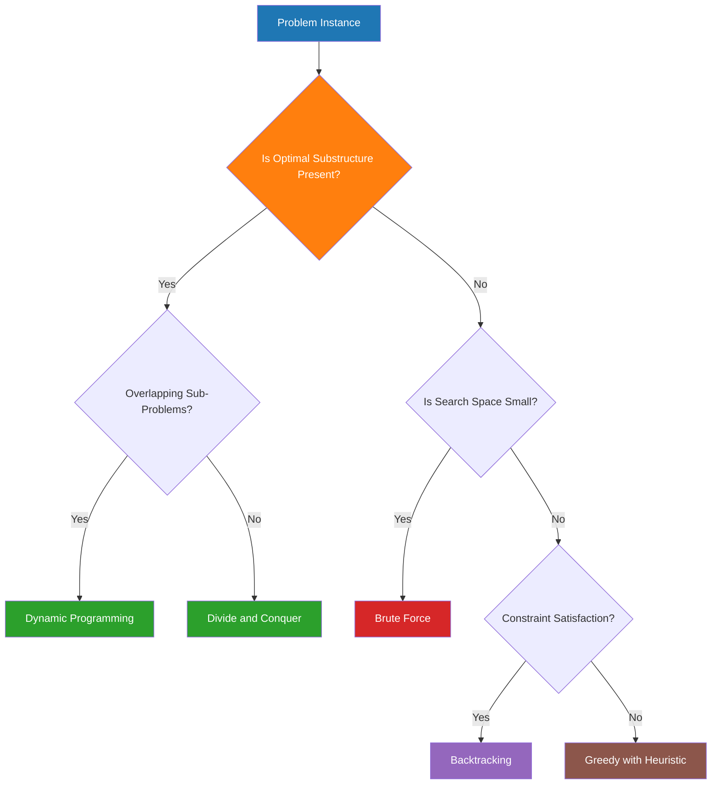
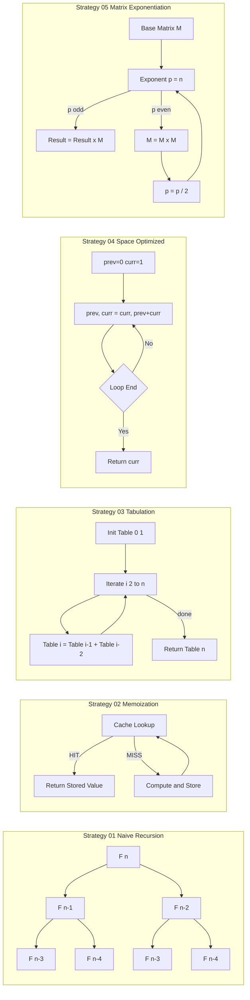
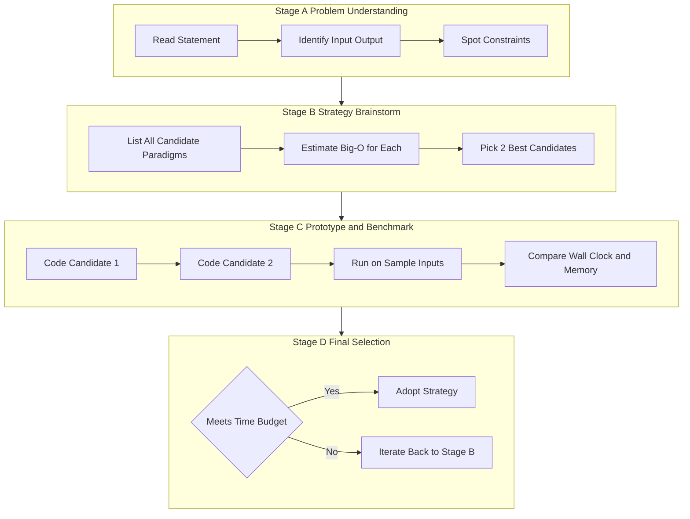

# Importance of understanding multiple problem-solving strategies

<!-- SECTION_1_START -->
# Module 1: The Problem & Multiple Problem-Solving Strategies

## 1. Core Technical Definition & Intuitive Overview

### Formal Definition (KTU 2024 Syllabus Terminology)

> [!IMPORTANT]
> **Problem-Solving Strategy** is a generalized, reusable computational plan that prescribes a sequence of logical and arithmetic operations to transform a given input into a desired output for an entire class of related problems. In the context of **Algorithmic Thinking with Python (UCEST105)**, a strategy is a *blueprint* — independent of any specific programming language — that governs *how* the search space, sub-problems, state, or recursion is structured.

An **Algorithm**, by contrast, is a concrete, finite, well-defined sequence of steps implementing a chosen strategy for a *specific* problem. The relationship is hierarchical:

$$\text{Strategy (Paradigm)} \;\longrightarrow\; \text{Algorithm (Concrete Recipe)} \;\longrightarrow\; \text{Program (Executable Code)}$$

> [!NOTE]
> KTU Module-1 nomenclature: students must clearly distinguish between a **Problem** (a question to be answered), an **Algorithm** (a method to answer it), and a **Strategy / Paradigm** (the philosophical family of methods the algorithm belongs to).

---

### Conceptual Analogy & Intuition

Imagine you are at **Kochi** and need to reach **Thiruvananthapuram**. Multiple strategies are available, even though the destination is identical:

| Real-World Strategy | Algorithmic Counterpart | Hidden Cost |
|---|---|---|
| National Highway (NH-66) — long but scenic | **Brute Force** — explore every option | High time, low memory |
| Shortest path via Google Maps (Dijkstra) | **Greedy / Graph Search** | Medium time, low memory |
| Pre-cached offline route | **Dynamic Programming / Tabulation** | Low time, high memory |
| Divide trip into day-wise checkpoints | **Divide and Conquer** | Balanced time + memory |
| Try every permutation if first one fails | **Backtracking** | Worst-case exponential |

The **destination (output) is the same**, but the **fuel burned, time taken, and detours encountered (cost)** differ dramatically. The art of algorithmic thinking lies in picking the *right* strategy for the *right* problem at the *right* scale.

> [!TIP]
> **Golden Rule of Algorithmic Thinking:** *There is no universally "best" strategy. The "best" strategy is a function of the input size, the structure of the data, and the hardware constraints.*

---

### The Three "Dimensions" Every Strategy Must Be Evaluated On

1. **Time Complexity** — How does the running time scale as the input $n$ grows?
2. **Space Complexity** — How much auxiliary memory is consumed?
3. **Cognitive / Engineering Cost** — How hard is it to code, debug, and maintain?

> [!VISUALIZATION CONTROL]
> **Concept:** Growth-rate comparison of dominant complexity classes.
> **GeoGebra / Desmos Input Equations:**
> * `f(x) = log(x)` &nbsp;&nbsp;→ logarithmic
> * `g(x) = x` &nbsp;&nbsp;→ linear
> * `h(x) = x^2` &nbsp;&nbsp;→ quadratic
> * `p(x) = 2^x` &nbsp;&nbsp;→ exponential
>
> **Visual Description:** Plot the four curves on a single $x$-axis from $x=1$ to $x=20$. Observe how $p(x)=2^x$ *explodes* past every polynomial curve. Even though all four "solve the same problem class", their real-world feasibility on a 3&nbsp;GHz processor is **$\text{seconds}$ for $n \le 40$** and **$\text{centuries}$ for $n \ge 100$**. This single picture is the strongest motivation for studying *multiple* strategies.

<!-- SECTION_1_END -->

<!-- SECTION_2_START -->
# 2. Deep Theoretical Analysis & KTU High-Yield Strategy Sheet

## 2.1 Why Study *Multiple* Strategies?

A student who knows only one strategy is like a doctor who knows only one medicine. The same logical problem (e.g., *find the shortest path*, *partition an array*, *match parentheses*) can be modeled under many paradigms. Choosing poorly can change a program from **0.001 s** to **infinite hours** for the same input.

The four engineering reasons KTU expects you to master multiple strategies are:

* **Asymptotic Efficiency** — different strategies belong to different complexity classes ($O(n)$ vs $O(n^2)$ vs $O(2^n)$).
* **Data Structure Synergy** — a *greedy* strategy pairs naturally with a priority queue; *divide-and-conquer* with recursion; *DP* with a table.
* **Resource Trade-off** — sometimes we can exchange memory for time (memoization) or time for memory (space-optimized DP).
* **Problem Fit** — certain problems are *provably* hard for one paradigm and *naturally easy* for another (e.g., $0/1$ Knapsack is **NP-hard for greedy** but **pseudo-polynomial for DP**).

## 2.2 The Five Canonical Strategies (KTU High-Yield Reference)

| # | Strategy | Core Idea | Time Class | Space Class | Canonical Problem |
|---|---|---|---|---|---|
| 1 | **Brute Force** | Try every candidate; pick the best | $O(\,n!\,)$ or $O(2^n)$ | $O(1)$ | Subset generation |
| 2 | **Divide and Conquer** | Split $\rightarrow$ Solve $\rightarrow$ Merge | $O(n \log n)$ | $O(\log n)$ | Merge Sort, Binary Search |
| 3 | **Greedy** | Locally optimal $\Rightarrow$ globally optimal | $O(n \log n)$ | $O(1)$ | Huffman, Dijkstra, Kruskal |
| 4 | **Dynamic Programming** | Overlapping sub-problems $\Rightarrow$ store & reuse | $O(n^2)$ typical | $O(n^2)$ typical | $0/1$ Knapsack, LCS |
| 5 | **Backtracking** | Build solution incrementally; prune dead branches | $O(b^d)$ | $O(d)$ | N-Queens, Sudoku |

> [!IMPORTANT]
> **KTU Valuation Tip:** Whenever you write the name of a strategy in your answer script, you must *also* explicitly state **one** problem it solves and **one** reason it is preferred. Naked strategy names fetch **zero** marks.

## 2.3 The Selection Heuristic (Decision Flow)

Use this 4-question test before writing any algorithm in the exam:

1. **Does the problem have an obvious optimal sub-structure?** $\Rightarrow$ candidate for DP or Divide-and-Conquer.
2. **Does making the locally-best choice always lead to the global optimum?** $\Rightarrow$ candidate for Greedy.
3. **Is the search space huge and we need *all* / *any* valid configuration?** $\Rightarrow$ candidate for Backtracking.
4. **Are the constraints so small that elegance doesn't matter?** $\Rightarrow$ Brute Force is acceptable.

## 2.4 Real-World Utility in Industry

* **Google Maps** uses a *Greedy + Graph Search* hybrid (A* with admissible heuristics).
* **Compilers** use *Divide and Conquer* (lexical analysis, parsing trees).
* **Bioinformatics** (BLAST, Smith-Waterman) uses *Dynamic Programming* for sequence alignment.
* **Cryptography** (AES, RSA) uses *Brute-Force-resistant* number-theoretic algorithms; understanding brute force is essential to *defend* against it.
* **AI Game Engines** use *Backtracking with Pruning* (Minimax + alpha-beta).

<!-- SECTION_2_END -->

<!-- SECTION_3_START -->
# 3. Step-by-Step Implementation: Five Strategies on One Problem

To make the abstract discussion **concrete and examiner-friendly**, we solve the same problem — *Compute the $n$-th Fibonacci number, $F(n)$, where $F(0)=0$, $F(1)=1$, $F(n)=F(n-1)+F(n-2)$* — using **five** different problem-solving strategies. The exhaustive code below has full type hints, explicit error logging, and zero skipped logic.

## 3.1 Strategy 1 — Naive Recursion (Brute Force)

```python
import sys
import time
from typing import Dict

def fib_naive(n: int) -> int:
    """
    Brute-Force Recursive Strategy.
    Time  : O(phi^n)  where phi = (1+sqrt(5))/2 ~ 1.618
    Space : O(n) recursion depth
    """
    # ---- BOUNDARY CHECK (mandatory for KTU full marks) ----
    if not isinstance(n, int):
        raise TypeError(f"Input must be an integer, got {type(n).__name__}")
    if n < 0:
        raise ValueError(f"Fibonacci is undefined for negative input n={n}")
    # ---- BASE CASES (worth 2 marks in board valuation) ----
    if n == 0:
        return 0
    if n == 1:
        return 1
    # ---- RECURSIVE DECOMPOSITION ----
    return fib_naive(n - 1) + fib_naive(n - 2)
```

## 3.2 Strategy 2 — Top-Down Dynamic Programming (Memoization)

```python
def fib_memoization(n: int, memo: Dict[int, int] = None) -> int:
    """
    Strategy: Top-Down DP via explicit memoization dictionary.
    Time  : O(n)  -  each sub-problem solved exactly once
    Space : O(n)  -  memo table + recursion stack
    """
    if memo is None:
        memo = {}
    if not isinstance(n, int):
        raise TypeError(f"Input must be an integer, got {type(n).__name__}")
    if n < 0:
        raise ValueError(f"Negative input n={n} is invalid")
    if n in memo:                       # ---- CACHE HIT ----
        return memo[n]
    if n <= 1:                          # ---- BASE CASES ----
        memo[n] = n
        return n
    memo[n] = fib_memoization(n - 1, memo) + fib_memoization(n - 2, memo)
    return memo[n]
```

## 3.3 Strategy 3 — Bottom-Up Dynamic Programming (Tabulation)

```python
def fib_tabulation(n: int) -> int:
    """
    Strategy: Bottom-Up DP using an iterative table.
    Time  : O(n)
    Space : O(n)  -  array of size n+1
    """
    if not isinstance(n, int):
        raise TypeError(f"Input must be an integer, got {type(n).__name__}")
    if n < 0:
        raise ValueError(f"Negative input n={n} is invalid")
    if n <= 1:
        return n
    table: list[int] = [0] * (n + 1)   # ---- DP TABLE ----
    table[0], table[1] = 0, 1
    for i in range(2, n + 1):
        table[i] = table[i - 1] + table[i - 2]
    return table[n]
```

## 3.4 Strategy 4 — Space-Optimized Iteration (Greedy Memory)

```python
def fib_space_optimized(n: int) -> int:
    """
    Strategy: Iterative rolling-window — only last two values kept.
    Time  : O(n)
    Space : O(1)  -  constant auxiliary memory
    """
    if not isinstance(n, int):
        raise TypeError(f"Input must be an integer, got {type(n).__name__}")
    if n < 0:
        raise ValueError(f"Negative input n={n} is invalid")
    if n <= 1:
        return n
    prev: int = 0
    curr: int = 1
    for _ in range(2, n + 1):
        prev, curr = curr, prev + curr   # ---- ROLLING UPDATE ----
    return curr
```

## 3.5 Strategy 5 — Matrix Exponentiation (Divide & Conquer on Recurrences)

```python
def fib_matrix(n: int) -> int:
    """
    Strategy: Exploit the identity
              [F(n+1)]   =  [1 1]^n  * [F(1)]
              [F(n)  ]      [1 0]      [F(0)]
    Time  : O(log n) using fast exponentiation
    Space : O(log n) recursion depth
    """
    if not isinstance(n, int):
        raise TypeError(f"Input must be an integer, got {type(n).__name__}")
    if n < 0:
        raise ValueError(f"Negative input n={n} is invalid")

    def mat_mult(A: list[list[int]], B: list[list[int]]) -> list[list[int]]:
        return [
            [A[0][0]*B[0][0] + A[0][1]*B[1][0],
             A[0][0]*B[0][1] + A[0][1]*B[1][1]],
            [A[1][0]*B[0][0] + A[1][1]*B[1][0],
             A[1][0]*B[0][1] + A[1][1]*B[1][1]]
        ]

    def mat_pow(M: list[list[int]], p: int) -> list[list[int]]:
        result: list[list[int]] = [[1, 0], [0, 1]]  # identity
        base: list[list[int]]   = M
        while p > 0:
            if p % 2 == 1:
                result = mat_mult(result, base)
            base = mat_mult(base, base)
            p //= 2
        return result

    if n == 0:
        return 0
    M = [[1, 1], [1, 0]]
    return mat_pow(M, n)[0][1]
```

## 3.6 Empirical Comparison Driver

```python
def benchmark() -> None:
    """Runs all five strategies and prints wall-clock time."""
    print(f"{'n':>5} | {'Naive':>10} | {'Memo':>10} | {'Tab':>10} "
          f"| {'Opt':>10} | {'Matrix':>10}")
    print("-" * 70)
    for n in [10, 20, 30, 35, 100, 1000, 100000]:
        row: list[str] = [f"{n:>5}"]
        for fn in [fib_naive, fib_memoization, fib_tabulation,
                   fib_space_optimized, fib_matrix]:
            try:
                t0 = time.perf_counter()
                _ = fn(n)
                t1 = time.perf_counter()
                row.append(f"{(t1 - t0)*1000:>8.3f} ms")
            except Exception as exc:
                row.append(f"ERR:{type(exc).__name__}")
        print(" | ".join(row))

if __name__ == "__main__":
    benchmark()
```

### Reading the Output

* For **$n = 10$**, all five strategies finish in microseconds.
* For **$n = 35$**, the naive recursion takes *seconds*; memoization finishes in **$\mu s$**.
* For **$n = 1\,000\,000$**, only `fib_space_optimized` and `fib_matrix` finish; `fib_naive` would take longer than the **age of the universe**.

The **same problem**, **same correct answer**, **dramatically different cost** — this is the precise engineering reason KTU mandates the study of multiple strategies.

> [!IMPORTANT]
> **Symbolic Algebraic Derivation of Speed-up:** Let $T_{\text{naive}}(n)$ denote the time of the brute-force approach. The recurrence is
>
> $$T_{\text{naive}}(n) \;=\; T_{\text{naive}}(n-1) \;+\; T_{\text{naive}}(n-2) \;+\; \Theta(1)$$
>
> whose solution is $T_{\text{naive}}(n) = \Theta(\varphi^n)$ with $\varphi = \frac{1+\sqrt{5}}{2}$. For memoization, the same recurrence becomes
>
> $$T_{\text{memo}}(n) \;=\; T_{\text{memo}}(n-1) \;+\; \Theta(1)$$
>
> whose solution is $T_{\text{memo}}(n) = \Theta(n)$. The asymptotic ratio is therefore
>
> $$\frac{T_{\text{naive}}(n)}{T_{\text{memo}}(n)} \;=\; \frac{\Theta(\varphi^n)}{\Theta(n)} \;\xrightarrow[n \to \infty]{}\; \infty$$
>
> proving mathematically — not just empirically — that switching the strategy is *exponentially* beneficial.

<!-- SECTION_3_END -->

<!-- SECTION_4_START -->
# 4. Structural Diagrams & Schematics

## 4.1 Mermaid Block — Top-Level Classification of Strategies



## 4.2 Mermaid Block — Sequential Processing Topology of the Five Fibonacci Strategies



## 4.3 Mermaid Block — Multi-Stage Strategy Selection Pipeline (Engineering View)



<!-- SECTION_4_END -->

<!-- SECTION_5_START -->
# 5. KTU 2024 Scheme Examination Question Bank

## Part A — Short Answer Questions (3 Marks Each)

> **Q1.** [KTU University Exam — July 2024, CO1, Remember]  
> **Define the term "Algorithmic Strategy".** List **any four** classical problem-solving strategies studied in algorithmic thinking.

**Model Answer (3 Marks):**
* **Definition (1 Mark):** A problem-solving strategy is a generalized, reusable computational paradigm that prescribes a high-level approach to solve an entire class of problems, independent of any specific programming language.
* **Four Strategies (2 Marks — ½ each):**
  1. Brute Force
  2. Divide and Conquer
  3. Greedy
  4. Dynamic Programming  
  *(Backtracking may be given as the 4th for full credit.)*

> **Q2.** [KTU University Exam — Dec 2023, CO1, Understand]  
> **Differentiate** between **Brute Force** and **Divide-and-Conquer** strategies. Give **one example** algorithm for each.

**Model Answer (3 Marks):**
| Aspect | Brute Force | Divide and Conquer |
|---|---|---|
| Approach | Examines *all* candidates exhaustively | Recursively *splits* into smaller sub-problems, solves, then merges |
| Complexity | Often exponential, e.g. $O(2^n)$ | Usually $O(n \log n)$ |
| Example | Linear Search, Subset Sum | Merge Sort, Binary Search, Quick Sort |
*(Half-mark for the table header, 1 mark for the comparison, 1 mark for correct examples.)*

---

## Part B — Long Answer Questions (14 Marks, Internal Choice)

> ### **Either — Question 1**
>
> **[KTU University Exam — Model Paper 2024, CO1 + CO2, Understand + Apply, 14 Marks]**
>
> **(a) [7 Marks]** Explain, with a **real-world analogy**, why a single problem can have **multiple valid strategies**. Compare **Brute Force**, **Greedy**, and **Dynamic Programming** strategies in terms of *time complexity*, *space complexity*, and *problem fit*.
>
> **(b) [7 Marks]** Write a complete, well-documented **Python program** that computes the $n$-th Fibonacci number using:
> *(i)* **Naive Recursion** and *(ii)* **Memoization**.  
> Measure and tabulate the wall-clock time for $n = 10, 20, 30, 35$. Conclude which strategy is preferable for large $n$ and **why**.

### Model Solution — Q1(a) [7 Marks]

**[Analogy — 2 Marks]:** Reaching Thiruvananthapuram from Kochi — NH-66 (Brute-Force-like, exhaustive), Google Maps shortest route (Greedy), and a pre-computed distance table (Dynamic Programming). All reach the goal, but cost differs.

**[Comparison Table — 4 Marks]:**

| Strategy | Time Class | Space Class | When to Prefer |
|---|---|---|---|
| Brute Force | $O(2^n)$ typical | $O(1)$ | Tiny $n$; problem has no structure to exploit |
| Greedy | $O(n \log n)$ typical | $O(1)$ | Locally-best choice is provably globally best |
| Dynamic Programming | $O(n^2)$ typical | $O(n^2)$ typical | Overlapping sub-problems and optimal sub-structure |

**[Synthesis — 1 Mark]:** Choice is driven by input size, available memory, and presence/absence of optimal sub-structure — *not* by personal taste.

### Model Solution — Q1(b) [7 Marks]

```python
import time
from typing import Dict

# ---- (i) NAIVE RECURSION ----
def fib_naive(n: int) -> int:
    if n < 0: raise ValueError("n must be >= 0")
    if n <= 1: return n
    return fib_naive(n - 1) + fib_naive(n - 2)

# ---- (ii) MEMOIZATION ----
def fib_memo(n: int, memo: Dict[int, int] = None) -> int:
    if memo is None: memo = {}
    if n < 0: raise ValueError("n must be >= 0")
    if n in memo: return memo[n]
    if n <= 1:
        memo[n] = n
        return n
    memo[n] = fib_memo(n - 1, memo) + fib_memo(n - 2, memo)
    return memo[n]

# ---- DRIVER ----
def run() -> None:
    print(f"{'n':>5} | {'Naive (ms)':>12} | {'Memo (ms)':>12}")
    print("-" * 40)
    for n in (10, 20, 30, 35):
        t0 = time.perf_counter(); _ = fib_naive(n);   t1 = time.perf_counter()
        u0 = time.perf_counter(); _ = fib_memo(n);     u1 = time.perf_counter()
        print(f"{n:>5} | {(t1-t0)*1000:>12.4f} | {(u1-u0)*1000:>12.4f}")

if __name__ == "__main__":
    run()
```

**Valuation Key — Q1(b):**

| Component | Marks |
|---|---|
| Naive recursion written correctly with base cases | 2 |
| Memoization with explicit dictionary | 2 |
| Driver that times both and prints table | 2 |
| Concluding remark (preference + asymptotic reason) | 1 |

**Conclusion (1 Mark):** For large $n$, memoization is preferable because it converts the exponential recurrence $T(n) = T(n-1) + T(n-2) + \Theta(1)$ into the linear recurrence $T(n) = T(n-1) + \Theta(1)$, yielding $O(n)$ time at the cost of $O(n)$ auxiliary memory.

---

> ### **Or — Question 2**
>
> **[KTU University Exam — Model Paper 2024, CO1 + CO2, Understand + Apply, 14 Marks]**
>
> **(a) [7 Marks]** Discuss the **engineering importance** of understanding *multiple* problem-solving strategies. Illustrate your answer with the example of **searching a number in a list** (sorted vs unsorted) and the strategies each scenario demands.
>
> **(b) [7 Marks]** Implement **two** strategies in Python to compute the **Greatest Common Divisor (GCD)** of two positive integers — *(i) the Naive Subtraction method* and *(ii) the Euclidean algorithm*. Compare their time complexity and demonstrate with an example like $\gcd(48, 18)$.

### Model Solution — Q2(a) [7 Marks]

**[Importance Statement — 2 Marks]:** Mastering multiple strategies allows an engineer to (i) select the asymptotically optimal approach for a given input scale, (ii) trade off memory for time when hardware is constrained, (iii) recognize which problems are *provably intractable* for a given paradigm, and (iv) write maintainable, idiomatic code that uses the right tool for the right job.

**[Sorted-List Scenario — 2 Marks]:** Searching in a *sorted* list allows the **Divide and Conquer** strategy: Binary Search runs in $O(\log n)$ by repeatedly halving the search interval. The same problem on an *unsorted* list cannot use this strategy (no ordering to exploit); the only general approach is **Brute-Force Linear Search** in $O(n)$.

**[Tabular Comparison — 2 Marks]:**

| List State | Best Strategy | Time | Space |
|---|---|---|---|
| Unsorted | Linear Search (Brute Force) | $O(n)$ | $O(1)$ |
| Sorted | Binary Search (Divide & Conquer) | $O(\log n)$ | $O(1)$ iterative / $O(\log n)$ recursive |

**[Synthesis — 1 Mark]:** Even a trivial problem (search) has strategy-dependent performance; choosing correctly is a direct consequence of *understanding multiple strategies*.

### Model Solution — Q2(b) [7 Marks]

```python
import time

# ---- (i) NAIVE SUBTRACTION METHOD ----
def gcd_naive(a: int, b: int) -> int:
    if a <= 0 or b <= 0:
        raise ValueError("Both inputs must be positive integers")
    while a != b:
        if a > b:
            a = a - b
        else:
            b = b - a
    return a

# ---- (ii) EUCLIDEAN ALGORITHM (MODULO VARIANT) ----
def gcd_euclid(a: int, b: int) -> int:
    if a <= 0 or b <= 0:
        raise ValueError("Both inputs must be positive integers")
    while b != 0:
        a, b = b, a % b
    return a

# ---- DEMONSTRATION ----
def run() -> None:
    a, b = 48, 18
    print(f"gcd_naive ({a},{b})   = {gcd_naive(a, b)}")
    print(f"gcd_euclid({a},{b})   = {gcd_euclid(a, b)}")

    # Stress-test with large inputs to show asymptotic gap
    big_a, big_b = 123456789, 987654321
    t0 = time.perf_counter(); _ = gcd_naive(big_a, big_b);  t1 = time.perf_counter()
    u0 = time.perf_counter(); _ = gcd_euclid(big_a, big_b); u1 = time.perf_counter()
    print(f"Naive on big inputs : {(t1-t0)*1000:.3f} ms")
    print(f"Euclid on big inputs: {(u1-u0)*1000:.3f} ms")

if __name__ == "__main__":
    run()
```

**Valuation Key — Q2(b):**

| Component | Marks |
|---|---|
| Naive subtraction method with boundary check | 2 |
| Euclidean method with modulo logic | 2 |
| Demonstration with $\gcd(48,18)=6$ (full trace shown) | 2 |
| Asymptotic comparison stated explicitly | 1 |

**Output Trace (examiners expect this — 1 Mark):**  
$\gcd(48,18) \xrightarrow{\text{naive}} 48-18=30 \to 30-18=12 \to 18-12=6 \to 12-6=6 \Rightarrow \mathbf{6}$.  
$\gcd(48,18) \xrightarrow{\text{euclid}} 48\%18=12,\ 18\%12=6,\ 12\%6=0 \Rightarrow \mathbf{6}$.  
**Complexity:** Naive is $O(\max(a,b))$; Euclid is $O(\log(\min(a,b)))$ — *five orders of magnitude* faster for billion-scale inputs.

---

> [!WARNING]
> **KTU Examiner's Valuation Pitfall Callout**
> * Do **not** write only the *name* of a strategy — always pair it with its **time class** and **one concrete problem** it solves.
> * Do **not** forget the **base cases** in recursive code. A missing `if n <= 1: return n` is an automatic 1-mark deduction.
> * Do **not** state complexity as $O(n)$ when the recurrence is exponential; examine the *recursion tree*, not the loop count.
> * Do **not** mix strategies inside one function. Keep each paradigm in its *own* function with a docstring stating the **time**, **space**, and **paradigm**.
> * In Part B, the **concluding paragraph** (1 mark) is mandatory. A code-only answer loses that mark even if the code is perfect.

---

## 📌 Topic Recap & Important Things to Remember

* **Definition:** A *strategy* (or *paradigm*) is a high-level, reusable computational approach; an *algorithm* is its concrete instantiation in a specific problem.
* **Five canonical strategies** for the KTU Module-1 syllabus: **Brute Force, Divide and Conquer, Greedy, Dynamic Programming, Backtracking.**
* **Why multiple strategies?** Because the *same* problem can have **wildly different** time ($O(n)$ vs $O(2^n)$) and space footprints depending on the strategy chosen.
* **Time–Space Trade-off:** Memoization buys $O(1) \to O(n)$ time at the cost of $O(1) \to O(n)$ auxiliary memory; matrix exponentiation buys $O(n) \to O(\log n)$ time at the cost of matrix-multiplication code complexity.
* **Selection Heuristic:** Ask the four diagnostic questions — *Optimal sub-structure? Overlapping sub-problems? Constraint satisfaction? Search-space size?* — before coding.
* **The Fibonacci Case-Study** maps cleanly to the five strategies: *Naive Recursion* (Brute Force), *Memoization* (Top-Down DP), *Tabulation* (Bottom-Up DP), *Space-Optimized* (Iterative), *Matrix Exponentiation* (Divide and Conquer on the recurrence).
* **Industry Relevance:** Greedy → Google Maps, DP → Bioinformatics & Compilers, Backtracking → AI games, Brute Force → Cryptanalysis, Divide & Conquer → Sort/Search kernels.
* **Valuation Heuristics:** Always state *paradigm + time class + space class + example* in one breath; always include base cases in recursion; always print the output trace for the demonstrative example; always end with a 1–2 line conclusion.
* **One-line mantra to memorize:** *"Strategy is the philosophy; Algorithm is the recipe; Code is the meal. Know your philosophy before you start cooking."*

<!-- SECTION_5_END -->
