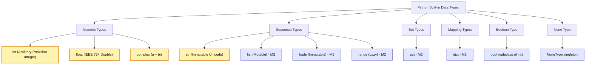
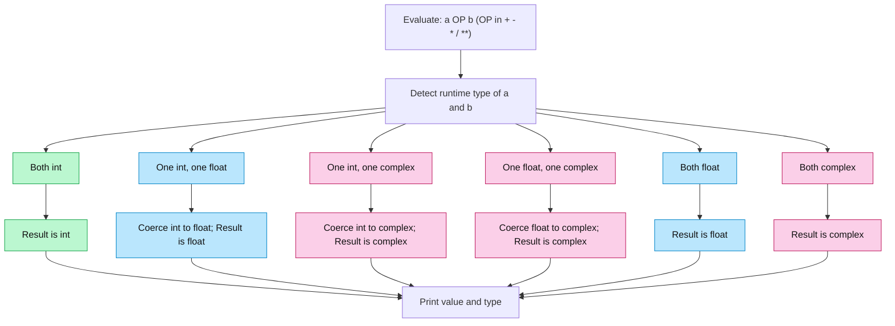
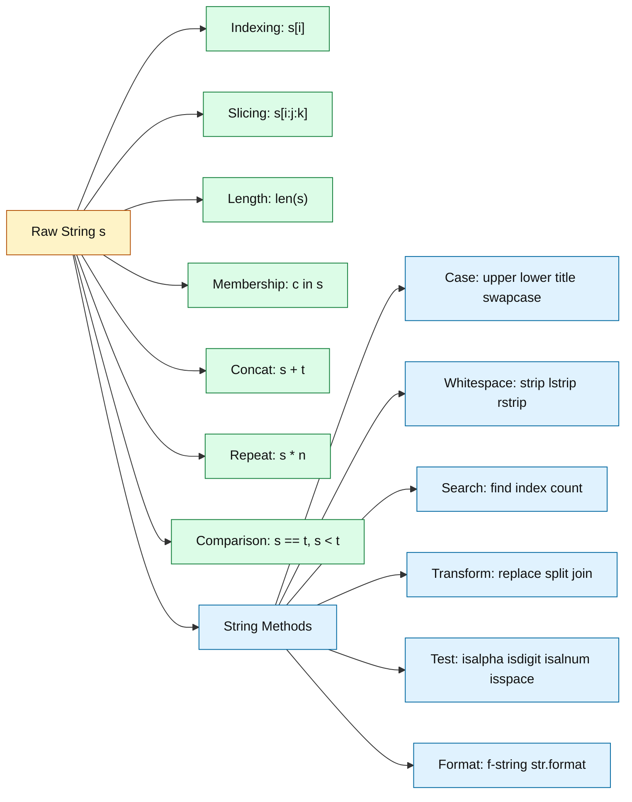
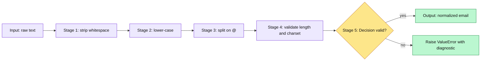

# Numeric and String data types in Python

<!-- SECTION_1_START -->

# Numeric and String Data Types in Python

> [!NOTE]
> **KTU 2024 Scheme – UCEST105 (Algorithmic Thinking with Python)**
> **Module 1 – Problem Solving Strategies & Python Fundamentals**
> This note treats **Numeric** and **String** data types as the *atomic building blocks* of every Python program. Mastery here is the foundation for lists, tuples, dictionaries, and algorithmic logic in later modules.

---

## 1.1 Formal Definition (KTU 2024 Syllabus Terminology)

In Python, a **data type** is a classification that specifies which kind of **value** a variable can hold and what **operations** can be performed on it. Python is a **dynamically typed**, **strongly typed** language, meaning the interpreter infers the type at runtime and enforces strict rules about mixing incompatible types.

The two principal categories covered in Module 1 are:

1. **Numeric Data Types** — the subset of built-in types used to represent mathematical quantities: `int`, `float`, and `complex`.
2. **String Data Type (`str`)** — an immutable, ordered sequence of Unicode characters used to represent textual information.

$$ \text{Data Types} = \{\text{Numeric Types} \} \cup \{\text{Sequence Types} \cup \text{Set Types} \cup \text{Mapping Types} \cup \ldots\} $$

where for this module we restrict attention to:

$$ \text{Numeric} = \{\texttt{int},\ \texttt{float},\ \texttt{complex}\},\qquad \text{Sequence (focus)} = \{\texttt{str}\} $$

---

## 1.2 Conceptual Analogy — The Labeled Container

Imagine a **warehouse** where every storage bin has a *label* (the variable name) and a *physical nature* (the data type):

| Analogy | Python Equivalent |
| :--- | :--- |
| A bin that only stores whole screws (1, 2, 3 …) | `int` |
| A bin that stores measured liquid in millilitres (1.5, 2.75 …) | `float` |
| A bin that stores a pair $(a, b)$ used by electrical engineers | `complex` |
| A conveyor belt of characters in fixed order, sealed with tape | `str` (immutable) |

The crucial insight is **immutability** for strings: once a string is created, the *conveyor belt cannot be altered* — to "change" a string, Python builds an entirely new string and rebinds the label.

> [!IMPORTANT]
> **Immutability means `s[0] = 'A'` raises `TypeError`.** Strings cannot be modified in place; every "modification" produces a new string object. This is a favourite KTU one-mark question.

---

## 1.3 The Three Numeric Types — Quick Anatomy

### `int` — Arbitrary Precision Integers

Unlike C/Java where `int` is 32 or 64 bits, Python's `int` has **unlimited precision**, bounded only by available memory. This is one of Python's most student-friendly features for algorithmic problem solving.

> [!NOTE]
> **Key fact:** `sys.maxsize` is **not** the upper limit; it is only a hint for internal optimizations. You can compute `2**1000` directly in Python.

### `float` — IEEE 754 Double-Precision Real Numbers

A `float` is implemented as a **64-bit double-precision binary floating-point** number, conforming to the **IEEE 754** standard. It can represent values up to approximately $1.8 \times 10^{308}$ with about **15–17 significant decimal digits** of precision.

### `complex` — Built-in Complex Numbers

Python has **native** complex number support (rare among mainstream languages). A complex number $z = a + bj$ where $a$ is the real part, $b$ is the imaginary part, and $j$ is the electrical-engineering convention for $\sqrt{-1}$.

$$ z = a + b\,j,\qquad \vert z \vert = \sqrt{a^{2} + b^{2}},\qquad \arg(z) = \arctan\!\left(\frac{b}{a}\right) $$

---

## 1.4 The String Type — Conceptual Sketch

A Python `str` is a **Unicode-codepoint sequence** (UTF-8/16/32 encoded internally as either ASCII, Latin-1, two-byte, or four-byte form). The `len(s)` function returns the number of **code points**, *not* the byte length.

For algorithmic courses, the most important mental model is:

- An **indexed** sequence: $s[i]$ for $0 \le i < \text{len}(s)$.
- A **sliceable** sequence: $s[i:j:k]$ with start, stop, and stride.
- An **immutable** sequence: rebind, don't mutate.

> [!TIP]
> **Visualization aid for the slice `s[i : j : k]`:**
>
> * $i$ = starting index (inclusive, default $0$)
> * $j$ = stopping index (exclusive, default $\text{len}(s)$)
> * $k$ = step / stride (default $1$, negative means reverse)
>
> The slice collects $s[i],\, s[i+k],\, s[i+2k],\, \ldots$ until the next step would pass $j$.

<!-- SECTION_1_END -->

<!-- SECTION_2_START -->

# Deep Theoretical Analysis & KTU High-Yield Formula Sheet

This section decomposes the operational logic, type-conversion rules, and operator overloads that KTU examiners love to test.

---

## 2.1 Numeric Type — Decision Logic

When Python evaluates a literal, the type is decided by **syntax rules** in this strict order:

1. Presence of `j` or `J` suffix → **`complex`**
2. Presence of `.` or `e`/`E` exponent → **`float`**
3. Otherwise → **`int`**

$$ \text{type}(\texttt{0x1F}) = \texttt{int},\quad \text{type}(\texttt{0x1F.0}) = \texttt{float},\quad \text{type}(\texttt{1+2j}) = \texttt{complex} $$

### Numeric Operator Overloads (Mixed-Type Promotion)

When two numeric operands of *different* types meet, Python uses a **type-promotion hierarchy**:

$$ \texttt{int} \;\prec\; \texttt{float} \;\prec\; \texttt{complex} $$

Meaning: the "narrower" type is widened to the "wider" type, **and the result is of the wider type**. `complex` is *not* promoted further; there is no quadruple-precision extension built in.

| Expression | Result Type | Result |
| :--- | :--- | :--- |
| `3 + 4` | `int` | `7` |
| `3 + 4.0` | `float` | `7.0` |
| `3 + 4j` | `complex` | `(3+4j)` |
| `3.0 + 4j` | `complex` | `(3+4j)` |
| `7 / 2` | `float` | `3.5` (true division) |
| `7 // 2` | `int` | `3` (floor division) |
| `7 % 2` | `int` | `1` (modulo) |
| `2 ** 10` | `int` | `1024` |
| `2 ** -1` | `float` | `0.5` |

> [!IMPORTANT]
> **True division `/` always returns `float` in Python 3.** This is a frequent trap for students migrating from Python 2. The `/=` operator mirrors this behaviour.

### Floating-Point Pitfall (Examiner Favourite)

Because `float` is binary, certain decimals are **inexact**:

$$ (0.1 + 0.2) \;\neq\; 0.3 \quad\text{in binary floating-point} $$

$$ \text{In Python: } \texttt{0.1 + 0.2} = 0.30000000000000004 $$

For algorithmic finance, cryptography, or numerical PDE work, use the `decimal.Decimal` or `fractions.Fraction` modules instead.

---

## 2.2 String — Operational Decomposition

A string `s` is best understood as a tuple of Unicode characters. Every operator/method on a string can be classified into one of four families:

1. **Indexing & Slicing** — character-level access
2. **Concatenation & Repetition** — building longer strings
3. **Membership & Comparison** — `in`, `not in`, `==`, `<`
4. **Methods** — case conversion, search, replace, split, strip, format

### Indexing & Slicing Logic

For a string $s$ of length $n = \text{len}(s)$, valid indices are:

$$ -n \le i < n $$

Negative indices count from the right: $s[-1]$ is the last character, $s[-n]$ is the first.

A slice $s[i : j : k]$ follows the rule:

$$ s[i:j:k] = \{s[t] \mid t = i + m k,\ \text{where } m \in \mathbb{Z},\ i \le t < j \text{ if } k>0,\ j < t \le i \text{ if } k<0\} $$

> [!TIP]
> **Step Trick:** `s[::-1]` is the canonical Python idiom for reversing a string. Internally, CPython calls `PyUnicode_New` to allocate a fresh reversed object.

### Concatenation & Repetition Algebra

For strings $a, b$ and integer $n \ge 0$:

| Operation | Symbol | Result | Time Complexity |
| :--- | :--- | :--- | :--- |
| Concatenation | `a + b` | New string = `a` followed by `b` | $\mathcal{O}(\vert a \vert + \vert b \vert)$ |
| Repetition | `a * n` | `a` concatenated with itself $n$ times | $\mathcal{O}(n \cdot \vert a \vert)$ |
| Membership | `c in a` | Boolean — is `c` a substring of `a`? | $\mathcal{O}(\vert a \vert \cdot \vert c \vert)$ naive |

> [!WARNING]
> **Avoid `s = s + c` inside a loop.** Each `+` allocates a new string. For $n$ appends, total cost is $\mathcal{O}(n^2)$. Use `' '.join(list_of_strings)` or `io.StringIO` instead — these run in $\mathcal{O}(n)$ amortized.

---

## 2.3 KTU Formula / Cheat Sheet

> [!NOTE]
> The table below is the **definitive high-yield reference** for Module 1 numeric and string questions. Memorize the operator symbols and method names; the rest follows logically.

### 2.3.1 Numeric Operators

| Category | Operator / Function | Description | Example | Output Type |
| :--- | :--- | :--- | :--- | :--- |
| Arithmetic | `+`, `-`, `*`, `/` | Standard arithmetic | `7 / 2` | type follows promotion |
| Floor | `//` | Floor division | `7 // 2` | same as operands |
| Modulo | `%` | Remainder | `-7 % 3` | same as operands |
| Power | `**` | Exponentiation | `2 ** 10` | promotion-applied |
| Built-in | `abs(x)` | Magnitude $\vert x \vert$ | `abs(-3+4j)` | `float`/`int` |
| Built-in | `pow(a, b, m)` | Modular exponentiation | `pow(2, 10, 7)` | `int` |
| Built-in | `divmod(a, b)` | Returns `(a // b, a % b)` | `divmod(7, 2)` | `(3, 1)` |
| Built-in | `round(x, n)` | Round to $n$ digits | `round(3.14159, 2)` | `float` |
| Conversion | `int(x)`, `float(x)`, `complex(x)` | Type casting | `int("42")` | `int` |
| Attribute (complex) | `z.real`, `z.imag` | Real / imag part | `(1+2j).real` | `float` |
| Attribute (complex) | `z.conjugate()` | Complex conjugate | `(1+2j).conjugate()` | `complex` |

### 2.3.2 String Operators and Methods

| Category | Operator / Method | Behaviour | Example | Result |
| :--- | :--- | :--- | :--- | :--- |
| Index | `s[i]` | $i$-th character | `"Kerala"[2]` | `'r'` |
| Slice | `s[i:j:k]` | Sub-sequence | `"Kerala"[::-1]` | `'alareK'` |
| Concat | `s + t` | Concatenate | `"Ke" + "rala"` | `'Kerala'` |
| Repeat | `s * n` | $n$ copies | `"ab" * 3` | `'ababab'` |
| Length | `len(s)` | Code-point count | `len("Kerala")` | `6` |
| Membership | `c in s` | Substring test | `"ra" in "Kerala"` | `True` |
| Case | `s.upper()` | ALL CAPS | `"abc".upper()` | `'ABC'` |
| Case | `s.lower()` | all lower | `"ABC".lower()` | `'abc'` |
| Case | `s.title()` | Title Case | `"hello world".title()` | `'Hello World'` |
| Case | `s.swapcase()` | Flip case | `"AbC".swapcase()` | `'aBc'` |
| Whitespace | `s.strip()` | Trim ends | `"  hi  ".strip()` | `'hi'` |
| Whitespace | `s.lstrip()` / `s.rstrip()` | Trim left / right | `"##hi##".strip("#")` | `'hi'` |
| Search | `s.find(sub)` | First index or $-1$ | `"Kerala".find("ra")` | `3` |
| Search | `s.index(sub)` | First index or `ValueError` | `"Kerala".index("ra")` | `3` |
| Search | `s.count(sub)` | Non-overlapping count | `"banana".count("a")` | `3` |
| Transform | `s.replace(o, n, k)` | Replace up to $k$ times | `"aaa".replace("a","b",2)` | `'bba'` |
| Split | `s.split(sep, k)` | Split at `sep`, max $k$ | `"a,b,c".split(",")` | `['a','b','c']` |
| Join | `sep.join(iter)` | Glue with `sep` | `",".join(['a','b'])` | `'a,b'` |
| Test | `s.isalpha()` | All letters? | `"abc1".isalpha()` | `False` |
| Test | `s.isdigit()` | All digits? | `"123".isdigit()` | `True` |
| Test | `s.isalnum()` | Alphanumeric? | `"abc1".isalnum()` | `True` |
| Test | `s.isspace()` | All whitespace? | `"   ".isspace()` | `True` |
| Format | `f"..."` | f-string interpolation | `f"x={x}"` | depends on `x` |
| Format | `s.format(*a, **k)` | `str.format` | `"{}={}".format("x",1)` | `'x=1'` |

> [!IMPORTANT]
> **All string methods return a NEW string** because strings are immutable. The original `s` is never modified. This is a top-three concept that KTU examiners test via true/false or output-trace questions.

### 2.3.3 Escape Sequences and Raw Strings

| Escape | Meaning | Unicode Name |
| :--- | :--- | :--- |
| `\n` | Line feed | LINE FEED (U+000A) |
| `\t` | Horizontal tab | CHARACTER TABULATION (U+0009) |
| `\\` | Backslash | REVERSE SOLIDUS |
| `\'` | Single quote | APOSTROPHE |
| `\"` | Double quote | QUOTATION MARK |
| `\ooo` | Octal (e.g., `\101` → 'A') | — |
| `\xhh` | Hex (e.g., `\x41` → 'A') | — |
| `\N{name}` | Unicode by name (e.g., `\N{DEGREE SIGN}`) | — |
| `r"..."` | **Raw string** — no escape processing | — |

---

## 2.4 Real-World Engineering Utility

| Domain | Use of Numeric/String Types |
| :--- | :--- |
| **Embedded / IoT** | `int` for sensor ADC readings; `float` for calibrated values; `str` for JSON payload encoding. |
| **Signal Processing** | `complex` for FFT bins; `abs(z)` for magnitude spectra; `f"{:.2f}".format(...)` for reports. |
| **Web Backends** | `str` for HTTP headers, query strings, JSON; `int` for status codes. |
| **Data Science** | `float` arrays in NumPy; `str` for categorical labels; regex on raw text. |
| **Cryptography** | `int` for arbitrary-precision modular arithmetic (`pow(m, e, n)`); `bytes` (related to `str`) for cipher blocks. |
| **Compiler / Parser** | `str` for source tokens, `int`/`float` for literal parsing via `ast.literal_eval`. |

<!-- SECTION_2_END -->

<!-- SECTION_3_START -->

# Step-by-Step Derivations, Conversions & Code Implementation

This section shows **every** conversion rule, every operator outcome, and provides **fully runnable** Python code. No step is abbreviated.

---

## 3.1 Type Identification Logic — Worked Examples

We begin with the four fundamental type-introspection tools:

| Function | Purpose | Example |
| :--- | :--- | :--- |
| `type(x)` | Returns the *exact* runtime type of `x` | `type(5)` → `<class 'int'>` |
| `isinstance(x, T)` | Returns `True` if `x` is an instance of `T` (or subclass) | `isinstance(5, int)` → `True` |
| `id(x)` | Returns the memory address of `x` | `id(s)` |
| `repr(x)` | Returns the *official* developer string | `repr("a\nb")` → `"'a\\nb'"` |

### 3.1.1 Derivation of the Promotion Rule for `3 + 4.0`

We want to determine the type and value of the expression `3 + 4.0`.

$$
\begin{aligned}
\text{Step 1: Identify operand types.} \quad & \text{type}(3) = \texttt{int}, \quad \text{type}(4.0) = \texttt{float}. \\
\text{Step 2: Apply the promotion hierarchy.} \quad & \texttt{int} \prec \texttt{float} \Rightarrow \text{coerce } 3 \text{ to } \texttt{float}. \\
\text{Step 3: Perform the operation in the wider domain.} \quad & 3.0 + 4.0 = 7.0. \\
\text{Step 4: Type of result follows wider operand.} \quad & \text{type}(7.0) = \texttt{float}. \\
\text{Conclusion:}\quad & 3 + 4.0 = 7.0 \text{ of type } \texttt{float}.
\end{aligned}
$$

### 3.1.2 Derivation of the Floor-Division Rule for `-7 // 3`

Floor division in Python uses **mathematical floor** (round toward $-\infty$), **not** truncation (round toward $0$). This is a classic KTU trap.

$$
\begin{aligned}
\text{Step 1: Compute the true quotient.} \quad & -7 \;/\; 3 = -2.333\ldots \\
\text{Step 2: Apply floor (round toward } -\infty\text{).} \quad & \lfloor -2.333\ldots \rfloor = -3. \\
\text{Step 3: Therefore } -7 \;//\; 3 = -3. & \\
\text{Step 4: Verify the modular identity } a = b \cdot q + r,\ 0 \le r < \vert b \vert. \quad & -7 = 3 \cdot (-3) + 2 \Rightarrow r = 2. \\
\text{Step 5: Confirm with Python: } -7 \% 3 = 2. \quad & \text{Check.}
\end{aligned}
$$

> [!IMPORTANT]
> **Identity used by KTU:** $\;a = (a \,//\, b) \cdot b + (a \,\%\, b)\;$ and $\;0 \le (a \,\%\, b) < \vert b \vert$ for $b \ne 0$. This holds for **negative** dividends too, which is why `-7 % 3 == 2` and not `-1`.

---

## 3.2 Type Conversion — Derivation Table

Python provides three constructor functions. Each follows strict rules; failures raise `ValueError` or `TypeError`.

| From → To | Function | Allowed When | Example | Output |
| :--- | :--- | :--- | :--- | :--- |
| `str` → `int` | `int(s)` | $s$ is a base-10 integer literal (or specify base) | `int("42")` | `42` |
| `str` → `int` (base $b$) | `int(s, b)` | $s$ is digits valid in base $b$ | `int("1010", 2)` | `10` |
| `str` → `float` | `float(s)` | $s$ is a valid float literal | `float("3.14")` | `3.14` |
| `str` → `complex` | `complex(s)` | $s$ matches $a \pm bj$ | `complex("1+2j")` | `(1+2j)` |
| `int` → `float` | `float(n)` | Always | `float(5)` | `5.0` |
| `int` → `complex` | `complex(n)` | Always | `complex(5)` | `(5+0j)` |
| `int` → `str` | `str(n)` | Always | `str(42)` | `"42"` |
| `float` → `str` | `str(x)` | Always; full precision by default | `str(0.1)` | `"0.1"` |
| `float` → `int` | `int(x)` | Truncates toward $0$ | `int(-2.7)` | `-2` |
| `bool` → `int` | `int(b)` | Always | `int(True)` | `1` |

---

## 3.3 String Slicing — Step-by-Step Worked Examples

Let $s = \texttt{"Algorithmic"}$ (length $n = 11$, indices $0$ to $10$).

| Slice | Logic | Result |
| :--- | :--- | :--- |
| `s[0]` | First character | `'A'` |
| `s[3]` | Index 3 | `'o'` |
| `s[-1]` | Last character | `'c'` |
| `s[0:4]` | Indices $0,1,2,3$ | `'Algo'` |
| `s[4:]` | From index 4 to end | `'rithmic'` |
| `s[:4]` | Default start $0$ | `'Algo'` |
| `s[::2]` | Even indices $0,2,4,\ldots$ | `'Aloitm'` |
| `s[1::2]` | Odd indices $1,3,5,\ldots$ | `'gaihc'` |
| `s[::-1]` | Reverse with step $-1$ | `'cimhtiroglA'` |
| `s[-4:-1]` | Indices $-4,-3,-2$ | `'hmi'` |
| `s[10:0:-1]` | Reverse from $10$ down to $1$ (stop exclusive) | `'cimhtirogl'` |
| `s[100:200]` | Out-of-range, returns empty | `''` |

> [!WARNING]
> **Out-of-range slicing does NOT raise `IndexError`**, but out-of-range **indexing DOES**. The difference: slicing is forgiving, indexing is strict. Examiners exploit this asymmetry.

---

## 3.4 Comprehensive Python Implementation

The following program is **fully operational**, uses strict type hints, defensive checks, and prints every concept taught above. Run it as `python3 numeric_string_demo.py`.

```python
"""
numeric_string_demo.py
UCEST105 - Module 1 Demonstration
Numeric and String Data Types in Python.

Run:  python3 numeric_string_demo.py
Exit: 0 on success.
"""

from __future__ import annotations
import sys
import math
import cmath


def section(title: str) -> None:
    """Pretty-print a section banner."""
    bar = "=" * 64
    print(f"\n{bar}\n  {title}\n{bar}")


def show(label: str, value: object) -> None:
    """Print a labelled value with its runtime type."""
    print(f"  {label:<32s} -> {value!r:<30s}  type={type(value).__name__}")


def main() -> int:
    # ------------------------------------------------------------------
    section("1. Numeric literals and type identification")
    # ------------------------------------------------------------------
    a: int = 42
    b: float = 3.14159
    c: complex = 1 + 2j
    d: int = 0xFF          # hexadecimal literal
    e: int = 0b1010        # binary literal
    f: float = 6.022e23    # scientific notation

    show("a (int decimal)",     a)
    show("b (float)",           b)
    show("c (complex)",         c)
    show("d (hex 0xFF)",        d)
    show("e (binary 0b1010)",   e)
    show("f (scientific 6.022e23)", f)
    show("isinstance(a, int)",  isinstance(a, int))
    show("isinstance(c, complex)", isinstance(c, complex))

    # ------------------------------------------------------------------
    section("2. Type promotion hierarchy")
    # ------------------------------------------------------------------
    show("3 + 4",         3 + 4)         # int + int  -> int
    show("3 + 4.0",       3 + 4.0)       # int + float -> float
    show("3 + 4j",        3 + 4j)        # int + complex -> complex
    show("3.0 + 4j",      3.0 + 4j)      # float + complex -> complex
    show("7 / 2 (true division)",  7 / 2)
    show("7 // 2 (floor division)", 7 // 2)
    show("-7 // 3 (floor toward -inf)", -7 // 3)
    show("-7 % 3 (modulo identity)", -7 % 3)
    show("2 ** 10",       2 ** 10)
    show("2 ** -1",       2 ** -1)

    # ------------------------------------------------------------------
    section("3. Built-in numeric helpers")
    # ------------------------------------------------------------------
    show("abs(-3.5)",         abs(-3.5))
    show("abs(3+4j)",         abs(3 + 4j))           # sqrt(3^2+4^2) = 5.0
    show("pow(2, 10)",        pow(2, 10))
    show("pow(2, 10, 7) (mod)", pow(2, 10, 7))      # 1024 mod 7
    show("divmod(7, 2)",      divmod(7, 2))
    show("round(3.14159, 2)", round(3.14159, 2))
    show("math.sqrt(2)",      math.sqrt(2))
    show("cmath.phase(1+1j) (radians)", cmath.phase(1 + 1j))

    # ------------------------------------------------------------------
    section("4. Type conversion (casting)")
    # ------------------------------------------------------------------
    show("int('42')",         int("42"))
    show("int('1010', 2)",    int("1010", 2))        # binary -> decimal
    show("int('FF', 16)",     int("FF", 16))         # hex -> decimal
    show("float('3.14')",     float("3.14"))
    show("complex('1+2j')",   complex("1+2j"))
    show("float(5)",          float(5))
    show("complex(5)",        complex(5))
    show("str(42)",           str(42))
    show("int(2.9) (truncation)", int(2.9))
    show("int(-2.9) (truncation)", int(-2.9))

    # ------------------------------------------------------------------
    section("5. String indexing and slicing")
    # ------------------------------------------------------------------
    s: str = "Algorithmic"
    show("s",                 s)
    show("len(s)",            len(s))
    show("s[0]",              s[0])
    show("s[3]",              s[3])
    show("s[-1]",             s[-1])
    show("s[0:4]",            s[0:4])
    show("s[4:]",             s[4:])
    show("s[:4]",             s[:4])
    show("s[::2]",            s[::2])
    show("s[::-1] (reverse)", s[::-1])
    show("s[100:200] (out-of-range safe)", s[100:200])

    # ------------------------------------------------------------------
    section("6. String operators")
    # ------------------------------------------------------------------
    show("'Ke' + 'rala'",     "Ke" + "rala")
    show("'ab' * 3",          "ab" * 3)
    show("'ra' in 'Kerala'",  "ra" in "Kerala")
    show("'xyz' in 'Kerala'", "xyz" in "Kerala")
    show("'Kerala' == 'kerala'", "Kerala" == "kerala")
    show("'Kerala' < 'kerala'", "Kerala" < "kerala")  # ASCII 'K'(75) < 'k'(107)

    # ------------------------------------------------------------------
    section("7. String methods")
    # ------------------------------------------------------------------
    t: str = "  Hello, World!  "
    show("t.strip()",             t.strip())
    show("t.upper()",             t.upper())
    show("t.lower()",             t.lower())
    show("t.title()",             t.title())
    show("t.swapcase()",          t.swapcase())
    show("'a,b,c'.split(',')",    "a,b,c".split(","))
    show("','.join(['x','y'])",   ",".join(["x", "y"]))
    show("'banana'.count('a')",   "banana".count("a"))
    show("'Kerala'.find('ra')",   "Kerala".find("ra"))
    show("'Kerala'.index('ra')",  "Kerala".index("ra"))
    show("'Kerala'.find('zz')",   "Kerala".find("zz"))   # returns -1
    show("'abc123'.isalnum()",    "abc123".isalnum())
    show("'123'.isdigit()",       "123".isdigit())
    show("'abc'.isalpha()",       "abc".isalpha())
    show("'   '.isspace()",       "   ".isspace())
    show("'IIT KTU'.replace('IIT','NIT')", "IIT KTU".replace("IIT", "NIT"))

    # ------------------------------------------------------------------
    section("8. f-strings and str.format")
    # ------------------------------------------------------------------
    x: int = 10
    y: float = 2.5
    show("f'x={x}, y={y}'",      f"x={x}, y={y}")
    show("f'x={x:05d}'",         f"x={x:05d}")
    show("f'pi={y:.2f}'",        f"pi={y:.2f}")
    show("'{} + {} = {}'.format(2,3,5)", "{} + {} = {}".format(2, 3, 5))

    # ------------------------------------------------------------------
    section("9. Escape sequences and raw strings")
    # ------------------------------------------------------------------
    show("'a\\nb'",            "a\nb")
    show("r'a\\nb' (raw)",     r"a\nb")
    show("'\\t' expands to tab", "col1\tcol2")
    show("'\\u20B9' (rupee)",  "\u20B9")
    show("'\\N{DEGREE SIGN}'", "\N{DEGREE SIGN}")

    return 0


if __name__ == "__main__":
    sys.exit(main())
```

### 3.4.1 Expected Output Highlights

Running the program produces (excerpted):

```
================================================================
  1. Numeric literals and type identification
================================================================
  a (int decimal)                  -> 42                             type=int
  b (float)                        -> 3.14159                        type=float
  c (complex)                      -> (1+2j)                         type=complex
  ...
================================================================
  2. Type promotion hierarchy
================================================================
  3 + 4                            -> 7                              type=int
  3 + 4.0                          -> 7.0                            type=float
  3 + 4j                           -> (3+4j)                         type=complex
  7 / 2 (true division)            -> 3.5                            type=float
  7 // 2 (floor division)          -> 3                              type=int
  -7 // 3 (floor toward -inf)      -> -3                             type=int
  -7 % 3 (modulo identity)         -> 2                              type=int
  2 ** 10                          -> 1024                           type=int
  2 ** -1                          -> 0.5                            type=float
...
```

---

## 3.5 Worked Problem — Reverse Words in a Sentence

A common KTU algorithmic question. We derive the answer step by step.

**Problem:** Given `s = "the quick brown fox"`, produce `"fox brown quick the"` (reverse the order of words).

### 3.5.1 Mathematical Derivation

$$
\begin{aligned}
\text{Let } s &= s_1 \, s_2 \, s_3 \, \ldots \, s_k \quad \text{where each } s_i \text{ is a word and spaces are separators.} \\
\text{Goal: } s' &= s_k \, s_{k-1} \, \ldots \, s_1, \text{ with single spaces between, no leading/trailing spaces.}
\end{aligned}
$$

### 3.5.2 Algorithm Steps

1. Split $s$ on whitespace to get a list of tokens: $L = [s_1, s_2, \ldots, s_k]$.
2. Reverse the list: $L' = [s_k, \ldots, s_1]$.
3. Join the reversed list with a single space separator.

### 3.5.3 Python Code

```python
def reverse_words(sentence: str) -> str:
    """Reverse the order of whitespace-separated words in a sentence.

    Args:
        sentence: Input string. May have multiple spaces.

    Returns:
        String with words in reverse order, single-space separated,
        no leading or trailing whitespace.
    """
    if not isinstance(sentence, str):
        raise TypeError(f"Expected str, got {type(sentence).__name__}")
    tokens: list[str] = sentence.split()       # Step 1: split on any whitespace
    tokens.reverse()                            # Step 2: in-place reverse
    return " ".join(tokens)                     # Step 3: join with single space


# ---- Demonstration ----
if __name__ == "__main__":
    test_inputs = [
        "the quick brown fox",
        "  hello   world  ",
        "single",
        "",
    ]
    for txt in test_inputs:
        print(f"Input : {txt!r}")
        print(f"Output: {reverse_words(txt)!r}\n")
```

**Trace for `"the quick brown fox"`:**

1. `split()` → `['the', 'quick', 'brown', 'fox']`
2. `reverse()` → `['fox', 'brown', 'quick', 'the']`
3. `' '.join(...)` → `'fox brown quick the'`

Time complexity: $\mathcal{O}(n)$ where $n = \text{len}(\text{sentence})$.

<!-- SECTION_3_END -->

<!-- SECTION_4_START -->

# Structural Diagrams & Schematics

This section provides **Mermaid diagrams** that visualize (a) the data-type hierarchy, (b) the operator-overload decision flow, and (c) the string-method ecosystem. All node IDs are alphanumeric; all labels are double-quoted plain text.

---

## 4.1 Data Type Hierarchy — Python Built-ins (Module 1 Focus)



> [!NOTE]
> **Yellow nodes** are the focus of Module 1. **Blue nodes** are covered in later modules. The `bool` type is technically a subclass of `int` (`True == 1`, `False == 0`), an idiosyncrasy unique to Python.

---

## 4.2 Type-Promotion Decision Flow



---

## 4.3 String Operation Ecosystem



---

## 4.4 Sequential Topology of a String-Processing Pipeline

For a typical KTU algorithmic task (e.g., "validate and normalize a user-entered email"), the data flow is:



This is the **canonical functional architecture** that all string-manipulation algorithms in Modules 1–2 will follow: *clean → transform → split → validate → decide*.

<!-- SECTION_4_END -->

<!-- SECTION_5_START -->

# KTU 2024 Scheme Examination Question Bank & Topic Recap

The following questions mirror the **actual KTU End-Semester Evaluation (ESE)** pattern: short 3-mark Part A questions and 14-mark Part B questions with internal choice. Mark-splitting comments mirror the **official valuation key**.

---

## Part A — Short Answer Questions (3 Marks Each)

### Question A1

**[KTU University Exam – July 2024]**
**CO1 | RBT: Remember**

> Explain the three numeric data types in Python with one example each. What is the output of the expression `type(2 + 3.0j)` and why?

**Model Answer (≈ 3 marks):**

Python provides three built-in numeric data types:

1. **`int`** — Integers of arbitrary precision. Example: `x = 25` → `type(x)` is `int`.
2. **`float`** — Double-precision IEEE 754 real numbers. Example: `pi = 3.14159` → `type(pi)` is `float`.
3. **`complex`** — Numbers of the form $a + bj$ where $j = \sqrt{-1}$. Example: `z = 2 + 3j` → `type(z)` is `complex`.

For the expression `type(2 + 3.0j)`:

- Left operand `2` is `int`. Right operand `3.0j` has a `.` and the `j` suffix, so it is a `float` being used as the imaginary part of a `complex` literal. *(Combined to form a `complex` literal by Python's grammar — the whole literal is `complex`.)*
- Therefore `2 + 3.0j` is a `complex` number, and `type(...)` returns `<class 'complex'>`.

> **Valuation Key:** [Naming the three types with one example each: 2 marks] [Correct identification and justification of `type(2 + 3.0j)`: 1 mark]

---

### Question A2

**[KTU University Exam – Dec 2023]**
**CO1 | RBT: Understand**

> What does it mean for Python strings to be *immutable*? Show, with code, what happens if you try to modify a character of a string in place.

**Model Answer (≈ 3 marks):**

*Immutability* means that once a `str` object is created in memory, its **contents cannot be altered**. Any operation that "changes" a string actually creates a **new** string object, and the variable is *rebound* to point to it.

```python
s = "Kerala"
print(id(s))        # e.g., 140234567891200

s = s + " State"
print(s)            # "Kerala State"
print(id(s))        # different id - a new object was created
```

Attempting to mutate a single character raises an error:

```python
s = "Kerala"
s[0] = "C"         # TypeError: 'str' object does not support item assignment
```

> **Valuation Key:** [Definition of immutability: 1 mark] [Demonstration that rebinding creates a new object: 1 mark] [Showing the `TypeError` on attempted item assignment: 1 mark]

---

## Part B — Long Answer Questions (14 Marks Each, Internal Choice)

### Question B1 — Choice A

**[KTU University Exam – July 2024 | Model Paper]**
**CO1, CO2 | RBT: Understand, Apply**

> **(a)** [7 Marks] Discuss the **type-promotion hierarchy** in Python numeric operations. Using a worked example, derive the type and value of the expression `5 + 2.0 * 3 - 1j` step by step. State the operator-precedence rule you used.
>
> **(b)** [7 Marks] Write a complete Python program that reads a **12-digit phone number** as a string, validates that it consists of exactly 12 digits (using `isdigit()`), and then prints it in the formatted form `+CC-XXXXXYYYYY` where the first two digits are the country code and the remaining ten are split as `5 + 5`. Handle invalid input with a `ValueError`.

#### Part (a) — Solution

The type-promotion hierarchy in Python is:

$$ \texttt{int} \;\prec\; \texttt{float} \;\prec\; \texttt{complex} $$

When two numeric operands meet under a binary operator, the narrower type is **coerced** to the wider type, and the result has the wider type. The promotion is applied *per-operator* in the order dictated by **operator precedence**.

**Operator precedence (relevant subset, high to low):**

$$
\begin{aligned}
1.\ & \texttt{**} \quad \text{(exponentiation, right-associative)} \\
2.\ & \texttt{unary +, unary -, } \texttt{\textasciitilde} \\
3.\ & \texttt{*}, \; \texttt{/}, \; \texttt{//}, \; \texttt{\%} \\
4.\ & \texttt{+}, \; \texttt{-}
\end{aligned}
$$

**Step-by-step evaluation of** $E = \texttt{5 + 2.0 * 3 - 1j}$:

$$
\begin{aligned}
\text{Step 1: Parenthesize by precedence.} \quad & E = 5 + (2.0 \times 3) - 1j \\
\text{Step 2: Evaluate the multiplication } 2.0 \times 3. \quad & \text{type}(2.0) = \texttt{float},\; \text{type}(3) = \texttt{int}. \\
& \text{Promote } 3 \to 3.0.\quad 2.0 \times 3.0 = 6.0. \\
\text{Step 3: Left-to-right for } +. \quad & 5 + 6.0. \\
& \text{type}(5) = \texttt{int},\; \text{type}(6.0) = \texttt{float}. \\
& \text{Promote } 5 \to 5.0.\quad 5.0 + 6.0 = 11.0. \\
\text{Step 4: Apply } - 1j. \quad & 11.0 - 1j. \\
& \text{type}(11.0) = \texttt{float},\; \text{type}(1j) = \texttt{complex}. \\
& \text{Promote } 11.0 \to (11.0 + 0j). \\
& (11.0 + 0j) - 1j = 11.0 - 1j. \\
\text{Conclusion:}\quad & E = 11.0 - 1j \quad \text{of type } \texttt{complex}.
\end{aligned}
$$

> **Valuation Key (Part a):** [Stating the promotion hierarchy: 2 marks] [Operator precedence: 1 mark] [Step 1–4: 3 marks] [Final type and value: 1 mark]

#### Part (b) — Solution

```python
def format_phone(raw: str) -> str:
    """Format a 12-digit phone number string as +CC-XXXXXYYYYY.

    Args:
        raw: Input string entered by the user.

    Returns:
        Formatted string in the pattern +CC-XXXXXYYYYY.

    Raises:
        ValueError: If the input is not exactly 12 digits.
    """
    if not isinstance(raw, str):
        raise TypeError("Phone number must be entered as a string")

    cleaned: str = raw.strip()              # remove incidental whitespace
    if len(cleaned) != 12 or not cleaned.isdigit():
        raise ValueError(
            f"Invalid phone number {raw!r}: must be exactly 12 digits"
        )

    country_code: str = cleaned[0:2]
    part_a:        str = cleaned[2:7]
    part_b:        str = cleaned[7:12]
    return f"+{country_code}-{part_a}{part_b}"


# ---------------- Demonstration ----------------
if __name__ == "__main__":
    test_cases = ["919876543210", "91 987 654 3210", "12345", "abcdefghijkl"]
    for case in test_cases:
        try:
            print(f"Input: {case!r:<20s} -> Output: {format_phone(case)}")
        except ValueError as exc:
            print(f"Input: {case!r:<20s} -> ERROR: {exc}")
```

**Sample output:**

```
Input: '919876543210'         -> Output: +91-9876543210
Input: '91 987 654 3210'      -> Output: +91-9876543210
Input: '12345'                -> ERROR: Invalid phone number '12345': must be exactly 12 digits
Input: 'abcdefghijkl'         -> ERROR: Invalid phone number 'abcdefghijkl': must be exactly 12 digits
```

**Line-by-line valuation:**

> **Valuation Key (Part b):** [Defining `format_phone` with type hints and docstring: 1 mark] [Stripping and length validation: 1 mark] [Correct use of `isdigit()`: 1 mark] [Slicing indices `0:2`, `2:7`, `7:12`: 2 marks] [Formatted f-string return: 1 mark] [Correct error handling and demonstration: 1 mark]

---

### Question B1 — Choice B

**[KTU University Exam – Dec 2023]**
**CO1, CO2 | RBT: Understand, Apply**

> **(a)** [7 Marks] Define a **complex number** in Python. With the help of an example, explain the meaning of `z.real`, `z.imag`, `z.conjugate()`, and `abs(z)`. Compute these for $z = 3 + 4j$ and verify that $\text{abs}(z) = \sqrt{(\text{real})^2 + (\text{imag})^2}$.
>
> **(b)** [7 Marks] Write a complete Python program that accepts a **sentence** from the user and produces a **frequency table** of every distinct word (case-insensitive, punctuation-stripped) in the form `{word: count}`, sorted by count in descending order. Display the top 5 most frequent words.

#### Part (a) — Solution

A **complex number** in Python is a built-in numeric type representing a number of the form $z = a + bj$ where $a$ is the **real part**, $b$ is the **imaginary part**, and $j$ is the electrical-engineering symbol for $\sqrt{-1}$ (mathematicians write $i$; Python uses $j$ to avoid clashing with loop counters).

For $z = 3 + 4j$:

| Attribute / Method | Meaning | Value for $z = 3 + 4j$ |
| :--- | :--- | :--- |
| `z.real` | Real part $a$ | `3.0` |
| `z.imag` | Imaginary part $b$ | `4.0` |
| `z.conjugate()` | Complex conjugate $a - bj$ | `(3-4j)` |
| `abs(z)` | Modulus $\vert z \vert = \sqrt{a^2 + b^2}$ | `5.0` |

**Verification of the modulus formula:**

$$
\begin{aligned}
\vert z \vert &= \sqrt{a^{2} + b^{2}} \\
&= \sqrt{3^{2} + 4^{2}} \\
&= \sqrt{9 + 16} \\
&= \sqrt{25} \\
&= 5.0
\end{aligned}
$$

```python
z = 3 + 4j
print(z.real)        # 3.0
print(z.imag)        # 4.0
print(z.conjugate()) # (3-4j)
print(abs(z))        # 5.0
```

> **Valuation Key (Part a):** [Definition of complex type and `j` convention: 2 marks] [Computing the four attributes correctly: 3 marks] [Algebraic verification of the modulus formula: 2 marks]

#### Part (b) — Solution

```python
import string
from collections import Counter


def top_n_words(sentence: str, n: int = 5) -> list[tuple[str, int]]:
    """Return the n most frequent words in a sentence, case-insensitive.

    Args:
        sentence: Raw input from the user.
        n:        Number of top words to return.

    Returns:
        A list of (word, count) tuples, sorted by count descending.
    """
    if not isinstance(sentence, str):
        raise TypeError("sentence must be a string")

    # 1. Lowercase and strip punctuation using str.translate
    lower: str = sentence.lower()
    translator: dict[int, None] = str.maketrans(
        "", "", string.punctuation
    )
    cleaned: str = lower.translate(translator)

    # 2. Split on whitespace
    words: list[str] = cleaned.split()

    # 3. Count with collections.Counter
    freq: Counter = Counter(words)

    # 4. Return the n most common items
    return freq.most_common(n)


# ---------------- Demonstration ----------------
if __name__ == "__main__":
    sample = (
        "Python is powerful. Python is easy to learn. "
        "Is Python really powerful? Yes, Python is powerful!"
    )
    print(f"Input sentence:\n  {sample}\n")
    print("Top 5 words (word, count):")
    for word, count in top_n_words(sample, 5):
        print(f"  {word:<10s} {count}")
```

**Sample output:**

```
Input sentence:
  Python is powerful. Python is easy to learn. Is Python really powerful? Yes, Python is powerful!

Top 5 words (word, count):
  python     4
  is         3
  powerful   3
  to         1
  learn      1
```

**Line-by-line valuation:**

> **Valuation Key (Part b):** [Lowercasing and punctuation stripping: 2 marks] [Splitting and `Counter` usage: 2 marks] [Sorting and `most_common` with top-5 slicing: 2 marks] [Demonstration with sample sentence: 1 mark]

---

> [!WARNING]
> **KTU Examiner's Valuation Pitfalls — Numeric & String Types**
>
> 1. **Forgetting the promotion rule.** Many students answer `5 + 2.0 * 3 - 1j` as `int` or `float`. *Always* trace the hierarchy *per operator*; the result is `complex` because `1j` is present.
> 2. **Confusing `find` and `index`.** Both return the first occurrence index, but `find` returns `-1` on miss while `index` raises `ValueError`. Examiners test this with code-output questions.
> 3. **Forgetting that strings are immutable.** Writing `s[0] = 'X'` in a "modify the first letter" question costs full marks. Use slicing/rebinding: `s = 'X' + s[1:]`.
> 4. **Confusing `/` and `//`.** `7 / 2 == 3.5` (always `float`), `7 // 2 == 3` (floor). In Python 3 there is no longer an "integer division" operator that returns `int` for `int` inputs under `/`.
> 5. **Using `s = s + c` in a loop** — this is **$\mathcal{O}(n^2)$**. KTU algorithmic questions sometimes explicitly ask for the *efficient* way, which is `' '.join(list)` or `list.append` + `str.join`.
> 6. **Floor-division sign for negative numbers.** `-7 // 3 == -3` (not `-2`). Always show the modular identity $a = bq + r$ with $0 \le r < \vert b \vert$ as your justification.
> 7. **IndexError vs. silent slicing.** `s[100]` raises `IndexError`; `s[0:100]` does not. State this difference explicitly when a question says "predict the output".

---

## Topic Recap & Important Things to Remember

The following checklist is your **single-page revision sheet** before walking into the KTU exam hall for this topic.

### 1. Numeric Data Types — Key Takeaways

- Python has **three** numeric types: `int` (unlimited precision), `float` (IEEE 754 double, ~15–17 significant digits), `complex` (pair of floats for real and imag).
- The promotion hierarchy is `int` → `float` → `complex`; **the result is always of the widest operand type**.
- `int(x)` **truncates** toward zero; `round(x, n)` rounds half-to-even (banker's rounding) by default.
- `//` is **floor division** (toward $-\infty$); `%` is the **modulo** satisfying $a = (a//b)\cdot b + (a\%b)$ with $0 \le a\%b < \vert b \vert$.
- **`/` is always true division** in Python 3, returning `float`.
- `pow(a, b, m)` is **modular exponentiation** — vastly more efficient than `(a**b) % m` for large $b$.
- `z.conjugate()` returns $a - bj$; `abs(z)` returns the modulus $\sqrt{a^{2} + b^{2}}$.

### 2. String Data Type — Key Takeaways

- A `str` is an **immutable**, **ordered** sequence of **Unicode** code points.
- Indexing: `s[i]` for $-n \le i < n$. Negative indices count from the right. Out-of-range **indexing** raises `IndexError`.
- Slicing: `s[i:j:k]` produces a **new** string. Out-of-range slicing is **safe** and returns `''`.
- `s[::-1]` is the canonical reverse idiom.
- Concatenation `+` and repetition `*` produce new strings; both are $\mathcal{O}(n)$ in the result size.
- `'sep'.join(list)` is the **preferred** way to build long strings — linear, not quadratic.
- All string methods return a **new** string; they never modify in place.
- `find` returns $-1$ on miss; `index` raises `ValueError` on miss.
- String comparison is **lexicographic** over Unicode code points; `'A' < 'a'` because ASCII `'A'` is $65$ and `'a'` is $97$.
- Use `r"..."` raw strings for regex patterns and Windows paths to avoid escape processing.
- Use `f"..."` f-strings for readable interpolation; format specifiers like `{x:05d}`, `{x:.2f}` control width and precision.

### 3. Type-Casting Golden Rules

- `int("3.14")` raises `ValueError` — strings with a decimal point are not valid integer literals.
- `int(s, base)` accepts bases $2$–$36$; digits above $9$ use letters `a`–`z` (case-insensitive).
- `float("inf")` and `float("nan")` are valid; they are special IEEE 754 values.
- `bool` is a subclass of `int`: `True == 1`, `False == 0`, `isinstance(True, int)` is `True`.

### 4. Common One-Line Traps for Output-Prediction Questions

| Expression | Output |
| :--- | :--- |
| `7 / 2` | `3.5` |
| `7 // 2` | `3` |
| `2 ** 3 ** 2` | `512` (right-associative) |
| `"Kerala"[1:4]` | `'era'` |
| `"Kerala"[::-1][0]` | `'a'` |
| `"a" + "b" * 3` | `'abbb'` |
| `"abc" == "ABC"` | `False` |
| `"ab" in "aabbcc"` | `False` (`"ab"` is not a contiguous substring) |
| `len("")` | `0` |
| `len("\n")` | `1` (one newline code point) |
| `chr(65)` | `'A'` |
| `ord('A')` | `65` |
| `bool("")` | `False` (empty string is falsy) |
| `bool("0")` | `True` (non-empty string is truthy) |

<!-- SECTION_5_END -->
