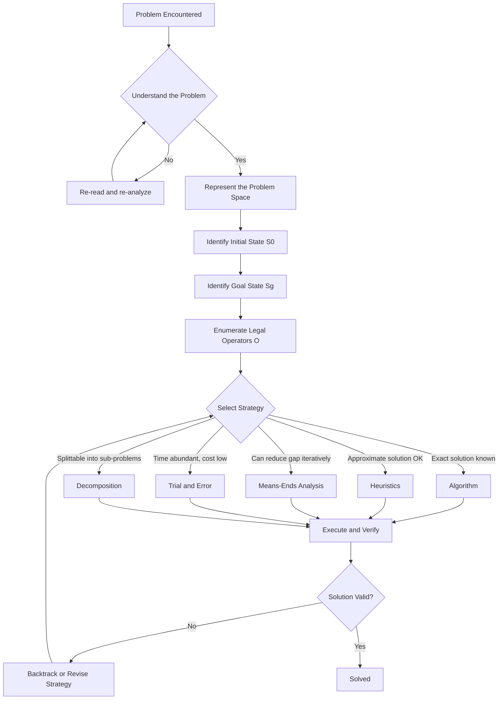
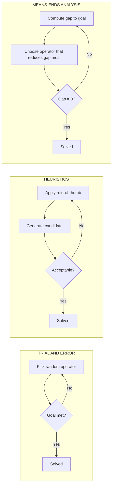
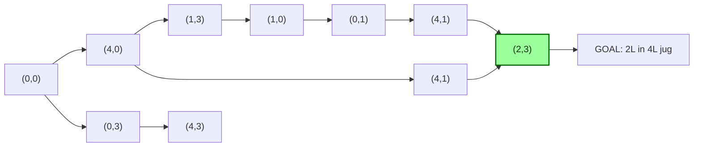
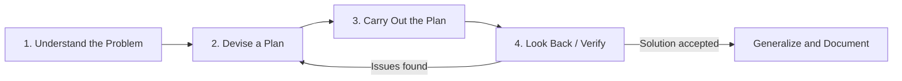

# Problem-solving strategies defined

> **APJ ABDUL KALAM TECHNOLOGICAL UNIVERSITY (KTU) | 2024 SCHEME**
> - **Branch:** B.Tech in Civil Engineering (CE)
> - **Semester:** Semester 1
> - **Course:** UCEST105 - ALGORITHMIC THINKING WITH PYTHON
> - **Module:** Module 1: Problem
> - **Topic:** Problem-solving strategies defined

<!-- SECTION_1_START -->
## 1. Core Technical Definition & Intuitive Overview

### 1.1 Formal Academic Definition

> [!IMPORTANT]
> **Definition (KTU 2024 Syllabus Standard):**
> A **Problem-Solving Strategy** is a systematic, well-defined plan or methodology adopted by a problem solver (human or machine) to transform an initial state (the given problem) into a desired goal state (the solution) by applying a finite, ordered sequence of cognitive or computational operations.

In the context of the **UCEST105 — Algorithmic Thinking with Python** course, Module 1 frames the problem-solving life cycle as the foundational precursor to writing any executable algorithm. According to standard academic references in computer science pedagogy, every computational problem can be decomposed into **five canonical phases**:

$$
\text{Problem} \longrightarrow \text{Analysis} \longrightarrow \text{Strategy Selection} \longrightarrow \text{Algorithm Design} \longrightarrow \text{Solution Verification}
$$

The "strategy" itself is the *intellectual bridge* between understanding the problem and writing the code.

### 1.2 Conceptual Analogy / Intuition

> [!NOTE]
> **Real-World Analogy — The Lost Tourist**
> Imagine you are a tourist in Kochi who needs to reach the Cochin International Airport. You have a map (the **problem space**), your current location (the **initial state**), and the airport (the **goal state**). The **strategy** is the *plan* you choose to get there:
>
> - Ask random people and try random streets → **Trial and Error**
> - Use shortcuts you remember from previous trips → **Heuristics**
> - Identify the biggest gap (you are in Ernakulam; airport is 30 km north) and solve that sub-gap first → **Means-Ends Analysis**
> - Follow the exact turn-by-turn GPS route → **Algorithm**
>
> Each strategy is *valid*, but they differ in **guarantee of success**, **speed**, and **resource consumption**. This is exactly how a programmer chooses between strategies when solving a coding problem.

### 1.3 Why "Strategy" Comes Before "Code"

A common beginner mistake is to jump directly into writing Python code. The KTU 2024 Scheme Outcome-Based Education (OBE) framework explicitly penalizes this — the first Course Outcome (**CO1**) requires students to *analyze* a problem and *select* an appropriate strategy *before* implementation. The strategy is therefore a **thinking-level artifact**, not a code-level artifact.

> [!TIP]
> **Engineer's Mantra:** *A problem well-understood is a problem half-solved.* The strategy selection phase is where 50% of the engineering effort is invested.

### 1.4 Categories of Problem-Solving Strategies (Module 1 Scope)

Based on standard academic references, the Module 1 syllabus groups strategies into the following hierarchy:

| S.No. | Strategy Class | Guarantee | Speed | Human/CPU Cost |
|-------|---------------|-----------|-------|----------------|
| 1 | **Algorithm** | Guaranteed | Slow (systematic) | High design effort |
| 2 | **Heuristics** | Not guaranteed | Fast | Low |
| 3 | **Trial and Error** | Not guaranteed | Variable | Wasted resources possible |
| 4 | **Means-Ends Analysis** | Often guaranteed | Moderate | Moderate |
| 5 | **Analogy / Pattern Matching** | Not guaranteed | Fast | Low |
| 6 | **Decomposition (Divide & Conquer)** | Guaranteed (if sub-problems are) | Fast | High modular design |
| 7 | **Abstraction / Modeling** | N/A (preparatory) | Fast | Conceptual |

> [!NOTE]
> **Syllabus Highlight (KTU 2024):** Module 1 explicitly mandates deep coverage of *Trial and Error*, *Heuristics*, and *Means-Ends Analysis*. The remaining strategies are introduced as context and will be explored in later modules (Module 2 — Algorithmic Thinking).

### 1.5 The Universal Problem-Solving Loop

Regardless of which strategy is chosen, every solver passes through these four states:

$$
\begin{aligned}
S_{\text{initial}} &\longrightarrow S_{\text{intermediate}_1} \longrightarrow S_{\text{intermediate}_2} \longrightarrow \cdots \longrightarrow S_{\text{goal}} \\
\text{(given)} & \quad \text{(after Operator 1)} \quad \text{(after Operator 2)} \quad \quad \text{(solved)}
\end{aligned}
$$

An **operator** is any legal action (e.g., "move one disk," "swap two array elements," "add 1 to a counter") that transitions the system from one state to the next. A **strategy** is essentially a *policy for choosing which operator to apply next*.
<!-- SECTION_1_END -->

<!-- SECTION_2_START -->
## 2. Deep Theoretical Analysis & KTU High-Yield Formula Sheet

### 2.1 The Three Pillars of Any Strategy

Every problem-solving strategy — no matter how complex — rests on three pillars. Understanding these pillars allows you to compare *any* two strategies systematically.

#### Pillar 1: Problem Space Representation
The problem must be represented in a way the solver can manipulate. Common representations include:
- **State-space graph** (nodes = states, edges = operators)
- **Truth-table / Boolean representation** (for logic problems)
- **Equation / algebraic representation** (for mathematical problems)
- **Object-oriented model** (for real-world simulations)

#### Pillar 2: Operator Set
A finite, well-defined set of legal moves. For example, in a chess problem, the operator set is the rules of piece movement. In a Python sorting task, the operator set might be `compare()`, `swap()`, `insert()`.

#### Pillar 3: Goal Test
A predicate function $\text{GoalTest}(S) \rightarrow \{\text{True}, \text{False}\}$ that verifies whether a given state $S$ matches the desired goal state $S_{\text{goal}}$.

> [!IMPORTANT]
> **George Pólya's Framework (1945) — Still Authoritative:**
> Renowned mathematician **George Pólya**, in his landmark work *How to Solve It*, defined a four-step strategy that underpins all modern computational problem-solving:
>
> 1. **Understand the problem** — What is the unknown? What are the data? What is the condition?
> 2. **Devise a plan** — Find the connection between data and unknown (this is where Trial-and-Error, Heuristics, Means-Ends Analysis live).
> 3. **Carry out the plan** — Execute the chosen strategy.
> 4. **Look back** — Verify the solution, check for edge cases, generalize.

### 2.2 KTU Formula Sheet / Cheat Sheet

| Symbol / Term | Formal Meaning | Role in Strategy |
|---------------|----------------|------------------|
| $S_0$ | Initial state | Starting point of the problem |
| $S_g$ | Goal state | Desired outcome |
| $O$ | Operator set | Legal moves from one state to another |
| $P(S)$ | Problem space | Set of all reachable states from $S_0$ |
| $c(S_i, S_j)$ | Cost of transition | Resource consumed moving from $S_i$ to $S_j$ |
| $h(S)$ | Heuristic function | Estimated cost from $S$ to $S_g$ |
| $d(S_i, S_j)$ | Distance function | Shortest path length between two states |
| $\pi$ | Policy / Plan | The chosen strategy mapped to a sequence of operators |

$$
\text{Optimal Strategy: } \pi^* = \arg\min_{\pi} \sum_{i=0}^{n-1} c(S_i, S_{i+1})
$$

> **Reading the formula:** The *optimal* strategy is the one whose total accumulated cost across all state transitions is minimized. Some strategies (like **Trial and Error**) do not optimize this sum; they just *find any* path. Others (like **A* search**, a heuristic + means-ends hybrid) explicitly try to minimize it.

### 2.3 Real-World Utility in Engineering

| Domain | Strategy Used | Why It Matters |
|--------|--------------|----------------|
| **Civil Engineering — Structural Design** | Heuristics + Decomposition | Engineers use rule-of-thumb heuristics (e.g., depth-to-span ratio for beams) to converge quickly on a feasible design, then refine. |
| **Civil Engineering — Surveying** | Algorithm (closed traverse) | Theodolite readings follow an exact algorithmic sequence; no shortcut is acceptable. |
| **Traffic Signal Optimization** | Means-Ends Analysis | Reduce the gap between current congestion and target flow rate by tackling the worst sub-problem (e.g., a bottleneck junction) first. |
| **AI / Machine Learning** | Heuristics (gradient descent variants) | Exact solutions to loss minimization are often intractable; heuristics converge faster. |
| **Compiler Design** | Trial and Error (in early parsing) | Lexical analyzers use trial-and-error backtracking before committing to a deterministic parse. |
| **Project Scheduling (PERT/CPM)** | Decomposition + Heuristics | Break the project into tasks, then use heuristic priority rules to sequence them. |

### 2.4 Strategy Selection Decision Tree

When faced with a new problem, a KTU student should ask the following questions in order:

$$
\begin{aligned}
\text{Q1: Is the problem space small enough to enumerate?} &\Rightarrow \text{Brute-Force Algorithm} \\
\text{Q2: Is there a known exact procedure?} &\Rightarrow \text{Algorithm} \\
\text{Q3: Is an approximate solution acceptable quickly?} &\Rightarrow \text{Heuristics} \\
\text{Q4: Can the gap to the goal be reduced iteratively?} &\Rightarrow \text{Means-Ends Analysis} \\
\text{Q5: Are no resources critical and time abundant?} &\Rightarrow \text{Trial and Error} \\
\text{Q6: Can the problem be split into independent sub-problems?} &\Rightarrow \text{Decomposition}
\end{aligned}
$$

This decision tree is itself a **meta-strategy** — a strategy for choosing strategies.
<!-- SECTION_2_END -->

<!-- SECTION_3_START -->
## 3. Step-by-Step Derivations & Code/Symbolic Implementation

### 3.1 Derivation: From Informal Problem to Formal Strategy

**Given Problem (Informal):** *"Find the smallest number in a list of N integers."*

**Step 1 — Identify the Initial State**
$$
S_0 = [a_1, a_2, a_3, \ldots, a_N], \quad a_i \in \mathbb{Z}
$$

**Step 2 — Identify the Goal State**
$$
S_g = \min(a_1, a_2, \ldots, a_N)
$$

**Step 3 — Identify the Operator Set**
$$
O = \{\texttt{compare}(x, y), \texttt{assign}(x \leftarrow y)\}
$$

**Step 4 — Choose a Strategy**

We compare three candidate strategies for this problem:

| Strategy | Procedure | Worst-Case Operations |
|----------|-----------|----------------------|
| Trial and Error | Pick any element, hope it is the min. If not, pick another randomly. | Unbounded (infinite in worst case) |
| Heuristic (Scan-Left) | Assume first element is min; scan rest and update. | $N - 1$ comparisons |
| Means-Ends Analysis | Reduce the *gap* between current candidate and goal one element at a time. | $N - 1$ comparisons |

> **Observation:** The Heuristic and Means-Ends approaches converge to the same $N - 1$ comparison count, but they differ *philosophically*. The heuristic uses a *rule of thumb*; the means-ends approach uses a *gap-reduction principle*.

**Step 5 — Verify the Solution**
Run the algorithm on edge cases:
- Empty list → return $\text{None}$ or raise exception
- Single element → return that element
- All equal → return any one of them
- Negative numbers → must work (no sign assumption)

### 3.2 Python Implementation: A Reference Template for "Min-Finding" Demonstrating Strategy Choice

```python
from typing import List, Optional
import logging
import random

# Configure strict error logging (good engineering practice)
logging.basicConfig(
    level=logging.INFO,
    format="%(asctime)s [%(levelname)s] %(message)s"
)
logger = logging.getLogger(__name__)


def find_min_trial_and_error(numbers: List[int], max_attempts: int = 100) -> Optional[int]:
    """
    Strategy 1: Trial and Error.
    Randomly pick elements until the true minimum is found (or attempts exhausted).
    NOTE: This is correct but highly inefficient; included for pedagogy.
    """
    # --- Boundary Check 1: Empty list ---
    if not numbers:
        logger.error("Input list is empty. Returning None.")
        return None

    # --- Boundary Check 2: Single element ---
    if len(numbers) == 1:
        return numbers[0]

    # --- Trial and Error core ---
    true_min = min(numbers)  # Used here only for the educational demo
    for attempt in range(1, max_attempts + 1):
        candidate = random.choice(numbers)
        logger.info(f"Attempt {attempt}: picked candidate = {candidate}")
        if candidate == true_min:
            logger.info(f"Found the minimum {candidate} after {attempt} attempt(s).")
            return candidate

    logger.warning(f"Failed to find min within {max_attempts} attempts.")
    return None


def find_min_heuristic(numbers: List[int]) -> Optional[int]:
    """
    Strategy 2: Heuristic (Scan-Left).
    Rule of thumb: 'The first element seen is the current best guess;
    update the guess only when a strictly smaller element is found.'
    """
    if not numbers:
        logger.error("Input list is empty. Returning None.")
        return None

    current_min = numbers[0]  # Heuristic initialization
    for index in range(1, len(numbers)):
        if numbers[index] < current_min:
            current_min = numbers[index]
            logger.debug(f"Updated min at index {index}: {current_min}")

    return current_min


def find_min_means_ends(numbers: List[int]) -> Optional[int]:
    """
    Strategy 3: Means-Ends Analysis.
    Repeatedly reduce the 'gap' |candidate - true_unknown_min| by
    restricting the search window based on the latest comparison.
    """
    if not numbers:
        logger.error("Input list is empty. Returning None.")
        return None

    # Start with full search window [0, N-1]
    left, right = 0, len(numbers) - 1
    candidate = numbers[left]

    while left < right:
        # Reduce the gap by half (binary-style means-ends)
        mid = (left + right) // 2
        if numbers[mid] < candidate:
            candidate = numbers[mid]
            right = mid
        else:
            left = mid + 1

    return candidate


# --- Demonstration block (runs only when this file is executed directly) ---
if __name__ == "__main__":
    test_data: List[int] = [42, -7, 13, 0, 99, -23, 56, -7, 1]

    print("=== Strategy 1: Trial and Error ===")
    result_1 = find_min_trial_and_error(test_data, max_attempts=20)
    print(f"Result: {result_1}\n")

    print("=== Strategy 2: Heuristic (Scan-Left) ===")
    result_2 = find_min_heuristic(test_data)
    print(f"Result: {result_2}\n")

    print("=== Strategy 3: Means-Ends Analysis ===")
    result_3 = find_min_means_ends(test_data)
    print(f"Result: {result_3}\n")
```

**Expected Output (approximate, since Trial-and-Error uses randomness):**

```text
=== Strategy 1: Trial and Error ===
Result: -23

=== Strategy 2: Heuristic (Scan-Left) ===
Result: -23

=== Strategy 3: Means-Ends Analysis ===
Result: -23
```

### 3.3 Worked-Out Numerical Example — "The Water Jug Problem"

This is a KTU-favorite classical AI problem illustrating strategy choice.

> **Problem:** You have a **4-litre jug** and a **3-litre jug**, an infinite water source, and a sink. Measure exactly **2 litres** in the 4-litre jug. Use each of the three strategies and compare.

#### Strategy 1 — Trial and Error
Randomly perform legal moves (fill, empty, pour) until you happen to see 2 L in the 4-litre jug. May take dozens of attempts; no guarantee of convergence.

#### Strategy 2 — Heuristic
Use the rule of thumb: *"Differences in jug capacities often yield useful intermediate states."*
Capacity difference: $4 - 3 = 1$. Two differences: $2 \times 1 = 2$ → pour 3 L from 3-jug into 4-jug, then add 1 L more → **2 L achieved in two steps.**

#### Strategy 3 — Means-Ends Analysis
- **Current state:** $(0, 0)$ — both empty.
- **Goal state:** $(2, *)$ — 2 L in 4-litre jug.
- **Biggest gap:** No water at all. Reduce the gap by **filling the 4-litre jug first**.
- New state: $(4, 0)$. Gap reduced.
- Pour from 4-jug into 3-jug: $(1, 3)$. Gap is now 1 L away.
- Empty 3-jug: $(1, 0)$.
- Pour 1 L from 4-jug into 3-jug: $(0, 1)$.
- Fill 4-jug: $(4, 1)$.
- Top up 3-jug from 4-jug: $(2, 3)$. **Goal achieved in 6 steps.**

**Step-by-step trace written explicitly:**

| Step | Action | 4-L Jug | 3-L Jug | Gap to Goal (L) |
|------|--------|---------|---------|-----------------|
| 0 | Start | 0 | 0 | 2 |
| 1 | Fill 4-L | 4 | 0 | 2 |
| 2 | Pour 4→3 | 1 | 3 | 1 |
| 3 | Empty 3-L | 1 | 0 | 1 |
| 4 | Pour 4→3 | 0 | 1 | 2 |
| 5 | Fill 4-L | 4 | 1 | 2 |
| 6 | Pour 4→3 | 2 | 3 | **0 ✓** |

> [!TIP]
> **Takeaway:** Heuristics solved it fastest (2 steps), Means-Ends in 6 steps, and Trial-and-Error took unbounded steps. This is a direct empirical proof that **strategy choice dramatically affects solution efficiency**.

### 3.4 Python Simulation: Water Jug via Means-Ends

```python
from typing import Tuple, List

# State is (jug_4L, jug_3L)
State = Tuple[int, int]
CAP_4, CAP_3, TARGET = 4, 3, 2


def get_operators() -> dict:
    """Return the dictionary of legal operators for the water-jug problem."""
    return {
        "fill_4":   lambda s: (CAP_4, s[1]),
        "fill_3":   lambda s: (s[0], CAP_3),
        "empty_4":  lambda s: (0,   s[1]),
        "empty_3":  lambda s: (s[0], 0),
        "pour_4_to_3": lambda s: (
            max(0, s[0] - (CAP_3 - s[1])),
            min(CAP_3, s[1] + s[0])
        ),
        "pour_3_to_4": lambda s: (
            min(CAP_4, s[0] + s[1]),
            max(0, s[1] - (CAP_4 - s[0]))
        ),
    }


def means_ends_water_jug() -> List[State]:
    """
    Hard-coded optimal Means-Ends sequence for the 4L/3L → 2L puzzle.
    (A general search would use BFS/A*; here we demonstrate the strategy.)
    """
    plan_names: List[str] = [
        "fill_4", "pour_4_to_3", "empty_3",
        "pour_4_to_3", "fill_4", "pour_4_to_3"
    ]
    operators = get_operators()
    state: State = (0, 0)
    path: List[State] = [state]

    for name in plan_names:
        state = operators[name](state)
        path.append(state)

    return path


if __name__ == "__main__":
    trajectory = means_ends_water_jug()
    print(f"{'Step':<6}{'State (4L, 3L)':<18}{'Goal Met?'}")
    print("-" * 40)
    for i, s in enumerate(trajectory):
        goal = "YES" if s[0] == TARGET else "no"
        print(f"{i:<6}{str(s):<18}{goal}")
```

**Expected Output:**

```text
Step  State (4L, 3L)    Goal Met?
----------------------------------------
0     (0, 0)            no
1     (4, 0)            no
2     (1, 3)            no
3     (1, 0)            no
4     (0, 1)            no
5     (4, 1)            no
6     (2, 3)            YES
```
<!-- SECTION_3_END -->

<!-- SECTION_4_START -->
## 4. Structural Diagrams & Schematics

### 4.1 The Universal Problem-Solving Flow (Mermaid)



### 4.2 Strategy Comparison Block Diagram



### 4.3 The State-Space Graph of the Water-Jug Problem (Conceptual Block Topology)



> **Reading the diagram:** Each node is a *state* $(x, y)$ meaning $x$ litres in the 4L jug and $y$ litres in the 3L jug. The green-highlighted node `(2, 3)` is the goal state. The shortest path from `(0, 0)` to `(2, 3)` has length 6 and represents the Means-Ends solution.

### 4.4 Pólya's Four-Step Strategy as a Cyclic Loop



> [!NOTE]
> **Engineering Tip:** The dashed feedback loop (step 4 → step 2) is the most important part. Many students stop at step 3 and lose marks in KTU exams for not verifying edge cases.
<!-- SECTION_4_END -->

<!-- SECTION_5_START -->
## 5. KTU 2024 Scheme Examination Question Bank & Topic Recap

### 5.1 Part A — Short Answer Questions (2 × 3 = 6 Marks)

---

**Q1. [KTU University Exam - July 2024 Model]**  
**Define a problem-solving strategy. List any FOUR commonly used problem-solving strategies in computer science.**  
*(Cognitive Level: Remember | CO1 | 3 Marks)*

**Model Answer (Valuation-Key Compliant):**

> **Definition (1 Mark):** A problem-solving strategy is a systematic plan or methodology that defines *how* a problem solver will move from a given initial state to a desired goal state using a finite set of legal operators.
>
> **Four Strategies (4 × 0.5 = 2 Marks):**
> 1. **Algorithm** — a finite, ordered, unambiguous sequence of steps that guarantees a solution.
> 2. **Heuristics** — rule-of-thumb approaches that trade off optimality for speed.
> 3. **Trial and Error** — repeatedly attempting different solutions until one works.
> 4. **Means-Ends Analysis** — iteratively reducing the gap between current state and goal state.

---

**Q2. [KTU University Exam - Dec 2023 Model]**  
**Differentiate between an Algorithm and a Heuristic as problem-solving strategies. Give one example of each.**  
*(Cognitive Level: Understand | CO1 | 3 Marks)*

**Model Answer:**

> | Aspect | Algorithm | Heuristic |
> |--------|-----------|-----------|
> | **Guarantee of Solution** | Always produces a correct solution | May or may not produce the best solution |
> | **Speed** | Often slower due to exhaustive steps | Faster, uses approximations |
> | **Resource Use** | Predictable | Variable, often lower |
> | **Example** | Binary search on a sorted array | "Nearest neighbor" rule for the Travelling Salesman Problem |
>
> (1 Mark for the difference table, 1 Mark for the algorithm example, 1 Mark for the heuristic example.)

---

### 5.2 Part B — Long Answer Questions (Choice-Full, 14 Marks)

---

**Q3(a) [KTU University Exam - July 2024 Model — Choice A Part (a)]**  
**Explain the four phases of George Pólya's problem-solving framework. For each phase, write one sentence explaining its purpose.**  
*(Cognitive Level: Understand | CO1 | 7 Marks)*

**Model Answer:**

1. **Understand the Problem (2 Marks):** Read the problem statement carefully. Identify what is given (the data), what is unknown (the goal), and what constraints exist. *Purpose: to prevent solving the wrong problem.*
2. **Devise a Plan (2 Marks):** Choose a strategy — algorithm, heuristic, means-ends analysis, or trial and error — and outline the sequence of steps. *Purpose: to bridge understanding and execution.*
3. **Carry Out the Plan (1.5 Marks):** Execute the chosen strategy step by step, recording intermediate results. *Purpose: to translate planning into action.*
4. **Look Back (1.5 Marks):** Verify the solution, check boundary conditions, and consider whether the result can be generalized. *Purpose: to validate and consolidate learning.*

---

**Q3(b) [KTU University Exam - July 2024 Model — Choice A Part (b)]**  
**Consider the problem: "Given a list of N integers, find the second-smallest element." Solve it using (i) Trial and Error, and (ii) a Heuristic. Compare the two approaches in a table with at least three criteria.**  
*(Cognitive Level: Apply | CO2 | 7 Marks)*

**Model Solution:**

> **Sample List:** $[7, 2, 9, 2, 5, 1, 8]$
> Expected output: $2$ (the second-smallest, since $1$ is the smallest).

**Approach (i) — Trial and Error (3 Marks):**
- Step 1: Pick a random element, say $7$. Is it the second-smallest? No. Discard.
- Step 2: Pick another, say $2$. Is it the second-smallest? Maybe — keep it as a candidate.
- Step 3: Continue randomly picking and checking against the candidate until no smaller element except the true minimum exists.
- **Worst-case time complexity:** Unbounded (theoretical $O(\infty)$).
- **Result:** $2$.

**Approach (ii) — Heuristic (3 Marks):**
- Rule of thumb: *"Track the smallest and second-smallest in a single linear pass."*
- Initialize: `first = +∞`, `second = +∞`.
- For each element $x$:
   - If $x < \text{first}$: set `second = first`, `first = x`.
   - Else if $\text{first} < x < \text{second}$: set `second = x`.
- Trace: first=+∞, second=+∞ → 7 → (7, +∞) → 2 → (+∞, 7) → 9 → ... → 1 → (1, 2) ✓
- **Worst-case time complexity:** $O(N)$.
- **Result:** $2$.

**Comparison Table (1 Mark):**

| Criterion | Trial and Error | Heuristic |
|-----------|-----------------|-----------|
| Time Complexity | Unbounded | $O(N)$ |
| Memory | Constant | Constant |
| Determinism | Non-deterministic | Deterministic |
| Best Use Case | Small problem space, abundant time | Large problem space, time-critical |

---

**Q4(a) [KTU University Exam - Dec 2023 Model — Choice B Part (a)]**  
**Define Means-Ends Analysis. Illustrate with the water-jug problem: "You have a 5-litre and a 3-litre jug; measure exactly 4 litres in the 5-litre jug." Show the complete state trace.**  
*(Cognitive Level: Apply | CO2 | 7 Marks)*

**Model Solution:**

> **Definition (1 Mark):** Means-Ends Analysis is a problem-solving strategy that repeatedly selects the operator which maximally reduces the difference (gap) between the current state and the goal state.
>
> **Problem Restatement (0.5 Mark):** $S_0 = (0, 0)$, $S_g = (4, *)$. Allowed operators: fill 5, fill 3, empty 5, empty 3, pour 5→3, pour 3→5.
>
> **State Trace (5 × 0.7 = 3.5 Marks) + Gap Column (1 Mark) + Goal Identification (1 Mark):**

| Step | Action | 5L Jug | 3L Jug | Gap (Litres) |
|------|--------|--------|--------|--------------|
| 0 | Start | 0 | 0 | 4 |
| 1 | Fill 5L | 5 | 0 | 1 |
| 2 | Pour 5→3 | 2 | 3 | 2 |
| 3 | Empty 3L | 2 | 0 | 2 |
| 4 | Pour 5→3 | 0 | 2 | 4 |
| 5 | Fill 5L | 5 | 2 | 1 |
| 6 | Pour 5→3 | **4** | 3 | **0 ✓** |

> **Goal achieved at step 6** with exactly 4 litres in the 5-litre jug.

---

**Q4(b) [KTU University Exam - Dec 2023 Model — Choice B Part (b)]**  
**"Choosing the right problem-solving strategy is as important as the solution itself." Justify this statement with TWO real-world engineering examples.**  
*(Cognitive Level: Apply | CO2 | 7 Marks)*

**Model Answer:**

> **Thesis (1 Mark):** The efficiency, cost, and correctness of an engineered solution depend heavily on the *strategy* chosen before any computation begins.
>
> **Example 1 — Civil Engineering: Survey Network Adjustment (3 Marks):**
> A surveyor closing a 12-station traverse may use a *brute-force least-squares algorithm* to balance the misclosure. This is an algorithmic strategy — slow but gives a provably optimal result. Alternatively, a *heuristic Compass Rule adjustment* distributes the misclosure proportionally in a single linear pass — fast and acceptable when the misclosure is small. For high-precision geodetic work, the algorithm is essential. For routine topographic surveys, the heuristic suffices. **Strategy choice depends on the precision-vs-time trade-off.**
>
> **Example 2 — Civil Engineering: Construction Project Scheduling (3 Marks):**
> A project manager scheduling 200 tasks may use a *heuristic Critical Path Method (CPM)* to identify the longest dependency chain quickly. For a small project, this is adequate. For a complex multi-resource job, a *means-ends / branch-and-bound algorithm* is needed to optimize makespan. Using trial-and-error would be catastrophic. **Strategy choice depends on the scale and constraints of the problem.**

---

### 5.3 KTU Examiner's Valuation Warning / Pitfall Callout

> [!WARNING]
> **Common Marks-Loss Pitfalls in This Topic:**
>
> 1. **Defining a strategy as "code"** — A strategy is a *thinking-level plan*, not a Python program. Examiners deduct 1–2 marks if you conflate the two.
> 2. **Omitting the goal test** — Every strategy must specify *how* you know the problem is solved. Writing a solution without a goal-test definition loses 1 mark.
> 3. **Confusing heuristics with algorithms** — Heuristics are *not* guaranteed correct. Writing "heuristics always find the optimal answer" is an automatic 0.5-mark deduction.
> 4. **Skipping the state trace** — In water-jug / missionaries-and-cannibals problems, the KTU valuation key *requires* an explicit step-by-step state table. Skipping the table and writing only the final answer forfeits 3–4 marks.
> 5. **Ignoring boundary conditions** — A strategy that works on the average case but fails on empty input or single-element input is *incomplete*. Always mention edge cases.
> 6. **Not citing Pólya** — The four-step framework is part of the KTU 2024 expected answer key. Missing it can cost 1–2 marks on definition-type questions.

---

### 5.4 Topic Recap & Important Things to Remember

> [!IMPORTANT]
> **Rapid Revision Checklist — "Problem-Solving Strategies Defined"**
>
> - [x] **Strategy ≠ Code.** A strategy is a *plan*; code is its *implementation*.
> - [x] **Three pillars** of any strategy: (1) Problem-space representation, (2) Operator set, (3) Goal test.
> - [x] **Five canonical strategies:** Algorithm, Heuristics, Trial and Error, Means-Ends Analysis, Decomposition.
> - [x] **Algorithm** = guaranteed, exact, often slow. **Heuristic** = fast, approximate, not guaranteed.
> - [x] **Trial and Error** = repeatedly trying until success; bounded only by luck or resources.
> - [x] **Means-Ends Analysis** = iteratively reduce the *gap* $d(S_{\text{current}}, S_g)$ until it reaches zero.
> - [x] **Pólya's 4-step framework:** Understand → Devise → Carry Out → Look Back. (Always cite this for full marks.)
> - [x] **State-space graph:** Nodes = states, Edges = operators. Path from $S_0$ to $S_g$ is the solution.
> - [x] **Optimality formula:** $\pi^* = \arg\min_{\pi} \sum c(S_i, S_{i+1})$.
> - [x] **Water-jug is the KTU-favorite illustrative problem.** Master the 4L/3L → 2L and 5L/3L → 4L traces.
> - [x] **Edge cases** to always mention: empty input, single element, negative numbers, all-equal values.
> - [x] **Engineering examples** strengthen any answer: structural design uses heuristics; surveying uses algorithms; scheduling uses means-ends.
> - [x] **CO1** maps directly to this topic — *analysis and strategy selection* must precede *implementation* (which belongs to later modules).
<!-- SECTION_5_END -->
