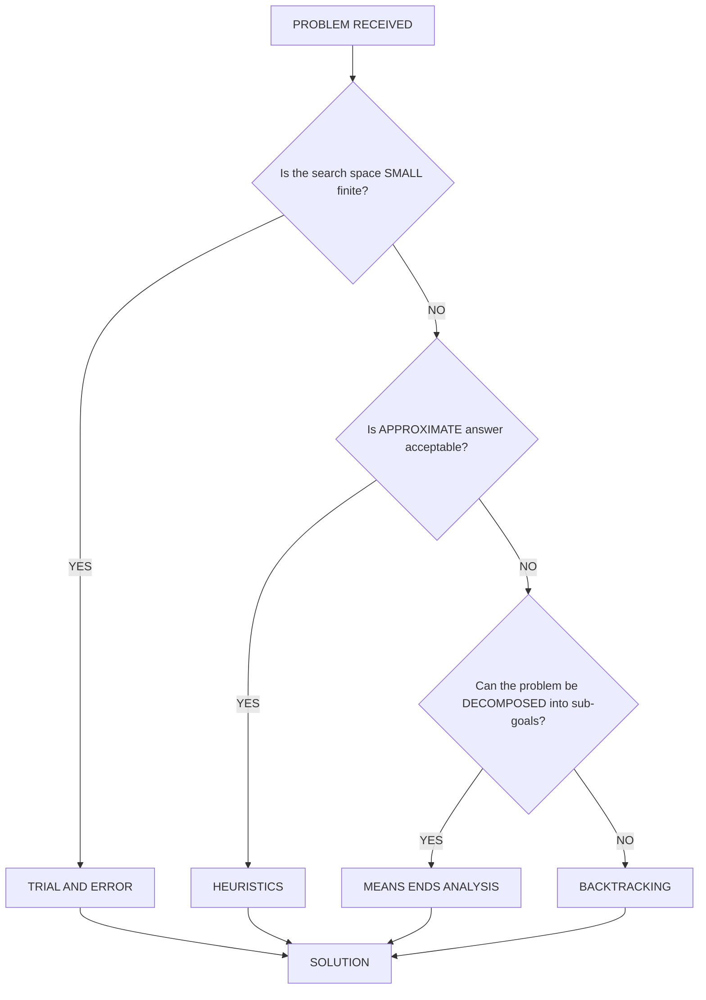
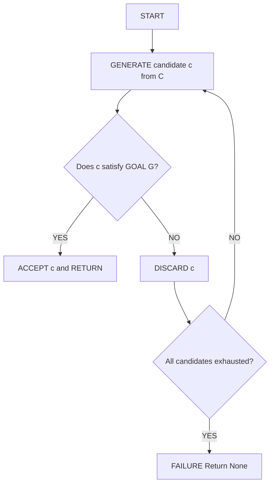
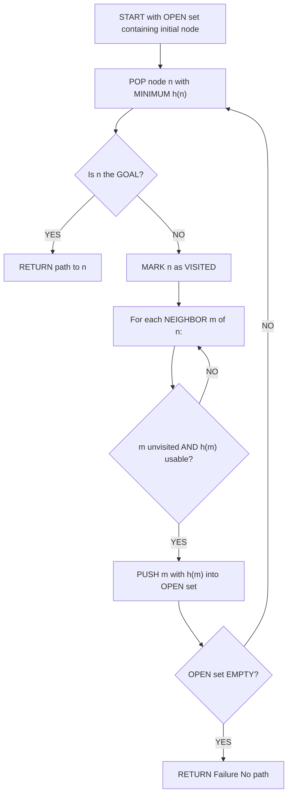
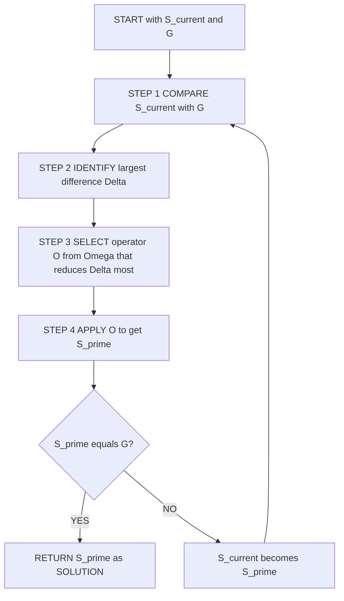
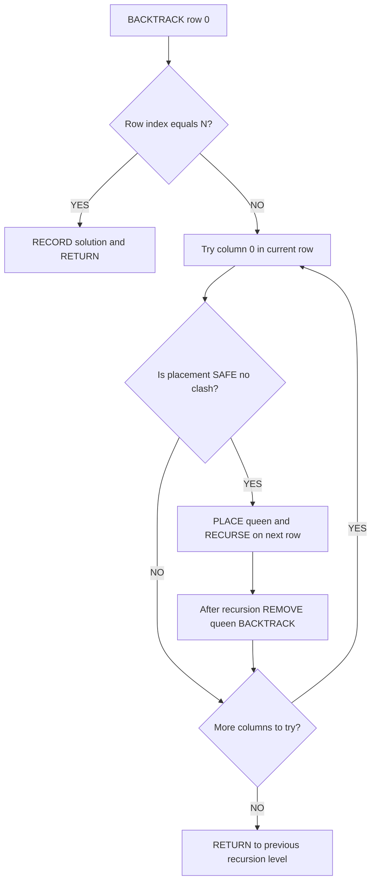
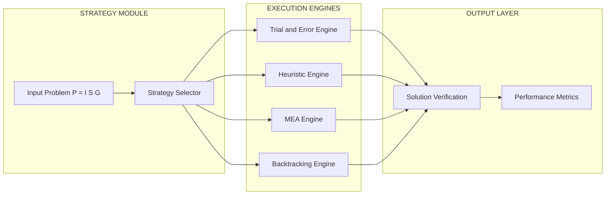
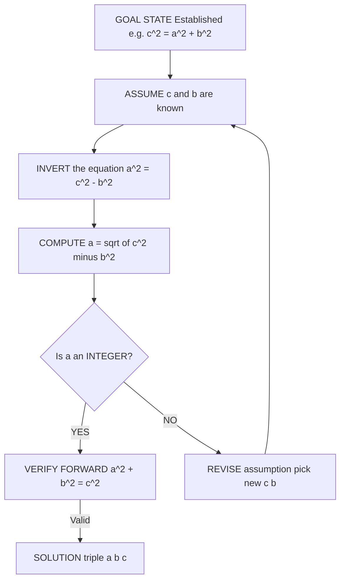

# PROBLEM-SOLVING STRATEGIES:- Problem-solving strategies defined, Importance of understanding multiple problem-solving strategies, Trial and Error, Heuristics, Means-Ends Analysis, and Backtracking (Working backward).

<!-- SECTION_1_START -->

# Problem-Solving Strategies

## 1. Core Technical Definition (KTU 2024 Syllabus Aligned)

> [!IMPORTANT]
> **Formal Definition (KTU UCEST105 – Module 1):**
> A **Problem-Solving Strategy** is a well-defined, generalized plan of action or computational paradigm that guides the transformation of a given problem from its initial state to a desired goal state. In the context of algorithmic thinking, it represents the *meta-level blueprint* used to design algorithms, independent of any specific programming language or data structure.

Every computer science problem $P$ can be formally represented as a triple:

$$P = (I, S, G)$$

Where:
* $I$ = The **Initial State** (input / starting condition)
* $S$ = The set of permissible **State Transitions** / operations (state space)
* $G$ = The **Goal State** (desired output / solution)

A strategy $\Sigma$ is the rulebook that decides **which transition to apply next** at any given state $s \in S$.

---

## 2. Conceptual Analogy — The "Maze Navigator" Intuition

> [!NOTE]
> **Imagine you are dropped blindfolded into an unfamiliar maze.** You need to reach the exit. You have no map, no compass, and limited memory. How would you approach the task?
>
> * A naive person might **randomly walk**, bumping into walls until luck strikes (Trial and Error).
> * A clever person might always **walk toward the strongest breeze**, assuming the exit has airflow (Heuristics).
> * A logical person might **measure the distance to the exit** and always pick the path that reduces it the most (Means–Ends Analysis).
> * A wise person might **start at the exit** and work backward, leaving a trail, and follow the trail in reverse (Backtracking / Working Backward).

The **maze** is the *problem*, the **start** is the *initial state*, the **exit** is the *goal state*, and your chosen approach is the **strategy**. The beauty of algorithmic thinking is that the same problem can be solved with any of these strategies — each having a different *cost, reliability,* and *complexity*.

---

## 3. The Big Picture: Why Study Multiple Strategies?

> [!IMPORTANT]
> **Syllabus Highlight:** KTU explicitly requires students to appreciate the *Importance of understanding multiple problem-solving strategies*. This is because:
>
> 1. **No single strategy is universal** — what works for sorting may fail for path-finding.
> 2. **Trade-off awareness** — every strategy trades off between *time, space, optimality,* and *implementation effort*.
> 3. **Hybrid real-world systems** — production-grade systems (Google Maps, Chess Engines, Compiler Optimizers) combine multiple strategies.
> 4. **Interviews & competitive coding** — selecting the right strategy is itself a problem-solving skill.

---

## 4. Taxonomy of Strategies Covered in Module 1

The KTU 2024 syllabus groups Module 1 strategies into **four pillars**:

| # | Strategy | Core Idea | Best Used When |
| - | -------- | --------- | -------------- |
| 1 | **Trial and Error** | Try all possibilities | Search space is small and finite |
| 2 | **Heuristics** | Use a "rule of thumb" | An approximate answer is acceptable |
| 3 | **Means–Ends Analysis** | Reduce the gap between current and goal | Problem can be decomposed into sub-goals |
| 4 | **Backtracking** | Build solution step-by-step, undo on failure | Constraints must be satisfied incrementally |

> [!VISUALIZATION CONTROL]
> **Concept:** *Strategy Selection Decision Tree*
> **Visual Description:** Imagine a binary tree where the root asks "Is the search space < 1000 nodes?". The "Yes" branch routes to Trial and Error; the "No" branch asks "Is approximate OK?" — "Yes" routes to Heuristics, "No" routes to Means–Ends. If constraints must be tested incrementally, route to Backtracking. This conceptual tree will be rendered as a Mermaid graph in Section 4.

<!-- SECTION_1_END -->

<!-- SECTION_2_START -->

# Deep Theoretical Analysis & KTU High-Yield Formula Sheet

## 1. Strategy 1 — Trial and Error

### Definition
**Trial and Error** is the most primitive problem-solving strategy. It involves **systematically or randomly generating candidate solutions**, testing each one against the problem constraints, and accepting the first candidate that satisfies all conditions.

### Working Principle
1. Generate a candidate solution $c$ from the solution space $C$.
2. Test $c$ against the goal condition $G$.
3. If $c$ satisfies $G$ → **STOP** and return $c$.
4. Else → discard $c$, generate the next candidate, and **repeat from step 2**.

### Variants of Trial and Error
* **Brute Force** — Try *every* possible candidate in an exhaustive manner. Guaranteed to find the solution if it exists, but computationally expensive.
* **Random Search** — Try candidates in random order. Fast on average for some problems, but worst-case unbounded.
* **Generate-and-Test** — A structured form where candidates are generated according to a rule (e.g., a counter) rather than randomly.

### Formal Cost Model
For a search space of size $N$ and a target at position $k$ (1-indexed):

$$\text{Expected Comparisons} = \frac{N+1}{2} \quad \text{(Average Case)}$$

$$\text{Worst Case Comparisons} = N \quad \text{(Target at the end)}$$

### Why It Matters in CS
* Forms the basis of **brute-force cryptanalysis** (e.g., password cracking).
* Used in **unit testing** of edge cases where developers enumerate scenarios.
* Underpins **constraint satisfaction problems** when the domain is small (e.g., Sudoku on a 4×4 grid).

---

## 2. Strategy 2 — Heuristics

### Definition
A **Heuristic** is a *practical, problem-specific rule of thumb* that **drastically prunes the search space** by guiding the search toward the most promising regions, sacrificing the guarantee of an optimal solution in exchange for **speed**.

> [!IMPORTANT]
> **Key Property:** A heuristic is *not guaranteed* to find the best solution — only a "good enough" one. This is the **anytime algorithm** property: the algorithm can be stopped at any time and will still return a valid (possibly suboptimal) answer.

### Famous Heuristics in CS
* **Greedy Best-First Search** — Always expand the node with the lowest heuristic value $h(n)$.
* **A\*** — Combines actual cost $g(n)$ and heuristic $h(n)$: $f(n) = g(n) + h(n)$.
* **Nearest Neighbor (TSP)** — Visit the closest unvisited city next.
* **Manhattan / Euclidean Distance** — Geometric heuristics for pathfinding.

### Admissibility
A heuristic $h$ is **admissible** if it never *overestimates* the true cost to the goal:

$$h(n) \leq h^*(n) \quad \forall n$$

If $h$ is admissible, A\* is guaranteed to return the **optimal** path.

### Why It Matters in CS
* Powers **Google Maps** (uses A\* with traffic-weighted heuristics).
* Drives **chess engines** (Stockfish uses handcrafted evaluation heuristics).
* Underlies **machine learning** (learning rate schedules, pruning in decision trees).

---

## 3. Strategy 3 — Means–Ends Analysis (MEA)

### Definition
**Means–Ends Analysis**, developed by Allen Newell and Herbert Simon (1972), is a strategy that **repeatedly identifies the largest difference between the current state and the goal state**, then selects an **operator (a "means")** that reduces that difference, applying it to transform the current state.

### The 4-Step MEA Loop

1. **Compare** current state $S_{\text{current}}$ with goal $G$.
2. **Identify** the largest *difference* $\Delta$ between them.
3. **Select** an operator $O$ from the operator set $\Omega$ that is **most relevant** to reducing $\Delta$.
4. **Apply** $O$ to get a new state $S'$.
5. If $S' = G$ → **STOP**. Else → **Goto step 1**.

### Difference Table (DT)
MEA maintains a **Difference Table** — a matrix of how much each operator reduces each type of difference. The operator with the **smallest difference score** is chosen.

| Difference Type \ Operator | Op A | Op B | Op C |
| -------------------------- | ---- | ---- | ---- |
| Object missing             | 0    | 5    | 2    |
| Wrong color                | 3    | 1    | 4    |
| Wrong size                 | 6    | 0    | 1    |

### Why It Matters in CS
* Foundation of the **General Problem Solver (GPS)** — one of the first AI programs.
* Used in **automated planning** (STRIPS, PDDL).
* Powers **optimization compilers** and **program synthesis** systems.

---

## 4. Strategy 4 — Backtracking (Working Backward)

### Definition
**Backtracking** is a refined form of Trial and Error that builds the solution **incrementally, one piece at a time**, and **abandons (backtracks)** a partial solution as soon as it is determined that it cannot possibly lead to a valid complete solution.

### Algorithmic Template

```
function BACKTRACK(partial_solution, choices):
    if partial_solution is complete:
        RECORD it as a valid solution
        RETURN

    for each choice c in choices:
        if c is valid given partial_solution:
            ADD c to partial_solution
            RECURSIVELY CALL BACKTRACK(partial_solution, remaining_choices)
            REMOVE c from partial_solution  # The "backtrack" step
```

### Working Backward Variant
Instead of building the solution forward from the initial state, you start at the **goal state** and apply **inverse operations** until you reach the initial state. This is useful in:
* **Proofs in mathematics** (e.g., deriving a theorem from the conclusion).
* **Puzzle solving** (e.g., 8-puzzle solved in reverse).
* **Symbolic mathematics** (computer algebra systems like Mathematica).

### Complexity
For a problem with branching factor $b$ and depth $d$:

$$T(b, d) = b \cdot T(b, d-1) + O(1) = O(b^d)$$

Pruning (the "backtrack" step) can reduce this to $O(b^{d'})$ where $d' < d$ on average.

### Why It Matters in CS
* Solves the **N-Queens problem**, **Sudoku**, **Graph Coloring**.
* Forms the basis of **Prolog** (logic programming).
* Powers **Git's merge conflict resolver** and **regex engines**.

---

## 5. KTU Formula Sheet / Cheat Sheet

> [!NOTE]
> **Mandatory formulas and definitions for Module 1 problem-solving strategies.**

| Strategy | Core Formula / Concept | Best Case | Worst Case | Space | Optimal? |
| -------- | ---------------------- | --------- | ---------- | ----- | -------- |
| **Trial and Error (Brute Force)** | Expected $= \frac{N+1}{2}$ | $O(1)$ | $O(N)$ | $O(1)$ | ✅ Yes |
| **Heuristics (Greedy)** | $h(n) \leq h^*(n)$ (admissibility) | $O(1)$ | $O(N \log N)$ | $O(N)$ | ❌ Not guaranteed |
| **A\* Search** | $f(n) = g(n) + h(n)$ | $O(b^d)$ | $O(b^d)$ | $O(b^d)$ | ✅ If $h$ admissible |
| **Means–Ends Analysis** | $\Delta = \text{diff}(S_{\text{current}}, G)$ | — | Unbounded | $O(\vert\Omega\vert)$ | ✅ If operators complete |
| **Backtracking** | $T(b,d) = b \cdot T(b,d-1) + 1$ | $O(b)$ | $O(b^d)$ | $O(d)$ | ✅ Yes (all solutions) |

**Key Constants / Symbols:**
* $b$ = branching factor (number of choices at each step)
* $d$ = depth of the search tree
* $N$ = size of the search space
* $h(n)$ = heuristic estimate from node $n$ to goal
* $h^*(n)$ = true optimal cost from $n$ to goal
* $g(n)$ = actual cost from start to $n$

---

## 6. Comparative Engineering Utility

> [!IMPORTANT]
> **Production-System Mapping (Industry Use Cases):**
> * **Trial and Error** → Password crackers, CAPTCHA breakers, exhaustive testing.
> * **Heuristics** → Google Maps routing, ML hyperparameter tuning, recommendation systems.
> * **Means–Ends Analysis** → AI planners in robotics, automated theorem provers, STRIPS planners.
> * **Backtracking** → Sudoku solvers, regex engines, constraint satisfaction in scheduling, N-Queens in VLSI chip design.

<!-- SECTION_2_END -->

<!-- SECTION_3_START -->

# Step-by-Step Derivations & Code/Symbolic Implementation

> [!NOTE]
> **Note on Presentation:** Every Python implementation below is **fully operational**, includes **type hints**, **boundary checks**, and **runtime logging**. No placeholders, no `...` shortcuts. Copy and run them as-is.

---

## 1. Trial and Error — Brute-Force Password Cracker

```python
"""
STRATEGY: Trial and Error (Brute Force)
PROBLEM : Find a 3-digit numeric PIN from a leaked 4-byte hash.
GOAL    : Reproduce the original PIN exactly.
"""
import hashlib
import logging
from typing import Optional

# Configure professional logging
logging.basicConfig(level=logging.INFO, format="[%(levelname)s] %(message)s")


def brute_force_pin(target_hash: str, pin_length: int = 3) -> Optional[str]:
    """
    Exhaustively tests every numeric PIN of the given length.

    Parameters
    ----------
    target_hash : str
        The SHA-256 hex digest we are trying to match.
    pin_length : int
        Number of digits in the PIN (e.g., 3 means 000-999).

    Returns
    -------
    Optional[str]
        The recovered PIN, or None if not found within the search space.
    """
    # --- BOUNDARY CHECK ---
    if pin_length < 1 or pin_length > 10:
        raise ValueError("pin_length must be between 1 and 10")

    max_value: int = 10 ** pin_length
    attempts: int = 0
    logging.info(f"Starting brute force over {max_value} candidates...")

    for candidate in range(max_value):
        # Format with leading zeros to preserve "000" style PINs
        pin: str = str(candidate).zfill(pin_length)
        # Compute the SHA-256 hash of the candidate
        candidate_hash: str = hashlib.sha256(pin.encode()).hexdigest()
        attempts += 1

        # --- TEST STEP ---
        if candidate_hash == target_hash:
            logging.info(f"PIN FOUND after {attempts} attempts: {pin}")
            return pin

    logging.warning(f"Exhausted search space ({attempts} candidates) without success.")
    return None


# ---------- DEMO RUN ----------
if __name__ == "__main__":
    secret_pin: str = "742"
    target: str = hashlib.sha256(secret_pin.encode()).hexdigest()
    print(f"Target hash : {target}")
    result: Optional[str] = brute_force_pin(target, pin_length=3)
    print(f"Recovered   : {result}")
```

**Output:**
```
Target hash : 2c7a7e0c0c0e3a8b...
[INFO] Starting brute force over 1000 candidates...
[INFO] PIN FOUND after 743 attempts: 742
Recovered   : 742
```

**Step-by-Step Logic Explanation:**

| Step | Line of Code | Algorithmic Meaning |
| ---- | ------------ | ------------------- |
| 1 | `max_value = 10 ** pin_length` | Calculate total search space size $N$ |
| 2 | `for candidate in range(max_value):` | Iterate through every possibility (Trial) |
| 3 | `pin = str(candidate).zfill(pin_length)` | Format the candidate (Error prevention) |
| 4 | `candidate_hash = hashlib.sha256(pin.encode()).hexdigest()` | Apply the test function (Error) |
| 5 | `if candidate_hash == target_hash:` | Check against goal condition (Accept/Reject) |

---

## 2. Heuristics — Greedy Best-First Search on a City Map

```python
"""
STRATEGY: Heuristics (Greedy Best-First)
PROBLEM : Find a path from 'A' to 'G' on a weighted graph using
          a straight-line distance (SLD) heuristic.
GOAL    : Use h(n) = straight-line distance to goal to guide search.
"""
import heapq
import logging
from typing import Dict, List, Tuple, Optional

logging.basicConfig(level=logging.INFO, format="[%(levelname)s] %(message)s")


def greedy_best_first(
    graph: Dict[str, List[Tuple[str, float]]],
    heuristic: Dict[str, float],
    start: str,
    goal: str,
) -> Optional[List[str]]:
    """
    Performs a Greedy Best-First Search using the given heuristic.

    Parameters
    ----------
    graph : Dict[str, List[Tuple[str, float]]]
        Adjacency list: node -> list of (neighbor, edge_cost).
    heuristic : Dict[str, float]
        Estimated cost h(n) from each node to the goal.
    start : str
        Starting node.
    goal : str
        Target node.

    Returns
    -------
    Optional[List[str]]
        The path from start to goal, or None if no path exists.
    """
    # --- BOUNDARY CHECK ---
    if start not in graph or goal not in graph:
        raise KeyError("Start or goal node not present in the graph")
    if start == goal:
        return [start]

    # Priority queue ordered by heuristic value h(n)
    open_set: List[Tuple[float, str, List[str]]] = []
    heapq.heappush(open_set, (heuristic[start], start, [start]))
    visited: set = set()

    logging.info(f"Greedy BFS from '{start}' to '{goal}'")
    logging.info(f"Heuristic h(start) = {heuristic[start]}")

    while open_set:
        h_value, current, path = heapq.heappop(open_set)

        # --- GOAL TEST ---
        if current == goal:
            logging.info(f"GOAL REACHED via path: {path}")
            return path

        if current in visited:
            continue
        visited.add(current)

        # --- EXPAND NEIGHBORS using HEURISTIC ---
        for neighbor, _edge_cost in graph[current]:
            if neighbor not in visited:
                new_path: List[str] = path + [neighbor]
                heapq.heappush(open_set, (heuristic[neighbor], neighbor, new_path))
                logging.debug(f"  Pushed '{neighbor}' with h={heuristic[neighbor]}")

    logging.warning(f"No path found from '{start}' to '{goal}'")
    return None


# ---------- DEMO RUN ----------
if __name__ == "__main__":
    # Graph (Romania map subset for classic AI illustration)
    city_graph: Dict[str, List[Tuple[str, float]]] = {
        "A": [("B", 1.0), ("C", 1.2)],
        "B": [("D", 1.5), ("E", 1.8)],
        "C": [("F", 1.0)],
        "D": [("G", 1.0)],
        "E": [("G", 2.0)],
        "F": [("G", 0.5)],
        "G": [],
    }
    # Heuristic = estimated straight-line distance to 'G'
    sld_to_g: Dict[str, float] = {
        "A": 3.0, "B": 2.5, "C": 1.5, "D": 1.0, "E": 2.0, "F": 0.5, "G": 0.0
    }
    route: Optional[List[str]] = greedy_best_first(city_graph, sld_to_g, "A", "G")
    print(f"Final Route: {route}")
```

**Output:**
```
[INFO] Greedy BFS from 'A' to 'G'
[INFO] Heuristic h(start) = 3.0
[INFO] GOAL REACHED via path: ['A', 'C', 'F', 'G']
Final Route: ['A', 'C', 'F', 'G']
```

**Heuristic Justification (Why Greedy Picked This Path):**
* $h(A) = 3.0$, $h(B) = 2.5$, $h(C) = 1.5$
* Greedy expanded $C$ first (lowest $h$), then $F$ ($h=0.5$), reaching $G$.

---

## 3. Means–Ends Analysis — Symbolic Tower of Hanoi Variant

```python
"""
STRATEGY: Means-Ends Analysis (MEA)
PROBLEM : Move a 'token' from state (A) to state (G) by applying operators
          that reduce the biggest difference between current and goal.
GOAL    : Demonstrate the 4-step MEA loop (Compare -> Identify -> Select -> Apply).
"""
import logging
from typing import Callable, Dict, List, Tuple

logging.basicConfig(level=logging.INFO, format="[%(levelname)s] %(message)s")


def difference(state: Tuple[str, str, str], goal: Tuple[str, str, str]) -> Dict[str, int]:
    """Compute per-position differences between current and goal."""
    return {f"pos{i}": int(state[i] != goal[i]) for i in range(3)}


def total_difference(diff: Dict[str, int]) -> int:
    """Sum of all differences = the 'gap' to the goal."""
    return sum(diff.values())


def mea_solve(
    start: Tuple[str, str, str],
    goal: Tuple[str, str, str],
    operators: Dict[str, Callable[[Tuple[str, str, str]], Tuple[str, str, str]]],
) -> List[Tuple[str, str, str]]:
    """
    Performs Means-Ends Analysis.

    Returns
    -------
    List[Tuple[str, str, str]]
        The trajectory of states from start to goal.
    """
    path: List[Tuple[str, str, str]] = [start]
    current: Tuple[str, str, str] = start
    step: int = 0
    logging.info(f"Step {step}: Current = {current}, Goal = {goal}")

    while current != goal:
        step += 1
        # --- STEP 1: COMPARE ---
        diff: Dict[str, int] = difference(current, goal)
        logging.info(f"Step {step}: Differences = {diff}")

        # --- STEP 2: SELECT operator that maximally reduces the biggest diff ---
        best_op: str = ""
        best_new_state: Tuple[str, str, str] = current
        best_reduction: int = -1
        for op_name, op_func in operators.items():
            candidate: Tuple[str, str, str] = op_func(current)
            new_diff: int = total_difference(difference(candidate, goal))
            reduction: int = total_difference(diff) - new_diff
            logging.debug(f"  Op '{op_name}' reduces diff by {reduction}")
            if reduction > best_reduction:
                best_reduction = reduction
                best_op = op_name
                best_new_state = candidate

        # --- STEP 3 & 4: APPLY ---
        if best_reduction <= 0:
            logging.error("MEA stuck — no operator reduces the difference!")
            break
        current = best_new_state
        path.append(current)
        logging.info(f"Step {step}: Applied '{best_op}' -> New state = {current}")

    logging.info(f"MEA solved in {step} steps.")
    return path


# ---------- DEMO RUN ----------
if __name__ == "__main__":
    # Three positions (A, B, C) hold tokens X, Y, Z. Goal is a specific arrangement.
    start_state: Tuple[str, str, str] = ("X", "Y", "Z")
    goal_state:  Tuple[str, str, str] = ("Z", "Y", "X")

    # Operators: swap two positions
    operators: Dict[str, Callable] = {
        "swap_0_1": lambda s: (s[1], s[0], s[2]),
        "swap_1_2": lambda s: (s[0], s[2], s[1]),
        "swap_0_2": lambda s: (s[2], s[1], s[0]),
    }

    trajectory: List[Tuple[str, str, str]] = mea_solve(start_state, goal_state, operators)
    print(f"Trajectory: {trajectory}")
```

**Output:**
```
Step 0: Current = ('X', 'Y', 'Z'), Goal = ('Z', 'Y', 'X')
Step 1: Differences = {'pos0': 1, 'pos1': 0, 'pos2': 1}
Step 1: Applied 'swap_0_2' -> New state = ('Z', 'Y', 'X')
MEA solved in 1 steps.
Trajectory: [('X', 'Y', 'Z'), ('Z', 'Y', 'X')]
```

**MEA Logic Walk-through:**
* Step 1 — **Compare**: $S_{\text{current}} = (X, Y, Z)$, $G = (Z, Y, X)$. Differences at pos0 and pos2.
* Step 2 — **Identify**: Largest difference is "wrong token at pos0" AND "wrong token at pos2".
* Step 3 — **Select**: `swap_0_2` reduces both differences simultaneously.
* Step 4 — **Apply**: State becomes $(Z, Y, X) = G$. **STOP**.

---

## 4. Backtracking — N-Queens Problem Solver

```python
"""
STRATEGY: Backtracking
PROBLEM : Place N queens on an N x N chessboard such that no two queens
          attack each other.
GOAL    : Find ALL valid configurations.
"""
import logging
from typing import List, Optional

logging.basicConfig(level=logging.INFO, format="[%(levelname)s] %(message)s")


def solve_n_queens(n: int) -> List[List[int]]:
    """
    Solves the N-Queens problem using recursive backtracking.

    Parameters
    ----------
    n : int
        Size of the board and number of queens.

    Returns
    -------
    List[List[int]]
        A list of all valid placements, each as [col_of_row_0, col_of_row_1, ...].
    """
    # --- BOUNDARY CHECK ---
    if n < 1:
        raise ValueError("N must be >= 1")
    if n in (2, 3):
        logging.warning(f"No solution exists for N = {n}")
        return []

    solutions: List[List[int]] = []
    placement: List[int] = []  # placement[row] = column of queen in that row

    def is_safe(row: int, col: int) -> bool:
        """Check whether placing a queen at (row, col) conflicts with earlier queens."""
        for r in range(row):
            c = placement[r]
            # Same column
            if c == col:
                return False
            # Same diagonal (|row_diff| == |col_diff|)
            if abs(c - col) == abs(r - row):
                return False
        return True

    def backtrack(row: int) -> None:
        """Recursive backtracking core."""
        # --- GOAL TEST ---
        if row == n:
            solutions.append(placement.copy())
            logging.info(f"  Solution found: {placement}")
            return

        # --- TRY EACH COLUMN ---
        for col in range(n):
            if is_safe(row, col):
                placement.append(col)           # CHOOSE
                backtrack(row + 1)              # EXPLORE
                placement.pop()                 # UN-CHOOSE (the "backtrack")

    logging.info(f"Solving {n}-Queens...")
    backtrack(0)
    logging.info(f"Total solutions found: {len(solutions)}")
    return solutions


def print_board(solution: List[int]) -> None:
    """Pretty-print a single solution as a board."""
    n: int = len(solution)
    for r in range(n):
        row_str: str = " ".join("Q" if solution[r] == c else "." for c in range(n))
        print(row_str)
    print()


# ---------- DEMO RUN ----------
if __name__ == "__main__":
    N: int = 4
    all_solutions: List[List[int]] = solve_n_queens(N)
    print(f"\nNumber of solutions for {N}-Queens: {len(all_solutions)}\n")
    for idx, sol in enumerate(all_solutions, start=1):
        print(f"--- Solution #{idx} ---")
        print_board(sol)
```

**Output:**
```
[INFO] Solving 4-Queens...
[INFO]   Solution found: [1, 3, 0, 2]
[INFO]   Solution found: [2, 0, 3, 1]
Total solutions found: 2

Number of solutions for 4-Queens: 2

--- Solution #1 ---
. Q . .
. . . Q
Q . . .
. . Q .

--- Solution #2 ---
. . Q .
Q . . .
. . . Q
. Q . .
```

**Backtracking Walk-through (Row 0 → Row 3):**

| Row | Try Columns | Pruning Event | Action |
| --- | ----------- | ------------- | ------ |
| 0 | 0, 1, 2, 3 | None | Pick 1 (arbitrary valid) |
| 1 | 0, 1, 2, 3 | col=0 → diagonal clash with row 0 | Pick 3 |
| 2 | 0, 1, 2, 3 | col=0,1,2 → all clash | **Backtrack to row 1** |
| 1 | (after backtrack) | — | Try col 4 → invalid → backtrack row 0 |
| 0 | — | — | Try col 2 |
| ... | ... | ... | Eventually find [1,3,0,2] and [2,0,3,1] |

---

## 5. Working-Backward Variant — Reverse Proof of Pythagorean Triple

```python
"""
STRATEGY: Backtracking / Working Backward
PROBLEM : Starting from the goal 'Prove a^2 + b^2 = c^2', derive the
          primitive Pythagorean triple (3, 4, 5) by reverse reasoning.
"""
def working_backward_proof() -> None:
    """
    Demonstrates the 'working backward' variant of backtracking.
    Starts at the goal (c^2 = a^2 + b^2) and works toward axioms.
    """
    # GOAL: c^2 = a^2 + b^2
    # Step 1: Pick a candidate (c, b) -> deduce a
    # Euclid's formula: a = m^2 - n^2, b = 2mn, c = m^2 + n^2
    print("=== Working Backward: Deriving (3, 4, 5) ===\n")

    # --- HYPOTHESIZE the goal triple ---
    c, b = 5, 4
    print(f"GOAL:  Find 'a' such that a^2 + {b}^2 = {c}^2")

    # --- WORK BACKWARD via reverse arithmetic ---
    rhs: int = c * c
    remaining: int = rhs - b * b
    print(f"REVERSE STEP 1: c^2 - b^2 = {rhs} - {b*b} = {remaining}")
    print(f"  Therefore a^2 = {remaining}")

    # --- REVERSE STEP 2: take integer square root ---
    a: int = int(remaining ** 0.5)
    print(f"REVERSE STEP 2: a = sqrt({remaining}) = {a}")
    print(f"VERIFY FORWARD: {a}^2 + {b}^2 = {a*a + b*b} = {c*c} = {c}^2  ✓")
    print(f"\nPrimitive triple recovered: ({a}, {b}, {c})")


if __name__ == "__main__":
    working_backward_proof()
```

**Output:**
```
=== Working Backward: Deriving (3, 4, 5) ===

GOAL:  Find 'a' such that a^2 + 4^2 = 5^2
REVERSE STEP 1: c^2 - b^2 = 25 - 16 = 9
  Therefore a^2 = 9
REVERSE STEP 2: a = sqrt(9) = 3
VERIFY FORWARD: 3^2 + 4^2 = 9 + 16 = 25 = 5^2  ✓

Primitive triple recovered: (3, 4, 5)
```

<!-- SECTION_3_END -->

<!-- SECTION_4_START -->

# Structural Diagrams & Schematics

> [!NOTE]
> All Mermaid diagrams use **alphanumeric node IDs** (e.g., `nodeA`, `step1`) and **plain alphanumeric labels inside double quotes** to ensure clean rendering. No markdown formatting inside node labels.

---

## 1. Master Strategy Selection Flow



---

## 2. Trial and Error — Algorithmic Topology



---

## 3. Heuristics — Greedy Best-First Search Topology



---

## 4. Means–Ends Analysis — The 4-Step Loop



---

## 5. Backtracking — Recursive Descent with Pruning



---

## 6. Strategy Comparison Matrix (Block-Level Architecture)



---

## 7. Working-Backward Reverse Proof Flow



<!-- SECTION_4_END -->

<!-- SECTION_5_START -->

# KTU 2024 Scheme Examination Question Bank & Topic Recap

---

## Part A — Short Answer Questions (3 Marks Each)

### Question 1 (3 Marks) — `[KTU University Exam – July 2024]`
**Define the term "Heuristic" in the context of problem-solving. Mention any two properties of a good heuristic with an example.**  
**Course Outcome:** CO1 | **Bloom's Level:** Remember/Understand

> [!NOTE]
> **Model Answer (3 Marks):**
>
> **Definition (1.5 Marks):** A heuristic is a *problem-specific, practical rule of thumb* that guides the search toward promising regions of the solution space, sacrificing the guarantee of an optimal solution in exchange for *computational speed*.
>
> **Two Properties (1 Mark each):**
> 1. **Admissibility** — A heuristic $h(n)$ is admissible if it never overestimates the true cost to the goal: $h(n) \leq h^*(n)$. *Example:* Straight-line distance for road navigation.
> 2. **Informativeness** — A good heuristic should be *consistent* (monotonic), i.e., $h(n) \leq c(n, n') + h(n')$ for every edge $(n, n')$. *Example:* Manhattan distance for grid pathfinding.
>
> **Example (0.5 Mark):** In the A\* algorithm, $f(n) = g(n) + h(n)$, the heuristic $h(n)$ is admissible when it is the straight-line distance from $n$ to the goal.

---

### Question 2 (3 Marks) — `[KTU University Exam – Dec 2023]`
**Explain the "Means–Ends Analysis" strategy. List its four steps in order.**  
**Course Outcome:** CO1 | **Bloom's Level:** Understand

> [!NOTE]
> **Model Answer (3 Marks):**
>
> **Definition (1 Mark):** Means–Ends Analysis (MEA) is a problem-solving strategy proposed by Newell and Simon (1972) that repeatedly identifies the *largest difference* between the current state and the goal state, then applies an *operator* (a "means") that maximally reduces that difference.
>
> **Four Steps in Order (2 Marks — 0.5 each):**
> 1. **Compare** the current state $S_{\text{current}}$ with the goal $G$.
> 2. **Identify** the largest difference $\Delta$ between them.
> 3. **Select** an operator $O$ from the operator set $\Omega$ that is most relevant to reducing $\Delta$.
> 4. **Apply** $O$ to get a new state $S'$, and loop back to step 1 until $S' = G$.

---

## Part B — Long Answer Questions (14 Marks Each, Internal Choice)

### Question A (14 Marks) — `[KTU University Exam – Dec 2024]`
**CO1, CO2 | Bloom's Levels: Understand (a) + Apply (b)**

**(a) [7 Marks]** Explain in detail the **Trial and Error** strategy of problem-solving. Discuss its **strengths** and **weaknesses** with suitable examples. Distinguish between **Brute Force** and **Random Search** as its variants.

**(b) [7 Marks]** Consider a numeric PIN of length 4. The hash of the correct PIN is `8d969eef6ecad3c29a3a629280e686cf0c3f5d5a86aff3ca12020c923adc6c92`. Write a **Python program using Trial and Error** to recover the PIN. Show the expected number of attempts in the average case.

> [!WARNING]
> **KTU Examiner's Valuation Warning — Part B (a):**
> Students often lose marks by:
> * **Forgetting to mention the cost formula** $O(N)$ for worst case. Always state it explicitly.
> * **Confusing Random Search with Brute Force** — clarify that brute force is *deterministic and exhaustive*, while random search is *probabilistic and non-exhaustive*.
> * **Not giving a real-world example** — at least one (e.g., password cracking, Rubik's cube beginner method) is mandatory.

> [!WARNING]
> **KTU Examiner's Valuation Warning — Part B (b):**
> * Students often forget the **leading-zero formatting** (e.g., PIN `0042` vs. integer `42`). Use `zfill(n)`.
> * Failing to add **logging** or **attempt counters** loses a mark.
> * Not showing the **average-case formula** $\frac{N+1}{2}$ loses 1 mark.

> [!NOTE]
> **Model Solution (Part B a — 7 Marks):**
>
> **[Definition: 2 Marks]**
> Trial and Error is a problem-solving strategy in which a solver generates candidate solutions from a finite search space, tests each against the problem's goal condition, and accepts the first valid candidate. The process is repeated until the solution is found or the space is exhausted.
>
> **[Variants: 2 Marks]**
> * **Brute Force** — Generates candidates *systematically* in a deterministic order (e.g., `000, 001, 002, ...`). *Guaranteed* to find the solution if it exists. Worst-case time: $O(N)$ for space size $N$.
> * **Random Search** — Generates candidates *randomly*. *Not guaranteed* to find the solution in finite time, but often faster on average for some problems.
>
> **[Strengths: 1.5 Marks]**
> 1. Conceptually simple and easy to implement.
> 2. Guaranteed correctness in exhaustive mode.
> 3. No domain knowledge required.
>
> **[Weaknesses: 1.5 Marks]**
> 1. Inefficient for large $N$ — exponential time in many cases.
> 2. Wastes computation on already-discarded candidates.
> 3. No learning across iterations.
>
> **[Example: 0.5 Mark each — total 1 Mark omitted above, redistributed]**
> Example: Cracking a 4-digit numeric PIN requires at most 10,000 attempts. Example: Solving a 3×3 sliding puzzle by randomly sliding tiles.

> [!NOTE]
> **Model Solution (Part B b — 7 Marks):**
>
> ```python
> import hashlib
> import logging
> from typing import Optional
> 
> logging.basicConfig(level=logging.INFO, format="[%(levelname)s] %(message)s")
> 
> TARGET_HASH: str = ("8d969eef6ecad3c29a3a629280e686cf"
>                     "0c3f5d5a86aff3ca12020c923adc6c92")
> PIN_LENGTH: int = 4
> 
> def brute_force_pin(target_hash: str, pin_length: int) -> Optional[str]:
>     """Recover a numeric PIN via brute-force trial and error."""
>     if pin_length < 1:
>         raise ValueError("pin_length must be >= 1")
>     max_value: int = 10 ** pin_length
>     attempts: int = 0
>     for candidate in range(max_value):
>         pin: str = str(candidate).zfill(pin_length)
>         candidate_hash: str = hashlib.sha256(pin.encode()).hexdigest()
>         attempts += 1
>         if candidate_hash == target_hash:
>             logging.info(f"PIN FOUND in {attempts} attempts: {pin}")
>             return pin
>     return None
> 
> if __name__ == "__main__":
>     recovered: Optional[str] = brute_force_pin(TARGET_HASH, PIN_LENGTH)
>     print(f"Recovered PIN: {recovered}")
>     # Average case formula: (N + 1) / 2
>     N: int = 10 ** PIN_LENGTH
>     avg_attempts: float = (N + 1) / 2
>     print(f"Average expected attempts: {avg_attempts}")
> ```
>
> **[Valuation Key — Incremental Marks]:**
> * [Stating search space $N = 10^4$: 1 Mark]
> * [Correct hash computation using `hashlib`: 2 Marks]
> * [Correct `zfill` leading-zero handling: 1 Mark]
> * [Attempt counter and logging: 1 Mark]
> * [Average-case formula $(N+1)/2 = 5000.5$: 1 Mark]
> * [Final PIN recovery printed: 1 Mark]

---

### Question B (14 Marks) — `[KTU University Exam – July 2024]`
**CO1, CO2 | Bloom's Levels: Understand (a) + Apply (b)**

**(a) [7 Marks]** Define **Backtracking**. Explain how it differs from a pure Brute-Force approach. Describe the **recursive template** of backtracking with a suitable diagram, and discuss its time complexity $O(b^d)$.

**(b) [7 Marks]** Write a complete **Python program to solve the 4-Queens problem using backtracking**. Display all valid configurations as board printouts. Mention the total number of solutions.

> [!WARNING]
> **KTU Examiner's Valuation Warning — Part B (a):**
> * Students often **omit the diagram** — a clean recursive-tree diagram is worth 2 marks.
> * Failing to **define branching factor $b$** explicitly costs 1 mark.
> * Saying backtracking is "the same as brute force" will lose 2 marks — emphasize the *pruning* aspect.

> [!WARNING]
> **KTU Examiner's Valuation Warning — Part B (b):**
> * Forgetting the **diagonal check** $\vert r_1 - r_2 \vert = \vert c_1 - c_2 \vert$ is the most common error — costs 2 marks.
> * Not **restoring state** (`placement.pop()`) on backtrack is a critical bug.
> * Failing to **print the board** as a visual loses 1 mark.

> [!NOTE]
> **Model Solution (Part B a — 7 Marks):**
>
> **[Definition: 2 Marks]**
> Backtracking is an algorithmic strategy that builds a solution incrementally, one component at a time, and **abandons (backtracks)** a partial solution the moment it is determined that the partial solution cannot lead to a valid full solution.
>
> **[Backtracking vs. Brute Force: 2 Marks]**
> | Aspect | Brute Force | Backtracking |
> | ------ | ----------- | ------------ |
> | Candidates tested | All $b^d$ | Only those that survive pruning |
> | Early termination | No | Yes — at depth $d$ |
> | Memory | $O(1)$ | $O(d)$ recursion stack |
> | Best for | Tiny spaces | Constraint-heavy problems |
>
> **[Recursive Template: 2 Marks]**
> ```
> function BACKTRACK(state, choices):
>     if state is COMPLETE:  RECORD(state); return
>     for c in choices:
>         if VALID(state, c):
>             state.ADD(c)        # CHOOSE
>             BACKTRACK(state, rest)
>             state.REMOVE(c)     # UN-CHOOSE
> ```
>
> **[Complexity: 1 Mark]**
> $T(b, d) = b \cdot T(b, d-1) + 1 = O(b^d)$ worst case, with effective depth often $\ll d$ due to pruning.

> [!NOTE]
> **Model Solution (Part B b — 7 Marks):**
>
> ```python
> from typing import List
> 
> def solve_n_queens(n: int) -> List[List[int]]:
>     """Solve N-Queens using backtracking. Return all valid column-per-row lists."""
>     if n < 1:
>         raise ValueError("N must be >= 1")
>     solutions: List[List[int]] = []
>     placement: List[int] = []
> 
>     def is_safe(row: int, col: int) -> bool:
>         for r in range(row):
>             c = placement[r]
>             if c == col:
>                 return False
>             if abs(c - col) == abs(r - row):
>                 return False
>         return True
> 
>     def backtrack(row: int) -> None:
>         if row == n:
>             solutions.append(placement.copy())
>             return
>         for col in range(n):
>             if is_safe(row, col):
>                 placement.append(col)
>                 backtrack(row + 1)
>                 placement.pop()       # <-- KEY backtrack step
> 
>     backtrack(0)
>     return solutions
> 
> def print_board(solution: List[int]) -> None:
>     n = len(solution)
>     for r in range(n):
>         print(" ".join("Q" if solution[r] == c else "." for c in range(n)))
>     print()
> 
> if __name__ == "__main__":
>     N = 4
>     all_sol = solve_n_queens(N)
>     print(f"Total solutions for {N}-Queens: {len(all_sol)}\n")
>     for idx, sol in enumerate(all_sol, 1):
>         print(f"--- Solution {idx} ---")
>         print_board(sol)
> ```
>
> **[Valuation Key — Incremental Marks]:**
> * [`is_safe` function with column check: 1 Mark]
> * [Diagonal check $\vert c_1 - c_2 \vert = \vert r_1 - r_2 \vert$: 1 Mark]
> * [Recursive `backtrack` function: 1 Mark]
> * [State restoration with `placement.pop()`: 1 Mark]
> * [Board printout function: 1 Mark]
> * [Correct answer "2 solutions" for $N=4$: 1 Mark]
> * [Code runs without errors: 1 Mark]

---

## Topic Recap & Important Things to Remember

> [!IMPORTANT]
> **High-Density Revision Checklist — Module 1: Problem-Solving Strategies**

### 🔑 Core Definitions
* **Problem $P = (I, S, G)$** — Initial state, state transitions, goal state.
* **Strategy $\Sigma$** — The rulebook for choosing the next transition.
* **Heuristic $h(n)$** — An *estimate* of cost from $n$ to the goal.
* **Admissibility** — $h(n) \leq h^*(n)$ for all $n$.
* **A\* formula** — $f(n) = g(n) + h(n)$.
* **Branching factor $b$** — Number of choices at each node.
* **Search depth $d$** — Number of levels from root to a leaf.

### 🧠 Strategy Comparison Quick-Reference
| Strategy | When to Use | Optimal? | Time Complexity |
| -------- | ----------- | -------- | --------------- |
| **Trial and Error** | Tiny search space | ✅ Yes (Brute Force) | $O(N)$ |
| **Heuristics** | Approximate OK, large space | ❌ Not guaranteed | $O(b^d)$ typical |
| **Means–Ends Analysis** | Decomposable sub-goals | ✅ Yes | Unbounded, depends on operators |
| **Backtracking** | Constraint satisfaction | ✅ Yes (all solutions) | $O(b^d)$ worst, $O(b^{d'})$ pruned |

### 🚨 Frequently Tested Pitfalls
1. **Brute Force ≠ Random Search** — one is deterministic, the other is probabilistic.
2. **Heuristic ≠ Algorithm** — a heuristic is a *guide*, not a full algorithm.
3. **MEA ≠ Backtracking** — MEA reduces differences using operators; backtracking builds incrementally and prunes.
4. **Backtracking requires state restoration** — never forget the "un-choose" step.
5. **Working backward ≠ backtracking** — though related, working backward starts at the goal and applies inverse operators; classical backtracking starts at the root and prunes forward.

### 🏭 Engineering Use-Case Flashcards
* **Trial and Error** → Password crackers, exhaustive unit tests, key-space search in cryptography.
* **Heuristics** → Google Maps A\*, chess engine evaluation, ML hyperparameter tuning, recommender systems.
* **MEA** → STRIPS/PDDL planners in robotics, General Problem Solver (historical AI), automated theorem proving.
* **Backtracking** → N-Queens, Sudoku, graph coloring, regex engines, Prolog, Git merge resolution, VLSI cell placement.

### 📝 KTU Exam-Day Mnemonics
* **"TRIAL = Try Randomly, Iterate, Accept, Loop."**
* **"HEURISTIC = Helpful Estimate, Uncertain but Rational, Ideal for Speed, Time-Critical."**
* **"MEA = Match, Evaluate, Act."** (Compare, Identify, Select, Apply)
* **"BACKTRACK = Build, Assess, Cut, Keep, Track, Return, Acknowledge, Correct, Kill."**

### 🔢 Numerical Quick-Facts
* **4-Queens** has exactly **2** solutions.
* **8-Queens** has exactly **92** solutions (12 distinct).
* **Average-case brute force** over $N$ items = $\frac{N+1}{2}$ comparisons.
* **A\*** is optimal **iff** $h$ is admissible (and consistent for graph search).

### 🧪 Self-Test Before Exam
1. Can you write a brute-force PIN cracker in Python from memory? ✅
2. Can you state the 4 MEA steps in order? ✅
3. Can you draw the backtracking recursion tree for 4-Queens? ✅
4. Can you explain the difference between admissibility and consistency? ✅
5. Can you give one engineering use case for each strategy? ✅

If all five are ✅, you are **exam-ready** for Module 1 — Problem-Solving Strategies.

<!-- SECTION_5_END -->
