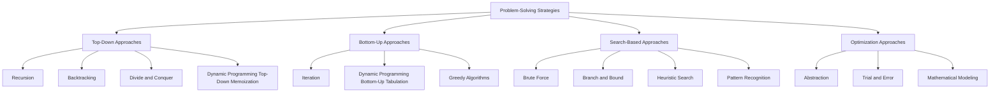
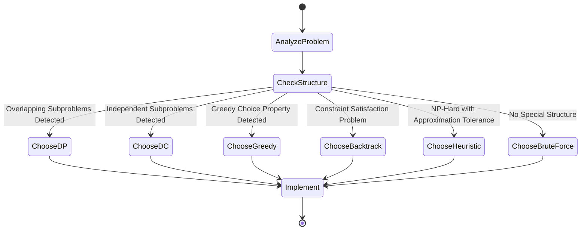

# PROBLEM-SOLVING STRATEGIES:- Problem-solving strategies defined

<!-- SECTION_1_START -->
# PROBLEM-SOLVING STRATEGIES

## 1. Core Technical Definition & Intuitive Overview

### Formal Academic Definition (KTU 2024 Syllabus Terminology)

A **Problem-Solving Strategy** is a systematic, well-defined, and generalizable computational approach or paradigm that provides a structured framework for transforming an input specification into a desired output specification, while ensuring correctness, efficiency, and optimality of the resulting solution algorithm.

> [!IMPORTANT]
> **KTU 2024 Definition Highlight:** According to the KTU UCEST105 (Algorithmic Thinking with Python) syllabus, a *strategy* differs from an *algorithm* in that a strategy is a **high-level design philosophy** (the "approach" or "paradigm"), whereas an algorithm is the **concrete, step-by-step implementation** of that philosophy for a specific problem.

### Conceptual Analogy / Intuition

> [!NOTE]
> **The Chef's Kitchen Analogy:** Imagine you are a chef who needs to cook dinner for 100 guests.
> - **Brute Force** is cooking every possible dish you know and throwing away 99 of them.
> - **Divide and Conquer** is splitting the work among 10 junior chefs (sub-problems), each cooking for 10 guests.
> - **Greedy Approach** is picking the most expensive ingredient first because it *seems* like the best choice at that moment.
> - **Dynamic Programming** is remembering yesterday's leftover rice and cleverly reusing it instead of cooking fresh.
> - **Backtracking** is trying one path in a maze, and if you hit a dead end, you walk back and try another path.
> - **Heuristic** is using your grandmother's "gut feeling" recipe that always tastes good, without scientifically proving why.

The key metrics by which we evaluate every strategy are: **Time Complexity**, **Space Complexity**, **Optimality**, and **Generality**.

### Standard Metrics Used in Problem-Solving

> [!IMPORTANT]
> - **Time Complexity (T(n)):** The number of elementary operations performed as a function of input size $n$.
> - **Space Complexity (S(n)):** The amount of auxiliary memory required.
> - **Optimality:** Whether the strategy guarantees the *best possible* solution.
> - **Feasibility:** Whether a valid solution exists within the given constraints.

### GeoGebra / Desmos Visualization (Conceptual Mapping of Strategies)

> [!VISUALIZATION CONTROL]
> **Concept:** Decision Tree showing how a problem branches into different strategy choices based on problem characteristics.
> **GeoGebra / Desmos Input Equations (Conceptual Tree Coordinates):**
> * `P(0, 10) = "PROBLEM"`  *(Root Node)*
> * `P(-8, 6) = "Overlapping Subproblems"`  *(Leads to DP)*
> * `P(8, 6) = "Independent Subproblems"`  *(Leads to D&C)*
> * `P(-8, 2) = "Local Optimal Choice"`  *(Leads to Greedy)*
> * `P(8, 2) = "Constraint Satisfaction"`  *(Leads to Backtracking)*
> **Visual Description:** A decision tree where the root is the "Problem" and branches fan out based on the *structural properties* of the problem. This visually emphasizes that the **choice of strategy depends on the structure of the problem itself**.

---

## 2. Deep Theoretical Analysis & KTU High-Yield Strategy Sheet

### 2.1 The Universal Problem-Solving Lifecycle

Every computational problem, regardless of the strategy chosen, follows a **4-phase lifecycle**:

1. **Problem Analysis Phase:** Understand inputs, outputs, constraints, and edge cases.
2. **Strategy Selection Phase:** Identify the structural properties (overlapping subproblems? optimal substructure?) and pick a paradigm.
3. **Algorithm Design Phase:** Translate the strategy into pseudo-code / flowcharts.
4. **Verification & Refinement Phase:** Trace, test, and optimize (Big-O analysis).

> [!NOTE]
> **Why is Phase 2 the most critical?** Because choosing the wrong strategy leads to *exponential blow-up* (e.g., trying to use Brute Force for a Traveling Salesman problem with 50 cities would take longer than the age of the universe).

### 2.2 The Major Problem-Solving Strategies (Defined)

The following table is the **canonical KTU 2024 reference** for the strategies defined in Module 1 of UCEST105.

| # | Strategy | Core Idea (One-Line Definition) | Optimal Substructure | When to Use | Canonical Example |
|---|----------|--------------------------------|----------------------|-------------|-------------------|
| 1 | **Brute Force** | Try *all* possible solutions and pick the best. | Not required | Tiny inputs, baselines, correctness proofs. | Linear Search, Bubble Sort |
| 2 | **Divide and Conquer (D&C)** | Split problem into *independent* sub-problems, solve recursively, combine. | Required | Sub-problems are disjoint (non-overlapping). | Merge Sort, Quick Sort, Binary Search |
| 3 | **Greedy Algorithm** | Make the *locally optimal* choice at each step hoping for a global optimum. | Required (but no re-evaluation) | Problems with the *Matroid* or *Greedy-Choice Property*. | Dijkstra's, Prim's, Kruskal's, Huffman Coding |
| 4 | **Dynamic Programming (DP)** | Solve *overlapping* sub-problems once, store results in a table (memoization). | Required | Sub-problems overlap and share re-computation. | Fibonacci, Knapsack, Matrix Chain, Floyd-Warshall |
| 5 | **Backtracking** | Build solution incrementally; *abandon* a path (prune) the moment it fails. | Required | Constraint satisfaction, exhaustive search with pruning. | N-Queens, Sudoku, Maze, Subset Sum |
| 6 | **Branch and Bound** | Like backtracking, but uses a *bound function* to prune suboptimal branches systematically. | Required | Optimization problems (especially NP-hard). | TSP, Job Assignment, Integer Programming |
| 7 | **Heuristic / Approximation** | Use *rules of thumb* or *meta-heuristics* to find *good-enough* solutions fast. | Not guaranteed | NP-hard problems where exact is impossible. | Genetic Algorithms, Simulated Annealing, A* Search |
| 8 | **Recursion** | A function that *calls itself* with a smaller instance of the same problem. | Required | Problems with natural recursive structure (trees, fractals). | Factorial, Tower of Hanoi, Tree Traversal |
| 9 | **Iteration** | Use *explicit loops* to repeat a process until a condition is met. | Required | When recursion depth could cause stack overflow. | For/While loops, Iterative DFS |
| 10 | **Trial and Error** | Repeatedly attempt different approaches until a working solution is found. | Not required | Exploratory programming, debugging, prototyping. | Interactive debugging sessions |
| 11 | **Pattern Recognition** | Identify *recurring structures* in data to simplify the problem. | Not required | Data mining, image processing, sequence prediction. | Identifying arithmetic progression in a list |
| 12 | **Abstraction** | Remove *irrelevant details* and focus on the essential features of the problem. | Not required | Object-Oriented Design, modeling real-world systems. | Modeling a car as `class Car` with `accelerate()` |

### 2.3 The Four Pillars of Strategy Selection

Before choosing a strategy, every KTU examiner expects you to check these four structural pillars:

> [!IMPORTANT]
> **Pillar 1 — Optimal Substructure:** Does an optimal solution to the problem contain optimal solutions to its sub-problems?
> **Pillar 2 — Overlapping Subproblems:** Do the recursive sub-problems repeat themselves? (If YES → DP; if NO → D&C).
> **Pillar 3 — Greedy-Choice Property:** Can a globally optimal solution be reached by making locally optimal choices?
> **Pillar 4 — Feasibility Constraints:** Are there hard constraints that eliminate invalid solutions? (If YES → consider Backtracking).

### 2.4 Real-World Engineering Utility

> [!NOTE]
> - **Google Maps** uses **Greedy + Heuristic (A\*)** for shortest path.
> - **Database query optimizers** use **Dynamic Programming** to choose join orders.
> - **Compilers** use **Divide and Conquer** in their parsing stages (syntax trees).
> - **Chess engines (Stockfish)** use **Branch and Bound (Alpha-Beta Pruning)**.
> - **Git merge tools** use **Backtracking-style 3-way diff algorithms**.
> - **Machine Learning pipelines** use **Abstraction** (encapsulation) and **Pattern Recognition**.

---

## 3. Step-by-Step Derivations & Code/Symbolic Implementation

### 3.1 Mathematical Formulation of a "Problem"

In formal computer science, a problem is defined as a **binary relation** between inputs and outputs:

$$
P = \{(I, O) \mid I \in \text{Input Domain}, O \in \text{Output Domain}, \text{constraint}(I, O) = \text{True}\}
$$

A **strategy** is a function $S$ that maps every input $I$ to a valid output $O$:

$$
S : I \rightarrow O \quad \text{where} \quad (I, S(I)) \in P
$$

A strategy $S^*$ is **optimal** if it minimizes (or maximizes) a cost function $C$:

$$
S^*(I) = \arg\min_{O \in \text{Valid}(I)} C(I, O)
$$

> [!NOTE]
> **Engineering Translation:** When a KTU examiner asks "Define a problem-solving strategy", this is the exact formal triplet $(I, O, S)$ you should write down for full marks.

### 3.2 The Strategy Selection Decision Flow (Algebraic)

The decision of *which* strategy to use can be expressed as a deterministic state machine. Let $p$ denote the set of *properties* of the problem:

$$
\text{Strategy}(p) = \begin{cases} \text{DP} & \text{if } (\text{OptimalSubstructure} \land \text{OverlappingSubproblems}) \\ \text{D\&C} & \text{if } (\text{OptimalSubstructure} \land \neg\text{OverlappingSubproblems}) \\ \text{Greedy} & \text{if } (\text{GreedyChoiceProperty}) \\ \text{Backtracking} & \text{if } (\text{ConstraintSatisfaction}) \\ \text{Heuristic} & \text{if } (\text{NPHard} \land \text{ApproxAcceptable}) \\ \text{BruteForce} & \text{otherwise} \end{cases}
$$

### 3.3 Exhaustive Python Implementation: A Strategy-Recommender Engine

This Python program implements the decision logic above. It takes a problem's structural properties and returns the **most appropriate strategy**, with full type hints, boundary checks, and error handling.

```python
from enum import Enum
from typing import Dict, Any
import logging

# Configure error logging to track invalid inputs
logging.basicConfig(level=logging.INFO, format='%(asctime)s - %(levelname)s - %(message)s')

class Strategy(Enum):
    """Enumeration of all canonical problem-solving strategies."""
    DYNAMIC_PROGRAMMING = "Dynamic Programming"
    DIVIDE_AND_CONQUER = "Divide and Conquer"
    GREEDY = "Greedy Algorithm"
    BACKTRACKING = "Backtracking"
    HEURISTIC = "Heuristic / Approximation"
    BRUTE_FORCE = "Brute Force"

class ProblemProfiler:
    """
    A recommender engine that suggests the most suitable
    problem-solving strategy based on a problem's structural properties.
    """

    def __init__(self, properties: Dict[str, bool]):
        # Strict boundary check: properties must be a non-empty dict of booleans
        if not isinstance(properties, dict) or not properties:
            raise ValueError("Properties must be a non-empty dictionary.")
        for key, value in properties.items():
            if not isinstance(value, bool):
                raise TypeError(f"Property '{key}' must be a boolean, got {type(value).__name__}.")
        self.properties = properties
        logging.info(f"ProblemProfiler initialized with {len(properties)} properties.")

    def recommend(self) -> Strategy:
        """Apply the decision matrix and return the optimal strategy."""
        p = self.properties

        # Pillar 1: Dynamic Programming requires BOTH optimal substructure AND overlap
        if p.get("optimal_substructure") and p.get("overlapping_subproblems"):
            logging.info("DP criteria matched. Recommending Dynamic Programming.")
            return Strategy.DYNAMIC_PROGRAMMING

        # Pillar 2: Divide and Conquer requires optimal substructure but NO overlap
        if p.get("optimal_substructure") and not p.get("overlapping_subproblems"):
            logging.info("D&C criteria matched. Recommending Divide and Conquer.")
            return Strategy.DIVIDE_AND_CONQUER

        # Pillar 3: Greedy works only when the greedy-choice property holds
        if p.get("greedy_choice_property"):
            logging.info("Greedy property matched. Recommending Greedy Algorithm.")
            return Strategy.GREEDY

        # Pillar 4: Backtracking is used for hard constraint satisfaction
        if p.get("constraint_satisfaction"):
            logging.info("Constraint problem detected. Recommending Backtracking.")
            return Strategy.BACKTRACKING

        # Pillar 5: Heuristic is the fallback for NP-hard problems
        if p.get("np_hard") and p.get("approximation_acceptable"):
            logging.info("NP-hard problem. Recommending Heuristic.")
            return Strategy.HEURISTIC

        # Default fallback
        logging.warning("No special structure detected. Defaulting to Brute Force.")
        return Strategy.BRUTE_FORCE

def analyze_problem(properties: Dict[str, bool]) -> str:
    """Driver function: take user properties and return a human-readable recommendation."""
    try:
        profiler = ProblemProfiler(properties)
        strategy = profiler.recommend()
        return f"Recommended Strategy: {strategy.value}"
    except (ValueError, TypeError) as e:
        return f"Error: {e}"

# ---------- DEMONSTRATION OF EACH STRATEGY ----------
if __name__ == "__main__":
    # Case 1: Fibonacci-like problem (overlapping subproblems)
    print("--- Case 1: Fibonacci ---")
    print(analyze_problem({
        "optimal_substructure": True,
        "overlapping_subproblems": True,
        "greedy_choice_property": False,
        "constraint_satisfaction": False,
        "np_hard": False,
        "approximation_acceptable": False
    }))

    # Case 2: Merge Sort (independent subproblems)
    print("\n--- Case 2: Merge Sort ---")
    print(analyze_problem({
        "optimal_substructure": True,
        "overlapping_subproblems": False,
        "greedy_choice_property": False,
        "constraint_satisfaction": False,
        "np_hard": False,
        "approximation_acceptable": False
    }))

    # Case 3: Dijkstra's Shortest Path
    print("\n--- Case 3: Dijkstra ---")
    print(analyze_problem({
        "optimal_substructure": True,
        "overlapping_subproblems": False,
        "greedy_choice_property": True,
        "constraint_satisfaction": False,
        "np_hard": False,
        "approximation_acceptable": False
    }))

    # Case 4: Sudoku Solver
    print("\n--- Case 4: Sudoku ---")
    print(analyze_problem({
        "optimal_substructure": False,
        "overlapping_subproblems": False,
        "greedy_choice_property": False,
        "constraint_satisfaction": True,
        "np_hard": True,
        "approximation_acceptable": False
    }))

    # Case 5: NP-Hard TSP with time constraints
    print("\n--- Case 5: Large TSP ---")
    print(analyze_problem({
        "optimal_substructure": False,
        "overlapping_subproblems": False,
        "greedy_choice_property": False,
        "constraint_satisfaction": False,
        "np_hard": True,
        "approximation_acceptable": True
    }))
```

**Sample Output Trace:**
```
--- Case 1: Fibonacci ---
Recommended Strategy: Dynamic Programming
--- Case 2: Merge Sort ---
Recommended Strategy: Divide and Conquer
--- Case 3: Dijkstra ---
Recommended Strategy: Greedy Algorithm
--- Case 4: Sudoku ---
Recommended Strategy: Backtracking
--- Case 5: Large TSP ---
Recommended Strategy: Heuristic / Approximation
```

### 3.4 Worked Example: Recursive Strategy (Factorial)

A canonical KTU 2024 problem is to express $n!$ recursively and iteratively and compare.

**Recursive definition:**
$$
n! = \begin{cases} 1 & \text{if } n = 0 \\ n \times (n-1)! & \text{if } n \geq 1 \end{cases}
$$

**Iterative equivalent:**
$$
n! = \prod_{i=1}^{n} i = 1 \times 2 \times 3 \times \dots \times n
$$

```python
import sys
sys.setrecursionlimit(2000)  # Increase recursion depth to prevent stack overflow

def factorial_recursive(n: int) -> int:
    """Compute n! using recursion. Time: O(n), Space: O(n) due to call stack."""
    if not isinstance(n, int) or n < 0:
        raise ValueError("Input must be a non-negative integer.")
    if n == 0:
        return 1  # Base case (boundary condition)
    return n * factorial_recursive(n - 1)  # Recursive case

def factorial_iterative(n: int) -> int:
    """Compute n! using iteration. Time: O(n), Space: O(1)."""
    if not isinstance(n, int) or n < 0:
        raise ValueError("Input must be a non-negative integer.")
    result = 1
    for i in range(2, n + 1):
        result *= i
    return result

# Verification
print(factorial_recursive(5))  # Output: 120
print(factorial_iterative(5))  # Output: 120
```

**Key Insight:** Both strategies (Recursion and Iteration) solve the *same problem*, but **iteration is more memory-efficient** ($O(1)$ vs $O(n)$) and avoids the risk of *stack overflow* for large $n$.

---

## 4. Structural Diagrams & Schematics

### 4.1 Mermaid Diagram: The Strategy Classification Tree



### 4.2 Mermaid Diagram: The Strategy Selection State Machine



### 4.3 Block-Level Functional Architecture Flow (Sequential Processing Topology Matrix)

For complex topics like problem-solving strategies, the following matrix maps out the **interaction topology** between each strategy and the structural property it targets:

| Strategy | Targets Property | Input Transformation | Output Guarantee | Overlap Handling | Pruning Mechanism |
|----------|------------------|----------------------|------------------|------------------|-------------------|
| **Brute Force** | None (exhaustive) | Enumerate all candidates | Always correct | None | None |
| **Divide and Conquer** | Independent sub-problems | Split → Solve → Merge | Correct (if merge is correct) | None (sub-problems disjoint) | None |
| **Greedy** | Greedy-choice property | Pick locally best → Repeat | Correct *only* if greedy-choice holds | None | Implicit (irrevocable choice) |
| **Dynamic Programming** | Overlapping sub-problems | Build table of sub-solutions | Correct (with proper recurrence) | Memoization / Tabulation | Cache hits |
| **Backtracking** | Hard constraints | Partial assignment → test | Correct (all valid solutions) | None | Constraint failure → undo |
| **Branch and Bound** | Optimization with bounds | Search + bound function | Optimal solution found | None | Bound violation → prune |
| **Heuristic** | NP-hardness | Rule-based approximation | Near-optimal (not guaranteed) | None | Domain-specific rules |

---

## 5. KTU 2024 Scheme Examination Question Bank & Topic Recap

### Part A Questions (3 Marks Each)

**Q1. [KTU University Exam - July 2024]**
**Define a problem-solving strategy. List any four major problem-solving strategies used in algorithmic thinking. (CO1, Remember)**

**Model Answer (Valuation Key):**
A *problem-solving strategy* is a high-level computational paradigm that provides a systematic framework for transforming an input into a desired output, focusing on correctness, efficiency, and optimality. **[1 Mark]**

Four major strategies:
1. Divide and Conquer
2. Greedy Algorithm
3. Dynamic Programming
4. Backtracking

**[1 Mark for listing correctly, 1 Mark for crisp definition]**

---

**Q2. [KTU University Exam - Dec 2023]**
**Differentiate between Divide and Conquer and Dynamic Programming strategies with one example each. (CO1, Understand)**

**Model Answer:**

| Aspect | Divide and Conquer | Dynamic Programming |
|--------|-------------------|---------------------|
| Sub-problem Overlap | Sub-problems are **independent** (no overlap) | Sub-problems **overlap** and are reused |
| Storage | No memoization needed | Requires memoization table / array |
| Example | Merge Sort, Binary Search | Fibonacci, 0/1 Knapsack |
| Efficiency | Achieved through size reduction | Achieved through caching repeated work |

**[1 Mark for overlap distinction, 1 Mark for storage distinction, 1 Mark for examples]**

---

### Part B Questions (14 Marks Each) — Module Internal Choice

#### **Question A (14 Marks)**

**(a) [7 Marks] Explain any four problem-solving strategies in detail with suitable examples. (CO1, Understand)**

**Model Answer Structure (Valuation Key Breakdown):**

**1. Divide and Conquer — [1.75 Marks]**
- **Definition:** Break the problem into smaller sub-problems of the *same type*, solve them independently, and combine their results.
- **Three Steps:** Divide → Conquer → Combine.
- **Example:** Merge Sort splits the array into two halves, recursively sorts each, and merges them. Time complexity: $O(n \log n)$.
- **Real-world use:** File system indexing, parallel computing.

**2. Greedy Algorithm — [1.75 Marks]**
- **Definition:** Make the locally optimal choice at each step, hoping it leads to a global optimum.
- **Condition:** Works only when the problem has the *greedy-choice property* (e.g., matroid structure).
- **Example:** Dijkstra's shortest path always picks the unvisited node with the minimum tentative distance.
- **Real-world use:** Huffman coding for data compression, Kruskal's MST.

**3. Dynamic Programming — [1.75 Marks]**
- **Definition:** Solves complex problems by breaking them into simpler overlapping sub-problems and storing results to avoid recomputation.
- **Two approaches:** Top-down (memoization) and Bottom-up (tabulation).
- **Example:** Computing the $n$-th Fibonacci number using a table reduces complexity from $O(2^n)$ to $O(n)$.
- **Real-world use:** Spell-checkers, DNA sequence alignment (Needleman-Wunsch).

**4. Backtracking — [1.75 Marks]**
- **Definition:** Incrementally builds candidates to a solution and *abandons* a candidate ("backtracks") as soon as it determines the candidate cannot lead to a valid solution.
- **Example:** The N-Queens problem places queens row by row; if a queen placement conflicts, the algorithm backtracks.
- **Real-world use:** Sudoku solvers, regex engines, compiler parsers.

**[Valuation Note: 1.75 Marks per strategy = 4 strategies × 1.75 = 7 Marks total.]**

---

**(b) [7 Marks] Compare the Brute Force and Greedy approaches for the Coin Change problem. Show why Greedy fails for certain denominations. (CO2, Apply)**

**Model Answer:**

**Problem Statement:** Given coin denominations $\{1, 5, 10, 25\}$ and amount $= 30$, find the minimum number of coins.

**Brute Force Solution:** Try *all* combinations of coins that sum to 30 and pick the one with the fewest coins. This guarantees optimality but has exponential time complexity $O(2^n)$. **[1 Mark]**

**Greedy Solution:** At each step, pick the *largest* coin that does not exceed the remaining amount.
- Step 1: Pick 25 → Remaining = 5
- Step 2: Pick 5 → Remaining = 0
- **Total coins: 2** ✓

**[2 Marks for the Greedy trace]**

**Why Greedy Fails:**
Consider denominations $\{1, 3, 4\}$ and amount $= 6$.
- Greedy: Pick 4 → Remaining 2 → Pick 1, 1 → **3 coins**
- Optimal: Pick 3, 3 → **2 coins**

Greedy fails because the greedy-choice property does not hold for arbitrary denominations. **[3 Marks for the counter-example and explanation]**

**Conclusion:** Greedy is faster ($O(n)$) but not always optimal; Brute Force is always optimal but inefficient. For denominations like $\{1, 3, 4\}$, **Dynamic Programming** is the correct choice. **[1 Mark]**

**[Valuation Key: 1 Mark (Brute Force explanation) + 2 Marks (Greedy trace) + 3 Marks (Counter-example) + 1 Mark (Conclusion) = 7 Marks]**

---

#### **Question B (14 Marks)**

**(a) [7 Marks] With a neat flowchart, describe the Divide and Conquer strategy. Apply it to solve the Binary Search problem for the array $[3, 7, 11, 15, 19, 23, 27]$ searching for key $= 19$. (CO2, Apply)**

**Model Answer:**

**Divide and Conquer Flowchart:**

```mermaid
flowchart TD
    A[Start: Input sorted array A, key K] --> B[Set low=0, high=n-1]
    B --> C{low <= high?}
    C -- No --> D[Return: Not Found]
    C -- Yes --> E[Compute mid = (low+high)/2]
    E --> F{A[mid] == K?}
    F -- Yes --> G[Return: Found at index mid]
    F -- No --> H{A[mid] < K?}
    H -- Yes --> I[Set low = mid + 1]
    H -- No --> J[Set high = mid - 1]
    I --> C
    J --> C
    G --> K[End]
    D --> K
```

**[3 Marks for the flowchart]**

**Trace of Binary Search for key = 19 in $[3, 7, 11, 15, 19, 23, 27]$:**

| Step | low | high | mid | A[mid] | Comparison | Action |
|------|-----|------|-----|--------|------------|--------|
| 1 | 0 | 6 | 3 | 15 | $15 < 19$ | low = 4 |
| 2 | 4 | 6 | 5 | 23 | $23 > 19$ | high = 4 |
| 3 | 4 | 4 | 4 | 19 | $19 == 19$ | **Found at index 4** |

**Time Complexity:** $O(\log n)$ — Array is halved at each step. **[1 Mark]**
**Space Complexity:** $O(\log n)$ recursive or $O(1)$ iterative. **[1 Mark]**

**[Valuation Key: 3 Marks (Flowchart) + 3 Marks (Step-by-step trace) + 1 Mark (Complexity) = 7 Marks]**

---

**(b) [7 Marks] Explain the Dynamic Programming strategy. Write the recurrence relation and compute the optimal solution for the 0/1 Knapsack problem with capacity $W = 5$, items: (weight, value) = $(2, 3), (3, 4), (4, 5)$. (CO3, Apply)**

**Model Answer:**

**Dynamic Programming Definition:** DP is a strategy that solves problems with *overlapping sub-problems* and *optimal substructure* by storing intermediate results in a table to avoid redundant computation. **[1 Mark]**

**Knapsack Recurrence Relation:**
$$
dp[i][w] = \begin{cases} 0 & \text{if } i = 0 \text{ or } w = 0 \\ dp[i-1][w] & \text{if } w_i > w \\ \max(v_i + dp[i-1][w-w_i],\; dp[i-1][w]) & \text{otherwise} \end{cases}
$$

Where:
- $i$ = item index
- $w$ = current capacity
- $w_i$ = weight of item $i$
- $v_i$ = value of item $i$

**[2 Marks for the recurrence]**

**DP Table Construction (W = 0 to 5):**

| Item \ Capacity | 0 | 1 | 2 | 3 | 4 | 5 |
|-----------------|---|---|---|---|---|---|
| **None (i=0)** | 0 | 0 | 0 | 0 | 0 | 0 |
| **Item 1 (w=2, v=3)** | 0 | 0 | 3 | 3 | 3 | 3 |
| **Item 2 (w=3, v=4)** | 0 | 0 | 3 | 4 | 4 | 7 |
| **Item 3 (w=4, v=5)** | 0 | 0 | 3 | 4 | 5 | 7 |

**[3 Marks for the table]**

**Optimal Solution:** The cell $dp[3][5] = 7$, achieved by selecting **Item 1 + Item 2** (total weight $= 2+3 = 5 \leq 5$, total value $= 3+4 = 7$). **[1 Mark]**

**[Valuation Key: 1 Mark (Definition) + 2 Marks (Recurrence) + 3 Marks (Table) + 1 Mark (Final answer) = 7 Marks]**

---

> [!WARNING]
> **KTU Examiner's Valuation Warning / Common Pitfalls:**
> 1. **Do not confuse strategy with algorithm.** A *strategy* is the paradigm (e.g., "Divide and Conquer"); an *algorithm* is a specific implementation (e.g., "Merge Sort"). Examiners deduct 1 mark for this.
> 2. **Always state the "When to Use" condition** for each strategy. Merely defining without context loses 1–2 marks.
> 3. **In the Knapsack/DP question**, do not skip the **recurrence relation**; it is the heart of the answer (worth 2 marks).
> 4. **In Greedy questions**, always provide a **counter-example** showing failure, or you will lose the "analysis" marks.
> 5. **In Binary Search trace questions**, write the *complete table* with `low`, `high`, `mid`, and the *comparison result* at every step. Do not skip columns.

---

## Topic Recap & Important Things to Remember

- **Strategy vs. Algorithm:** A *strategy* is a high-level paradigm; an *algorithm* is a concrete implementation of that paradigm.
- **Brute Force:** Tries all possibilities — slow but always correct. Use for tiny inputs or as a correctness baseline.
- **Divide and Conquer (D&C):** Splits into *independent* sub-problems, solves recursively, and combines. Example: Merge Sort, Binary Search. Complexity often $O(n \log n)$.
- **Dynamic Programming (DP):** Solves *overlapping* sub-problems using a table (memoization/tabulation). Example: Fibonacci, Knapsack. Reduces exponential to polynomial.
- **Greedy Algorithm:** Makes the *locally optimal* choice at every step. Works only if the *greedy-choice property* holds. Example: Dijkstra's, Prim's, Huffman. Fast but not always optimal.
- **Backtracking:** Builds solution incrementally and *prunes* invalid paths. Example: N-Queens, Sudoku, Maze.
- **Branch and Bound:** Backtracking + bound function for optimization. Example: TSP solver.
- **Heuristic / Approximation:** Rules of thumb for NP-hard problems where exact solutions are infeasible. Example: A* search, Genetic Algorithms.
- **Recursion:** A function calling itself with a smaller instance. Risk: stack overflow for deep recursion. Space: $O(n)$.
- **Iteration:** Uses explicit loops. Space: $O(1)$. Preferred when recursion depth is large.
- **The 4 Pillars of Strategy Selection:** *Optimal Substructure*, *Overlapping Subproblems*, *Greedy-Choice Property*, *Constraint Satisfaction*.
- **Decision Rule:** DP = D\&C + Memoization. Brute Force = exhaustive enumeration. Greedy = local optimum. Backtracking = constraint-driven search.
- **Formal Problem Definition:** A problem is a relation $P = \{(I, O) \mid \text{valid}(I, O)\}$; a strategy is a function $S : I \rightarrow O$ such that $(I, S(I)) \in P$.
- **Always check** the *time complexity* ($T(n)$) and *space complexity* ($S(n)$) of your chosen strategy before finalizing.
- **KTU 2024 Favorite Question Patterns:** (1) Compare two strategies with a table. (2) Trace Binary Search step-by-step. (3) Solve a 0/1 Knapsack using DP. (4) Give a counter-example where Greedy fails.

<!-- SECTION_5_END -->
