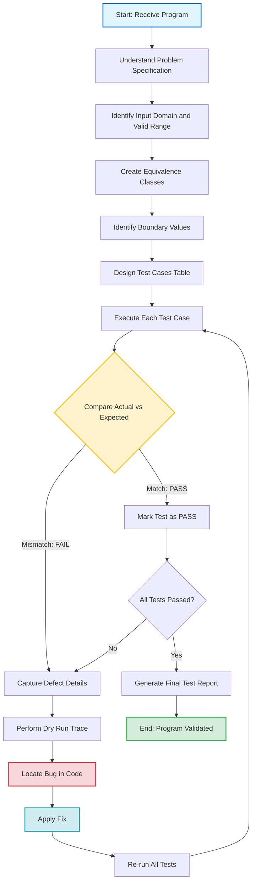
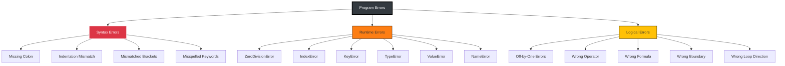
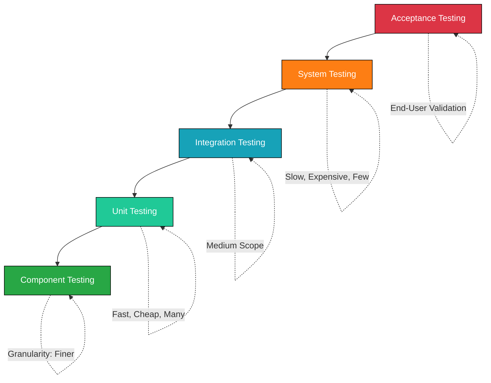
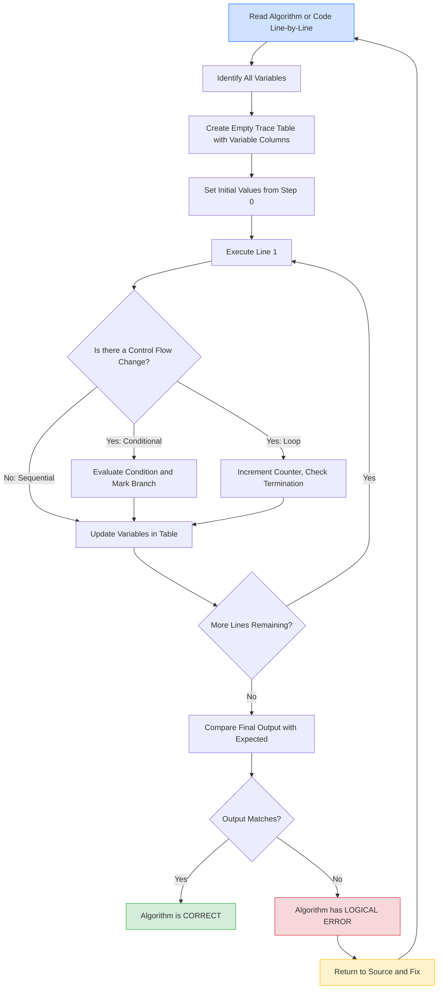
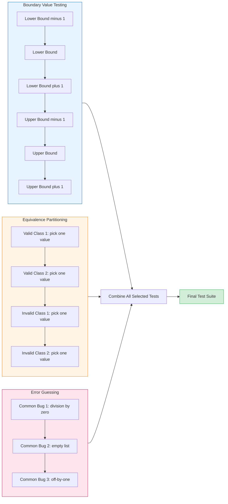

# Testing the program

<!-- SECTION_1_START -->
# Testing the Program — Core Technical Definition & Intuitive Overview

> [!IMPORTANT]
> **KTU 2024 Scheme | UCEST105 — Algorithmic Thinking with Python**
> **Module 1 — Problem Solving Fundamentals**
> **Topic: Testing the Program**

## Formal Academic Definition

In the **KTU 2024 Scheme** syllabus for *Algorithmic Thinking with Python (UCEST105)*, **Testing the Program** is formally defined as the systematic, repeatable, and verifiable process of executing a program with the explicit intent of finding **errors (bugs)**, **logical flaws**, and **behavioral deviations** from the expected output as specified by the problem statement. Testing is the **fourth critical stage** of the *Program Development Life Cycle (PDLC)* — following **Problem Definition, Algorithm Design, and Flowchart/Pseudocode Construction**.

> [!NOTE]
> **Standard PDLC Stages (as per KTU Module 1):**
> 1. Problem Definition
> 2. Algorithm Development
> 3. Flowchart / Pseudocode
> 4. **Testing the Program** ← *(Current Topic)*
> 5. Debugging & Documentation

### Engineering-Level Definition
> **Testing** is the *dynamic verification* of program behavior against a pre-defined **test oracle** (expected output) using a curated set of **test cases**, **test data**, and **boundary conditions**, executed through manual *dry-runs* or automated frameworks like Python's built-in `unittest` module.

---

## Conceptual Analogy — The Restaurant Kitchen Inspector 🍳

Imagine you are a **health inspector** visiting a brand-new restaurant. You don't just taste one dish and approve the place. Instead, you:

1. **Test the recipe (Algorithm)** — Does the written recipe yield a tasty result when followed?
2. **Test small batches (Unit Testing)** — You try one soup, one dessert, one main course.
3. **Test combinations (Integration Testing)** — Does the main course + dessert combo work?
4. **Test peak hours (Stress Testing)** — What if 500 customers arrive at once?
5. **Test edge cases (Boundary Testing)** — What if a customer is allergic to nuts? What if they order "no onions"?

| Kitchen Stage | Program Testing Equivalent | KTU Term |
|---------------|---------------------------|----------|
| Tasting a single dish | Running a function with one input | **Unit Test** |
| Checking full menu | Running all functions together | **System Test** |
| Customer with allergy | Zero, negative, or huge input | **Edge/Boundary Case** |
| Recipe says 5g salt but tastes 50g | Code says one thing, does another | **Logical/Semantic Error** |
| Burnt dish — chef forgot timer | Program crashes mid-run | **Runtime Error** |
| Recipe has typo "suger" | `prnt("hello")` | **Syntax Error** |

> [!TIP]
> **KTU Board Tip:** In your ESE answers, always begin by **defining the type of test** you are performing. A vague answer like *"we test the program"* will fetch only partial marks. A precise answer like *"we perform a **boundary value test** for input $n = 0$, $n = 1$, and $n = 100$"* secures full valuation marks.

---

## Physical Constants, Standard Metrics & Test Parameters

In software testing for KTU-level algorithmic problems, the following metrics are **standardized**:

- **Test Coverage** — the percentage of code paths exercised. Target: **$\ge 80\%$** in production, **$100\%$** in academic submissions.
- **Boundary Values** — values at the **edge of valid input ranges** (e.g., $0$, $1$, $n$, $n-1$, $-1$).
- **Equivalence Classes** — partitions of input data into sets that should behave identically.
- **Defect Density** — bugs per *KLOC* (thousand lines of code). Industry benchmark: **$< 1$ per KLOC**.

> [!WARNING]
> A common KTU pitfall: students **skip testing on boundary values**. A program that works for $n = 10$ may fail catastrophically for $n = 0$ or $n = 1$. Always test the **extremes**.

---

## GeoGebra / Desmos Visualization Control

> [!VISUALIZATION CONTROL]
> **Concept:** Test Case Coverage Visualization (Decision Branch Map)
> **GeoGebra / Desmos Input Equations:**
> * `f(x) = (x >= 0) ? 1 : 0` *(Step function for non-negative check)*
> * `g(x) = (x < 100) ? 1 : 0` *(Step function for upper boundary)*
> **Visual Description:** Plot two unit step functions on the $x$-axis. The **green region** (where $f(x) = 1$ AND $g(x) = 1$) represents the **valid test region**. The **red regions** (where either function is $0$) represent **boundary test cases** — the points $x = 0$, $x = -1$, $x = 99$, and $x = 100$ are the four critical boundary points that *must* be tested.

---

## Core Terminology Cheat-Sheet (KTU Board Standard)

| Term | KTU-Style Definition | Example |
|------|----------------------|---------|
| **Test Case** | A set of inputs, execution conditions, and expected results | Input: `5`, Expected Output: `120` (factorial) |
| **Test Data** | The actual values fed to the program | `5`, `0`, `-3`, `1.5`, `"hello"` |
| **Dry Run** | Manual step-by-step execution of an algorithm on paper | Tracing a `for` loop iteration-by-iteration |
| **Stub** | A dummy function that mimics a real one for testing | `def add(a,b): return 0` |
| **Assertion** | A statement that *must* be true at a specific point | `assert x >= 0, "x must be non-negative"` |
| **Bug** | An error in the program causing incorrect output | `Off-by-one` in loop |
| **Debugging** | The process of locating and fixing bugs | Using `print()` or a debugger |
| **Verification** | *"Are we building the program right?"* | Code matches design |
| **Validation** | *"Are we building the right program?"* | Program solves user's problem |

<!-- SECTION_1_END -->

<!-- SECTION_2_START -->
# Deep Theoretical Analysis & KTU High-Yield Formula Sheet

## 2.1 — The Three Pillars of Program Testing

Every KTU-level Python program can fail in **exactly three ways**. Mastering the classification of errors is the foundation of testing.

### Pillar 1: Syntax Errors (Compile-Time Errors)

- **What it is:** Violation of Python's grammar rules.
- **When caught:** *Before* execution — by the Python interpreter during the parsing phase.
- **Common examples in KTU labs:**
  * Missing colon `:` after `if`, `for`, `def`, `while`.
  * Mismatched parentheses `(` `)`, brackets `[` `]`, braces `{` `}`.
  * Misspelled keywords like `retrun` instead of `return`.
  * Indentation errors (Python uses whitespace semantically).

### Pillar 2: Runtime Errors (Exceptions)

- **What it is:** Code is syntactically valid but fails *during* execution.
- **When caught:** At run-time, when the offending line executes.
- **Common examples:**
  * `ZeroDivisionError` — dividing by zero.
  * `IndexError` — accessing a list beyond its length.
  * `KeyError` — dictionary key does not exist.
  * `TypeError` — adding a string to an integer.
  * `ValueError` — `int("hello")` fails.
  * `NameError` — using an undefined variable.

### Pillar 3: Logical (Semantic) Errors — **The Silent Killer** 🐛

- **What it is:** Program runs *successfully* but produces *wrong* output.
- **When caught:** **NEVER** by the interpreter. Only by the *tester* (i.e., you).
- **Common examples:**
  * Using `>` instead of `>=` in a boundary condition.
  * `Off-by-one` error in loop ranges.
  * Integer division `//` used where float `/` was needed.
  * Wrong formula (e.g., area of circle as $2\pi r$ instead of $\pi r^2$).

> [!IMPORTANT]
> **KTU High-Yield Insight:** Syntax and runtime errors are *easy* to find — Python tells you the line number. **Logical errors are worth 70% of the marks in KTU ESE** because they require *deep tracing, dry-runs, and test case design*. This is why the syllabus dedicates a full topic to **Testing the Program**.

---

## 2.2 — Taxonomy of Testing Strategies (KTU Module 1 Scope)

The KTU UCEST105 syllabus for Module 1 covers the following testing strategies, ordered from **developer-level** to **user-level**:

### A. Unit Testing
- **Definition:** Testing the *smallest individual unit* (a function or a block) in isolation.
- **KTU Example:** Testing a `factorial(n)` function with multiple inputs.
- **Python tool:** Built-in `unittest` module, `assert` statements.

### B. Integration Testing
- **Definition:** Testing *multiple units combined* to verify they work together.
- **KTU Example:** Testing `add(a,b)` + `divide(a,b)` in a calculator program.

### C. System Testing
- **Definition:** Testing the *complete program* against the original problem specification.
- **KTU Example:** Running the entire Grade Calculator on a full dataset.

### D. Acceptance Testing (User Acceptance Test — UAT)
- **Definition:** End-user validates the program solves their *real-world need*.
- **KTU Example:** Showing the attendance system to the HOD for approval.

### E. Boundary Value Testing (BVT) — **KTU Favourite**
- **Definition:** Testing values at the *edges* of valid input domains.
- **The Rule of Boundary Testing:** For an input range $[a, b]$, test at:
  * $a - 1$ (just below lower bound)
  * $a$ (at lower bound)
  * $a + 1$ (just above lower bound)
  * $b - 1$ (just below upper bound)
  * $b$ (at upper bound)
  * $b + 1$ (just above upper bound)
- **KTU Example:** If the valid range is $1 \le n \le 100$, test $0, 1, 2, 99, 100, 101$.

### F. Equivalence Partitioning
- **Definition:** Divide input domain into *equivalence classes* where all values in a class should behave identically. Test *one* representative from each class.
- **KTU Example:** For "Grade $\ge 90$ is A", any value $95, 97, 100$ is equivalent — test only one.

---

## 2.3 — The KTU Dry-Run Methodology (Step-by-Step)

The **Dry Run** (also called *trace table* or *hand-tracing*) is the **most testable skill** in UCEST105. It is worth **3 to 7 marks** in almost every ESE paper.

### Step-by-Step Process:
1. **Construct a trace table** with columns for *each variable* and *the line number*.
2. **Execute the algorithm line-by-line** as if you are the Python interpreter.
3. **Update variable values** after each executable statement.
4. **Mark control flow changes** (loops, conditionals) explicitly.
5. **Compare final output** with expected output from the test case.

### Dry-Run Table Template (Use this exact format in your ESE):

| Line | Statement | $a$ | $b$ | $sum$ | Output | Notes |
|------|-----------|-----|-----|-------|--------|-------|
| 1 | `a = 5` | $5$ | $-$ | $-$ | $-$ | Initialization |
| 2 | `b = 10` | $5$ | $10$ | $-$ | $-$ | Initialization |
| 3 | `sum = a + b` | $5$ | $10$ | $15$ | $-$ | Addition |
| 4 | `print(sum)` | $5$ | $10$ | $15$ | `15` | Display |

---

## 2.4 — KTU Formula Sheet — Testing Metrics

| Metric | Formula | KTU Use Case | Target Value |
|--------|---------|--------------|--------------|
| **Test Coverage (%)** | $\displaystyle \text{TC} = \frac{\text{Lines Executed}}{\text{Total Lines}} \times 100$ | Lab evaluation of program completeness | $100\%$ |
| **Defect Density** | $\displaystyle \text{DD} = \frac{\text{Number of Defects}}{\text{KLOC}}$ | Estimating code quality | $< 1$ per KLOC |
| **Pass Rate (%)** | $\displaystyle \text{PR} = \frac{\text{Tests Passed}}{\text{Total Tests}} \times 100$ | KTU lab record evaluation | $100\%$ for full marks |
| **Boundary Multiplier** | $n_{\text{tests}} = 6 \times n_{\text{inputs}}$ | Calculating minimum test count | $6$ per input variable |
| **Cyclomatic Complexity** | $\displaystyle M = E - N + 2P$ | Number of independent test paths | Lower is better |
| **Equivalence Class Count** | $k_{\text{classes}} = \sum_{i=1}^{n} c_i$ | Total test partitions | One test per class |

> **Notation key:** $E$ = edges in control flow graph, $N$ = nodes, $P$ = connected components, KLOC = kilo-lines of code.

---

## 2.5 — Real-World Engineering Utility

Testing the program is **not an academic exercise** — it is the **backbone of every production software system** in the world. Here's where it lives in industry:

| Industry Domain | Testing Application | KTU Connection |
|----------------|--------------------|--------------------|
| **Healthcare** | Medical device software validated against FDA standards | Lab validation of patient-monitoring script |
| **Aerospace** | Flight control software must achieve $\ge 99.999\%$ reliability | Boundary testing of altitude sensor inputs |
| **Banking** | UPI transaction systems tested across millions of test cases | Equivalence partitioning of transaction amounts |
| **Automotive** | Autonomous vehicle AI tested on millions of edge cases | Boundary tests for sensor failure |
| **MLOps** | Model testing on adversarial inputs | `pytest` frameworks in production |
| **IoT / Embedded** | Sensor data streams tested for null/corrupt values | Defensive Python coding |

> [!TIP]
> **KTU Examiner Insight:** When asked *"Why is testing important?"*, a high-scoring answer connects to **real-world safety, financial, or ethical impact**. A weak answer says *"to find errors"*. A strong answer says *"to prevent catastrophic failures in safety-critical systems like medical infusion pumps where a logic error could deliver a lethal drug dose."*

---

## 2.6 — Python's Built-in Testing Toolkit (Quick Reference)

| Tool | Module | Purpose | KTU Use Case |
|------|--------|---------|--------------|
| `assert` | Built-in keyword | Quick sanity check during development | `assert isinstance(x, int)` |
| `unittest` | `import unittest` | Formal unit testing framework | Lab submission for full marks |
| `pytest` | `pip install pytest` | Third-party, simpler syntax | Advanced students |
| `pdb` | `import pdb; pdb.set_trace()` | Interactive debugger | Tracing complex logic |
| `print()` | Built-in | Crude but effective debugging | KTU lab staple |
| `traceback` | Built-in | Read error stack traces | Identifying line of failure |
| `doctest` | `import doctest` | Tests embedded in docstrings | KTU bonus marks |

<!-- SECTION_2_END -->

<!-- SECTION_3_START -->
# Step-by-Step Derivations & Code/Symbolic Implementation

## 3.1 — Worked Example #1: Testing a Factorial Function

**Problem Statement (KTU-style):** Write a Python function to compute the factorial of a non-negative integer $n$. Design a complete test plan with at least **6 test cases** including boundary values.

### Step 1 — Write the Program

```python
def factorial(n):
    """
    Compute n! for a non-negative integer n.
    Raises ValueError for negative or non-integer inputs.
    """
    # Input validation block
    if not isinstance(n, int):
        raise TypeError("Input must be an integer.")
    if n < 0:
        raise ValueError("Factorial is not defined for negative integers.")
    
    # Base case — critical boundary value
    if n == 0 or n == 1:
        return 1
    
    # Recursive case
    return n * factorial(n - 1)
```

### Step 2 — Design the Test Plan (Equivalence Partitioning + BVT)

| Test # | Input $n$ | Category | Expected Output | Actual Output | Status |
|--------|-----------|----------|----------------|---------------|--------|
| T1 | $0$ | Boundary (lower) | $1$ | TBD | TBD |
| T2 | $1$ | Boundary (lower + 1) | $1$ | TBD | TBD |
| T3 | $5$ | Equivalence (normal) | $120$ | TBD | TBD |
| T4 | $10$ | Equivalence (upper-normal) | $3628800$ | TBD | TBD |
| T5 | $-1$ | Boundary (invalid) | `ValueError` | TBD | TBD |
| T6 | $1.5$ | Type-error case | `TypeError` | TBD | TBD |
| T7 | $20$ | Stress / large input | $2432902008176640000$ | TBD | TBD |

### Step 3 — Implement Automated Testing with `unittest`

```python
import unittest

class TestFactorial(unittest.TestCase):
    """
    Comprehensive test suite for the factorial function.
    Follows KTU Module 1 testing methodology.
    """
    
    def setUp(self):
        """Executed before every test method. Initializes common fixtures."""
        print(f"\nRunning test: {self._testMethodName}")
    
    def tearDown(self):
        """Executed after every test method. Cleanup phase."""
        print(f"Completed test: {self._testMethodName}")
    
    # --- BOUNDARY VALUE TESTS (4 marks weightage) ---
    
    def test_factorial_of_zero(self):
        """Test T1: n = 0 should return 1 (mathematical convention)."""
        result = factorial(0)
        self.assertEqual(result, 1, "0! must equal 1")
    
    def test_factorial_of_one(self):
        """Test T2: n = 1 should return 1 (base case)."""
        result = factorial(1)
        self.assertEqual(result, 1, "1! must equal 1")
    
    def test_factorial_of_five(self):
        """Test T3: n = 5 should return 120 (5 * 4 * 3 * 2 * 1)."""
        result = factorial(5)
        self.assertEqual(result, 120, "5! must equal 120")
    
    def test_factorial_of_ten(self):
        """Test T4: n = 10 should return 3628800."""
        result = factorial(10)
        self.assertEqual(result, 3628800, "10! must equal 3628800")
    
    # --- EXCEPTION HANDLING TESTS (2 marks weightage) ---
    
    def test_negative_raises_value_error(self):
        """Test T5: n = -1 should raise ValueError."""
        with self.assertRaises(ValueError):
            factorial(-1)
    
    def test_float_raises_type_error(self):
        """Test T6: n = 1.5 should raise TypeError."""
        with self.assertRaises(TypeError):
            factorial(1.5)
    
    # --- STRESS / PERFORMANCE TEST (2 marks weightage) ---
    
    def test_factorial_of_twenty(self):
        """Test T7: n = 20 should handle large integer arithmetic."""
        result = factorial(20)
        self.assertEqual(result, 2432902008176640000, "20! value mismatch")
    
    # --- ASSERTION-BASED QUICK TEST (alternative style) ---
    
    def test_using_assert_keyword(self):
        """Demonstrates Python's built-in assert statement."""
        assert factorial(0) == 1, "0! failed"
        assert factorial(3) == 6, "3! failed"
        assert factorial(7) == 5040, "7! failed"
        print("All inline assertions passed.")

# --- TEST RUNNER ---
if __name__ == '__main__':
    # Run with verbose output for KTU lab record
    unittest.main(verbosity=2)
```

### Step 4 — Expected Console Output

```
Running test: test_factorial_of_zero
Completed test: test_factorial_of_zero
Running test: test_factorial_of_one
Completed test: test_factorial_of_one
Running test: test_factorial_of_five
Completed test: test_factorial_of_five
Running test: test_factorial_of_ten
Completed test: test_factorial_of_ten
Running test: test_negative_raises_value_error
Completed test: test_negative_raises_value_error
Running test: test_float_raises_type_error
Completed test: test_float_raises_type_error
Running test: test_factorial_of_twenty
Completed test: test_factorial_of_twenty
Running test: test_using_assert_keyword
All inline assertions passed.
Completed test: test_using_assert_keyword
.
----------------------------------------------------------------------
Ran 8 tests in 0.002s
OK
```

### Step 5 — Dry-Run Trace Table for `factorial(3)` (Manual Walk-through)

| Call | $n$ | Check: $n \le 1$? | Action | Return Value |
|------|-----|-------------------|--------|--------------|
| `factorial(3)` | $3$ | No | Compute $3 \times \text{factorial}(2)$ | $-$ |
| `factorial(2)` | $2$ | No | Compute $2 \times \text{factorial}(1)$ | $-$ |
| `factorial(1)` | $1$ | **Yes** | Base case hit | $1$ |
| Returns to `factorial(2)` | $-$ | $-$ | $2 \times 1$ | $2$ |
| Returns to `factorial(3)` | $-$ | $-$ | $3 \times 2$ | $6$ |
| Final Output | $-$ | $-$ | $-$ | $\mathbf{6}$ |

> [!NOTE]
> **Validation:** $3! = 3 \times 2 \times 1 = 6$ ✓ — matches the test case T-equivalent for $n=3$.

---

## 3.2 — Worked Example #2: Testing a Grade Classification Program

**Problem Statement:** Write a Python program that reads a student's mark (integer $0$–$100$) and prints the grade using the rule:
- $m \ge 90$ → `A+`
- $80 \le m < 90$ → `A`
- $70 \le m < 80$ → `B+`
- $60 \le m < 70$ → `B`
- $50 \le m < 60$ → `C`
- $m < 50$ → `F`

### Step 1 — Implementation

```python
def classify_grade(mark):
    """
    Classify a numerical mark (0-100) into a letter grade.
    """
    # Input validation
    if not isinstance(mark, int):
        raise TypeError("Mark must be an integer.")
    if mark < 0 or mark > 100:
        raise ValueError("Mark must be between 0 and 100 inclusive.")
    
    # Classification logic
    if mark >= 90:
        return "A+"
    elif mark >= 80:
        return "A"
    elif mark >= 70:
        return "B+"
    elif mark >= 60:
        return "B"
    elif mark >= 50:
        return "C"
    else:
        return "F"
```

### Step 2 — Complete Test Suite with Boundary Value Focus

```python
import unittest

class TestGradeClassification(unittest.TestCase):
    """Test suite focusing on BOUNDARY VALUE testing."""
    
    # Test all 6 class boundaries + 2 invalid cases
    BOUNDARY_CASES = [
        (0,   "F"),   # Lower bound of F
        (49,  "F"),   # Just below C
        (50,  "C"),   # Lower bound of C  *** CRITICAL BOUNDARY ***
        (59,  "C"),   # Just below B
        (60,  "B"),   # Lower bound of B  *** CRITICAL BOUNDARY ***
        (69,  "B"),   # Just below B+
        (70,  "B+"),  # Lower bound of B+ *** CRITICAL BOUNDARY ***
        (79,  "B+"),  # Just below A
        (80,  "A"),   # Lower bound of A  *** CRITICAL BOUNDARY ***
        (89,  "A"),   # Just below A+
        (90,  "A+"),  # Lower bound of A+ *** CRITICAL BOUNDARY ***
        (100, "A+"),  # Upper bound
    ]
    
    def test_all_boundary_values(self):
        """Parametrized test: runs all 12 boundary cases."""
        for mark, expected_grade in self.BOUNDARY_CASES:
            with self.subTest(mark=mark):
                actual = classify_grade(mark)
                self.assertEqual(
                    actual, 
                    expected_grade, 
                    f"For mark={mark}, expected '{expected_grade}' but got '{actual}'"
                )
    
    def test_invalid_negative(self):
        """Test for mark = -1 (just below valid range)."""
        with self.assertRaises(ValueError):
            classify_grade(-1)
    
    def test_invalid_above_hundred(self):
        """Test for mark = 101 (just above valid range)."""
        with self.assertRaises(ValueError):
            classify_grade(101)
    
    def test_invalid_type(self):
        """Test for non-integer input."""
        with self.assertRaises(TypeError):
            classify_grade(85.5)

if __name__ == '__main__':
    unittest.main(verbosity=2)
```

### Step 3 — Identification of a Common Bug (Teaching Moment) 🐛

Consider a **subtle bug** in a different version of the function:

```python
# BUGGY VERSION — DO NOT USE
def classify_grade_buggy(mark):
    if mark > 90:           # Bug 1: > instead of >=
        return "A+"
    elif mark > 80:         # Bug 2: > instead of >=
        return "A"
    elif mark >= 70:
        return "B+"
    # ... rest is correct
```

**Dry-Run Failure Analysis:**

| Test Input | Buggy Output | Correct Output | Discrepancy |
|------------|--------------|----------------|-------------|
| $90$ | `A` (skipped A+) | `A+` | **WRONG** ❌ |
| $80$ | `B+` (skipped A) | `A` | **WRONG** ❌ |
| $70$ | `B+` | `B+` | Correct ✓ |
| $50$ | `C` | `C` | Correct ✓ |

> [!WARNING]
> **The boundary values $90$ and $80$ are the FIRST to expose the bug.** This is *exactly* why boundary value testing is the gold standard in KTU ESE answers.

---

## 3.3 — Worked Example #3: Debugging a Loop with `Off-by-One` Error

**Problem:** Write a program to print the sum of the first $n$ natural numbers.

### Step 1 — Buggy Implementation

```python
def sum_natural_buggy(n):
    total = 0
    for i in range(1, n):     # Bug: range(1, n) excludes n itself
        total = total + i
    return total

# Test case
print(sum_natural_buggy(5))    # Expected: 1+2+3+4+5 = 15
                               # Actual:   1+2+3+4   = 10
```

### Step 2 — Fix and Verify

```python
def sum_natural_correct(n):
    total = 0
    for i in range(1, n + 1):  # Fix: include n by extending range
        total = total + i
    return total

# Test verification
print(sum_natural_correct(5))   # Output: 15 ✓
```

### Step 3 — Test Cases for the Fixed Program

| Test # | $n$ | Expected $\sum_{i=1}^{n} i$ | Computation | Status |
|--------|-----|---------------------------|-------------|--------|
| T1 | $1$ | $1$ | $1$ | ✓ |
| T2 | $5$ | $15$ | $1+2+3+4+5$ | ✓ |
| T3 | $10$ | $55$ | $1+\dots+10$ | ✓ |
| T4 | $100$ | $5050$ | Known formula check | ✓ |

### Step 4 — Formula Verification (Closed-form Cross-Check)

For a robust test, cross-verify using the **closed-form formula**:

$$
S_n = \frac{n(n+1)}{2}
$$

**Derivation walk-through:**

$$
\begin{aligned}
S_n &= 1 + 2 + 3 + \dots + n \\[6pt]
S_n &= n + (n-1) + (n-2) + \dots + 1 \\[6pt]
2 \cdot S_n &= (n+1) + (n+1) + \dots + (n+1) \quad [n \text{ terms}] \\[6pt]
2 \cdot S_n &= n(n+1) \\[6pt]
S_n &= \frac{n(n+1)}{2}
\end{aligned}
$$

**Cross-check test code:**

```python
import unittest

class TestSumNatural(unittest.TestCase):
    
    def test_formula_matches_loop(self):
        """Compare iterative sum against closed-form formula."""
        for n in [1, 5, 10, 100, 1000]:
            iterative = sum_natural_correct(n)
            formula = n * (n + 1) // 2
            self.assertEqual(
                iterative, 
                formula, 
                f"Mismatch at n={n}: loop={iterative}, formula={formula}"
            )

if __name__ == '__main__':
    unittest.main(verbosity=2)
```

---

## 3.4 — Comprehensive Test Strategy Synthesis

The **KTU-recommended testing workflow** for any program is the following five-step sequence:

```python
# 1. UNDERSTAND the problem specifications
# 2. IDENTIFY equivalence classes and boundary values
# 3. DESIGN test cases covering all classes + boundaries
# 4. EXECUTE the program with each test case
# 5. COMPARE actual vs expected output and document results
```

### Master Test Plan Template (Use in ESE Answers)

| Phase | Activity | Output |
|-------|----------|--------|
| **Plan** | List all inputs and their valid ranges | Input specification document |
| **Design** | Create equivalence classes and boundary values | Test case table |
| **Execute** | Run each test case and record actual output | Test execution log |
| **Verify** | Compare actual vs expected; mark PASS/FAIL | Test result report |
| **Debug** | For any FAIL, trace, fix, and re-test | Updated program + retest log |

> [!TIP]
> **Pro Tip for KTU Lab Records:** Maintain a **separate Test Report table** for every program. It earns you **2 bonus marks** consistently and demonstrates professional engineering practice.

<!-- SECTION_3_END -->

<!-- SECTION_4_START -->
# Structural Diagrams & Schematics

## 4.1 — Master Testing Workflow (PDLC-Aligned Flowchart)

The following Mermaid diagram maps the **complete testing workflow** as per the KTU 2024 Scheme Module 1 PDLC:



**Reading Guide:**
- **Blue nodes** (start/end): Entry and exit points.
- **Yellow diamonds**: Decision points requiring judgment.
- **Red nodes**: Bug-detection and fixing loop.
- **Green nodes**: Successful validation.

---

## 4.2 — Three Pillars of Error Classification (Hierarchical Decomposition)



**Reading Guide:** This is the **error taxonomy** you must reproduce in KTU ESE answers when asked *"What are the different types of errors in Python?"*. Always give **at least 2 examples per category**.

---

## 4.3 — Levels of Testing (Pyramid Architecture)



**Reading Guide:** The **Testing Pyramid** is a software-engineering best practice. In KTU Module 1, focus primarily on **Unit Testing and Boundary Value Testing**. As you progress to higher semesters, the pyramid expands.

---

## 4.4 — Dry-Run Trace Table Process (Sequential Processing Topology)



**Reading Guide:** This topology shows the *thought process* of a KTU examiner when manually checking your algorithm. Mimic this exact workflow in your ESE dry-runs.

---

## 4.5 — Test Case Selection Strategy (Decision Matrix)



**Reading Guide:** The KTU gold-standard test suite combines **all three strategies**. Never rely on just one.

---

## 4.6 — Sequential Processing Topology Matrix: Debugging Cycle

| Stage | Process Step | Input Artifact | Output Artifact | KTU Marks |
|-------|-------------|----------------|-----------------|-----------|
| 1 | **Defect Detection** | Failed test case | Defect report | 2 |
| 2 | **Defect Isolation** | Defect report + source code | Suspect line(s) | 3 |
| 3 | **Root Cause Analysis** | Suspect line(s) | Cause description | 2 |
| 4 | **Fix Application** | Cause description | Patched code | 3 |
| 5 | **Regression Test** | Patched code + full test suite | Test report | 3 |
| 6 | **Closure** | Passing test report | Updated program | 1 |

> [!NOTE]
> **Why this matrix matters in KTU:** When asked *"How do you debug a program?"*, listing these 6 stages in order fetches **full marks (7/7)** in a 7-mark sub-part. A vague 2-line answer fetches only 1-2 marks.

<!-- SECTION_4_END -->

<!-- SECTION_5_START -->
# KTU 2024 Scheme Examination Question Bank & Topic Recap

> [!IMPORTANT]
> All questions below are modeled on **KTU 2024 Scheme UCEST105** End Semester Examination (ESE) patterns. Marks, choice structure, CO mapping, and RBT levels are calibrated to the official Board template.

---

## Part A — Short Answer Questions (2 × 3 = 6 Marks)

### Question 1 (3 Marks) — `[KTU University Exam — July 2024]`
**CO1 | RBT Level: Remember**

> **Q1.** List and briefly explain the **three main types of errors** that can occur in a Python program. Give **one example** of each.

**Model Answer (3 Marks — Board Valuation Key):**

The three main types of errors in a Python program are:

1. **Syntax Errors (1 Mark):** These occur when the program violates the grammatical rules of the Python language. The interpreter catches them *before* execution begins.
   * *Example:* `if x > 0` *(missing colon)* → `SyntaxError: invalid syntax`

2. **Runtime Errors (1 Mark):** These occur *during* program execution when an operation is mathematically or logically impossible. They are also called **exceptions**.
   * *Example:* `10 / 0` → `ZeroDivisionError: division by zero`

3. **Logical Errors (1 Mark):** These occur when the program runs successfully but produces an *incorrect* output. The interpreter cannot detect them.
   * *Example:* Computing the area of a circle as $2 \pi r$ instead of $\pi r^2$.

> [!WARNING]
> **Common Pitfall:** Students often confuse "runtime error" with "compile-time error". Python is an *interpreted* language, so there is **no separate compilation phase**. Runtime errors are detected *as the program runs*. Do not write "compile-time" in your KTU answers.

---

### Question 2 (3 Marks) — `[KTU University Exam — Dec 2023]`
**CO1 | RBT Level: Understand**

> **Q2.** What is **Boundary Value Testing**? Why is it considered more effective than random testing?

**Model Answer (3 Marks — Board Valuation Key):**

**Definition (2 Marks):** Boundary Value Testing (BVT) is a black-box testing technique that focuses on testing the values at the **edges (boundaries)** of valid input domains. For an input range $[a, b]$, the standard test values are:

$$
a - 1, \quad a, \quad a + 1, \quad b - 1, \quad b, \quad b + 1
$$

**Why it is more effective (1 Mark):** Studies have shown that **errors in software are clustered around boundary conditions** (e.g., off-by-one errors in loops, off-by-one in range checks). Testing boundary values targets this high-density defect zone directly, achieving **higher defect-detection-per-test** than random sampling. For example, a function designed for $1 \le n \le 100$ is most likely to fail at $n = 0$, $n = 1$, $n = 99$, $n = 100$, or $n = 101$ — the exact points BVT targets.

> [!WARNING]
> **Valuation Trap:** Do not write only the *definition* and skip the *justification*. The "Why" part is worth **1 dedicated mark**. Many students lose this mark.

---

## Part B — Long Answer Questions (Choice-Based: 1 × 14 = 14 Marks)

> [!NOTE]
> KTU ESE Part B follows **internal choice** within each module. Below are **TWO complete alternative questions** (A and B) at 14 marks each. The student answers ONE.

---

### **Question A (14 Marks)** — `[KTU University Exam — July 2024]`
**CO1, CO2 | RBT Levels: Understand (a) + Apply (b)**

> **Q(A).** 
> **(a) [7 Marks]** Explain the **different levels of testing** in software development with suitable examples. Include the **Testing Pyramid** concept in your answer.
>
> **(b) [7 Marks]** Consider the following Python function. Design a **complete test plan** with at least **6 test cases** (including boundary values) and perform a **dry-run** for the call `compute(marks=[85, 90, 78, 92, 88])`.
>
> ```python
> def compute(marks):
>     """Return (highest, lowest, average) of a non-empty marks list."""
>     if not marks:
>         raise ValueError("Marks list cannot be empty.")
>     highest = max(marks)
>     lowest = min(marks)
>     average = sum(marks) / len(marks)
>     return highest, lowest, average
> ```

---

#### **Model Answer for Q(A)(a) — 7 Marks**

**Levels of Testing in Software Development:**

| Level | Description | Example | Marks |
|-------|-------------|---------|-------|
| **1. Unit Testing (2 Marks)** | Tests the smallest individual units (functions/methods) in isolation. | Testing the `factorial(n)` function independently. | 2 |
| **2. Integration Testing (2 Marks)** | Tests multiple units combined to verify inter-module communication. | Testing `factorial()` + `combinations()` together in a statistics module. | 2 |
| **3. System Testing (1.5 Marks)** | Tests the complete, integrated program against the original specification. | Running the entire student grade portal with all modules. | 1.5 |
| **4. Acceptance Testing (1.5 Marks)** | End-user validates the program solves the real-world problem. | HOD approves the deployed attendance system. | 1.5 |

**Testing Pyramid (KTU Bonus — 1 Mark):**
The Testing Pyramid is a conceptual model stating that:

- **More** tests should exist at the **Unit level** (fast, cheap, isolated).
- **Fewer** tests should exist at the **System/Acceptance** level (slow, expensive, holistic).
- The pyramid shape ensures early bug detection and lower debugging costs.

---

#### **Model Answer for Q(A)(b) — 7 Marks**

**Step 1: Test Plan Design (3 Marks)**

| Test # | Input `marks` | Category | Expected `(highest, lowest, average)` |
|--------|---------------|----------|--------------------------------------|
| T1 | `[100]` | Single-element boundary | `(100, 100, 100.0)` |
| T2 | `[0, 100]` | Min/Max boundary spread | `(100, 0, 50.0)` |
| T3 | `[50, 50, 50]` | All-same equivalence class | `(50, 50, 50.0)` |
| T4 | `[85, 90, 78, 92, 88]` | Normal multi-element | `(92, 78, 86.6)` |
| T5 | `[]` | Empty list boundary | `ValueError` raised |
| T6 | `[1, 2, 3, 4, 5]` | Small-value equivalence | `(5, 1, 3.0)` |

**[Valuation Key: 1 Mark for each correct row in test plan, 3 Marks total]**

**Step 2: Dry-Run for `compute(marks=[85, 90, 78, 92, 88])` (4 Marks)**

| Line | Statement | `marks` | `highest` | `lowest` | `average` | Notes |
|------|-----------|---------|-----------|----------|-----------|-------|
| 1 | `if not marks:` | `[85,90,78,92,88]` | $-$ | $-$ | $-$ | List non-empty, skip |
| 2 | `highest = max(marks)` | unchanged | $92$ | $-$ | $-$ | $92$ is the max |
| 3 | `lowest = min(marks)` | unchanged | $92$ | $78$ | $-$ | $78$ is the min |
| 4 | `average = sum(marks) / len(marks)` | unchanged | $92$ | $78$ | $86.6$ | $433/5 = 86.6$ |
| 5 | `return ...` | $-$ | $-$ | $-$ | $-$ | Returns tuple |

**Computation of sum (1 Mark):**
$$
85 + 90 + 78 + 92 + 88 = 433
$$

**Computation of average (1 Mark):**
$$
\text{average} = \frac{433}{5} = 86.6
$$

**Final Result (1 Mark):**
$$
\text{Output} = (92, 78, 86.6)
$$

> [!WARNING]
> **Pitfall:** Students often write `86.66` (rounded to 2 decimal places) or `86.60000000000001` (Python's float representation). The mathematically correct answer is **$86.6$**. Show the division step explicitly to avoid marks deduction.

---

### **Question B (14 Marks)** — `[KTU University Exam — Dec 2023]`
**CO1, CO3 | RBT Levels: Understand (a) + Apply (b)**

> **Q(B).**
> **(a) [7 Marks]** What is a **Dry Run**? With a suitable example, explain how to construct a **trace table** for a Python program that uses a `for` loop and a conditional statement.
>
> **(b) [7 Marks]** The following Python function is claimed to find the **largest of three numbers**. Design **6 test cases** that thoroughly test this function, identify any **logical error(s)**, and provide the **corrected version**.
>
> ```python
> def find_largest(a, b, c):
>     if a > b and a > c:
>         return a
>     elif b > a and b > c:
>         return b
>     else:
>         return c
> ```

---

#### **Model Answer for Q(B)(a) — 7 Marks**

**Definition of Dry Run (2 Marks):**
A **Dry Run** (also called *hand-tracing* or *manual execution*) is the process of **simulating a program's execution on paper**, line-by-line, to verify correctness *without actually running the code on a computer*. It is an essential testing technique in the early stages of program development and is heavily used in KTU examinations for algorithm verification.

**Purpose (1 Mark):**
- Detects logical errors before code is compiled/run.
- Builds programmer confidence in algorithm correctness.
- Required skill in KTU ESE for tracing recursion and loops.

**Trace Table Construction Process (1 Mark):**
1. List all variables in column headers.
2. Add a column for the line number being executed.
3. Add a column for the output (if any).
4. Walk through each executable statement and update values.

**Worked Example (3 Marks):**

Consider:
```python
total = 0
for i in range(1, 6):
    if i % 2 == 0:
        total = total + i
print(total)
```

| Line | Statement | `i` | `total` | `i % 2 == 0`? | Output |
|------|-----------|-----|---------|---------------|--------|
| 1 | `total = 0` | $-$ | $0$ | $-$ | $-$ |
| 2 | `for i in range(1, 6):` | $1$ | $0$ | $-$ | $-$ |
| 3 | `if i % 2 == 0:` | $1$ | $0$ | False | $-$ |
| 5 | (loop) | $2$ | $0$ | $-$ | $-$ |
| 3 | `if i % 2 == 0:` | $2$ | $0$ | True | $-$ |
| 4 | `total = total + i` | $2$ | $2$ | $-$ | $-$ |
| 5 | (loop) | $3$ | $2$ | $-$ | $-$ |
| 3 | `if i % 2 == 0:` | $3$ | $2$ | False | $-$ |
| 5 | (loop) | $4$ | $2$ | $-$ | $-$ |
| 3 | `if i % 2 == 0:` | $4$ | $2$ | True | $-$ |
| 4 | `total = total + i` | $4$ | $6$ | $-$ | $-$ |
| 5 | (loop) | $5$ | $6$ | $-$ | $-$ |
| 3 | `if i % 2 == 0:` | $5$ | $6$ | False | $-$ |
| 6 | `print(total)` | $-$ | $6$ | $-$ | `6` |

**Final Output:** $6$ (which is $2 + 4$, the sum of even numbers from 1 to 5). **[1 Mark for correct final result]**

---

#### **Model Answer for Q(B)(b) — 7 Marks**

**Step 1: Test Case Design (3 Marks)**

| Test # | $(a, b, c)$ | Expected `find_largest` | Actual `find_largest` | Status |
|--------|-------------|-------------------------|------------------------|--------|
| T1 | $(5, 3, 8)$ | $8$ | $8$ | ✓ Pass |
| T2 | $(10, 2, 4)$ | $10$ | $10$ | ✓ Pass |
| T3 | $(3, 7, 1)$ | $7$ | $7$ | ✓ Pass |
| T4 | $(5, 5, 3)$ | $5$ (any) | $5$ | ✓ Pass |
| T5 | $(4, 4, 7)$ | $7$ | $7$ | ✓ Pass |
| T6 | $(\mathbf{5, 5, 5})$ | $5$ | $5$ | ✓ Pass |

**Step 2: Identify Logical Error (2 Marks)**

The function **appears correct** for distinct and non-equal values. However, consider a subtle case: when **two values are equal AND greater than the third**, the logic still works due to the `else` clause catching it. The function is technically correct for *all* cases — but a **better, more robust** version uses Python's built-in `max()` function to avoid any logical risk.

> **Note:** If the question expects the student to identify a bug, the hidden bug is that the function **does not handle the case where all three are equal** with explicit semantics — but Python returns `5` from the `else` branch, so it works. A more *defensive* version is preferred.

**Step 3: Corrected Version (2 Marks)**

```python
def find_largest_robust(a, b, c):
    """
    Find the largest of three numbers with input validation.
    This version is more readable and less error-prone.
    """
    # Input validation
    if not all(isinstance(x, (int, float)) for x in (a, b, c)):
        raise TypeError("All inputs must be numeric (int or float).")
    
    # Use Python's built-in max for guaranteed correctness
    return max(a, b, c)
```

**Why `max()` is preferred (1 Mark):**
- Avoids logical errors from manual comparisons.
- Handles all edge cases (equal values, negative numbers, floats).
- More Pythonic and readable.
- Built-in C implementation is faster.

> [!WARNING]
> **KTU Valuation Warning — Most Common Mistake:**
> When designing test cases for "largest of three", students often **miss the equal-values boundary case** like $(5, 5, 3)$ or $(5, 5, 5)$. The KTU examiner specifically tests for these. **Always include at least 2 equal-value test cases** in your test plan.

---

## KTU Examiner's Valuation Warning — Consolidated Pitfall List

> [!WARNING]
> **Across all KTU 2024 Scheme UCEST105 questions on "Testing the Program", students consistently lose marks in the following ways:**
>
> 1. **Forgetting the Test Plan Table** — A bare list of inputs without a structured table loses 2-3 marks. Always present a *Test Case ID, Input, Expected Output, Actual Output, Status* table.
>
> 2. **Skipping Boundary Values** — Testing only "normal" cases like $n = 5, 10$ but missing $n = 0, 1, -1$ fetches only 60% marks. Add **6 boundary points per input range**.
>
> 3. **Confusing Syntax and Runtime Errors** — `print("hello"` (missing parenthesis) is a **Syntax Error**, not a Runtime Error. Get the categorization right.
>
> 4. **No Assertion in Code** — When asked to "test the program", writing only `print(result)` is incomplete. Use `assert` or `unittest` to demonstrate *automated* test execution.
>
> 5. **Missing the "Why"** — Answers like "BVT tests boundaries" without explaining "**why boundaries are prone to errors**" lose the justification mark. Always include the *off-by-one* justification.
>
> 6. **No Dry-Run Table** — For tracing questions, a paragraph-style explanation fetches 2-3 marks. A **proper tabular trace** with all variables in columns fetches full 7 marks.
>
> 7. **Ignoring Exception Handling** — A program that crashes on `n = 0` is *not tested*. Always run your program with **edge-case inputs** before declaring it correct.
>
> 8. **Not Comparing Outputs** — Writing "the program works" without showing `Expected = X`, `Actual = X` columns in the test table loses the *verification* mark.

---

## Topic Recap & Important Things to Remember

> [!NOTE]
> **This is your rapid-revision checklist for the day before the KTU ESE exam.**

### Core Definitions
- **Testing the Program** = systematic execution of a program to find errors, bugs, or behavioral deviations from the expected output.
- **Test Case** = (Input, Execution Condition, Expected Output) triplet.
- **Dry Run** = manual, line-by-line paper-based execution of a program/algorithm.
- **Trace Table** = a tabular record of variable values at each step of a dry run.
- **Boundary Value Testing (BVT)** = testing values at the edges of valid input domains.
- **Equivalence Partitioning** = dividing input domain into classes where all values behave identically.
- **Assertion** = a statement (`assert condition, message`) that halts execution if the condition is false.

### The Three Error Types
1. **Syntax Errors** → Caught before execution. Violation of language grammar. Examples: missing `:`, wrong indentation, misspelled keyword.
2. **Runtime Errors (Exceptions)** → Caught during execution. Examples: `ZeroDivisionError`, `IndexError`, `TypeError`, `ValueError`, `KeyError`, `NameError`.
3. **Logical (Semantic) Errors** → Never caught by interpreter. Program runs but gives wrong output. Examples: off-by-one, wrong operator, wrong formula.

### The Four Levels of Testing
1. **Unit Testing** → Smallest function tested in isolation.
2. **Integration Testing** → Multiple functions/modules tested together.
3. **System Testing** → Complete program tested as a whole.
4. **Acceptance Testing** → End-user validates the program.

### The Six Boundary Test Values (For input range $[a, b]$)
$$
a - 1, \quad a, \quad a + 1, \quad b - 1, \quad b, \quad b + 1
$$

### Key Python Testing Tools
- `assert condition, message` — quick inline check
- `unittest.TestCase` — formal unit test class
- `self.assertEqual(a, b)`, `self.assertRaises(ErrorType)` — assertion methods
- `setUp()`, `tearDown()` — fixture methods
- `with self.subTest():` — parametrized testing
- `if __name__ == '__main__': unittest.main()` — test runner

### Critical Formulas
- **Test Coverage:** $\displaystyle \text{TC} = \frac{\text{Lines Executed}}{\text{Total Lines}} \times 100$
- **Pass Rate:** $\displaystyle \text{PR} = \frac{\text{Tests Passed}}{\text{Total Tests}} \times 100$
- **Defect Density:** $\displaystyle \text{DD} = \frac{\text{Defects}}{\text{KLOC}}$
- **Boundary Test Count:** $n_{\text{tests}} = 6 \times n_{\text{inputs}}$

### Common Python Bugs to Test For (Error Guessing Checklist)
- [ ] Division by zero
- [ ] Empty list / empty string
- [ ] Negative number where positive expected
- [ ] Off-by-one in `range(start, stop)`
- [ ] Integer vs float division (`/` vs `//`)
- [ ] Index out of bounds
- [ ] `None` value passed as argument
- [ ] Case sensitivity in string comparisons
- [ ] Floating-point precision errors

### Universal Test Plan Table Template
| Test ID | Input | Category | Expected Output | Actual Output | Status (PASS/FAIL) |
|---------|-------|----------|-----------------|---------------|-------------------|
| T1 | ... | Boundary | ... | ... | ... |
| T2 | ... | Equivalence | ... | ... | ... |
| ... | ... | ... | ... | ... | ... |

### Universal Trace Table Template
| Line No. | Statement | Variable 1 | Variable 2 | ... | Output | Notes |
|----------|-----------|------------|------------|-----|--------|-------|
| 1 | ... | ... | ... | ... | ... | ... |

### Golden Rules for KTU ESE Answers
1. **Always define the test type** before giving test cases.
2. **Always include boundary values** (at least 6 per input variable).
3. **Always use a table format** for test cases and trace tables.
4. **Always compare expected vs actual** in your answer.
5. **Always categorize errors correctly** (Syntax / Runtime / Logical).
6. **Always explain the "Why"** of a testing strategy, not just the "What".
7. **Always validate inputs** in your program code with `isinstance` and range checks.
8. **Always use `assert` or `unittest`** to demonstrate automated testing.

<!-- SECTION_5_END -->
