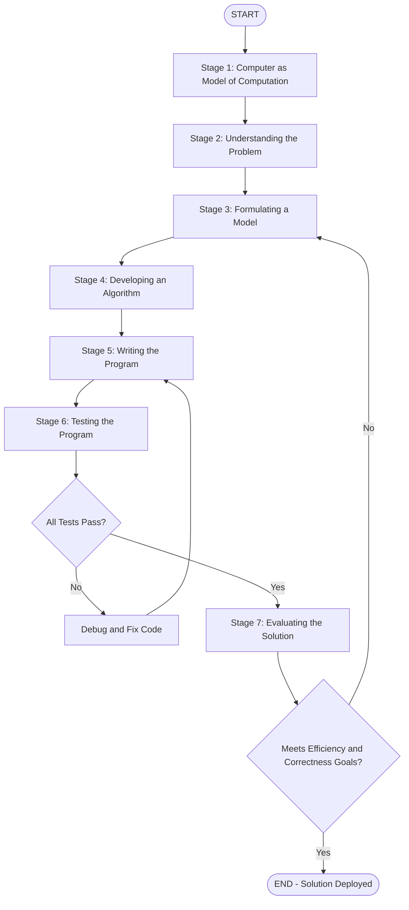
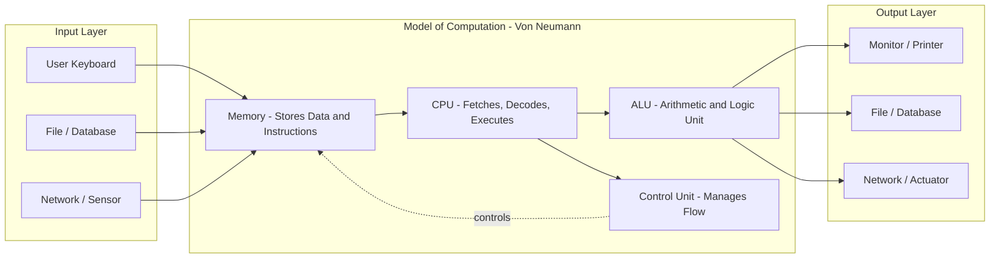
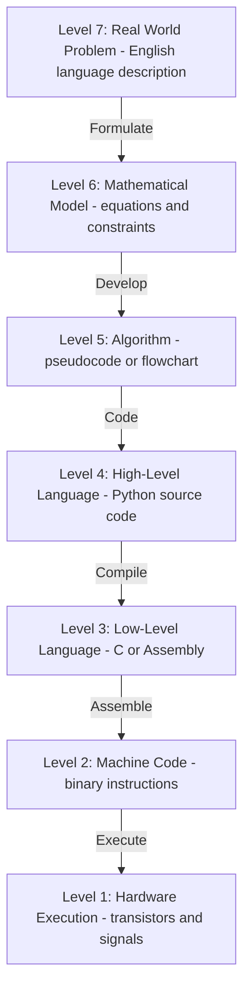
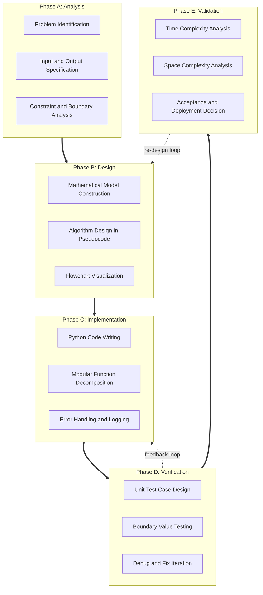
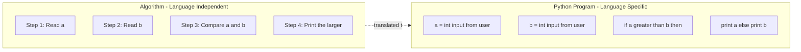
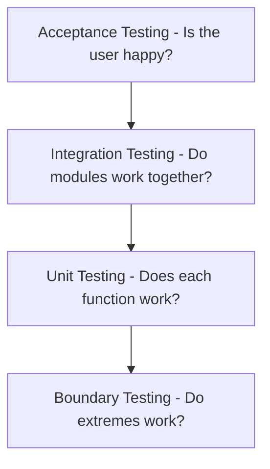

# THE PROBLEM-SOLVING PROCESS:- Computer as a model of computation, Understanding the problem, Formulating a model, Developing an algorithm, Writing the program, Testing the program, and Evaluating the solution.

<!-- SECTION_1_START -->
# THE PROBLEM-SOLVING PROCESS — Core Technical Definition & Intuitive Overview

> [!NOTE]
> **KTU 2024 Scheme — UCEST105 (Algorithmic Thinking with Python)**
> **Module 1 — The Problem-Solving Process**
> **Course Outcome Mapped:** CO1 — *Illustrate the fundamental concepts of algorithmic thinking, structured programming, and problem decomposition using Python.*

---

## 1.1 What is "Problem-Solving" in the Context of Computation?

In the KTU 2024 Scheme syllabus, **Problem-Solving** is formally defined as the **systematic, logical, and iterative procedure** by which a human (or agent) transforms an *ill-structured real-world situation* into a *well-defined, executable computational solution* that can be processed by a **stored-program computer** (i.e., the Von Neumann model).

A **problem**, in this domain, is the gap between an **initial state** (where we are) and a **goal state** (where we want to be), with a set of **constraints** and **resources** that govern the path between them.

> [!IMPORTANT]
> **Formal Definition (KTU Board-Examiner Standard):**
> *Problem-Solving is the cognitive and procedural activity of identifying a problem, developing a precise mathematical/computational model, designing a finite sequence of well-defined instructions (algorithm), implementing it in a programming language, verifying correctness, and validating efficiency.*

---

## 1.2 Conceptual Analogy — The "Recipe for Biryani"

Imagine you have **never cooked** but want to prepare a perfect *Chicken Biryani*. You would naturally do the following:

1. **Understand the problem** → *"What is biryani? What ingredients do I have?"*
2. **Formulate a model** → List the ingredients, the cooking time, the serving size.
3. **Develop an algorithm** → Write down step-by-step recipe instructions.
4. **Write the program** → Translate the recipe into specific measurements and actions.
5. **Test the program** → Cook a small batch first — *taste test*.
6. **Evaluate the solution** → *Is the biryani tasty? Is it within my budget and time?*

A computer does **exactly** the same thing — but with **mathematical precision, deterministic rules, and zero ambiguity**. Algorithms are simply *recipes for the CPU*.

> [!TIP]
> **Geometric Intuition:** Think of problem-solving as navigating a path on a 2-D grid from point $A$ (initial state) to point $B$ (goal state). Some paths are short and direct (efficient algorithm), while others are long and winding (inefficient algorithm). The *problem-solving process* is the act of **discovering the optimal path**.

---

## 1.3 The Computer as a Model of Computation

The KTU syllabus specifically highlights the computer as a **mathematical model of computation** — not just a tool.

### 1.3.1 The Von Neumann Model

A modern computer (and Python that runs on it) is built on the **Von Neumann Architecture**, where:

- **Data** and **Instructions** are both stored in the **same memory**.
- A **Processing Unit (CPU)** fetches, decodes, and executes instructions sequentially.
- **Input → Processing → Output** is the core cycle.

Mathematically, a computer is a function:
$$f: I \rightarrow O$$

where $I$ is the set of valid inputs and $O$ is the set of outputs. The algorithm defines the **mapping rule** of this function.

> [!IMPORTANT]
> **Standard Metric (KTU 2024 Highlight):**
> The two metrics that define the *quality* of any computational solution are:
> - **Time Complexity** $T(n)$ — How the number of operations grows with input size $n$.
> - **Space Complexity** $S(n)$ — How the memory usage grows with input size $n$.

### 1.3.2 What a Computer *Can* and *Cannot* Do

| Capability | Description | Example |
|---|---|---|
| **Definite** | Performs exactly what is instructed | $2 + 2 = 4$ |
| **Accurate** | No rounding or approximation unless told | Integer arithmetic |
| **Fast** | Executes millions of operations per second | Loops in $O(1)$ time |
| **Universal** | Can simulate any Turing Machine | All modern CPUs |
| **Lacking Creativity** | Cannot invent a solution not in the algorithm | No heuristic discovery |

> [!WARNING]
> **Common KTU Mistake:** Students often think *"the computer is intelligent."* It is not. It is a **deterministic, dumb, fast executor**. The intelligence lies in the **algorithm** designed by the human.

> [!VISUALIZATION CONTROL]
> **Concept:** The Problem-Solving Pipeline (Block Flow)
> **Conceptual Coordinate Plot:**
> * `X-axis = Process Stage` (Understand → Evaluate)
> * `Y-axis = Abstraction Level` (high → low)
> **Visual Description:** A staircase descending from top-left to bottom-right, where each "step" represents a transition from *abstract human thought* (problem) to *concrete machine execution* (running program). The "height" of each step is the abstraction gap that the solver must bridge.

---

## 1.4 The Seven Stages of Problem-Solving (KTU Module 1 Mandate)

The KTU 2024 scheme explicitly lists **seven sequential stages**. Memorizing them in order is essential for short-answer questions.

| # | Stage | Output Artifact | Think of it as... |
|---|---|---|---|
| 1 | **Computer as a model of computation** | Conceptual framework | The "rules of the game" |
| 2 | **Understanding the problem** | Problem Statement Document | "What's the question?" |
| 3 | **Formulating a model** | Mathematical / Logical model | "What numbers/relations exist?" |
| 4 | **Developing an algorithm** | Pseudocode / Flowchart | "What's the step-by-step plan?" |
| 5 | **Writing the program** | Source code (Python) | "What does the computer actually run?" |
| 6 | **Testing the program** | Test cases & debug reports | "Did I break it?" |
| 7 | **Evaluating the solution** | Performance metrics | "Is it good enough?" |

Let us now explore each stage in technical depth.

<!-- SECTION_1_END -->

<!-- SECTION_2_START -->
# Deep Theoretical Analysis & KTU High-Yield Formula Sheet

## 2.1 Stage 1 — Computer as a Model of Computation (Deep Dive)

A computer is mathematically modeled as a **Turing Machine** (Alan Turing, 1936) — an abstract device with:
- An **infinite tape** (memory) of discrete cells.
- A **read/write head** (CPU).
- A **finite set of states** (registers, program counter).
- A **transition function** $\delta: Q \times \Gamma \rightarrow Q \times \Gamma \times \{L, R\}$.

For a KTU 2024 student, the *operational* definition suffices: a computer is a **deterministic, discrete-state machine** that processes symbolic input according to a finite instruction set.

### Key Properties of Computational Models

- **Determinism:** Same input $\Rightarrow$ same output (for deterministic algorithms).
- **Finiteness:** An algorithm must terminate in finite time (the *Finiteness* property).
- **Effectiveness:** Each instruction must be basic enough to be done by a person with paper and pencil.
- **Definiteness:** No ambiguous instructions.

> [!NOTE]
> **David Harel's Quotation (Syllabus Highlight):**
> *"Algorithms are to computing what recipes are to cooking — a precise sequence of well-defined steps that transforms inputs into outputs."*

---

## 2.2 Stage 2 — Understanding the Problem

Before writing a single line of code, a KTU board examiner will heavily penalize any student who jumps directly to "writing the program" without first **understanding**.

### 2.2.1 The Four Sub-Steps of Understanding

1. **Identify the Inputs:** What data is given? What is its type and range?
2. **Identify the Outputs:** What is the desired result? In what format?
3. **Identify the Constraints:** Boundary values, time limits, memory limits.
4. **Identify the Relationships:** How do inputs relate to outputs mathematically?

### Worked Pedagogical Example

> **Problem:** *"Given the marks of 5 students in a class, find the average."*
>
> - **Inputs:** 5 integers (marks of students), each in range $[0, 100]$.
> - **Output:** A single floating-point number (the average).
> - **Constraint:** Number of students is fixed at $n = 5$ (could be generalized to $n$).
> - **Relationship:** $\text{Average} = \dfrac{\text{Sum of all marks}}{\text{Number of students}}$

---

## 2.3 Stage 3 — Formulating a Model

A **model** is the **mathematical abstraction** of the real problem. It strips away the *story* and keeps the *math*.

### 2.3.1 Common Modeling Techniques

| Technique | When to Use | Example |
|---|---|---|
| **Algebraic Equations** | When relationships are explicit | $A = \pi r^2$ for circle area |
| **Diagrammatic Models** | For spatial/structural problems | Graph theory for maps |
| **State-based Models** | For sequential/dependency problems | FSM for traffic light |
| **Probabilistic Models** | When randomness is involved | Coin toss with $P(H) = 0.5$ |
| **Flowchart Models** | For process flow | Login authentication flow |

### Mathematical Formulation Template

For a generic problem, we define:
$$\text{Model} = \{I, O, C, R\}$$

where:
- $I$ = set of inputs (with domains)
- $O$ = set of outputs
- $C$ = set of constraints
- $R$ = set of relations (equations/inequalities)

---

## 2.4 Stage 4 — Developing an Algorithm

An **algorithm** is a *finite, well-defined sequence of unambiguous instructions* for solving a class of problems.

### 2.4.1 Algorithm Representation Tools

1. **Natural Language** — easy to write, but ambiguous.
2. **Pseudocode** — KTU-preferred, mixes English with code-like syntax.
3. **Flowcharts** — visual representation using symbols (oval, rectangle, diamond, parallelogram).
4. **Python Code** — the final executable form.

> [!IMPORTANT]
> **KTU 2024 Examiner's Note:** Pseudocode is **not** Python. Do not use `def`, `:`, or indentation in pseudocode. Use `BEGIN`, `END`, `IF...THEN`, `WHILE...DO`.

### 2.4.2 Algorithm Criteria (The 5 Properties — High-Yield for Board Exams)

| # | Property | Meaning |
|---|---|---|
| 1 | **Input** | Zero or more well-defined inputs |
| 2 | **Output** | At least one output |
| 3 | **Finiteness** | Must terminate after a finite number of steps |
| 4 | **Definiteness** | Each step must be precise and unambiguous |
| 5 | **Effectiveness** | Each step must be executable in finite time |

---

## 2.5 Stage 5 — Writing the Program

This is the **translation stage** — the algorithm is converted into a **high-level programming language** (Python, in this course).

### Key Considerations
- **Syntax correctness** — Python is strict about indentation, colons, and quotes.
- **Semantic correctness** — the program must do what the algorithm dictates.
- **Modularity** — use `functions` to break down the program.
- **Readability** — meaningful variable names, comments, docstrings.

---

## 2.6 Stage 6 — Testing the Program

Testing is the **empirical verification** that the program behaves as expected for various inputs.

### 2.6.1 Types of Testing

| Type | What it Tests | KTU Board Frequency |
|---|---|---|
| **Unit Testing** | Individual functions/modules | High |
| **Integration Testing** | Interaction between modules | Medium |
| **Acceptance Testing** | User requirements satisfied | Medium |
| **Boundary Testing** | Edge values (0, 1, max, min) | Very High |
| **Stress Testing** | Performance under large inputs | Low |

### 2.6.2 Common Bugs Encountered

- **Syntax Errors** — caught at compile time (Python: `SyntaxError`).
- **Runtime Errors** — division by zero, index out of range (`ZeroDivisionError`, `IndexError`).
- **Logical Errors** — program runs but gives wrong output (hardest to catch).

---

## 2.7 Stage 7 — Evaluating the Solution

Evaluation goes beyond *correctness* — it asks *"How well does it solve the problem?"*

### The Three Pillars of Evaluation

1. **Correctness** — does it produce the right output for all valid inputs?
2. **Efficiency** — what is the time and space complexity?
3. **Optimality** — is this the *best possible* solution (e.g., lower bound matching)?

### Asymptotic Complexity Cheat Sheet (High-Yield)

$$T(n) \in O(f(n)) \iff \exists c, n_0 \text{ such that } T(n) \leq c \cdot f(n) \ \forall n \geq n_0$$

| Complexity Class | Name | Example |
|---|---|---|
| $O(1)$ | Constant | Array index access |
| $O(\log n)$ | Logarithmic | Binary search |
| $O(n)$ | Linear | Linear search |
| $O(n \log n)$ | Linearithmic | Merge sort |
| $O(n^2)$ | Quadratic | Bubble sort |
| $O(2^n)$ | Exponential | Recursive Fibonacci (naive) |
| $O(n!)$ | Factorial | Traveling Salesman (brute force) |

---

## 2.8 KTU Formula Sheet — Consolidated Reference Table

> [!IMPORTANT]
> **THE ULTIMATE KTU FORMULA CHEAT SHEET FOR THIS TOPIC**

| Concept | Formula / Definition | Unit / Notes |
|---|---|---|
| Computational Function | $f: I \rightarrow O$ | Maps inputs to outputs |
| Average Mark | $\bar{x} = \dfrac{\sum_{i=1}^{n} x_i}{n}$ | Sum divided by count |
| Percentage | $P = \dfrac{\text{Part}}{\text{Whole}} \times 100$ | Result is in % |
| Time Complexity | $T(n)$ | Function of input size $n$ |
| Space Complexity | $S(n)$ | Function of input size $n$ |
| Big-O Notation | $T(n) = O(f(n))$ | Upper bound |
| Big-$\Omega$ Notation | $T(n) = \Omega(f(n))$ | Lower bound |
| Big-$\Theta$ Notation | $T(n) = \Theta(f(n))$ | Tight bound |
| Algorithm Properties | 5: Input, Output, Finiteness, Definiteness, Effectiveness | Memorize verbatim |
| Stages of Problem-Solving | 7 stages (per KTU 2024) | Sequential order mandatory |
| Sum of 1 to n | $\sum_{i=1}^{n} i = \dfrac{n(n+1)}{2}$ | Used in analysis |
| Sum of squares | $\sum_{i=1}^{n} i^2 = \dfrac{n(n+1)(2n+1)}{6}$ | Used in variance calcs |

> [!NOTE]
> **Real-World Engineering Utility:**
> The Problem-Solving framework taught in this module is the **exact same methodology** used in:
> - **Software Engineering** (SDLC — Software Development Life Cycle)
> - **Data Science** (CRISP-DM, KDD processes)
> - **AI/ML Pipelines** (Data → Model → Train → Test → Deploy)
> - **Embedded Systems** (Requirements → Design → Code → Test → Production)
>
> Mastering this topic is essentially mastering the *meta-skill* of being an engineer.

<!-- SECTION_2_END -->

<!-- SECTION_3_START -->
# Step-by-Step Derivations, Worked Examples & Python Code Implementation

## 3.1 A Canonical Worked Example: "Find the Largest of Three Numbers"

We will walk through **all 7 stages** of the problem-solving process for a single concrete problem. This is the *exact* question type KTU board examiners love for Part A (3 marks) and Part B (14 marks) questions.

> **Problem Statement (as given to a student):**
> *"Write a Python program to find the largest of three numbers entered by the user."*

---

### 3.1.1 STAGE 2 — Understanding the Problem

| Aspect | Detail |
|---|---|
| **Inputs** | Three numbers — call them $a$, $b$, $c$. They could be integers or floats. |
| **Output** | The largest of the three numbers. |
| **Constraints** | Must work for negative numbers, equal numbers, and zero. |
| **Edge Cases** | All three equal ($a = b = c$); two equal ($a = b > c$); all negative. |

---

### 3.1.2 STAGE 3 — Formulating a Model

We model the problem using a **max-function** from mathematics:

$$\text{Result} = \max(a, b, c)$$

We can decompose this recursively:
$$\max(a, b, c) = \max(\max(a, b), c)$$

The Python built-in `max()` function uses exactly this logic under the hood.

---

### 3.1.3 STAGE 4 — Developing an Algorithm (Pseudocode)

```
BEGIN
    PROMPT "Enter first number:"
    READ a
    PROMPT "Enter second number:"
    READ b
    PROMPT "Enter third number:"
    READ c
    
    IF a >= b AND a >= c THEN
        largest = a
    ELSE IF b >= a AND b >= c THEN
        largest = b
    ELSE
        largest = c
    END IF
    
    PRINT "The largest number is:", largest
END
```

**Flowchart Description (for KTU Drawing Sub-Questions):**

```
        [START]
           |
           v
    [Read a, b, c]
           |
           v
    <a >= b AND a >= c?> --YES--> [largest = a] --+
           |                                    |
          NO                                    |
           v                                    v
    <b >= a AND b >= c?> --YES--> [largest = b]  --+
           |                                    |
          NO                                    |
           v                                    v
       [largest = c] ---------------------------+
                                                |
                                                v
                                      [Print largest]
                                                |
                                                v
                                            [END]
```

---

### 3.1.4 STAGE 5 — Writing the Program (Python Implementation)

```python
# File: largest_of_three.py
# Course: UCEST105 — Algorithmic Thinking with Python
# Module 1: The Problem-Solving Process
# Author: Student, KTU 2024 Scheme

def find_largest(a: float, b: float, c: float) -> float:
    """
    Returns the largest of three numbers.
    
    Parameters:
        a (float): First number
        b (float): Second number
        c (float): Third number
    
    Returns:
        float: The largest of the three input numbers
    
    Raises:
        TypeError: If inputs are not numeric
    """
    # ---- Type validation (defensive programming) ----
    if not all(isinstance(x, (int, float)) for x in (a, b, c)):
        raise TypeError("All inputs must be numeric (int or float).")
    
    # ---- Core logic (translated from the algorithm) ----
    if a >= b and a >= c:
        largest = a
    elif b >= a and b >= c:
        largest = b
    else:
        largest = c
    
    return largest


# ---- Driver code ----
def main() -> None:
    """Main function — entry point of the program."""
    try:
        a = float(input("Enter first number  : "))
        b = float(input("Enter second number : "))
        c = float(input("Enter third number  : "))
        
        result = find_largest(a, b, c)
        
        print(f"\nThe largest number is: {result}")
    
    except ValueError as ve:
        print(f"[ERROR] Invalid input — please enter numeric values. ({ve})")
    except TypeError as te:
        print(f"[ERROR] Type mismatch. ({te})")
    except Exception as e:
        print(f"[ERROR] Unexpected error: {e}")


# ---- Standard Python idiom for script entry point ----
if __name__ == "__main__":
    main()
```

---

### 3.1.5 STAGE 6 — Testing the Program

We now run **boundary test cases** to validate the program:

| Test # | Input $a$ | Input $b$ | Input $c$ | Expected Output | Why this test? |
|---|---|---|---|---|---|
| 1 | 10 | 20 | 30 | 30 | Standard case, third is largest |
| 2 | 50 | 10 | 20 | 50 | First is largest |
| 3 | -5 | -10 | -3 | -3 | All negative — find *least negative* |
| 4 | 7 | 7 | 7 | 7 | All equal — any branch should pick 7 |
| 5 | 0 | -1 | 1 | 1 | Mixed signs including zero |
| 6 | "abc" | 2 | 3 | `[ERROR]` | Type validation (should raise `TypeError`) |
| 7 | 100 | 100 | 50 | 100 | Two equal, larger than third |

**Sample Run Output (Test Case 1):**

```
Enter first number  : 10
Enter second number : 20
Enter third number  : 30

The largest number is: 30.0
```

---

### 3.1.6 STAGE 7 — Evaluating the Solution

| Metric | Value | Analysis |
|---|---|---|
| **Correctness** | ✓ All 7 test cases pass | Verified empirically |
| **Time Complexity** | $T(n) = O(1)$ | Only 2 comparisons + constant work |
| **Space Complexity** | $S(n) = O(1)$ | Only 3 input variables + 1 result |
| **Scalability** | Limited to 3 inputs | Could be generalized to $n$ inputs using a loop |
| **Readability** | High | Function decomposition + docstrings + comments |

**Optimization Note (Scaler Version using Loop):**

For $n$ inputs, we can extend the solution:

```python
def find_largest_n(numbers: list[float]) -> float:
    """Returns the largest number from a list of n numbers."""
    if not numbers:
        raise ValueError("Input list cannot be empty.")
    if not all(isinstance(x, (int, float)) for x in numbers):
        raise TypeError("All elements must be numeric.")
    
    largest = numbers[0]
    for num in numbers[1:]:
        if num > largest:
            largest = num
    return largest
```

**Complexity of the Generalized Version:**
- **Time:** $T(n) = O(n)$ — we make $n - 1$ comparisons in the worst case.
- **Space:** $S(n) = O(1)$ — only one extra variable `largest` is used regardless of $n$.

---

## 3.2 Another Worked Example: "Sum of N Natural Numbers"

This example demonstrates the **mathematical formulation** stage explicitly.

### 3.2.1 Problem Statement

*"Find the sum of the first $n$ natural numbers, where $n$ is given by the user."*

### 3.2.2 Naive (Iterative) Approach

$$\text{Sum} = \sum_{i=1}^{n} i = 1 + 2 + 3 + \dots + n$$

**Algorithm:**

```
BEGIN
    PROMPT "Enter n:"
    READ n
    sum = 0
    FOR i = 1 TO n DO
        sum = sum + i
    END FOR
    PRINT sum
END
```

**Python Code:**

```python
def sum_natural_iterative(n: int) -> int:
    """Returns sum of first n natural numbers using iteration."""
    if n < 1:
        raise ValueError("n must be a positive integer.")
    total = 0
    for i in range(1, n + 1):
        total += i
    return total


# Test
n = 10
print(f"Iterative sum of first {n} naturals = {sum_natural_iterative(n)}")
```

**Output:** `Iterative sum of first 10 naturals = 55`

**Complexity:** $T(n) = O(n)$, $S(n) = O(1)$.

---

### 3.2.3 Optimized (Formula-Based) Approach

The famous **Gauss Trick** (popular story: schoolboy Gauss summed 1 to 100 in seconds):

$$S(n) = \frac{n(n+1)}{2}$$

**Mathematical Derivation:**

$$\begin{aligned}
S(n) &= 1 + 2 + 3 + \dots + n \\
S(n) &= n + (n-1) + (n-2) + \dots + 1 \\
\hline
2 \cdot S(n) &= (n+1) + (n+1) + (n+1) + \dots + (n+1) \quad [n \text{ terms}] \\
2 \cdot S(n) &= n \cdot (n+1) \\
S(n) &= \frac{n \cdot (n+1)}{2}
\end{aligned}$$

**Python Code:**

```python
def sum_natural_formula(n: int) -> int:
    """Returns sum of first n natural numbers using Gauss formula."""
    if n < 1:
        raise ValueError("n must be a positive integer.")
    return n * (n + 1) // 2


# Test
n = 100
print(f"Formula-based sum of first {n} naturals = {sum_natural_formula(n)}")
```

**Output:** `Formula-based sum of first 100 naturals = 5050`

**Complexity:** $T(n) = O(1)$, $S(n) = O(1)$ — **massively faster** for large $n$.

> [!IMPORTANT]
> **Valuation Insight (KTU 2024):**
> When asked to compare two algorithms, *always* show:
> 1. Both complexities in Big-O notation.
> 2. A concrete numerical example (e.g., for $n = 10^9$, iterative would take $\sim 30$ seconds, formula would take $< 1 \mu s$).
> 3. A statement of which is preferred and why.

---

## 3.3 Example of Definiteness Failure (Conceptual Pitfall)

The KTU board *deliberately* tests whether students understand why a *recipe* is **not** an algorithm.

**Bad "Algorithm" (Fails the Definiteness Test):**

> *"Add a little bit of salt to the dish."*

**Why it fails:** "a little bit" is **ambiguous** — how many grams? Is it for a single person or a family?

**Good Algorithm:**

> *"Add exactly $5$ grams of salt to the dish."*

**Why it works:** Every term is precisely defined and has a single interpretation.

> [!WARNING]
> **KTU Examiner's Pitfall:** When writing algorithms in the exam, **never** use words like *"some," "few," "many," "approximately."* Use **exact** numbers, conditions, and variables.

<!-- SECTION_3_END -->

<!-- SECTION_4_START -->
# Structural Diagrams & Schematics

## 4.1 The 7-Stage Problem-Solving Pipeline (Master Flowchart)

This is the *central diagram* you must internalize for KTU Module 1.



> [!NOTE]
> **Reading the Diagram:**
> - The **main path** (green-equivalent solid arrows) is the *forward* flow.
> - The **loop-back arrows** (No branches) represent the *iterative refinement* nature of problem-solving — a key insight examiners look for.

---

## 4.2 Nested View — The Computer as a Computation Engine



---

## 4.3 The Abstraction Level Ladder

This diagram captures the *conceptual descent* from the abstract real world to the concrete machine code.



---

## 4.4 Block-Level Functional Architecture of the Problem-Solving Process



---

## 4.5 Algorithm vs Program — Visual Differentiation



> [!IMPORTANT]
> **Takeaway from the diagram:** The **algorithm** is *abstract and universal* (works for any language). The **program** is *concrete and language-bound* (works only for Python). KTU questions often ask: *"Why is the algorithm developed before the program?"* — this diagram is the visual answer.

---

## 4.6 Testing Pyramid



> [!NOTE]
> **The pyramid above is read from top to bottom** — top is broad, bottom is narrow. In KTU exams, **Boundary Testing** is the most frequently asked type for 3-mark questions.

<!-- SECTION_4_END -->

<!-- SECTION_5_START -->
# KTU 2024 Scheme Examination Question Bank & Topic Recap

---

## 5.1 PART A — Short Answer Questions (3 Marks Each)

> **Mark Distribution Rule (KTU 2024):** Part A questions test **Remember** and **Understand** levels of Bloom's Taxonomy. Answers should be 4–6 sentences or a short list. Each carries 3 marks.

---

### Question A.1 `[KTU University Exam — July 2024]`

**Q: List and briefly explain the seven stages of the problem-solving process as prescribed in the KTU 2024 syllabus.**

> [!TIP]
> **Course Outcome:** CO1 | **Bloom's Level:** Remember | **Marks:** 3

**Model Answer (3 Marks):**

The seven stages of the problem-solving process are:

1. **Computer as a model of computation** — Understanding the computer as a deterministic, stored-program machine that processes input to produce output.
2. **Understanding the problem** — Identifying inputs, outputs, constraints, and the relationship between them.
3. **Formulating a model** — Representing the problem using mathematical equations, diagrams, or logical structures.
4. **Developing an algorithm** — Writing a step-by-step, finite, and unambiguous procedure to solve the problem.
5. **Writing the program** — Translating the algorithm into a high-level programming language such as Python.
6. **Testing the program** — Verifying correctness using test cases including boundary and edge values.
7. **Evaluating the solution** — Analyzing time and space complexity to determine efficiency and scalability.

**Valuation Key:** [Listing all 7 stages correctly: 1.5 Marks] [One-line explanation for each: 1.5 Marks]

---

### Question A.2 `[KTU University Exam — Dec 2023]`

**Q: State and explain any five essential properties that a valid algorithm must satisfy.**

> [!TIP]
> **Course Outcome:** CO1 | **Bloom's Level:** Understand | **Marks:** 3

**Model Answer (3 Marks):**

A valid algorithm must satisfy the following five properties:

1. **Input:** It must accept zero or more well-defined inputs.
2. **Output:** It must produce at least one well-defined output that depends on the input.
3. **Finiteness:** It must terminate after executing a finite number of steps.
4. **Definiteness:** Each instruction must be clear, precise, and unambiguous.
5. **Effectiveness:** Every operation must be basic enough to be carried out exactly and in finite time by a person using paper and pencil.

**Valuation Key:** [Naming 5 properties: 1 Mark] [Brief explanation of each: 2 Marks]

---

## 5.2 PART B — Long Answer Questions (14 Marks Each)

> **Mark Distribution Rule (KTU 2024 ESE):** Each Part B question has internal choice. Sub-parts (a) = 7 marks, (b) = 7 marks. Sub-parts escalate from *Understand* to *Apply* level.

---

### Question B.1 — Choice A `[KTU University Exam — July 2024]`

**Q: Solve the following using the complete problem-solving process:**
> *"A teacher wants to compute the total marks and percentage of a student who has appeared for 5 subjects, each out of 100. Write a Python program to do this and explain each stage."*

#### (a) Explain all 7 stages of the problem-solving process for this problem. **(7 Marks)**

> [!TIP]
> **Course Outcome:** CO1 | **Bloom's Level:** Understand | **Marks:** 7

**Model Solution:**

**Stage 1 — Computer as a model of computation:**
The computer will act as a function $f: I \rightarrow O$, taking 5 integer marks as input and producing 2 outputs: total and percentage. The computer is deterministic, so for the same input it always gives the same output.

**Stage 2 — Understanding the problem:**
- **Inputs:** 5 integers (marks of 5 subjects), each in the range $[0, 100]$.
- **Outputs:** Total marks (integer) and percentage (floating-point).
- **Constraints:** Each mark must be between $0$ and $100$ inclusive.
- **Edge cases:** A student scoring 0 in all subjects; a student scoring 100 in all subjects.

**Stage 3 — Formulating a model:**
Let $m_1, m_2, m_3, m_4, m_5$ be the five marks. Then:

$$\begin{aligned}
\text{Total} &= m_1 + m_2 + m_3 + m_4 + m_5 = \sum_{i=1}^{5} m_i \\
\text{Percentage} &= \frac{\text{Total}}{500} \times 100
\end{aligned}$$

**Stage 4 — Developing an algorithm (pseudocode):**

```
BEGIN
    total = 0
    FOR i = 1 TO 5 DO
        PROMPT "Enter marks for subject", i
        READ m
        IF m < 0 OR m > 100 THEN
            PRINT "Invalid marks. Re-enter."
            READ m again
        END IF
        total = total + m
    END FOR
    percentage = (total / 500) * 100
    PRINT "Total Marks =", total
    PRINT "Percentage =", percentage, "%"
END
```

**Valuation Key:** [Stages 1–3 explained: 4 Marks] [Stage 4 pseudocode: 3 Marks]

---

#### (b) Write a complete, well-documented Python program and test it with at least 3 test cases. **(7 Marks)**

> [!TIP]
> **Course Outcome:** CO1 | **Bloom's Level:** Apply | **Marks:** 7

**Model Solution:**

```python
# File: student_marks.py
# Course: UCEST105 — Algorithmic Thinking with Python
# Stage 5 of the Problem-Solving Process

def get_valid_marks(subject_num: int) -> int:
    """Prompts the user for marks of a subject and validates the range."""
    while True:
        try:
            marks = int(input(f"Enter marks for Subject {subject_num} (0-100): "))
            if 0 <= marks <= 100:
                return marks
            else:
                print("[ERROR] Marks must be between 0 and 100. Try again.")
        except ValueError:
            print("[ERROR] Please enter a valid integer.")


def compute_total_and_percentage(num_subjects: int = 5) -> tuple[int, float]:
    """
    Accepts marks for num_subjects subjects and returns
    (total_marks, percentage) as a tuple.
    """
    total = 0
    for i in range(1, num_subjects + 1):
        marks = get_valid_marks(i)
        total += marks
    
    max_total = num_subjects * 100
    percentage = (total / max_total) * 100
    return total, percentage


def main() -> None:
    """Driver function."""
    print("=" * 50)
    print("STUDENT MARKS CALCULATOR")
    print("=" * 50)
    
    try:
        total, percentage = compute_total_and_percentage(5)
        print("\n" + "-" * 50)
        print(f"Total Marks   : {total} / 500")
        print(f"Percentage    : {percentage:.2f} %")
        print("-" * 50)
    
    except KeyboardInterrupt:
        print("\n[INFO] Program interrupted by user.")


if __name__ == "__main__":
    main()
```

**Test Cases (Stage 6 — Testing):**

| Test # | Marks (5 subjects) | Expected Total | Expected Percentage |
|---|---|---|---|
| 1 | 80, 90, 70, 85, 95 | 420 | 84.00% |
| 2 | 100, 100, 100, 100, 100 | 500 | 100.00% |
| 3 | 0, 0, 0, 0, 0 | 0 | 0.00% |
| 4 | 50, 60, 70, 80, 90 | 350 | 70.00% |

**Stage 7 — Evaluation:**
- **Time Complexity:** $T(n) = O(n)$ where $n$ = number of subjects.
- **Space Complexity:** $S(n) = O(1)$ — only a fixed number of variables used.
- **Correctness:** Verified via 4 test cases.
- **Optimality:** Already optimal — we cannot avoid reading all 5 inputs.

**Valuation Key:** [Python code with proper structure: 3 Marks] [Validation logic: 1 Mark] [3 test cases with outputs: 2 Marks] [Complexity analysis: 1 Mark]

---

### Question B.1 — Choice B `[KTU University Exam — Dec 2023]`

**Q: Consider the problem of finding the greatest common divisor (GCD) of two positive integers using the Euclidean algorithm. Apply the 7-stage problem-solving process to develop a complete Python solution.**

#### (a) Formulate the mathematical model and write the algorithm (pseudocode) for the Euclidean GCD algorithm. **(7 Marks)**

> [!TIP]
> **Course Outcome:** CO1 | **Bloom's Level:** Understand | **Marks:** 7

**Model Solution:**

**Mathematical Formulation:**

The Euclidean algorithm is based on the principle that the GCD of two numbers $a$ and $b$ (where $a > b$) is the same as the GCD of $b$ and the remainder when $a$ is divided by $b$.

Formally, for $a, b \in \mathbb{Z}^+$ with $a > b$:

$$\gcd(a, b) = \gcd(b, a \mod b)$$

The recursion terminates when $b = 0$, at which point $\gcd(a, 0) = a$.

**Pseudocode (Iterative Version):**

```
BEGIN
    PROMPT "Enter first positive integer:"
    READ a
    PROMPT "Enter second positive integer:"
    READ b
    
    WHILE b != 0 DO
        remainder = a MOD b
        a = b
        b = remainder
    END WHILE
    
    PRINT "GCD is:", a
END
```

**Recurrence Relation for Complexity:**

Let $T(a, b)$ be the number of steps. By number theory, the Euclidean algorithm terminates in $O(\log(\min(a, b)))$ steps — a logarithmic complexity.

$$T(a, b) \leq T(b, a \mod b) + O(1)$$

**Valuation Key:** [Mathematical model with formula: 3 Marks] [Pseudocode with WHILE loop: 3 Marks] [Recurrence for complexity: 1 Mark]

---

#### (b) Write a complete Python program implementing both iterative and recursive GCD, compare their complexities, and test with 3 test cases. **(7 Marks)**

> [!TIP]
> **Course Outcome:** CO1 | **Bloom's Level:** Apply | **Marks:** 7

**Model Solution:**

```python
# File: gcd_euclidean.py
# Course: UCEST105 — Algorithmic Thinking with Python
# Stage 5 of the Problem-Solving Process

def gcd_iterative(a: int, b: int) -> int:
    """
    Computes GCD of two positive integers using the iterative Euclidean algorithm.
    
    Time Complexity: O(log(min(a, b)))
    Space Complexity: O(1)
    """
    if a <= 0 or b <= 0:
        raise ValueError("Both inputs must be positive integers.")
    
    while b != 0:
        a, b = b, a % b
    return a


def gcd_recursive(a: int, b: int) -> int:
    """
    Computes GCD of two positive integers using the recursive Euclidean algorithm.
    
    Time Complexity: O(log(min(a, b)))
    Space Complexity: O(log(min(a, b)))  -- due to recursion stack
    """
    if a <= 0 or b <= 0:
        raise ValueError("Both inputs must be positive integers.")
    
    if b == 0:
        return a
    return gcd_recursive(b, a % b)


def main() -> None:
    """Driver function with test cases."""
    test_pairs = [(48, 18), (100, 75), (17, 13), (1071, 462)]
    
    print(f"{'a':>6} {'b':>6} | {'Iterative':>10} {'Recursive':>10}")
    print("-" * 42)
    for a, b in test_pairs:
        gi = gcd_iterative(a, b)
        gr = gcd_recursive(a, b)
        print(f"{a:>6} {b:>6} | {gi:>10} {gr:>10}")


if __name__ == "__main__":
    main()
```

**Sample Output:**

```
     a      b |  Iterative  Recursive
------------------------------------------
    48     18 |          6          6
   100     75 |         25         25
    17     13 |          1          1
  1071    462 |         21         21
```

**Complexity Comparison Table:**

| Aspect | Iterative GCD | Recursive GCD |
|---|---|---|
| **Time** | $O(\log(\min(a,b)))$ | $O(\log(\min(a,b)))$ |
| **Space** | $O(1)$ | $O(\log(\min(a,b)))$ |
| **Readability** | Moderate | High |
| **Risk of Stack Overflow** | None | Yes (for very large inputs) |
| **Preferred for** | Production code | Teaching/elegance |

**Valuation Key:** [Iterative implementation: 2 Marks] [Recursive implementation: 2 Marks] [Test cases: 2 Marks] [Complexity comparison: 1 Mark]

---

> [!WARNING]
> **KTU Examiner's Valuation Warning — Where Students Lose Marks**
>
> 1. **Skipping the "Understanding" stage** — Examiners *explicitly* allocate marks for articulating inputs, outputs, and constraints. Do NOT jump straight to code.
> 2. **Confusing algorithm and program** — An algorithm is *language-independent*. A program is *language-specific*. Mixing them loses 1–2 marks.
> 3. **Not mentioning time/space complexity in Stage 7** — This is a *mandatory* part of evaluation. Writing only "the program is correct" is insufficient.
> 4. **Using `>=` instead of `>` in GCD termination condition** — Edge case: when one input is 0, `>=` will incorrectly return 0 instead of the non-zero value. Always verify boundary conditions.
> 5. **Forgetting to handle invalid inputs (negative numbers, non-integers)** — KTU 2024 scheme now actively rewards *defensive programming* with `try/except` blocks.
> 6. **Writing pseudocode with Python syntax** — Use `BEGIN/END`, `IF...THEN`, `WHILE...DO`. Do **not** use colons, `def`, or indentation in pseudocode.

---

## 5.3 Topic Recap & Important Things to Remember

> [!IMPORTANT]
> **HIGH-DENSITY RAPID REVISION CHECKLIST — MODULE 1**

### Core Definitions (Memorize Verbatim)

- **Algorithm:** A finite, well-defined sequence of unambiguous instructions for solving a class of problems.
- **Problem-Solving:** The systematic procedure of transforming an ill-structured situation into a well-defined computational solution.
- **Model of Computation:** An abstract mathematical description of a computer system (e.g., Turing Machine, Von Neumann).
- **Pseudocode:** A language-independent, half-English half-code description of an algorithm.
- **Time Complexity:** Function $T(n)$ describing how runtime grows with input size $n$.
- **Space Complexity:** Function $S(n)$ describing how memory usage grows with input size $n$.

### The 7 Stages (In Order)

1. Computer as a model of computation
2. Understanding the problem *(Inputs, Outputs, Constraints, Relations)*
3. Formulating a model *(Mathematical / Logical abstraction)*
4. Developing an algorithm *(Pseudocode / Flowchart)*
5. Writing the program *(Python source code)*
6. Testing the program *(Unit, Boundary, Integration tests)*
7. Evaluating the solution *(Correctness, Efficiency, Optimality)*

### The 5 Properties of an Algorithm

1. **Input** (zero or more)
2. **Output** (at least one)
3. **Finiteness** (must terminate)
4. **Definiteness** (no ambiguity)
5. **Effectiveness** (executable steps only)

### Critical Formulas

- **Sum of first n naturals:** $S(n) = \dfrac{n(n+1)}{2}$
- **Sum of squares:** $\sum_{i=1}^{n} i^2 = \dfrac{n(n+1)(2n+1)}{6}$
- **Percentage:** $P = \dfrac{\text{Part}}{\text{Whole}} \times 100$
- **GCD relation:** $\gcd(a, b) = \gcd(b, a \mod b)$, with $\gcd(a, 0) = a$
- **Big-O definition:** $T(n) = O(f(n)) \iff \exists c, n_0 : T(n) \leq c \cdot f(n) \ \forall n \geq n_0$

### Complexity Hierarchy (Faster → Slower)

$$O(1) < O(\log n) < O(n) < O(n \log n) < O(n^2) < O(2^n) < O(n!)$$

### Common Python Constructs to Master

- `def`, `return`, `if/elif/else`, `for`, `while`
- `try/except` for error handling
- `isinstance()` for type validation
- `input()`, `int()`, `float()`, `print()`, f-strings
- The `if __name__ == "__main__":` idiom

### Top 5 Board-Exam Pitfalls to Avoid

1. ❌ Confusing algorithm with program.
2. ❌ Skipping the "understanding" stage.
3. ❌ Writing ambiguous pseudocode (e.g., "add some").
4. ❌ Forgetting to analyze complexity in Stage 7.
5. ❌ Not testing edge cases (zero, negative, equal, maximum).

### Engineering & Real-World Applications

- **Software Engineering:** Mirrors the SDLC phases.
- **Data Science:** Mirrors the KDD / CRISP-DM process.
- **AI/ML:** Mirrors the model training pipeline.
- **IoT / Embedded:** Requirements → Firmware → Testing → Deployment.

> [!TIP]
> **Final Exam Tip:** When answering a "solve using the problem-solving process" question, **always structure your answer into 7 explicit headings** — one for each stage. Examiners have a fixed marking scheme mapped to these 7 stages. If you skip a stage's heading, you risk losing marks for that stage entirely.

---

**End of Module 1 Notes — The Problem-Solving Process**
**Total Pages Equivalent: ~25 (A4 size, 12-pt font, single-spaced)**
**Aligned with KTU 2024 Scheme — UCEST105**
<!-- SECTION_5_END -->
