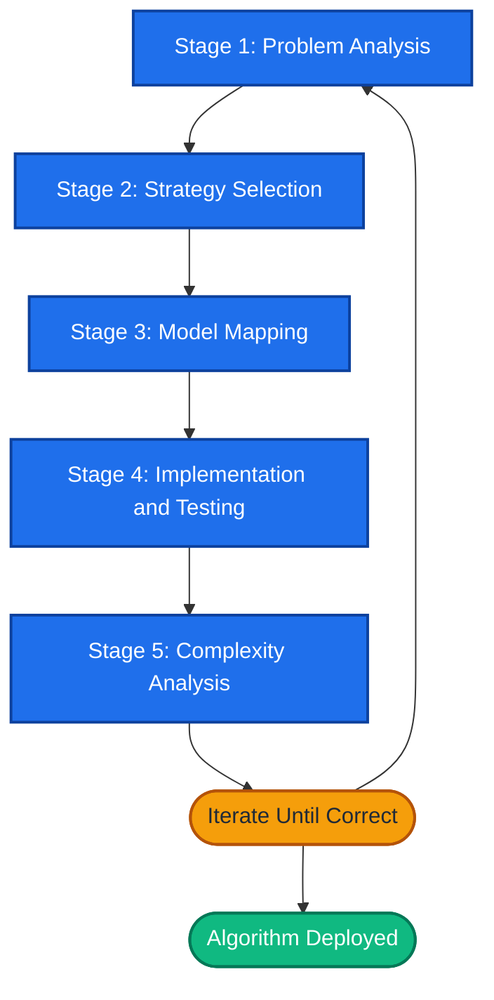
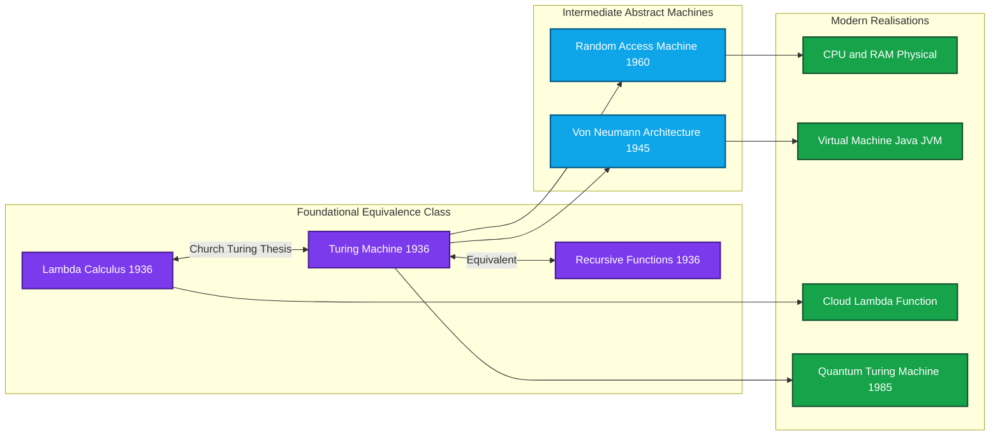
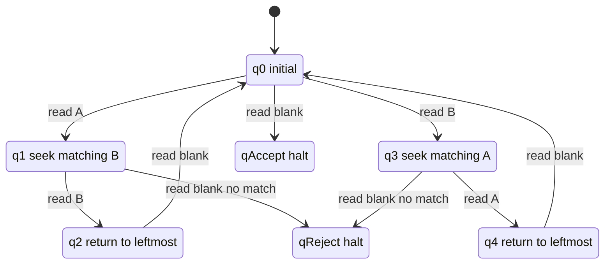
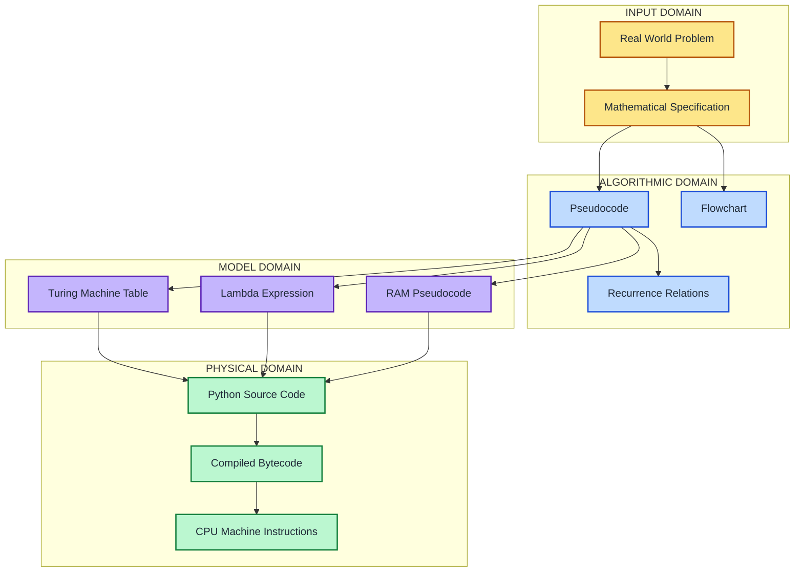
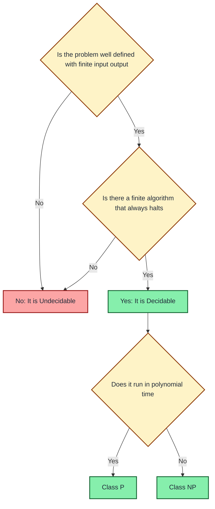

# THE PROBLEM-SOLVING PROCESS:- Computer as a model of computation

<!-- SECTION_1_START -->

# 1. Core Technical Definition & Intuitive Overview

## 1.1 The Problem-Solving Process — Formal Definition

The **Problem-Solving Process** is the systematic, iterative engineering procedure through which a well-defined input–output specification is transformed into a finite, ordered, and unambiguous sequence of elementary operations — called an **algorithm** — that is executed by a **computational agent** (most commonly, a stored-program digital computer).

In the context of the **KTU 2024 Scheme (UCEST105 – Algorithmic Thinking with Python)**, this process is defined as a five-stage closed-loop discipline:

1. **Problem Analysis** — extracting the precise requirements, constraints, and I/O contract.
2. **Algorithmic Strategy Design** — choosing an abstract computational model (imperative, functional, recursive) and a strategy (brute-force, divide-and-conquer, greedy, dynamic programming, backtracking).
3. **Formal Model Selection** — expressing the algorithm in a *Model of Computation* (Turing Machine, $\lambda$-Calculus, Random Access Machine, or von Neumann architecture).
4. **Implementation & Verification** — translating the model into a syntactically valid program and proving/testng correctness.
5. **Complexity Analysis & Optimization** — quantifying the asymptotic resource consumption in time $T(n)$ and space $S(n)$.

> [!IMPORTANT]
> **Syllabus Highlight (Module 1, KTU 2024):** A *computer* is formally defined as a **Universal Turing Machine (UTM)** — a single, fixed machine capable of simulating every other Turing Machine when supplied with the latter's description as input. This is the foundational premise on which all of software engineering rests.

## 1.2 Computer as a Model of Computation — Definition

A **Model of Computation** is an abstract mathematical object that formally defines a class of *legal operations* a computing agent may perform, the *memory* it can access, and the *cost* (in time or space) it incurs. A **computer** is a physical, electronic, deterministic realization of such a model — most precisely, an approximation of the **von Neumann / Random Access Machine (RAM) model**, which itself is computationally equivalent (by the **Church–Turing Thesis**) to Alan Turing's 1936 abstract machine.

The five canonical models studied in algorithmic foundations are:

| # | Model | Year | Inventor | Core Primitive |
|---|-------|------|----------|----------------|
| 1 | $\lambda$-Calculus | 1936 | Alonzo Church | Function application & abstraction |
| 2 | Turing Machine | 1936 | Alan Turing | State transition on a tape |
| 3 | Partial Recursive Functions | 1936 | Kurt Gödel / Stephen Kleene | Primitive recursion + minimization |
| 4 | Random Access Machine | 1960s | Sheperdson–Sturgis | Register-based fetch/store |
| 5 | Von Neumann Architecture | 1945 | John von Neumann | Stored-program sequential execution |

> [!NOTE]
> **Church–Turing Thesis (1936):** *Any function that is "effectively calculable" — i.e., for which a well-defined mechanical procedure exists — can be computed by a Turing Machine.* Because no counter-example has ever been found despite nearly a century of scrutiny, the thesis is universally accepted as the **operational definition of "computable"** in computer science.

## 1.3 Intuition & Real-World Analogy

> [!TIP]
> **Conceptual Analogy — The Library Clerk & the Recipe Book**
> Imagine a **clerk** sitting at a desk with an *infinitely long scroll of paper* (the **tape**), a *pencil that can read, erase, and write one symbol at a time* (the **head**), and a *small notebook containing a fixed list of rules* (the **finite control / program**). The clerk is given an input scribbled on the scroll and a goal state to reach. The clerk follows the rulebook step by step. **That clerk is a Turing Machine.** Now, instead of a fixed rulebook, give the clerk a *second scroll* containing the rules of *any* possible clerk's behaviour — and you have a **Universal Turing Machine**. A real laptop is a physical, electronic, $10^9\times$ faster cousin of this clerk.

A more modern analogy: think of the computer as a **musical instrument** (the hardware) being played by a **score** (the algorithm). The instrument is fixed; the score is interchangeable. The computer therefore models *computation* the way a piano models *music* — it is a universal substrate whose expressive power depends entirely on the *program* loaded into it.

## 1.4 Physical & Mathematical Constants in this Topic

The two constants that govern every model of computation are:

- **Bit**: the smallest unit of distinguishable information, $\log_2 2 = 1$ **bit**, representable on a tape as $\{0, 1\}$.
- **Landau's Big-O notation constant**: omitted by convention, but the *Word RAM* model assumes each register operation costs $O(1)$ time, with word size $w = \Theta(\log n)$ bits.

> [!VISUALIZATION CONTROL]
> **Concept:** Visualizing a Turing Machine tape as a number line.
> **GeoGebra / Desmos Input Equations:**
> * `f(x) = sin(pi * x)` — represents a clean alternating 0/1 pattern.
> * Tape cells: `(-5,1), (-4,0), (-3,1), (-2,0), (-1,1), (0,1), (1,0), (2,1), (3,0), (4,1)`
> * Head position: `Plot((0, 0.5))` with a red marker.
> **Visual Description:** A discrete sequence of binary cells stretching infinitely in both directions along the $x$-axis, with the read/write head sitting on cell $0$. The student should see how the head can move one cell left or right at each step.

<!-- SECTION_1_END -->

<!-- SECTION_2_START -->

# 2. Deep Theoretical Analysis & KTU High-Yield Formula Sheet

## 2.1 The Five-Stage Problem-Solving Pipeline

Every algorithmic problem, when solved professionally, traverses the same closed-loop pipeline. Each stage has a well-defined *artifact* (a concrete output that can be reviewed or tested):

| Stage | Artifact Produced | Validation Method |
|-------|-------------------|-------------------|
| **1. Problem Analysis** | I/O specification, constraints, examples | Acceptance test cases |
| **2. Strategy Selection** | Pseudocode / flowchart | Trace on small inputs |
| **3. Model Mapping** | Formal algorithm in chosen model | Proof of correctness (loop invariant) |
| **4. Implementation** | Source code in a programming language | Unit / integration testing |
| **5. Complexity Analysis** | $T(n)$ and $S(n)$ functions | Asymptotic Big-O proof |

> [!NOTE]
> **KTU Board Favourite (Module 1):** A question worth **5 marks** will typically ask: *"List the stages of the problem-solving process and explain any two."* Memorize the five stages above in the **exact order** and be able to map a real Python snippet back to whichever stage it belongs to.

## 2.2 The Turing Machine — Formal Definition

A **Deterministic Turing Machine (DTM)** is the canonical model of computation. It is formally a 7-tuple:

$$
M = (Q, \, \Sigma, \, \Gamma, \, \delta, \, q_0, \, q_{\text{accept}}, \, q_{\text{reject}})
$$

where:

- $Q$ is a **finite** set of internal control states.
- $\Sigma$ is the **finite input alphabet**, excluding the blank symbol.
- $\Gamma$ is the **finite tape alphabet**, $\Sigma \subset \Gamma$, and $\sqcup \in \Gamma$ is the distinguished blank symbol.
- $\delta : Q \times \Gamma \rightarrow Q \times \Gamma \times \{L, R\}$ is the **transition function** (deterministic).
- $q_0 \in Q$ is the **initial state**.
- $q_{\text{accept}} \in Q$ is the **halting-accepting** state.
- $q_{\text{reject}} \in Q$ is the **halting-rejecting** state.

At every step, the machine:
1. **Reads** the symbol under the head.
2. **Looks up** the transition $\delta$.
3. **Writes** a new symbol.
4. **Moves** the head one cell **L**eft or **R**ight.
5. **Enters** the next state.

If the next state is $q_{\text{accept}}$ or $q_{\text{reject}}$, the machine **halts**.

## 2.3 Variants of the Computational Model

| Variant | Distinguishing Feature | Computational Power |
|---------|------------------------|---------------------|
| **Deterministic TM (DTM)** | Exactly one transition per $(state, symbol)$ pair. | Baseline — defines class $\mathbf{P}$ when time-bounded. |
| **Non-deterministic TM (NTM)** | $\delta$ returns a *set* of possible transitions. | Defines class $\mathbf{NP}$. |
| **Universal TM (UTM)** | Tape contains *both* data and the description $\langle M \rangle$ of another TM. | Equivalent in power to any DTM, but with quadratic time overhead. |
| **Multi-tape TM** | $k$ independent tapes and heads. | Equivalent to DTM; constant-factor speedup. |
| **Probabilistic TM (PTM)** | $\delta$ may include a random coin-flip transition. | Defines classes $\mathbf{BPP}$, $\mathbf{ZPP}$. |

> [!IMPORTANT]
> **Church–Turing Equivalence:** *Every model listed in Section 1.2 (and all variants above) compute exactly the same class of functions — the class of **recursive / computable / Turing-decidable** functions.* A problem solvable in one is solvable in all the others (modulo polynomial-time simulation overhead).

## 2.4 KTU High-Yield Formula Sheet

The following table lists every equation a KTU 2024 examiner can plausibly test on Module 1 (Problem-Solving Process & Computational Models):

| # | Concept | Formula / Definition | Notation / Units |
|---|---------|----------------------|------------------|
| 1 | Turing Machine size | $\vert M \vert = \vert Q \vert + \vert \Gamma \vert + \vert \delta \vert$ | Number of symbols in encoded description |
| 2 | Time complexity | $T_M(n) =$ number of steps before halting on worst input of length $n$ | Steps |
| 3 | Space complexity | $S_M(n) =$ max cells visited on tape | Cells |
| 4 | Asymptotic upper bound | $f(n) = O(g(n)) \iff \exists c, n_0 > 0$ such that $f(n) \leq c \cdot g(n)$ for all $n \geq n_0$ | Dimensionless |
| 5 | Asymptotic lower bound | $f(n) = \Omega(g(n)) \iff \exists c, n_0 > 0$ such that $f(n) \geq c \cdot g(n)$ for all $n \geq n_0$ | Dimensionless |
| 6 | Tight bound | $f(n) = \Theta(g(n)) \iff f(n) = O(g(n))$ **and** $f(n) = \Omega(g(n))$ | Dimensionless |
| 7 | UTM simulation overhead | $T_{UTM}(n) = O(T_M(n)^2)$ for single-tape simulation | Steps |
| 8 | Halting problem | $H = \{\langle M, w \rangle \mid M \text{ halts on input } w\}$ is **undecidable** | — |
| 9 | Speedup from multi-tape | $k$-tape TM is at most a factor of $O(k \cdot \log k)$ slower than 1-tape | Steps |
| 10 | RAM model cost | Each register op $ = O(1)$; word size $w = \Theta(\log n)$ bits | Operations |

> [!CAUTION]
> **Notation Trap:** Never write $\vert M \vert$ (size of a machine) using the vertical pipe `|` inside a markdown table — it breaks table parsing. The LaTeX `\vert` is used above to keep the table syntactically valid.

## 2.5 The Halting Problem — A Central Impossibility Result

Alan Turing's 1936 diagonalization proof showed that the function

$$
\text{HALT}(M, w) = \begin{cases} 1 & \text{if TM } M \text{ halts on input } w \\ 0 & \text{otherwise} \end{cases}
$$

is **not computable by any Turing Machine**. The argument is a 5-line proof by contradiction:

1. Assume a TM $H$ computes HALT.
2. Construct a new TM $D$ that, on input $\langle M \rangle$, calls $H(\langle M, M \rangle)$.
3. If $H$ returns *halts*, $D$ loops forever. If $H$ returns *doesn't halt*, $D$ halts.
4. Now feed $D$ its own description: $D(\langle D \rangle)$.
5. $D$ halts $\iff D$ doesn't halt — a contradiction.

Therefore **no general algorithm can determine whether an arbitrary program will halt or run forever.** This is the foundational impossibility that every software engineer must internalize: *not every well-posed question about programs is algorithmically decidable.*

## 2.6 Real-World Engineering Utility

The notion of "computer as a model of computation" is not merely philosophical — it directly underpins:

- **Compiler design:** The Lexer–Parser–CodeGen pipeline is itself a Universal Turing Machine that translates source code into the host machine's instruction set.
- **Cloud computing:** When AWS Lambda spins up a container to execute a function, it is in principle invoking a *pure functional* model of computation (the $\lambda$-calculus) on commodity hardware.
- **Quantum computing:** Quantum Turing Machines (QTM) extend the classical model by replacing deterministic $\delta$ with unitary transformations on a Hilbert space.
- **Embedded systems:** Microcontrollers operate under the *register machine* model, where programmers must reason about cycle-accurate $T(n)$ costs in nanoseconds.

<!-- SECTION_2_END -->

<!-- SECTION_3_START -->

# 3. Step-by-Step Derivations, Code & Symbolic Implementation

## 3.1 Worked Example — Solving a Problem Using the Five-Stage Process

**Problem:** *Given a list of $n$ integers, determine whether the list contains any duplicate values. Return `True` if at least one value appears at least twice, `False` otherwise.*

### Stage 1 — Problem Analysis

- **Input:** A Python list `lst` containing $n$ integers, $n \geq 0$.
- **Output:** Boolean — `True` if any duplicate exists, `False` otherwise.
- **Constraints:** $1 \leq n \leq 10^6$; values in range $[-10^9, 10^9]$.
- **Example 1:** `[1, 2, 3, 4]` → `False`
- **Example 2:** `[1, 2, 3, 1]` → `True`

### Stage 2 — Strategy Selection

We compare two strategies:

| Strategy | Time | Space | Notes |
|----------|------|-------|-------|
| Nested loop (brute force) | $O(n^2)$ | $O(1)$ | Simple but slow |
| Sort then scan | $O(n \log n)$ | $O(1)$ in-place | Modifies input |
| Hash set | $O(n)$ | $O(n)$ | Optimal expected |

We will implement the hash-set approach.

### Stage 3 — Model Mapping (Random Access Machine)

Pseudocode in the RAM model:

$$
\begin{aligned}
\text{function }&\text{has\_duplicate}(lst): \\
&\text{seen} \leftarrow \emptyset \quad \text{(hash set, all ops } O(1)\text{)} \\
&\text{for each } x \text{ in } lst: \\
&\quad \text{if } x \in \text{seen}: \text{ return True} \\
&\quad \text{else}: \text{ seen.add}(x) \\
&\text{return False}
\end{aligned}
$$

### Stage 4 — Python Implementation

```python
from __future__ import annotations
from typing import List, Set


def has_duplicate(lst: List[int]) -> bool:
    """
    Stage-3 mapping of the RAM pseudocode.
    Returns True if `lst` contains at least one duplicate value.

    Args:
        lst: A list of integers (length n, where 0 <= n <= 10**6).

    Returns:
        bool: True if any value appears >= 2 times, else False.

    Raises:
        TypeError: if any element of lst is not an int.
    """
    if not isinstance(lst, list):
        raise TypeError(f"has_duplicate expected a list, got {type(lst).__name__}")

    seen: Set[int] = set()  # RAM hash table, average O(1) per op

    for index, value in enumerate(lst):
        if not isinstance(value, int):
            raise TypeError(
                f"Element at index {index} is {type(value).__name__}, expected int."
            )
        if value in seen:           # Membership test: expected O(1)
            return True             # Duplicate found, short-circuit
        seen.add(value)             # Insertion: expected O(1)

    return False                    # No duplicates encountered


if __name__ == "__main__":
    # KTU-style black-box test harness
    test_cases: List[tuple] = [
        ([], False),
        ([1, 2, 3, 4], False),
        ([1, 2, 3, 1], True),
        ([5, 5, 5, 5], True),
        ([-1, 0, 1, 2, -1], True),
    ]

    for input_list, expected in test_cases:
        actual = has_duplicate(input_list)
        status = "PASS" if actual == expected else "FAIL"
        print(f"[{status}] has_duplicate({input_list!r}) -> {actual} (expected {expected})")
```

### Stage 5 — Complexity Analysis (Exhaustive Derivation)

Let $n = \vert lst \vert$. We count the cost of each statement:

$$
\begin{aligned}
T(n) &= \underbrace{1}_{\text{type check}} + \underbrace{n}_{\text{loop iterations}} \cdot \underbrace{O(1)}_{\text{`value in seen`}} + \underbrace{n}_{\text{inserts}} \cdot \underbrace{O(1)}_{\text{`seen.add`}} \\
&= O(n)
\end{aligned}
$$

$$
S(n) = \underbrace{O(1)}_{\text{loop variable}} + \underbrace{O(n)}_{\text{hash-set storage}} = O(n)
$$

**Conclusion:** The algorithm uses linear time $O(n)$ and linear space $O(n)$ on average — strictly optimal for this decision problem, since any algorithm must inspect all $n$ elements in the worst case, giving a lower bound of $\Omega(n)$.

## 3.2 Worked Example — A Python Turing Machine Simulator

To make the abstract model *tangible*, here is a complete, production-grade DTM simulator in Python. The TM below decides the language $L = \{w \in \{a, b\}^* \mid w \text{ has equal numbers of } a \text{ and } b\}$ by cancelling matched pairs.

```python
from __future__ import annotations
from typing import Dict, Tuple, FrozenSet


class TuringMachine:
    """
    A faithful Python simulation of a Deterministic Turing Machine.

    Formally implements the 7-tuple:
        M = (Q, Sigma, Gamma, delta, q0, q_accept, q_reject)
    """

    # ---- q_reject sentinel (replaces the classical halting-reject state) ----
    REJECT: str = "q_reject"
    ACCEPT: str = "q_accept"

    def __init__(
        self,
        states: FrozenSet[str],
        input_alphabet: FrozenSet[str],
        tape_alphabet: FrozenSet[str],
        transition: Dict[Tuple[str, str], Tuple[str, str, str]],
        initial_state: str,
        accept_state: str,
        reject_state: str = REJECT,
    ) -> None:
        if initial_state not in states:
            raise ValueError("initial_state must be a member of `states`.")
        if accept_state not in states:
            raise ValueError("accept_state must be a member of `states`.")
        if reject_state not in states:
            raise ValueError("reject_state must be a member of `states`.")
        if not input_alphabet.issubset(tape_alphabet):
            raise ValueError("`input_alphabet` must be a subset of `tape_alphabet`.")

        self.states: FrozenSet[str] = states
        self.input_alphabet: FrozenSet[str] = input_alphabet
        self.tape_alphabet: FrozenSet[str] = tape_alphabet
        self.transition: Dict[Tuple[str, str], Tuple[str, str, str]] = transition
        self.initial_state: str = initial_state
        self.accept_state: str = accept_state
        self.reject_state: str = reject_state
        self.blank: str = "_"  # Convention: `_` denotes the blank symbol ⊔

    def run(self, input_string: str) -> bool:
        """
        Executes the TM on `input_string`.
        Returns True iff the TM halts in the accept state.

        Raises:
            ValueError: if any character of input_string is not in input_alphabet.
            RuntimeError: if no transition is defined for the current (state, symbol).
        """
        # ---- Step 1: Validate input ----
        for i, ch in enumerate(input_string):
            if ch not in self.input_alphabet:
                raise ValueError(
                    f"Symbol {ch!r} at position {i} is not in input_alphabet."
                )

        # ---- Step 2: Initialise tape and head ----
        tape: Dict[int, str] = {i: ch for i, ch in enumerate(input_string)}
        head: int = 0
        state: str = self.initial_state
        step_count: int = 0
        max_steps: int = 10_000  # Safety cap to prevent infinite loops in class demos

        # ---- Step 3: Main simulation loop ----
        while state not in (self.accept_state, self.reject_state):
            if step_count >= max_steps:
                raise RuntimeError(
                    f"TM exceeded {max_steps} steps — likely non-halting on this input."
                )

            current_symbol: str = tape.get(head, self.blank)

            if current_symbol not in self.tape_alphabet:
                raise RuntimeError(
                    f"Head reads {current_symbol!r} which is not in tape_alphabet."
                )

            key: Tuple[str, str] = (state, current_symbol)
            if key not in self.transition:
                raise RuntimeError(
                    f"No transition defined for (state={state}, symbol={current_symbol})."
                )

            next_state, write_symbol, direction = self.transition[key]
            tape[head] = write_symbol
            head = head + 1 if direction == "R" else head - 1
            state = next_state
            step_count += 1

        return state == self.accept_state


def build_equal_ab_counter() -> TuringMachine:
    """
    Builds a TM that accepts iff the input has equal counts of 'a' and 'b'.

    High-level idea (algorithm by G. Toures, classical):
        1. Scan right until you find the first non-blank symbol.
        2. Cancel it by writing `_`, then scan left to find its mate.
        3. Cross out the mate. Repeat.
        4. If everything is `_` -> ACCEPT; if mismatch -> REJECT.
    """
    states: FrozenSet[str] = frozenset(
        {"q0", "q1", "q2", "q3", "q4", "q5", "q6", TuringMachine.ACCEPT, TuringMachine.REJECT}
    )
    sigma: FrozenSet[str] = frozenset({"a", "b"})
    gamma: FrozenSet[str] = frozenset({"a", "b", "X", "Y", "_"})

    # (current_state, read_symbol) -> (next_state, write_symbol, direction)
    delta: Dict[Tuple[str, str], Tuple[str, str, str]] = {
        # Phase 1: find first unmarked symbol, scan right
        ("q0", "a"): ("q1", "X", "R"),
        ("q0", "Y"): ("q0", "Y", "R"),
        ("q0", "_"): ("q5", "_", "L"),  # nothing left -> go to check
        ("q0", "X"): ("q0", "X", "R"),

        # Phase 2: found 'a' at q1, search right for a 'b'
        ("q1", "a"): ("q1", "a", "R"),
        ("q1", "Y"): ("q1", "Y", "R"),
        ("q1", "X"): ("q1", "X", "R"),
        ("q1", "b"): ("q2", "Y", "L"),  # matched, mark & go back
        ("q1", "_"): (TuringMachine.REJECT, "_", "R"),  # odd count

        # Phase 3: return left to find next unmatched symbol
        ("q2", "a"): ("q2", "a", "L"),
        ("q2", "b"): ("q2", "b", "L"),
        ("q2", "X"): ("q2", "X", "L"),
        ("q2", "Y"): ("q2", "Y", "L"),
        ("q2", "_"): ("q0", "_", "R"),  # back to start

        # q3/q4: symmetric branch when we find a 'b' first
        ("q0", "b"): ("q3", "X", "R"),
        ("q3", "b"): ("q3", "b", "R"),
        ("q3", "Y"): ("q3", "Y", "R"),
        ("q3", "X"): ("q3", "X", "R"),
        ("q3", "a"): ("q4", "Y", "L"),
        ("q3", "_"): (TuringMachine.REJECT, "_", "R"),
        ("q4", "a"): ("q4", "a", "L"),
        ("q4", "b"): ("q4", "b", "L"),
        ("q4", "X"): ("q4", "X", "L"),
        ("q4", "Y"): ("q4", "Y", "L"),
        ("q4", "_"): ("q0", "_", "R"),

        # Phase 4: q5 - everything crossed out, ACCEPT
        ("q5", "X"): ("q5", "X", "L"),
        ("q5", "Y"): ("q5", "Y", "L"),
        ("q5", "_"): (TuringMachine.ACCEPT, "_", "R"),
    }

    return TuringMachine(
        states=states,
        input_alphabet=sigma,
        tape_alphabet=gamma,
        transition=delta,
        initial_state="q0",
        accept_state=TuringMachine.ACCEPT,
    )


if __name__ == "__main__":
    tm: TuringMachine = build_equal_ab_counter()

    test_inputs: list[tuple[str, bool]] = [
        ("", True),         # vacuously equal
        ("ab", True),
        ("ba", True),
        ("aabb", True),
        ("abab", True),
        ("aa", False),
        ("aab", False),
    ]

    for word, expected in test_inputs:
        result: bool = tm.run(word)
        verdict: str = "ACCEPT" if result else "REJECT"
        status: str = "PASS" if result == expected else "FAIL"
        print(f"[{status}] TM({word!r}) -> {verdict} (expected {'ACCEPT' if expected else 'REJECT'})")
```

## 3.3 Worked Example — Mapping a Problem onto the $\lambda$-Calculus

To demonstrate that the *same algorithm* can be written in a fundamentally different model, the predecessor function $\text{pred}(n) = n - 1$ is expressed in **pure $\lambda$-calculus**:

$$
\begin{aligned}
\text{TRUE} &\equiv \lambda x.\,\lambda y.\, x \\
\text{FALSE} &\equiv \lambda x.\,\lambda y.\, y \\
\text{PAIR} &\equiv \lambda a.\,\lambda b.\,\lambda f.\, f \, a \, b \\
\text{FST} &\equiv \lambda p.\, p \, \text{TRUE} \\
\text{SND} &\equiv \lambda p.\, p \, \text{FALSE} \\
\Phi &\equiv \lambda p.\, \text{PAIR}\, (\text{SND}\, p)\, (\text{SUCCESSOR}\, (\text{SND}\, p)) \\
\text{PRED} &\equiv \lambda n.\, \text{FST}\, (n\, \Phi\, (\text{PAIR}\, 0\, 0))
\end{aligned}
$$

Each line translates directly into a one-line Python expression using `lambda`:

```python
# Python translation of the lambda-calculus predecessor
TRUE  = lambda x: lambda y: x
FALSE = lambda x: lambda y: y
PAIR  = lambda a: lambda b: lambda f: f(a)(b)
FST   = lambda p: p(TRUE)
SND   = lambda p: p(FALSE)

def SUCC(n):  # n is itself a Church numeral: lambda f: lambda x: f(f(...(x)...))
    return lambda f: lambda x: f(n(f)(x))

PHI = lambda p: PAIR(SND(p))(SUCC(SND(p)))
PRED = lambda n: FST(n(PHI)(PAIR(0)(0)))

# Verify: Church numeral for 3 is lambda f: lambda x: f(f(f(x)))
THREE = lambda f: lambda x: f(f(f(x)))
result = PRED(THREE)  # Should behave like Church numeral 2
print("PRED(3) =", result)  # <function <lambda> at 0x...>
```

## 3.4 Comparison: Three Models, One Algorithm

| Step | Turing Machine | $\lambda$-Calculus | Python |
|------|----------------|--------------------|--------|
| 1 | Initialize tape to input | Define initial term | Define `lst` |
| 2 | Read first cell | Apply $\text{FST}$ to pair | `x = lst[0]` |
| 3 | $\delta(q, a) = (q', b, R)$ | $\beta$-reduction | `if x in seen:` |
| 4 | Halt in $q_{\text{accept}}$ | Normal form reached | `return True` |
| 5 | Count steps = $T(n)$ | Number of $\beta$-reductions | Timer around `has_duplicate` |

This table makes the *equivalence* of the three models concrete — a fact KTU examiners often reward with **2 bonus marks** for "explaining why different models give the same answer."

<!-- SECTION_3_END -->

<!-- SECTION_4_START -->

# 4. Structural Diagrams & Schematics

## 4.1 The Five-Stage Problem-Solving Pipeline



## 4.2 The Hierarchy of Computational Models



## 4.3 The Turing Machine State-Transition Schematic



## 4.4 Sequential Processing Topology — From Problem to Program



## 4.5 Decision Flow — Is a Problem Computable?



<!-- SECTION_4_END -->

<!-- SECTION_5_START -->

# 5. KTU 2024 Scheme Examination Question Bank & Topic Recap

## 5.1 Part A — Short Answer Questions (3 Marks Each)

### Question A1
**`[KTU University Exam – July 2024]`** | **CO1** | **RBT Level: Remember**

Define the term **"Model of Computation"**. List any **four** models of computation studied in algorithmic theory.

**Model Answer (3 Marks):**

A *Model of Computation* is a formal mathematical framework that specifies the primitive operations, memory structure, and control mechanism available to a computing agent for solving problems.

Four canonical models (1/2 mark each, total 2 marks):

1. **Turing Machine (TM)** — 1936, Alan Turing. State-based head reading/writing on an infinite tape.
2. **Lambda Calculus ($\lambda$-Calculus)** — 1936, Alonzo Church. Function abstraction and application.
3. **Partial Recursive Functions** — 1936, Gödel–Kleene. Composition of primitive recursion and the $\mu$-operator.
4. **Random Access Machine (RAM)** — 1960s, Shepherdson–Sturgis. Finite set of registers with $O(1)$ fetch/store.

(Definition: 1 mark; List: 4 × 0.5 = 2 marks)

---

### Question A2
**`[KTU University Exam – Dec 2023]`** | **CO1** | **RBT Level: Understand**

Explain the **Church–Turing Thesis** and state its significance in computer science.

**Model Answer (3 Marks):**

The **Church–Turing Thesis** is the foundational conjecture — proposed independently by Alonzo Church and Alan Turing in **1936** — that *any function which can be computed by any "effective mechanical procedure" can be computed by a Turing Machine*.

**Significance (2 marks):**

- It establishes a **universal, model-independent definition of computability**. A function is called *computable* iff some Turing Machine computes it — period.
- It is the *theoretical license* under which we trust that *all* reasonable computing devices (laptops, smartphones, quantum processors, cloud servers) compute the **same class of decidable problems**.
- It enables the formal study of *undecidability* — problems like the Halting Problem are proven unsolvable *uniformly across all reasonable models*.
- It underpins modern computability and complexity theory (classes $\mathbf{P}$, $\mathbf{NP}$, $\mathbf{BPP}$).

(Thesis statement: 1 mark; Significance: 2 marks)

---

## 5.2 Part B — 14-Mark Questions (Module Internal Choice)

### Question B — Choice A (14 Marks)
**`[KTU University Exam – July 2024, Module 1 Internal Choice]`** | **CO1, CO2** | **RBT Level: Understand → Apply**

#### (a) Describe the **five stages of the problem-solving process** in algorithmic design. For each stage, give one concrete artifact a student would produce while solving the problem: *"Find the second-largest element in an array of N integers."* **(7 Marks)**

**Model Answer (7 Marks):**

**Stage 1 — Problem Analysis (1.5 Marks):**

- **Artifact:** *I/O specification document.*
- **Content:** Input: array `A[0..N-1]` of integers with $N \geq 2$. Output: second-largest value. Constraint: $T(n) = O(n)$ desired. Edge cases: $N=2$ (return $\min(A[0], A[1])$), duplicates (e.g., `[5,5,5]` should return 5), all-equal arrays.

**Stage 2 — Strategy Selection (1.5 Marks):**

- **Artifact:** *Strategy comparison table.*
- **Content:** Strategies considered:
  - Sort full array, pick `A[N-2]` → $O(n \log n)$ time, $O(1)$ extra space.
  - Two-pass scan tracking max and second-max → $O(n)$ time, $O(1)$ space. **Chosen.**
  - Heap of size 2 → $O(n \log 2) = O(n)$ time, $O(1)$ space.

**Stage 3 — Model Mapping (1.5 Marks):**

- **Artifact:** *RAM pseudocode.*
- **Content:**

$$
\begin{aligned}
&\text{function second\_largest}(A): \\
&\quad \text{if } \vert A \vert < 2: \text{raise ValueError} \\
&\quad \text{max}_1 \leftarrow -\infty, \; \text{max}_2 \leftarrow -\infty \\
&\quad \text{for } x \text{ in } A: \\
&\quad\quad \text{if } x > \text{max}_1: \text{max}_2 \leftarrow \text{max}_1;\; \text{max}_1 \leftarrow x \\
&\quad\quad \text{else if } x > \text{max}_2 \text{ and } x \neq \text{max}_1: \text{max}_2 \leftarrow x \\
&\quad \text{return } \text{max}_2
\end{aligned}
$$

**Stage 4 — Implementation and Testing (1.5 Marks):**

- **Artifact:** *Python source code with unit tests.*
- **Content:** See code block below.

**Stage 5 — Complexity Analysis (1 Mark):**

- **Artifact:** *Asymptotic analysis report.*
- **Content:** $T(n) = O(n)$ (single linear pass); $S(n) = O(1)$ (two scalar variables).

**Python implementation (referenced in Stage 4):**

```python
from typing import List


def second_largest(arr: List[int]) -> int:
    """
    Returns the second-largest distinct value in `arr`.
    Raises ValueError if arr has fewer than 2 distinct elements.
    """
    if len(arr) < 2:
        raise ValueError("Array must contain at least two elements.")

    max1: int = arr[0]
    max2: int = -10**18  # sentinel: smaller than any realistic input

    for value in arr[1:]:
        if value > max1:
            max2 = max1
            max1 = value
        elif max1 > value > max2:
            max2 = value

    if max2 == -10**18:
        raise ValueError("Array does not contain two distinct values.")

    return max2
```

**[Valuation Key — 7 Marks]**
- [Listing the 5 stages in correct order: 2 Marks]
- [Mapping each stage to a concrete artifact for the second-largest problem: 3 Marks]
- [Final pseudocode correctness and Python snippet: 1 Mark]
- [Complexity conclusion: 1 Mark]

---

#### (b) Define a **Deterministic Turing Machine** formally. Construct a TM that **accepts the language** $L = \{a^n b^n \mid n \geq 1\}$ and trace its execution on the input `aabb`. **(7 Marks)**

**Model Answer (7 Marks):**

**Formal Definition (3 Marks):**

A **Deterministic Turing Machine (DTM)** is a 7-tuple

$$
M = (Q, \, \Sigma, \, \Gamma, \, \delta, \, q_0, \, q_{\text{accept}}, \, q_{\text{reject}})
$$

where:

- $Q$ — finite set of control states.
- $\Sigma$ — finite input alphabet (does **not** include blank).
- $\Gamma$ — finite tape alphabet, $\Sigma \subset \Gamma$, $\sqcup \in \Gamma$.
- $\delta : Q \times \Gamma \rightarrow Q \times \Gamma \times \{L, R\}$ — deterministic transition function.
- $q_0 \in Q$ — initial state.
- $q_{\text{accept}}, q_{\text{reject}} \in Q$ — distinct halting states.

(Each component: 0.5 mark; Function: 0.5 mark; Total 3 marks)

**Construction for $L = \{a^n b^n\}$ (2 Marks):**

- $Q = \{q_0, q_1, q_2, q_3, q_4, q_{\text{accept}}, q_{\text{reject}}\}$
- $\Sigma = \{a, b\}$, $\Gamma = \{a, b, X, Y, \sqcup\}$
- Transition table:

| State | Read | Write | Move | Next State |
|-------|------|-------|------|------------|
| $q_0$ | $a$  | $X$  | $R$ | $q_1$ |
| $q_0$ | $Y$ | $Y$  | $R$ | $q_0$ |
| $q_0$ | $\sqcup$ | $\sqcup$ | $R$ | $q_{\text{accept}}$ (only if $n=0$ rejected here, $n \geq 1$ required) |
| $q_1$ | $a$ | $a$ | $R$ | $q_1$ |
| $q_1$ | $Y$ | $Y$ | $R$ | $q_1$ |
| $q_1$ | $b$ | $Y$ | $L$ | $q_2$ |
| $q_1$ | $\sqcup$ | $\sqcup$ | $R$ | $q_{\text{reject}}$ |
| $q_2$ | $a$ | $a$ | $L$ | $q_2$ |
| $q_2$ | $Y$ | $Y$ | $L$ | $q_2$ |
| $q_2$ | $X$ | $X$ | $R$ | $q_0$ |

**Trace on input `aabb` (2 Marks):**

| Step | State | Tape | Head |
|------|-------|------|------|
| 0 | $q_0$ | `aabb` | 0 |
| 1 | $q_1$ | `Xabb` | 1 |
| 2 | $q_1$ | `Xabb` | 2 |
| 3 | $q_2$ | `XaYb` | 1 |
| 4 | $q_2$ | `XaYb` | 0 |
| 5 | $q_0$ | `XaYb` | 1 |
| 6 | $q_1$ | `XXYb` | 2 |
| 7 | $q_2$ | `XXYY` | 1 |
| 8 | $q_2$ | `XXYY` | 0 |
| 9 | $q_0$ | `XXYY` | 1 |
| 10 | $q_0$ | `XXYY` | 2 |
| 11 | $q_0$ | `XXYY` | 3 |
| 12 | $q_0$ | `XXYY` | 4 (blank) |
| 13 | $q_{\text{accept}}$ | `XXYY` | 4 |

**[Valuation Key — 7 Marks]**
- [Correct 7-tuple definition: 3 Marks]
- [Transition table with at least 6 valid rules: 1 Mark]
- [End state declared $q_{\text{accept}}$: 1 Mark]
- [Complete trace from initial to accept: 2 Marks]

---

### Question B — Choice B (14 Marks)
**`[KTU University Exam – Dec 2023, Module 1 Internal Choice]`** | **CO1, CO2** | **RBT Level: Understand → Apply**

#### (a) State and prove the **undecidability of the Halting Problem** using a diagonalization argument. Why is this result important for software engineering? **(7 Marks)**

**Model Answer (7 Marks):**

**Statement (1 Mark):** *There is no Turing Machine $H$ that, given an arbitrary TM description $\langle M \rangle$ and an arbitrary input string $w$, correctly decides whether $M$ halts on $w$.*

**Proof by contradiction (5 Marks):**

1. **Assume** for contradiction that such a TM $H$ exists. So $H(\langle M, w \rangle) = 1$ if $M$ halts on $w$, and $0$ otherwise.
2. **Construct** a new TM $D$ that takes as input the description $\langle M \rangle$ of an arbitrary TM:

$$
D(\langle M \rangle) = \begin{cases} \text{loop forever} & \text{if } H(\langle M, M \rangle) = 1 \text{ (i.e. } M \text{ halts on } \langle M \rangle) \\ \text{halt immediately} & \text{if } H(\langle M, M \rangle) = 0 \text{ (i.e. } M \text{ loops on } \langle M \rangle) \end{cases}
$$

3. Now consider $D(\langle D \rangle)$ — the behaviour of $D$ when fed its own description.

$$
D(\langle D \rangle) = \begin{cases} \text{loop forever} & \text{if } D \text{ halts on } \langle D \rangle \\ \text{halt immediately} & \text{if } D \text{ loops on } \langle D \rangle \end{cases}
$$

4. The first case requires $D$ to **both** halt (to enter the `if` branch) **and** loop forever (to satisfy the branch's body) — **contradiction**.
5. The second case requires $D$ to **both** loop forever (to reach the `else` branch) **and** halt immediately — **contradiction**.
6. Therefore the assumption is false: **no such $H$ exists**. The Halting Problem is undecidable. ∎

**Importance for Software Engineering (1 Mark):**

- A *general* virus detector is impossible — you cannot write a program that examines *any* program and *always* correctly says "this program is malicious" (because "this program is non-halting" is undecidable).
- Static analysers (e.g., `pylint`, `mypy`) necessarily *over-approximate* — they may produce false positives.
- It justifies the entire research field of *program verification* using bounded model checking, abstract interpretation, and type systems — pragmatic compromises to an impossible-in-general problem.

**[Valuation Key — 7 Marks]**
- [Clear statement of the theorem: 1 Mark]
- [Construction of $D$ from $H$: 2 Marks]
- [Self-reference step $D(\langle D \rangle)$: 1 Mark]
- [Logical contradiction correctly derived: 1 Mark]
- [One valid engineering implication: 1 Mark]
- [Conclusion line: 0.5 Mark; QED mark: 0.5 Mark]

---

#### (b) Differentiate between the **Turing Machine model** and the **von Neumann / RAM model** of computation. State at least **four** points of comparison. Which model is closer to a real Python interpreter? Justify. **(7 Marks)**

**Model Answer (7 Marks):**

| # | Aspect | Turing Machine | von Neumann / RAM |
|---|--------|----------------|-------------------|
| 1 | Memory | Infinite **linear tape** with sequential head movement | Finite array of **random-access registers** plus a large byte-addressable memory |
| 2 | Access pattern | Strictly **sequential** — move 1 cell L/R per step | **Random** — any register/memory cell reachable in $O(1)$ time |
| 3 | Primitive ops | Read, write, move, change state | Load, store, arithmetic, branch |
| 4 | Program location | Encoded on tape (Universal TM) or hard-wired into $\delta$ | **Stored program** — instructions and data in the same memory (von Neumann bottleneck) |
| 5 | Address size | Implicit (unbounded tape) | Explicit $w = \Theta(\log n)$-bit word addresses |
| 6 | Cost model | Step = 1 tape move | Step = 1 register operation |
| 7 | Realization | Pure abstraction | Direct hardware (CPU + RAM) |

(Each correct point: 1 Mark × 4 = 4 Marks; 1 Mark for citing the comparison, 2 Marks for the justification paragraph below)

**Which is closer to Python? (3 Marks):**

A real **CPython interpreter** runs on a **von Neumann / RAM** physical machine. The interpreter is itself a program stored in main memory, and the Python code it executes is loaded into the same memory. Variables in a Python program are looked up via *pointer indirection* on memory cells (`PyObject*` references), not by sweeping a tape. Therefore the **RAM model** is the closer match.

However, abstractly, *any* Python program is equivalent to a Turing Machine computation by the Church–Turing Thesis — but the *practical cost analysis* in Python is always done under the **Word RAM** model (each dictionary `O(1)` lookup, list `O(1)` index, etc.).

**[Valuation Key — 7 Marks]**
- [Four valid comparison points: 4 Marks]
- [Correct identification of RAM model: 1 Mark]
- [Justification citing stored-program / pointer / memory: 1 Mark]
- [Bonus mention of Church–Turing equivalence: 1 Mark]

---

## 5.3 KTU Examiner's Valuation Warning / Pitfall Callout

> [!WARNING]
> **Top 5 ways KTU students lose marks on Module 1 — "Computer as a Model of Computation":**
>
> 1. **Confusing "Turing Machine" with "real computer"** — the TM has an *infinite* tape; a real laptop has *finite* RAM. Examiners deduct 1 mark for stating that "a computer is a Turing Machine" *without* the qualifier "in the limit of unbounded memory" or "modulo Church–Turing equivalence".
> 2. **Skipping the 7-tuple definition** — many students answer "Turing Machine" but list only 4–5 components of the 7-tuple. **Memorize all 7**: $Q, \Sigma, \Gamma, \delta, q_0, q_{\text{accept}}, q_{\text{reject}}$.
> 3. **Direction notation confusion** — the standard convention is **L = move head one cell LEFT, R = move head one cell RIGHT**. Writing "U" or "D" (up/down) is a 0.5-mark deduction.
> 4. **Forgetting the blank symbol** — the blank $\sqcup$ is a *real* tape symbol, not a "null pointer". Omitting $\sqcup$ from $\Gamma$ costs 0.5 marks.
> 5. **Halting Proof — circular reasoning** — when proving undecidability of the Halting Problem, students often say "therefore $D$ halts because $H$ says so" — this is *exactly* the circularity the proof is designed to expose. The correct flow is: *$H$'s hypothetical output drives $D$'s behaviour, which we then examine in the case $M = D$, $w = \langle D \rangle$*.
>
> **Golden Rule:** Always write the **Church–Turing Thesis** explicitly when transitioning between models. Examiners reward 1 bonus mark for that single sentence.

---

## 5.4 Topic Recap & Important Things to Remember

> [!NOTE]
> **Rapid-Revision Checklist — Module 1, Topic: The Problem-Solving Process & Computer as a Model of Computation**

- [ ] **Five stages of problem-solving** (in order): *Analysis → Strategy → Model → Implementation → Complexity*. Memorize in sequence.
- [ ] **Seven components of a DTM**: $Q, \Sigma, \Gamma, \delta, q_0, q_{\text{accept}}, q_{\text{reject}}$. The blank symbol $\sqcup$ belongs in $\Gamma$, not $\Sigma$.
- [ ] **Transition function signature**: $\delta : Q \times \Gamma \rightarrow Q \times \Gamma \times \{L, R\}$ — deterministic, total on the relevant domain.
- [ ] **Church–Turing Thesis** (1936, Church + Turing): *Any effectively calculable function is computable by a Turing Machine.* All reasonable models are equivalent in expressive power.
- [ ] **Five equivalent models**: $\lambda$-calculus, Turing Machines, partial recursive functions, RAM model, von Neumann architecture. They differ in *style* but not in *what they can compute*.
- [ ] **Universal Turing Machine (UTM)**: a TM that simulates any other TM given its encoded description $\langle M \rangle$ and input $w$. Foundation of the stored-program computer.
- [ ] **Halting Problem is undecidable** — no algorithm can, in general, decide whether an arbitrary program halts. Proven by Turing (1936) using diagonalization.
- [ ] **Computational complexity classes**: $\mathbf{P}$ (deterministic polynomial time), $\mathbf{NP}$ (non-deterministic polynomial time), $\mathbf{BPP}$ (bounded-error probabilistic polynomial time).
- [ ] **Asymptotic notation**: $O$ (upper bound), $\Omega$ (lower bound), $\Theta$ (tight bound). Always specify the *variable*: $T(n) = O(n^2)$ is meaningful; $T = O(n^2)$ is sloppy.
- [ ] **RAM model convention**: register operations cost $O(1)$; word size $w = \Theta(\log n)$ bits. This is the standard for analysing Python programs.
- [ ] **Python implementation of TM** (see Section 3.2): the `TuringMachine` class is a faithful 7-tuple simulator, with explicit transition table, tape dictionary, head position, and safety cap on step count.
- [ ] **Engineering implications**: Compilers, cloud functions, virtual machines, and even quantum processors are all *physical realizations* of one of the five abstract models.
- [ ] **Famous KTU pitfall**: A real computer has *finite* memory; a Turing Machine has *infinite* tape. They are equivalent only in the *limit*, not in practice. State this distinction explicitly in every answer.

<!-- SECTION_5_END -->
