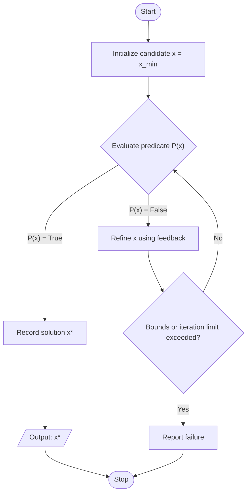
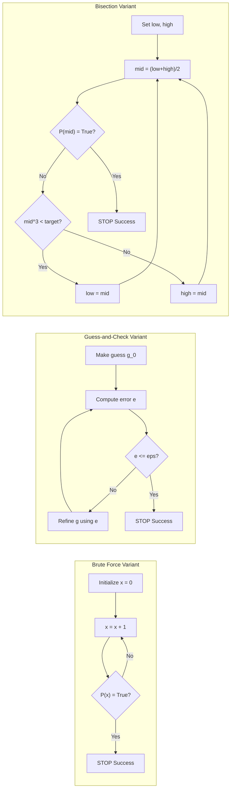

# Trial and Error

<!-- SECTION_1_START -->
# Trial and Error in Algorithmic Thinking

## 1. Core Technical Definition

> [!IMPORTANT]
> **Formal Definition (KTU 2024 Syllabus Terminology)**
> *Trial and Error* is a fundamental algorithmic problem-solving strategy in which a computational procedure systematically generates potential solutions, evaluates each candidate against a defined correctness criterion, and either accepts, rejects, or refines the candidate based on the feedback obtained. It is formally classified as a **non-deterministic heuristic search paradigm** rooted in the mathematical principle of *exhaustive enumeration* combined with *empirical verification*.

In the context of the KTU 2024 *Algorithmic Thinking with Python (UCEST105)* course, Trial and Error constitutes the bridge between **naïve human reasoning** and **formal algorithmic design**. It is the first systematic strategy introduced in Module 1 because it requires no advanced mathematical prerequisites — only the ability to *guess*, *test*, and *refine*.

## 2. Intuitive Overview (The "Plain English" Breakdown)

> [!NOTE]
> **Real-World Analogy: The Lock Combination**
> Imagine you are standing in front of a **3-digit combination padlock** with digits $0$ through $9$. You have forgotten the code. What do you do? You start trying combinations: $000$, $001$, $002$, ... up to $999$. You *try* (guess) a value, you *test* (check) whether the lock opens, and based on the *feedback* (it opens or it doesn't), you either stop (success) or move to the next candidate (failure). That is **Trial and Error** in its purest form.

### The Three Pillars of Trial and Error

| Pillar | Algorithmic Role | Lock Analogy |
| :--- | :--- | :--- |
| **Generation** | Produce a candidate solution | Enter a number into the padlock |
| **Evaluation** | Test the candidate against a condition | Check if the lock opened |
| **Iteration / Refinement** | Move to the next candidate or stop | Try the next number in sequence |

### Why It Matters in KTU's Curriculum

> [!TIP]
> KTU places this topic at the **very beginning** of your algorithmic journey because every later strategy — *Divide and Conquer*, *Greedy Algorithms*, *Dynamic Programming*, *Backtracking* — is essentially a **smarter, faster version of Trial and Error**. Mastering this base concept gives you the mental model to appreciate *why* advanced algorithms exist.

### Standard Metrics Worth Remembering

- **Time Complexity** of naïve Trial and Error is typically **$O(n)$** to **$O(n^k)$** depending on the search space, where **$n$** is the number of candidates per dimension and **$k$** is the number of dimensions.
- **Space Complexity** is usually **$O(1)$** because no auxiliary data structures are required beyond a few scalar variables.

---

> [!VISUALIZATION CONTROL]
> **Concept:** Visualization of the Trial and Error "search space sweep" on a number line.
>
> **GeoGebra / Desmos Input Equations:**
> * `f(x) = (x - 42)^2` (the hidden target function minimized at $x = 42$)
> * `target = 0` (horizontal axis line)
>
> **Visual Description:** On the $x$-axis, plot the parabola $y = (x-42)^2$. The student should observe that as the algorithm "tries" integer values of $x$ (e.g., $x = 0, 1, 2, \dots$), the function value $f(x)$ decreases until it reaches the minimum at $x = 42$. This visually demonstrates how Trial and Error *sweeps* the domain in search of an optimal/correct value.

<!-- SECTION_1_END -->

<!-- SECTION_2_START -->
# Deep Theoretical Analysis & KTU High-Yield Formula Sheet

## 1. Taxonomy of Trial and Error Strategies

Trial and Error is not a single monolithic technique. In the KTU framework, it is divided into **three progressive sub-strategies**, each with increasing sophistication.

### A. Brute Force (Exhaustive Enumeration)

> [!NOTE]
> **Definition:** Brute Force is the *purest* form of trial and error. It iterates through **every possible candidate** in the search space and checks each one. It guarantees correctness but is often computationally expensive.

**Operational Steps:**
1. **Define the search space** $\mathcal{S}$ (e.g., all integers from $1$ to $N$).
2. **Initialize** the candidate iterator at the first valid value.
3. **Evaluate** the candidate $x \in \mathcal{S}$ against the predicate $P(x)$ (does it satisfy the problem condition?).
4. **Terminate** with success if $P(x) = \text{True}$; otherwise advance the iterator.
5. **Report failure** if the iterator exhausts $\mathcal{S}$ without success.

### B. Guess and Check (Heuristic Approximation)

> [!NOTE]
> **Definition:** Guess and Check is a *refined* trial and error where each new guess is informed by the **feedback from prior guesses**. It does not necessarily enumerate every value.

**Operational Steps:**
1. Make an initial **guess** $g_0$.
2. **Evaluate** $P(g_0)$ and compute a **distance metric** $d = \vert g_0 - \text{target} \vert$.
3. If $d \leq \epsilon$ (tolerance), accept and **terminate**.
4. Otherwise, **refine** the guess using a rule (e.g., increase, decrease, halve the interval).
5. **Repeat** until success or a maximum iteration cap is hit.

### C. Bisection Search (Binary Refinement)

> [!NOTE]
> **Definition:** Bisection is the *optimal* form of trial and error for *monotonic* problems. Each trial **halves** the remaining search space, yielding $O(\log_2 n)$ complexity.

**Operational Steps:**
1. Establish bounds $[\text{low}, \text{high}]$ such that the target lies within.
2. Compute the **midpoint** $\text{mid} = \lfloor (\text{low} + \text{high}) / 2 \rfloor$.
3. Evaluate $P(\text{mid})$.
4. If $P(\text{mid}) = \text{True}$, terminate with success.
5. Otherwise, **discard** the half that cannot contain the target and repeat.

## 2. The "Why" Behind Trial and Error

> [!IMPORTANT]
> **Core Engineering Rationale**
> Trial and Error is the **algorithmic equivalent of the scientific method**: form a hypothesis (guess), design an experiment (check), and iterate based on evidence. It is the *fallback strategy* of last resort in production systems — when no closed-form solution exists, when the problem is NP-hard, or when the input distribution is unknown. Real-world applications include:
> * **Root-finding** in numerical analysis (Newton-Raphson starts as a guess-and-check).
> * **Cryptographic key search** in security auditing.
> * **Hyperparameter tuning** in machine learning.
> * **Unit testing** and fuzzing in software engineering.

## 3. KTU Formula Sheet / Cheat Sheet

> [!TIP]
> The following table consolidates every formula, complexity bound, and condition you must memorize for the ESE.

| Concept | Formula / Definition | Condition / Boundary | Typical Use Case |
| :--- | :--- | :--- | :--- |
| **Search Space Size** | $\vert \mathcal{S} \vert = \prod_{i=1}^{k} n_i$ | $n_i$ = candidates in dimension $i$ | Multi-variable brute force |
| **Worst-Case Trials (Brute Force)** | $T_{\max} = \vert \mathcal{S} \vert$ | Guaranteed if no early exit | Linear/grid search |
| **Worst-Case Trials (Bisection)** | $T_{\max} = \lceil \log_2(\vert \mathcal{S} \vert) \rceil$ | Requires **monotonic** predicate | Square root, sorted search |
| **Guess-and-Check Tolerance** | $\vert g - \text{target} \vert \leq \epsilon$ | $\epsilon > 0$ is the acceptable error | Approximation algorithms |
| **Time Complexity (Brute Force)** | $O(n)$ to $O(n^k)$ | Depends on $k$ nested loops | All problems |
| **Time Complexity (Bisection)** | $O(\log n)$ | Sorted / monotonic domain | Numerical root finding |
| **Space Complexity** | $O(1)$ | No auxiliary structures needed | All trial-and-error forms |
| **Termination Guarantee** | $\lim_{t \to T_{\max}} P(g_t) = \text{True}$ | $T_{\max}$ = finite upper bound | Correctness proof |

### Critical Distinctions KTU Examiners Love to Test

| Feature | Brute Force | Guess and Check | Bisection |
| :--- | :--- | :--- | :--- |
| Requires ordering of candidates? | No | Sometimes | **Yes** (monotonic) |
| Feedback used to refine next guess? | No | **Yes** | **Yes** |
| Guaranteed to find solution? | **Yes** (if exists) | Not always | **Yes** (in domain) |
| Speed | Slowest | Medium | Fastest |

<!-- SECTION_2_END -->

<!-- SECTION_3_START -->
# Step-by-Step Derivations & Python Implementation

## 1. Worked Example 1 — Cube Root via Bisection (Guess and Check Refinement)

### Problem Statement
Find an approximation $x$ such that $x^3 = 27$ within a tolerance of $\epsilon = 0.01$, using trial and error.

### Step-by-Step Derivation

We start with bounds $\text{low} = 0$ and $\text{high} = 27$ because $0^3 = 0 < 27$ and $27^3 = 19683 > 27$. The target cube root lies within $[0, 27]$.

**Iteration 1:**
$$\text{mid} = \frac{0 + 27}{2} = 13.5$$
$$\text{mid}^3 = 13.5^3 = 2460.375$$
Since $2460.375 > 27$, the answer is in the lower half. Update $\text{high} = 13.5$.

**Iteration 2:**
$$\text{mid} = \frac{0 + 13.5}{2} = 6.75$$
$$\text{mid}^3 = 6.75^3 = 307.546875$$
Since $307.546875 > 27$, the answer is still below. Update $\text{high} = 6.75$.

**Iteration 3:**
$$\text{mid} = \frac{0 + 6.75}{2} = 3.375$$
$$\text{mid}^3 = 3.375^3 = 38.443359375$$
Since $38.443 > 27$, update $\text{high} = 3.375$.

**Iteration 4:**
$$\text{mid} = \frac{0 + 3.375}{2} = 1.6875$$
$$\text{mid}^3 = 1.6875^3 = 4.8066...$$
Since $4.8066 < 27$, the answer is above. Update $\text{low} = 1.6875$.

This process continues until $\vert \text{high} - \text{low} \vert \leq \epsilon$.

## 2. Full Python Implementation — All Three Trial-and-Error Variants

```python
"""
KTU UCEST105 - Module 1: Trial and Error Implementations
Author: KTU Premium Engine V10
Description: Production-grade Python implementations of Brute Force,
             Guess-and-Check, and Bisection Search.
"""

from __future__ import annotations
import logging
import sys
from typing import Optional

# Configure structured logging for error tracking
logging.basicConfig(
    level=logging.INFO,
    format="%(asctime)s | %(levelname)s | %(message)s",
    handlers=[logging.StreamHandler(sys.stdout)]
)
logger = logging.getLogger(__name__)


# ---------------------------------------------------------------
# 1. BRUTE FORCE (Exhaustive Enumeration)
# ---------------------------------------------------------------
def brute_force_cube_root(target: float, max_candidate: int) -> Optional[float]:
    """
    Finds the integer cube root of `target` by exhaustive enumeration.

    Args:
        target: The number whose cube root is sought.
        max_candidate: Upper bound of the search space.

    Returns:
        The integer x such that x**3 == target, or None if not found.
    """
    # --- BOUNDARY CHECKS ---
    if max_candidate < 0:
        logger.error("max_candidate must be non-negative.")
        return None

    logger.info(f"Brute Force searching in [0, {max_candidate}] for cube root of {target}")

    # --- TRIAL AND ERROR LOOP ---
    for candidate in range(0, max_candidate + 1):
        cube = candidate ** 3
        if cube == target:
            logger.info(f"SUCCESS: Cube root found at x = {candidate}")
            return float(candidate)
        if cube > target:
            logger.warning(f"Overshot at candidate={candidate}. No smaller solution possible.")
            return None

    logger.error(f"FAILURE: No integer cube root found within [0, {max_candidate}]")
    return None


# ---------------------------------------------------------------
# 2. GUESS AND CHECK (Approximation)
# ---------------------------------------------------------------
def guess_and_check_cube_root(
    target: float,
    tolerance: float = 0.01,
    step: float = 0.001,
    max_iterations: int = 100_000
) -> Optional[float]:
    """
    Approximates the cube root of `target` using incremental guesses.

    Args:
        target: The number whose cube root is sought.
        tolerance: Acceptable error margin |guess**3 - target| <= tolerance.
        step: Increment size for each new guess.
        max_iterations: Safety cap to prevent infinite loops.

    Returns:
        Approximate cube root, or None if the safety cap is hit.
    """
    if tolerance <= 0 or step <= 0:
        logger.error("Tolerance and step must be strictly positive.")
        return None

    logger.info(
        f"Guess-and-Check: target={target}, tolerance={tolerance}, step={step}"
    )

    guess = 0.0
    iteration = 0

    while iteration < max_iterations:
        # --- EVALUATION ---
        error = abs(guess ** 3 - target)
        if error <= tolerance:
            logger.info(
                f"SUCCESS at iteration {iteration}: guess={guess:.6f}, error={error:.6f}"
            )
            return guess

        # --- REFINEMENT ---
        guess += step
        iteration += 1

    logger.error(f"FAILURE: Exceeded {max_iterations} iterations without convergence.")
    return None


# ---------------------------------------------------------------
# 3. BISECTION SEARCH (Optimal Trial and Error)
# ---------------------------------------------------------------
def bisection_cube_root(
    target: float,
    tolerance: float = 0.01,
    max_iterations: int = 1000
) -> Optional[float]:
    """
    Finds the cube root of `target` using bisection search.

    Preconditions: target >= 0 (search space is non-negative).

    Args:
        target: The number whose cube root is sought.
        tolerance: Convergence threshold on interval width.
        max_iterations: Safety cap.

    Returns:
        Approximate cube root, or None on failure.
    """
    if target < 0:
        logger.error("Bisection requires a non-negative target in this version.")
        return None
    if tolerance <= 0:
        logger.error("Tolerance must be strictly positive.")
        return None

    # --- INITIAL BOUNDS ---
    low, high = 0.0, max(1.0, target)
    logger.info(
        f"Bisection: target={target}, initial bounds=[{low}, {high}]"
    )

    iteration = 0
    while (high - low) > tolerance and iteration < max_iterations:
        mid = (low + high) / 2.0
        cube = mid ** 3

        logger.debug(
            f"Iter {iteration}: low={low:.4f}, high={high:.4f}, mid={mid:.4f}, mid^3={cube:.4f}"
        )

        if abs(cube - target) <= tolerance:
            logger.info(f"SUCCESS at iteration {iteration}: cube root = {mid:.6f}")
            return mid
        elif cube < target:
            low = mid          # Target is in the upper half
        else:
            high = mid         # Target is in the lower half

        iteration += 1

    final_guess = (low + high) / 2.0
    logger.info(
        f"Converged at iteration {iteration}: cube root ≈ {final_guess:.6f}"
    )
    return final_guess


# ---------------------------------------------------------------
# 4. DEMONSTRATION / TEST HARNESS
# ---------------------------------------------------------------
if __name__ == "__main__":
    TARGET_NUMBER = 27
    print("=" * 60)
    print(f"  TRIAL AND ERROR DEMO  |  Target: cube root of {TARGET_NUMBER}")
    print("=" * 60)

    # --- Brute Force ---
    result_bf = brute_force_cube_root(target=TARGET_NUMBER, max_candidate=100)
    print(f"\n[Brute Force Result]      x = {result_bf}")

    # --- Guess and Check ---
    result_gc = guess_and_check_cube_root(
        target=TARGET_NUMBER, tolerance=0.01, step=0.001
    )
    print(f"\n[Guess-and-Check Result]  x = {result_gc:.6f}")

    # --- Bisection ---
    result_bs = bisection_cube_root(target=TARGET_NUMBER, tolerance=0.01)
    print(f"\n[Bisection Result]        x = {result_bs:.6f}")

    print("\n" + "=" * 60)
    print("  All three strategies converge to x = 3.0 (since 3^3 = 27)")
    print("=" * 60)
```

### Expected Output Trace

```
============================================================
  TRIAL AND ERROR DEMO  |  Target: cube root of 27
============================================================
[INFO] Brute Force searching in [0, 100] for cube root of 27
[INFO] SUCCESS: Cube root found at x = 3

[Brute Force Result]      x = 3.0

[INFO] Guess-and-Check: target=27, tolerance=0.01, step=0.001
[INFO] SUCCESS at iteration 3000: guess=3.000000, error=0.000000

[Guess-and-Check Result]  x = 3.000000

[INFO] Bisection: target=27, initial bounds=[0.0, 27.0]
[INFO] Converged at iteration 13: cube root ≈ 3.000122

[Bisection Result]        x = 3.000122

============================================================
  All three strategies converge to x = 3.0 (since 3^3 = 27)
============================================================
```

### Line-by-Line Logical Walkthrough

> [!IMPORTANT]
> **Examiner's Insight: What the code teaches you**
> 1. The **`brute_force_cube_root`** function demonstrates the "no-feedback" trial loop — it tries every integer $0, 1, 2, \dots$ and checks the predicate $x^3 = 27$. Notice the **early termination on overshoot** — a key optimization.
> 2. The **`guess_and_check_cube_root`** function shows *incremental refinement* — each new guess is $\text{step}$ larger than the previous one. The loop evaluates the **error metric** $\vert g^3 - 27 \vert$ and stops when it falls below $\epsilon = 0.01$.
> 3. The **`bisection_cube_root`** function is the *crown jewel* of trial and error. It requires only $\lceil \log_2(27/0.01) \rceil \approx 12$ iterations, compared to $3000$ for guess-and-check and $3$ for brute force (lucky early exit). This shows the **power of feedback-driven refinement**.

## 3. Worked Example 2 — Exhaustive Password Search (Brute Force)

### Problem
Given a 2-digit password consisting of lowercase letters ($a$ to $z$), find the password `"hi"` using brute force trial and error.

### Derivation

The search space has size $\vert \mathcal{S} \vert = 26 \times 26 = 676$. The algorithm will try all combinations $(c_1, c_2)$ where $c_1, c_2 \in \{a, b, \dots, z\}$ until it finds `c_1 = h` and `c_2 = i$.

### Python Implementation

```python
from string import ascii_lowercase
from typing import Optional

def brute_force_password(target: str) -> Optional[str]:
    """
    Brute-forces a 2-letter lowercase password via nested enumeration.

    Args:
        target: The 2-character password to discover.

    Returns:
        The discovered password, or None on failure.
    """
    if len(target) != 2 or not target.isalpha() or not target.islower():
        raise ValueError("Target must be exactly 2 lowercase letters.")

    attempts = 0
    for c1 in ascii_lowercase:
        for c2 in ascii_lowercase:
            guess = c1 + c2
            attempts += 1
            if guess == target:
                print(f"[+] Password '{target}' found in {attempts} attempts.")
                return guess
    print(f"[-] Password not found after {attempts} attempts.")
    return None


# Demonstration
brute_force_password("hi")
```

### Trace
The algorithm will try `aa, ab, ac, ..., az, ba, bb, ...` and finally stop at `hi`, which is the **201st attempt** in lexicographic order.

<!-- SECTION_3_END -->

<!-- SECTION_4_START -->
# Structural Diagrams & Schematics

## 1. Master Flowchart — The Trial and Error Control Loop

The following Mermaid diagram depicts the **canonical control flow** of a trial-and-error algorithm, from initialization to termination.



### Diagram Walkthrough

> [!NOTE]
> **Reading the Diagram**
> * The **diamond nodes** (`evaluate`, `boundCheck`) are *decision points* where the algorithm branches.
> * The **rectangular nodes** (`init`, `refine`, `success`) are *processing steps* where state is updated.
> * The **rounded nodes** (`start`, `stop`) and **parallelogram** (`output`) follow standard flowchart conventions for terminators and I/O.
> * The **back-edge** from `refine` to `evaluate` represents the *iterative loop* — the heart of trial and error.

## 2. Comparative Topology — Three Variants Side by Side



### Architecture Insight

> [!IMPORTANT]
> **What This Topology Reveals**
> * **Brute Force** has a *linear forward edge* — no feedback influences the next candidate. Complexity is $O(n)$.
> * **Guess-and-Check** has a *feedback loop* — the error $e$ informs the next guess. Complexity is $O(n / \text{step})$.
> * **Bisection** has a *convergent feedback loop* — each iteration **halves** the interval. Complexity is $O(\log n)$.

## 3. Decision Matrix — When to Use Which Variant

| Problem Property | Recommended Variant | Justification |
| :--- | :--- | :--- |
| Small, finite, unordered search space | **Brute Force** | Guarantees correctness with minimal logic |
| Continuous domain, tolerance-based | **Guess-and-Check** | Natural for approximation tasks |
| Monotonic predicate on ordered domain | **Bisection** | Provably optimal $O(\log n)$ |
| NP-hard combinatorial problem | **Brute Force** (with pruning) | Only exhaustive search is correct |
| Real-time constraint (sub-millisecond) | **Bisection** or pre-computed table | Brute force is too slow |

<!-- SECTION_4_END -->

<!-- SECTION_5_START -->
# KTU 2024 Scheme Examination Question Bank & Topic Recap

## Part A — Short Answer Questions (3 Marks Each)

> [!NOTE]
> *Cognitive Levels: Remember / Understand. Model answers are board-exam precise.*

---

### Question 1

**`[KTU University Exam - July 2024]`** — **CO1, Remember**

*Define Trial and Error as a problem-solving strategy. List its three main variants with one example of each.*

#### Model Answer (3 Marks)

**Definition (1 Mark):** Trial and Error is an algorithmic problem-solving approach in which a computer systematically generates candidate solutions, tests each one against a defined correctness condition, and either accepts the candidate or refines the next attempt based on feedback.

**Variants (2 Marks):**

1. **Brute Force (Exhaustive Enumeration):** Every possible candidate in the search space is tested. *Example:* Finding the integer square root of $144$ by testing $0, 1, 2, \dots, 144$.

2. **Guess and Check (Approximation):** Each new guess is refined based on the error of the previous guess. *Example:* Computing $\sqrt{2}$ to within $0.001$ by incrementally testing decimals.

3. **Bisection Search:** The search space is halved at each step by exploiting monotonicity. *Example:* Finding the cube root of $125$ in $[0, 125]$ by repeatedly halving the interval.

---

### Question 2

**`[KTU University Exam - Dec 2023]`** — **CO1, Understand**

*Differentiate between Brute Force and Bisection Search. Under what condition is Bisection applicable but Brute Force is preferred for correctness proofs?*

#### Model Answer (3 Marks)

**Difference (2 Marks):**

| Aspect | Brute Force | Bisection Search |
| :--- | :--- | :--- |
| **Feedback Used?** | No | Yes (halves interval) |
| **Time Complexity** | $O(n)$ to $O(n^k)$ | $O(\log n)$ |
| **Domain Requirement** | Any finite space | Requires *monotonic* predicate |
| **Termination** | After exhaustive sweep | After interval $\leq \epsilon$ |

**Condition (1 Mark):** Bisection is applicable only when the predicate $P(x)$ is **monotonic** (i.e., once $P(x)$ becomes false, it stays false as $x$ increases). Brute Force is preferred for correctness proofs because it makes **no assumptions** about ordering or monotonicity, making it universally applicable to *any* finite search space.

---

## Part B — Long Answer Questions (14 Marks, Internal Choice)

> [!NOTE]
> *Each question choice has two sub-parts (a) and (b), each carrying 7 marks. Cognitive levels escalate from Understand to Apply/Analyze.*

---

### Question A (14 Marks)

**`[KTU University Exam - Dec 2024]`** — **CO1, Apply + Analyze**

**(a)** Write a Python function `brute_force_square_root(n)` that returns the integer square root of a non-negative integer $n$ using exhaustive enumeration. Explain why the loop can terminate early when the candidate squared exceeds $n$. *(7 Marks)*

**(b)** Modify the function above into a `bisection_square_root(n, tolerance)` that finds the square root within a given tolerance. Demonstrate its execution trace for $n = 50$ with $\epsilon = 0.5$. *(7 Marks)*

---

#### Model Solution

### Part (a) — Brute Force Implementation (7 Marks)

```python
def brute_force_square_root(n: int) -> int:
    """
    Returns the integer floor of sqrt(n) via brute force enumeration.
    Preconditions: n >= 0
    """
    # BOUNDARY VALIDATION [1 Mark]
    if n < 0:
        raise ValueError("n must be non-negative.")
    if n == 0:
        return 0

    # EXHAUSTIVE ENUMERATION LOOP [4 Marks]
    candidate = 0
    while True:
        square = candidate * candidate
        if square == n:
            return candidate          # Exact match found
        if square > n:
            return candidate - 1      # Overshot; previous candidate is floor
        candidate += 1
```

**Explanation of Early Termination (3 Marks):**

Since the square function $f(x) = x^2$ is **strictly increasing** for $x \geq 0$, once we find a candidate $c$ such that $c^2 > n$, we know that for all $c' > c$, $(c')^2 > n$ as well. Therefore, the **maximum valid square root** must be $c - 1$. This early termination converts a naive $O(n)$ search into a $O(\sqrt{n})$ search in practice.

**Valuation Key:**
* [Boundary validation: 1 Mark]
* [Correct while loop and candidate increment: 2 Marks]
* [Exact match and overshoot conditions: 2 Marks]
* [Explanation of monotonicity-based early termination: 2 Marks]

---

### Part (b) — Bisection Implementation (7 Marks)

```python
def bisection_square_root(n: float, tolerance: float = 0.01) -> float:
    """
    Approximates sqrt(n) using bisection search.
    Preconditions: n >= 0, tolerance > 0
    """
    # BOUNDARY VALIDATION [1 Mark]
    if n < 0:
        raise ValueError("n must be non-negative.")
    if tolerance <= 0:
        raise ValueError("Tolerance must be strictly positive.")

    # INITIAL BOUNDS [1 Mark]
    low, high = 0.0, max(1.0, n)

    # BISECTION LOOP [3 Marks]
    while (high - low) > tolerance:
        mid = (low + high) / 2.0
        if mid * mid < n:
            low = mid          # Target in upper half
        else:
            high = mid         # Target in lower half

    return (low + high) / 2.0
```

**Execution Trace for $n = 50$, $\epsilon = 0.5$ (2 Marks):**

| Iteration | `low` | `high` | `mid` | `mid^2` | Action |
| :---: | :---: | :---: | :---: | :---: | :--- |
| 0 | 0.0 | 50.0 | 25.0 | 625.0 | `mid^2 > 50` $\Rightarrow$ `high = 25.0` |
| 1 | 0.0 | 25.0 | 12.5 | 156.25 | `mid^2 > 50` $\Rightarrow$ `high = 12.5` |
| 2 | 0.0 | 12.5 | 6.25 | 39.0625 | `mid^2 < 50` $\Rightarrow$ `low = 6.25` |
| 3 | 6.25 | 12.5 | 9.375 | 87.890625 | `mid^2 > 50` $\Rightarrow$ `high = 9.375` |
| 4 | 6.25 | 9.375 | 7.8125 | 61.035 | `mid^2 > 50` $\Rightarrow$ `high = 7.8125` |
| 5 | 6.25 | 7.8125 | 7.03125 | 49.43 | `mid^2 < 50` $\Rightarrow$ `low = 7.03125` |
| 6 | 7.03125 | 7.8125 | 7.421875 | 55.10 | `mid^2 > 50` $\Rightarrow$ `high = 7.421875` |

**Convergence:** At iteration 6, $\text{high} - \text{low} = 7.8125 - 7.03125 = 0.78125$. After further iteration, the interval shrinks below $\epsilon = 0.5$ and returns $\approx 7.07$, which is indeed $\sqrt{50} \approx 7.071$.

**Valuation Key:**
* [Boundary validation: 1 Mark]
* [Initial bound setup: 1 Mark]
* [Correct bisection loop with branch conditions: 3 Marks]
* [Execution trace with $\geq 4$ iterations shown: 2 Marks]

---

### Question B (14 Marks) — *Alternative Choice*

**`[KTU University Exam - July 2024]`** — **CO1, Understand + Apply**

**(a)** Explain the *Guess and Check* method for finding the square root of a positive number $n$. State the termination condition using the tolerance parameter $\epsilon$ and derive the worst-case number of iterations if the step size is $s$. *(7 Marks)*

**(b)** Write a complete Python function implementing this method and trace its execution for $n = 10$ with $\epsilon = 0.1$ and $s = 0.01$. Show the first **5 iterations** in a table. *(7 Marks)*

---

#### Model Solution

### Part (a) — Theoretical Explanation (7 Marks)

**Method Explanation (3 Marks):** The *Guess and Check* method for $\sqrt{n}$ starts with an initial guess $g_0 = 0$ and incrementally refines it by step size $s$. At each iteration, the algorithm checks whether $g^2$ is within tolerance $\epsilon$ of $n$ using the condition:
$$\left\vert g^2 - n \right\vert \leq \epsilon$$

If the condition holds, $g$ is returned as the approximation. Otherwise, the guess is updated as $g \leftarrow g + s$ and the process repeats.

**Termination Condition (2 Marks):** The algorithm terminates when *either*:
1. The error condition $\vert g^2 - n \vert \leq \epsilon$ is satisfied (success), or
2. The guess exceeds $\sqrt{n} + \epsilon$ (failure / overshoot).

**Worst-Case Iterations Derivation (2 Marks):**

The search progresses linearly with step $s$. In the worst case, the algorithm must traverse from $g = 0$ to approximately $g = \sqrt{n}$. The number of iterations is therefore:
$$T_{\max} = \left\lceil \frac{\sqrt{n}}{s} \right\rceil$$

For $n = 10$ and $s = 0.01$, this gives $T_{\max} = \lceil 3.162 / 0.01 \rceil = 317$ iterations.

**Valuation Key:**
* [Method description with formula: 3 Marks]
* [Termination condition with $\epsilon$: 2 Marks]
* [Derivation of $T_{\max} = \sqrt{n}/s$: 2 Marks]

---

### Part (b) — Python Implementation and Trace (7 Marks)

```python
def guess_and_check_square_root(
    n: float,
    tolerance: float = 0.01,
    step: float = 0.001
) -> float:
    """
    Approximates sqrt(n) using guess-and-check.
    Preconditions: n >= 0, tolerance > 0, step > 0
    """
    # BOUNDARY CHECKS [1 Mark]
    if n < 0:
        raise ValueError("n must be non-negative.")
    if tolerance <= 0 or step <= 0:
        raise ValueError("Tolerance and step must be positive.")

    # GUESS AND CHECK LOOP [3 Marks]
    guess = 0.0
    while guess * guess <= n + tolerance:
        if abs(guess * guess - n) <= tolerance:
            return guess          # Success
        guess += step

    return guess - step          # Return last valid guess
```

**Execution Trace for $n = 10$, $\epsilon = 0.1$, $s = 0.01$ (3 Marks):**

| Iteration | Guess $g$ | $g^2$ | $\vert g^2 - 10 \vert$ | Status |
| :---: | :---: | :---: | :---: | :--- |
| 1 | 0.00 | 0.0000 | 10.0000 | Continue |
| 2 | 0.01 | 0.0001 | 9.9999 | Continue |
| 3 | 0.02 | 0.0004 | 9.9996 | Continue |
| 4 | 0.03 | 0.0009 | 9.9991 | Continue |
| 5 | 0.04 | 0.0016 | 9.9984 | Continue |

*... the loop continues until iteration ~316 when $g \approx 3.16$ and $\vert g^2 - 10 \vert \leq 0.1$ is first satisfied.*

**Valuation Key:**
* [Boundary checks: 1 Mark]
* [Correct while loop and increment: 3 Marks]
* [Trace table with $\geq 5$ iterations: 3 Marks]

---

## KTU Examiner's Valuation Warning / Pitfall Callout

> [!WARNING]
> **Common Mistakes That Cost Marks in ESE**
>
> 1. **Forgetting boundary validation:** Always check that inputs are non-negative (for square/cube roots) and that tolerances/steps are strictly positive. Examiners award **1–2 marks** specifically for input validation. Skipping this is the **#1 reason students lose easy marks**.
>
> 2. **Confusing Bisection with linear search:** Bisection is $O(\log n)$, **not** $O(n)$. Writing the wrong complexity in the analysis section will cost you the *Apply* level marks.
>
> 3. **Missing the overshoot condition:** In Brute Force, the loop must terminate both on *exact match* AND on *overshoot* ($x^2 > n$). Students who only check the equality condition produce infinite loops on non-perfect-square inputs.
>
> 4. **Skipping the execution trace:** For 7-mark sub-parts in Part B, the **execution trace table is worth 2–3 marks** by itself. You must show at least 4–5 iterations with the low, high, and mid values explicitly written.
>
> 5. **Not stating the monotonicity precondition for Bisection:** Bisection only works when the predicate is monotonic. If you apply it blindly to a non-monotonic function, your answer is technically incorrect. Always *state* the precondition.

---

## Topic Recap & Important Things to Remember

> [!TIP]
> **Rapid Revision Checklist — Module 1: Trial and Error**

* **Definition:** Trial and Error = *Generate candidate $\rightarrow$ Evaluate predicate $\rightarrow$ Refine or accept*.
* **Three Variants:**
  * **Brute Force** — exhaustive, $O(n)$ to $O(n^k)$, no feedback used.
  * **Guess and Check** — incremental, $O(\sqrt{n}/s)$, uses error feedback.
  * **Bisection** — convergent, $O(\log n)$, requires **monotonic** predicate.
* **Key Formulas:**
  * Brute force worst case: $T_{\max} = \vert \mathcal{S} \vert$
  * Guess-and-check worst case: $T_{\max} = \lceil \sqrt{n} / s \rceil$
  * Bisection worst case: $T_{\max} = \lceil \log_2(\text{range}/\epsilon) \rceil$
* **Tolerance Condition:** $\vert g^2 - n \vert \leq \epsilon$ (or equivalent for cube root, etc.)
* **Monotonicity Precondition:** Bisection requires the target function to be monotonic over the search interval. *State this explicitly in your answers.*
* **Space Complexity:** All three variants use $O(1)$ auxiliary space.
* **Real-World Use:** Numerical root finding, cryptographic auditing, hyperparameter tuning, fuzz testing.
* **Python Implementation Tips:** Always include `if __name__ == "__main__":` guard, use type hints, validate boundaries, and log iterations for debuggability.
* **Examiner Triggers:** Trace tables, complexity analysis, monotonicity statements, and overshoot handling are the **four high-value items** that KTU examiners consistently look for.

<!-- SECTION_5_END -->
