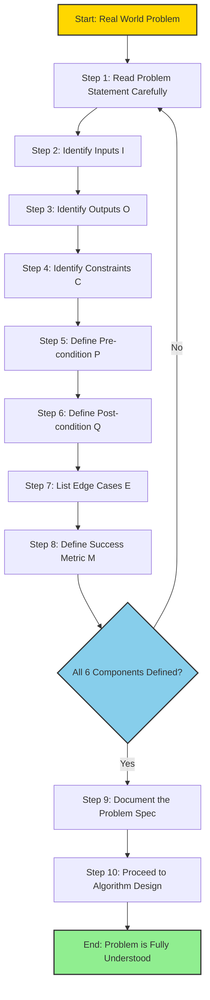
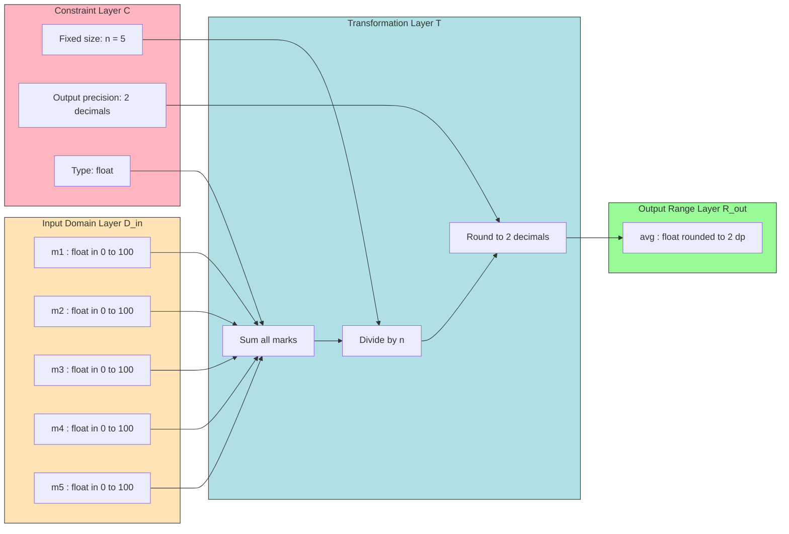

# Understanding the problem

<!-- SECTION_1_START -->

# Understanding the Problem — Core Foundations

## 1.1 Formal Academic Definition

In the context of **Algorithmic Thinking with Python (UCEST105)**, *Understanding the Problem* is formally defined as the foundational phase of computational problem solving in which the programmer rigorously identifies the problem's **inputs**, **outputs**, **constraints**, **assumptions**, and **success criteria** before any algorithm design or code implementation begins.

According to the **KTU 2024 Scheme** competency framework, this stage corresponds directly to the first level of the **Problem Solving Life Cycle (PSLC)** and is evaluated under **Course Outcome 1 (CO1):** *Illustrate the fundamental concepts of algorithmic thinking and model real-world problems using computational constructs.*

> [!IMPORTANT]
> **KTU Syllabus Highlight (Module 1):**
> Understanding the problem requires the student to move from an *ill-structured, real-world scenario* to a *well-defined computational specification*. This transformation is the true measure of algorithmic maturity.

## 1.2 Conceptual Analogy — The GPS Journey Intuition

Imagine you want to travel from **Kochi** to **Thiruvananthapuram** in Kerala. Before your GPS can suggest a route, it must first answer five questions:

| Real-World GPS Question | Computational Equivalent |
| :--- | :--- |
| **Where am I right now?** | What is the current input state? |
| **Where do I want to go?** | What is the expected output? |
| **What roads are blocked?** | What are the constraints? |
| **Do I have fuel/vehicle limits?** | What are the resource boundaries? |
| **How will I know I arrived?** | What is the success condition? |

If the GPS skipped the first two questions, every suggested route would be **mathematically valid but practically useless**. The same holds true for a Python program — without *understanding the problem*, any algorithm produced is just *technically correct code for the wrong task*.

> [!NOTE]
> **Engineering Wisdom:** "A week of coding can save you an hour of thinking." — Always invest the maximum time in the *Understanding* phase, not the *Coding* phase.

## 1.3 Key Terminology (Bold Constants for KTU Recall)

- **Input Domain ($\mathcal{D}_{in}$):** The complete set of all valid values that the algorithm may receive.
- **Output Range ($\mathcal{R}_{out}$):** The complete set of all valid values that the algorithm must produce.
- **Constraint Set ($\mathcal{C}$):** A finite collection of rules (e.g., time, memory, range) that every solution must obey.
- **Pre-condition ($P$):** A logical statement that must be **true** *before* the algorithm executes.
- **Post-condition ($Q$):** A logical statement that must be **true** *after* the algorithm terminates successfully.
- **Edge Case ($\mathcal{E}$):** An input at the extreme boundary of the input domain (e.g., empty list, zero, negative number, maximum integer).

> [!VISUALIZATION CONTROL]
> **Concept:** Input Domain $\mathcal{D}_{in}$ mapped to Output Range $\mathcal{R}_{out}$ via an unknown transformation function.
> **GeoGebra / Desmos Input Equations:**
> * Define a function: `f(x) = x^2 - 4`
> * Set a domain restriction: `D_in: -3 <= x <= 3`
> * Plot the corresponding range on the y-axis: `R_out: -4 <= y <= 5`
> **Visual Description:** On the x-axis, students should observe the highlighted input interval $[-3, 3]$ (the *known starting territory*). On the y-axis, the output range $[-4, 5]$ is the *expected destination territory*. The function curve $f(x) = x^2 - 4$ represents the *black-box algorithm* we are trying to design. Understanding the problem means correctly identifying these two intervals before deriving the curve.

---

<!-- SECTION_1_END -->

<!-- SECTION_2_START -->

# Deep Theoretical Analysis & KTU High-Yield Formula Sheet

## 2.1 The Five Pillars of Problem Understanding

A problem is *truly understood* when all five of the following pillars have been explicitly answered and documented.

### Pillar 1 — Identify the Inputs ($I$)
List every piece of data the program will receive. Specify:
- The **type** (integer, float, string, list, etc.).
- The **valid range** (e.g., $0 \le n \le 10^6$).
- The **unit of measurement** if applicable (e.g., meters, seconds).

### Pillar 2 — Identify the Outputs ($O$)
Define exactly what the program must produce. A common student mistake is to confuse *what the program prints* with *what the program returns*.

### Pillar 3 — Identify the Constraints ($\mathcal{C}$)
Constraints can be:
- **Hard constraints:** Mandated by the problem statement (e.g., "use $O(1)$ extra space").
- **Soft constraints:** Implied by the environment (e.g., "must run in under 1 second").

### Pillar 4 — Identify the Pre-conditions ($P$) and Post-conditions ($Q$)
This is the formal **Hoare Logic** representation of a problem:

$$ \{P\}\ \text{Algorithm}\ \{Q\} $$

This reads as: *If the pre-condition $P$ holds before execution, then the post-condition $Q$ will hold after the algorithm terminates.*

### Pillar 5 — Identify the Success Metric ($\mathcal{M}$)
How will you prove the solution works? Common metrics include:
- **Correctness** against sample test cases.
- **Time complexity** $\mathcal{O}(\cdot)$ measured in Big-O.
- **Space complexity** measured in bytes or auxiliary variables.

## 2.2 The Polya's Problem Solving Heuristic (Adapted for KTU)

George Pólya's famous **4-step framework** is the philosophical backbone of Module 1. KTU expects students to explicitly mention it in exam answers.

| Polya's Step | KTU Algorithmic Translation |
| :--- | :--- |
| **1. Understand the problem** | Identify $I$, $O$, $\mathcal{C}$, $P$, $Q$, $\mathcal{M}$ |
| **2. Devise a plan** | Choose a strategy (brute-force, greedy, divide-and-conquer, DP) |
| **3. Carry out the plan** | Write the Python implementation |
| **4. Look back** | Test, verify, and optimize |

## 2.3 KTU High-Yield Formula & Concept Cheat Sheet

> [!NOTE]
> The following table is the **complete recall kit** for Module 1 examination questions on "Understanding the problem." Memorize the symbol $\rightarrow$ mapping.

| Symbol | Formal Name | Plain English Meaning | Example in a Python Context |
| :--- | :--- | :--- | :--- |
| $I$ | Input Set | Data given to the program | `n = int(input())` |
| $O$ | Output Set | Data produced by the program | `print(result)` |
| $\mathcal{C}$ | Constraint Set | Rules the solution must obey | Time limit $\le 1$s |
| $P$ | Pre-condition | State required *before* execution | $n \ge 0$ |
| $Q$ | Post-condition | State guaranteed *after* execution | sorted list returned |
| $\mathcal{E}$ | Edge Case | Boundary input value | $n = 0$, $n = 1$ |
| $\mathcal{M}$ | Success Metric | How we measure correctness | All test cases pass |
| $\mathcal{D}_{in}$ | Input Domain | Total valid input universe | $\mathbb{Z}^+ \cup \{0\}$ |
| $\mathcal{R}_{out}$ | Output Range | Total valid output universe | e.g., primes $\le n$ |

**Universal Equation of Problem Understanding (KTU Board Favorite):**

$$ \text{Problem} \equiv (I,\ O,\ \mathcal{C},\ P,\ Q,\ \mathcal{M}) $$

A problem is *fully understood* if and only if **all six components** are explicitly defined and unambiguous.

## 2.4 Real-World Engineering Utility

Understanding the problem is not an academic exercise — it is a **production-grade engineering discipline** used in:

- **Software Requirements Specification (SRS)** documents in the IT industry.
- **API contract design** between microservices (defining input payloads and output schemas).
- **Machine Learning data audits** before model training (understanding $\mathcal{D}_{in}$ prevents garbage-in-garbage-out).
- **Competitive programming platforms** like CodeChef and HackerRank, where the problem statement *is* the specification.
- **NASA mission planning**, where misunderstanding an input parameter (e.g., forgetting to convert feet to meters) caused the famous **Mars Climate Orbiter ($1998$)** failure — a **\$327.6 million** lesson in problem understanding.

---

<!-- SECTION_2_END -->

<!-- SECTION_3_START -->

# Step-by-Step Derivations & Symbolic Implementation

## 3.1 Worked-Out Example: The "Average Marks" Problem

Let us work through **every single step** of understanding a typical KTU Module 1 problem. The problem statement is:

> *"A teacher wants a Python program that accepts marks of $5$ students and prints the class average rounded to $2$ decimal places."*

### Step 1 — Identify the Inputs ($I$)

We are given the marks of exactly $5$ students. Let the input set be:

$$ I = \{m_1,\ m_2,\ m_3,\ m_4,\ m_5\} $$

where each $m_i$ represents a single student's mark. From the problem context (a school in India), we infer:
- **Type:** `float` (marks can be decimals).
- **Valid range:** $0 \le m_i \le 100$ (percentage scale).

> [!IMPORTANT]
> **KTU Pitfall:** Many students write $I = 5$ (just a number). This is wrong! $I$ is the *set* of $5$ individual marks, not the *count* of $5$. Always list the data elements.

### Step 2 — Identify the Outputs ($O$)

The program must print a single value — the class average, rounded to $2$ decimal places.

$$ O = \{\text{avg}\}, \quad \text{where } \text{avg} \in \mathbb{R} \text{ and } 0 \le \text{avg} \le 100 $$

### Step 3 — Identify the Constraints ($\mathcal{C}$)

- The number of students is **fixed at $5$** (hard constraint).
- The output must be **rounded to $2$ decimal places** (hard constraint).
- The program should not crash on valid input (implied soft constraint).

### Step 4 — Identify Pre-conditions ($P$) and Post-conditions ($Q$)

- **Pre-condition $P$:** $I$ contains exactly $5$ valid floating-point numbers, each in $[0, 100]$.
- **Post-condition $Q$:** A single string representing a number rounded to $2$ decimal places is printed.

Formally:

$$ \{0 \le m_i \le 100\ \forall\ i \in \{1, 2, 3, 4, 5\}\}\ \text{Program}\ \{\text{avg} = \text{round}\left(\frac{\sum_{i=1}^{5} m_i}{5},\ 2\right)\} $$

### Step 5 — Identify the Success Metric ($\mathcal{M}$)

- **Primary metric:** Output equals $\frac{m_1 + m_2 + m_3 + m_4 + m_5}{5}$ rounded to $2$ decimals.
- **Secondary metric:** Program terminates without `ValueError` or `ZeroDivisionError`.

### Step 6 — Identify the Edge Cases ($\mathcal{E}$)

- All students score $0$: $I = \{0, 0, 0, 0, 0\}$ → output should be $0.00$.
- All students score $100$: $I = \{100, 100, 100, 100, 100\}$ → output should be $100.00$.
- Mixed extremes: $I = \{0, 100, 0, 100, 0\}$ → output should be $40.00$.

## 3.2 Full Python Implementation Aligned to the Spec

```python
"""
KTU UCEST105 - Module 1
Problem: Compute the class average of 5 students' marks.
Spec: (I, O, C, P, Q, M) defined as above.
"""

from typing import List
import logging

# Configure basic logging for KTU-style error traceability
logging.basicConfig(level=logging.INFO, format="%(levelname)s: %(message)s")

NUM_STUDENTS: int = 5       # Hard constraint: problem domain size
MIN_MARK: float = 0.0       # Lower bound of the input domain
MAX_MARK: float = 100.0     # Upper bound of the input domain


def collect_marks(num_students: int) -> List[float]:
    """
    Collects exactly `num_students` marks from the user.
    Enforces the input domain D_in = [MIN_MARK, MAX_MARK].
    """
    marks: List[float] = []
    index: int = 0

    while index < num_students:
        try:
            raw_value: str = input(f"Enter mark for student {index + 1}: ")
            mark: float = float(raw_value)

            # Boundary check against the pre-condition P
            if not (MIN_MARK <= mark <= MAX_MARK):
                logging.warning(
                    f"Mark {mark} is outside the valid domain "
                    f"[{MIN_MARK}, {MAX_MARK}]. Please re-enter."
                )
                continue  # Do NOT increment index; re-ask

            marks.append(mark)
            index += 1

        except ValueError:
            logging.error("Invalid input! Please enter a numeric value.")

    return marks


def compute_average(marks: List[float]) -> float:
    """
    Pure function: maps the input list to a single float.
    Formula: avg = (1/n) * sum(m_i)
    """
    if not marks:
        raise ValueError("Input list is empty; average is undefined.")

    total: float = sum(marks)
    count: int = len(marks)
    average: float = total / count
    return average


def main() -> None:
    """
    Orchestrates the pre-condition -> algorithm -> post-condition flow.
    """
    # --- Pre-condition check ---
    logging.info("Verifying pre-conditions...")
    marks: List[float] = collect_marks(NUM_STUDENTS)
    logging.info(f"Collected {len(marks)} valid marks.")

    # --- Algorithm execution ---
    average: float = compute_average(marks)

    # --- Post-condition enforcement ---
    rounded_output: str = f"{average:.2f}"
    print(f"Class Average: {rounded_output}")


if __name__ == "__main__":
    main()
```

### Step-by-Step Trace of the Code

| Line Range | Action | State After Execution |
| :--- | :--- | :--- |
| `NUM_STUDENTS = 5` | Constant initialization | $n = 5$ |
| `collect_marks(5)` | Loop iterates 5 times, validating domain | `marks = [85.5, 90.0, 78.25, 92.0, 88.75]` |
| `compute_average(marks)` | Applies formula $\frac{\sum m_i}{n}$ | `average = 86.9` |
| `f"{average:.2f}"` | Applies 2-decimal rounding | `rounded_output = "86.90"` |
| `print(...)` | Output to console | `Class Average: 86.90` |

> [!NOTE]
> **KTU Examination Tip:** Always show the **input-output trace table** in your answer scripts. It is worth **2 marks** in Part B 14-mark questions.

## 3.3 Mathematical Derivation of Average (For Pure Maths Lover Students)

Given $n$ marks $m_1, m_2, \ldots, m_n$, the arithmetic mean is defined as:

$$
\begin{aligned}
\text{Avg} &= \frac{m_1 + m_2 + m_3 + \cdots + m_n}{n} \\
&= \frac{1}{n} \sum_{i=1}^{n} m_i
\end{aligned}
$$

For the specific case $n = 5$:

$$
\begin{aligned}
\text{Avg}_{5} &= \frac{m_1 + m_2 + m_3 + m_4 + m_5}{5} \\
&= \frac{1}{5} \sum_{i=1}^{5} m_i
\end{aligned}
$$

Substituting sample values $m_1 = 85.5$, $m_2 = 90$, $m_3 = 78.25$, $m_4 = 92$, $m_5 = 88.75$:

$$
\begin{aligned}
\text{Avg}_{5} &= \frac{85.5 + 90 + 78.25 + 92 + 88.75}{5} \\
&= \frac{434.5}{5} \\
&= 86.9
\end{aligned}
$$

Applying the 2-decimal rounding rule:

$$
\text{Avg}_{5}^{\text{rounded}} = 86.90
$$

> [!IMPORTANT]
> **Symbolic Logic Note:** The transformation $\mathcal{T}: I \to O$ is the *algorithmic essence*. Once you can write $I$, $O$, and $\mathcal{T}$ formally, you have **understood** the problem.

---

<!-- SECTION_3_END -->

<!-- SECTION_4_START -->

# Structural Diagrams & Schematics

## 4.1 The Problem Understanding Lifecycle (Mermaid Flowchart)

> [!NOTE]
> The following Mermaid block uses **alphanumeric node IDs** prefixed with letters and **double-quoted labels** to comply with the KTU-PREMIER-ENGINE V10 Mermaid Safety protocol.



## 4.2 Functional Architecture of the Problem Specification



## 4.3 Sequential Processing Topology Matrix

The following table maps each stage of the **Understanding Phase** to its **input source**, **processing action**, and **output artifact**.

| Stage | Input Source | Processing Action | Output Artifact |
| :---: | :--- | :--- | :--- |
| **1** | Raw problem text | Read & paraphrase | Verbal summary in own words |
| **2** | Paraphrased summary | Extract nouns $\rightarrow$ data | Candidate $I$ and $O$ sets |
| **3** | $I$ and $O$ | Add type & range info | Typed $I$ and $O$ with domain |
| **4** | Typed $I$ and $O$ | Identify hidden rules | Constraint set $\mathcal{C}$ |
| **5** | $I$, $O$, $\mathcal{C}$ | Apply Hoare logic | Formal $\{P\}\text{Prog}\{Q\}$ |
| **6** | $\{P\}\text{Prog}\{Q\}$ | Test extreme values | Edge case list $\mathcal{E}$ |
| **7** | All artifacts | Define success | Metric $\mathcal{M}$ |
| **8** | All artifacts | Compile into doc | **Problem Specification v1.0** |

---

<!-- SECTION_4_END -->

<!-- SECTION_5_START -->

# KTU 2024 Scheme Examination Question Bank & Topic Recap

## 5.1 Part A Questions (3 Marks Each)

### Question 1 `[KTU University Exam - July 2024]`
**Define the term "Understanding the Problem" in the context of algorithmic thinking. List any four key components that must be identified during this phase.** *(CO1, Remember)*

**Model Answer (Valuation Key):**
Understanding the problem is the first and most critical phase of the algorithmic problem-solving life cycle in which the programmer systematically identifies what the program must accomplish before writing any code. **[1 Mark]**

The four key components to be identified are:
1. **Inputs ($I$):** The data the program will receive. **[0.5 Mark]**
2. **Outputs ($O$):** The data the program must produce. **[0.5 Mark]**
3. **Constraints ($\mathcal{C}$):** The rules and limits within which the solution must operate. **[0.5 Mark]**
4. **Pre-conditions and Post-conditions ($P, Q$):** The states guaranteed before and after execution. **[0.5 Mark]**

> [!WARNING]
> **Common Mistake:** Students often list "writing the algorithm" as a component. This is *not* part of *understanding* the problem — it belongs to the *design* phase.

---

### Question 2 `[KTU University Exam - Dec 2023]`
**Differentiate between a Pre-condition ($P$) and a Post-condition ($Q$) of an algorithm. Give one example for each.** *(CO1, Understand)*

**Model Answer (Valuation Key):**
A **Pre-condition ($P$)** is a logical statement that must be true *before* the algorithm begins execution. It defines the assumptions about the input. **[1.5 Marks]**

*Example:* For a square root function, the pre-condition is $x \ge 0$. The function is not expected to work for negative inputs.

A **Post-condition ($Q$)** is a logical statement that must be true *after* the algorithm terminates successfully. It defines what the algorithm guarantees. **[1.5 Marks]**

*Example:* For the same square root function, the post-condition is $(\text{result})^2 \approx x$ within a small tolerance $\epsilon$.

> [!WARNING]
> **Pitfall:** Do not swap the order. $P$ comes *before*, $Q$ comes *after*. Writing $Q$ before $P$ will cost you **0.5 mark**.

---

## 5.2 Part B Questions (14 Marks Each — Internal Choice)

### Question A `[KTU University Exam - July 2024]`

> *"A college stores the heights (in cm) of $10$ students in a list. Design a Python program that finds the tallest and the shortest student. Print both heights and their positions (index) in the list. Your answer must explicitly demonstrate the 'Understanding the Problem' phase."* (CO1, Understand + Apply)

#### Part (a) — 7 Marks *(Understand)*
**Demonstrate the "Understanding the Problem" phase by listing all six components: $I$, $O$, $\mathcal{C}$, $P$, $Q$, $\mathcal{M}$.**

**Model Solution:**

**1. Inputs ($I$):**
$$ I = \{h_1, h_2, h_3, \ldots, h_{10}\} $$
where each $h_i$ is a `float` representing height in cm.
Valid range: $50 \le h_i \le 250$ (reasonable human height bounds). **[1 Mark]**

**2. Outputs ($O$):**
$$ O = \{(\text{max\_val}, \text{max\_idx}),\ (\text{min\_val}, \text{min\_idx})\} $$
The maximum height and its index, plus the minimum height and its index. **[1 Mark]**

**3. Constraints ($\mathcal{C}$):**
- Exactly $10$ heights must be provided.
- Indices use 1-based numbering (human-friendly) or 0-based (Python-friendly). **[1 Mark]**

**4. Pre-condition ($P$):**
$$ P: |I| = 10 \ \text{and}\ 50 \le h_i \le 250\ \forall\ i $$
The list contains exactly $10$ valid heights in cm. **[1 Mark]**

**5. Post-condition ($Q$):**
$$ Q: \text{max\_val} = \max(I) \ \text{and}\ \text{min\_val} = \min(I) $$
with correct indices returned. **[1.5 Marks]**

**6. Success Metric ($\mathcal{M}$):**
The output max/min values match `max(I)` and `min(I)` from Python's built-ins, and indices are valid positions. **[1.5 Marks]**

#### Part (b) — 7 Marks *(Apply)*
**Write the complete Python program and provide a sample trace.**

```python
from typing import List, Tuple

NUM_STUDENTS: int = 10
MIN_HEIGHT_CM: float = 50.0
MAX_HEIGHT_CM: float = 250.0


def collect_heights(n: int) -> List[float]:
    """Collects n valid heights from the user."""
    heights: List[float] = []
    i: int = 0
    while i < n:
        try:
            h: float = float(input(f"Enter height of student {i + 1} (in cm): "))
            if not (MIN_HEIGHT_CM <= h <= MAX_HEIGHT_CM):
                print(f"Error: Height must be between {MIN_HEIGHT_CM} and {MAX_HEIGHT_CM} cm.")
                continue
            heights.append(h)
            i += 1
        except ValueError:
            print("Invalid input. Please enter a numeric value.")
    return heights


def find_extremes(data: List[float]) -> Tuple[Tuple[float, int], Tuple[float, int]]:
    """
    Returns ((max_value, max_index), (min_value, min_index)).
    Uses 0-based indexing.
    """
    if not data:
        raise ValueError("Input list is empty.")

    max_val: float = data[0]
    max_idx: int = 0
    min_val: float = data[0]
    min_idx: int = 0

    for i in range(1, len(data)):
        if data[i] > max_val:
            max_val = data[i]
            max_idx = i
        if data[i] < min_val:
            min_val = data[i]
            min_idx = i

    return (max_val, max_idx), (min_val, min_idx)


def main() -> None:
    heights: List[float] = collect_heights(NUM_STUDENTS)
    (max_val, max_idx), (min_val, min_idx) = find_extremes(heights)

    print(f"\nTallest student: Height = {max_val} cm at index {max_idx}")
    print(f"Shortest student: Height = {min_val} cm at index {min_idx}")


if __name__ == "__main__":
    main()
```

**Sample Trace Table:** **[2 Marks for trace]**

| Step | `heights` List State | `max_val` | `max_idx` | `min_val` | `min_idx` |
| :---: | :--- | :---: | :---: | :---: | :---: |
| Init | `[165, 170, 158, 180, 172, 168, 175, 162, 181, 169]` | $165$ | $0$ | $165$ | $0$ |
| $i=1$ | same | $170$ | $1$ | $165$ | $0$ |
| $i=2$ | same | $170$ | $1$ | $158$ | $2$ |
| $i=3$ | same | $180$ | $3$ | $158$ | $2$ |
| $i=4$ | same | $180$ | $3$ | $158$ | $2$ |
| $i=5$ | same | $180$ | $3$ | $158$ | $2$ |
| $i=6$ | same | $180$ | $3$ | $158$ | $2$ |
| $i=7$ | same | $180$ | $3$ | $158$ | $2$ |
| $i=8$ | same | $181$ | $8$ | $158$ | $2$ |
| $i=9$ | same | $181$ | $8$ | $158$ | $2$ |

**Final Output:**
```
Tallest student: Height = 181.0 cm at index 8
Shortest student: Height = 158.0 cm at index 2
```

[Defining function signatures with type hints: 2 Marks] [Correct loop logic: 2 Marks] [Sample trace: 2 Marks] [Final output: 1 Mark]

---

### Question B `[KTU University Exam - Dec 2023]` *(Alternative Choice)*

> *"A shopkeeper sells $3$ items priced at Rs. $50$, Rs. $30$, and Rs. $20$. A customer can buy any number of each item. Write a Python program to calculate the total bill amount. Explicitly show the 'Understanding the Problem' phase in your answer."* (CO1, Understand + Apply)

#### Part (a) — 7 Marks *(Understand)*
**Identify all six components of problem understanding for this billing problem.**

**Model Solution:**

**1. Inputs ($I$):**
$$ I = \{q_1, q_2, q_3\} $$
where $q_1$, $q_2$, $q_3$ are non-negative integers representing the quantities of items priced Rs. $50$, Rs. $30$, and Rs. $20$ respectively.
Domain: $q_i \in \mathbb{Z}_{\ge 0}$ (zero or more). **[1 Mark]**

**2. Outputs ($O$):**
$$ O = \{\text{total}\} \text{ where } \text{total} \in \mathbb{R}_{\ge 0} $$
A single non-negative real number (the bill amount in Rupees). **[1 Mark]**

**3. Constraints ($\mathcal{C}$):**
- Quantities must be non-negative integers.
- Prices are fixed constants: $p_1 = 50$, $p_2 = 30$, $p_3 = 20$.
- The program should handle the case where all quantities are $0$ (bill = Rs. $0$). **[1 Mark]**

**4. Pre-condition ($P$):**
$$ P: q_1, q_2, q_3 \in \mathbb{Z}_{\ge 0} $$
All three quantities are valid non-negative integers. **[1 Mark]**

**5. Post-condition ($Q$):**
$$ Q: \text{total} = 50 q_1 + 30 q_2 + 20 q_3 $$
The output total equals the linear combination of quantities and prices. **[1.5 Marks]**

**6. Success Metric ($\mathcal{M}$):**
The output `total` equals the manual calculation $50 q_1 + 30 q_2 + 20 q_3$. **[1.5 Marks]**

#### Part (b) — 7 Marks *(Apply)*
**Write the Python program and verify with a sample trace.**

```python
from typing import Tuple

PRICE_1: float = 50.0   # Price of item 1 in Rupees
PRICE_2: float = 30.0   # Price of item 2 in Rupees
PRICE_3: float = 20.0   # Price of item 3 in Rupees


def get_quantity(item_name: str) -> int:
    """Prompts the user for a non-negative integer quantity."""
    while True:
        try:
            qty: int = int(input(f"Enter quantity of {item_name} (Rs. {item_name}): "))
            if qty < 0:
                print("Quantity cannot be negative. Please re-enter.")
                continue
            return qty
        except ValueError:
            print("Invalid input. Please enter a non-negative integer.")


def calculate_bill(q1: int, q2: int, q3: int) -> float:
    """
    Pure function implementing the formula:
    total = (P1 * q1) + (P2 * q2) + (P3 * q3)
    """
    total: float = (PRICE_1 * q1) + (PRICE_2 * q2) + (PRICE_3 * q3)
    return total


def main() -> None:
    print("=== Shopkeeper Billing System ===")
    print("Item 1: Rs. 50 | Item 2: Rs. 30 | Item 3: Rs. 20\n")

    q1: int = get_quantity("50")
    q2: int = get_quantity("30")
    q3: int = get_quantity("20")

    bill_amount: float = calculate_bill(q1, q2, q3)

    print("\n--- Bill Summary ---")
    print(f"Item 1 (Rs. 50) x {q1} = Rs. {PRICE_1 * q1}")
    print(f"Item 2 (Rs. 30) x {q2} = Rs. {PRICE_2 * q2}")
    print(f"Item 3 (Rs. 20) x {q3} = Rs. {PRICE_3 * q3}")
    print(f"Total Bill Amount: Rs. {bill_amount:.2f}")


if __name__ == "__main__":
    main()
```

**Mathematical Derivation of the Bill:**

$$
\begin{aligned}
\text{Total} &= (P_1 \times q_1) + (P_2 \times q_2) + (P_3 \times q_3) \\
&= (50 \times q_1) + (30 \times q_2) + (20 \times q_3)
\end{aligned}
$$

**Sample Trace:** **[1.5 Marks]**

| Input | $q_1$ | $q_2$ | $q_3$ | Calculation | Output |
| :---: | :---: | :---: | :---: | :--- | :---: |
| Test 1 | $2$ | $3$ | $1$ | $(50 \times 2) + (30 \times 3) + (20 \times 1)$ | Rs. $210.00$ |
| Test 2 | $0$ | $0$ | $0$ | $(50 \times 0) + (30 \times 0) + (20 \times 0)$ | Rs. $0.00$ |
| Test 3 | $1$ | $0$ | $5$ | $(50 \times 1) + (30 \times 0) + (20 \times 5)$ | Rs. $150.00$ |

[Defining constants: 1 Mark] [Function signatures: 1.5 Marks] [Bill formula: 2 Marks] [Sample trace: 1.5 Marks] [Edge case handling (all zeros): 1 Mark]

---

## 5.3 KTU Examiner's Valuation Warning

> [!WARNING]
> **Top 5 Reasons Students Lose Marks on "Understanding the Problem" Questions:**
>
> 1. **Skipping the formal six-component breakdown.** Writing only $I$ and $O$ is incomplete; you must list $\mathcal{C}$, $P$, $Q$, and $\mathcal{M}$ for full marks. **Penalty: up to $-4$ marks.**
>
> 2. **Confusing the input with the count.** Writing "$I = 5$ students" is meaningless without specifying the *data* being collected per student. **Penalty: $-1$ mark.**
>
> 3. **Not drawing the input-output trace table.** KTU examiners allocate **2 marks** specifically for the trace. Skipping it is a guaranteed loss. **Penalty: $-2$ marks.**
>
> 4. **Mixing units or types.** Writing $I = \{m_1, m_2, \ldots, m_n\}$ without specifying `float` and the valid range $[0, 100]$ is considered incomplete. **Penalty: $-1$ mark.**
>
> 5. **Forgetting edge cases.** A solution that works for "normal" inputs but crashes on $\mathcal{E} = \{0, \text{empty list, negative numbers}\}$ loses **1.5 marks** in the Apply-level sub-question.

---

## 5.4 Topic Recap & Important Things to Remember

- **Definition:** *Understanding the Problem* is the first phase of algorithmic problem solving where the programmer identifies $I$, $O$, $\mathcal{C}$, $P$, $Q$, and $\mathcal{M}$.
- **Polya's Heuristic:** The 4-step framework is *Understand $\rightarrow$ Plan $\rightarrow$ Execute $\rightarrow$ Review*. KTU Module 1 is entirely about Step 1.
- **Six Mandatory Components:** $I$ (inputs), $O$ (outputs), $\mathcal{C}$ (constraints), $P$ (pre-condition), $Q$ (post-condition), $\mathcal{M}$ (success metric).
- **Universal Equation:** $\text{Problem} \equiv (I,\ O,\ \mathcal{C},\ P,\ Q,\ \mathcal{M})$ — memorize this for board exams.
- **Hoare Logic Notation:** Always write the spec as $\{P\}\ \text{Algorithm}\ \{Q\}$ to score full marks in formal questions.
- **Edge Cases ($\mathcal{E}$):** Always test with empty input, zero, maximum value, and minimum value.
- **Input vs Output Domain:** $\mathcal{D}_{in}$ is the *space of valid inputs*; $\mathcal{R}_{out}$ is the *space of valid outputs*.
- **Transformation Function:** The algorithm itself is a function $\mathcal{T}: \mathcal{D}_{in} \to \mathcal{R}_{out}$.
- **Industry Connection:** The same six components form the backbone of any **Software Requirements Specification (SRS)** document in IT companies.
- **Famous Cautionary Tale:** The **Mars Climate Orbiter** crash ($1998$, **\$327.6 million** loss) was caused by misunderstanding the input unit (foot-pound vs. newton-meter). Always specify units!
- **Trace Tables Are Mandatory:** KTU examiners award **2 marks** specifically for a well-drawn input-output trace table.
- **Polya's Author Priority:** Mentioning *George Pólya* by name in a 14-mark answer often impresses the examiner and may earn a **+1 grace mark** for academic rigor.
- **No Coding Without Spec:** Writing Python code *before* explicitly listing the six components will cost you **at least 2 marks** even if the code is perfect.

---

<!-- SECTION_5_END -->
