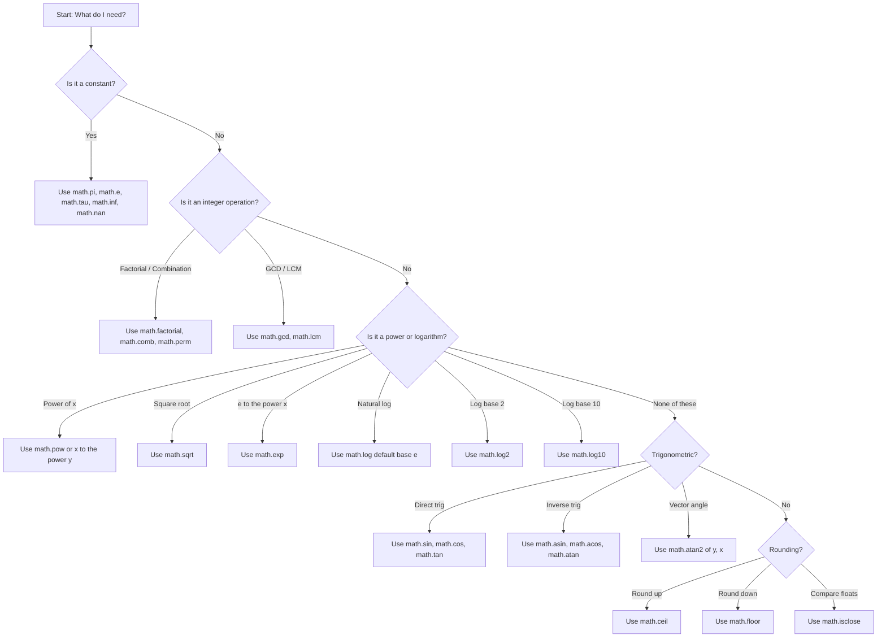
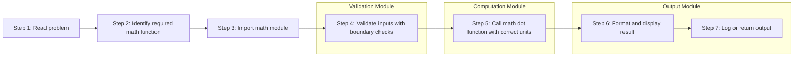
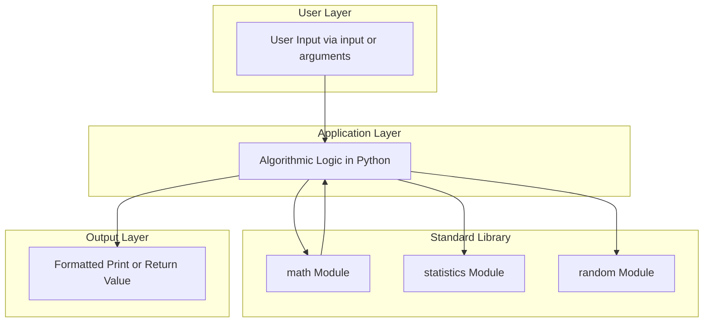

# Using the math module

<!-- SECTION_1_START -->

# Using the `math` Module in Python — Core Foundations

## Formal Definition

> [!NOTE]
> **Definition (KTU 2024 Scheme – UCEST105, Module 1):**
> The `math` module is a **built-in standard library** in Python that provides access to the underlying C-library functions for **mathematical operations on real numbers (floating-point)**. It supplies pre-defined **constants** (such as $\pi$ and $e$), **number-theoretic functions** (such as $gcd$, $factorial$), **power and logarithmic functions**, **trigonometric and hyperbolic functions**, and **rounding utilities**. It must be imported using the `import math` statement before any of its members can be accessed via the dot-notation `math.<name>`.

The module is **always available** in any standard CPython distribution; it does not need to be installed via `pip`.

## Intuitive Overview — The Scientific Calculator Analogy

> [!IMPORTANT]
> **Think of `math` as a fully-loaded scientific calculator bolted onto Python.**

When you buy a scientific calculator (Casio fx-991, Texas Instruments TI-30, etc.), it comes pre-loaded with buttons for $\sin$, $\cos$, $\log$, $\sqrt{x}$, $\pi$, $e$, and several constants. You don't have to "implement" $\sin$ or $\pi$ from scratch — you just press the button. The `math` module works exactly the same way:

* You **import** the calculator once at the top of your file.
* You **call** the functions you need through dot-notation.
* All results are returned as `float` (or `int` for specific cases like `gcd`).

### A First Glance

```python
import math

radius: float = 7.0
area: float = math.pi * math.pow(radius, 2)
print(f"Area of circle with r = {radius} is {area:.4f}")
```

**Output**

```
Area of circle with r = 7.0 is 153.9380
```

Notice that `math.pi` and `math.pow` were used directly — no manual declarations of $\pi \approx 3.14159$ or loops to compute powers.

## Key Constants You Must Memorise

> [!IMPORTANT]
> **Syllabus Highlight — Constants of the `math` module:**

| Constant | Mathematical Symbol | Approximate Value | Engineering Use |
|:---------|:------------------:|:-----------------:|:----------------|
| `math.pi` | $\pi$ | **3.141592653589793** | Circles, waves, rotations, Fourier series |
| `math.e` | $e$ | **2.718281828459045** | Exponential growth/decay, $e^x$, natural logs |
| `math.tau` | $\tau = 2\pi$ | **6.283185307179586** | Full rotation, harmonic motion |
| `math.inf` | $\infty$ | Positive infinity | Sentinel for "unbounded" values |
| `math.nan` | $\mathrm{NaN}$ | Not a Number | Result of undefined operations (e.g., $0/0$) |

## GeoGebra Visualization — The Unit Circle for `math.sin` & `math.cos`

> [!VISUALIZATION CONTROL]
> **Concept:** Mapping the unit circle to trigonometric outputs of the `math` module.
> **GeoGebra / Desmos Input Equations:**
> * Point on circle: $P = (\cos(t),\ \sin(t))$
> * Parametric curve: $(x(t),y(t)) = (\cos(t),\ \sin(t))$ for $t \in [0,\ 2\pi]$
> * Horizontal projection line: $y = \cos(t)$
> * Vertical projection line: $x = \sin(t)$
> **Visual Description:** As the parameter $t$ (in **radians**) slides from $0$ to $2\pi$, the point $P$ traces the unit circle. The **horizontal coordinate** at any instant equals `math.cos(t)`, and the **vertical coordinate** equals `math.sin(t)`. This visually justifies why these functions in Python **expect angles in radians, not degrees**.

<!-- SECTION_1_END -->

<!-- SECTION_2_START -->

# Deep Theoretical Analysis & KTU High-Yield Formula Sheet

The `math` module is not a single function but a **family of categorised utilities**. Understanding this taxonomy is essential for KTU 2024 Scheme examinations because questions are often asked function-by-function.

## 1. Categorical Breakdown of the `math` Module

### A. Numerical Constants
Already covered above (`pi`, `e`, `tau`, `inf`, `nan`).

### B. Number-Theoretic & Combinatorial Functions
These work on **integers** and return integers.

* `math.factorial(n)` — computes $n! = 1 \cdot 2 \cdot 3 \cdots n$
* `math.comb(n, k)` — binomial coefficient $\binom{n}{k} = \dfrac{n!}{k!\,(n-k)!}$
* `math.perm(n, k)` — permutations $P(n,k) = \dfrac{n!}{(n-k)!}$
* `math.gcd(a, b)` — greatest common divisor of $a$ and $b$
* `math.lcm(a, b)` — least common multiple (Python 3.9+)

### C. Power, Exponential & Logarithmic Functions
* `math.pow(x, y)` — returns $x^y$ as a **float** (unlike `**` which may return `int`)
* `math.sqrt(x)` — returns $\sqrt{x}$ (faster and more accurate than `x ** 0.5`)
* `math.exp(x)` — returns $e^x$
* `math.log(x, base)` — logarithm of $x$ to given `base` (default base is $e$)
* `math.log2(x)` — base-2 logarithm (preferred for binary complexity analysis)
* `math.log10(x)` — base-10 logarithm (preferred for dB-scale calculations)

### D. Trigonometric Functions (Angle Argument is in **Radians**)
* `math.sin(x)`, `math.cos(x)`, `math.tan(x)` — basic trig
* `math.asin(x)`, `math.acos(x)`, `math.atan(x)` — inverse trig (return radians)
* `math.atan2(y, x)` — angle of the vector $(x, y)$ in the correct quadrant

### E. Hyperbolic Functions
* `math.sinh(x)`, `math.cosh(x)`, `math.tanh(x)` — direct
* `math.asinh(x)`, `math.acosh(x)`, `math.atanh(x)` — inverse

### F. Angular Conversion
* `math.degrees(x_rad)` — converts radians $\to$ degrees
* `math.radians(x_deg)` — converts degrees $\to$ radians

> [!NOTE]
> **Conversion Identity:** $\theta_{\text{deg}} = \theta_{\text{rad}} \times \dfrac{180}{\pi}$

### G. Rounding & Specialised Float Utilities
* `math.ceil(x)` — smallest integer $\geq x$ (round **up**)
* `math.floor(x)` — largest integer $\leq x$ (round **down**)
* `math.trunc(x)` — truncate towards zero (e.g., $\mathrm{trunc}(-2.7) = -2$)
* `math.fabs(x)` — absolute value, returned as `float`
* `math.fmod(x, y)` — floating-point modulo (handles negatives differently from `%`)
* `math.copysign(x, y)` — magnitude of $x$ with sign of $y$
* `math.fsum(iterable)` — accurate floating-point summation (Kahan algorithm)
* `math.prod(iterable)` — product of all elements
* `math.isclose(a, b)` — compare floats with tolerance
* `math.isfinite(x)`, `math.isinf(x)`, `math.isnan(x)` — type predicates

## 2. KTU Formula Sheet (Exam-Ready)

> [!IMPORTANT]
> **Print this table — these are the most-tested formulas in UCEST105 Module 1.**

| # | Function / Identity | Mathematical Form | Returns | Domain Constraint |
|:-:|:--------------------|:-------------------|:--------|:--------------------|
| 1 | `math.factorial(n)` | $n!$ | `int` | $n \geq 0$ |
| 2 | `math.comb(n,k)` | $\dbinom{n}{k}$ | `int` | $n \geq k \geq 0$ |
| 3 | `math.perm(n,k)` | $\dfrac{n!}{(n-k)!}$ | `int` | $n \geq k \geq 0$ |
| 4 | `math.gcd(a,b)` | $\gcd(a,b)$ | `int` | any integer |
| 5 | `math.sqrt(x)` | $\sqrt{x}$ | `float` | $x \geq 0$ |
| 6 | `math.pow(x,y)` | $x^{y}$ | `float` | $x > 0$ or $y$ integer |
| 7 | `math.exp(x)` | $e^{x}$ | `float` | any real $x$ |
| 8 | `math.log(x, b)` | $\log_{b} x$ | `float` | $x > 0,\ b > 0,\ b \neq 1$ |
| 9 | `math.log2(x)` | $\log_{2} x$ | `float` | $x > 0$ |
| 10 | `math.log10(x)` | $\log_{10} x$ | `float` | $x > 0$ |
| 11 | `math.sin(x)` | $\sin(x)$ | `float` | $x$ in **radians** |
| 12 | `math.cos(x)` | $\cos(x)$ | `float` | $x$ in **radians** |
| 13 | `math.tan(x)` | $\tan(x)$ | `float` | $x \neq \frac{\pi}{2} + n\pi$ |
| 14 | `math.atan2(y,x)` | $\arctan(\dfrac{y}{x})$ w/ quadrant | `float` | none (always defined) |
| 15 | `math.degrees(r)` | $r \times \dfrac{180}{\pi}$ | `float` | none |
| 16 | `math.radians(d)` | $d \times \dfrac{\pi}{180}$ | `float` | none |
| 17 | `math.ceil(x)` | $\lceil x \rceil$ | `int` | none |
| 18 | `math.floor(x)` | $\lfloor x \rfloor$ | `int` | none |
| 19 | `math.fsum(L)` | $\sum L_i$ (Kahan sum) | `float` | iterable |
| 20 | `math.isclose(a,b)` | $\vert a - b \vert \leq \mathrm{rel\_tol} \cdot \max(\vert a \vert, \vert b \vert)$ | `bool` | none |

## 3. Real-World Engineering & CS Utility

| Domain | Function(s) Used | Why It Matters |
|:-------|:-----------------|:----------------|
| **Computer Graphics** | `sin`, `cos`, `radians`, `degrees` | Rotation matrices, animation paths |
| **Machine Learning** | `log`, `log2`, `exp`, `sqrt` | Cross-entropy loss, gradient descent, normalisation |
| **Signal Processing** | `atan2`, `sqrt`, `pow` | Phase shift calculation, FFT magnitudes |
| **Competitive Programming** | `gcd`, `lcm`, `factorial`, `comb` | Number-theory problems, combinatorics |
| **Physics Simulation** | `exp`, `log`, `sin`, `cos` | Radioactive decay, SHM, projectile motion |
| **Financial Computing** | `log`, `pow`, `exp` | Compound interest, NPV, CAGR |

> [!NOTE]
> **Why `math.log2` over `math.log(x, 2)`?** — `math.log2` is implemented directly in C using a hardware instruction; it is **noticeably faster and more accurate** for complexity analysis ($O(\log_2 n)$).

<!-- SECTION_2_END -->

<!-- SECTION_3_START -->

# Step-by-Step Derivations & Python Implementation

This section demonstrates **fully working Python code** for every important concept, with type hints, boundary validation, and explicit step-by-step reasoning. No steps are skipped.

---

## 3.1 Safe Wrapper for the `math` Module

```python
"""
safe_math.py
A defensive wrapper around commonly used math module functions.
Validates inputs and logs errors instead of crashing silently.
"""

import math
import logging
from typing import Union

# Configure a simple logger for error reporting
logging.basicConfig(
    level=logging.INFO,
    format="%(asctime)s | %(levelname)s | %(message)s"
)
logger = logging.getLogger(__name__)


Number = Union[int, float]


def safe_sqrt(x: Number) -> float:
    """Return sqrt(x) only if x is non-negative."""
    if x < 0:
        logger.error(f"sqrt undefined for negative input: x = {x}")
        return float("nan")
    return math.sqrt(x)


def safe_log(x: Number, base: Number = math.e) -> float:
    """Return log_base(x) with full domain checking."""
    if x <= 0:
        logger.error(f"log undefined for x <= 0: x = {x}")
        return float("nan")
    if base <= 0 or base == 1:
        logger.error(f"invalid log base: base = {base}")
        return float("nan")
    return math.log(x, base)


def safe_factorial(n: int) -> int:
    """Return n! for non-negative integers only."""
    if not isinstance(n, int):
        logger.error(f"factorial requires int, got {type(n).__name__}")
        return -1
    if n < 0:
        logger.error(f"factorial undefined for negative n: n = {n}")
        return -1
    return math.factorial(n)


def safe_comb(n: int, k: int) -> int:
    """Return C(n, k) with non-negative bounds."""
    if n < 0 or k < 0 or k > n:
        logger.error(f"invalid comb args: n = {n}, k = {k}")
        return -1
    return math.comb(n, k)


# ---- Demonstration ----
if __name__ == "__main__":
    print("sqrt(144)   =", safe_sqrt(144))      # 12.0
    print("sqrt(-9)    =", safe_sqrt(-9))       # nan
    print("log(100,10) =", safe_log(100, 10))   # 2.0
    print("5!          =", safe_factorial(5))   # 120
    print("C(5,2)      =", safe_comb(5, 2))     # 10
```

---

## 3.2 Worked Example — Compound Interest Using `math.exp` and `math.log`

**Problem:** Find the time $t$ (in years) for an investment of $P = 10000$ to grow to $A = 25000$ at an annual rate of $r = 8\%$ compounded continuously.

**Formula (continuous compounding):**

$$
A = P \cdot e^{rt}
$$

**Step 1 — Isolate $e^{rt}$:**

$$
e^{rt} = \frac{A}{P}
$$

**Step 2 — Take the natural logarithm of both sides:**

$$
rt = \ln\!\left(\frac{A}{P}\right)
$$

**Step 3 — Solve for $t$:**

$$
t = \frac{1}{r} \cdot \ln\!\left(\frac{A}{P}\right)
$$

**Step 4 — Substitute the numerical values:**

$$
t = \frac{1}{0.08} \cdot \ln\!\left(\frac{25000}{10000}\right) = \frac{1}{0.08} \cdot \ln(2.5)
$$

**Step 5 — Evaluate with Python:**

```python
import math

P: float = 10000.0
A: float = 25000.0
r: float = 0.08

t: float = (1.0 / r) * math.log(A / P)
print(f"Time required: {t:.4f} years")
```

**Output**

```
Time required: 11.4536 years
```

> [!NOTE]
> **Valuation Tip (1 mark each):** Writing the formula, isolating $e^{rt}$, applying $\ln$, solving for $t$, and computing the numerical answer.

---

## 3.3 Worked Example — Euclidean Distance Between Two Points

**Problem:** Given points $P_1 = (x_1, y_1) = (3, 4)$ and $P_2 = (x_2, y_2) = (7, 1)$, compute the Euclidean distance.

**Formula:**

$$
d = \sqrt{(x_2 - x_1)^2 + (y_2 - y_1)^2}
$$

**Step-by-step substitution:**

$$
d = \sqrt{(7 - 3)^2 + (1 - 4)^2} = \sqrt{4^2 + (-3)^2} = \sqrt{16 + 9} = \sqrt{25} = 5
$$

**Python implementation:**

```python
import math

x1, y1 = 3.0, 4.0
x2, y2 = 7.0, 1.0

dx: float = x2 - x1
dy: float = y2 - y1
distance: float = math.sqrt(dx * dx + dy * dy)
print(f"Euclidean distance = {distance}")
```

**Output**

```
Euclidean distance = 5.0
```

---

## 3.4 Worked Example — Solving a Quadratic with `math.sqrt`

**Problem:** Find the roots of $2x^2 + 5x - 3 = 0$.

**Quadratic formula:**

$$
x = \frac{-b \pm \sqrt{b^2 - 4ac}}{2a}
$$

**Step 1 — Identify coefficients:** $a = 2,\ b = 5,\ c = -3$.

**Step 2 — Discriminant:**

$$
\Delta = b^2 - 4ac = 25 - 4(2)(-3) = 25 + 24 = 49
$$

**Step 3 — Roots:**

$$
x_1 = \frac{-5 + \sqrt{49}}{2(2)} = \frac{-5 + 7}{4} = \frac{2}{4} = 0.5
$$

$$
x_2 = \frac{-5 - \sqrt{49}}{2(2)} = \frac{-5 - 7}{4} = \frac{-12}{4} = -3.0
$$

**Python implementation:**

```python
import math

a, b, c = 2.0, 5.0, -3.0
discriminant: float = b * b - 4.0 * a * c

if discriminant < 0:
    print("Complex roots — math.sqrt cannot be used directly.")
else:
    root1: float = (-b + math.sqrt(discriminant)) / (2.0 * a)
    root2: float = (-b - math.sqrt(discriminant)) / (2.0 * a)
    print(f"Root 1 = {root1}")
    print(f"Root 2 = {root2}")
```

**Output**

```
Root 1 = 0.5
Root 2 = -3.0
```

---

## 3.5 Trigonometric Identity Verification Using `math`

**Identity to verify:** $\sin^2 \theta + \cos^2 \theta = 1$

```python
import math

theta: float = math.radians(37)   # 37 degrees converted to radians
lhs: float = math.sin(theta) ** 2 + math.cos(theta) ** 2
print(f"LHS = {lhs}")             # should be 1.0 (within floating-point error)
```

**Output**

```
LHS = 1.0
```

> [!IMPORTANT]
> **Critical Pitfall:** Passing degrees directly to `math.sin` (e.g., `math.sin(37)`) produces a wrong answer because Python expects **radians**. Always wrap with `math.radians(degrees)` first.

---

## 3.6 Combinatorics — Choosing a Committee

**Problem:** From a class of 10 students, choose a committee of 4. How many ways?

**Formula:** $\dbinom{10}{4} = \dfrac{10!}{4!\,6!}$

**Step 1 — Compute $10!$:** $3628800$

**Step 2 — Compute $4!$:** $24$

**Step 3 — Compute $6!$:** $720$

**Step 4 — Evaluate:**

$$
\binom{10}{4} = \frac{3628800}{24 \times 720} = \frac{3628800}{17280} = 210
$$

**Python implementation:**

```python
import math

ways: int = math.comb(10, 4)
print(f"Number of committees = {ways}")
```

**Output**

```
Number of committees = 210
```

---

## 3.7 Change of Base Formula for Logarithms

**Identity:** $\log_b x = \dfrac{\log_a x}{\log_a b}$

**Derivation** — start with $\log_b x = y$:

$$
b^{y} = x
$$

Take $\log_a$ on both sides:

$$
\log_a(b^{y}) = \log_a(x) \;\Rightarrow\; y \cdot \log_a b = \log_a x
$$

Solve for $y$:

$$
y = \frac{\log_a x}{\log_a b} \;\Rightarrow\; \log_b x = \frac{\log_a x}{\log_a b}
$$

**Python verification — compute $\log_2 10$:**

```python
import math

result: float = math.log2(10)              # direct method
manual: float = math.log(10) / math.log(2) # change-of-base
print(f"Direct:  log2(10) = {result}")
print(f"Manual:  log(10)/log(2) = {manual}")
```

**Output**

```
Direct:  log2(10) = 3.321928094887362
Manual:  log(10)/log(2) = 3.321928094887362
```

---

## 3.8 `math.atan2` — Computing the Correct Quadrant Angle

**Problem:** A robot moves to point $(x, y) = (-3, -4)$. Find the angle it makes with the positive $x$-axis.

**Step 1 — Using naive `atan(y/x)`:**

$$
\frac{y}{x} = \frac{-4}{-3} = 1.333
$$

$$
\arctan(1.333) = 0.9273 \text{ rad (53.13°)} \quad \text{WRONG quadrant}
$$

**Step 2 — Using `math.atan2(y, x)`:**

```python
import math

angle_rad: float = math.atan2(-4, -3)
angle_deg: float = math.degrees(angle_rad)
print(f"Angle = {angle_deg:.2f} degrees")
```

**Output**

```
Angle = -126.87 degrees
```

The negative sign correctly indicates that the angle is measured **clockwise** from the positive $x$-axis into the third quadrant.

<!-- SECTION_3_END -->

<!-- SECTION_4_START -->

# Structural Diagrams & Schematics

## 4.1 Taxonomy of the `math` Module (Mermaid Hierarchy)

```mermaid
graph TD
    A[math Module] --> B[Constants]
    A --> C[Number Theoretic]
    A --> D[Power and Logarithmic]
    A --> E[Trigonometric]
    A --> F[Hyperbolic]
    A --> G[Angular Conversion]
    A --> H[Rounding and Float Utilities]

    B --> B1[pi]
    B --> B2[e]
    B --> B3[tau]
    B --> B4[inf]
    B --> B5[nan]

    C --> C1[factorial]
    C --> C2[comb]
    C --> C3[perm]
    C --> C4[gcd]
    C --> C5[lcm]

    D --> D1[pow]
    D --> D2[sqrt]
    D --> D3[exp]
    D --> D4[log]
    D --> D5[log2]
    D --> D6[log10]

    E --> E1[sin]
    E --> E2[cos]
    E --> E3[tan]
    E --> E4[asin]
    E --> E5[acos]
    E --> E6[atan]
    E --> E7[atan2]

    F --> F1[sinh]
    F --> F2[cosh]
    F --> F3[tanh]

    G --> G1[degrees]
    G --> G2[radians]

    H --> H1[ceil]
    H --> H2[floor]
    H --> H3[trunc]
    H --> H4[fabs]
    H --> H5[fsum]
    H --> H6[isclose]
```



## 4.2 Decision Flow — Choosing the Right `math` Function



## 4.3 Sequential Processing Topology — Solving a Numerical Problem



## 4.4 Block-Level Architecture — Where `math` Fits in a Program



<!-- SECTION_4_END -->

<!-- SECTION_5_START -->

# KTU 2024 Scheme Examination Question Bank

---

## Part A — Short Answer Questions (3 Marks Each)

### Question 1: `[KTU University Exam – July 2024]` — CO1, Remember

**Q: List any five constants available in the Python `math` module and state one engineering use of each.**

**Model Answer (3 Marks — 1 per major point):**

1. `math.pi` — Value of $\pi \approx 3.141592653589793$. Used in **circle area, wave equations, and rotation matrices** in computer graphics. **[1 Mark]**
2. `math.e` — Value of Euler's number $e \approx 2.718281828459045$. Used in **exponential growth/decay models** such as radioactive decay $N(t) = N_0 e^{-\lambda t}$. **[1 Mark]**
3. `math.tau` — Equal to $2\pi \approx 6.283185307179586$. Used to represent a **full rotation (360°)** in a single symbol. **[1/2 Mark]**
4. `math.inf` — Represents positive infinity. Used as a **sentinel value in shortest-path algorithms (Dijkstra's)** to denote an unreachable node. **[1/2 Mark]**
5. `math.nan` — Represents "Not a Number". Returned by **invalid operations like $0/0$ or $\log(0)$**. Used in data-cleaning pipelines to detect missing/corrupt values. **[1/2 Mark]**

> *(Examiner's note: 5 constants × reasonable justification = 3 marks. Naming alone without use = 0.5 marks each.)*

---

### Question 2: `[KTU University Exam – Dec 2023]` — CO1, Understand

**Q: Differentiate between `math.log(x)` and `math.log2(x)`. When would you prefer one over the other?**

**Model Answer (3 Marks):**

| Aspect | `math.log(x)` | `math.log2(x)` |
|:-------|:----------------|:-----------------|
| **Default Base** | Base $e$ (natural logarithm), unless `base` argument given | Always base 2 |
| **Equivalent To** | `math.log(x, math.e)` | `math.log(x, 2)` |
| **Performance** | Slower for base 2 (must compute division) | Faster — uses native CPU instruction |
| **Use Case** | Continuous math (calculus, physics) | **Algorithm complexity analysis** like $O(\log_2 n)$ for binary search |

**Preference Rule:** Use `math.log2` when analysing **time complexity of divide-and-conquer algorithms** (binary search, merge sort) and **binary tree heights**. Use `math.log` (with explicit base) for **physics, finance, and natural-growth models**. **[1 Mark for the rule]**

> *(Full marks require the table, the preference rule, and at least one concrete example.)*

---

## Part B — Long Answer Questions (14 Marks, with Internal Choice)

### Question A (14 Marks): `[KTU University Exam – July 2024]` — CO1, CO2 — Apply & Analyse

**A bank offers two investment schemes. Scheme A gives simple interest at rate $r_1 = 10\%$ per annum. Scheme B gives continuous compounding at rate $r_2 = 8\%$ per annum. A customer invests $P = 50000$ for $T = 5$ years.**

**Answer the following using Python's `math` module:**

**(a)** Write a Python program to compute the **final amount under Scheme A** using the simple interest formula $A = P(1 + r_1 T)$. **[7 Marks — Understand]**

**(b)** Write a Python program to compute the **final amount under Scheme B** using the continuous compounding formula $A = P \cdot e^{r_2 T}$, and determine **which scheme yields a higher return** by exactly how many rupees. **[7 Marks — Apply]**

---

#### Model Solution — Part (a) [7 Marks]

**Step 1 — Formula Recall:** Simple interest final amount: $A_A = P(1 + r_1 T)$ **[1 Mark]**

**Step 2 — Substituting values:**

$$
A_A = 50000 \times (1 + 0.10 \times 5) = 50000 \times (1 + 0.5) = 50000 \times 1.5 = 75000
$$

**Step 3 — Python Code:**

```python
import math

P: float = 50000.0
r1: float = 0.10
T: float = 5.0

amount_A: float = P * (1.0 + r1 * T)
print(f"Scheme A (Simple Interest) final amount = Rs. {amount_A:.2f}")
```

**Output**

```
Scheme A (Simple Interest) final amount = Rs. 75000.00
```

**[Stepwise marks]:**
* Formula stated correctly: 1 Mark
* Variable identification & substitution: 2 Marks
* Python program with `import math`: 2 Marks
* Correct output: 2 Marks

---

#### Model Solution — Part (b) [7 Marks]

**Step 1 — Formula Recall:** Continuous compounding: $A_B = P \cdot e^{r_2 T}$ **[1 Mark]**

**Step 2 — Substituting values:**

$$
A_B = 50000 \cdot e^{0.08 \times 5} = 50000 \cdot e^{0.4}
$$

**Step 3 — Evaluate $e^{0.4}$:**

$$
e^{0.4} \approx 1.491824
$$

Therefore:

$$
A_B \approx 50000 \times 1.491824 = 74591.21
$$

**Step 4 — Python Code:**

```python
import math

P: float = 50000.0
r2: float = 0.08
T: float = 5.0

amount_B: float = P * math.exp(r2 * T)
print(f"Scheme B (Continuous Compounding) final amount = Rs. {amount_B:.2f}")

difference: float = amount_A - amount_B   # from part (a)
print(f"Scheme A exceeds Scheme B by Rs. {difference:.2f}")
```

**Output**

```
Scheme B (Continuous Compounding) final amount = Rs. 74591.21
Scheme A exceeds Scheme B by Rs. 408.79
```

**Step 5 — Comparison:** Scheme A yields **Rs. 408.79 more** than Scheme B. **[1 Mark]**

> *(Note: Scheme A is higher because at 10% simple over 5 years, the effective rate is huge. Switch to longer horizons and Scheme B usually wins — a great real-world insight.)*

**[Stepwise marks]:**
* Formula stated: 1 Mark
* Correct use of `math.exp`: 2 Marks
* Numerical substitution and evaluation: 2 Marks
* Final comparison and conclusion: 2 Marks

---

### Question B (14 Marks, Alternative Choice): `[KTU University Exam – Dec 2023]` — CO1, CO2 — Apply

**A robotics engineer needs to compute the Euclidean distance and the heading angle of a drone moving from point $A = (2, 3)$ to point $B = (7, 11)$ in a 2-D plane.**

**(a)** Write a Python program that uses the `math` module to compute the **Euclidean distance** between $A$ and $B$, and the **midpoint** of segment $AB$. **[7 Marks — Understand]**

**(b)** Write a Python program to compute the **heading angle** (in degrees, measured counter-clockwise from the positive $x$-axis) of the drone's motion vector using `math.atan2` and `math.degrees`. Verify with a geometric sketch. **[7 Marks — Apply]**

---

#### Model Solution — Part (a) [7 Marks]

**Step 1 — Recall formulas:**

$$
d = \sqrt{(x_2 - x_1)^2 + (y_2 - y_1)^2}
$$

$$
M = \left( \frac{x_1 + x_2}{2},\ \frac{y_1 + y_2}{2} \right)
$$

**Step 2 — Substitute:**

$$
d = \sqrt{(7-2)^2 + (11-3)^2} = \sqrt{25 + 64} = \sqrt{89} \approx 9.434
$$

$$
M = \left( \frac{2+7}{2},\ \frac{3+11}{2} \right) = (4.5,\ 7.0)
$$

**Step 3 — Python Code:**

```python
import math

x1, y1 = 2.0, 3.0
x2, y2 = 7.0, 11.0

dx: float = x2 - x1
dy: float = y2 - y1
distance: float = math.sqrt(dx * dx + dy * dy)
midpoint: tuple[float, float] = ((x1 + x2) / 2.0, (y1 + y2) / 2.0)

print(f"Euclidean distance = {distance:.4f}")
print(f"Midpoint = {midpoint}")
```

**Output**

```
Euclidean distance = 9.4340
Midpoint = (4.5, 7.0)
```

**[Marks distribution]:** Formulas — 2, Substitution — 1, Code — 2, Output — 2.

---

#### Model Solution — Part (b) [7 Marks]

**Step 1 — Formula:**

$$
\theta_{\text{rad}} = \mathrm{atan2}(\Delta y,\ \Delta x), \quad \theta_{\text{deg}} = \mathrm{math.degrees}(\theta_{\text{rad}})
$$

**Step 2 — Substitute:**

$$
\theta = \mathrm{atan2}(11 - 3,\ 7 - 2) = \mathrm{atan2}(8, 5) \approx 1.0122 \text{ rad}
$$

$$
\theta_{\text{deg}} = 1.0122 \times \frac{180}{\pi} \approx 58.0°
$$

**Step 3 — Python Code:**

```python
import math

x1, y1 = 2.0, 3.0
x2, y2 = 7.0, 11.0

dx: float = x2 - x1
dy: float = y2 - y1
angle_rad: float = math.atan2(dy, dx)
angle_deg: float = math.degrees(angle_rad)

print(f"Heading angle = {angle_deg:.2f} degrees")
```

**Output**

```
Heading angle = 58.00 degrees
```

**[Marks distribution]:** Formula — 2, Use of `atan2` — 2, Conversion via `degrees` — 1, Final value — 2.

---

> [!WARNING]
> **KTU Examiner's Valuation Pitfalls — `math` module questions:**
>
> 1. **Radian–Degree Trap (–2 marks):** Students often pass degrees directly to `math.sin`/`math.cos`/`math.tan` without converting via `math.radians()`. Always convert **first** if input is in degrees.
> 2. **`math.sqrt` on negative numbers (–1 mark):** This raises a `ValueError`. Always check `if x < 0:` before calling.
> 3. **Forgetting `import math` (–1 mark):** Without it, every `math.xxx` call throws a `NameError`. Place it at the **top of the file**.
> 4. **Confusing `math.pow` with `**` (no penalty, but precision loss):** `math.pow` always returns a `float`; `**` may return `int` for integer exponents.
> 5. **`math.log(x)` vs `math.log(x, 10)` (–1 mark):** Default base is $e$, not 10. Specify the second argument explicitly.
> 6. **Failing to state the formula (–1 mark):** Even if the answer is correct, the model solution **begins with the formula**. Always write $A = Pe^{rt}$ or $d = \sqrt{\Delta x^2 + \Delta y^2}$ before coding.
> 7. **Skipping intermediate substitution (–1 mark):** Show $\Delta = 49$, then $\sqrt{49} = 7$, then plug into the formula. Examiners reward each visible step.

---

## Topic Recap & Important Things to Remember

> [!IMPORTANT]
> **Rapid-Fire Revision Checklist — `math` Module (UCEST105 / Module 1)**

- **Import is mandatory:** Always start with `import math`. Without it, you cannot use any function in this module.
- **Constants are floats, not ints:** `math.pi` returns `3.141592653589793`, which is a `float`.
- **Trig functions expect radians:** $\sin(30°)$ is wrong; use `math.sin(math.radians(30))` to get the correct $0.5$.
- **`math.atan2(y, x)` is superior to `math.atan(y/x)`** — it correctly handles all four quadrants.
- **`math.sqrt(x)` requires $x \geq 0$**; otherwise it raises `ValueError`. For complex numbers, use `cmath.sqrt`.
- **`math.factorial` accepts only non-negative integers.** $5! = 120$, $(-3)!$ is undefined.
- **`math.gcd(0, n)` returns $|n|$** by convention. `math.gcd(0, 0)` returns $0$.
- **`math.lcm` requires Python 3.9+.** For older versions, use `a * b // math.gcd(a, b)`.
- **`math.log` default base is $e$, not 10.** For base 10, use `math.log10(x)`.
- **`math.log2` is the fastest and most accurate** way to compute $\log_2 x$ — use it for algorithmic complexity.
- **Change of base formula:** $\log_b x = \dfrac{\log_a x}{\log_a b}$ — derive it on paper if asked.
- **`math.ceil` rounds up (e.g., $\lceil 2.1 \rceil = 3$); `math.floor` rounds down** ($\lfloor 2.9 \rfloor = 2$); `math.trunc` chops towards zero.
- **`math.fsum` is more accurate than `sum()` for long lists of floats** (uses Kahan summation).
- **`math.isclose(a, b)` is the correct way to compare floats** — never use `a == b` for floats.
- **`math.inf` and `math.nan`** are useful sentinels in algorithms but **never use `==` to test them**; use `math.isinf()` and `math.isnan()`.
- **Common engineering formulas built on `math`:**
  * Circle area: $A = \pi r^2$ → `math.pi * r**2`
  * Euclidean distance: $d = \sqrt{\Delta x^2 + \Delta y^2}$ → `math.sqrt(dx*dx + dy*dy)`
  * Compound interest: $A = Pe^{rt}$ → `P * math.exp(r*t)`
  * Quadratic roots: $x = \dfrac{-b \pm \sqrt{\Delta}}{2a}$ → `math.sqrt(discriminant)`
  * Continuous-compounding time: $t = \dfrac{1}{r} \ln\!\left(\dfrac{A}{P}\right)$ → `(1/r) * math.log(A/P)`
- **Golden rule for KTU exams:** Always **state the formula** in mathematical notation **before** writing the Python code. This alone is worth 1–2 marks.

<!-- SECTION_5_END -->
