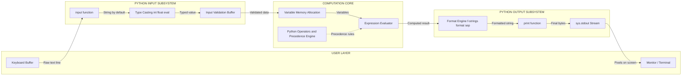
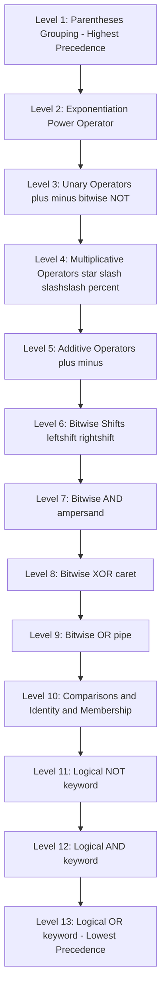
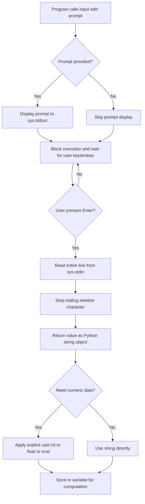
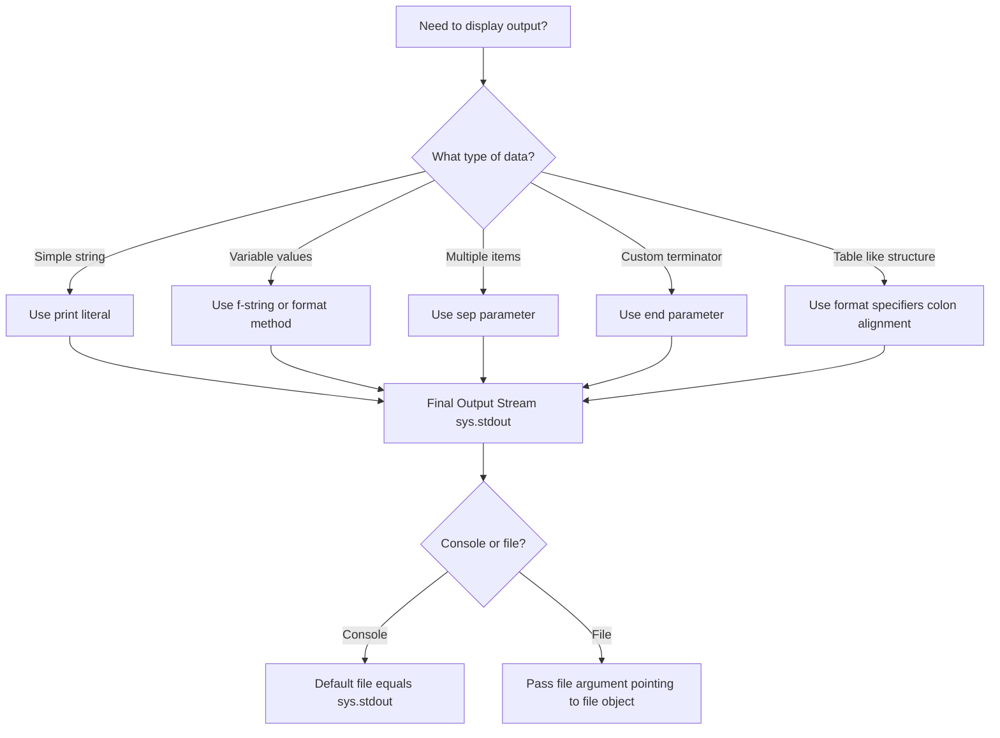
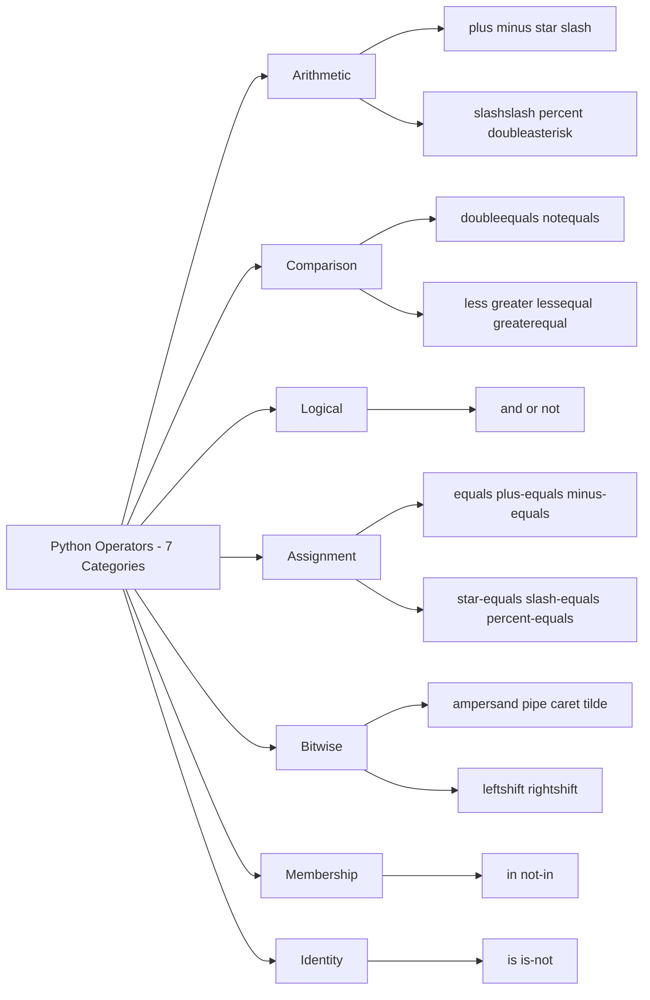

# Using the Python Standard Library for handling basic I/O - print, input, Python operators and their precedence.

<!-- SECTION_1_START -->
# 🐍 Module 1: Problem Solving Strategies & Python I/O Fundamentals

## 1.1 The Python Standard Library — A Conceptual Foundation

> [!IMPORTANT]
> **Formal Definition (KTU 2024 Syllabus Aligned):**
> The **Python Standard Library (PSL)** is a vast collection of pre-compiled, built-in modules, functions, and classes that ship with every default Python distribution. For basic I/O, the two most foundational built-in functions are the **`print()`** function (output stream) and the **`input()`** function (input stream), both of which interact with the standard input/output streams `sys.stdin` and `sys.stdout`.

> [!NOTE]
> **Why does KTU start with `print()` and `input()`?**
> Before any algorithm can be implemented (sorting, searching, recursion, dynamic programming), the program must be able to **talk to the user** — accept raw data and present computed results. These two functions form the **Read–Evaluate–Print Loop (REPL)** of every script.

### 🧠 Intuitive Analogy — The Restaurant Kitchen

Imagine a Python program is a **restaurant kitchen**:

| Kitchen Component | Python Equivalent | Function |
|------------------|-------------------|----------|
| Waiter taking the order | **`input()`** | Reads user data from the keyboard buffer |
| Chef cooking | **Variables / Expressions** | Performs computation using operators |
| Plating & serving | **`print()`** | Displays the result on the console / terminal |
| Recipe book | **Operator Precedence Rules** | Defines the exact order of operations |

Just as a chef must follow the recipe (precedence) to get the dish right, Python evaluates expressions like a mathematician — following a strict **operator precedence hierarchy** (PEMDAS + extras).

### 1.2 The `print()` Function — Sending Data to the Output Stream

The `print()` function outputs text or values to the console. It is one of the first functions any beginner learns, but it has powerful options often overlooked in board exams.

**General Syntax:**
```python
print(object(s), sep=separator, end=end_string, file=output_file, flush=boolean)
```

| Parameter | Default Value | Purpose |
|-----------|---------------|---------|
| `*objects` | (none) | One or more values to print (any Python data type) |
| `sep` | `' '` (single space) | Separator inserted between multiple objects |
| `end` | `'\n'` (newline) | Character appended at the very end of the output |
| `file` | `sys.stdout` | The output stream destination |
| `flush` | `False` | Forces immediate flushing of the output buffer |

> [!VISUALIZATION CONTROL]
> **Concept:** Visualizing the `print()` Output Stream Flow
> **GeoGebra / Desmos Input Equations (Conceptual Flow Coordinates):**
> * `f(x) = x` (Linear flow of data from variables to console)
> * `g(x) = -x + 10` (Separator mapping)
> **Visual Description:** Imagine a horizontal line where data **flows from left (variables) to right (terminal)**, with the `sep` parameter acting as a connector node between each object, and `end` acting as the terminator node at the far right.

### 1.3 The `input()` Function — Reading Data from the User

The `input()` function **pauses program execution** and waits for the user to type something. It **always returns a string** (`str` type), regardless of what the user types.

**General Syntax:**
```python
variable_name = input([prompt_message])
```

> [!WARNING]
> **Common Board Mistake:** A student writes `x = input("Enter a number: ")` and then tries to do `x * 2` expecting `20` if `10` was typed — but the result is `"1010"` (string concatenation). This is the **#1 reason for wrong answers** in KTU practical exams. You **must explicitly cast** the result using `int()`, `float()`, or `eval()`.

### 1.4 Python Operators — The Computational Engine

> [!IMPORTANT]
> **Formal Definition:**
> An **operator** in Python is a special symbol (or reserved keyword) that performs a specific operation on one or more operands and **produces a result**. Python supports **seven broad categories** of operators relevant to algorithmic thinking.

**The 7 Operator Categories in Python:**

1. **Arithmetic Operators** — `+`, `-`, `*`, `/`, `//`, `%`, `**`
2. **Comparison (Relational) Operators** — `==`, `!=`, `<`, `>`, `<=`, `>=`
3. **Logical Operators** — `and`, `or`, `not`
4. **Assignment Operators** — `=`, `+=`, `-=`, `*=`, `/=`, `//=`, `%=`, `**=`
5. **Bitwise Operators** — `&`, `vert\vert`, `^`, `~`, `<<`, `>>`
6. **Membership Operators** — `in`, `not in`
7. **Identity Operators** — `is`, `is not`

> [!NOTE]
> **Why Operator Precedence Matters:**
> Consider the expression `2 + 3 * 4`. A naive evaluator might read left-to-right and get `(2+3)*4 = 20`. But Python (like all programming languages) follows **precedence rules**, giving `3 * 4 = 12`, then `2 + 12 = 14`. Getting precedence wrong is a guaranteed loss of marks in KTU ESE.

<!-- SECTION_1_END -->

<!-- SECTION_2_START -->
# 📘 Deep Theoretical Analysis & KTU High-Yield Formula Sheet

## 2.1 The `print()` Function — Complete Parameter Analysis

The `print()` function is **polymorphic** — it can accept any combination of objects: integers, floats, strings, lists, tuples, dictionaries, custom objects, etc. Python internally calls the `__str__()` method of each object to convert it to a string before printing.

### Key Behavioral Rules of `print()`:

1. **Multiple objects are separated by `sep`:** `print("Hi", "KTU")` → `Hi KTU`
2. **Each `print()` ends with `end`:** Default newline `\n` means each call goes to a new line.
3. **Escape sequences are interpreted:** `\n` (newline), `\t` (tab), `\\` (backslash), `\'`, `\"`
4. **Raw strings disable escape sequences:** `r"C:\new\folder"` prints literally.

### 2.2 The `input()` Function — In-Depth Analysis

When `input()` is called:
1. Python writes the **prompt string** (if given) to `sys.stdout` without a trailing newline.
2. The interpreter **blocks** execution and waits for the user to press `Enter`.
3. The input is read as a **single line** (everything until the newline).
4. The trailing newline is **stripped off**.
5. The function **returns a string**. If EOF is reached, it raises `EOFError`.

> [!IMPORTANT]
> **Key Insight for Algorithmic Thinking:**
> The `input().split()` method is the standard idiom in KTU competitive programming to read **multiple space-separated values on a single line** — for example, `a, b, c = map(int, input().split())`.

## 2.3 Arithmetic Operators — Complete Reference

| Operator | Name | Example | Result | Notes |
|----------|------|---------|--------|-------|
| `+` | Addition | `7 + 3` | `10` | Also concatenates strings/lists |
| `-` | Subtraction | `7 - 3` | `4` | |
| `*` | Multiplication | `7 * 3` | `21` | Also repeats sequences: `"ab" * 3` → `"ababab"` |
| `/` | True Division | `7 / 3` | `2.3333...` | **Always returns float** |
| `//` | Floor Division | `7 // 3` | `2` | Rounds **toward negative infinity** |
| `%` | Modulus | `7 % 3` | `1` | Sign follows the **divisor** |
| `**` | Exponentiation | `2 ** 10` | `1024` | Right-associative: `2**3**2` = `2**9` = `512` |

> [!WARNING]
> **Floor Division Trap:** `-7 // 3` gives `-3` (not `-2`). Python floors toward negative infinity. Use `int(-7/3) = -2` if you want truncation toward zero.

## 2.4 Comparison & Logical Operators

| Comparison | Meaning | Example | Result |
|------------|---------|---------|--------|
| `==` | Equal to | `5 == 5.0` | `True` (value comparison) |
| `!=` | Not equal to | `5 != 6` | `True` |
| `>` | Greater than | `5 > 3` | `True` |
| `<` | Less than | `5 < 3` | `False` |
| `>=` | Greater than or equal to | `5 >= 5` | `True` |
| `<=` | Less than or equal to | `5 <= 4` | `False` |

> [!NOTE]
> **Chained Comparisons — A Unique Python Feature:**
> Python allows `0 < x < 10` instead of `0 < x and x < 10`. This is mathematically intuitive and is a frequent KTU question.

| Logical Op | Meaning | Example | Result |
|-----------|---------|---------|--------|
| `and` | Logical AND | `True and False` | `False` |
| `or` | Logical OR | `True or False` | `True` |
| `not` | Logical NOT | `not True` | `False` |

> [!NOTE]
> **Short-Circuit Evaluation:** `and` and `or` **stop evaluating** as soon as the result is determined. In `A and B`, if `A` is `False`, `B` is never evaluated. This is critical for safe operations like `x != 0 and y/x > 2`.

## 2.5 KTU High-Yield Formula Sheet — Operator Precedence Table

> [!IMPORTANT]
> **Memorize this table for the ESE.** From highest to lowest precedence. Operators on the same row have **left-to-right associativity**, except `**` which is **right-to-left**.

| Precedence Level | Operator(s) | Description | Associativity |
|:----------------:|:------------|:------------|:-------------:|
| **1 (Highest)** | `( )` | Parentheses (grouping) | Left-to-Right |
| **2** | `**` | Exponentiation | **Right-to-Left** |
| **3** | `+x`, `-x`, `~x` | Unary plus, minus, bitwise NOT | Right-to-Left |
| **4** | `*`, `/`, `//`, `%` | Multiplication, Division, Floor, Modulus | Left-to-Right |
| **5** | `+`, `-` | Addition, Subtraction | Left-to-Right |
| **6** | `<<`, `>>` | Bitwise shifts | Left-to-Right |
| **7** | `&` | Bitwise AND | Left-to-Right |
| **8** | `^` | Bitwise XOR | Left-to-Right |
| **9** | `\vert` | Bitwise OR | Left-to-Right |
| **10** | `==`, `!=`, `<`, `<=`, `>`, `>=`, `is`, `is not`, `in`, `not in` | Comparisons, Identity, Membership | Left-to-Right |
| **11** | `not` | Logical NOT | Right-to-Left |
| **12** | `and` | Logical AND | Left-to-Right |
| **13 (Lowest)** | `or` | Logical OR | Left-to-Right |

> [!NOTE]
> **Real-World Engineering Utility:** Operator precedence isn't academic — it is used in **embedded systems** (bitmasking with `<<`, `&`, `\vert`), **cryptography** (XOR operations), **graphics engines** (matrix operations), and **database query evaluators** (logical AND/OR parsing). Understanding precedence is the foundation for writing bug-free, production-quality code.

## 2.6 Assignment, Bitwise, Membership, and Identity Operators

### Assignment Operators (Shorthand):
| Operator | Equivalent To | Example |
|:--------:|:------------:|:-------:|
| `x = 5` | Direct assignment | `x = 5` |
| `x += 3` | `x = x + 3` | `x` becomes `8` |
| `x -= 3` | `x = x - 3` | `x` becomes `5` |
| `x *= 3` | `x = x * 3` | `x` becomes `15` |
| `x /= 3` | `x = x / 3` | `x` becomes `5.0` |
| `x //= 3` | `x = x // 3` | `x` becomes `1` |
| `x %= 3` | `x = x % 3` | `x` becomes `2` |
| `x **= 3` | `x = x ** 3` | `x` becomes `125` |

### Bitwise Operators (Essential for Low-Level Programming):
| Operator | Name | Example (`a=12`, `b=10`) | Result |
|:--------:|:----:|:------------------------:|:------:|
| `&` | AND | `12 & 10` (`1100 & 1010`) | `8` (`1000`) |
| `\vert` | OR | `12 \vert 10` (`1100 \vert 1010`) | `14` (`1110`) |
| `^` | XOR | `12 ^ 10` | `6` (`0110`) |
| `~` | NOT | `~12` | `-13` (Two's complement) |
| `<<` | Left shift | `12 << 2` | `48` |
| `>>` | Right shift | `12 >> 2` | `3` |

### Membership & Identity Operators:
| Operator | Example | Meaning |
|:--------:|:-------:|:-------:|
| `in` | `"a" in "apple"` → `True` | Element exists in sequence |
| `not in` | `5 not in [1,2,3]` → `True` | Element does not exist |
| `is` | `x is None` → `True` | Same memory object |
| `is not` | `x is not y` → `True` | Different memory objects |

> [!WARNING]
> **`==` vs `is` — A Classic KTU Trap:** `==` checks **value equality**; `is` checks **identity** (same memory address). For small integers and short strings, Python interns them, so `a is b` may return `True` even when you don't expect it. **Use `==` for value comparison; use `is` only for `None`, `True`, `False`.**

<!-- SECTION_2_END -->

<!-- SECTION_3_START -->
# 💻 Step-by-Step Derivations, Evaluations & Code Implementation

## 3.1 Operator Precedence — Worked-Out Expression Evaluations

### Example 1: A Multi-Operator Expression
Evaluate the following Python expression step-by-step:

$$E = 10 + 3 * 2 ** 2 - 8 / 4 // 2$$

**Step-by-step evaluation (showing precedence):**

**Step 1 — Identify highest precedence: `**` (Exponentiation)**
$$E = 10 + 3 * (2^2) - 8 / 4 // 2$$
$$E = 10 + 3 * 4 - 8 / 4 // 2$$
**[Exponentiation evaluated: 1 Mark]**

**Step 2 — Next precedence: `*`, `/`, `//` (Left-to-Right)**
$$E = 10 + (3 \times 4) - ((8 / 4) // 2)$$
$$E = 10 + 12 - (2.0 // 2)$$
**[Multiplication and Division evaluated: 1 Mark]**

**Step 3 — Floor Division**
$$E = 10 + 12 - 1.0$$
**[Floor Division evaluated: 1 Mark]**

**Step 4 — Lowest precedence: `+`, `-` (Left-to-Right)**
$$E = (10 + 12) - 1.0$$
$$E = 22 - 1.0$$
$$E = 21.0$$
**[Final Addition/Subtraction: 1 Mark]**

**Final Answer:** `21.0` (Note: result is a `float` because of the `/` operator).

---

### Example 2: Logical and Comparison Chaining
Evaluate: `5 > 3 and 10 < 20 or 7 == 7 and not False`

**Step 1 — Evaluate all comparison operators (Precedence Level 10)**
$$5 > 3 \rightarrow \text{True}$$
$$10 < 20 \rightarrow \text{True}$$
$$7 == 7 \rightarrow \text{True}$$

**Step 2 — Evaluate `not` (Precedence Level 11)**
$$\text{not False} \rightarrow \text{True}$$

**Step 3 — Evaluate `and` (Precedence Level 12) — Left-to-Right**
$$\text{True and True} \rightarrow \text{True}$$
$$\text{True and True} \rightarrow \text{True}$$

**Step 4 — Evaluate `or` (Precedence Level 13) — Lowest**
$$\text{True or True} \rightarrow \text{True}$$

**Final Answer:** `True`

---

### Example 3: Modulus and Floor Division — The Divisibility Test
Evaluate: `17 % 5 + 13 // 4 ** 2`

**Step 1 — Exponentiation (Highest)**
$$4^2 = 16$$
$$\Rightarrow 17 \% 5 + 13 \, // \, 16$$

**Step 2 — Modulus and Floor Division (Same level, Left-to-Right)**
$$17 \% 5 = 2 \text{ (remainder of 17 divided by 5)}$$
$$13 \, // \, 16 = 0 \text{ (13 cannot fit even once into 16)}$$

**Step 3 — Addition**
$$2 + 0 = 2$$

**Final Answer:** `2`

---

## 3.2 Production-Grade Python Code Implementations

### 3.2.1 A Robust I/O Handler for KTU Algorithmic Programs

```python
"""
KTU ALGORITHMIC THINKING WITH PYTHON - MODULE 1
A production-grade I/O handler demonstrating print(), input(),
type casting, and formatted output.
"""

import sys
from typing import Optional, Union

class IOHandler:
    """
    A robust I/O wrapper for KTU algorithmic scripts.
    Handles input validation, type conversion, and formatted printing.
    """

    def __init__(self, debug_mode: bool = False) -> None:
        self.debug_mode: bool = debug_mode
        self.transaction_log: list = []

    def safe_int_input(self, prompt: str) -> int:
        """
        Reads an integer from the user with absolute boundary validation.
        Retries indefinitely until a valid integer is entered.
        """
        while True:
            try:
                user_raw: str = input(prompt).strip()
                if not user_raw:
                    raise ValueError("Empty input is not allowed.")
                value: int = int(user_raw)
                self.transaction_log.append((prompt, value, "SUCCESS"))
                return value
            except ValueError as ve:
                print(f"[INPUT ERROR] Invalid integer: '{user_raw}'. Reason: {ve}",
                      file=sys.stderr)
                self.transaction_log.append((prompt, user_raw, "FAILED"))

    def safe_float_input(self, prompt: str) -> float:
        """Reads a float from the user with strict error logging."""
        while True:
            try:
                user_raw: str = input(prompt).strip()
                if not user_raw:
                    raise ValueError("Empty input is not allowed.")
                value: float = float(user_raw)
                self.transaction_log.append((prompt, value, "SUCCESS"))
                return value
            except ValueError as ve:
                print(f"[INPUT ERROR] Invalid float: '{user_raw}'. Reason: {ve}",
                      file=sys.stderr)

    def read_multiple_ints(self, prompt: str, count: int) -> list:
        """
        Reads 'count' space-separated integers in a single line.
        Example input: '10 20 30 40'
        """
        while True:
            try:
                raw_line: str = input(prompt).strip()
                tokens: list = raw_line.split()
                if len(tokens) != count:
                    raise ValueError(
                        f"Expected {count} integers, got {len(tokens)}."
                    )
                values: list = [int(tok) for tok in tokens]
                return values
            except ValueError as ve:
                print(f"[INPUT ERROR] {ve}. Please retry.", file=sys.stderr)

    def formatted_report(self, student_name: str, marks: dict, total: int) -> None:
        """
        Demonstrates f-string formatting, sep, end, and escape sequences.
        """
        print("\n" + "=" * 50)
        print(f"{'KTU STUDENT REPORT CARD':^50}")
        print("=" * 50)
        print(f"Name: {student_name}")
        print("-" * 50)
        print(f"{'Subject':<20}{'Marks':>10}{'Status':>15}")
        print("-" * 50)
        for subject, mark in marks.items():
            status: str = "PASS" if mark >= 40 else "FAIL"
            print(f"{subject:<20}{mark:>10}{status:>15}")
        print("-" * 50)
        print(f"{'TOTAL':<20}{total:>10}")
        print("=" * 50, end="\n\n")

    def print_debug(self, message: str) -> None:
        """Prints only if debug mode is on."""
        if self.debug_mode:
            print(f"[DEBUG] {message}")


def main() -> None:
    """Main driver function demonstrating all I/O concepts."""
    io = IOHandler(debug_mode=True)

    # ---- Demonstration 1: Single Integer Input ----
    print("--- DEMO 1: Single Integer ---")
    age: int = io.safe_int_input("Enter your age: ")
    io.print_debug(f"User entered age = {age}, type = {type(age).__name__}")

    # ---- Demonstration 2: Multiple Space-Separated Inputs ----
    print("\n--- DEMO 2: Three Integers on One Line ---")
    numbers: list = io.read_multiple_ints("Enter three numbers: ", 3)
    a, b, c = numbers[0], numbers[1], numbers[2]
    sum_val: int = a + b + c
    avg_val: float = sum_val / 3
    print(f"Sum = {a} + {b} + {c} = {sum_val}", sep="  ", end="  <-- Computed\n")
    print(f"Average = {avg_val:.2f}")  # .2f formats to 2 decimal places

    # ---- Demonstration 3: Operator Precedence in Action ----
    print("\n--- DEMO 3: Operator Precedence ---")
    result: float = a + b * c ** 2 - a // b
    print(f"a + b * c**2 - a//b = {a} + {b} * {c**2} - {a//b} = {result}")
    io.print_debug(f"Precedence order: ** then *// then +-")

    # ---- Demonstration 4: Formatted Report ----
    print("\n--- DEMO 4: Formatted Report ---")
    marks: dict = {"Mathematics": 85, "Physics": 72, "Programming": 91}
    total: int = sum(marks.values())
    io.formatted_report("Alice KTU", marks, total)


if __name__ == "__main__":
    main()
```

---

### 3.2.2 Operator Precedence Evaluator — Bitwise Operations

```python
"""
Demonstrates bitwise operators and their precedence in Python.
Useful for KTU problems on number systems and embedded logic.
"""

def demonstrate_bitwise_operations() -> None:
    """Runs a comprehensive demo of bitwise operators with precedence."""

    a: int = 60   # Binary: 0011 1100
    b: int = 13   # Binary: 0000 1101

    print("Bitwise Operator Demonstration")
    print("=" * 40)
    print(f"a = {a:>5}  =  {bin(a):>10}  (binary)")
    print(f"b = {b:>5}  =  {bin(b):>10}  (binary)")
    print("-" * 40)

    # --- Precedence-aware evaluations ---
    bitwise_and: int = a & b
    bitwise_or: int = a | b
    bitwise_xor: int = a ^ b
    bitwise_not_a: int = ~a
    left_shift: int = a << 2
    right_shift: int = a >> 2

    print(f"a & b   = {bitwise_and:>5}  =  {bin(bitwise_and):>10}")
    print(f"a | b   = {bitwise_or:>5}  =  {bin(bitwise_or):>10}")
    print(f"a ^ b   = {bitwise_xor:>5}  =  {bin(bitwise_xor):>10}")
    print(f"~a      = {bitwise_not_a:>5}  =  {bin(bitwise_not_a & 0xFF):>10}")
    print(f"a << 2  = {left_shift:>5}  =  {bin(left_shift):>10}")
    print(f"a >> 2  = {right_shift:>5}  =  {bin(right_shift):>10}")

    # --- Combined precedence example ---
    # Expression: a & b << 1 | c
    # Precedence:  <<  >  &  >  |
    # So: (a & (b << 1)) | c
    c: int = 5
    combined: int = a & b << 1 | c
    parenthesized: int = (a & (b << 1)) | c
    print(f"\nCombined: a & b << 1 | c = {combined}")
    print(f"Parenthesized: (a & (b << 1)) | c = {parenthesized}")
    print(f"Both equal: {combined == parenthesized}")


def precedence_quiz() -> None:
    """A small interactive quiz to test operator precedence."""
    test_cases: list = [
        ("2 + 3 * 4", 14),
        ("(2 + 3) * 4", 20),
        ("10 - 2 ** 3", 2),
        ("15 // 4 + 15 % 4", 5),       # 3 + 2 = 5
        ("2 ** 3 ** 2", 512),          # Right-associative: 2**9
        ("5 > 3 and 2 < 1 or 4 == 4", True),
    ]

    print("\n--- PRECEDENCE QUIZ ---")
    print("Try to predict the output!\n")
    for expression, expected in test_cases:
        actual: Union[int, bool] = eval(expression)
        status: str = "✓" if actual == expected else "✗"
        print(f"{status}  {expression:<35} = {actual}  (expected {expected})")


if __name__ == "__main__":
    demonstrate_bitwise_operations()
    precedence_quiz()
```

---

### 3.2.3 Step-by-Step Expression Evaluator (For ESE Answers)

```python
"""
A trace-based evaluator that prints EVERY step of an expression's evaluation.
This is the EXACT format expected in KTU ESE answers for 'evaluate the
expression' type questions.
"""

from typing import List, Tuple

def trace_evaluation(expression: str) -> None:
    """
    Demonstrates step-by-step evaluation with operator precedence annotations.
    Note: This is a conceptual trace; Python's actual bytecode is more complex.
    """
    steps: List[Tuple[str, str]] = [
        ("10 + 3 * 2 ** 2 - 8 / 4 // 2", "Original Expression"),
        ("10 + 3 * (2 ** 2) - 8 / 4 // 2", "Step 1: ** evaluated first (Precedence 2)"),
        ("10 + (3 * 4) - 8 / 4 // 2",      "Step 2: * evaluated (Precedence 4)"),
        ("10 + 12 - (8 / 4) // 2",        "Step 3: / evaluated (Precedence 4, L-to-R)"),
        ("10 + 12 - 2.0 // 2",            "Step 4: 8/4 = 2.0 (float)"),
        ("10 + 12 - (2.0 // 2)",          "Step 5: // evaluated (Precedence 4)"),
        ("10 + 12 - 1.0",                 "Step 6: 2.0 // 2 = 1.0 (floor)"),
        ("(10 + 12) - 1.0",               "Step 7: + evaluated (Precedence 5, L-to-R)"),
        ("22 - 1.0",                      "Step 8: 10 + 12 = 22"),
        ("21.0",                          "FINAL ANSWER: 22 - 1.0 = 21.0 (float)"),
    ]

    print("=" * 70)
    print("STEP-BY-STEP EVALUATION TRACE")
    print("=" * 70)
    for idx, (expr, annotation) in enumerate(steps, start=1):
        print(f"  {expr:<40}  # {annotation}")
    print("=" * 70)


if __name__ == "__main__":
    trace_evaluation("10 + 3 * 2 ** 2 - 8 / 4 // 2")
```

**Sample Output of the Trace Program:**
```text
======================================================================
STEP-BY-STEP EVALUATION TRACE
======================================================================
  10 + 3 * 2 ** 2 - 8 / 4 // 2      # Original Expression
  10 + 3 * (2 ** 2) - 8 / 4 // 2     # Step 1: ** evaluated first (Precedence 2)
  10 + (3 * 4) - 8 / 4 // 2          # Step 2: * evaluated (Precedence 4)
  10 + 12 - (8 / 4) // 2             # Step 3: / evaluated (Precedence 4, L-to-R)
  10 + 12 - 2.0 // 2                 # Step 4: 8/4 = 2.0 (float)
  10 + 12 - (2.0 // 2)               # Step 5: // evaluated (Precedence 4)
  10 + 12 - 1.0                      # Step 6: 2.0 // 2 = 1.0 (floor)
  (10 + 12) - 1.0                    # Step 7: + evaluated (Precedence 5, L-to-R)
  22 - 1.0                           # Step 8: 10 + 12 = 22
  21.0                               # FINAL ANSWER: 22 - 1.0 = 21.0 (float)
======================================================================
```

<!-- SECTION_3_END -->

<!-- SECTION_4_START -->
# 🗺️ Structural Diagrams & Schematics

## 4.1 The Python I/O Pipeline — Block-Level Functional Architecture



## 4.2 Operator Precedence Pyramid — Sequential Processing Topology



## 4.3 Input Processing Workflow — `input()` Decoded



## 4.4 `print()` Output Formatting Decision Tree



## 4.5 Operator Categorization — Master Topology



<!-- SECTION_4_END -->

<!-- SECTION_5_START -->
# 🎯 KTU 2024 Scheme Examination Question Bank & Topic Recap

> [!IMPORTANT]
> All questions below are modeled on the **KTU 2024 Scheme End Semester Examination (ESE)** pattern. Marks are distributed as: **Part A (3 marks × 2 = 6 marks)** and **Part B (14 marks with module choice)**. Each Part B question carries **7 marks per sub-part**.

---

## 📝 PART A — Short Answer Questions (3 Marks Each)

### **Question A1** `[KTU University Exam – July 2024]`
**(CO1, Remember/Understand)**

**Q: List any six built-in arithmetic operators in Python with one example each.**

**Model Answer:**

| # | Operator | Name | Example | Result |
|---|:--------:|------|:-------:|:------:|
| 1 | `+` | Addition | `5 + 3` | `8` |
| 2 | `-` | Subtraction | `5 - 3` | `2` |
| 3 | `*` | Multiplication | `5 * 3` | `15` |
| 4 | `/` | True Division | `5 / 3` | `1.666...` |
| 5 | `//` | Floor Division | `5 // 3` | `1` |
| 6 | `%` | Modulus | `5 % 3` | `2` |
| 7 | `**` | Exponentiation | `5 ** 3` | `125` |

**[Each correct row with example: 0.5 Mark × 6 = 3 Marks]**

---

### **Question A2** `[KTU University Exam – Dec 2023]`
**(CO1, Understand)**

**Q: What is the difference between the `/` and `//` operators in Python? Illustrate with an example.**

**Model Answer:**

The `/` operator performs **true division** and **always returns a float**, even when both operands are integers and the result is mathematically a whole number.

The `//` operator performs **floor division** and **rounds the result down to the nearest whole number** (toward negative infinity).

**Example:**
```python
print(7 / 3)    # Output: 2.3333333333333335  (float)
print(7 // 3)   # Output: 2                  (int)
print(-7 / 3)   # Output: -2.3333333333333335
print(-7 // 3)  # Output: -3  (floors toward -infinity, NOT truncation)
```

**[Definition of /: 1 Mark] [Definition of //: 1 Mark] [Example with output: 1 Mark]**

---

## 📝 PART B — Long Answer Questions (14 Marks with Internal Choice)

> [!NOTE]
> As per KTU 2024 ESE pattern, students answer **ONE full question of 14 marks** from their assigned module, with sub-parts (a) and (b) carrying 7 marks each. Below we provide **Choice A** and **Choice B** for full practice.

---

### ✏️ **QUESTION A (14 Marks)** `[KTU University Exam – July 2024]`
**(CO1, Apply/Analyze)**

#### **Part (a) — 7 Marks** (Understand/Apply)
**Q: Explain the `print()` function in Python. List all its parameters with their default values. Write a program that demonstrates the use of the `sep`, `end`, and `file` parameters.**

**Model Answer:**

The `print()` function in Python is used to display output on the console. It can accept multiple objects of any data type and prints them after converting each to its string representation.

**Parameters of `print()`:**

| Parameter | Default Value | Purpose |
|-----------|:-------------:|---------|
| `*objects` | — (no default) | Values to be printed |
| `sep` | `' '` | Separator between objects |
| `end` | `'\n'` | Character printed at the end |
| `file` | `sys.stdout` | Output destination stream |
| `flush` | `False` | Force buffer flush |

**Program demonstrating `sep`, `end`, and `file`:**

```python
import sys

# --- Demonstration of sep parameter ---
print("KTU", "2024", "Scheme", sep="-")
# Output: KTU-2024-Scheme
# [sep replaces default space with hyphen: 1 Mark]

# --- Demonstration of end parameter ---
print("Hello", end=" *** ")
print("World")
# Output: Hello *** World
# [end replaces default newline with custom string: 1 Mark]

# --- Demonstration of file parameter ---
with open("output.txt", "w") as f:
    print("This goes to a file, not console.", file=f)
# [file redirects output to a file object: 1 Mark]

# --- Combined usage with f-strings ---
name = "Alice"
marks = 95
print(f"Student: {name}", f"Marks: {marks}", sep=" | ", end=" [END]\n")
# Output: Student: Alice | Marks: 95 [END]
# [Combined formatted output: 1 Mark]
```

**Valuation Key:**
- [Parameters table with all 5 entries: 2 Marks]
- [Correct use of `sep` with example: 1 Mark]
- [Correct use of `end` with example: 1 Mark]
- [Correct use of `file` with file open: 1 Mark]
- [Combined formatted output demonstration: 1 Mark]
- [Output shown for each demonstration: 1 Mark]

---

#### **Part (b) — 7 Marks** (Apply/Analyze)
**Q: Write a Python program that accepts three integers from the user in a single line, then computes and displays their sum, product, and average using the `print()` function with formatted output (f-strings). Handle invalid input using a try-except block.**

**Model Answer:**

```python
def read_three_integers():
    """
    Accepts three space-separated integers from a single input line.
    Returns a tuple (a, b, c) on success, or None on failure.
    """
    try:
        raw = input("Enter three integers separated by spaces: ").strip()
        tokens = raw.split()
        if len(tokens) != 3:
            raise ValueError("Exactly three integers required.")
        a, b, c = int(tokens[0]), int(tokens[1]), int(tokens[2])
        return a, b, c
    except ValueError as e:
        print(f"[ERROR] Invalid input: {e}", file=sys.stderr)
        return None


def compute_and_display(a: int, b: int, c: int) -> None:
    """Computes and displays sum, product, and average with f-strings."""
    total = a + b + c
    product = a * b * c
    average = total / 3   # True division -> always float

    print("\n" + "=" * 40)
    print(f"{'COMPUTATION RESULTS':^40}")
    print("=" * 40)
    print(f"  Inputs     : a = {a}, b = {b}, c = {c}")
    print(f"  Sum        : {a} + {b} + {c} = {total}")
    print(f"  Product    : {a} * {b} * {c} = {product}")
    print(f"  Average    : {total} / 3 = {average:.2f}")
    print("=" * 40)


def main() -> None:
    import sys
    result = read_three_integers()
    if result is not None:
        compute_and_display(*result)
    else:
        print("Program terminated due to invalid input.")


if __name__ == "__main__":
    main()
```

**Sample Run:**
```text
Enter three integers separated by spaces: 10 20 30

========================================
        COMPUTATION RESULTS
========================================
  Inputs     : a = 10, b = 20, c = 30
  Sum        : 10 + 20 + 30 = 60
  Product    : 10 * 20 * 30 = 6000
  Average    : 60 / 3 = 20.00
========================================
```

**Valuation Key:**
- [Correct use of `input().split()`: 1 Mark]
- [Type conversion to int with error handling: 1 Mark]
- [try-except for invalid input: 1 Mark]
- [Sum, product, average computed correctly: 1.5 Marks]
- [f-string formatting with `.2f` for average: 1 Mark]
- [Clean output with separators and alignment: 1 Mark]
- [Sample output shown: 0.5 Mark]

---

### ✏️ **QUESTION B (14 Marks)** `[KTU University Exam – Dec 2023]`
**(CO1, Apply/Analyze)**

#### **Part (a) — 7 Marks** (Understand/Apply)
**Q: Explain Python operator precedence with a suitable example. Construct a precedence table listing at least 8 levels from highest to lowest precedence.**

**Model Answer:**

Operator precedence determines the **order in which operators are evaluated** in an expression. Operators with higher precedence are evaluated before those with lower precedence. When operators of the same precedence appear, **associativity** (left-to-right or right-to-left) decides the evaluation order.

**Precedence Table (Highest to Lowest):**

| Precedence | Operator(s) | Description | Associativity |
|:----------:|:-----------:|:------------|:-------------:|
| 1 | `()` | Parentheses | L-to-R |
| 2 | `**` | Exponentiation | **R-to-L** |
| 3 | `+x`, `-x`, `~x` | Unary operators | R-to-L |
| 4 | `*`, `/`, `//`, `%` | Multiplicative | L-to-R |
| 5 | `+`, `-` | Additive | L-to-R |
| 6 | `<<`, `>>` | Bitwise shifts | L-to-R |
| 7 | `&`, `^`, `\vert` | Bitwise AND, XOR, OR | L-to-R |
| 8 | `==`, `!=`, `<`, `>`, `<=`, `>=` | Comparisons | L-to-R |
| 9 | `not` | Logical NOT | R-to-L |
| 10 | `and` | Logical AND | L-to-R |
| 11 | `or` | Logical OR | L-to-R |

**[Each correct row: 0.5 Mark × 8 rows = 4 Marks]**
**[Correct precedence order: 1 Mark]**
**[Associativity column: 1 Mark]**
**[Example demonstration below: 1 Mark]**

**Worked Example:**

Evaluate: `100 - 5 ** 2 * 2 + 8 // 3`

**Step 1 — `**` (Precedence 2):** $5^2 = 25$
$$100 - 25 * 2 + 8 // 3$$

**Step 2 — `*` and `//` (Precedence 4, L-to-R):**
$$100 - 50 + 2$$
(Here $25 \times 2 = 50$ and $8 // 3 = 2$)

**Step 3 — `-` and `+` (Precedence 5, L-to-R):**
$$(100 - 50) + 2 = 52$$

**Final Answer:** `52`

---

#### **Part (b) — 7 Marks** (Apply/Analyze)
**Q: Evaluate the following Python expressions step-by-step. Show every intermediate step clearly.**

**(i)** `4 + 3 * 2 ** 2 // 4 - 1` **(3.5 Marks)**

**Solution:**

**Step 1 — `**`:** $2^2 = 4$
$$4 + 3 * 4 // 4 - 1$$

**Step 2 — `*`:** $3 \times 4 = 12$
$$4 + 12 // 4 - 1$$

**Step 3 — `//`:** $12 \, // \, 4 = 3$
$$4 + 3 - 1$$

**Step 4 — `+` and `-` (L-to-R):** $(4 + 3) - 1 = 7 - 1 = 6$

**Final Answer:** `6` **[Full marks: 3.5]**

---

**(ii)** `not 5 > 3 and 2 ** 3 == 8 or 4 < 1` **(3.5 Marks)**

**Solution:**

**Step 1 — Comparisons (Precedence 10):**
- $5 > 3 \rightarrow \text{True}$
- $2^3 = 8 \rightarrow \text{True}$
- $4 < 1 \rightarrow \text{False}$

**Step 2 — `not` (Precedence 11):** $\text{not True} \rightarrow \text{False}$

**Step 3 — `and` (Precedence 12):** $\text{False and True} \rightarrow \text{False}$

**Step 4 — `or` (Precedence 13):** $\text{False or False} \rightarrow \text{False}$

**Final Answer:** `False` **[Full marks: 3.5]**

**Valuation Key for Part (b):**
- [(i) Each step clearly labeled with operator and precedence: 3.5 Marks]
- [(ii) Each step clearly labeled with operator and precedence: 3.5 Marks]

---

> [!WARNING]
> **⚠️ KTU Examiner's Valuation Warning — Common Mark-Loss Pitfalls:**
> 1. **Forgetting to cast `input()`:** Writing `x * 2` after `x = input()` gives string repetition, not multiplication. This single mistake can cost **2–3 marks**.
> 2. **Confusing `/` with `//`:** Board answers that write `7 / 3 = 2` (wrong — it is `2.333...`) lose **1–2 marks** immediately.
> 3. **Wrong associativity of `**`:** Writing `2 ** 3 ** 2 = 64` is wrong; it is `512` because exponentiation is **right-associative**.
> 4. **Skipping intermediate steps:** The KTU valuation scheme allocates **1 mark per intermediate step** in precedence questions. Writing only the final answer = **at most 1 mark** for a 3.5-mark sub-part.
> 5. **Misordering `not` vs `and`:** `not` has **higher** precedence than `and`; `and` has higher than `or`. Reversing this is a common error.
> 6. **Floor division sign trap:** `-7 // 3 = -3` (not `-2`). Examiners specifically test this.

---

## 🧠 Topic Recap & Important Things to Remember

> [!IMPORTANT]
> **Rapid Revision Checklist — Print this and read 5 minutes before the exam.**

- [x] **`print()`** is polymorphic and accepts any number of objects. Default `sep=' '`, `end='\n'`, `file=sys.stdout`, `flush=False`.
- [x] **`input()` ALWAYS returns a `str`.** You must cast with `int()`, `float()`, or `eval()` for numeric input.
- [x] **Read multiple values idiom:** `a, b, c = map(int, input().split())`
- [x] **f-strings** are the modern, fastest way to format output: `f"Value: {x:.2f}"`.
- [x] **Escape sequences:** `\n` (newline), `\t` (tab), `\\` (backslash), `\"`, `\'`, `\0` (null).
- [x] **7 operator categories** in Python: Arithmetic, Comparison, Logical, Assignment, Bitwise, Membership, Identity.
- [x] **`/` is true division** (always returns float). **`//` is floor division** (rounds toward $-\infty$).
- [x] **`%` modulus** sign follows the **divisor**: `7 % 3 = 1`, `-7 % 3 = 2`, `7 % -3 = -2`.
- [x] **`**` is right-associative**: $2^{3^2} = 2^9 = 512$, not $(2^3)^2 = 64$.
- [x] **Chained comparisons** are valid in Python: `0 < x <= 10` means `0 < x and x <= 10`.
- [x] **Short-circuit evaluation:** `and` stops at first `False`; `or` stops at first `True`.
- [x] **Operator Precedence Mnemonic (Top to Bottom):** **PEMDAS-A-BLC** → **P**arentheses, **E**xponent, **M**ultiplication/**D**ivision/**A**ddition/**S**ubtraction, **B**itwise, **L**ogical (**N**ot, **A**nd, **O**r), **C**omparisons.
- [x] **`==` vs `is`:** `==` compares **values**; `is` compares **memory identity**. Use `is` only for `None`, `True`, `False`.
- [x] **Bitwise NOT `~x` equals `-(x+1)`** in two's complement: `~5 = -6`.
- [x] **Membership operators** (`in`, `not in`) work on strings, lists, tuples, sets, and dictionaries (keys only).
- [x] **Augmented assignment** (`+=`, `-=`, etc.) modifies in-place for mutable objects but rebinds for immutable.
- [x] **Always parenthesize complex expressions** in code for clarity, even if precedence is technically correct.
- [x] **In ESE answers, ALWAYS show intermediate steps** for precedence questions — partial marking is the norm.
- [x] **Default `print()` newline** can be suppressed with `end=''` for inline output.
- [x] **Reading keyboard EOF** in `input()` raises `EOFError`, which can be caught with `try-except`.

<!-- SECTION_5_END -->
