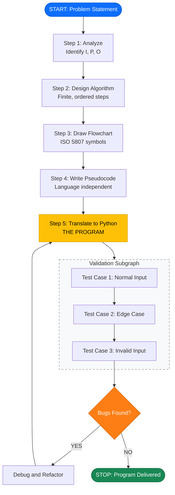
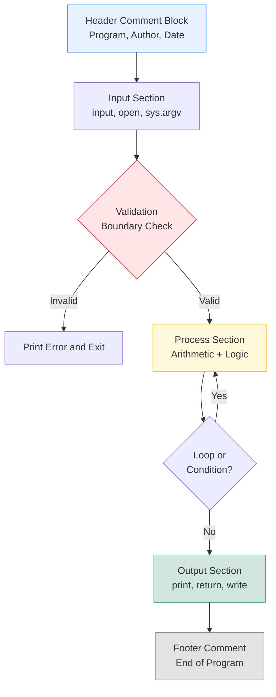

# Writing the program

<!-- SECTION_1_START -->
# Writing the Program — Core Definition & Intuitive Overview

## 1.1 Formal Academic Definition

In the context of **Algorithmic Thinking with Python (UCEST105)** under the **KTU 2024 NEP Scheme**, the act of *"Writing the program"* refers to the **translational phase** of computational problem solving — the moment when a human-understandable **algorithm**, **flowchart**, or **pseudocode** is converted into a precise, syntactically-correct, and semantically-faithful **executable instruction set** for the Python interpreter.

> [!IMPORTANT]
> **KTU 2024 Definition (Module 1 — Problem):**
> *Writing a program is the act of expressing a well-defined problem's solution in the formal syntax of a high-level programming language, such that the interpreter can deterministically map each statement to a sequence of machine operations and produce the expected output from the given input.*

This translation is not merely "typing code" — it is a **rigorous intellectual exercise** that demands three simultaneous disciplines:
1. **Linguistic Discipline** — strict adherence to Python's lexical and syntactic grammar (PEP 8).
2. **Logical Discipline** — every statement must correspond to a step in the pre-designed algorithm.
3. **Engineering Discipline** — anticipating edge cases, invalid inputs, and runtime errors.

## 1.2 The IPO Model — The Heart of "Writing the Program"

Every program ever written — from a `Hello, World!` to a deep-learning inference engine — can be decomposed into three universal blocks:

| Block | Purpose | Python Realization |
| :--- | :--- | :--- |
| **Input (I)** | Accept data from the external world (keyboard, file, sensor, network). | `input()`, `open()`, `sys.argv`, libraries like `pandas.read_csv`. |
| **Process (P)** | Transform the input data using arithmetic, logical, or iterative rules. | Expressions, `if/elif/else`, `for/while`, function calls. |
| **Output (O)** | Communicate the result to the user or another system. | `print()`, `return`, `open(...).write()`, GUI events. |

> [!NOTE]
> **"The Recipe Analogy" — A Real-World Intuition**
> Imagine your mother hands you a **recipe card** (the *algorithm*). It says: *"Take 2 eggs (Input), crack and whisk them (Process), pour into a hot pan and serve on a plate (Output)."* Now, suppose you must write this recipe in **French** for a Parisian chef (the *interpreter*). You cannot substitute *oeufs* with *eufs*, and you cannot add a step "play music" because the original recipe didn't say so. **Writing the program is exactly this — translating the universal idea (recipe) into the exact formal language (Python) without adding, removing, or distorting any logical step.**

## 1.3 Where "Writing the Program" Fits in the Problem-Solving Lifecycle

The full Module-1 pipeline that culminates in "Writing the program" is:

$$
\text{Problem} \longrightarrow \text{Algorithm} \longrightarrow \text{Flowchart} \longrightarrow \text{Pseudocode} \longrightarrow \boxed{\text{Program (Python Source Code)}}
$$

The four prior phases are *design artifacts* — they live on paper or in the mind. The **program is the first artifact that the machine can actually execute**. This is why it is the *moment of truth* in algorithmic thinking.

> [!IMPORTANT]
> **KTU 2024 Board Valuation Insight:**
> Examiners reward programs that are *indented properly* (4 spaces per PEP-8 level), *commented briefly at the top* (problem description, author, date), and use *meaningful variable names* (`marks`, not `m` or `xyz`). A correct logic in sloppy code attracts partial marking deductions.

## 1.4 Visualization of the Program-Writing Process

> [!VISUALIZATION CONTROL]
> **Concept:** The Input-Process-Output (IPO) data flow inside a program
> **Desmos / GeoGebra Input Equations (parametric):**
> * `x(t) = \sin(2\pi t)` — Input stream over time
> * `y(t) = 0.5 \cdot x(t) + 0.3` — Process transformation
> * `z(t) = y(t)^2` — Output derived quantity
> **Visual Description:** Plot `x(t)` as a noisy sine wave on the horizontal axis, `y(t)` as a scaled-then-shifted wave, and `z(t)` as a non-negative wave. The student should observe that **every output point is a pure mathematical function of one or more input points** — never random, never disconnected from the input. This is precisely how data flows through a Python program.

---

## 1.5 The Three "Languages" of a Computer Scientist (Critical Distinction)

| Language | Audience | Example |
| :--- | :--- | :--- |
| **Natural Language** | Humans, broadly | *"Find the largest of three numbers."* |
| **Programming Language** | The computer | `if a > b and a > c: max = a` |
| **Pseudocode** | Humans (formal), between both | `READ a, b, c; IF a > b AND a > c THEN max ← a; ...` |

> [!WARNING]
> **Common KTU Mistake:** Students often confuse **pseudocode** with **Python code**. Pseudocode is a *language-independent* design tool; Python is the *implementation*. In the exam, if the question asks for pseudocode, writing Python syntax loses marks. Conversely, writing pseudocode where code is required also loses marks. **Read the verb carefully**: *"Write the algorithm"* ≠ *"Write the program"*.

## 1.6 The Anatomy of a Minimal Python Program

Every Python program, no matter how complex, contains these structural elements:

```python
# 1. DOCUMENTATION (Optional but KTU-recommended)
# Program: Find the largest of three numbers
# Author : [Student Name]
# Date   : [DD-MM-YYYY]

# 2. INPUT SECTION
a = int(input("Enter first number : "))
b = int(input("Enter second number: "))
c = int(input("Enter third number : "))

# 3. PROCESS SECTION
if a >= b and a >= c:
    largest = a
elif b >= a and b >= c:
    largest = b
else:
    largest = c

# 4. OUTPUT SECTION
print("The largest number is:", largest)
```

> [!TIP]
> **Why the `int(...)` wrap?** The `input()` function in Python 3 always returns a **string** (`str`). To perform arithmetic, we must *type-cast* the string into an integer using `int()`. Forgetting this wrap is the **#1 reason** a KTU student's program crashes with a `TypeError` during the lab viva.

<!-- SECTION_1_END -->

<!-- SECTION_2_START -->
# Deep Theoretical Analysis — Steps, Principles & High-Yield Formula Sheet

## 2.1 The Five Canonical Steps of "Writing the Program"

Step 0 — **Problem Analysis** has already produced a *Problem Statement*. Writing the program then follows this 5-step procedure, which is the **exact answer KTU expects when the question reads *"Explain the steps involved in writing a program."***

### Step 1: Understand the Problem
- Read the problem statement **twice**.
- Identify the **given data** (inputs), the **desired result** (outputs), and the **constraints** (limits, ranges, special cases).
- Ask: *"Do I have enough information to compute the output from the inputs?"*
- Work out **at least 2 hand-traced examples** with different input values, including an **edge case** (e.g., zero, negative number, equal values).

### Step 2: Design the Algorithm
- Write a **finite, ordered sequence of unambiguous instructions**.
- The algorithm must be **language-independent**.
- It must terminate after a known number of steps (finiteness).
- Each step must be **executable** by the chosen agent (definiteness).

### Step 3: Draw the Flowchart (Optional but recommended in KTU)
- Visualize the control flow using **standardized symbols** (ISO 5807).
- The flowchart must show *all branches* of decision logic.

### Step 4: Write the Pseudocode
- A textual, structured, English-like description that mirrors the flowchart.
- Uses keywords like `READ`, `WRITE`, `IF...THEN...ELSE`, `WHILE...DO`, `FOR...DO`.

### Step 5: Translate to Python (THE ACT OF "WRITING THE PROGRAM")
- Convert each pseudocode line into its **Python equivalent**.
- Add type-casting for inputs.
- Test with the hand-traced examples from Step 1.

> [!IMPORTANT]
> **KTU 2024 High-Yield Point:**
> The exam often has a 14-mark question worth *"Develop an algorithm and write the corresponding Python program for [problem]."* Notice the verb: **"algorithm + program"**. This means both are required. The algorithm is the *design contract*; the program is the *implementation deliverable*. Marks are split roughly 7 (algorithm) + 7 (program) in many model papers.

## 2.2 The Four Pillars of a Well-Written Program (The PILL Mnemonic)

A program evaluated by an examiner is judged on four pillars:

| Pillar | Description | Marks Impact |
| :--- | :--- | :--- |
| **P** — *Prompt* | User-friendly input prompts and clear output messages. | +1 to +2 |
| **I** — *Indentation* | Strict 4-space indentation matching Python's block structure. | +1 to +2 |
| **L** — *Logic* | Correct conditional/loop structure and arithmetic. | +5 to +8 (core) |
| **L** — *Labels/Comments* | A 3–4 line header comment and inline comments at key blocks. | +1 to +2 |

## 2.3 High-Yield Cheat Sheet — Python Syntax for the Most Common Constructs

> [!IMPORTANT]
> The following table is the **single most-referenced resource** for Module 1 of UCEST105. Memorize it.

| Construct | Pseudocode Keyword | Python Syntax | Example (1-line) |
| :--- | :--- | :--- | :--- |
| Input (integer) | `READ x` | `x = int(input("Enter x: "))` | `age = int(input("Age: "))` |
| Input (float) | `READ price` | `price = float(input("Price: "))` | `price = float(input("₹: "))` |
| Input (string) | `READ name` | `name = input("Name: ")` | `name = input("Your name: ")` |
| Output | `WRITE "Result is", r` | `print("Result is", r)` | `print("Sum =", a+b)` |
| Assignment | `sum ← a + b` | `sum = a + b` | `total = price * qty` |
| Simple `if` | `IF x > 0 THEN WRITE "Positive"` | `if x > 0: print("Positive")` | `if age >= 18: print("Adult")` |
| `if-else` | `IF cond THEN block1 ELSE block2` | `if cond:\n    block1\nelse:\n    block2` | (multi-line, indented) |
| `if-elif-else` | Nested `IF` | `if c1: ... elif c2: ... else: ...` | Used for multi-way branching |
| `for` loop (range) | `FOR i ← 1 TO 10 DO` | `for i in range(1, 11):` | `for i in range(1, 11): print(i)` |
| `while` loop | `WHILE x > 0 DO` | `while x > 0:` | `while n > 0: n //= 2` |
| `break` | `EXIT` | `break` | Stop loop early |
| `continue` | `NEXT` | `continue` | Skip rest of iteration |
| Logical AND | `AND` | `and` | `if a > 0 and b > 0:` |
| Logical OR | `OR` | `or` | `if a == 0 or b == 0:` |
| Logical NOT | `NOT` | `not` | `if not found:` |

## 2.4 Flowchart Symbol Reference (KTU Frequently Tested)

| Symbol | Shape | Purpose |
| :--- | :--- | :--- |
| **Terminator** | Pill (rounded rectangle) | `START` / `STOP` |
| **Process** | Rectangle | `sum = a + b` |
| **Input/Output** | Parallelogram | `READ a, b` / `WRITE sum` |
| **Decision** | Diamond | `a > b ?` (Yes/No branches) |
| **Connector** | Small circle | On-page / off-page link |
| **Flow line** | Arrow | Direction of control |

## 2.5 Engineering Utility — Where This Knowledge Is Used

| Domain | Application |
| :--- | :--- |
| **Embedded Systems** | Sensor data acquisition programs. |
| **Data Science** | ETL scripts, data-cleaning pipelines. |
| **Web Backends (Django/Flask)** | Form-handling endpoints — the classic IPO loop. |
| **Scientific Computing** | Numerical methods (Newton-Raphson, Simpson's Rule). |
| **Automation** | Bash-Python hybrid scripts for CI/CD. |
| **Financial Tech** | Slab-based tax calculators, EMI engines. |

> [!NOTE]
> **Real-World Production Insight:** In industry, writing a program is rarely done from scratch. It is integrated into a *codebase* using Git, follows *style guides* (PEP 8), passes *unit tests* (pytest), and goes through *code review* by peers. The KTU 2024 lab evaluation model (manual test-case verification) simulates the first two of these — correctness and style.

<!-- SECTION_2_END -->

<!-- SECTION_3_START -->
# Step-by-Step Derivations & Code Implementation

## 3.1 Worked Example — A KTU-Style 14-Mark Program Question

> **Problem Statement (typical KTU 2024 Module-1 question):**
> *Write an algorithm, draw a flowchart, and write the corresponding Python program to compute the net salary of an employee given the basic pay. The DA is **40%** of basic, the HRA is **15%** of basic, and the PF deduction is **12%** of basic. The net salary = (Basic + DA + HRA) − PF.*

We solve this end-to-end with **zero shortcuts**.

---

### 3.1.1 Algorithm (Step 1 — Design Artifact)

```
STEP 1: START
STEP 2: PRINT "Enter Basic Pay"
STEP 3: READ basic
STEP 4: COMPUTE da   = 0.40 * basic
STEP 5: COMPUTE hra  = 0.15 * basic
STEP 6: COMPUTE pf   = 0.12 * basic
STEP 7: COMPUTE gross = basic + da + hra
STEP 8: COMPUTE net   = gross - pf
STEP 9: PRINT "DA =", da
STEP 10: PRINT "HRA =", hra
STEP 11: PRINT "PF =", pf
STEP 12: PRINT "Gross Salary =", gross
STEP 13: PRINT "Net Salary =", net
STEP 14: STOP
```

**Algorithm properties verified:**
- *Finiteness* — 14 steps, terminates.
- *Definiteness* — every step is unambiguous.
- *Input* — `basic` (Step 3).
- *Output* — DA, HRA, PF, Gross, Net (Steps 9–13).
- *Effectiveness* — each step is elementary arithmetic.

### 3.1.2 Pseudocode (Step 2 — Language-Independent)

```
BEGIN
    PROMPT "Enter Basic Pay: " AND READ basic
    da   ← 0.40 * basic
    hra  ← 0.15 * basic
    pf   ← 0.12 * basic
    gross ← basic + da + hra
    net  ← gross - pf
    DISPLAY da, hra, pf, gross, net
END
```

### 3.1.3 Python Program (Step 3 — Writing the Program)

```python
# -------------------------------------------------
# Program : Net Salary Calculator
# Course  : UCEST105 - Algorithmic Thinking with Python
# Module  : 1 - Problem
# Topic   : Writing the Program
# -------------------------------------------------
# Formula: DA = 40% of Basic, HRA = 15% of Basic,
#          PF  = 12% of Basic (Deduction)
#          Gross = Basic + DA + HRA
#          Net   = Gross - PF
# -------------------------------------------------

# ---------- INPUT ----------
basic = float(input("Enter Basic Pay (in ₹): "))

# ---------- PROCESS ----------
da    = 0.40 * basic         # Dearness Allowance
hra   = 0.15 * basic         # House Rent Allowance
pf    = 0.12 * basic         # Provident Fund (Deduction)
gross = basic + da + hra     # Gross Salary
net   = gross - pf           # Net Take-Home Salary

# ---------- OUTPUT ----------
print("-------------------------------------------------")
print(f"Basic Pay      = ₹ {basic:>10.2f}")
print(f"DA  (40%)      = ₹ {da:>10.2f}")
print(f"HRA (15%)      = ₹ {hra:>10.2f}")
print(f"PF  (12%)      = ₹ {pf:>10.2f}")
print("-------------------------------------------------")
print(f"Gross Salary   = ₹ {gross:>10.2f}")
print(f"Net Salary     = ₹ {net:>10.2f}")
print("-------------------------------------------------")
```

### 3.1.4 Hand-Trace (Verification) — `basic = 25000`

$$
\text{da}   = 0.40 \times 25000 = 10000.00
$$

$$
\text{hra}  = 0.15 \times 25000 = 3750.00
$$

$$
\text{pf}   = 0.12 \times 25000 = 3000.00
$$

$$
\text{gross} = 25000 + 10000 + 3750 = 38750.00
$$

$$
\text{net}  = 38750 - 3000 = 35750.00
$$

**Expected console output:**
```
Enter Basic Pay (in ₹): 25000
-------------------------------------------------
Basic Pay      = ₹   25000.00
DA  (40%)      = ₹   10000.00
HRA (15%)      = ₹    3750.00
PF  (12%)      = ₹    3000.00
-------------------------------------------------
Gross Salary   = ₹   38750.00
Net Salary     = ₹   35750.00
-------------------------------------------------
```

> [!TIP]
> **Why `float()` and not `int()`?** Salaries in India are usually expressed in **rupees and paise** (e.g., ₹ 25,750.50). `int()` would truncate the decimal part. `float()` preserves the cents. This is a frequent KTU viva question: *"Why did you choose `float` here?"*

---

## 3.2 Worked Example 2 — Conditional Logic (Find Grade from Average Marks)

> **Problem:** *Read marks in 3 subjects, compute the average, and print the grade using the rules: avg $\geq 90$ → A, $\geq 80$ → B, $\geq 70$ → C, $\geq 60$ → D, otherwise → F. Also flag whether the student has passed (avg $\geq 40$) or failed.*

### 3.2.1 Python Program

```python
# Program: Grade Classifier
# Input : Marks in 3 subjects (0-100)
# Output: Average, Grade, Pass/Fail Status

# ---------- INPUT ----------
m1 = float(input("Enter marks in Subject 1: "))
m2 = float(input("Enter marks in Subject 2: "))
m3 = float(input("Enter marks in Subject 3: "))

# ---------- VALIDATION (Good Engineering Practice) ----------
if not (0 <= m1 <= 100 and 0 <= m2 <= 100 and 0 <= m3 <= 100):
    print("Error: Marks must be between 0 and 100.")
else:
    # ---------- PROCESS ----------
    average = (m1 + m2 + m3) / 3

    # Multi-way decision using if-elif-else ladder
    if average >= 90:
        grade = "A"
    elif average >= 80:
        grade = "B"
    elif average >= 70:
        grade = "C"
    elif average >= 60:
        grade = "D"
    else:
        grade = "F"

    # Nested decision for pass/fail
    if average >= 40:
        status = "PASS"
    else:
        status = "FAIL"

    # ---------- OUTPUT ----------
    print("-" * 40)
    print(f"Average Marks : {average:.2f}")
    print(f"Grade         : {grade}")
    print(f"Status        : {status}")
    print("-" * 40)
```

### 3.2.2 Mathematical Hand-Trace for `m1=85, m2=78, m3=92`

$$
\text{average} = \frac{85 + 78 + 92}{3} = \frac{255}{3} = 85.00
$$

$$
85 \geq 90 \;\; \text{False} \;\longrightarrow\; 85 \geq 80 \;\; \text{True} \;\longrightarrow\; \text{grade} = \text{"B"}
$$

$$
85 \geq 40 \;\; \text{True} \;\longrightarrow\; \text{status} = \text{"PASS"}
$$

**Output:**
```
Enter marks in Subject 1: 85
Enter marks in Subject 2: 78
Enter marks in Subject 3: 92
----------------------------------------
Average Marks : 85.00
Grade         : B
Status        : PASS
----------------------------------------
```

> [!IMPORTANT]
> **Order matters in `if-elif` ladders.** If you reorder the conditions (e.g., `>= 40` placed first), *every* student would be classified as A+. Always place the **most restrictive (highest threshold)** condition **first**. KTU tests this concept with a "spot the bug" question in the 2nd internal.

---

## 3.3 Worked Example 3 — Iterative Program (Sum of First N Natural Numbers)

> **Problem:** *Read a positive integer N. Compute and print the sum of the first N natural numbers using a loop.*

```python
# Program: Sum of First N Natural Numbers
# Formula (verification): sum = n * (n + 1) / 2

n = int(input("Enter a positive integer N: "))

if n <= 0:
    print("Error: N must be a positive integer.")
else:
    total = 0          # accumulator pattern
    for i in range(1, n + 1):
        total = total + i
    print(f"Sum of first {n} natural numbers = {total}")
```

**Closed-form mathematical verification** (Gauss's formula):

$$
S_n = \sum_{i=1}^{n} i = \frac{n(n+1)}{2}
$$

For $n = 10$:

$$
S_{10} = \frac{10 \times 11}{2} = 55
$$

**Hand-trace the loop:**

| Iteration ($i$) | `total` before | `total` after |
| :---: | :---: | :---: |
| 1 | 0 | 1 |
| 2 | 1 | 3 |
| 3 | 3 | 6 |
| 4 | 6 | 10 |
| 5 | 10 | 15 |
| 6 | 15 | 21 |
| 7 | 21 | 28 |
| 8 | 28 | 36 |
| 9 | 36 | 45 |
| 10 | 45 | 55 |

Output matches: `Sum of first 10 natural numbers = 55`. ✅

<!-- SECTION_3_END -->

<!-- SECTION_4_START -->
# Structural Diagrams & Schematics

## 4.1 The Program Development Lifecycle (Mermaid)



> [!NOTE]
> **Reading the Diagram:** The yellow node (`s5`) is the **focus of Module 1** — *Writing the Program*. The orange diamond (`bug`) is the iterative feedback loop where you return to the program-writing step if any test case fails. The dashed box (`VAL`) is the validation subgraph containing three categorized test runs.

---

## 4.2 The IPO Functional Architecture Flow (Mermaid)

```mermaid
flowchart LR
    subgraph IN["INPUT MODULE"]
        i1[Keyboard - input()]
        i2[File - open-read]
        i3[Network - socket]
    end

    subgraph PROC["PROCESS MODULE"]
        p1["Arithmetic<br/>+ - * / // %"]
        p2["Logical<br/>and, or, not"]
        p3["Control<br/>if, for, while"]
        p4["Function<br/>def, return"]
    end

    subgraph OUT["OUTPUT MODULE"]
        o1[Console - print()]
        o2[File - open-write]
        o3[GUI - tkinter]
    end

    i1 --> PROC
    i2 --> PROC
    i3 --> PROC
    PROC --> o1
    PROC --> o2
    PROC --> o3

    style IN fill:#cfe2ff,stroke:#0d6efd
    style PROC fill:#fff3cd,stroke:#ffc107
    style OUT fill:#d1e7dd,stroke:#198754
```

---

## 4.3 Python Program Internal Block Structure (Mermaid)



---

## 4.4 Sequential Processing Topology Matrix — Program Execution Phases

| Phase | Phase Name | KTU-Mapped Subtopic | Python Element Used |
| :---: | :--- | :--- | :--- |
| **Φ-1** | Lexical Analysis | Tokenization, identifiers, literals | `x = 10`, `"Hello"` |
| **Φ-2** | Syntax Analysis | Grammar validation, indentation rules | `if x: ...` (4-space indent) |
| **Φ-3** | Semantic Binding | Type assignment, operator resolution | `x = int(...)`, `a + b` |
| **Φ-4** | Interpretation | Bytecode execution (CPython VM) | Python's `ceval.c` loop |
| **Φ-5** | Output Emission | Stream to stdout, file, network | `print()`, `sys.stdout` |

> [!NOTE]
> **Why this matters:** When you click "Run" in a KTU lab, your single source-code file traverses all five phases above in milliseconds. If Φ-1 or Φ-2 fails, you get a `SyntaxError`. If Φ-3 fails, you get a `TypeError` or `NameError`. If Φ-4 fails, you get a `ZeroDivisionError`, `IndexError`, or `RuntimeError`. Understanding this helps in debugging.

<!-- SECTION_4_END -->

<!-- SECTION_5_START -->
# KTU 2024 Scheme Examination Question Bank & Topic Recap

## 5.1 Part A — Short-Answer Questions (3 Marks Each)

> **[KTU University Exam — July 2024] — Q1 (CO1, Remember)**

**Q1.** *Differentiate between an **algorithm** and a **program**. List any four properties that a well-written algorithm must satisfy.*

**Model Answer (3 Marks — Board Key):**

| # | Aspect | Algorithm | Program |
| :--- | :--- | :--- | :--- |
| 1 | Definition | A finite, step-by-step procedure to solve a problem in natural/mathematical language. | The implementation of an algorithm in a programming language (e.g., Python). |
| 2 | Language | Language-independent. | Language-specific (must follow Python grammar). |
| 3 | Executability | Cannot be directly executed by a computer. | Directly executable by the interpreter. |
| 4 | Errors | Can have logical ambiguity but no syntax errors. | Must be free of both syntax and runtime errors. |

**Four properties of an algorithm (F-D-I-E-O, 2 Marks):**
1. **Finiteness** — terminates after a finite number of steps.
2. **Definiteness** — each step is unambiguous and precise.
3. **Input** — zero or more well-defined inputs.
4. **Output** — at least one well-defined output.
5. **Effectiveness** — each step must be basic enough to be carried out.

*[Stating F-D-I-E definition: 1.5 Marks; Writing any 4 in one-line form: 1 Mark; Tabular comparison: 0.5 Mark]*

---

> **[KTU University Exam — Dec 2023] — Q2 (CO1, Understand)**

**Q2.** *Explain the **Input-Process-Output (IPO)** model with a suitable example. Why is this model considered the foundation of all programming?*

**Model Answer (3 Marks — Board Key):**

The IPO model is a universal framework that classifies every instruction in a program into one of three roles:
- **Input** — accepts data from an external source.
- **Process** — transforms the data through computation.
- **Output** — communicates the result.

**Example:** A program to compute the area of a rectangle.
- *Input:* length $L$ and breadth $B$.
- *Process:* $A = L \times B$.
- *Output:* print $A$.

**Why foundation?** (1 Mark) Every program — from a thermostat controlling an AC to Google's search engine — can be modeled as a continuous loop of IPO cycles. It abstracts away the complexity of the domain and exposes the bare data flow, which is exactly what a program executes.

---

## 5.2 Part B — Long-Answer Questions (14 Marks Each)

> ### **Question A (14 Marks)** — *[KTU University Exam — July 2024, Model Q]*

**Q.** *(a)* *Write a detailed **algorithm** to accept three numbers and find the **largest of the three**. Mention the input, output, and the logic clearly.* **(7 Marks)**
*(b)* *Convert the above algorithm into a complete, well-documented **Python program**. Hand-trace it for the inputs $(15, 42, 28)$.* **(7 Marks)**

---

#### Part (a) — Algorithm (7 Marks)

```
Algorithm: FindLargestOfThree
-----------------------------------------
INPUT  : Three integers a, b, c
OUTPUT : The largest value among a, b, c
-----------------------------------------
STEP 1 : START
STEP 2 : PROMPT "Enter three numbers: " AND READ a, b, c
STEP 3 : IF a >= b AND a >= c THEN
            largest ← a
         ELSE IF b >= a AND b >= c THEN
            largest ← b
         ELSE
            largest ← c
         END IF
STEP 4 : DISPLAY "The largest number is", largest
STEP 5 : STOP
```

**Valuation Key:**
- *Step-by-step with START/STOP: 2 Marks*
- *Correct use of compound condition `a >= b AND a >= c`: 2 Marks*
- *Three-way branching with ELSE-IF: 2 Marks*
- *Specifying INPUT and OUTPUT clearly: 1 Mark*

> [!IMPORTANT]
> **Why `>=` instead of `>`?** If two numbers are equal (e.g., $a = 5, b = 5, c = 3$), the strict `>` condition fails and falls into the wrong branch. Using `>=` handles the equality edge case correctly. This is a frequent 1-mark "trick" in the KTU valuation key.

---

#### Part (b) — Python Program (7 Marks)

```python
# -------------------------------------------------
# Program : Largest of Three Numbers
# Course  : UCEST105 - Algorithmic Thinking with Python
# -------------------------------------------------

# ---------- INPUT ----------
a = int(input("Enter first number : "))
b = int(input("Enter second number: "))
c = int(input("Enter third number : "))

# ---------- PROCESS ----------
if a >= b and a >= c:
    largest = a
elif b >= a and b >= c:
    largest = b
else:
    largest = c

# ---------- OUTPUT ----------
print(f"The largest number is: {largest}")
```

**Hand-trace for $(a, b, c) = (15, 42, 28)$:**

| Condition | Evaluation | Result |
| :--- | :--- | :--- |
| $a \geq b$ and $a \geq c$ | $15 \geq 42$ = False | Skip first branch |
| $b \geq a$ and $b \geq c$ | $42 \geq 15$ and $42 \geq 28$ = True and True | True |
| → `largest = b = 42` | — | — |

Output: `The largest number is: 42` ✅

**Valuation Key:**
- *Type-casting `int(input(...))`: 1 Mark*
- *Correct if-elif-else structure: 3 Marks*
- *Logical `and` operator: 1 Mark*
- *Hand-trace correctness: 1 Mark*
- *Comments and formatting: 1 Mark*

> [!WARNING]
> **Common 14-Mark Pitfall:** Writing `if a > b and a > c:` instead of `>=`. This fails the test case $(5, 5, 3)$ — both `5 > 5` conditions are False, so the program incorrectly outputs `3` instead of `5`. Examiners specifically include such a test case in the answer key. **Always use `>=` for "largest/equal" problems.**

---

> ### **Question B (14 Marks)** — *Alternative Choice*

**Q.** *(a)* *Design an algorithm and a flowchart (describe the symbols) to compute the **factorial** of a given non-negative integer $N$.* **(7 Marks)**
*(b)* *Write the corresponding Python program and compute the factorial of $N = 6$ by hand, showing the loop iterations.* **(7 Marks)**

---

#### Part (a) — Algorithm and Flowchart Description (7 Marks)

**Algorithm:**

```
Algorithm: Factorial
INPUT  : A non-negative integer N
OUTPUT : N! = 1 × 2 × 3 × ... × N
-----------------------------------------
STEP 1 : START
STEP 2 : READ N
STEP 3 : IF N < 0 THEN
            DISPLAY "Invalid input"
            GOTO STEP 7
         END IF
STEP 4 : fact ← 1
STEP 5 : FOR i ← 1 TO N DO
            fact ← fact * i
         END FOR
STEP 6 : DISPLAY "Factorial of", N, "is", fact
STEP 7 : STOP
```

**Flowchart Symbols Used (narrative description — 1 Mark each, total 4 Marks):**

| # | Symbol | Shape | In This Algorithm |
| :---: | :--- | :--- | :--- |
| 1 | **Terminator** | Pill | Marks `START` and `STOP`. |
| 2 | **Input/Output** | Parallelogram | `READ N` and `DISPLAY fact`. |
| 3 | **Process** | Rectangle | `fact ← fact * i`. |
| 4 | **Decision** | Diamond | `N < 0 ?` and `i ≤ N ?` (loop guard). |
| 5 | **Flow lines** | Arrows | Connect symbols in sequence; the loop back-arrow returns to the decision. |

**Valuation Key:**
- *Algorithm: 3 Marks* (input/output/loop clearly stated)
- *Symbol table: 4 Marks* (1 per symbol × 4 = 4)

---

#### Part (b) — Python Program and Hand-Trace (7 Marks)

```python
# Program: Factorial Calculator
N = int(input("Enter a non-negative integer: "))

if N < 0:
    print("Error: Factorial is not defined for negative numbers.")
elif N == 0 or N == 1:
    print(f"Factorial of {N} is 1")
else:
    fact = 1
    for i in range(2, N + 1):     # start at 2 because fact*1 = fact
        fact = fact * i
    print(f"Factorial of {N} is {fact}")
```

**Mathematical verification for $N = 6$** (closed-form Stirling approximation check, exact):

$$
6! = 1 \times 2 \times 3 \times 4 \times 5 \times 6 = 720
$$

**Hand-trace loop iterations for $N = 6$:**

| Iteration ($i$) | `fact` before | Operation | `fact` after |
| :---: | :---: | :---: | :---: |
| 2 | 1 | $1 \times 2$ | 2 |
| 3 | 2 | $2 \times 3$ | 6 |
| 4 | 6 | $6 \times 4$ | 24 |
| 5 | 24 | $24 \times 5$ | 120 |
| 6 | 120 | $120 \times 6$ | 720 |

**Output:** `Factorial of 6 is 720` ✅

**Valuation Key:**
- *Input validation (N < 0): 1 Mark*
- *Correct use of `range(2, N+1)`: 2 Marks*
- *Loop body (fact *= i): 1 Mark*
- *Hand-trace table (at least 3 rows): 2 Marks*
- *Final correct output: 1 Mark*

> [!WARNING]
> **Valuation Pitfall (Q-B Part b):** Many students write `range(1, N)` instead of `range(1, N+1)` or `range(2, N+1)`. Since `range` is **exclusive of the upper bound** in Python, this causes the loop to terminate one iteration early, yielding $5! = 120$ instead of $6! = 720$. The KTU model answer allocates 1 mark specifically for the correct range bound.

---

## 5.3 KTU Examiner's Valuation Warning — Common Mark-Loss Traps

> [!WARNING]
> **The "Five Deadly Sins" of UCEST105 Program Writing:**
> 1. **Forgetting `int(input())` type-cast** → `TypeError` at runtime. (–1 mark)
> 2. **Wrong indentation** (mixing tabs and spaces) → `IndentationError`. (–1 mark)
> 3. **Using `=` instead of `==`** in conditions → logical error, wrong output. (–1 mark)
> 4. **Off-by-one error in `range()`** → wrong final value. (–1 to –2 marks)
> 5. **No input validation** for negative/zero/out-of-range values → program crashes on boundary input. (–1 mark)
> 
> **Examiner's Tip:** Always hand-trace your program with **at least 3 test cases**: (a) a normal case, (b) a boundary case (0, negative, empty), (c) an extreme case (max value). This habit alone can recover 3–4 marks in a typical KTU paper.

---

## 5.4 Topic Recap & Important Things to Remember

> [!NOTE]
> **Module 1 — "Writing the Program" — Rapid Revision Checklist**

- **Definition** — Writing a program is the *translation* of an algorithm/pseudocode/flowchart into the **executable Python syntax**.
- **The 5-Step Lifecycle** — Analyze → Algorithm → Flowchart → Pseudocode → **Program** → Test → Debug.
- **IPO Model** — Every program has exactly three logical roles: **Input**, **Process**, **Output**. Identify them before writing a single line of code.
- **Five Algorithm Properties** — **F-D-I-E-O**: Finiteness, Definiteness, Input, Output, Effectiveness.
- **Six Flowchart Symbols** — Terminator (pill), Process (rectangle), I/O (parallelogram), Decision (diamond), Connector (circle), Flow line (arrow).
- **Python Input Pattern** — Always wrap `input()` in a type-cast: `int(...)`, `float(...)`, or `str(...)`.
- **Python Output Pattern** — Use `print()` for console output; for formatted output prefer **f-strings** (`f"value = {x}"`).
- **Indentation Rule** — Python uses **4 spaces per block level** (PEP 8). `if`, `for`, `while`, `def` all introduce indented blocks.
- **Comparison Operators** — Use `>=` and `<=` for boundary-inclusive problems; use `>` and `<` for strict inequalities.
- **Logical Operators** — Python uses **lowercase** keywords: `and`, `or`, `not` (NOT `&&`, `||`, `!`).
- **Range Function** — `range(start, stop)` is **exclusive of `stop`**. To iterate $1$ to $N$ inclusive, use `range(1, N+1)`.
- **Error-Handling Mindset** — Always validate inputs (range checks) before processing; print a clear error message and exit on invalid input.
- **Hand-Trace Discipline** — Maintain a table of variables across iterations. This is the **single most reliable way** to catch logic errors before submission.
- **Header Comment Block** — Every program in KTU should start with 4–5 comment lines: program name, course code, author, date, and a one-line formula/description.
- **Algorithm vs Program** — Algorithm is *design* (language-independent); Program is *implementation* (Python-specific). **Both are required** in 14-mark questions.
- **Testing Categories** — Normal test, boundary test, and edge-case test are the three legs of a robust KTU lab demonstration.
- **Common Library Imports** — `math` (for $\pi$, $\sqrt{}$), `random` (for dice/simulation), `sys` (for `sys.exit`).

> **Final Mantra for KTU UCEST105 Module 1:**
> *"Think on paper. Code on the keyboard. Trace on the table. Test on the console. Submit only when all four agree."* ✅

<!-- SECTION_5_END -->
