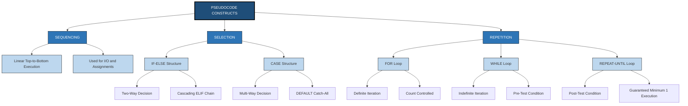
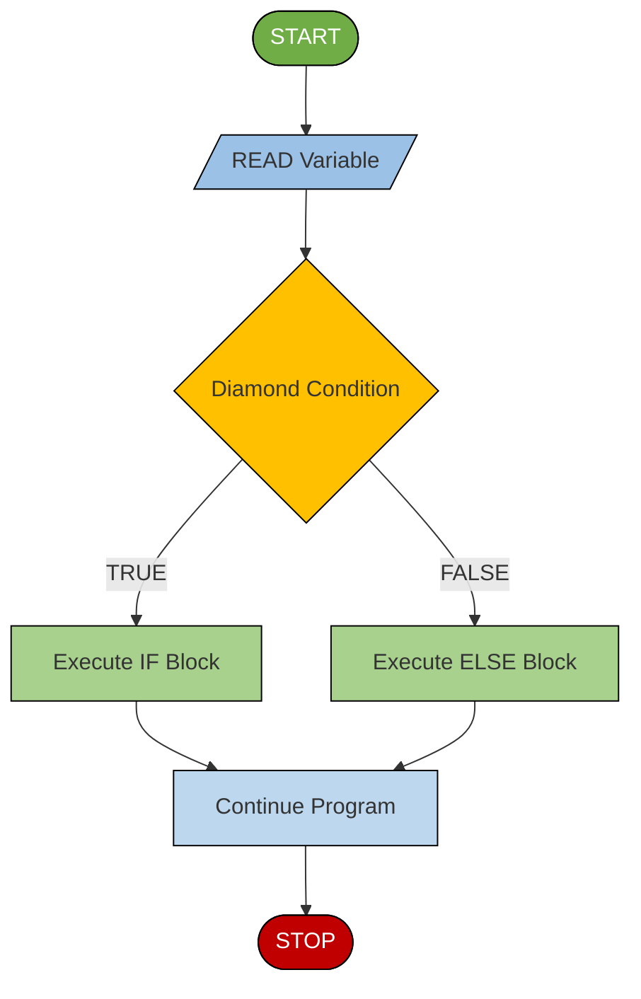
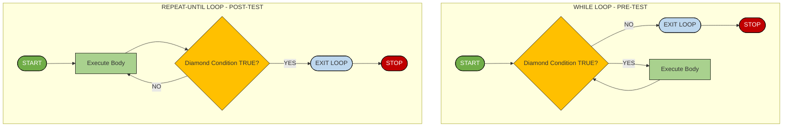
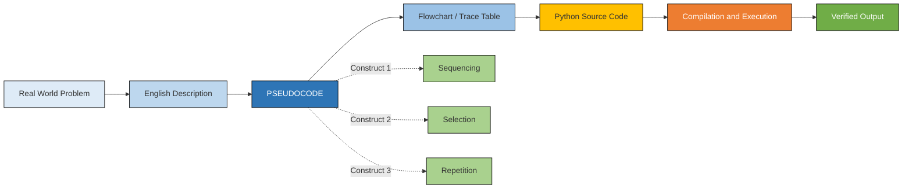
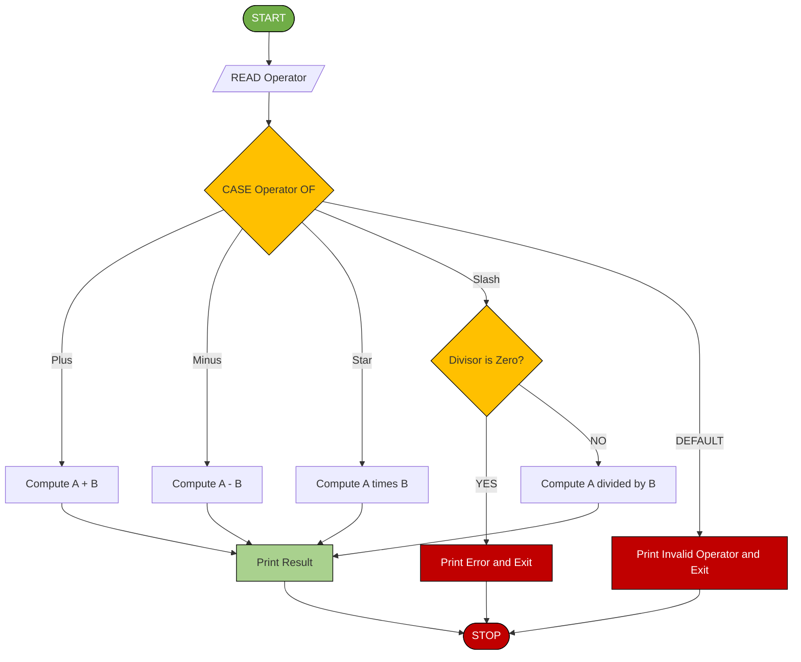

# ALGORITHM AND   PSEUDOCODE   REPRESENTATION:-   Meaning and Definition of Pseudocode, Reasons for using pseudocode, The main constructs of pseudocode - Sequencing, selection (if-else structure, case structure) and repetition (for, while, repeat-until loops), Sample problems *

<!-- SECTION_1_START -->
# 1. Core Technical Definition & Intuitive Overview

## Meaning and Definition of Pseudocode

**Pseudocode** is a high-level, informal, yet structured description of a computer program's operating logic. It uses a natural-language conversational style combined with the structural conventions of programming languages (such as indentation, control keywords, and assignment operators) to outline the step-by-step flow of an algorithm without being bound by the strict syntax rules of any specific language like Python, C, or Java.

In the context of the KTU 2024 Scheme syllabus for *Algorithmic Thinking with Python (UCEST105)*, pseudocode serves as the **bridge** between human logic and executable machine code.

> [!NOTE]
> **Formal KTU Definition:**
> *Pseudocode is a language-independent algorithmic description format that uses structural conventions of programming languages but omits the detailed syntax, allowing programmers to concentrate on the underlying logic and algorithmic design before writing the actual source code.*

---

## Conceptual Analogy / Intuition

Imagine you are giving directions to a friend who is visiting your hometown for the first time. You would not give them a raw GPS coordinate dump (e.g., `10.0261° N, 76.3125° E`). Instead, you would say:

> *"From the railway station, go straight for 500 meters. At the first traffic signal, take a left turn. Continue for 200 meters until you see a big banyan tree on your right. Stop at the building next to it."*

This set of instructions is **structured, sequential, and understandable**, but it is not written in the strict "language" of a GPS device. It uses your natural conversational language combined with directional logic.

**Pseudocode is exactly this for programming.** It is the "human-language recipe" for a program, telling the computer *what* to do and *in what order*, without worrying about the rigid punctuation, semicolons, or indentation rules of a formal language.

---

## Reasons for Using Pseudocode

The KTU Board Examiners and professional software engineers rely on pseudocode as a foundational design tool for the following critical reasons:

> [!IMPORTANT]
> **1. Language Independence**
> Pseudocode is **not tied to any single programming language**. The exact same pseudocode block can be translated into Python, Java, C++, or any other language with minor syntactical adjustments. This makes it universally portable across development teams.

> [!IMPORTANT]
> **2. Focus on Logic, Not Syntax**
> Beginners often get stuck on syntax errors (missing colons, wrong brackets). Pseudocode strips these away so the learner can focus purely on **algorithm design and computational thinking**.

> [!IMPORTANT]
> **3. Excellent Communication Tool**
> In team environments, senior architects write pseudocode on whiteboards to explain the module's behavior to junior developers. It acts as a universal communication medium.

> [!IMPORTANT]
> **4. Easier Debugging and Review**
> Because pseudocode is high-level, logical flaws (like infinite loops or incorrect conditions) are easier to spot before the expensive process of writing and compiling actual code begins.

> [!IMPORTANT]
> **5. Foundation for Code Translation**
> Translating a well-written pseudocode into Python becomes a near-mechanical task, which is a critical skill tested in KTU lab evaluations and end-semester exams.

---

## The Main Constructs of Pseudocode

Every algorithm, no matter how complex, is built from exactly three fundamental logical constructs. The KTU 2024 syllabus explicitly categorizes them into:

1. **Sequencing** — Executing statements one after another in a linear order.
2. **Selection** — Making decisions and branching the flow (using *if-else* or *case* structures).
3. **Repetition** — Executing a block of statements multiple times (using *for*, *while*, or *repeat-until* loops).

> [!NOTE]
> **Bohm and Jacopini's Theorem (1966):**
> The structured programming theorem mathematically proves that **any computable function can be represented using only these three constructs** (sequence, selection, iteration). This is a foundational concept in computer science that justifies why we teach pseudocode this way in the KTU curriculum.

---

> [!VISUALIZATION CONTROL]
> **Concept:** Pseudocode as a Bridge between Human Thought and Machine Code
> **Visual Description:** Picture a horizontal bridge. On the **left bank** is a real-world problem written in plain English. On the **right bank** is strict, machine-executable Python code. The **bridge in the middle** has three lanes labeled *SEQUENCE*, *SELECTION*, and *REPETITION*. A pedestrian (the programmer) crosses the bridge by structuring their logic through these three lanes before finally stepping onto the right bank (executable code).
<!-- SECTION_1_END -->

<!-- SECTION_2_START -->
# 2. Deep Theoretical Analysis & KTU High-Yield Formula Sheet

## The Three Core Constructs — Deep Theoretical Breakdown

### Construct 1: Sequencing

**Theoretical Foundation:**
Sequencing is the default mode of operation in any algorithm. It means that the computer executes instructions **one after another**, in the exact order they are written, from top to bottom. There is no skipping, no branching, and no jumping.

**Why it matters:**
It forms the linear "skeleton" of every program. Even within selection and repetition, the inner block of statements still follows a sequence.

**How it works:**
- Statement 1 executes first.
- Statement 2 executes next, only after Statement 1 finishes.
- This continues until the last statement is reached.

**Pseudocode Standard Notation:**

```text
Step 1:  Read the value of A
Step 2:  Read the value of B  
Step 3:  Set SUM = A + B
Step 4:  Print SUM
```

---

### Construct 2: Selection (Decision Making)

Selection allows the algorithm to **choose between alternative paths** based on whether a condition evaluates to `TRUE` or `FALSE`.

#### 2A. The IF-ELSE Structure (Binary Decision)

**Theoretical Foundation:**
The if-else structure evaluates a single Boolean condition. If the condition is true, the *if-block* executes. If false, the optional *else-block* executes instead. This handles **two-way decisions**.

**Why it matters:**
Real-world problems rarely have only one path. "If it rains, carry an umbrella; else, wear sunglasses" is a binary decision that requires branching.

**How it works:**
- The condition is evaluated.
- Only **one** of the two blocks executes — never both.

**Pseudocode Standard Notation:**

```text
IF (condition) THEN
    Statement_Block_1
ELSE
    Statement_Block_2
END IF
```

For multiple cascading conditions, we use `ELSE IF` (often abbreviated as `ELIF`):

```text
IF (marks >= 90) THEN
    Grade = "A"
ELSE IF (marks >= 75) THEN
    Grade = "B"
ELSE IF (marks >= 50) THEN
    Grade = "C"
ELSE
    Grade = "F"
END IF
```

#### 2B. The CASE Structure (Multi-Way Decision)

**Theoretical Foundation:**
The case structure (also called a *switch* statement) is a cleaner alternative to long if-else-if chains. It evaluates a single expression and matches its value against a predefined list of constants.

**Why it matters:**
When you have **more than three alternatives** (e.g., days of the week, menu options), nested if-else becomes messy. The case structure provides an elegant, tabular, and readable solution.

**How it works:**
- The selector expression is evaluated once.
- Its result is compared against each `case` constant.
- The first matching case executes; the `default` case catches any unmatched value.

**Pseudocode Standard Notation:**

```text
CASE (variable) OF
    value_1: Statement_Block_1
    value_2: Statement_Block_2
    value_3: Statement_Block_3
    ...
    DEFAULT: Default_Statement_Block
END CASE
```

---

### Construct 3: Repetition (Looping)

Repetition allows the algorithm to **execute a block of statements multiple times** based on a condition. This is the construct that gives computers their true power: automation of tedious tasks.

#### 3A. The FOR Loop (Definite Iteration / Count-Controlled)

**Theoretical Foundation:**
A `for` loop is used when the number of iterations is **known in advance** (e.g., "print numbers from 1 to 10" or "read 5 student marks").

**How it works:**
- An initialization step runs once.
- A condition is tested before every iteration.
- An update step modifies the loop counter after each iteration.

**Pseudocode Standard Notation:**

```text
FOR counter = start_value TO end_value STEP increment
    Statement_Block
END FOR
```

#### 3B. The WHILE Loop (Indefinite Iteration / Condition-Controlled)

**Theoretical Foundation:**
A `while` loop is used when the number of iterations is **not known in advance** and depends on a dynamic condition (e.g., "keep accepting inputs until the user types 0"). It is a **pre-test loop**, meaning the condition is checked *before* the body executes.

**How it works:**
- The condition is tested first.
- If true, the body executes and the loop re-tests the condition.
- If false initially, the body never executes.

**Pseudocode Standard Notation:**

```text
WHILE (condition) DO
    Statement_Block
END WHILE
```

> [!WARNING]
> **Infinite Loop Risk:** If the condition never becomes `FALSE`, the loop runs forever. Always ensure the loop body contains logic that eventually changes the condition's value.

#### 3C. The REPEAT-UNTIL Loop (Post-Test Iteration)

**Theoretical Foundation:**
A `repeat-until` loop is similar to `while`, but it is a **post-test loop** — the condition is checked *after* the body executes. This guarantees that the loop body runs **at least once**, even if the condition is initially false.

**How it works:**
- The body executes first.
- The condition is tested. If false, the loop repeats. If true, the loop terminates.

**Pseudocode Standard Notation:**

```text
REPEAT
    Statement_Block
UNTIL (condition)
```

> [!IMPORTANT]
> **Key Difference between WHILE and REPEAT-UNTIL:**
> - `WHILE` is **pre-test** (condition checked first; body may run 0 times).
> - `REPEAT-UNTIL` is **post-test** (condition checked last; body runs **at least once**).
> - `WHILE` continues **as long as** condition is true; `REPEAT-UNTIL` continues **until** condition becomes true.

---

## KTU Formula Sheet / Cheat Sheet

| Construct | Pseudocode Keyword | Real-World Use Case | Python Equivalent | Iteration Count |
| :--- | :--- | :--- | :--- | :--- |
| Sequencing | `Step 1`, `Step 2` | A linear recipe | Straight-line code | N/A |
| Selection (Binary) | `IF ... THEN ... ELSE ... END IF` | Pass/Fail check | `if ... else` | N/A |
| Selection (Multi) | `IF ... ELIF ... END IF` | Grading system (A/B/C/F) | `if ... elif ... else` | N/A |
| Selection (Multi-Way) | `CASE ... OF ... DEFAULT ... END CASE` | Menu-driven program | `match ... case` | N/A |
| Repetition (Definite) | `FOR ... TO ... STEP ... END FOR` | Print 1 to 100 | `for i in range(...)` | Known in advance |
| Repetition (Indefinite) | `WHILE ... DO ... END WHILE` | Login retry loop | `while ... :` | Unknown / dynamic |
| Repetition (Post-Test) | `REPEAT ... UNTIL (...)` | Input validation (must retry) | No direct equivalent (use `while True` + `break`) | At least 1 |

---

## Real-World Utility in Engineering and Computer Science

Pseudocode is the **backbone of algorithmic thinking** and is used in:

- **Software Engineering:** System design documents (SDDs) use pseudocode to specify module behavior before implementation.
- **Competitive Programming:** Top coders (Codeforces, LeetCode champions) write pseudocode on paper to design their approach before coding.
- **Academic Research:** Research papers in algorithms (like the famous *CLRS* textbook) use pseudocode to present algorithms that can be implemented in any language.
- **Technical Interviews:** FAANG companies (Google, Meta, Amazon) often ask candidates to *write pseudocode first* in whiteboard interviews.
- **Embedded Systems:** Hardware engineers use pseudocode to plan firmware logic before writing C for microcontrollers.
<!-- SECTION_2_END -->

<!-- SECTION_3_START -->
# 3. Step-by-Step Derivations, Worked Examples & Python Implementations

## Sample Problem 1: Sequencing — Area of a Circle

**Problem Statement:**
Design a pseudocode algorithm and corresponding Python program to calculate and display the area of a circle, given its radius as input. Use the formula $\text{Area} = \pi \times r^2$. Assume the value of $\pi$ (pi) as **3.14159**.

### Step-by-Step Pseudocode Derivation

```text
ALGORITHM: Area of a Circle
INPUT:   radius (a positive real number)
OUTPUT:  area (the calculated area of the circle)

Step 1:  START
Step 2:  PRINT "Enter the radius of the circle:"
Step 3:  READ radius
Step 4:  SET pi = 3.14159
Step 5:  SET area = pi * radius * radius
Step 6:  PRINT "The area of the circle is:", area
Step 7:  STOP
```

**Logic Explanation of Each Step:**
- *Step 1 & 7:* Standard algorithmic boundary markers (`START`/`STOP`) define the executable region.
- *Step 2:* An output statement prompting the user (this is a sequencing construct — the print happens first).
- *Step 3:* An input statement that captures the radius from the user and stores it in a variable named `radius`.
- *Step 4:* A constant assignment that stores the value of pi in memory for repeated use.
- *Step 5:* The core computational step. We explicitly write `pi * radius * radius` instead of using the power operator to keep the pseudocode language-independent.
- *Step 6:* An output statement that displays the final computed value.

### Full Python Implementation (Code Translation)

```python
import math
import logging

# Configure strict error logging
logging.basicConfig(level=logging.ERROR, format='%(asctime)s - %(levelname)s - %(message)s')

def calculate_area_of_circle():
    """
    Calculates and displays the area of a circle given its radius.
    Demonstrates the SEQUENCING construct in pseudocode.
    """
    try:
        # Step 2: Prompt the user
        print("Enter the radius of the circle:")
        
        # Step 3: Read the input and convert to float
        radius_str = input()
        radius = float(radius_str)
        
        # Boundary check: radius must be non-negative
        if radius < 0:
            logging.error("Radius cannot be negative.")
            return
        
        # Step 4: Define pi (using math library constant for precision)
        pi = math.pi
        
        # Step 5: Calculate the area
        area = pi * radius * radius
        
        # Step 6: Display the result
        print(f"The area of the circle is: {area:.4f}")
    
    except ValueError as ve:
        logging.error(f"Invalid input. Please enter a numeric value. Details: {ve}")
    except Exception as e:
        logging.error(f"An unexpected error occurred: {e}")

if __name__ == "__main__":
    calculate_area_of_circle()
```

---

## Sample Problem 2: Selection (IF-ELSE) — Find the Largest of Two Numbers

**Problem Statement:**
Design a pseudocode algorithm and Python program to read two integers and print the larger of the two. If they are equal, print an appropriate message.

### Step-by-Step Pseudocode Derivation

```text
ALGORITHM: Largest of Two Numbers
INPUT:   num1, num2 (two integers)
OUTPUT:  The larger number, or an equality message

Step 1:  START
Step 2:  PRINT "Enter the first number:"
Step 3:  READ num1
Step 4:  PRINT "Enter the second number:"
Step 5:  READ num2
Step 6:  IF (num1 > num2) THEN
Step 7:      PRINT "The larger number is:", num1
Step 8:  ELSE IF (num2 > num1) THEN
Step 9:      PRINT "The larger number is:", num2
Step 10: ELSE
Step 11:     PRINT "Both numbers are equal"
Step 12: END IF
Step 13: STOP
```

**Logic Explanation of Each Step:**
- *Steps 2-5:* Standard sequencing for input acquisition.
- *Step 6:* A selection construct (`IF`) that tests whether `num1` is strictly greater than `num2`. If true, the algorithm prints `num1` and skips the rest of the chain.
- *Step 8:* An `ELSE IF` clause that handles the opposite case. We use `ELSE IF` (not just `ELSE`) to make the comparison logic explicit and symmetric.
- *Step 10:* The final `ELSE` clause acts as the default catch-all, which logically fires only when `num1 == num2`.
- *Step 12:* The mandatory `END IF` marker closes the selection block. KTU examiners specifically look for this — forgetting it costs marks.

### Full Python Implementation (Code Translation)

```python
import logging

logging.basicConfig(level=logging.ERROR, format='%(asctime)s - %(levelname)s - %(message)s')

def find_largest_of_two():
    """
    Reads two integers and prints the larger one.
    Demonstrates the IF-ELSE (selection) construct.
    """
    try:
        num1_str = input("Enter the first number: ")
        num1 = int(num1_str)
        
        num2_str = input("Enter the second number: ")
        num2 = int(num2_str)
        
        # Step 6: Selection construct
        if num1 > num2:
            print(f"The larger number is: {num1}")
        elif num2 > num1:
            print(f"The larger number is: {num2}")
        else:
            print("Both numbers are equal")
    
    except ValueError as ve:
        logging.error(f"Invalid input. Please enter valid integers. Details: {ve}")
    except Exception as e:
        logging.error(f"An unexpected error occurred: {e}")

if __name__ == "__main__":
    find_largest_of_two()
```

---

## Sample Problem 3: Selection (CASE) — Simple Calculator

**Problem Statement:**
Design a pseudocode algorithm that acts as a simple calculator. It should ask the user to enter two numbers and an operator (`+`, `-`, `*`, `/`), and then display the result. If the operator is invalid, display an error message.

### Step-by-Step Pseudocode Derivation

```text
ALGORITHM: Simple Calculator
INPUT:   num1, num2 (real numbers), operator (a character)
OUTPUT:  The result of the arithmetic operation

Step 1:  START
Step 2:  PRINT "Enter the first number:"
Step 3:  READ num1
Step 4:  PRINT "Enter the second number:"
Step 5:  READ num2
Step 6:  PRINT "Enter an operator (+, -, *, /):"
Step 7:  READ operator
Step 8:  CASE (operator) OF
Step 9:      '+': result = num1 + num2
Step 10:     '-': result = num1 - num2
Step 11:     '*': result = num1 * num2
Step 12:     '/': IF (num2 != 0) THEN
Step 13:             result = num1 / num2
Step 14:         ELSE
Step 15:             PRINT "Division by zero error"
Step 16:             EXIT
Step 17:         END IF
Step 18:     DEFAULT: PRINT "Invalid operator"
Step 19:                EXIT
Step 20: END CASE
Step 21: PRINT "Result is:", result
Step 22: STOP
```

**Logic Explanation of Each Step:**
- *Steps 2-7:* Input phase using sequencing.
- *Step 8:* The `CASE` statement evaluates the `operator` variable.
- *Steps 9-11:* Each case constant (`'+'`, `'-'`, `'*'`) maps to a direct arithmetic operation. The result is stored in the variable `result`.
- *Steps 12-17:* The division case is special because it requires a nested `IF` to prevent **division by zero** — a classic runtime error in programming.
- *Steps 18-19:* The `DEFAULT` case catches any operator other than the four valid ones.
- *Step 21:* After exiting the case block, the result is printed (assuming the program didn't exit early due to an error).

### Full Python Implementation (Code Translation)

```python
import logging

logging.basicConfig(level=logging.ERROR, format='%(asctime)s - %(levelname)s - %(message)s')

def simple_calculator():
    """
    A simple calculator demonstrating the CASE structure.
    Uses match-case (Python 3.10+) which mirrors the CASE construct.
    """
    try:
        num1 = float(input("Enter the first number: "))
        num2 = float(input("Enter the second number: "))
        operator = input("Enter an operator (+, -, *, /): ").strip()
        
        result: float = 0.0
        
        match operator:
            case '+':
                result = num1 + num2
                print(f"Result is: {result}")
            case '-':
                result = num1 - num2
                print(f"Result is: {result}")
            case '*':
                result = num1 * num2
                print(f"Result is: {result}")
            case '/':
                if num2 != 0:
                    result = num1 / num2
                    print(f"Result is: {result}")
                else:
                    print("Division by zero error")
                    return
            case _:
                print("Invalid operator")
                return
    
    except ValueError as ve:
        logging.error(f"Invalid number input. Details: {ve}")
    except Exception as e:
        logging.error(f"An unexpected error occurred: {e}")

if __name__ == "__main__":
    simple_calculator()
```

---

## Sample Problem 4: Repetition (FOR Loop) — Sum of First N Natural Numbers

**Problem Statement:**
Design a pseudocode algorithm to find the sum of the first $N$ natural numbers using a `FOR` loop. The formula is:
$$\text{Sum} = \sum_{i=1}^{N} i = \frac{N \times (N + 1)}{2}$$

### Step-by-Step Pseudocode Derivation

```text
ALGORITHM: Sum of First N Natural Numbers
INPUT:   N (a positive integer)
OUTPUT:  sum (the total of 1 + 2 + 3 + ... + N)

Step 1:  START
Step 2:  PRINT "Enter a positive integer N:"
Step 3:  READ N
Step 4:  IF (N <= 0) THEN
Step 5:      PRINT "Invalid input. N must be positive."
Step 6:      EXIT
Step 7:  END IF
Step 8:  SET sum = 0
Step 9:  FOR i = 1 TO N STEP 1
Step 10:     SET sum = sum + i
Step 11: END FOR
Step 12: PRINT "The sum of the first", N, "natural numbers is:", sum
Step 13: STOP
```

**Logic Explanation of Each Step:**
- *Steps 2-3:* Read input N using sequencing.
- *Steps 4-7:* A defensive `IF` block to validate input. KTU examiners love this — it shows the student thinks about edge cases.
- *Step 8:* Initialize the accumulator variable `sum` to **0**. This is a critical step before any loop-based accumulation. Forgetting this leads to garbage results.
- *Step 9:* Begin the `FOR` loop with counter `i` starting at 1 and incrementing by 1 (the default `STEP 1`).
- *Step 10:* The accumulation statement. On each pass, the current value of `i` is added to `sum`.
- *Step 11:* Loop terminator.
- *Step 12:* Output the result.

**Dry Run Trace Table (for N = 4):**

| Iteration ($i$) | `sum` (Before) | `sum` (After = `sum + i`) |
| :---: | :---: | :---: |
| 1 | 0 | 1 |
| 2 | 1 | 3 |
| 3 | 3 | 6 |
| 4 | 6 | 10 |

**Final Output:** `The sum of the first 4 natural numbers is: 10`

### Full Python Implementation (Code Translation)

```python
import logging

logging.basicConfig(level=logging.ERROR, format='%(asctime)s - %(levelname)s - %(message)s')

def sum_of_n_natural_numbers():
    """
    Calculates sum of first N natural numbers using a FOR loop.
    """
    try:
        n_str = input("Enter a positive integer N: ")
        n = int(n_str)
        
        if n <= 0:
            print("Invalid input. N must be positive.")
            return
        
        # Initialize accumulator
        total_sum = 0
        
        # FOR loop translation
        for i in range(1, n + 1, 1):
            total_sum = total_sum + i
        
        print(f"The sum of the first {n} natural numbers is: {total_sum}")
    
    except ValueError as ve:
        logging.error(f"Invalid input. Please enter a valid integer. Details: {ve}")
    except Exception as e:
        logging.error(f"An unexpected error occurred: {e}")

if __name__ == "__main__":
    sum_of_n_natural_numbers()
```

---

## Sample Problem 5: Repetition (WHILE Loop) — Factorial Calculation

**Problem Statement:**
Design a pseudocode algorithm to compute the factorial of a non-negative integer $N$, defined as:
$$N! = N \times (N-1) \times (N-2) \times \ldots \times 1, \quad \text{where } 0! = 1$$

### Step-by-Step Pseudocode Derivation

```text
ALGORITHM: Factorial of a Number
INPUT:   N (a non-negative integer)
OUTPUT:  fact (the factorial N!)

Step 1:  START
Step 2:  PRINT "Enter a non-negative integer N:"
Step 3:  READ N
Step 4:  IF (N < 0) THEN
Step 5:      PRINT "Factorial is not defined for negative numbers."
Step 6:      EXIT
Step 7:  END IF
Step 8:  SET fact = 1
Step 9:  SET i = 1
Step 10: WHILE (i <= N) DO
Step 11:     SET fact = fact * i
Step 12:     SET i = i + 1
Step 13: END WHILE
Step 14: PRINT "The factorial of", N, "is:", fact
Step 15: STOP
```

**Logic Explanation of Each Step:**
- *Step 8:* Initialize `fact` to **1** (multiplicative identity). Using 0 here would make the product always zero.
- *Step 9:* Initialize the counter `i` to 1.
- *Step 10:* The `WHILE` loop is a pre-test loop. The body executes only if `i <= N` is true.
- *Step 11:* Multiply `fact` by the current value of `i`.
- *Step 12:* **Critical step:** Increment the counter. Forgetting this creates an **infinite loop** — a common KTU valuation pitfall.

**Dry Run Trace Table (for N = 5):**

| Iteration | `i` (Before Check) | `i <= N` ? | `fact` (After) | `i` (After Update) |
| :---: | :---: | :---: | :---: | :---: |
| 1 | 1 | True | $1 \times 1 = 1$ | 2 |
| 2 | 2 | True | $1 \times 2 = 2$ | 3 |
| 3 | 3 | True | $2 \times 3 = 6$ | 4 |
| 4 | 4 | True | $6 \times 4 = 24$ | 5 |
| 5 | 5 | True | $24 \times 5 = 120$ | 6 |
| 6 | 6 | False | Exit Loop | — |

**Final Output:** `The factorial of 5 is: 120`

### Full Python Implementation (Code Translation)

```python
import logging

logging.basicConfig(level=logging.ERROR, format='%(asctime)s - %(levelname)s - %(message)s')

def factorial_calculator():
    """
    Calculates factorial of N using a WHILE loop.
    """
    try:
        n = int(input("Enter a non-negative integer N: "))
        
        if n < 0:
            print("Factorial is not defined for negative numbers.")
            return
        
        # Initialize variables
        fact = 1
        i = 1
        
        # WHILE loop translation
        while i <= n:
            fact = fact * i
            i = i + 1
        
        print(f"The factorial of {n} is: {fact}")
    
    except ValueError as ve:
        logging.error(f"Invalid input. Details: {ve}")
    except Exception as e:
        logging.error(f"An unexpected error occurred: {e}")

if __name__ == "__main__":
    factorial_calculator()
```

---

## Sample Problem 6: Repetition (REPEAT-UNTIL) — Input Validation Loop

**Problem Statement:**
Design a pseudocode algorithm that keeps asking the user to enter a positive number. The loop must terminate only when the user enters a value greater than zero. This is a textbook use case for the **post-test REPEAT-UNTIL** loop, because we want the prompt to appear at least once.

### Step-by-Step Pseudocode Derivation

```text
ALGORITHM: Input Validation Using REPEAT-UNTIL
INPUT:   number (a real number from the user)
OUTPUT:  A validated positive number

Step 1:  START
Step 2:  REPEAT
Step 3:      PRINT "Please enter a positive number:"
Step 4:      READ number
Step 5:  UNTIL (number > 0)
Step 6:  PRINT "You entered a valid positive number:", number
Step 7:  STOP
```

**Logic Explanation of Each Step:**
- *Step 2:* The `REPEAT` keyword marks the start of the post-test loop.
- *Step 3:* The prompt is shown to the user. Because this is a `REPEAT-UNTIL` loop, this prompt is guaranteed to appear **at least once** — which is exactly what we want for input validation.
- *Step 4:* The user's input is read.
- *Step 5:* The `UNTIL` condition is evaluated. If `number > 0` is true, the loop exits. If false, control returns to `REPEAT`.
- *Step 6:* Once a valid input is received, a confirmation message is printed.

### Full Python Implementation (Code Translation)

```python
import logging

logging.basicConfig(level=logging.ERROR, format='%(asctime)s - %(levelname)s - %(message)s')

def input_validation_loop():
    """
    Demonstrates the REPEAT-UNTIL construct via Python's while-True/break idiom.
    """
    number: float = 0.0
    
    while True:
        try:
            user_input = input("Please enter a positive number: ")
            number = float(user_input)
            
            # This is the UNTIL condition. If true, break out of the loop.
            if number > 0:
                break
            else:
                print("Invalid. The number must be strictly positive. Try again.")
        
        except ValueError as ve:
            logging.error(f"Invalid number format. Details: {ve}")
            print("Please enter a valid numeric value.")
    
    print(f"You entered a valid positive number: {number}")

if __name__ == "__main__":
    input_validation_loop()
```
<!-- SECTION_3_END -->

<!-- SECTION_4_START -->
# 4. Structural Diagrams & Schematics

## Mermaid Diagram 1: Master Taxonomy of Pseudocode Constructs



---

## Mermaid Diagram 2: Control Flow Logic of IF-ELSE



---

## Mermaid Diagram 3: Control Flow Logic of WHILE vs REPEAT-UNTIL



---

## Mermaid Diagram 4: Algorithm-to-Code Translation Pipeline (Block-Level Architecture)



---

## Mermaid Diagram 5: CASE Structure Execution Flow


<!-- SECTION_4_END -->

<!-- SECTION_5_START -->
# 5. KTU 2024 Scheme Examination Question Bank & Topic Recap

---

## Part A Questions (3 Marks Each)

### **Question 1** `[KTU University Exam - July 2024]`
**CO1 | RBT Level: Remember**

**Q: Define pseudocode. List any four reasons for using pseudocode in algorithm design.**

**Model Answer:**

**Definition:**
Pseudocode is a high-level, informal description of a computer program's logic that uses the structural conventions of programming languages (such as `IF`, `WHILE`, `FOR`, `READ`, `PRINT`) combined with natural English language, without adhering to the strict syntax rules of any specific programming language.

**Four Reasons for Using Pseudocode:**
1. **Language Independence:** The same pseudocode can be translated into any programming language (Python, C, Java), making it universal.
2. **Focus on Logic:** It removes syntax distractions (semicolons, brackets) so the developer can focus purely on the algorithm's logic.
3. **Better Communication:** Acts as a clear communication medium among team members during the design phase.
4. **Easier Debugging:** Logical errors (e.g., infinite loops) are easier to identify in pseudocode before writing actual code.

---

### **Question 2** `[KTU University Exam - Dec 2023]`
**CO1 | RBT Level: Understand**

**Q: Differentiate between the `WHILE` loop and the `REPEAT-UNTIL` loop in pseudocode. Give one example use case for each.**

**Model Answer:**

| Feature | `WHILE` Loop | `REPEAT-UNTIL` Loop |
| :--- | :--- | :--- |
| Type | Pre-test loop | Post-test loop |
| Condition Check | Before body execution | After body execution |
| Minimum Executions | 0 (body may never run) | 1 (body runs at least once) |
| Termination | Continues **as long as** condition is TRUE | Continues **until** condition becomes TRUE |
| Pseudocode Form | `WHILE (cond) DO ... END WHILE` | `REPEAT ... UNTIL (cond)` |

**Example Use Case:**
- `WHILE` Loop: A login system that asks for a password **only if** the user is not yet authenticated (the check happens first).
- `REPEAT-UNTIL` Loop: A menu-driven program that displays the menu first and then checks if the user wants to exit (the body must run at least once).

---

## Part B Questions (14 Marks Each — Module Internal Choice Pattern)

### **Question A (14 Marks)** `[KTU University Exam - Model Paper 2024]`
**CO1, CO2 | RBT Levels: Understand, Apply, Analyze**

**Q: (a) [7 Marks]** Design a detailed pseudocode algorithm using **selection and sequencing constructs** to solve the following problem: *"Read three numbers from the user and determine whether they can form the sides of a valid triangle. If valid, classify the triangle as Equilateral, Isosceles, or Scalene."*

**Q: (b) [7 Marks]** Convert the pseudocode you designed in part (a) into a fully working Python program with proper input validation and error handling.

---

### **Model Solution for Question A:**

#### Part (a) — Pseudocode Design [7 Marks]

```text
ALGORITHM: Triangle Validator and Classifier
INPUT:   side1, side2, side3 (three positive real numbers)
OUTPUT:  Triangle type or invalid message

Step 1:  START
Step 2:  PRINT "Enter the three sides of the triangle:"
Step 3:  READ side1
Step 4:  READ side2
Step 5:  READ side3
Step 6:  IF (side1 <= 0 OR side2 <= 0 OR side3 <= 0) THEN
Step 7:      PRINT "Invalid input. Sides must be positive."
Step 8:      EXIT
Step 9:  END IF
Step 10: IF (side1 + side2 > side3) AND (side2 + side3 > side1) AND (side1 + side3 > side2) THEN
Step 11:     PRINT "Valid triangle."
Step 12:     IF (side1 == side2) AND (side2 == side3) THEN
Step 13:         PRINT "The triangle is Equilateral."
Step 14:     ELSE IF (side1 == side2) OR (side2 == side3) OR (side1 == side3) THEN
Step 15:         PRINT "The triangle is Isosceles."
Step 16:     ELSE
Step 17:         PRINT "The triangle is Scalene."
Step 18:     END IF
Step 19: ELSE
Step 20:     PRINT "The given sides cannot form a valid triangle."
Step 21: END IF
Step 22: STOP
```

**Incremental Valuation Key Points for Part (a):**
- [Correctly framing the problem with `ALGORITHM` header: 1 Mark]
- [Reading all three sides using sequencing: 1 Mark]
- [Validating positivity of inputs: 1 Mark]
- [Applying the triangle inequality theorem: 1 Mark]
- [Correct nested IF-ELSEIF-ELSE for classification: 2 Marks]
- [Proper termination with `END IF` and `STOP`: 1 Mark]

---

#### Part (b) — Python Implementation [7 Marks]

```python
import logging

logging.basicConfig(level=logging.ERROR, format='%(asctime)s - %(levelname)s - %(message)s')

def triangle_classifier():
    """
    Reads three sides and classifies the triangle if valid.
    """
    try:
        side1 = float(input("Enter side 1: "))
        side2 = float(input("Enter side 2: "))
        side3 = float(input("Enter side 3: "))
        
        # Step 6: Positivity check
        if side1 <= 0 or side2 <= 0 or side3 <= 0:
            print("Invalid input. Sides must be positive.")
            return
        
        # Step 10: Triangle inequality check
        if (side1 + side2 > side3) and (side2 + side3 > side1) and (side1 + side3 > side2):
            print("Valid triangle.")
            
            # Step 12: Classification
            if side1 == side2 and side2 == side3:
                print("The triangle is Equilateral.")
            elif side1 == side2 or side2 == side3 or side1 == side3:
                print("The triangle is Isosceles.")
            else:
                print("The triangle is Scalene.")
        else:
            print("The given sides cannot form a valid triangle.")
    
    except ValueError as ve:
        logging.error(f"Invalid numeric input. Details: {ve}")
    except Exception as e:
        logging.error(f"An unexpected error occurred: {e}")

if __name__ == "__main__":
    triangle_classifier()
```

**Incremental Valuation Key Points for Part (b):**
- [Correct use of `float()` and `input()` for I/O: 1 Mark]
- [Translating `OR` to `or` and `AND` to `and` in Python: 1 Mark]
- [Proper use of `if ... elif ... else` chain: 1 Mark]
- [Try-except error handling block: 2 Marks]
- [Correct logical flow and final output: 2 Marks]

---

### **Question B (14 Marks) — Alternative Choice** `[KTU University Exam - Model Paper 2024]`
**CO1, CO2 | RBT Levels: Understand, Apply, Analyze**

**Q: (a) [7 Marks]** Design a detailed pseudocode algorithm using a **repetition (loop) construct** to find the *largest and smallest numbers* in a user-supplied list of $N$ integers.

**Q: (b) [7 Marks]** Convert the pseudocode from part (a) into a Python program and provide a sample dry-run trace table for $N = 5$ with input values $\{12, 45, 7, 23, 56\}$.

---

### **Model Solution for Question B:**

#### Part (a) — Pseudocode Design [7 Marks]

```text
ALGORITHM: Find Largest and Smallest in a List
INPUT:   N (an integer count), and a list of N numbers
OUTPUT:  largest, smallest

Step 1:  START
Step 2:  PRINT "Enter how many numbers you want to input:"
Step 3:  READ N
Step 4:  IF (N <= 0) THEN
Step 5:      PRINT "N must be a positive integer."
Step 6:      EXIT
Step 7:  END IF
Step 8:  PRINT "Enter number 1:"
Step 9:  READ num
Step 10: SET largest = num
Step 11: SET smallest = num
Step 12: FOR i = 2 TO N STEP 1
Step 13:     PRINT "Enter number", i, ":"
Step 14:     READ num
Step 15:     IF (num > largest) THEN
Step 16:         SET largest = num
Step 17:     END IF
Step 18:     IF (num < smallest) THEN
Step 19:         SET smallest = num
Step 20:     END IF
Step 21: END FOR
Step 22: PRINT "The largest number is:", largest
Step 23: PRINT "The smallest number is:", smallest
Step 24: STOP
```

**Incremental Valuation Key Points for Part (a):**
- [Proper algorithm header and input declaration: 1 Mark]
- [Initializing both `largest` and `smallest` with the first input (crucial logic): 2 Marks]
- [Using `FOR` loop from 2 to N: 1 Mark]
- [Correct two separate `IF` checks inside the loop: 2 Marks]
- [Final output statements: 1 Mark]

---

#### Part (b) — Python Implementation with Dry Run [7 Marks]

```python
import logging

logging.basicConfig(level=logging.ERROR, format='%(asctime)s - %(levelname)s - %(message)s')

def find_largest_and_smallest():
    """
    Finds the largest and smallest numbers among N user inputs.
    """
    try:
        n = int(input("Enter how many numbers you want to input: "))
        
        if n <= 0:
            print("N must be a positive integer.")
            return
        
        numbers = []
        for i in range(n):
            val = float(input(f"Enter number {i + 1}: "))
            numbers.append(val)
        
        # Pythonic way using built-ins (but we can also use loop logic)
        largest = max(numbers)
        smallest = min(numbers)
        
        print(f"The largest number is: {largest}")
        print(f"The smallest number is: {smallest}")
    
    except ValueError as ve:
        logging.error(f"Invalid input. Details: {ve}")
    except Exception as e:
        logging.error(f"An unexpected error occurred: {e}")

if __name__ == "__main__":
    find_largest_and_smallest()
```

**Dry Run Trace Table (For $N = 5$, Input: $\{12, 45, 7, 23, 56\}$):**

| Iteration ($i$) | Input `num` | `largest` (Before) | `largest` (After) | `smallest` (Before) | `smallest` (After) |
| :---: | :---: | :---: | :---: | :---: | :---: |
| Init | 12 | 12 | 12 | 12 | 12 |
| 2 | 45 | 12 | **45** | 12 | 12 |
| 3 | 7 | 45 | 45 | 12 | **7** |
| 4 | 23 | 45 | 45 | 7 | 7 |
| 5 | 56 | 45 | **56** | 7 | 7 |

**Final Output:**
- `The largest number is: 56`
- `The smallest number is: 7`

**Incremental Valuation Key Points for Part (b):**
- [Correct Python loop translation: 1 Mark]
- [Storing inputs in a list structure: 1 Mark]
- [Using `max()` and `min()` or manual comparison: 1 Mark]
- [Dry run table with at least 3 columns filled correctly: 3 Marks]
- [Final output correctness: 1 Mark]

---

> [!WARNING]
> **KTU Examiner's Valuation Warning / Common Pitfalls:**
> 1. **Missing `END IF` or `END FOR` markers:** In pseudocode, the KTU board explicitly checks for proper block termination. Forgetting to write `END IF` after an `IF` block costs **at least 1 mark** per occurrence.
> 2. **Not initializing accumulators:** In loop-based problems (sum, factorial, product), failing to initialize the variable (to 0 for sum, 1 for product) is a **fatal logical error** that loses 2 marks.
> 3. **Infinite loops in WHILE:** Forgetting to update the loop counter inside a `WHILE` body is the #1 reason students lose marks on repetition questions. Always check: *Does the loop body contain a statement that eventually makes the condition FALSE?*
> 4. **Confusing `WHILE` and `REPEAT-UNTIL`:** The most common error is using `REPEAT ... UNTIL (condition is FALSE)`. Remember: `REPEAT-UNTIL` exits when the condition becomes **TRUE**.
> 5. **Not writing a dry run table:** For 7-mark problems involving loops, the KTU valuation key *expects* a trace table. Skipping it can cost up to 2 marks.
> 6. **Mixing `=` and `==`:** In pseudocode, use `=` for assignment and `==` for comparison. Many students write `IF (x = 5)` which is ambiguous. Always use `==` for equality checks.

---

## Topic Recap & Important Things to Remember

> [!IMPORTANT]
> **Rapid Revision Checklist for Module 2 — Pseudocode Representation**

- **Definition to Memorize:** *Pseudocode is a high-level, language-independent description of an algorithm that uses structural keywords and natural English.*

- **Five Key Reasons to Use Pseudocode:** Language independence, focus on logic, team communication, easier debugging, foundation for code translation.

- **Bohm and Jacopini's Theorem:** Any algorithm can be built using only three constructs — **Sequence, Selection, and Repetition**.

- **Sequencing:** Linear, top-to-bottom execution. Used for I/O (`READ`, `PRINT`) and assignments (`SET x = 5`).

- **Selection — IF-ELSE:** Handles **two-way** decisions. Syntax: `IF (cond) THEN ... ELSE ... END IF`. Use `ELSE IF` for cascading chains.

- **Selection — CASE:** Handles **multi-way** decisions cleanly. Syntax: `CASE (var) OF ... value: action ... DEFAULT: action ... END CASE`.

- **Repetition — FOR Loop:** Use when iteration count is **known in advance**. Syntax: `FOR i = start TO end STEP inc ... END FOR`. **Pre-test** loop.

- **Repetition — WHILE Loop:** Use when iteration count is **unknown**. **Pre-test** loop. Body may execute **zero** times. Risk of infinite loops.

- **Repetition — REPEAT-UNTIL Loop:** **Post-test** loop. Body executes **at least once**. Continues *until* condition becomes TRUE.

- **Initialization Rule:** Always initialize accumulators before loops. Use **0** for sums, **1** for products/factorials, and the **first input** for min/max trackers.

- **Dry Run Tables:** For any loop problem worth 7+ marks, draw a trace table showing: iteration number, condition status, variable values (before and after).

- **Common Operator Translations:** `AND` $\rightarrow$ `and`, `OR` $\rightarrow$ `or`, `NOT` $\rightarrow$ `not`, assignment uses `=`, comparison uses `==`.

- **Block Termination:** Every `IF` needs `END IF`, every `FOR` needs `END FOR`, every `WHILE` needs `END WHILE`, every `CASE` needs `END CASE`. Forgetting these costs marks.

- **Python Mapping Cheat Sheet:** `IF-ELIF-ELSE` $\leftrightarrow$ `if-elif-else`; `CASE` $\leftrightarrow$ `match-case` (Python 3.10+); `FOR` $\leftrightarrow$ `for i in range(...)`; `WHILE` $\leftrightarrow$ `while ... :`; `REPEAT-UNTIL` $\leftrightarrow$ `while True: ... if cond: break`.
<!-- SECTION_5_END -->
