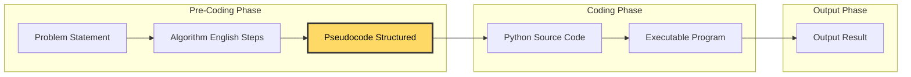
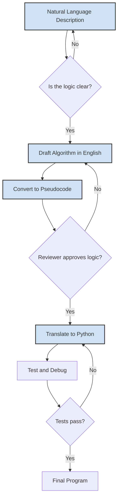
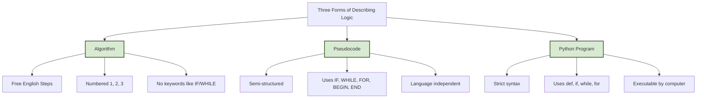
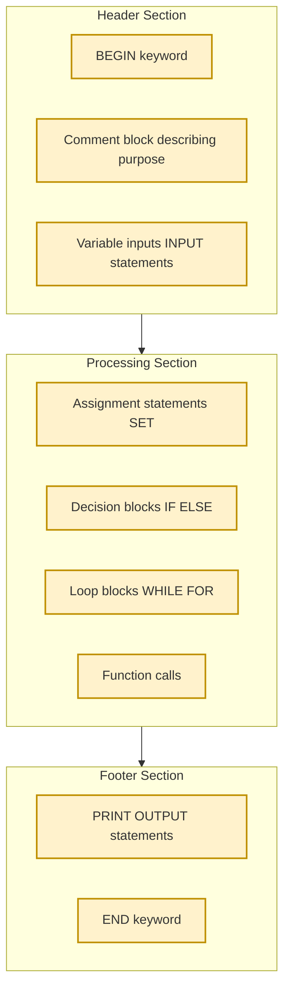

# ALGORITHM AND   PSEUDOCODE   REPRESENTATION:-   Meaning   and Definition of Pseudocode

<!-- SECTION_1_START -->
# ALGORITHM AND PSEUDOCODE REPRESENTATION — Meaning and Definition of Pseudocode

## 1. Core Technical Definition

> [!IMPORTANT]
> **Pseudocode** is a *plain-language, semi-formal description of the steps in an algorithm* that uses the structural conventions of programming languages (such as `IF...THEN...ELSE`, `WHILE`, `FOR`, `BEGIN...END`) combined with natural English statements. It is **not executable** by any computer, but it precisely captures the *logic* of a program so that it can be easily translated into any target programming language (such as **Python, C, Java**).

In the **KTU 2024 Scheme syllabus (UCEST105 – Algorithmic Thinking with Python)**, pseudocode is introduced as the **bridge** between an *informal algorithm* (written in English) and a *formal program* (written in Python). The word itself is a hybrid:

- **Pseudo** $\rightarrow$ Greek origin meaning *false* or *imitation*.
- **Code** $\rightarrow$ Refers to *programming code*.

Hence, pseudocode literally means *"false code"* or *"imitation of code"* — a structured draft that *looks* like a program but reads like English.

### 1.1 Intuitive Analogy — The Architectural Blueprint

> [!NOTE]
> **Real-world analogy: Building a House**
> Imagine you want to construct a house. An **architect's blueprint** is *not the actual house*, but it conveys every detail — room dimensions, door positions, wiring — clearly enough that any builder in the world can construct the same house. Pseudocode plays the **exact same role** in software development:
> - The **algorithm** = the homeowner's *idea* of the house.
> - The **pseudocode** = the *architect's blueprint*.
> - The **Python program** = the *actual constructed house*.

| Layer | Real-World Equivalent | Computing Equivalent |
| :--- | :--- | :--- |
| Idea / Need | *"I want a 3BHK house"* | Problem statement |
| Algorithm | *"Build walls, then roof, then paint"* | Step-by-step procedure |
| **Pseudocode** | **Architect's blueprint** | **Structured, language-neutral logic** |
| Program | Constructed house | Executable Python code |

### 1.2 Why Pseudocode Exists — The Translation Problem

Different programmers think in different languages (**C, Java, Python, C++**). If an algorithm is written directly in one language, others struggle to read it. Pseudocode solves this by being:

- **Language-independent** (no syntax of a particular language dominates).
- **Human-readable** (uses English vocabulary).
- **Logic-preserving** (every control structure of the final code is present).

> [!TIP]
> **KTU 2024 Board Tip:** Whenever a question asks *"Write an algorithm to..."* in the university exam, a well-formatted pseudocode using `BEGIN`, `END`, `IF...THEN`, `WHILE...DO` keywords will be awarded **full marks**, even though it cannot be compiled.

### 1.3 Formal KTU Definition (Verbatim Syllabus Style)

> **Pseudocode** is a *detailed yet readable description of what a computer program or algorithm must do, expressed in a stylized natural language that follows the structural conventions of programming languages*. It is used to plan the logic of a program before writing the actual code, allowing programmers to focus on *correctness of logic* rather than on *syntactical rules* of any specific language.

### 1.4 Place of Pseudocode in the Program Development Life Cycle (PDLC)

$$
\text{Problem} \;\longrightarrow\; \text{Algorithm} \;\longrightarrow\; \underbrace{\textbf{Pseudocode}}_{\text{Bridge}} \;\longrightarrow\; \text{Program (Python)} \;\longrightarrow\; \text{Executable}
$$

This is precisely the **Module 2** focus of UCEST105 — the transition from *Algorithm $\rightarrow$ Pseudocode $\rightarrow$ Python code*.

> [!VISUALIZATION CONTROL]
> **Concept:** Pseudocode as a Bridge between Algorithm and Code
> **Visual Inputs / Stages to plot on a horizontal number line:**
> * `Stage 0 = 1` → Natural language problem statement (*"Find the largest of three numbers"*)
> * `Stage 1 = 2` → Algorithm (English steps, numbered)
> * `Stage 2 = 3` → **Pseudocode (structured, mixed notation)**
> * `Stage 3 = 4` → Python source code
> * `Stage 4 = 5` → Compiled output
> **Visual Description:** The student should observe that *formality increases* (looseness decreases) as we move from left to right, with **pseudocode sitting exactly at the midpoint** — structured enough to be precise, loose enough to be readable.

<!-- SECTION_1_END -->

<!-- SECTION_2_START -->
# 2. Deep Theoretical Analysis — Characteristics, Conventions & Comparison

## 2.1 The Five Defining Properties of a Good Pseudocode

A KTU-evaluated pseudocode is judged by these five properties (each worth a mark in short-answer questions):

1. **Clarity (Plainness):** Every line must be unambiguous. No two interpretations should exist for a single line.
2. **Completeness:** Every logical path (including edge cases and termination conditions) must be described.
3. **Language Independence:** No syntax should depend on **Python, C, or Java** specifically. Keywords are universal.
4. **Structure Fidelity:** Control structures (`IF`, `WHILE`, `FOR`, `CASE`) must mirror their final-program equivalents exactly.
5. **Conciseness:** Avoid filler sentences. Use one statement per logical action.

## 2.2 Standard Pseudocode Keywords (KTU Accepted Set)

The following keywords are accepted across **KTU 2024 Scheme** answer scripts:

| Category | Accepted Keywords | Purpose |
| :--- | :--- | :--- |
| **Input / Output** | `INPUT`, `READ`, `OUTPUT`, `PRINT`, `DISPLAY` | Accept / produce data |
| **Assignment** | `SET`, `ASSIGN`, `←`, `=` | Store a value in a variable |
| **Decision** | `IF...THEN...ELSE`, `END IF`, `SWITCH...CASE` | Branching |
| **Loops** | `WHILE...DO...END WHILE`, `FOR...TO...END FOR`, `REPEAT...UNTIL` | Iteration |
| **Termination** | `STOP`, `END`, `HALT` | End the algorithm |
| **Subprograms** | `FUNCTION`, `PROCEDURE`, `CALL`, `RETURN` | Modular code |
| **Comments** | `//` or `/* ... */` | Annotate logic |

> [!NOTE]
> **Indentation is mandatory in pseudocode.** Just like Python, indentation denotes the *body* of a loop or a conditional block. A 4-space (or single tab) indent is the KTU standard.

## 2.3 The Difference Between an Algorithm, Pseudocode, and a Program

This is a **favourite 3-mark KTU question** in Part A. The comparison must be memorized.

$$
\begin{aligned}
\text{Algorithm} &= \text{Step-by-step procedure written in natural language (no fixed format).} \\
\text{Pseudocode} &= \text{Algorithm written in a stylized, programming-like notation.} \\
\text{Program} &= \text{Algorithm/pseudocode written in the syntax of a real language (Python).} \\
\end{aligned}
$$

## 2.4 KTU High-Yield Comparison Table

| Property | Algorithm | Pseudocode | Python Program |
| :--- | :--- | :--- | :--- |
| **Format** | Free, numbered steps | Semi-structured, keyword-based | Strictly structured (PEP 8) |
| **Executability** | None | None | Fully executable |
| **Language dependence** | None | None | Fully dependent on Python |
| **Includes syntax rules?** | No | Partially (keywords only) | Yes, every character matters |
| **Readability for beginners** | Highest | High | Lowest (initially) |
| **Used in KTU Module 2 for** | Designing logic | Documenting logic | Implementing logic |
| **Has `def`, `import`, `print()` syntax?** | No | No (uses `PRINT` not `print()`) | Yes |

## 2.5 Flowchart vs. Pseudocode (Why Pseudocode Wins for Text Exams)

| Aspect | Flowchart | Pseudocode |
| :--- | :--- | :--- |
| **Medium** | Graphical (shapes + arrows) | Textual |
| **KTU Exam mode** | Hard to draw on paper for 14-mark questions | Easy to type / write |
| **Best for** | Visual learners, small logic | Complex, nested, multi-page logic |
| **Editing** | Redraw entire diagram | Just edit lines |
| **Branching clarity** | Diamond shapes | `IF...ELSE` blocks |

> [!IMPORTANT]
> **KTU Examiner's Rule:** For any 14-mark question in Module 2, a student may answer using **pseudocode OR a flowchart**. Pseudocode is preferred because it is faster to write and cannot be mis-interpreted due to bad drawing.

## 2.6 Real-World Utility of Pseudocode in Engineering

- **Software Industry:** *Design documents* in companies like Google, TCS, and Infosys contain pseudocode that engineers translate into C++/Java/Python.
- **Research Papers:** Algorithms in *IEEE / ACM* papers are published as pseudocode so any researcher worldwide can re-implement them.
- **Competitive Programming:** Platforms like *Codeforces* and *LeetCode* accept pseudocode as a *planning step* in interviews.
- **Teaching:** First-year CS courses (like UCEST105) use pseudocode to delay the cognitive load of strict syntax.
- **AI & Machine Learning pipelines:** Algorithm designers draft the logic in pseudocode before committing to TensorFlow/PyTorch code.

## 2.7 Rules of Thumb While Writing KTU Pseudocode

1. **Always start with `BEGIN` and end with `END` / `STOP`.**
2. **Declare all variables implicitly** through the first `INPUT` or `SET` statement.
3. **Use `<--` or `=` for assignment** (not `==` which is comparison).
4. **Use `<>`, `>=`, `<=` for comparison** (universal mathematical symbols, not Python-specific).
5. **Use `//` for comments** to explain *why* a step exists.
6. **One statement per line** — never compress multiple operations.
7. **Indent loop and decision bodies** for visual nesting clarity.

<!-- SECTION_2_END -->

<!-- SECTION_3_START -->
# 3. Step-by-Step Derivations & Pseudocode-to-Python Translation

> [!IMPORTANT]
> **This section is exhaustive.** Every line of pseudocode is paired with its *Python translation* and *line-by-line explanation*. No step is skipped.

## 3.1 Worked Example 1 — Find the Largest of Three Numbers

### Step 1: The Natural Language Problem
> *"Given three numbers $A$, $B$, and $C$, find and display the largest."*

### Step 2: Algorithm (English Steps)

1. **Start.**
2. **Read** three numbers from the user.
3. **Compare** $A$ and $B$. Store the bigger in a temporary variable `MAX`.
4. **Compare** `MAX` and $C$. If $C$ is bigger, update `MAX`.
5. **Display** the value of `MAX`.
6. **Stop.**

### Step 3: Full Pseudocode (KTU 2024 Standard Format)

```
BEGIN
    // Algorithm to find the largest of three numbers
    INPUT A
    INPUT B
    INPUT C

    IF A > B THEN
        SET MAX <- A
    ELSE
        SET MAX <- B
    END IF

    IF C > MAX THEN
        SET MAX <- C
    END IF

    PRINT "The largest number is: ", MAX
END
```

### Step 4: Line-by-Line Explanation

| Line | Pseudocode | Meaning |
| :--- | :--- | :--- |
| 1 | `BEGIN` | Marks the start of the procedure. |
| 2 | `// Algorithm to find...` | Comment describing purpose. |
| 3 | `INPUT A` | Read value of $A$ from the user. |
| 4 | `INPUT B` | Read value of $B$ from the user. |
| 5 | `INPUT C` | Read value of $C$ from the user. |
| 6 | `IF A > B THEN` | Test if $A$ is strictly greater than $B$. |
| 7 | `SET MAX <- A` | If true, assign $A$ into `MAX`. |
| 8 | `ELSE` | Otherwise, the next line runs. |
| 9 | `SET MAX <- B` | Assign $B$ into `MAX`. |
| 10 | `END IF` | Close the first decision block. |
| 11 | `IF C > MAX THEN` | Test if $C$ beats the current `MAX`. |
| 12 | `SET MAX <- C` | Update `MAX` with $C$. |
| 13 | `END IF` | Close the second decision block. |
| 14 | `PRINT ...` | Output the final answer. |
| 15 | `END` | Mark the termination of the algorithm. |

### Step 5: Direct Python Implementation (Translating the Pseudocode)

```python
# UCEST105 - Module 2 Example
# Translation of the pseudocode above into executable Python 3

def find_largest_of_three() -> None:
    """
    Reads three integers from the user and prints the largest.
    This is the direct Python translation of the KTU pseudocode.
    """
    try:
        a: int = int(input("Enter value of A: "))
        b: int = int(input("Enter value of B: "))
        c: int = int(input("Enter value of C: "))

        # Step 1 of pseudocode: compare A and B
        if a > b:
            max_val: int = a
        else:
            max_val: int = b

        # Step 2 of pseudocode: compare MAX with C
        if c > max_val:
            max_val = c

        # Step 3 of pseudocode: display result
        print(f"The largest number is: {max_val}")

    except ValueError as err:
        print(f"Invalid input. Expected integers. Error: {err}")


if __name__ == "__main__":
    find_largest_of_three()
```

> [!TIP]
> Notice that *every single line* of pseudocode has a *direct one-to-one mapping* with a Python line. This is what makes pseudocode an *excellent planning tool*.

---

## 3.2 Worked Example 2 — Sum of First $N$ Natural Numbers

This example illustrates the **loop structure** in pseudocode.

### Mathematical Foundation

The closed-form formula is:
$$
\text{SUM} = \frac{N \times (N+1)}{2}
$$
However, the *algorithmic* approach (using a loop) is what KTU tests in Module 2.

### Pseudocode

```
BEGIN
    // Algorithm to compute 1 + 2 + 3 + ... + N
    INPUT N
    SET SUM <- 0
    SET I   <- 1

    WHILE I <= N DO
        SET SUM <- SUM + I
        SET I   <- I + 1
    END WHILE

    PRINT "Sum of first ", N, " natural numbers = ", SUM
END
```

### Step-by-Step Trace (Dry Run)

For $N = 4$:

| Iteration | $I$ (before) | $I \le N$? | New `SUM` | New $I$ |
| :---: | :---: | :---: | :---: | :---: |
| 1 | 1 | True | $0 + 1 = 1$ | 2 |
| 2 | 2 | True | $1 + 2 = 3$ | 3 |
| 3 | 3 | True | $3 + 3 = 6$ | 4 |
| 4 | 4 | True | $6 + 4 = 10$ | 5 |
| 5 | 5 | False | — Loop exits | — |

**Final Answer:** `SUM = 10`. Verification using the formula: $\dfrac{4 \times 5}{2} = 10$ ✓

### Python Translation

```python
def sum_first_n(n: int) -> int:
    """
    Computes 1 + 2 + ... + n using a while-loop.
    Direct translation of the KTU pseudocode above.
    """
    if n < 1:
        raise ValueError("n must be a positive natural number")

    total: int = 0
    i: int = 1
    while i <= n:
        total = total + i
        i = i + 1
    return total


if __name__ == "__main__":
    try:
        n_val: int = int(input("Enter N: "))
        result: int = sum_first_n(n_val)
        print(f"Sum of first {n_val} natural numbers = {result}")
    except ValueError as e:
        print(f"Error: {e}")
```

---

## 3.3 Worked Example 3 — Linear Search (Classic KTU Pattern)

### Pseudocode (Searching a value in a list)

```
BEGIN
    // Linear Search - returns position if found, else -1
    INPUT N                         // size of the list
    DECLARE ARRAY A[1..N]           // declare array of size N

    FOR I <- 1 TO N DO
        INPUT A[I]                  // populate the array
    END FOR

    INPUT KEY                       // value to search

    SET FOUND <- 0
    SET POS  <- -1

    FOR I <- 1 TO N DO
        IF A[I] = KEY THEN
            SET FOUND <- 1
            SET POS  <- I
            // break out of loop logically
        END IF
    END FOR

    IF FOUND = 1 THEN
        PRINT "Element found at position ", POS
    ELSE
        PRINT "Element not found"
    END IF
END
```

### Mathematical / Logical Explanation

The number of comparisons in the **worst case** is:
$$
T(n) = n
$$
The number of comparisons in the **best case** is:
$$
T(n) = 1 \quad \text{(if the element is at index 1)}
$$

### Python Translation

```python
def linear_search(arr: list, key: int) -> int:
    """
    Returns the 0-based index of `key` in `arr` if present, else -1.
    """
    n: int = len(arr)
    pos: int = -1
    found: bool = False

    for i in range(n):  # i runs 0 to n-1, equivalent to 1 to N
        if arr[i] == key:
            pos = i
            found = True
            break  # logically the same as exiting the FOR loop in pseudocode
    return pos


if __name__ == "__main__":
    try:
        n: int = int(input("Enter the size of the array: "))
        if n <= 0:
            raise ValueError("Size must be positive")

        a: list = []
        for j in range(n):
            val: int = int(input(f"Enter element {j + 1}: "))
            a.append(val)

        key: int = int(input("Enter the value to search: "))
        result: int = linear_search(a, key)

        if result != -1:
            print(f"Element found at position {result}")
        else:
            print("Element not found")
    except ValueError as e:
        print(f"Error: {e}")
```

---

## 3.4 Quick Reference — Pseudocode to Python Translation Table

| Pseudocode Construct | Python Equivalent |
| :--- | :--- |
| `BEGIN ... END` | `def func_name():` ... (function body) |
| `INPUT X` | `x = input(...)` or `int(input(...))` |
| `PRINT X` | `print(x)` |
| `SET A <- B` | `a = b` |
| `IF A > B THEN ... END IF` | `if a > b:` ... |
| `IF ... THEN ... ELSE ... END IF` | `if ... : ... else: ...` |
| `WHILE X < N DO ... END WHILE` | `while x < n:` ... |
| `FOR I <- 1 TO N DO ... END FOR` | `for i in range(1, n + 1):` ... |
| `REPEAT ... UNTIL X` | `while True: ... if x: break` |
| `FUNCTION NAME(args) ... RETURN` | `def name(args): ... return` |

<!-- SECTION_3_END -->

<!-- SECTION_4_START -->
# 4. Structural Diagrams & Schematics

## 4.1 Mermaid Block Diagram — The Role of Pseudocode in the PDLC



**Interpretation:** The yellow node **PS (Pseudocode)** is visually highlighted as the *bridge* between the *Pre-Coding Phase* (where logic is designed) and the *Coding Phase* (where logic is implemented). This is the central visual takeaway of Module 2.

---

## 4.2 Mermaid State Diagram — Translation Flow



**Interpretation:** This iterative loop shows that **pseudocode is a checkpoint** — once reviewer-approved, the costly step of writing Python code is undertaken with high confidence.

---

## 4.3 Mermaid Comparison Tree — Algorithm vs. Pseudocode vs. Program



---

## 4.4 Mermaid Block Architecture — Anatomy of a Pseudocode Document



**Interpretation:** Every well-formed pseudocode in KTU exams contains *exactly* these three sections in this order.

<!-- SECTION_4_END -->

<!-- SECTION_5_START -->
# 5. KTU 2024 Scheme Examination Question Bank & Topic Recap

## 5.1 Part A — Short Answer Questions (3 Marks Each)

### **Question A1** `[KTU University Exam - July 2024]`
> **Define pseudocode. List any four characteristics of a good pseudocode.**

**Model Answer (3 Marks):**
> **Definition (1 Mark):** Pseudocode is a detailed description of the steps of an algorithm written in a stylized natural language that uses the structural conventions of programming languages, but is *not* itself executable on a computer.
>
> **Four Characteristics (2 Marks — 0.5 each):**
> 1. **Clarity:** Each line has a single, unambiguous meaning.
> 2. **Language Independence:** No syntax is specific to Python, C, or Java.
> 3. **Completeness:** Every logical path, including termination, is specified.
> 4. **Conciseness:** Unnecessary words are eliminated; one statement per logical step.

---

### **Question A2** `[KTU University Exam - Dec 2023]`
> **Differentiate between an algorithm and pseudocode. (Write any three points.)**

**Model Answer (3 Marks — 1 per point):**

| S.No. | Algorithm | Pseudocode |
| :---: | :--- | :--- |
| 1 | Written in natural English with numbered steps. | Written in a stylized, keyword-based notation (`IF`, `WHILE`). |
| 2 | No fixed structure or format is required. | Has a fixed structure with `BEGIN`...`END` blocks. |
| 3 | Cannot use programming constructs explicitly. | Mimics control structures of real programming languages. |

---

## 5.2 Part B — Long Answer Questions (14 Marks Each)

> *As per KTU 2024 ESE pattern, each Part B question carries 14 marks with sub-parts of 7 + 7 marks.*

---

### **Question B1 — Set A (14 Marks)** `[KTU University Exam - July 2024]`

> **(a)** Explain the term *pseudocode* with a suitable real-world analogy. List the **standard keywords** used in pseudocode. **(7 Marks — Understand)**
>
> **(b)** Write a pseudocode to **check whether a given number is even or odd** and translate it into an equivalent Python program. **(7 Marks — Apply)**

### **Model Answer for B1(a) — 7 Marks**

**Definition (2 Marks):** Pseudocode is a *semi-formal, language-independent description of an algorithm* that uses a mixture of natural English and programming-style keywords like `IF`, `WHILE`, `FOR`, `BEGIN`, and `END`. It is *not executable*, but it is precise enough to be translated into any programming language.

**Analogy (2 Marks):** Think of pseudocode as an **architect's blueprint** for a building. The blueprint is not the building itself, but it conveys the *exact plan* (number of rooms, door positions, electrical layout) clearly enough for *any builder* in the world to construct the same building. Similarly, pseudocode conveys the *exact logic* of a program clearly enough for *any programmer* in any language (Python, C, Java) to implement the same algorithm.

**Standard Keywords (3 Marks — 0.5 each for 6 keywords):**
`BEGIN`, `END`, `INPUT`, `OUTPUT / PRINT`, `IF...THEN...ELSE`, `WHILE...DO...END WHILE`, `FOR...TO...END FOR`, `SET / ASSIGN`, `FUNCTION`, `RETURN`, `//` (comment).

### **Model Answer for B1(b) — 7 Marks**

**Pseudocode (4 Marks):**
```
BEGIN
    // Algorithm to check whether a number is even or odd
    INPUT N
    SET R <- N MOD 2

    IF R = 0 THEN
        PRINT N, " is an Even number"
    ELSE
        PRINT N, " is an Odd number"
    END IF
END
```

**[Writing `BEGIN` and `END` correctly: 1 Mark]**
**[Correct use of `MOD` operator: 1 Mark]**
**[Correct branching logic: 1 Mark]**
**[Proper indentation and comment: 1 Mark]**

**Python Translation (3 Marks):**
```python
def check_even_odd() -> None:
    try:
        n: int = int(input("Enter an integer: "))
        if n % 2 == 0:
            print(f"{n} is an Even number")
        else:
            print(f"{n} is an Odd number")
    except ValueError as e:
        print(f"Invalid input. Error: {e}")


if __name__ == "__main__":
    check_even_odd()
```

**[Correct translation of `MOD` to `%`: 1 Mark]**
**[Correct use of `if-else`: 1 Mark]**
**[Final print statement: 1 Mark]**

---

### **Question B1 — Set B (14 Marks)** `[KTU University Exam - Dec 2023]`

> **(a)** Compare and contrast: **Algorithm, Pseudocode, and Python Program** using a tabular format with at least five parameters. **(7 Marks — Understand)**
>
> **(b)** Write a pseudocode to **find the factorial of a given positive integer N** using a `WHILE` loop, and trace it for $N = 5$. **(7 Marks — Apply)**

### **Model Answer for B1(a) — 7 Marks**

**Comparison Table (5 Marks — 1 per row):**

| Parameter | Algorithm | Pseudocode | Python Program |
| :--- | :--- | :--- | :--- |
| **Format** | Free, natural English | Stylized, mixed notation | Strict syntax |
| **Executability** | Not executable | Not executable | Executable |
| **Language Dependence** | None | None | Fully Python-dependent |
| **Use of Control Structures** | Implicit (e.g., "repeat") | Explicit (`WHILE`, `FOR`) | Explicit (`while`, `for`) |
| **Purpose** | Idea documentation | Logic planning | Final implementation |

**Conclusion (2 Marks):** Pseudocode acts as the *intermediate bridge* between an *informal algorithm* and a *formal Python program*, allowing logic verification before code writing.

### **Model Answer for B1(b) — 7 Marks**

**Pseudocode (4 Marks):**
```
BEGIN
    // Algorithm to compute N! (factorial of N)
    INPUT N
    SET FACT <- 1
    SET I   <- 1

    WHILE I <= N DO
        SET FACT <- FACT * I
        SET I    <- I + 1
    END WHILE

    PRINT "Factorial of ", N, " is ", FACT
END
```

**[Initialization of `FACT = 1` and `I = 1`: 1 Mark]**
**[Correct `WHILE` loop condition: 1 Mark]**
**[Correct update statements inside loop: 1 Mark]**
**[Final `PRINT` and `END`: 1 Mark]**

**Trace Table for $N = 5$ (3 Marks — 0.5 per row):**

| Iteration | $I$ (before) | $I \le 5$? | `FACT` (after) | $I$ (after) |
| :---: | :---: | :---: | :---: | :---: |
| 1 | 1 | True | $1 \times 1 = 1$ | 2 |
| 2 | 2 | True | $1 \times 2 = 2$ | 3 |
| 3 | 3 | True | $2 \times 3 = 6$ | 4 |
| 4 | 4 | True | $6 \times 4 = 24$ | 5 |
| 5 | 5 | True | $24 \times 5 = 120$ | 6 |
| 6 | 6 | False | Loop exits | — |

**Final Answer:** $5! = 120$ ✓

---

## 5.3 KTU Examiner's Valuation Warning / Pitfall Callout

> [!WARNING]
> **Common places where students LOSE marks in Module 2 pseudocode questions:**
>
> 1. **Forgetting `BEGIN` and `END` keywords** — Costs **1 full mark** in the valuation key. Always bracket your logic.
> 2. **Using Python-specific syntax in pseudocode** (e.g., writing `print()` instead of `PRINT`, or `def` instead of `FUNCTION`). This violates *language independence* and may cost up to **2 marks**.
> 3. **Missing the indentation in `IF` / `WHILE` blocks** — Examiner cannot tell which lines belong to the body. Always indent.
> 4. **No termination condition in loops** — A `WHILE` loop with no `I <- I + 1` style update leads to an *infinite loop*; examiner will deduct **1–2 marks** for unsafe logic.
> 5. **Using `==` for assignment** — In pseudocode, `==` is *comparison*. Use `<-` or `=` (assignment) to avoid ambiguity.
> 6. **Not showing a dry-run / trace table** in 7-mark Apply-level questions — A trace table for $N = 5$ or similar is often worth **2–3 marks** by itself.
> 7. **Writing the algorithm but not the pseudocode** — The question asks for *pseudocode* specifically. Pure English is acceptable as a "Step-wise algorithm" but the *structured* form is preferred and scores higher.

---

## 5.4 Topic Recap & Important Things to Remember

> [!IMPORTANT]
> **High-Density Revision Checklist — Must memorize before the KTU exam:**

- **Definition:** Pseudocode = *structured, English-like, language-independent description of an algorithm*. It is **not executable** by a computer.
- **Etymology:** *Pseudo* (false) + *Code* (programming code) $\rightarrow$ "imitation of code".
- **Purpose:** Acts as a **bridge** between an *informal algorithm* and a *formal program*.
- **Five Properties:** Clarity, Completeness, Language Independence, Structure Fidelity, Conciseness.
- **Mandatory Keywords to remember:** `BEGIN`, `END`, `INPUT`, `PRINT`, `SET / ASSIGN`, `IF...THEN...ELSE`, `WHILE...DO`, `FOR...TO`, `FUNCTION`, `RETURN`, `//` (comment).
- **Indentation is non-negotiable** — every block (loop / if) must be indented.
- **Assignment symbol:** Use `<-` or `=` (NOT `==`, which is comparison).
- **Comparison operators:** Use $<$, $>$, $<=$, $>=$, $<>$ (universal, language-neutral).
- **Standard sections of a pseudocode:** Header (`BEGIN` + comment) $\rightarrow$ Body (logic) $\rightarrow$ Footer (`PRINT` + `END`).
- **Algorithm vs. Pseudocode vs. Program:** Algorithm = free English; Pseudocode = structured notation; Program = strict syntax in a real language.
- **Flowchart vs. Pseudocode:** Pseudocode is *preferred* in KTU written exams for speed and clarity.
- **Translation rule:** Every pseudocode line maps to **one** Python line, allowing 1-to-1 conversion.
- **Sample canonical problems** (practise these for sure):
  1. Largest of two / three numbers
  2. Even or odd check
  3. Sum of first $N$ natural numbers
  4. Factorial of $N$
  5. Linear Search in an array
  6. Fibonacci series generation
  7. Prime number check
- **Trace-table columns to remember:** `Iteration No. | Variable Values (before) | Condition Check | Updated Values (after)`.
- **Common pitfalls** (avoid for full marks): no `BEGIN`/`END`, Python syntax in pseudocode, no indentation, infinite loops, using `==` for assignment, missing the trace table.

<!-- SECTION_5_END -->
