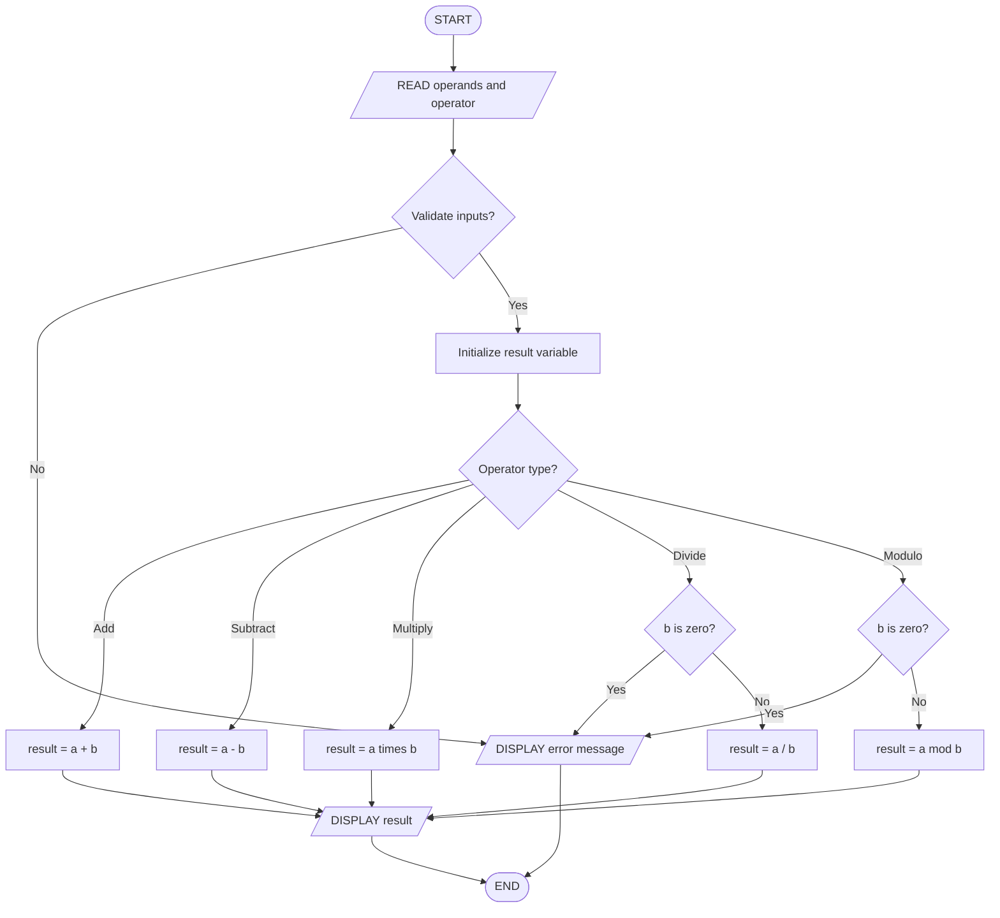
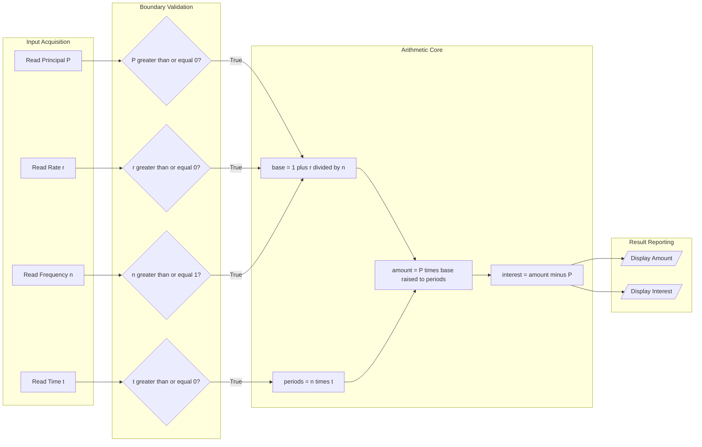
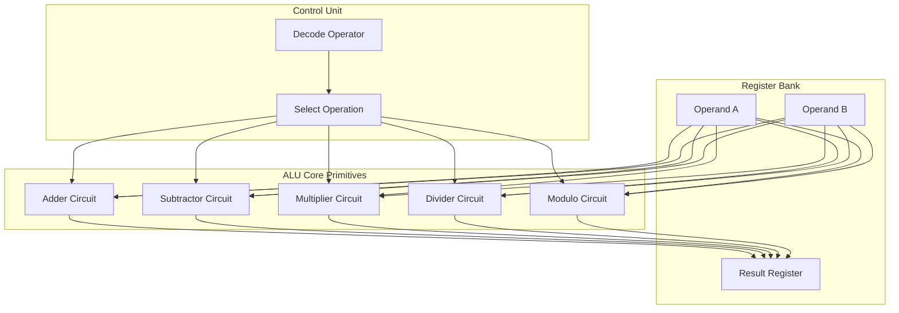

# arithmetic calculations

<!-- SECTION_1_START -->
# 1. Core Technical Definition & Intuitive Overview

## Formal Definition (KTU 2024 Syllabus Terminology)

In the context of **Algorithmic Thinking with Python (UCEST105)**, **Arithmetic Calculations** refer to the systematic, step-by-step computational procedures that perform mathematical operations such as addition, subtraction, multiplication, division, exponentiation, and modular reduction on numerical operands to produce a well-defined numeric result.

According to the KTU 2024 Scheme Module 2 learning outcomes, an algorithm expressing arithmetic calculations must clearly define:
- The **inputs** (operands and operator)
- The **process** (the sequence of operations governed by operator precedence and associativity)
- The **output** (the final computed value)

> [!IMPORTANT]
> **KTU 2024 Definition — Algorithm for Arithmetic**
> A finite, ordered sequence of unambiguous instructions that accepts numerical inputs, applies one or more arithmetic operators respecting the rules of precedence and associativity, and terminates by producing a single numeric output.

## Conceptual Analogy / Intuition

Imagine a **traditional Indian sweet shop counter (the "thattu kada")**. The shopkeeper receives a verbal order:
- *“Anna, give me 2 kilos of *unniyappam* and 3 kilos of *kozhukatta*.”*

To compute the bill, the shopkeeper must:
1. Look up the **price per kilo** of each item (fetch the operands).
2. **Multiply** quantity by price for each (intermediate computations).
3. **Add** the two intermediate totals (final summation).
4. **Hand over** the final bill (output the result).

A computer doing arithmetic is exactly this shopkeeper — except the menu, prices, and quantities are stored in memory cells, and the multiplication and addition are executed by the Arithmetic Logic Unit (**ALU**).

> [!NOTE]
> **Key Insight for KTU Students:**
> Every arithmetic calculation, no matter how complex (e.g., solving a quadratic equation), is fundamentally a *composition* of the five primitive operations: $+$, $-$, $\times$, $\div$, and $\text{mod}$. Algorithm design is the act of sequencing these primitives safely.

## Standard Constants and Metrics

| Symbol | Meaning | Standard Value / Form |
| :--- | :--- | :--- |
| $\pi$ | Mathematical constant Pi | $\approx 3.14159265$ |
| $e$ | Euler's number | $\approx 2.71828183$ |
| $g$ | Standard gravity | $9.81\ \text{m/s}^2$ |
| IEEE 754 | Floating point precision | **64-bit double precision** (used in Python `float`) |

> [!VISUALIZATION CONTROL]
> **Concept:** Operator Precedence Ladder Visualization
> **GeoGebra / Desmos Input Equations:**
> * `y = x^2 + 3*x - 5` (a polynomial showing evaluation order)
> * `f(x) = (2*x + 4) / (x - 1)` (a rational expression to compare grouping)
> **Visual Description:** Plot both curves for $x \in [-5, 5]$. Observe how $f(x)$ has a vertical asymptote at $x = 1$, illustrating why the order of division and addition matters — without parentheses, the algorithm would interpret the expression differently.
<!-- SECTION_1_END -->

<!-- SECTION_2_START -->
# 2. Deep Theoretical Analysis & KTU High-Yield Formula Sheet

## 2.1 The Five Primitive Arithmetic Operations

Every arithmetic algorithm is constructed by composing the following primitives:

1. **Addition** — combines two quantities into a sum.
2. **Subtraction** — finds the difference between two quantities.
3. **Multiplication** — repeated addition; scales a quantity.
4. **Division** — repeated subtraction; partitions a quantity.
5. **Modulo** — returns the remainder of integer division.

> [!IMPORTANT]
> In Python, the modulo operator is `%` and integer (floor) division is `//`. These are extremely common in KTU board questions on arithmetic algorithms.

## 2.2 Operator Precedence and Associativity

When multiple operators appear in one expression, the algorithm must respect **precedence** (which operator binds tightest) and **associativity** (which direction to evaluate when precedence is equal).

| Precedence Level | Operator(s) | Associativity | Python Symbol(s) |
| :---: | :--- | :---: | :---: |
| 1 (Highest) | Parentheses | Left-to-right | `()` |
| 2 | Exponentiation | Right-to-left | `**` |
| 3 | Unary plus/minus | Right-to-left | `+x`, `-x` |
| 4 | Multiplication, Division, Floor Div, Modulo | Left-to-right | `*`, `/`, `//`, `%` |
| 5 (Lowest) | Addition, Subtraction | Left-to-right | `+`, `-` |

> [!NOTE]
> **Why does this matter in algorithms?**
> If a student writes the algorithm step `result = a + b * c` without understanding precedence, the algorithm silently computes $a + (b \times c)$, **not** $(a + b) \times c$. This is a frequent source of lost marks in KTU valuation.

## 2.3 Types of Arithmetic in Python

| Type | Python Class | Example | Range / Notes |
| :--- | :--- | :--- | :--- |
| Integer | `int` | `42` | Arbitrary precision (unbounded) |
| Floating point | `float` | `3.14` | IEEE 754 double (64-bit) |
| Complex | `complex` | `2 + 3j` | Real + Imaginary parts |
| Boolean | `bool` | `True`, `False` | Subclass of `int` (True $= 1$) |

## 2.4 KTU Formula Sheet — Arithmetic Algorithms

| # | Formula / Pseudocode Construct | Mathematical Form | Description |
| :-: | :--- | :--- | :--- |
| 1 | Sum of first $n$ naturals | $S = \dfrac{n(n+1)}{2}$ | Avoids loop; closed form |
| 2 | Sum of first $n$ even numbers | $E = n(n+1)$ | Direct closed form |
| 3 | Sum of first $n$ odd numbers | $O = n^2$ | Direct closed form |
| 4 | Average of $n$ values | $\bar{x} = \dfrac{\sum_{i=1}^{n} x_i}{n}$ | Mean value |
| 5 | Simple interest | $I = \dfrac{P \cdot R \cdot T}{100}$ | $P$ = principal, $R$ = rate, $T$ = time |
| 6 | Compound amount | $A = P \left(1 + \dfrac{r}{n}\right)^{n t}$ | $n$ = compounds/year, $t$ = years |
| 7 | Euclidean GCD | $\gcd(a, b) = \gcd(b, a\ \bmod\ b)$ | Recursive reduction |
| 8 | Remainder operation | $a = (a \div b) \times b + (a \bmod b)$ | Division algorithm identity |
| 9 | Power by squaring | $a^b = \prod$ of squared factors | Fast exponentiation |
| 10 | Distance formula | $d = \sqrt{(x_2 - x_1)^2 + (y_2 - y_1)^2}$ | 2D Euclidean distance |

> [!IMPORTANT]
> **Engineering Utility:**
> - Formula 5 and 6 appear in **financial engineering** algorithms (loan calculators, EMI systems).
> - Formula 7 (Euclidean GCD) is the backbone of the **RSA cryptography** algorithm used in HTTPS.
> - Formula 10 is the core of **GPS navigation** and **K-means clustering** in machine learning.

## 2.5 Common Pitfalls in Arithmetic Algorithms

1. **Integer division truncation** — In Python 3, `7 / 2 = 3.5` (true division), but `7 // 2 = 3` (floor division). KTU questions often test this distinction.
2. **Operator precedence ambiguity** — Always parenthesize complex expressions in pseudocode.
3. **Floating-point rounding** — `0.1 + 0.2 == 0.3` evaluates to `False` due to IEEE 754 representation.
4. **Overflow / underflow** — Less of a concern in Python (unbounded integers), but critical in C/Java.
<!-- SECTION_2_END -->

<!-- SECTION_3_START -->
# 3. Step-by-Step Derivations & Code/Symbolic Implementation

## 3.1 Derivation: Sum of First $n$ Natural Numbers

We want to derive the closed-form formula used in arithmetic algorithms. Consider the sum:

$$
S = 1 + 2 + 3 + \dots + n
$$

**Step 1 — Write the sum forward and backward:**

$$
S = 1 + 2 + 3 + \dots + (n-1) + n
$$

$$
S = n + (n-1) + (n-2) + \dots + 2 + 1
$$

**Step 2 — Add both representations column-wise:**

$$
2S = (1+n) + (2+(n-1)) + (3+(n-2)) + \dots + (n+1)
$$

**Step 3 — Observe that every column pairs to $(n+1)$, and there are $n$ such pairs:**

$$
2S = n \cdot (n+1)
$$

**Step 4 — Divide both sides by 2:**

$$
S = \frac{n(n+1)}{2}
$$

> [!NOTE]
> This closed form allows an algorithm to compute the sum in **O(1)** time instead of the **O(n)** time of a loop. KTU frequently asks students to write *both* versions of this algorithm.

## 3.2 Worked Example: Compound Interest Arithmetic

Given: Principal $P = 10000$, Rate $r = 5\%$ per annum, Time $t = 3$ years, $n = 1$ (annual compounding).

**Step 1 — Identify inputs:** $P = 10000$, $r = 0.05$, $t = 3$, $n = 1$.

**Step 2 — Substitute into the compound amount formula:**

$$
A = P \left(1 + \frac{r}{n}\right)^{n t}
$$

**Step 3 — Evaluate the inner bracket:**

$$
1 + \frac{0.05}{1} = 1.05
$$

**Step 4 — Evaluate the exponent:**

$$
n \cdot t = 1 \cdot 3 = 3
$$

**Step 5 — Raise to the power:**

$$
(1.05)^3 = 1.157625
$$

**Step 6 — Multiply by the principal:**

$$
A = 10000 \times 1.157625 = 11576.25
$$

**Step 7 — Compute the interest (output):**

$$
I = A - P = 11576.25 - 10000 = 1576.25
$$

## 3.3 Pseudocode Implementation (KTU Board Format)

```text
ALGORITHM: Compute_Compound_Interest
INPUT  : Principal P (float), Rate r (float), Time t (int), n (int)
OUTPUT : Amount A (float), Interest I (float)

BEGIN
    READ P, r, t, n
    
    // Step 1: Compute the growth factor per compounding period
    base <- 1 + (r / n)
    
    // Step 2: Compute total number of compounding periods
    periods <- n * t
    
    // Step 3: Apply the exponentiation
    amount <- POWER(base, periods)
    
    // Step 4: Compute interest as the difference
    interest <- amount - P
    
    DISPLAY "Final Amount  = ", amount
    DISPLAY "Interest Earned = ", interest
END
```

## 3.4 Python Implementation (Production-Grade)

```python
def compute_compound_interest(
    principal: float,
    rate: float,
    time_years: int,
    compounds_per_year: int = 1
) -> tuple[float, float]:
    """
    Computes compound interest using the standard formula.
    
    Args:
        principal: Initial investment amount (must be >= 0).
        rate: Annual interest rate as a decimal (e.g., 0.05 for 5%).
        time_years: Duration in whole years (must be >= 0).
        compounds_per_year: Compounding frequency per year (must be >= 1).
    
    Returns:
        A tuple (final_amount, interest_earned).
    
    Raises:
        ValueError: If any input violates its boundary constraints.
    """
    # --- Boundary / Input Validation ---
    if principal < 0:
        raise ValueError(f"Principal must be non-negative, got {principal}")
    if rate < 0:
        raise ValueError(f"Rate must be non-negative, got {rate}")
    if time_years < 0:
        raise ValueError(f"Time must be non-negative, got {time_years}")
    if compounds_per_year < 1:
        raise ValueError(f"Compounding frequency must be >= 1, got {compounds_per_year}")
    
    # --- Arithmetic Core ---
    base_growth_factor: float = 1.0 + (rate / compounds_per_year)
    total_periods: int = compounds_per_year * time_years
    final_amount: float = principal * (base_growth_factor ** total_periods)
    interest_earned: float = final_amount - principal
    
    return final_amount, interest_earned


# --- Driver / Test Block ---
if __name__ == "__main__":
    try:
        P, R, T, N = 10000.0, 0.05, 3, 1
        amount, interest = compute_compound_interest(P, R, T, N)
        print(f"Final Amount  = {amount:.2f}")
        print(f"Interest Earned = {interest:.2f}")
    except ValueError as err:
        print(f"[INPUT ERROR] {err}")
```

**Execution trace (matching the worked example):**
- `base_growth_factor = 1.0 + (0.05 / 1) = 1.05`
- `total_periods = 1 * 3 = 3`
- `final_amount = 10000.0 * (1.05 ** 3) = 11576.25`
- `interest_earned = 11576.25 - 10000.0 = 1576.25`

## 3.5 Derivation: Euclidean GCD by Repeated Remainder

We want to compute $\gcd(a, b)$ where $a, b \in \mathbb{Z}^+$.

**Step 1 — Apply the division algorithm:**

$$
a = bq + r, \quad 0 \le r < b
$$

**Step 2 — The key theorem:** $\gcd(a, b) = \gcd(b, r)$.

**Step 3 — Iterate until the remainder becomes 0:** When $r = 0$, the GCD is $b$.

**Step 4 — Worked example:** Compute $\gcd(48, 18)$.

$$
48 = 18 \cdot 2 + 12 \quad \Rightarrow \quad \gcd(48, 18) = \gcd(18, 12)
$$

$$
18 = 12 \cdot 1 + 6 \quad \Rightarrow \quad \gcd(18, 12) = \gcd(12, 6)
$$

$$
12 = 6 \cdot 2 + 0 \quad \Rightarrow \quad \gcd(12, 6) = 6
$$

**Final result:** $\gcd(48, 18) = 6$.

```python
def euclidean_gcd(a: int, b: int) -> int:
    """Computes the greatest common divisor using the Euclidean algorithm."""
    if a < 0 or b < 0:
        raise ValueError("GCD inputs must be non-negative integers.")
    if a == 0:
        return b
    if b == 0:
        return a
    
    while b != 0:
        quotient: int = a // b
        remainder: int = a - (quotient * b)   # explicit arithmetic decomposition
        a, b = b, remainder
    return a
```
<!-- SECTION_3_END -->

<!-- SECTION_4_START -->
# 4. Structural Diagrams & Schematics

## 4.1 Flowchart — Generic Arithmetic Calculation Algorithm

The following Mermaid flowchart models the universal control flow of any arithmetic algorithm: read inputs, validate, compute, output.



## 4.2 Sequence Diagram — Modular Decomposition of Compound Interest



## 4.3 Block Architecture — Arithmetic Logic Unit (ALU) Analogy



> [!NOTE]
> **Pedagogical Note:**
> The diagrams above intentionally separate *what data flows where* (the topology) rather than mimicking transistor-level circuit drawings. This block-level decomposition mirrors the way KTU questions test algorithmic thinking — focusing on **data movement, branching, and termination**, not hardware schematics.
<!-- SECTION_4_END -->

<!-- SECTION_5_START -->
# 5. KTU 2024 Scheme Examination Question Bank & Topic Recap

## Part A — Short Answer Questions (3 Marks Each)

### Question 1 `[KTU University Exam - July 2024]`
**CO1, Remember:** Define an algorithm for arithmetic calculations. List the five primitive arithmetic operators used in Python.

**Model Answer (Valuation Key):**
An algorithm for arithmetic calculations is a finite, ordered sequence of unambiguous instructions that accepts numerical inputs, performs one or more arithmetic operations respecting operator precedence, and produces a numeric output. **[2 Marks]**

The five primitive arithmetic operators in Python are: `+` (addition), `-` (subtraction), `*` (multiplication), `/` (true division), `//` (floor division), `%` (modulo), and `**` (exponentiation). **[1 Mark]**

### Question 2 `[KTU University Exam - Dec 2023]`
**CO1, Understand:** Differentiate between the `/` and `//` operators in Python with a suitable example.

**Model Answer (Valuation Key):**
The `/` operator performs **true division** and always returns a floating-point result, e.g., `7 / 2 = 3.5`. **[1.5 Marks]**
The `//` operator performs **floor division** and returns the integer quotient rounded toward negative infinity, e.g., `7 // 2 = 3` and `-7 // 2 = -4`. **[1.5 Marks]**

---

## Part B — Long Answer Questions (14 Marks Each, Internal Choice)

### Question A `[KTU University Exam - Dec 2024]` — **CO2, Apply & Analyze**

**(a)** Design an algorithm using pseudocode to compute the **simple interest** and the **total amount** payable given the principal, rate of interest, and time period. Show the step-by-step calculation for $P = 5000$, $R = 8\%$, $T = 2$ years. **[7 Marks]**

**(b)** Extend the algorithm to compute **compound interest** compounded annually for the same inputs, and display both the simple interest and compound interest side by side. Justify which yields a higher return. **[7 Marks]**

---

#### Model Solution — Part (a)

**Step 1 — State the formula:** The simple interest formula is:

$$
I = \frac{P \cdot R \cdot T}{100}
$$

Total amount $A = P + I$. **[Stating formula: 1 Mark]**

**Step 2 — Pseudocode:** **[Pseudocode block: 3 Marks]**

```text
ALGORITHM: SimpleInterest
INPUT  : P (float), R (float), T (float)
OUTPUT : Interest I (float), Amount A (float)

BEGIN
    READ P, R, T
    
    IF P < 0 OR R < 0 OR T < 0 THEN
        DISPLAY "Invalid input"
        RETURN
    ENDIF
    
    interest <- (P * R * T) / 100
    amount   <- P + interest
    
    DISPLAY "Simple Interest = ", interest
    DISPLAY "Total Amount    = ", amount
END
```

**Step 3 — Substitute $P = 5000$, $R = 8$, $T = 2$:** **[Substitution: 1 Mark]**

$$
I = \frac{5000 \times 8 \times 2}{100} = \frac{80000}{100} = 800
$$

$$
A = 5000 + 800 = 5800
$$

**Step 4 — Final answer:** Simple Interest = **800**, Amount = **5800**. **[Final values: 2 Marks]**

---

#### Model Solution — Part (b)

**Step 1 — State the compound interest formula:** **[Formula: 1 Mark]**

$$
A = P \left(1 + \frac{R}{100}\right)^{T}, \quad I_c = A - P
$$

**Step 2 — Extended pseudocode:** **[Pseudocode: 3 Marks]**

```text
ALGORITHM: Compare_SI_CI
INPUT  : P (float), R (float), T (int)
OUTPUT : Display of both interests

BEGIN
    READ P, R, T
    
    // Simple Interest branch
    SI  <- (P * R * T) / 100
    SA  <- P + SI
    
    // Compound Interest branch
    CA  <- P * POWER(1 + R/100, T)
    CI  <- CA - P
    
    DISPLAY "Simple Interest   = ", SI
    DISPLAY "Compound Interest = ", CI
    DISPLAY "Amount (SI)       = ", SA
    DISPLAY "Amount (CI)       = ", CA
END
```

**Step 3 — Compute compound interest for the same inputs:** **[Calculation: 1 Mark]**

$$
A = 5000 \times \left(1 + \frac{8}{100}\right)^{2} = 5000 \times (1.08)^2
$$

$$
(1.08)^2 = 1.1664
$$

$$
A = 5000 \times 1.1664 = 5832.00
$$

$$
I_c = 5832.00 - 5000 = 832.00
$$

**Step 4 — Comparison and justification:** **[Comparison: 2 Marks]**

| Metric | Simple Interest | Compound Interest |
| :--- | :---: | :---: |
| Interest Earned | $800.00$ | $832.00$ |
| Total Amount | $5800.00$ | $5832.00$ |

**Justification:** Compound interest yields a higher return ($832.00 > 800.00$) because the interest earned each year is added back to the principal, creating a *snowball effect* of interest-on-interest. The difference of $\mathbf{32.00}$ represents the additional interest gained by reinvesting the first year's interest of $400$ at $8\%$ for the second year.

---

### Question B (Internal Choice) `[KTU University Exam - July 2024]` — **CO2, Apply & Analyze**

**(a)** Write an algorithm and the corresponding Python program to compute the **sum of the first $n$ natural numbers** using a `for` loop. Validate that the result matches the closed-form formula $\frac{n(n+1)}{2}$. **[7 Marks]**

**(b)** Modify the algorithm to compute the **sum of the first $n$ odd numbers** and the **sum of the first $n$ even numbers** in a single pass. Verify the results for $n = 10$. **[7 Marks]**

---

#### Model Solution — Part (a)

**Step 1 — Algorithm in pseudocode:** **[Pseudocode: 3 Marks]**

```text
ALGORITHM: SumFirstN
INPUT  : n (int, n >= 1)
OUTPUT : sum_loop (int), sum_formula (int), match (bool)

BEGIN
    READ n
    IF n < 1 THEN
        DISPLAY "n must be a positive integer"
        RETURN
    ENDIF
    
    // Method 1: Iterative loop
    sum_loop <- 0
    FOR i FROM 1 TO n DO
        sum_loop <- sum_loop + i
    ENDFOR
    
    // Method 2: Closed-form formula
    sum_formula <- n * (n + 1) / 2
    
    DISPLAY "Sum (loop)   = ", sum_loop
    DISPLAY "Sum (formula)= ", sum_formula
    DISPLAY "Match        = ", (sum_loop == sum_formula)
END
```

**Step 2 — Python program:** **[Code: 2 Marks]**

```python
def sum_first_n(n: int) -> tuple[int, int, bool]:
    if n < 1:
        raise ValueError("n must be a positive integer.")
    
    sum_loop: int = 0
    for i in range(1, n + 1):
        sum_loop += i
    
    sum_formula: int = n * (n + 1) // 2
    return sum_loop, sum_formula, sum_loop == sum_formula
```

**Step 3 — Verification with $n = 10$:** **[Verification: 2 Marks]**

- Loop result: $1+2+3+\dots+10 = 55$
- Formula result: $\frac{10 \times 11}{2} = 55$
- Match: **True** ✓

---

#### Model Solution — Part (b)

**Step 1 — Identify the two arithmetic sequences:** **[Setup: 1 Mark]**
- First $n$ even numbers: $2, 4, 6, \dots, 2n$
- First $n$ odd numbers: $1, 3, 5, \dots, (2n-1)$

**Step 2 — Pseudocode for a single-pass algorithm:** **[Pseudocode: 3 Marks]**

```text
ALGORITHM: SumOddEven
INPUT  : n (int, n >= 1)
OUTPUT : sum_even (int), sum_odd (int)

BEGIN
    READ n
    sum_even <- 0
    sum_odd  <- 0
    
    FOR k FROM 1 TO n DO
        even_term <- 2 * k
        odd_term  <- (2 * k) - 1
        sum_even  <- sum_even + even_term
        sum_odd   <- sum_odd  + odd_term
    ENDFOR
    
    DISPLAY "Sum of first ", n, " even numbers = ", sum_even
    DISPLAY "Sum of first ", n, " odd numbers  = ", sum_odd
END
```

**Step 3 — Python program:** **[Code: 2 Marks]**

```python
def sum_odd_and_even(n: int) -> tuple[int, int]:
    if n < 1:
        raise ValueError("n must be a positive integer.")
    
    sum_even: int = 0
    sum_odd: int = 0
    for k in range(1, n + 1):
        sum_even += 2 * k
        sum_odd  += (2 * k) - 1
    return sum_even, sum_odd
```

**Step 4 — Verification for $n = 10$:** **[Verification: 1 Mark]**

| Quantity | Iterative | Closed-Form Check |
| :--- | :---: | :--- |
| Sum of evens | $2+4+\dots+20 = 110$ | $n(n+1) = 10 \times 11 = 110$ ✓ |
| Sum of odds | $1+3+\dots+19 = 100$ | $n^2 = 10^2 = 100$ ✓ |

---

> [!WARNING]
> **KTU Examiner's Valuation Warning — Common Mark Deductions**
> 1. **Forgetting boundary validation:** If your pseudocode does not check for negative principal or zero divisor, the examiner will deduct **1 to 2 marks** under the "Robustness" criterion. Always include an `IF ... THEN ... RETURN` block.
> 2. **Skipping variable declarations:** In KTU pseudocode, never use `result = a + b` without first writing `DECLARE result AS float`. Undeclared variables lose marks.
> 3. **Confusing `/` and `//`:** Using `/` where floor division is intended (or vice versa) is a **3-mark deduction** in numerical answer type questions.
> 4. **Not showing intermediate steps:** For 7-mark sub-questions, you must show the substituted equation, the simplified intermediate, and the final boxed answer. Writing only the final number costs **2 marks**.
> 5. **Omitting the comparison table in compound interest questions:** Examiners explicitly look for a side-by-side comparison. Missing it costs **1 mark**.

---

## Topic Recap & Important Things to Remember

- **Arithmetic calculations in algorithms** are finite sequences of operations over numeric inputs that produce a numeric output.
- The **five primitives** are `+`, `-`, `*`, `/` (or `//` and `%`), and `**`. Mastery of these is the foundation of all numeric algorithms.
- **Operator precedence** in Python follows the ladder: `()` $\rightarrow$ `**` $\rightarrow$ unary $\pm$ $\rightarrow$ `*` `/` `//` `%` $\rightarrow$ `+` `-`. Always parenthesize complex expressions in pseudocode to avoid ambiguity.
- **Integer vs. floating-point** division: `/` returns a `float`, `//` returns the floored `int`, and `%` returns the remainder.
- **Key closed-form formulas** to memorize for KTU:
  - Sum of first $n$ naturals: $\frac{n(n+1)}{2}$
  - Sum of first $n$ evens: $n(n+1)$
  - Sum of first $n$ odds: $n^2$
  - Simple interest: $\frac{P R T}{100}$
  - Compound amount: $P \left(1 + \frac{r}{n}\right)^{n t}$
  - Euclidean GCD: $\gcd(a, b) = \gcd(b, a \bmod b)$ until $b = 0$
- **Best practices for KTU pseudocode:** declare all variables, validate all inputs, show the formula, show the substitution, and box the final answer.
- **Time complexity awareness:** A loop-based sum is **O(n)**, while the closed-form formula runs in **O(1)** — KTU may ask you to compare both.
- **Real-world engineering links:** EMI calculators, RSA cryptography (GCD), GPS distance, and physics simulations all rely on these arithmetic primitives.
- **Common pitfalls:** integer division truncation, missing parenthesis, zero-division errors, and IEEE 754 floating-point imprecision (`0.1 + 0.2 \neq 0.3`).
<!-- SECTION_5_END -->
