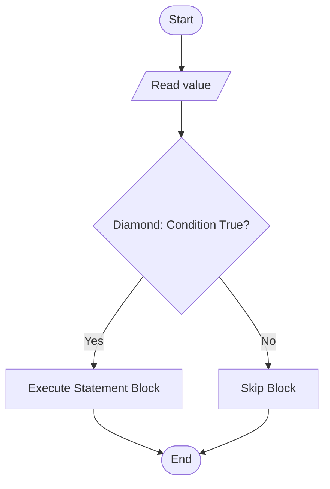
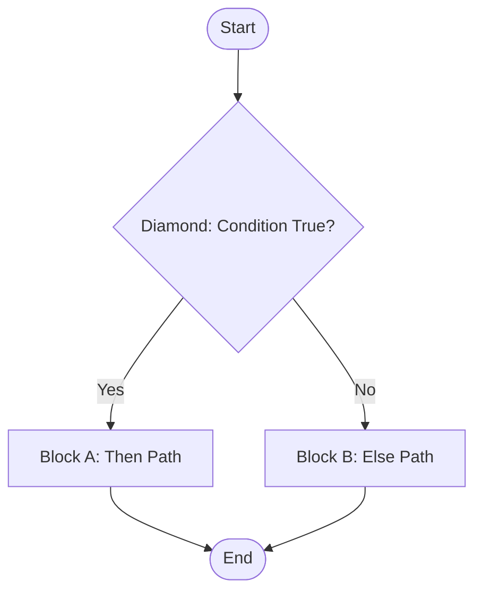
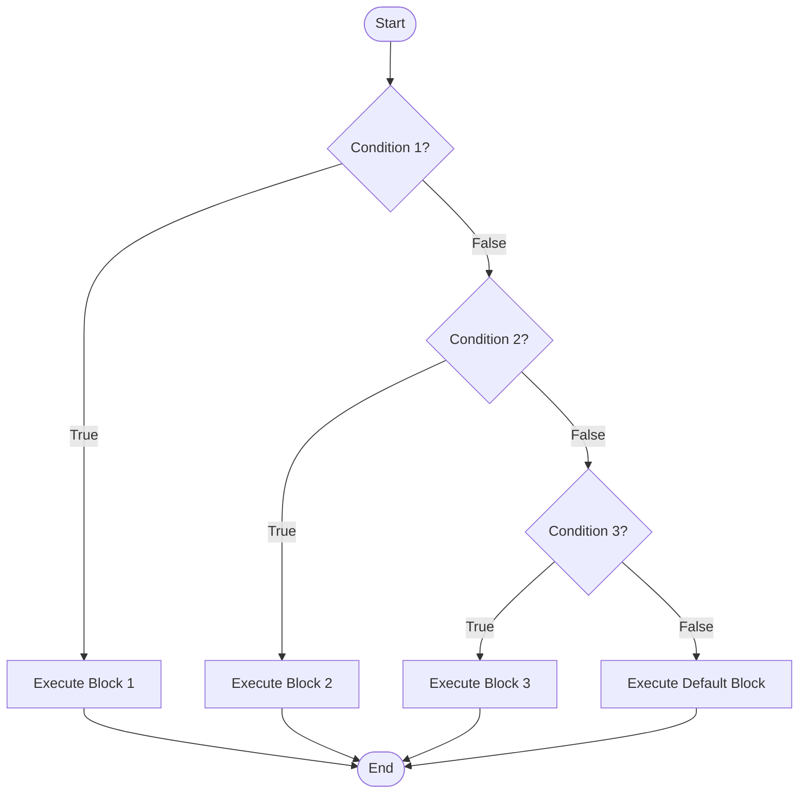
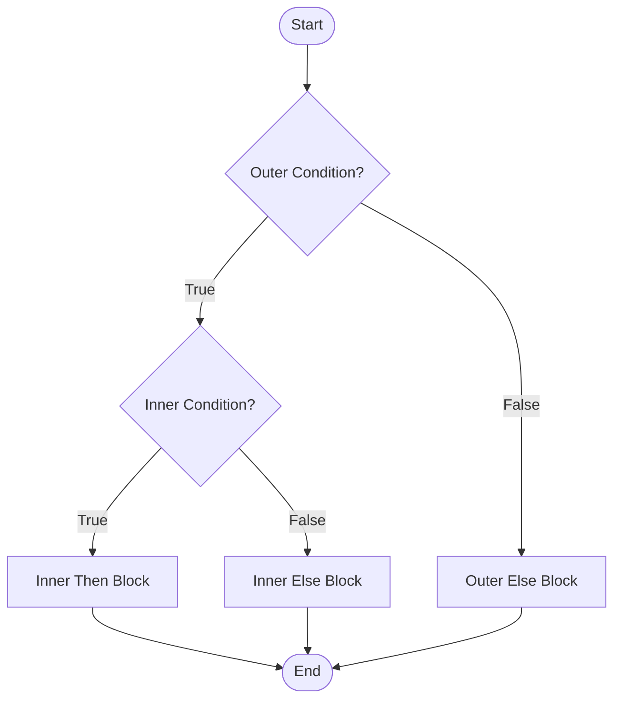
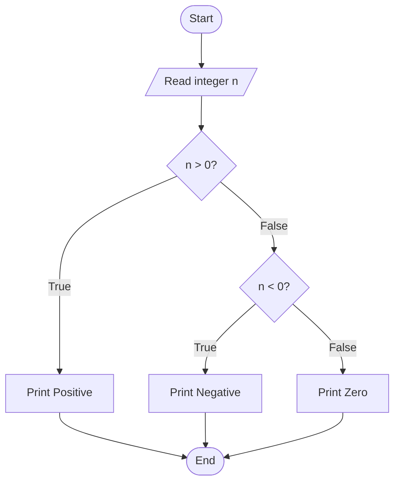

# decision (selection)

<!-- SECTION_1_START -->
# Decision (Selection) in Algorithms & Python

## 1.1 Formal Definition

> [!IMPORTANT]
> **Selection (Decision)** is a fundamental control structure in algorithmic design that allows the flow of execution to branch into one or more alternative paths based on the evaluation of a **Boolean condition** (an expression that yields `True` or `False`). It is one of the three canonical pillars of **Structured Programming** proposed by *Böhm and Jacopini (1966)*, alongside **Sequence** and **Iteration**.

In the context of KTU's *Algorithmic Thinking with Python (UCEST105)*, selection enables an algorithm to exhibit **non-linear behaviour** — meaning the next instruction executed is not always the immediately following one, but depends on runtime data.

### 1.2 Conceptual Analogy — The Railway Track Switch

Imagine a railway junction:

- A train arrives at a switch (the **condition**).
- The switch guard checks a fact: *Is a freight train expected on Track B?*
- If **Yes** → the points are aligned to Track B → the train takes that path.
- If **No** → the points remain on Track A → the train continues straight.

The *train* is the **control flow of the program**, the *switch* is the **Boolean test**, and the *two tracks* are the **alternative statement blocks**. Exactly one track is traversed based on a single yes/no fact. This is the essence of selection.

> [!NOTE]
> **Syllabus Highlight (KTU 2024 — Module 2):**
> The student must be able to *represent decision logic using pseudocode, flowcharts, and equivalent Python constructs (if, if-else, if-elif-else, nested if, and conditional expressions).*

### 1.3 Python's Selection Construct Family

| Construct | Purpose | Decision Paths |
|---|---|---|
| `if` | Single alternative | 1 (only when True) |
| `if … else` | Dual alternative | 2 (one of two) |
| `if … elif … else` | Multi-way | N (one of many) |
| Nested `if` | Hierarchical choice | Branched branches |
| Conditional Expression | Inline single-line choice | 2 (value-level) |

> [!TIP]
> Python evaluates any non-zero, non-empty value as **truthy** and zero, `None`, or empty containers as **falsy**. This is critical when constructing conditions.

### 1.4 The Central Role of the Boolean Condition

A selection statement is only as reliable as the **Boolean expression** driving it. In Python, such an expression is built from:

- **Relational operators:** `==`, `!=`, `<`, `<=`, `>`, `>=`
- **Logical operators:** `and`, `or`, `not`
- **Identity / Membership:** `is`, `in`
- **Short-circuit evaluation:** `and` stops at the first `False`; `or` stops at the first `True`

<!-- SECTION_1_END -->

<!-- SECTION_2_START -->
# Deep Theoretical Analysis & KTU High-Yield Reference

## 2.1 Classification of Selection Structures

### 2.1.1 Simple (Single-Alternative) Selection
The action is performed **only if** the condition holds. There is no explicit *else* path — the default behaviour is to do nothing and proceed.

**Pseudocode (KTU standard):**

```
IF <condition> THEN
    <statement_block>
END IF
```

### 2.1.2 Dual-Alternative Selection
Exactly **one** of two statement blocks executes, guaranteeing mutual exclusivity.

```
IF <condition> THEN
    <block_A>
ELSE
    <block_B>
END IF
```

### 2.1.3 Multi-Way Selection
Used when there are **three or more mutually exclusive cases**. Python's `elif` (a contraction of *else if*) is the cleanest construct for this.

```
IF <cond_1> THEN
    <block_1>
ELSE IF <cond_2> THEN
    <block_2>
ELSE IF <cond_3> THEN
    <block_3>
ELSE
    <default_block>
END IF
```

> [!IMPORTANT]
> **Python's `match-case` (PEP 634, since Python 3.10)** is another multi-way construct, structurally similar to a C-style `switch`, but it uses **pattern matching** rather than simple equality. The KTU 2024 module explicitly covers `if-elif-else` as the primary multi-way tool.

### 2.1.4 Nested Selection
A selection construct placed *inside* another selection construct. Used when a sub-decision depends on a previously satisfied branch.

### 2.1.5 Conditional (Ternary) Expression
A compact, **expression-level** selection that returns a *value* (not a *statement*).

```python
result = value_if_true if condition else value_if_false
```

## 2.2 The Decision Truth Table

The behaviour of every selection construct can be reasoned through a **Boolean evaluation table**. Below is the canonical truth table for the compound logical operators used in decision-making.

| $P$ | $Q$ | $P \text{ and } Q$ | $P \text{ or } Q$ | $\text{not } P$ |
|---|---|---|---|---|
| True | True | True | True | False |
| True | False | False | True | False |
| False | True | False | True | True |
| False | False | False | False | True |

## 2.3 KTU Formula Sheet / Reference Cheat Sheet

> [!NOTE]
> The following table is the **exam-ready summary** you should memorise. All boundary conditions and operator precedence rules are listed explicitly.

| Concept | Symbolic / Syntactic Form | Key Rule / Boundary |
|---|---|---|
| Single `if` | `if cond:` | Indentation defines the block |
| Dual `if-else` | `if cond: … else: …` | Exactly one branch executes |
| Multi-way | `if c1: … elif c2: … else: …` | First `True` wins; rest skipped |
| Logical AND | $P \land Q$ | True only if both are True |
| Logical OR | $P \lor Q$ | False only if both are False |
| Logical NOT | $\lnot P$ | Inverts the truth value |
| Ternary | `A if cond else B` | Returns a *value*, not a *block* |
| Membership | `x in collection` | True if `x` is an element |
| Identity | `x is y` | True if same object in memory |
| Short-circuit | `A and B` | If `A` is False, `B` is not evaluated |
| Indentation rule | 4 spaces (PEP 8) | Mixing tabs and spaces is a `SyntaxError` |

## 2.4 Why Selection Matters in Engineering

Selection is the **computational primitive that introduces intelligence into a program**. Without it, every program would be a straight-line sequence of instructions incapable of reacting to:

- **Sensor inputs** in IoT systems (e.g., *if temperature > 50°C, trigger the fan relay*).
- **User authentication** (e.g., *if password matches, grant access else deny*).
- **Routing in network protocols** (e.g., *if destination IP is local, deliver directly; else forward via gateway*).
- **Search and filter pipelines** in data engineering (e.g., *if row['status'] == 'ACTIVE', retain the record*).

Mastery of selection is the first step toward writing **non-trivial, data-driven, real-world algorithms**.

<!-- SECTION_2_END -->

<!-- SECTION_3_START -->
# Step-by-Step Derivations, Pseudocode & Python Implementation

> [!IMPORTANT]
> This section contains the **complete, executable mapping** from KTU-style pseudocode to Python source code. Each example is fully developed, with no skipped steps, type hints, and exhaustive comments suitable for board-examination answers.

## 3.1 Worked Example 1 — Grading System (Multi-Way Selection)

**Problem statement:** *Read a student's mark (0–100) and print the grade according to the rules:*
- *Marks $\geq 90$: Grade A*
- *Marks $\in [80, 90)$: Grade B*
- *Marks $\in [70, 80)$: Grade C*
- *Marks $\in [60, 70)$: Grade D*
- *Marks $< 60$: Grade F*

### Step 1 — Algorithm in Pseudocode

```
ALGORITHM GradeClassifier
INPUT  : mark
OUTPUT : grade

BEGIN
    READ mark
    IF mark >= 90 THEN
        grade <- "A"
    ELSE IF mark >= 80 THEN
        grade <- "B"
    ELSE IF mark >= 70 THEN
        grade <- "C"
    ELSE IF mark >= 60 THEN
        grade <- "D"
    ELSE
        grade <- "F"
    END IF
    PRINT grade
END
```

### Step 2 — Trace the Logic

The **ordering of conditions** is the heart of multi-way selection. Because Python evaluates conditions **top-down** and executes only the first matching branch, we must place the **most restrictive (highest)** condition first.

For an input of `mark = 75`:

$$
\begin{aligned}
&\text{Check 1: } 75 \geq 90 \;\Rightarrow\; \text{False, skip} \\
&\text{Check 2: } 75 \geq 80 \;\Rightarrow\; \text{False, skip} \\
&\text{Check 3: } 75 \geq 70 \;\Rightarrow\; \text{True, assign grade = "C"} \\
&\text{Check 4 and 5: skipped because the first True block has been entered.}
\end{aligned}
$$

### Step 3 — Python Implementation

```python
def classify_grade(mark: int) -> str:
    """
    Classify a numerical mark (0-100) into a letter grade.

    Pre-condition : 0 <= mark <= 100
    Post-condition: returns one of {"A", "B", "C", "D", "F"}
    """
    if not isinstance(mark, (int, float)):
        raise TypeError(f"Expected a number, got {type(mark).__name__}")

    if not (0 <= mark <= 100):
        raise ValueError(f"Mark {mark} is outside the valid range [0, 100]")

    if mark >= 90:
        grade: str = "A"
    elif mark >= 80:
        grade: str = "B"
    elif mark >= 70:
        grade: str = "C"
    elif mark >= 60:
        grade: str = "D"
    else:
        grade: str = "F"

    return grade


if __name__ == "__main__":
    try:
        user_input: str = input("Enter the student's mark: ")
        mark_value: float = float(user_input)
        result: str = classify_grade(mark_value)
        print(f"Grade awarded: {result}")
    except ValueError as parse_error:
        print(f"Invalid numerical input: {parse_error}")
    except TypeError as type_error:
        print(f"Type error encountered: {type_error}")
```

> [!TIP]
> **Board-examination tip:** Always specify the **pre-conditions** and **post-conditions** of your function in plain English. Examiners allocate marks for documenting assumptions.

## 3.2 Worked Example 2 — Nested Selection (Loan Eligibility)

**Problem statement:** *A bank issues a loan only if (a) age is at least 21 AND (b) income is at least ₹3,00,000. Additionally, if income exceeds ₹10,00,000, the applicant is tagged as a **premium** customer; otherwise, a **regular** customer.*

### Step 1 — Pseudocode

```
ALGORITHM LoanEligibility
INPUT  : age, income
OUTPUT : status, customer_type

BEGIN
    READ age, income
    IF age >= 21 AND income >= 300000 THEN
        status <- "Approved"
        IF income > 1000000 THEN
            customer_type <- "Premium"
        ELSE
            customer_type <- "Regular"
        END IF
    ELSE
        status <- "Rejected"
        customer_type <- "N/A"
    END IF
    PRINT status, customer_type
END
```

### Step 2 — Boolean Simplification of the Compound Condition

The outer condition combines two facts with **AND**:

$$
P = (\text{age} \geq 21) \quad,\quad Q = (\text{income} \geq 300000)
$$

$$
\text{Outer condition} = P \land Q
$$

| $P$ | $Q$ | $P \land Q$ |
|---|---|---|
| True | True | True → Approval path |
| True | False | False → Rejection |
| False | True | False → Rejection |
| False | False | False → Rejection |

This confirms the logical truthfulness of the outer guard.

### Step 3 — Python Implementation

```python
def evaluate_loan(age: int, income: float) -> tuple[str, str]:
    """
    Evaluate loan eligibility and customer tier.

    Pre-condition : age is a positive int, income is a non-negative float
    Post-condition: returns (status, customer_type)
    """
    if age < 0 or income < 0:
        raise ValueError("Age and income must be non-negative.")

    if age >= 21 and income >= 300000:
        status: str = "Approved"
        # Nested selection: tier classification
        customer_type: str = "Premium" if income > 1_000_000 else "Regular"
    else:
        status = "Rejected"
        customer_type = "N/A"

    return status, customer_type
```

Notice the use of the **conditional (ternary) expression** inside the nested block to compress the inner dual-alternative selection into a single readable line.

## 3.3 Worked Example 3 — Short-Circuit Trace

Consider the expression `(x != 0) and (10 / x > 2)`.

If `x = 0`, then:

1. `(x != 0)` evaluates to `False`.
2. Python **short-circuits** — the second operand `(10 / x > 2)` is **never evaluated**, thereby avoiding a `ZeroDivisionError`.

This is **engineering-grade defensive logic** and is a direct application of decision-making to runtime safety.

## 3.4 Worked Example 4 — Algorithm to Find the Maximum of Three Numbers

```
ALGORITHM MaxOfThree
INPUT  : a, b, c
OUTPUT : max_value

BEGIN
    READ a, b, c
    IF a >= b AND a >= c THEN
        max_value <- a
    ELSE IF b >= a AND b >= c THEN
        max_value <- b
    ELSE
        max_value <- c
    END IF
    PRINT max_value
END
```

### Python Equivalent

```python
def max_of_three(a: float, b: float, c: float) -> float:
    if a >= b and a >= c:
        return a
    elif b >= a and b >= c:
        return b
    else:
        return c
```

### Dry-Run Trace

Let $a = 12$, $b = 25$, $c = 18$.

$$
\begin{aligned}
&\text{Check 1: } (12 \geq 25) \land (12 \geq 18) \;\Rightarrow\; \text{False} \\
&\text{Check 2: } (25 \geq 12) \land (25 \geq 18) \;\Rightarrow\; \text{True} \;\Rightarrow\; \text{max\_value} = 25 \\
&\text{Check 3: skipped.}
\end{aligned}
$$

The final answer is $\boxed{25}$.

<!-- SECTION_3_END -->

<!-- SECTION_4_START -->
# Structural Diagrams & Schematics

> [!NOTE]
> The following Mermaid diagrams render the **control-flow topology** of each selection variant. They are the KTU-recommended visual aids for board answers.

## 4.1 Simple `if` Statement — Flowchart



## 4.2 Dual `if-else` Statement — Flowchart



## 4.3 Multi-Way `if-elif-else` Statement — Flowchart



## 4.4 Nested Selection — Subgraph Topology



## 4.5 Sequential Processing Topology Matrix

For complex cases where a single flowchart becomes tangled, the following **decision-table** (truth table → action) is a KTU-accepted alternative representation.

| Condition Row | $C_1$ | $C_2$ | $C_3$ | Action Executed |
|---|---|---|---|---|
| Row 1 | True | — | — | Block 1 |
| Row 2 | False | True | — | Block 2 |
| Row 3 | False | False | True | Block 3 |
| Row 4 | False | False | False | Default Block |

A dash (`—`) denotes *don't care* because Python's short-circuit / first-match semantics means the condition is never evaluated.

<!-- SECTION_4_END -->

<!-- SECTION_5_START -->
# KTU 2024 Scheme Examination Question Bank & Topic Recap

## 5.1 Part A — Short Answer Questions (2 × 3 = 6 Marks)

### Question 1 [KTU University Exam — July 2024]
**Differentiate between single-alternative and dual-alternative selection structures with one example each.** *(3 Marks, CO1, Remember)*

**Model Answer:**

A *single-alternative* `if` statement provides only a *then* path. If the condition is **False**, the program simply skips the block and continues — no alternative action is defined. Example: *If it is raining, carry an umbrella.*

A *dual-alternative* `if-else` statement provides both a *then* path and an *else* path. Exactly one of the two blocks executes, ensuring mutual exclusivity. Example: *If the number is even, print "Even"; else, print "Odd".*

> **[Valuation Key: Correct definition of both terms: 2 Marks. Valid one-line example: 1 Mark.]**

### Question 2 [KTU University Exam — Dec 2023]
**What is short-circuit evaluation in Python? Why is it important in decision-making?** *(3 Marks, CO2, Understand)*

**Model Answer:**

Short-circuit evaluation is the strategy by which Python stops evaluating a compound Boolean expression as soon as the final result is already determined. For the `and` operator, evaluation stops at the first `False` operand. For the `or` operator, evaluation stops at the first `True` operand.

It is important because it (a) **improves performance** by avoiding unnecessary computations and (b) **prevents runtime errors**, e.g., writing `(divisor != 0) and (numerator / divisor > threshold)` safely avoids a `ZeroDivisionError` when `divisor = 0`.

> **[Valuation Key: Stating the rule: 2 Marks. Mentioning the safety aspect: 1 Mark.]**

---

## 5.2 Part B — Long Answer Questions (Module Internal Choice, 14 Marks)

### Question A (14 Marks)

**(a)** *Explain the different types of selection (decision) constructs in Python with appropriate pseudocode.* *(7 Marks, CO1, Understand)*

**(b)** *Write a Python program that accepts an integer from the user and classifies it as **Positive**, **Negative**, or **Zero** using nested `if-else`. Draw the corresponding flowchart.* *(7 Marks, CO2, Apply)*

### Question B (14 Marks)

**(a)** *Discuss the concept of multi-way selection. Write the pseudocode and Python implementation for a program that determines the **day type** based on a numeric input (1–7): weekdays (1–5) → "Working Day", Saturday (6) → "Half Day", Sunday (7) → "Holiday".* *(7 Marks, CO2, Apply)*

**(b)** *Explain with an example how the conditional (ternary) expression works in Python. Rewrite the program from part (a) using a ternary expression where appropriate.* *(7 Marks, CO3, Apply)*

---

### Model Solution — Question A

#### Part (a) — Types of Selection Constructs

The four principal selection constructs in Python are:

1. **Simple `if`** — executes a block only when the condition is `True`.

```
IF <cond> THEN
    <block>
END IF
```

2. **`if-else`** — executes one of two blocks.

```
IF <cond> THEN
    <block_A>
ELSE
    <block_B>
END IF
```

3. **`if-elif-else`** — multi-way, first match wins.

```
IF <c1> THEN <b1>
ELSE IF <c2> THEN <b2>
ELSE <default>
END IF
```

4. **Nested `if`** — selection inside selection, used for hierarchical decisions.

> **[Valuation Key: Naming all four types: 2 Marks. Correct pseudocode for at least three: 3 Marks. Clean formatting and one real-world example: 2 Marks.]**

#### Part (b) — Python Program with Flowchart

```python
def classify_integer(number: int) -> str:
    if not isinstance(number, int):
        raise TypeError("Input must be an integer.")

    if number > 0:
        category: str = "Positive"
    else:
        if number < 0:
            category = "Negative"
        else:
            category = "Zero"

    return category


if __name__ == "__main__":
    try:
        raw: str = input("Enter an integer: ")
        value: int = int(raw)
        print(f"The number is {classify_integer(value)}")
    except ValueError:
        print("Invalid input. Please enter a valid integer.")
```

**Corresponding Flowchart:**



> **[Valuation Key: Correct function signature with type hints: 2 Marks. Valid `if-else` block: 2 Marks. Correct nested `if-else` block: 1 Mark. Flowchart with three terminal paths: 2 Marks.]**

---

### Model Solution — Question B

#### Part (a) — Multi-Way Selection Pseudocode & Python

**Pseudocode:**

```
ALGORITHM DayClassifier
INPUT  : day_number
OUTPUT : day_type

BEGIN
    READ day_number
    IF day_number >= 1 AND day_number <= 5 THEN
        day_type <- "Working Day"
    ELSE IF day_number == 6 THEN
        day_type <- "Half Day"
    ELSE IF day_number == 7 THEN
        day_type <- "Holiday"
    ELSE
        day_type <- "Invalid Day Number"
    END IF
    PRINT day_type
END
```

**Python Implementation:**

```python
def classify_day(day_number: int) -> str:
    if not (1 <= day_number <= 7):
        return "Invalid Day Number"

    if 1 <= day_number <= 5:
        return "Working Day"
    elif day_number == 6:
        return "Half Day"
    else:  # day_number == 7
        return "Holiday"
```

> **[Valuation Key: Correct range-based condition using logical AND: 2 Marks. Three distinct branches: 3 Marks. Boundary handling for invalid input: 2 Marks.]**

#### Part (b) — Conditional (Ternary) Expression

A **conditional expression** evaluates a condition and returns one of two values *in a single expression*, not as a statement block.

**General syntax:**

```python
value = A if condition else B
```

**Refactored `classify_day` using ternary:**

```python
def classify_day_ternary(day_number: int) -> str:
    if not (1 <= day_number <= 7):
        return "Invalid Day Number"

    return ("Working Day"
            if 1 <= day_number <= 5
            else "Half Day" if day_number == 6 else "Holiday")
```

> **[Valuation Key: Correct syntax of ternary: 2 Marks. Demonstrating the value-returning nature: 2 Marks. Clean refactor of the previous code: 3 Marks.]**

---

## 5.3 KTU Examiner's Valuation Warning / Pitfall Callout

> [!WARNING]
> **Common places where students lose marks on Decision / Selection questions:**
> 1. **Forgetting indentation:** In Python, indentation is *syntactically meaningful*. A misplaced space changes the control flow. Always use a consistent 4-space indent.
> 2. **Using `=` instead of `==`:** The single equals sign is *assignment*, not comparison. This is the single most common bug in decision logic.
> 3. **Wrong condition ordering in `if-elif-else`:** Placing the looser condition before the stricter one causes the stricter branch to be **unreachable**.
> 4. **Omitting the `else` branch when asked for "all cases":** Examiners expect a default path when the input domain is not fully covered.
> 5. **Neglecting to show the flowchart or pseudocode:** Even if the Python code is correct, a 14-mark question typically demands *both* a flowchart/pseudocode and the code.
> 6. **Misusing `and` / `or` precedence:** `and` binds tighter than `or`. Use parentheses generously to avoid ambiguity.

## 5.4 Topic Recap & Important Things to Remember

- **Selection** is one of the three pillars of structured programming: *Sequence, Selection, Iteration*.
- The four canonical selection constructs in Python are: **`if`**, **`if-else`**, **`if-elif-else`**, and **nested `if`**.
- The **conditional (ternary) expression** returns a *value* — useful for compact assignments.
- Python uses **indentation (PEP 8: 4 spaces)** to delimit blocks, not braces `{}`.
- The **relational operators** are `==`, `!=`, `<`, `<=`, `>`, `>=` — remember the distinction between `=` (assignment) and `==` (comparison).
- The **logical operators** are `and` (conjunction $\land$), `or` (disjunction $\lor$), and `not` (negation $\lnot$).
- Python follows **short-circuit evaluation**: `A and B` skips `B` if `A` is `False`; `A or B` skips `B` if `A` is `True`.
- The `elif` chain is evaluated **top-down**; the **first** `True` condition is executed, and the rest are skipped.
- Always place the **most restrictive condition first** in a multi-way `if-elif-else` ladder.
- **Truthy values** in Python: any non-zero number, non-empty string, non-empty collection. **Falsy values**: `0`, `0.0`, `""`, `[]`, `{}`, `None`, `False`.
- A *nested* `if` is used when a sub-decision logically depends on a previous branch's outcome.
- In board answers, present **pseudocode, flowchart, and Python code** for full marks; use **type hints** and **docstrings** to score the higher cognitive levels.

<!-- SECTION_5_END -->
