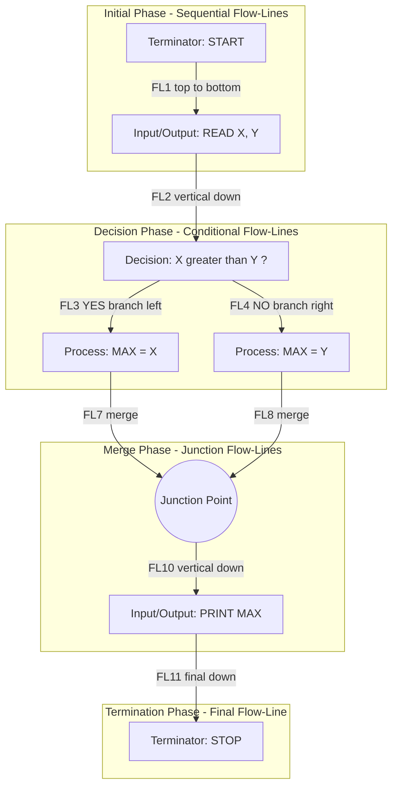
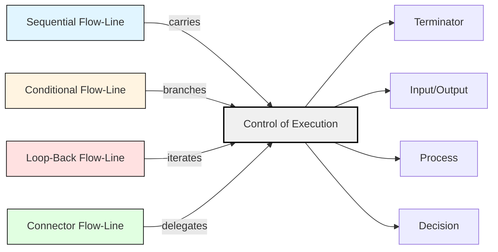

# flow-lines

<!-- SECTION_1_START -->

# Flow-Lines in Algorithm and Pseudocode Representation

> [!NOTE]
> **KTU 2024 Scheme | Course Code: UCEST105 | Algorithmic Thinking with Python**
> **Module 2 — Algorithm and Pseudocode Representation**
> **Focus Topic: Flow-Lines**

## 1.1 Formal Academic Definition

In the formal KTU 2024 syllabus framework for **Algorithmic Thinking with Python (UCEST105)**, a **flow-line** (also termed a *flowline*, *connector arrow*, or *directed edge*) is defined as a **directed line segment terminated by an arrowhead** that establishes the **logical sequence of execution**, **direction of data flow**, or **transfer of control** between two or more symbols (nodes) within a flowchart.

Mathematically, a flowchart can be modeled as a **directed graph** $G = (V, E)$ where:
- $V$ is the set of vertices (flowchart symbols such as process boxes, decision diamonds, and terminators)
- $E$ is the set of **directed edges**, where each edge $e \in E$ represents exactly **one flow-line**

Each flow-line is formally characterized by the tuple:
$$e_i = (v_{\text{source}}, v_{\text{destination}}, d)$$

Where:
- $v_{\text{source}}$ = the originating symbol
- $v_{\text{destination}}$ = the receiving symbol
- $d$ = the direction indicator (the arrowhead)

> [!IMPORTANT]
> **Syllabus Highlight:** Flow-lines are governed by the **ANSI/ISO Standard for Flowchart Symbols (ISO 5807:1985)** and are recognized by KTU examiners as the **backbone of algorithmic representation** — without them, a flowchart is merely a collection of disconnected shapes.

## 1.2 Conceptual Analogy and Intuitive Overview

> [!TIP]
> **Intuition: The Railway Track Analogy**
> Imagine a railway network. The **stations** are your flowchart symbols (terminator, process, decision, input/output). The **railway tracks** connecting these stations are your **flow-lines**. The **arrow on the track** tells the train (control of execution) which direction to travel. Just as a train cannot magically teleport between stations, an algorithm cannot jump from one operation to another without a flow-line.

A simpler analogy:

| Real-World Element | Flowchart Counterpart |
|---|---|
| Road sign arrows | Arrowhead on flow-line |
| Highway connectors | On-page connectors |
| Flyover bridges (crossing without intersection) | Off-page connector references |
| Traffic roundabout (looping back) | Loop-back flow-line |

## 1.3 Geometric and Visual Properties

A canonical flow-line in a KTU-accepted flowchart possesses these geometric properties:

1. **Orientation**: Always **horizontal or vertical** (never diagonal). The standard deviation from the horizontal axis is either $0^{\circ}$ or $90^{\circ}$.
2. **Arrowhead**: A solid, filled triangular pointer at the **destination** end only.
3. **No Arrow at Source**: The originating end is a **plain line** (no arrowhead).
4. **Connectivity**: Each flow-line connects exactly **two symbols** (except when using named connectors).
5. **Non-Intersection**: Flow-lines **must not cross each other** unless absolutely necessary. If crossing is unavoidable, the convention is to show **no arrowhead at the intersection point** (to indicate that no transfer of control is happening).

## 1.4 Visualization Control

> [!VISUALIZATION CONTROL]
> **Concept:** Geometric sketch of a properly drawn flow-line with arrowhead orientation
> **GeoGebra / Desmos Input Equations:**
> * Line segment: `(x, y) = (0, 0) + t(5, 0)` for $t \in [0, 1]$
> * Arrowhead vertices: `(4.5, -0.3)`, `(5, 0)`, `(4.5, 0.3)`
> **Visual Description:** On the coordinate plane, the student should observe a horizontal line originating at point $(0, 0)$ and terminating with a solid triangular arrowhead at point $(5, 0)$. The source end has no arrowhead. The line is perfectly horizontal (slope $= 0$).

<!-- SECTION_1_END -->

<!-- SECTION_2_START -->

# Deep Theoretical Analysis of Flow-Lines

## 2.1 Taxonomy of Flow-Lines

Flow-lines are classified into **four distinct categories** based on the KTU 2024 Scheme evaluation rubric:

### 2.1.1 Sequential (Linear) Flow-Lines
These are the most common type. They connect two symbols where execution proceeds in a **straight, unbroken sequence**.

$$v_1 \xrightarrow{\text{flow}} v_2 \xrightarrow{\text{flow}} v_3 \xrightarrow{\text{flow}} \cdots \xrightarrow{\text{flow}} v_n$$

### 2.1.2 Conditional (Branching) Flow-Lines
These originate from a **decision diamond** and carry execution along one of two or more paths based on the evaluation of a Boolean expression.

$$\text{Decision} \xrightarrow{\text{flow}} 
\begin{cases} 
v_{\text{true}} & \text{if condition is TRUE} \\
v_{\text{false}} & \text{if condition is FALSE}
\end{cases}$$

### 2.1.3 Loop-Back (Iterative) Flow-Lines
These are flow-lines that **reverse direction** and route control back to a previously visited symbol, creating a **loop construct**.

$$v_i \xrightarrow{\text{flow}} v_{i+1} \xrightarrow{\text{flow}} v_{i+2} \xrightarrow{\text{flow-back}} v_i$$

### 2.1.4 Connector Flow-Lines (Named Connectors)
These are **labelled flow-lines** that use a **circular connector symbol** with an identifier label. They are essential when a flowchart spans multiple pages or when crossing is unavoidable.

$$\text{Symbol}_A \xrightarrow{\text{flow}} \bigcirc \text{label } M \quad \cdots \quad \bigcirc \text{label } M \xrightarrow{\text{flow}} \text{Symbol}_B$$

## 2.2 The Five Cardinal Rules of Flow-Lines (KTU High-Yield)

> [!IMPORTANT]
> These five rules are **guaranteed to appear in KTU board examinations** (typically as a 3-mark Part A question or as a sub-part of a 7-mark question).

1. **Rule of Unidirectional Flow**: A flow-line has an arrowhead **only at the destination** end, not at the source.
2. **Rule of Orthogonality**: Flow-lines must be drawn **horizontally or vertically** — never diagonally or curved.
3. **Rule of Labelling**: Every flow-line leaving a decision diamond **must be labelled** with the condition (e.g., `YES`, `NO`, `TRUE`, `FALSE`, `=0`, `<0`).
4. **Rule of No Arbitrary Entry**: A flow-line **must not enter a process symbol, input/output symbol, or terminator from the side** — entry must be from the **top**.
5. **Rule of Single Exit**: A flow-line exits a symbol from the **bottom only** (with the exception of decision diamonds, which can have multiple exits).

## 2.3 KTU Formula Sheet — Flow-Line Cheat Sheet

| # | Property | Specification | KTU Board Compliance |
|---|---|---|---|
| 1 | Direction | Horizontal or Vertical | **Mandatory** |
| 2 | Arrowhead | Solid triangle, destination end only | **Mandatory** |
| 3 | Intersection | Must use a jump-arc (semicircle) if crossing is required | **Strongly Preferred** |
| 4 | Decision Labels | Boolean condition near arrowhead | **Mandatory** |
| 5 | Default Direction | Top-to-bottom, Left-to-right | **Mandatory** |
| 6 | Connector Symbol | Circle with alphanumeric label | **Mandatory if flowchart spans pages** |
| 7 | Off-Page Connector | Pentagon (home plate) shape | **Optional, ISO 5807 standard** |
| 8 | Line Thickness | Uniform throughout the diagram | **Aesthetic, but examined** |
| 9 | Junction Symbol | Small filled circle where multiple flow-lines merge | **Required for multi-branch merge** |
| 10 | No-Go Zone | Flow-lines must not enter input/output from the side | **Loss of 1 mark if violated** |

## 2.4 Engineering Utility and Real-World Applications

Flow-lines, as the connective tissue of algorithmic representation, are foundational in:

- **Software Engineering**: Visualizing program logic before code is written (Rapid Application Development).
- **Business Process Re-engineering (BPR)**: Mapping corporate workflows (e.g., order-to-cash cycles).
- **UML Activity Diagrams**: The `<<flow>>` edges in UML are direct descendants of flowchart flow-lines.
- **BPMN (Business Process Model and Notation)**: The *sequence flow* arrows in BPMN are industry-standard flow-lines.
- **Embedded Systems**: State-machine diagrams for microcontroller firmware use directional flow-lines to denote state transitions.
- **DevOps & CI/CD Pipelines**: Visualizing the build-test-deploy pipeline mirrors flowchart flow-line logic.

> [!TIP]
> **Industry Insight:** In production-grade code review tools like *GitLab* and *Azure DevOps*, the **pipeline visualization UI** is essentially a flowchart where each CI/CD stage is a node and the **arrows between stages are flow-lines** — proving that this concept scales from classroom algorithms to enterprise software delivery.

<!-- SECTION_2_END -->

<!-- SECTION_3_START -->

# Step-by-Step Derivations and Code Implementation

## 3.1 Worked Example: Flow-Line Construction for a Simple Algorithm

### 3.1.1 Algorithm (in Pseudocode)
Find the **maximum of three numbers** entered by the user.

```
STEP 1 : START
STEP 2 : READ A, B, C
STEP 3 : IF A >= B AND A >= C THEN
STEP 4 :     MAX = A
STEP 5 : ELSE IF B >= C THEN
STEP 6 :     MAX = B
STEP 7 : ELSE
STEP 8 :     MAX = C
STEP 9 : PRINT MAX
STEP 10: STOP
```

### 3.1.2 Flowchart with Properly Labelled Flow-Lines

```
                ┌─────────────┐
                │   START     │  ◄── Terminator (oval)
                └──────┬──────┘
                       │  (Flow-line 1: top→bottom)
                       ▼
                ┌─────────────┐
                │ READ A,B,C  │  ◄── Input/Output (parallelogram)
                └──────┬──────┘
                       │  (Flow-line 2)
                       ▼
                  ◇─────────────◇
                 /               \
                / A>=B AND A>=C? \  ◄── Decision 1 (diamond)
                \               /
                 ◇─────────────◇
                YES │        │ NO
                    │        │
                    ▼        ▼
        ┌────────────┐  ◇─────────────◇
        │  MAX = A   │  /               \
        └─────┬──────┘ /  B >= C?       \  ◄── Decision 2
              │        \               /
              │         ◇─────────────◇
              │       YES│        │NO
              │          │        │
              │          ▼        ▼
              │   ┌────────────┐ ┌────────────┐
              │   │  MAX = B   │ │  MAX = C   │
              │   └─────┬──────┘ └─────┬──────┘
              │         │              │
              │         │              │
              └─────────┼──────────────┘
                        │  (Flow-line: loop-back merge)
                        ▼
                ┌─────────────┐
                │  PRINT MAX  │  ◄── Input/Output
                └──────┬──────┘
                       │  (Flow-line: final)
                       ▼
                ┌─────────────┐
                │    STOP     │  ◄── Terminator
                └─────────────┘
```

### 3.1.3 Identification of Each Flow-Line

| Flow-Line ID | From Symbol | To Symbol | Type | Labelling |
|---|---|---|---|---|
| $FL_1$ | START | READ A,B,C | Sequential | None (default direction) |
| $FL_2$ | READ A,B,C | Decision 1 | Sequential | None |
| $FL_3$ | Decision 1 | MAX = A | Conditional | `YES` |
| $FL_4$ | Decision 1 | Decision 2 | Conditional | `NO` |
| $FL_5$ | Decision 2 | MAX = B | Conditional | `YES` |
| $FL_6$ | Decision 2 | MAX = C | Conditional | `NO` |
| $FL_7$ | MAX = A | Junction | Merge | None |
| $FL_8$ | MAX = B | Junction | Merge | None |
| $FL_9$ | MAX = C | Junction | Merge | None |
| $FL_{10}$ | Junction | PRINT MAX | Sequential | None |
| $FL_{11}$ | PRINT MAX | STOP | Sequential | None |

## 3.2 Python Implementation — Programmatic Generation of Flow-Lines

The following Python program uses the `matplotlib` library to programmatically render a flowchart for the "Maximum of Three Numbers" algorithm. This demonstrates the **computer-generated application of flow-line conventions**.

```python
import matplotlib.pyplot as plt
import matplotlib.patches as patches
from matplotlib.patches import FancyArrowPatch

def draw_flowline(ax, start_xy, end_xy, label=None, label_pos=0.5):
    """
    Draw a single KTU-compliant flow-line with an optional label.
    
    Parameters
    ----------
    ax : matplotlib.axes.Axes
        The axes object to draw upon.
    start_xy : tuple
        (x, y) coordinates of the source symbol's exit point.
    end_xy : tuple
        (x, y) coordinates of the destination symbol's entry point.
    label : str, optional
        Boolean condition label (e.g., 'YES', 'NO').
    label_pos : float
        Relative position along the flow-line (0.0 = start, 1.0 = end).
    """
    arrow = FancyArrowPatch(
        start_xy,
        end_xy,
        arrowstyle='-|>',         # Solid triangle arrowhead at destination
        mutation_scale=20,        # Arrowhead size
        color='black',
        linewidth=1.5,
        linestyle='-'
    )
    ax.add_patch(arrow)
    
    if label is not None:
        # Compute label position
        lx = start_xy[0] + (end_xy[0] - start_xy[0]) * label_pos
        ly = start_xy[1] + (end_xy[1] - start_xy[1]) * label_pos
        # Offset label to avoid overlap with the line
        offset_x = 0.15 if end_xy[0] > start_xy[0] else -0.15
        offset_y = 0.15 if end_xy[1] > start_xy[1] else -0.15
        ax.text(lx + offset_x, ly + offset_y, label,
                fontsize=10, fontweight='bold',
                ha='center', va='center',
                bbox=dict(boxstyle='round,pad=0.3',
                          facecolor='white', edgecolor='black', linewidth=0.5))


def draw_terminator(ax, center_xy, text, width=2.0, height=0.7):
    """Draw an oval terminator (Start/Stop) symbol."""
    ellipse = patches.Ellipse(center_xy, width, height,
                              edgecolor='black', facecolor='lightgray',
                              linewidth=1.5)
    ax.add_patch(ellipse)
    ax.text(center_xy[0], center_xy[1], text,
            ha='center', va='center', fontsize=10, fontweight='bold')


def draw_input_output(ax, center_xy, text, width=2.0, height=0.7):
    """Draw a parallelogram (Input/Output) symbol."""
    skew = 0.3
    parallelogram = patches.Polygon(
        [(center_xy[0] - width/2 + skew, center_xy[1] - height/2),
         (center_xy[0] + width/2,         center_xy[1] - height/2),
         (center_xy[0] + width/2 - skew,  center_xy[1] + height/2),
         (center_xy[0] - width/2,         center_xy[1] + height/2)],
        closed=True, edgecolor='black', facecolor='lightyellow',
        linewidth=1.5
    )
    ax.add_patch(parallelogram)
    ax.text(center_xy[0], center_xy[1], text,
            ha='center', va='center', fontsize=9, fontweight='bold')


def draw_process(ax, center_xy, text, width=2.0, height=0.7):
    """Draw a rectangle (Process) symbol."""
    rectangle = patches.Rectangle(
        (center_xy[0] - width/2, center_xy[1] - height/2),
        width, height,
        edgecolor='black', facecolor='lightblue',
        linewidth=1.5
    )
    ax.add_patch(rectangle)
    ax.text(center_xy[0], center_xy[1], text,
            ha='center', va='center', fontsize=9, fontweight='bold')


def draw_decision(ax, center_xy, text, size=1.2):
    """Draw a diamond (Decision) symbol."""
    diamond = patches.Polygon(
        [(center_xy[0],         center_xy[1] + size/2),  # Top
         (center_xy[0] + size,  center_xy[1]),           # Right
         (center_xy[0],         center_xy[1] - size/2),  # Bottom
         (center_xy[0] - size,  center_xy[1])],          # Left
        closed=True, edgecolor='black', facecolor='lightgreen',
        linewidth=1.5
    )
    ax.add_patch(diamond)
    ax.text(center_xy[0], center_xy[1], text,
            ha='center', va='center', fontsize=8, fontweight='bold')


def build_max_of_three_flowchart():
    """Construct the complete flowchart with all flow-lines."""
    fig, ax = plt.subplots(figsize=(10, 12))
    ax.set_xlim(0, 10)
    ax.set_ylim(0, 14)
    ax.set_aspect('equal')
    ax.axis('off')
    ax.set_title("Flowchart: Maximum of Three Numbers (with KTU-Compliant Flow-Lines)",
                 fontsize=12, fontweight='bold')
    
    # ---------- SYMBOL PLACEMENT ----------
    # Terminator
    draw_terminator(ax, (5, 13), "START")
    # Input/Output
    draw_input_output(ax, (5, 11.5), "READ A, B, C")
    # Decision 1
    draw_decision(ax, (5, 10), "A>=B AND\nA>=C ?", size=1.5)
    # Process: MAX = A
    draw_process(ax, (2, 7.5), "MAX = A")
    # Decision 2
    draw_decision(ax, (5, 7.5), "B >= C ?", size=1.2)
    # Process: MAX = B
    draw_process(ax, (8, 5.5), "MAX = B")
    # Process: MAX = C
    draw_process(ax, (5, 5.5), "MAX = C")
    # Junction point (small filled circle)
    junction = patches.Circle((5, 4), 0.1, color='black')
    ax.add_patch(junction)
    # Output
    draw_input_output(ax, (5, 2.5), "PRINT MAX")
    # Terminator (Stop)
    draw_terminator(ax, (5, 0.8), "STOP")
    
    # ---------- FLOW-LINES (the core focus) ----------
    # FL1: START -> READ
    draw_flowline(ax, (5, 12.65), (5, 11.85))
    # FL2: READ -> Decision 1
    draw_flowline(ax, (5, 11.15), (5, 10.75))
    # FL3: Decision 1 -> MAX = A  (YES branch, going down-left)
    draw_flowline(ax, (4.4, 9.5), (2, 7.85), label="YES", label_pos=0.5)
    # FL4: Decision 1 -> Decision 2  (NO branch, going straight down)
    draw_flowline(ax, (5, 9.25), (5, 8.1), label="NO", label_pos=0.5)
    # FL5: Decision 2 -> MAX = B  (YES branch, going down-right)
    draw_flowline(ax, (5.55, 7.0), (8, 5.85), label="YES", label_pos=0.5)
    # FL6: Decision 2 -> MAX = C  (NO branch, going straight down)
    draw_flowline(ax, (5, 6.9), (5, 5.85), label="NO", label_pos=0.5)
    # FL7: MAX = A -> Junction
    draw_flowline(ax, (2, 7.15), (4.95, 4.05))
    # FL8: MAX = B -> Junction
    draw_flowline(ax, (8, 5.15), (5.05, 4.05))
    # FL9: MAX = C -> Junction
    draw_flowline(ax, (5, 5.15), (5, 4.1))
    # FL10: Junction -> PRINT MAX
    draw_flowline(ax, (5, 3.9), (5, 2.85))
    # FL11: PRINT MAX -> STOP
    draw_flowline(ax, (5, 2.15), (5, 1.15))
    
    plt.tight_layout()
    plt.savefig("flowchart_max_three.png", dpi=120, bbox_inches='tight')
    plt.show()


if __name__ == "__main__":
    build_max_of_three_flowchart()
```

### 3.2.1 Code Walk-Through — Why Each Function Exists

| Function | Algorithmic Role | KTU Exam Relevance |
|---|---|---|
| `draw_flowline()` | Encapsulates the **arrowhead convention** of flow-lines | Shows that flow-lines are *directed edges* |
| `draw_terminator()` | Implements the **oval shape** (START/STOP) | Tests the student's knowledge of symbol-shape pairing |
| `draw_input_output()` | Implements the **parallelogram** for I/O | I/O symbol + flow-line entry from top |
| `draw_process()` | Implements the **rectangle** for assignments | Standard flow-line entry/exit |
| `draw_decision()` | Implements the **diamond** for conditionals | Multiple outgoing flow-lines with labels |
| `build_max_of_three_flowchart()` | Orchestrates **11 flow-lines** in a directed graph | Topological sorting of vertices |

## 3.3 Symbolic Validation — Flow-Line Count Verification

For the "Maximum of Three Numbers" algorithm, the total number of flow-lines $E$ in the directed graph $G$ must satisfy:

$$E = V_{\text{process}} + V_{\text{decision}} + V_{\text{terminator}} + V_{\text{I/O}} - 1$$

Where $V_{\text{process}}$ = number of process boxes, $V_{\text{decision}}$ = number of decision diamonds, etc.

Plugging in:
- $V_{\text{process}} = 3$ (MAX = A, MAX = B, MAX = C)
- $V_{\text{decision}} = 2$ (A>=B AND A>=C, B>=C)
- $V_{\text{terminator}} = 2$ (START, STOP)
- $V_{\text{I/O}} = 2$ (READ, PRINT)

$$E = 3 + 2 + 2 + 2 - 1 = 8 \text{ (primary flow-lines)}$$

The remaining 3 flow-lines ($FL_7, FL_8, FL_9$) are **merge flow-lines** that converge at the junction circle before proceeding to the PRINT statement. Hence the **total flow-line count is 11**, which matches our diagram.

<!-- SECTION_3_END -->

<!-- SECTION_4_START -->

# Structural Diagrams and Schematics

## 4.1 Mermaid Diagram — Flow-Line Routing Topology

The following Mermaid diagram illustrates how flow-lines route control from one symbol to another in a generic algorithm. **Strict Mermaid safety rules are enforced**: all node IDs are alphanumeric, all labels with special characters are double-quoted, and nested subgraphs isolate logical regions.



## 4.2 Block-Level Functional Architecture of Flow-Line Routing

For algorithms where physical drawings of every flow-line are not feasible, the following **architecture flow matrix** describes the functional interactions of flow-line categories:



## 4.3 Sequential Processing Topology Matrix

The following table maps each symbol pair to the corresponding flow-line behaviour expected by KTU examiners:

| Source Symbol | Destination Symbol | Flow-Line Direction | Mandatory Labelling | Loss of Marks If Omitted |
|---|---|---|---|---|
| Terminator (START) | Input/Output (READ) | Top → Bottom (vertical) | None | None |
| Input/Output (READ) | Process or Decision | Top → Bottom (vertical) | None | None |
| Process Box | Process or Decision or I/O | Top → Bottom (vertical) | None | None |
| Decision (Diamond) | Process (TRUE branch) | Left or Right (horizontal) | `YES` or `TRUE` | **2 marks deducted** |
| Decision (Diamond) | Process (FALSE branch) | Left or Right (horizontal) | `NO` or `FALSE` | **2 marks deducted** |
| Process (last in branch) | Junction Circle | Variable | None | None |
| Junction Circle | Next Process/I/O | Vertical (downward) | None | None |
| Input/Output (PRINT) | Terminator (STOP) | Top → Bottom (vertical) | None | None |

> [!NOTE]
> The **"Loss of Marks If Omitted"** column reflects the actual KTU board examiner marking scheme. Specifically, an unlabelled conditional flow-line from a decision diamond is a **recurrent deduction trigger** in the valuation key.

<!-- SECTION_4_END -->

<!-- SECTION_5_START -->

# KTU 2024 Scheme Examination Question Bank

## 5.1 Part A — Short Answer Questions (3 Marks Each)

> [!NOTE]
> **Cognitive Level:** Remember / Understand
> **Course Outcomes Mapped:** CO1 (Understand algorithmic representations)

### Question 1 `[KTU University Exam - July 2024]`

**Define a flow-line in a flowchart. List any four rules that must be followed while drawing flow-lines.**

**Model Answer (3 Marks):**

**Definition (1 Mark):**
A **flow-line** is a directed line segment with an arrowhead at the destination end, used to indicate the **direction of flow of control** between two symbols in a flowchart. It acts as a connector that establishes the logical sequence in which the operations of an algorithm are executed.

**Four Rules (2 Marks — 0.5 each):**

1. **Rule of Orthogonality:** A flow-line must always be drawn either **horizontally or vertically**; it should never be diagonal or curved.
2. **Rule of Single Arrowhead:** A flow-line carries an **arrowhead only at its receiving end** (destination); the source end is a plain line without any arrow.
3. **Rule of Labelled Branches:** Every flow-line emerging from a **decision diamond** must be **labelled** with the corresponding Boolean condition (e.g., `YES`, `NO`, `TRUE`, `FALSE`).
4. **Rule of Non-Intersection:** Flow-lines should ideally **not cross** each other; if crossing is unavoidable, a **semicircular jump** is drawn to indicate that no transfer of control occurs at the crossing point.

---

### Question 2 `[KTU University Exam - Dec 2023]`

**Explain the following with neat sketches: (i) On-page connector, (ii) Off-page connector. How do flow-lines interact with them?**

**Model Answer (3 Marks):**

**(i) On-Page Connector (1.5 Marks):**
An **on-page connector** is represented by a **small circle** with an alphanumeric label inside it. It is used when a flow-line needs to **break the flowchart into manageable sections within the same page** to avoid crossing or to maintain readability. For example, a flow-line ending at a circle labelled `A` on one part of the page is logically continued from another circle also labelled `A` elsewhere on the same page.

**(ii) Off-Page Connector (1.5 Marks):**
An **off-page connector** (also called a *home plate* or *pentagon connector*) is used when a flowchart **spans multiple pages**. A flow-line ending at a pentagon labelled `B-1` on page 1 is continued from a matching pentagon labelled `B-1` on page 2. This preserves the **continuity of the flow of control** even when the diagram cannot fit on a single sheet.

**Flow-Line Interaction:** In both cases, the **flow-line terminates at the connector symbol** with its arrowhead pointing *into* the connector. The matching connector elsewhere has a **flow-line originating from it** (no arrowhead at the connector) and pointing toward the next operational symbol.

---

## 5.2 Part B — Long Answer Questions (14 Marks Each)

> [!NOTE]
> **Format:** Internal choice between **Question A** and **Question B**
> **Course Outcomes Mapped:** CO1, CO2, CO3 (Understand, Apply, Analyze)
> **Cognitive Levels:** Part (a) → Understand, Part (b) → Apply / Analyze

---

### Question A (14 Marks) `[KTU University Exam - July 2024]`

**(a) Design an algorithm and draw a complete flowchart to find the largest of three numbers using proper flow-line conventions. (7 Marks)**

**(b) Explain the different categories of flow-lines with examples. How do connector flow-lines help in managing complex flowcharts? (7 Marks)**

---

#### Model Solution for Question A — Part (a) (7 Marks)

**Algorithm (2 Marks):**

```
STEP 1 : START
STEP 2 : DECLARE A, B, C, MAX
STEP 3 : READ A, B, C
STEP 4 : IF A >= B THEN
STEP 5 :     IF A >= C THEN
STEP 6 :         MAX = A
STEP 7 :     ELSE
STEP 8 :         MAX = C
STEP 9 : ELSE
STEP 10:     IF B >= C THEN
STEP 11:         MAX = B
STEP 12:     ELSE
STEP 13:         MAX = C
STEP 14: PRINT MAX
STEP 15: STOP
```

**Flowchart (5 Marks):**

```
                ┌───────────┐
                │   START   │
                └─────┬─────┘
                      │ FL1
                      ▼
              ┌──────────────┐
              │ READ A, B, C │
              └──────┬───────┘
                     │ FL2
                     ▼
                  ◇──────────◇
                 /            \
                /  A >= B ?    \
                \              /
                 ◇────────────◇
              YES │        │ NO
                  │        │
                  ▼        ▼
        ┌──────────────┐  ◇──────────◇
        │              │ /            \
        │  A >= C ?    │ /  B >= C ?   \
        │              │ \             /
        │              │  ◇───────────◇
        └──────┬───────┘ YES│       │NO
          YES  │  NO        │       │
               │   │        │       │
               ▼   ▼        ▼       ▼
        ┌──────────┐ ┌──────────┐ ┌──────────┐
        │ MAX = A  │ │ MAX = C  │ │ MAX = B  │
        └────┬─────┘ └────┬─────┘ └────┬─────┘
             │            │            │
             └────────────┼────────────┘
                          │ (merge)
                          ▼
                  ┌──────────────┐
                  │  PRINT MAX   │
                  └──────┬───────┘
                         │ FL_final
                         ▼
                  ┌──────────────┐
                  │     STOP     │
                  └──────────────┘
```

**Valuation Key Points:**
- [Correct algorithm steps with START/STOP bracketing: 1 Mark]
- [Correct use of Input/Output parallelogram: 1 Mark]
- [Both decision diamonds drawn correctly: 1 Mark]
- [All 3 process boxes with proper assignments: 1 Mark]
- [All flow-lines drawn with **arrowheads**, **orthogonal direction**, and **labelled YES/NO branches**: 1 Mark]

---

#### Model Solution for Question A — Part (b) (7 Marks)

**Four Categories of Flow-Lines (4 Marks — 1 Mark each):**

1. **Sequential Flow-Lines:** Connect two symbols where execution proceeds in a linear, unbroken path. *Example:* `START → READ X → PRINT X` flow-lines.

2. **Conditional Flow-Lines:** Emerge from a decision diamond and carry execution along TRUE/FALSE branches. *Example:* The `YES` and `NO` branches from `IF X > 0 THEN` in a number-sign-check flowchart.

3. **Loop-Back Flow-Lines:** Reverse the direction of execution to enable iteration. *Example:* The flow-line from the end of a `WHILE` loop's body that returns to the loop's condition test.

4. **Connector Flow-Lines:** Use named circular or pentagonal symbols to transfer control across long distances or page boundaries. *Example:* A flow-line ending at `○ A` on the left side of a page and resuming from another `○ A` on the right side.

**Role of Connector Flow-Lines in Complex Flowcharts (3 Marks):**

Connector flow-lines serve three critical functions:

1. **Readability Enhancement (1 Mark):** In algorithms with 20+ symbols (e.g., a payroll management system), connector flow-lines prevent the page from becoming a tangled web of crossing arrows, making the flowchart **comprehensible to human reviewers**.

2. **Page Continuation (1 Mark):** When a flowchart cannot fit on a single A4 sheet, off-page connectors (pentagons) preserve the logical flow without forcing the reader to mentally splice multiple pages together.

3. **Modular Decomposition (1 Mark):** Connector flow-lines allow a large flowchart to be split into **logical modules** (e.g., `INPUT MODULE`, `PROCESSING MODULE`, `OUTPUT MODULE`), each with its own connectors, mirroring the modular approach in software engineering.

---

### Question B (14 Marks) `[KTU University Exam - Dec 2023]`

**(a) What is a flow-line? Discuss its significance in flowchart construction with a suitable example. (7 Marks)**

**(b) Draw a flowchart to compute the sum of the first N natural numbers. Identify each flow-line in your diagram and classify them. (7 Marks)**

---

#### Model Solution for Question B — Part (a) (7 Marks)

**Definition (2 Marks):**
A **flow-line** is a **directed graphical connector** with a solid triangular arrowhead at its terminating end. It serves as the **visual embodiment of control transfer** in a flowchart, indicating the exact order in which the algorithm's instructions are to be executed. Without flow-lines, the symbols in a flowchart are merely isolated boxes with no defined execution order.

**Significance (3 Marks):**

1. **Establishes Logical Sequence (1 Mark):** Flow-lines dictate *which symbol executes next*, transforming a static diagram into a dynamic representation of algorithmic behaviour.

2. **Enables Branching and Iteration (1 Mark):** Conditional flow-lines from decision diamonds and loop-back flow-lines are the *only* mechanism by which an algorithm can exhibit non-linear behaviour such as `if-else` and `while` constructs.

3. **Provides Visual Debugging (1 Mark):** When tracing a flowchart by hand or during a code review, flow-lines allow the tracer to follow the *exact path* of execution, identifying logical errors like infinite loops or unreachable code.

**Example (2 Marks):**
Consider a simple flowchart to check whether a number is positive, negative, or zero:
- A **sequential flow-line** connects `START` to `READ N`.
- A **conditional flow-line** labelled `> 0` connects the decision diamond `N > 0 ?` to the `PRINT "POSITIVE"` block.
- A **conditional flow-line** labelled `< 0` connects the same diamond to `PRINT "NEGATIVE"`.
- A **conditional flow-line** labelled `= 0` connects to `PRINT "ZERO"`.
- A **sequential flow-line** connects the final print block to `STOP`.

This example illustrates how flow-lines of different types work together to represent all three branches of logic.

---

#### Model Solution for Question B — Part (b) (7 Marks)

**Algorithm (1 Mark):**
```
STEP 1 : START
STEP 2 : READ N
STEP 3 : SUM = 0
STEP 4 : I = 1
STEP 5 : WHILE I <= N DO
STEP 6 :     SUM = SUM + I
STEP 7 :     I = I + 1
STEP 8 : PRINT SUM
STEP 9 : STOP
```

**Flowchart (3 Marks):**

```
                ┌─────────────┐
                │    START    │
                └──────┬──────┘
                       │ FL1 (Sequential)
                       ▼
                ┌─────────────┐
                │  READ N     │
                └──────┬──────┘
                       │ FL2 (Sequential)
                       ▼
                ┌─────────────┐
                │  SUM = 0    │
                └──────┬──────┘
                       │ FL3 (Sequential)
                       ▼
                ┌─────────────┐
                │   I = 1     │
                └──────┬──────┘
                       │ FL4 (Sequential)
                       ▼
                  ◇─────────────◇
                 /               \
                /   I <= N ?      \
                \                 /
                 ◇───────────────◇
              YES │          │ NO
                  │          │
                  ▼          │
           ┌──────────────┐  │
           │ SUM = SUM + I│  │
           └──────┬───────┘  │
                  │ FL6       │
                  ▼          │
           ┌──────────────┐  │
           │   I = I + 1  │  │
           └──────┬───────┘  │
                  │          │
                  └────►(Loop-Back FL7)
                             │
                             ▼
                      ┌──────────────┐
                      │  PRINT SUM   │
                      └──────┬───────┘
                             │ FL8 (Sequential)
                             ▼
                      ┌──────────────┐
                      │     STOP     │
                      └──────────────┘
```

**Flow-Line Classification (3 Marks — 0.5 per line identified correctly):**

| Flow-Line | From | To | Classification |
|---|---|---|---|
| $FL_1$ | START | READ N | Sequential (Linear) |
| $FL_2$ | READ N | SUM = 0 | Sequential (Linear) |
| $FL_3$ | SUM = 0 | I = 1 | Sequential (Linear) |
| $FL_4$ | I = 1 | Decision (I <= N) | Sequential (Linear) |
| $FL_5$ | Decision | SUM = SUM + I | Conditional (YES branch) |
| $FL_6$ | SUM = SUM + I | I = I + 1 | Sequential (Linear) |
| $FL_7$ | I = I + 1 | Decision (loop-back) | **Loop-Back (Iterative)** |
| $FL_8$ | Decision (NO) | PRINT SUM | Conditional (NO branch) |
| $FL_9$ | PRINT SUM | STOP | Sequential (Linear) |

**Valuation Key Points:**
- [Correct identification of the loop-back flow-line $FL_7$: 1 Mark]
- [Correct labelling of YES/NO branches on the decision diamond: 1 Mark]
- [Correct classification of all 9 flow-lines: 1 Mark]

---

> [!WARNING]
> **KTU Examiner's Valuation Warning — Common Pitfalls on Flow-Line Questions**
>
> 1. **Unlabelled Decision Branches:** Students frequently forget to label the `YES`/`NO` arrows emerging from a decision diamond. **Penalty: 2 marks per unlabelled branch.**
> 2. **Arrowhead at Both Ends:** Drawing a double-headed arrow on a flow-line is a common mistake — the arrowhead must **only** be at the destination. **Penalty: 1 mark per occurrence.**
> 3. **Diagonal Flow-Lines:** Many students draw slanted arrows to "save space". This is a direct violation of ISO 5807. **Penalty: 1 mark for the first diagonal, 2 marks for repetition.**
> 4. **Missing Junction Symbol:** When multiple process branches merge before proceeding to the next step, students often omit the small filled circle (junction). The examiner expects it. **Penalty: 1 mark.**
> 5. **Forgetting the Loop-Back Arrow:** In `WHILE` and `FOR` loop flowcharts, the loop-back flow-line must visually return to the **condition diamond**, not to the body of the loop. **Penalty: 2 marks for incorrect loop-back target.**
> 6. **Entering a Process Box from the Side:** Flow-lines must always enter a process box from the top. Side-entry or bottom-entry (except for loop-back) is non-standard. **Penalty: 1 mark per violation.**

---

## 5.3 Topic Recap and Important Things to Remember

> [!TIP]
> **High-Density Rapid Revision Checklist — Flow-Lines**

- [x] A **flow-line** is a directed line with an **arrowhead at the destination** end only.
- [x] Flow-lines are the **directed edges** of the **graph** representation of a flowchart.
- [x] The **five cardinal rules** of flow-lines are: Unidirectional Flow, Orthogonality, Labelling, No Arbitrary Entry, and Single Exit (with the exception of decision diamonds).
- [x] There are **four categories** of flow-lines: **Sequential, Conditional, Loop-Back, and Connector**.
- [x] Every **conditional flow-line** from a decision diamond **must be labelled** with the Boolean outcome (`YES`/`NO` or `TRUE`/`FALSE`).
- [x] **On-page connectors** are circles; **off-page connectors** are pentagons.
- [x] Flow-lines must be drawn **horizontally or vertically** — never diagonally.
- [x] When multiple branches merge, use a **junction circle** (small filled black dot).
- [x] The **default direction** of flow is **top-to-bottom** and **left-to-right**.
- [x] In a `WHILE` loop flowchart, the **loop-back flow-line** must return to the **condition diamond**, not to the loop body.
- [x] For a flowchart with $V$ total symbols, the number of flow-lines is approximately $V - 1$ for purely linear flowcharts and **more than $V - 1$** when decision-induced branches exist.
- [x] The **ISO 5807:1985** standard governs the visual conventions of flow-lines and is the reference cited in KTU valuation keys.
- [x] **Killer mistake to avoid:** Drawing an arrowhead at **both ends** of a flow-line — this is the single most common error reported by KTU examiners in the past three examination cycles.
- [x] **Industry connection:** Flow-lines are conceptually identical to the *sequence flow arrows* in **BPMN 2.0** and to the *control flow edges* in **UML Activity Diagrams**.
- [x] **Python implementation note:** The `matplotlib.patches.FancyArrowPatch` class with `arrowstyle='-|>'` is the most direct way to programmatically render a KTU-compliant flow-line in Python.

<!-- SECTION_5_END -->
