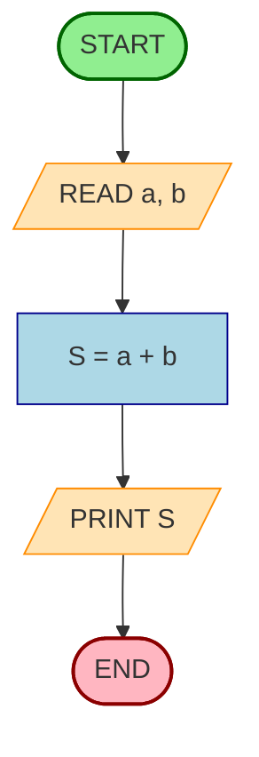
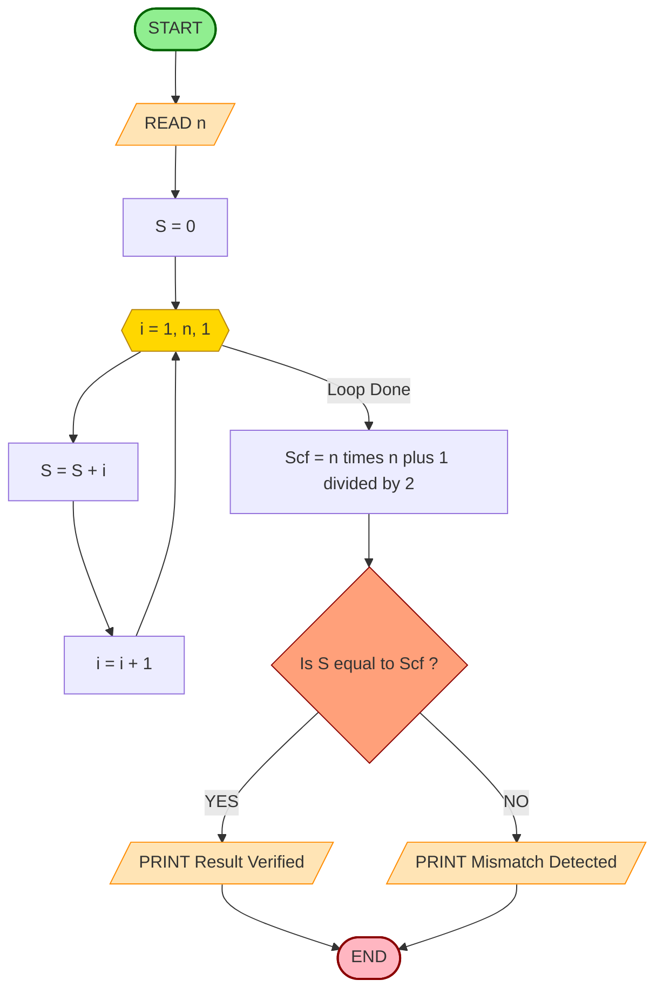
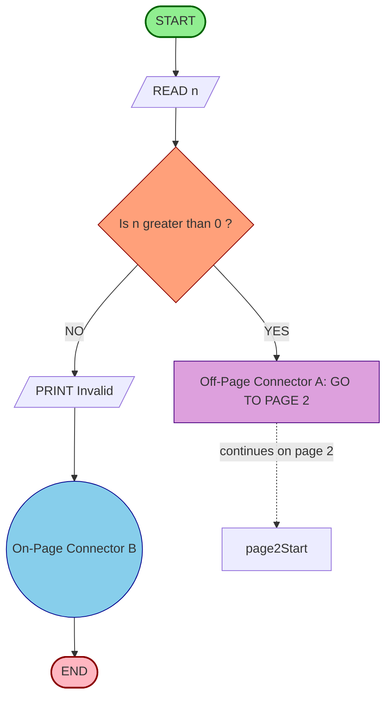
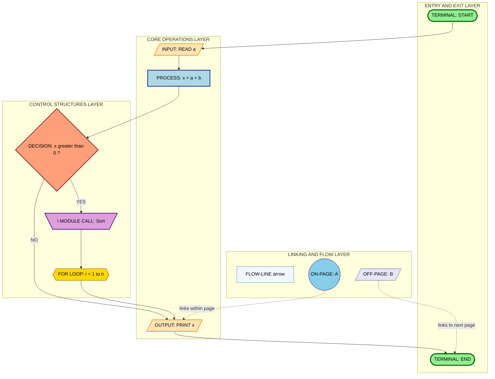
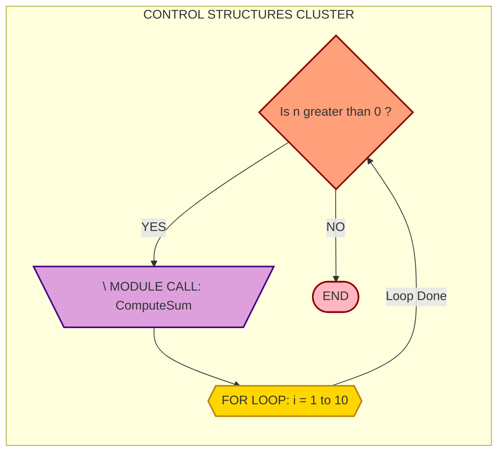
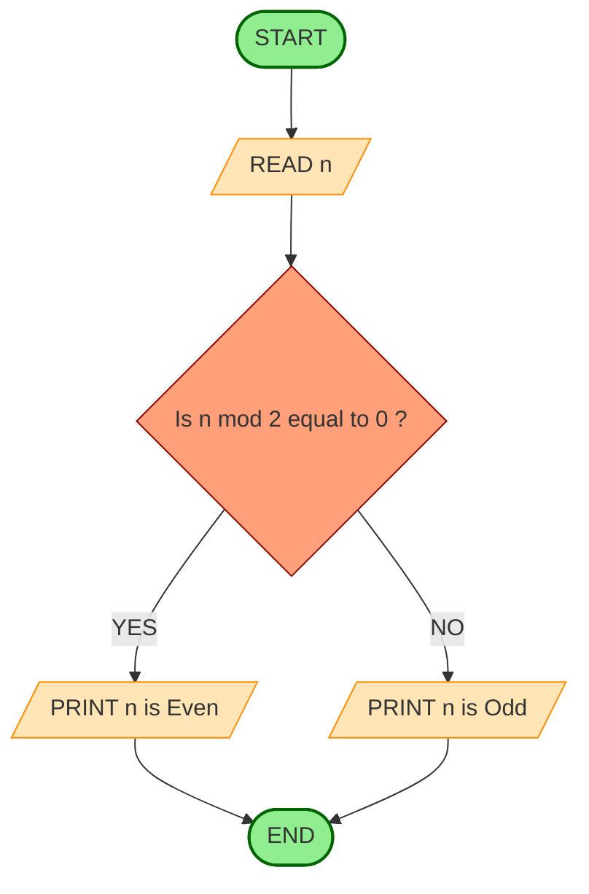
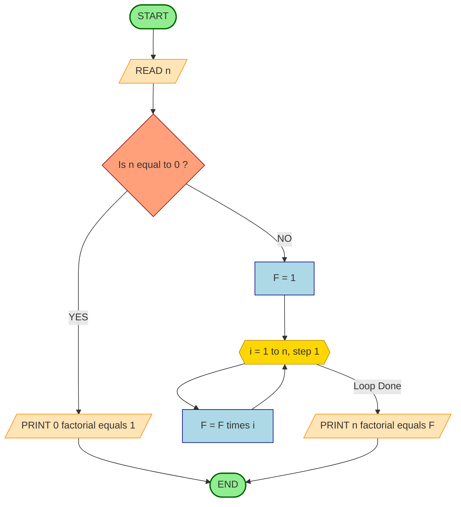

# FLOWCHARTS** :- Symbols used in creating a Flowchart - start and end, arithmetic calculations, input/output operation, decision (selection), module name (call), for loop (Hexagon), flow-lines, on-page connector, off-page connector.

<!-- SECTION_1_START -->
# FLOWCHARTS — Symbols Used in Creating a Flowchart

> [!IMPORTANT]
> **KTU 2024 Scheme | UCEST105 — Algorithmic Thinking with Python | Module 2**
> This note covers the **standardized ANSI/ISO flowchart symbols** that every B.Tech student must be able to draw and identify for the End Semester Evaluation (ESE). The symbols listed here are directly aligned with the syllabus statement of **Module 2: Algorithm and Pseudocode Representation**.

## 1.1 Formal Academic Definition

A **Flowchart** is a **graphical / diagrammatic representation of an algorithm, process, or workflow** in which the sequence of operations is depicted using a standardized set of geometric symbols connected by **directed flow-lines (arrows)**. It is governed by the **ANSI X3.5 / ISO 5807** standards, which prescribe the *shape* and *semantic meaning* of every box used in the diagram.

A flowchart is composed of three mandatory ingredients:

1. **Geometric Symbols** — each shape has a fixed meaning.
2. **Textual Annotations** — placed inside the shape to describe the action.
3. **Flow-Lines (Arrows)** — define the logical order in which the actions are executed.

> [!NOTE]
> **Definition (KTU Board-Examiner phrasing):**
> "A flowchart is a type of diagram that represents an algorithm or process, showing the steps as boxes of various kinds, and their order by connecting them with arrows."

## 1.2 Conceptual Analogy — Intuition for First-Time Learners

Imagine a **factory assembly line** that builds a car:

- A **green START button** switches the line ON.
- A **robotic arm** performs an action (e.g., welding) → this is a *Process*.
- A **scanner** reads a barcode → this is *Input*.
- A **fork in the conveyor belt** decides whether the car is a Sedan or an SUV → this is a *Decision*.
- A **sub-assembly bay** calls a separate pre-built engine module → this is a *Module Call*.
- A **red STOP button** switches the line OFF → this is *End*.

A flowchart is exactly this — a **blueprint of an assembly line for a piece of software logic**.

> [!TIP]
> **Memory Trick for Exams:** The shape of a symbol often *visually hints* at its function. For example, the **diamond (Decision)** looks like a "forked road", and the **parallelogram (Input/Output)** looks like a "slanted document being fed into a machine".

## 1.3 Why Flowcharts Are Taught Before Coding

| Benefit | Engineering / Industry Use-Case |
|---|---|
| **Language Independent** | Communicates logic to stakeholders who don't know Python. |
| **Debugging Aid** | Helps trace logical errors *before* writing a single line of code. |
| **Documentation** | Used in software design specifications (SDD) as per IEEE 830. |
| **Process Engineering** | Used in manufacturing, supply chain, and ISO 9001 quality audits. |

## 1.4 Visual Representation of the Topic Architecture

> [!VISUALIZATION CONTROL]
> **Concept:** High-level taxonomy of the 9 standard Flowchart Symbols (Module 2 syllabus).
> **GeoGebra / Desmos Input Equations (Logical grouping on a 2D plane):**
> * `x >= 0` → Terminal Symbols (Start / End)
> * `Process` block: `y = f(x)` style rectangular area
> * `Decision` block: diamond vertices at `(0,1), (1,0), (0,-1), (-1,0)`
> * `Connector` zones: circular/pentagonal loci
>
> **Visual Description:** On the upper-half plane ($y > 0$) place the *oval* terminal symbols; on the equator ($y = 0$) place the *rectangle* (Process), *parallelogram* (I/O), *double-rectangle* (Module Call), and *hexagon* (For Loop); slightly below the equator, the *diamond* (Decision) sits; and the two *connector* symbols (circle and pentagon) are placed in the lower-half to symbolize **linking** the upper diagram regions.

<!-- SECTION_1_END -->

<!-- SECTION_2_START -->
# Deep Theoretical Analysis & KTU High-Yield Formula Sheet

## 2.1 The Nine Standard Flowchart Symbols — Structured Breakdown

Each symbol is explained using the operational template: **What → Why → When to use**.

### 🔹 Symbol 1 — Terminal (Start / End)

- **Shape:** Rounded rectangle / Oval / Stadium / Pill (`( )`).
- **What it does:** Marks the **entry point** ("START", "BEGIN") or the **exit point** ("STOP", "END", "HALT") of the algorithm.
- **Why:** Every flowchart *must* have exactly one Start and at least one End. Without these, the control flow is undefined (a fatal flowcharting error that KTU examiners explicitly deduct marks for).
- **When to use:** Only once for "Begin" and once (or more, in multiple exit paths) for "End".

> [!NOTE]
> **Single-Entry, Single-Exit (SESE) Rule:** Well-structured procedural flowcharts follow SESE — one START, one END. Multiple ENDs are allowed for error-exit paths, but only one START is permitted.

### 🔹 Symbol 2 — Process (Arithmetic / Assignment)

- **Shape:** Plain **Rectangle** (`[ ]`).
- **What it does:** Represents any **arithmetic operation, data assignment, or value modification** step.
- **Why:** It is the "workhorse" of the flowchart — roughly 60-70% of all symbols in a typical flowchart are Process boxes.
- **When to use:** For statements like `x = a + b`, `count = count + 1`, `area = length * breadth`.

### 🔹 Symbol 3 — Input / Output (I/O)

- **Shape:** **Parallelogram** (skewed rectangle).
- **What it does:** Represents the **reading of data** into the system (`input()` in Python) or the **displaying of data** to the user (`print()` in Python).
- **Why:** It clearly separates "interaction with the outside world" from "internal computation". This is a critical distinction during KTU valuation — examiners **demand** the correct shape for I/O.
- **When to use:** For `input("Enter a number: ")` and `print("Result is:", x)`.

### 🔹 Symbol 4 — Decision (Selection / Branching)

- **Shape:** **Diamond / Rhombus** (`< >`).
- **What it does:** Represents a **conditional test** that has **one entry** and **two (or more) exit paths** — labelled **TRUE** and **FALSE** (or YES / NO).
- **Why:** Implements the `if-elif-else` logic of Python. The diamond is the *only* symbol allowed to have more than one outgoing flow-line.
- **When to use:** For statements like `if x > 0`, `if marks >= 50`.

> [!IMPORTANT]
> **Bidirectional Decision Rule:** A diamond may have **two outputs** (`Yes` / `No`) for binary decisions. For multi-way decisions (e.g., `switch` on a variable), it is acceptable to have **multiple outgoing arrows**, each labelled with the corresponding case.

### 🔹 Symbol 5 — Predefined Process (Module / Function Call)

- **Shape:** Rectangle with **double vertical lines** on the left and right edges (looks like a "boxed-in" rectangle).
- **What it does:** Represents a **call to a separately defined subroutine, function, or module** — the logic exists elsewhere, and the flowchart simply invokes it by name.
- **Why:** Enables **modular flowcharts**. Instead of inlining a 50-step procedure, the flowchart calls it by name (e.g., `CALL Sort(arr)`).
- **When to use:** Whenever a named function/subroutine is invoked, such as `computeGST(price)`, `validateOTP(code)`.

### 🔹 Symbol 6 — For Loop (Iteration — Hexagon)

- **Shape:** **Hexagon** (six-sided polygon).
- **What it does:** Represents a **definite loop** — i.e., a loop that runs for a **pre-known number of iterations** (e.g., Python's `for i in range(n)`).
- **Why:** The hexagon is a *rare* symbol and is explicitly mentioned in the KTU 2024 syllabus as part of Module 2. It visually distinguishes a **count-controlled loop** from other loop types.
- **When to use:** When the iteration count is known in advance, e.g., `for i in range(1, 11): print(i)`.

> [!NOTE]
> **Note on the For-Loop Hexagon:** In strict ANSI X3.5 standard, the hexagon represents a **"Preparation" / "Initialization"** step, which is commonly repurposed in academic flowcharts to denote the *loop counter initialization* of a `for` loop. This is the convention adopted by the KTU 2024 syllabus for Module 2.

### 🔹 Symbol 7 — Flow-Lines (Arrows)

- **Shape:** Directed arrows (`→`).
- **What it does:** Connect the symbols in a **top-to-bottom, left-to-right** sequence, defining the order of execution.
- **Why:** Without arrows, the flowchart is *static* — it has no defined execution sequence. Arrows give it **dynamic, executable meaning**.
- **When to use:** Between every pair of consecutive steps.
- **Direction Convention:** The **default flow direction is top-to-bottom** and **left-to-right**. Arrows pointing "up" or "right-to-left" are permitted only to avoid excessive line crossings, and they *must* carry an arrowhead (otherwise they are merely connectors, not flow-lines).

### 🔹 Symbol 8 — On-Page Connector (Internal Connector)

- **Shape:** A small **circle** (`○`).
- **What it does:** Acts as a **"jump point"** to link two parts of a flowchart that are drawn on the **same page** but at locations where drawing a connecting line would cause clutter or crossings.
- **Why:** Keeps the flowchart visually clean. A circle is used at the *source* point and another circle with the **same identifier letter/number** is placed at the *destination* point.
- **When to use:** When the flowchart has to be split across a single physical sheet to maintain readability.

> [!IMPORTANT]
> **On-Page Connector Pairing Rule:** The identifier inside the two circles **must match exactly** (e.g., both labelled `A` or both labelled `1`). Mismatched identifiers are a **common 1-mark deduction** in KTU ESE valuations.

### 🔹 Symbol 9 — Off-Page Connector (External Connector)

- **Shape:** A **home-plate / pentagon** shape (a square with a triangular point on one side).
- **What it does:** Acts as a **"jump point"** to link to a flowchart that **continues on a different page** (or a different sheet in a multi-sheet diagram).
- **Why:** Essential for large, multi-page flowcharts (e.g., in system design documents). The pentagon is filled at the source and empty at the destination, or both are labelled with the page number reference.
- **When to use:** When the algorithm is too large to fit on one page.

## 2.2 KTU Formula Sheet / Cheat Sheet (High-Yield Symbol Table)

> [!IMPORTANT]
> The following table is the **definitive KTU ESE reference** for Module 2. Memorize the **Geometric Shape → Meaning → Python Equivalent** mapping.

| # | Symbol Name | Geometric Shape | Purpose / Meaning | Python / Algorithmic Equivalent | Drawing Hint |
|---|---|---|---|---|---|
| 1 | Terminal (Start/End) | Oval / Rounded Rectangle / Pill | Begin and End of the algorithm | Program entry / `exit()` | `( START )` |
| 2 | Process / Assignment | Rectangle | Arithmetic, data manipulation | `x = a + b` | `[ x = a + b ]` |
| 3 | Input / Output | Parallelogram | Read from user / Display to user | `input()`, `print()` | `/ read n /` |
| 4 | Decision | Diamond / Rhombus | Conditional test, branching | `if`, `elif`, `else` | `< x > 0 ? >` |
| 5 | Predefined Process (Module Call) | Rectangle with double vertical bars | Call to a function / subroutine | `function_name(args)` | `[\\ Sort(arr) /]` |
| 6 | For Loop (Hexagon) | Hexagon (6 sides) | Definite / count-controlled loop | `for i in range(n):` | `<> i = 1, 10, 1 <>` |
| 7 | Flow-Line | Directed Arrow | Defines order of execution | Sequential control flow | `→` |
| 8 | On-Page Connector | Small Circle | Link within the same page | `goto` same-page label | `○ A` |
| 9 | Off-Page Connector | Pentagon / Home-Plate | Link to a different page | `goto` cross-page label | `⌂ B → Page 2` |

## 2.3 Real-World Engineering Utility

| Domain | Where Flowcharts Are Used |
|---|---|
| **Software Engineering** | Algorithm design in SDLC (Software Development Life Cycle) before coding. |
| **Manufacturing** | Assembly line blueprints (Toyota Production System). |
| **Quality Assurance (ISO 9001)** | Process audit diagrams. |
| **Embedded Systems** | State-machine representation of firmware logic. |
| **Network Engineering** | Packet routing and call-flow diagrams (SS7 / SIP). |
| **Healthcare** | Clinical decision algorithms (e.g., ACLS resuscitation flow). |

> [!TIP]
> **Industry Naming Convention:** In **UML (Unified Modeling Language)** — the industry-standard notation used in software engineering — the flowcharts are *evolved* into **Activity Diagrams**, which retain all 9 symbols discussed above, but add swimlanes, fork/join nodes, and signal icons. Mastering flowcharts now is a direct prerequisite for UML.

<!-- SECTION_2_END -->

<!-- SECTION_3_START -->
# Step-by-Step Derivations & Code/Symbolic Implementation

## 3.1 Worked Example 1 — Translating a Python Program to a Flowchart

**Problem Statement (KTU typical):**
Draw a flowchart to read two integers $a$ and $b$, compute their sum $S = a + b$, and display the result.

### Step-by-Step Construction

| Step # | Action | Flowchart Symbol Used | Justification |
|---|---|---|---|
| 1 | Start the algorithm | Terminal (Oval) | Marks program entry. |
| 2 | Read `a` and `b` from the user | Parallelogram (I/O) | Input operation. |
| 3 | Compute `S = a + b` | Rectangle (Process) | Arithmetic calculation. |
| 4 | Display the value of `S` | Parallelogram (I/O) | Output operation. |
| 5 | End the algorithm | Terminal (Oval) | Marks program exit. |

### Mermaid Representation of the Flowchart



### Equivalent Python Source Code

```python
def sum_two_numbers() -> None:
    """
    Reads two integers from the user, computes their sum,
    and displays the result. This is the direct Python
    translation of the flowchart constructed above.
    """
    try:
        a: int = int(input("Enter the first integer a: "))
        b: int = int(input("Enter the second integer b: "))
        S: int = a + b
        print(f"The sum S = {S}")
    except ValueError as err:
        print(f"Invalid input — please enter integers only. Error: {err}")


if __name__ == "__main__":
    sum_two_numbers()
```

**Symbol-to-Code Trace (Validation):**

| Flowchart Step | Python Line | Symbol Used |
|---|---|---|
| `START` | `def sum_two_numbers():` | Terminal (Oval) |
| `READ a, b` | `int(input(...))` | Parallelogram (I/O) |
| `S = a + b` | `S: int = a + b` | Rectangle (Process) |
| `PRINT S` | `print(f"...")` | Parallelogram (I/O) |
| `END` | implicit return / program exit | Terminal (Oval) |

---

## 3.2 Worked Example 2 — Flowchart with Decision (Selection) and For-Loop (Hexagon)

**Problem Statement:**
Draw a flowchart to read an integer $n$, and use a `for` loop to compute and print the **sum of the first $n$ natural numbers**:

$$
S = \sum_{i=1}^{n} i = \frac{n(n+1)}{2}
$$

(Your flowchart must verify the result using the closed-form formula.)

### Step-by-Step Derivation

**Step 1 — Initialize the accumulator**

We define $S \leftarrow 0$ and $i \leftarrow 1$ before the loop begins.

$$
S \leftarrow 0, \quad i \leftarrow 1
$$

**Step 2 — Loop control (For-Loop Hexagon)**

The hexagon is used to specify the loop boundary:

$$
i = 1 \text{ to } n, \text{ step } 1
$$

**Step 3 — Loop body (Process)**

Inside the loop, the accumulator is updated:

$$
S \leftarrow S + i
$$

**Step 4 — Loop exit and closed-form verification (Decision)**

After the loop, we compute the closed-form result:

$$
S_{cf} = \frac{n(n+1)}{2}
$$

Then a **Decision (Diamond)** checks:

$$
\text{Is } S = S_{cf} ?
$$

- If **TRUE** → print `Result Verified`.
- If **FALSE** → print `Mismatch Detected`.

**Step 5 — End**

The algorithm terminates with a Terminal (Oval) `END` symbol.

### Mermaid Representation



### Equivalent Python Source Code

```python
def sum_natural_numbers() -> None:
    """
    Reads n and computes the sum of the first n natural
    numbers using a for-loop, then verifies the result
    using the closed-form formula n*(n+1)/2.

    Flowchart -> Python traceability:
        Terminal        -> function def / implicit END
        Parallelogram   -> input() / print()
        Rectangle       -> arithmetic (S = S + i)
        Hexagon         -> for i in range(1, n+1)
        Diamond         -> if S == S_cf
    """
    try:
        n: int = int(input("Enter a positive integer n: "))
        if n <= 0:
            raise ValueError("n must be a positive integer.")

        # Step 1: Initialize accumulator (Rectangle: Process)
        S: int = 0

        # Step 2: For-Loop (Hexagon: for i = 1 to n, step 1)
        for i in range(1, n + 1):
            # Step 3: Loop body (Rectangle: Process)
            S = S + i

        # Step 4: Closed-form formula (Rectangle: Process)
        S_cf: int = n * (n + 1) // 2

        # Step 5: Decision (Diamond)
        if S == S_cf:
            # Output (Parallelogram)
            print(f"Result Verified. Sum = {S}")
        else:
            print("Mismatch Detected — algorithm error.")

    except ValueError as err:
        print(f"Invalid input: {err}")


if __name__ == "__main__":
    sum_natural_numbers()
```

### Mathematical Verification (Derivation)

The closed-form sum is derived as:

$$
\begin{aligned}
S &= \sum_{i=1}^{n} i \\
  &= 1 + 2 + 3 + \cdots + n \\
  &= \frac{n(n+1)}{2}
\end{aligned}
$$

For $n = 5$, the expected sum is:

$$
S = \frac{5 \cdot 6}{2} = 15
$$

Which matches the loop computation $1 + 2 + 3 + 4 + 5 = 15$. ✓

---

## 3.3 Worked Example 3 — Multi-Page Flowchart with On-Page and Off-Page Connectors

**Problem Statement:**
Design a flowchart for the following algorithm that spans two pages, using **on-page** and **off-page** connectors appropriately.

```
ALGORITHM:
1. Read n
2. IF n > 0, go to PAGE 2 (Off-page connector A)
3. ELSE, print "Invalid" and END (On-page connector B pairs with END)
```

### Mermaid Representation



**Key Trace of Connectors:**

| Connector Type | Shape | Used At | Identifier | Connects To |
|---|---|---|---|---|
| Off-Page | Pentagon `⌂` | Source (Page 1) | `A` | Destination (Page 2) |
| On-Page | Circle `○` | Source (Page 1) | `B` | Destination (Page 1, END) |

---

## 3.4 Best-Practice Drawing Rules (KTU Examiner's Checklist)

| Rule # | Rule | Penalty If Violated |
|---|---|---|
| 1 | Flow-chart must have **exactly one START** terminal. | −1 mark |
| 2 | Every path must terminate at an **END** terminal. | −1 mark per missing END |
| 3 | **Arrows must have arrowheads** — a line without an arrowhead is invalid. | −1 mark |
| 4 | **Decision diamonds** must have *all* outgoing branches labelled (Yes/No, True/False). | −1 mark per unlabelled branch |
| 5 | Symbols should **not overlap**; lines should not cross unnecessarily. | −1 mark |
| 6 | Use **on-page connectors (circles)** with matching identifiers if lines would cross. | −1 mark for mismatched IDs |
| 7 | Use **off-page connectors (pentagons)** when the flowchart exceeds one page. | −1 mark |
| 8 | Default flow direction: **top-to-bottom**, **left-to-right**. | −1 mark |
| 9 | Text inside a shape must be **short and meaningful** (avoid paragraphs). | −1 mark |
| 10 | The **For-Loop Hexagon** must specify `start, end, step`. | −1 mark |

<!-- SECTION_3_END -->

<!-- SECTION_4_START -->
# Structural Diagrams & Schematics

## 4.1 Master Diagram — The 9 Standard Flowchart Symbols (Topological Layout)

The following Mermaid block renders a **functional architecture flow** that maps every symbol to its *role* in the control-flow of a typical algorithm. This serves as the **master visual reference** for the topic.



## 4.2 Sequential Processing Topology Matrix

The matrix below maps the **9 symbols** to their **structural role** in the control-flow hierarchy of a typical algorithm.

| Layer | Symbol | Role in Flow | Connects From | Connects To |
|---|---|---|---|---|
| **L1 — Entry/Exit** | Terminal (Oval) | Anchor point | — | I/O or Process |
| **L2 — I/O** | Parallelogram | External interaction | Terminal or Process | Terminal or Process |
| **L3 — Process** | Rectangle | Data transformation | I/O, Decision, or Module | I/O, Decision, or Terminal |
| **L4 — Control** | Diamond, Hexagon, Module-Call | Branching / Iteration / Modularity | Process or I/O | Process, I/O, or Terminal |
| **L5 — Linking** | Arrow, Circle, Pentagon | Navigation between steps | Any symbol | Any symbol |

## 4.3 Decision-Flow Architecture (Subgraph Isolation)

The following Mermaid subgraph isolates the **Decision + Loop + Module-Call** control cluster to show how a single flowchart handles **branching, iteration, and modularity** in a clean, non-crossing layout.



> [!TIP]
> **Mermaid Safety Note:** All node IDs in the diagrams above are purely **alphanumeric** (`start1`, `readN`, `decCheck`, `loopInit`) prefixed with letters — they do not collide with Mermaid reserved keywords like `end`, `subgraph`, or `graph`. All special-character labels are double-quoted and contain **no markdown formatting**.

<!-- SECTION_4_END -->

<!-- SECTION_5_START -->
# KTU 2024 Scheme Examination Question Bank & Topic Recap

## 5.1 Part A — Short Answer Questions (2 × 3 = 6 Marks)

### Question 1 (3 Marks)
> **[KTU University Exam – July 2024 | CO1 | Remember]**
> List any **six standard flowchart symbols** and state the **purpose** of each in one line.

**Model Answer (Board-Examiner Key):**

1. **Terminal (Oval)** — Marks the start or end of the algorithm. **[0.5 Marks]**
2. **Process (Rectangle)** — Represents an arithmetic or assignment operation. **[0.5 Marks]**
3. **Input/Output (Parallelogram)** — Represents reading input or displaying output. **[0.5 Marks]**
4. **Decision (Diamond)** — Represents a conditional test with two or more outcomes. **[0.5 Marks]**
5. **Predefined Process (Rectangle with double lines)** — Represents a call to a function or subroutine. **[0.5 Marks]**
6. **Flow-Line (Arrow)** — Connects symbols to indicate the order of execution. **[0.5 Marks]**

> **[Award 3 Marks only if all 6 are correctly named and described in one line each.]**

---

### Question 2 (3 Marks)
> **[KTU University Exam – Dec 2023 | CO1 | Understand]**
> Differentiate between an **on-page connector** and an **off-page connector** in a flowchart. Give the symbol shape used for each.

**Model Answer (Board-Examiner Key):**

| Feature | On-Page Connector | Off-Page Connector |
|---|---|---|
| **Shape** | Small **circle** (`○`) | **Pentagon / Home-plate** |
| **Purpose** | Links two parts of a flowchart on the **same page**. | Links a flowchart to **another page**. |
| **Identifier** | Letter or number inside the circle (must match at both ends). | Page reference label inside the pentagon. |
| **When Used** | When drawing a direct line would cause crossing on the same page. | When the algorithm spans multiple pages. |

**[Award 1 Mark for shape identification, 1 Mark for purpose, 1 Mark for usage context.]**

---

## 5.2 Part B — Long Answer Questions (Internal Choice, 1 × 14 = 14 Marks)

### Question A (14 Marks)
> **[KTU University Exam – July 2024 | CO2, CO3 | Apply, Analyze]**
> **(a)** Design a flowchart to read an integer $n$ and determine whether it is **even or odd** using a decision symbol. **[7 Marks]**
> **(b)** Convert the flowchart designed in part (a) into a **Python program** and **trace its execution** for $n = 17$. **[7 Marks]**

---

**Solution to Part (a) — Flowchart Design [7 Marks]**

**Step 1: Identify the symbols needed** **[1 Mark]**
- 1 × Terminal (Start)
- 1 × Parallelogram (Read n)
- 1 × Diamond (Decision: n mod 2 == 0)
- 2 × Parallelogram (Print "Even" / Print "Odd")
- 1 × Terminal (End)

**Step 2: Construct the flowchart** **[5 Marks for diagram, 1 Mark for labelling]**



**Step 3: Mark valuation key points** **[1 Mark]**
- Decision branches correctly labelled "YES" and "NO". **[0.5 Mark]**
- Start has exactly one entry; End merges both paths. **[0.5 Mark]**

---

**Solution to Part (b) — Python Implementation + Trace [7 Marks]**

**Step 1: Write the Python program** **[3 Marks]**

```python
def check_even_odd() -> None:
    """
    Reads an integer n and prints whether it is Even or Odd.
    Direct Python translation of the flowchart in part (a).
    """
    try:
        n: int = int(input("Enter an integer n: "))
        if n % 2 == 0:
            print(f"{n} is Even")
        else:
            print(f"{n} is Odd")
    except ValueError as err:
        print(f"Invalid input: {err}")


if __name__ == "__main__":
    check_even_odd()
```

**Step 2: Trace the execution for n = 17** **[4 Marks]**

| Line | Action | n | n mod 2 | Output |
|---|---|---|---|---|
| 1 | `int(input(...))` reads `17` | 17 | — | — |
| 2 | `n % 2` evaluated | 17 | 1 | — |
| 3 | `if n % 2 == 0` → `1 == 0` → **False** | 17 | 1 | — |
| 4 | `else` branch executes | 17 | 1 | — |
| 5 | `print` statement fires | 17 | 1 | `17 is Odd` |

**Final Output:** `17 is Odd` **[1 Mark]**

---

### Question B (14 Marks — Alternative Choice)
> **[KTU University Exam – Dec 2023 | CO2, CO3 | Apply, Analyze]**
> **(a)** Draw a flowchart using a **For-Loop Hexagon** to compute the **factorial** of a given positive integer $n$. Use a decision symbol to handle the case $n = 0$ (where $0! = 1$). **[7 Marks]**
> **(b)** Translate the flowchart into a Python program and verify the result for $n = 6$. Show the value of the factorial accumulator $F$ at **each loop iteration**. **[7 Marks]**

---

**Solution to Part (a) — Flowchart with For-Loop Hexagon [7 Marks]**

**Step 1: Identify the symbols** **[1 Mark]**
- Terminal (Start/End), Parallelogram (I/O), Rectangle (Process), Diamond (Decision), Hexagon (For-Loop).

**Step 2: Algorithm design** **[2 Marks]**
The factorial is defined as:

$$
n! = \prod_{i=1}^{n} i = 1 \cdot 2 \cdot 3 \cdots n
$$

Special case: $0! = 1$.

**Step 3: Construct the flowchart** **[4 Marks]**



---

**Solution to Part (b) — Python + Iteration Trace for n = 6 [7 Marks]**

**Step 1: Python implementation** **[3 Marks]**

```python
def compute_factorial() -> None:
    """
    Computes n! using a for-loop. Direct translation of
    the flowchart with a decision + hexagon loop.
    """
    try:
        n: int = int(input("Enter a non-negative integer n: "))
        if n < 0:
            raise ValueError("Factorial is not defined for negatives.")

        # Decision (Diamond): special case
        if n == 0:
            print(f"0! = 1")
        else:
            # For-Loop (Hexagon) initialization
            F: int = 1
            for i in range(1, n + 1):
                # Loop body (Process)
                F = F * i
            # Output (Parallelogram)
            print(f"{n}! = {F}")

    except ValueError as err:
        print(f"Invalid input: {err}")


if __name__ == "__main__":
    compute_factorial()
```

**Step 2: Iteration Trace for n = 6** **[4 Marks]**

| Iteration | i | F (before) | F = F × i (after) |
|---|---|---|---|
| 1 | 1 | 1 | 1 × 1 = **1** |
| 2 | 2 | 1 | 1 × 2 = **2** |
| 3 | 3 | 2 | 2 × 3 = **6** |
| 4 | 4 | 6 | 6 × 4 = **24** |
| 5 | 5 | 24 | 24 × 5 = **120** |
| 6 | 6 | 120 | 120 × 6 = **720** |

**Final Output:** `6! = 720` **[1 Mark for final value]**

---

> [!WARNING]
> **KTU Examiner's Valuation Warning — Common Pitfalls**
> 1. **Wrong shape for I/O:** Many students draw a **rectangle** instead of a **parallelogram** for `input`/`print`. This loses **1 mark per occurrence** in the KTU board valuation key.
> 2. **Missing arrowheads:** A line *without* an arrowhead is **not** a flow-line. Examiners deduct marks for every "dangling connector".
> 3. **Unlabelled Decision branches:** The diamond's outgoing arrows must be labelled `YES`/`NO` (or `TRUE`/`FALSE`). A bare diamond is **incomplete**.
> 4. **Hexagon misuse:** The For-Loop Hexagon is only for **count-controlled loops** (`for i in range(...)`). Using it for a `while` loop is incorrect.
> 5. **Mismatched connector IDs:** On-page circles with mismatched letters (e.g., one labelled `A` and the other `B`) are treated as **two unrelated jumps** — examiners deduct 1 mark.
> 6. **Multiple STARTs:** A flowchart can have only **one START terminal**. Multiple STARTs indicate a poorly structured algorithm.
> 7. **No END symbol:** Every flowchart *must* terminate at an END. Leaving an arrow dangling into empty space is a fatal flaw.
> 8. **Crossing lines without connectors:** Excessive crossings are penalized; use on-page connectors to redirect cleanly.

---

## 5.3 Topic Recap & Important Things to Remember

> [!IMPORTANT]
> **High-Density Revision Checklist — KTU Module 2: Flowchart Symbols**

- ✅ A **flowchart** is a standardized **graphical representation of an algorithm** governed by **ANSI X3.5 / ISO 5807**.
- ✅ A flowchart has **three components**: **Symbols**, **Text**, and **Flow-Lines (Arrows)**.
- ✅ The **Terminal (Oval)** is mandatory for **Start** and **End**; exactly **one START** and at least **one END** are required.
- ✅ The **Process (Rectangle)** is used for **arithmetic, assignment, and data manipulation** steps (e.g., `S = a + b`).
- ✅ The **Parallelogram** is **strictly reserved for I/O** — never use a rectangle for `input()` or `print()`.
- ✅ The **Diamond (Decision)** is the *only* symbol allowed to have **more than one outgoing arrow**; all branches must be **labelled**.
- ✅ The **Predefined Process** symbol (rectangle with **double vertical bars**) represents a **function or module call** — used for modular flowcharts.
- ✅ The **Hexagon** in KTU Module 2 represents the **For-Loop** boundary — it must specify `start, end, step` (e.g., `i = 1, n, 1`).
- ✅ **Flow-Lines (Arrows)** must always carry an **arrowhead** and follow the **top-to-bottom, left-to-right** default direction.
- ✅ The **On-Page Connector** is a **circle** used to link two symbols on the **same page** to avoid line crossings; identifiers **must match**.
- ✅ The **Off-Page Connector** is a **pentagon / home-plate** used to link a flowchart to a **different page**; it carries a page reference.
- ✅ Flowcharts are **language-independent** — they precede coding and aid in **debugging, documentation, and SDLC design**.
- ✅ In **UML Activity Diagrams** (industry evolution of flowcharts), the same 9 symbols appear, augmented with **swimlanes, fork/join, and signal icons**.
- ✅ **Best practices**: minimize line crossings, use connectors liberally, label all decision branches, and ensure **SESE (Single-Entry, Single-Exit)**.
- ✅ **Common KTU deduction triggers**: wrong shape for I/O (−1), missing arrowheads (−1), unlabelled decision branches (−1), multiple STARTs (−1), and dangling arrows with no END (−1).
- ✅ **Python ↔ Flowchart mapping** to memorize:
  - `def func():` → **Terminal (Start)**
  - `x = input()` → **Parallelogram (Input)**
  - `x = a + b` → **Rectangle (Process)**
  - `if x > 0:` → **Diamond (Decision)**
  - `for i in range(n):` → **Hexagon (For Loop)**
  - `print(x)` → **Parallelogram (Output)**
  - `return` / end of function → **Terminal (End)**
- ✅ For **multi-page flowcharts**, always use **off-page connectors (pentagons)** at the source and destination; for same-page redirection, use **on-page connectors (circles)** with **matching identifiers**.

<!-- SECTION_5_END -->
