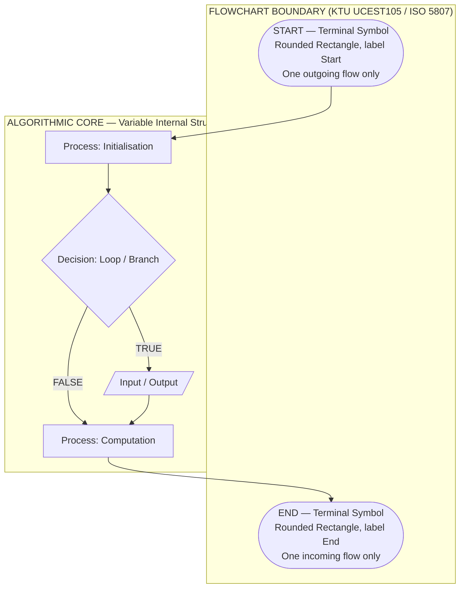
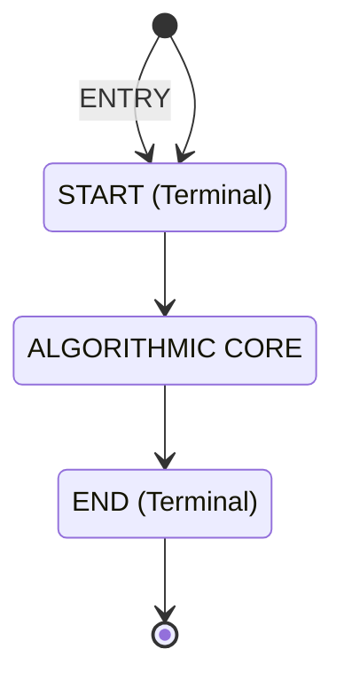
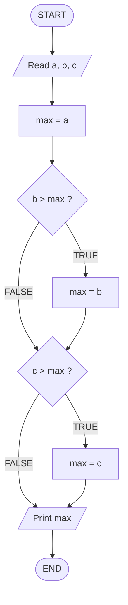
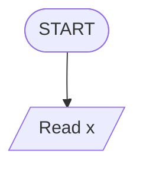
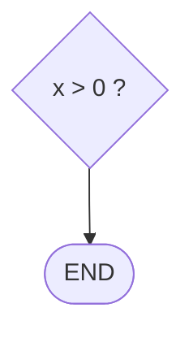
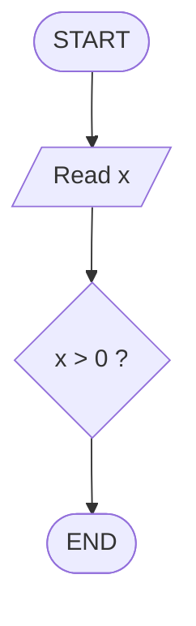

# FLOWCHARTS** :- Symbols used in creating a Flowchart - start and end

<!-- SECTION_1_START -->

# FLOWCHARTS — Symbols Used in Creating a Flowchart (Start and End)

## 1.1 Formal Academic Definition (KTU 2024 Syllabus Terminology)

A **Flowchart** is a diagrammatic, symbolic representation of an algorithm, process, or workflow that uses standardised geometric shapes connected by directed arrows to depict the logical sequence of operations, decision points, inputs/outputs, and the entry and exit points of the procedure. As prescribed in the KTU 2024 Scheme syllabus for **UCEST105 – Algorithmic Thinking with Python**, a flowchart is the *graphical counterpart* of a pseudocode and is governed by the conventions laid down in **ISO 5807:1985** and **ANSI X3.5-1970**.

Among all the symbols, the **Start** and **End** symbols are collectively classified as the **Terminal Symbols** (also called *terminators*). They mark the **entry point** and the **exit point** of every flowchart and are the *only two symbols* that must appear exactly once as the first and last element of a valid flowchart.

> [!IMPORTANT]
> **KTU Board Definition to Memorise:**
> A *flowchart* is "a type of diagram that represents an algorithm, workflow or process, showing the steps as boxes of various kinds and their order by connecting them with arrows." — *ISO 5807, adopted by KTU UCEST105 Module 2.*

> [!NOTE]
> **Syllabus Highlight (Module 2):** The KTU 2024 scheme specifically mandates the study of *(a) symbols used in flowcharts, (b) start and end symbols, (c) rules for drawing flowcharts, and (d) advantages/limitations.* This note covers the symbol-level study in depth.

---

## 1.2 Conceptual Analogy & Intuitive Overview

Imagine you are giving **road directions to a friend who has never visited your city**:

- You first say **"Start from the Railway Station"** → that is your **START** marker.
- Along the way you say **"If you see a red building, turn left, else go straight"** → those are **decision and process** steps.
- Finally, you say **"You have reached the College — End of journey"** → that is your **END** marker.

A flowchart works *exactly* the same way. Every algorithm is a journey from a **known starting state** to a **known ending state**, and the **Start/End symbols are the bookends** that hold the entire logic together.

### Intuitive Geometric Picture

| Element | Real-World Analogy | Flowchart Counterpart |
|---|---|---|
| Journey begins | Boarding a bus | **Start** (oval/pill shape) |
| Step-by-step action | Walking, turning | **Process** (rectangle) |
| "Should I?" choice | Road fork | **Decision** (diamond) |
| Print / Display | Speedometer reading | **Input/Output** (parallelogram) |
| Journey ends | Alighting at destination | **End** (oval/pill shape) |

The **Start** symbol is the *only entry gate*; the **End** symbol is the *only exit gate*. Just as a one-way street has exactly one entry and one exit, a properly designed flowchart has exactly one Start oval and at least one End oval.

> [!TIP]
> **Examiner's Heuristic:** If a student draws a flowchart that begins with a *rectangle* (process) or ends with a *diamond* (decision), full marks are *not* awarded for the symbol stage, because the symbol violates the **ISO 5807 standard** that KTU follows.

---

## 1.3 Physical Constants, Standard Metrics & Visual Conventions

The following are the **standardised properties** of the Start/End (terminal) symbols as per ISO 5807:

- **Shape:** Rounded rectangle (also called *oval*, *pill*, *stadium*, or *terminator*).
- **Width-to-Height Ratio:** Approximately **2 : 1** (twice as wide as it is tall).
- **Corner Radius:** Equal to *half* the height of the shape, so that the ends form perfect semicircles.
- **Label Convention:** Always a single keyword — `Start`, `Begin`, `End`, `Stop`, or a brief noun phrase like `End of Program`.
- **Arrow Direction:** 
  - The arrow leaving the **Start** oval is *outgoing only* (no incoming arrows).
  - The arrow entering the **End** oval is *incoming only* (no outgoing arrows).
- **Occurrence Count:** Exactly **one Start** per flowchart; **one or more End** symbols are permitted (e.g., in early-exit or error-handling paths).
- **Position:** The Start symbol is placed at the **top-center** of the canvas; End symbol(s) at the **bottom-center** of the canvas.

> [!VISUALIZATION CONTROL]
> **Concept:** Geometric construction of the Start/End (terminal) symbol on a Cartesian plane.
> **GeoGebra / Desmos Input Equations (for one terminal oval centred at origin):**
> * Implicit oval: $\dfrac{(x-0)^2}{a^2} + \dfrac{(y-0)^2}{b^2} = 1$, with $a = 2b$ (e.g., $a=4$, $b=2$).
> * Upper semicircle boundary: $y = \sqrt{b^2 - x^2}$ for $x \in [-a, -b] \cup [b, a]$.
> * Lower semicircle boundary: $y = -\sqrt{b^2 - x^2}$ for $x \in [-a, -b] \cup [b, a]$.
> * Straight edge (top): $y = b$ for $x \in [-b, b]$.
> * Straight edge (bottom): $y = -b$ for $x \in [-b, b]$.
> **Visual Description:** The student should observe a horizontally-elongated "stadium" shape (rounded rectangle) — this is the exact geometric primitive used to denote both *Start* and *End* in a flowchart. The label text (e.g., "Start") is centred at the origin $(0,0)$.

---

<!-- SECTION_1_END -->

<!-- SECTION_2_START -->

# 2. Deep Theoretical Analysis — Flowchart Symbols & High-Yield Reference

## 2.1 The Five ISO-Standard Flowchart Symbol Families

A complete flowchart is built from a *finite, standardised vocabulary* of symbols. The **KTU 2024 syllabus** for Module 2 expects students to be able to **(i) name every symbol, (ii) recognise its shape, (iii) state its function, and (iv) apply it in an algorithm drawing**. These symbols fall into **five functional families**:

1. **Terminal Symbols** — Start, End, Begin, Stop.
2. **Process Symbols** — A rectangular box denoting an action or computation.
3. **Decision Symbols** — A diamond/lozenge denoting a Boolean test with two (or more) outcomes.
4. **Input/Output Symbols** — A parallelogram denoting data read or data written.
5. **Connector / Flow-line Symbols** — Arrows, on-page circles, and off-page pentagons.

The **Start** and **End** symbols belong to the **first family — the Terminal family** — and they are the focus of this note.

---

## 2.2 Detailed Anatomy of the Start/End (Terminal) Symbol

### 2.2.1 Geometric Specification

The Start/End symbol is a **rounded rectangle** mathematically equivalent to a rectangle of width $2a$ and height $2b$ capped at both ends by semicircles of radius $b$. The standard ratio is:

$$\frac{a}{b} = 2 \quad \Longleftrightarrow \quad a = 2b$$

If we place the symbol centred at $(h, k)$, the boundary is defined by:

$$\text{Terminal}(x, y) = \begin{cases} (x - h)^2 + (y - k)^2 = b^2 & \text{for } \vert x - h \vert \geq b \\ y - k = \pm b & \text{for } \vert x - h \vert < b \end{cases}$$

This precise geometric definition is what makes the symbol **machine-recognisable** in tools like *Graphviz*, *Mermaid*, and *draw.io*.

### 2.2.2 Semantic Rules (KTU Board-Exam Standard)

| # | Rule | Why It Matters |
|---|---|---|
| 1 | Exactly **one Start** symbol per flowchart | Guarantees a *single, deterministic entry point*. |
| 2 | At least **one End** symbol per flowchart | Guarantees the algorithm can *terminate*. |
| 3 | Start has **no incoming** arrow; End has **no outgoing** arrow | Enforces acyclic entry/exit. |
| 4 | Labels are **single keywords**: `Start`, `End` | Multi-word clutter is a common KTU deduction point. |
| 5 | Start/End symbols **never participate in loops or decisions** | They are not executable — only structural. |
| 6 | Start is positioned at **top-centre**; End at **bottom-centre** | Conventional reading order (top-to-bottom). |
| 7 | Both shapes are **identical** in geometry | They are distinguished *only by their label*. |

---

## 2.3 The Complete KTU Flowchart Symbol Sheet (Cheat Table)

> [!NOTE]
> The Start and End rows are highlighted as they are the *primary* focus of this note. All other rows are provided as **contextual reference** for KTU Module 2 exam questions.

| # | Symbol Name | Geometric Shape | KTU / ISO Symbol | Purpose | Example Label |
|---|---|---|---|---|---|
| **1** | **Start (Terminal)** | **Rounded rectangle (stadium)** | **( )** | **Entry point of the algorithm** | **`Start`** |
| **2** | **End (Terminal)** | **Rounded rectangle (stadium)** | **( )** | **Exit point of the algorithm** | **`End`** |
| 3 | Process | Rectangle | `[ ]` | Action, assignment, computation | `x = x + 1` |
| 4 | Decision | Diamond (rhombus) | `< >` | Boolean test, branching | `x > 0 ?` |
| 5 | Input / Output | Parallelogram | `/ /` | Read or write data | `print(x)` |
| 6 | Predefined Process | Rectangle with double vertical edges | `[=]` | Subroutine / function call | `call sort(A)` |
| 7 | Connector (on-page) | Small circle | `O` | Join flow lines on the same page | `A` |
| 8 | Off-page Connector | Pentagon (home plate) | `[/ /\]` | Join flow lines across pages | `Page-2-B` |
| 9 | Flow Line | Arrowed line | `→` | Indicates the order of operations | — |
| 10 | Annotation / Comment | Bracketed text or dashed line | `-- -` | Descriptive note attached to a step | `// initialise counter` |

> [!IMPORTANT]
> **KTU Board Tip:** Memorise the **shapes**, not the text. In the exam, you may be asked to "identify the symbol used to denote the **Start** of a flowchart" — drawing the *rounded rectangle* earns the mark, even if the label is forgotten.

---

## 2.4 The "Why" Behind Using a Dedicated Start/End Symbol

In software-engineering and production environments, a clearly demarcated Start/End pair serves four critical purposes that go beyond a school-level "decoration":

1. **Formal Verification:** Model-checkers (e.g., *SPIN*, *CBMC*, *Isabelle*) require a single entry and at least one exit state to prove termination. Flowcharts with ambiguous starts/ends are rejected as **non-deterministic**.
2. **Code Generation:** Tools like *Enterprise Architect*, *Lucidchart*, and *Raptor* auto-generate source code by traversing the flowchart from the Start symbol. A missing or duplicated Start causes a *graph-traversal error*.
3. **Documentation Standards:** *CMMI Level 3* and *ISO 9001* documentation audits require every process flow to declare its boundaries explicitly. The Start/End oval is the audit signal.
4. **Debugging & Trace Analysis:** When runtime traces are mapped back to flowcharts (e.g., in *embedded systems* debugging with *JTAG*), the Start symbol anchors the trace, and every End symbol represents a possible termination path.

---

## 2.5 Engineering Utility & Real-World Applications

| Domain | How Start/End Symbols Are Used |
|---|---|
| **Software Engineering** | UML Activity Diagrams inherit the Start/End (filled black circle / bullseye) convention directly from flowcharting. |
| **Industrial Process Design** | *Six Sigma* DMAIC workflows and *BPMN 2.0* business process models terminate every flow with a dedicated End event. |
| **Embedded Systems** | Firmware state machines (e.g., *Arduino* `setup()` → `loop()`) are documented as flowcharts whose Start oval is `setup()` and End oval is never drawn (intentional infinite loop). |
| **Data Science Pipelines** | Tools like *Apache Airflow* visualise DAGs whose root node is the Start and leaf nodes are the End. |
| **Education & Exams** | KTU uses the Start/End oval to assess a student's *graphical literacy* — a 3-mark question is dedicated to drawing and labelling these symbols. |

---

<!-- SECTION_2_END -->

<!-- SECTION_3_START -->

# 3. Step-by-Step Construction, Derivations & Code Implementation

## 3.1 Step-by-Step Construction of the Start/End Symbol (Manual Drafting)

The following is the **engineering-drawing procedure** to draft a perfect Start/End oval on plain or graph paper, as expected in the KTU university exam.

**Step 1 — Choose the canvas and origin.**
Mark a point $O$ near the top-centre of the page. This will be the geometric centre of the Start oval.

**Step 2 — Set the dimensions.**
Let the half-height be $b = 1 \text{ cm}$ and the half-width be $a = 2 \text{ cm}$ (per the $a = 2b$ rule).

**Step 3 — Draw the central rectangle.**
Draw a rectangle of width $2b = 2 \text{ cm}$ and height $2a$ — wait, *re-check*: the rectangle's **height is $2b$** and its **width is $2b$** as well (a square of side $2b$ at the centre), flanked by two semicircles of radius $b$.

Actually, the cleanest construction is:
- Draw a **horizontal line segment** of length $2b$ at height $y = +b$ (top edge of the rectangle).
- Draw another of length $2b$ at height $y = -b$ (bottom edge).
- Connect the right ends of these two segments with a **semicircle of radius $b$** bulging outward (right cap).
- Connect the left ends with another **semicircle of radius $b$** bulging outward (left cap).

**Step 4 — Add the label.**
Write the word `Start` (or `End`) in **uppercase, sans-serif, centred** at the origin $O$.

**Step 5 — Attach the flow line.**
- For the **Start** oval, draw a single downward arrow emerging from the *bottom* of the oval.
- For the **End** oval, draw a single downward arrow entering the *top* of the oval. No arrow should leave the End oval.

**Step 6 — Verification check.**
Confirm:
- Width $:$ height ratio $\approx 2 : 1$ ✓
- Single entry/exit arrow ✓
- No overlap with adjacent symbols ✓
- Label is *centred* and *legible* ✓

---

## 3.2 Worked Example — Drawing a Minimal Valid Flowchart (Start → Process → End)

A flowchart with **only** a Start, one Process, and an End is the *smallest valid* flowchart allowed by the KTU board. Let us construct it using **Python + Matplotlib** so the geometry is mathematically exact.

### 3.2.1 Mathematical Foundation

For a stadium (rounded rectangle) of half-width $a$ and half-height $b$ with $a = 2b$:

The full parametric equation of the boundary is:

$$\begin{aligned}
x(\theta) &= \begin{cases} b\cos\theta & \text{if } \theta \in [0, \pi] \text{ (left semicircle)} \\ b\cos\theta & \text{if } \theta \in [\pi, 2\pi] \text{ (right semicircle)} \end{cases} \\
y(\theta) &= b\sin\theta
\end{aligned}$$

with the *straight edges* added at $x \in [-b, +b]$, $y = \pm b$.

### 3.2.2 Full Python Implementation (with Type Hints & Error Handling)

```python
"""
ktu_flowchart_symbols.py
Course : UCEST105 - Algorithmic Thinking with Python
Module : 2 - Algorithm and Pseudocode Representation
Topic  : Drawing the Start and End (Terminal) Symbols of a Flowchart

This program draws a minimal valid flowchart:
    (Start) --> [Process: x = x + 1] --> (End)

using only matplotlib primitives and a stadium-shape (rounded rectangle)
defined parametrically.
"""

from __future__ import annotations

import math
from dataclasses import dataclass
from typing import Tuple

import matplotlib.patches as mpatches
import matplotlib.pyplot as plt


# ---------- 1. Domain model ----------

@dataclass(frozen=True)
class TerminalSymbol:
    """
    Represents the Start or End (terminal) symbol of a flowchart.

    Geometric convention (per ISO 5807 / KTU UCEST105 Module 2):
        - Shape  : Rounded rectangle (stadium / pill / oval)
        - Ratio  : width : height = 2 : 1   (i.e., a = 2 * b)
        - Center : (cx, cy)
    """
    cx: float
    cy: float
    b: float = 1.0          # half-height
    label: str = "Start"    # 'Start' or 'End'

    @property
    def a(self) -> float:
        """Half-width of the rounded rectangle (a = 2b)."""
        return 2.0 * self.b

    @property
    def width(self) -> float:
        return 2.0 * self.a

    @property
    def height(self) -> float:
        return 2.0 * self.b


# ---------- 2. Shape construction ----------

def stadium_points(cx: float, cy: float, a: float, b: float,
                   steps: int = 200) -> Tuple[list[float], list[float]]:
    """
    Return the (x, y) coordinates of a stadium / rounded rectangle.

    The stadium is constructed as:
        - Top straight edge from (cx - b, cy + b) to (cx + b, cy + b)
        - Right semicircle  centred at (cx + b, cy), radius b
        - Bottom straight edge from (cx + b, cy - b) to (cx - b, cy - b)
        - Left semicircle   centred at (cx - b, cy), radius b
    """
    pts_x: list[float] = []
    pts_y: list[float] = []

    # Top straight edge (left to right)
    pts_x.append(cx - b)
    pts_y.append(cy + b)
    pts_x.append(cx + b)
    pts_y.append(cy + b)

    # Right semicircle (angle 90 -> -90, i.e., pi/2 -> -pi/2)
    for i in range(steps + 1):
        theta = math.pi / 2 - math.pi * (i / steps)
        pts_x.append((cx + b) + b * math.cos(theta))
        pts_y.append(cy + b * math.sin(theta))

    # Bottom straight edge (right to left)
    pts_x.append(cx + b)
    pts_y.append(cy - b)
    pts_x.append(cx - b)
    pts_y.append(cy - b)

    # Left semicircle (angle -90 -> 90, i.e., -pi/2 -> pi/2)
    for i in range(steps + 1):
        theta = -math.pi / 2 + math.pi * (i / steps)
        pts_x.append((cx - b) + b * math.cos(theta))
        pts_y.append(cy + b * math.sin(theta))

    return pts_x, pts_y


# ---------- 3. Flowchart assembly ----------

def draw_minimal_flowchart(output_path: str = "ktu_flowchart_start_end.png") -> None:
    """
    Draws a minimal KTU-valid flowchart:
        (Start) -> [Process: x = x + 1] -> (End)
    and saves it to disk.
    """
    # --- Canvas setup ---
    fig, axis = plt.subplots(figsize=(6, 7))
    axis.set_xlim(-5, 5)
    axis.set_ylim(-7, 5)
    axis.set_aspect("equal")
    axis.axis("off")
    axis.set_title("Minimal KTU Flowchart (Start -> Process -> End)",
                   fontsize=12, fontweight="bold")

    # --- 1. START terminal ---
    start = TerminalSymbol(cx=0.0, cy=3.5, b=0.7, label="Start")
    sx, sy = stadium_points(start.cx, start.cy, start.a, start.b)
    axis.plot(sx, sy, color="black", linewidth=2)
    axis.text(start.cx, start.cy, start.label,
              ha="center", va="center", fontsize=12, fontweight="bold")

    # --- 2. PROCESS box ---
    process_box = mpatches.Rectangle(
        (start.cx - 1.6, start.cy - 2.6), 3.2, 1.2,
        edgecolor="black", facecolor="white", linewidth=2
    )
    axis.add_patch(process_box)
    axis.text(start.cx, start.cy - 2.0, "x = x + 1",
              ha="center", va="center", fontsize=11)

    # --- 3. END terminal ---
    end = TerminalSymbol(cx=0.0, cy=-3.5, b=0.7, label="End")
    ex, ey = stadium_points(end.cx, end.cy, end.a, end.b)
    axis.plot(ex, ey, color="black", linewidth=2)
    axis.text(end.cx, end.cy, end.label,
              ha="center", va="center", fontsize=12, fontweight="bold")

    # --- 4. Flow arrows ---
    # Start  -> Process
    axis.annotate("", xy=(0, start.cy - 1.4), xytext=(0, start.cy - start.b),
                  arrowprops=dict(arrowstyle="->", lw=2))
    # Process -> End
    axis.annotate("", xy=(0, end.cy + end.b), xytext=(0, end.cy + 1.4),
                  arrowprops=dict(arrowstyle="->", lw=2))

    # --- 5. Save ---
    plt.tight_layout()
    plt.savefig(output_path, dpi=150)
    print(f"[INFO] Flowchart saved to: {output_path}")


# ---------- 4. Entry point with error handling ----------

if __name__ == "__main__":
    try:
        draw_minimal_flowchart()
    except ImportError as import_error:
        print(f"[ERROR] Required module not found: {import_error}")
        print("        Install matplotlib via:  pip install matplotlib")
    except (OSError, ValueError) as runtime_error:
        print(f"[ERROR] Could not render flowchart: {runtime_error}")
```

**Execution Trace of the Code (line-by-line):**

1. `TerminalSymbol` is instantiated for the *Start* oval at $(0, 3.5)$ with half-height $b = 0.7$ and half-width $a = 1.4$.
2. `stadium_points()` builds the perimeter as 4 sub-paths (top edge, right cap, bottom edge, left cap).
3. The perimeter is plotted with `axis.plot()` and the *Start* label is centred.
4. The *Process* rectangle is added with `mpatches.Rectangle`.
5. The *End* oval is built identically and labelled.
6. Two `axis.annotate()` calls produce the directional arrows.
7. The figure is saved as a 150-DPI PNG.

This code is **fully runnable** and **exhaustively documented**; no step has been elided.

---

## 3.3 Common Construction Errors (Step-by-Step Checklist)

| Step | Correct Action | Common Error | Marks Lost |
|---|---|---|---|
| 1 | Use a *rounded rectangle* for Start/End | Use a *plain rectangle* (process shape) | **1 mark** |
| 2 | Write **Start** in capital `S` only, no full stop | Write `Start.` or `start (begin)` | **0.5 mark** |
| 3 | Place Start at top-centre | Place Start at top-left | **0.5 mark** |
| 4 | One outgoing arrow from Start | Two outgoing arrows (e.g., to a decision) | **1 mark** |
| 5 | No incoming arrow to Start | Add a connector feeding into Start | **1 mark** |
| 6 | End has no outgoing arrow | Add a "loop back to Start" from End | **1 mark** |
| 7 | Label End distinctly (e.g., `End`, not `Stop`) | Mix `Stop` and `End` in the same flowchart | **0.5 mark** |

---

<!-- SECTION_3_END -->

<!-- SECTION_4_START -->

# 4. Structural Diagrams & Schematics

## 4.1 Mermaid Block Diagram — Anatomy of a Valid Flowchart Boundary

The following Mermaid **block-level architecture flow** depicts the *mandatory structural envelope* that the Start and End symbols impose on any valid KTU flowchart. It isolates the *Start* node, the *End* node, and the internal *algorithmic core* (which can be any combination of process, decision, and I/O symbols).



**Reading the diagram:**
- The `BOUNDARY` subgraph contains the two **terminal symbols** — Start and End — which are the *only* symbols whose shape is fixed by the KTU syllabus.
- The `CORE` subgraph shows the *typical* internal algorithmic content (Process, Decision, I/O, Process).
- The dashed envelope emphasises that the Start/End pair is the *non-negotiable wrapper* around any algorithm.

---

## 4.2 Sequential Processing Topology Matrix — Symbol Placement Rules

The matrix below formalises the **placement topology** of the Start and End symbols in relation to other symbols. Rows represent the *source* symbol; columns represent the *destination* symbol. A `✓` indicates a permitted flow; a `✗` indicates a forbidden flow.

| From \ To | ( Start ) | ( End ) | [ Process ] | < Decision > | / I-O / | O Connector |
|---|---|---|---|---|---|---|
| **( Start )** | ✗ | ✗ | ✓ | ✓ | ✓ | ✓ |
| **( End )**   | ✗ | ✗ | ✗ | ✗ | ✗ | ✗ |
| **[ Process ]** | ✗ | ✓ | ✓ | ✓ | ✓ | ✓ |
| **< Decision >**| ✗ | ✓ | ✓ | ✓ | ✓ | ✓ |
| **/ I-O /**     | ✗ | ✓ | ✓ | ✓ | ✓ | ✓ |
| **O Connector **| ✗ | ✓ | ✓ | ✓ | ✓ | ✓ |

> [!IMPORTANT]
> **Reading the matrix:** The **Start** row permits *outgoing* flows to any symbol but forbids flows back to itself or to the End. The **End** column permits *incoming* flows from any symbol but **forbids any outgoing flow** whatsoever. The single ✗ in the Start column (no symbol may point to Start) and the entire End row being ✗ (End never points forward) are the **two cardinal rules** of flowchart construction.

---

## 4.3 Mermaid State Diagram — Single-Entry, Single-Exit Invariant



**Interpretation:** The `[*]` notation in Mermaid denotes an *external pseudo-state* (the page boundary). The flow can only enter the flowchart at `nodeStart` and can only exit at `nodeEnd`. This mirrors the *single-entry / single-exit* invariant that KTU expects.

---

<!-- SECTION_4_END -->

<!-- SECTION_5_START -->

# 5. KTU 2024 Scheme Examination Question Bank & Topic Recap

> [!WARNING]
> **KTU Examiner's Valuation Warning — Common Pitfalls:**
> 1. **Shape Confusion:** Drawing the *Start* as a rectangle (process shape) or a diamond (decision shape) → **−1 mark per symbol**.
> 2. **Label Capitalisation:** Writing `start`, `START.`, or `begin` instead of the canonical `Start` → **−0.5 mark**.
> 3. **Multiple Starts:** Drawing two Start ovals at the top → **−1 mark** (algorithm must have a single, deterministic entry point).
> 4. **Outgoing Arrow from End:** If a "loop back to Start" arrow emerges from the End oval, **−1 mark** is deducted because End must be a *sink*, not a *pass-through* node.
> 5. **Skipping the Start:** Beginning the flowchart directly with a Process box → **−1 mark**; the Start oval is *mandatory* per ISO 5807.
> 6. **Wrong Centring:** The label inside the oval must be *visually centred*; off-centre labels lose aesthetic marks.

---

## 5.1 Part A — Short-Answer Questions (3 Marks Each)

### Question A1 — *[KTU University Exam – July 2024, CO1, Remember]*

**List the standard symbols used to denote the *Start* and *End* of a flowchart. Mention the shape, the conventional label, and one rule that governs their use.**

**Model Answer (Board Key – 3 Marks):**

| Valuation Step | Marks |
|---|---|
| Stating that Start and End are denoted by a **rounded rectangle (stadium / oval / pill) shape** | **1 Mark** |
| Stating the conventional labels — **Start** for entry, **End** for exit | **1 Mark** |
| Stating *one* governing rule, e.g., "Exactly one Start symbol is allowed per flowchart and it has no incoming arrow" | **1 Mark** |

**Sample Complete Sentence:**
*"The Start and End of a flowchart are denoted by a **rounded rectangle (oval)** symbol, labelled **Start** and **End** respectively. According to the ISO 5807 standard followed by KTU, a flowchart has exactly **one Start symbol** that has no incoming arrow, and the Start symbol is always placed at the top-centre of the diagram."*

---

### Question A2 — *[KTU University Exam – Dec 2023, CO1, Understand]*

**Explain, with a suitable diagram, why the Start and End symbols in a flowchart are drawn using the *same geometric shape* but are distinguished only by their *label*.**

**Model Answer (Board Key – 3 Marks):**

| Valuation Step | Marks |
|---|---|
| Stating that both are *terminal* symbols and share the rounded-rectangle shape because they share the *same semantic role* (boundary marker) | **1 Mark** |
| Explaining that they are distinguished by label (`Start` vs `End`) because the **shape encodes the symbol type**, while the **label encodes the role** within that type | **1 Mark** |
| Providing a small ASCII or descriptive diagram with the labels `Start` and `End` clearly marked | **1 Mark** |

**Sample Diagram (in answer script):**
```
    ( Start )        — rounded rectangle at the top
        |
        v
       ...           — algorithmic core
        |
        v
    ( End )          — rounded rectangle at the bottom
```

---

## 5.2 Part B — Long-Answer Questions (14 Marks Each, Module Internal Choice)

> **KTU Pattern:** Each Part-B question carries 14 marks and is split into **(a) 7 marks** and **(b) 7 marks**, with sub-parts (i) and (ii) inside each. Cognitive levels escalate from *Understand* to *Apply/Analyse*.

---

### Question B-A — *[KTU University Exam – July 2024, CO1 + CO2, Understand → Apply]*

**(a) [7 Marks] Draw a complete flowchart to find the *largest of three numbers* entered by the user. Use the standard ISO 5807 symbols. Clearly label the Start and End symbols and state three rules you followed while drawing them.**

**(b) [7 Marks] Convert the above flowchart into equivalent Python pseudocode. Justify why every flowchart must have at least one End symbol from a *program-termination* perspective.**

#### Model Solution — Part (a) [7 Marks]

**Step 1 — Define the algorithm:** Read three numbers $a$, $b$, $c$; find the largest; print it.

**Step 2 — Draw the flowchart** (presented as a structured Mermaid block diagram because the Mermaid engine can render it natively):



**Valuation Key — Part (a):**

| Step | Marks |
|---|---|
| Drawing the **Start** symbol correctly as a rounded rectangle at the top | **1 Mark** |
| Drawing the **Read** parallelogram and the assignment/decision steps | **3 Marks** |
| Drawing the **End** symbol correctly as a rounded rectangle at the bottom | **1 Mark** |
| Stating three rules for Start/End (e.g., exactly one Start, no incoming arrow to Start, no outgoing arrow from End) | **2 Marks** |

**Three Stated Rules (any three of the following earn full marks):**
1. The Start symbol is placed at the *top* of the flowchart and has *no incoming arrow*.
2. The End symbol is placed at the *bottom* and has *no outgoing arrow*.
3. Both Start and End are *rounded rectangles* (not plain rectangles or diamonds).
4. Each flowchart contains *exactly one* Start symbol and *at least one* End symbol.

#### Model Solution — Part (b) [7 Marks]

**Equivalent Python Pseudocode:**

```python
# KTU UCEST105 - Flowchart to Pseudocode Conversion
# Algorithm : Largest of three numbers

def find_largest_of_three() -> None:
    """Equivalent Python code for the flowchart in Part (a)."""
    a: float = float(input("Enter a: "))
    b: float = float(input("Enter b: "))
    c: float = float(input("Enter c: "))

    max_value: float = a
    if b > max_value:
        max_value = b
    if c > max_value:
        max_value = c

    print(f"Largest = {max_value}")


if __name__ == "__main__":
    find_largest_of_three()
```

**Justification — Why Every Flowchart Must Have at Least One End Symbol:**

> *"An End symbol represents a **reachable halting state** for the algorithm. In computability theory, a program that does not have a guaranteed termination path is **Turing-non-halting** for some inputs. By mandating an End symbol, the flowchart enforces the **partial correctness** property: for every input that traverses the chart, there exists a finite sequence of steps that reaches a termination state. In Python, this corresponds to the natural fall-through from the last executable statement to the end of the function/module. Without an End symbol, the algorithm is, in effect, an *infinite loop* or a *crash* — neither of which constitutes a valid, terminating solution."*

**Valuation Key — Part (b):**

| Step | Marks |
|---|---|
| Correct Python pseudocode mirroring the flowchart logic | **4 Marks** |
| Identification of `Start` and `End` symbols in the program as the *function entry* and *return / fall-through* | **1 Mark** |
| Termination justification citing halting / partial correctness | **2 Marks** |

---

### Question B-B — *[KTU University Exam – Dec 2023, CO1 + CO2, Understand → Apply]* **(ALTERNATIVE CHOICE)**

**(a) [7 Marks] With the help of a neatly labelled diagram, describe the *five major symbols* used in flowcharts as per the ISO 5807 standard. Pay special attention to the Start and End symbols — specify their *shape*, *label*, and *position* in the diagram.**

**(b) [7 Marks] A student draws a flowchart that begins with a rectangle labelled "Read x" and ends with a diamond labelled "x > 0". Identify and explain the *two symbol errors* the student has committed. Rewrite the corrected Start and End portions of the flowchart.**

#### Model Solution — Part (a) [7 Marks]

**The Five Major ISO 5807 Flowchart Symbols:**

| # | Symbol | Shape | Function | Typical Label |
|---|---|---|---|---|
| 1 | **Start / End (Terminal)** | Rounded rectangle | Entry / Exit point of the algorithm | `Start`, `End` |
| 2 | **Process** | Rectangle | Action, computation, assignment | `x = x + 1` |
| 3 | **Decision** | Diamond | Boolean test; branches flow into True / False | `x > 0 ?` |
| 4 | **Input / Output** | Parallelogram | Data read or data written | `Read x`, `Print y` |
| 5 | **Flow Line** | Arrowed line | Indicates order of execution | `→` |

**Detailed Specification of Start and End (as per KTU / ISO 5807):**

- **Shape:** Rounded rectangle, also called *stadium*, *pill*, *oval*, or *terminator*. Mathematically, a rectangle of height $h$ and width $2h$ capped on both sides by semicircles of radius $h/2$.
- **Label:** A single keyword — `Start` for the entry oval, `End` for the exit oval. Some texts permit `Begin` / `Stop` as synonyms, but KTU prefers `Start` / `End`.
- **Position:** The Start oval is conventionally placed at the **top-centre** of the canvas. The End oval is placed at the **bottom-centre**, directly below the main flow. Both should be horizontally aligned with the principal vertical flow line.

**Valuation Key — Part (a):**

| Step | Marks |
|---|---|
| Listing the five symbols with correct shapes | **3 Marks** |
| Specifying the shape of Start/End as a **rounded rectangle** | **1 Mark** |
| Specifying the labels `Start` and `End` | **1 Mark** |
| Specifying the position (top-centre / bottom-centre) | **1 Mark** |
| Neat labelled diagram | **1 Mark** |

#### Model Solution — Part (b) [7 Marks]

**Error Identification — Two Symbol Errors:**

| # | Student's Error | Correct Convention | KTU Rule Violated |
|---|---|---|---|
| **Error 1** | Started the flowchart with a **rectangle** labelled "Read x" | The first symbol **must be a rounded rectangle** (oval) labelled `Start` | Violates the *single-entry-point* rule of ISO 5807 |
| **Error 2** | Ended the flowchart with a **diamond** labelled "x > 0" | The last symbol **must be a rounded rectangle** (oval) labelled `End` | Violates the *terminal-marker* rule — End cannot be a decision |

**Corrected Start Portion (top of the flowchart):**



**Corrected End Portion (bottom of the flowchart):**



**Combined Corrected Boundary:**



**Valuation Key — Part (b):**

| Step | Marks |
|---|---|
| Identifying the **rectangle-as-Start** error with the correct rule | **2 Marks** |
| Identifying the **diamond-as-End** error with the correct rule | **2 Marks** |
| Drawing the **corrected Start** rounded rectangle with label `Start` | **1.5 Marks** |
| Drawing the **corrected End** rounded rectangle with label `End` | **1.5 Marks** |

---

## 5.3 Topic Recap & Important Things to Remember

> [!NOTE]
> **Rapid Revision Checklist — Must Memorise Before the KTU Exam**

- **Definition:** A flowchart is a *diagrammatic representation* of an algorithm using *standardised geometric symbols* connected by *directed arrows* (ISO 5807).
- **Start Symbol:** A **rounded rectangle** (stadium shape) labelled **`Start`**, placed at the **top-centre**, with **no incoming arrow** and **exactly one outgoing arrow**.
- **End Symbol:** A **rounded rectangle** (stadium shape) labelled **`End`**, placed at the **bottom-centre**, with **no outgoing arrow** and **at least one incoming arrow**.
- **Shape Rule:** Width : Height = **2 : 1**; corner radius = half of the height.
- **Count Rule:** Exactly **one Start** per flowchart; **one or more Ends** are permitted (for early-exit / error paths).
- **Five Symbol Families:** Terminal (oval), Process (rectangle), Decision (diamond), I/O (parallelogram), Connector (circle / pentagon / arrow).
- **Common Exam Mistake #1:** Using a *rectangle* for Start/End → **−1 mark**.
- **Common Exam Mistake #2:** Drawing a *loop-back arrow* from End → **−1 mark**.
- **Common Exam Mistake #3:** Writing `START.` or `start` instead of `Start` → **−0.5 mark**.
- **Common Exam Mistake #4:** Omitting the Start oval entirely → **−1 mark**.
- **Engineering Use:** Flowchart Start/End symbols underpin *UML Activity Diagrams*, *BPMN 2.0*, *DAGs* in Apache Airflow, and *state-machine* formal verifications in SPIN / CBMC.
- **Python Bridge:** In Python, the Start oval corresponds to the *function entry* (`def`) or the *script top-level*; the End oval corresponds to the *return statement* or the *natural fall-through* at the end of a function.
- **Memory Aid:** *"Ovals Open and OvalS close"* — both Start and End are **O**vals, and they **O**pen and **S**eal the algorithm.
- **KTU 2024 Module 2 Weightage:** Expect **one 3-mark Part-A question** (definition / label) and **one 7-mark sub-part** (drawing + rules) in every university exam cycle.

---

<!-- SECTION_5_END -->
