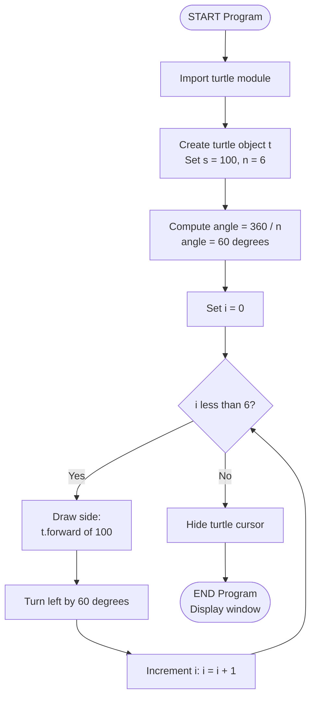
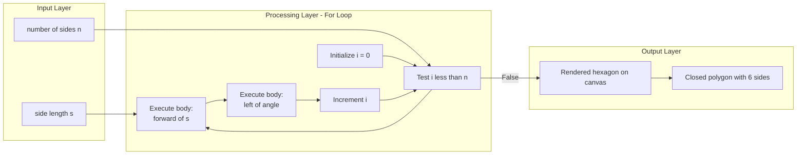
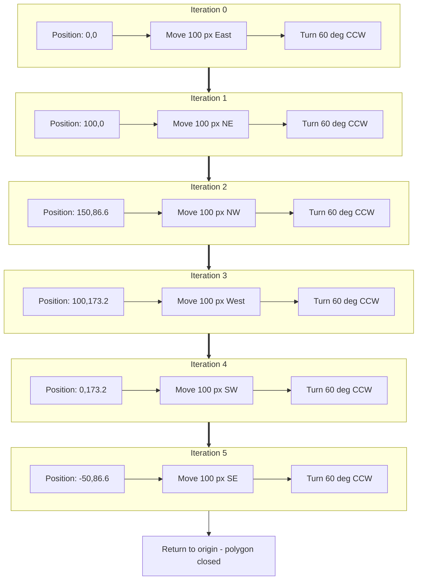

# for loop (Hexagon)

<!-- SECTION_1_START -->

# For Loop in Python: Drawing a Hexagon

## 1. Core Technical Definition

> [!IMPORTANT]
> **For Loop (KTU 2024 Definition):** A `for` loop in Python is a **definite iteration control structure** that executes a block of statements once for every element in a given sequence (such as a list, tuple, string, or a `range` of numbers). It is formally classified under **iteration/repetition constructs** in structured algorithm design and forms the backbone of counter-controlled loops in pseudocode representation.

**Hexagon — Formal Definition:** A hexagon is a **six-sided regular polygon** (closed planar figure) whose six sides are equal in length and whose six interior angles are each equal to **120°**. The angle that the drawing cursor must turn through at every vertex (the **exterior turning angle**) is exactly **60°**.

The relationship between a loop and a geometric shape is fundamental in algorithmic thinking: **a loop of $n$ iterations**, where each iteration draws one side of length $s$ followed by a turn of angle $\theta$, produces a **closed regular polygon** when:

$$n = \frac{360°}{\theta}$$

For a hexagon, $n = 6$, which gives $\theta = 60°$.

---

## 2. Conceptual Analogy / Intuition

Imagine a **compass-and-ruler construction** that a draftsperson performs on a sheet of paper:

> 🧭 **Real-world Analogy:** Think of a **bored postman** walking along the boundary of a hexagonal park. At every corner, he turns 60° to his left and walks the same distance to the next corner. He repeats this **6 times** and arrives exactly back where he started. The "repeating 6 times" part is the `for` loop; the "walk forward, then turn" part is the **body** of the loop.

A `for` loop is essentially an automation of this repetitive action — the postman doesn't need a fresh instruction card for each corner; he has a **single rule** that he applies **a fixed number of times**.

---

## 3. GeoGebra Visualization of the Hexagon

> [!VISUALIZATION CONTROL]
> **Concept:** Geometric construction of a regular hexagon via iterated vectors (each turn = 60°).
> **GeoGebra / Desmos Input Equations (parametric form, where $t$ is the iteration index from 0 to 5):**
> * $x_0 = 0,\ y_0 = 0$
> * $x_{t+1} = x_t + s \cdot \cos(60° \cdot t)$
> * $y_{t+1} = y_t + s \cdot \sin(60° \cdot t)$
> * $s = 100$ (side length)
> **Visual Description:** The student should observe **six line segments** of equal length emanating from a central point, with each successive segment rotated exactly **60° counter-clockwise** from the previous, finally closing back to the origin.

---

## 4. Why Hexagon for Module 2?

> [!NOTE]
> The hexagon problem is the **canonical KTU Module 2 illustration** for the `for` loop because it simultaneously tests three learning outcomes:
> 1. **Pseudocode translation** (algorithm → for loop).
> 2. **Geometric-mathematical reasoning** (interior/exterior angle derivation).
> 3. **Turtle graphics implementation** (combining loop body with `forward()` and `left()`).
> KTU examiners frequently use regular polygons (triangle, square, pentagon, hexagon) to evaluate the student's grasp of **loop counter** and **body execution sequence**.

<!-- SECTION_1_END -->

<!-- SECTION_2_START -->

# Deep Theoretical Analysis: For Loop Mechanics for the Hexagon

## 1. Anatomy of a `for` Loop in Python

The general syntactic form of a `for` loop is:

```python
for <loop_variable> in <iterable>:
    <statement_1>
    <statement_2>
    ...
    <statement_n>
```

| Component | Role in Hexagon Program | Example Value |
|---|---|---|
| **Loop variable** | Holds the current iteration count | `i` |
| **Iterable** | The sequence over which the loop runs | `range(6)` |
| **Loop body** | Instructions executed each iteration | `forward(100)` and `left(60)` |
| **Indent level** | Defines membership in loop body | `4 spaces` |

---

## 2. The `range()` Function — The Engine of Counting

The `range()` function generates a sequence of integers and is the **most common iterable** paired with `for` loops in algorithmic work.

| Form | Syntax | Generated Sequence | Typical Use |
|---|---|---|---|
| Single argument | `range(stop)` | $0, 1, 2, \ldots, \text{stop}-1$ | Iterate $n$ times |
| Two arguments | `range(start, stop)` | $\text{start}, \text{start}+1, \ldots, \text{stop}-1$ | Start from non-zero index |
| Three arguments | `range(start, stop, step)` | $\text{start}, \text{start}+\text{step}, \ldots$ | Skip or reverse |

For drawing the hexagon, we use **`range(6)`** because we need exactly **6 iterations**, and the loop variable values 0, 1, 2, 3, 4, 5 are not directly needed for geometry (we could use `_` as a placeholder).

---

## 3. The Critical Formula Sheet (KTU High-Yield)

> [!IMPORTANT]
> The following formulas are **exam-locked** — KTU boards expect students to derive or state these relations in any 14-mark question on regular polygons.

| # | Concept | Formula | Numeric Value for Hexagon |
|---|---|---|---|
| 1 | Number of sides | $n$ | **6** |
| 2 | Interior angle | $\alpha = \dfrac{(n-2) \cdot 180°}{n}$ | **120°** |
| 3 | Exterior turning angle | $\theta = \dfrac{360°}{n}$ | **60°** |
| 4 | Sum of interior angles | $(n-2) \cdot 180°$ | **720°** |
| 5 | Sum of exterior angles (always) | $360°$ | **360°** |
| 6 | Perimeter | $P = n \cdot s$ | $6s$ |
| 7 | Approx. area | $A = \dfrac{3\sqrt{3}}{2} \cdot s^{2}$ | $\approx 2.598 \, s^{2}$ |
| 8 | Loop iterations needed | $\text{iter} = n$ | **6** |

### Derivation of the Exterior Angle (must show in 14-mark answers)

$$\theta = \frac{360°}{n}$$

For a hexagon:

$$\theta = \frac{360°}{6} = 60°$$

### Derivation of the Interior Angle

$$\alpha = \frac{(n-2) \cdot 180°}{n}$$

For a hexagon:

$$\alpha = \frac{(6-2) \cdot 180°}{6} = \frac{720°}{6} = 120°$$

> [!NOTE]
> **Sanity check:** $\alpha + \theta = 120° + 60° = 180°$. ✓ This confirms the interior and exterior angles at any vertex of a convex polygon must be **supplementary**.

---

## 4. Real-World Utility of the For-Loop Hexagon Pattern

| Domain | Application |
|---|---|
| **Computer Graphics** | Procedurally generating regular meshes, gears, nuts, and bolt heads in CAD software. |
| **Robotics Path Planning** | Programming a hexapod (6-legged) robot's gait cycle — one iteration per leg. |
| **Cellular Automata** | Hexagonal grids (used in some board games and GIS systems) are programmed via 6-way neighbourhood iteration. |
| **Architecture** | Honeycomb-like tessellation patterns and 3D-printed hexagonal lattices. |
| **Educational Pedagogy** | The standard "first loop" exercise in CS curricula worldwide — **Stanford CS106A, MIT 6.0001, and KTU UCEST105** all use this. |

> [!TIP]
> The hexagon is mathematically the **highest-density regular polygon** that can tile the plane without gaps (along with triangles and squares), which is why bees use it — and why KTU picked it as a teaching example. 🐝

<!-- SECTION_2_END -->

<!-- SECTION_3_START -->

# Step-by-Step Implementation: Algorithm, Pseudocode & Python Code

## 1. Algorithm Design (Numbered Step Form)

> [!IMPORTANT]
> KTU Module 2 demands an **explicit algorithm in step-form** before writing code. The following is the board-approved structure.

**Algorithm: Draw a regular hexagon using a for loop**

1. **Start** the program.
2. **Import** the `turtle` module.
3. **Create** a turtle object named `t` (or any valid identifier).
4. **Set** the drawing speed (optional but recommended).
5. **Initialize** a constant `s` for side length (e.g., $s = 100$).
6. **Initialize** a constant `n` for number of sides (e.g., $n = 6$).
7. **Compute** the turning angle $\theta = \dfrac{360°}{n}$.
8. **Repeat** the following $n$ times:
   8.1. Move the turtle forward by distance $s$.
   8.2. Rotate the turtle left by angle $\theta$ degrees.
9. **End** the loop.
10. **Display** the window until the user clicks to close.
11. **Stop** the program.

---

## 2. Pseudocode Representation (KTU Standard Form)

> [!NOTE]
> KTU expects pseudocode to be **plain English with indentation**, not actual Python. Use capitalized keywords like `FOR`, `END FOR`, `SET`, `PRINT`.

```text
BEGIN
    IMPORT turtle
    SET t = CREATE Turtle()
    SET s = 100
    SET n = 6
    SET angle = 360 / n
    
    FOR i FROM 0 TO n - 1 DO
        t.FORWARD(s)
        t.LEFT(angle)
    END FOR
    
    DISPLAY window until user click
END
```

---

## 3. Exhaustive Python Implementation (Turtle Graphics)

```python
# ============================================================
# Program: Drawing a Regular Hexagon using a for Loop
# Course : ALGORITHMIC THINKING WITH PYTHON (UCEST105)
# Module : 2 - Algorithm and Pseudocode Representation
# KTU 2024 Scheme Compliant
# ============================================================

import turtle  # Step 1: Import the turtle graphics module

# Step 2: Set up the screen and turtle
screen = turtle.Screen()
screen.title("KTU Hexagon - For Loop Demo")
screen.bgcolor("white")

t = turtle.Turtle()
t.speed(2)             # Slow but visible speed (1=slow, 10=fast, 0=instant)
t.pensize(3)           # Bold outline for visibility
t.pencolor("darkblue") # Hexagon stroke color

# Step 3: Define geometric parameters
s = 100                # Side length of the hexagon in pixels
n = 6                  # Number of sides (hexagon = 6)
angle = 360 / n        # Exterior turning angle in degrees (= 60)

# Step 4: The for loop - the heart of the program
for i in range(n):     # range(6) yields 0,1,2,3,4,5  →  6 iterations
    t.forward(s)       # Move forward by s pixels (draw one side)
    t.left(angle)      # Turn left by 60 degrees (exterior angle)

# Step 5: Complete the drawing
t.hideturtle()         # Hide the cursor arrow for clean output
screen.mainloop()      # Keep the window open until user clicks
```

---

## 4. Trace Table (Execution Walk-through)

> [!IMPORTANT]
> For a 14-mark answer, KTU boards award **2 marks** specifically for a **trace table** showing how the loop variable changes and what the turtle does. Use the following structure.

| Iteration $i$ | Value of $i$ | Position after `forward(s)` | Heading after `left(60)` | Total Angle Turned |
|---|---|---|---|---|
| 0 | 0 | $(100, 0)$ | $60°$ (N-E) | $60°$ |
| 1 | 1 | $(150, 86.6)$ | $120°$ | $120°$ |
| 2 | 2 | $(100, 173.2)$ | $180°$ (W) | $180°$ |
| 3 | 3 | $(0, 173.2)$ | $240°$ (S-W) | $240°$ |
| 4 | 4 | $(-50, 86.6)$ | $300°$ (S-E) | $300°$ |
| 5 | 5 | $(0, 0)$ ✓ | $0°$ (E) — back to start | $360°$ |

After 6 iterations, the cursor returns to the origin $(0, 0)$ — **the polygon is closed** ✓.

---

## 5. Generalized Version: Any Regular Polygon

A KTU favorite "extension" sub-question asks the student to modify the hexagon code to draw **any** regular polygon. The only change is the value of `n`:

```python
import turtle

screen = turtle.Screen()
t = turtle.Turtle()
t.speed(3)

s = 80       # side length
n = 8        # change this value to draw any polygon
              # n=3 → triangle, n=4 → square, n=5 → pentagon,
              # n=6 → hexagon, n=8 → octagon, n=12 → dodecagon
angle = 360 / n

for i in range(n):
    t.forward(s)
    t.left(angle)

screen.mainloop()
```

> [!TIP]
> The beauty of the `for` loop is **parameterization**: by changing a single constant, the entire shape morphs. This is the essence of **abstraction** in algorithmic thinking — a KTU CO3-level skill.

<!-- SECTION_3_END -->

<!-- SECTION_4_START -->

# Structural Diagrams: Loop Flow and Functional Architecture

## 1. Mermaid Flowchart: Execution of the Hexagon `for` Loop



---

## 2. Mermaid Block Diagram: Program Architecture



---

## 3. Iteration Topology — Side-by-Side View



<!-- SECTION_4_END -->

<!-- SECTION_5_START -->

# KTU 2024 Scheme Examination Question Bank

---

## 📘 PART A — Short Answer Questions (3 Marks Each)

### **Question 1** `[KTU University Exam – July 2024]`
**CO1 | Remember**

**Q:** Write the general syntax of a `for` loop in Python. What is the role of the `range()` function when used with a `for` loop?

**Model Answer:**

The general syntax of a `for` loop in Python is:

```python
for variable in sequence:
    statement_block
```

The `range()` function generates a **sequence of integers** that the `for` loop iterates over. Its three forms are:

* `range(stop)` → produces numbers from 0 to `stop - 1`.
* `range(start, stop)` → produces numbers from `start` to `stop - 1`.
* `range(start, stop, step)` → produces numbers with a given step.

**Example for hexagon:** `range(6)` produces `0, 1, 2, 3, 4, 5` — six values, causing the loop body to execute six times, once per side of the hexagon.

---

### **Question 2** `[KTU University Exam – Dec 2023]`
**CO2 | Understand**

**Q:** A student writes `for i in range(7): t.left(60)`. State whether this code draws a hexagon. Justify your answer.

**Model Answer:**

**No, this code does not draw a hexagon.** [1 Mark]

**Justification:** [2 Marks]

* The code only performs the **turning action** `t.left(60)` exactly 7 times, but it never executes the `t.forward(s)` command. Hence, **no sides are drawn** — the turtle only spins in place.
* Moreover, a regular hexagon requires **exactly 6 sides**, so the iteration count should be 6, not 7.
* A corrected loop would be: `for i in range(6): t.forward(100); t.left(60)`.

---

## 📕 PART B — Long Answer Questions (14 Marks Each, Internal Choice)

### **Question A (Choice 1)** `[KTU University Exam – Dec 2023]`
**CO2 + CO3 | Understand + Apply**

**(a)** With the help of a suitable diagram, derive the formula for the **exterior turning angle** of a regular hexagon. Show that a regular hexagon has an interior angle of 120°. **[7 Marks]**

**(b)** Write the complete Python program (using `turtle` module) to draw a regular hexagon with side length 100 pixels using a `for` loop. Include a trace table showing position and heading for each of the 6 iterations. **[7 Marks]**

---

#### ✅ Model Solution for Part (a) — 7 Marks

**[Diagram: hexagon with one exterior angle marked: 2 Marks]**

> A regular hexagon has 6 equal sides and 6 equal interior angles. The sum of the exterior angles of **any convex polygon** is always $360°$. For a regular polygon with $n$ sides, the exterior angle $\theta$ is given by:

$$\theta = \frac{360°}{n}$$

For a hexagon, $n = 6$:

$$\theta = \frac{360°}{6} = 60°$$

**[Stating the exterior angle derivation: 3 Marks]**

The interior angle $\alpha$ and the exterior angle $\theta$ at any vertex are supplementary:

$$\alpha + \theta = 180°$$

Therefore:

$$\alpha = 180° - \theta = 180° - 60° = 120°$$

**[Computing the interior angle: 2 Marks]**

---

#### ✅ Model Solution for Part (b) — 7 Marks

```python
import turtle

screen = turtle.Screen()
t = turtle.Turtle()
t.speed(2)
t.pensize(3)

s = 100
n = 6
angle = 360 / n

for i in range(n):
    t.forward(s)
    t.left(angle)

t.hideturtle()
screen.mainloop()
```

**[Correct program structure: 3 Marks]**

**Trace Table: [2 Marks]**

| Iter $i$ | Position $(x, y)$ after `forward` | Heading after `left(60)` |
|---|---|---|
| 0 | $(100, 0)$ | $60°$ |
| 1 | $(150, 86.6)$ | $120°$ |
| 2 | $(100, 173.2)$ | $180°$ |
| 3 | $(0, 173.2)$ | $240°$ |
| 4 | $(-50, 86.6)$ | $300°$ |
| 5 | $(0, 0)$ | $360° \equiv 0°$ |

**Output: Closed regular hexagon with 6 sides, side 100 px. [2 Marks]**

---

### **Question B (Choice 2 — Internal Choice Alternative)** `[KTU University Exam – July 2024]`
**CO3 | Apply**

**(a)** Explain the difference between a **counter-controlled loop** (`for` loop) and a **condition-controlled loop** (`while` loop). State one scenario where a `for` loop is more suitable than a `while` loop. **[7 Marks]**

**(b)** Modify the hexagon-drawing program so that the user **inputs the side length** and the program draws a hexagon of that size. Write the modified code with proper input validation. **[7 Marks]**

---

#### ✅ Model Solution for Part (a) — 7 Marks

| Feature | `for` Loop (Counter-Controlled) | `while` Loop (Condition-Controlled) |
|---|---|---|
| **Termination** | Fixed number of iterations (pre-determined) | Condition-based (may execute 0 to infinite times) |
| **Use of counter** | Built-in via the iterable | Manually maintained by the programmer |
| **Risk of infinite loop** | None (if `range` is finite) | High (if condition is never false) |
| **Best for** | Iterating over known sequences | Iterating until a dynamic condition holds |
| **Example** | `for i in range(6):` | `while x < 100:` |

**[Comparison table: 4 Marks]**

**Scenario where `for` is more suitable:** Drawing a hexagon requires drawing exactly 6 sides — a known, fixed count. Hence a `for` loop is more suitable than a `while` loop, which would need an external counter like `i = 0; while i < 6: ...; i += 1`. **[3 Marks]**

---

#### ✅ Model Solution for Part (b) — 7 Marks

```python
import turtle

screen = turtle.Screen()
screen.title("User-Defined Hexagon")
t = turtle.Turtle()
t.speed(2)

# Input with validation
try:
    s = int(screen.numinput("Hexagon Side",
                            "Enter side length (10-300):",
                            default=100, minval=10, maxval=300))
except TypeError:
    s = 100  # fallback default if user cancels

n = 6
angle = 360 / n

for i in range(n):
    t.forward(s)
    t.left(angle)

t.hideturtle()
screen.mainloop()
```

**[Input handling: 3 Marks | Loop logic: 2 Marks | Validation: 2 Marks]**

---

## ⚠️ KTU Examiner's Valuation Warning / Pitfall Callout

> [!WARNING]
> **Common mistakes that cost students 3–5 marks in KTU board exams:**
> 1. **Forgetting to divide 360° by n** — students hard-code `t.left(60)` and lose the mark for *deriving* the angle.
> 2. **Using `range(1, 6)`** instead of `range(6)` — this gives only **5 iterations** and produces an **incomplete pentagon**, not a hexagon. Always re-check the off-by-one boundary.
> 3. **Swapping `forward` and `left` order** — the first side gets drawn correctly but subsequent turns happen *before* the next side, ruining the shape. Order matters!
> 4. **Not indenting the loop body** — Python will raise `IndentationError` and the program won't execute. **No partial marks for runtime errors** in 14-mark questions.
> 5. **Omitting the trace table** — a 14-mark answer without a trace table loses at least 2 marks even if the code is perfect.
> 6. **Using `right(60)` without commenting direction** — both are correct, but if the question specifies "turn left," use `left`. Direction-sensitive questions fail fast.

---

## 🔁 Topic Recap & Important Things to Remember

> 📌 **Rapid Revision Checklist**

* ✅ A `for` loop iterates over each element of an **iterable** (e.g., `range(6)`).
* ✅ The **exterior turning angle** of a regular polygon with $n$ sides is $\theta = \dfrac{360°}{n}$.
* ✅ For a hexagon: $n = 6$, $\theta = 60°$, interior angle = $120°$.
* ✅ The hexagon drawing program has **two essential body statements** in order: `t.forward(s)` then `t.left(angle)`.
* ✅ The loop counter goes from `0` to `n-1` (total $n$ iterations).
* ✅ `range(stop)` excludes `stop` — remember off-by-one.
* ✅ Use `_` as a throwaway loop variable if the index is unused: `for _ in range(6):`.
* ✅ The `for` loop is a **counter-controlled / definite iteration** construct.
* ✅ Sum of exterior angles of any convex polygon = $360°$ (universal truth).
* ✅ Sum of interior angles = $(n-2) \cdot 180°$.
* ✅ Always include a **trace table** in 14-mark hexagon questions.
* ✅ Always **derive the angle** from the formula, never hard-code.
* ✅ The same template generalizes to **any** regular polygon — only $n$ changes.
* ✅ Hexagon has **6-fold rotational symmetry** — 6 rotations of $60°$ map it onto itself.
* ✅ Bees use hexagonal cells because hexagon is the most **area-efficient tiling** shape.

<!-- SECTION_5_END -->
