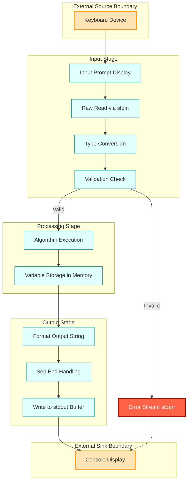

# input/output operation

<!-- SECTION_1_START -->

# Input/Output Operations in Algorithms and Pseudocode

## 1.1 Formal Academic Definition (KTU 2024 Syllabus Terminology)

In algorithmic thinking, **Input/Output (I/O) operations** are the controlled mechanisms through which an algorithm exchanges data with its external environment. The KTU 2024 Scheme (Course UCEST105 — Algorithmic Thinking with Python) defines these as the boundary-level interactions that allow an algorithm to:

- **Input**: Acquire raw, unprocessed data from external sources (keyboard, file, sensor, network) into the algorithm's working memory.
- **Output**: Emit processed, formatted, or computed information from the algorithm's working memory to external sinks (console, file, display, network).

In the formal algorithmic model (Turing-style machine abstraction), an algorithm without I/O is mathematically closed and incapable of solving real-world problems that require data ingestion or result communication. Hence, I/O is classified as one of the **five classical properties of an algorithm** alongside Finiteness, Definiteness, Effectiveness, and Correctness.

> [!IMPORTANT]
> **KTU 2024 Board Definition**: "An algorithm must have zero or more inputs supplied externally, and must produce at least one output that conveys the result of the computation. Input is the data given to the algorithm; output is the result delivered by the algorithm."

---

## 1.2 Conceptual Analogy / Intuition

Imagine a **vending machine**:

- **Input** is what *you* give the machine: coins (currency values), button presses (selection codes), and sometimes swiped cards. The machine *receives* these and *stores* them temporarily in its internal registers.
- **Output** is what the machine *gives back* to you: the dispensed snack or drink, the change returned, the LED display confirming the transaction.

The machine does not invent the snack magically — it must take something in, process it, and push something out. An algorithm behaves identically:

| Vending Machine Term | Algorithm Equivalent |
|---|---|
| Coin slot | `input()` |
| Item selection buttons | Variable assignments from user |
| Internal motor (gear) | Computational processing |
| Product tray | `print()` to console |
| Display screen | Formatted output message |

Another way to see it: think of I/O as the algorithm's **senses and voice**. Without input, the algorithm is deaf; without output, it is mute. The CPU/memory inside is the "brain" that processes, but the I/O layer is the **interface to the world**.

---

## 1.3 Physical Constants and Standard Metrics

In the Python ecosystem used at KTU 2024, the following constants and standards are relevant:

- **Standard Input Stream (stdin)**: Default file descriptor `0`, mapped to the keyboard by default.
- **Standard Output Stream (stdout)**: Default file descriptor `1`, mapped to the console/terminal.
- **Standard Error Stream (stderr)**: Default file descriptor `2`, used for error reporting.
- **Default Encoding**: **UTF-8** for Python 3 text streams.
- **Newline Character**: `\n` (Linux/macOS) or `\r\n` (Windows); Python normalizes to `\n` on read.
- **EOF (End-of-File) Marker**: A special sentinel returned by `input()` when stream ends; raises `EOFError` if unhandled.

> [!NOTE]
> **Syllabus Highlight**: For the UCEST105 course, the focus is on **console-based I/O** using `input()` and `print()`. File I/O is covered in later modules.

---

## 1.4 GeoGebra / Desmos Visualization

> [!VISUALIZATION CONTROL]
> **Concept:** I/O as the boundary box of an algorithm
>
> **GeoGebra / Desmos Input Equations:**
> * Point $A = (0, 0)$ — Algorithm entry
> * Point $B = (10, 0)$ — Algorithm exit
> * Line segment from $(2, -2)$ to $(2, 2)$ labeled `Input`
> * Line segment from $(8, -2)$ to $(8, 2)$ labeled `Output`
>
> **Visual Description:** A horizontal arrow representing data flow enters from the left side (Input arrow pointing right into a central rectangular box), passes through a labeled rectangle (Process/Algorithm), and an arrow exits from the right side (Output arrow pointing right outward). This is the canonical **IPO (Input → Process → Output)** model.

<!-- SECTION_1_END -->

<!-- SECTION_2_START -->

# Deep Theoretical Analysis & KTU High-Yield Formula Sheet

## 2.1 Decomposition of the I/O Concept

The I/O operation in algorithms is broken into **three logical layers**:

1. **Prompt Layer** — A message displayed to the user instructing them what to enter. *Optional but recommended for usability.*
2. **Capture/Emit Layer** — The actual mechanical call that reads from `stdin` or writes to `stdout`.
3. **Conversion Layer** — Transforming the raw text (since I/O is always text-based) into the algorithm's expected data type (integer, float, string, etc.).

### 2.1.1 Input Operation — Step-by-Step Logic

| Step | Action | Python Construct | Pseudocode Construct |
|---|---|---|---|
| 1 | Display prompt to user (optional) | `print("Enter value:")` | `PRINT "Enter value"` |
| 2 | Read raw text from `stdin` | `raw = input()` | `READ raw` |
| 3 | Strip trailing whitespace/newline | `raw = raw.strip()` | (implicit) |
| 4 | Convert to target type | `value = int(raw)` | (type-aware read) |
| 5 | Store in variable | `n = value` | `SET n = value` |
| 6 | Validate (optional) | `try-except` | `IF valid THEN ...` |

> [!NOTE]
> **Critical Insight**: In Python, `input()` **always returns a string**. The conversion to `int`, `float`, or `bool` is the programmer's responsibility. This is one of the highest-frequency bugs in KTU lab evaluations.

### 2.1.2 Output Operation — Step-by-Step Logic

| Step | Action | Python Construct | Pseudocode Construct |
|---|---|---|---|
| 1 | Format the values into a string | `f"Result: {x}"` | `formatted = "Result: " + x` |
| 2 | Choose separator behavior | `print(a, b, sep=", ")` | (uses `,` notation) |
| 3 | Choose end-of-line character | `print(x, end="")` | (line break is default) |
| 4 | Emit to `stdout` | `print(formatted)` | `PRINT formatted` |
| 5 | Optionally flush | `print(x, flush=True)` | (not in pseudocode) |

---

## 2.2 The IPO Model in Detail

Every I/O-interacting algorithm can be modeled as a pipeline:

$$
\text{External Source} \xrightarrow{\text{Input}} \text{Algorithm (Process)} \xrightarrow{\text{Output}} \text{External Sink}
$$

Mathematically, if $I$ is the input tuple, $f$ is the algorithmic function, and $O$ is the output, then:

$$
O = f(I)
$$

In the I/O context, this expands to:

$$
O = \text{output}(\ f(\ \text{input}()\ )\ )
$$

This **read-process-write** cycle is repeated iteratively in loops and recursively in functions, making I/O the heartbeat of interactive programs.

---

## 2.3 KTU High-Yield Formula / Syntax Sheet

> [!IMPORTANT]
> The table below consolidates **all essential I/O syntax** for both pseudocode and Python expected in KTU 2024 exams.

| Operation | Pseudocode Keyword | Python Construct | Return Type | Notes |
|---|---|---|---|---|
| Read single value | `READ variable` | `variable = input()` | `str` (Python) | Always reads as string in Python |
| Read integer | `READ INT variable` | `variable = int(input())` | `int` | Requires conversion |
| Read float | `READ FLOAT variable` | `variable = float(input())` | `float` | Decimal input |
| Read line with spaces | `READ LINE variable` | `variable = input()` | `str` | Python preserves spaces |
| Read multiple values | `READ a, b, c` | `a, b, c = input().split()` | `tuple[str]` | `split()` defaults to whitespace |
| Print value | `PRINT expression` | `print(expression)` | `None` | Adds newline by default |
| Print without newline | (not standard) | `print(expr, end="")` | `None` | KTU accepts Python-specific |
| Print with separator | (not standard) | `print(a, b, sep=", ")` | `None` | Useful for lists |
| Formatted output | `PRINT "Value: " + x` | `print(f"Value: {x}")` | `None` | f-strings since Python 3.6 |
| Display error | `PRINT ERROR msg` | `print("Error:", msg, file=sys.stderr)` | `None` | Used in validations |

---

## 2.4 Real-World Engineering Utility

I/O operations are foundational in:

- **Embedded Systems**: Sensors provide input; actuators consume output.
- **Web Development**: HTTP requests are inputs; JSON responses are outputs.
- **Data Science Pipelines**: CSV files (input) → pandas DataFrame → cleaned dataset (output).
- **Machine Learning**: Training data (input) → model → predictions (output).
- **Operating Systems**: System calls are formalized I/O.
- **Compilers**: Source code (input) → tokenized IR → optimized code (output).

In production code at companies like Google, Amazon, or Infosys (a major KTU recruiter), I/O handling is what separates a *script* from a *production-grade system*. Logging, buffering, and error handling on I/O are critical engineering concerns.

<!-- SECTION_2_END -->

<!-- SECTION_3_START -->

# Step-by-Step Derivations, Code & Symbolic Implementation

## 3.1 Worked Example 1 — Simple Input/Output with Type Conversion

**Problem**: Write a Python program (and equivalent pseudocode) that reads two integers from the user and prints their sum.

### 3.1.1 Pseudocode (KTU Board Standard)

```
BEGIN
    PRINT "Enter first number: "
    READ a
    PRINT "Enter second number: "
    READ b
    SET sum = a + b
    PRINT "The sum is: ", sum
END
```

### 3.1.2 Python Implementation

```python
def compute_sum() -> None:
    """
    Reads two integers from standard input and prints their sum.
    Demonstrates input(), type conversion (int), and formatted print().
    """
    try:
        prompt_a: str = "Enter first number: "
        prompt_b: str = "Enter second number: "

        # Step 1: Read raw input (always returns str)
        raw_a: str = input(prompt_a)
        raw_b: str = input(prompt_b)

        # Step 2: Convert string to integer with boundary validation
        a: int = int(raw_a.strip())
        b: int = int(raw_b.strip())

        # Step 3: Perform computation
        total: int = a + b

        # Step 4: Formatted output
        print(f"The sum of {a} and {b} is {total}.")

    except ValueError as ve:
        # Error logging for non-integer input
        print(f"Error: Invalid integer input. Details: {ve}", file=__import__('sys').stderr)
    except EOFError:
        print("Error: Unexpected end of input stream.", file=__import__('sys').stderr)
```

**Tracing the execution** for input `5` and `7`:

$$
\text{raw\_a} = \text{"5"} \quad \xrightarrow{\text{int}()} \quad a = 5
$$

$$
\text{raw\_b} = \text{"7"} \quad \xrightarrow{\text{int}()} \quad b = 7
$$

$$
\text{total} = 5 + 7 = 12
$$

$$
\text{Output} \rightarrow \text{"The sum of 5 and 7 is 12."}
$$

---

## 3.2 Worked Example 2 — Reading Multiple Values in One Line

**Problem**: Read three space-separated integers `a`, `b`, `c` and print their average.

### 3.2.1 Pseudocode

```
BEGIN
    PRINT "Enter three numbers separated by spaces: "
    READ a, b, c
    SET avg = (a + b + c) / 3
    PRINT "Average = ", avg
END
```

### 3.2.2 Python Implementation

```python
def compute_average_of_three() -> None:
    """
    Reads three space-separated integers in a single line and prints their average.
    Uses str.split() to tokenize, map() to convert, and tuple unpacking.
    """
    try:
        raw_line: str = input("Enter three numbers separated by spaces: ").strip()

        # Boundary check: must contain exactly three tokens
        tokens: list[str] = raw_line.split()
        if len(tokens) != 3:
            raise ValueError(f"Expected 3 numbers, got {len(tokens)}.")

        # Convert all tokens to integers
        numbers: list[int] = list(map(int, tokens))
        a, b, c = numbers  # tuple unpacking

        # Compute average as float
        average: float = (a + b + c) / 3.0

        # Formatted output to 2 decimal places
        print(f"Average of {a}, {b}, {c} = {average:.2f}")

    except ValueError as ve:
        print(f"Input Error: {ve}", file=__import__('sys').stderr)
    except ZeroDivisionError:
        print("Error: Division by zero detected.", file=__import__('sys').stderr)
```

**Mathematical Trace** for input `10 20 30`:

$$
\text{tokens} = [\text{"10"}, \text{"20"}, \text{"30"}]
$$

$$
\text{numbers} = [10, 20, 30]
$$

$$
a = 10,\quad b = 20,\quad c = 30
$$

$$
\text{average} = \frac{10 + 20 + 30}{3.0} = \frac{60}{3.0} = 20.0
$$

$$
\text{Output} \rightarrow \text{"Average of 10, 20, 30 = 20.00"}
$$

---

## 3.3 Worked Example 3 — Formatted Output with Multiple Variables

**Problem**: Read a student's name (string), roll number (integer), and CGPA (float), and print a formatted report card line.

### 3.3.1 Python Implementation

```python
def print_report_card() -> None:
    """
    Reads student details and prints a formatted report line.
    Demonstrates sep=, end=, and f-string formatting.
    """
    try:
        name: str = input("Enter student name: ").strip()
        roll_str: str = input("Enter roll number: ").strip()
        cgpa_str: str = input("Enter CGPA: ").strip()

        # Validate non-empty name
        if not name:
            raise ValueError("Name cannot be empty.")

        roll_no: int = int(roll_str)
        cgpa: float = float(cgpa_str)

        # Boundary validation for CGPA range
        if not (0.0 <= cgpa <= 10.0):
            raise ValueError(f"CGPA {cgpa} out of valid range [0.0, 10.0].")

        # Formatted output using f-strings
        print("=" * 50)
        print(f"{'REPORT CARD':^50}")  # Center-aligned
        print("=" * 50)
        print(f"{'Name':<15}: {name}")
        print(f"{'Roll No':<15}: {roll_no}")
        print(f"{'CGPA':<15}: {cgpa:.2f}")
        print("=" * 50)

    except ValueError as ve:
        print(f"Invalid Input: {ve}", file=__import__('sys').stderr)
```

**Sample Output for `Alice`, `42`, `9.35`**:

```
==================================================
                  REPORT CARD
==================================================
Name           : Alice
Roll No        : 42
CGPA           : 9.35
==================================================
```

---

## 3.4 Worked Example 4 — I/O in a Loop (Multiple Test Cases)

**Problem**: Read an integer `T` denoting the number of test cases, then for each test case, read an integer `N` and print its square.

### 3.4.1 Python Implementation

```python
def process_test_cases() -> None:
    """
    Reads T test cases, each containing one integer N, and prints N^2.
    Demonstrates input-driven loops and output accumulation.
    """
    try:
        t: int = int(input("Enter number of test cases: ").strip())

        # Boundary check: T must be positive
        if t <= 0:
            raise ValueError("Number of test cases must be positive.")

        results: list[str] = []  # Accumulator for outputs

        for case_num in range(1, t + 1):
            raw_n: str = input(f"Enter N for test case {case_num}: ").strip()
            n: int = int(raw_n)
            square: int = n * n
            results.append(f"Case {case_num}: {n}^2 = {square}")

        # Bulk output after all inputs (efficient pattern)
        print("\n--- Results ---")
        for line in results:
            print(line)

    except ValueError as ve:
        print(f"Error: {ve}", file=__import__('sys').stderr)
    except EOFError:
        print("Error: Input stream ended prematurely.", file=__import__('sys').stderr)
```

**Mathematical Trace** for `T=3`, inputs `2`, `5`, `7`:

$$
n_1 = 2 \Rightarrow n_1^2 = 4
$$

$$
n_2 = 5 \Rightarrow n_2^2 = 25
$$

$$
n_3 = 7 \Rightarrow n_3^2 = 49
$$

---

## 3.5 Comparative Mapping: Pseudocode vs Python I/O

| Concept | Pseudocode (KTU Standard) | Python 3.x |
|---|---|---|
| Read string | `READ name` | `name = input()` |
| Read int | `READ n` (with type annotation) | `n = int(input())` |
| Read float | `READ price` (with type annotation) | `price = float(input())` |
| Print value | `PRINT n` | `print(n)` |
| Print with message | `PRINT "Value is", n` | `print("Value is", n)` |
| Formatted print | `PRINT "Sum =", n` | `print(f"Sum = {n}")` |
| Concatenate | `PRINT "Hi " + name` | `print("Hi " + name)` |
| Multiple reads one line | `READ a, b, c` | `a, b, c = input().split()` |

> [!IMPORTANT]
> **KTU Board Convention**: When writing pseudocode, use **uppercase keywords** (`READ`, `PRINT`, `SET`, `IF`, `THEN`, `ELSE`, `END`) and **indentation** for blocks. Avoid Python-specific syntax (`def`, `:`, f-strings) in pseudocode answers.

<!-- SECTION_3_END -->

<!-- SECTION_4_START -->

# Structural Diagrams & Schematics

## 4.1 IPO Model — Top-Level Block Diagram


**Interpretation**: The user provides raw data via the keyboard, which is captured by Python's `input()` function (Input Layer). The algorithm processes it (Process Layer) and emits the result via `print()` (Output Layer) to the console.

---

## 4.2 Detailed Input Operation Flowchart

```mermaid
flowchart TD
    Start([Program Start]):::start --> Prompt[Display Prompt Message<br/>print Enter value]:::action
    Prompt --> ReadCall[Call input function<br/>raw = input]:::io
    ReadCall --> ReadCheck{Stream Open<br/>and Data Available}:::decision
    ReadCheck -->|No| EOFError[Raise EOFError<br/>end of input]:::error
    ReadCheck -->|Yes| ReadData[Read raw text line<br/>includes newline]:::io
    ReadData --> Strip[Strip whitespace<br/>raw strip]:::action
    Strip --> Convert{Type Conversion<br/>Required}:::decision
    Convert -->|Yes to int| ConvInt[int raw int]:::action
    Convert -->|Yes to float| ConvFloat[float raw float]:::action
    Convert -->|No keep string| KeepStr[Keep as string]:::action
    ConvInt --> ValidateInt{Valid Integer<br/>format}:::decision
    ConvFloat --> ValidateFloat{Valid Float<br/>format}:::decision
    ValidateInt -->|No| ValueError[Raise ValueError<br/>invalid literal]:::error
    ValidateFloat -->|No| ValueError
    ValidateInt -->|Yes| StoreVar[Store in variable<br/>n value]:::action
    ValidateFloat -->|Yes| StoreVar
    KeepStr --> StoreVar
    StoreVar --> End([Return Value]):::end

    classDef start fill:#90EE90,stroke:#006400,stroke-width:2px
    classDef end fill:#FFB6C1,stroke:#8B0000,stroke-width:2px
    classDef action fill:#FFFACD,stroke:#DAA520,stroke-width:1px
    classDef decision fill:#ADD8E6,stroke:#00008B,stroke-width:2px
    classDef io fill:#E6E6FA,stroke:#4B0082,stroke-width:1px
    classDef error fill:#FF6347,stroke:#8B0000,stroke-width:2px,color:#FFF
```

**Interpretation**: This is the complete decision tree for a Python `input()` call, including all error paths. The most common KTU exam error is omitting the type-conversion validation block.

---

## 4.3 Detailed Output Operation Flowchart

```mermaid
flowchart TD
    PStart([Print Call Initiated]):::start --> Args[Collect Arguments<br/>print arg1 arg2]:::action
    Args --> FmtCheck{Formatting<br/>Specified}:::decision
    FmtCheck -->|f-string| FString[Evaluate f-string<br/>substitute variables]:::action
    FmtCheck -->|sep argument| Sep[Insert sep between args]:::action
    FmtCheck -->|end argument| End[Set end character]:::action
    FmtCheck -->|None default| DirectFmt[Convert all args to str]:::action
    FString --> DirectFmt
    Sep --> DirectFmt
    End --> DirectFmt
    DirectFmt --> Concat[Concatenate with separators]:::action
    Concat --> AppendEnd[Append end character<br/>default newline]:::action
    AppendEnd --> FlushCheck{flush equals True}:::decision
    FlushCheck -->|Yes| Flush[Force flush buffer to stdout]:::io
    FlushCheck -->|No| Buffer[Write to stdout buffer]:::io
    Flush --> Stdout[Output to Console]:::io
    Buffer --> Stdout
    Stdout --> PEnd([Return None]):::end

    classDef start fill:#90EE90,stroke:#006400,stroke-width:2px
    classDef end fill:#FFB6C1,stroke:#8B0000,stroke-width:2px
    classDef action fill:#FFFACD,stroke:#DAA520,stroke-width:1px
    classDef decision fill:#ADD8E6,stroke:#00008B,stroke-width:2px
    classDef io fill:#E6E6FA,stroke:#4B0082,stroke-width:1px
```

---

## 4.4 Block Diagram — End-to-End I/O Program Architecture



**Interpretation**: The system has three boundaries — Source, Processing, and Sink. Each stage is responsible for a specific concern. The error path diverts invalid inputs to `stderr` instead of `stdout`, following Unix conventions.

---

## 4.5 Sequential I/O Pattern Matrix


<!-- SECTION_4_END -->

<!-- SECTION_5_START -->

# KTU 2024 Scheme Examination Question Bank & Topic Recap

---

## Part A — Short Answer Questions (3 Marks Each)

### Question 1: [KTU University Exam - July 2024]

**Q:** Define input and output operations in the context of an algorithm. Why are they considered essential properties of any algorithm?

**Model Answer (3 Marks):**

> **Input** is the data or values supplied to an algorithm from an external source before or during its execution. **Output** is the result produced by the algorithm and delivered to an external destination after processing.

> An algorithm must have **zero or more well-defined inputs** and must produce **at least one output** that conveys the result of the computation. These are essential because:
> 1. Without input, an algorithm cannot adapt to varying data and becomes a fixed computation.
> 2. Without output, the result of processing remains trapped inside memory and is useless to the user.
> 3. I/O operations are the **only means of communication** between the algorithm and the external world.

**[Defining input: 1 Mark] | [Defining output: 1 Mark] | [Justification of essentiality: 1 Mark]**

---

### Question 2: [KTU University Exam - Dec 2023]

**Q:** In Python, the `input()` function always returns a string. Explain why type conversion is necessary and demonstrate with an example for reading an integer and a float.

**Model Answer (3 Marks):**

> The `input()` function reads characters from `stdin` and returns them as a `str` (string) object, regardless of whether the user typed digits, alphabets, or symbols. This is because at the hardware level, the keyboard transmits **character codes**, not numeric values.

> Type conversion is necessary because arithmetic and comparison operations require numeric types. For example:

```python
age: int = int(input("Enter age: "))        # int conversion
salary: float = float(input("Enter salary: "))  # float conversion
```

> Without conversion, `"25" + "30"` would produce `"2530"` (string concatenation), not `55` (numeric addition).

**[Explaining str return: 1 Mark] | [Code for int: 1 Mark] | [Code for float and concatenation pitfall: 1 Mark]**

---

## Part B — Long Answer Questions (14 Marks Each)

> **KTU ESE Pattern**: Each Part B question carries 14 marks with internal choice. Sub-parts (a) and (b) typically carry 7 marks each.

---

### Question A (14 Marks) — [KTU University Exam - July 2024]

**(a)** Explain the IPO (Input-Process-Output) model of an algorithm with a neat block diagram. List the three classical reasons why I/O is classified as a fundamental property. **(7 Marks)**

**(b)** Write a Python program that reads a student's name, roll number, and marks in 5 subjects, then calculates the total, percentage, and prints a formatted report card. Use appropriate input validation and formatted output. **(7 Marks)**

#### Model Solution

**(a) IPO Model Explanation (7 Marks):**

The **IPO Model** represents every algorithm as a pipeline with three stages:

- **Input Stage**: Data is acquired from external sources (keyboard, file, network). The user provides raw data via `input()`.
- **Process Stage**: The algorithm applies computational logic to transform the input into meaningful information.
- **Output Stage**: The result is formatted and emitted to external destinations (console, file, display) via `print()`.

**Block Diagram (ASCII for board exam):**

```
   [Keyboard/User] --stdin--> [INPUT] --raw data--> [PROCESS] --result--> [OUTPUT] --stdout--> [Console/Display]
                                    |                                       |
                                    v                                       v
                                 [Variable]                            [Formatted String]
```

**Three reasons I/O is fundamental (any three for 3 marks):**

1. **Communication Interface**: I/O is the only bridge between the algorithm and the external world; without it, the algorithm is an isolated mathematical object.
2. **Generality**: Algorithms with parameterized input can solve a whole class of problems, not just one fixed instance.
3. **Verifiability**: The output makes the algorithm's behavior observable and testable, enabling correctness verification.

**[IPO stages explained: 3 Marks] | [Block diagram: 2 Marks] | [Three reasons: 2 Marks]**

---

**(b) Python Program with Report Card (7 Marks):**

```python
def generate_report_card() -> None:
    """Reads student details and 5 subject marks, prints formatted report card."""
    try:
        name: str = input("Enter student name: ").strip()
        if not name:
            raise ValueError("Name cannot be empty.")

        roll_str: str = input("Enter roll number: ").strip()
        roll_no: int = int(roll_str)
        if roll_no <= 0:
            raise ValueError("Roll number must be positive.")

        marks: list[int] = []
        for i in range(1, 6):
            m_str: str = input(f"Enter marks for Subject {i} (out of 100): ").strip()
            m: int = int(m_str)
            if not (0 <= m <= 100):
                raise ValueError(f"Marks for Subject {i} must be between 0 and 100.")
            marks.append(m)

        total: int = sum(marks)
        percentage: float = (total / 500.0) * 100.0

        # Grade classification
        if percentage >= 90:
            grade: str = "A+"
        elif percentage >= 80:
            grade = "A"
        elif percentage >= 70:
            grade = "B+"
        elif percentage >= 60:
            grade = "B"
        elif percentage >= 50:
            grade = "C"
        else:
            grade = "F"

        # Formatted report card
        print("=" * 50)
        print(f"{'STUDENT REPORT CARD':^50}")
        print("=" * 50)
        print(f"{'Name':<15}: {name}")
        print(f"{'Roll No':<15}: {roll_no}")
        print("-" * 50)
        for idx, m in enumerate(marks, start=1):
            print(f"  Subject {idx:<11}: {m:>3} / 100")
        print("-" * 50)
        print(f"{'Total':<15}: {total} / 500")
        print(f"{'Percentage':<15}: {percentage:.2f}%")
        print(f"{'Grade':<15}: {grade}")
        print("=" * 50)

    except ValueError as ve:
        print(f"Input Error: {ve}", file=__import__('sys').stderr)
    except EOFError:
        print("Error: Unexpected end of input.", file=__import__('sys').stderr)
```

**Mathematical Trace** for `Alice`, `42`, marks `[85, 90, 78, 92, 88]`:

$$
\text{total} = 85 + 90 + 78 + 92 + 88 = 433
$$

$$
\text{percentage} = \frac{433}{500} \times 100 = 86.6\%
$$

$$
\text{grade} = A \quad (\text{since } 80 \leq 86.6 < 90)
$$

**[Reading all inputs with validation: 2 Marks] | [Computation of total and percentage: 2 Marks] | [Formatted output with alignment: 2 Marks] | [Error handling: 1 Mark]**

---

### Question B (14 Marks) — Alternative Choice

**(a)** Compare and contrast the pseudocode and Python syntax for input and output operations. Provide a side-by-side table covering at least six operations. **(7 Marks)**

**(b)** Write a Python program that reads `N` integers from the user in a single line (space-separated), stores them in a list, and prints the list in reverse order, the maximum, minimum, and the average — all with proper labels. **(7 Marks)**

#### Model Solution

**(a) Comparative Table (7 Marks):**

| Operation | Pseudocode (KTU) | Python 3.x |
|---|---|---|
| Read single value | `READ x` | `x = input()` |
| Read integer | `READ INT n` | `n = int(input())` |
| Read float | `READ FLOAT p` | `p = float(input())` |
| Read multiple in one line | `READ a, b, c` | `a, b, c = input().split()` |
| Print simple | `PRINT x` | `print(x)` |
| Print with message | `PRINT "Sum = ", s` | `print("Sum =", s)` |
| Formatted print | `PRINT "Avg = ", avg` | `print(f"Avg = {avg:.2f}")` |
| Print without newline | (not standard) | `print(x, end=" ")` |
| Print to error stream | `PRINT ERROR msg` | `print(msg, file=sys.stderr)` |

**Three key contrasts (any three for 3 marks):**

1. Python's `input()` **always** returns a string, requiring explicit conversion; pseudocode `READ INT` is type-aware.
2. Python supports f-strings for inline formatting; pseudocode uses string concatenation with `+` or `,` separation.
3. Python allows `sep` and `end` keyword arguments; pseudocode uses fixed conventions (newline after `PRINT`).

**[Complete table with 6+ rows: 4 Marks] | [Three contrasts: 3 Marks]**

---

**(b) Reverse, Max, Min, Average Program (7 Marks):**

```python
def analyze_numbers() -> None:
    """Reads N space-separated integers, prints reverse, max, min, average."""
    try:
        raw_n: str = input("Enter count N: ").strip()
        n: int = int(raw_n)
        if n <= 0:
            raise ValueError("N must be a positive integer.")

        raw_line: str = input(f"Enter {n} space-separated integers: ").strip()
        tokens: list[str] = raw_line.split()

        if len(tokens) != n:
            raise ValueError(f"Expected {n} numbers, got {len(tokens)}.")

        numbers: list[int] = list(map(int, tokens))

        reversed_list: list[int] = numbers[::-1]
        maximum: int = max(numbers)
        minimum: int = min(numbers)
        average: float = sum(numbers) / n

        print("=" * 50)
        print(f"{'STATISTICAL ANALYSIS':^50}")
        print("=" * 50)
        print(f"{'Original List':<15}: {numbers}")
        print(f"{'Reversed List':<15}: {reversed_list}")
        print(f"{'Maximum':<15}: {maximum}")
        print(f"{'Minimum':<15}: {minimum}")
        print(f"{'Sum':<15}: {sum(numbers)}")
        print(f"{'Average':<15}: {average:.2f}")
        print("=" * 50)

    except ValueError as ve:
        print(f"Error: {ve}", file=__import__('sys').stderr)
    except ZeroDivisionError:
        print("Error: Division by zero.", file=__import__('sys').stderr)
```

**Mathematical Trace** for `N=5`, input `10 20 5 40 25`:

$$
\text{original} = [10, 20, 5, 40, 25]
$$

$$
\text{reversed} = [25, 40, 5, 20, 10]
$$

$$
\text{max} = 40,\quad \text{min} = 5
$$

$$
\text{sum} = 10 + 20 + 5 + 40 + 25 = 100
$$

$$
\text{average} = \frac{100}{5} = 20.00
$$

**[Input parsing with split: 2 Marks] | [Reverse, max, min logic: 2 Marks] | [Average calculation: 1 Mark] | [Formatted output: 1 Mark] | [Error handling: 1 Mark]**

---

> [!WARNING]
> **KTU Examiner's Valuation Warning — Common Pitfalls**
>
> 1. **Forgetting Type Conversion (Loses 2-3 Marks)**: Writing `n = input()` and then using `n` in arithmetic will cause a `TypeError` at runtime. Examiners deduct heavily for this.
> 2. **Mixing Python Syntax in Pseudocode (Loses 1-2 Marks)**: Writing `def`, `:`, or f-strings in a pseudocode answer is wrong. Use uppercase keywords `READ`, `PRINT`, `SET`, `IF-THEN-ELSE-ENDIF`.
> 3. **Skipping Input Validation (Loses 1-2 Marks)**: KTU 2024 emphasizes "robust algorithms". Always include at least a `try-except` or boundary check in Python code.
> 4. **Wrong `print()` Separator**: Writing `print("Sum = " + n)` when `n` is an int causes `TypeError`. Use f-strings or comma-separated `print("Sum =", n)`.
> 5. **Not Handling Whitespace**: Forgetting `.strip()` on inputs can cause subtle bugs, especially when reading from redirected files in online judges. Examiners may deduct 1 mark.
> 6. **Confusing `input()` with C's `scanf`**: Python's `input()` is line-based and returns a string; C's `scanf` is format-based. Do not mix concepts across languages.

---

## Topic Recap & Important Things to Remember

> [!IMPORTANT]
> **Rapid Revision Checklist for I/O Operations**

- **Definition**: Input = data fed to algorithm; Output = result emitted by algorithm.
- **I/O is one of the five fundamental properties** of an algorithm (along with Finiteness, Definiteness, Effectiveness, Correctness).
- **Python's `input()` always returns a `str`** — type conversion is mandatory for numeric operations.
- **Type conversions**: `int()`, `float()`, `str()`, `bool()` are the four primary conversion functions.
- **Reading multiple values**: Use `input().split()` and `map()` for space-separated input.
- **Tuple unpacking**: `a, b, c = input().split()` is a common pattern.
- **`print()` defaults**: `sep=' '` (space between args), `end='\n'` (newline at end).
- **f-strings**: `f"Hello {name}, age {age}"` is the modern Python formatting method (Python 3.6+).
- **Format specifiers**: `{value:.2f}` for 2 decimal float, `{value:>10}` for right-align width 10, `{value:<10}` for left-align.
- **Standard streams**: `stdin` (input), `stdout` (output), `stderr` (error).
- **Pseudocode keywords**: `READ`, `PRINT`, `SET`, `GET`, `DISPLAY` are accepted; KTU prefers `READ` and `PRINT`.
- **EOFError**: Raised when input stream ends prematurely (e.g., Ctrl+D on Linux/macOS, Ctrl+Z on Windows).
- **ValueError**: Raised when type conversion fails (e.g., `int("abc")`).
- **IPO Model**: The canonical three-stage structure of every interactive algorithm.
- **Buffer flushing**: `print(x, flush=True)` forces immediate output, useful in real-time/interactive systems.
- **KTU-accepted pseudocode conventions**: Uppercase keywords, indentation for blocks, `// comment` or `(* comment *)` for comments.
- **Common operator on outputs**: `+` for string concatenation, `,` for `print()` argument separation, `f""` for inline substitution.
- **Boundary validation**: Always check if input count matches expected count and values are in valid range.
- **Best practice**: Use `try-except` blocks around I/O operations in production code.
- **Mathematical notation**: The relationship $O = f(I)$ where $f$ is the algorithm and $I, O$ are input/output tuples, captures the entire I/O concept compactly.
- **Real-world analogy**: A vending machine — input (coins, selection) → process (motor, gears) → output (snack, change, display).

<!-- SECTION_5_END -->
