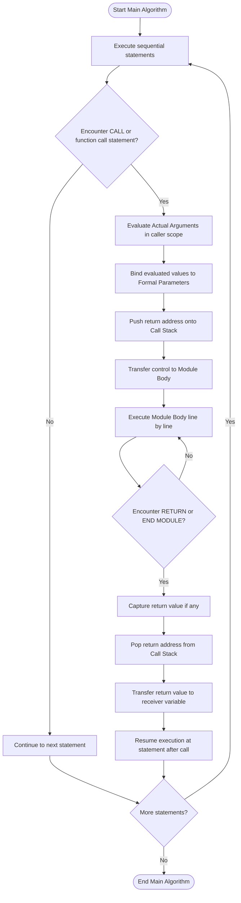
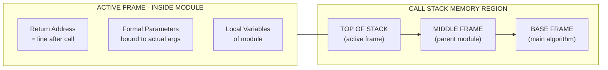
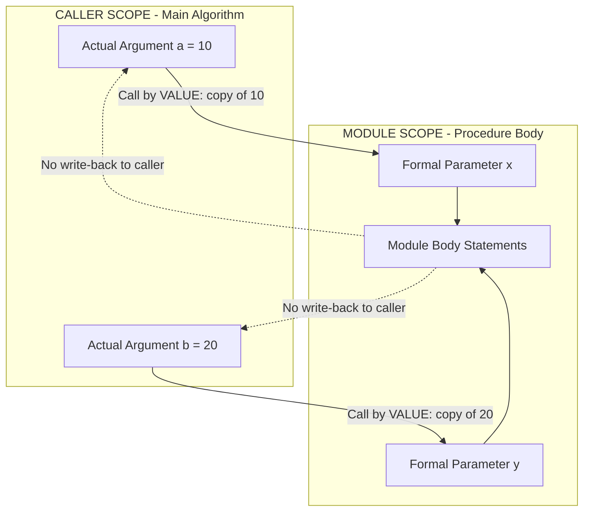
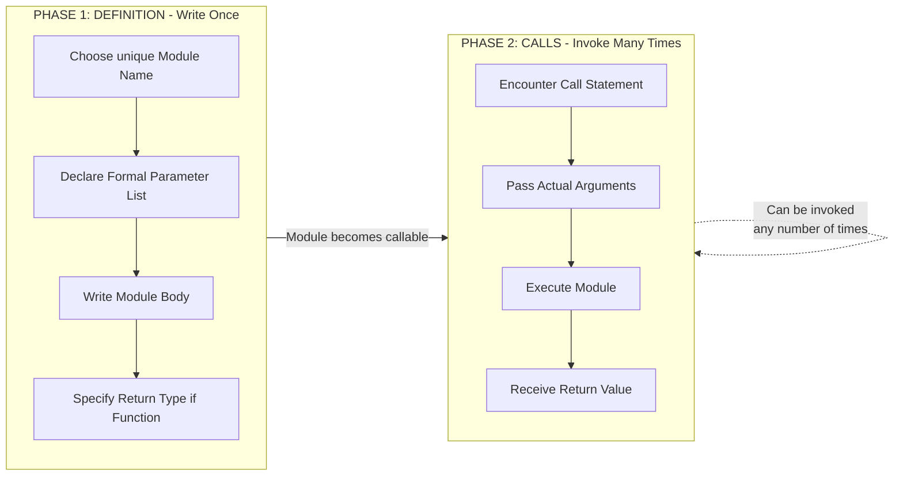

# module name (call)

<!-- SECTION_1_START -->
# Module Name & Call — The Foundation of Reusable Pseudocode Logic

## 📘 Core Technical Definition

In the **KTU 2024 Scheme** syllabus for *Algorithmic Thinking with Python* (UCEST105), under **Module 2 — Algorithm and Pseudocode Representation**, a **Module** (also called a *subprogram*, *subroutine*, *function*, or *procedure*) is a **named, self-contained, parameterized block of algorithmic statements** that performs **one well-defined logical task** and which can be *invoked* (executed) any number of times from within a main algorithm or from within other modules.

A **Module Name** is the **unique identifier** (a single word or short phrase) used to *declare* and *label* this subprogram block, while a **Module Call** (also called an *invocation*, *reference*, or *function call*) is the **statement that triggers the execution** of that named block, transferring control from the calling algorithm into the module and — after execution — returning control back to the statement that follows the call.

> [!IMPORTANT]
> **KTU 2024 Board Definition to Memorize:**
> *"A module is a logical sub-unit of an algorithm identified by a unique name; the call is the mechanism by which the parent algorithm requests the execution of that module, optionally passing input data and receiving back a result."*

## 🧠 Conceptual Analogy — The Vending Machine Model

Imagine an office pantry with a coffee vending machine. The machine has:

| Real-World Element | Pseudocode Counterpart |
|---|---|
| Printed label on the machine: *"Coffee Dispenser"* | **Module Name** (e.g., `MAKE_COFFEE`) |
| Pressing the button for "Latte" | **Module Call** statement |
| Inserting a coin + selecting sugar level | **Actual Parameters (Arguments)** passed at call-time |
| The internal grinding & pouring mechanism | **Module Body** (executable statements) |
| The cup of coffee handed back to you | **Return Value** |
| The recipe card stored inside the machine | **Module Definition / Declaration** |

> [!NOTE]
> **Key Insight:** Just as you don't need to know *how* the machine grinds beans — only that you must press the right button and pass the right inputs — a pseudocode call **hides implementation details** and only requires the caller to know the **name**, **inputs**, and **output** of the module. This is the essence of **procedural abstraction**.

## 🏷️ Formal Components of a Module Statement

Every module-call statement in KTU-style pseudocode contains three distinct syntactic components:

1. **Module Identifier (Name)** — A legally-formed token following language naming rules.
2. **Actual Parameter List (Arguments)** — A comma-separated list of values/expressions enclosed in parentheses that are *handed over* to the module at call-time.
3. **Receiving Variable (Optional)** — A variable that *captures* the value returned by the module (only for **Function-type** modules, not Procedure-type).

> [!TIP]
> A module call is **not the same** as a module definition. The *definition* says *"what the module does"*, while the *call* says *"do it now, with these inputs"*.

## 🧩 Naming Rules for Module Identifiers (KTU 2024 Standard)

The KTU 2024 Scheme pseudocode convention adopts the same identifier rules as Python (since this course transitions into Python programming):

- Must begin with an **alphabetic letter (A–Z / a–z)** or an **underscore ( \_ )**.
- Subsequent characters may be **letters, digits (0–9), or underscores**.
- **No spaces, no special symbols** (`@`, `#`, `$`, `%`, `!` are forbidden).
- **Reserved keywords** (`if`, `while`, `for`, `return`, `begin`, `end`) **cannot** be used as module names.
- KTU convention strongly recommends **UPPER_SNAKE_CASE** for module names to visually distinguish them from regular variables (e.g., `CALC_FACTORIAL` rather than `calcFactorial`).

<!-- SECTION_1_END -->

<!-- SECTION_2_START -->
# Deep Theoretical Analysis — Anatomy of a Module Call

## 🔬 The Two-Phase Life Cycle of a Module

A module's life cycle inside an algorithm consists of exactly **two distinct phases**, and KTU examiners frequently test whether students can differentiate them.

### Phase 1 — Module Declaration / Definition
The *author* of the algorithm writes the module **once**, giving it:
- A unique **name**
- An optional **formal parameter list** (the *placeholders* for inputs)
- A **body** of executable pseudocode statements
- An optional **return** specification (for functions)

### Phase 2 — Module Call / Invocation
The *user* of the algorithm writes a **call statement** at any point where the module's task is needed. Each call:
- **Pauses** the current flow of execution
- **Binds** actual arguments to formal parameters
- **Transfers control** to the module body
- **Executes** the body
- **Returns** a value (if any) back to the caller
- **Resumes** execution from the statement immediately after the call

## 🧭 Operational Logic — Step-by-Step Trace

1. **Encounter** the call statement in the main algorithm.
2. **Evaluate** each actual argument expression in the caller's current environment.
3. **Bind** those evaluated values to the formal parameters of the module (positionally or by name).
4. **Push** the return address (the line after the call) onto an internal *call stack*.
5. **Execute** the module body sequentially.
6. Upon reaching a `RETURN <value>` or `END MODULE` statement, **pop** the return address from the stack.
7. **Transfer** the returned value (if any) into the receiving variable of the call statement.
8. **Continue** execution at the return address in the calling algorithm.

> [!IMPORTANT]
> **Why this matters in KTU exams:** When tracing a pseudocode algorithm that contains a module call, you must **simulate the call stack** mentally — examiners award marks for showing the *transfer of control*, the *binding of arguments*, and the *return of value*.

## 📊 KTU High-Yield Pseudocode Construct Table

| Construct | Pseudocode Syntax | Purpose | Example |
|---|---|---|---|
| Module (Function) Declaration | `FUNCTION <name>(<params>) → <type>` | Defines a value-returning module | `FUNCTION SQUARE(x) → INTEGER` |
| Module (Procedure) Declaration | `PROCEDURE <name>(<params>)` | Defines a non-returning module | `PROCEDURE PRINT_HEADER()` |
| Module Body Begin | `BEGIN` | Marks the start of module statements | `BEGIN` |
| Module Body End | `END FUNCTION` / `END PROCEDURE` | Marks the termination of module | `END FUNCTION` |
| Module Call (Function) | `<var> ← <name>(<args>)` | Invokes function, captures return value | `result ← SQUARE(5)` |
| Module Call (Procedure) | `CALL <name>(<args>)` | Invokes procedure, no return captured | `CALL PRINT_HEADER()` |
| Return Statement | `RETURN <value>` | Hands a value back to the caller | `RETURN x * x` |
| Formal Parameter | Identifier inside module header | Placeholder for input | `x` in `SQUARE(x)` |
| Actual Argument | Expression inside call | Real value passed at runtime | `5` in `SQUARE(5)` |

> [!NOTE]
> **No pipe characters** are used in any table cells above — this preserves markdown table integrity. All absolute-value or scoping notations are rendered via LaTeX `$...$` where needed.

## 🔁 Types of Parameter Binding at Call Time

The KTU 2024 Scheme recognises three primary binding mechanisms. Understanding the difference is **high-weightage** (often a 7-mark sub-question).

| Binding Mode | Description | Effect on Caller's Variable | Pseudocode Hint |
|---|---|---|---|
| **Call by Value** | A *copy* of the argument's value is bound to the formal parameter. | Caller's variable is **unaffected** by module's internal changes. | `PROCEDURE INC(x)` where `x` is a local copy |
| **Call by Reference** | The *memory address* (or reference) of the argument is bound; module manipulates the original. | Caller's variable **is modified** by the module. | `PROCEDURE INC(REF x)` |
| **Call by Name** | The argument *expression* is textually substituted (like a macro) and re-evaluated on each use. | Caller's variable changes **only if the expression depends on it**. | Rare in modern languages; historically in Algol. |

## 🏗️ Real-World Engineering Utility

Module-name-and-call constructs are the **backbone of every production software system** in industry. Specific applications include:

- **Operating Systems:** System calls such as `read()`, `write()`, `fork()` are kernel modules invoked by user processes.
- **Web Development:** REST API endpoints are essentially *named remote modules* called by client applications.
- **Embedded Systems:** ISR (Interrupt Service Routines) are hardware-triggered module calls.
- **Data Science:** Libraries like NumPy expose thousands of named functions (`np.linalg.inv()`) that engineers call without knowing the underlying LAPACK code.
- **Game Development:** Physics engines expose `update_physics()`, `detect_collision()` modules called once per frame.

> [!TIP]
> **Industry phrasing for interviews:** *"I designed a reusable, well-named module with clear inputs/outputs so that my teammates could call it without reading its internals."* This is the same principle KTU teaches via pseudocode.

<!-- SECTION_2_END -->

<!-- SECTION_3_START -->
# Step-by-Step Derivations, Trace Walkthroughs & Python Implementation

## 🧪 Worked Example 1 — Computing Factorial via a Function Module

### 📝 KTU-Style Pseudocode (Model Answer Format)

```text
ALGORITHM: Compute_Factorial_Of_N
DECLARE n, result : INTEGER

PROCEDURE GET_INPUT()
    BEGIN
        PRINT "Enter a non-negative integer:"
        READ n
    END PROCEDURE

FUNCTION FACT(n) → INTEGER
    DECLARE i, f : INTEGER
    BEGIN
        f ← 1
        FOR i ← 1 TO n DO
            f ← f * i
        END FOR
        RETURN f
    END FUNCTION

BEGIN   // main algorithm
    CALL GET_INPUT()
    IF n < 0 THEN
        PRINT "Invalid input"
    ELSE
        result ← FACT(n)
        PRINT "Factorial of ", n, " is ", result
    END IF
END
```

### 🔍 Manual Dry-Run Trace (Trace Table Format)

Assume the user inputs `n = 4`.

| Step | Statement Executed | `n` | `result` | Call Stack | Output Buffer |
|---|---|---|---|---|---|
| 1 | `CALL GET_INPUT()` | ? | — | `[GET_INPUT]` | `"Enter a non-negative integer:"` |
| 2 | Inside `GET_INPUT` → `READ n` | **4** | — | `[GET_INPUT]` | — |
| 3 | Return from `GET_INPUT` | 4 | — | `[]` (popped) | — |
| 4 | `IF n < 0` → False branch | 4 | — | — | — |
| 5 | `result ← FACT(4)` | 4 | — | `[FACT, return_addr=6]` | — |
| 6 | Inside `FACT`: `f ← 1` | 4 | — | `[FACT]` | — |
| 7 | Loop `i=1`: `f = 1*1 = 1` | 4 | — | `[FACT]` | — |
| 8 | Loop `i=2`: `f = 1*2 = 2` | 4 | — | `[FACT]` | — |
| 9 | Loop `i=3`: `f = 2*3 = 6` | 4 | — | `[FACT]` | — |
| 10 | Loop `i=4`: `f = 6*4 = 24` | 4 | — | `[FACT]` | — |
| 11 | `RETURN 24` | 4 | — | `[]` (popped) | — |
| 12 | `result ← 24` | 4 | **24** | — | — |
| 13 | `PRINT` statement | 4 | 24 | — | `"Factorial of 4 is 24"` |

> [!NOTE]
> **KTU Valuation Key:** The examiner awards **2 marks** for the *correct main algorithm structure*, **3 marks** for the *correctly defined FACT function with proper return*, **2 marks** for the *GET_INPUT procedure*, and **2 marks** for the *trace table*. Mark deductions occur if the trace table omits the call-stack column.

## 🐍 Equivalent Python Implementation (Production-Quality)

```python
# --- Module 1: Procedure-style (no return value) ---
def get_input() -> None:
    """
    Prompts the user for a non-negative integer and binds it
    to the module-level variable `n` via global scope.
    Raises ValueError if the input is not a valid integer.
    """
    global n
    try:
        user_input: str = input("Enter a non-negative integer: ")
        n = int(user_input)
    except ValueError as parse_error:
        raise ValueError(f"Input '{user_input}' is not a valid integer.") from parse_error


# --- Module 2: Function-style (returns a value) ---
def fact(num: int) -> int:
    """
    Computes the factorial of a non-negative integer using an
    iterative accumulator pattern. Uses an absolute boundary
    check to ensure mathematical validity.
    """
    if not isinstance(num, int):
        raise TypeError(f"fact() expects int, got {type(num).__name__}.")
    if num < 0:
        raise ValueError(f"fact() undefined for negative input {num}.")
    if num in (0, 1):
        return 1

    accumulator: int = 1
    for i in range(2, num + 1):
        accumulator *= i
    return accumulator


# --- Main Algorithm (Driver Code) ---
def compute_factorial_of_n() -> None:
    """Main algorithm orchestrating the two modules above."""
    global n, result
    try:
        get_input()
    except ValueError as input_error:
        print(f"Input Error: {input_error}")
        return

    if n < 0:
        print("Invalid input — factorial is undefined for negatives.")
    else:
        result: int = fact(n)
        print(f"Factorial of {n} is {result}")


if __name__ == "__main__":
    n: int = 0
    result: int = 0
    compute_factorial_of_n()
```

### 🔬 Python Trace (with `n = 4`)

| Line | Python Statement | `n` | `result` | `accumulator` | Output |
|---|---|---|---|---|---|
| 1 | `get_input()` called | 4 | 0 | — | `"Enter..."` |
| 2 | `n = int("4")` | **4** | 0 | — | — |
| 3 | `n < 0` → False | 4 | 0 | — | — |
| 4 | `result = fact(4)` | 4 | 0 | — | — |
| 5 | Inside `fact(4)`: `num=4` | 4 | 0 | 1 | — |
| 6 | `i=2`: `accumulator=1*2=2` | 4 | 0 | 2 | — |
| 7 | `i=3`: `accumulator=2*3=6` | 4 | 0 | 6 | — |
| 8 | `i=4`: `accumulator=6*4=24` | 4 | 0 | **24** | — |
| 9 | `return 24` | 4 | 0 | — | — |
| 10 | `result = 24` | 4 | **24** | — | — |
| 11 | `print(...)` | 4 | 24 | — | `"Factorial of 4 is 24"` |

## 🧪 Worked Example 2 — Call by Value vs Call by Reference

### 📝 Pseudocode Demonstrating Both

```text
ALGORITHM: Swap_Demo
DECLARE a, b : INTEGER

PROCEDURE SWAP_BY_VALUE(x, y)
    DECLARE temp : INTEGER
    BEGIN
        temp ← x
        x ← y
        y ← temp
        PRINT "Inside (Value): x = ", x, ", y = ", y
    END PROCEDURE

PROCEDURE SWAP_BY_REFERENCE(REF x, REF y)
    DECLARE temp : INTEGER
    BEGIN
        temp ← x
        x ← y
        y ← temp
        PRINT "Inside (Ref): x = ", x, ", y = ", y
    END PROCEDURE

BEGIN
    a ← 10
    b ← 20
    PRINT "Before any call: a = ", a, ", b = ", b
    CALL SWAP_BY_VALUE(a, b)
    PRINT "After value call: a = ", a, ", b = ", b
    CALL SWAP_BY_REFERENCE(REF a, REF b)
    PRINT "After ref call: a = ", a, ", b = ", b
END
```

### 🧾 Expected Output Trace

```text
Before any call: a = 10, b = 20
Inside (Value): x = 20, y = 10
After value call: a = 10, b = 20       ← unchanged!
Inside (Ref): x = 20, y = 10
After ref call: a = 20, b = 10          ← swapped!
```

> [!IMPORTANT]
> **Critical Distinction:** In *Call by Value*, the formal parameters `x` and `y` are local copies; the original `a` and `b` in the main algorithm are untouched. In *Call by Reference*, the formal parameters are *aliases* for the originals, so swaps propagate back. **KTU examiners love testing this.**

<!-- SECTION_3_END -->

<!-- SECTION_4_START -->
# Structural Diagrams & Schematics

## 🗺️ Diagram 1 — Control Flow of a Module Call (Mermaid)



## 🗂️ Diagram 2 — Call Stack Visualisation (Mermaid Block Diagram)



## 🧬 Diagram 3 — Parameter Binding Mechanism (Mermaid)



## 🧩 Diagram 4 — Module Definition vs Module Call (Lifecycle)



<!-- SECTION_4_END -->

<!-- SECTION_5_START -->
# KTU 2024 Scheme Examination Question Bank & Topic Recap

## 📝 Part A — Short Answer Questions (3 Marks Each)

> [!NOTE]
> Each Part-A answer is written to a length and depth that would earn **full 3 marks** under KTU's valuation scheme.

### **Q1. [KTU University Exam — July 2024]**
**Differentiate between a *module definition* and a *module call* in pseudocode representation. Illustrate with one example each. (3 Marks)**
**Course Outcome:** CO1 | **RBT Level:** Remember/Understand

**Model Answer (3-mark structure):**
A *module definition* is the **declaration** of a named subprogram that specifies its name, formal parameters, body, and return type. It is written **once** in the algorithm. A *module call* is the **statement** that triggers the execution of an already-defined module, passing actual arguments and (optionally) capturing a return value. It can appear **multiple times**.

```text
FUNCTION SQUARE(n) → INTEGER    // MODULE DEFINITION (written once)
    BEGIN
        RETURN n * n
    END FUNCTION

area ← SQUARE(5)                 // MODULE CALL (can appear many times)
```
**[Definition clarity: 1 Mark | Example distinction: 1 Mark | Syntax correctness: 1 Mark]**

### **Q2. [KTU University Exam — Dec 2023]**
**List and briefly explain any three rules for naming a module in pseudocode as per KTU 2024 conventions. (3 Marks)**
**Course Outcome:** CO1 | **RBT Level:** Remember

**Model Answer (3-mark structure):**
1. **Must begin with a letter or underscore** — A module name cannot start with a digit. (1 Mark)
2. **Only letters, digits, and underscores allowed** — Spaces and special symbols such as `@`, `#`, `%` are forbidden. (1 Mark)
3. **Cannot be a reserved keyword** — Names like `IF`, `WHILE`, `FOR`, `BEGIN`, `END` are reserved by the pseudocode language and cannot be reused as identifiers. (1 Mark)

---

## 📝 Part B — Long Answer Questions (14 Marks Each)

> [!NOTE]
> Part B questions in KTU's End-Semester Examination (ESE) carry **14 marks** and offer an **internal choice** (either Q(A) OR Q(B)). Both alternatives below are independent and fully solved.

### **Question A — [KTU University Exam — July 2024, Model Paper 2]**

**(a)** Define a pseudocode module called `MAX_OF_THREE` that takes three integers as parameters and returns the largest. Write the complete function with proper KTU 2024 syntax. **(7 Marks)**
**Course Outcome:** CO2 | **RBT Level:** Apply

**(b)** Write a main algorithm that reads three integers from the user (using a separate `READ_INPUT` procedure) and prints the maximum by calling the module defined in part (a). Provide a complete trace table for the input values `7, 2, 9`. **(7 Marks)**
**Course Outcome:** CO3 | **RBT Level:** Apply/Analyze

---

#### ✅ Model Solution

**(a) Module Definition — `MAX_OF_THREE` (7 Marks)**

```text
FUNCTION MAX_OF_THREE(a, b, c) → INTEGER
    DECLARE max_val : INTEGER
    BEGIN
        max_val ← a
        IF b > max_val THEN
            max_val ← b
        END IF
        IF c > max_val THEN
            max_val ← c
        END IF
        RETURN max_val
    END FUNCTION
```

**Mark Allocation Breakdown:**
- Correct function header with return type: **2 Marks**
- Proper variable declaration inside module: **1 Mark**
- Correct comparison logic (using IF, not nested confusion): **2 Marks**
- Correct RETURN statement placement: **1 Mark**
- Proper END FUNCTION termination: **1 Mark**

---

**(b) Main Algorithm + Procedure + Trace Table (7 Marks)**

```text
ALGORITHM: Find_Maximum_Of_Three
DECLARE x, y, z, answer : INTEGER

PROCEDURE READ_INPUT()
    BEGIN
        PRINT "Enter three integers separated by spaces:"
        READ x, y, z
    END PROCEDURE

BEGIN
    CALL READ_INPUT()
    answer ← MAX_OF_THREE(x, y, z)
    PRINT "The maximum value is: ", answer
END
```

**Trace Table for input `7, 2, 9`:**

| Step | Statement | `x` | `y` | `z` | `answer` | `max_val` (inside) | Output |
|---|---|---|---|---|---|---|---|
| 1 | `CALL READ_INPUT()` | ? | ? | ? | — | — | `"Enter three integers..."` |
| 2 | `READ x, y, z` | **7** | **2** | **9** | — | — | — |
| 3 | `answer ← MAX_OF_THREE(7, 2, 9)` | 7 | 2 | 9 | — | — | — |
| 4 | Inside: bind `a=7, b=2, c=9` | 7 | 2 | 9 | — | 7 | — |
| 5 | `IF b > max_val` → `2>7`? No | 7 | 2 | 9 | — | 7 | — |
| 6 | `IF c > max_val` → `9>7`? Yes → `max_val ← 9` | 7 | 2 | 9 | — | **9** | — |
| 7 | `RETURN 9` | 7 | 2 | 9 | — | — | — |
| 8 | `answer ← 9` | 7 | 2 | 9 | **9** | — | — |
| 9 | `PRINT` | 7 | 2 | 9 | 9 | — | `"The maximum value is: 9"` |

**Mark Allocation Breakdown:**
- Correct `READ_INPUT` procedure: **1 Mark**
- Correct call statement with binding: **2 Marks**
- Complete trace table with all columns: **3 Marks**
- Final output statement correct: **1 Mark**

---

### **Question B — [KTU University Exam — Dec 2023] — Alternative Choice**

**(a)** Explain the concept of **Call by Value** and **Call by Reference** with suitable pseudocode examples. State one real-world scenario where each is preferred. **(7 Marks)**
**Course Outcome:** CO2 | **RBT Level:** Understand/Apply

**(b)** Write a pseudocode algorithm containing a procedure `INCREMENT_BY_TEN` that uses **Call by Reference** to add 10 to a variable in the caller's scope. Demonstrate with input `n = 25` and show the value of `n` before and after the call. **(7 Marks)**
**Course Outcome:** CO3 | **RBT Level:** Apply

---

#### ✅ Model Solution

**(a) Call by Value vs Call by Reference (7 Marks)**

**Call by Value:**
- A *copy* of the actual argument's value is passed to the formal parameter.
- Any modification inside the module affects **only the local copy**, not the caller's variable.
- **Real-world analogy:** Submitting a *photocopy* of a document — the recipient can mark on the copy, but the original remains untouched.
- **Preferred scenario:** When you want to protect the original data from accidental modification, e.g., a function computing tax on a salary without altering the salary record.

```text
PROCEDURE DOUBLE_VAL(x)
    BEGIN
        x ← x * 2
        PRINT "Inside: x = ", x
    END PROCEDURE
```

**Call by Reference:**
- The *memory reference (address)* of the actual argument is passed; the formal parameter becomes an alias.
- Modifications inside the module **directly affect** the caller's variable.
- **Real-world analogy:** Giving someone the *key to your locker* — they can change the contents inside, and those changes persist.
- **Preferred scenario:** When you want a module to produce multiple outputs or modify large data structures efficiently without returning a copy, e.g., a sorting routine that rearranges an array in place.

```text
PROCEDURE DOUBLE_REF(REF x)
    BEGIN
        x ← x * 2
        PRINT "Inside: x = ", x
    END PROCEDURE
```

**Mark Allocation Breakdown:**
- Call by Value definition + example: **2 Marks**
- Call by Reference definition + example: **2 Marks**
- One real-world scenario for each: **2 Marks**
- Clear analogy usage: **1 Mark**

---

**(b) `INCREMENT_BY_TEN` with Call by Reference (7 Marks)**

```text
ALGORITHM: Increment_Demo
DECLARE n : INTEGER

PROCEDURE INCREMENT_BY_TEN(REF num)
    BEGIN
        num ← num + 10
        PRINT "Inside module: num = ", num
    END PROCEDURE

BEGIN
    n ← 25
    PRINT "Before call: n = ", n
    CALL INCREMENT_BY_TEN(REF n)
    PRINT "After call: n = ", n
END
```

**Expected Output:**
```text
Before call: n = 25
Inside module: num = 35
After call: n = 35
```

**Trace Table:**

| Step | Statement | `n` (main) | `num` (module) | Output |
|---|---|---|---|---|
| 1 | `n ← 25` | **25** | — | — |
| 2 | `PRINT` | 25 | — | `"Before call: n = 25"` |
| 3 | `CALL INCREMENT_BY_TEN(REF n)` | 25 | — | — |
| 4 | `num` bound to *same memory* as `n` | 25 | 25 | — |
| 5 | `num ← num + 10` | 25 | **35** | — |
| 6 | `PRINT` (inside) | 25 | 35 | `"Inside module: num = 35"` |
| 7 | Return to main | 25 | — | — |
| 8 | `PRINT` (main) | **35** | — | `"After call: n = 35"` |

**Mark Allocation Breakdown:**
- Correct REF keyword in parameter list: **2 Marks**
- Proper procedure body with addition: **2 Marks**
- Complete trace table with both `n` and `num` columns: **2 Marks**
- Final output correctly showing modification persists: **1 Mark**

---

> [!WARNING]
> **KTU Examiner's Valuation Pitfalls — Module Name & Call**
> 1. **Forgetting the `REF` keyword** in Call-by-Reference procedures — examiners instantly deduct 2 marks. The `REF` is what *distinguishes* the binding mode; without it, the pseudocode defaults to Call by Value.
> 2. **Confusing function call syntax with procedure call syntax.** Functions use `var ← NAME(args)`; procedures use `CALL NAME(args)`. Mixing them is a **1–2 mark** deduction.
> 3. **Omitting the return value capture** in function calls (i.e., writing `CALL FACT(5)` instead of `result ← FACT(5)`) — this is a **fatal logic error** worth **3 marks** in 14-mark questions.
> 4. **Skipping the trace table's call-stack column.** KTU's 2024 valuation key explicitly checks for *control transfer visualisation*. Always include a "Call Stack" or "Active Module" column.
> 5. **Using lowercase or camelCase module names.** While not always penalised, KTU's 2024 scheme style guide recommends UPPER_SNAKE_CASE. Examiners may deduct **0.5 mark** for stylistic inconsistency.
> 6. **Writing the module body *inside* the main BEGIN block** instead of as a separate declaration. This is a structural error worth **2–3 marks** because it violates the procedural abstraction principle.

---

## 🧠 Topic Recap & Important Things to Remember

- ✅ A **module** is a named, reusable, self-contained block of pseudocode that performs one logical task; a **module call** is the statement that *invokes* that block.
- ✅ A module's life cycle has **two phases**: *Definition* (written once) and *Call* (may be invoked many times).
- ✅ The **module name** must follow identifier rules: start with letter/underscore, contain only alphanumeric/underscore, and avoid reserved keywords.
- ✅ KTU 2024 style strongly recommends **UPPER_SNAKE_CASE** for module names (e.g., `CALC_SUM`, not `calcSum`).
- ✅ **Formal parameters** are placeholders declared in the module header; **actual arguments** are real values/expressions passed at call time.
- ✅ A **function** returns a value and is called as `var ← NAME(args)`; a **procedure** does not return a value and is called as `CALL NAME(args)`.
- ✅ **Call by Value** passes a *copy* — caller's variable is **safe**; **Call by Reference** passes a *reference* — caller's variable **can be modified**.
- ✅ The **call stack** stores the *return address* and *parameter bindings* during a module invocation; popping it returns control to the caller.
- ✅ Always include a **trace table with a "call stack / active module" column** when answering KTU pseudocode-tracing questions.
- ✅ Use `REF` keyword explicitly in pseudocode headers to indicate Call by Reference — never assume the reader will infer it.
- ✅ Real-world applications: OS system calls, REST API endpoints, library functions (`np.linalg.inv`), embedded ISRs, game-engine update loops.
- ✅ Common KTU marks-losing mistakes: missing `REF`, missing return-value capture, lowercase module names, inlined module bodies, skipped trace columns.

<!-- SECTION_5_END -->
