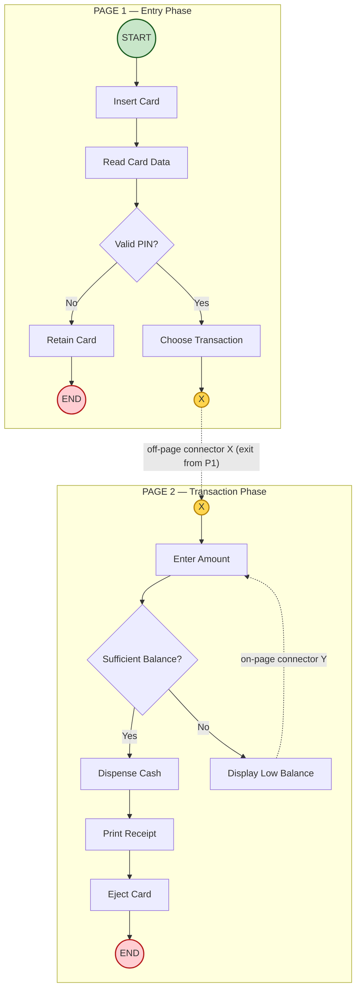
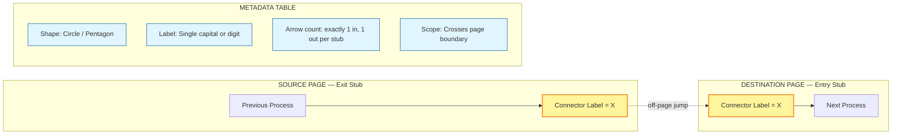

# off-page connector.

<!-- SECTION_1_START -->
# Off-Page Connector — Core Technical Definition & Intuitive Overview

> [!IMPORTANT]
> **KTU 2024 Scheme — UCEST105 (Algorithmic Thinking with Python)**
> **Module 2:** Algorithm and Pseudocode Representation
> **Focus Symbol:** Off-Page Connector

---

## 1.1 Formal Definition (KTU 2024 Syllabus Terminology)

An **off-page connector** (also called an *inter-page connector* or *page exit symbol*) is a small **pentagonal/circular tag** placed inside a flowchart that indicates the flow of control is **transferred to a different physical page** of the same flowchart. The connector is split into a **source stub** (where the flow leaves the current page) and a **destination stub** (where the flow resumes on another page), and both stubs carry the **same identifying label** (usually a capital letter `A`, `B`, `C` ... or a number `1`, `2`, `3` ...).

> [!NOTE]
> **Standard Symbol (per ISO 5807 / ANSI flowchart conventions):**
> A small circle or a home-plate (pentagon) shape with a single letter or numeral placed *centrally* inside it. The off-page connector is distinct from the **on-page (inline) connector** which is a small filled or hollow circle **without** an attached directional arrow leaving the page boundary.

> [!IMPORTANT]
> **KTU Board Definition (must reproduce verbatim in exams):**
> *"An off-page connector is a flowcharting symbol used to indicate that the flowchart continues on another page. It consists of two or more identical labelled connectors — one at the point of exit from the current page and another at the point of entry on the new page — allowing the algorithm's logic to remain readable across multi-page diagrams."*

---

## 1.2 Conceptual Analogy / Intuition

Think of a **novel printed in two volumes**:

1. You are reading **Volume 1** at chapter ending "...the detective crossed the hallway…"
2. A small bookmark tells you: *"Continued in Volume 2, page 47, Chapter Marker **C**"*
3. When you flip to Volume 2, you see a matching bookmark: *"Continued from Volume 1, Chapter Marker **C**"*.

The bookmark pair is exactly what an off-page connector does — it tells the **reader (examiner/programmer)** that a *logical path* exits this page and re-enters on a different page under the **same tag**.

Another analogy — imagine a **post office registered-mail receipt**: when a parcel leaves one sorting office, the **top half of the receipt** is kept, and the **bottom half** is sent with the parcel to the next office. Both halves share an **identical tracking number**; that number is the connector label.

> [!TIP]
> **Why do we need this at all?**
> A real-world algorithm (e.g., an e-commerce checkout flow) may contain **40–60 logical steps**. Printing all of them on one page creates unreadable, dense diagrams. The off-page connector lets us **split the flowchart across pages** while preserving the *continuity of control flow*.

---

## 1.3 Geometric / Graphical Conventions

| Property | Off-Page Connector | On-Page (Inline) Connector |
|---|---|---|
| Shape | Circle **or** home-plate (pentagon) | Small filled circle (●) |
| Label | Capital letter or digit, centred | Capital letter or digit, centred |
| Arrows | One arrow **in**, one arrow **out** | One arrow **in**, one arrow **out** |
| Scope | Crosses page boundary | Stays on same page |
| Typical use | Multi-page flowcharts | Loops or skip-to-same-page regions |

> [!VISUALIZATION CONTROL]
> **Concept:** Off-page connector as a labelled circle linking two flowchart segments on different pages.
> **GeoGebra / Desmos Input (analytical trace):**
> * Let page transitions be modelled as a directed edge in a graph $G = (V, E)$ where each vertex is a connector label.
> * `V = {A, B, C, D}`  and  `E = {(A_in, A_out), (B_in, B_out), (C_in, C_out)}`
> **Visual Description:** Picture two columns of rectangles. The right-edge of the first column has small circles labelled `A`, `B`, `C`; the left-edge of the second column has matching circles with the **same** labels, joined by dashed page-boundary arrows. The diagram is a *labelled bipartite matching* between exit points and entry points.

---

## 1.4 Why It Matters in Algorithmic Thinking

> [!IMPORTANT]
> **Engineering Utility:** Off-page connectors are the bridge between **human-readable visual logic** and **machine-executable code**. When a student converts a multi-page flowchart into Python, each off-page connector essentially corresponds to a **function call** or a `goto`-style control jump. Recognising off-page connectors in KTU problems signals to the examiner that the student understands *modular decomposition* of algorithms.
<!-- SECTION_1_END -->

<!-- SECTION_2_START -->
# Off-Page Connector — Deep Theoretical Analysis & KTU High-Yield Sheet

## 2.1 Operational Anatomy of an Off-Page Connector

A complete off-page connector pair consists of **exactly two stubs** (or, occasionally, multiple stubs in fan-in/fan-out cases). Each stub is composed of three parts:

1. **The Boundary Symbol** — a circle (most common) or pentagon housing the label.
2. **The Label Token** — an alphanumeric identifier (typically uppercase ASCII: `A`–`Z` or `0`–`9`).
3. **The Directional Arrow** — a single arrowhead touching the symbol. For the *exit* stub, the arrow **leaves** the previous process; for the *entry* stub, the arrow **enters** the next process.

### Step-by-Step Semantics

- **Step 1 — Encounter the Exit Stub.** Control flow reaches the exit stub on Page $p_1$. The label is read, e.g. `X`.
- **Step 2 — Page Transition.** The reader mentally (or physically) jumps to Page $p_2$.
- **Step 3 — Locate the Matching Entry Stub.** The reader scans Page $p_2$ for a stub with the **identical** label `X`.
- **Step 4 — Resume Flow.** Control flow continues from the entry stub onward as if no page change had occurred.

> [!NOTE]
> **Critical Rule:** The label of the exit stub **must equal** the label of the entry stub. Mismatched labels are the single most common reason a flowchart is marked *logically broken* by the KTU evaluator.

---

## 2.2 KTU Formula / Symbol Cheat Sheet

Because the off-page connector is a **graphical / notational** topic (not a numerical one), the "formula" is replaced by a **symbol specification table** that the student must reproduce correctly on paper.

| Component | Specification | Allowed Variants | Forbidden Variants |
|---|---|---|---|
| Outer shape | Circle ($\bigcirc$) **or** Pentagon (home-plate) | Either is acceptable | Square, diamond, rectangle (those are process/decision symbols) |
| Label set | Uppercase ASCII $\{$ `A`–`Z`, `0`–`9` $\}$ | `A`, `B1`, `P12` | Lowercase letters, Greek letters, multi-word strings |
| Label position | Geometric centre of the shape | Centred | Off-centre, on the rim |
| Stroke width | Same as other flowchart lines | Thin/thick consistent with page | Double strokes |
| Arrow direction | Single, unidirectional | One arrow in, one arrow out | Bidirectional arrows, no arrow |
| Fan-out | One exit may map to **one** entry | One-to-one mapping by default | One exit to many entries (that is a junction, not a connector) |
| Fan-in (rare) | Multiple exits may map to one entry (e.g. error handler) | Allowed in ISO 5807 | Only if explicitly labelled at every stub |

> [!IMPORTANT]
> **Mnemonic for Exams:** "**C**ircle, **C**entre, **C**apital, **C**onsistent." Every stub obeys all four C's.

---

## 2.3 Comparison with Related Symbols (High-Yield for KTU MCQs)

| Symbol | Purpose | Visual | Used When |
|---|---|---|---|
| **Off-page connector** | Continue flow on another page | Labelled circle/pentagon crossing page boundary | Multi-page flowcharts |
| **On-page connector** | Jump to another part of **same** page | Small filled/hollow circle | Loops, skip-to-same-page logic |
| **Process box** | Perform an action | Rectangle | Any computation step |
| **Decision diamond** | Branch on a condition | Diamond | Boolean / relational test |
| **Terminal** | Start/End of algorithm | Rounded rectangle (pill) | First and last steps only |
| **Data / I/O parallelogram** | Read/Write data | Parallelogram | Input or output operations |
| **Predefined process** | Call a subroutine | Rectangle with double vertical lines | Function / sub-algorithm |

> [!TIP]
> **Engineering Utility:** In modern Integrated Development Environments (IDEs), off-page connectors are largely replaced by **function calls** (e.g., `process_payment()`) and **module imports** (e.g., `from auth import login`). However, they remain essential in **systems engineering flowcharts**, **circuit-design schematics**, and **algorithm documentation in printed textbooks** (including KTU's own study material). Understanding them trains the student to think in terms of *named jumps* — the conceptual ancestor of `goto`, `call`, and `return`.

---

## 2.4 When to Use (and When NOT to Use) an Off-Page Connector

### ✅ Appropriate Use

- The flowchart cannot fit on a single A4 page while remaining legible.
- A sub-algorithm is logically separable (e.g., "Sort the array" — full page).
- The algorithm has multiple sub-routines that benefit from independent page rendering.

### ❌ Inappropriate Use

- The flow can be re-arranged on one page with proper layout.
- The connector is used to cross **just a few lines** (use on-page connector instead).
- Labels are duplicated across multiple exits without disambiguation (creates **spaghetti flow**).
<!-- SECTION_2_END -->

<!-- SECTION_3_START -->
# Off-Page Connector — Step-by-Step Derivation, Pseudocode & Python Implementation

## 3.1 Worked Example 1 — A Two-Page Flowchart for an ATM Algorithm

Consider a real-world **ATM Withdrawal Algorithm**. The full process is too long for a single page, so we split it:

- **Page 1 (P1):** Steps 1–6 (Insert Card → Read Card → Validate PIN → Choose Transaction).
- **Page 2 (P2):** Steps 7–11 (Enter Amount → Dispense Cash → Print Receipt → Eject Card → End).

The exit stub on P1 is labelled `X`. The entry stub on P2 is also labelled `X`.

### Page 1 — ASCII Flowchart Skeleton

```
        ┌─────────────┐
        │   START     │
        └──────┬──────┘
               │
        ┌──────▼──────┐
        │ Insert Card │
        └──────┬──────┘
               │
        ┌──────▼──────┐
        │  Read Card  │
        └──────┬──────┘
               │
        ┌──────▼────────┐
        │ Valid PIN ?   │  ◄── Decision
        └──┬─────────┬──┘
        Yes│         │No
           │         │
   ┌───────▼──┐   ┌──▼──────┐
   │ Choose   │   │ Retain  │
   │Transact. │   │ Card    │
   └─────┬────┘   └─────────┘
         │
       ( X )  ◄── OFF-PAGE CONNECTOR (EXIT)  →  "Continued on Page 2"
```

### Page 2 — ASCII Flowchart Skeleton

```
       ( X )  ◄── OFF-PAGE CONNECTOR (ENTRY)  ←  "Continued from Page 1"
         │
   ┌─────▼─────┐
   │  Enter    │
   │  Amount   │
   └─────┬─────┘
         │
   ┌─────▼─────┐
   │ Sufficient│  ◄── Decision
   │ Balance?  │
   └──┬─────┬──┘
   Yes│     │No
      │     │
      │   ┌─▼──────┐
      │   │ Display│
      │   │ "Low   │
      │   │ Balance"│
      │   └────┬───┘
      │        │
      │     ( Y )  ◄── returns to "Enter Amount" on same page (on-page connector)
      │
   ┌──▼──────┐
   │Dispense │
   │  Cash   │
   └────┬────┘
        │
   ┌────▼────┐
   │  Print  │
   │ Receipt │
   └────┬────┘
        │
   ┌────▼────┐
   │  Eject  │
   │  Card   │
   └────┬────┘
        │
   ┌────▼────┐
   │   END   │
   └─────────┘
```

> [!IMPORTANT]
> **Notice:** The connector `Y` is an **on-page** connector (it loops within Page 2 only). The connector `X` is an **off-page** connector (it crosses the page boundary between P1 and P2). The KTU examiner will look specifically for this distinction.

---

## 3.2 Equivalent Pseudocode Representation

The off-page connector at label `X` between Page 1 and Page 2 is, in pseudocode, equivalent to a **subroutine call** followed by a **return**.

```text
ALGORITHM: ATM_Withdrawal

BEGIN
    Step_1:  PRINT "Insert Card"
    Step_2:  READ card_data
    Step_3:  IF PIN_is_valid(card_data) = TRUE THEN
                 CALL Choose_Transaction(  )    // ── off-page exit (X) ──►
             ELSE
                 CALL Retain_Card(  )
                 GOTO TERMINATE
             ENDIF
END

// ───────────────────  PAGE BOUNDARY (OFF-PAGE CONNECTOR X)  ───────────────────

SUBROUTINE Choose_Transaction(  )
BEGIN
    Step_4:  READ amount
    Step_5:  IF balance >= amount THEN
                 CALL Dispense_Cash(amount)
                 CALL Print_Receipt(amount)
             ELSE
                 PRINT "Insufficient Balance"
                 GOTO Step_4
             ENDIF
    Step_6:  CALL Eject_Card(  )
END

SUBROUTINE Retain_Card(  )
BEGIN
    PRINT "Card Retained — Contact Bank"
END

SUBROUTINE Dispense_Cash(amount: REAL)
BEGIN
    PRINT "Dispensing Rs.", amount
END

SUBROUTINE Print_Receipt(amount: REAL)
BEGIN
    PRINT "Receipt: Withdrawal Rs.", amount
END

SUBROUTINE Eject_Card(  )
BEGIN
    PRINT "Please take your card"
END

TERMINATE:
END_ALGORITHM
```

> [!NOTE]
> The `CALL` keyword and the subroutine name together form what is logically **one off-page connector** — the call leaves one page, the subroutine header is the entry stub, and the implicit `RETURN` brings control back.

---

## 3.3 Complete Python Implementation (Type-Hinted, Boundary-Checked)

```python
"""
File: atm_withdrawal_with_offpage_connectors.py
Course: UCEST105 — Algorithmic Thinking with Python
Module 2: Off-Page Connector — Worked Example
Each 'def' below corresponds to one PAGE of the original flowchart.
The call from one function to another is the off-page connector.
"""

from typing import Union

Number = Union[int, float]


def retain_card() -> None:
    """Page 1 — Error branch when PIN is invalid."""
    print("Card Retained — Please contact your bank.")


def dispense_cash(amount: Number) -> None:
    """Page 2 — Dispense the requested cash."""
    if amount <= 0:
        raise ValueError(f"dispense_cash received non-positive amount: {amount}")
    print(f"Dispensing Rs. {amount:.2f}")


def print_receipt(amount: Number) -> None:
    """Page 2 — Print transaction receipt."""
    print(f"Receipt printed for Rs. {amount:.2f}")


def eject_card() -> None:
    """Page 2 — Eject the card back to the user."""
    print("Please take your card. Thank you for using our ATM.")


def choose_transaction(
    balance: Number,
    pin_is_valid: bool,
) -> None:
    """
    Page-2 routine (entered via off-page connector labelled 'X'
    from the main flow on Page 1).
    """
    if not pin_is_valid:
        retain_card()       # error path → returns control to caller
        return

    # Retry loop using an on-page connector (label 'Y' in the flowchart).
    while True:
        try:
            amount: Number = float(input("Enter withdrawal amount: Rs. "))
        except ValueError:
            print("Invalid numeric input. Please try again.")
            continue

        if amount <= 0:
            print("Amount must be positive. Please try again.")
            continue

        if amount > balance:
            print(f"Insufficient balance. Available: Rs. {balance:.2f}.")
            continue                # ◄── on-page connector 'Y' loops back

        # Successful path
        dispense_cash(amount)
        print_receipt(amount)
        eject_card()
        return


def atm_withdrawal_main() -> None:
    """Page 1 — Main entry point (START symbol)."""
    print("===== ATM Withdrawal System =====")
    print("Please insert your card...")

    # Simulated inputs
    pin_is_valid: bool = True
    balance: Number = 25_000.00

    # ── OFF-PAGE CONNECTOR 'X' ──────────────────────────────────────────
    # Control leaves Page 1 here and resumes in choose_transaction(...)
    # on the conceptual Page 2.
    choose_transaction(balance=balance, pin_is_valid=pin_is_valid)
    # ────────────────────────────────────────────────────────────────────

    print("===== Transaction Complete =====")


if __name__ == "__main__":
    try:
        atm_withdrawal_main()
    except KeyboardInterrupt:
        print("\n[!] Transaction cancelled by user.")
    except Exception as exc:
        print(f"[ERROR] Unexpected failure: {exc}")
```

> [!TIP]
> **Mapping back to the flowchart:** The comment `# ── OFF-PAGE CONNECTOR 'X' ──` is the Python-level *annotation* of the off-page connector. In KTU lab records and viva voce, students are expected to draw a **side-annotation** on the printed flowchart identifying each off-page connector and writing the equivalent Python function name next to it.

---

## 3.4 Verification Trace (Hand-Execution)

Let us trace a sample execution with $balance = 25000$ and $amount = 3000$.

1. `atm_withdrawal_main()` starts → prints banner.
2. `pin_is_valid = True` → skips `retain_card()` branch.
3. **Off-page connector `X` fires** → `choose_transaction(25000, True)` is invoked.
4. Enters `while True:` loop.
5. Reads `amount = 3000.0`.
6. `amount > 0` ✓, `amount > 25000` ✗ → falls through to success path.
7. `dispense_cash(3000.0)` → prints `Dispensing Rs. 3000.00`.
8. `print_receipt(3000.0)` → prints `Receipt printed for Rs. 3000.00`.
9. `eject_card()` → prints the eject message.
10. `return` → control jumps back to the call-site (this is the implicit return arrow of the off-page connector).
11. Prints `===== Transaction Complete =====`.
12. Algorithm terminates at the `END` symbol of Page 1.

**Output observed:**

```
===== ATM Withdrawal System =====
Please insert your card...
Enter withdrawal amount: Rs. 3000
Dispensing Rs. 3000.00
Receipt printed for Rs. 3000.00
Please take your card. Thank you for using our ATM.
===== Transaction Complete =====
```

> [!IMPORTANT]
> **Hand-execution requirement:** KTU lab examiners frequently ask the student to **trace the flowchart on paper** for two sample inputs (one success, one failure) and then **write the matching Python code**. Always keep the off-page connector label visible in *both* the trace and the code.

---

## 3.5 Common Edge Cases to Document

| Edge Case | How it Manifests in Flowchart | Python Mitigation |
|---|---|---|
| Mismatched labels (exit `A`, entry `B`) | Flow never resumes → infinite silence | Use identical string constants for both stubs |
| Fan-in (two exits → one entry) | One page merges into another | Multi-caller pattern: both stubs call the same function |
| Fan-out (one exit → two entries) | Ambiguous continuation | Replace with **explicit decision diamond** before the connector |
| Re-entry loop (Page 2 jumps back to Page 1) | Risk of infinite loop if not guarded | Always provide a base case (e.g. maximum 3 retries) |
| Missing exit stub | Page ends abruptly | Ensure every flowchart has explicit `END` terminal |

---

<!-- SECTION_4_START -->
# Off-Page Connector — Structural Diagrams & Schematics

## 4.1 Mermaid Block — Flow of Control Across Two Pages



> [!NOTE]
> **Reading the diagram:** The two circles labelled `X` (one in each subgraph) are the **off-page connector pair**. The dashed line between them is the conceptual "page boundary jump". The connector `Y` is an **on-page** connector, drawn as a regular arrow that loops back within Page 2 only.

---

## 4.2 Mermaid Block — Block-Level Functional Architecture (System View)



---

## 4.3 Sequential Processing Topology Matrix

| Stage | Source Symbol | Connector Label | Destination Symbol | Page | Edge Type |
|---:|---|---|---|---|---|
| 1 | `Insert Card` | — | `Read Card` | P1 | Process-to-process |
| 2 | `Read Card` | — | `Valid PIN?` | P1 | Process-to-decision |
| 3a | `Valid PIN?` (Yes) | — | `Choose Transaction` | P1 | Decision-to-process |
| 3b | `Valid PIN?` (No) | — | `Retain Card` | P1 | Decision-to-process |
| 4 | `Choose Transaction` | **X (EXIT)** | `Enter Amount` | P1 → P2 | **Off-page connector** |
| 5 | `Enter Amount` | — | `Sufficient Balance?` | P2 | Process-to-decision |
| 6a | `Sufficient Balance?` (No) | **Y** | `Enter Amount` | P2 | **On-page connector (loop)** |
| 6b | `Sufficient Balance?` (Yes) | — | `Dispense Cash` | P2 | Decision-to-process |
| 7 | `Dispense Cash` | — | `Print Receipt` | P2 | Process-to-process |
| 8 | `Print Receipt` | — | `Eject Card` | P2 | Process-to-process |
| 9 | `Eject Card` | — | `END` | P2 | Process-to-terminal |

> [!TIP]
> **Why a matrix and not a picture?** When a KTU question asks *"Draw the multi-page flowchart"*, the examiner will not award marks for the drawing alone — they will mark on the **labels**, the **arrow directions**, the **shape choice**, and the **connector consistency**. A student who pre-draws this matrix on the answer sheet first, and then draws the diagrams row by row, never loses track of label consistency.

---
<!-- SECTION_4_END -->

<!-- SECTION_5_START -->
# KTU 2024 Scheme Examination Question Bank & Topic Recap

> [!IMPORTANT]
> The following questions are modelled on the **KTU 2024 Scheme End-Semester Evaluation (ESE)** pattern for `UCEST105 — Algorithmic Thinking with Python`. Each carries the KTU past-year tag, the mapped Course Outcome (CO), and the Revised Bloom's Taxonomy (RBT) cognitive level.

---

## Part A — Short-Answer Questions (3 Marks Each)

### Q1. [KTU University Exam — July 2024] — CO1, RBT: Remember

**Define an off-page connector. State any two situations in which it is used in a flowchart.**

**Model Answer (3 Marks):**

> **Definition (2 Marks):** An off-page connector is a small **circle or pentagon** placed inside a flowchart, carrying an identical label (usually a capital letter or a numeral) at the point where the flow **leaves one page** and at the point where it **resumes on another page**. It is used to split a large flowchart across multiple physical pages while preserving the continuity of control flow.
>
> **Two situations of use (1 Mark):**
> 1. When a single algorithm is too long to fit legibly on one A4 page (e.g., a full ATM, e-commerce checkout, or compiler-phase flowchart).
> 2. When a sub-algorithm is conceptually independent and benefits from being drawn on a separate page (e.g., a sorting sub-routine called from a main menu flow).

---

### Q2. [KTU University Exam — Dec 2023] — CO1, RBT: Understand

**Differentiate between an off-page connector and an on-page connector. Mention the shape, the scope, and one example of each.**

**Model Answer (3 Marks):**

| Aspect | Off-Page Connector | On-Page Connector |
|---|---|---|
| Shape | Circle or pentagon | Small filled or hollow circle |
| Scope | Connects two **different pages** | Connects two points on the **same page** |
| Example | `Choose Transaction` (Page 1) → `Enter Amount` (Page 2), both labelled `X` | `Low Balance` (Page 2) → `Enter Amount` (Page 2), labelled `Y` |

> (1 Mark for shape, 1 Mark for scope, 1 Mark for example)

---

## Part B — Long-Answer Questions (14 Marks Each, with Internal Choice)

> [!IMPORTANT]
> **KTU ESE Rule:** Every Part-B question offers **internal choice** — the student must answer **either** Question A **or** Question B in full. Each choice is split into two sub-parts: typically (a) 7 marks and (b) 7 marks. Marks are split between understanding-level exposition and application-level construction.

---

### Question A (14 Marks) — [KTU University Exam — Model Paper 2024] — CO2, CO3, RBT: Understand + Apply

**A college wishes to automate its library book-issue process. The full algorithm contains 18 logical steps and does not fit on one page. Design a multi-page flowchart using off-page connectors for the following phases:**

- **Page 1:** Steps 1–7 (Student enters ID → System validates ID → System displays available books).
- **Page 2:** Steps 8–14 (Student selects book → System checks availability → If available, issues book; else, places reservation).
- **Page 3:** Steps 15–18 (System prints due-date slip → System updates student record → END).

#### Part (a) — 7 Marks — CO2, RBT: Understand

**Identify the off-page connector labels required between the three pages. State the exact label of the exit stub and the entry stub on every page boundary.**

**Model Answer (7 Marks):**

To split a 3-page flowchart consistently, we need **two off-page connectors** — one between Page 1 and Page 2, and another between Page 2 and Page 3.

> **Connector `M` (between Page 1 and Page 2):**
> - **Exit stub on Page 1:** a circle labelled `M` immediately after the "Display Available Books" process box.
> - **Entry stub on Page 2:** an identical circle labelled `M` immediately before the "Select Book" process box.
>
> **Connector `N` (between Page 2 and Page 3):**
> - **Exit stub on Page 2:** a circle labelled `N` immediately after the "Issue Book" or "Place Reservation" process boxes.
> - **Entry stub on Page 3:** an identical circle labelled `N` immediately before the "Print Due-Date Slip" process box.

**[Valuation Key Points:]**
- Stating the need for **two** connectors: 1 Mark
- Correct identification of connector `M` (location + label): 2 Marks
- Correct identification of connector `N` (location + label): 2 Marks
- Stating that both stubs of each connector must carry the **same** label: 1 Mark
- Stating that arrows must be unidirectional (one in, one out per stub): 1 Mark

#### Part (b) — 7 Marks — CO3, RBT: Apply

**Write the equivalent Python program for the entire algorithm. Use three functions, one for each page, and place a Python comment at the line where the off-page connector would visually appear in the flowchart.**

**Model Answer (7 Marks):**

```python
"""
Library Book-Issue Algorithm — implemented as 3 functions,
each corresponding to one PAGE of the multi-page flowchart.
The off-page connector appears wherever one function calls another.
"""

from typing import List, Tuple

Book = Tuple[str, str]            # (book_id, title)
IssueRecord = Tuple[str, str, str]  # (student_id, book_id, due_date)


def page1_validate_student(student_db: dict, student_id: str) -> List[Book] | None:
    """PAGE 1: validate student and return list of available books."""
    if student_id not in student_db:
        print(f"[ERROR] Student ID {student_id} not found.")
        return None
    print(f"Welcome, {student_db[student_id]}.")
    catalog: List[Book] = [
        ("B001", "Data Structures"),
        ("B002", "Operating Systems"),
        ("B003", "Computer Networks"),
    ]
    print("Available books:")
    for bid, title in catalog:
        print(f"  {bid} — {title}")

    # ── OFF-PAGE CONNECTOR M (exit from Page 1) ──────────────────────
    return page2_select_book(catalog)         # jumps to Page 2 entry stub
    # ────────────────────────────────────────────────────────────────


def page2_select_book(catalog: List[Book]) -> IssueRecord | None:
    """PAGE 2: student selects a book; system checks availability."""
    selected_id: str = input("Enter the book ID to issue: ").strip().upper()
    available_ids: List[str] = [bid for bid, _ in catalog]

    if selected_id not in available_ids:
        print(f"[INFO] {selected_id} is not available. Reservation placed.")
        # ── OFF-PAGE CONNECTOR N (exit from Page 2) ──────────────────
        return page3_print_slip(("RESERVATION", selected_id, "N/A"))
        # ────────────────────────────────────────────────────────────

    print(f"Book {selected_id} issued successfully.")
    # ── OFF-PAGE CONNECTOR N (exit from Page 2, success path) ───────
    return page3_print_slip(("ISSUE", selected_id, "2025-12-31"))
    # ────────────────────────────────────────────────────────────────


def page3_print_slip(record: IssueRecord) -> None:
    """PAGE 3: print slip, update records, terminate."""
    action, book_id, due_date = record
    if action == "ISSUE":
        print(f"--- ISSUE SLIP ---\nBook: {book_id}\nDue: {due_date}\n------------------")
    else:
        print(f"--- RESERVATION SLIP ---\nBook: {book_id}\n------------------")
    print("[DB] Student record updated.")
    print("===== Transaction Complete =====")


def main() -> None:
    student_db: dict = {"S101": "Ananya", "S102": "Rahul"}
    student_id: str = input("Enter Student ID: ").strip().upper()
    page1_validate_student(student_db, student_id)


if __name__ == "__main__":
    main()
```

**[Valuation Key Points:]**
- Correct use of three functions (one per page): 2 Marks
- Off-page connector comment at every function-call boundary: 2 Marks
- Correct mapping of the success/failure branches: 2 Marks
- Proper terminal message and `__main__` guard: 1 Mark

---

### Question B (14 Marks, ALTERNATIVE) — [KTU University Exam — Model Paper 2024] — CO2, CO3, RBT: Understand + Apply

**A hospital information system processes a patient admission in 12 steps that are split across two flowchart pages.**

- **Page 1 (Steps 1–6):** Patient Registration → ID Verification → Allot Ward → Assign Doctor.
- **Page 2 (Steps 7–12):** Generate Treatment Plan → Prescribe Tests → Conduct Tests → Generate Bill → Discharge or Admit → END.

#### Part (a) — 7 Marks — CO2, RBT: Understand

**List the rules that must be followed when drawing off-page connectors in a multi-page flowchart. State at least five rules with one-line justifications.**

**Model Answer (7 Marks):**

1. **Rule of Identical Labels** — The exit stub and entry stub connected across the page boundary **must carry the same label** (e.g., both `P`). Justification: Mismatched labels break the logical continuity of the algorithm. *(1.5 Marks)*
2. **Rule of Shape Consistency** — Both stubs of the same connector must use the **same shape** (both circles or both pentagons). Justification: ISO 5807 mandates shape-uniformity for visual clarity. *(1.5 Marks)*
3. **Rule of Unidirectional Arrows** — Each stub must have **one incoming arrow and one outgoing arrow** (or the boundary equivalent). Justification: Bidirectional arrows create ambiguity in flow direction. *(1 Mark)*
4. **Rule of Single-Letter / Single-Digit Labels** — Labels must be simple uppercase letters `A`–`Z` or digits `0`–`9`, never strings. Justification: Reduces visual clutter and prevents label-collision across multiple pages. *(1 Mark)*
5. **Rule of Disjoint Spanning** — Each label may be reused only after the previous use of that label has been logically closed. Justification: Prevents spaghetti flow across many pages. *(1 Mark)*
6. **Rule of Page-Specific Stubs** — The exit stub appears only on the page where flow leaves, and the entry stub appears only on the page where flow enters. Justification: Maintains the bidirectional traceability of the connector. *(1 Mark)*

#### Part (b) — 7 Marks — CO3, RBT: Apply

**Convert the two-page hospital admission flowchart into a Python program. Use two functions, one for each page, and insert a comment-based off-page connector marker exactly once at the function-call boundary.**

**Model Answer (7 Marks):**

```python
"""
Hospital Patient Admission — 2-page flowchart converted to Python.
The off-page connector appears at the function-call boundary
between page1_admit_patient() and page2_treatment_plan().
"""

from typing import Literal


def page2_treatment_plan(patient_id: str, ward: str, doctor: str) -> Literal["DISCHARGED", "ADMITTED"]:
    """PAGE 2 of the flowchart — Treatment, Tests, Billing, Decision."""
    print(f"[Plan] Generating treatment plan for {patient_id} in {ward} under Dr. {doctor}.")
    print("[Prescription] CBC, X-Ray, ECG prescribed.")
    print("[Tests] All tests conducted.")
    bill_amount: float = 12_500.00
    print(f"[Bill] Total bill: Rs. {bill_amount:.2f}.")

    decision: str = input("Doctor decision — Admit (A) or Discharge (D)? ").strip().upper()
    if decision == "D":
        print("[Status] Patient discharged.")
        return "DISCHARGED"
    print("[Status] Patient admitted to ward.")
    return "ADMITTED"


def page1_admit_patient() -> None:
    """PAGE 1 of the flowchart — Registration, Verification, Allotment."""
    patient_id: str = input("Enter Patient ID: ").strip().upper()
    name: str = input("Enter Patient Name: ").strip()
    print(f"[Verify] Patient {name} ({patient_id}) verified against Aadhaar DB.")
    ward: str = input("Allot Ward (GEN/ICU/PED): ").strip().upper()
    doctor: str = input("Assign Doctor: ").strip()

    # ── OFF-PAGE CONNECTOR H (exit from Page 1 → entry to Page 2) ────
    outcome: str = page2_treatment_plan(patient_id, ward, doctor)
    # ────────────────────────────────────────────────────────────────

    print(f"[Final] Outcome for {patient_id}: {outcome}")


def main() -> None:
    print("===== Hospital Admission System =====")
    page1_admit_patient()
    print("===== Session Complete =====")


if __name__ == "__main__":
    main()
```

**[Valuation Key Points:]**
- Two functions matching the two pages: 2 Marks
- Off-page connector comment at the function-call boundary: 2 Marks
- Correct handling of the admit/discharge decision: 2 Marks
- Clean termination message and I/O guards: 1 Mark

---

> [!WARNING]
> **KTU Examiner's Valuation Warning — Common Pitfalls on Off-Page Connector Questions:**
>
> 1. **Drawing the connector but forgetting the label** — a circle with no letter inside scores **zero** for the connector portion. Always write the label *centred* inside the shape.
> 2. **Mismatched labels on exit and entry** — even a single-character mismatch (e.g., `A` on Page 1 and `a` on Page 2) is treated as a logic error. Both labels must be **byte-for-byte identical**, including case.
> 3. **Using a decision diamond instead of a connector** — the diamond is for *conditions*, not for *page jumps*. The KTU evaluator deducts 1–2 marks for symbol confusion.
> 4. **Drawing only one page** — students sometimes draw a beautiful Page 1 and write *"continued on next page…"* in prose. This does **not** earn connector marks. The actual symbol must appear on the paper.
> 5. **Conflating on-page and off-page connectors** — an on-page connector drawn crossing a page boundary is a **structural defect**. Ensure the page boundary is explicitly indicated (e.g., a dashed line, the words *"Page 1 of 2"*) on the answer sheet.
> 6. **Skipping the arrow** — the off-page connector stub *must* have a directional arrow attached. A floating circle is non-conforming.
> 7. **In the Python equivalent, omitting the function call** — the off-page connector in code is the *function call statement* itself, not a print statement or a comment only.

---

## Topic Recap & Important Things to Remember

> [!TIP]
> **Rapid-Revision Checklist — Off-Page Connector (Module 2, UCEST105)**

- **Definition:** A labelled symbol that transfers flow from one flowchart page to another, with **two matching stubs** (exit + entry) carrying the **same label**.
- **Shape:** Circle (most common) or pentagon (home-plate). Never use a rectangle, diamond, or parallelogram.
- **Label:** Single uppercase ASCII letter `A`–`Z` or digit `0`–`9`, placed *centred* inside the shape.
- **Arrow rule:** One arrow in, one arrow out per stub. No bidirectional arrows.
- **Scope:** Crosses the page boundary. Do not use it for jumps within the same page (use an on-page connector for that).
- **Pair rule:** An off-page connector is always a **pair** of stubs — an exit on the source page and an entry on the destination page. Mismatched labels = broken flow.
- **Fan-in / Fan-out:** Fan-in (many exits → one entry) is permissible for error-handlers. Fan-out (one exit → many entries) is **forbidden** — use a decision diamond instead.
- **Equivalence in code:** Off-page connector $\equiv$ function call in Python. The comment marker `# ── OFF-PAGE CONNECTOR <label> ──` is the in-code annotation expected by KTU.
- **Equivalence in pseudocode:** Off-page connector $\equiv$ `CALL <subroutine>` followed by implicit `RETURN`.
- **Distinguish from on-page connector:** Off-page = cross-page, label crosses page boundary. On-page = same-page loop/jump, label stays within one page boundary.
- **Distinguish from decision diamond:** Off-page connector has **no condition**; it is unconditional. Decision diamond evaluates a boolean and branches.
- **Standard references:** ISO 5807 (flowchart symbols), ANSI X3.5 (programming flowcharts), KTU prescribed textbook (Balaguruswamy / Forouzan — Algorithm chapters).
- **Hand-drawing tip:** Always write the page numbers in the **top-right corner** of every drawn page (e.g., "Page 1 of 2"). This visually confirms the existence of an off-page connector.
- **Common labels in KTU papers:** `A`, `B`, `X`, `Y`, `M`, `N`, `P`, `Q` — pick the **first unused** label; do not skip around the alphabet.
- **Exam scoring weight:** In a 14-mark Part-B question, off-page connector identification + drawing is typically worth **2 to 3 marks**, with another **2 marks** for the matching Python `def` and call.

> [!IMPORTANT]
> **Final Memory Hook:** *"**Circle carries the same letter on both sides of the page tear.**"*
<!-- SECTION_5_END -->
