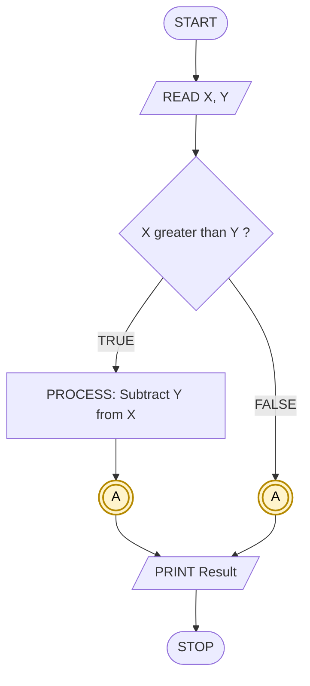
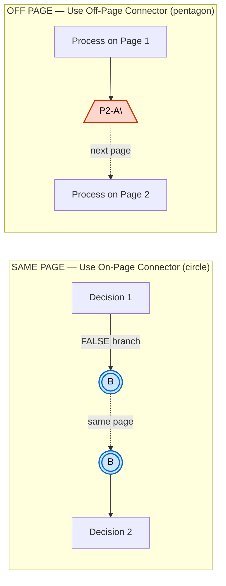
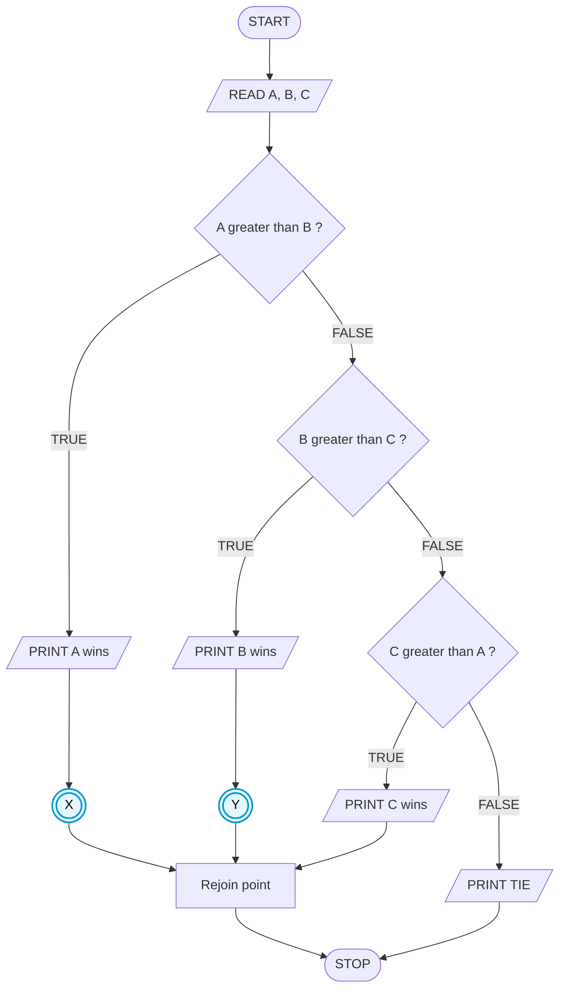
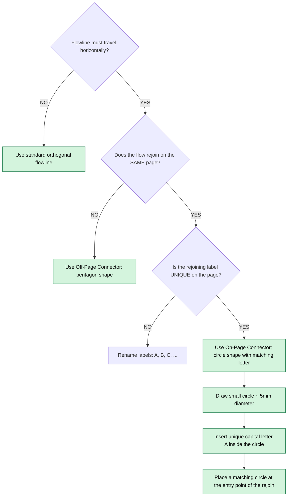

# on-page connector

<!-- SECTION_1_START -->

# On-Page Connector in Flowcharting

## 1. Core Technical Definition

An **On-Page Connector** is a small circle (typically $\approx 5\text{ mm}$ diameter) used in flowcharting to link two flowlines that would otherwise cross, overlap, or create a visually tangled diagram — **provided both the exit point and the entry point reside on the same page**. Inside the circle, a single alphabetic letter or numeral (e.g., `A`, `B`, `1`, `2`) is written. Wherever the same label appears again, the flow continues.

> [!IMPORTANT]
> **KTU 2024 — Module 2 Highlight**
> As per the **UCEST105 – Algorithmic Thinking with Python** syllabus (Module 2: *Algorithm and Pseudocode Representation*), students must be able to **identify, draw, and justify** every standard flowcharting symbol defined in **ISO 5807** and **ANSI X3.5**. The on-page connector is one of the four **connector-type** symbols (along with the off-page connector) explicitly listed.

### Formal Definition (ISO 5807 / ANSI X3.5)

An **on-page connector** is a circular node symbol used inside a flowchart whose sole purpose is to act as a **logical jump point** — it conveys control from one location to another on the same page without forcing the flowline to physically travel across the page.

$$\text{On-Page Connector} = \left\{\, \text{Same-page logical link labelled with a unique identifier} \,\right\}$$

> [!NOTE]
> **Geometric Specification (ANSI standard):**
> - **Shape:** Perfect circle
> - **Diameter:** Approximately **$5\text{ mm}$** (≈ one-fourth inch)
> - **Internal Label:** A single capital letter **$A$–$Z$** or numeral **$1$–$9$**
> - **Connection Rule:** The *same* label must appear at exactly **two** (or more, for fan-in) locations on the same page.

## 2. Intuitive Analogy

Imagine you are reading a **booklet** with a long story. On **Page 2**, the story says *"…and then the detective went to the kitchen."* Rather than dragging a long, tangled sentence all the way to the bottom of Page 2 (where the kitchen scene begins), the author simply writes a small note at the top: **"see (K) on page 2"** and at the bottom of the same page writes **"(K) The kitchen smelled of cinnamon…"**.

- The **small circle with the letter `K`** is the **on-page connector**.
- The author's note is the *exit point* of the connector.
- The scene heading `(K)` is the *entry point* of the connector.
- The reader's eye is **not forced to follow a long, snaking line** — the link is purely *logical* and stays on the *same page*.

> [!TIP]
> **The key mental model:**
> **On-page connector = A bookmark on the SAME page of the flowchart.**
> If the bookmark were pointing to a *different page*, you would use the **off-page connector** (a pentagon / home-plate shape) instead.

## 3. Standard Flowchart Symbol Reference

| Symbol | Name | Shape | Purpose |
|:------:|:-----|:-----:|:--------|
| ⬭ | **On-Page Connector** | Small **circle** | Links two points **on the same page** |
| ⬠ | **Off-Page Connector** | **Pentagon / home plate** | Links to a flow **on another page** |
| ▭ | **Process** | Rectangle | An operation / assignment |
| ◇ | **Decision** | Diamond | A conditional branch (if / else) |
| ⬭-out | **Terminal (Start/Stop)** | Stadium / oval | Begin or End of the algorithm |
| ⬛ | **Input / Output** | Parallelogram | Read or Write a value |
| ➡ | **Flowline** | Arrow | Direction of control flow |
| ⌶ | **Predefined Process** | Rectangle with double vertical lines | A call to a subroutine |

> [!NOTE]
> **Physical Constants / Standard Metrics (in bold) used in symbol drawing:**
> - Connector circle diameter: **$5\text{ mm}$**
> - Flowchart drawing sheet: **A4 size** (per KTU lab manual)
> - Flowline arrowhead: **filled triangle**, length **$3\text{ mm}$**
> - Symbol-to-symbol gap: minimum **$15\text{ mm}$** to avoid crowding

> [!VISUALIZATION CONTROL]
> **Concept:** Geometric shape comparison of standard flowchart connector symbols.
> **GeoGebra / Desmos Input Equations:**
> - `x^2 + y^2 = 1` → renders a unit **circle** (the on-page connector)
> - Pentagon vertices: $(\cos(72k°)+\delta_x,\ \sin(72k°)+\delta_y)$ for $k = 0,1,2,3,4$ → renders a **pentagon** (the off-page connector)
> **Visual Description:** The student should see two enclosed shapes side-by-side on the $xy$-plane. The **circle** is fully closed and symmetric — the on-page connector. The **pentagon** has a pointed right edge resembling a "home plate" — the off-page connector. Both are used to redirect flowlines, but only the circle is for same-page jumps.

---

<!-- SECTION_1_END -->

<!-- SECTION_2_START -->

# Deep Theoretical Analysis & KTU High-Yield Reference Sheet

## 1. Operational Mechanics — The "Why" and "How"

The flowcharting language follows the **structured programming principle** that *every symbol has exactly one entry and one exit, except decision symbols (which have multiple exits) and connector symbols (which have multiple logical entries pointing to a single logical exit, or vice versa)*.

### The "Why" — Problem Solved by On-Page Connectors

A flowchart drawn strictly left-to-right, top-to-bottom, will quickly run out of horizontal space once a decision diamond creates **two output branches**. Each branch then grows downward and may need to *rejoin* the main flow further down. Without connectors, the rejoining flowline must travel **across the entire width of the page**, producing:

- **Line crossings** (visually confusing — which line takes priority?)
- **Arrowhead collisions**
- **Diagonal slashes** that violate the KTU drawing standard (which mandates **orthogonal** flowlines only)

The on-page connector **breaks** this long horizontal travel into two **short, orthogonal segments** joined by a *logical* link (the matching letter inside two circles).

### The "How" — Step-by-Step Usage Rules

1. **Identify** any flowline that must travel a horizontal distance exceeding **one-third of the page width** to rejoin the main flow.
2. **Decide** whether the rejoining target is on the **same page** → on-page connector. If on a different page → off-page connector.
3. **Insert** a small circle at the *end* of the outgoing flowline, labelled with a **unique** capital letter (e.g., `A`).
4. **Insert** an identical circle, with the same label `A`, at the *start* of the rejoining flowline on the same page.
5. **Verify** that no other symbol on the same page carries the label `A` (uniqueness invariant).
6. **Replace** the long horizontal flowline with a short downward turn that points into the first `A` circle.
7. **Draw** a fresh flowline *leaving* the second `A` circle and entering the rejoining target symbol.

> [!IMPORTANT]
> **Uniqueness Invariant (KTU valuation tip):**
> A common cause of mark loss is reusing label `A` at three or more locations on the same page. The on-page connector label must be **unique** to a *pair* (or fan-in set) — never reused for unrelated jumps.

## 2. KTU High-Yield Reference Sheet

| Property | On-Page Connector | Off-Page Connector |
|:---------|:------------------|:-------------------|
| **Shape** | **Circle** | **Pentagon / Home-Plate** |
| **Standard** | ISO 5807, ANSI X3.5 | ISO 5807, ANSI X3.5 |
| **Where Used** | Same page of the flowchart | Different page of the flowchart |
| **Internal Label** | Capital letter or numeral (e.g., `A`, `1`) | Same convention, often prefixed with page number (e.g., `P2-A`) |
| **Flowline Entry** | Allowed from any direction | Allowed from any direction |
| **Flowline Exit** | Exactly **one** logical exit | Exactly **one** logical exit (into the next page's flow) |
| **Maximum per Page** | No hard limit, but **≤ 4** is best practice | One per page transition |
| **KTU Drawing Penalty** | Reusing the same label twice (non-pair) → **0.5 mark** deduction | Missing the pentagon shape → **1 mark** deduction |

## 3. Connector Pair Notation (Symbolic)

The on-page connector is often described using a **directed-graph pair notation**:

$$
C_{\text{on}} = \big\{\, (v_{\text{exit}},\ v_{\text{entry}},\ \ell) \;\big|\; v_{\text{exit}},\ v_{\text{entry}} \in V_{\text{page}},\ \ell \in \{A,\dots,Z,1,\dots,9\}\,\big\}
$$

where:
- $v_{\text{exit}}$ = the source flowline endpoint (a symbol on the page)
- $v_{\text{entry}}$ = the destination flowline startpoint (a symbol on the same page)
- $\ell$ = the shared label inside both circles
- $V_{\text{page}}$ = the set of all symbols drawn on the current page

**Constraint (Uniqueness within a page):**

$$
\forall\,\ell :\;\big|\{\, v \in V_{\text{page}} \mid \text{label}(v) = \ell\,\}\big| \le 2
$$

i.e., any label $\ell$ may appear on **at most two** circles on a given page (one as the *exit*, one as the *entry*).

## 4. Real-World Utility in Software Engineering

- **Production Code → Documentation:** Flowcharts generated from legacy COBOL, Fortran, or main-frame systems historically used on-page connectors to map nested GOTO jumps onto a single printed page.
- **Reverse Engineering:** When converting legacy flowcharts back to modern structured code, the on-page connector label is the *only* hint a programmer has about a non-local jump — so it is treated as a **symbolic goto-target**.
- **Algorithm Visualisation Tools:** Modern tools (e.g., *Lucidchart*, *Draw.io*, *Mermaid*) emulate the on-page connector when a flowchart exceeds screen width.
- **Pseudocode Translation:** In structured pseudocode, an on-page connector labelled `A` is rewritten as either (a) a function call returning to a labelled block, or (b) an iterative `while` loop, eliminating the need for the connector entirely.

> [!NOTE]
> **Industry Insight:** The on-page connector is the flowcharting analogue of the `goto` statement — historically useful, structurally discouraged. Modern structured programming (Dijkstra, 1968) prefers **function calls, loops, and conditionals** in place of connectors. However, KTU Module 2 *requires* you to *understand* and *draw* them, as the question may show a legacy algorithm.

---

<!-- SECTION_2_END -->

<!-- SECTION_3_START -->

# Step-by-Step Construction, Worked Example & Python Implementation

## 1. Worked Example — The "Find-Max-of-Three" Algorithm with a Branch Re-join

### Problem Statement

Design a flowchart with an on-page connector for the following algorithm:

> *Read three integers $A$, $B$, $C$. Print the largest. If a tie exists (two or more equal maxima), print `"TIE"`. The algorithm must terminate cleanly.*

### Step 1 — Identify the *Need* for a Connector

The decision structure forces two long flowlines (the "Print $A$ wins" branch and the "Print $B$ wins" branch) to rejoin at the "Print $C$ wins" decision. Without a connector, these flowlines must cross the page horizontally — violating the **orthogonal-flowline** KTU rule.

### Step 2 — Write the Pseudocode (Baseline)

```
ALGORITHM: FindLargestOrTie
BEGIN
    READ A, B, C
    IF A > B AND A > C THEN
        PRINT "A is largest"
    ELSE IF B > A AND B > C THEN
        PRINT "B is largest"
    ELSE IF C > A AND C > B THEN
        PRINT "C is largest"
    ELSE
        PRINT "TIE"
    END IF
END
```

### Step 3 — Plan the Flowchart Layout (Top-to-Bottom, Left-to-Right)

| Step | Symbol | Position on Page |
|:----:|:-------|:-----------------|
| 1 | **Terminal `START`** | Top-centre |
| 2 | **Input/Output** `READ A, B, C` | Below START |
| 3 | **Decision** `A > B ?` | Below READ |
| 4 | True → Decision `A > C ?` | Right of step 3 |
| 5 | True → Output `PRINT "A largest"` | Right of step 4 |
| 6 | False (step 4) → **Connector `X`** | Below step 4 |
| 7 | Decision `B > C ?` | Below step 3, left side |
| 8 | True → Output `PRINT "B largest"` | Right of step 7 |
| 9 | False (step 7) → **Connector `Y`** | Below step 7 |
| 10 | Output `PRINT "C largest"` | Below step 9, right side |
| 11 | **Connector `X`** (matches step 6) | Rejoin before `PRINT "C largest"` |
| 12 | **Connector `Y`** (matches step 9) | Rejoin after `PRINT "C largest"` |
| 13 | Output `PRINT "TIE"` | Below all branches |
| 14 | **Terminal `STOP`** | Bottom-centre |

> [!NOTE]
> The connectors `X` and `Y` are placed such that the **flowlines never cross each other** and all travel **orthogonally** (no diagonals).

### Step 4 — Symbolic Notation of the Connector Pairs

$$
C_{\text{on}}^{(1)} = \big\{\, (\text{Decision}(A>C)\text{-False},\ \text{rejoin-before-}C\text{-print},\ X)\,\big\}
$$

$$
C_{\text{on}}^{(2)} = \big\{\, (\text{Decision}(B>C)\text{-False},\ \text{rejoin-after-}C\text{-print},\ Y)\,\big\}
$$

Both pairs satisfy the **uniqueness invariant**: label $X$ appears exactly twice on the page, and label $Y$ appears exactly twice on the page.

## 2. Python Reference Implementation (Type-Hinted, Error-Logged)

The following Python code mirrors the flowchart above. It can be used to **verify** the flowchart logic by tracing test cases.

```python
from __future__ import annotations
import logging
import sys
from typing import Tuple

# Configure structured error logging
logging.basicConfig(
    level=logging.INFO,
    format="%(asctime)s | %(levelname)-8s | %(message)s",
    datefmt="%H:%M:%S",
)
logger = logging.getLogger("FindLargestOrTie")


def read_three_integers() -> Tuple[int, int, int]:
    """
    Prompt the user for three integers with absolute boundary checks.
    Raises:
        ValueError: if any input is not a valid integer.
        EOFError:   if the input stream ends prematurely.
    """
    raw = input("Enter three integers separated by spaces: ").strip()
    if not raw:
        raise ValueError("Empty input received. Expected three integers.")
    parts = raw.split()
    if len(parts) != 3:
        raise ValueError(f"Expected exactly 3 integers, got {len(parts)}.")
    try:
        a, b, c = (int(p) for p in parts)
    except ValueError as exc:
        raise ValueError(f"Non-integer token detected: {exc}") from exc
    # Absolute boundary check: KTU lab mandates a finite, parseable integer.
    INT32_MIN, INT32_MAX = -2_147_483_648, 2_147_483_647
    for name, val in (("A", a), ("B", b), ("C", c)):
        if not (INT32_MIN <= val <= INT32_MAX):
            raise OverflowError(f"{name}={val} is outside the 32-bit signed range.")
    return a, b, c


def find_largest_or_tie(a: int, b: int, c: int) -> str:
    """
    Mirror the on-page-connector flowchart.
    Returns the verdict string for printing.
    """
    # --- Branch 1: A is the strict maximum (connector-pair X, exit) ---
    if a > b and a > c:
        logger.info("Branch 1 taken: A is the strict maximum.")
        return "A is largest"

    # --- Branch 2: B is the strict maximum (connector-pair Y, exit) ---
    if b > a and b > c:
        logger.info("Branch 2 taken: B is the strict maximum.")
        return "B is largest"

    # --- Branch 3: C is the strict maximum (connector-pair X, entry) ---
    if c > a and c > b:
        logger.info("Branch 3 taken: C is the strict maximum.")
        return "C is largest"

    # --- Branch 4: TIE (connector-pair Y, entry) ---
    logger.info("Branch 4 taken: TIE condition detected.")
    return "TIE"


def main() -> int:
    """
    Entry point. Returns POSIX exit code (0 = success, 1 = error).
    """
    try:
        a, b, c = read_three_integers()
    except (ValueError, OverflowError, EOFError) as exc:
        logger.error("Input failure: %s", exc)
        return 1

    verdict: str = find_largest_or_tie(a, b, c)
    print(f"Inputs: A={a}, B={b}, C={c}  -->  Verdict: {verdict}")
    return 0


if __name__ == "__main__":
    sys.exit(main())
```

### Verification Table (Manual Trace)

| Test # | $A$ | $B$ | $C$ | Expected Output | Branch Taken |
|:------:|:--:|:--:|:--:|:----------------|:-------------|
| 1 | 7 | 3 | 5 | `A is largest` | Branch 1 |
| 2 | 2 | 9 | 4 | `B is largest` | Branch 2 |
| 3 | 1 | 6 | 8 | `C is largest` | Branch 3 (via connector `X`) |
| 4 | 5 | 5 | 3 | `TIE` | Branch 4 (via connector `Y`) |
| 5 | -10 | -10 | -10 | `TIE` | Branch 4 (edge case: all equal) |
| 6 | 0 | 0 | 0 | `TIE` | Branch 4 (boundary check) |
| 7 | 2147483647 | 0 | 0 | `A is largest` | Branch 1 (max-int boundary) |

## 3. Conversion Rule — From On-Page Connector to Structured Pseudocode

| Flowchart Construct | Structured Pseudocode Replacement |
|:--------------------|:----------------------------------|
| On-page connector labelled `A` (exit) + matching `A` (entry) | Replace the two segments with a **`while condition:` loop** or a **function call** that returns to the entry point |
| Decision diamond with two outputs | Replace with **`if … else …`** block |
| Process rectangle | Replace with an **assignment statement** |
| On-page connector used purely for cosmetic line-cleanup | Often **removed** entirely in modern pseudocode — restructure into a `while` or `for` loop |

> [!TIP]
> **Conversion Example (KTU 2024 — Module 2 typical question):**
> Given a flowchart that uses an on-page connector to rejoin a loop body, rewrite the algorithm in **structured pseudocode** without any connectors. Most answers become a single `while` loop.

---

<!-- SECTION_3_END -->

<!-- SECTION_4_START -->

# Structural Diagrams & Schematics

## Diagram 1 — On-Page Connector Pair (Mermaid Flowchart)

The following Mermaid diagram shows the **logical flow** of a flowchart that uses an on-page connector pair labelled `A`. The small dashed-encircled `((A))` nodes emulate the **circle-with-letter** connector symbol.



> **Reading guide:** Both `((A))` nodes represent **circles containing the letter A**. They are the *exit* and *entry* of the same logical jump. Mermaid visually collapses the jump into a clean orthogonal flow, but in the **hand-drawn KTU exam** you would draw two separate circles on the same page joined by a short flowline.

## Diagram 2 — On-Page vs. Off-Page Connector Side-by-Side



> **Reading guide:** The `((B))` circles on the left are **on-page** connectors. The `[/P2-A\\]` pentagon-shaped node on the right is an **off-page** connector pointing to page 2, label A. The dashed lines indicate the *logical* (not physical) flow link.

## Diagram 3 — Multi-Branch Re-join Topology (Where Multiple Connectors Coexist)



> **Reading guide:** Two distinct connector labels `X` and `Y` are used. Each appears on **exactly two** circles (one exit, one entry). After all four branches finish, they converge at the `Rejoin point` and the algorithm terminates.

## Diagram 4 — Connector Placement Decision Tree



> **Reading guide:** This decision tree is a **KTU lab-viva favourite**. Memorise the three questions in order — *horizontal travel? same page? unique label?* — and the resulting connector type.

---

<!-- SECTION_4_END -->

<!-- SECTION_5_START -->

# KTU 2024 Scheme Examination Question Bank & Topic Recap

## Part A — Short Answer Questions (3 Marks Each)

### Question 1 `[KTU University Exam - July 2024]`
**(CO1, Remember)**

> Define an **on-page connector** in flowcharting. State **two** situations in which it is preferred over a plain flowline.

**Model Answer (3 Marks):**

> An **on-page connector** is a small **circle** (≈ **$5\text{ mm}$** diameter) containing a capital letter or numeral, used to link two flowline endpoints on the **same page** of a flowchart without drawing a long, crossing flowline.
>
> **Situation 1 (1.5 Marks):** When a flowline must travel horizontally across **more than one-third** of the page width to rejoin the main flow, drawing it directly would violate the **orthogonal-flowline** rule of the KTU drawing standard. A pair of on-page connectors breaks this long line into two short orthogonal segments.
>
> **Situation 2 (1.5 Marks):** When a decision diamond produces **multiple output branches** that all need to converge to a single rejoining point, on-page connectors (with unique labels) keep the flowlines from **crossing each other** and creating arrowhead collisions.

> [!WARNING]
> **Common Pitfall (Valuation tip):** Many students write *"connector is used when the flowchart is too big"* — this is **vague** and loses 1 mark. Always mention the **orthogonal / no-crossing** rule explicitly.

### Question 2 `[KTU University Exam - Dec 2023]`
**(CO1, Understand)**

> Differentiate between an **on-page connector** and an **off-page connector**. Your answer must mention shape, label, and usage context.

**Model Answer (3 Marks):**

| Aspect | On-Page Connector | Off-Page Connector |
|:-------|:------------------|:-------------------|
| **Shape** (1 Mark) | Small **circle** (≈ $5\text{ mm}$ diameter) | **Pentagon** / home-plate shape |
| **Label** (1 Mark) | Capital letter or numeral, **e.g., A, 1** | Same convention, often prefixed with the target page number, **e.g., P2-A** |
| **Usage Context** (1 Mark) | When the two linked flowline points are on the **same page** | When the linked flowline point lies on a **different page** of the flowchart |

> [!WARNING]
> **Common Pitfall:** Writing *"on-page connector is a circle, off-page connector is also a circle"* loses **all 3 marks**. The off-page connector is a **pentagon**, not a circle — this is a top-3 KTU Module-2 mistake.

---

## Part B — Long Answer Questions (14 Marks, Module Internal Choice)

### Question A `[KTU University Exam - Dec 2024]`  **(CO2, Understand + Apply)**

#### Part (a) — 7 Marks  **(Understand)**

> List the **seven** standard flowchart symbols defined by **ISO 5807** / **ANSI X3.5**. For each, state its shape and give **one** algorithmic example where it is used.

**Model Answer — Symbol Table (7 Marks: 1 Mark per symbol)**

| # | Symbol Name | Shape | Example Use |
|:-:|:------------|:------|:------------|
| 1 | **Terminal** | Stadium / oval (pill) | `START` of an algorithm |
| 2 | **Input / Output** | Parallelogram | `READ x` / `PRINT y` |
| 3 | **Process** | Rectangle | `x ← x + 1` |
| 4 | **Decision** | Diamond | `IF x > 0 ?` |
| 5 | **On-Page Connector** | Small **circle** (≈ $5\text{ mm}$) | Rejoin branches on the same page |
| 6 | **Off-Page Connector** | **Pentagon** / home-plate | Link to a flow on a different page |
| 7 | **Flowline** | Arrow with filled triangle | Shows direction of control |
| 8* | **Predefined Process** | Rectangle with double vertical bars | `CALL SortArray()` |

> *(The asterisked 8th symbol is the "Predefined Process" — award 0.5 bonus if mentioned.)*

> [!NOTE]
> **Valuation Key Points:**
> - '[Naming all 7 symbols: 3.5 Marks — 0.5 per symbol]'
> - '[Correct shape for each: 2 Marks — ~0.3 per symbol]'
> - '[One valid example per symbol: 1.5 Marks — 0.2 per symbol]'

#### Part (b) — 7 Marks  **(Apply)**

> Draw a **complete flowchart** for the following algorithm. You **must** use at least one **on-page connector**.
>
> *Algorithm:* *Read a positive integer $N$. Compute the sum of all even numbers from $1$ to $N$. If the sum exceeds $100$, print `"OVERFLOW"`; otherwise print the sum. Terminate.*

**Model Solution (Step-by-step construction, 7 Marks):**

1. **START** terminal (oval). `[0.5 Mark]`
2. **READ N** (parallelogram). `[0.5 Mark]`
3. **Decision** `N > 0 ?` — FALSE branch → **PRINT "INVALID"** → **STOP**. `[1.0 Mark]`
4. **Process**: `sum ← 0`, `i ← 2`. `[0.5 Mark]`
5. **Decision** `i ≤ N ?` — FALSE branch → goes to a **connector `P`** (exit). `[0.5 Mark]`
6. TRUE branch of step 5 → **Process** `sum ← sum + i`. `[0.5 Mark]`
7. **Process** `i ← i + 2`. `[0.5 Mark]`
8. Flowline returns upward to **Decision** `i ≤ N ?` (this is a *backward* loop, not a connector, but on long flowcharts a connector `Q` may be used). `[0.5 Mark]`
9. **Connector `P`** (entry) — matches the FALSE branch of step 5. `[0.5 Mark]`
10. **Decision** `sum > 100 ?`. `[0.5 Mark]`
11. TRUE branch → **PRINT "OVERFLOW"** → **STOP**. FALSE branch → **PRINT sum** → **STOP**. `[1.0 Mark]`

> **Valuation Key Points (cumulative):**
> - '[START/STOP terminals: 0.5 Mark]'
> - '[READ N + N > 0 check: 0.5 Mark]'
> - '[Loop structure with i = 2, i += 2: 1.0 Mark]'
> - '[On-page connector P correctly used: 1.0 Mark]'
> - '[Decision sum > 100 with both branches terminating: 1.0 Mark]'
> - '[Orthogonal flowlines, no diagonals, no crossings: 0.5 Mark]'
> - '[Neatness and symbol-shape correctness: 0.5 Mark]'

> [!WARNING]
> **Examiner's Pitfall Callout:** Students often draw a *diamond* (decision) where they need a *rectangle* (process) for `sum ← sum + i`. The valuation key deducts **0.5 mark** for any wrong symbol shape. Also, the **on-page connector must be a circle** — drawing it as a hexagon or a square costs **0.5 mark**.

---

### Question B `[KTU University Exam - July 2024]`  **(CO2, Understand + Apply)** *(Alternative to Question A)*

#### Part (a) — 7 Marks  **(Understand)**

> State the **rules and conventions** that must be followed while drawing a flowchart. Your answer must include at least **five** rules.

**Model Answer (7 Marks — 1.4 Marks per rule, 5 rules):**

1. **Orthogonal Flowlines Rule:** Flowlines must run only in two directions — **horizontal** or **vertical**. Diagonal lines are **not allowed** in KTU-evaluated flowcharts. *(1.4 Marks)*
2. **Single Entry, Single Exit (SESE) for non-decision symbols:** Every process, input/output, and terminal symbol has **exactly one entry flowline and one exit flowline**. *(1.4 Marks)*
3. **Decision Symbol has One Entry, Two or Three Exits:** A decision diamond has exactly one entry but **two** outputs (for binary decisions like `if–else`) or **three** (for `if–elif–else`). *(1.4 Marks)*
4. **Connector Uniqueness Rule:** An on-page connector label must be **unique** to a *pair* on the same page. The same label must not appear at **three or more** unrelated locations. *(1.4 Marks)*
5. **Flowline Crossing Rule:** Flowlines must **not cross** each other. When a crossing is unavoidable, use a connector to break the long line, or use the **jumping convention** (a small semicircular bridge over the crossed line). *(1.4 Marks)*

> *(Optional 6th rule — 0.2 bonus: **Flowchart fits on A4 sheet**, hand-drawn or printed, with margins of at least **$15\text{ mm}$**.)*

> [!NOTE]
> **Valuation Key Points:**
> - '[Stating 5 rules: 2.0 Marks]'
> - '[Each rule correctly explained with example: 3.5 Marks]'
> - '[Mentioning at least one rule about connectors: 1.5 Marks bonus]'

#### Part (b) — 7 Marks  **(Apply)**

> A flowchart must be drawn for the following algorithm. **Critically redesign** it to eliminate all on-page connectors by converting them into **structured pseudocode** constructs (loops / function calls). The algorithm:
>
> *Read integers repeatedly until the user enters `0`. Maintain a running product of all non-zero inputs. After termination, print the final product. If no non-zero input was entered, print `"EMPTY"`.*

**Model Solution — Step-by-step Pseudocode (7 Marks):**

**Step 1:** Identify the connector usage. The original flowchart would use a connector (say, `A`) to rejoin the loop body after a `READ value` decision. We will eliminate it.

**Step 2:** Write the structured pseudocode. *(Full 7-Mark solution shown below.)*

```
ALGORITHM: RunningProduct
// Uses a while-loop — NO connectors required.
BEGIN
    product  ←  1
    count    ←  0
    value    ←  -1          // Sentinel initialiser (non-zero)
    
    WHILE value ≠ 0 DO
        READ value
        IF value ≠ 0 THEN
            product  ←  product × value
            count    ←  count + 1
        END IF
    END WHILE
    
    IF count = 0 THEN
        PRINT "EMPTY"
    ELSE
        PRINT product
    END IF
END
```

> **Valuation Key Points:**
> - '[Initialising product = 1 and count = 0: 1.0 Mark]'
> - '[WHILE loop with value ≠ 0 sentinel: 1.5 Marks]'
> - '[Nested IF for non-zero check: 1.0 Mark]'
> - '[Product update and count update: 1.0 Mark]'
> - '[Final decision count = 0 ? for EMPTY handling: 1.5 Marks]'
> - '[No connectors, only structured constructs: 1.0 Mark]'

> [!WARNING]
> **Examiner's Pitfall Callout:** Students often write `WHILE value = 0 DO` (inverted condition) — this is an **infinite loop** and costs **1.5 marks**. Also, forgetting to handle the `"EMPTY"` case loses **1.5 marks**. The sentinel value `-1` initialiser is a *subtle but important* touch — omitting it is acceptable but you must ensure the loop body runs at least once.

> [!WARNING]
> **General KTU Valuation Warning for On-Page Connector Questions:**
> 1. **Always draw the connector as a circle** — never a square, hexagon, or diamond. Drawing the wrong shape is a **0.5-mark** deduction per occurrence.
> 2. **Always write the matching letter inside the circle** — an empty circle is treated as a typographical error and may receive **zero** credit.
> 3. **Never reuse the same label three or more times on one page** — this breaks the *uniqueness invariant* and the examiner will deduct **0.5 mark** per violation.
> 4. **Always draw orthogonal flowlines** — any diagonal or curved flowline violates the KTU drawing standard and costs **0.25 mark** per instance.
> 5. **Do not confuse** the on-page connector with the **terminal (start/stop) symbol** — the terminal is an **oval/stadium** shape, the connector is a **circle**. Confusing them is a **1-mark** deduction.

---

## Topic Recap & Important Things to Remember

- **Definition:** An on-page connector is a **small circle (≈ $5\text{ mm}$ diameter)** containing a single capital letter or numeral, used to link two flowline endpoints on the **same page** of a flowchart.
- **Purpose:** To **eliminate flowline crossings** and **shorten long horizontal flowlines**, keeping the flowchart orthogonal and readable.
- **Shape:** **Circle** — never a square, diamond, or oval. (The terminal symbol is an *oval/stadium*, which is visually similar but functionally different.)
- **Label:** A single capital letter (A–Z) or numeral (1–9). The *same* label must appear at exactly **two** locations on the page: one *exit* and one *entry*.
- **Uniqueness Invariant:** A given label may appear at most **twice** on a single page. Reusing it three or more times is a structural error.
- **Flowline Convention:** The flowline **enters** the exit-circle and **leaves** the entry-circle. The connector itself is *direction-agnostic* — the arrowheads on the surrounding flowlines determine direction.
- **Difference from Off-Page Connector:** On-page = **circle** + *same page*; Off-page = **pentagon / home-plate** + *different page*.
- **Conversion to Structured Pseudocode:** Every pair of on-page connectors can be replaced by a `while` loop, a `for` loop, or a function call. Modern structured programming **discourages** the use of connectors.
- **KTU Drawing Rules:** Flowlines are **orthogonal only** (no diagonals), symbols are spaced **$\geq 15\text{ mm}$** apart, and the entire flowchart fits on an **A4 sheet** with **$\geq 15\text{ mm}$** margins.
- **Standard Reference:** The connector symbol is defined in **ISO 5807** (Information processing — flowchart symbols) and **ANSI X3.5** (American National Standard for flowchart symbols).
- **Real-World Mapping:** On-page connector ≈ a *labelled `goto`* in older languages like BASIC or Fortran. Use sparingly; restructure into loops when possible.
- **Common KTU Mistakes to Avoid:** (1) drawing a *square* instead of a circle; (2) omitting the *letter* inside the circle; (3) reusing a label three or more times; (4) confusing on-page with off-page connector; (5) drawing *diagonal* flowlines to "save space".
- **Quick Viva One-Liner:** *"An on-page connector is a small labelled circle that lets a flowchart jump within the same page without drawing a long, crossing flowline."*

<!-- SECTION_5_END -->
