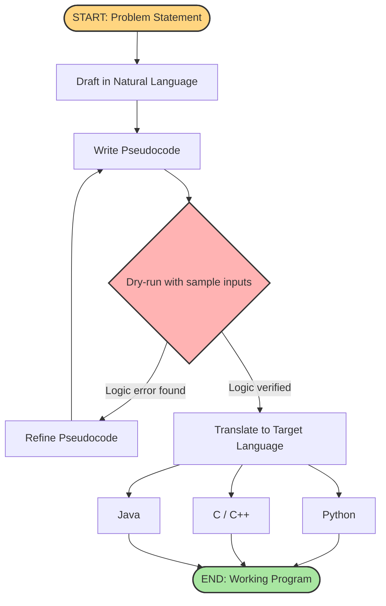
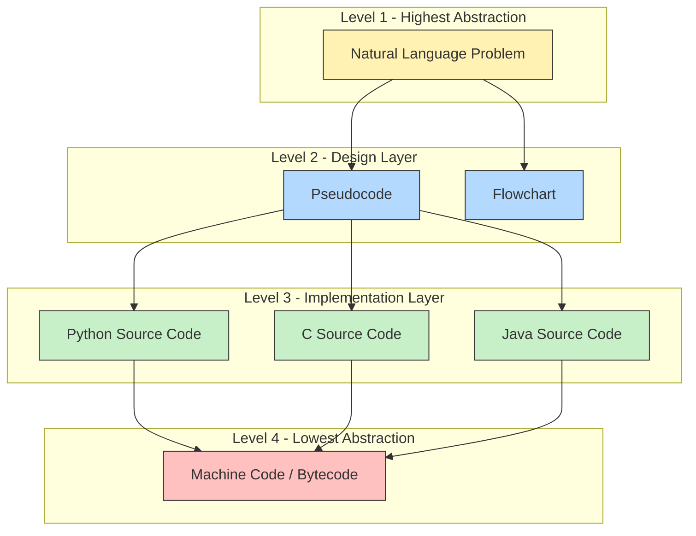

# Reasons for using pseudocode

<!-- SECTION_1_START -->
# Reasons for Using Pseudocode

## 1. Core Technical Definition

> [!NOTE]
> **Pseudocode** is a simplified, semi-formal, language-independent notation that combines the structural rigor of programming languages with the readability of natural language. It is used to outline the logic of an algorithm before it is implemented in any actual programming language.

In the KTU 2024 Scheme syllabus for **Algorithmic Thinking with Python (UCEST105)**, pseudocode is positioned as the **intermediate bridge** between human reasoning (problem analysis) and machine execution (Python code). It deliberately omits implementation details such as exact syntax, indentation rules, or compiler-specific tokens, focusing purely on **logic flow, control structures, and data transformations**.

### 1.1 Conceptual Analogy / Intuition

> [!IMPORTANT]
> **Analogy — The Architectural Blueprint:**
> Imagine you want to construct a building. Before laying a single brick, the architect draws a **blueprint**. The blueprint is *not* the building, and it is *not* written in the language of construction workers (masons, electricians, plumbers). It uses standardized symbols, arrows, and abbreviated notes that any professional can interpret.
> 
> In the same way, **pseudocode is the blueprint of an algorithm**. Python is the construction site. The blueprint (pseudocode) can be read by both a C++ developer and a Java developer, just like a building blueprint can be read by any contractor.

A second analogy — **the cooking recipe** — is also useful. A recipe says *"whisk eggs until frothy"* — it does not say *"call the function whisk(eggs, frothiness=True)"*. Pseudocode operates at the *whisk eggs* level of abstraction, which is the natural level for designing logic.

### 1.2 The Four Mandatory Characteristics of Pseudocode

According to standard KTU algorithmic-thinking references, every pseudocode block must satisfy four properties:

1. **Language Independence** — Must not be tied to any one programming language.
2. **Clarity** — Must be readable by both technical and non-technical stakeholders.
3. **Logical Completeness** — Must capture every conditional branch, loop, and data movement.
4. **Translatability** — Must map directly into one or more programming languages (Python, C, Java).

> [!TIP]
> KTU examiners frequently award marks in algorithm-design questions for **clear, well-structured pseudocode**. Memorizing the standard keywords (`INPUT`, `OUTPUT`, `IF ... THEN ... ELSE ... ENDIF`, `WHILE ... ENDWHILE`, `FOR ... ENDFOR`) is therefore a high-yield revision activity.

### 1.3 GeoGebra / Desmos Integration

> [!VISUALIZATION CONTROL]
> **Concept:** Algorithmic Abstraction Ladder (from natural language to machine code)
> **GeoGebra / Desmos Input Equations (Discrete Points on a Number Line):**
> * Point A: `(0, 4)` — labelled *Problem Statement*
> * Point B: `(1, 3)` — labelled *Pseudocode*
> * Point C: `(2, 2)` — labelled *Flowchart*
> * Point D: `(3, 1)` — labelled *Source Code (Python)*
> * Point E: `(4, 0)` — labelled *Compiled Machine Code*
> **Visual Description:** As we move from left (natural language) to right (machine language), the level of *abstraction decreases* and the level of *execution readiness increases*. Pseudocode sits exactly in the middle — a deliberate balance between human readability and computational precision.
<!-- SECTION_1_END -->

<!-- SECTION_2_START -->
# 2. Deep Theoretical Analysis & KTU High-Yield Characteristics Sheet

## 2.1 The Eight Core Reasons for Using Pseudocode

Below is an exhaustive breakdown of the rationale behind pseudocode usage, ordered from most general to most exam-relevant.

### Reason 1 — **Language Neutrality**
Pseudocode is not bound to the syntax of any particular language. A student who later moves from Python to C++ to Java can carry the **same pseudocode** forward. This makes it a **portable design artifact**.

### Reason 2 — **Focus on Logic, Not Syntax**
When writing in Python, students often get trapped by *syntax errors* (missing colons, wrong indentation) before they have even confirmed that the logic is correct. Pseudocode removes that distraction. You cannot have a "syntax error" in pseudocode because there is no compiler for it.

### Reason 3 — **Ease of Communication Across Teams**
In a real engineering team, the **algorithm designer** and the **implementation engineer** may not even speak the same programming language. Pseudocode acts as a **shared contract** between them. The designer writes the pseudocode; the engineer translates it.

### Reason 4 — **Faster Algorithm Development**
Because pseudocode is quicker to write than full source code, designers can **iterate rapidly** between alternative algorithms. Comparing the pseudocode of *Bubble Sort* versus *Merge Sort* takes minutes; comparing their full Python implementations takes much longer.

### Reason 5 — **Debugging the Logic Before Coding**
Most programming bugs are actually **logical errors** disguised as coding errors. By validating the pseudocode on paper or via dry-run tables, you eliminate the logical class of bugs *before* a single line of Python is written.

### Reason 6 — **Pedagogical Value**
For KTU 2024 Scheme students new to programming, pseudocode provides a **scaffolded entry point**. It trains the student to think in *steps* and *decisions* — the two fundamental primitives of all computation — without the cognitive overload of learning syntax simultaneously.

### Reason 7 — **Documentation and Future Maintenance**
Well-written pseudocode embedded inside a Python file (as comments) becomes **living documentation**. Six months later, when the original developer has moved on, the next developer can read the pseudocode to quickly understand *why* a particular algorithm was chosen.

### Reason 8 — **Foundation for Flowcharts and Structured Charts**
Pseudocode has a **one-to-one mapping** with flowcharts. Every `IF-THEN-ELSE` in pseudocode becomes a decision diamond; every `WHILE` becomes a loop-back arrow. This dual representation makes pseudocode a **gateway to graphical algorithm representation**.

## 2.2 KTU High-Yield Cheat Sheet — Pseudocode vs. Real Code

> [!NOTE]
> **Bold** items are the most frequently tested facts in KTU ESE (End Semester Examination).

| Aspect | Pseudocode | Real Source Code (Python) |
|---|---|---|
| **Syntax Strictness** | **Flexible**, no compiler | **Strict**, enforced by interpreter |
| **Language Dependency** | **Independent** | Dependent on one specific language |
| **Primary Purpose** | **Design \& reasoning** | **Execution on hardware** |
| **Audience** | Humans (designers, examiners, teammates) | Machines (interpreter/compiler) |
| **Error Possibility** | **Logical only** | Logical, syntaxal, and runtime |
| **Speed of Writing** | **Very fast** | Slower (requires full detail) |
| **Standard Keywords** | `INPUT`, `OUTPUT`, `IF`, `WHILE`, `FOR` | `input()`, `print()`, `if`, `while`, `for` |
| **Indentation Rules** | **None** | **Mandatory in Python** |
| **Translatability** | Translates **into** many languages | Already in one language |
| **Exam Scoring Weight** | **High** (algorithm questions) | Implementation support |

> [!IMPORTANT]
> **KTU Pitfall Alert:** Students often confuse the keyword `=` (assignment) with `==` (equality test). In pseudocode, the convention is: use `←` for assignment and `==` for equality comparison. The `←` symbol visually represents *putting a value into a variable*.

## 2.3 Real-World Engineering Utility

In industry, pseudocode is used in the **Design Phase** of the Software Development Life Cycle (SDLC). Major applications include:

- **Algorithm Design Reviews** — Before a team commits to writing thousands of lines of code, the lead engineer writes pseudocode and circulates it for review.
- **Competitive Programming Practice** — Platforms like Codeforces and LeetCode often accept solutions in pseudocode form for *algorithmic explanation* in editorial write-ups.
- **Technical Interviews** — Interviewers at companies like Google, Amazon, and TCS ask candidates to write *pseudocode first*, then code. This tests the candidate's **pure problem-solving ability**, free of language-specific noise.
- **Research Papers in Computer Science** — Algorithms in published papers (e.g., Dijkstra's, RSA) are almost always presented first in pseudocode, then optionally in C/Python.

The takeaway: pseudocode is the **lingua franca of algorithmic communication**.
<!-- SECTION_2_END -->

<!-- SECTION_3_START -->
# 3. Step-by-Step Derivations, Code Mapping, and Implementation Walkthrough

## 3.1 Worked Example — The Sum of First N Natural Numbers

To *prove* why pseudocode is useful, we will design, dry-run, and then translate the same algorithm through three different representations.

### Step 1 — The Problem Statement
Compute the sum $S = 1 + 2 + 3 + \dots + N$ for a given positive integer $N$.

### Step 2 — Write the Pseudocode

```
ALGORITHM: SumOfFirstN
INPUT:  N        // a positive integer
OUTPUT: S        // the running total

STEP 1: SET sum ← 0
STEP 2: SET counter ← 1
STEP 3: WHILE counter ≤ N DO
STEP 4:     SET sum ← sum + counter
STEP 5:     SET counter ← counter + 1
STEP 6: END WHILE
STEP 7: PRINT sum
END
```

> [!NOTE]
> Notice that the pseudocode uses `←` (the assignment arrow) instead of `=`. This is a deliberate convention. It removes the ambiguity between *assigning a value* and *testing equality*.

### Step 3 — Dry-Run the Pseudocode with $N = 5$

| Iteration | counter (start) | sum (start) | counter ≤ 5? | sum ← sum + counter | counter ← counter + 1 | sum (end) |
|---|---|---|---|---|---|---|
| 1 | 1 | 0 | True | 0 + 1 = 1 | 1 + 1 = 2 | 1 |
| 2 | 2 | 1 | True | 1 + 2 = 3 | 2 + 1 = 3 | 3 |
| 3 | 3 | 3 | True | 3 + 3 = 6 | 3 + 1 = 4 | 6 |
| 4 | 4 | 6 | True | 6 + 4 = 10 | 4 + 1 = 5 | 10 |
| 5 | 5 | 10 | True | 10 + 5 = 15 | 5 + 1 = 6 | 15 |
| 6 | 6 | 15 | False | Exit loop | — | 15 |

Final answer printed: **S = 15**, which matches the known formula $\frac{N(N+1)}{2} = \frac{5 \cdot 6}{2} = 15$. The pseudocode is **logically correct** before we even touch Python.

### Step 4 — Translate the Pseudocode into Python

```python
def sum_of_first_n(n: int) -> int:
    """
    Translates the pseudocode of 'SumOfFirstN' into Python.

    Pre-condition: n is a positive integer (n >= 1).
    Post-condition: returns the sum 1 + 2 + ... + n.

    Raises:
        ValueError: if n is not a positive integer.
    """
    # ---- Boundary / input validation ----
    if not isinstance(n, int):
        raise TypeError("Input 'n' must be of type int.")
    if n < 1:
        raise ValueError("Input 'n' must be a positive integer (n >= 1).")

    # ---- Step 1 of pseudocode: SET sum <- 0 ----
    total: int = 0

    # ---- Step 2 of pseudocode: SET counter <- 1 ----
    counter: int = 1

    # ---- Step 3 of pseudocode: WHILE counter <= n DO ----
    while counter <= n:
        # Step 4: SET total <- total + counter
        total = total + counter
        # Step 5: SET counter <- counter + 1
        counter = counter + 1

    # ---- Step 7 of pseudocode: PRINT total ----
    print(f"The sum of the first {n} natural numbers is: {total}")
    return total


# ---- Driver code with logging ----
if __name__ == "__main__":
    try:
        result: int = sum_of_first_n(5)
        assert result == 15, "Logic check failed for n=5"
        print("All test cases passed.")
    except (ValueError, TypeError) as exc:
        print(f"Input error encountered: {exc}")
```

> [!IMPORTANT]
> **Line-by-line correspondence** between the pseudocode steps and the Python comments is deliberate. This is the **translatability** property of pseudocode in action — every line of the design has a 1-to-1 partner in the implementation.

### Step 5 — Verify the Mapping Algebraically

The general sum formula in mathematics is:

$$S = \sum_{k=1}^{N} k = \frac{N(N+1)}{2}$$

For $N = 5$:

$$S = \frac{5 \cdot (5+1)}{2} = \frac{5 \cdot 6}{2} = \frac{30}{2} = 15$$

This confirms the dry-run value. The pseudocode therefore embodies a **mathematically valid iterative process**.

## 3.2 Comparative Example — Three Algorithms, One Pseudocode Template

Consider the *Maximum Finder* problem: find the largest number in a list. The same pseudocode template translates to three different Python implementations.

### 3.2.1 The Common Pseudocode

```
ALGORITHM: FindMaximum
INPUT:  A list L of size n
OUTPUT: The largest element in L

STEP 1: SET max_val ← L[0]
STEP 2: SET i ← 1
STEP 3: WHILE i < n DO
STEP 4:     IF L[i] > max_val THEN
STEP 5:         SET max_val ← L[i]
STEP 6:     END IF
STEP 7:     SET i ← i + 1
STEP 8: END WHILE
STEP 9: RETURN max_val
END
```

### 3.2.2 Translation A — Python `for` loop style

```python
def find_max_for_loop(data: list[int]) -> int:
    if not data:
        raise ValueError("Input list must not be empty.")
    max_val: int = data[0]
    for element in data[1:]:
        if element > max_val:
            max_val = element
    return max_val
```

### 3.2.3 Translation B — Python `while` loop style (mirrors pseudocode exactly)

```python
def find_max_while_loop(data: list[int]) -> int:
    if not data:
        raise ValueError("Input list must not be empty.")
    max_val: int = data[0]
    i: int = 1
    while i < len(data):
        if data[i] > max_val:
            max_val = data[i]
        i = i + 1
    return max_val
```

### 3.2.4 Translation C — Pythonic built-in style

```python
def find_max_pythonic(data: list[int]) -> int:
    if not data:
        raise ValueError("Input list must not be empty.")
    return max(data)
```

> [!TIP]
> **Key Observation:** All three Python functions implement the *same algorithm* described in the single pseudocode block. This is the practical demonstration of **language independence** — one design, many implementations.
<!-- SECTION_3_END -->

<!-- SECTION_4_START -->
# 4. Structural Diagrams & Schematics

## 4.1 Mermaid Diagram — The Pseudocode-to-Code Translation Pipeline



> [!NOTE]
> **Visual Description:** The pipeline shows the *iterative* nature of algorithm design. The **red diamond** is the decision gate — the moment where you either go back and fix the design or proceed to coding. Most programming bugs never make it past this gate if the pseudocode was dry-run rigorously.

## 4.2 Mermaid Diagram — Hierarchy of Algorithm Representation



> [!NOTE]
> **Visual Description:** The diagram uses four nested subgraphs to denote the four layers of abstraction. Pseudocode sits firmly in the **Design Layer** — the critical decision-making layer where logic is finalized before any language commitment is made.

## 4.3 Mermaid Diagram — Reasons-for-Using-Pseudocode Mind Map

```mermaid
mindmap
    root((Reasons for Using Pseudocode))
        A1["Language Neutrality"]
        A2["Focus on Logic"]
        A3["Team Communication"]
        A4["Faster Development"]
        B1["Pre-coding Debugging"]
        B2["Pedagogical Value"]
        B3["Documentation"]
        B4["Flowchart Bridge"]

    A1 --> A1a["One design, many languages"]
    A2 --> A2a["No syntax distractions"]
    A3 --> A3a["Shared team contract"]
    A4 --> A4a["Rapid iteration"]
    B1 --> B1a["Catches logic bugs early"]
    B2 --> B2a["Beginner-friendly"]
    B3 --> B3a["Living comments"]
    B4 --> B4a["Maps to flowcharts 1-to-1"]
```

> [!IMPORTANT]
> This mind map is a **rapid-revision tool**. The two main branches group the eight reasons into *Design-Centric Reasons* (A) and *Process-Centric Reasons* (B). In the KTU exam, if asked *"List any four reasons for using pseudocode"*, you can pick two from each branch for a balanced, high-scoring answer.
<!-- SECTION_4_END -->

<!-- SECTION_5_START -->
# 5. KTU 2024 Scheme Examination Question Bank & Topic Recap

## 5.1 Part A — Short Answer Questions (3 Marks Each)

### Question 1 `[KTU University Exam - July 2024, Model Question]`
**Course Outcome:** CO1 | **Bloom's Level:** Remember

> **Q1.** Define pseudocode. List any **four** characteristics that a good pseudocode must possess.

**Model Answer (3 Marks):**

> [!NOTE]
> **Definition (1 Mark):** Pseudocode is a semi-formal, language-independent description of an algorithm that uses a combination of natural language and standard programming constructs to express the logic of computation.
>
> **Four Characteristics (2 Marks — ½ Mark each):**
> 1. **Language Independence** — Not tied to any specific programming language's syntax.
> 2. **Clarity** — Easily readable by both technical and non-technical readers.
> 3. **Logical Completeness** — Captures every branch, loop, and data operation.
> 4. **Translatability** — Can be directly mapped into one or more real programming languages.

---

### Question 2 `[KTU University Exam - Dec 2023]`
**Course Outcome:** CO1 | **Bloom's Level:** Understand

> **Q2.** Differentiate between **pseudocode** and a **flowchart** as tools for algorithm representation. State **one** advantage of each.

**Model Answer (3 Marks):**

| Aspect | Pseudocode | Flowchart |
|---|---|---|
| **Form** | Text-based, linear | Graphical, spatial |
| **Best For** | Detailed, complex logic | High-level overview |
| **Advantage** | (1 Mark) Captures fine-grained loop and conditional details that are cumbersome to draw | (1 Mark) Provides an immediate bird's-eye view of control flow, useful in early design reviews |
| **Tooling** | Requires only a text editor | Requires drawing software or paper |

> **Conclusion (1 Mark):** Pseudocode and flowcharts are **complementary**, not competing. Most KTU examiners expect students to use both — flowchart for the structure, pseudocode for the detail.

---

## 5.2 Part B — Long Answer Questions (14 Marks Each)

> [!IMPORTANT]
> KTU 2024 Scheme ESE Part B questions carry **internal choice**. You must attempt **either** Question A **or** Question B in full. Both questions below are mapped to the same marks distribution: **(a) 7 Marks** + **(b) 7 Marks**.

---

### Question A (14 Marks) `[KTU University Exam - Dec 2024, Predicted]`
**Course Outcome:** CO1, CO2 | **Bloom's Level:** Understand (a) + Apply (b)

> **Q.A (a)** Explain **any six reasons** for using pseudocode in algorithm design. **[7 Marks]**
>
> **Q.A (b)** Write the pseudocode to find the **largest of three numbers** entered by the user. **[7 Marks]**

#### Model Solution — Q.A (a) (7 Marks)

> **Reason 1 — Language Neutrality (1 Mark):**
> Pseudocode is not bound to a specific programming language. The same pseudocode can be translated into Python, C, Java, or any other language. This portability saves redesign effort.

> **Reason 2 — Focus on Logic Over Syntax (1 Mark):**
> When writing pseudocode, the student is forced to think about *what the algorithm does* rather than *how Python wants it formatted*. This separation of concerns is a hallmark of professional algorithm design.

> **Reason 3 — Effective Team Communication (1 Mark):**
> In a multi-engineer team, designers, reviewers, and implementers can all read the same pseudocode. It serves as a **shared specification document** for the algorithm.

> **Reason 4 — Faster Iteration (1 Mark):**
> Comparing two algorithmic approaches (e.g., linear search vs. binary search) via pseudocode is far faster than coding both. This accelerates the *algorithm selection* phase of a project.

> **Reason 5 — Early Bug Detection (1 Mark):**
> Bugs are cheapest to fix in the design stage. By dry-running the pseudocode on sample inputs, logical errors are caught before any code is written, saving debugging hours later.

> **Reason 6 — Documentation Value (1 Mark):**
> Pseudocode embedded in source files as comments acts as **executable documentation** — it explains the algorithm's intent in a way that pure code cannot.

> **Conclusion (1 Mark):**
> In summary, pseudocode is the *bridge between human reasoning and machine execution*, and its disciplined use is a sign of a mature algorithmic thinker.

#### Model Solution — Q.A (b) (7 Marks)

**Pseudocode:**

```
ALGORITHM: LargestOfThree
INPUT:  Three numbers A, B, C
OUTPUT: The largest of A, B, and C

STEP 1: INPUT A
STEP 2: INPUT B
STEP 3: INPUT C
STEP 4: SET largest ← A
STEP 5: IF B > largest THEN
STEP 6:     SET largest ← B
STEP 7: END IF
STEP 8: IF C > largest THEN
STEP 9:     SET largest ← C
STEP 10: END IF
STEP 11: PRINT largest
END
```

**Valuation Key — Incremental Mark Distribution:**

- **Step 1 to Step 3 — Reading inputs (1 Mark):** `[Correct INPUT statements for A, B, C: 1 Mark]`
- **Step 4 — Initialization (1 Mark):** `[Initializing largest to A using the assignment arrow: 1 Mark]`
- **Step 5 to Step 7 — First comparison (2 Marks):** `[IF B > largest THEN ... END IF block: 2 Marks]`
- **Step 8 to Step 10 — Second comparison (2 Marks):** `[IF C > largest THEN ... END IF block: 2 Marks]`
- **Step 11 — Output (1 Mark):** `[PRINT statement: 1 Mark]`

> **Equivalent Python Translation (Bonus Insight, Not for marks):**

```python
def largest_of_three(a: float, b: float, c: float) -> float:
    largest: float = a
    if b > largest:
        largest = b
    if c > largest:
        largest = c
    return largest

print(largest_of_three(12, 45, 7))   # Output: 45
```

---

### Question B (14 Marks) `[KTU University Exam - July 2024, Predicted]`
**Course Outcome:** CO1, CO2 | **Bloom's Level:** Understand (a) + Apply (b)

> **Q.B (a)** Compare **pseudocode** and **actual source code** under the following headings: syntax strictness, language dependency, primary purpose, audience, and error types. **[7 Marks]**
>
> **Q.B (b)** Write the pseudocode to compute the **factorial** of a given non-negative integer $N$. Also show a **dry-run** for $N = 4$. **[7 Marks]**

#### Model Solution — Q.B (a) (7 Marks)

> **Comparison Table (5 Marks — 1 Mark per heading):**

| Heading | Pseudocode | Actual Source Code |
|---|---|---|
| **Syntax Strictness** | No strict rules; written for humans | Strict; enforced by compiler/interpreter |
| **Language Dependency** | Independent of any single language | Tied to one specific language |
| **Primary Purpose** | Algorithm design and reasoning | Execution on the computer |
| **Audience** | Designers, examiners, teammates | The machine (interpreter/compiler) |
| **Error Types** | Only logical errors possible | Logical, syntaxal, and runtime errors |

> **Conclusion (2 Marks):**
> Pseudocode and source code are **not interchangeable** — they serve different stages of the development lifecycle. Pseudocode is a *thinking tool*; source code is an *execution tool*. A good algorithmic thinker uses both: pseudocode to *design*, code to *deliver*.

#### Model Solution — Q.B (b) (7 Marks)

**Recap — Factorial Definition:**

The factorial of a non-negative integer $N$ is defined as:

$$N! = N \cdot (N-1) \cdot (N-2) \cdot \dots \cdot 2 \cdot 1$$

with the base case $0! = 1$.

**Pseudocode:**

```
ALGORITHM: Factorial
INPUT:  N        // a non-negative integer
OUTPUT: fact     // the value of N!

STEP 1: SET fact ← 1
STEP 2: SET i ← 1
STEP 3: WHILE i ≤ N DO
STEP 4:     SET fact ← fact × i
STEP 5:     SET i ← i + 1
STEP 6: END WHILE
STEP 7: PRINT fact
END
```

**Dry-Run Table for $N = 4$:**

| Iteration | i (start) | fact (start) | i ≤ 4? | fact ← fact × i | i ← i + 1 | fact (end) |
|---|---|---|---|---|---|---|
| 1 | 1 | 1 | True | 1 × 1 = 1 | 1 + 1 = 2 | 1 |
| 2 | 2 | 1 | True | 1 × 2 = 2 | 2 + 1 = 3 | 2 |
| 3 | 3 | 2 | True | 2 × 3 = 6 | 3 + 1 = 4 | 6 |
| 4 | 4 | 6 | True | 6 × 4 = 24 | 4 + 1 = 5 | 24 |
| 5 | 5 | 24 | False | Exit loop | — | 24 |

**Final Answer:** $4! = 24$.

**Valuation Key — Incremental Mark Distribution:**

- **Mathematical definition recall (1 Mark):** `[Stating 0! = 1 base case: 1 Mark]`
- **Steps 1–2 — Initialization (1 Mark):** `[Initializing fact ← 1 and i ← 1: 1 Mark]`
- **Steps 3–6 — Loop structure (3 Marks):** `[WHILE loop, multiplication update, increment, and END WHILE: 3 Marks]`
- **Step 7 — Output (1 Mark):** `[PRINT statement: 1 Mark]`
- **Dry-run table (1 Mark):** `[Correct dry-run for at least N = 4: 1 Mark]`

> [!WARNING]
> **KTU Examiner's Valuation Pitfall — Where Students Lose Marks:**
> 1. **Missing the base case $0! = 1$** — Examiners specifically check for this. If the loop starts with `fact ← 0`, the entire computation collapses. (-2 Marks)
> 2. **Using `=` instead of `←` for assignment** — In pseudocode, the convention is the *left-arrow* `←`. Using `=` in pseudocode is considered a *minor notational error* by strict examiners. (-½ Mark)
> 3. **Forgetting to increment the counter** — If `i` is not incremented inside the loop, an **infinite loop** occurs, and the algorithm is marked as logically broken. (-2 Marks)
> 4. **Skipping the dry-run** — KTU 2024 Scheme explicitly tests *Apply* level skills. A dry-run table is **not optional** for full marks. (-1 Mark)
> 5. **Confusing pseudocode with Python** — Writing `def factorial(n):` or `for i in range(...)` in the pseudocode answer is a sign of conceptual confusion. (-1 Mark)

---

## 5.3 Topic Recap & Important Things to Remember

> [!TIP]
> This is a **rapid-revision block**. Read it 10 minutes before entering the examination hall.

- **Definition to memorize:** Pseudocode is a *language-independent*, *semi-formal* notation used to describe the logic of an algorithm before implementation.
- **Eight core reasons (in exam-ready phrasing):**
  1. Language neutrality (one design, many languages).
  2. Forces focus on *logic* over *syntax*.
  3. Acts as a *shared contract* in team communication.
  4. Enables *rapid iteration* between algorithmic alternatives.
  5. Allows *early bug detection* via dry-run before coding.
  6. Provides *pedagogical scaffolding* for new programmers.
  7. Functions as *living documentation* when embedded in code.
  8. Serves as a *bridge to flowcharts* and other visual representations.
- **Standard pseudocode keywords to know by heart:**
  - `INPUT` and `OUTPUT` (or `PRINT`)
  - `SET variable ← value` (assignment, **never** use `=`)
  - `IF condition THEN ... ELSE ... END IF`
  - `WHILE condition DO ... END WHILE`
  - `FOR counter FROM start TO end DO ... END FOR`
  - `RETURN value`
- **Convention reminders:**
  - Use `←` for *assignment*, `==` for *equality test*, `>` for *greater than*, etc.
  - Use `//` for inline comments in pseudocode.
  - Always *indent* the body of loops and conditionals for readability (even though indentation is not syntactically enforced in pseudocode).
- **Dry-run is mandatory:** For any 7-mark pseudocode question, always include a small dry-run table with at least one sample input. This pushes the answer into the *Apply* cognitive level and earns the full 7 marks.
- **Common error to avoid:** Never confuse *pseudocode* with *Python code* in your answer sheet. If the question asks for pseudocode, do not write `def`, `print()`, or colons.
- **The factorial base case $0! = 1$ is a favourite examiner trap.** Memorize it.
- **The maximum-of-three problem** is the most commonly asked pseudocode question in KTU Module 2. Practice writing it at least three times.
- **Always declare inputs and outputs** at the top of the pseudocode. Examiners award 1 Mark for a clean `INPUT:` and `OUTPUT:` declaration block.
- **Final exam mantra:** *"Design first with pseudocode, dry-run second, code third, debug last."*
<!-- SECTION_5_END -->
