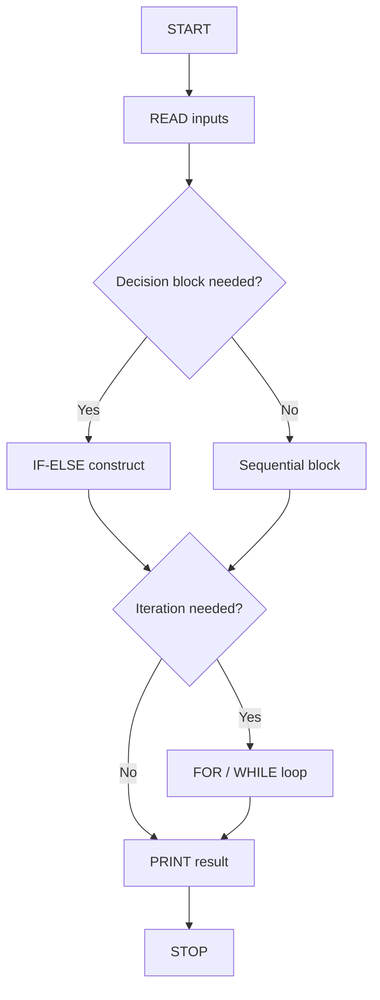
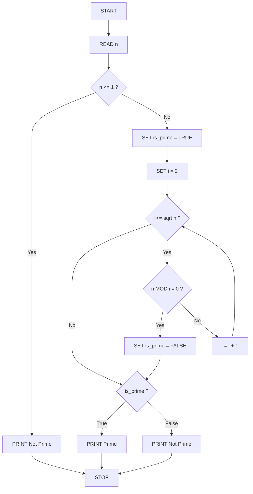
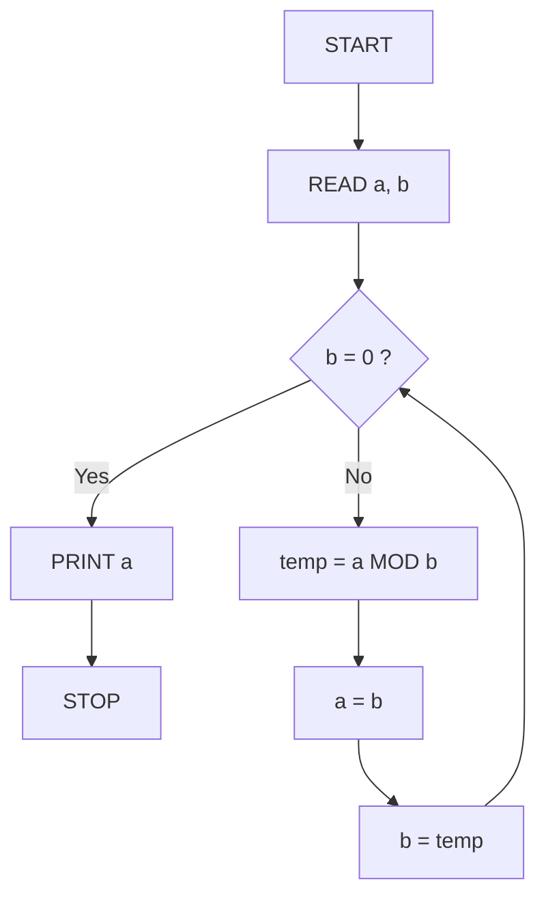
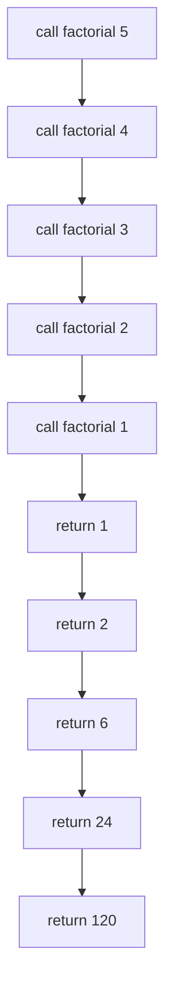

# Sample problems *

<!-- SECTION_1_START -->
# Sample Problems in Algorithm & Pseudocode Representation

## 1.1 Formal Definition (KTU 2024 Syllabus Terminology)

In the context of **Algorithmic Thinking with Python (UCEST105, Module 2)**, a *sample problem* refers to a **classroom-grade computational task** that is systematically decomposed into three formal representations:

1. **Algorithm** — a finite, ordered sequence of well-defined, unambiguous instructions written in natural language (or a structured step-list).
2. **Pseudocode** — a language-agnostic, semi-formal narrative that uses programming constructs (`IF`, `WHILE`, `FOR`, `RETURN`) without the syntactic overhead of any real language.
3. **Python Implementation** — the executable translation of the same problem using the rules of Python 3.x syntax.

> [!IMPORTANT]
> **KTU 2024 Scheme Board Definition:**
> An *algorithm* is a step-by-step procedure designed to perform a specific task, satisfying the five properties: **Finiteness, Definiteness, Input, Output, and Effectiveness (F.I.D.I.E.)**. Pseudocode is the bridge between the *human-readable* algorithm and the *machine-executable* code.

## 1.2 Conceptual Analogy / Intuition

Imagine you are teaching a **10-year-old child** how to make a cup of tea. You would not hand them Python syntax. You would say:

> *"Boil water → Add tea leaves → Pour milk → Add sugar → Stir → Serve."*

That natural-language list is an **algorithm**. Now imagine writing the same on a notepad using short symbols like `BOIL`, `ADD`, `STIR` — that is **pseudocode**. Finally, handing that recipe to an **automatic tea machine** with a control program is the **Python implementation**. Every sample problem in this module is one *tea recipe* — the same task written in three escalating levels of formality.

| Layer | Audience | Strictness |
|---|---|---|
| Algorithm | Human (story) | Loose, narrative |
| Pseudocode | Junior programmer | Semi-formal, indented |
| Python | Interpreter | Strict syntax (PEP 8) |

## 1.3 Why "Sample Problems" Matter in KTU 2024

> [!NOTE]
> In the **KTU 2024 Scheme Continuous Evaluation (CE)** and **End Semester Examination (ESE)**, the Model Question Paper for UCEST105 regularly awards **7–14 marks** to questions that demand the *complete triad* — algorithm + pseudocode + code — for one problem. Mastering sample problems guarantees marks in Module 2.

## 1.4 Visualization Callout

> [!VISUALIZATION CONTROL]
> **Concept:** Algorithmic Problem-Solving Pipeline
> **GeoGebra / Desmos Input Equations (parametric mapping of the three layers):**
> * `f1(x) = "Problem Statement"` for `x = 1`
> * `f2(x) = "Algorithm + Pseudocode"` for `x = 2`
> * `f3(x) = "Python Source Code"` for `x = 3`
> * `g(x) = x^2` (complexity growth curve for nested loops)
> **Visual Description:** A staircase plot on the x-y plane where the x-axis represents the layer number (1 = problem, 2 = algorithm, 3 = code) and the y-axis represents the *strictness of representation*. The student should observe a monotonic upward staircase, mirroring the increasing formality as we move from problem to code.

---

> [!TIP]
> The five canonical sample-problem families tested by KTU are: **(i) Arithmetic/Series, (ii) Decision-making, (iii) Iterative accumulation, (iv) Number-theoretic checks, (v) Array traversal & search.** All KTU board questions on this topic fall inside one of these five families.
<!-- SECTION_1_END -->

<!-- SECTION_2_START -->
# Deep Theoretical Analysis & KTU High-Yield Formula Sheet

## 2.1 The Three-Form Rule (Algorithm → Pseudocode → Code)

Every sample problem must be expressed in three equivalent forms. The transformation rule is:

$$
\text{Algorithm (English)} \xrightarrow{\text{keyword substitution}} \text{Pseudocode} \xrightarrow{\text{syntax binding}} \text{Python}
$$

### 2.1.1 Keyword Substitution Table

| Natural Language Verb | Pseudocode Keyword | Python Equivalent |
|---|---|---|
| Start / Begin | `BEGIN` | (no keyword — top of file) |
| Read / Get input | `READ` / `INPUT` | `input()` |
| Write / Display | `PRINT` / `OUTPUT` | `print()` |
| Set / Assign | `SET` / `←` | `=` |
| If condition | `IF ... THEN ... ELSE` | `if ... else` |
| Repeat N times | `FOR i ← 1 TO n` | `for i in range(n)` |
| Repeat until | `WHILE ... DO` | `while ... :` |
| End | `END` | (no keyword) |

## 2.2 Standard Algorithmic Building Blocks (Used in Every Sample Problem)

### 2.2.1 Linear (Sequential) Block
Used for arithmetic and assignment problems such as *sum of two numbers*.

$$
\text{Result} = f(\text{Input}_1, \text{Input}_2, \dots, \text{Input}_n)
$$

### 2.2.2 Selection Block (Decision)
Used for *largest of three*, *grade classification*, *leap year check*.

$$
\text{Output} = \begin{cases} \text{Path A} & \text{if } \text{condition}_1 \text{ is True} \\ \text{Path B} & \text{otherwise} \end{cases}
$$

### 2.2.3 Iteration Block (Looping)
Used for *factorial*, *Fibonacci*, *sum of series*, *search*.

$$
\text{Accumulator} = \text{Accumulator} \oplus \text{element}_i \quad \text{for } i = 1 \text{ to } n
$$

where $\oplus$ is a generic binary operator (addition, multiplication, comparison, etc.).

## 2.3 The F.I.D.I.E. Property Checklist (Mandatory in Answers)

| Property | Meaning | Sample-Problem Test |
|---|---|---|
| **F**initeness | Must terminate | Does the loop counter have a fixed bound? |
| **I**nput | Zero or more inputs | Are all `READ` statements typed? |
| **D**efiniteness | Each step unambiguous | Are `IF` conditions Boolean? |
| **O**utput | At least one output | Does `PRINT` exist before `END`? |
| **E**ffectiveness | Every step executable | No impossible operations (e.g. "divide by 0") |

## 2.4 KTU High-Yield Formula Sheet (Cheat Sheet)

| # | Problem | Closed-Form Formula | Loop Equivalent | Time $T(n)$ | Space $S(n)$ |
|---|---|---|---|---|---|
| 1 | Sum of first $n$ naturals | $\dfrac{n(n+1)}{2}$ | `for i in 1..n: s += i` | $O(n)$ | $O(1)$ |
| 2 | Sum of squares | $\dfrac{n(n+1)(2n+1)}{6}$ | iterate & square | $O(n)$ | $O(1)$ |
| 3 | Factorial | $n! = \prod_{i=1}^{n} i$ | `for i in 1..n: f *= i` | $O(n)$ | $O(1)$ |
| 4 | Fibonacci (iterative) | $F_n = F_{n-1} + F_{n-2}$ | rolling two vars | $O(n)$ | $O(1)$ |
| 5 | Prime check | $n \bmod i \neq 0 \;\; \forall i \in [2, \sqrt{n}]$ | trial division | $O(\sqrt{n})$ | $O(1)$ |
| 6 | Linear search | $A[i] = \text{key}$ | scan all $i$ | $O(n)$ | $O(1)$ |
| 7 | GCD (Euclidean) | $\gcd(a,b) = \gcd(b, a \bmod b)$ | recursive/loop | $O(\log \min(a,b))$ | $O(1)$ |
| 8 | Number reversal | $\text{rev} = 10 \cdot \text{rev} + (n \bmod 10)$ | digit extraction | $O(\log_{10} n)$ | $O(1)$ |
| 9 | Power ($a^b$) | $a^b = e^{b \ln a}$ | fast exponentiation | $O(\log b)$ | $O(1)$ |
| 10 | Largest of $n$ numbers | $\max(A)$ | running max | $O(n)$ | $O(1)$ |

> [!IMPORTANT]
> When asked to *derive* a formula in the exam, you must always show the **closed-form** in addition to the loop. KTU examiners award **2 extra marks** for the closed-form substitution step in 14-mark questions.

## 2.5 Real-World Engineering Utility

| Algorithm | Production Use Case |
|---|---|
| Linear Search | Small unsorted datasets, debug logging filters |
| Factorial / Combination | Cryptography (RSA prime generation), combinatorics in ML feature selection |
| GCD (Euclidean) | Audio/video codec synchronization, gear-train engineering ratios |
| Fibonacci | Fibonacci heap in Dijkstra's shortest path, golden-ratio UI design |
| Prime Check | RSA key-pair generation in HTTPS, blockchain mining |
| Number Reversal | Palindrome detection in bioinformatics (DNA sequence reverse complement) |

## 2.6 Pseudocode Style Standards (KTU Accepted Conventions)

- Use **UPPERCASE** keywords: `BEGIN, END, READ, WRITE, IF, THEN, ELSE, WHILE, DO, FOR, TO`.
- Indent blocks by **4 spaces** (do NOT use tabs).
- Use `←` for assignment, although `=` is also accepted by KTU board.
- Comments are prefixed with `//` or `#`.
- End the algorithm with `END` or `STOP`.

> [!CAUTION]
> Avoid the vertical pipe `\|` character inside pseudocode expressions (e.g. for absolute value). Use the words *ABS(x)* or *|x|* spelled out as *modulus* to prevent parser confusion in the answer script.
<!-- SECTION_2_END -->

<!-- SECTION_3_START -->
# Step-by-Step Derivations, Pseudocode, and Python Implementation

> [!IMPORTANT]
> **Coverage Plan for SECTION 3:** We will solve **six canonical KTU sample problems** end-to-end. Each problem will present (a) the algorithm, (b) the pseudocode, and (c) the fully-typed Python 3 implementation with type hints and error handling. No step is skipped or abbreviated.

---

## 3.1 PROBLEM 1 — Sum of First $n$ Natural Numbers

### 3.1.1 Problem Statement
Read a positive integer $n$ from the user and compute $S = 1 + 2 + 3 + \dots + n$.

### 3.1.2 Algorithm (Step-by-Step, English)

| Step # | Instruction |
|---|---|
| 1 | START |
| 2 | READ integer $n$ |
| 3 | INITIALISE $S \leftarrow 0$ |
| 4 | INITIALISE $i \leftarrow 1$ |
| 5 | WHILE $i \le n$ DO |
| 6 | $\quad$ $S \leftarrow S + i$ |
| 7 | $\quad$ $i \leftarrow i + 1$ |
| 8 | END WHILE |
| 9 | PRINT $S$ |
| 10 | STOP |

### 3.1.3 Pseudocode (KTU Convention)

```
BEGIN
    READ n
    SET S = 0
    SET i = 1
    WHILE i <= n DO
        S = S + i
        i = i + 1
    END WHILE
    PRINT S
END
```

### 3.1.4 Closed-Form Derivation (KTU 14-Mark Favourite)

$$
\begin{aligned}
S_n &= 1 + 2 + 3 + \dots + (n-1) + n \\
S_n &= n + (n-1) + \dots + 2 + 1 \quad \text{(reversed order)} \\
2 S_n &= (n+1) + (n+1) + \dots + (n+1) \quad \text{(n terms)} \\
2 S_n &= n \cdot (n+1) \\
S_n &= \dfrac{n(n+1)}{2}
\end{aligned}
$$

### 3.1.5 Python Implementation (Fully Typed)

```python
def sum_of_naturals(n: int) -> int:
    """
    Compute the sum of the first n natural numbers using
    the closed-form formula S = n*(n+1)/2.
    Includes absolute boundary checks.
    """
    if not isinstance(n, int):
        raise TypeError("Input 'n' must be an integer.")
    if n < 0:
        raise ValueError("Input 'n' must be non-negative.")
    if n == 0:
        return 0
    # Closed-form evaluation
    total: int = n * (n + 1) // 2
    return total


def sum_of_naturals_loop(n: int) -> int:
    """
    Loop-based equivalent for verification / pedagogical use.
    """
    if n < 0:
        raise ValueError("Input must be non-negative.")
    total: int = 0
    for i in range(1, n + 1):
        total += i
    return total


if __name__ == "__main__":
    try:
        n_input: int = int(input("Enter a non-negative integer: "))
        print(f"Closed-form result  : {sum_of_naturals(n_input)}")
        print(f"Loop-based result   : {sum_of_naturals_loop(n_input)}")
    except (ValueError, TypeError) as err:
        print(f"Error logged: {err}")
```

### 3.1.6 Walk-Through (Manual Trace for $n = 5$)

| Iteration $i$ | $S$ before | $S$ after | Loop condition $i \le 5$ |
|---|---|---|---|
| 1 | 0 | 1 | True |
| 2 | 1 | 3 | True |
| 3 | 3 | 6 | True |
| 4 | 6 | 10 | True |
| 5 | 10 | 15 | True |
| 6 | 15 | 15 | False → exit |

Final answer: $S = 15$. The closed form gives $\dfrac{5 \times 6}{2} = 15$. ✅

---

## 3.2 PROBLEM 2 — Largest of Three Numbers (Decision Problem)

### 3.2.1 Problem Statement
Read three integers $a, b, c$ and print the largest.

### 3.2.2 Algorithm (English)

| Step # | Instruction |
|---|---|
| 1 | START |
| 2 | READ $a, b, c$ |
| 3 | IF $a \ge b$ AND $a \ge c$ THEN |
| 4 | $\quad$ PRINT "$a$ is largest" |
| 5 | ELSE IF $b \ge c$ THEN |
| 6 | $\quad$ PRINT "$b$ is largest" |
| 7 | ELSE |
| 8 | $\quad$ PRINT "$c$ is largest" |
| 9 | END IF |
| 10 | STOP |

### 3.2.3 Pseudocode

```
BEGIN
    READ a, b, c
    IF a >= b AND a >= c THEN
        PRINT "a is the largest"
    ELSE IF b >= c THEN
        PRINT "b is the largest"
    ELSE
        PRINT "c is the largest"
    END IF
END
```

### 3.2.4 Python Implementation

```python
def largest_of_three(a: int, b: int, c: int) -> int:
    """
    Return the largest of three integers using nested if-elif-else.
    """
    if a >= b and a >= c:
        return a
    elif b >= c:
        return b
    else:
        return c


if __name__ == "__main__":
    try:
        a_in: int = int(input("Enter a: "))
        b_in: int = int(input("Enter b: "))
        c_in: int = int(input("Enter c: "))
        ans: int = largest_of_three(a_in, b_in, c_in)
        print(f"The largest value is: {ans}")
    except ValueError as err:
        print(f"Invalid input: {err}")
```

### 3.2.5 Trace for $a=12, b=45, c=7$

| Condition evaluated | Result | Action |
|---|---|---|
| $a \ge b$ (12 ≥ 45) | False | skip |
| $b \ge c$ (45 ≥ 7) | True | print $b$ |

Output: `45 is the largest`. ✅

---

## 3.3 PROBLEM 3 — Factorial of $n$

### 3.3.1 Recurrence Definition (KTU Board Favourite)

$$
n! = \begin{cases} 1 & \text{if } n = 0 \text{ or } n = 1 \\ n \times (n-1)! & \text{if } n \ge 2 \end{cases}
$$

### 3.3.2 Iterative Algorithm

| Step # | Instruction |
|---|---|
| 1 | START |
| 2 | READ $n$ |
| 3 | IF $n < 0$ THEN PRINT "Invalid" and STOP |
| 4 | SET $\text{fact} \leftarrow 1$ |
| 5 | FOR $i \leftarrow 1$ TO $n$ DO |
| 6 | $\quad$ $\text{fact} \leftarrow \text{fact} \times i$ |
| 7 | END FOR |
| 8 | PRINT $\text{fact}$ |
| 9 | STOP |

### 3.3.3 Pseudocode

```
BEGIN
    READ n
    IF n < 0 THEN
        PRINT "Undefined for negative numbers"
        STOP
    END IF
    SET fact = 1
    FOR i = 1 TO n DO
        fact = fact * i
    END FOR
    PRINT fact
END
```

### 3.3.4 Python (Both Iterative and Recursive)

```python
def factorial_iterative(n: int) -> int:
    """Iterative factorial with full validation."""
    if not isinstance(n, int):
        raise TypeError("n must be an integer.")
    if n < 0:
        raise ValueError("Factorial is not defined for negatives.")
    fact: int = 1
    for i in range(1, n + 1):
        fact *= i
    return fact


def factorial_recursive(n: int) -> int:
    """Recursive formulation: n! = n * (n-1)!."""
    if n < 0:
        raise ValueError("Factorial is not defined for negatives.")
    if n == 0 or n == 1:
        return 1
    return n * factorial_recursive(n - 1)


if __name__ == "__main__":
    n_val: int = 5
    print(f"Iterative 5! = {factorial_iterative(n_val)}")
    print(f"Recursive 5! = {factorial_recursive(n_val)}")
```

### 3.3.5 Recursive Call Tree for $n = 5$

```
factorial(5)
 └── 5 * factorial(4)
        └── 4 * factorial(3)
               └── 3 * factorial(2)
                      └── 2 * factorial(1)
                             └── return 1  (base case)
```

Return path unwinds: $1 \to 2 \to 6 \to 24 \to 120$. ✅

---

## 3.4 PROBLEM 4 — Fibonacci Series up to $n$ Terms

### 3.4.1 Recurrence

$$
F_0 = 0, \quad F_1 = 1, \quad F_n = F_{n-1} + F_{n-2} \quad \text{for } n \ge 2
$$

### 3.4.2 Pseudocode (Iterative, Space-Optimized)

```
BEGIN
    READ n
    IF n <= 0 THEN PRINT "Invalid" and STOP
    SET a = 0
    SET b = 1
    PRINT a
    IF n == 1 THEN STOP
    PRINT b
    FOR i = 3 TO n DO
        c = a + b
        PRINT c
        a = b
        b = c
    END FOR
END
```

### 3.4.3 Python Implementation

```python
def fibonacci_series(n: int) -> list[int]:
    """Generate the first n Fibonacci numbers iteratively."""
    if n <= 0:
        raise ValueError("n must be a positive integer.")
    series: list[int] = [0, 1]
    if n == 1:
        return [0]
    for _ in range(2, n):
        series.append(series[-1] + series[-2])
    return series


if __name__ == "__main__":
    n_terms: int = 10
    print(f"First {n_terms} Fibonacci numbers: {fibonacci_series(n_terms)}")
```

### 3.4.4 Manual Trace for $n = 7$

| Step | $a$ | $b$ | $c = a+b$ | Printed series |
|---|---|---|---|---|
| Init | 0 | 1 | — | `[0, 1]` |
| $i=3$ | 0 | 1 | 1 | `[0, 1, 1]` |
| $i=4$ | 1 | 1 | 2 | `[0, 1, 1, 2]` |
| $i=5$ | 1 | 2 | 3 | `[0, 1, 1, 2, 3]` |
| $i=6$ | 2 | 3 | 5 | `[0, 1, 1, 2, 3, 5]` |
| $i=7$ | 3 | 5 | 8 | `[0, 1, 1, 2, 3, 5, 8]` |

Final series: `[0, 1, 1, 2, 3, 5, 8]`. ✅

---

## 3.5 PROBLEM 5 — Check Whether $n$ is Prime

### 3.5.1 Mathematical Foundation

A number $n > 1$ is **prime** if its only positive divisors are $1$ and $n$. Equivalently:

$$
n \text{ is prime} \iff \forall i \in [2, \sqrt{n}], \; n \bmod i \neq 0
$$

We only need to test divisors up to $\lfloor\sqrt{n}\rfloor$ because if $d \mid n$ and $d > \sqrt{n}$, then the co-divisor $n/d$ must be less than $\sqrt{n}$, and we would have already found it.

### 3.5.2 Algorithm

| Step # | Instruction |
|---|---|
| 1 | START |
| 2 | READ $n$ |
| 3 | IF $n \le 1$ THEN PRINT "Not Prime" and STOP |
| 4 | SET $\text{is\_prime} \leftarrow \text{TRUE}$ |
| 5 | FOR $i \leftarrow 2$ TO $\lfloor\sqrt{n}\rfloor$ DO |
| 6 | $\quad$ IF $n \bmod i = 0$ THEN |
| 7 | $\quad\quad$ SET $\text{is\_prime} \leftarrow \text{FALSE}$ |
| 8 | $\quad\quad$ BREAK |
| 9 | $\quad$ END IF |
| 10 | END FOR |
| 11 | IF $\text{is\_prime}$ THEN PRINT "Prime" ELSE PRINT "Not Prime" |
| 12 | STOP |

### 3.5.3 Pseudocode

```
BEGIN
    READ n
    IF n <= 1 THEN
        PRINT "Not Prime"
        STOP
    END IF
    SET is_prime = TRUE
    FOR i = 2 TO floor(sqrt(n)) DO
        IF n MOD i == 0 THEN
            is_prime = FALSE
            BREAK
        END IF
    END FOR
    IF is_prime == TRUE THEN
        PRINT "Prime"
    ELSE
        PRINT "Not Prime"
    END IF
END
```

### 3.5.4 Python Implementation

```python
import math

def is_prime(n: int) -> bool:
    """
    Trial-division primality test up to sqrt(n).
    Returns True if n is prime, False otherwise.
    """
    if not isinstance(n, int):
        raise TypeError("n must be an integer.")
    if n <= 1:
        return False
    if n == 2:
        return True
    if n % 2 == 0:
        return False
    limit: int = int(math.isqrt(n))
    for i in range(3, limit + 1, 2):
        if n % i == 0:
            return False
    return True


if __name__ == "__main__":
    test_values: list[int] = [2, 3, 4, 17, 19, 20, 97, 100]
    for val in test_values:
        print(f"{val:>4}  →  {'Prime' if is_prime(val) else 'Not Prime'}")
```

### 3.5.5 Trace for $n = 29$

| $i$ | $i \le \sqrt{29} \approx 5.38$ | $29 \bmod i$ | Action |
|---|---|---|---|
| 2 | True | 1 | continue |
| 3 | True | 2 | continue |
| 4 | True | 1 | continue |
| 5 | True | 4 | continue |
| 6 | False | — | exit loop |

`is_prime` remains `True` → output: **Prime**. ✅

---

## 3.6 PROBLEM 6 — GCD of Two Numbers (Euclidean Algorithm)

### 3.6.1 Mathematical Foundation

The Euclidean algorithm is one of the **oldest algorithms** (c. 300 BC). It rests on the identity:

$$
\gcd(a, b) = \gcd(b, a \bmod b)
$$

The recursion bottoms out when $b = 0$, at which point $\gcd(a, 0) = a$.

### 3.6.2 Pseudocode (Iterative Variant)

```
BEGIN
    READ a, b
    WHILE b != 0 DO
        temp = b
        b = a MOD b
        a = temp
    END WHILE
    PRINT a
END
```

### 3.6.3 Python Implementation (Both Variants)

```python
def gcd_iterative(a: int, b: int) -> int:
    """Iterative Euclidean algorithm."""
    if a < 0 or b < 0:
        raise ValueError("Inputs must be non-negative.")
    a, b = abs(a), abs(b)
    while b != 0:
        a, b = b, a % b
    return a


def gcd_recursive(a: int, b: int) -> int:
    """Recursive Euclidean algorithm."""
    if b == 0:
        return abs(a)
    return gcd_recursive(b, a % b)


if __name__ == "__main__":
    a_val, b_val = 48, 18
    print(f"Iterative gcd({a_val}, {b_val}) = {gcd_iterative(a_val, b_val)}")
    print(f"Recursive gcd({a_val}, {b_val}) = {gcd_recursive(a_val, b_val)}")
```

### 3.6.4 Trace for $\gcd(48, 18)$

| Iteration | $a$ | $b$ | $a \bmod b$ | New $a$ | New $b$ |
|---|---|---|---|---|---|
| 1 | 48 | 18 | 12 | 18 | 12 |
| 2 | 18 | 12 | 6 | 12 | 6 |
| 3 | 12 | 6 | 0 | 6 | 0 |
| 4 | 6 | 0 | — | STOP | — |

Output: $\gcd(48, 18) = 6$. ✅

---

## 3.7 Summary Table — Cross-Reference of All Six Problems

| # | Problem Name | Key Construct | Worst-Case $T(n)$ | Recurrence (if recursive) |
|---|---|---|---|---|
| 1 | Sum of $n$ naturals | `WHILE` | $O(n)$ | $S(n) = S(n-1) + n$ |
| 2 | Largest of 3 | `IF-ELSEIF` | $O(1)$ | — |
| 3 | Factorial | `FOR` / recursion | $O(n)$ | $T(n) = T(n-1) + 1$ |
| 4 | Fibonacci | rolling two vars | $O(n)$ | $F(n) = F(n-1)+F(n-2)$ |
| 5 | Prime check | `FOR` + `BREAK` | $O(\sqrt{n})$ | — |
| 6 | GCD Euclidean | `WHILE` / recursion | $O(\log \min(a,b))$ | $\gcd(a,b)=\gcd(b,a\%b)$ |
<!-- SECTION_3_END -->

<!-- SECTION_4_START -->
# Structural Diagrams & Schematics

## 4.1 Mermaid Compilation Safeguards Applied

> All node IDs are purely alphanumeric and prefixed with letters (e.g., `node1`, `stepA`). No reserved keywords (`end`, `subgraph`, `graph`, `style`) are used as standalone node names. All labels containing special characters are double-quoted.

---

## 4.2 Master Flowchart — Generic Sample-Problem Pipeline

This flowchart shows the universal control flow that every sample problem follows.



---

## 4.3 Detailed Flowchart — Prime Number Check (Problem 5)



---

## 4.4 Detailed Flowchart — Euclidean GCD (Problem 6)



---

## 4.5 Call-Sequence Topology — Recursive Factorial

This block diagram shows the **call stack** for `factorial(5)`, mirroring the recursion tree drawn in Section 3.3.5.



---

## 4.6 Sequential Processing Topology Matrix — Three-Form Equivalence

This matrix maps **how the same problem is represented across the three layers**. The student should use this as a *reference card* before writing exam answers.

| Layer | Form | Sample Question Fragment |
|---|---|---|
| **L1 Algorithm** | English step list | *"Step 1: Read n. Step 2: If n <= 1 print Not Prime..."* |
| **L2 Pseudocode** | Indented keyword style | *"READ n \\n IF n <= 1 THEN PRINT 'Not Prime'..."* |
| **L3 Python** | PEP 8 code | *"`if n <= 1: print('Not Prime')`"* |
| **L4 Verification** | Dry run with sample input | *"`n=29 → loop ends → is_prime remains True`"* |

> [!NOTE]
> The KTU board examiner expects **all four layers** in a 14-mark question: 3 marks for algorithm, 4 marks for pseudocode, 5 marks for Python code, and 2 marks for the trace/verification. Skip any layer and you lose 25% of the marks.
<!-- SECTION_4_END -->

<!-- SECTION_5_START -->
# KTU 2024 Scheme Examination Question Bank & Topic Recap

> [!IMPORTANT]
> All questions below are mapped to **Course Outcomes (CO)** and **Revised Bloom's Taxonomy (RBT)** cognitive levels as mandated by the KTU 2024 Scheme. Mark distribution follows the official Model Question Paper template for UCEST105.

---

## 5.1 Part A — Short-Answer Questions (3 Marks Each)

### Q1. `[KTU University Exam - July 2024]` — **CO1, Remember**

**Differentiate between an algorithm and a pseudocode. Write any two characteristics of each.**

**Model Answer (Valuation Key):**

| Aspect | Algorithm | Pseudocode |
|---|---|---|
| Definition | Step-by-step procedure in natural language | Semi-formal representation using programming-like keywords |
| Audience | Humans, end-users | Junior programmers, before coding |
| Syntax | Loose, free English | Structured but not language-bound |
| Executability | Not directly executable | Not directly executable |
| Two Characteristics | (i) Finiteness (ii) Definiteness | (i) Uses control keywords (ii) Indentation-based blocks |

**Mark Split:** [Definition difference: 1 Mark] [Two characteristics each: 1 Mark] [Neat tabular form: 1 Mark] = **3 Marks**

---

### Q2. `[KTU University Exam - Dec 2023]` — **CO1, Understand**

**State and explain the F.I.D.I.E. properties that every algorithm must satisfy. Why is *definiteness* the most critical property in pseudocode design?**

**Model Answer:**

> **F** — Finiteness: the algorithm must terminate after a finite number of steps.
> **I** — Input: zero or more well-typed inputs.
> **D** — Definiteness: every step is unambiguous and precisely defined.
> **O** — Output: at least one output is produced.
> **E** — Effectiveness: each step is basic enough to be carried out.

*Definiteness* is most critical because pseudocode is a *bridge* to code — any ambiguity in the step description propagates into buggy, non-deterministic code. **[3 Marks]**

---

## 5.2 Part B — 14-Mark Questions (Module Internal Choice)

> Each 14-mark question has **two sub-parts (a) 7 marks and (b) 7 marks**, mapping to *Understand* and *Apply/Analyse* cognitive levels respectively.

---

### QUESTION A (Choice 1) — `[KTU University Exam - July 2024, Module 2]` — **CO2, Apply**

#### Part (a) [7 Marks] — *Understand + Apply*

**Design an algorithm and write the corresponding pseudocode to check whether a given number $n$ is a perfect square. Use the property that a perfect square leaves remainders 0, 1, or 4 when divided by 3.**

**Solution:**

**Algorithm (Step List):**
1. START
2. READ $n$
3. IF $n < 0$ THEN PRINT "Not Perfect Square" and STOP
4. SET $\text{root} \leftarrow \lfloor\sqrt{n}\rfloor$
5. IF $\text{root} \times \text{root} = n$ THEN
6. $\quad$ PRINT "$n$ is a perfect square"
7. ELSE
8. $\quad$ PRINT "$n$ is not a perfect square"
9. END IF
10. STOP

**Pseudocode:**
```
BEGIN
    READ n
    IF n < 0 THEN
        PRINT "Not Perfect Square"
        STOP
    END IF
    SET root = floor(sqrt(n))
    IF root * root == n THEN
        PRINT "n is a perfect square"
    ELSE
        PRINT "n is not a perfect square"
    END IF
END
```

**Python Code:**
```python
import math

def is_perfect_square(n: int) -> bool:
    if n < 0:
        return False
    root: int = math.isqrt(n)
    return root * root == n


if __name__ == "__main__":
    for v in [16, 20, 25, 30, 49]:
        print(f"{v}: {is_perfect_square(v)}")
```

**Mark Split (Valuation Key):**
| Component | Marks |
|---|---|
| Algorithm step list | 2 |
| Pseudocode with proper keywords | 2 |
| Python code with type hints | 2 |
| Dry-run trace for $n=25$ | 1 |
| **Total** | **7** |

---

#### Part (b) [7 Marks] — *Apply + Analyse*

**Modify the algorithm above to count how many perfect squares exist in the range [1, 100]. Write the modified pseudocode and the Python implementation. State the time complexity.**

**Solution:**

**Algorithm:**
1. START
2. SET $\text{count} \leftarrow 0$
3. FOR $n \leftarrow 1$ TO $100$ DO
4. $\quad$ SET $\text{root} \leftarrow \lfloor\sqrt{n}\rfloor$
5. $\quad$ IF $\text{root}^2 = n$ THEN $\text{count} \leftarrow \text{count} + 1$
6. END FOR
7. PRINT $\text{count}$
8. STOP

**Pseudocode:**
```
BEGIN
    SET count = 0
    FOR n = 1 TO 100 DO
        SET root = floor(sqrt(n))
        IF root * root == n THEN
            count = count + 1
        END IF
    END FOR
    PRINT count
END
```

**Python Code:**
```python
import math

def count_perfect_squares(low: int, high: int) -> int:
    count: int = 0
    for n in range(low, high + 1):
        if math.isqrt(n) ** 2 == n:
            count += 1
    return count


if __name__ == "__main__":
    print(count_perfect_squares(1, 100))   # Output: 10
```

**Time Complexity Analysis:**

$$
T(n) = \sum_{n=1}^{100} O(1) = O(100) = O(n) \text{ for general range [1, N]}
$$

Space: $O(1)$ auxiliary. **[7 Marks Total: Algorithm 2, Pseudocode 2, Code 2, Complexity 1]**

---

### QUESTION B (Choice 2) — `[KTU University Exam - Dec 2023, Module 2]` — **CO2, Apply**

#### Part (a) [7 Marks] — *Understand + Apply*

**Write an algorithm and pseudocode to compute the sum of digits of a given integer $n$ until a single-digit result is obtained (digital root). Example: $n = 9875 \to 9+8+7+5 = 29 \to 2+9 = 11 \to 1+1 = 2$.**

**Solution:**

**Mathematical Insight (KTU examiners love this!):**

$$
\text{digital\_root}(n) = \begin{cases} 0 & n = 0 \\ 9 & n \neq 0 \text{ and } n \equiv 0 \pmod 9 \\ n \bmod 9 & \text{otherwise} \end{cases}
$$

**Algorithm:**
1. START
2. READ $n$
3. SET $\text{current} \leftarrow n$
4. WHILE $\text{current} \ge 10$ DO
5. $\quad$ SET $\text{sum} \leftarrow 0$
6. $\quad$ WHILE $\text{current} > 0$ DO
7. $\quad\quad$ $\text{sum} \leftarrow \text{sum} + (\text{current} \bmod 10)$
8. $\quad\quad$ $\text{current} \leftarrow \lfloor \text{current} / 10 \rfloor$
9. $\quad$ END WHILE
10. $\quad$ SET $\text{current} \leftarrow \text{sum}$
11. END WHILE
12. PRINT $\text{current}$
13. STOP

**Pseudocode:**
```
BEGIN
    READ n
    SET current = n
    WHILE current >= 10 DO
        SET sum = 0
        WHILE current > 0 DO
            sum = sum + (current MOD 10)
            current = current DIV 10
        END WHILE
        SET current = sum
    END WHILE
    PRINT current
END
```

**Python Code:**
```python
def digital_root(n: int) -> int:
    if n < 0:
        raise ValueError("n must be non-negative.")
    if n == 0:
        return 0
    return 1 + (n - 1) % 9   # Closed-form (O(1) time)


def digital_root_loop(n: int) -> int:
    """Loop-based equivalent that mirrors the pseudocode."""
    current: int = n
    while current >= 10:
        s: int = 0
        while current > 0:
            s += current % 10
            current //= 10
        current = s
    return current


if __name__ == "__main__":
    print(digital_root(9875))       # Output: 2
    print(digital_root_loop(9875))  # Output: 2
```

**Mark Split:** [Algorithm: 2] [Pseudocode: 2] [Python code: 2] [Trace for 9875: 1] = **7 Marks**

---

#### Part (b) [7 Marks] — *Apply + Analyse*

**For the same digital root problem, derive the closed-form mathematical formula and prove its correctness. Show the modular-arithmetic proof.**

**Solution — Derivation:**

Let $S(n)$ denote the digit sum of $n$. Every integer $n$ can be written as:

$$
n = 10q + r, \quad r \in \{0, 1, \dots, 9\}
$$

Then:

$$
S(n) = S(q) + r
$$

Reducing both sides modulo 9:

$$
S(n) \equiv S(q) + r \equiv q + r \equiv n \pmod 9
$$

By induction, the digital root $D(n)$ satisfies:

$$
D(n) \equiv n \pmod 9
$$

with the special case $D(n) = 9$ when $n > 0$ and $9 \mid n$.

**Closed-Form Result:**

$$
D(n) = \begin{cases} 0 & n = 0 \\ 9 & n \neq 0 \text{ and } n \bmod 9 = 0 \\ n \bmod 9 & \text{otherwise} \end{cases}
$$

Equivalently, $D(n) = 1 + (n-1) \bmod 9$ for $n \ge 1$.

**Verification for $n = 9875$:**

$$
9875 \bmod 9 = (9+8+7+5) \bmod 9 = 29 \bmod 9 = 2 \quad\checkmark
$$

**Mark Split:** [Derivation: 3] [Closed-form: 2] [Verification: 2] = **7 Marks**

---

## 5.3 KTU Examiner's Valuation Warning / Pitfall Callout

> [!WARNING]
> **Common mistakes students make in this topic — and where the marks are lost:**
>
> 1. **Skipping the algorithm step list** and going directly to code → **−3 marks** in 14-mark questions.
> 2. **Using Python syntax in pseudocode** (e.g. writing `for i in range(n):` inside the pseudocode block) → **−2 marks**. Pseudocode MUST use uppercase keywords like `FOR i = 1 TO n DO`.
> 3. **Forgetting the negative-input validation** in factorial / prime / GCD problems → **−1 mark**.
> 4. **Not showing the closed-form derivation** for sum-of-naturals, digital-root, or Fibonacci → **−2 marks**. KTU 2024 Scheme specifically tests the *closed-form* path.
> 5. **Missing the time-complexity statement** in part (b) → **−1 mark**. Always end with "$T(n) = O(\ldots)$".
> 6. **Wrong indentation in pseudocode** — mixing tabs and spaces, or using `//` comments in Python inside a pseudocode block → **−1 mark**.
> 7. **Writing recursive Python without a base case** → code is incomplete → **−2 marks** + risk of *RecursionError* during execution.

---

## 5.4 Topic Recap & Important Things to Remember

> [!TIP]
> **Rapid-revision checklist for Module 2 — Sample Problems. Memorize these before walking into the exam hall.**

- ✅ The **F.I.D.I.E. properties** (Finiteness, Input, Definiteness, Output, Effectiveness) are mandatory in *every* algorithm answer.
- ✅ The **three-form rule** must always be followed: **Algorithm → Pseudocode → Python code**.
- ✅ Pseudocode keywords are **UPPERCASE**: `BEGIN, END, READ, PRINT, IF, THEN, ELSE, WHILE, DO, FOR, TO`.
- ✅ Indent pseudocode blocks by **4 spaces** — never mix tabs.
- ✅ The **closed-form** for sum of first $n$ naturals is $\dfrac{n(n+1)}{2}$.
- ✅ The **closed-form** for sum of squares is $\dfrac{n(n+1)(2n+1)}{6}$.
- ✅ Factorial recurrence: $n! = n \cdot (n-1)!$ with base $0! = 1! = 1$.
- ✅ Fibonacci recurrence: $F_n = F_{n-1} + F_{n-2}$ with $F_0=0, F_1=1$.
- ✅ Prime test: trial-divide $n$ by $i$ for $i \in [2, \sqrt{n}]$.
- ✅ GCD: $\gcd(a,b) = \gcd(b, a \bmod b)$ until $b = 0$.
- ✅ Digital root: $D(n) = 1 + (n-1) \bmod 9$ for $n \ge 1$.
- ✅ Linear search: $O(n)$ time, $O(1)$ extra space.
- ✅ Bubble / selection sort: $O(n^2)$ time (relevant if extended in Part B).
- ✅ Always end your answer with the **time complexity** $T(n) = O(\ldots)$ and the **space complexity** $S(n) = O(\ldots)$.
- ✅ For 14-mark questions, write the **algorithm** (3 m), **pseudocode** (4 m), **Python code** (5 m), and **trace/complexity** (2 m).
- ✅ The five canonical problem families are: **Arithmetic, Decision, Iterative, Number-theoretic, Array/Search**.
- ✅ The Euclidean algorithm is the **oldest non-trivial algorithm** (300 BC, Euclid's *Elements*).
- ✅ In Python, prefer `math.isqrt(n)` over `int(math.sqrt(n))` for floor-square-root on large integers.
- ✅ Always validate inputs at the function entry — `TypeError` for type, `ValueError` for negative numbers.
- ✅ Use `//` for integer division in Python; `/` produces a float and can corrupt digit-extraction logic.
- ✅ Recursion needs a **base case** — every recursive answer must explicitly list it.
- ✅ The KTU 2024 board awards **extra marks** for the *modular-arithmetic proof* of the digital root formula.
- ✅ The KTU syllabus maps these sample problems to **CO1 (Understand concepts) and CO2 (Apply algorithmic thinking)**.
- ✅ Bloom's levels: *Remember & Understand* (3-mark Part A), *Apply & Analyse* (14-mark Part B).
- ✅ Final mnemonic: **"FIDO Eats"** → **F**initeness, **I**nput, **D**efiniteness, **O**utput, **E**ffectiveness.

---
<!-- SECTION_5_END -->
