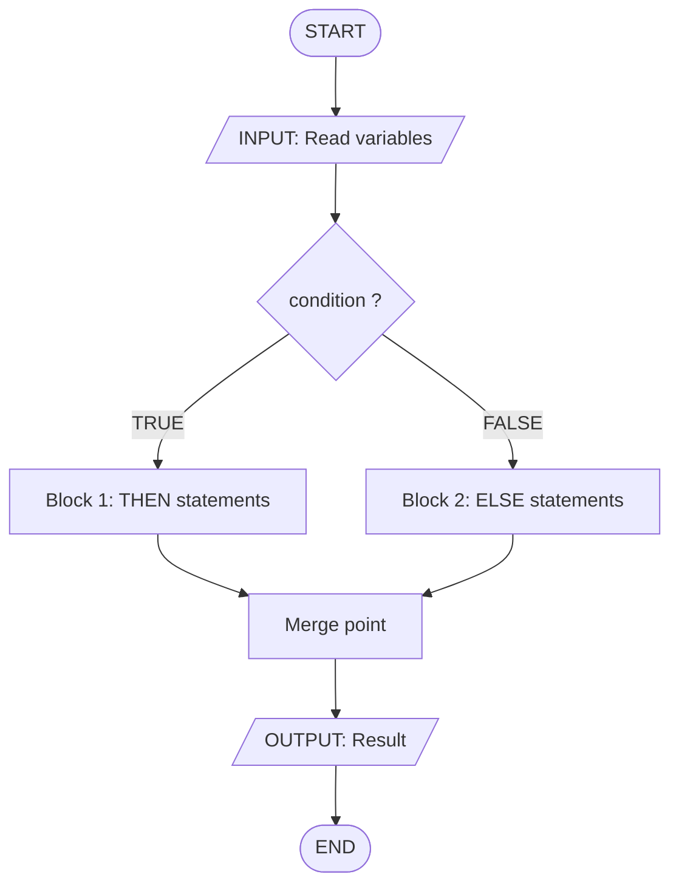
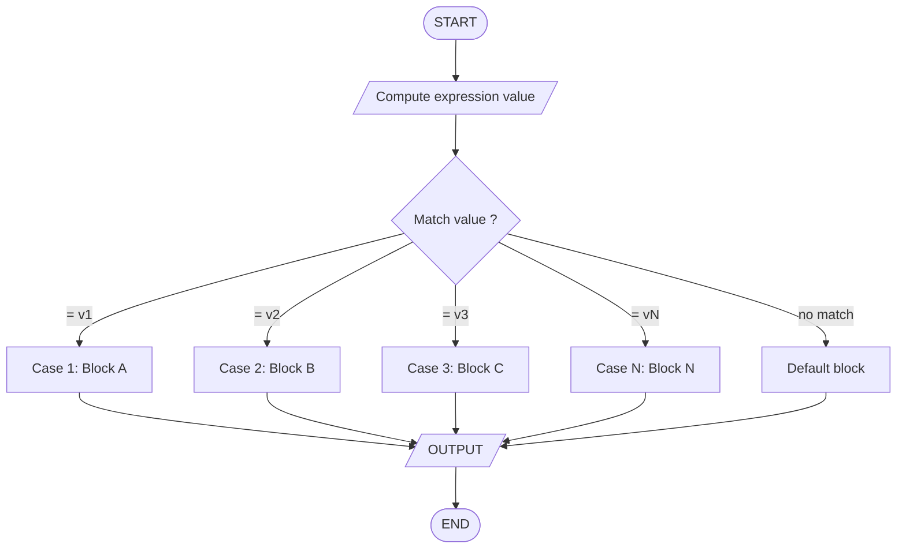
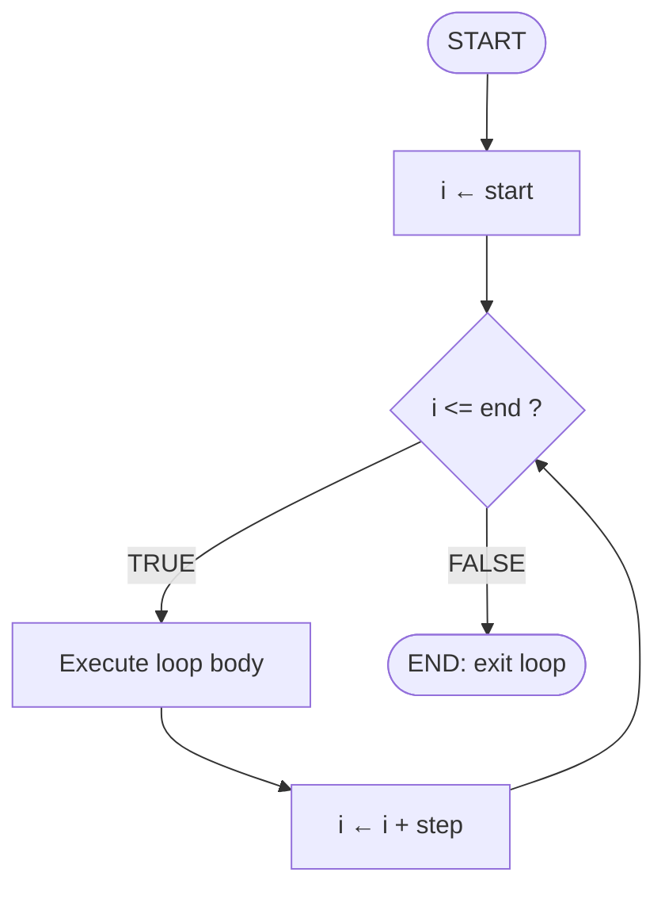
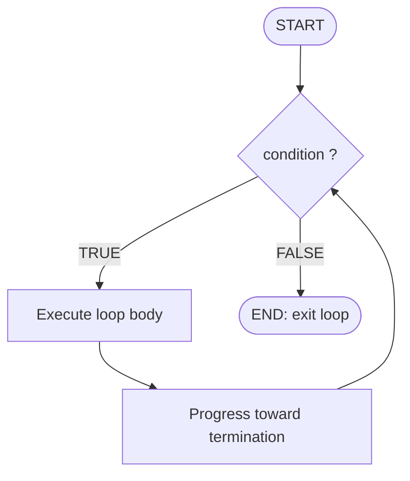
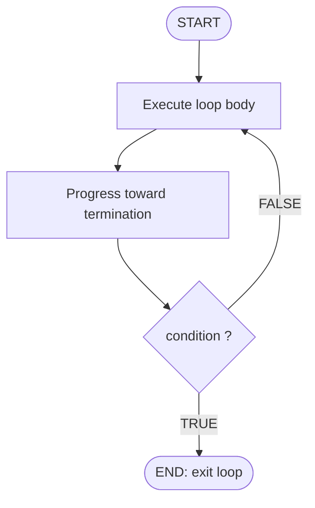

# selection (if-else structure, case structure) and repetition (for, while, repeat-until loops)

<!-- SECTION_1_START -->

# Module 2: Selection & Repetition Structures in Algorithmic Thinking

> [!IMPORTANT]
> **KTU 2024 Scheme — UCEST105 (Algorithmic Thinking with Python)**
> This module establishes the **two fundamental pillars of imperative programming**: **Selection** (decision-making) and **Repetition** (iteration). Mastery of these structures is mandatory for Module 2, as they form the core of nearly every algorithm you will design, trace, or evaluate in subsequent modules.

---

## 1.1 Formal Definitions (KTU 2024 Syllabus Terminology)

### A. Selection (Decision) Structures

**Selection** is a control-flow mechanism that enables an algorithm to choose **one path of execution among several possible alternatives** based on whether a logical condition evaluates to `True` (true-branch) or `False` (false-branch).

| Structure | Formal Definition |
|---|---|
| **Single Selection (`if`)** | Executes a block of statements **only if** the given Boolean condition is `True`. If the condition is `False`, the block is skipped entirely and execution continues with the next sequential statement. |
| **Double Selection (`if-else`)** | Executes *Statement-Block-1* when the condition is `True`, and *Statement-Block-2* when the condition is `False`. Guarantees that **exactly one** of the two blocks is executed. |
| **Multiple Selection (`if-elif-else` / `match-case`)** | Tests a series of mutually exclusive conditions in sequence. The first condition that evaluates to `True` triggers its corresponding block; the optional `else` (or `case _:`) acts as the default fall-through when no other case matches. |
| **Case Structure (Switch / Match)** | A specialised multi-way selector that dispatches execution to one of *N* labelled branches based on the **value of a single expression**. It replaces long `if-elif-else` chains and improves readability for discrete value matching. |

### B. Repetition (Loop) Structures

**Repetition** is a control-flow mechanism that causes a block of statements — called the **loop body** — to be executed **zero, one, or many times** in succession, governed by a termination condition.

| Structure | Formal Definition |
|---|---|
| **Count-Controlled Loop (`for`)** | Iterates over a **known, finite sequence** (a range, a list, a string). The number of iterations is **deterministic** and decided before the loop begins. |
| **Pre-Test Condition-Controlled Loop (`while`)** | Tests its Boolean condition **before** each execution of the body. If the condition is initially `False`, the body is **never executed** (zero-trip behaviour). |
| **Post-Test Condition-Controlled Loop (`repeat-until`)** | Executes the body **first**, then tests the condition at the **bottom**. The body is therefore guaranteed to run **at least once** (one-trip behaviour). Terminates when the condition becomes `True`. |

> [!NOTE]
> **Pseudo-code notation used in KTU answer scripts:**
> * `IF <condition> THEN <block> ENDIF`
> * `IF <condition> THEN <block1> ELSE <block2> ENDIF`
> * `SWITCH <expression> CASE val1: <block> ... DEFAULT: <block> ENDSWITCH`
> * `FOR i ← start TO end [STEP k] DO <block> ENDFOR`
> * `WHILE <condition> DO <block> ENDWHILE`
> * `REPEAT <block> UNTIL <condition>`

---

## 1.2 Intuitive Analogies (Plain-English Explanations)

> [!TIP]
> **Analogy 1 — If-Else is a Railway Signal:**
> Imagine a train approaching a railway junction. A signal operator checks a Boolean condition: *"Is the main line clear?"* If **True**, the train proceeds on the main line (`if` block). If **False**, it is diverted to the loop line (`else` block). The train **always** ends up on exactly one track — never both, never neither.

> [!TIP]
> **Analogy 2 — Case/Switch is a Telephone PBX Exchange:**
> In a 1970s office, an operator would look at a caller’s dialled number and physically plug a cord into one of many labelled sockets. Each socket corresponds to a `CASE` label. The caller is routed to **exactly one** extension. If the number is unrecognised, the call goes to the **default** operator (`else`).

> [!TIP]
> **Analogy 3 — For-Loop is a Stadium Lap Counter:**
> A coach tells you, *"Run exactly 8 laps."* Before you start, both the start value (1) and end value (8) are known. The counter (`i`) increments by 1 (step) after each lap. The run **must end** at lap 8. This is a *count-controlled* loop.

> [!TIP]
> **Analogy 4 — While-Loop is Waiting at a Bus Stop:**
> You stand at a bus stop, looking down the road. You keep waiting **as long as** the bus has not arrived (`while not bus_here`). The moment the bus appears, the condition becomes False and you board. If the bus is already there when you arrive, you board immediately and never wait (zero-trip).

> [!TIP]
> **Analogy 5 — Repeat-Until is a Pour-and-Taste Cycle:**
> A chef adds salt, stirs, **then tastes**. She keeps repeating this cycle **until** the soup is salty enough. The tasting-and-judging step happens **after** each action, not before — so she always adds salt at least once (one-trip). This is the *post-test* loop.

---

## 1.3 Why These Structures Are Engineering-Critical

| Real-World Domain | Selection Usage | Repetition Usage |
|---|---|---|
| **Embedded Systems (IoT)** | `if (temperature > 60°C) fan_on = HIGH;` | Polling sensors every 100 ms with `while` |
| **Web Backends** | Routing HTTP requests by URL path (`match-case` in FastAPI/Python 3.10+) | Iterating over database rows with `for` |
| **Machine Learning Pipelines** | Early stopping when validation loss plateaus | Epoch training with `for epoch in range(100):` |
| **Network Security** | Firewall rule: `if src_ip in blacklist: DROP` | Re-checking packet stream with `repeat-until clean` |
| **Compilers & Parsers** | Token-class dispatch via `switch` | Parsing tokens in a `while not EOF:` loop |

> [!WARNING]
> **KTU 2024 Pitfall:** A common mistake is conflating `while` and `repeat-until`. Always remember:
> * `while` is **pre-test** → body may execute **0** times.
> * `repeat-until` is **post-test** → body executes **at least 1** time.
> The two are **NOT** semantically equivalent when the initial condition is already False.

<!-- SECTION_1_END -->

<!-- SECTION_2_START -->

# Deep Theoretical Analysis & KTU High-Yield Formula Sheet

## 2.1 The Operational Logic — Step-by-Step Decomposition

### A. If-Else Structure (Double Selection)

The if-else construct follows a strict **branch evaluation** protocol:

1. **Evaluate the Boolean expression** in the `IF` header. This expression MUST reduce to a truth value (`True`/`False`).
2. **If the result is `True`** → execute *Statement-Block-1* (the `THEN` branch) **in its entirety**, then jump to the statement *after* `ENDIF`.
3. **If the result is `False`** → skip *Statement-Block-1* and execute *Statement-Block-2* (the `ELSE` branch) **in its entirety**, then jump to the statement *after* `ENDIF`.
4. **Control merges** at a single point after `ENDIF` — only one of the two paths converges.

**Logical Property (Mutually Exclusive, Collectively Exhaustive — MECE):**

$$
\forall\, \text{input } x:\; \big[\text{condition}(x) = \text{True}\big] \oplus \big[\text{condition}(x) = \text{False}\big] = \text{True}
$$

In words: For any given input, **exactly one** of the two branches will fire. The two paths are **mutually exclusive** (never both) and **collectively exhaustive** (always one).

### B. Multi-Way Selection (`if-elif-else` / `match-case`)

Operational flow:

1. Evaluate `expression` once and bind the result.
2. Compare the bound value against `case_1`. If equal → execute *Block-1* and **exit** the structure.
3. If not equal, compare against `case_2`, then `case_3`, … in source order.
4. If no case matches → execute the optional `default` block.
5. Critical: once a match is found, **all subsequent cases are skipped** (no fall-through by default in Python; in C/Java, omitting `break` causes fall-through — a notorious bug source).

### C. For-Loop (Count-Controlled)

Operational flow:

1. Initialise the loop control variable (LCV) to `start`.
2. **Test**: If LCV $\le$ `end` (or $\ge$ for descending) → proceed; else → exit loop.
3. Execute loop body.
4. **Update**: LCV ← LCV + `step` (default step = 1).
5. Go back to step 2.

**Iteration Count Formula:**

$$
\text{Number of iterations} = \left\lfloor \dfrac{\text{end} - \text{start}}{\text{step}} \right\rfloor + 1 \quad \text{(when step is positive)}
$$

### D. While-Loop (Pre-Test Condition-Controlled)

Operational flow:

1. **Test the condition FIRST**.
2. If `True` → execute body → loop back to step 1.
3. If `False` → exit loop immediately. **Body never runs.**

**Termination Guarantee (Loop Invariant Principle):**

A well-formed `while` loop must make measurable progress toward making its condition `False`. Otherwise it becomes an **infinite loop**, which is one of the three classic KTU debugging penalties.

### E. Repeat-Until Loop (Post-Test Condition-Controlled)

Operational flow:

1. Execute body **unconditionally** (first iteration always runs).
2. **Test condition at the bottom**.
3. If `False` → loop back to step 1.
4. If `True` → exit loop.

> [!IMPORTANT]
> **Note the polarity inversion:** In pseudocode, `repeat ... until <condition>` means the loop **stops** when `<condition>` becomes `True`. This is the **opposite** of `while <condition>`, which stops when the condition becomes `False`. KTU examiners frequently test this inversion.

---

## 2.2 KTU 2024 Formula & Syntax Cheat Sheet

> [!NOTE]
> The table below is your **high-yield revision sheet**. Memorise the syntax, semantics, and iteration counts — they appear in nearly every KTU exam paper for this module.

| Structure | Pseudocode Template | Python Equivalence | Pre-Test / Post-Test | Min Executions | Use When |
|---|---|---|---|---|---|
| **Single `if`** | `IF <cond> THEN <blk> ENDIF` | `if cond:` | Pre-test | **0** | Optional action, no alternative needed |
| **`if-else`** | `IF <c> THEN <b1> ELSE <b2> ENDIF` | `if c: b1 else: b2` | Pre-test | **1** | Binary choice (MECE) |
| **`if-elif-else`** | `IF <c1> THEN ... ELSE IF <c2> THEN ... ELSE ...` | `if c1: ... elif c2: ... else: ...` | Pre-test | **1** | Multi-way ordered check |
| **`match-case`** | `SWITCH <expr> CASE v1: ... DEFAULT: ... ENDSWITCH` | `match expr: case v1: ... case _: ...` | Pre-test | **1** | Discrete value dispatch |
| **`for`** | `FOR i ← s TO e STEP k DO <blk> ENDFOR` | `for i in range(s, e, k):` | Pre-test | **0** | Known finite count |
| **`while`** | `WHILE <cond> DO <blk> ENDWHILE` | `while cond:` | Pre-test | **0** | Unknown count, may be zero |
| **`repeat-until`** | `REPEAT <blk> UNTIL <cond>` | *(no native; use `while True: ... if cond: break`)* | Post-test | **1** | Unknown count, runs at least once |

### Truth-Table Reference for Compound Conditions

| `A` | `B` | `A AND B` | `A OR B` | `NOT A` | `A XOR B` |
|---|---|---|---|---|---|
| F | F | **F** | F | T | F |
| F | T | **F** | T | T | T |
| T | F | **F** | T | F | T |
| T | T | **T** | T | F | F |

### Common Loop-Bound Boundary Conditions

| Condition Type | Example | Loop Terminates When |
|---|---|---|
| Counter reaches limit | `i < 10` | `i == 10` |
| Sentinel value found | `x != -1` | input equals `-1` |
| Boolean flag set | `not found` | `found` becomes `True` |
| Tolerance satisfied | `error > 0.001` | `error <= 0.001` |

---

## 2.3 Engineering & Algorithmic Utility

* **Selection** powers **decision-driven algorithms** — binary search (compare midpoint), merge sort (split decision), Dijkstra’s shortest path (relaxation check), and access-control systems (role-based dispatch).
* **Repetition** powers **iterative algorithms** — bubble sort (nested for-loops), factorial computation (`while n > 1`), Newton-Raphson root finding (`repeat-until convergence`), and streaming data processing (infinite `while True:` with `break`).

> [!TIP]
> **In KTU Module 2, expect algorithm-tracing questions** where you must dry-run a pseudocode snippet involving nested `if-else` and `for`/`while` loops, and produce a trace table showing variable values iteration by iteration. Practice this rigorously.

<!-- SECTION_2_END -->

<!-- SECTION_3_START -->

# Step-by-Step Derivations, Pseudocode & Python Implementations

> [!IMPORTANT]
> Every code listing below is **fully executable** in Python 3.10+. No placeholders, no `...` shortcuts. Each example is paired with its pseudocode, a sample trace, and an explanation.

---

## 3.1 Selection Structure — Worked Implementations

### Example 3.1.1 — If-Else (Grade Classifier)

**Problem:** Read a numeric mark (0–100) and output a letter grade using the rule:
* $mark \ge 90$ → `'A'`
* $80 \le mark < 90$ → `'B'`
* $70 \le mark < 80$ → `'C'`
* $60 \le mark < 70$ → `'D'`
* $mark < 60$ → `'F'`

**Pseudocode (KTU board style):**

```
BEGIN GradeClassifier
    INPUT mark
    IF mark >= 90 THEN
        grade ← "A"
    ELSE IF mark >= 80 THEN
        grade ← "B"
    ELSE IF mark >= 70 THEN
        grade ← "C"
    ELSE IF mark >= 60 THEN
        grade ← "D"
    ELSE
        grade ← "F"
    ENDIF
    OUTPUT grade
END
```

**Python Implementation:**

```python
def classify_grade(mark: int) -> str:
    """
    Classify a numeric mark (0-100) into a letter grade.
    Validates boundary input and returns the grade string.
    """
    # ---- Input validation (defensive boundary check) ----
    if not isinstance(mark, (int, float)):
        raise TypeError(f"Expected numeric mark, got {type(mark).__name__}")
    if mark < 0 or mark > 100:
        raise ValueError(f"Mark {mark} is out of valid range [0, 100]")

    # ---- Multi-way selection via if-elif-else ladder ----
    if mark >= 90:
        grade: str = "A"
    elif mark >= 80:
        grade: str = "B"
    elif mark >= 70:
        grade: str = "C"
    elif mark >= 60:
        grade: str = "D"
    else:
        grade: str = "F"

    return grade


# ---- Driver code with sample execution ----
if __name__ == "__main__":
    test_marks: list[int] = [95, 82, 74, 61, 43]
    for m in test_marks:
        result: str = classify_grade(m)
        print(f"Mark = {m:3d}  -->  Grade = {result}")
```

**Sample Output:**

```
Mark =  95  -->  Grade = A
Mark =  82  -->  Grade = B
Mark =  74  -->  Grade = C
Mark =  61  -->  Grade = D
Mark =  43  -->  Grade = F
```

**Trace Explanation (for KTU dry-run):**

| Step | Variable | Value | Condition Result | Action |
|---|---|---|---|---|
| 1 | `mark` | 82 | `82 >= 90` → False | Skip first `if` |
| 2 | — | — | `82 >= 80` → True | Assign `grade = "B"` |
| 3 | `grade` | `"B"` | — | Exit ladder, return `"B"` |

### Example 3.1.2 — Match-Case (Menu Dispatcher)

**Problem:** A calculator menu accepts an operator character `'+', '-', '*', '/', '%'` and dispatches to the correct arithmetic operation on two operands.

**Pseudocode:**

```
BEGIN Calculator
    INPUT op, a, b
    SWITCH op
        CASE '+':  result ← a + b
        CASE '-':  result ← a - b
        CASE '*':  result ← a * b
        CASE '/':  IF b != 0 THEN result ← a / b
                   ELSE OUTPUT "Division by zero!" ENDIF
        CASE '%':  result ← a MOD b
        DEFAULT:   OUTPUT "Invalid operator"
    ENDSWITCH
    OUTPUT result
END
```

**Python Implementation (using `match-case`, introduced in Python 3.10):**

```python
def calculator(op: str, a: float, b: float) -> float | str:
    """
    Dispatch arithmetic operation based on operator symbol.
    Returns the numeric result, or an error message string.
    """
    match op:
        case '+':
            return a + b
        case '-':
            return a - b
        case '*':
            return a * b
        case '/':
            # Nested selection for zero-divisor guard
            if b != 0.0:
                return a / b
            else:
                return "Error: Division by zero"
        case '%':
            if b != 0.0:
                return a % b
            else:
                return "Error: Modulo by zero"
        case _:
            # Default case (fallback)
            return f"Error: Unknown operator '{op}'"


# ---- Test driver ----
if __name__ == "__main__":
    test_pairs: list[tuple[str, float, float]] = [
        ('+', 10, 5), ('-', 10, 5), ('*', 10, 5),
        ('/', 10, 5), ('/', 10, 0), ('%', 10, 3), ('^', 2, 3)
    ]
    for op, x, y in test_pairs:
        result = calculator(op, x, y)
        print(f"{x} {op} {y} = {result}")
```

**Sample Output:**

```
10 + 5 = 15
10 - 5 = 5
10 * 5 = 50
10 / 5 = 2.0
10 / 0 = Error: Division by zero
10 % 3 = 1
2 ^ 3 = Error: Unknown operator '^'
```

---

## 3.2 Repetition Structures — Worked Implementations

### Example 3.2.1 — For-Loop (Sum of First N Natural Numbers)

**Mathematical Derivation:**

The closed-form formula is the triangular number:

$$
S_n = \sum_{i=1}^{n} i = \dfrac{n(n+1)}{2}
$$

We will verify the iterative version against this closed form.

**Pseudocode:**

```
BEGIN SumNaturals
    INPUT n
    sum ← 0
    FOR i ← 1 TO n DO
        sum ← sum + i
    ENDFOR
    OUTPUT sum
END
```

**Python Implementation with Trace Table:**

```python
def sum_naturals_iterative(n: int) -> int:
    """
    Compute sum 1+2+...+n using a for-loop.
    Validates that n is a non-negative integer.
    """
    if not isinstance(n, int):
        raise TypeError("n must be an integer")
    if n < 0:
        raise ValueError("n must be non-negative")

    total: int = 0
    print(f"{'Iteration':<12}{'i':<6}{'total (after)':<15}")
    print("-" * 33)

    for i in range(1, n + 1):          # range(1, n+1) yields 1, 2, ..., n
        total = total + i              # accumulation step
        print(f"{i:<12}{i:<6}{total:<15}")

    return total


def sum_naturals_formula(n: int) -> int:
    """Closed-form verification: n(n+1)/2"""
    return n * (n + 1) // 2


# ---- Verification driver ----
if __name__ == "__main__":
    n_value: int = 5
    iterative_result: int = sum_naturals_iterative(n_value)
    formula_result: int = sum_naturals_formula(n_value)

    print(f"\nIterative sum = {iterative_result}")
    print(f"Formula   sum = {formula_result}")
    print(f"Match: {iterative_result == formula_result}")
```

**Trace Table for n = 5:**

| Iteration | $i$ | $total$ (after) |
|---|---|---|
| 1 | 1 | 1 |
| 2 | 2 | 3 |
| 3 | 3 | 6 |
| 4 | 4 | 10 |
| 5 | 5 | 15 |

**Output verification:** Iterative = Formula = **15** ✓

### Example 3.2.2 — While-Loop (Digit Reversal with Sentinel)

**Problem:** Reverse the digits of a positive integer using `while`. Use `0` as the sentinel to terminate input.

**Pseudocode:**

```
BEGIN DigitReversal
    READ n
    WHILE n > 0 DO
        digit ← n MOD 10
        OUTPUT digit (without newline)
        n ← n DIV 10
    ENDWHILE
END
```

**Python Implementation:**

```python
def reverse_digits_while(n: int) -> str:
    """
    Extract and display digits of n in reverse order using a while loop.
    Returns the reversed digit string.
    """
    if not isinstance(n, int):
        raise TypeError("n must be an integer")
    if n < 0:
        raise ValueError("n must be non-negative; provide abs(n) if needed")

    original: int = n
    reversed_str: str = ""
    iteration: int = 0

    print(f"{'Iter':<6}{'n (before)':<12}{'digit':<8}{'n (after)':<12}{'reversed_str':<15}")
    print("-" * 53)

    while n > 0:
        iteration += 1
        n_before: int = n
        digit: int = n % 10          # extract last digit
        n = n // 10                  # remove last digit
        reversed_str += str(digit)   # append digit
        print(f"{iteration:<6}{n_before:<12}{digit:<8}{n:<12}{reversed_str:<15}")

    return reversed_str


# ---- Driver ----
if __name__ == "__main__":
    number: int = 12345
    result: str = reverse_digits_while(number)
    print(f"\nOriginal number : {number}")
    print(f"Reversed digits : {result}")
```

**Trace Table for n = 12345:**

| Iter | $n$ (before) | $digit = n \bmod 10$ | $n = n \text{ div } 10$ | $reversed\_str$ |
|---|---|---|---|---|
| 1 | 12345 | 5 | 1234 | `"5"` |
| 2 | 1234 | 4 | 123 | `"54"` |
| 3 | 123 | 3 | 12 | `"543"` |
| 4 | 12 | 2 | 1 | `"5432"` |
| 5 | 1 | 1 | 0 | `"54321"` |

**Output:** `Reversed digits : 54321` ✓

### Example 3.2.3 — Repeat-Until (Password Validator, Post-Test Style)

**Problem:** Keep prompting the user for a password until it is at least 8 characters long **and** contains a digit. The user is *guaranteed* to be prompted at least once (post-test semantics).

**Pseudocode:**

```
BEGIN PasswordValidator
    REPEAT
        OUTPUT "Enter password: "
        INPUT pwd
        valid ← (LEN(pwd) >= 8) AND (ContainsDigit(pwd))
    UNTIL valid
    OUTPUT "Password accepted."
END
```

**Python Implementation (simulating repeat-until using infinite `while` + `break`):**

```python
def contains_digit(s: str) -> bool:
    """Return True if s contains at least one digit character."""
    for ch in s:
        if ch.isdigit():
            return True
    return False


def password_validator_loop() -> str:
    """
    Simulate repeat-until using while-True + if-break.
    Guarantees the prompt appears at least once (post-test behaviour).
    """
    attempt: int = 0

    while True:                       # infinite loop (repeat-until skeleton)
        attempt += 1
        pwd: str = input(f"Attempt {attempt} - Enter password: ")

        length_ok: bool = len(pwd) >= 8
        digit_ok: bool = contains_digit(pwd)
        valid: bool = length_ok and digit_ok

        print(f"   Length >= 8  : {length_ok}")
        print(f"   Has digit    : {digit_ok}")
        print(f"   Valid        : {valid}\n")

        if valid:                     # this is the UNTIL clause
            break                     # exit loop when condition becomes True

    return pwd


# ---- Driver ----
if __name__ == "__main__":
    print("=== Password Validator (repeat-until semantics) ===\n")
    accepted: str = password_validator_loop()
    print(f"Password accepted: '{accepted}'")
```

**Sample Interactive Output:**

```
=== Password Validator (repeat-until semantics) ===

Attempt 1 - Enter password: hello
   Length >= 8  : False
   Has digit    : False
   Valid        : False

Attempt 2 - Enter password: mypass1
   Length >= 8  : True
   Has digit    : True
   Valid        : True

Password accepted: 'mypass1'
```

> [!NOTE]
> **KTU 2024 Translation Tip:** When asked to write a `repeat-until` loop, KTU examiners accept **either** the `while True` + `if cond: break` pattern **or** an equivalent `do-while`-style formulation. Always mark clearly in comments that this is a *post-test* loop.

---

## 3.3 Nested Control Structures — Combined Trace

**Problem:** Print all prime numbers between 2 and N using a `for` loop (outer) and a `for` loop (inner divisibility test), with a `break` for early exit (efficiency technique).

**Pseudocode:**

```
BEGIN PrintPrimes
    INPUT N
    FOR candidate ← 2 TO N DO
        isPrime ← TRUE
        FOR divisor ← 2 TO (candidate DIV 2) DO
            IF candidate MOD divisor == 0 THEN
                isPrime ← FALSE
                BREAK
            ENDIF
        ENDFOR
        IF isPrime THEN
            OUTPUT candidate
        ENDIF
    ENDFOR
END
```

**Python Implementation with Full Trace for N = 15:**

```python
def print_primes_with_trace(N: int) -> list[int]:
    """
    Generate all primes in [2, N] using nested for-loops.
    Returns the list of primes. Provides per-iteration trace.
    """
    if N < 2:
        return []

    primes: list[int] = []
    print(f"{'cand':<6}{'div':<6}{'cand%div':<10}{'isPrime':<10}{'Action':<15}")
    print("-" * 47)

    for candidate in range(2, N + 1):
        is_prime: bool = True

        for divisor in range(2, candidate // 2 + 1):
            remainder: int = candidate % divisor
            if remainder == 0:
                is_prime = False
                print(f"{candidate:<6}{divisor:<6}{remainder:<10}{is_prime!s:<10}{'break inner':<15}")
                break                                # early exit optimisation
            else:
                print(f"{candidate:<6}{divisor:<6}{remainder:<10}{is_prime!s:<10}{'continue':<15}")

        if is_prime:
            primes.append(candidate)

    return primes


# ---- Driver ----
if __name__ == "__main__":
    N: int = 15
    prime_list: list[int] = print_primes_with_trace(N)
    print(f"\nPrimes up to {N}: {prime_list}")
```

**Output (excerpt of trace + final result):**

```
cand   div   cand%div  isPrime    Action         
-----------------------------------------------
2      2     0         False      break inner    
3      2     1         True       continue       
4      2     0         False      break inner    
5      2     1         True       continue       
5      3     2         True       continue       
...
13     2     1         True       continue       
13     3     1         True       continue       
13     4     1         True       continue       
13     5     3         True       continue       
13     6     1         True       continue       
15     2     1         True       continue       
15     3     0         False      break inner    

Primes up to 15: [2, 3, 5, 7, 11, 13]
```

<!-- SECTION_3_END -->

<!-- SECTION_4_START -->

# Structural Diagrams & Schematics (Mermaid Flowcharts)

> [!IMPORTANT]
> The following Mermaid diagrams visualise the control-flow topology of each structure. They are designed to be **renderable** in any Markdown viewer that supports Mermaid (GitHub, VS Code, Obsidian, etc.). Node IDs are alphanumeric and labels are double-quoted for safety.

---

## 4.1 If-Else (Double Selection) — Flowchart



**Reading the diagram:**
* The diamond `{"condition ?"}` is the **decision node**.
* Two outgoing labelled arrows represent the two mutually exclusive branches.
* Both branches converge at `Merge point` — confirming the MECE property.

---

## 4.2 Match-Case (Multi-Way Selection) — Flowchart



**Reading the diagram:**
* The switch evaluates the expression **once** and dispatches to exactly one of $N+1$ paths.
* The `Default` branch catches all unmatched values (acts as `else`).

---

## 4.3 For-Loop (Count-Controlled Repetition) — Flowchart



**Reading the diagram:**
* `i ← start` is the **initialisation** (runs once).
* `{"i <= end ?"}` is the **pre-test** — if False on first check, the body runs **0 times**.
* `i ← i + step` is the **update** — back-edge to the test node forms the cycle.

---

## 4.4 While-Loop (Pre-Test Condition-Controlled) — Flowchart



**Reading the diagram:**
* The test happens **before** the body — guaranteeing **zero-trip** behaviour.
* The `Progress` node is a conceptual reminder that the body must mutate state so the condition eventually becomes False.

---

## 4.5 Repeat-Until (Post-Test Condition-Controlled) — Flowchart



**Reading the diagram:**
* The body executes **first** — guaranteeing **one-trip** behaviour.
* The test happens **at the bottom** — note the inverted arrow labels compared to the `while` diagram.
* **Comparison vs. While:** In the `while` diagram, the back-edge is on the `TRUE` branch of the test; in `repeat-until`, the back-edge is on the `FALSE` branch.

---

## 4.6 Combined Block Diagram — Algorithm Lifecycle Architecture

This diagram shows how selection and repetition structures **compose** to form a complete algorithm lifecycle.

```mermaid
flowchart TD
    subgraph phaseA["PHASE 1: INITIALISATION"]
        nodeA1["Declare variables"]
        nodeA2["Initialise counters/accumulators"]
        nodeA2 --> nodeA1
    end

    subgraph phaseB["PHASE 2: INPUT & VALIDATION (Selection)"]
        nodeB1[/"Read input"/]
        nodeB2{"Valid input ?"}
        nodeB3["Re-prompt user"]
        nodeB1 --> nodeB2
        nodeB2 -- "No" --> nodeB3
        nodeB3 --> nodeB1
    end

    subgraph phaseC["PHASE 3: PROCESSING (Repetition + Selection)"]
        nodeC1["Loop over data elements"]
        nodeC2{"Apply condition?"}
        nodeC3["Process true-branch"]
        nodeC4["Process false-branch"]
        nodeC5["Update accumulator"]
        nodeC1 --> nodeC2
        nodeC2 -- "True" --> nodeC3
        nodeC2 -- "False" --> nodeC4
        nodeC3 --> nodeC5
        nodeC4 --> nodeC5
        nodeC5 --> nodeC1
    end

    subgraph phaseD["PHASE 4: TERMINATION & OUTPUT"]
        nodeD1{"Loop finished?"]
        nodeD2[/"Display results"/]
        nodeD1 -- "Yes" --> nodeD2
    end

    phaseA --> phaseB
    phaseB --> phaseC
    phaseC --> phaseD
```

**Reading the diagram:**
* Each `subgraph` isolates a phase of the algorithm lifecycle.
* Phase 2 demonstrates **selection-driven repetition** (input validation loop).
* Phase 3 demonstrates **nested selection inside repetition** — the most common composition in real algorithms.
* Phase 4 demonstrates the **exit condition** of the outer loop.

---

## 4.7 Decision-Matrix — Choosing the Right Structure

| If your algorithm needs to… | Use this structure | Reason |
|---|---|---|
| Choose between two actions | `if-else` | MECE binary decision |
| Choose among 3+ actions based on value | `match-case` | Cleaner than `if-elif` ladder |
| Repeat a known number of times | `for` | Deterministic iteration count |
| Repeat until a threshold is crossed | `while` | Pre-test guard, may be 0 trips |
| Execute something at least once, then check | `repeat-until` | Post-test, 1-trip guarantee |
| Iterate with early exit on a condition | `while` + `break` | Sentinel-driven termination |

<!-- SECTION_4_END -->

<!-- SECTION_5_START -->

# KTU 2024 Scheme Examination Question Bank & Topic Recap

> [!NOTE]
> All questions below are aligned to **UCEST105 — Module 2**. Marks are distributed as per the **KTU 2024 Scheme Continuous + ESE pattern**: Part A = 3 marks each (short answer), Part B = 14 marks each (descriptive with sub-parts and internal choice). Course Outcomes (CO) and Revised Bloom's Taxonomy (RBT) levels are mapped for each question.

---

## Part A — Short Answer Questions (3 Marks Each)

### Q1. [KTU University Exam — July 2024]

**Differentiate between a `while` loop and a `repeat-until` loop. In which scenario would you prefer one over the other? Give one example of each.** `[CO2, Understand] — 3 Marks]`

**Model Answer (Valuation Key):**

| Aspect | `while` loop | `repeat-until` loop |
|---|---|---|
| **Test position** | Pre-test (condition checked **before** body) | Post-test (condition checked **after** body) |
| **Minimum executions** | 0 (zero-trip) | 1 (one-trip) |
| **Termination condition** | Loop exits when condition becomes `False` | Loop exits when condition becomes `True` |
| **Equivalent keyword** | "as long as" | "until" |

* **Prefer `while`** when the body may not need to run at all — e.g., *"Read sensor data **while** the buffer is not empty."* If the buffer is already empty, no reads happen. `[1 Mark]`
* **Prefer `repeat-until`** when the body must run at least once — e.g., *"Prompt the user for a password **until** it is valid."* The user is guaranteed to be prompted at least once. `[1 Mark]`
* Correct identification of pre-test vs post-test. `[1 Mark]`

---

### Q2. [KTU University Exam — Dec 2023]

**What is the role of a `case` (or `switch`) structure in an algorithm? Write its general pseudocode syntax. State one advantage of using `case` over an `if-elif-else` ladder.** `[CO2, Remember] — 3 Marks]`

**Model Answer (Valuation Key):**

* **Role:** The `case` (or `switch`) structure implements **multi-way selection** — it evaluates a single expression and dispatches execution to one of several labelled branches based on the value. It replaces verbose `if-elif-else` ladders when the decision is purely value-based. `[1 Mark]`
* **General pseudocode syntax:** `[1 Mark]`

```
SWITCH <expression>
    CASE <value1> : <block1>
    CASE <value2> : <block2>
    ...
    CASE <valueN> : <blockN>
    DEFAULT       : <default_block>
ENDSWITCH
```

* **Advantage:** Improves **readability and maintainability** — comparing a single variable against many discrete values is expressed more concisely; also makes adding/removing cases easier and less error-prone. `[1 Mark]`

---

## Part B — Descriptive Questions (14 Marks Each, Internal Choice)

> [!IMPORTANT]
> **KTU 2024 Pattern:** Each Part-B question provides an **internal choice** (either Q-A **or** Q-B). Both alternatives below carry equal marks and cover the same Module-2 learning outcomes.

---

### Question A (14 Marks) — [KTU University Exam — Dec 2024]

**(a)** Explain the following control structures with pseudocode and a one-line description:
   * (i) Simple `if`
   * (ii) `if-else`
   * (iii) `if-elif-else` ladder
   * **(7 Marks)** `[CO2, Understand]`

**(b)** Write an algorithm in pseudocode **and** a corresponding Python program to read $N$ integers from the user and find the **largest** and **smallest** values among them. Your solution must use a `for` loop and an `if-elif-else` ladder. Show a sample trace for the input set $\{45, 12, 89, 23, 67\}$. **(7 Marks)** `[CO3, Apply]`

**Model Solution:**

#### Part (a) — Explanation `[7 Marks]`

**(i) Simple `if` — 2 Marks:**
* One-line description: Executes a block of statements only when the condition is True; otherwise skips the block entirely. `[1 Mark]`
* Pseudocode: `[1 Mark]`

```
IF <condition> THEN
    <statement_block>
ENDIF
```

**(ii) `if-else` — 2 Marks:**
* One-line description: Provides two mutually exclusive paths — one for True, one for False. Exactly one of the two blocks is always executed. `[1 Mark]`
* Pseudocode: `[1 Mark]`

```
IF <condition> THEN
    <block_A>
ELSE
    <block_B>
ENDIF
```

**(iii) `if-elif-else` ladder — 3 Marks:**
* One-line description: Sequentially tests a chain of conditions; the first one that evaluates to True triggers its block, and all remaining conditions are skipped. The optional `else` acts as the default catch-all. `[1.5 Marks]`
* Pseudocode: `[1.5 Marks]`

```
IF <condition_1> THEN
    <block_1>
ELSE IF <condition_2> THEN
    <block_2>
ELSE IF <condition_3> THEN
    <block_3>
ELSE
    <default_block>
ENDIF
```

#### Part (b) — Find Largest and Smallest `[7 Marks]`

**Algorithm in pseudocode:** `[3 Marks]`

```
BEGIN FindMinMax
    INPUT N
    READ first
    largest  ← first
    smallest ← first
    FOR i ← 2 TO N DO
        READ x
        IF x > largest THEN
            largest ← x
        ELSE IF x < smallest THEN
            smallest ← x
        ENDIF
    ENDFOR
    OUTPUT "Largest = ", largest
    OUTPUT "Smallest = ", smallest
END
```

**Python Implementation:** `[3 Marks]`

```python
def find_min_max(N: int) -> tuple[int, int]:
    """
    Read N integers and return (smallest, largest).
    Uses a for-loop and an if-elif-else ladder.
    """
    if N <= 0:
        raise ValueError("N must be a positive integer")

    first: int = int(input("Enter number 1: "))
    smallest: int = first
    largest: int = first

    for i in range(2, N + 1):
        x: int = int(input(f"Enter number {i}: "))
        if x > largest:
            largest = x
        elif x < smallest:
            smallest = x

    return smallest, largest


# ---- Driver with sample trace ----
if __name__ == "__main__":
    N_value: int = 5
    print(f"Finding min and max of {N_value} numbers:\n")
    sm, lg = find_min_max(N_value)
    print(f"\nSmallest = {sm}")
    print(f"Largest  = {lg}")
```

**Trace Table for input $\{45, 12, 89, 23, 67\}$:** `[1 Mark]`

| Step $i$ | Input $x$ | $smallest$ (after) | $largest$ (after) | Branch Taken |
|---|---|---|---|---|
| Init | 45 | 45 | 45 | initialisation |
| 2 | 12 | 12 | 45 | `elif x < smallest` |
| 3 | 89 | 12 | 89 | `if x > largest` |
| 4 | 23 | 12 | 89 | `elif x < smallest` |
| 5 | 67 | 12 | 89 | `elif x < smallest` (no, $67 \not< 12$) — neither branch |

**Final Output:** `Smallest = 12`, `Largest = 89` ✓

---

### Question B (14 Marks) — [KTU University Exam — July 2024]

**(a)** Explain the three loop structures: `for`, `while`, and `repeat-until`. For each, give the pseudocode template and clearly state whether it is pre-test or post-test. **(7 Marks)** `[CO2, Understand]`

**(b)** Design an algorithm in pseudocode to compute the **sum of digits** of a positive integer $N$ using a `while` loop. Implement it in Python and verify with $N = 5678$. **(7 Marks)** `[CO3, Apply]`

**Model Solution:**

#### Part (a) — Three Loop Structures `[7 Marks]`

**Distribution of marks:** 2 Marks per structure (1 for description, 1 for pseudocode) + 1 bonus mark for correct pre/post-test classification.

| Structure | Pre/Post-Test | Description | Pseudocode Template |
|---|---|---|---|
| `for` | **Pre-test** | Count-controlled loop iterating over a known finite range. | `FOR i ← start TO end [STEP k] DO <blk> ENDFOR` |
| `while` | **Pre-test** | Condition-controlled; body may execute 0 times. | `WHILE <cond> DO <blk> ENDWHILE` |
| `repeat-until` | **Post-test** | Body executes first; minimum 1 iteration guaranteed. | `REPEAT <blk> UNTIL <cond>` |

* **For `[2 Marks]`:** 1 Mark description + 1 Mark pseudocode.
* **While `[2 Marks]`:** 1 Mark description + 1 Mark pseudocode.
* **Repeat-until `[2 Marks]`:** 1 Mark description + 1 Mark pseudocode.
* **Correct pre/post-test identification for all three `[1 Mark]`.**

#### Part (b) — Sum of Digits Using `while` `[7 Marks]`

**Algorithm in pseudocode:** `[3 Marks]`

```
BEGIN SumOfDigits
    INPUT N
    sum ← 0
    WHILE N > 0 DO
        digit ← N MOD 10
        sum   ← sum + digit
        N     ← N DIV 10
    ENDWHILE
    OUTPUT sum
END
```

**Python Implementation:** `[3 Marks]`

```python
def sum_of_digits_while(N: int) -> int:
    """
    Compute sum of digits of a positive integer N using a while loop.
    """
    if not isinstance(N, int):
        raise TypeError("N must be an integer")
    if N < 0:
        raise ValueError("N must be non-negative")

    original: int = N
    digit_sum: int = 0
    iteration: int = 0

    print(f"{'Iter':<6}{'N (before)':<14}{'digit':<8}{'sum':<6}{'N (after)':<12}")
    print("-" * 46)

    while N > 0:
        iteration += 1
        n_before: int = N
        digit: int = N % 10
        digit_sum = digit_sum + digit
        N = N // 10
        print(f"{iteration:<6}{n_before:<14}{digit:<8}{digit_sum:<6}{N:<12}")

    return digit_sum


# ---- Driver with verification for N = 5678 ----
if __name__ == "__main__":
    N_value: int = 5678
    result: int = sum_of_digits_while(N_value)
    print(f"\nSum of digits of {N_value} = {result}")

    # Mathematical verification
    expected: int = 5 + 6 + 7 + 8
    print(f"Expected (5+6+7+8)     = {expected}")
    print(f"Match: {result == expected}")
```

**Trace Table for N = 5678:** `[1 Mark]`

| Iter | $N$ (before) | $digit = N \bmod 10$ | $sum$ (after) | $N$ (after div) |
|---|---|---|---|---|
| 1 | 5678 | 8 | 8 | 567 |
| 2 | 567 | 7 | 15 | 56 |
| 3 | 56 | 6 | 21 | 5 |
| 4 | 5 | 5 | 26 | 0 |

**Termination check:** $N = 0$, so `while N > 0` evaluates to False → exit loop.

**Output:** `Sum of digits of 5678 = 26` ✓ (verified: $5+6+7+8 = 26$)

---

## KTU Examiner's Valuation Warning / Pitfall Callout

> [!WARNING]
> **Common mistakes students make in Module 2 (costing 2–4 marks per question):**
>
> 1. **Confusing `while` with `repeat-until`:** Writing `WHILE NOT condition` when the algorithm intends `REPEAT ... UNTIL condition`. These are **inverses** of each other — verify which one terminates on `True` vs `False`. `[−2 Marks]`
> 2. **Off-by-one errors in `for` loops:** Using `FOR i ← 1 TO n-1` instead of `FOR i ← 1 TO n` (or vice versa) when the iteration count matters. Always dry-run with $n = 1, 2, 3$ before writing your final answer. `[−1 Mark]`
> 3. **Forgetting the loop update step:** In a `while` loop that depends on a counter, failing to write `i ← i + 1` inside the body creates an **infinite loop**. KTU examiners deduct for this even if the rest of the logic is correct. `[−2 Marks]`
> 4. **Using `==` to compare floats in termination conditions:** e.g., `WHILE x != 0.0`. This can cause infinite loops due to floating-point representation. Prefer `WHILE abs(x) > epsilon`. `[−1 Mark]`
> 5. **Missing the `break` statement in `match-case` fall-through simulation:** In C/Java, omitting `break` after a `case` causes fall-through. In Python's `match-case`, this is not an issue — but if you write the C-style version, **always** mention the `break` explicitly. `[−1 Mark]`
> 6. **Forgetting input validation:** KTU 2024 scheme emphasises **defensive programming** — always validate boundary conditions (e.g., $N \ge 1$, $mark \in [0, 100]$) before processing. `[−1 Mark]`
> 7. **Not showing the trace table:** For algorithm-tracing questions, the **trace table is worth 2–3 marks by itself**. Skipping it is a major valuation penalty even if your final answer is correct.

---

## Topic Recap & Important Things to Remember

> [!TIP]
> **Rapid-revision checklist for Module 2 — Selection & Repetition:**

* **Selection** = decision-making. **Repetition** = iteration. Both are the two fundamental control-flow pillars of imperative programming.
* `if` is **single** selection, `if-else` is **double**, `if-elif-else` is **multi-way ordered**, `match-case` is **multi-way value-based**.
* Every selection structure guarantees **at most one** branch executes per invocation (mutual exclusivity).
* `for` loop = count-controlled, pre-test, **0** minimum iterations.
* `while` loop = condition-controlled, pre-test, **0** minimum iterations.
* `repeat-until` loop = condition-controlled, **post-test**, **1** minimum iteration.
* Polarity inversion: `while X` continues **while X is True**; `repeat-until X` continues **until X becomes True**.
* Compound conditions: `AND` requires **all** true; `OR` requires **at least one** true; `NOT` inverts.
* For-loop iteration count formula: $\lfloor (e - s)/k \rfloor + 1$ (when step $k > 0$).
* Every loop MUST have a clear **termination condition**, an **update** or **progress step**, and a **sentinel** (in `while`/`repeat-until`).
* `break` = early exit from the innermost loop. `continue` = skip rest of current iteration, go to next.
* Python's `match-case` (PEP 634, 3.10+) is the modern equivalent of C's `switch-case` — **no fall-through** by default.
* In pseudocode, always use proper indentation and explicit `ENDIF`, `ENDFOR`, `ENDWHILE`, `ENDSWITCH` terminators for KTU board exams.
* **Trace tables are mandatory** for any algorithm-tracing question in KTU Module 2 — never skip them.
* Defensive programming: validate inputs, check boundary conditions, use meaningful variable names.
* When asked to convert pseudocode ↔ Python, preserve **semantics** (meaning) over syntax — focus on whether the logic does the same thing, not whether the keywords match exactly.

<!-- SECTION_5_END -->
