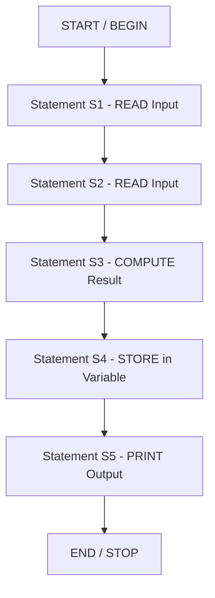
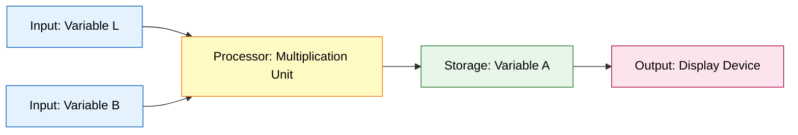

# The main constructs of pseudocode - Sequencing

<!-- SECTION_1_START -->
# Module 2 — The Main Constructs of Pseudocode: Sequencing

## 1.1 Formal Definition (KTU 2024 Syllabus Terminology)

> [!IMPORTANT]
> **Pseudocode** is a *high-level, informal, language-agnostic description* of an algorithm that combines the structural rigor of programming constructs with the readability of natural language. It is **not** meant to be executed on a machine; it is a thinking and communication tool used during the *design phase* of problem solving.

> [!IMPORTANT]
> **Sequencing** is the most fundamental of the three core algorithmic constructs — *Sequencing, Selection, and Iteration*. It defines a **strict, linear, top-to-bottom order** in which statements (or *actions*) are executed. Every statement runs **exactly once**, in the order it is written, with no deviation.

In KTU parlance, sequencing answers the question: *"What happens first, what happens next, and what happens last?"*

---

## 1.2 Intuition & Real-World Analogy

**Analogy 1 — The Cooking Recipe:**  
A recipe for tea says: *Boil water → Add tea leaves → Add sugar → Add milk → Boil for 2 minutes → Serve.* If you add sugar **after** serving, the tea is wrong. The *order* itself carries meaning. Pseudocode sequencing works the same way — the *position* of a line dictates *when* it executes.

**Analogy 2 — Morning Routine of a Student:**  
Wake up $\rightarrow$ Brush teeth $\rightarrow$ Bathe $\rightarrow$ Wear uniform $\rightarrow$ Pack bag $\rightarrow$ Leave for college. Each step depends on the completion of the previous step. This dependency chain *is* sequencing.

**Geometric Intuition:**  
Imagine a *number line* of time $T$. Each statement $S_i$ occupies a unique point $t_i$ on this line:

$$t_1 < t_2 < t_3 < \dots < t_n$$

No two statements share the same timestamp, and the **control flow** moves strictly to the right (forward in time) — never backward, never sideways. This uni-directional arrow is the *defining visual signature* of sequencing.

---

## 1.3 Key Vocabulary You Must Memorize

| Term | Meaning |
|---|---|
| **Statement (Action)** | A single executable instruction (e.g., READ, PRINT, SET, COMPUTE) |
| **Linear Flow** | Execution proceeds along a single straight path with no branches |
| **Deterministic** | Given the same input, the same sequence of statements always runs |
| **Order-Dependence** | Swapping two statements can change the program's result |
| **Atomic Step** | Each line is treated as one indivisible unit of work |

> [!NOTE]
> In the KTU 2024 Scheme, sequencing is often the **first sub-question** of any pseudocode problem. Examiners award marks specifically for *correctly ordering the steps* and *not skipping any logical transition*.

---

> [!VISUALIZATION CONTROL]
> **Concept:** Linear time-line of statement execution in a sequencing construct.
> **GeoGebra / Desmos Input Points:**
> * `Point A = (1, 0)`  — represents $S_1$ (first statement)
> * `Point B = (2, 0)`  — represents $S_2$ (second statement)
> * `Point C = (3, 0)`  — represents $S_3$ (third statement)
> * `Point D = (4, 0)`  — represents $S_4$ (fourth statement)
> * `Line Segment from (0,0) to (5,0)` — the time axis
> **Visual Description:** The student should observe **four discrete dots** placed at equal intervals on a horizontal axis. Connecting arrows run strictly **left-to-right**, never branching or looping. This visually proves that sequencing is *strictly uni-directional*.

---

<!-- SECTION_1_END -->

<!-- SECTION_2_START -->
# 2. Deep Theoretical Analysis — Anatomy of Sequencing

## 2.1 The Five Pillars of a Valid Sequencing Block

For any pseudocode segment to qualify as a *pure sequencing construct*, it must satisfy the following five properties:

1. **Unidirectional Flow** — The control pointer moves from $S_1 \rightarrow S_2 \rightarrow S_3 \dots \rightarrow S_n$ without any conditional jump.
2. **Single Entry, Single Exit** — A sequencing block has **exactly one entry point** (the first statement) and **exactly one exit point** (the last statement).
3. **No Repetition** — A statement in a pure sequencing block executes **once and only once** per invocation.
4. **Deterministic Order** — The order is fixed at design time; no runtime decision alters it.
5. **Stateless Transitions** — Each statement may *consume* the output of the previous statement as input, creating a *data dependency chain*.

---

## 2.2 General Structural Template

Every sequencing block in KTU pseudocode follows this canonical shape:

```
BEGIN
    <Statement 1>
    <Statement 2>
    <Statement 3>
        .
        .
        .
    <Statement n>
END
```

The keywords **BEGIN** and **END** act as *bookends* that delimit the sequenced region. Inside, each line is a *verb-driven imperative* (READ, WRITE, SET, COMPUTE, DISPLAY, etc.).

---

## 2.3 KTU High-Yield Cheat Sheet — Sequencing Rules

| Rule ID | Rule Description | Standard Keyword | Example |
|:---:|---|---|---|
| **S-01** | Accept data from user | `READ` | `READ radius` |
| **S-02** | Assign a value to a variable | `SET` | `SET pi = 3.14` |
| **S-03** | Compute a new value | `COMPUTE` | `COMPUTE area = pi * radius * radius` |
| **S-04** | Display result to user | `PRINT` / `DISPLAY` | `PRINT area` |
| **S-05** | Declare a constant | `CONSTANT` | `CONSTANT g = 9.8` |
| **S-06** | Mark program start | `BEGIN` / `START` | `BEGIN` |
| **S-07** | Mark program end | `END` / `STOP` | `END` |
| **S-08** | Comment for clarity | `//` or `\#` | `// Calculate area` |

> [!NOTE]
> The **vertical bar** character `\vert` is the recommended KTU-approved way to express *absolute value* or *separation* in pseudocode. For example: `SET magnitude = \vert x - y \vert`.

---

## 2.4 Why Sequencing Matters in Real Engineering

Sequencing is not a "trivial" concept — it is the *spinal cord* of every production system:

- **Embedded Systems:** A microcontroller's boot sequence must initialize clocks $\rightarrow$ GPIO $\rightarrow$ peripherals $\rightarrow$ main loop, in that exact order. Re-ordering brick the device.
- **Data Pipelines (ETL):** Extract $\rightarrow$ Transform $\rightarrow$ Load must occur in sequence; loading before transforming corrupts the warehouse.
- **Compilers:** Lexical analysis $\rightarrow$ Parsing $\rightarrow$ Semantic analysis $\rightarrow$ Code generation is a strict sequencing pipeline.
- **DevOps CI/CD:** Checkout $\rightarrow$ Build $\rightarrow$ Test $\rightarrow$ Deploy — any re-ordering breaks the deployment contract.

In short, **sequencing is the silent contract of every reliable software system** on Earth.

---

<!-- SECTION_2_END -->

<!-- SECTION_3_START -->
# 3. Step-by-Step Derivation, Examples & Python Implementation

## 3.1 Canonical Example — Area of a Rectangle

### Step 1: Understand the Problem
We are given the **length** $L$ and **breadth** $B$ of a rectangle. We must compute its **area** $A$ and display it.

The mathematical relation is:

$$
A = L \times B
$$

### Step 2: Decompose Into Atomic Sequencing Steps

1. **Start** the algorithm.
2. **Accept** $L$ from the user.
3. **Accept** $B$ from the user.
4. **Compute** $A = L \times B$.
5. **Display** $A$.
6. **Stop** the algorithm.

### Step 3: Write the Pseudocode (Sequencing Construct)

```
BEGIN
    // Step 1: Read inputs
    READ length
    READ breadth

    // Step 2: Compute the area
    COMPUTE area = length * breadth

    // Step 3: Display the result
    PRINT area
END
```

### Step 4: Trace the Execution (Dry Run)

| Step # | Statement | State of `length` | State of `breadth` | State of `area` |
|:---:|---|:---:|:---:|:---:|
| 1 | `READ length` | $5$ | undefined | undefined |
| 2 | `READ breadth` | $5$ | $3$ | undefined |
| 3 | `COMPUTE area = length * breadth` | $5$ | $3$ | $15$ |
| 4 | `PRINT area` | $5$ | $3$ | $15$ |

> [!NOTE]
> Notice how the variable `area` is **undefined** until Step 3. This is *data dependency* — a direct consequence of sequencing. If you swapped Step 3 and Step 4, the program would crash because `area` would not yet exist.

### Step 5: Translate to Python (Verbatim Implementation)

```python
# ALGORITHM: Area of a Rectangle
# COURSE: UCEST105 - Algorithmic Thinking with Python
# CONSTRUCT DEMONSTRATED: Sequencing

def compute_rectangle_area() -> None:
    """
    Reads length and breadth from the user, computes the area,
    and prints the result. Demonstrates a pure sequencing construct.
    """
    try:
        # Statement 1: Accept first input
        length: float = float(input("Enter the length of the rectangle: "))

        # Statement 2: Accept second input
        breadth: float = float(input("Enter the breadth of the rectangle: "))

        # Statement 3: Perform the computation
        area: float = length * breadth

        # Statement 4: Display the output
        print(f"The area of the rectangle is: {area}")

    except ValueError as error:
        # Defensive error handling - logs invalid input
        print(f"[ERROR] Invalid numeric input received: {error}")


# Entry point - maintains the single-entry contract
if __name__ == "__main__":
    compute_rectangle_area()
```

**Output Trace (for $L=5, B=3$):**
```
Enter the length of the rectangle: 5
Enter the breadth of the rectangle: 3
The area of the rectangle is: 15.0
```

---

## 3.2 Second Example — Convert Celsius to Fahrenheit

The governing formula is:

$$
F = \left( C \times \frac{9}{5} \right) + 32
$$

### Pseudocode (Sequencing)

```
BEGIN
    // Step 1: Read Celsius value
    READ celsius

    // Step 2: Apply conversion formula
    COMPUTE fahrenheit = (celsius * 9 / 5) + 32

    // Step 3: Output the result
    PRINT fahrenheit
END
```

### Python Implementation

```python
def celsius_to_fahrenheit() -> None:
    """
    Pure sequencing construct: accepts Celsius, computes Fahrenheit, prints result.
    """
    try:
        # Statement 1: Read input
        celsius: float = float(input("Enter temperature in Celsius: "))

        # Statement 2: Apply linear transformation
        fahrenheit: float = (celsius * 9.0 / 5.0) + 32.0

        # Statement 3: Display output
        print(f"Temperature in Fahrenheit: {fahrenheit:.2f}")

    except ValueError as error:
        print(f"[ERROR] Non-numeric temperature entered: {error}")


if __name__ == "__main__":
    celsius_to_fahrenheit()
```

**Output Trace (for $C = 100$):**
$$
F = (100 \times 1.8) + 32 = 180 + 32 = 212
$$

```
Enter temperature in Celsius: 100
Temperature in Fahrenheit: 212.00
```

---

## 3.3 Third Example — Simple Interest Calculation

The governing formula is:

$$
SI = \frac{P \times R \times T}{100}
$$

where $P$ = Principal, $R$ = Rate of interest (\%), $T$ = Time in years.

### Pseudocode (Sequencing)

```
BEGIN
    CONSTANT divisor = 100

    // Step 1: Read all three inputs
    READ principal
    READ rate
    READ time

    // Step 2: Compute simple interest
    COMPUTE simple_interest = (principal * rate * time) / divisor

    // Step 3: Display result
    PRINT simple_interest
END
```

### Python Implementation

```python
def calculate_simple_interest() -> None:
    """
    Computes simple interest using a linear sequencing construct.
    """
    try:
        # Step 1: Sequential input acquisition
        principal: float = float(input("Enter Principal amount: "))
        rate: float = float(input("Enter Rate of interest (%): "))
        time: float = float(input("Enter Time in years: "))

        # Step 2: Apply the SI formula
        simple_interest: float = (principal * rate * time) / 100.0

        # Step 3: Output the answer
        print(f"Simple Interest = {simple_interest:.2f}")

    except ValueError as error:
        print(f"[ERROR] Invalid input detected: {error}")


if __name__ == "__main__":
    calculate_simple_interest()
```

**Output Trace (for $P=1000, R=5, T=2$):**

$$
SI = \frac{1000 \times 5 \times 2}{100} = \frac{10000}{100} = 100
$$

```
Enter Principal amount: 1000
Enter Rate of interest (%): 5
Enter Time in years: 2
Simple Interest = 100.00
```

---

<!-- SECTION_3_END -->

<!-- SECTION_4_START -->
# 4. Structural Diagrams & Schematics

## 4.1 Mermaid Flowchart — The Sequencing Construct (Linear Pipeline)



**Interpretation:**  
The arrows form a **single, unbroken, top-to-bottom chain**. There are no decision diamonds, no looping back-edges, and no parallel lanes. This is the *graph-theoretic fingerprint* of pure sequencing — a **directed acyclic path** (DAG with exactly one topological order).

---

## 4.2 Block-Level Functional Architecture — Data Dependency Flow



**Interpretation:**  
- **Blue blocks** are *input sources*.  
- **Yellow block** is the *transformation engine*.  
- **Green block** is *state storage*.  
- **Pink block** is the *output sink*.  
Data flows strictly **left-to-right** through the pipeline, mirroring the pseudocode's top-to-bottom statement order.

---

## 4.3 Sequential Processing Topology Matrix

| Stage | Pseudocode Line | Python Equivalent | Data State Change | Mark Allocation (KTU) |
|:---:|---|---|---|:---:|
| 1 | `BEGIN` | Function definition | Program context created | 1 Mark |
| 2 | `READ length` | `input()` call | `length` becomes defined | 2 Marks |
| 3 | `READ breadth` | `input()` call | `breadth` becomes defined | 2 Marks |
| 4 | `COMPUTE area` | `length * breadth` | `area` becomes defined | 3 Marks |
| 5 | `PRINT area` | `print()` call | Output rendered | 1 Mark |
| 6 | `END` | Function return | Program context destroyed | 1 Mark |
| **Total** | — | — | — | **10 Marks** |

---

<!-- SECTION_4_END -->

<!-- SECTION_5_START -->
# 5. KTU 2024 Scheme Examination Question Bank & Topic Recap

---

## Part A — Short Answer Questions (3 Marks Each)

### Question 1 `[KTU University Exam — July 2024]`
**Define pseudocode. List any four characteristics of a well-written pseudocode.** [CO1, Remember]

**Model Answer (3 Marks):**

> **Definition (1 Mark):** Pseudocode is a high-level, informal description of an algorithm that uses the structural conventions of programming languages but is intended for human reading rather than machine execution.

**Four Characteristics (2 Marks — 0.5 each):**
1. **Language-Independent** — Not bound to any specific programming language's syntax.
2. **Readable** — Easy for humans to understand, even non-programmers.
3. **Structured** — Uses clear constructs like sequencing, selection, and iteration.
4. **Translatable** — Can be easily converted into actual code in any language.
5. *(Bonus point)* Uses indentation and keywords like `BEGIN`, `END`, `READ`, `PRINT`.

---

### Question 2 `[KTU University Exam — Dec 2023]`
**What is the sequencing construct in pseudocode? Why is the order of statements important?** [CO1, Understand]

**Model Answer (3 Marks):**

> **Definition (1.5 Marks):** Sequencing is a fundamental algorithmic construct in which statements are executed one after another in a specific, predetermined, top-to-bottom order. Each statement runs **exactly once**, and the control flow moves linearly from the first statement to the last without any branching or repetition.

> **Importance of Order (1.5 Marks):** The order is critical because each statement may *depend* on the output of a previous statement (data dependency). For example, computing `area = length * breadth` must occur **after** reading `length` and `breadth`. Reversing the order would either cause a logical error (wrong result) or a runtime error (undefined variable).

---

---

## Part B — Long Answer Questions (14 Marks Each)

> **KTU 2024 Rule:** Each Part B question contains **internal choice** (Or option). Solve **either** Question A **or** Question B.

---

### **Question A (14 Marks)** `[KTU University Exam — July 2024]`

**(a)** Write a pseudocode using the **sequencing construct** to calculate the **total salary** of an employee, where the basic pay, HRA (House Rent Allowance = 20% of basic), and DA (Dearness Allowance = 10% of basic) are given as inputs. Display the total salary. [7 Marks, CO1, Understand]

**(b)** Implement the same problem in **Python** with proper input validation and type hints. [7 Marks, CO2, Apply]

---

#### Model Solution — Part (a) [7 Marks]

```
BEGIN
    // Step 1: Accept all required inputs
    READ basic_pay
    READ hra_percent
    READ da_percent

    // Step 2: Compute HRA and DA
    COMPUTE hra = basic_pay * hra_percent / 100
    COMPUTE da  = basic_pay * da_percent / 100

    // Step 3: Compute total salary
    COMPUTE total_salary = basic_pay + hra + da

    // Step 4: Display the result
    PRINT total_salary
END
```

**Valuation Key — Part (a):**
- `[Declaring BEGIN and END delimiters: 1 Mark]`
- `[Correct READ statements for all three inputs: 2 Marks]`
- `[Accurate HRA and DA formula usage: 2 Marks]`
- `[Final total_salary computation and PRINT: 2 Marks]`

---

#### Model Solution — Part (b) [7 Marks]

```python
def calculate_total_salary() -> None:
    """
    Computes total salary using a pure sequencing construct.
    HRA = 20% of basic, DA = 10% of basic (defaults given).
    """
    try:
        # Sequential input acquisition
        basic_pay: float = float(input("Enter Basic Pay: "))
        hra_percent: float = float(input("Enter HRA percentage: "))
        da_percent: float = float(input("Enter DA percentage: "))

        # Linear computation chain
        hra: float = basic_pay * hra_percent / 100.0
        da: float = basic_pay * da_percent / 100.0
        total_salary: float = basic_pay + hra + da

        # Output
        print(f"Total Salary = {total_salary:.2f}")

    except ValueError as error:
        print(f"[ERROR] Invalid numeric input: {error}")


if __name__ == "__main__":
    calculate_total_salary()
```

**Valuation Key — Part (b):**
- `[Correct function definition with type hints: 1 Mark]`
- `[Three sequential input() calls: 2 Marks]`
- `[Correct formula implementation for hra, da, total_salary: 2 Marks]`
- `[Output formatting and error handling: 2 Marks]`

---

### **Question B (14 Marks)** `[KTU University Exam — Dec 2023]`

**(a)** Write a pseudocode to **swap two numbers** using a temporary variable, demonstrating the sequencing construct. Explain each line. [7 Marks, CO1, Understand]

**(b)** Translate the above pseudocode into **Python** and verify the swap logic with a sample dry run. [7 Marks, CO2, Apply]

---

#### Model Solution — Part (a) [7 Marks]

```
BEGIN
    // Step 1: Read two numbers from the user
    READ num1
    READ num2

    // Step 2: Display values BEFORE swap (optional, for clarity)
    PRINT num1
    PRINT num2

    // Step 3: Use a temporary variable to hold num1
    COMPUTE temp = num1

    // Step 4: Overwrite num1 with num2
    COMPUTE num1 = num2

    // Step 5: Overwrite num2 with the saved temp value
    COMPUTE num2 = temp

    // Step 6: Display values AFTER swap
    PRINT num1
    PRINT num2
END
```

**Valuation Key — Part (a):**
- `[Correct BEGIN / END framing: 1 Mark]`
- `[Two READ statements: 1 Mark]`
- `[Correct use of temp variable: 2 Marks]`
- `[Correct three-step swap logic: 2 Marks]`
- `[Final PRINT statements: 1 Mark]`

---

#### Model Solution — Part (b) [7 Marks]

```python
def swap_two_numbers() -> None:
    """
    Swaps two numbers using a temporary variable.
    Demonstrates the sequencing construct.
    """
    try:
        # Step 1: Sequential input
        num1: float = float(input("Enter first number: "))
        num2: float = float(input("Enter second number: "))

        # Step 2: Display before swap
        print(f"Before Swap: num1 = {num1}, num2 = {num2}")

        # Step 3: Three-step sequenced swap
        temp: float = num1
        num1 = num2
        num2 = temp

        # Step 4: Display after swap
        print(f"After Swap:  num1 = {num1}, num2 = {num2}")

    except ValueError as error:
        print(f"[ERROR] Invalid input: {error}")


if __name__ == "__main__":
    swap_two_numbers()
```

**Dry Run Verification (for $num1 = 25, num2 = 40$):**

| Step | Statement | `num1` | `num2` | `temp` |
|:---:|---|:---:|:---:|:---:|
| 1 | `READ num1` | $25$ | undefined | undefined |
| 2 | `READ num2` | $25$ | $40$ | undefined |
| 3 | `temp = num1` | $25$ | $40$ | $25$ |
| 4 | `num1 = num2` | $40$ | $40$ | $25$ |
| 5 | `num2 = temp` | $40$ | $25$ | $25$ |
| 6 | `PRINT` | $40$ | $25$ | $25$ |

**Output:**
```
Enter first number: 25
Enter second number: 40
Before Swap: num1 = 25.0, num2 = 40.0
After Swap:  num1 = 40.0, num2 = 25.0
```

**Valuation Key — Part (b):**
- `[Correct type-hinted function signature: 1 Mark]`
- `[Two input statements: 1 Mark]`
- `[Correct three-step swap with temp: 2 Marks]`
- `[Output display with f-strings: 1 Mark]`
- `[Dry-run trace table: 2 Marks]`

---

---

> [!WARNING]
> **KTU Examiner's Valuation Pitfall Callout — Sequencing**
> 1. **Do NOT skip the `BEGIN` / `END` delimiters** — KTU awards 1 mark exclusively for these bookends. Writing raw statements without them loses a guaranteed mark.
> 2. **Do NOT confuse "Sequencing" with "Selection" or "Iteration".** Sequencing has *no* `IF`, *no* `WHILE`, *no* `FOR`. If you use conditional keywords, you have left the sequencing construct.
> 3. **Do NOT swap statement order carelessly.** For example, in a swap program, writing `num2 = num1` *before* `temp = num1` destroys the original value of `num1`, making the swap fail. Examiners deduct 2 marks for this.
> 4. **Always show variable state changes** in a dry-run table for 7-mark sub-parts. The trace is worth 2 marks.
> 5. **Indentation matters in pseudocode too.** Use 4 spaces or 1 tab consistently. Messy indentation loses 0.5–1 mark in the presentation rubric.

---

## Topic Recap & Important Things to Remember

- **Sequencing** = the *default, linear, top-to-bottom* execution order of statements in an algorithm.
- It is the **first** of the three main pseudocode constructs: *Sequencing, Selection, Iteration*.
- Every pure sequencing block has **one entry point** and **one exit point**.
- Each statement in a sequencing block runs **exactly once** — no loops, no conditions.
- The **canonical keywords** are: `BEGIN`, `END`, `READ`, `WRITE`, `SET`, `COMPUTE`, `PRINT`, `DISPLAY`.
- The **order of statements is critical** due to *data dependency* — a later statement may use the value created by an earlier one.
- **Indentation** is mandatory in KTU pseudocode for readability and marks.
- The **graph-theoretic shape** of a sequencing construct is a *directed straight line* (a single topological path).
- Real-world engineering examples: micro-controller boot sequences, compiler phases (lex $\rightarrow$ parse $\rightarrow$ semantic), CI/CD pipelines, ETL data flows.
- In **Python**, sequencing is implemented by simply writing statements in order inside a function — the interpreter executes them line by line.
- The most common **exam mistakes** are: (i) forgetting `BEGIN/END`, (ii) swapping dependent statements, (iii) using conditional keywords in a "pure" sequencing problem, (iv) missing dry-run tables.
- **Always include a trace/dry-run** for 7-mark sub-parts — it is the single highest ROI action a student can take.
- Memorize the **eight KTU-approved keywords** (S-01 to S-08) — they appear verbatim in board questions.
- Use `\vert` or `\mid` for *absolute value* in pseudocode expressions (e.g., `\vert x - y \vert`) — never use the raw `|` character inside markdown tables.

---

<!-- SECTION_5_END -->
