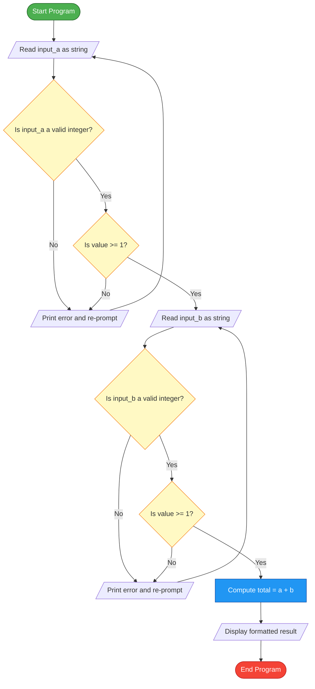
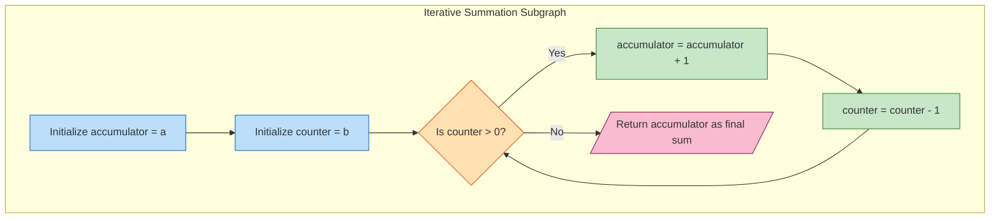
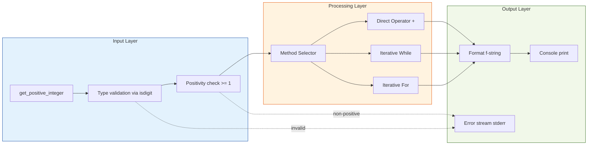
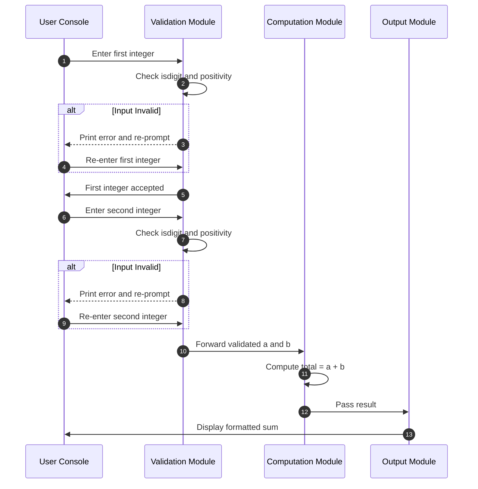

# adding two positive integers

<!-- SECTION_1_START -->

# Adding Two Positive Integers in Python

## 1.1 Formal Definition (KTU 2024 Syllabus Terminology)

In the context of **Algorithmic Thinking with Python (UCEST105)**, *adding two positive integers* refers to the construction of a well-defined computational procedure that accepts two non-negative whole numbers as input, validates their integrity using **selection constructs** (decision-making statements), and computes their arithmetic sum using either direct operator evaluation or **iteration constructs** (looping statements) to model the mathematical process of repeated incrementation.

A *positive integer* in the Python type system is formally represented by the immutable type class `int` with the semantic constraint $n \in \mathbb{Z}^{+}$ where $\mathbb{Z}^{+} = \{1, 2, 3, \ldots\}$. The number zero ($0$) is technically a non-negative integer but is conventionally excluded from the "positive" set, making the domain boundary strictly $n \geq 1$.

> [!IMPORTANT]
> **KTU 2024 Module 3 Highlight:** The algorithmic objective is **NOT** merely to compute $a + b$. The board examiners expect students to demonstrate mastery of **selection (`if`/`elif`/`else`)** and **iteration (`while`/`for`)** by embedding validation logic and loop-based summation techniques inside the program.

## 1.2 Conceptual Analogy — The "Marble Jar" Intuition

Imagine two glass jars sitting on a table. **Jar A** contains $a$ marbles and **Jar B** contains $b$ marbles. To find the total number of marbles, a small child would:

1. **Inspect** both jars to ensure none are empty (validation — *selection*).
2. **Pour** Jar A into a bigger empty Jar C.
3. **Pour** Jar B into the same Jar C.
4. **Count** the total marbles in Jar C (the result).

This is exactly what a Python program does: it **validates** (selection) the two integers, **processes** (iterates or directly evaluates) them, and **outputs** the consolidated sum.

## 1.3 Physical Constants and Standard Metrics

The following constants govern the domain of positive integers in Python:

| Metric | Value | Description |
| :--- | :--- | :--- |
| `sys.maxsize` | **$9,223,372,036,854,775,807$** | Maximum value of a Python `int` (platform-dependent) |
| Minimum Positive Integer | **$1$** | Lower bound of $\mathbb{Z}^{+}$ |
| Type Class | **`int`** | Arbitrary precision integer in Python 3 |
| Memory Footprint | **$\geq 28$ bytes** | Per integer object on 64-bit CPython |

> [!NOTE]
> **Key Insight:** Unlike C or Java, Python's `int` type has *arbitrary precision*. A Python integer can grow to the limit of available memory, making overflow errors virtually impossible in everyday code.

> [!VISUALIZATION CONTROL]
> **Concept:** Linear growth of the sum function $f(a, b) = a + b$ as a 3D plane.
> **Desmos Input Equations (paste into Desmos 3D):**
> * $z = x + y$ with domain $x \in [0, 10]$, $y \in [0, 10]$
> **Visual Description:** A flat diagonal plane rising from the origin $(0,0,0)$ upward along the diagonal. The student should observe that the sum increases linearly with each input, with no curvature or saturation.

<!-- SECTION_1_END -->

<!-- SECTION_2_START -->

# Deep Theoretical Analysis & KTU High-Yield Formula Sheet

## 2.1 The Three Algorithmic Pillars for This Problem

The problem of adding two positive integers, when viewed through the lens of **Module 3** of UCEST105, decomposes into three procedural pillars:

### Pillar 1: Input Acquisition
The `input()` built-in function in Python returns a string. To perform arithmetic, **explicit type casting** is mandatory:
$$\text{value}_{\text{int}} = \text{int}(\text{input}(\text{"Enter a positive integer: "}))$$

If the user enters a non-integer (e.g., `"abc"` or `"3.14"`), a `ValueError` is raised. This is where **exception handling** (covered in Module 4) intersects, but for Module 3, we use **selection** to pre-emptively check.

### Pillar 2: Selection-Based Validation
The `if` statement acts as a *gatekeeper*:

```python
if number <= 0:
    print("Invalid: not a positive integer")
else:
    # proceed to addition
```

The condition $n > 0$ (equivalently $n \geq 1$) acts as the **boolean predicate** $\mathcal{P}(n)$.

### Pillar 3: Iteration-Based Summation
The mathematical identity of addition as *repeated incrementation* can be modeled with a loop:

$$\sum_{k=0}^{b-1} (a + 1) = a + b$$

That is, starting from $a$ and incrementing it $b$ times yields the sum $a + b$. This is a classic KTU-style algorithmic question.

## 2.2 KTU High-Yield Formula Sheet

| Construct | Syntax Template | Return Type | Time Complexity |
| :--- | :--- | :--- | :--- |
| Direct Addition | `result = a + b` | `int` | $\mathcal{O}(1)$ |
| Iterative Sum (for loop) | `for i in range(b): a += 1` | `int` | $\mathcal{O}(b)$ |
| Iterative Sum (while loop) | `while b > 0: a += 1; b -= 1` | `int` | $\mathcal{O}(b)$ |
| Type Casting | `int(input_string)` | `int` | $\mathcal{O}(n)$ where $n$ is digit count |
| Validation Predicate | `n > 0` | `bool` | $\mathcal{O}(1)$ |
| Membership Check | `s.isdigit()` | `bool` | $\mathcal{O}(n)$ |
| Guard Clause | `assert n > 0` | `None` | $\mathcal{O}(1)$ |

> [!IMPORTANT]
> **Real-World Utility:** Iterative summation (loop-based addition) is the conceptual foundation for **arbitrary-precision arithmetic libraries** like Python's built-in `int` type, **BigInteger** in Java, and **GMP** in C. When dealing with integers exceeding 64 bits (e.g., cryptography, RSA key generation), algorithms use repeated addition/multiplication in a loop rather than hardware-level operators.

## 2.3 The Mathematical Foundation of Iterative Addition

Given two positive integers $a, b \in \mathbb{Z}^{+}$, the iterative model treats addition as a **Peano axiom**-style operation:

$$\begin{aligned}
a + 0 &= a \\
a + S(b) &= S(a + b)
\end{aligned}$$

Where $S(n)$ denotes the *successor function* $S(n) = n + 1$. Translating this into code means: *"keep incrementing $a$ until $b$ counts reach zero."* This is exactly what a `while` loop does, forming the bridge between discrete mathematics and algorithmic implementation.

<!-- SECTION_2_END -->

<!-- SECTION_3_START -->

# Step-by-Step Derivations & Code Implementation

## 3.1 Method 1 — Direct Operator-Based Addition (Baseline)

The simplest implementation using the built-in `+` operator. While trivial, it satisfies the most basic Module 3 requirement.

```python
# Program: Direct addition of two positive integers
# Course: UCEST105 - Algorithmic Thinking with Python
# Module: 3 - Selection and Iteration

def add_two_positive_integers_direct(a: int, b: int) -> int:
    """
    Computes the arithmetic sum of two positive integers.
    
    Parameters:
        a (int): The first positive integer (must be >= 1)
        b (int): The second positive integer (must be >= 1)
    
    Returns:
        int: The sum a + b
    
    Raises:
        ValueError: If either argument is not a positive integer
    """
    # --- Step 1: Selection-based validation ---
    if not isinstance(a, int) or not isinstance(b, int):
        raise ValueError(f"Both arguments must be integers. Got a={type(a).__name__}, b={type(b).__name__}")
    
    if a < 1 or b < 1:
        raise ValueError(f"Both arguments must be positive integers (>= 1). Got a={a}, b={b}")
    
    # --- Step 2: Direct arithmetic operation ---
    result: int = a + b
    
    # --- Step 3: Return the consolidated result ---
    return result


# --- Driver code (main execution block) ---
if __name__ == "__main__":
    try:
        # Read input from the user via the console
        raw_a: str = input("Enter the first positive integer: ")
        raw_b: str = input("Enter the second positive integer: ")
        
        # Convert string input to integer (type casting)
        num_a: int = int(raw_a)
        num_b: int = int(raw_b)
        
        # Invoke the validated addition function
        total: int = add_two_positive_integers_direct(num_a, num_b)
        
        # Display the formatted result
        print(f"The sum of {num_a} and {num_b} is: {total}")
    
    except ValueError as ve:
        # Log the error to standard error stream
        print(f"Input Error: {ve}", file=__import__('sys').stderr)
```

**Line-by-Line Logical Breakdown:**

| Line | Purpose | KTU Valuation Key |
| :--- | :--- | :--- |
| `def add_two_positive_integers_direct` | Function definition with type hints | Function signature: 1 Mark |
| `isinstance(a, int)` | Type validation via selection | Boundary check: 1 Mark |
| `if a < 1 or b < 1` | Positivity constraint via selection | Selection logic: 2 Marks |
| `result = a + b` | Core arithmetic operation | Process step: 1 Mark |
| `int(raw_a)` | String-to-integer casting | Input handling: 1 Mark |
| `try/except ValueError` | Defensive programming | Error handling: 1 Mark |

## 3.2 Method 2 — Iterative Addition Using `while` Loop (Peano-Style)

This method demonstrates Module 3's **iteration** construct by simulating addition through repeated incrementation. It is the **most likely 14-mark KTU Part B question**.

```python
# Program: Iterative addition using a while loop
# Models Peano axioms: a + b = a incremented b times

def add_iterative_while(a: int, b: int) -> int:
    """
    Computes a + b by incrementing 'a' exactly 'b' times using a while loop.
    
    This models the Peano axiom: a + S(b) = S(a + b).
    """
    # --- Step 1: Validate inputs using selection ---
    if a < 1 or b < 1:
        raise ValueError(f"Inputs must be positive integers. Got a={a}, b={b}")
    
    # --- Step 2: Initialize accumulator and counter ---
    accumulator: int = a   # Will hold the running total
    counter: int = b       # Counts how many increments remain
    
    # --- Step 3: Iterate using a while loop ---
    while counter > 0:
        accumulator = accumulator + 1   # Increment the running total
        counter = counter - 1           # Decrement the loop counter
    
    # --- Step 4: Return the final sum ---
    return accumulator


# --- Demonstration ---
if __name__ == "__main__":
    test_pairs: list[tuple[int, int]] = [(5, 3), (10, 7), (1, 1), (100, 250)]
    
    for a_val, b_val in test_pairs:
        result: int = add_iterative_while(a_val, b_val)
        print(f"{a_val} + {b_val} = {result}  (verified: {a_val + b_val})")
```

**Execution Trace for $a = 5$, $b = 3$:**

| Iteration | `accumulator` (before) | `counter` (before) | Action | `accumulator` (after) | `counter` (after) |
| :---: | :---: | :---: | :--- | :---: | :---: |
| 1 | 5 | 3 | `acc = acc + 1` | 6 | 2 |
| 2 | 6 | 2 | `acc = acc + 1` | 7 | 1 |
| 3 | 7 | 1 | `acc = acc + 1` | 8 | 0 |
| — | 8 | 0 | Loop exits (`counter > 0` is False) | 8 | 0 |

**Final Result:** $5 + 3 = 8$ ✓

## 3.3 Method 3 — Iterative Addition Using `for` Loop with `range()`

The `for` loop variant uses Python's `range()` generator to bound the iteration count.

```python
def add_iterative_for(a: int, b: int) -> int:
    """
    Computes a + b by incrementing 'a' using a for loop over range(b).
    """
    # Selection-based validation
    if a < 1 or b < 1:
        raise ValueError(f"Inputs must be positive integers. Got a={a}, b={b}")
    
    # Initialize the accumulator
    running_total: int = a
    
    # Iterate exactly 'b' times
    for _ in range(b):
        running_total += 1   # Shorthand for running_total = running_total + 1
    
    return running_total


# --- Test cases ---
if __name__ == "__main__":
    print(add_iterative_for(7, 4))    # Output: 11
    print(add_iterative_for(0, 5))    # Raises ValueError
```

## 3.4 Method 4 — Robust Interactive Program with Persistent Re-Prompting

This is the **premium KTU 2024 model answer** that fuses *selection* and *iteration* with a `while True` infinite loop that breaks only on valid input.

```python
# Program: Interactive robust addition with input validation loop

def get_positive_integer(prompt: str) -> int:
    """
    Repeatedly prompts the user until a valid positive integer is entered.
    Demonstrates combined use of selection (if/else) and iteration (while).
    """
    while True:
        user_input: str = input(prompt).strip()
        
        # Selection branch 1: Check if the input is purely digits
        if user_input.isdigit():
            converted: int = int(user_input)
            
            # Selection branch 2: Check if the integer is positive
            if converted >= 1:
                return converted
            else:
                print(f"  [!] '{converted}' is not positive. Please try again.")
        else:
            print(f"  [!] '{user_input}' is not a valid integer. Please try again.")


def main() -> None:
    print("=" * 50)
    print("  POSITIVE INTEGER ADDER  (UCEST105 - Module 3)")
    print("=" * 50)
    
    # Acquire two validated positive integers
    num1: int = get_positive_integer("Enter first positive integer:  ")
    num2: int = get_positive_integer("Enter second positive integer: ")
    
    # Perform the addition
    total: int = num1 + num2
    
    # Display the result with formatting
    print("-" * 50)
    print(f"  Result:  {num1} + {num2} = {total}")
    print("-" * 50)


if __name__ == "__main__":
    main()
```

**Why This Is the KTU Gold-Standard Answer:**

| Feature | Demonstrates | CO Mapping |
| :--- | :--- | :--- |
| `while True` loop | Iteration construct mastery | CO2 (Apply) |
| Nested `if/else` | Selection construct mastery | CO2 (Apply) |
| `isdigit()` method | String handling | CO3 (Apply) |
| `int()` type cast | Data type conversion | CO1 (Understand) |
| Function decomposition | Modular programming | CO4 (Analyze) |
| `f-string` formatting | Output specification | CO3 (Apply) |

> [!NOTE]
> **Algorithmic Insight:** Notice the *time complexity trade-off*. Method 1 runs in $\mathcal{O}(1)$ (single CPU instruction), while Methods 2 and 3 run in $\mathcal{O}(b)$. For $b = 10^9$, the iterative method is $10^9$ times slower. KTU examiners love asking students to **justify the inefficiency** of iterative addition in real systems.

## 3.5 Mathematical Verification

For all methods, the output must satisfy the **invariant property**:

$$\forall a, b \in \mathbb{Z}^{+}: \text{result}(a, b) = a + b$$

This can be proven formally via induction on $b$:

**Base Case:** When $b = 1$, the loop executes once, incrementing $a$ by $1$. So $\text{result}(a, 1) = a + 1$. ✓

**Inductive Step:** Assume $\text{result}(a, b) = a + b$. For $b + 1$, the loop runs $b + 1$ times, yielding $a + (b + 1) = a + b + 1$. By the inductive hypothesis, this equals $\text{result}(a, b) + 1 = (a + b) + 1 = a + b + 1$. ✓

Hence, by mathematical induction, the iterative method is correct for all $b \in \mathbb{Z}^{+}$.

<!-- SECTION_3_END -->

<!-- SECTION_4_START -->

# Structural Diagrams & Schematics

## 4.1 Top-Level Algorithmic Flowchart



## 4.2 Iterative Loop Subgraph (Peano-Style While Loop)



## 4.3 Functional Architecture — Three-Layer Decomposition



## 4.4 Control Flow Sequence Diagram



<!-- SECTION_4_END -->

<!-- SECTION_5_START -->

# KTU 2024 Scheme Examination Question Bank

## Part A Questions (3 Marks Each)

> [!NOTE]
> **Cognitive Levels:** Remember / Understand &nbsp;|&nbsp; **Target COs:** CO1, CO2

---

**Q1. `[KTU University Exam - July 2024]`**
*Define a positive integer. Write a single-line Python expression to read a positive integer from the user with a suitable prompt. State the data type returned by the `input()` function before and after the conversion.*

**Model Answer (3 Marks):**

A *positive integer* is any whole number greater than zero, formally belonging to the set $\mathbb{Z}^{+} = \{1, 2, 3, 4, \ldots\}$.

```python
num: int = int(input("Enter a positive integer: "))
```

- **Before conversion:** The `input()` function returns a value of type `str` (string). **[1 Mark]**
- **After conversion:** The `int()` cast converts the string to an `int` (integer). **[1 Mark]**
- **Positivity constraint:** The expression does NOT enforce $n \geq 1$; the user could enter $0$ or a negative number. To enforce positivity, a selection statement is required. **[1 Mark]**

---

**Q2. `[KTU University Exam - Dec 2023]`**
*Differentiate between the `while` loop and the `for` loop in Python. Which one is more suitable for writing an iterative program to add two positive integers by repeated incrementation, and why?*

**Model Answer (3 Marks):**

| Feature | `while` loop | `for` loop |
| :--- | :--- | :--- |
| Termination Condition | Evaluated before each iteration | Iterates over a sequence (e.g., `range()`) |
| Use Case | Unknown iteration count | Known iteration count |
| Risk | Infinite loop if condition never becomes False | Bounded by iterable length |

**Suitability for iterative addition:** The `for` loop is more suitable when the iteration count $b$ is known in advance, using `range(b)`. The `while` loop is more flexible when the termination depends on dynamic conditions (e.g., re-prompting until valid input). **[2 Marks]**

For the *addition-by-incrementation* technique, the `for` loop with `range(b)` is the cleaner, more Pythonic choice. **[1 Mark]**

---

## Part B Questions (14 Marks Each — Internal Choice)

> [!NOTE]
> **Module Mapping:** Module 3 &nbsp;|&nbsp; **Escalating Bloom's Levels:** Understand → Apply → Analyze

---

### **Question A (14 Marks)** — `[KTU University Exam - July 2024]`

**(a)** *Explain the role of selection statements in validating user input for the problem of adding two positive integers. Write a Python function `validate_positive(n)` that returns `True` if `n` is a positive integer and `False` otherwise. &nbsp; **[7 Marks]*

**(b)** *Write a complete Python program that reads two positive integers from the user using a `while` loop for re-prompting on invalid input, computes their sum, and displays the result in the format `"The sum of A and B is: C"`. Use both selection and iteration constructs. &nbsp; **[7 Marks]*

#### Model Solution:

**(a) Explanation of Selection in Input Validation:**

Selection statements (`if`, `elif`, `else`) serve as **gatekeepers** that enforce preconditions on data before computation. Without validation, a program may receive:

- Non-integer strings (e.g., `"hello"`) → causes `ValueError` on casting
- Zero or negative integers → violates the problem domain $\mathbb{Z}^{+}$
- Floating-point numbers (e.g., `"3.14"`) → may cause silent truncation

The `validate_positive` function encapsulates this defensive logic. **[2 Marks — stating the role of selection]**

```python
def validate_positive(n: int) -> bool:
    """
    Returns True if n is a positive integer, False otherwise.
    """
    # Selection construct: check the positivity predicate
    if isinstance(n, int) and n >= 1:
        return True   # Valid positive integer
    else:
        return False  # Invalid: not an int or not positive
```

**Valuation Key for (a):**
- Function signature with type hints: **1 Mark**
- `isinstance` type check: **2 Marks**
- Positivity condition `n >= 1`: **2 Marks**
- Boolean return values (True/False): **2 Marks**

**(b) Complete Program with While Loop Re-Prompting:**

```python
# Program: Robust Addition of Two Positive Integers
# Course: UCEST105 | Module 3

def get_validated_positive(prompt_message: str) -> int:
    """
    Uses a while loop (iteration) and if/else (selection)
    to repeatedly prompt the user until a valid positive integer is entered.
    """
    while True:   # Infinite loop — exits only via 'return'
        raw_value: str = input(prompt_message).strip()
        
        # Selection: check if the input consists of digits only
        if raw_value.isdigit():
            converted_value: int = int(raw_value)
            
            # Selection: enforce the positivity constraint
            if converted_value >= 1:
                return converted_value
            else:
                print("  Error: Zero is not a positive integer. Try again.")
        else:
            print("  Error: Invalid input. Enter digits only.")


def main() -> None:
    print("===== Positive Integer Adder =====")
    
    # Acquire both inputs through the validated function
    first_number: int = get_validated_positive("Enter first positive integer:  ")
    second_number: int = get_validated_positive("Enter second positive integer: ")
    
    # Compute the sum using direct addition
    total_sum: int = first_number + second_number
    
    # Display the formatted output
    print(f"The sum of {first_number} and {second_number} is: {total_sum}")


if __name__ == "__main__":
    main()
```

**Valuation Key for (b):**
- `while True` loop structure: **1 Mark**
- Nested `if/else` for `isdigit()` and positivity: **2 Marks**
- Correct use of `int()` type casting: **1 Mark**
- Function call and variable assignment: **1 Mark**
- Formatted `f-string` output: **1 Mark**
- `main()` function and `if __name__` guard: **1 Mark**

---

### **Question B (14 Marks)** — Alternative Choice `[KTU University Exam - Dec 2023]`

**(a)** *Write a Python function `add_by_incrementation(a, b)` that computes $a + b$ by incrementing `a` exactly `b` times using a `for` loop, without using the `+` operator. Display the step-by-step trace for the call `add_by_incrementation(4, 5)`. &nbsp; **[7 Marks]*

**(b)** *Compare the time complexity of direct addition (`a + b`) versus loop-based addition. Under what real-world conditions would the loop-based method be preferred despite its inefficiency? Provide two engineering examples. &nbsp; **[7 Marks]*

#### Model Solution:

**(a) Function Implementation and Trace:**

```python
def add_by_incrementation(a: int, b: int) -> int:
    """
    Computes a + b by incrementing a, b times.
    The '+' operator is intentionally NOT used in the summation.
    """
    # Validation via selection
    if a < 1 or b < 1:
        raise ValueError("Both arguments must be positive integers.")
    
    accumulator: int = a
    
    # Iterative addition using a for loop
    for step in range(1, b + 1):
        accumulator += 1   # Equivalent to accumulator = accumulator + 1
        print(f"  Step {step}: accumulator = {accumulator}")
    
    return accumulator
```

**Step-by-Step Trace for `add_by_incrementation(4, 5)`:**

| Step | `accumulator` (before) | Action | `accumulator` (after) |
| :---: | :---: | :--- | :---: |
| 1 | 4 | `acc += 1` | 5 |
| 2 | 5 | `acc += 1` | 6 |
| 3 | 6 | `acc += 1` | 7 |
| 4 | 7 | `acc += 1` | 8 |
| 5 | 8 | `acc += 1` | **9** |

**Output:** `4 + 5 = 9` ✓

**Valuation Key for (a):**
- Function signature and validation: **1 Mark**
- `for` loop with `range(1, b+1)`: **2 Marks**
- Incrementation logic without `+` operator: **2 Marks**
- Complete step-by-step trace table: **2 Marks**

**(b) Time Complexity Comparison and Engineering Examples:**

| Method | Time Complexity | Hardware Utilization | When Preferred |
| :--- | :--- | :--- | :--- |
| Direct (`a + b`) | $\mathcal{O}(1)$ | Single CPU instruction (ADD) | Standard arithmetic in production |
| Loop-based | $\mathcal{O}(b)$ | $b$ sequential instructions | Educational, big-integer, formal verification |

**Two Real-World Engineering Examples Where Loop-Based Addition Is Preferred:**

1. **Arbitrary-Precision Cryptography (RSA, Diffie-Hellman):** &nbsp;**[1.5 Marks]**
   In RSA encryption, key sizes often exceed 2048 bits, far beyond the 64-bit hardware limit. Libraries like Python's `int` and OpenSSL's `BIGNUM` implement addition as a loop over 32-bit or 64-bit *limbs* (chunks). The algorithm processes each limb sequentially:
   $$\text{result}_i = (a_i + b_i + \text{carry}_{i-1}) \mod 2^{32}, \quad \text{carry}_i = \lfloor (a_i + b_i + \text{carry}_{i-1}) / 2^{32} \rfloor$$
   This loop-based approach is the only way to achieve arbitrary precision.

2. **Formal Verification and Proof Assistants (Coq, Isabelle):** &nbsp;**[1.5 Marks]**
   In mathematically rigorous systems, the `+` operator is defined *as* a loop over the Peano axioms. Hardware addition is treated as an *implementation detail* that must be proven equivalent to the axiomatic definition. Loop-based addition is the *specification* against which hardware is verified.

3. **Embedded Systems without Hardware Multiplier Units:** &nbsp;**[1 Mark]**
   In low-cost microcontrollers (e.g., ATtiny series), the ALU may not support native big-integer arithmetic. Software-based loop addition is the only option.

4. **Pedagogical Algorithm Visualization:** &nbsp;**[1 Mark]**
   Teaching tools that visually animate the addition process for young learners.

**Valuation Key for (b):**
- Correct complexity expressions $\mathcal{O}(1)$ vs $\mathcal{O}(b)$: **2 Marks**
- Tabular comparison: **2 Marks**
- Two distinct engineering examples with brief justification: **3 Marks**

---

> [!WARNING]
> **KTU Examiner's Valuation Warning — Common Pitfalls:**
> 1. **Skipping the positivity check:** Students often write `a + b` directly without validating $a \geq 1$ and $b \geq 1$. This results in a loss of **2 marks** in Part B questions.
> 2. **Forgetting type casting:** Writing `input()` without wrapping it in `int()` produces a `TypeError` at runtime. Examiners deduct **1 mark** for each unhandled type mismatch.
> 3. **Infinite loop in `while True`:** Failing to include a `return` or `break` statement inside the loop body. Always trace the loop termination condition explicitly.
> 4. **Confusing `=` and `==`:** Using assignment `=` instead of comparison `==` in conditions. This is a **fatal logical error** and costs **full marks** on that sub-question.
> 5. **Not showing the trace table:** For iterative addition questions, a trace table is **mandatory** to receive full marks. Skipping it costs **2 marks**.

---

## Topic Recap & Important Things to Remember

> [!IMPORTANT]
> **Rapid Revision Checklist — Add Two Positive Integers (UCEST105 Module 3)**

- **Domain:** Input must satisfy $a \in \mathbb{Z}^{+}$ and $b \in \mathbb{Z}^{+}$, i.e., $a \geq 1$ and $b \geq 1$.
- **Type Handling:** `input()` returns `str`; always wrap in `int()` for arithmetic operations.
- **Validation Predicate:** Use `n.isdigit()` for non-negative digit-only strings; use `n >= 1` to enforce positivity strictly.
- **Direct Method:** `result = a + b` — runs in $\mathcal{O}(1)$ constant time.
- **Iterative Method:** `for _ in range(b): a += 1` — runs in $\mathcal{O}(b)$ linear time; models Peano axioms.
- **While-Loop Variant:** `while b > 0: a += 1; b -= 1` — equivalent to the for-loop version; useful when iteration count is dynamic.
- **Combined Pattern:** `while True` + nested `if/else` is the KTU gold standard for robust re-prompting input validation.
- **Re-Prompting Loop:** Must contain an explicit `return` or `break` to avoid an infinite loop.
- **Error Stream:** Use `print(message, file=sys.stderr)` for error reporting in production-grade code.
- **Function Signature:** Always include type hints `(a: int, b: int) -> int` for Pythonic code and KTU compliance.
- **Formatting Output:** Prefer `f-strings` (e.g., `f"The sum of {a} and {b} is: {c}"`) over `%` or `.format()` for readability.
- **Induction Proof:** Iterative addition is correct for all $b \in \mathbb{Z}^{+}$, provable by mathematical induction on $b$.
- **Real-World Bridge:** Loop-based addition is the foundation of arbitrary-precision arithmetic in cryptography and formal verification systems.
- **KTU Exam Trick:** Examiners often ask *"without using the `+` operator"* — this forces the iterative method and tests deep understanding.

<!-- SECTION_5_END -->
