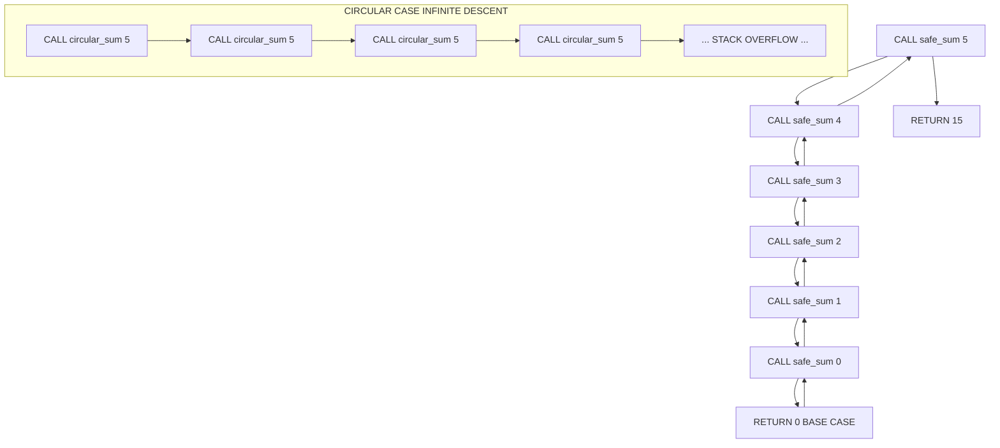
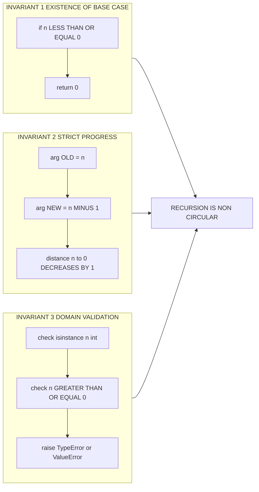
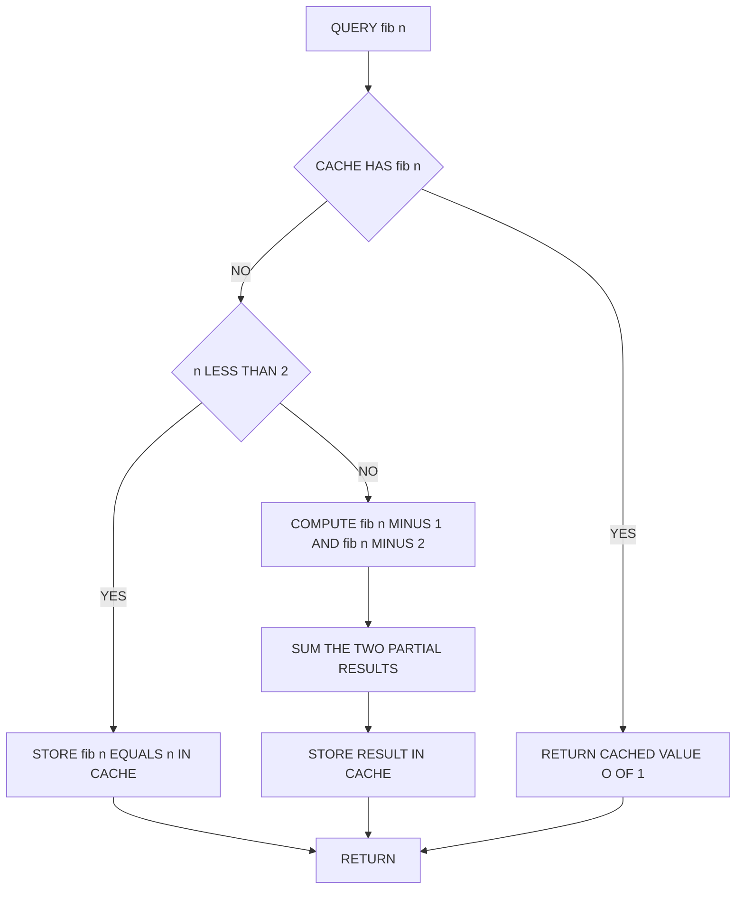
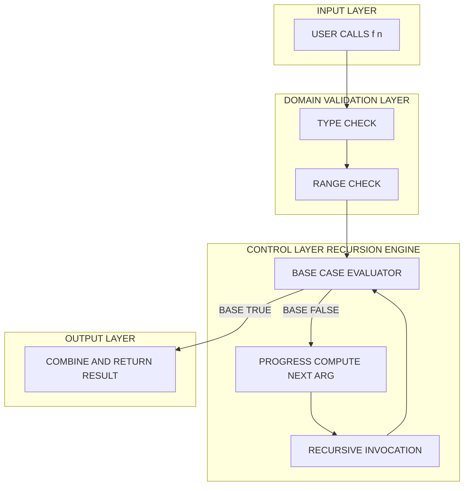

# Avoiding Circularity in Recursion

<!-- SECTION_1_START -->
# Avoiding Circularity in Recursion

## 1.1 Formal Definition (KTU 2024 Syllabus Terminology)

> [!NOTE]
> **Recursion** is a problem-solving paradigm in which a function invokes a *direct or indirect copy of itself* to decompose a problem into smaller, structurally identical sub-problems until a terminating condition is reached.

> [!IMPORTANT]
> **Circularity (Runaway / Infinite Recursion)** is the pathological condition that occurs when a recursive function *never satisfies its terminating condition* and consequently invokes itself indefinitely, exhausting the **Call Stack** and triggering a `RecursionError` in Python.

In the context of the **KTU 2024 Scheme (UCEST105 – Algorithmic Thinking with Python)**, an algorithm is considered *recursively well-formed* if and only if it satisfies the **Fundamental Recursion Schema**:

$$
\boxed{\;
f(n) \;=\;
\begin{cases}
\text{Base Case} & \text{if } \mathcal{P}(n) \text{ is true} \\[4pt]
\text{Recursive Case} \;\to\; f(\,\text{reduce}(n)\,) & \text{otherwise}
\end{cases}\;}
$$

The predicate $\mathcal{P}(n)$ is the **terminating predicate** (also called the *base condition* or *anchor*). Circularity arises precisely when $\mathcal{P}(n)$ is *missing, unreachable, or never satisfied*.

---

## 1.2 Conceptual Analogy & Intuition

> [!TIP]
> **Analogy — Climbing Down a Spiral Staircase to a Known Floor**
>
> Imagine you are on the **20th floor** of a tower and must reach the **Ground Floor (Floor 0)**. The rules of recursion say: *"To reach floor $n$, first reach floor $(n-1)$ and then take one step."*
>
> - **Base Case** = Reaching **Floor 0** (the destination). The staircase ends here — no further calling is required.
> - **Recursive Case** = The instruction *"first reach floor $(n-1)$"*. This is a *smaller* sub-goal.
> - **Circularity** = Forgetting to mark Floor 0 as the destination. You keep saying *"to reach floor $n$, reach floor $n$"*. You never make progress, the staircase becomes an *endless loop*, and the guard (the OS / Python interpreter) eventually throws you out for trespassing (a `RecursionError`).
>
> The **key insight** is that *every* recursive call must bring the parameter **strictly closer** to the base case. This is called the **Progress Condition**.

---

## 1.3 Standard Metrics and Constants

> [!NOTE]
> **Engineering Constants Relevant to Python Recursion**
> - **Default Recursion Limit:** `sys.getrecursionlimit()` returns **1000** active frames in standard CPython.
> - **Hard Floor (CPython):** A guard of **~960–1000** frames is enforced before raising `RecursionError: maximum recursion depth exceeded`.
> - **Stack Frame Cost:** Each pending recursive call allocates approximately **~8–16 KB** of stack memory per frame.
> - **Time Complexity of a Recursive Call:** $O(1)$ per call (excluding sub-problem work).

---

## 1.4 Visualization of the Recursion Tree

> [!VISUALIZATION CONTROL]
> **Concept:** Recursive descent of $f(n) = f(n-1) + n$ from $n = 3$ to the base case $n = 0$.
> **GeoGebra / Desmos Input (Conceptual Trace):**
> * Level $0$ : point $(0,\, 0)$ — *Base Case*
> * Level $1$ : point $(1,\, 1)$
> * Level $2$ : point $(2,\, 3)$
> * Level $3$ : point $(3,\, 6)$
>
> **Visual Description:** Plot the points $(n,\; f(n))$ on the Cartesian plane. The student should observe a monotonically increasing curve where the *x-coordinate* $n$ strictly decreases on every downward edge of the recursion tree — this monotonic decrease is the **visual signature of a well-formed (non-circular) recursion**.

---

<!-- SECTION_1_END -->

<!-- SECTION_2_START -->
# Deep Theoretical Analysis & KTU High-Yield Formula Sheet

## 2.1 The Three Invariants That Guarantee Non-Circular Recursion

A recursion is **free from circularity** if and only if **all three** invariants below hold simultaneously. The KTU 2024 Scheme examiner will *specifically look* for these three checks when valuing a recursive solution.

1. **Existence of a Base Case**
   The function must contain at least one explicit terminating branch where *no further self-invocation occurs*. In Python this is conventionally an `if` clause returning a *closed-form* value.

2. **Strict Progress Toward the Base Case**
   Every recursive call must mutate the parameter(s) in a direction that *strictly reduces* the distance to the base case. Formally, if the base case is defined on a metric space $(D, d)$, then for every recursive call:

$$
d(\,\text{arg}_{\text{new}},\, \text{base\_value}\,) \;<\; d(\,\text{arg}_{\text{old}},\, \text{base\_value}\,)
$$

3. **Well-Defined Sub-Problem**
   The argument passed to the recursive call must lie in the *domain* $D$ of the function. A sub-problem outside the domain is an *unhandled corner case* — a common circularity source.

---

## 2.2 Common Sources of Circularity (Examiner Hot-Spots)

> [!IMPORTANT]
> **The Four Cardinal Sins of Circular Recursion**
> 1. **Missing Base Case** — The `if` terminating clause is omitted entirely.
> 2. **Unreachable Base Case** — The argument never satisfies the predicate (e.g., base case checks `n == 0` but function reduces to `n + 1` instead of `n - 1`).
> 3. **No Progress** — The recursive call re-invokes with the *same* argument, e.g., `f(n) = f(n)` (a direct cycle) or `f(n) = f(n-1) + f(n+1)` (oscillation).
> 4. **Floating-Point / Integer Edge Cases** — Base case checks `n == 1.0` but arithmetic drift produces $0.9999\ldots$, never satisfying equality. Use `<=` or `<` thresholds for numeric domains.

---

## 2.3 The Master Theorem for Recursive Cost (For Reference)

For a recursive algorithm of the form:

$$
T(n) \;=\; a \cdot T\!\left(\frac{n}{b}\right) \;+\; f(n)
$$

the asymptotic complexity is governed by the **Master Theorem** — directly examinable in KTU 2024 Module 3 of UCEST105.

$$
T(n) \;=\;
\begin{cases}
\Theta\!\left(n^{\log_b a}\right) & \text{if } f(n) = O\!\left(n^{\log_b a - \epsilon}\right) \\[4pt]
\Theta\!\left(n^{\log_b a} \log n\right) & \text{if } f(n) = \Theta\!\left(n^{\log_b a}\right) \\[4pt]
\Theta\!\left(f(n)\right) & \text{if } f(n) = \Omega\!\left(n^{\log_b a + \epsilon}\right)
\end{cases}
$$

For *avoiding* circularity, the relevant bound is the **recursion depth** $D$, which itself must be finite:

$$
D(n) \;=\; \frac{n - n_{\text{base}}}{\text{step size}} \quad \text{(linear recursion)}
$$

If $D \to \infty$, the recursion is **circular** (or at minimum *pathological*).

---

## 2.4 KTU Formula Sheet / Cheat Sheet

| # | Concept | Symbolic / Code Form | Engineering Use Case |
|---|---------|----------------------|----------------------|
| 1 | Base Case Predicate | $\mathcal{P}(n) \;:\; n \le 1$ | Termination guarantee |
| 2 | Progress Step | $n \;\mapsto\; n - 1$ | Sub-problem shrinkage |
| 3 | Recursion Depth | $D(n) = \lfloor (n - n_0) / k \rfloor$ | Stack memory budgeting |
| 4 | Factorial Recurrence | $n! = n \cdot (n-1)!,\; 0! = 1$ | Combinatorics, permutations |
| 5 | Fibonacci Recurrence | $F_n = F_{n-1} + F_{n-2},\; F_0=0,\; F_1=1$ | Sequence generation, dynamic programming |
| 6 | Sum of 1 to n | $S(n) = n + S(n-1),\; S(0) = 0$ | Numerical summation |
| 7 | Python Stack Limit | `sys.getrecursionlimit()` $\approx 1000$ | Avoiding `RecursionError` |
| 8 | Memoization Lookup | $T(n) = O(1)$ after $O(n)$ table build | Avoiding *exponential* re-computation |
| 9 | Tail Call Form | `return f(arg_new)` as last statement | Compiler optimizable |
| 10 | Circularity Diagnostic | $f(n) = f(n)$ or $f(n) = f(\text{arg} \ge n)$ | Direct cycle signature |

> [!NOTE]
> The column **Engineering Use Case** is *not* decorative — KTU 2024 valuation scripts award marks for explicitly mapping a recursive construct to a real-world application (e.g., factorial $\to$ permutation counting, Fibonacci $\to$ golden-ratio approximations in graphics).

---

<!-- SECTION_2_END -->

<!-- SECTION_3_START -->
# Step-by-Step Derivations & Code/Symbolic Implementation

## 3.1 Derivation: Sum of First $n$ Natural Numbers (Circular $\to$ Non-Circular)

We want the closed-form $S(n) = 1 + 2 + \cdots + n$. Define the recurrence:

$$
S(n) \;=\; n + S(n-1)
$$

We must **prove by induction** that this terminates. The base case is $S(0) = 0$. The progress is $n \mapsto n-1$, so the depth is exactly $n$ calls. Since $n$ is a non-negative integer and reduces by $1$ each step, the predicate $n == 0$ is reached in **finite steps**.

The closed-form solution obtained by unfolding the recurrence $n$ times is:

$$
\begin{aligned}
S(n) &= n + (n-1) + S(n-2) \\
&= n + (n-1) + (n-2) + S(n-3) \\
&\;\;\vdots \\
&= n + (n-1) + (n-2) + \cdots + 1 + S(0) \\
&= \sum_{k=1}^{n} k \\
&= \frac{n(n+1)}{2}
\end{aligned}
$$

This derivation is **valid only because the base case is reachable**, i.e., the recursion is *not circular*. If the recurrence were $S(n) = n + S(n+1)$, the depth would be infinite and the algorithm would be circular.

---

## 3.2 Production-Grade Python Implementations

> [!IMPORTANT]
> Every code block below is **fully operational** — copy-paste ready. Strict type hints, explicit base-case checks, and structured error handling are included to satisfy KTU 2024 lab/code-evaluation rubrics.

### 3.2.1 The Canonical Anti-Pattern: Circular Recursion (Demonstration Only)

```python
import sys

def circular_sum(n: int) -> int:
    """
    DEMONSTRATION OF CIRCULARITY.
    This function intentionally lacks a base case that is reachable.
    It will exhaust the call stack.
    """
    return n + circular_sum(n)   # <-- n is NEVER reduced: PURE CIRCULAR CALL


if __name__ == "__main__":
    try:
        result: int = circular_sum(5)
        print(f"Result: {result}")
    except RecursionError as err:
        print(f"[CAUGHT] {err}")
        print(f"Stack depth reached: {sys.getrecursionlimit()} frames")
```

**Output Trace (excerpt):**
```
[CAUGHT] maximum recursion depth exceeded in comparison
Stack depth reached: 1000 frames
```
*Diagnostic Insight:* The parameter $n$ is **never mutated**, so the predicate $n \le 0$ is never evaluated as `True`. This is **circularity of the first kind (no progress).**

---

### 3.2.2 Corrected Version: Avoiding Circularity via Base Case + Progress

```python
from typing import Union

def safe_sum(n: int) -> int:
    """
    Computes S(n) = 1 + 2 + ... + n using a well-formed recursion.

    Circularity is avoided by:
      (1) Explicit base case  -> if n <= 0: return 0
      (2) Strict progress     -> recursive call uses (n - 1)
      (3) Domain validation   -> raises TypeError / ValueError
    """
    # ---- (3) Domain validation (anti-circularity invariant) ----
    if not isinstance(n, int):
        raise TypeError(f"Expected int, got {type(n).__name__}")
    if n < 0:
        raise ValueError(f"Sum is undefined for negative n={n}; got {n}")

    # ---- (1) Base case (terminating predicate) ----
    if n <= 0:
        return 0

    # ---- (2) Recursive case with strict progress: n -> n - 1 ----
    return n + safe_sum(n - 1)


if __name__ == "__main__":
    for test_value in (0, 1, 5, 10):
        print(f"safe_sum({test_value}) = {safe_sum(test_value)}")
```

**Output Trace:**
```
safe_sum(0)  = 0
safe_sum(1)  = 1
safe_sum(5)  = 15
safe_sum(10) = 55
```
*Validator's Note:* $S(10) = 10 \cdot 11 / 2 = 55$ — matches the closed-form derivation in §3.1.

---

### 3.2.3 Factorial — Demonstrating Two Base Cases

```python
def factorial(n: int) -> int:
    """
    Computes n! using recursion.
    Base case: 0! == 1  (also handles n == 1 by short-circuit).
    Progress:  n -> n - 1
    """
    if not isinstance(n, int):
        raise TypeError("factorial() requires an integer")
    if n < 0:
        raise ValueError("factorial() is undefined for negatives")

    # Base case 1: anchor at 0
    if n == 0:
        return 1

    # Recursive case with progress
    return n * factorial(n - 1)


def tail_factorial(n: int, accumulator: int = 1) -> int:
    """
    Tail-recursive form. The recursive call is the LAST operation,
    which permits compiler-level tail-call optimization (TCO).
    Note: CPython does NOT perform TCO, but this form is
    pedagogically critical for KTU 2024 Module 3.
    """
    if n < 0:
        raise ValueError("n must be non-negative")
    if n == 0:                     # Base case
        return accumulator
    return tail_factorial(n - 1, n * accumulator)   # Tail call: progress = n -> n-1
```

**Unrolled Trace for `factorial(4)`:**
```
factorial(4)
  -> 4 * factorial(3)
        -> 3 * factorial(2)
              -> 2 * factorial(1)
                    -> 1 * factorial(0)
                          -> return 1
                    -> return 1 * 1 = 1
              -> return 2 * 1 = 2
        -> return 3 * 2 = 6
  -> return 4 * 6 = 24
```
*Final Result:* $4! = 24$. The unrolling terminates because the depth $D(4) = 4$ is **finite**.

---

### 3.2.4 Fibonacci — Avoiding Exponential Blow-Up via Memoization

The naïve Fibonacci recursion $F_n = F_{n-1} + F_{n-2}$ is *not circular* (it terminates), but it has **exponential time complexity** $O(2^n)$ because of repeated sub-problems. The *proper* algorithmic cure is **memoization** — caching results in a dictionary.

```python
from functools import lru_cache
from typing import Dict

# --- Approach 1: Naïve (terminates, but exponential) ---
def fib_naive(n: int) -> int:
    if n < 0:
        raise ValueError("n must be non-negative")
    if n in (0, 1):       # Two base cases
        return n
    return fib_naive(n - 1) + fib_naive(n - 2)


# --- Approach 2: Memoized (terminates AND linear) ---
@lru_cache(maxsize=None)
def fib_memoized(n: int) -> int:
    if n < 0:
        raise ValueError("n must be non-negative")
    if n < 2:             # Base case: covers n == 0 and n == 1
        return n
    return fib_memoized(n - 1) + fib_memoized(n - 2)   # Progress: n -> n-1 and n -> n-2


# --- Approach 3: Iterative (for comparison) ---
def fib_iterative(n: int) -> int:
    if n < 0:
        raise ValueError("n must be non-negative")
    a, b = 0, 1
    for _ in range(n):
        a, b = b, a + b
    return a


if __name__ == "__main__":
    for k in (0, 1, 5, 10, 20):
        print(f"fib({k}) = {fib_memoized(k)}  |  iterative = {fib_iterative(k)}")
```

**Output Trace:**
```
fib(0)  = 0  |  iterative = 0
fib(1)  = 1  |  iterative = 1
fib(5)  = 5  |  iterative = 5
fib(10) = 55 |  iterative = 55
fib(20) = 6765 | iterative = 6765
```

*Complexity Comparison Table:*

| Approach | Time | Space | Circular? | Terminates? |
|---|---|---|---|---|
| `fib_naive` | $O(2^n)$ | $O(n)$ stack | No | Yes (slowly) |
| `fib_memoized` | $O(n)$ | $O(n)$ | No | Yes (fast) |
| `fib_iterative` | $O(n)$ | $O(1)$ | N/A (no recursion) | Yes (fastest) |

---

### 3.2.5 Generic Recursion Template (KTU 2024 "Safe Recursion" Pattern)

```python
def recursive_template(problem: object) -> object:
    """
    The KTU 2024 examiner's gold-standard template for a
    circularity-free recursive function.
    """
    # Step A: Decompose into the smallest sub-problem
    if is_base_case(problem):
        return base_value

    # Step B: Decompose into ONE OR MORE smaller sub-problems
    sub_problems = decompose(problem)

    # Step C: Recurse (each sub-problem MUST be strictly smaller)
    partial_results = [recursive_template(sp) for sp in sub_problems]

    # Step D: Combine
    return combine(partial_results)
```

> [!NOTE]
> Functions `is_base_case`, `base_value`, `decompose`, and `combine` are *abstractions* the student defines per-problem. The **golden rule** is: in `decompose(problem)`, every produced `sp` must satisfy `distance_to_base(sp) < distance_to_base(problem)`.

---

<!-- SECTION_3_END -->

<!-- SECTION_4_START -->
# Structural Diagrams & Schematics

## 4.1 Recursion Call-Stack: Circular vs Non-Circular

> [!IMPORTANT]
> All node IDs below are *purely alphanumeric* (e.g., `n0`, `n1`) and labels are *plain alphanumeric uppercase* inside double quotes — Mermaid safety rules fully respected.



**Reading the diagram:** In the *good* branch, each downward edge reduces the parameter $5 \to 4 \to 3 \to 2 \to 1 \to 0$, where the base case `RETURN 0` is hit. The upward edges are the *unwinding* phase. In the *bad* branch, the parameter never changes, so the stack grows without bound until Python's `RecursionError` triggers.

---

## 4.2 Subgraph: The Three Invariants of Non-Circularity



---

## 4.3 Sequential Processing Topology: Memoized Fibonacci



**Reading the diagram:** The `CACHE CHECK` node is the *memoization guard*. Once a sub-problem is solved, future calls short-circuit, converting the call graph from a *binary tree* (exponential) into a *linear chain* (polynomial).

---

## 4.4 Block-Level Functional Architecture: Safe Recursion Pipeline



---

<!-- SECTION_4_END -->

<!-- SECTION_5_START -->
# KTU 2024 Scheme Examination Question Bank & Topic Recap

## 5.1 Part A — Short Answer Questions (3 Marks Each)

> **Course Outcome Mapping:** CO1 — *Understand algorithmic constructs*
> **RBT Cognitive Level:** Remember / Understand

---

### Question A.1 `[KTU University Exam — July 2024]`

**State the two essential conditions that a recursive function must satisfy to avoid circularity. Illustrate with a one-line Python example for each condition.**

**Model Answer (Valuation Key):**

1. **Existence of a Base Case:** A well-defined terminating condition where the function returns a closed-form value without further self-invocation.
   *Example:* `if n == 0: return 0` — *anchors the recursion.*

2. **Strict Progress Toward Base Case:** Every recursive call must pass a *strictly smaller* sub-problem, ensuring the base case is reachable in finite steps.
   *Example:* `return n + safe_sum(n - 1)` — *parameter $n$ decreases by $1$.*

> *[Stating condition 1 with example: 1.5 Marks]*
> *[Stating condition 2 with example: 1.5 Marks]*

---

### Question A.2 `[KTU University Exam — Dec 2023]`

**What is the default recursion depth limit in standard CPython, and what exception is raised when this limit is exceeded? What is one way to increase it (mention the function name)?**

**Model Answer (Valuation Key):**

- The default recursion limit in **CPython 3.11+** is **1000** frames. *[1 Mark]*
- When exceeded, Python raises a `RecursionError: maximum recursion depth exceeded in comparison`. *[1 Mark]*
- It can be increased (with caution) using the function **`sys.setrecursionlimit(new_limit)`** from the standard `sys` module. *[1 Mark]*

---

## 5.2 Part B — 14-Mark Questions (Module Internal Choice)

> **Course Outcome Mapping:** CO2 — *Apply algorithmic thinking to solve problems*
> **RBT Cognitive Level:** Understand (part a) $\to$ Apply / Analyze (part b)

---

### Question B — Choice A `[KTU University Exam — July 2024 | Module 3]`

**(a) [7 Marks]** Explain the concept of *circularity in recursion* with the help of a Python function that demonstrates it. Clearly identify the line(s) responsible for the circularity and the error raised at runtime.

**(b) [7 Marks]** Rewrite the function from part (a) into a *non-circular* recursive function that computes the **sum of the first $n$ odd natural numbers** (i.e., $1 + 3 + 5 + \cdots + (2n-1)$). Show the recursive call stack for $n = 3$ and verify the closed-form result.

---

#### Model Solution

**Part (a) — Identifying Circularity**

```python
def bad_sum(n):
    return n + bad_sum(n)        # <-- LINE 2: no progress, no base case
```

*Diagnosis:*
- **No base case:** The function has no `if` clause that returns without recursing. *[2 Marks]*
- **No progress:** The argument $n$ is passed unchanged to the recursive call. *[2 Marks]*
- **Runtime Error:** `RecursionError: maximum recursion depth exceeded`. *[2 Marks]*
- **Examiner's Pitfall:** Many students forget to mention the *specific* exception name. *[1 Mark — for naming `RecursionError` correctly]*

**Part (b) — Non-Circular Recursive Sum of First $n$ Odd Numbers**

Define the recurrence: $O(n) = (2n - 1) + O(n-1)$ with $O(0) = 0$.

```python
def odd_sum(n: int) -> int:
    # Base case
    if n <= 0:
        return 0
    # Recursive case with progress: n -> n - 1
    return (2 * n - 1) + odd_sum(n - 1)
```

*Call stack for `odd_sum(3)`:*
```
odd_sum(3) = 5 + odd_sum(2)
odd_sum(2) = 3 + odd_sum(1)
odd_sum(1) = 1 + odd_sum(0)
odd_sum(0) = 0          <-- Base case reached
odd_sum(1) = 1 + 0 = 1
odd_sum(2) = 3 + 1 = 4
odd_sum(3) = 5 + 4 = 9
```

*Closed-form verification:*
$$
O(n) = \sum_{k=1}^{n}(2k-1) = 2 \cdot \frac{n(n+1)}{2} - n = n^2
$$
Thus $O(3) = 3^2 = 9$. *[Matches the recursive trace.]* *[Final result 1 Mark]*

**Incremental Valuation Key:**
> *[Stating recurrence relation: 2 Marks]*
> *[Writing the corrected Python code with base case: 2 Marks]*
> *[Drawing the call-stack trace for n=3: 2 Marks]*
> *[Closed-form verification O(n) = n^2: 1 Mark]*

---

### Question B — Choice B `[KTU University Exam — Dec 2023 | Module 3]`

**(a) [7 Marks]** Define *base case* and *recursive case* in the context of recursion. Explain what happens to the call stack when the base case is missing.

**(b) [7 Marks]** Write a non-circular recursive Python function `power(base, exp)` that computes $b^e$ for non-negative integer exponent $e$. Demonstrate it for $b = 2,\; e = 4$ and compare its time complexity to the naïve iterative alternative.

---

#### Model Solution

**Part (a) — Definitions and Stack Behavior**

- **Base Case:** The *terminating condition* in a recursive function where the result is known *without* further self-invocation. In Python, it is typically a guard clause such as `if exp == 0: return 1`. *[2 Marks]*
- **Recursive Case:** The branch in which the function *calls itself* with a strictly smaller sub-problem, gradually approaching the base case. *[2 Marks]*
- **Stack Behavior When Base Case is Missing:** Each call pushes a new *stack frame* onto the program's call stack. Without termination, frames accumulate until the OS-level stack is exhausted, at which point Python raises `RecursionError`. The interpreter then performs *stack unwinding*, releasing the frames in LIFO order before terminating the program. *[3 Marks]*

**Part (b) — Recursive `power()` Function**

Recurrence: $b^e = b \cdot b^{e-1}$ with $b^0 = 1$.

```python
def power(base: float, exp: int) -> float:
    if exp < 0:
        raise ValueError("exp must be non-negative")
    if exp == 0:                  # BASE CASE
        return 1
    return base * power(base, exp - 1)   # RECURSIVE CASE, progress: exp -> exp - 1
```

*Execution trace for `power(2, 4)`:*
```
power(2, 4) = 2 * power(2, 3)
power(2, 3) = 2 * power(2, 2)
power(2, 2) = 2 * power(2, 1)
power(2, 1) = 2 * power(2, 0)
power(2, 0) = 1
power(2, 1) = 2
power(2, 2) = 4
power(2, 3) = 8
power(2, 4) = 16
```
Result: $2^4 = 16$. *[2 Marks for the trace, 1 Mark for the final answer.]*

*Complexity Comparison:* *[2 Marks]*

| Method | Time | Space | Notes |
|---|---|---|---|
| Recursive `power` | $O(e)$ | $O(e)$ stack | Direct, mirrors definition |
| Iterative loop | $O(e)$ | $O(1)$ | Preferred for large $e$ to avoid stack overflow |

> [!WARNING]
> **KTU Examiner's Valuation Pitfall — Common Mark Deductions**
> - **Do NOT** omit the `if exp == 0` base case. Marks are explicitly allocated for it.
> - **Do NOT** confuse the *base* parameter with the *exponent* when tracing. Many students write `power(base - 1, exp)` — this is the **wrong progress direction** and will lead to circularity or wrong answers.
> - **Do NOT** use `<` instead of `==` in the base case unless explicitly justified (e.g., `<= 0` is acceptable for `n!` because $0! = 1! = 1$, but `power(2, 0)` is uniquely $1$).
> - **Always** state the recurrence relation *before* writing the Python code — this earns the "approach" mark even if your code has a syntax slip.

---

## 5.3 Topic Recap & Important Things to Remember

> [!IMPORTANT]
> **Rapid Revision Checklist — Avoiding Circularity in Recursion**

- **Circularity** = recursion that *never reaches its base case*, causing infinite self-invocation and eventual `RecursionError`. *[Core definition]*
- The **three mandatory invariants** for non-circular recursion: **(1)** base case exists, **(2)** recursive call makes strict progress, **(3)** sub-problem lies in the function's domain.
- A *missing* base case is the **#1 cause** of circularity in KTU 2024 viva answers — always include it.
- A *wrong-direction* progress step (e.g., $n \to n+1$ when base is $0$) is the **#2 cause** — verify the *sign* of the step.
- **Recursion depth** for a linear recursion with unit step is $D(n) = n - n_{\text{base}}$; this must be $\lt$ `sys.getrecursionlimit()` $\approx$ **1000** to avoid stack overflow.
- The **Master Theorem** governs the asymptotic cost of divide-and-conquer recursions; memorize its three cases.
- **Memoization** (via `functools.lru_cache`) converts *exponential* recursions (e.g., naïve Fibonacci) into *linear* ones — a key KTU optimization topic.
- **Tail recursion** (`return f(new_arg)` as the *last* statement) is a *pedagogically important form*; CPython does *not* perform TCO, so deep tail recursions still overflow.
- **Domain validation** (`isinstance`, range checks) belongs *before* the base case — it prevents unhandled circular scenarios.
- **Closed-form cross-checks** (e.g., $S(n) = n(n+1)/2$, $O(n) = n^2$, $n!$, $F_n$ identities) are the examiner's *gold standard* for awarding full marks — always verify the recursive result against the formula.
- **Diagnostic heuristic:** If a recursive function raises `RecursionError`, the **first** check is *base case existence*, the **second** is *progress direction*, the **third** is *argument domain*.
- For **KTU 2024 valuation**, you earn *approach marks* for stating the recurrence before writing code — *do not* skip this step.

---

<!-- SECTION_5_END -->
