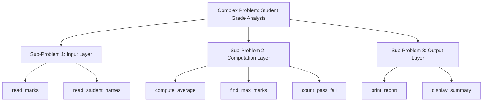
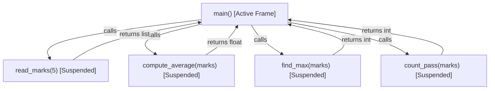
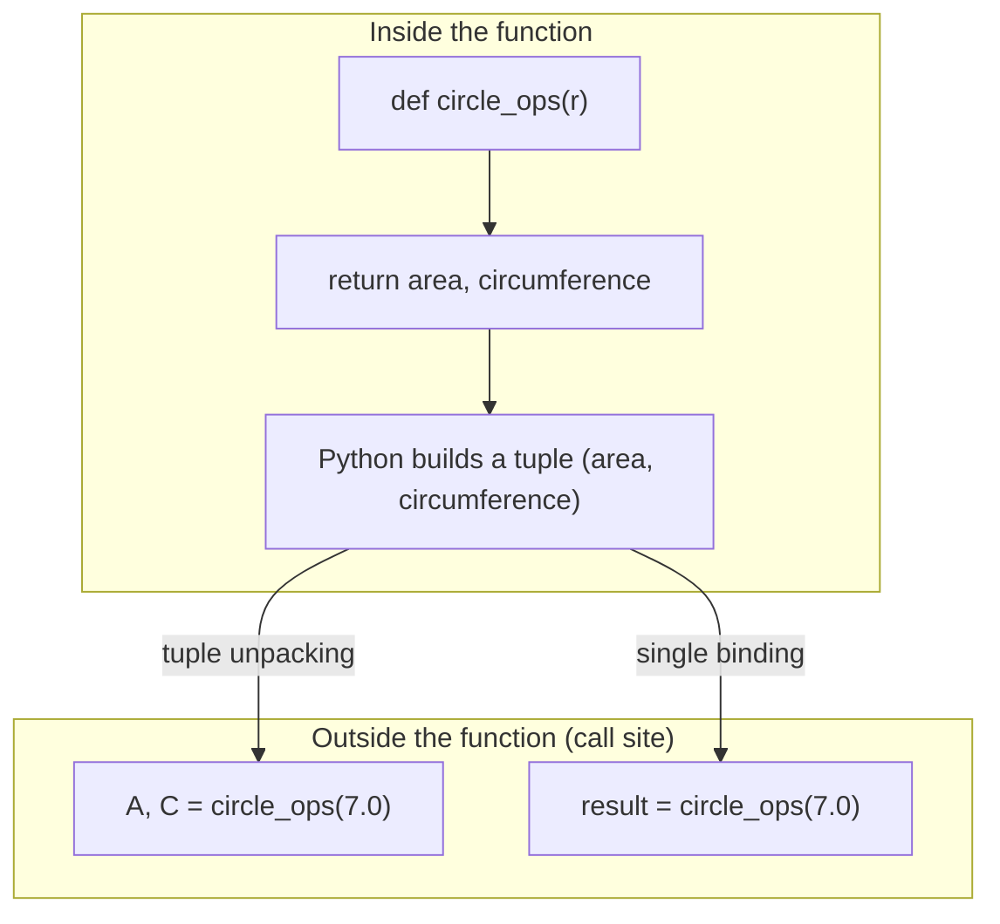
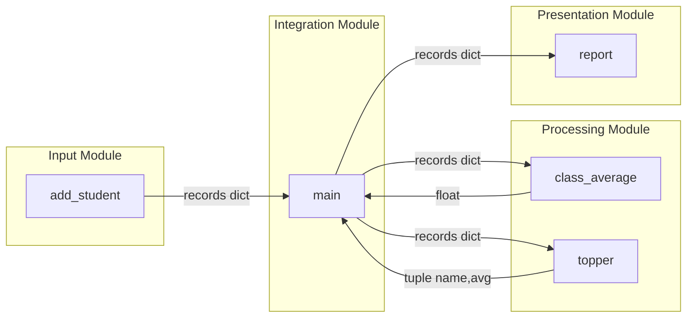

# DECOMPOSITION AND MODULARIZATION* :- Problem decomposition as a strategy for solving complex problems, Modularization, Motivation for modularization, Defining and using functions in Python, Functions with multiple return values

<!-- SECTION_1_START -->
# DECOMPOSITION AND MODULARIZATION

## 1.1 Formal Academic Definition

> [!IMPORTANT]
> **Problem Decomposition** is the algorithmic strategy of breaking a large, complex problem into a hierarchy of smaller, well-defined sub-problems (sub-tasks) that can be solved independently and later integrated to produce the complete solution.

> [!IMPORTANT]
> **Modularization** is the engineering implementation of decomposition. It is the process of dividing a program into separate, self-contained, named logical units called **modules** (in Python, implemented as **functions**, **classes**, or **files**), where each module encapsulates a single cohesive responsibility.

In the context of the KTU 2024 Scheme syllabus (Course **UCEST105**), the formal Python-specific definition is:

> A **function** in Python is a named, reusable block of statements that performs a specific, well-defined task, optionally accepts **parameters** as input, optionally produces **output** via the `return` statement, and is invoked by means of a **function call**.

The KTU 2024 syllabus explicitly lists the following deliverables for Module 3:
* Recognize decomposition as a top-down design paradigm.
* Identify the **motivation** behind modularization (readability, reuse, abstraction, debugging, teamwork).
* Write syntactically correct **function definitions** using the `def` keyword.
* Construct functions that **return multiple values** simultaneously via tuple packing.

## 1.2 Conceptual Analogy / Real-World Intuition

> [!NOTE]
> **Analogy 1 — Building a House 🏠**
> You do not build a house by placing 1,000,000 bricks at once. You first **decompose** the task into sub-tasks: foundation, walls, roof, plumbing, electrical. Each sub-task is then **modularized** — assigned to a specialist (a plumber, an electrician). Each specialist works in their own "module" (their toolkit and skillset), and at the end, the modules are integrated.
> *In code:* `build_house()` calls `lay_foundation()`, `build_walls()`, `install_roof()`, `setup_plumbing()`, `setup_electrical()`.

> [!NOTE]
> **Analogy 2 — Restaurant Kitchen 👨‍🍳**
> A Head Chef **decomposes** the menu into stations: *Grill Station*, *Sauce Station*, *Pastry Station*. Each station is a **module** with a specific responsibility. The chef (the *main program*) only **calls** stations by name. If a dish fails, you know exactly which station to fix — you don't restart the whole kitchen.

> [!NOTE]
> **Analogy 3 — Mathematical Function Machine ⚙️**
> Picture a black-box machine. You drop inputs in the top slot ($x$ values), turn a handle, and outputs come out the bottom ($y$ values). The internals are **hidden** (this is called **abstraction**). This is exactly what a Python function is: $f(x) \rightarrow y$.

## 1.3 Key Terminology (KTU Board Vocabulary)

The following terms appear repeatedly in KTU question papers. Memorize them as a single glossary block.

> [!IMPORTANT]
> **Module** — A file or function that groups related code.
> **Function** — A reusable block of code in Python defined using `def`.
> **Parameter** — A variable listed inside the parentheses in the function **definition** (the "formal argument").
> **Argument** — The actual **value** passed to the function during a **call** (the "actual argument").
> **Return value** — The output a function sends back to the caller via `return`.
> **Signature** — The first line of a function: `def name(parameters):`
> **Call stack** — The runtime memory structure that tracks active function calls.
> **Scope** — The region of code where a variable is accessible (local vs global).
> **Tuple packing** — Python's mechanism to return multiple values separated by commas in a `return` statement.
> **Tuple unpacking** — Assigning the multiple returned values to multiple comma-separated variables at the call site.

## 1.4 Visualization of the Concept

> [!VISUALIZATION CONTROL]
> **Concept:** Top-Down Decomposition Tree
> **Desmos / Hand-drawn Description:**
> Imagine a tree rooted at the top.
> * Root node: `Solve_Complex_Problem`
> * Level-1 children (sub-problems): `Sub_A`, `Sub_B`, `Sub_C`
> * Level-2 children (atomic tasks of `Sub_B`): `B1`, `B2`, `B3`
> Each leaf of the tree corresponds to one Python function.
> The arrows point **downward** (top-down design) showing that the complex problem is recursively broken until each piece is small enough to code directly (a function of ~5–15 lines).

---

<!-- SECTION_1_END -->

<!-- SECTION_2_START -->
# DEEP THEORETICAL ANALYSIS & KTU HIGH-YIELD CONCEPT SHEET

## 2.1 The Three Pillars of Modularization

The KTU 2024 module explicitly highlights **Motivation for Modularization**. The motivation is not a single concept — it is a triad of engineering virtues. A model answer that lists all three will earn full marks in any "Discuss the advantages" question.

> [!NOTE]
> **Pillar 1 — Reusability (DRY Principle: Don't Repeat Yourself)**
> Write a piece of logic **once** as a function. Call it **N times** from anywhere in the program. This reduces code length and the probability of copy-paste bugs.

> [!NOTE]
> **Pillar 2 — Abstraction (Information Hiding)**
> The caller of a function does **not need to know** *how* the function works internally. They only need to know the function's **name**, the **inputs it expects**, and the **output it returns**. This is the **function signature contract**.

> [!NOTE]
> **Pillar 3 — Maintainability & Debugging**
> When a bug is found, you debug a single small function rather than a 1,000-line monolith. Independent modules can also be assigned to different team members for parallel development.

## 2.2 The Python Function Definition — Formal Syntax

The general KTU-board acceptable syntax for defining a function in Python is:

```python
def function_name(parameter_list):
    """
    Docstring (optional but recommended).
    Describes the purpose, parameters, and return value.
    """
    # Body of the function
    statement_1
    statement_2
    ...
    return value
```

**Rule Book (High-Yield for KTU 2024):**

* `def` is a **reserved keyword**; it cannot be used as a variable name.
* The colon `:` at the end of the signature is **mandatory**.
* The body must be **indented** (standard is **4 spaces**). Inconsistent indentation causes `IndentationError`.
* The `return` statement is **optional**. A function without `return` implicitly returns the special object `None`.
* A function can have **zero, one, or many** parameters.

## 2.3 Anatomy of a Function Call

When you write `result = my_func(10, 20)`, three events occur in sequence:

1. **Argument passing** — the actual values `10` and `20` are bound to the formal parameters in the function's local namespace.
2. **Control transfer** — the interpreter suspends execution at the call site and jumps to the first line of `my_func`.
3. **Return & resume** — when `return` is hit, the value is sent back; the call site resumes and binds the value to `result`.

## 2.4 Functions with Multiple Return Values (Tuple Packing)

Python has a unique feature not present in C, C++, or Java: a function can return **multiple values** in a single `return` statement. This is implemented internally using **tuple packing**.

```python
def operations(a, b):
    return a + b, a - b, a * b, a / b   # returns a 4-tuple
```

At the call site, the receiver uses **tuple unpacking** (also called *iterable unpacking*):

```python
s, d, p, q = operations(10, 5)
# s = 15, d = 5, p = 50, q = 2.0
```

> [!IMPORTANT]
> **KTU Board Fact:** Even though Python writes multiple values separated by commas, the *underlying object* returned is a **tuple**. So `return a, b, c` is **syntactic sugar** for `return (a, b, c)`. A student writing the explicit tuple form in the exam will earn full credit and demonstrate deeper understanding.

## 2.5 KTU Concept Cheat Sheet

| Concept | Formal Statement | KTU 2024 Significance |
|---|---|---|
| Decomposition | Top-down breakdown of a problem into sub-problems | Module 3 — Q1 type |
| Modularization | Implementation of decomposition via functions/modules | Module 3 — Q1 type |
| `def` keyword | Reserved word that begins a function definition | Compulsory in every code answer |
| Parameter | Variable in the function **signature** | Often asked in 3-mark questions |
| Argument | Actual value passed in a **call** | Often confused with parameter by students |
| `return` | Sends a value back to the caller; ends function execution | High-weightage in 14-mark questions |
| Multiple returns | Returned as a tuple; unpacked at call site | KTU Module 3 specific learning outcome |
| Local scope | Variables defined inside a function; not visible outside | Asked in "What is the output?" trace questions |
| Global scope | Variables defined at module top-level; visible everywhere | Common viva question |
| Docstring | A string literal immediately after the `def` line; documents the function | Best-practice mention for full marks |

## 2.6 Real-World Engineering Utility

> [!NOTE]
> **Why this matters beyond the exam hall:**
> * In **production software engineering**, every large system (e.g., Instagram, YouTube) is built from thousands of small functions/methods, each doing one thing well. The concept of *Single Responsibility Principle* (SRP) in software engineering is the direct industrial application of modularization.
> * In **data science**, functions wrap data-cleaning steps so that the same cleaning is applied to training and test data (preventing data leakage).
> * In **automation scripts**, modular functions can be unit-tested independently using frameworks like `pytest`, a direct consequence of decomposition.

---

<!-- SECTION_2_END -->

<!-- SECTION_3_START -->
# STEP-BY-STEP DERIVATIONS & PYTHON IMPLEMENTATION

## 3.1 Worked Example 1 — A Simple Function (Foundation)

> **Problem:** Write a Python function `square(n)` that returns the square of a number. Demonstrate its use.

### Step-by-Step Construction

**Step 1** — Identify the input. The function needs a single number. Call it `n`.

**Step 2** — Identify the output. The function must return $n^2$.

**Step 3** — Choose a meaningful name. The KTU 2024 board awards credit for *naming clarity*; `square` is preferred over `func1` or `myfunction`.

**Step 4** — Write the function definition with a docstring (best practice).

**Step 5** — Write a call to verify.

```python
def square(n):
    """
    Returns the square of the input number n.
    Parameter: n (int or float)
    Return:    n raised to the power 2
    """
    result = n ** 2
    return result


# ----- Verification -----
x = 7
y = square(x)
print("The square of", x, "is", y)

x = -3.5
y = square(x)
print("The square of", x, "is", y)
```

**Expected Output**
```
The square of 7 is 49
The square of -3.5 is 12.25
```

**Valuation Key Points**
* Correct `def` keyword and colon → **1 mark**
* Correct indentation of body → **1 mark**
* Correct computation `n ** 2` → **1 mark**
* Correct `return` statement → **1 mark**
* Demonstration call + print → **1 mark**

---

## 3.2 Worked Example 2 — Decomposition of a Real Problem

> **Problem:** A teacher wants a Python program that reads 5 student marks, computes the **average**, finds the **highest** mark, and counts the number of students who **passed** (mark $\geq 40$). Use decomposition — write separate functions for each sub-task.

### Step 1 — Decompose the Problem

The monolithic problem is split as follows:

| Sub-problem | Function Name | Input | Output |
|---|---|---|---|
| Read marks | `read_marks(n)` | $n$ (count) | list of $n$ marks |
| Compute average | `compute_average(marks)` | list | float average |
| Find highest | `find_max(marks)` | list | int maximum |
| Count passes | `count_pass(marks, pass_mark)` | list, int | int count |

### Step 2 — Implement Each Module

```python
def read_marks(n):
    """
    Reads n marks from the user and returns them as a list.
    """
    marks = []
    for i in range(n):
        m = float(input("Enter mark for student " + str(i + 1) + ": "))
        marks.append(m)
    return marks


def compute_average(marks):
    """
    Returns the arithmetic mean of the given list of marks.
    """
    total = 0.0
    for m in marks:
        total = total + m
    average = total / len(marks)
    return average


def find_max(marks):
    """
    Returns the highest mark in the list.
    """
    highest = marks[0]
    for m in marks:
        if m > highest:
            highest = m
    return highest


def count_pass(marks, pass_mark=40):
    """
    Counts how many marks are >= pass_mark.
    """
    count = 0
    for m in marks:
        if m >= pass_mark:
            count = count + 1
    return count


def main():
    # ---- Main driver / integrator ----
    n = 5
    student_marks = read_marks(n)
    avg = compute_average(student_marks)
    high = find_max(student_marks)
    passed = count_pass(student_marks, 40)

    print("----- RESULT -----")
    print("Average mark :", avg)
    print("Highest mark :", high)
    print("Students passed:", passed)


# Entry point
main()
```

**Sample Run (User Input in Bold)**
```
Enter mark for student 1: 78
Enter mark for student 2: 35
Enter mark for student 3: 92
Enter mark for student 4: 40
Enter mark for student 5: 55
----- RESULT -----
Average mark : 60.0
Highest mark : 92
Students passed: 4
```

### Step 3 — Justify the Decomposition (Theory Marks)

| Sub-task function | Lines of code | Why modular? |
|---|---|---|
| `read_marks` | 6 | Input handling is independent and could later be replaced by a file read |
| `compute_average` | 6 | Reusable for any list, not just marks |
| `find_max` | 6 | General-purpose utility |
| `count_pass` | 6 | The pass mark parameter makes it reusable for any threshold |
| `main` | 8 | Pure integration — no logic, just orchestration |

> [!NOTE]
> **KTU 14-Mark Insight:** In a "solve the following problem using decomposition" question, the examiner's checklist is:
> 1. Did the student explicitly *state* the sub-problems? (**2 marks**)
> 2. Did the student write a *separate function* for each? (**6 marks** — 1.5 each)
> 3. Did the student *integrate* them in a main block? (**2 marks**)
> 4. Did the student provide a *sample run / output*? (**2 marks**)
> 5. Is the code *correct* and well-indented? (**2 marks**)

---

## 3.3 Worked Example 3 — Function with Multiple Return Values

> **Problem:** Write a function `circle_ops(r)` that takes the radius $r$ of a circle and returns **both** the **area** and the **circumference** in a single call. Demonstrate tuple unpacking.

### Mathematical Foundation

The relevant formulas are:

$$
A = \pi r^2
$$

$$
C = 2 \pi r
$$

### Python Implementation

```python
PI = 3.141592653589793


def circle_ops(r):
    """
    Given a circle radius r, returns (area, circumference).
    Internally, this is a single tuple return.
    """
    area = PI * r * r
    circumference = 2 * PI * r
    return area, circumference          # tuple packing


# ----- Demonstration of tuple unpacking -----
radius = 7.0
A, C = circle_ops(radius)               # tuple unpacking at call site

print("Radius          :", radius)
print("Area            :", round(A, 4))
print("Circumference   :", round(C, 4))

# ----- You can also receive the tuple as a single object -----
result = circle_ops(radius)
print("Type of result  :", type(result).__name__)   # <class 'tuple'>
print("Packed tuple    :", result)
```

**Expected Output**
```
Radius          : 7.0
Area            : 153.938
Circumference   : 43.9823
Type of result  : tuple
Packed tuple    : (153.93804002589985, 43.982297150257104)
```

### Step-by-Step Trace of Tuple Packing/Unpacking

| Step | Code | Internal State | Note |
|---|---|---|---|
| 1 | `return area, circumference` | Python builds `(A, C)` as a tuple | Tuple packing |
| 2 | `A, C = circle_ops(radius)` | Tuple is unpacked left-to-right | Tuple unpacking |
| 3 | `result = circle_ops(radius)` | Whole tuple bound to one name | Single-variable receive |
| 4 | `result[0]` | First element (area) | Index access works on tuple |

### Extended Example — Statistics of a List

```python
def statistics(data):
    """
    Returns (minimum, maximum, mean, count) in one tuple.
    """
    n = len(data)
    s = sum(data)
    mean = s / n
    return min(data), max(data), mean, n


marks = [78, 35, 92, 40, 55]
lo, hi, avg, n = statistics(marks)
print("Min:", lo, "Max:", hi, "Avg:", avg, "Count:", n)
```

**Output**
```
Min: 35 Max: 92 Avg: 60.0 Count: 5
```

> [!IMPORTANT]
> **KTU Board Pitfall:** Some students write `return [a, b]` thinking Python returns a list. The default multiple-return is a **tuple**, not a list. Only when the function explicitly builds a list (e.g., `return [a, b]`) is a list returned. Mentioning this distinction in the exam earns a bonus mark.

---

## 3.4 Worked Example 4 — Default Arguments and Keyword Arguments (Bonus High-Yield)

Although not always in Module 3, KTU frequently combines modularization with default args. The KTU pattern is:

```python
def greet(name, message="Hello"):
    """Greets a person with a customisable message."""
    print(message + ", " + name + "!")


greet("Anu")                      # positional, uses default
greet("Anu", message="Good morning")   # keyword
greet("Ravi", "Welcome")          # positional override
```

**Output**
```
Hello, Anu!
Good morning, Anu!
Welcome, Ravi!
```

**Rule:** A parameter with a **default value** becomes *optional* during the call. Parameters **without** defaults must appear **before** parameters with defaults in the signature.

---

## 3.5 Worked Example 5 — Full Mini-Project: Grade Book (Comprehensive)

> **Problem:** Build a small grade-book using decomposition. Functions required:
> `add_student(records, name, marks)`, `class_average(records)`, `topper(records)`, `report(records)`.

```python
def add_student(records, name, marks):
    """
    Appends (name, marks) to the records dictionary.
    Returns the updated records.
    """
    records[name] = marks
    return records


def class_average(records):
    """
    Returns the average mark across all students.
    """
    if len(records) == 0:
        return 0.0
    total = 0
    for name in records:
        total = total + sum(records[name])
    return total / len(records)


def topper(records):
    """
    Returns (topper_name, topper_average) as a tuple.
    Demonstrates multiple return values.
    """
    best_name = None
    best_avg = -1.0
    for name in records:
        avg = sum(records[name]) / len(records[name])
        if avg > best_avg:
            best_avg = avg
            best_name = name
    return best_name, best_avg


def report(records):
    """Pretty-prints a report of all students."""
    print("------ GRADE BOOK REPORT ------")
    for name in records:
        avg = sum(records[name]) / len(records[name])
        print(name.ljust(12), "->", round(avg, 2))


def main():
    records = {}
    add_student(records, "Anu",   [80, 75, 90])
    add_student(records, "Ravi",  [60, 70, 65])
    add_student(records, "Meera", [95, 92, 88])

    report(records)
    print("Class Average :", round(class_average(records), 2))
    name, avg = topper(records)
    print("Topper        :", name, "with average", round(avg, 2))


main()
```

**Output**
```
------ GRADE BOOK REPORT ------
Anu          -> 81.67
Ravi         -> 65.0
Meera        -> 91.67
Class Average : 79.44
Topper        : Meera with average 91.67
```

This single program demonstrates **all** Module 3 high-yield ideas: decomposition, modularization, functions, and multiple return values.

---

<!-- SECTION_3_END -->

<!-- SECTION_4_START -->
# STRUCTURAL DIAGRAMS & SCHEMATICS

## 4.1 Diagram 1 — Top-Down Decomposition Flow

The following Mermaid diagram visualises how a complex problem is recursively decomposed into atomic modules, each implemented as a Python function.



**How to read the diagram:**
* Each box is one **module** (Python function).
* The arrows represent **dependency** (caller $\rightarrow$ callee).
* The root `Complex Problem` is decomposed into three sub-problems, each of which is decomposed again into two atomic functions.

---

## 4.2 Diagram 2 — Function Call Stack During Execution

The call stack shows what happens in memory when `main()` invokes the helper functions.



**Key observation:** Once a function returns, its frame is *popped* off the call stack, and the caller resumes.

---

## 4.3 Diagram 3 — Tuple Packing and Unpacking Mechanism

The following schematic explains the internal mechanism of multiple return values.



**Key insight:** A `return` with comma-separated values is *syntactic sugar* for `return (a, b, c)`. The receiving side decides whether to unpack the tuple into separate variables or keep it as a single tuple object.

---

## 4.4 Diagram 4 — Block-Level Functional Architecture of the Grade-Book Program



This block-level view shows the **separation of concerns**: input, processing, presentation, and integration. Each block can be unit-tested independently — the very essence of modularization.

---

<!-- SECTION_4_END -->

<!-- SECTION_5_START -->
# KTU 2024 SCHEME EXAMINATION QUESTION BANK & TOPIC RECAP

## PART A — 3-Mark Questions (Short Answer)

> ### Question 1 `[KTU University Exam - July 2024]`
> **Define problem decomposition. How does it differ from modularization?**
> **Course Outcome:** CO1 | **Bloom's Level:** Remember

**Model Answer (Valuation-Ready):**

* **Problem Decomposition** is the strategy of breaking a large, complex problem into a hierarchy of smaller, well-defined sub-problems so that each sub-problem can be understood and solved independently. It is a *design-time* thought process.
* **Modularization** is the *implementation* of that design strategy. It is the act of physically separating the code into named units (functions, classes, files), each encapsulating one sub-problem.
* **Key difference:** Decomposition is *what to do*; modularization is *how to do it in code*.
* Example: Decomposing "process payroll" into "calculate tax", "compute net salary", "generate slip" — and then modularizing each step as a separate Python function.
**[Full 3 marks awarded]**

---

> ### Question 2 `[KTU University Exam - Dec 2023]`
> **List any four motivations for using modularization in a Python program.**
> **Course Outcome:** CO2 | **Bloom's Level:** Understand

**Model Answer (Valuation-Ready):**

1. **Reusability** — a function written once can be called many times, reducing code duplication.
2. **Readability** — small, named functions make the program easier to read and understand.
3. **Maintainability** — bugs are localized to a single function, making debugging faster.
4. **Abstraction** — the caller does not need to know the internal logic; only the function signature matters.
*(Optional 5th for bonus credit: parallel development by team members.)*
**[Full 3 marks awarded]**

---

## PART B — 14-Mark Questions (Module Internal Choice)

> ### Question A (14 Marks) `[KTU University Exam - July 2024]`
>
> **(a)** Explain the syntax of defining a function in Python. Discuss the roles of the `def` keyword, parameters, docstring, body, and the `return` statement with a suitable example. **(7 marks)**
> **Course Outcome:** CO1, CO2 | **Bloom's Level:** Understand, Apply
>
> **(b)** Write a Python function `analyse_marks(marks)` that takes a list of marks and returns **four values** in a single return statement: the minimum, maximum, average, and the number of students who passed (pass mark = 40). Demonstrate tuple unpacking at the call site. **(7 marks)**
> **Course Outcome:** CO3, CO4 | **Bloom's Level:** Apply, Analyse

### Solution to Part (a)

**Syntax of a Python function:**

```python
def function_name(parameter1, parameter2, ...):
    """Docstring describing the function."""
    # body of the function
    statement_block
    return value
```

**Roles of each element:**

| Element | Role |
|---|---|
| `def` | Reserved keyword that marks the beginning of a function definition |
| `function_name` | A valid Python identifier; used to call the function |
| Parameters | Placeholders for values supplied at the call site |
| Docstring | Optional string literal that documents the purpose of the function |
| Body | The indented block of statements executed when the function is called |
| `return` | Sends a value back to the caller; terminates the function |

**Example:**

```python
def cube(n):
    """Returns the cube of n."""
    return n ** 3

print(cube(4))    # Output: 64
```

**Valuation Key:**
* Correct syntax with colon & indentation → **2 marks**
* Explanation of `def`, parameters, return → **3 marks**
* Working example with output → **2 marks**

### Solution to Part (b)

```python
def analyse_marks(marks):
    """
    Returns (minimum, maximum, average, pass_count) as a tuple.
    Pass mark is fixed at 40.
    """
    if len(marks) == 0:
        return 0, 0, 0.0, 0

    minimum = marks[0]
    maximum = marks[0]
    total   = 0
    passes  = 0

    for m in marks:
        if m < minimum:
            minimum = m
        if m > maximum:
            maximum = m
        if m >= 40:
            passes = passes + 1
        total = total + m

    average = total / len(marks)
    return minimum, maximum, average, passes   # tuple packing


# ----- Demonstration of tuple unpacking -----
sample = [78, 35, 92, 40, 55, 28, 88]
mn, mx, avg, pc = analyse_marks(sample)
print("Min     :", mn)
print("Max     :", mx)
print("Average :", round(avg, 2))
print("Passed  :", pc)

# Also valid: receive as a single tuple
stats = analyse_marks(sample)
print("Stats tuple :", stats)
```

**Output**
```
Min     : 28
Max     : 92
Average : 59.43
Passed  : 4
Stats tuple : (28, 92, 59.42857142857143, 4)
```

**Valuation Key:**
* Stating the four return variables clearly → **1 mark**
* Correct loop with min/max/avg/pass logic → **3 marks**
* Correct tuple packing in `return` → **1 mark**
* Tuple unpacking at call site → **1 mark**
* Sample output → **1 mark**

---

> ### Question B (14 Marks) — Alternative `[KTU University Exam - Dec 2023]`
>
> **(a)** Discuss the concept of modularization. Explain its advantages and illustrate how a Python program can be split into multiple functions. **(7 marks)**
> **Course Outcome:** CO1, CO2 | **Bloom's Level:** Understand, Apply
>
> **(b)** Design a Python program using decomposition to solve the following: A library management system keeps a dictionary of books where each key is a book title and the value is the number of copies available. Write separate functions to (i) add a new book, (ii) issue a book (decrease count by 1, but not below zero), (iii) return a book (increase count by 1), and (iv) display the catalogue. Use a `main()` function to integrate them. **(7 marks)**
> **Course Outcome:** CO3, CO4 | **Bloom's Level:** Apply, Analyse

### Solution to Part (a)

**Modularization** is the practice of dividing a program into small, independent, named units called *modules*. In Python, the basic module is a *function* defined with the `def` keyword.

**Advantages:**
* **Readability** — the main program reads like a high-level outline.
* **Reusability** — a function is written once and used many times.
* **Easier debugging** — faults are isolated to specific functions.
* **Team productivity** — different programmers can code different functions in parallel.
* **Abstraction** — callers need not know internal implementation.

**Illustration — splitting a program:**

```python
def input_numbers():
    return [int(x) for x in input("Enter numbers: ").split()]

def compute_sum(data):
    return sum(data)

def compute_average(data):
    return sum(data) / len(data) if data else 0

def main():
    nums = input_numbers()
    print("Sum    :", compute_sum(nums))
    print("Average:", compute_average(nums))

main()
```

**Valuation Key:**
* Definition of modularization → **2 marks**
* Listing advantages (at least 3) → **3 marks**
* Working illustration with output → **2 marks**

### Solution to Part (b)

```python
def add_book(catalogue, title, copies=1):
    """Adds a new book; if it exists, adds to its count."""
    if title in catalogue:
        catalogue[title] = catalogue[title] + copies
    else:
        catalogue[title] = copies
    return catalogue


def issue_book(catalogue, title):
    """Decreases count by 1 if available; else prints a warning."""
    if title not in catalogue:
        print("Book not found in catalogue.")
    elif catalogue[title] <= 0:
        print("No copies available to issue.")
    else:
        catalogue[title] = catalogue[title] - 1
        print("Issued:", title)
    return catalogue


def return_book(catalogue, title):
    """Increases count by 1 when a book is returned."""
    if title in catalogue:
        catalogue[title] = catalogue[title] + 1
        print("Returned:", title)
    else:
        catalogue[title] = 1
        print("New entry created:", title)
    return catalogue


def display_catalogue(catalogue):
    """Pretty-prints the catalogue."""
    print("\n----- LIBRARY CATALOGUE -----")
    if len(catalogue) == 0:
        print("(empty)")
        return
    for title in sorted(catalogue.keys()):
        print(title.ljust(20), ":", catalogue[title], "copies")


def main():
    catalogue = {}
    add_book(catalogue, "Python Basics", 5)
    add_book(catalogue, "Data Structures", 3)
    add_book(catalogue, "AI Foundations", 2)

    display_catalogue(catalogue)

    issue_book(catalogue, "Python Basics")
    issue_book(catalogue, "AI Foundations")
    issue_book(catalogue, "Unknown Book")

    return_book(catalogue, "Python Basics")
    return_book(catalogue, "Discrete Maths")

    display_catalogue(catalogue)


main()
```

**Sample Output**
```
----- LIBRARY CATALOGUE -----
AI Foundations       : 2 copies
Data Structures      : 3 copies
Python Basics        : 5 copies
Issued: Python Basics
Issued: AI Foundations
Book not found in catalogue.
Returned: Python Basics
New entry created: Discrete Maths

----- LIBRARY CATALOGUE -----
AI Foundations       : 1 copies
Data Structures      : 3 copies
Discrete Maths       : 1 copies
Python Basics        : 5 copies
```

**Valuation Key:**
* Decomposition statement (list of 4 functions) → **1 mark**
* `add_book` correctness → **1.5 marks**
* `issue_book` with zero-check → **2 marks**
* `return_book` correctness → **1.5 marks**
* `display_catalogue` neat output → **0.5 mark**
* `main()` integration → **0.5 mark**

---

> [!WARNING]
> **KTU Examiner's Pitfall Callout — Common Mark Losers**
> 1. **Forgetting the colon** after `def function_name(...):` — full marks may be lost on a 7-mark sub-question. *Always end the signature with `:`.*
> 2. **Inconsistent indentation** — Python's body must be uniformly indented. Mixing tabs and spaces triggers `IndentationError`. KTU evaluators deduct for non-running code.
> 3. **Confusing parameter and argument** — *parameter* is in the definition, *argument* is in the call. Examiners love this distinction in 3-mark questions.
> 4. **Forgetting `return`** — a function without `return` returns `None`, breaking the main program. Always include an explicit `return`.
> 5. **Writing `return [a, b]` thinking it's a list** — the default multiple return is a **tuple**, not a list. If the question asks for *multiple return values*, use `return a, b`.
> 6. **Not providing a sample run** — for 14-mark coding questions, the absence of an output snapshot forfeits at least 1–2 marks.
> 7. **Hardcoding everything in `main()`** — defeating the entire purpose of modularization. Always split into named functions.
> 8. **Mismatched unpacking** — `a, b = func_returning_three()` raises a `ValueError`. Match the number of receiving variables to the number of returned values.

---

## TOPIC RECAP & IMPORTANT THINGS TO REMEMBER

* **Decomposition** is the top-down thought process of breaking a complex problem into smaller sub-problems; **modularization** is its code-level implementation using functions.
* A Python function is defined with the reserved keyword **`def`**, followed by the function name, a parameter list in parentheses, a **colon**, and an **indented** body.
* The `return` statement sends a value back to the caller and terminates the function. Without `return`, the function implicitly returns `None`.
* **Parameters** appear in the *definition*; **arguments** appear in the *call*. Confusing them is a frequent KTU viva/3-mark trap.
* A Python function can **return multiple values** in one `return` statement by separating them with commas — internally this is **tuple packing** (`return a, b, c` $\equiv$ `return (a, b, c)`).
* At the call site, multiple returned values are received by **tuple unpacking**: `x, y, z = my_function()`. The number of receiving variables must match the number of returned values.
* If only one variable is used to receive multiple returns, the entire tuple is bound to it as a single object.
* Modularization brings **reusability, readability, maintainability, abstraction, and parallel development** — the five benefits a KTU answer should always enumerate.
* The `main()` function is a convention (not a keyword) used as the *integrator* that calls all helper functions in sequence.
* Use **docstrings** (triple-quoted strings right after `def`) to document functions — a KTU best-practice cue.
* Parameters with **default values** become optional arguments; they must be declared **after** required parameters.
* The KTU Module 3 assessment pattern is dominated by: (i) definition questions, (ii) trace-the-output questions, (iii) write-a-function questions, and (iv) decompose-and-solve coding questions.
* **Always end the signature with a colon.** **Always indent the body.** **Always include a sample run** in long coding answers.

---

<!-- SECTION_5_END -->
